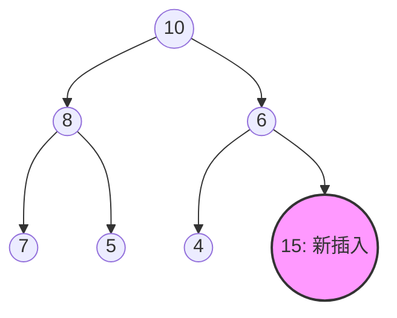
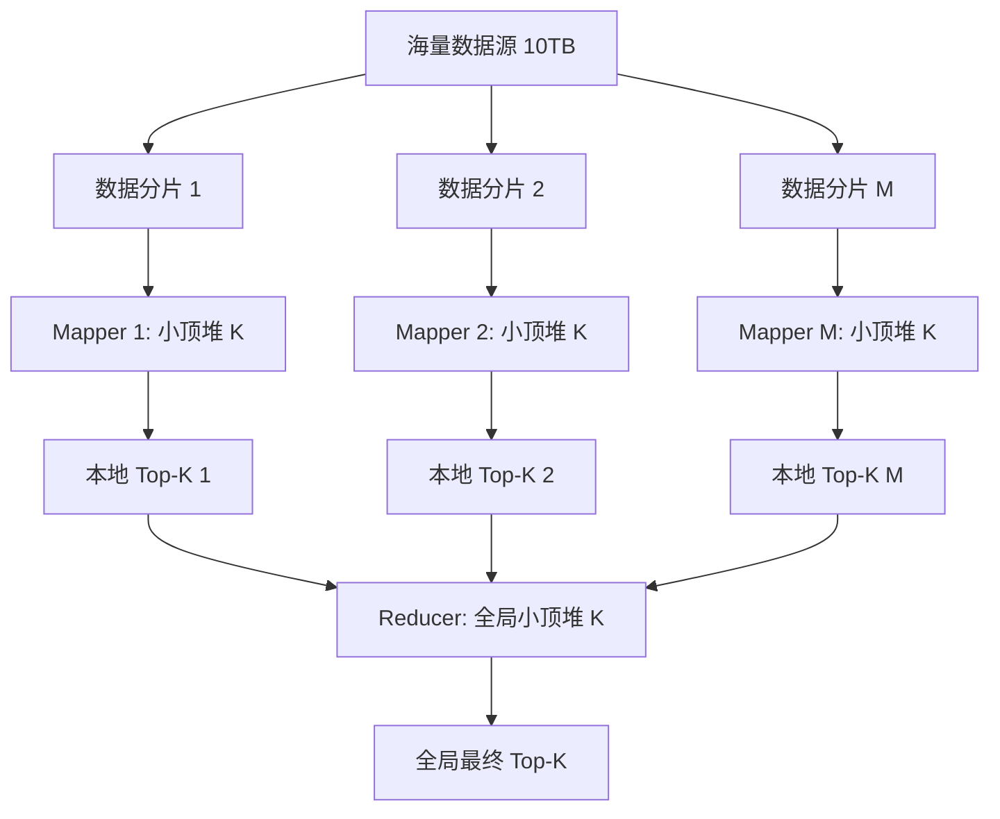

# 1.3.1.7 堆

## 0. 导论：动态极值维护与优先级调度演进

在计算机科学与系统软件设计中，数据集合的动态管理是一项基础且关键的任务。通常，我们需要在不断变化的数据流中，快速获取、删除其中的极值元素（如最大值或最小值），并支持高效地插入新元素。对于这种“动态极值维护”需求，传统的线性数据结构（如无序数组、有序数组、链表）或平衡树结构（如红黑树、AVL 树）在效率、空间开销或实现复杂度上都存在特定的物理与逻辑局限：

*   **无序数组**：插入操作虽然是 $O(1)$ 的，但查询和删除极值需要遍历整个数组，时间复杂度为 $O(n)$。
*   **有序数组**：查询极值只需 $O(1)$，但插入和删除元素需要移动大量后续数据以维持顺序，最坏时间复杂度为 $O(n)$。
*   **链表**：面临与数组类似的权衡，且具有额外的指针开销与极差的 CPU 缓存局部性（Cache Locality）。
*   **平衡二叉搜索树（BBST）**：虽然插入、删除和查询操作的复杂度均为稳定的 $O(\log n)$，但其设计目标是维护数据集合的“全序关系”（Total Order）。为了在任何时候都能以 $O(\log n)$ 的复杂度检索任意键值，BBST 必须维护极其严苛的平衡条件，涉及复杂的红黑着色、高度旋转等操作。同时，每个节点必须存储左/右子节点指针、父节点指针以及平衡因子或颜色元数据，带来了极大的物理空间开销。

在许多实际的计算机系统场景中，如操作系统进程调度（依据优先级动态选择下一个执行的进程）、网络数据包物理转发调度（依据服务质量 QoS 优先级排序）、图算法（如 Dijkstra 最短路径算法、Prim 最小生成树算法中动态选择最近的顶点），系统并不需要维护所有元素之间的全序关系，而仅仅需要：

1.  能够快速获取当前的极值元素。
2.  支持动态插入新元素，并能自动调整结构。
3.  允许高效地删除当前的极值元素。

堆（Heap）正是为了完美契合这一需求而设计的偏序（Partial Order）数据结构。它放弃了对所有元素之间相对顺序的严格维护，仅保证父子节点之间的相对大小关系。这种“低约束性”使得堆能够在一块连续的内存空间中，以无指针的紧凑形式（隐式数组表示）存储，并在插入和删除极值操作上达到 $O(\log n)$ 的优异性能，建堆更可实现 $O(n)$ 的线性时间复杂度。堆也因此成为实现“优先队列”（Priority Queue）的最主流、最高效的底层数据结构。

---

## 1. 堆的核心定义与数学堆序性质

### 1.1 完全二叉树的逻辑与物理结构

要严谨地定义堆，首先必须明确其逻辑载体——完全二叉树（Complete Binary Tree）。

在图论与数据结构中，一棵深度为 $d$ 的二叉树，如果其第 $0$ 层至第 $d-1$ 层都被完全填满（即每一层的节点数都达到最大可能值），且最后一层（第 $d$ 层）的节点都连续集中在左侧，则称其为完全二叉树。

完全二叉树具有以下关键的数学性质，这些性质直接决定了堆的高效寻址与空间紧凑性：

#### 1. 节点数与高度的关系
设完全二叉树的节点总数为 $n$，其高度（定义为从根节点到最深叶子节点的边数）为 $H$。根据二叉树的几何性质，高度为 $H$ 的完全二叉树，其节点数 $n$ 必须满足：
$$2^H \le n \le 2^{H+1} - 1$$
由此可得，高度 $H$ 与节点数 $n$ 的关系为：
$$H = \lfloor \log_2 n \rfloor$$
这意味着，完全二叉树的高度被严格限制在对数级别。从根节点到任何叶子节点的路径长度最大不会超过 $\lfloor \log_2 n \rfloor$。这一物理约束为堆操作的对数级时间复杂度奠定了坚实的几何基础。

#### 2. 叶子节点与非叶子节点的分布规律
在一棵包含 $n$ 个节点的完全二叉树中（采用 0 索引），最后一个节点的索引为 $n-1$。根据后文推导的父节点寻址公式，最后一个节点的父节点索引为：
$$p_{last} = \lfloor \frac{n - 2}{2} \rfloor$$
这表明，索引从 $p_{last} + 1$ 开始，直到 $n-1$ 的所有节点，都没有任何子节点，即它们全部是叶子节点。反之，索引从 $0$ 开始，直到 $\lfloor \frac{n - 2}{2} \rfloor$ 的节点，都是拥有至少一个子节点的非叶子节点。
因此，非叶子节点的总数为：
$$N_{non-leaf} = \lfloor \frac{n}{2} \rfloor$$
叶子节点的总数为：
$$N_{leaf} = \lceil \frac{n}{2} \rceil$$
这一规律在后续 Floyd 建堆算法的复杂度推导中起到至关重要的作用。

### 1.2 堆序性质与分类

堆是满足“堆序性质”（Heap-Order Property）的完全二叉树。根据堆序性质的不同，堆主要分为两大类：大顶堆（Max Heap）与小顶堆（Min Heap）。

#### 1.2.1 大顶堆（Max Heap）的数学表述
在大顶堆中，任意节点的值都大于或等于其子节点的值。更严谨地，设完全二叉树的节点集合为 $V$，除根节点外的任意节点 $i \in V$，其父节点为 $parent(i)$，节点对应的键值（Key）函数为 $key(v)$。大顶堆必须满足如下不等式：
$$\forall i \in V \setminus \{root\}, \quad key(parent(i)) \ge key(i)$$
根据数学归纳法，上述局部性质可以推广到全局：在大顶堆中，以任意节点 $r$ 为根的子树，其所有节点的值都小于或等于根节点 $r$ 的值。因此，整个大顶堆的根节点必然包含该堆中所有元素的最大值。

#### 1.2.2 小顶堆（Min Heap）的数学表述
在小顶堆中，任意节点的值都小于或等于其子节点的值。严谨的数学表述为：
$$\forall i \in V \setminus \{root\}, \quad key(parent(i)) \le key(i)$$
同理，以任意节点 $r$ 为根的子树，其所有节点的值都大于或等于根节点 $r$ 的值。因此，整个小顶堆的根节点必然包含该堆中所有元素的最小值。

### 1.3 堆与二叉搜索树（BST）的本质区别与设计权衡

许多开发者容易将二叉堆与二叉搜索树（BST）混淆，虽然二者都是树状结构，但在设计哲学、序关系约束以及物理实现上有着本质的差异：

| 特性 | 二叉堆 (Binary Heap) | 平衡二叉搜索树 (如 AVL, 红黑树) |
| :--- | :--- | :--- |
| **关系约束** | 偏序关系（仅约束父子相对大小，左/右子树无序） | 全序关系（左子树 < 根节点 < 右子树） |
| **物理存储** | 隐式数组（连续内存，零指针开销） | 显式链式结构（零散内存，高指针开销） |
| **极值获取** | $O(1)$ （直接读取数组首元素） | $O(\log n)$ （需沿左/右子树单向检索至边界） |
| **任意元素检索**| $O(n)$ （无序性质，必须遍历全堆） | $O(\log n)$ （利用全序关系进行二分检索） |
| **插入/删除极值**| $O(\log n)$ （伴随上滤/下滤调整） | $O(\log n)$ （伴随复杂的重新平衡与旋转） |
| **建树复杂度** | $O(n)$ （Floyd 算法自底向上逐步下滤） | $O(n \log n)$ （必须逐个插入并维持全序） |
| **缓存局部性** | 极佳（空间连续，适合现代 CPU 预取机制）| 较差（内存地址离散，高频 Cache Miss） |

通过对比可以看出，二叉堆通过放弃全序关系，换取了极佳的极值访问效率（$O(1)$）、原地建堆的高效性（$O(n)$）以及极致的空间效率（零指针开销）。它不适合用于高频的任意键值检索操作，但在极值维护和优先级调度场景下，其性能和空间效率是二叉搜索树无法企及的。

---

## 2. 堆的隐式数组表示与寻址公式推导

### 2.1 数组隐式存储的原理与优势

传统的树状数据结构通常使用链式表示法（Explicit Representation），即每个节点包含一个数据域和若干个指向子节点的指针。对于普通的二叉树，节点定义通常如下：

```cpp
struct TreeNode {
    T value;
    TreeNode* left;
    TreeNode* right;
};
```

在 64 位计算机系统上，一个指针占用 8 字节。对于每个节点，仅指针本身就占用了 16 字节的物理空间。如果数据域 `T` 为 4 字节的整型（`int`），那么指针开销占比高达 $80\%$。更为严重的是，频繁的 `new` 或 `malloc` 操作会导致这些节点散落在物理内存的各个角落，产生大量的内存碎片，并且破坏了 CPU 的缓存局部性。

由于堆是一棵完全二叉树，其结构具有高度的规则性。第 $0$ 层有 1 个节点，第 $1$ 层有 2 个节点，第 $2$ 层有 4 个节点……除最后一层外，每一层都是满的，且最后一层的节点从左向右紧密排列。这种天然的紧凑性使得我们可以完全摒弃显式指针，将节点按照层序遍历的顺序，依次紧密存放在一个连续的数组中。这种存储方式称为“隐式表示法”（Implicit Representation）。

在隐式表示法中，树的拓扑结构被隐含在数组的索引关系中。只要给定一个节点的数组索引，就可以通过简单的代数计算，在 $O(1)$ 时间内精确计算出其父节点、左子节点和右子节点的数组索引。

### 2.2 节点寻址公式的严谨推导

根据数组起始索引的不同，寻址公式有两种表述形式：0-indexed（从 0 开始）和 1-indexed（从 1 开始）。以下将分别对其进行推导与证明。

#### 2.2.1 0-based Indexing（0-indexed）寻址公式

假设树的根节点存放在数组的索引 $0$ 处。
对于任意一个位于索引 $i$ 的节点：
*   **左子节点索引**：$left(i) = 2i + 1$
*   **右子节点索引**：$right(i) = 2i + 2$
*   **父节点索引**：$parent(i) = \lfloor \frac{i - 1}{2} \rfloor$

##### 数学归纳法证明
1.  **奠基（Base Case）**：
    对于根节点 $i = 0$：
    *   其左子节点在完全二叉树的第 1 层第 1 个位置，索引为 1。公式计算：$2(0) + 1 = 1$，契合。
    *   其右子节点在第 1 层第 2 个位置，索引为 2。公式计算：$2(0) + 2 = 2$，契合。
    *   父节点计算：由于根节点没有父节点，带入公式 $\lfloor (0 - 1)/2 \rfloor = \lfloor -0.5 \rfloor = -1$，索引为负数，可作为无父节点的判定边界，契合。

2.  **归纳假设（Inductive Hypothesis）**：
    假设对于第 $k$ 层的某个节点，其索引为 $i$，公式成立。即该节点的左子节点索引为 $2i+1$，右子节点为 $2i+2$。
    我们来推导第 $k$ 层中紧随其后的下一个节点（索引为 $i+1$）的子节点情况。
    在完全二叉树的物理布局中，节点 $i$ 的右子节点（索引为 $2i+2$）和节点 $i+1$ 的左子节点在逻辑上是紧邻的。
    因此，节点 $i+1$ 的左子节点索引必然是节点 $i$ 的右子节点索引加 1：
    $$left(i+1) = right(i) + 1 = (2i + 2) + 1 = 2i + 3 = 2(i+1) + 1$$
    这与公式 $2(i+1)+1$ 完全一致。
    同理，节点 $i+1$ 的右子节点索引是其左子节点索引加 1：
    $$right(i+1) = left(i+1) + 1 = (2(i+1) + 1) + 1 = 2(i+1) + 2$$
    这与公式 $2(i+1)+2$ 完全一致。
    通过数学归纳法，对于任意非负整数索引 $i$，左、右子节点的寻址公式均成立。

3.  **父节点寻址公式的求逆与向下取整证明**：
    我们由子节点索引反推父节点索引。若已知一个子节点索引为 $c$：
    *   **情况一**：$c$ 是某节点的左子节点。根据公式，有 $c = 2p + 1$（其中 $p$ 为父节点索引）。
        变形得：$p = \frac{c - 1}{2}$。由于 $p$ 必为整数，且 $c$ 为奇数，故 $c-1$ 为偶数，$\frac{c-1}{2}$ 可以整除。
        此时，$\lfloor \frac{c - 1}{2} \rfloor = \frac{c - 1}{2} = p$。
    *   **情况二**：$c$ 是某节点的右子节点。根据公式，有 $c = 2p + 2$。
        变形得：$p = \frac{c - 2}{2} = \frac{c - 1}{2} - 0.5$。
        因为 $c$ 为偶数，所以 $c-1$ 为奇数，$\frac{c-1}{2}$ 的结果带有 $0.5$ 的小数部分。
        对其向下取整：
        $$\lfloor \frac{c - 1}{2} \rfloor = \lfloor p + 0.5 \rfloor - 0.5 \text{ 的调整} = p$$
        （例如，若 $p = 1$，则右子节点 $c = 4$，代入公式 $\lfloor (4-1)/2 \rfloor = \lfloor 1.5 \rfloor = 1 = p$）。
    
    综上所述，无论子节点 $c$ 是左子节点还是右子节点，其父节点索引均可统一表示为：
    $$parent(c) = \lfloor \frac{c - 1}{2} \rfloor$$
    在大多数现代编程语言中，整型除法自动执行向下取整，因此在代码中可以直接写为 `(c - 1) / 2`。

#### 2.2.2 1-based Indexing（1-indexed）寻址公式

假设将数组的索引 $0$ 空置，而将根节点存放在索引 $1$ 处。
对于任意位于索引 $i$ 的节点：
*   **左子节点索引**：$left(i) = 2i$
*   **右子节点索引**：$right(i) = 2i + 1$
*   **父节点索引**：$parent(i) = \lfloor \frac{i}{2} \rfloor$

##### 1-indexed 的位运算优化优势
在计算机底层，1-indexed 的寻址公式在二进制位运算下展现出极高的效率：
*   左子节点：$2i$ 可以直接写作 `i << 1`（左移一位）。
*   右子节点：$2i + 1$ 可以直接写作 `(i << 1) | 1`（左移一位后最低位置 1）。
*   父节点：$\lfloor i/2 \rfloor$ 可以直接写作 `i >> 1`（右移一位）。

虽然现代编译器在优化阶段会自动将常数 2 的乘除法转换为位移操作，但在手写汇编或极度追求无编译器优化依赖的裸机开发中，1-indexed 的位移寻址依然具有独特的魅力。不过，由于现代高级语言的数组默认从 0 开始索引，为了避免物理数组索引为 0 处的内存浪费，在工业界实践中，**0-indexed** 占据了绝对的主导地位。

### 2.3 数组隐式存储的局限性

隐式存储虽然高效，但其基础是“完全二叉树”。对于非完全二叉树，如退化为链表的单支树，若强制采用数组存储，会导致严重的内存稀疏问题。例如，深度为 $H$ 的单支树，其实际节点数仅为 $H+1$，但若按照完全二叉树的寻址公式，其最深叶子节点的数组索引可达 $2^{H} - 1$。为了容纳该节点，数组必须分配 $2^H$ 大小的空间，空间利用率仅为 $\frac{H+1}{2^H}$，呈指数级衰减。因此，隐式数组存储是且仅是完全二叉树的特权。

### 2.4 动态扩容策略与均摊分析

由于数组的物理空间在初始化时是固定的，当向堆中不断插入元素导致超出原定容量时，必须进行动态扩容（Dynamic Resizing）。扩容通常采用几何级数（如 2 倍或 1.5 倍）的增长策略。假设当前容量为 $C$，当检测到堆大小 $n == C$ 时，分配一个容量为 $2C$ 的新数组，将原数组的 $n$ 个元素复制到新数组中，并释放旧数组。

虽然单次扩容操作的复杂度为 $O(n)$，但其均摊复杂度（Amortized Complexity）仍然为 $O(1)$。

##### 均摊分析的势能法证明
定义势函数（Potential Function） $\Phi$ 为：
$$\Phi(T) = 2n - C$$
其中 $n$ 为当前堆中的元素个数，$C$ 为当前数组的物理容量。
由于完全二叉树在扩容前必须满足 $n \ge C/2$（通常在容量过半或满载时触发，这里假定扩容临界点为 $n=C$），我们可以观察到：
1.  初始状态下，$n=0, C=0 \implies \Phi(T_0) = 0$。在任意时刻，由于 $n \ge C/2$（扩容后立即有 $C=2n \implies \Phi = 0$，随后 $n$ 增加，$2n \ge C$），势函数 $\Phi(T) \ge 0$ 恒成立。
2.  对于一次普通的插入操作（未触发扩容）：
    其实际代价 $c_i = O(1)$（这里暂不考虑堆调整的对数级开销，仅考量数组写入开销）。
    势能变化量为：
    $$\Delta \Phi = \Phi(T_i) - \Phi(T_{i-1}) = (2(n+1) - C) - (2n - C) = 2$$
    均摊代价为：
    $$\hat{c}_i = c_i + \Delta \Phi = O(1) + 2 = O(1)$$
3.  对于一次触发扩容的插入操作：
    此时旧堆元素数为 $n$，容量 $C = n$。扩容需要申请 $2n$ 的空间并复制 $n$ 个元素。
    其实际代价为 $c_i = n + O(1)$（复制 $n$ 个元素加上写入新元素）。
    扩容后，新容量 $C' = 2n$，元素数变为 $n+1$。
    新势能为：
    $$\Phi(T_i) = 2(n+1) - 2n = 2$$
    旧势能（扩容前瞬间）为：
    $$\Phi(T_{i-1}) = 2n - n = n$$
    势能变化量为：
    $$\Delta \Phi = \Phi(T_i) - \Phi(T_{i-1}) = 2 - n$$
    均摊代价为：
    $$\hat{c}_i = c_i + \Delta \Phi = (n + O(1)) + (2 - n) = O(1) + 2 = O(1)$$

综上，无论是否触发扩容，每次插入的均摊空间分配与数据拷贝开销都被完美摊还为常数 $O(1)$。

---

## 3. 堆的核心操作与时间复杂度推导

二叉堆主要通过两个核心底层的调整算法来维持堆序性质：**上滤（Sift Up）** 与 **下滤（Sift Down）**。所有的上层操作（如插入元素、删除极值、修改优先级）都是基于这两个基础算法构建的。

### 3.1 上滤（Sift Up / Heapify Up）算法

#### 3.1.1 触发场景与物理机制
当向堆中插入一个新元素时，为了保持完全二叉树的物理结构，新元素必须被放置在当前树的最后一个位置（即数组索引为 $n$ 的位置，假定插入前堆大小为 $n$）。
然而，新插入元素的键值可能会违反堆序性质（例如，在大顶堆中，新加入的子节点值大于其父节点的值）。此时，需要将该节点沿着其祖先路径向上移动，这一调整过程被称为**上滤（Sift Up）**。

#### 3.1.2 算法执行流程与双指针迭代
以大顶堆为例，上滤的物理过程如下：
1.  设定当前调整节点的索引为 $curr$（初始为新插入的尾部索引 $n$）。
2.  计算其父节点索引 $parent = \lfloor (curr - 1)/2 \rfloor$。
3.  若 $curr > 0$ 且 $key(curr) > key(parent)$：
    *   交换节点 $curr$ 与 $parent$ 的键值。
    *   更新当前索引 $curr \leftarrow parent$。
    *   重复步骤 2。
4.  若 $curr == 0$（已到达根节点）或 $key(curr) \le key(parent)$，说明堆序性质已在全局恢复，算法终止。



如上图所示，当向大顶堆中插入元素 15 时，它首先被放置在尾部（作为 6 的右子节点）。由于 $15 > 6$，违反堆序，触发上滤，15 与 6 交换位置；随后 15 成为 10 的右子节点，由于 $15 > 10$，再次与 10 交换，最终 15 成为根节点，调整结束。

#### 3.1.3 通用语言实现代码 (C++)
以下展示上滤操作的 C++ 核心代码。为了减少频繁交换带来的不必要内存写操作，通常可以采用“空穴（Hole）”单向覆盖的优化策略：

```cpp
// 大顶堆上滤优化实现
void siftUp(std::vector<int>& heap, int index) {
    int target = heap[index]; // 暂存待上滤的目标值（“空穴”的值）
    while (index > 0) {
        int parent = (index - 1) / 2;
        if (heap[parent] >= target) {
            break; // 满足大顶堆性质，停止
        }
        heap[index] = heap[parent]; // 将父节点的值下拉到当前空穴位置
        index = parent;             // 空穴向上移动
    }
    heap[index] = target; // 将目标值填入最终的空穴中
}
```

常规写法中，每次循环需要 3 次赋值来完成 `swap`。优化后的“空穴”算法在循环体内仅需 1 次赋值（`heap[index] = heap[parent]`），只在退出循环后执行一次最终覆盖。这一微小的工程细节在海量数据高频插入时能带来显著的性能提升。

#### 3.1.4 复杂度分析
在高度为 $h = \lfloor \log_2 n \rfloor$ 的完全二叉树中，上滤路径的最大长度等于树的高度。因此，在最坏情况下（新插入的元素是全局最大值，需要从最底层叶子一路爬升至根节点），比较和交换的次数为 $h$。
所以，上滤操作的最坏时间复杂度为：
$$T_{siftUp}(n) = O(\log n)$$
平均情况下，对于一个随机分布的堆，新插入元素有很大的概率落在底层（因为底层的节点数占了绝大多数），因此平均上滤的层数是一个很小的常数，平均时间复杂度为 $O(1)$。

---

### 3.2 下滤（Sift Down / Heapify Down）算法

#### 3.2.1 触发场景与物理机制
当删除堆顶元素（获取极值）时，根节点被空出。为了不破坏完全二叉树的物理紧凑性，不能直接将根节点之后的元素依次前移（这会导致 $O(n)$ 的重组开销）。
标准的做法是：
1.  将堆尾的最后一个元素（索引为 $n-1$）复制到堆顶（索引为 $0$）。
2.  将堆的有效大小减 1。
3.  此时，新的堆顶元素极有可能破坏了堆序性质（因为原本位于底层的叶子节点值通常较小）。
4.  必须将该元素沿着子节点路径向下移动，直到其落入满足堆序的正确位置。这一调整过程被称为**下滤（Sift Down）**。

#### 3.2.2 算法执行流程与双子节点对比细节
当下滤开始时，我们必须特别注意一个关键的工程细节：**父节点应该与哪一个子节点进行对比和交换？**

在大顶堆中，若父节点的值小于子节点，我们必须选择**左、右子节点中值较大的那一个**与父节点进行交换。

##### 逻辑证明
假设父节点为 $P$，其左、右子节点分别为 $L$ 与 $R$。
如果 $key(L) > key(R)$ 且 $key(L) > key(P)$。
若我们错误地将 $P$ 与较小的子节点 $R$ 交换，交换后，原 $R$ 的位置变成了 $P$，而原 $P$ 的位置变成了 $R$。此时根节点位置为 $R$，其左子节点依然是 $L$。
因为 $key(L) > key(R)$，所以根节点 $R$ 依然小于其左子节点 $L$，仍然违反大顶堆的性质。
相反，如果我们选择与较大的子节点 $L$ 交换，交换后，原 $L$ 的位置变为 $P$，根节点变为 $L$。此时：
*   根节点为 $key(L)$，其左右子节点分别为 $key(P)$ 与 $key(R)$。由于先前判定有 $key(L) > key(R)$ 且 $key(L) > key(P)$，因此新的根节点大于其所有的子节点，局部堆序性得以完美恢复。

因此，下滤过程中，每次都必须精准定位“较优的子节点”（大顶堆选最大者，小顶堆选最小者）来进行交换。

#### 3.2.3 通用语言实现代码 (C++)

```cpp
// 大顶堆下滤优化实现
void siftDown(std::vector<int>& heap, int index, int heapSize) {
    int target = heap[index]; // 暂存待下滤的堆顶目标值（空穴）
    int half = heapSize / 2;  // 最后一个非叶子节点的索引上限（用于循环判定）
    
    // 只要当前节点不是叶子节点，就继续向下过滤
    while (index < half) {
        int leftChild = 2 * index + 1;
        int rightChild = leftChild + 1;
        int bestChild = leftChild; // 默认左子节点为较优者
        
        // 若右子节点存在，且右子节点值大于左子节点值，则较优者更新为右子节点
        if (rightChild < heapSize && heap[rightChild] > heap[leftChild]) {
            bestChild = rightChild;
        }
        
        // 如果目标值已经大于或等于最优秀的子节点，说明已满足堆序，退出
        if (target >= heap[bestChild]) {
            break;
        }
        
        // 将较优子节点的值拉上来填补当前空穴
        heap[index] = heap[bestChild];
        index = bestChild; // 空穴向下移动
    }
    heap[index] = target; // 将目标值归位
}
```

#### 3.2.4 复杂度分析
与上滤类似，下滤在最坏情况下需要从根节点一路下滤到最深处的叶子节点。移动路径的最大长度等于树的高度 $H = \lfloor \log_2 n \rfloor$。在每一层调整中，我们需要进行两次比较（一次在左右子节点之间挑选最优者，一次在最优子节点与父节点之间判定是否交换）。
因此，最坏时间复杂度为：
$$T_{siftDown}(n) = O(\log n)$$

---

### 3.3 建堆（Build Heap）算法及优化

建堆是指将一个包含 $n$ 个元素的任意无序数组，调整为一个满足堆序性质的完全二叉树。实现建堆有两种截然不同的算法进路：自顶向下建堆与自底向上建堆。它们的算法效率和常数项开销有着天壤之别。

#### 3.3.1 进路一：自顶向下建堆（Incremental Insertion）
该方法最为直观。我们从一个空堆开始，视数组中的第一个元素为堆的根节点。随后，从索引 $1$ 到 $n-1$ 依次将元素“插入”堆中，每次插入新元素都将其放置在堆尾，并调用 `siftUp` 算法进行向上调整。

##### 复杂度推导
在插入第 $i$ 个元素时，当前树的高度为 $\lfloor \log_2 i \rfloor$，最坏需要进行 $\lfloor \log_2 i \rfloor$ 次比较与调整。
总时间复杂度为：
$$T_{down}(n) = \sum_{i=1}^{n} \log_2 i = \log_2(n!) = O(n \log n)$$
根据斯特林公式（Stirling's Approximation），$\ln(n!) \approx n \ln n - n$，自顶向下建堆的复杂度在最坏和平均情况下都是 $O(n \log n)$。

#### 3.3.2 进路二：自底向上建堆（Floyd 建堆算法）
自底向上建堆是由计算机科学家 Robert W. Floyd 于 1964 年提出的一种高效建堆方法。
该算法的核心思想是：直接将整个无序数组视为一棵完全二叉树，然后自底向上地对所有非叶子节点调用 `siftDown` 调整。

具体步骤如下：
1.  确定最后一个非叶子节点的索引：根据前文推导，若数组大小为 $n$，则最后一个非叶子节点的索引为：
    $$start = \lfloor \frac{n - 2}{2} \rfloor$$
2.  循环控制：从索引 $start$ 开始，逆序向前遍历到根节点 $0$。对于遍历到的每一个节点 $i$，均调用 `siftDown(i)` 操作。

##### 为什么自底向上是正确的？
在自底向上的过程中，当准备对某个节点 $i$ 执行下滤时，它的左、右子树都已经分别被处理过了，因而它们已经各自满足堆序性质（即左右子树已经是合格的堆）。此时对节点 $i$ 执行下滤，就相当于将两个已经合法的子堆与根节点 $i$ 合并为一个更大的合法堆。当遍历到根节点 $0$ 并完成最后一次下滤时，整棵树自然在全局满足堆序性质。

#### 3.3.3 Floyd 建堆算法的 $O(n)$ 时间复杂度严谨数学证明

自底向上建堆的效率极高，其最坏时间复杂度为线性 $O(n)$。这是一个非常重要且非直觉的数学结论，下面给出级数求和展开证明。

设完全二叉树的节点总数为 $n$，高度为 $H = \lfloor \log_2 n \rfloor$。
为了简化分析，假设该完全二叉树是一棵满二叉树（即所有层均被填满，节点总数满足 $n = 2^{H+1} - 1$）。对于非满完全二叉树，其节点数少于同高度的满二叉树，因此满二叉树的时间复杂度是实际复杂度的上限。

在树中，不同高度的节点其下滤的最大开销不同。定义节点的高度 $h$ 为该节点到其子树最深叶子节点的最长路径边数（叶子节点的高度 $h=0$，根节点的高度 $h=H$）。

对于任意高度为 $h$ 的节点，执行一次 `siftDown` 操作，在最坏情况下需要向下移动 $h$ 层，每次移动需要常数次的比较与交换。
根据完全二叉树的几何结构，高度为 $h$ 的节点位于树的第 $H-h$ 层，这一层中节点的最大数量为：
$$N_h = 2^{H-h}$$
由于总节点数 $n = 2^{H+1} - 1$，我们可以将 $2^H$ 表示为：
$$2^H = \frac{n + 1}{2}$$
因此，高度为 $h$ 的节点个数可以写为：
$$N_h = \frac{n + 1}{2^{h+1}}$$
总的调整代价 $T(n)$ 为所有节点在最坏情况下的下滤代价之和：
$$T(n) = \sum_{h=0}^{H} N_h \cdot O(h) = C \sum_{h=0}^{H} \frac{n+1}{2^{h+1}} \cdot h$$
其中 $C$ 是常数。提取不含求和变量 $h$ 的公因子：
$$T(n) = C (n+1) \sum_{h=0}^{H} \frac{h}{2^{h+1}} = \frac{C(n+1)}{2} \sum_{h=0}^{H} \frac{h}{2^h}$$
我们现在需要计算级数：
$$S_H = \sum_{h=0}^{H} \frac{h}{2^h} = \frac{0}{1} + \frac{1}{2} + \frac{2}{4} + \frac{3}{8} + \dots + \frac{H}{2^H}$$
这是一个经典的差比混合级数。我们使用**错位相减法**进行求和。
将 $S_H$ 乘以 $\frac{1}{2}$：
$$\frac{1}{2} S_H = \frac{0}{2} + \frac{1}{4} + \frac{2}{8} + \dots + \frac{H-1}{2^H} + \frac{H}{2^{H+1}}$$
两式相减（$S_H - \frac{1}{2}S_H$）：
$$\frac{1}{2} S_H = \left( \frac{1}{2} + \frac{2}{4} + \frac{3}{8} + \dots + \frac{H}{2^H} \right) - \left( \frac{1}{4} + \frac{2}{8} + \dots + \frac{H-1}{2^H} + \frac{H}{2^{H+1}} \right)$$
对齐相同分母的项进行减法运算：
$$\frac{1}{2} S_H = \frac{1}{2} + \left(\frac{2-1}{4}\right) + \left(\frac{3-2}{8}\right) + \dots + \left(\frac{H-(H-1)}{2^H}\right) - \frac{H}{2^{H+1}}$$
$$\frac{1}{2} S_H = \frac{1}{2} + \frac{1}{4} + \frac{1}{8} + \dots + \frac{1}{2^H} - \frac{H}{2^{H+1}}$$
等号右侧前几项构成了一个首项为 $\frac{1}{2}$，公比为 $\frac{1}{2}$ 的等比数列求和：
$$\sum_{i=1}^{H} \left( \frac{1}{2} \right)^i = \frac{\frac{1}{2} \left( 1 - (1/2)^H \right)}{1 - 1/2} = 1 - \frac{1}{2^H}$$
代入原式中：
$$\frac{1}{2} S_H = 1 - \frac{1}{2^H} - \frac{H}{2^{H+1}}$$
将等式两边同乘以 2，得到级数 $S_H$ 的精确闭式解：
$$S_H = 2 - \frac{2}{2^H} - \frac{H}{2^H} = 2 - \frac{H+2}{2^H}$$
当树的高度 $H \to \infty$ 时，显然有：
$$\lim_{H \to \infty} S_H = 2$$
由此，我们可以将此上限代回原时间复杂度公式中：
$$T(n) = \frac{C(n+1)}{2} S_H < \frac{C(n+1)}{2} \cdot 2 = C(n+1) = O(n)$$
**证明完毕**。

##### 数学本质的深度总结
为什么 Floyd 建堆算法能够实现 $O(n)$ 的线性复杂度？
这是因为完全二叉树的底层节点数呈几何级数增长。
*   树的底层（叶子节点）集中了堆中约 $50\%$ 的节点数（$N_0 \approx n/2$），而这些节点的高度为 $0$，下滤开销为 0。
*   倒数第二层集中了约 $25\%$ 的节点数（$N_1 \approx n/4$），其最大下滤深度仅为 1。
*   越往上，节点高度虽然呈线性增加，但节点的数量却以 $2^h$ 的速度指数级萎缩。

也就是说，**“工作量极多（高度大）的节点数量极少（根节点区域），而数量极多（底层区域）的节点工作量极少（高度小）”**。这种结构特性使得总开销被死死钳制在 $O(n)$ 范围内。

相反，自顶向下的插入建堆恰好相反：它是在底层节点（数量最多）上执行上滤，而底端的节点距离根节点最远，上滤路径最长，导致总工作量为 $O(n \log n)$。因此，Floyd 自底向上算法在建堆操作上具有绝对的压倒性优势。

---

## 4. 堆的实践应用与通用语言设计实现

### 4.1 优先队列（Priority Queue）的设计与实现

在计算机科学中，优先队列是一种特殊的队列，其元素的出队顺序并非遵循传统的“先进先出”（FIFO）原则，而是根据元素的“优先级”决定。每次出队操作都将移出当前队列中优先级最高的元素。

#### 4.2 工业级优先队列的设计考量
在设计一个生产环境可用的优先队列时，不能仅仅停留在简单的堆操作上，必须妥善处理以下工程挑战：
1.  **泛型支持与自定义比较器（Comparator）**：
    队列中的元素往往是复杂的结构体（如任务控制块 TCB、交易订单等），其优先级判定可能依赖多个字段的组合。因此，堆实现必须支持泛型，并允许用户传入自定义的比较函数或比较器。
2.  **底层容器的抽象**：
    设计容器适配器，默认使用连续动态数组（如 `std::vector`），但也允许用户指定其他支持随机访问迭代器的容器。
3.  **动态扩容的边界与溢出保护**：
    在向底层数组追加元素时，需要处理容量溢出与重新分配内存失败的异常情况。
4.  **多路堆（d-ary Heap）泛化**：
    在一些特定场景中，二叉堆并不是最优解。我们可以将其扩展为多路堆（每个节点有 $d$ 个子节点）。
    *   **寻址公式推导（0-indexed）**：
        给定父节点索引 $i$，其第 $k$ 个子节点索引为 $d \cdot i + k$（其中 $k \in [1, d]$）。
        反之，给定子节点索引 $c$，其父节点索引为 $\lfloor \frac{c - 1}{d} \rfloor$。
    *   **性能特征**：
        多路堆的高度为 $\log_d n$。上滤操作的最大交换次数为 $\log_d n$，因此插入操作的时间复杂度降为 $O(\log_d n)$。
        然而，下滤操作中，父节点必须与所有的 $d$ 个子节点进行比较以确定最优者，每次下滤层级需要 $d-1$ 次比较。因此，下滤（删除）的复杂度为 $O(d \log_d n)$。
        **结论**：多路堆适合于“插入频繁、删除极少”的算法（例如 Dijkstra 最短路径算法的某些变体）。增大 $d$ 还可以使树的高度显著降低，非常适合存储于外存（磁盘）的堆结构，能大幅减少因节点寻址带来的磁盘 I/O 次数。

#### 4.3 优先队列的 C++ 完整泛型实现
下面给出基于二叉大顶堆实现的 C++ 泛型优先队列，其中包含完整的动态扩容、自定义比较器以及上滤/下滤操作：

```cpp
#include <vector>
#include <functional>
#include <stdexcept>
#include <utility>

template <typename T, typename Compare = std::less<T>>
class PriorityQueue {
private:
    std::vector<T> heap_;
    Compare comp_; // 比较器。默认 less 对应大顶堆（父节点 >= 子节点）

    // 上滤操作
    void siftUp(int index) {
        T target = std::move(heap_[index]);
        while (index > 0) {
            int parent = (index - 1) / 2;
            // 如果 parent 的优先级低于 target，则 parent 下滤
            // 对于 less（大顶堆），comp_(heap_[parent], target) 为 true 表示父节点小于子节点
            if (!comp_(heap_[parent], target)) {
                break;
            }
            heap_[index] = std::move(heap_[parent]);
            index = parent;
        }
        heap_[index] = std::move(target);
    }

    // 下滤操作
    void siftDown(int index) {
        T target = std::move(heap_[index]);
        int size = heap_.size();
        int half = size / 2;
        
        while (index < half) {
            int left = 2 * index + 1;
            int right = left + 1;
            int best = left;
            
            // 挑选左右子节点中优先级更高者
            if (right < size && comp_(heap_[left], heap_[right])) {
                best = right;
            }
            
            // 如果目标值的优先级已经高于或等于最佳子节点，则停止
            if (!comp_(target, heap_[best])) {
                break;
            }
            
            heap_[index] = std::move(heap_[best]);
            index = best;
        }
        heap_[index] = std::move(target);
    }

public:
    PriorityQueue() = default;
    explicit PriorityQueue(const Compare& comp) : comp_(comp) {}

    // 自底向上建堆构造函数：O(n) 复杂度
    explicit PriorityQueue(std::vector<T> elems, const Compare& comp = Compare()) 
        : heap_(std::move(elems)), comp_(comp) {
        int size = heap_.size();
        for (int i = (size - 2) / 2; i >= 0; --i) {
            siftDown(i);
        }
    }

    // 插入元素：O(log n)
    void push(const T& value) {
        heap_.push_back(value);
        siftUp(heap_.size() - 1);
    }

    void push(T&& value) {
        heap_.push_back(std::move(value));
        siftUp(heap_.size() - 1);
    }

    // 弹出优先级最高的元素：O(log n)
    void pop() {
        if (empty()) {
            throw std::underflow_error("PriorityQueue underflow: queue is empty.");
        }
        if (heap_.size() == 1) {
            heap_.pop_back();
            return;
        }
        // 将尾部元素移至堆顶，并删除尾部
        heap_[0] = std::move(heap_.back());
        heap_.pop_back();
        // 对堆顶执行下滤
        siftDown(0);
    }

    // 查看优先级最高的元素：O(1)
    const T& top() const {
        if (empty()) {
            throw std::underflow_error("PriorityQueue is empty.");
        }
        return heap_[0];
    }

    bool empty() const { return heap_.empty(); }
    size_t size() const { return heap_.size(); }
};
```

---

### 4.4 堆排序（Heap Sort）算法机制

堆排序是一种利用堆数据结构所设计的选择排序算法。它通过建立堆与不断交换堆顶元素的策略，实现原地排序（In-place Sort）。

#### 4.4.1 堆排序的两阶段过程
假定我们需要对一个无序数组进行**升序**排列，堆排序的执行步骤如下：

*   **第一阶段（建堆）**：
    直接在原无序数组上，使用 Floyd 自底向上建堆算法构建一个**大顶堆**。此时，整个数组的最大元素被定位在索引 $0$ 处。
*   **第二阶段（置换与重建）**：
    设当前堆的有效边界为 $size = n$。
    1.  将堆顶元素（索引 $0$，当前最大值）与当前堆的最后一个元素（索引 $size - 1$）进行交换。
    2.  交换后，最大元素已经回到了其最终排好序的数组正确位置（即数组末尾）。
    3.  将堆的有效大小减 1（即 $size \leftarrow size - 1$），排除已排好序的末尾元素。
    4.  此时，由于新的堆顶元素可能破坏了大顶堆性质，对索引 $0$ 调用 `siftDown` 进行调整，重新在 $[0, size - 1]$ 范围内维持大顶堆性质。
    5.  重复步骤 1-4，直到堆的有效大小减少为 1。此时，整个数组即成为一个升序排列的有序序列。

*(注：若要降序排列，则第一阶段需要构建一个小顶堆，在第二阶段不断将最小值交换到数组末尾。)*

#### 4.4.2 复杂度分析
*   **空间复杂度**：
    整个建堆和调整过程均在原数组内完成，仅需几个用于索引和值交换的辅助变量。因此，堆排序的额外空间复杂度为：
    $$S(n) = O(1)$$
    这使其成为一种非常优秀的**原地排序算法（In-place Sort）**。
*   **时间复杂度**：
    *   第一阶段（建堆）的时间复杂度为 $O(n)$。
    *   第二阶段共执行 $n - 1$ 次循环。每次循环包括一次 $O(1)$ 的元素交换和一次最坏复杂度为 $O(\log size)$ 的下滤操作。
        总调整时间为：
        $$T_{adjust}(n) = \sum_{i=2}^{n} \log_2 i = O(n \log n)$$
    *   因此，堆排序在最好、最坏以及平均情况下的整体时间复杂度均为极其稳定的：
        $$T(n) = O(n \log n)$$
        它不像快速排序那样在面对特定退化输入（如已排序数组且未采用合理轴点选择策略）时会退化为 $O(n^2)$。

#### 4.4.3 堆排序与快速排序的深层对比：Cache Miss 剖析

尽管堆排序具有 $O(n \log n)$ 的稳定时间复杂度以及 $O(1)$ 的原地空间优势，但在实际生产环境的通用基准测试中，其运行速度通常明显慢于快速排序（Quick Sort）。这一现象根源于现代计算机体系结构的存储层次设计（Memory Hierarchy）。

##### 1. 空间局部性与 CPU 缓存行（Cache Line）
*   **快速排序**在划分（Partition）阶段，通过双指针从两端向中间扫描，其内存访问模式是完全连续的（Sequential Access）。这种高空间局部性能够完美契合现代 CPU 的缓存行（Cache Line，通常为 64 字节）预取机制。一旦主存数据被加载进 L1/L2 缓存，后续的连续访问将全部命中缓存（Cache Hit），执行延迟通常仅为几个时钟周期。
*   **堆排序**在执行下滤操作时，当前节点索引为 $i$，其子节点索引为 $2i+1$ 和 $2i+2$。随着下滤深度的增加，访问的物理地址呈现指数级的跳跃。例如，当堆大小为百万级时，从根节点下滤几步之后，每次访问的子节点都位于不同的内存页或不同的缓存段中。这种随机跳转访问极易导致高频的 CPU 缓存未命中（Cache Miss），使得 CPU 核心被迫频繁挂起以等待从相对极慢的主存中读取数据。

##### 2. 无效的元素提拔与沉降
堆排序在第二阶段的核心逻辑是将堆尾元素（通常是整个数据集中极小的值）强行放置到堆顶（根节点），随后通过下滤再让它一层层“沉下去”。
这种“先强行置顶、再下滤沉降”的操作模式，实际上包含了大量无意义的比较和移动。该元素由于本身很小，几乎必定要一路下滤到堆的接近底部。这就导致了大量无谓的 CPU 时钟周期损耗。而快速排序的轴点划分则能使每个元素逐步向其最终的物理位置靠拢，无效操作占比极低。

##### 3. 算法稳定性
堆排序是一项**不稳定排序（Unstable Sort）**。因为在将堆顶元素与堆尾元素进行交换，以及在下滤过程中进行子节点挑选时，相同数值的元素其相对顺序极易发生颠倒。对于需要维持键值相同元素原有顺序的场景（如二次排序），堆排序无法直接适用。

---

### 4.5 Top-K 问题的高并发海量数据处理方案

在搜索引擎、社交媒体热词推荐、高频交易系统等应用场景中，经常面临如下挑战：在海量数据（如 $N = 10^{10}$ 条日志记录）中，快速检索出权重或频率最高的 $K$ 个元素（通常 $K \le 1000$）。这类问题被称为 Top-K 问题。

#### 4.5.1 求“前 K 个最大”为何必须使用小顶堆？

许多开发者在解决“获取前 K 个最大元素”的问题时，第一直觉是建立一个大小为 $K$ 的大顶堆。然而，这种策略在逻辑和工程上都是不合适的。下面给出严密的逻辑推导：

假设建立了一个大小为 $K$ 的**大顶堆**来维护当前的“前 K 个最大元素”：
1.  堆顶元素（根节点）是当前已知这 $K$ 个元素中的**最大值**。
2.  当遇到一个新的元素 $x$ 时，需要判定它是否属于前 $K$ 大的范围：
    *   如果 $x$ 大于堆顶元素，那么它确实比当前堆中的所有元素都大，它应该被纳入。但是大顶堆的堆顶是最大值，我们无法在 $O(1)$ 时间内找到这 $K$ 个元素中的最小值并将其淘汰，因为最小值存在于堆底的某个叶子节点上，查找并删除它需要 $O(K)$ 的代价。
    *   如果 $x$ 小于堆顶元素，完全无法判断它是否应该被纳入。因为堆顶是最大值，比堆顶小并不意味着它比堆中其他值都小（例如堆中元素为 $[100, 90, 80]$，新元素为 $85$。$85$ 小于堆顶 $100$，但它大于 $80$，理应替换 $80$，但大顶堆无法高效识别这一点）。

相反，如果建立一个大小为 $K$ 的**小顶堆**：
1.  堆顶元素是当前已知的这 $K$ 个最大元素中的**最小值**。换句话说，堆顶就是进入前 $K$ 名的**“最低门槛”**。
2.  当遇到新元素 $x$ 时：
    *   若 $x \le$ 堆顶元素，说明 $x$ 甚至连当前已知的 $K$ 个最大值里的最低门槛都达不到，那么 $x$ 绝对不可能属于全局的前 $K$ 大，直接将其**过滤丢弃**。这一判断仅需 $O(1)$ 时间。
    *   若 $x >$ 堆顶元素，说明 $x$ 已经跨过了门槛，有资格进入前 $K$ 大。用 $x$ 替换掉当前的堆顶元素（即将最低门槛淘汰），然后对堆顶执行一次 `siftDown` 重新调整。这一淘汰与调整的开销为 $O(\log K)$。
3.  当遍历完所有 $N$ 个元素后，小顶堆中常驻的 $K$ 个元素就是全局最大的 $K$ 个元素。

**结论**：
*   **求前 K 大元素，使用固定大小为 K 的小顶堆。**
*   **求前 K 小元素，使用固定大小为 K 的大顶堆。**

#### 4.5.2 单机内存受限下的算法复杂度
在单机环境下，如果数据集规模 $N$ 庞大到无法全部加载进物理内存，但 $K$ 较小，堆过滤方案的优势尤为明显：
*   **空间复杂度**：
    只需要在内存中维护一个大小为 $K$ 的堆，因此空间复杂度为：
    $$S(n) = O(K)$$
    无论 $N$ 扩展到多大，其内存占用始终恒定在 $O(K)$，彻底摆脱了内存容量的限制。
*   **时间复杂度**：
    *   初始化读取前 $K$ 个元素并建堆，耗时 $O(K)$。
    *   遍历剩余的 $N - K$ 个元素：在最坏情况下，每个元素都需要替换堆顶并进行下滤，耗时 $(N-K) \log_2 K$。
    *   总时间复杂度为：
      $$T(n) = O(N \log K)$$
    在实际场景中，绝大多数元素都会在 $O(1)$ 的比较中被直接丢弃，只有极少数元素能跨过门槛触发下滤。因此实际运行时间远优于最坏情况，极为接近纯线性扫描的效率。

#### 4.5.3 分布式海量数据 Top-K 架构设计（MapReduce 模式）

当数据量达到 TB 级别，单台服务器的磁盘 I/O 和单核 CPU 算力成为瓶颈时，单机堆过滤算法必须演化为分布式计算架构。可以采用典型的 **MapReduce** 范式或分治策略进行并行化处理。



##### 架构执行逻辑
1.  **数据切分（Split）**：
    分布式存储系统将海量数据切割为 $M$ 个大小均匀的数据块（如 128MB），分发给网络中的 $M$ 个计算节点（Mapper）。
2.  **局部过滤（Map 阶段）**：
    每个 Mapper 节点在本地启动一个大小为 $K$ 的小顶堆。它们并发地对各自本地的分片数据进行线性扫描与堆过滤。扫描完成后，每个节点产生一个包含 $K$ 个元素的本地 Top-K 列表。
    在此阶段，通过局部的堆过滤，数据规模实现了缩减：从原始的 $N$ 个数据直接降为 $M \times K$ 个数据。若 $N = 100$ 亿，$M = 1000$，$K = 1000$，则进入下一阶段的数据量从百亿级降到 100 万，网络带宽压力极大减轻。
3.  **汇总归并（Reduce 阶段）**：
    各个 Mapper 将本地的 $K$ 个极值元素通过网络发送给中心的 Reducer 节点（或主控制节点）。Reducer 节点接收到这 $M \times K$ 个数据后，有以下两种高效的汇总策略：
    *   **策略 A（全局堆过滤）**：
        Reducer 维持一个全局大小为 $K$ 的小顶堆，依次读取这 $M \times K$ 个数据进行常规的堆过滤，最终堆中残留的 $K$ 个元素即为全局 Top-K。该策略实现简单，时间复杂度为 $O(M K \log K)$。
    *   **策略 B（多路归并排序）**：
        由于每个 Mapper 发送过来的 $K$ 个数据本身已经是局部有序的，Reducer 可以直接使用多路归并（Multi-way Merge）算法，利用一个大小为 $M$ 的辅助小顶堆，在 $O(M K \log M)$ 的时间内完成归并，提取前 $K$ 个元素。当 $M \ll K$ 时，策略 B 效率更高。
4.  **工程优化与边界考量**：
    *   **数据倾斜（Data Skew）**：若部分分片中包含大量极大值，而其他分片值较小，这并不影响 Map 阶段的正确性，因为每个节点只管挑出本地最好的 $K$ 个。最终的 Reduce 汇总会对其进行全局校验。
    *   **节点容错（Fault Tolerance）**：若某个 Mapper 节点挂掉，主节点只需将该分片重新指派给另一个活跃节点重新计算本地 Top-K 即可，计算任务之间无强依赖耦合。

---

## 5. 堆的高级变体与演进背景

虽然经典的二叉堆在空间和极值维护上表现出色，但为了适应更加复杂的图算法和动态合并场景，计算机科学家们开发出了一系列更为高级的堆变体。

### 5.1 斐波那契堆（Fibonacci Heap）

由 Michael L. Fredman 和 Robert E. Tarjan 于 1984 年设计的斐波那契堆，是堆家族中最耀眼的高级数据结构之一。它在理论渐进复杂度上达到了极佳的水平。

#### 5.1.1 核心复杂度对比
传统的二叉堆与斐波那契堆的操作复杂度对比如下（斐波那契堆为均摊复杂度）：

| 操作 | 二叉堆 (Binary Heap) | 斐波那契堆 (Fibonacci Heap - Amortized) |
| :--- | :--- | :--- |
| **Find-Min** | $O(1)$ | $O(1)$ |
| **Insert** | $O(\log n)$ | $O(1)$ |
| **Delete-Min**| $O(\log n)$ | $O(\log n)$ |
| **Decrease-Key**| $O(\log n)$ | $O(1)$ |
| **Merge (Union)**| $O(n)$ | $O(1)$ |

#### 5.1.2 物理设计与 Decrease-Key 优化的数学逻辑
斐波那契堆不再是一棵单一的完全二叉树，而是由一组具有特定度数约束的树所组成的森林。它放宽了二叉堆严苛的形态限制，采用“延迟调整”（Lazy Evaluation）的策略：
*   当插入新元素或合并两个堆时，斐波那契堆仅仅是将新节点或新树直接挂到根链表（Root List）中，而不立即进行树的重组与平衡。这种做法使得 `Insert` 和 `Merge` 可以在常数时间 $O(1)$ 内完成。
*   只有在执行 `Delete-Min`（删除最小节点）时，堆才会进行大范围的整理，将根链表上的树进行合并，重新维护其结构。
*   **Decrease-Key（减小键值）** 是斐波那契堆最精妙的设计。当某个节点的值减小时，如果它违反了堆序，斐波那契堆会直接将该节点与其子树从父节点“剪断”（Cut），将其移动到根链表中，使其成为一棵独立的树。为了防止树退化为单支链表，设计了“级联剪切”（Cascading Cut）机制：如果一个非根节点第二次失去子节点，它也会被自动剪断并移入根链表。这一机制使得 `Decrease-Key` 的均摊开销被严格限制在 $O(1)$。

在最短路径算法（Dijkstra）和最小生成树算法（Prim）中，我们需要频繁更新图中顶点的临时最短距离。这对应于堆的 `Decrease-Key` 操作。
对于包含 $V$ 个顶点和 $E$ 条边的稀疏图，`Decrease-Key` 会被调用 $O(E)$ 次：
*   使用二叉堆，Dijkstra 算法的总复杂度为 $O((V + E) \log V)$。
*   使用斐波那契堆，总复杂度降为 $O(E + V \log V)$。在边数 $E \approx V^2$ 的稠密图中，这一优化将复杂度从 $O(V^2 \log V)$ 降到了渐进上限 $O(V^2)$。

#### 5.1.3 斐波那契堆在工业界应用较少的原因
尽管斐波那契堆在数学理论上非常优秀，但在实际工业软件中却较少被直接采用。其主要原因是**常数项因子过大**：
斐波那契堆的每个节点都需要维护至少 4 个指针（父节点、子节点、左兄弟、右兄弟），以及节点的度数（Degree）、是否被标记（Mark）等元数据。庞大的指针网带来了巨大的内存分配开销，且内存空间极度离散。在现代计算机硬件上，其造成的 CPU Cache Miss 极其高频，导致其实际执行速度往往慢于常数项较小、内存连续的二叉堆或四叉堆。只有当数据量庞大到超越物理内存且边极其稠密时，其渐进复杂度的理论优势才能完全显现。

### 5.2 二项堆（Binomial Heap）与左倾堆（Leftist Heap）

为了克服二叉堆在合并操作上需要 $O(n)$ 时间的缺陷，研究人员设计了“可合并堆”（Mergeable Heaps）。

*   **二项堆（Binomial Heap）**：
    二项堆是一组二项树（Binomial Trees）的集合。二项树 $B_k$ 是一种具有高度递归对称性的树：高度为 $k$ 的二项树 $B_k$ 是由两棵 $B_{k-1}$ 树合并而成（将其中一棵的根作为另一棵根的子节点）。一个包含 $n$ 个节点的二项堆中，所包含的二项树的分布恰好与 $n$ 的二进制表示一一对应。例如，若 $n = 13$（二进制为 1101），则该二项堆由 $B_3$、$B_2$ 和 $B_0$ 三棵树组成。
    合并两个二项堆的过程完全类似于二进制加法，我们只需从最低位树开始，将同阶的树进行合并。因此，二项堆的合并操作时间复杂度为：
    $$T_{merge}(n) = O(\log n)$$
*   **左倾堆（Leftist Heap）**：
    左倾堆是一棵二叉树，它通过引入**“零路径长度”（Null Path Length, NPL）**来破坏树的平衡性，使其向左倾斜。定义一个节点 $x$ 的 $NPL(x)$ 为从 $x$ 到最近的外部节点（即空节点）的最短距离。
    左倾堆的左倾性质要求：对于树中的任意节点 $x$，其左子节点的零路径长度必须大于或等于右子节点的零路径长度：
    $$NPL(leftChild(x)) \ge NPL(rightChild(x))$$
    这一性质确保了堆的最右侧路径（Rightmost Path）是非常短的。在进行合并时，我们只需将两棵树的最右侧路径进行合并，并在合并后通过交换左右子节点来重新维护左倾性质。左倾堆的合并、插入和删除极值操作均可在 $O(\log n)$ 的时间内完成，且实现比二项堆更加简单。

### 5.3 内存管理中的堆（Heap Memory）与数据结构堆（Data Structure Heap）的本质区别

在软件开发中，开发者们每天都会面对两个“堆”：一个是内存管理中的“堆区（Heap Segment）”（如通过 `malloc` 或 `new` 申请的内存），另一个则是本篇所讨论的数据结构“堆”。这两者在计算机科学中纯粹是**命名的历史巧合**，它们之间没有任何实质性的因果关联：

1.  **内存管理中的堆（Heap Memory）**：
    这个词最早由 ALGOL 68 的设计者提出。它指的是一块在程序运行时可供动态分配的、无序的物理内存区域。它的特点是“自由分配、按需释放”。
    为了管理这块内存，操作系统内核或运行时库需要维护一个空闲内存块的记录。其底层算法通常是伙伴系统（Buddy System）、空闲链表（Free List，如双向链表）、或者是基于红黑树或区间树（Interval Tree）的管理结构，用以快速检索大小匹配的空闲内存块，并尽量减少内存碎片。
    在这里，“堆”字取其“一堆杂乱无章的物品”之意，强调内存分配的无序性和灵活性。
2.  **数据结构中的堆（Data Structure Heap）**：
    这是由 J. W. J. Williams 于 1964 年在设计堆排序算法时首次提出的。它是一棵严格满足堆序性质的完全二叉树。
    在这里，“堆”字取其“金字塔堆积”之意，强调元素从底端到顶端层层递进、大顶置上的有序结构。

因此，**动态内存堆（Heap Memory）在底层设计上通常并不使用数据结构“堆”来管理其内存地址**。开发者在进行学术交流与系统开发时，应当清晰地根据上下文语境，将这两个概念予以明确区隔。

