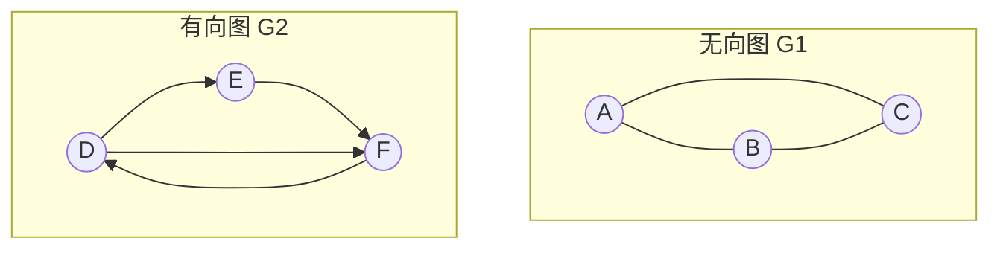

# 1.3.1.8 图

## 1. 图的数学抽象与拓扑模型

在非线性数据结构的发展脉络中，图形结构（Graph）代表了关系建模的最通用形式。对比线性表（一对一的顺序或链式物理关联）与树形结构（一对多的层次化、无环分支关联），图论提供了一种描述“多对多”任意拓扑关系的形式化数学模型。在线性表中，元素仅有唯一的前驱和唯一的后继；在树形结构中，结点仅有唯一的父结点与多个子结点；而在图形结构中，任意两个顶点之间都可能存在复杂的关联通道。因此，图被广泛应用于描述计算机网络、编译器数据流、社交网络关系、交通控制系统等高度复杂的实体交互关系。

### 1.1 形式化数学定义
数学上，图（Graph）是一个二元组，记作：
$$G = (V, E)$$
其中：
1. **$V$（Vertex）** 是顶点的非空有限集合。顶点亦称节点（Node），表示拓扑结构中的实体。我们记 $V = \{v_1, v_2, \dots, v_n\}$，其顶点个数（图的阶）表示为 $|V|$。
   > [!IMPORTANT]
   > 在图的数学定义中，$V$ 必须是非空集合，即 $|V| \ge 1$。这与树形结构不同（树可以是空树，即结点集为空），在图论中，不存在“无顶点图”的概念。
2. **$E$（Edge）** 是边的有限集合。边表示两个顶点之间的物理或逻辑关联关系。我们记 $E = \{e_1, e_2, \dots, e_m\}$，其边的条数表示为 $|E|$。边集 $E$ 可以为空集，此时的图 $G = (V, \emptyset)$ 称为零图或孤立点图。

---

### 1.2 图的核心分类与数学定义

根据边是否有方向、是否带有度量权值，以及图的连通属性，图可分为以下几类：

#### 1.2.1 有向图（Directed Graph / Digraph）
若边集合 $E$ 中的每一条边都是有方向的，则称该图为有向图。有向图中的边称为**弧（Arc）**。
- 弧是顶点的有序对，记作 $\langle v, w \rangle$，其中 $v$ 称为**弧尾（Tail / 起点）**，$w$ 称为**弧头（Head / 终点）**。
- $\langle v, w \rangle$ 表示一条从 $v$ 指向 $w$ 的单向通道，并不意味着存在 $\langle w, v \rangle$。
- 若有向图 $G$ 含有 $n$ 个顶点，其最大的弧数为 $n(n-1)$。此时，任意两个顶点之间都存在两条方向相反的弧，这种图称为**有向完全图**。

#### 1.2.2 无向图（Undirected Graph）
若边集合 $E$ 中的每一条边都是无方向的，则称该图为无向图。无向图中的边是顶点的无序对，记作 $(v, w)$ 或 $(w, v)$。
- $(v, w)$ 表示顶点 $v$ 和顶点 $w$ 之间存在一条双向互通的通道。
- 若无向图 $G$ 含有 $n$ 个顶点，其最大的边数为 $\frac{n(n-1)}{2}$。此时，任意两个顶点之间都存在一条边，这种图称为**无向完全图**。



#### 1.2.3 带权图与网（Weighted Graph / Network）
若图 $G$ 的边（或弧）被赋予了某种具有某种实际物理意义的数值，该数值称为该边（或弧）的**权值（Weight）**。这种带权的图在工程和数学中常被称为**网（Network）**。权值可以代表物理距离、传输时延、资金开销、带宽容量或交通流量等。

#### 1.2.4 稀疏图与稠密图（Sparse vs. Dense Graph）
在工程实践中，图的稀疏与稠密性质直接决定了存储结构的选择和算法的执行效率：
- **稀疏图**：通常满足 $|E| \ll |V|^2$。在渐进意义上，若 $|E| < |V| \log |V|$，我们一般将其视为稀疏图。
- **稠密图**：边数 $|E|$ 接近最大可能边数（即 $|V|^2$ 数量级）的图。
- **度量指标（稀疏度）**：定义为 $\rho = \frac{|E|}{|V|(|V|-1)}$（对于有向图）。若 $\rho$ 极小，则该图在存储时应极力避免二维矩阵造成的空间闲置。

#### 1.2.5 连通图与强连通图
连通性是衡量图的拓扑紧密性的关键属性：
- **无向图的连通性**：若从顶点 $v$ 到顶点 $w$ 有路径存在，则称 $v$ and $w$ 是连通的。若无向图 $G$ 中任意两个不同的顶点之间都是连通的，则称图 $G$ 为**连通图（Connected Graph）**。无向图中的极大连通子图称为该图的**连通分量（Connected Component）**。
- **有向图的强连通性**：在有向图 $G$ 中，若对于任意两个不同的顶点 $v$ 和 $w$，都存在从 $v$ 到 $w$ 的有向路径以及从 $w$ 到 $v$ 的有向路径，则称图 $G$ 是**强连通图（Strongly Connected Graph）**。有向图中的极大强连通子图称为该图的**强连通分量（Strongly Connected Component, SCC）**。
- **极小连通子图（生成树）**：一个连通图的生成树是包含图中全部 $n$ 个顶点，但只有 $n-1$ 条边的极小连通子图。若在生成树中添加任意一条边，都必然会形成环路；若减少一条边，则图将不再连通。

---

### 1.3 顶点的度与握手定理

顶点的**度（Degree）**是与该顶点相关联的边的数目，记作 $TD(v)$。

#### 1.3.1 握手定理（Handshaking Lemma）
**定理内容**：对于任意无向图 $G = (V, E)$，所有顶点的度数之和等于边数的两倍。即：
$$\sum_{v \in V} TD(v) = 2|E|$$
**证明**：在无向图中，每一条边 $e = (u, v)$ 都拥有两个端点 $u$ 和 $v$。当我们对整个图的所有顶点的度数进行累加时，每条边都会在其两个端点上各被计数一次，因此总度数必然是边数 $|E|$ 的 2 倍。

#### 1.3.2 有向图的度数分解
在有向图中，由于边具有方向性，顶点的度被严格拆分为：
- **入度（In-degree, $ID(v)$）**：以顶点 $v$ 为终点（弧头）的弧的条数。
- **出度（Out-degree, $O(v)$ 或 $OD(v)$）**：以顶点 $v$ 为起点（弧尾）的弧的条数。
由此可知，顶点的总度数等于入度与出度之和：$TD(v) = ID(v) + OD(v)$。
根据握手定理的推论，有向图中所有顶点的入度之和等于出度之和，且等于总弧数：
$$\sum_{v \in V} ID(v) = \sum_{v \in V} OD(v) = |E|$$

---

## 2. 图的底层存储实现对比与系统级考量

图作为一种高度非线性的拓扑结构，在物理内存中并没有天然的一维连续映射方案。在系统级工程中，如何选择图的存储结构，不仅要考虑时间与空间复杂度的权衡，还需要深入考量 CPU 高速缓存（Cache Locality）、内存解引用开销、垃圾回收（GC）标记压力以及并发锁粒度。

下面详细剖析四种经典的底层物理存储方案。

---

### 2.1 邻接矩阵 (Adjacency Matrix)

邻接矩阵是图的顺序存储实现。它利用一个一维数组存储顶点信息，并利用一个二维数组（方阵）存储顶点之间的邻接关系与权值。

#### 2.1.1 物理存储机制与数学映射

对于拥有 $n$ 个顶点的图 $G = (V, E)$，其邻接矩阵为一个 $n \times n$ 的二维数组 `A`。其映射规则如下：
- **无权图**：
  $$A[i][j] = \begin{cases} 1, & \text{若 } (v_i, v_j) \in E \text{ 或 } \langle v_i, v_j \rangle \in E \\ 0, & \text{其他} \end{cases}$$
- **带权图（网）**：
  $$A[i][j] = \begin{cases} w_{i,j}, & \text{若 } (v_i, v_j) \in E \text{ 或 } \langle v_i, v_j \rangle \in E \\ 0 \text{ 或 } \infty, & i = j \\ \infty, & \text{其他} \end{cases}$$
  > [!NOTE]
  > 在工程实践中，为了避免求最短路径时发生整型溢出，$\infty$ 通常用一个特定的安全大整数表示（例如 `0x3f3f3f3f`），而非直接使用系统级整型最大值 `INT_MAX`。

```
邻接矩阵物理内存布局（以行为主序 Row-Major）：
+-----------+-----------+     +-----------+
|  A[0][0]  |  A[0][1]  | ... |  A[n-1][n-1]
+-----------+-----------+     +-----------+
地址连续，高度契合 CPU 预取机制
```

#### 2.1.2 核心操作的复杂度分析
- **空间复杂度**：无论图实际拥有多少条边，邻接矩阵的存储空间始终为恒定的 $O(|V|^2)$。对于顶点数极高但边数极少的稀疏图，该方案的空间利用率极低（即稀疏矩阵中充斥着大量的 $0$ 或 $\infty$）。
- **时间复杂度**：
  - 判断顶点 $v_i$ 与 $v_j$ 之间是否存在边：直接定位到二维数组 `A[i][j]`，时间复杂度为 $O(1)$。
  - 计算无向图中顶点 $v_i$ 的度：统计第 $i$ 行中非零元素的个数，时间复杂度为 $O(|V|)$。
  - 计算有向图中顶点 $v_i$ 的出度：扫描第 $i$ 行，统计非零元素个数，时间复杂度为 $O(|V|)$。
  - 计算有向图中顶点 $v_i$ 的入度：扫描第 $i$ 列，统计非零元素个数，时间复杂度为 $O(|V|)$。

#### 2.1.3 系统级考量：CPU Cache 局部性与对称矩阵空间压缩
1. **Cache Locality（缓存局部性）**：
   在现代计算机硬件体系中，二维数组是按行主序（Row-Major）或列主序（Column-Major）连续存放的。在 C/C++ 等主流语言中，若我们沿着行去顺序访问顶点的邻接关系（例如 `A[i][0]`, `A[i][1]`, `A[i][2]`...），由于物理地址的高度连续性，CPU 能够高效激活预取逻辑，将整条 Cache Line 加载进 L1/L2 缓存。因此，其常数项因子非常小，在稠密图的图遍历中，实际运行效率极高。
2. **对称矩阵的空间压缩**：
   由于无向图的邻接矩阵是一个对称矩阵（即 $A[i][j] = A[j][i]$），为节约物理空间，可以采用一维数组 `B` 进行下三角压缩存储。
   将方阵中的 $n(n+1)/2$ 个元素压缩至大小为 $n(n+1)/2$ 的一维数组 `B` 中，其物理寻址映射公式为：
   $$k = \begin{cases} \frac{i(i+1)}{2} + j, & i \ge j \text{（下三角）} \\ \frac{j(j+1)}{2} + i, & i < j \text{（对称上三角）} \end{cases}$$
   此方法将空间复杂度降低了近 $50\%$，但依然保留了 $O(1)$ 的快速边检索能力。

#### 2.1.4 邻接矩阵 C 语言核心实现
```c
#include <stdio.h>
#include <stdlib.h>

#define MAX_VEX 100
#define INF 0x3f3f3f3f

typedef char VexType;

typedef struct {
    VexType vexs[MAX_VEX];       // 顶点表
    int arcs[MAX_VEX][MAX_VEX];  // 邻接矩阵
    int vex_num;                 // 顶点数
    int arc_num;                 // 边数
} MGraph;

// 初始化邻接矩阵
void InitMGraph(MGraph *G, int vex_num) {
    G->vex_num = vex_num;
    G->arc_num = 0;
    for (int i = 0; i < vex_num; i++) {
        G->vexs[i] = (VexType)('A' + i);
        for (int j = 0; j < vex_num; j++) {
            if (i == j) {
                G->arcs[i][j] = 0;
            } else {
                G->arcs[i][j] = INF; // 无连接初始化为无穷大
            }
        }
    }
}

// 插入边（有向带权边）
void InsertArc(MGraph *G, int u, int v, int weight) {
    if (u >= 0 && u < G->vex_num && v >= 0 && v < G->vex_num) {
        G->arcs[u][v] = weight;
        G->arc_num++;
    }
}
```

---

### 2.2 邻接表 (Adjacency List)

邻接表是顺序存储与链式存储相结合的图存储结构，是处理稀疏图的标准配置。

#### 2.2.1 物理存储机制

邻接表的核心由两部分组成：
1. **顶点表（Vertex Table）**：通常为一个一维顺序数组。每个单元包含两个字段：
   - `data`：存储顶点自身的属性。
   - `firstarc`：指向该顶点关联的第一条边（或弧）的边结点的指针。
2. **边表（Edge Table，又称弧表）**：为每个顶点建立的单链表。每个边表结点包含：
   - `adjvex`：该边指向的邻接点在顶点表顺序数组中的索引（下标）。
   - `nextarc`：指向该顶点的下一条邻接边的边结点的指针。
   - `weight`：对于网，还需存入权值信息。

```
顶点表 (数组)           边表 (单链表)
+----+----------+      +--------+---------+      +--------+---------+
| V0 | firstarc | ---> | adjvex | nextarc | ---> | adjvex | nextarc | ---> NULL
+----+----------+      +--------+---------+      +--------+---------+
| V1 | firstarc | 
+----+----------+
| V2 | firstarc | 
+----+----------+
```

#### 2.2.2 核心操作的复杂度分析
- **空间复杂度**：
  - **无向图**：每条无向边 $(u, v)$ 会在 $u$ 和 $v$ 的边表链表中各被记录一次，因此共有 $2|E|$ 个边表结点。总空间复杂度为 $O(|V| + 2|E|)$。
  - **有向图**：每条有向弧 $\langle u, v \rangle$ 仅在起点 $u$ 的出边链表中记录一次。总空间复杂度为 $O(|V| + |E|)$。
- **时间复杂度**：
  - 判断 $v_i$ 与 $v_j$ 之间是否存在边：必须在线性链表中逐个检索 `adjvex == j`，最坏情况下需要扫描完顶点的所有出边，时间复杂度为 $O(TD(v_i))$，在极端的星型图或稠密图中退化为 $O(|V|)$。
  - 计算有向图中顶点的出度：遍历该顶点的边表，时间复杂度为 $O(OD(v_i))$。
  - 计算有向图中顶点的入度：**重大性能缺陷**。为了获取指向该顶点的弧数，必须遍历全图所有顶点的边表，时间复杂度严重劣化为 $O(|V| + |E|)$。

#### 2.2.3 系统级考量：内存碎片与指针冗余开销
在高性能系统级开发中，邻接表的物理实现存在两个不可忽视的缺陷：
1. **内存碎片与 CPU Cache Miss**：由于边表结点是随着图的构建动态通过堆分配器（如 `malloc`）申请的，它们在内存中的地址高度离散。遍历邻接表时会发生频繁的指针解引用（Pointer Chasing），导致 CPU 无法进行高效的硬件缓存预取，造成大量的高速缓存失效（Cache Miss）。
2. **指针额外开销**：在 64 位操作系统中，每个指针占用 8 字节。若存储一个轻量级无权图（`adjvex` 为 4 字节的整型），每一个边结点中 `nextarc` 指针的内存占比竟高达 $66.7\%$，这对千万级顶点的超大图会造成巨大的内存冗余开销。
3. **逆邻接表折衷**：为解决求入度困难，可建立**逆邻接表（Inverse Adjacency List）**。其顶点表保持不变，但边表中记录的是指向该顶点的入边。但这又会导致求出度困难。因此，对于需要频繁双向检索的图，推荐使用十字链表或邻接多重表。

#### 2.2.4 邻接表 C 语言核心实现
```c
#include <stdio.h>
#include <stdlib.h>

#define MAX_VEX 100

typedef struct ArcNode {
    int adjvex;                 // 邻接点在顶点表中的索引
    int weight;                 // 权值
    struct ArcNode *nextarc;    // 指向下一条弧的指针
} ArcNode;

typedef struct VNode {
    char data;                  // 顶点信息
    ArcNode *firstarc;          // 指向第一条弧的指针
} VNode, AdjList[MAX_VEX];

typedef struct {
    AdjList vertices;           // 顺序顶点表
    int vex_num;                // 顶点数
    int arc_num;                // 边数
} ALGraph;

// 初始化邻接表
void InitALGraph(ALGraph *G, int vex_num) {
    G->vex_num = vex_num;
    G->arc_num = 0;
    for (int i = 0; i < vex_num; i++) {
        G->vertices[i].data = (char)('A' + i);
        G->vertices[i].firstarc = NULL;
    }
}

// 插入有向边 <u, v>
void InsertALArc(ALGraph *G, int u, int v, int weight) {
    if (u >= 0 && u < G->vex_num && v >= 0 && v < G->vex_num) {
        ArcNode *node = (ArcNode *)malloc(sizeof(ArcNode));
        node->adjvex = v;
        node->weight = weight;
        // 头插法插入到顶点的出边链表中
        node->nextarc = G->vertices[u].firstarc;
        G->vertices[u].firstarc = node;
        G->arc_num++;
    }
}
```

---

### 2.3 十字链表 (Orthogonal List)

十字链表是有向图的一种极为高效的顺序与双向链式混合存储结构。它巧妙地将邻接表与逆邻接表融为一体，彻底解决了求入度与求出度时间复杂度不对称的局限。

#### 2.3.1 顶点表结点与弧表结点的内存布局

1. **顶点表结点 (VexNode)**：
   ```
   +--------+-----------+------------+
   |  data  |  firstin  |  firstout  |
   +--------+-----------+------------+
   ```
   - `data`：顶点数据域。
   - `firstin`：指向以该顶点为**弧头**（入弧）的第一条弧结点的指针。
   - `firstout`：指向以该顶点为**弧尾**（出弧）的第一条弧结点的指针。
2. **弧表结点 (ArcNode)**：
   ```
   +-----------+-----------+---------+---------+--------+
   |  tailvex  |  headvex  |  hlink  |  tlink  |  info  |
   +-----------+-----------+---------+---------+--------+
   ```
   - `tailvex`：弧尾顶点在顶点表中的索引值。
   - `headvex`：弧头顶点在顶点表中的索引值。
   - `hlink`：指向下一个**弧头相同**的弧结点的指针（即入弧链表指针）。
   - `tlink`：指向下一个**弧尾相同**的弧结点的指针（即出弧链表指针）。
   - `info`：存储附加信息（如权值）。

```
        VNode [ data | firstin | firstout ]
                          |          |
                          |          +----------------------+
                          v                                 v
ArcNode [ tailvex | headvex | hlink (入弧链) | tlink (出弧链) | info ]
```

#### 2.3.2 物理指针联动与求度优化原理
在十字链表中，一条弧仅由一个唯一的 `ArcNode` 物理结点表示。然而，这个弧结点同时存在于两个链表中：
- 它通过 `tlink` 字段串联在以 `tailvex` 顶点为起点的**出弧链表**中。
- 它通过 `hlink` 字段串联在以 `headvex` 顶点为终点的**入弧链表**中。

由此，当我们需要操作有向图时：
- **求顶点 $v_i$ 的出度**：从 `vertices[i].firstout` 开始，沿着当前弧结点的 `tlink` 指针一路向后遍历，直到 NULL。时间复杂度仅为 $O(OD(v_i))$。
- **求顶点 $v_i$ 的入度**：从 `vertices[i].firstin` 开始，沿着当前弧结点的 `hlink` 指针一路向后遍历，直到 NULL。时间复杂度仅为 $O(ID(v_i))$。
- **添加/删除边**：可在 $O(1)$ 时间内完成指针的悬挂与阻断，且由于每条边只存在一个物理实例，不需要维护两处内存的一致性。

#### 2.3.3 十字链表 C 语言核心实现
```c
#include <stdio.h>
#include <stdlib.h>

#define MAX_VEX 100

typedef struct OL_ArcNode {
    int tailvex;                    // 弧尾索引
    int headvex;                    // 弧头索引
    struct OL_ArcNode *hlink;       // 相同入弧链表指针
    struct OL_ArcNode *tlink;       // 相同出弧链表指针
    int weight;                     // 边权
} OL_ArcNode;

typedef struct OL_VNode {
    char data;                      // 顶点数据
    OL_ArcNode *firstin;            // 第一条入弧指针
    OL_ArcNode *firstout;           // 第一条出弧指针
} OL_VNode, OL_VexList[MAX_VEX];

typedef struct {
    OL_VexList xlist;               // 顶点表
    int vex_num, arc_num;           // 顶点数与边数
} OLGraph;

// 初始化十字链表
void InitOLGraph(OLGraph *G, int vex_num) {
    G->vex_num = vex_num;
    G->arc_num = 0;
    for (int i = 0; i < vex_num; i++) {
        G->xlist[i].data = (char)('A' + i);
        G->xlist[i].firstin = NULL;
        G->xlist[i].firstout = NULL;
    }
}

// 插入弧 <u, v> 到十字链表
void InsertOLArc(OLGraph *G, int u, int v, int weight) {
    if (u >= 0 && u < G->vex_num && v >= 0 && v < G->vex_num) {
        OL_ArcNode *arc = (OL_ArcNode *)malloc(sizeof(OL_ArcNode));
        arc->tailvex = u;
        arc->headvex = v;
        arc->weight = weight;

        // 1. 将弧插入到起点 u 的出弧链表中 (头插法)
        arc->tlink = G->xlist[u].firstout;
        G->xlist[u].firstout = arc;

        // 2. 将弧插入到终点 v 的入弧链表中 (头插法)
        arc->hlink = G->xlist[v].firstin;
        G->xlist[v].firstin = arc;

        G->arc_num++;
    }
}
```

---

### 2.4 邻接多重表 (Adjacency Multilist)

邻接多重表是无向图的另一种链式存储结构。

#### 2.4.1 无向图在邻接表中的一致性痛点

在传统的邻接表中，无向图的每条边 $(u, v)$ 都必须用两个边表结点表示（一个挂在 $u$ 的邻接链表，一个挂在 $v$ 的邻接链表）。这不仅带来了近一倍的空间冗余，还带来了极高的**数据一致性维护成本**：
- **边状态修改**：例如在图的各种遍历或生成树算法中，需要将某条边置为“已访问（Visited）”状态，或者动态修改其权值。使用邻接表时，必须分别在 $u$ 和 $v$ 的两个链表中定位到对应的两个结点，并同时更新它们。这大大增加了算法逻辑的复杂性，且在并发环境中需要多重加锁，增加了死锁的隐患。
- **边删除操作**：需要分别在两个单链表中做链表的删除操作，需要分别寻找前驱节点并进行修改。

邻接多重表的核心设计思想是：**让无向图的每一条边在内存中只占用一个物理结点**，但该结点被同时串联在它所连接的两个顶点的边链表中。

#### 2.4.2 顶点表结点与边结点的结构设计

1. **顶点表结点 (VexNode)**：
   ```
   +--------+-------------+
   |  data  |  firstedge  |
   +--------+-------------+
   ```
   - `data`：顶点数据域。
   - `firstedge`：指向第一条依附于该顶点的边结点的指针。
2. **边表结点 (EdgeNode)**：
   ```
   +--------+---------+---------+---------+---------+--------+
   |  mark  |  ivex   |  ilink  |  jvex   |  jlink  |  info  |
   +--------+---------+---------+---------+---------+--------+
   ```
   - `mark`：边访问标记，用于各种遍历算法中标记该边是否已被访问。
   - `ivex` 和 `jvex`：该边连接的两个顶点在顶点表顺序数组中的索引（下标）。
   - `ilink`：指向下一条依附于顶点 `ivex` 的边结点的指针。
   - `jlink`：指向下一条依附于顶点 `jvex` 的边结点的指针。
   - `info`：边权值或其它属性信息指针。

```
顶点表 V0 [ firstedge ] ------------------+
                                         |
                                         v
边结点 [ mark | ivex(0) | ilink | jvex(1) | jlink | info ]
                           |                 |
                           v                 v
                 (下一条依附于V0的边) (下一条依附于V1的边)
```

#### 2.4.3 物理链表跳转机制与边删除原理
- **依附边遍历**：若要遍历与顶点 $v_i$ 相连的所有边，从 `vertices[i].firstedge` 出发。对当前边结点进行判断：
  - 若 `ivex == i`，则它的下一条依附边由指针 `ilink` 指示。
  - 若 `jvex == i`，则它的下一条依附边由指针 `jlink` 指示。
- **边删除的一致性保证**：由于 $(v_i, v_j)$ 在内存中仅有一个唯一的边结点，要将其删除，只需分别调整 $v_i$ 链表和 $v_j$ 链表中前驱结点的 `ilink` 或 `jlink` 指针，然后直接释放该结点的内存即可。不存在数据不一致或多次释放内存的风险。

#### 2.4.4 邻接多重表 C 语言核心实现
```c
#include <stdio.h>
#include <stdlib.h>

#define MAX_VEX 100

typedef struct AM_EdgeNode {
    int mark;                       // 访问标记域
    int ivex;                       // 边的一端顶点索引
    struct AM_EdgeNode *ilink;      // 指向下一条依附于 ivex 的边
    int jvex;                       // 边的另一端顶点索引
    struct AM_EdgeNode *jlink;      // 指向下一条依附于 jvex 的边
    int weight;                     // 边权值
} AM_EdgeNode;

typedef struct AM_VNode {
    char data;                      // 顶点数据
    AM_EdgeNode *firstedge;         // 指向第一条依附边的指针
} AM_VNode, AM_VexList[MAX_VEX];

typedef struct {
    AM_VexList adjmulist;           // 邻接多重表顶点表
    int vex_num, edge_num;          // 顶点数与边数
} AMGraph;

// 初始化邻接多重表
void InitAMGraph(AMGraph *G, int vex_num) {
    G->vex_num = vex_num;
    G->edge_num = 0;
    for (int i = 0; i < vex_num; i++) {
        G->adjmulist[i].data = (char)('A' + i);
        G->adjmulist[i].firstedge = NULL;
    }
}

// 插入无向边 (u, v)
void InsertAMEdge(AMGraph *G, int u, int v, int weight) {
    if (u >= 0 && u < G->vex_num && v >= 0 && v < G->vex_num) {
        AM_EdgeNode *edge = (AM_EdgeNode *)malloc(sizeof(AM_EdgeNode));
        edge->mark = 0;
        edge->ivex = u;
        edge->jvex = v;
        edge->weight = weight;

        // 将新边挂载到顶点 u 的边链表首部
        edge->ilink = G->adjmulist[u].firstedge;
        G->adjmulist[u].firstedge = edge;

        // 将新边挂载到顶点 v 的边链表首部
        edge->jlink = G->adjmulist[v].firstedge;
        G->adjmulist[v].firstedge = edge;

        G->edge_num++;
    }
}
```

---

### 2.5 存储结构综合对比与系统级选型指南

下表总结了四种图物理存储方案在时空复杂度和典型场景下的表现：

| 存储结构 | 适用场景 | 空间复杂度 | 判断边 $(u,v)$ 是否存在 | 求顶点出度 (或无向图度) | 求顶点入度 (有向图) | 优缺点与系统开销分析 |
| :--- | :--- | :--- | :--- | :--- | :--- | :--- |
| **邻接矩阵** | 稠密图、图顶点规模较小 | $O(\|V\|^2)$ | $O(1)$ | $O(\|V\|)$ | $O(\|V\|)$ | **优点**：Cache 友好度极高，随机检索极快。<br>**缺点**：稀疏图空间浪费大，不支持超大规模图动态扩容。 |
| **邻接表** | 稀疏图、顶点规模庞大 | $O(\|V\|+\|E\|)$ | $O(\text{deg}(u))$ | $O(\text{deg}(u))$ | $O(\|V\|+\|E\|)$ | **优点**：空间开销低，易于动态增删。<br>**缺点**：指针解引用多引发 Cache Miss，求入度极慢。 |
| **十字链表** | 有向图的双向分析与遍历 | $O(\|V\|+\|E\|)$ | $O(\text{deg}(u))$ | $O(\text{deg}(u))$ | $O(\text{deg}(u))$ | **优点**：结合了邻接表和逆邻接表优点，无存储冗余。<br>**缺点**：结构复杂，多指针指针域开销大。 |
| **邻接多重表**| 无向图的动态边修改与删除 | $O(\|V\|+\|E\|)$ | $O(\text{deg}(u))$ | $O(\text{deg}(u))$ | - | **优点**：同一条边只存一个结点，利于状态标记和一致性管理。<br>**缺点**：指针逻辑相对复杂，编写难度高。 |

---

## 3. 图的经典遍历机制的底层物理机理

图的遍历是指从图中的某一顶点出发，系统地访问图中的所有顶点，且使每个顶点仅被访问一次。由于图内部存在复杂的环路和多对多通路，遍历算法必须设计完善的状态标记机制，以防止无限循环。

下面我们将从底层执行机制、辅助数据结构、三色标记与环路判定等维度深度剖析深度优先搜索（DFS）与广度优先搜索（BFS）。

---

### 3.1 深度优先搜索 (Depth First Search, DFS)

DFS 的遍历机理类似于树的先序遍历，体现了“深入优先，不撞南墙不回头”的探索哲学。

#### 3.1.1 物理执行机理与调用栈本质
DFS 从选定的源点 $v$ 出发，访问 $v$，然后选择一个与 $v$ 邻接且未被访问的顶点 $w$ 进行递归式的深度遍历。当 $w$ 的所有路径均已被探索完毕（或者无路可行）时，算法执行回溯，返回到上一个尚有未被探索邻接点的顶点。
在物理执行层面上，DFS 依赖于**栈（Stack）**这一数据结构：
- **递归实现**：隐式利用了操作系统的进程/线程调用栈（Call Stack），每次进入递归函数时，会将当前的局部变量、参数和返回地址压栈；回溯即代表出栈。
- **非递归实现**：在堆上显式开辟一个用户栈（Explicit User Stack），利用循环与入栈出栈操作模拟递归流程，从而避免大图遍历时因递归层数过深导致的栈溢出（Stack Overflow）。

```
DFS 遍历顺序示意（递归深入与回溯）：
A -> B -> D (无路可行) -> 回溯至 B -> E -> 回溯至 A -> C ...
```

#### 3.1.2 顶点的三色标记法与状态生命周期
为了在复杂图的 DFS 中精准追踪节点状态，特别是在需要检测环路、强连通分量等高级分析中，我们通常将顶点划分为三种颜色状态：
1. **白色 (White)**：代表顶点尚未被 DFS 探测到，是初始状态。
2. **灰色 (Gray)**：代表顶点已被 DFS 探测到，但其**所有的邻接顶点尚未全部被探索完毕**。灰色节点正在隐式或显式栈中处于处理态。
3. **黑色 (Black)**：代表顶点及其所有邻接点已全部被深度探索完毕，该顶点已完成了使命，被彻底弹出调用栈。

**三色标记的状态跃迁过程**：
$$\text{白色 (未访问)} \xrightarrow{\text{首次被探测}} \text{灰色 (入栈，处理中)} \xrightarrow{\text{邻接点全部处理完}} \text{黑色 (出栈，完成)}$$

#### 3.1.3 环路检测原理（后向边）
在有向或无向图的 DFS 遍历过程中，若我们在探索灰色节点 $u$ 的邻接点 $v$ 时，发现 $v$ 的颜色已经是**灰色**，这意味着什么？
由于 $v$ 处于灰色状态，说明以 $v$ 为起点的 DFS 尚未结束，$v$ 必然是 $u$ 在递归调用树中的某个祖先节点。此时，弧 $\langle u, v \rangle$（或无向边 $(u, v)$）构成了一条**后向边 (Back Edge)**。
> [!IMPORTANT]
> 图中存在后向边是图中存在环路（Cycle）的**充要条件**。因此，DFS 是编译器静态检测循环依赖的核心基石。

#### 3.1.4 DFS 的物理性能推导
- **时间复杂度**：
  - 若用邻接矩阵存储，遍历图需要对每个顶点扫描一整行，共 $V$ 行，复杂度为 $O(|V|^2)$。
  - 若用邻接表存储，每个顶点被访问一次，所有的边表结点被扫描一遍。对于有向图为 $O(|V| + |E|)$，对于无向图为 $O(|V| + 2|E|)$。
- **空间复杂度**：主要为栈空间的开销。在最坏情况下（图退化为单向长链表），栈中同时包含所有的顶点，空间复杂度为 $O(|V|)$。

#### 3.1.5 DFS 代码实现（C 语言，邻接表 + 环路检测）
```c
#include <stdio.h>
#include <stdbool.h>

#define WHITE 0  // 未访问
#define GRAY  1  // 访问中 (正在栈中)
#define BLACK 2  // 已访问完毕

int color[MAX_VEX]; // 全局颜色状态数组

// 辅助递归函数：返回是否存在环
bool DFS_Visit(ALGraph *G, int u) {
    color[u] = GRAY; // 标记为灰色
    
    ArcNode *arc = G->vertices[u].firstarc;
    while (arc != NULL) {
        int v = arc->adjvex;
        if (color[v] == GRAY) {
            // 发现后向边，说明存在环！
            return true;
        }
        if (color[v] == WHITE) {
            if (DFS_Visit(G, v)) {
                return true;
            }
        }
        arc = arc->nextarc;
    }
    
    color[u] = BLACK; // 标记为黑色，出栈
    return false;
}

// 深度优先遍历入口，检测整个图是否有环
bool DFS_DetectCycle(ALGraph *G) {
    for (int i = 0; i < G->vex_num; i++) {
        color[i] = WHITE; // 初始化为白色
    }
    
    for (int i = 0; i < G->vex_num; i++) {
        if (color[i] == WHITE) {
            if (DFS_Visit(G, i)) {
                return true; // 图中含有环路
            }
        }
    }
    return false; // 无环
}
```

---

### 3.2 广度优先搜索 (Breadth First Search, BFS)

BFS 的遍历机理类似于树的按层遍历，体现了“广度扩散，步步为营”的波面推进哲学。

#### 3.2.1 物理遍历机理与层次波面传播
BFS 从图中的某个源点 $v$ 开始，访问 $v$，接着一次性访问 $v$ 的所有未被访问的邻接点。然后再依次从这些被访问的邻接点出发，访问它们的未访问邻接点。这个过程宛如一滴水落入平静的湖面，激起的涟漪向四周一层层扩散开来，形成一个个同心圆式的“波面”。
在物理实现上，BFS 不使用递归，而是强依赖于**先进先出（FIFO）队列**作为其核心调度工具：
- 访问源点 $s$，将其置为已访问状态，然后入队。
- 当队列非空时，队头元素 $u$ 出队。
- 遍历所有与 $u$ 邻接的未访问点，将它们全部标记为已访问，并依次送入队尾。重复此过程直至队列清空。

```
BFS 队列调度流向示意：
[ 源点 A 入队 ] ---> [ A 出队 ] ---> [ B, C 入队 ] ---> [ B 出队 ] ---> [ D, E 入队 ] ...
```

#### 3.2.2 状态标记与波面扩展控制
与 DFS 不同，BFS 在发现节点的第一时间就必须将其标记为“已入队/已访问”状态，而不是等出队时再做标记。
如果在邻接点被发现时没有立即做状态标记，在下一层遍历中，该节点可能会被它的其他邻接点重复发现并送入队列，从而导致队列膨胀甚至陷入死循环。

#### 3.2.3 无权图的单源最短路径数学性质
BFS 具有一条极其重要的拓扑数学定理：
> [Tip]
> **定理**：在无权图（或各边权值相等的图）中，若从源点 $s$ 开始进行广度优先搜索，当访问到某个顶点 $v$ 时，搜索路径所包含的边数就是 $s$ 到 $v$ 的**最短路径长度**（即经过的最少边数）。
> 
> **数学推导简析**：
> 设 $d(s, v)$ 表示源点 $s$ 到顶点 $v$ 的最短距离。由于 BFS 严格按照距离 $d = 0, 1, 2, \dots$ 的层次顺序将节点向外扩展，若节点 $x$ 在第 $k$ 步被首次染为已访问并加入队列，则 $s$ 到 $x$ 的最短距离必定是 $k$。任何非最优路径只可能产生大于等于 $k$ 的步数。

#### 3.2.4 BFS 的物理性能推导
- **时间复杂度**：
  - 采用邻接矩阵存储时，每个顶点出队时都需在矩阵中查找其所有列，复杂度为 $O(|V|^2)$。
  - 采用邻接表存储时，每个顶点仅进出队列一次，每条边都会被扫描一次（有向图为 $E$，无向图为 $2E$），故时间复杂度为 $O(|V| + |E|)$。
- **空间复杂度**：最坏情况下（例如星型拓扑图，中心节点直接与所有其他节点相连），第一步访问中心点后，其余 $|V|-1$ 个节点会在同一时刻被全部加入队列中，因此队列的内存开销可达 $O(|V|)$。

#### 3.2.5 BFS 代码实现（C 语言，邻接表 + 单源最短路径计算）
```c
#include <stdio.h>
#include <stdbool.h>
#include <stdlib.h>

#define INF 0x3f3f3f3f

int dist[MAX_VEX];  // 记录从源点到各个顶点的最短路径长度
bool visited[MAX_VEX];

void BFS_ShortestPath(ALGraph *G, int start_vex) {
    for (int i = 0; i < G->vex_num; i++) {
        dist[i] = INF;
        visited[i] = false;
    }
    
    // 初始化队列（用循环数组实现一个简易队列）
    int *queue = (int *)malloc(G->vex_num * sizeof(int));
    int front = 0, rear = 0;
    
    // 源点初始化
    dist[start_vex] = 0;
    visited[start_vex] = true;
    queue[rear++] = start_vex; // 入队
    
    while (front != rear) {
        int u = queue[front++]; // 出队
        
        ArcNode *arc = G->vertices[u].firstarc;
        while (arc != NULL) {
            int v = arc->adjvex;
            if (!visited[v]) {
                visited[v] = true;
                dist[v] = dist[u] + 1; // 距离递增 1
                queue[rear++] = v;     // 邻接点入队
            }
            arc = arc->nextarc;
        }
    }
    free(queue);
}
```

---

## 4. 拓扑排序 (Topological Sort) 及其系统级应用

在系统科学、编译器设计和现代任务编排中，拓扑排序是解决“包含依赖关系的并发调度问题”的核心利器。

---

### 4.1 拓扑排序的数学背景与定义

#### 4.1.1 有向无环图 (DAG) 与偏序关系
有向无环图（Directed Acyclic Graph, DAG）是指一个无回路的有向图。
在数学上，拓扑排序是将一个 DAG 的顶点排成一个线性序列，使得对于图中的任意一对顶点 $u, v$，若存在一条从 $u$ 到 $v$ 的有向路径，则在该序列中，**顶点 $u$ 必须排在顶点 $v$ 之前**。
- **偏序（Partial Order）**：在 DAG 中，顶点的先后关系并非在任意两点间都存在。比如有两条独立的依赖分支 $A \to B$ 和 $C \to D$，我们只能确定 $A$ 在 $B$ 前，$C$ 在 $D$ 前，但 $B$ 与 $C$ 之间并没有明确的先后关联。这种关系称为偏序。
- **全序（Total Order）**：拓扑排序的目标，就是将这种只满足局部先后关系的偏序，转换为所有顶点都在一条轴线上的全序列。

#### 4.1.2 拓扑序列的存在性与唯一性
- 一个有向图能够进行拓扑排序的**充要条件**是该有向图是一个 **DAG**。如果图中存在环（哪怕是一个两点的自环 $A \rightleftharpoons B$），拓扑排序就无法进行（因为谁也无法排在谁的前面）。
- 拓扑排序的结果**通常是不唯一的**。例如对图 $A \to B, A \to C$，序列 $[A, B, C]$ 和 $[A, C, B]$ 都是合法的拓扑排序结果。

---

### 4.2 拓扑排序算法的实现与底层机理

拓扑排序主要有两种经典的实现算法：基于入度减小机制的 **Kahn 算法**（广度优先思想）以及基于 **DFS 后序遍历逆序**的算法。

#### 4.2.1 Kahn 算法 (基于入度的广度优先探索)
Kahn 算法的底层逻辑非常直观，它通过模拟“剥离无依赖节点”的过程来实现排序。
1. **入度统计**：遍历全图，计算出每个顶点的初始入度。
2. **零入度初始化**：创建一个容器（通常使用队列或栈），将所有初始入度为 0 的顶点全部压入容器。
3. **循环剥离**：
   - 从容器中弹出一个顶点 $u$，将 $u$ 写入最终的拓扑序列中。
   - 遍历从 $u$ 出发的所有弧 $\langle u, v \rangle$，将邻接点 $v$ 的入度减 1。这一步相当于在拓扑图中切断了以 $u$ 为起点的边。
   - 检测 $v$ 减 1 后的入度值。若其入度变为了 0，说明 $v$ 依赖的所有前置任务已全部被处理完毕，此时将 $v$ 压入容器中。
4. **环路判定**：当容器清空时，若拓扑序列中的顶点总数小于图的顶点数 $|V|$，则说明图中有环，拓扑排序失败。这是因为环内的所有顶点入度均无法减至 0，导致它们被锁死在图内无法进入容器。

```
Kahn 算法剥离过程：
[A(入度0), B(入度1)] -> 剥离 A -> 边 A->B 断开 -> B的入度变为0 -> B入队
```

#### 4.2.2 基于 DFS 后序遍历逆序的算法
DFS 回溯的特点是：当一个节点被染为黑色时，以它为起点的所有深层路径都已被探索完毕。也就是说，它所依赖的所有后继任务在递归链上都已先于它被访问完毕。
1. 对 DAG 进行深度优先遍历。
2. 在每个顶点的递归函数即将返回（即该节点变黑、准备出栈）时，将该顶点压入一个全局栈中。
3. DFS 结束后，将全局栈中的元素依次弹出，得到的序列即为合法的拓扑排序结果。
4. 在 DFS 过程中，必须使用**三色标记法**进行环路检测。一旦在递归中遇到灰色节点，说明存在后向边，应立即中断算法并报循环依赖错误。

#### 4.2.3 两种拓扑排序算法的对比
| 维度 | Kahn 算法 (BFS-like) | DFS 后序逆序算法 |
| :--- | :--- | :--- |
| **时空复杂度** | 时间：$O(\|V\|+\|E\|)$，空间：$O(\|V\|)$ | 时间：$O(\|V\|+\|E\|)$，空间：$O(\|V\|)$ |
| **状态维护** | 必须动态维护一个 `indegree` 入度数组 | 依赖调用栈或用户栈，通过颜色状态检测后向边 |
| **工程直观性** | 极高，符合任务逐步解锁的直觉逻辑 | 相对抽象，需要完整的 DFS 拓扑结构 |
| **并发行支持** | **极佳**。同一时间处于零入度队列的节点可直接并行调度 | 串行递归性强，不便于多核任务直接拆分调度 |

---

### 4.3 Kahn 算法代码实现（Java 语言通用示例）

以下给出一段符合工业标准的 Kahn 算法实现，包含完整的入度管理与环路检测机制：

```java
import java.util.*;

public class TopologicalSort {
    
    // 表示图的顶点和边表结构
    public static class Graph {
        private final int vexNum;
        private final List<List<Integer>> adjList;

        public Graph(int vexNum) {
            this.vexNum = vexNum;
            this.adjList = new ArrayList<>(vexNum);
            for (int i = 0; i < vexNum; i++) {
                this.adjList.add(new ArrayList<>());
            }
        }

        public void addEdge(int u, int v) {
            this.adjList.get(u).add(v); // 有向边 u -> v
        }

        public int getVexNum() {
            return vexNum;
        }

        public List<Integer> getNeighbors(int u) {
            return adjList.get(u);
        }
    }

    /**
     * Kahn算法执行拓扑排序
     * @param graph 输入的有向图
     * @return 排序后的顶点序列；若存在环则返回 empty 列表
     */
    public static List<Integer> kahnSort(Graph graph) {
        int n = graph.getVexNum();
        int[] inDegree = new int[n];

        // 1. 统计所有节点的初始入度
        for (int u = 0; u < n; u++) {
            for (int v : graph.getNeighbors(u)) {
                inDegree[v]++;
            }
        }

        // 2. 将所有入度为 0 的节点加入队列
        Queue<Integer> queue = new LinkedList<>();
        for (int i = 0; i < n; i++) {
            if (inDegree[i] == 0) {
                queue.offer(i);
            }
        }

        List<Integer> result = new ArrayList<>();

        // 3. 循环处理
        while (!queue.isEmpty()) {
            int u = queue.poll();
            result.add(u);

            for (int v : graph.getNeighbors(u)) {
                inDegree[v]--; // 切断弧 <u, v>
                if (inDegree[v] == 0) {
                    queue.offer(v); // 入度降为0的节点入队
                }
            }
        }

        // 4. 环路检测：排序序列长度必须等于顶点总数
        if (result.size() != n) {
            System.err.println("Error: Graph contains circular dependency!");
            return Collections.emptyList(); // 拓扑排序失败，存在循环依赖
        }

        return result;
    }
}
```

---

### 4.4 拓扑排序在现代系统工程中的应用原理

拓扑排序在编译优化、自动化构建以及微服务依赖编排等系统工程中扮演着奠基性的角色。

#### 4.4.1 现代编译器的编译依赖分析
在大型 C++ 项目中，包含大量的源文件（`.cpp`）与头文件（`.h`）。编译器为了确定哪些文件需要先被编译、哪些文件可以后续编译，必须构建出**编译依赖树**。
- 如果文件 `A.cpp` 引入了 `B.h`，则在依赖图中就存在一条有向边 $\langle B, A \rangle$。
- 构建系统（如 GNU Make）在启动编译时，会对这张庞大的依赖图进行拓扑排序。若排序成功，则生成最终的串行或并行编译指令链；若排序检测出环路（例如 `A.h` 包含了 `B.h`，而 `B.h` 又反向包含了 `A.h`），编译器将立即终止，并抛出经典的“循环依赖错误（Circular Dependency Error）”。

#### 4.4.2 自动化构建调度中的多核并行执行原理
现代处理器的多核心优势使得我们能够并行编译源文件。在 Kahn 算法的执行过程中，**任何时刻位于“零入度队列”中的顶点，它们之间都是互不依赖的**。
构建系统的任务调度器（Task Scheduler）可以充分利用这一数学性质：
1. **任务分发**：调度器拥有一个空闲的核心线程池，每当检测到零入度队列中有任务时，就将这些任务分派给不同的物理核心并行执行。
2. **动态裁剪**：一旦某个核心完成了文件 `File_X` 的编译，调度器会接收到完成信号，并立刻将 `File_X` 指向的所有后继节点的入度减 1。这相当于动态剥离节点。
3. **激活动态任务**：当有新的节点入度被减至 0 时，调度器将新激活的任务塞入就绪任务队列。如此往复，直至所有编译任务安全、高效地收敛。

```
[任务就绪队列 (入度0)] ---> [核心 1: 编译 A] 
                       ---> [核心 2: 编译 C] 
                               |
                        (编译完成，更新入度)
                               |
                               v
                       [释放新入度0节点 B] ---> 进入任务队列
```

---

## 5. 深度拓展：经典图算法与分布式演进

为了让技术视角更加完整，本节简要延伸介绍图论中在工业界被高频应用的几类高级算法，以及超大规模图在分布式场景下的计算范式。

---

### 5.1 最短路径算法核心思想与对比

在有权图（网）中，求两个顶点之间权值之和最小的路径是图论的核心问题。

#### 5.1.1 Dijkstra 算法 (单源最短路径)
- **核心思想**：基于贪心策略。每次从未确定最短路径的顶点集合中，选择一个距离源点最近的顶点加入已确定集合，并以其为媒介“松弛（Relax）”其所有的邻接顶点。
- **复杂度与优化**：若采用朴素实现，时间复杂度为 $O(|V|^2)$；在系统工程中，通常引入**最小优先队列（Min-Heap 最小堆）**，将寻找最近顶点的开销降低至 $O(\log |V|)$，从而将总时间复杂度优化为 $O(|E| \log |V|)$。
- **局限性**：**无法处理边权值为负数的情况**。因为贪心选择一旦将节点加入已确定集合便不再更改，而负权边的存在可能会在后续产生更短的路径，颠覆贪心的阶段性结果。

#### 5.1.2 Bellman-Ford 算法 (支持负权边的单源最短路径)
- **核心思想**：对图中的所有边进行 $|V|-1$ 轮松弛操作。若在第 $|V|$ 轮松弛中依然能使某个顶点的距离变短，说明图内存在**负权环路（Negative-Weight Cycle）**。
- **复杂度**：时间复杂度为 $O(|V||E|)$，效率低于 Dijkstra。
- **SPFA 优化（Shortest Path Faster Algorithm）**：利用队列来仅对发生了距离缩短的节点的邻接点进行松弛，在稀疏图上的平均时间复杂度可优化至 $O(k|E|)$（$k$ 为常数）。但在最坏情况下（如网格图）仍会退化至 $O(|V||E|)$。

#### 5.1.3 Floyd-Warshall 算法 (全局多源最短路径)
- **核心思想**：基于动态规划。设 $dp[i][j]$ 表示顶点 $i$ 到 $j$ 的当前最短路径。算法逐一尝试将每个顶点 $k$ 作为中间过渡点，若经过 $k$ 能使距离变短，则更新：
  $$dp[i][j] = \min(dp[i][j], dp[i][k] + dp[k][j])$$
- **复杂度**：极具数学美感的三重循环，时间复杂度恒为 $O(|V|^3)$，空间复杂度为 $O(|V|^2)$。

---

### 5.2 最小生成树算法核心思想

在一个带权的连通无向图中，构造一棵边权之和最小的生成树。

#### 5.2.1 Prim 算法 (基于顶点扩展)
- **核心思想**：从任意顶点开始，逐步将与当前生成树相连的、权值最小的边所关联的未访问顶点拉入生成树中。
- **复杂度与选型**：朴素复杂度为 $O(|V|^2)$，堆优化后为 $O(|E| \log |V|)$。由于以顶点扩展为主，**适合顶点较少、边极其稠密的图**。

#### 5.2.2 Kruskal 算法 (基于边扩展)
- **核心思想**：将图中的所有边按照权值从小到大进行排序。依次从小到大选择边，若被选边的两个端点已连通（构成环），则丢弃；否则将其加入生成树中。
- **并查集（Union-Find）优化**：为了在 $O(1)$ 的时间复杂度内判断加入一条边是否会产生环，必须配合并查集数据结构进行路径压缩和按秩合并。
- **复杂度与选型**：时间复杂度主要由边的排序决定，为 $O(|E| \log |E|)$。由于以边扩展为主，**适合边较为稀疏的图**。

---

### 5.3 超大规模图的分布式存储与计算

随着海量数据的爆发，图的顶点数动辄达到数十亿，边数达万亿级，单机物理内存已无法承载。在分布式计算领域，图的架构演进出了全新的设计模式。

#### 5.3.1 图的分布式切分方案
由于图的复杂拓扑性，将图分布存储在多台机器上需要面对跨机器通信的难题。主要有两种切分策略：
1. **点切分（Vertex Cut）**：切断顶点，使得一条边仅存放在一台机器上，而部分顶点在多台机器上拥有副本。这种方式能极大地减少因为“超级大节点（High-degree node）”带来的边切分通信风暴，是现代分布式图引擎（如 GraphX）的首选。
2. **边切分（Edge Cut）**：切断边，每个顶点只存在于一台机器上，而跨机器的边会导致大量的网络 IO 通信。

#### 5.3.2 Pregel 分布式图计算模型
Google 提出的 **Pregel** 是一种基于 **BSP（Bulk Synchronous Parallel, 整体同步并行）**模型的分布式图计算框架。它的设计核心是“思考得像一个顶点（Think Like a Vertex）”：
- **超步（Superstep）**：图计算被划分为一系列的迭代步骤，称为超步。
- **消息传递**：在每一个超步中，每个顶点是并行的计算单元。它接收上一个超步中其他顶点发送给它的消息，执行本地计算，更新自身状态，并在超步结束前将新消息发送给其邻接顶点。
- **路障同步（Barrier Synchronization）**：在超步之间存在一个全局同步路障，确保所有机器处理完当前超步的消息后，才统一迈入下一个超步。
这种计算范式彻底摆脱了传统图遍历在大规模集群中复杂的锁管理，将图计算转化为了规整的数据流流转，是现代大数据网络图分析的技术根基。

