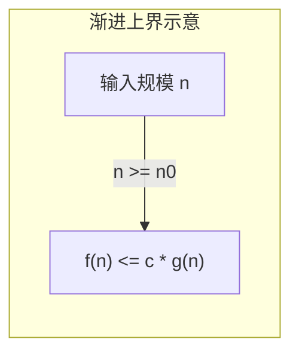
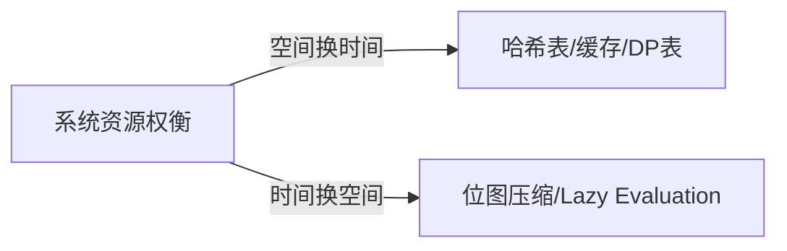
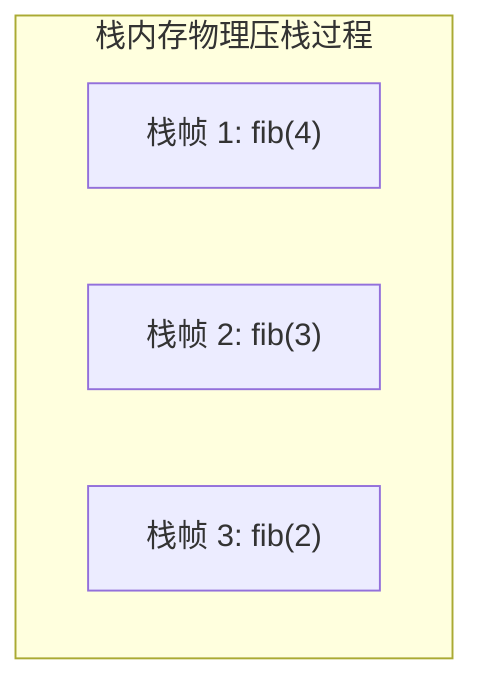
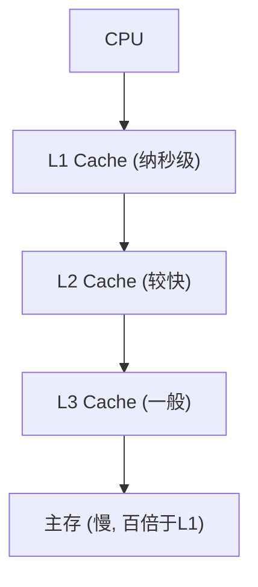

# 1.3.2.1 复杂度分析

## 1. 复杂度分析的理论基石与数学定义

### 1.1 为什么需要复杂度分析？
在计算机科学的早期发展中，评估一个算法的效率主要依赖于“事后统计法”（Empirical Analysis），即在特定计算机上运行算法并测量其消耗的时间和空间。然而，这种方法存在极其致命的局限性，导致其无法作为科学衡量算法优劣的标准。

1. **物理硬件的异构性与干扰**：同样的算法在单核低频处理器与多核高频处理器、或是不同架构（如 x86、ARM、RISC-V）的 CPU 上运行，其绝对执行时间会有量级上的差异。此外，内存的读写速度、缓存（L1/L2/L3 Cache）的命中率、流水线（Pipeline）的设计以及分支预测器的效率，都会剧烈地干扰绝对时间的测量。
2. **编译器与运行环境的优化差异**：编译器（如 GCC、Clang）的优化等级（如 `-O0`、`-O2`、`-O3`）会对生成的机器指令进行重排、循环展开、常数折叠或死代码消除。这使得即使在同一台机器上，由不同编译器或不同配置编译出来的同一算法的运行时间也大相径庭。
3. **测试数据规模与分布的局限性**：事后统计法的测试结果严重依赖于测试数据的规模与特征。例如，对于快速排序，在近乎有序的数据集下其性能会急剧退化；而在完全随机的数据集下则表现优异。如果测试数据规模过小，可能无法反映算法在处理海量数据时的真实性能趋势，即存在“小样本偏差”。

为了排除物理硬件、编译器、操作系统以及测试数据集等外部客观干扰，提供一种纯粹且通用的算法效率估算基底，计算机科学家引入了**渐进分析（Asymptotic Analysis）**。渐进分析不再关注算法在某台机器上运行的具体微秒数，而是关注**当输入数据规模 $n$ 趋近于无穷大（$n \to \infty$）时，算法执行所消耗的资源（时间或空间）的增长率趋势**。这种方法不仅提供了一种跨平台、跨语言的统一尺度，更让我们能从本质上洞察算法的扩展能力。

---

### 1.2 大 O 渐进记号的严格数学定义
渐进分析的核心工具是渐进记号，其中最常用的是大 O 记号（Big O Notation）。为了建立严谨的学术认知，我们必须从离散数学与高等数学的极限角度对其进行精确定义。

#### 1.2.1 渐进上界：大 $O$ 记号
设 $f(n)$ 和 $g(n)$ 是定义在正整数集上的两个非负函数。如果存在正实数常数 $c$ 和正整数常数 $n_0$，使得当所有 $n \ge n_0$ 时，恒有：
$$0 \le f(n) \le c \cdot g(n)$$
则称 $f(n)$ 当 $n$ 趋于无穷大时是 $g(n)$ 的大 $O$ 阶，记作：
$$f(n) = O(g(n)) \quad (\text{严格来说，应写作 } f(n) \in O(g(n)))$$
大 $O$ 记号给出了函数 $f(n)$ 在渐进意义上的**上界**。它表明，当规模 $n$ 足够大后，$f(n)$ 的增长速度不会超过 $g(n)$ 的某个常数倍。



#### 1.2.2 渐进下界：大 $\Omega$ 记号
如果存在正实数常数 $c$ 和正整数常数 $n_0$，使得当所有 $n \ge n_0$ 时，恒有：
$$0 \le c \cdot g(n) \le f(n)$$
则称 $f(n)$ 当 $n$ 趋于无穷大时是 $g(n)$ 的大 $\Omega$ 阶，记作：
$$f(n) = \Omega(g(n))$$
大 $\Omega$ 记号给出了函数 $f(n)$ 在渐进意义上的**下界**。它表明，在最理想的情况下，算法的执行开销也至少是 $g(n)$ 级别的常数倍。

#### 1.2.3 渐进紧确界：大 $\Theta$ 记号
如果存在正实数常数 $c_1, c_2$ 和正整数常数 $n_0$，使得当所有 $n \ge n_0$ 时，恒有：
$$c_1 \cdot g(n) \le f(n) \le c_2 \cdot g(n)$$
则称 $f(n)$ 当 $n$ 趋于无穷大时是 $g(n)$ 的大 $\Theta$ 阶，记作：
$$f(n) = \Theta(g(n))$$
大 $\Theta$ 记号给出了函数 $f(n)$ 的**渐进紧确界**（即同时是上界和下界）。这意味着 $f(n)$ 与 $g(n)$ 具有相同的增长率。

```mermaid
graph TD
    n0["当 n >= n_0 时"] --> condition["c1 * g(n) <= f(n) <= c2 * g(n)"]
    condition --> Theta["f(("n")) = Θ("f(("n"))"]
```

#### 1.2.4 非紧确渐进上界与下界：小 $o$ 与小 $\omega$ 记号
在数学分析中，有时我们需要区分“不大于”与“严格小于”的渐进关系：
* **小 $o$ 记号**：如果对于任意正实数 $c > 0$，都存在正整数 $n_0$，使得对于所有 $n \ge n_0$，恒有 $0 \le f(n) < c \cdot g(n)$，则记作 $f(n) = o(g(n))$。这等价于：
  $$\lim_{n \to \infty} \frac{f(n)}{g(n)} = 0$$
  它表示 $f(n)$ 的增长率在渐进上严格慢于 $g(n)$。例如， $2n = o(n^2)$，但 $2n^2 \neq o(n^2)$。
* **小 $\omega$ 记号**：如果对于任意正实数 $c > 0$，都存在正整数 $n_0$，使得对于所有 $n \ge n_0$，恒有 $f(n) > c \cdot g(n) \ge 0$，则记作 $f(n) = \omega(g(n))$。这等价于：
  $$\lim_{n \to \infty} \frac{f(n)}{g(n)} = \infty$$
  它表示 $f(n)$ 的增长率在渐进上严格快于 $g(n)$。

---

### 1.3 极限定义与代数运算性质
利用高等数学中的极限来判定渐进关系往往比使用不等式定义更为直观。设 $L = \lim_{n \to \infty} \frac{f(n)}{g(n)}$：
1. 若 $L = 0$，则 $f(n) = o(g(n))$，因而 $f(n) = O(g(n))$ 且 $f(n) \neq \Omega(g(n))$。
2. 若 $L = d > 0$（$d$ 为常数），则 $f(n) = \Theta(g(n))$。
3. 若 $L = \infty$，则 $f(n) = \omega(g(n))$，因而 $f(n) = \Omega(g(n))$ 且 $f(n) \neq O(g(n))$。

#### 1.3.1 渐进记号的代数运算性质
在实际分析中，我们经常需要对多个代码块的复杂度进行组合计算。以下性质可以通过极限或不等式定义严密推导：
* **加法规则（序列组合）**：
  若 $f_1(n) = O(g_1(n))$ 且 $f_2(n) = O(g_2(n))$，则：
  $$f_1(n) + f_2(n) = O(\max(g_1(n), g_2(n)))$$
* **乘法规则（嵌套循环）**：
  若 $f_1(n) = O(g_1(n))$ 且 $f_2(n) = O(g_2(n))$，则：
  $$f_1(n) \cdot f_2(n) = O(g_1(n) \cdot g_2(n))$$
* **传递性（Transitivity）**：
  若 $f(n) = O(g(n))$ 且 $g(n) = O(h(n))$，则 $f(n) = O(h(n))$。该性质同样适用于 $\Omega, \Theta, o, \omega$。
* **自反性（Reflexivity）**：
  $f(n) = O(f(n))$，$f(n) = \Omega(f(n))$，$f(n) = \Theta(f(n))$。
* **对称性（Symmetry）**：
  $f(n) = \Theta(g(n)) \iff g(n) = \Theta(f(n))$。
* **转置对称性（Transposition Symmetry）**：
  $f(n) = O(g(n)) \iff g(n) = \Omega(f(n))$。

---

### 1.4 函数增长率排队与数学证明
在计算机科学中，常见的复杂度级别按增长率从低到高排列如下：
$$O(1) < O(\log \log n) < O(\log n) < O(\sqrt{n}) < O(n) < O(n \log n) < O(n^2) < O(n^3) < O(2^n) < O(3^n) < O(n!) < O(n^n)$$

我们通过高等数学工具对其中某些关键递增关系进行证明，以加深理解。

#### 证明一：对数增长速度慢于任意正幂函数
证明：对于任意常数 $\epsilon > 0$，有 $\log n = o(n^\epsilon)$。
我们计算其极限，设底数为自然对数（由于换底公式，底数对渐进关系无影响）：
$$L = \lim_{n \to \infty} \frac{\ln n}{n^\epsilon}$$
由于当 $n \to \infty$ 时，分子和分母均趋于无穷大，我们可以应用洛必达法则（L'Hôpital's Rule），对分子分母求导：
$$L = \lim_{n \to \infty} \frac{\frac{d}{dn}(\ln n)}{\frac{d}{dn}(n^\epsilon)} = \lim_{n \to \infty} \frac{1/n}{\epsilon \cdot n^{\epsilon - 1}} = \lim_{n \to \infty} \frac{1}{\epsilon \cdot n^\epsilon}$$
因为 $\epsilon > 0$，所以当 $n \to \infty$ 时，分母 $n^\epsilon \to \infty$，故：
$$L = 0$$
由此证得，对数增长 $\log n$ 的速度在渐进意义上严格慢于任何幂函数 $n^\epsilon$（即使 $\epsilon = 0.0001$）。

#### 证明二：指数增长慢于阶乘增长
证明：对于任意正实数 $a > 1$，有 $a^n = o(n!)$。
要证明这一点，我们分析数列 $x_n = \frac{a^n}{n!}$ 的极限。
设 $k$ 是一个满足 $k > 2a$ 的固定整数。当 $n > k$ 时，我们可以将分数展开：
$$\frac{a^n}{n!} = \frac{a \cdot a \dots a}{1 \cdot 2 \dots n} = \left( \frac{a^k}{k!} \right) \cdot \left( \frac{a}{k+1} \cdot \frac{a}{k+2} \dots \frac{a}{n} \right)$$
设常数 $C = \frac{a^k}{k!}$。由于对于所有 $j \ge k+1$，都有 $j > 2a$，因此每一项 $\frac{a}{j} < \frac{a}{2a} = \frac{1}{2}$。
因此：
$$0 \le \frac{a^n}{n!} < C \cdot \left( \frac{1}{2} \right)^{n-k}$$
由于 $\lim_{n \to \infty} \left( \frac{1}{2} \right)^{n-k} = 0$，根据夹逼定理（Squeeze Theorem），我们有：
$$\lim_{n \to \infty} \frac{a^n}{n!} = 0$$
这证明了 $a^n = o(n!)$。阶乘级别的复杂度增长速度之快，是任何指数函数都无法比拟的。

---

## 2. 时间复杂度 (Time Complexity) 推导与分析法则

### 2.1 代码层面的分析法则
在具体编写或分析代码时，我们需要将数学上的加法与乘法法则翻译为代码结构的逻辑：

1. **顺序结构：加法法则**
   如果代码块 A 的时间复杂度为 $O(f(n))$，代码块 B 的时间复杂度为 $O(g(n))$，二者是前后顺序执行的关系，则整体时间复杂度为二者中较大的那一个。
   $$T(n) = T_A(n) + T_B(n) = O(f(n)) + O(g(n)) = O(\max(f(n), g(n)))$$

2. **条件分支结构：取最大值**
   当程序包含 `if-else` 分支时，在最坏情况下，时间复杂度由开销最高的分支决定。
   $$T(n) = O(\max(T_{\text{then}}(n), T_{\text{else}}(n)))$$

3. **嵌套循环结构：乘法法则**
   对于多重循环嵌套，其总时间复杂度为各层循环次数的乘积，并乘以循环体内部操作的复杂度。
   $$T(n) = O(\text{外层循环次数} \times \text{内层循环次数} \times \text{循环体内复杂度})$$

#### 2.1.1 变量依赖嵌套循环的级数求和
如果内层循环的执行次数依赖于外层循环的当前变量值，我们不能简单地将最大上限相乘，而必须进行严密的级数求和推导。

##### 示例一：等差数列型依赖
```cpp
// 示例代码 2.1
void SelectionSort(int arr[], int n) {
    for (int i = 0; i < n - 1; ++i) {
        int min_idx = i;
        for (int j = i + 1; j < n; ++j) {
            if (arr[j] < arr[min_idx]) {
                min_idx = j;
            }
        }
        std::swap(arr[i], arr[min_idx]);
    }
}
```
在该排序算法中，外层循环 $i$ 从 $0$ 运行到 $n-2$。对于每个特定的 $i$，内层循环的 $j$ 从 $i+1$ 运行到 $n-1$，执行次数为 $n - (i + 1) = n - i - 1$ 次。
因此，基本操作（比较语句）的总执行次数为：
$$S(n) = \sum_{i=0}^{n-2} (n - i - 1)$$
我们可以令 $k = n - i - 1$ 进行变量替换。当 $i=0$ 时，$k=n-1$；当 $i=n-2$ 时，$k=1$。故：
$$S(n) = \sum_{k=1}^{n-1} k = \frac{(n-1)n}{2} = \frac{1}{2}n^2 - \frac{1}{2}n$$
利用大 $O$ 的定义，舍弃低阶项和常数系数，可得其时间复杂度为 $O(n^2)$。

##### 示例二：非等比嵌套循环
```cpp
// 示例代码 2.2
void NonUniformLoop(int n) {
    for (int i = 1; i <= n; i *= 2) {
        for (int j = 1; j <= i; ++j) {
            // 常数时间操作 O(1)
            PerformConstantAction();
        }
    }
}
```
这个例子非常容易被直觉误导。外层循环变量 $i$ 的取值呈指数增长：$1, 2, 4, 8, \dots, 2^p$，其中 $2^p \le n$ 且 $2^{p+1} > n$。这说明外层循环共执行了大约 $\log_2 n$ 次。
然而，内层循环的执行次数是 $i$。因此，总执行次数 $S(n)$ 为：
$$S(n) = 1 + 2 + 4 + 8 + \dots + 2^p = \sum_{k=0}^{p} 2^k$$
这是一个典型的等比数列求和：
$$S(n) = \frac{1 \cdot (1 - 2^{p+1})}{1 - 2} = 2^{p+1} - 1$$
由于 $2^p \le n$，我们可以推出 $2^{p+1} = 2 \cdot 2^p \le 2n$。
因此：
$$S(n) < 2n$$
这表明，尽管外层循环每次翻倍，内层循环次数随之翻倍，但总体时间复杂度并不是直觉上的 $O(n \log n)$，而是 $O(n)$。

---

### 2.2 常见时间复杂度级别与物理瓶颈
不同的复杂度级别在硬件层面有着不同的物理映射，这决定了算法在面对特定规模数据时的生存状态。

| 复杂度级别 | 常见代表算法 | 规模 $n=10^4$ 的大致运算量 | 硬件执行感受 |
| :--- | :--- | :--- | :--- |
| $O(1)$ | 数组随机访问、哈希表查找（完美） | 1 次 | 瞬时完成（纳秒级） |
| $O(\log n)$ | 二分查找、红黑树检索 | ~14 次 | 极快，对规模极不敏感 |
| $O(n)$ | 线性扫描、KMP算法 | $10^4$ 次 | 毫秒级，受限于内存带宽 |
| $O(n \log n)$ | 快速排序、归并排序、堆排序 | ~$1.4 \times 10^5$ 次 | 极高效，工业级规模的首选 |
| $O(n^2)$ | 冒泡排序、朴素邻接矩阵遍历 | $10^8$ 次 | 秒级，对大规模数据产生卡顿 |
| $O(n^3)$ | 朴素矩阵乘法、Floyd最短路径算法 | $10^{12}$ 次 | 极慢，规模过千即无法忍受 |
| $O(2^n)$ | 回溯搜索、八皇后问题 | ~$2 \times 10^{3010}$ 次 | 灾难，输入规模超 50 即永久卡死 |
| $O(n!)$ | 字典序全排列生成 | ~$10^{35659}$ 次 | 毁灭，只对极其微小（$n<12$）有效 |

#### 2.2.1 对数时间复杂度 $O(\log n)$ 的物理本质
对数复杂度是算法中极其优异的指标。其背后的物理来源几乎全部可以归纳为**“空间/范围的等比缩减”**或**“树形结构的层级遍历”**。
* **物理来源：折半检索（Binary Search）**
  每一次检索，算法都通过一次比较将当前的搜索区间平分为两个子区间，并排除其中一个。这意味着，如果初始搜索区间的大小为 $n$，第 1 次操作后缩减到 $n/2$，第 $2$ 次缩减到 $n/4$，第 $k$ 次操作后缩减到 $n/2^k$。
  当搜索区间缩减到只剩 1 个元素时，搜索结束：
  $$\frac{n}{2^k} = 1 \implies 2^k = n \implies k = \log_2 n$$
* **物理来源：二叉树高度**
  在一棵完全二叉树中，第 $d$ 层最多拥有 $2^d$ 个节点。如果树的总结点数为 $n$，则树的高度 $H$ 满足：
  $$n \approx \sum_{d=0}^{H-1} 2^d = 2^H - 1 \implies H \approx \log_2(n+1)$$
  在平衡二叉搜索树（如 AVL 树、红黑树）中，任何增删改查操作在最坏情况下都只需要沿着一条从根节点到叶子节点的路径进行遍历。因此，其时间复杂度被严格限制在树的高度之内，即 $O(\log n)$。

##### 为什么对数底数在复杂度中可以忽略？
在数学上，有不同的对数底数，如 $\log_2 n, \log_{10} n, \ln n$。然而在渐进分析中，我们一律记为 $O(\log n)$。这是因为有换底公式：
$$\log_a n = \frac{\log_b n}{\log_b a}$$
由于 $\log_b a$ 是一个常数，因此 $\frac{1}{\log_b a}$ 也是一个常数常系数。在渐进大 $O$ 记号中，常数系数是被直接忽略的，即：
$$O(\log_a n) = O\left( \frac{1}{\log_b a} \log_b n \right) = O(\log_b n)$$
故底数在渐进意义下完全等价，我们不需要对其进行区分。

---

### 2.3 递归算法的时间复杂度分析

#### 2.3.1 递归树（Recursion Tree）分析模型
递归树是将递归调用展开为树状结构以进行直观求和的分析方法。我们通过两个例子展示对称递归树与非对称递归树的推导。

##### 示例一：对称递归树
分析递归方程：$T(n) = 2T(n/2) + cn$（其中 $c$ 为常数，表示合并子问题的开销）。
我们将每一次调用表示为树的一个节点，节点内写入该层调用产生的非递归开销。

```mermaid
graph TD
    Root["cn"] --> L1["c("n/2")"]
    Root --> R1["c("n/2")"]
    L1 --> L2_1["c("n/4")"]
    L1 --> L2_2["c("n/4")"]
    R1 --> R2_1["c("n/4")"]
    R1 --> R2_2["c("n/4")"]
```

我们可以计算每一层所有节点的开销总和：
* **第 0 层（根节点）**：1 个节点，开销为 $cn$。
* **第 1 层**：2 个节点，规模为 $n/2$，开销总和为 $2 \times c(n/2) = cn$。
* **第 2 层**：4 个节点，规模为 $n/4$，开销总和为 $4 \times c(n/4) = cn$。
* **第 $i$ 层**：$2^i$ 个节点，规模为 $n/2^i$，开销总和为 $2^i \times c(n/2^i) = cn$。

树的叶子节点发生在规模降为 1 时，即 $n/2^H = 1 \implies H = \log_2 n$。
因此，总开销为所有层开销的累加：
$$T(n) = \sum_{i=0}^{\log_2 n} cn = cn \cdot (\log_2 n + 1) = O(n \log n)$$

##### 示例二：非对称递归树
分析递归方程：$T(n) = T(n/3) + T(2n/3) + cn$（快速排序在不均匀划分下的模型）。
由于两个子问题的规模缩减速度不同，递归树会呈现出倾斜状态：
* 左子树的缩减速度极快，每次除以 3。其最深路径长度为 $\log_3 n$。
* 右子树的缩减速度较慢，每次乘以 2/3。其最深路径长度为 $\log_{3/2} n$。

```mermaid
graph TD
    Root["cn"] --> L1["c("n/3")"]
    Root --> R1["c("2n/3")"]
    L1 --> L2_1["c("n/9")"]
    L1 --> L2_2["c("2n/9")"]
    R1 --> R2_1["c("2n/9")"]
    R1 --> R2_2["c("4n/9")"]
```

我们可以对每一层的总开销进行上界估算：
* 在深度到达 $\log_3 n$ 之前，每一层的节点总规模都是完全充满的，开销和恒为 $cn$。
* 在深度介于 $\log_3 n$ 到 $\log_{3/2} n$ 之间时，部分分支已经到达叶子节点（规模降为 1）并停止分裂，因而该区间的每一层的总开销将小于 $cn$。
* 树的最大深度为 $H = \log_{3/2} n$。

我们可以得出上界估计：
$$T(n) \le \sum_{i=0}^{\log_{3/2} n} cn = cn \log_{3/2} n = O(n \log n)$$
同时，由于在 $\log_3 n$ 深度内，每层代价都为 $cn$，我们也能得到下界估计：
$$T(n) \ge \sum_{i=0}^{\log_3 n} cn = cn \log_3 n = \Omega(n \log n)$$
由于上界与下界同阶，我们确切地得出 $T(n) = \Theta(n \log n)$。

---

#### 2.3.2 主定理（Master Theorem）深入剖析
主定理提供了一种解析特定分治递归方程的现成工具。对于形如下列关系的递归方程：
$$T(n) = aT(n/b) + f(n)$$
其中 $a \ge 1$ 表示子问题数量，$b > 1$ 表示子问题规模缩减因子，$f(n)$ 表示将问题分解与合并子问题解的渐进时间开销。我们定义一个关键的比较参照项：
$$n^{\log_b a}$$
该项在物理上代表了递归树叶子节点的总数量。主定理的三个分支正是基于 $f(n)$ 与 $n^{\log_b a}$ 的渐进增长率对比来划分的：

##### Case 1：叶子节点代价占主导
若存在常数 $\epsilon > 0$，使得：
$$f(n) = O(n^{\log_b a - \epsilon})$$
这意味着递归树的叶子节点的开销在渐进上远大于根节点及合并开销。因此，整个算法的时间复杂度由叶子节点项决定：
$$T(n) = \Theta(n^{\log_b a})$$

##### Case 2：各层代价均等（均匀分布）
若存在常数 $k \ge 0$，使得：
$$f(n) = \Theta(n^{\log_b a} \log^k n)$$
这意味着每一层的开销在大致相同的数量级。总复杂度等于某一层的开销乘以树的高度（带对数因子）：
$$T(n) = \Theta(n^{\log_b a} \log^{k+1} n)$$
*(注：当 $k=0$ 时，即 $f(n) = \Theta(n^{\log_b a})$，可退化为最常见的标准形式：$T(n) = \Theta(n^{\log_b a} \log n)$)*。

##### Case 3：根节点合并代价占主导
若存在常数 $\epsilon > 0$，使得：
$$f(n) = \Omega(n^{\log_b a + \epsilon})$$
并且 $f(n)$ 满足**正则性条件（Regularity Condition）**：对于某个常数 $c < 1$ 和所有足够大的 $n$，有：
$$a \cdot f(n/b) \le c \cdot f(n)$$
这意味着递归树的合并代价随着层数向下递减，根节点处的开销占据了绝对的主导地位。因此，总复杂度由合并开销决定：
$$T(n) = \Theta(f(n))$$

---

#### 2.3.3 主定理的适用边界与局限性
主定理虽然强大，但其要求非常严格的**多项式渐进可比性**。在工程和算法设计中，有很多方程是无法使用主定理求解的。

##### 局限案例一：非多项式渐进慢于叶子项
$$T(n) = 2T(n/2) + n \log n$$
此处 $a=2, b=2$，计算参照项为 $n^{\log_2 2} = n$。
我们对比 $f(n) = n \log n$ 与 $n$ 的关系。显然 $n \log n$ 的增长速度快于 $n$。但是，我们能否找到一个常数 $\epsilon > 0$ 使得 $f(n) = \Omega(n^{1+\epsilon})$ 呢？
答案是否定的。因为 $\frac{n \log n}{n^{1+\epsilon}} = \frac{\log n}{n^\epsilon} \to 0$（根据前面我们对数慢于幂函数的证明）。
这意味着 $f(n)$ 并不是**多项式意义上**快于 $n$，它不属于 Case 3。同样地，它也不满足 Case 2 的 $f(n) = \Theta(n)$。
因此，该方程无法使用标准主定理。不过，利用泛化主定理的 Case 2（此时 $k=1$），我们可以得出：
$$T(n) = \Theta(n \log^2 n)$$

##### 局限案例二：非多项式渐进快于叶子项
$$T(n) = 4T(n/2) + \frac{n^2}{\log n}$$
此处 $a=4, b=2$，计算参照项为 $n^{\log_2 4} = n^2$。
我们对比 $f(n) = \frac{n^2}{\log n}$ 与 $n^2$。显然 $f(n)$ 慢于 $n^2$。但同样，我们找不到任何常数 $\epsilon > 0$ 满足 $\frac{n^2}{\log n} = O(n^{2-\epsilon})$，因为这要求 $\log n \ge n^\epsilon$，这是不可能的。
所以该方程无法使用主定理。我们可以用递归树方法求解，得出其时间复杂度为 $\Theta(n^2 \log \log n)$。

##### 局限案例三：正则性条件失效
$$T(n) = 2T(n/2) + n(2 + \sin n)$$
此处 $a=2, b=2$，参照项为 $n$。$f(n) = n(2 + \sin n)$ 在 $n$ 和 $3n$ 之间反复摆动，因此它虽然在量级上与 $n$ 相当，但是由于正弦函数的非单调波动性，导致无法满足正则性条件中的 $2 \cdot f(n/2) \le c \cdot f(n)$（对于 $c < 1$），从而无法套用主定理。

---

## 3. 最好、最坏、平均与均摊复杂度分析

在很多复杂的算法中，时间开销不仅取决于输入的规模 $n$，还极大地取决于输入数据的具体特征和形态。因此，我们需要多维度的分析方法。

```cpp
// 示例代码 3.1
int LinearSearch(int arr[], int n, int target) {
    for (int i = 0; i < n; ++i) {
        if (arr[i] == target) {
            return i; // 找到目标，提前退出
        }
    }
    return -1; // 未找到
}
```

---

### 3.1 最好、最坏与平均时间复杂度

#### 3.1.1 最好时间复杂度（Best-case Complexity）
指在最理想的输入数据形态下，算法执行的最小时间开销。
对于上面的示例代码 3.1，最理想的情况是目标元素恰好位于数组的第一个位置 `arr[0]`。此时，循环只需执行 1 次便会触发 `return`。
因此，其最好时间复杂度为：
$$T_{\text{best}}(n) = O(1)$$
最好时间复杂度通常只具有理论上的参考价值，在工程实践中不能作为系统设计的性能指标，因为我们无法控制用户输入总是最理想的。

#### 3.1.2 最坏时间复杂度（Worst-case Complexity）
指在最不理想的输入数据形态下，算法执行的最大时间开销。
对于示例代码 3.1，最坏的情况是目标元素不存在于数组中，或者位于数组的最末尾 `arr[n-1]`。此时，算法必须完整地遍历整个数组的所有元素。
因此，其最坏时间复杂度为：
$$T_{\text{worst}}(n) = O(n)$$
**为什么最坏时间复杂度最受工程界关注？**
1. **硬性性能保证**：它为系统运行时间提供了一个安全的底线（下限保证）。例如，在工业控制、自动驾驶和航空航天等实时系统（Real-time Systems）中，任何操作都必须在严格规定的时限内完成，最坏时间复杂度是保证系统不发生硬崩溃的唯一依据。
2. **服务等级协议（SLA）指标**：Web 服务的响应延迟通常以高分位数（如 P99、P99.9）来衡量，这本质上就是最坏时间复杂度的工程体现。

#### 3.1.3 平均时间复杂度（Average-case Complexity）
由于最好和最坏情况往往都是极端事件，平均时间复杂度能够更客观地反映算法在日常运行中的期望表现。为了进行平均复杂度分析，我们必须引入**离散数学中的概率期望模型**。

##### 期望推导实例
我们对示例代码 3.1 进行平均复杂度的精确数学推导。
假设目标元素 `target` 在数组中存在与否的概率分布如下：
* 目标元素存在于数组中的概率为 $p$（其中 $0 \le p \le 1$）。
* 目标元素不存在于数组中的概率为 $1 - p$。
* 当目标元素存在于数组中时，它均匀分布在数组的 $n$ 个位置中的任意一个，即在每个位置 $i$（$0 \le i \le n-1$）的概率是均等的，均为 $\frac{1}{n}$。

我们定义随机变量 $X$ 为查找算法遍历的元素个数：
1. 若元素在位置 $i$（计数从 1 开始，执行 $i$ 次比较），则遍历元素数为 $i$，其发生概率为 $p \cdot \frac{1}{n}$。
2. 若元素不在数组中，则必须遍历所有 $n$ 个元素，其发生概率为 $1 - p$。

根据期望的数学定义，遍历次数的期望值 $E(X)$ 为：
$$E(X) = \sum_{i=1}^{n} \left( i \cdot \frac{p}{n} \right) + n \cdot (1 - p)$$
我们将常数项提出累加号：
$$E(X) = \frac{p}{n} \sum_{i=1}^{n} i + n(1 - p)$$
由于 $\sum_{i=1}^{n} i = \frac{n(n+1)}{2}$，我们将其代入方程：
$$E(X) = \frac{p}{n} \cdot \frac{n(n+1)}{2} + n(1 - p) = \frac{p(n+1)}{2} + n - np$$
展开并整理：
$$E(X) = n - p \left( n - \frac{n+1}{2} \right) = n - p \left( \frac{2n - n - 1}{2} \right) = n - p \frac{n - 1}{2}$$

我们分析两个具有代表性的场景：
* **场景 A**：假设目标元素一定在数组中，即 $p = 1$：
  $$E(X) = n - \frac{n - 1}{2} = \frac{n + 1}{2}$$
  这意味着平均需要查找大约一半的元素。其渐进复杂度为 $O(n)$。
* **场景 B**：假设目标元素只有一半的概率在数组中，即 $p = 0.5$：
  $$E(X) = n - 0.5 \frac{n - 1}{2} = n - \frac{n - 1}{4} = \frac{3n + 1}{4}$$
  其渐进复杂度依然为 $O(n)$。

---

### 3.2 均摊时间复杂度（Amortized Complexity）

#### 3.2.1 为什么需要均摊分析？
最好、最坏与平均时间复杂度分析都是基于“单次操作”的视角。然而，在实际的数据结构运行中，我们往往需要执行一整串连续的操作（操作序列）。
在这种场景下，可能会出现一种特殊的物理现象：**在绝大多数情况下，操作的开销都极低，但每隔若干次操作，就会触发一次高昂的重构或整理操作。**

如果我们使用传统的“最坏时间复杂度”来衡量这个序列中的每一次操作，就会得出非常悲观且极不准确的结论。因为那个高昂的“最坏情况”是不可能连续发生的。
**均摊分析（Amortized Analysis）** 的本质就是：**将某次偶发的高昂操作开销，平摊到之前或之后的大量低开销操作中去。它确保了在最坏情况下，整个操作序列的平均开销依然保持在很低的水平。**

##### 均摊复杂度与平均复杂度的根本区别
* **平均复杂度**依赖于输入数据的概率分布假设。如果输入数据的分布不符合预期，分析结果就会失效。
* **均摊复杂度**不需要任何概率假设。它是确定性的，保证了在最坏的连续操作序列下，分摊到每个操作上的代价。

---

### 3.3 均摊分析的三种经典方法原理与推导

为了演示三种分析方法，我们使用最经典的**“动态数组扩容（Dynamic Array Expansion）”**和**“二进制计数器（Binary Counter）”**两个模型来进行推导。

#### 模型一：动态数组扩容的物理逻辑
假设有一个动态数组，初始容量为 1。其插入操作 `PushBack` 的逻辑是：
* 若当前数组未满，直接在 $O(1)$ 时间内将新元素放入数组末尾。
* 若当前数组已满（即当前元素数 $size$ 等于容量 $capacity$），则触发扩容：分配一个大小为当前容量 2 倍的新内存空间，将原有数据全部拷贝到新空间中，释放旧空间，然后插入新元素。

```cpp
// 示例代码 3.2
template <typename T>
class DynamicArray {
private:
    T* data;
    int size;
    int capacity;

    void Resize(int new_capacity) {
        T* new_data = new T[new_capacity];
        for (int i = 0; i < size; ++i) {
            new_data[i] = data[i]; // 拷贝数据，每次拷贝算作 1 个单位代价
        }
        delete[] data;
        data = new_data;
        capacity = new_capacity;
    }

public:
    DynamicArray() : data(new T[1]), size(0), capacity(1) {}

    void PushBack(const T& value) {
        if (size == capacity) {
            Resize(2 * capacity); // 触发 2 倍扩容
        }
        data[size++] = value; // 插入新元素，算作 1 个单位代价
    }
};
```

---

#### 3.3.1 方法一：聚合分析法（Aggregate Analysis）
聚合分析的思想非常直接：首先证明对于任意一个长度为 $n$ 的操作序列，在最坏情况下其总执行时间为 $T(n)$。那么每个操作的均摊开销就可以简单地定义为：
$$\text{均摊代价} = \frac{T(n)}{n}$$

##### 对动态数组扩容的聚合分析
我们分析连续插入 $n$ 个元素时系统的总代价。
* 第 $i$ 次插入操作的实际代价 $c_i$ 分为两部分：
  1. **基本插入代价**：每一次操作都需要将新元素写入当前数组，代价为 1。
  2. **扩容拷贝代价**：如果第 $i$ 次插入前，数组的大小已经达到了 2 的某个幂次，即 $i - 1 = 2^k$。此时需要扩容，拷贝原有的 $2^k$ 个元素，代价为 $2^k$。

因此，第 $i$ 次插入的实际代价 $c_i$ 可以写为：
$$c_i = \begin{cases} 
1 + (i - 1), & \text{若 } i - 1 \text{ 是 2 的幂} \\
1, & \text{其他情况}
\end{cases}$$

那么，$n$ 个操作的总实际代价 $T(n)$ 为：
$$T(n) = \sum_{i=1}^{n} c_i = \sum_{i=1}^{n} 1 + \sum_{k=0}^{\lfloor \log_2(n-1) \rfloor} 2^k$$
前一项的总和显然是 $n$。后一项是一个等比数列求和：
$$\sum_{k=0}^{\lfloor \log_2(n-1) \rfloor} 2^k = 2^{\lfloor \log_2(n-1) \rfloor + 1} - 1 < 2n$$
因此，总代价 $T(n)$ 满足：
$$T(n) < n + 2n = 3n$$
这表明，向动态数组中连续插入 $n$ 个元素的最坏总时间复杂度为 $O(n)$。
根据聚合分析，每一次 `PushBack` 的均摊时间复杂度为：
$$\text{Amortized } T = \frac{T(n)}{n} < \frac{3n}{n} = 3 = O(1)$$

##### 对二进制计数器的聚合分析
二进制计数器是一个 $k$ 位数组 $A[0 \dots k-1]$，初始值全为 0。递增操作 `Increment` 的逻辑是：从最低位 $A[0]$ 开始向高位扫描，如果遇到 1，则将其翻转为 0 并继续向左进位；如果遇到 0，则将其翻转为 1 并停止。

```cpp
// 示例代码 3.3
void Increment(int A[], int k) {
    int i = 0;
    while (i < k && A[i] == 1) {
        A[i] = 0; // 翻转 1 变为 0
        i++;
    }
    if (i < k) {
        A[i] = 1; // 翻转 0 变为 1
    }
}
```
最坏情况下，一次 `Increment` 可能需要翻转所有的 $k$ 位，因此 $n$ 次操作的总时间上限看起来是 $O(nk)$。
现在我们使用聚合分析：
* 最低位 $A[0]$ 每次递增都会翻转，在 $n$ 次操作中翻转了 $n$ 次。
* 第二位 $A[1]$ 每隔 2 次递增翻转 1 次，总翻转次数为 $\lfloor n/2 \rfloor$。
* 第 $i$ 位 $A[i]$ 每隔 $2^i$ 次递增翻转 1 次，总翻转次数为 $\lfloor n/2^i \rfloor$。

因此，$n$ 次递增操作的总翻转次数 $T(n)$ 为：
$$T(n) = \sum_{i=0}^{k-1} \lfloor \frac{n}{2^i} \rfloor < n \sum_{i=0}^{\infty} \frac{1}{2^i} = 2n$$
既然总代价 $T(n) < 2n$，那么每次递增的均摊代价为：
$$\frac{T(n)}{n} < 2 = O(1)$$

---

#### 3.3.2 方法二：记账法/金融模型（Accounting Method）
记账法的核心思想是“存钱与花钱”：
1. 我们为不同的操作人为设定一个**均摊代价（Amortized Cost）**，记为 $\hat{c}_i$。
2. 如果某次操作的均摊代价大于其实际代价，即 $\hat{c}_i > c_i$，多余的资金（信用 Credit）就会被存入数据结构的特定元素中。
3. 如果某次操作的实际代价极高，超出了其设定的均摊代价，即 $\hat{c}_i < c_i$，我们就可以消耗之前存入的信用（余额）来支付超额的实际代价，以确保我们不需要额外向系统借贷。
4. **核心约束**：为了保证分析的有效性，对于任何操作序列，累积的均摊代价必须始终大于或等于累积的实际代价，即系统里的总信用余额不能为负数：
   $$\sum_{i=1}^{m} \hat{c}_i \ge \sum_{i=1}^{m} c_i \iff \text{Credit}_m = \sum_{i=1}^{m} (\hat{c}_i - c_i) \ge 0$$

##### 对动态数组扩容的记账分析
我们为 `PushBack` 操作赋予一个恒定的均摊代价：$\hat{c}_i = 3$。
对于第 $i$ 次插入操作：
* **实际代价 $c_i$**：
  * 若未扩容，$c_i = 1$（写入元素）。
  * 若发生扩容，$c_i = 1 + \text{拷贝的旧元素数}$。

我们通过物理信用机制来解释为什么均摊代价 3 能够保持信用永不为负：
每次插入一个新元素时，我们支付均摊代价 3：
* 1 个单位用来支付将该新元素写入当前位置的实际开销。
* 1 个单位作为该新元素自己未来被拷贝时的预付款。
* 1 个单位作为该新元素帮别的元素（已经无钱的旧元素）支付的拷贝预付款。

这背后的物理意义是：每次发生容量翻倍时，假设数组容量从 $C$ 翻倍到 $2C$，此时数组中已经存在 $C$ 个元素，其中前 $C/2$ 个元素是上一次扩容前就已经存在的，后 $C/2$ 个元素是刚刚新插入的。
在扩容前，后 $C/2$ 个元素各自存下了 2 个单位的信用，总共有 $2 \times (C/2) = C$ 个单位的信用。
当触发扩容，需要拷贝全部 $C$ 个旧元素到新空间时，拷贝实际开销正好是 $C$。这 $C$ 个开销正好由这 $C$ 个信用完全支付！
因此，在扩容完成的那一瞬间，系统中的累积信用余额刚好归零，但绝不会为负。
这优雅地证明了，均摊代价设为 3 是完全合理且自洽的，单次操作的均摊复杂度为 $O(1)$。

##### 对二进制计数器的记账分析
我们定义把 0 变为 1 的操作均摊代价为 2；把 1 变为 0 的操作均摊代价为 0。
* 每次递增操作中，我们恰好有且仅有一次将 0 变为 1（实际花费 1，存入信用 1），以及若干个 1 变为 0（实际花费若干个 1，全部由这些位在变 1 时存入的 1 个信用支付，均摊代价为 0）。
* 由于计数器中 1 的个数永远非负，因而累积信用（即计数器中 1 的个数）永远大于等于 0。
* 每次递增的总均摊代价为常数 2。因此其均摊复杂度为 $O(1)$。

---

#### 3.3.3 方法三：势能法（Potential Method）
势能法是均摊分析中最严密、最抽象的数学分析方法。它将数据结构的状态整体映射为一个非负实数，称为**势能（Potential）**。

设数据结构初始状态为 $D_0$。经过 $n$ 次操作后，状态依次变为 $D_1, D_2, \dots, D_n$。
对于第 $i$ 次操作，其实际代价为 $c_i$。我们定义一个势能函数 $\Phi$，使得状态 $D_i$ 对应势能 $\Phi(D_i)$。
第 $i$ 次操作的**均摊代价 $\hat{c}_i$** 定义为：
$$\hat{c}_i = c_i + \Phi(D_i) - \Phi(D_{i-1})$$
这表明均摊代价等于实际代价加上势能的变化量（$\Delta \Phi$）。
我们将整个序列的均摊代价累加：
$$\sum_{i=1}^{n} \hat{c}_i = \sum_{i=1}^{n} (c_i + \Phi(D_i) - \Phi(D_{i-1})) = \left( \sum_{i=1}^{n} c_i \right) + \Phi(D_n) - \Phi(D_0)$$
移项可得总实际代价：
$$\sum_{i=1}^{n} c_i = \sum_{i=1}^{n} \hat{c}_i - (\Phi(D_n) - \Phi(D_0))$$
**核心约束**：如果我们设计一个势能函数 $\Phi$，使得对于所有 $n$，都有：
$$\Phi(D_n) \ge \Phi(D_0)$$
那么总实际代价就会被总均摊代价封顶：
$$\sum_{i=1}^{n} c_i \le \sum_{i=1}^{n} \hat{c}_i$$

```mermaid
graph LR
    D0["初始状态 D0, 势能 Φ(D0)"] -->|第 i 次操作实际代价 ci| Di["新状态 Di, 势能 Φ(Di)"]
    Di --> Formula["均摊代价 \hat{c}_i = c_i + Φ(D_i) - Φ(D_{"i-1"})"]
```

##### 对动态数组扩容的势能法精确推导
我们定义第 $i$ 次操作后，动态数组的状态为 $D_i$，其包含两个属性：$size_i$（当前元素数）和 $capacity_i$（当前最大容量）。
我们精心设计如下势能函数：
$$\Phi(D_i) = 2 \cdot size_i - capacity_i$$
我们首先验证核心约束：
* 初始状态 $D_0$：$size_0 = 0, capacity_0 = 0$，则 $\Phi(D_0) = 0$。
* 任意时刻，$size_i$ 总是大于等于容量的一半，即 $size_i \ge \frac{capacity_i}{2} \implies 2 \cdot size_i \ge capacity_i$。
* 因此，对于所有 $i$，恒有 $\Phi(D_i) \ge 0 = \Phi(D_0)$。核心约束成立。

现在，我们分情况讨论第 $i$ 次操作的均摊代价 $\hat{c}_i$：

###### 情况 A：第 $i$ 次操作未触发扩容
此时，容量保持不变，$capacity_i = capacity_{i-1}$。元素数增加 1，$size_i = size_{i-1} + 1$。
此次操作的实际代价 $c_i = 1$。
势能变化量 $\Delta \Phi = \Phi(D_i) - \Phi(D_{i-1})$ 为：
$$\Delta \Phi = (2 \cdot size_i - capacity_i) - (2 \cdot size_{i-1} - capacity_{i-1})$$
$$\Delta \Phi = 2(size_i - size_{i-1}) - (capacity_i - capacity_{i-1}) = 2(1) - 0 = 2$$
因此，均摊代价为：
$$\hat{c}_i = c_i + \Delta \Phi = 1 + 2 = 3$$

###### 情况 B：第 $i$ 次操作触发了扩容
此时，在操作前，数组是满的，即 $size_{i-1} = capacity_{i-1}$。
扩容后，新容量变为原来的两倍：$capacity_i = 2 \cdot capacity_{i-1} = 2 \cdot size_{i-1}$。
新元素数量增加 1：$size_i = size_{i-1} + 1$。
此次操作的实际代价包括拷贝原有的 $size_{i-1}$ 个元素以及写入新元素：
$$c_i = size_{i-1} + 1$$
我们计算势能的变化量：
$$\Phi(D_{i-1}) = 2 \cdot size_{i-1} - capacity_{i-1} = 2 \cdot size_{i-1} - size_{i-1} = size_{i-1}$$
$$\Phi(D_i) = 2 \cdot size_i - capacity_i = 2(size_{i-1} + 1) - 2 \cdot size_{i-1} = 2$$
$$\Delta \Phi = \Phi(D_i) - \Phi(D_{i-1}) = 2 - size_{i-1}$$
我们将实际代价和势能变化代入均摊代价公式：
$$\hat{c}_i = c_i + \Delta \Phi = (size_{i-1} + 1) + (2 - size_{i-1}) = 3$$

###### 结论
无论是哪种情况，每一次操作的均摊代价都恒为常数 3。这非常严密地证明了动态数组 `PushBack` 的均摊时间复杂度为 $O(1)$。

##### 对二进制计数器的势能法精确推导
我们定义第 $i$ 次递增操作后，计数器的状态为 $D_i$。势能函数 $\Phi(D_i)$ 定义为：计数器中 1 的个数。
* 初始状态 $\Phi(D_0) = 0$。显然势能恒 $\ge 0$。
* 假设第 $i$ 次递增操作将 $t_i$ 个 1 翻转为了 0，并且将 1 个 0 翻转为了 1。
* 实际代价 $c_i = t_i + 1$（进行了 $t_i + 1$ 次翻转）。
* 操作后的势能 $\Phi(D_i) = \Phi(D_{i-1}) - t_i + 1$（消除了 $t_i$ 个 1，增加了 1 个 1）。
* 势能变化 $\Delta \Phi = 1 - t_i$。
* 均摊代价为：
  $$\hat{c}_i = c_i + \Delta \Phi = (t_i + 1) + (1 - t_i) = 2$$
* 同样证得均摊复杂度为 $O(1)$。

---

## 4. 空间复杂度 (Space Complexity) 分析

### 4.1 辅助空间与算法总空间
空间复杂度是对一个算法在运行过程中临时占用的存储空间大小的度量。与时间复杂度类似，它同样采用大 $O$ 渐进记号。
在分析空间复杂度时，必须严密区分两个概念：
1. **算法总空间（Total Space）**：包括程序代码占用的空间、输入数据占用的初始空间以及算法运行过程中的辅助空间。
2. **辅助空间（Auxiliary Space）**：指算法在运行期间为了解决问题而额外分配的临时存储空间（不包含存放输入数据本身所占的空间）。

在学术界和工程界进行算法对比时，我们所说的空间复杂度通常指**辅助空间复杂度**。

##### In-place 算法（原地算法）
如果一个算法的辅助空间复杂度为 $O(1)$，即它所需要的额外内存不随输入规模 $n$ 的增长而增长，我们称其为原地算法。例如，堆排序（Heap Sort）和冒泡排序（Bubble Sort）是原地排序算法；而归并排序（Merge Sort）由于需要临时数组来归并合并，其辅助空间复杂度为 $O(n)$，因而不是原地算法。

---

### 4.2 时间与空间复杂度的置换思想 (Time-Space Trade-off)
在计算机系统设计中，“时空互换”是永恒的哲学原理。我们往往需要根据具体的硬件场景和业务瓶颈，在时间和空间之间做抉择。



#### 4.2.1 空间换时间（Space-for-Time）
这是现代高并发、高性能系统设计中最常用的手段。通过消耗更多的内存，来换取极致的执行速度。
* **动态规划的备忘录（Memoization）**：
  在求解斐波那契数列或背包问题时，朴素递归存在大量的重叠子问题，导致时间复杂度高达指数级 $O(2^n)$。通过开辟一个大小为 $O(n)$ 或 $O(n^2)$ 的数组来记录每个子问题的解，我们可以直接将时间复杂度降为线性级 $O(n)$ 或 $O(n^2)$。
* **哈希索引（Hash Indexing）**：
  在海量数据查找中，顺序扫描需要 $O(n)$ 的时间。如果我们为数据建立哈希表索引，虽然需要消耗额外的空间来存储哈希桶和链表指针，但可以将查找时间缩短至 $O(1)$。

#### 4.2.2 时间换空间（Time-for-Space）
当内存资源极其受限（如嵌入式设备或物联网单片机）时，我们必须通过增加计算量来节省内存消耗。
* **位图（Bitmap）与布隆过滤器（Bloom Filter）**：
  对于上亿条数据的去重，使用传统的 `std::set` 或哈希表需要巨大的内存。布隆过滤器利用位数组（每一位仅占 1 bit）和多次哈希，在接受极低误判率的前提下，用微小的空间实现了高效查找。这是一种在极高空间限制下，通过微量增加计算开销和容错性换取空间的范例。
* **状态压缩与按需计算（Lazy Evaluation）**：
  在动态规划中，通过“滚动数组”技术，我们可以将原本需要 $O(n^2)$ 的二维转移矩阵压缩为 $O(n)$ 的一维数组，代价是失去了保留历史状态的能力，每次需要历史状态时都必须重新计算。

---

### 4.3 递归调用栈空间的精细估算
在所有导致隐式空间开销的场景中，递归引起的系统调用栈（Call Stack）空间开销是最容易被开发者忽视且最危险的。

#### 4.3.1 函数调用栈的物理运行机制
当程序调用一个函数时，系统会在内存的栈区（Stack Area）为该调用分配一个**栈帧（Stack Frame）**。栈帧中保存了：
* 函数的局部变量与临时变量。
* 传入的实参。
* 函数的返回地址（调用结束后程序继续执行的指令位置）。
* CPU 寄存器的状态备份。

当函数执行完毕并返回时，对应的栈帧会被自动弹出（Pop）并销毁。
由于递归函数是在自身内部继续调用自身，这会导致上一层的函数调用尚未结束，其栈帧必须保留在栈中；同时，新的一层调用又会压入一个新的栈帧。

**核心定理**：递归算法的空间复杂度，等于**递归调用树在执行过程中的最大深度（即系统栈中同时存在的栈帧数量的最大值）**，而**绝非递归调用的总次数**。



#### 4.3.2 实例对比剖析

##### 案例一：斐波那契数列的朴素递归
```cpp
// 示例代码 4.1
int fib(int n) {
    if (n <= 1) return n;
    return fib(n - 1) + fib(n - 2);
}
```
我们分析调用 `fib(n)` 时的时空开销：
* **时间复杂度**：每一层分裂为 2 个分支，递归树的高度为 $n$，总调用次数大约为 $\Theta(2^n)$，因此时间复杂度为指数级。
* **空间复杂度**：
  虽然总共发生了 $\Theta(2^n)$ 次函数调用，但在任意给定的瞬间，系统调用栈里最多只会同时存在从根节点到最左侧叶子节点的一条单向路径。
  具体而言，当 `fib(n-1)` 这一分支被压入并完全执行完毕并返回后，其所占用的栈帧就已经从系统栈中被弹出了。只有在这一侧的空间被释放后，右侧的 `fib(n-2)` 分支才会被压栈。
  因此，在整个执行生命周期中，系统栈的最大深度为 $n$。
  由此得出，该算法的空间复杂度仅为 $O(n)$。

##### 案例二：快速排序的递归深度波动
快速排序的空间开销完全来自于递归调用栈。
* **最好情况**：每次划分都非常均匀，递归树深度为 $O(\log n)$。此时空间复杂度为 $O(\log n)$。
* **最坏情况**：数组已然有序，且每次选择第一个元素作为基准，导致每次划分只能分出一个元素，递归树退化为单支树，最大递归深度达到 $O(n)$。此时空间复杂度会退化到危险的 $O(n)$，在 $n$ 极大时会直接引发系统栈溢出崩溃（Stack Overflow）。

##### 快速排序栈空间的工程优化：尾递归与限制单侧压栈
为了避免最坏情况下的栈溢出风险，工业级的快速排序实现通常会采用“限制递归深度”的策略：只对规模较小的一侧子区间进行递归调用，而对规模较大的一侧子区间通过循环迭代来实现。

```cpp
// 示例代码 4.2: 限制递归栈的快速排序实现
void QuickSortOptimized(int arr[], int low, int high) {
    while (low < high) {
        int pivot_idx = Partition(arr, low, high);
        
        // 比较两侧子区间的规模，只递归较小的一侧
        if (pivot_idx - low < high - pivot_idx) {
            QuickSortOptimized(arr, low, pivot_idx - 1);
            low = pivot_idx + 1; // 较大一侧通过循环迭代处理
        } else {
            QuickSortOptimized(arr, pivot_idx + 1, high);
            high = pivot_idx - 1; // 较大一侧通过循环迭代处理
        }
    }
}
```
通过这种单侧压栈与尾递归的结合，我们可以从物理上强制保证系统栈的最大深度不超过 $O(\log n)$，即使在发生最坏划分退化时，也不会导致空间复杂度退化到 $O(n)$。

---

## 5. 常见误区与高频痛点解析

### 5.1 误区一：混淆渐进上界与最坏情况
这是很多初学者乃至中级开发者都会犯的错误：**误以为大 $O$ 记号就是指算法在最坏情况下的表现。**
在学术定义上，大 $O$ 只是一个数学表示法，代表渐进上界。它与输入情况（最好、最坏、平均）是两个完全正交的维度。
* 我们可以说：“快速排序在**最好情况**下的时间复杂度是 $O(n \log n)$”。
* 同样可以说：“快速排序在**最坏情况**下的时间复杂度是 $O(n^2)$”。
* 甚至是：“快速排序在**平均情况**下的时间复杂度是 $O(n \log n)$”。

大 $O$ 并不是最坏情况的代名词。它只是一个数学过滤器，用来过滤掉低阶项和常数项。要描述算法效率，必须同时说明**“哪种输入情况”**和**“使用哪种渐进记号”**。

---

### 5.2 误区二：盲目迷信低渐进复杂度
在工程实践中，许多人存在“低渐进复杂度算法必定优于高渐进复杂度算法”的教条主义倾向。然而，渐进分析的核心假设是 $n \to \infty$。在实际业务中，$n$ 往往是有上限的。

#### 常数项与系数的决定性作用
设有两个算法 A 和 B，它们在处理规模为 $n$ 的数据时，实际执行的指令数分别为：
$$T_A(n) = 10^9 \cdot 1 \quad (\text{常数复杂度 } O(1))$$
$$T_B(n) = 2 \cdot n \quad (\text{线性复杂度 } O(n))$$
根据渐进分析，算法 A 显然在理论上远远好于算法 B（因为 $O(1) < O(n)$）。
但是在实际工程中，除非 $n > 5 \times 10^8$，否则算法 B 的执行速度都比算法 A 快得多。

##### 工业级混合算法的退化选择（Timsort/Introsort）
在各种高级语言的标准库排序算法中，通常采用混合排序策略：
* 在数据规模极大时，使用快速排序或归并排序以获得 $O(n \log n)$ 的效率。
* 当递归划分子区间规模降到很小（如 $n < 47$ 或 $n < 32$）时，算法会自动切回使用**插入排序（Insertion Sort）**。
这是因为虽然插入排序的渐进复杂度是 $O(n^2)$，但在数据规模很小时，其常数因子非常小；且如果数据局部有序，插入排序的性能极其优异，远远快于有高昂递归调用开销的快速排序。

---

### 5.3 误区三：现代计算机硬件缓存对复杂度的剧烈影响
传统的复杂度分析建立在“随机存取机（RAM Model）”这一理论计算模型上，该模型假设访问任何内存地址的耗时都是均等的一个常数。
然而在现代 CPU 架构中，这一假设早已失效。



由于 CPU 与主存（DRAM）之间存在着巨大的速度鸿沟，现代计算机严重依赖三级缓存结构。
* **局部性原理（Principle of Locality）**：当程序访问了某个内存地址时，CPU 会将该地址周围的一整块内存（Cache Line，通常是 64 字节）全部一次性加载到高速缓存中。
* **连续扫描的物理优势**：
  对于一维数组的线性扫描，由于元素在物理内存上是连续紧密排列的，每一次读取都会高度触发 Cache Line 的预取，使得命中率接近 100%。
  而对于链表或二叉树，由于其节点的物理地址在堆上是随机离散分布的，遍历这些结构会导致 CPU 频繁发生 **Cache Miss**，必须去慢速的主存中读取数据。

这导致在实际运行中，一个 $O(n)$ 复杂度的链表遍历，其实际耗时甚至可能远远超过一个常数系数稍大但具有极佳内存局部性的 $O(n)$ 数组遍历，有时甚至能拉开数十倍的性能差距。在设计高性能系统时，我们必须将算法的渐进复杂度与现代硬件的缓存友好度（Cache Friendliness）相结合。

---

### 5.4 误区四：遗漏隐式空间开销与内存分配抖动
在进行空间复杂度分析时，很多开发者只计算了自己代码中显式声明的容器或变量空间，却忽略了两个核心的隐式开销：
1. **垃圾回收器（GC）或内存分配器的内部开销**：
   频繁地创建和销毁临时对象不仅会带来时间上的 GC 停顿开销，还会由于内存碎片化（Memory Fragmentation）导致分配器本身需要额外的元数据空间来管理内存。这在小内存、长生命周期的服务中极其致命。
2. **底层标准库的隐式空间分配**：
   比如在 C++ 中，`std::vector` 的容量增长策略往往是 1.5 倍或 2 倍。如果一个 vector 存有 1000 个元素，当我们再次插入 1 个元素导致满载时，它可能会开辟容纳 2000 个元素的新空间。此时，有将近一半的空间是被浪费的隐式冗余。在评估真实系统最大内存开销时，必须将这些物理开销纳入考量。

---

## 6. 复杂度分析的工程实践指南

通过本篇对复杂度分析的深入探究，我们可以总结出一套系统性的工程设计方法论：

1. **确立可接受的性能下限**：
   在系统设计之初，根据业务场景的数据规模上限，选择合适的渐进复杂度。如果数据量在百万（$10^6$）级别，算法必须控制在 $O(n \log n)$ 级别以内；如果数据量在亿级，则非 $O(1)$ 或 $O(\log n)$ 不可。
2. **多维评估时空预算**：
   在内存敏感的场景（如嵌入式设备）下，优先选择 In-place 原地算法，通过适度的计算重算换取空间；在性能敏感的在线高并发服务中，广泛引入缓存、预计算与哈希索引，用空间换时间。
3. **避免最坏情况的物理退化**：
   对于容易在极端输入下发生复杂度退化的算法（如快速排序、哈希表），在工程上必须实施防御性设计。例如，哈希表发生大量哈希冲突时可能退化为 $O(n)$ 链表扫描，Java 8 等现代语言底层通过在冲突过深时将链表转换为红黑树，将最坏情况限制在 $O(\log n)$，从而防范了通过哈希碰撞发起的 DoS 攻击。
4. **尊重硬件物理规律**：
   设计算法时，尽量使用物理内存连续的容器（如数组、紧凑型扁平化布局），避免过度使用深层嵌套的指针式多链表结构。利用缓存友好度最大化榨干 CPU 物理流水线的吞吐量。

