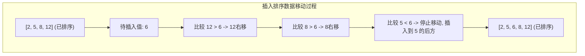
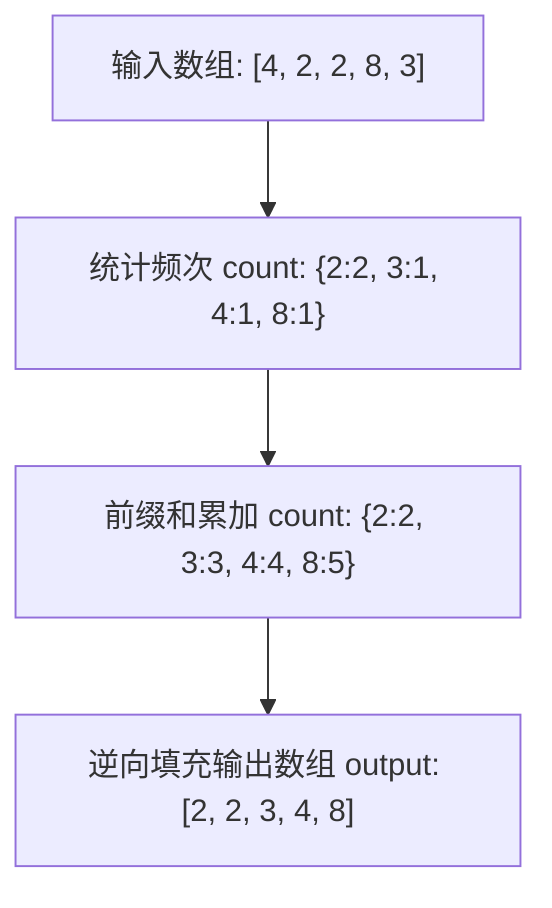
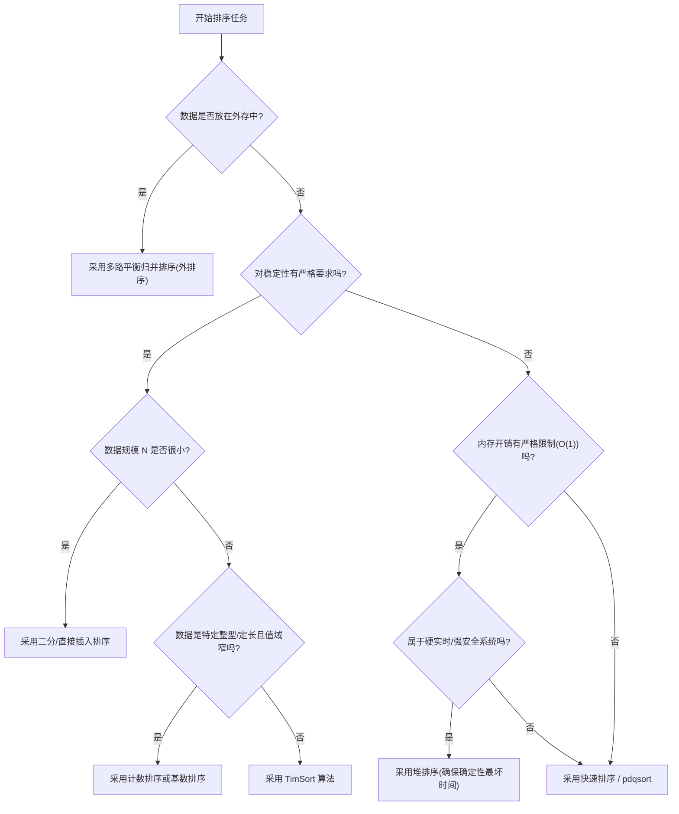

# 1.3.2.2 排序算法

## 引言与排序基本概念

在计算机科学与软件工程的基石中，排序算法（Sorting Algorithms）是最经典、研究最透彻且应用最广泛的课题之一。无论是数据库管理系统中的索引构建、搜索引擎的结果相关性排序，还是操作系统内核中的进程调度与资源分配，排序都扮演着至关重要的底层引擎角色。

排序的物理本质是：给定一个包含 $n$ 个记录的序列 $R_1, R_2, \dots, R_n$，其对应的关键字（Key）序列为 $k_1, k_2, \dots, k_n$。通过特定的算法逻辑，将该序列重新排列为一个新的序列 $R'_{1}, R'_{2}, \dots, R'_{n}$，使得其关键字满足非递减或非递增的单调关系（例如 $k'_{1} \le k'_{2} \le \dots \le k'_{n}$）。

尽管排序的最终外在表现是一致的，但由于计算机硬件架构的演进、内存层次结构（Cache-Memory-Disk）的差异以及各种应用场景下输入数据分布的多样性，计算机科学家们开发出了数十种设计哲学截然不同的排序算法。它们在时间复杂度、空间开销、算法稳定性、硬件友好性以及实现复杂度等方面呈现出多维度的权衡（Trade-offs）。因此，深入理解这些排序算法的物理机制与数学原理，是设计高性能系统底座的必备根基。

---

## 第一部分：排序算法的度量指标与多维判定准则

在实际的软件系统研发中，评估一个排序算法的优劣绝不仅仅是对比其平均时间复杂度。为了在特定的运行环境中做出最合理的工程抉择，必须从稳定性、输入敏感性、空间开销的就地性以及硬件友好性等多个维度对其进行全方位度量。

### 1.1 稳定性（Stability）的本质与系统级影响

#### 1.1.1 稳定性的数学定义
假设在待排序的序列中存在两个具有相同关键字的元素 $R_i$ 和 $R_j$（即 $key_i = key_j$），并且在排序前，$R_i$ 在 $R_j$ 之前（物理位置满足 $i < j$）。如果在排序算法执行完成后，记录 $R_i$ 依然在记录 $R_j$ 之前，那么这种排序算法被称为**稳定的（Stable）**；反之，如果在排序完成后，它们的相对位置可能被颠倒（即 $R_j$ 跑到了 $R_i$ 之前），则该算法是**不稳定的（Unstable）**。

#### 1.1.2 稳定性在多关键字排序中的深远影响
在基础数值类型（如纯整型、浮点数）的排序中，稳定性往往被忽视，因为相同数值在物理上是等价的（两个数值为 5 的变量交换位置并不会影响系统的正确性）。但在面向对象编程与复杂业务系统中，我们处理的均是**复合结构对象（Compound Objects）**，这些对象通常需要经历**多关键字排序（Multi-Key Sorting）**。

##### 典型工程案例：商品排序引擎
假设我们有一个商品实体类 `Product`，其包含两个核心排序维度：
1. `category`（商品类别，以字符串或整型表示）
2. `salesVolume`（销量，整型）

业务部门提出的需求是：**首先将商品按“商品类别”进行归类，在同一种类别内部，按照“销量”从高到低进行降序排列**。

*   **实现方案 A（稳定性算法）**：
    1.  **第一步**：对商品列表进行全局排序，排序关键字为 `salesVolume`（降序）。此时，整个数组按销量有序。
    2.  **第二步**：选择一个**稳定的**排序算法，对上述数组以 `category` 为关键字进行二次排序。
    3.  **结果**：因为第二步的算法是稳定的，当处理具有相同 `category` 的不同商品时，算法承诺不改变它们在第一步排序中确立的相对顺序。由于第一步是以 `salesVolume` 排序的，最终排出来的商品列表在每个类别内部，销量高的一定排在销量低的前面。这种“两次独立单关键字排序”的管道化设计极其优雅且高效。
    
*   **实现方案 B（非稳定性算法）**：
    1.  **第一步**：同样对商品列表进行销量全局降序排序。
    2.  **第二步**：选择一个**不稳定的**排序算法（例如快速排序或堆排序），以 `category` 为关键字进行排序。
    3.  **结果**：当算法对相同类别的商品进行归类时，原本在第一步建立的销量顺序被彻底打乱。排序完成后，同一个类别内的商品，其销量分布将是随机、杂乱的，无法满足业务正确性。

#### 1.1.3 不稳定排序的稳定化改造（Stabilization）
在某些特殊场景下，如果我们不得不使用一个性能极高但本身不稳定的算法（如快速排序），又需要保证稳定性，可以通过**重构关键字**来进行稳定化改造：
*   **做法**：为原数组中的每个元素附加一个**原始索引（Original Index）**字段作为次级关键字。在进行元素比较时，如果主关键字（Key）相等，则强制比较它们的原始索引。
*   **代价**：这需要额外的 $O(n)$ 空间来存储索引，并且增加了比较操作的 CPU 计算开销。

---

### 1.2 时间复杂度度量与输入敏感性

大 O 表示法（Big O Notation）描述的是算法运行时间的上限渐进趋势。为了准确评估排序算法在不同边界状态下的行为，我们必须划分出三种输入状态：

1.  **最好情况时间复杂度（Best-case Time Complexity）**：在最利于算法执行的初始排列状态下所需的渐进时间。例如，插入排序面对完全有序的数组时，仅需 $n-1$ 次比较即可收尾，复杂度为 $O(n)$。
2.  **最坏情况时间复杂度（Worst-case Time Complexity）**：在最不利于算法执行的输入状态下所需的渐进时间。例如，未做优化的快速排序面对完全有序或完全逆序的输入时，会导致严重的树级退化，复杂度退化为 $O(n^2)$。
3.  **平均情况时间复杂度（Average-case Time Complexity）**：输入数据呈随机均匀分布时，算法执行步骤的数学期望值。这通常是最具通用参考价值的工程指标。

#### 1.2.1 输入敏感性（Input Sensitivity）与逆序对（Inversion Pair）
*   **输入敏感度**：如果一个算法的时间开销高度依赖于输入序列的初始有序程度，我们称该算法为**输入敏感的（Input-Sensitive）**。
*   **逆序对定义**：在序列 $a_1, a_2, \dots, a_n$ 中，如果存在 $i < j$ 且 $a_i > a_j$，则 $(a_i, a_j)$ 被称为一个逆序对（Inversion）。
*   **物理意义**：一个无序序列的混乱程度可以用其包含的逆序对总数来度量。完全逆序的序列包含 $\frac{n(n-1)}{2}$ 个逆序对，而完全有序的序列包含 0 个逆序对。
*   任何**只允许交换相邻元素**的排序算法，每次交换操作最多只能消除一个逆序对。因此，这类算法的时间复杂度必然受限于逆序对的总数。对于随机数组，逆序对的期望值为 $\frac{n(n-1)}{4}$。因此，任何基于相邻元素交换的排序算法（如冒泡排序、插入排序），其平均时间复杂度下界必定是 $\Omega(n^2)$。

---

### 1.3 空间复杂度与原地排序（In-place）概念

*   **原地排序（In-place Sort）的严格定义**：
    在算法执行过程中，除了待排序数据本身占据的空间外，算法所消耗的额外辅助内存空间（Auxiliary Space）为常数级别（即 $O(1)$）。
    
*   **隐式栈空间的工程陷阱**：
    快速排序在交换数据时完全是在原数组中进行，看似符合“原地排序”的概念。然而，快速排序的递归分治过程依赖于系统函数调用栈。在每次递归划分后，必须在栈中保存当前子区间的左右指针边界等上下文信息。
    *   **平均/最好情况**：递归树深度为 $O(\log n)$，因此隐式空间复杂度为 $O(\log n)$。
    *   **最坏情况**：递归树退化为单支树，深度为 $O(n)$，空间开销暴增至 $O(n)$。
    如果在大规模数据上触发最坏情况，这会直接击穿系统默认的栈深度限制，导致程序发生**栈溢出崩溃**。因此，在评估原地排序时，不能只关注是否申请了物理辅助数组，必须将系统调用栈的开销纳入考量。

---

## 第二部分：基础经典排序算法的物理逻辑与深度剖析

基础排序算法（冒泡、插入、选择）虽然在处理大规模数据时效率较低，但它们的物理交互机制简单，且在特定场景下（如几乎有序或小规模数据）有着高级算法无法企及的优势。

### 2.1 冒泡排序（Bubble Sort）

#### 2.1.1 物理交互机制与优化变体
冒泡排序的执行逻辑非常直观：它通过不断比较相邻的两个元素，如果它们的顺序不符合预期就进行交换。在一轮完整的扫描过后，未排序区间中的最大元素会像水中的气泡一样，慢慢“浮动”到未排序区间的末尾。

为了减少无谓的循环比较，通常在工业实现和面试考核中引入以下两个重要优化：
1.  **交换标志位（Boolean Flag）**：
    若在某一趟外层循环中，内层循环没有发生任何一次位置交换，说明当前序列已然有序，可立即提前终止程序。
2.  **最后一次交换位置作为下一轮扫描边界（Border Optimization）**：
    在内层循环扫描中，最后一次发生元素交换的位置之后的所有元素，在物理上其实已经处于其最终的有序位置。因此，我们记录下这个最后交换的索引，将其作为下一轮内循环的终止边界。

#### 2.1.2 带有双重优化的冒泡排序通用代码（C++）
```cpp
#include <vector>
#include <algorithm>

void bubbleSort(std::vector<int>& arr) {
    int n = arr.size();
    if (n <= 1) return;
    int sortBorder = n - 1; // 划定初始扫描边界
    for (int i = 0; i < n - 1; ++i) {
        bool isSorted = true;
        int lastExchangeIndex = 0;
        for (int j = 0; j < sortBorder; ++j) {
            if (arr[j] > arr[j + 1]) {
                std::swap(arr[j], arr[j + 1]);
                isSorted = false;
                lastExchangeIndex = j; // 记录最后一次交换位置
            }
        }
        if (isSorted) break; // 若无任何交换，提前结束
        sortBorder = lastExchangeIndex; // 下一轮只扫描到此边界
    }
}
```

#### 2.1.3 复杂度与稳定性分析
*   **时间复杂度**：最好情况为 $O(n)$，最坏与平均情况均为 $O(n^2)$。
*   **空间复杂度**：$O(1)$，为严格的原地排序。
*   **稳定性**：稳定。在判定相邻元素大小时，只有在 `arr[j] > arr[j + 1]` 时才交换。若二者相等，绝不发生交换，因而相同元素的相对位置得到了绝对保持。

---

### 2.2 插入排序（Insertion Sort）

#### 2.2.1 物理交互机制
插入排序的工作逻辑类似于人类整理手中扑克牌的过程。它将整个数组划分为**左侧已排序区间**和**右侧未排序区间**。
在一开始，已排序区间只包含第一个元素（索引 0）。之后，算法依次取出未排序区间的第一个元素（待插入元素），在已排序区间中自后向前（从右向左）进行扫描：
*   如果已排序区间中的元素大于待插入元素，则将该元素向右移动一位，为待插入元素腾出空间。
*   重复此过程，直到找到一个小于或等于待插入元素的元素位置，然后将待插入元素放入该位置。



#### 2.2.2 为什么在几乎有序的小规模数据上插入排序性能极佳？
插入排序是一种高度**输入敏感（Input-Sensitive）**的算法。在“几乎有序”或小规模数据集上，其运行效率甚至可以超越快速排序等分治高级算法。

1.  **元素移动频次的极度降低**：
    当数组几乎有序时，每个待插入元素原本所在的物理位置与其最终的正确位置非常接近。在自后向前扫描已排序区间时，内层 `while` 循环仅需进行极少数次（甚至 0 次）比较就会因为 `arr[j] <= target` 而终止。
    在极限情况下（数组完全有序），内层循环在每次比较后立即退出，数据移动频次为 0。整个算法的总时间开销降为 $n-1$ 次比较，时间复杂度降低到**线性 $O(n)$**。
2.  **现代 CPU 硬件层面的极致契合**：
    *   **CPU 分支预测器（Branch Predictor）的高命中率**：对于几乎有序的数组，内层循环中的条件判断 `arr[j] > target` 的结果高度一致（绝大多数为 `false`）。这使得 CPU 的分支预测器能够达到几乎 100% 的预测准确率，避免了由于分支预测错误导致的流水线被清空和停顿。
    *   **极佳的内存局部性（Locality of Reference）**：插入排序的所有比较和移动操作都是对相邻内存单元的顺序读写。这与现代 CPU 的多级 Cache 预取策略完美吻合，能够最大化地减少 Cache Miss，提升访存带宽。

#### 2.2.3 插入排序的演进：希尔排序（Shell Sort）
由于插入排序在面对完全逆序数据时，每次移动只能跨越一个相邻位置，导致了 $O(n^2)$ 的时间开销。希尔（Donald Shell）在 1959 年提出了**希尔排序（Shell Sort）**，通过引入“增量（Gap）分组”的物理机制打破了这一局限：
*   **物理机制**：将整个待排序序列分割成若干个子序列（由相隔某个“增量”的元素组成），分别进行直接插入排序。随着增量逐渐缩小直至为 1，整个序列在最后一轮便完成了全局插入排序。
*   **性能飞跃**：希尔排序让元素能够跨越长距离进行交换和移动，从而快速消除了大量的逆序对。它的最坏时间复杂度可以被降低到 $O(n^{1.3})$（具体取决于增量序列），成功打破了平方级复杂度的屏障。但希尔排序由于其跨越式的跳跃插入，是**不稳定**的。

#### 2.2.4 插入排序通用代码（Java）
```java
public class InsertionSort {
    public static void sort(int[] arr) {
        if (arr == null || arr.length <= 1) return;
        int n = arr.length;
        for (int i = 1; i < n; i++) {
            int target = arr[i]; // 提取待插入元素
            int j = i - 1;
            while (j >= 0 && arr[j] > target) {
                arr[j + 1] = arr[j]; // 移动位置
                j--;
            }
            arr[j + 1] = target; // 插入正确位置
        }
    }
}
```

---

### 2.3 选择排序（Selection Sort）

#### 2.3.1 物理交互机制
选择排序的物理逻辑是：首先在未排序区间中找到最小（或最大）的元素，然后将它与未排序区间的第一个元素进行交换。此时，该元素被归入已排序区间。接着，算法在剩下的未排序区间中重复此过程，直到整个数组有序。

#### 2.3.2 深度推导：选择排序为什么是不稳定的？
选择排序在各大教科书中都被明确归类为**不稳定的排序算法**。很多初学者常产生误区，认为“如果在寻找最小值时，遇到相同大小的元素我们不更新最小值指针，就可以维持稳定性”。然而，不稳定性其实是由**“跨越式元素交换（Swap）”**引入的。

##### 推导过程与物理演练
假设我们有一个包含重复元素的数组：
`arr = [ 5(A), 8, 5(B), 2, 9 ]`
两个 `5` 的大小完全一致，为了追踪其相对位置，我们分别标记为 `5(A)`（位于索引 0）和 `5(B)`（位于索引 2）。排序前，相对位置为 `5(A) ... 5(B)`。

1.  **扫描未排序区间**：
    算法从索引 0 到 4 扫描，寻找全局最小值。
2.  **确定最小值**：
    经过一轮比较，发现最小值是 `2`，其位于索引 3 的位置。
3.  **执行强制交换**：
    按照选择排序的定义，将找到的最小值 `2` 与当前未排序区间的第一个元素（即位于索引 0 的 `5(A)`）进行位置交换。
4.  **交换后的状态**：
    数组变为：`[ 2, 8, 5(B), 5(A), 9 ]`
5.  **稳定性破坏分析**：
    请注意，此时 `5(A)` 被强行交换到了索引 3，它跑到了原本排在后面的 `5(B)`（索引 2）的后方。在后续的排序流程中，`5(B)` 和 `5(A)` 均已处于有序状态，不会再与任何更小的元素进行位置交换。
    
    排序最终完成后，它们的物理相对顺序定格为 `5(B) ... 5(A)`。
    原本在前的 `5(A)` 在排序后跑到了 `5(B)` 的后面。这一结果证明了选择排序是**不稳定的**。

#### 2.3.3 双向选择排序（Two-Way Selection Sort）的工程陷阱
为了优化选择排序，我们可以采用“双向选择排序”：在每一趟扫描中，同时找出最大值和最小值，分别与无序区的头部和尾部元素进行交换。这可以把外层循环的次数减半。
*   **工程陷阱**：在实现双向选择排序时，如果无序区头部的元素刚好就是这一趟扫描到的最大值，当我们将最小值先与头部元素交换后，最大值的位置已经被挪到了原最小值所在的位置。如果接下来不加检查地直接将最大值与尾部交换，就会把错误的元素交换到尾部。这种**位置重叠覆盖**是经典的实现 bug，在编写交换逻辑时需要额外的重叠边界检查与指针偏移校正。

#### 2.3.4 选择排序通用代码（Go）
```go
package main

func selectionSort(arr []int) {
	n := len(arr)
	if n <= 1 {
		return
	}
	for i := 0; i < n-1; i++ {
		minIndex := i
		for j := i + 1; j < n; j++ {
			if arr[j] < arr[minIndex] {
				minIndex = j
			}
		}
		if minIndex != i {
			arr[i], arr[minIndex] = arr[minIndex], arr[i] // 跨越式交换
		}
	}
}
```

---

## 第三部分：分治与高级排序算法的核心演进

高级排序算法通过引入“分治（Divide and Conquer）”思想，成功将时间复杂度降低到了比较类排序的理论极限 $O(n \log n)$。

### 3.1 快速排序（Quick Sort）

#### 3.1.1 基准值（Pivot）选择与退化规避
快速排序在分治时的核心在于“划分（Partition）”。若每次划分都能将数组均分为相等的两部分，其时间复杂度为 $O(n \log n)$。
若每次选取的 Pivot 均为当前子区间的最大或最小值，划分将发生极度倾斜：一侧有 $n-1$ 个元素，另一侧有 $0$ 个元素。此时，递归树退化为深度为 $n$ 的单支树，时间复杂度退化为 $O(n^2)$。同时，由于操作系统栈空间的限制，深达 $O(n)$ 级的递归调用会耗尽系统栈内存，导致程序因 **Stack Overflow** 而崩溃。

##### Pivot 优化选择策略：
1.  **随机化（Randomized Partition）**：通过随机数生成器在子区间内随机选取一个元素作为基准值。这能从概率上保证最坏情况几乎不可能发生，算法期望时间复杂度为 $O(n \log n)$。
2.  **三数取中法（Median-of-Three）**：取子区间最左端、最右端和正中间的三个元素，对它们进行排序后，选择中间值作为 Pivot。该方案实现代价极低，对完全有序或逆序的数组优化效果极其显著。
3.  **内省排序（Introsort）的兜底机制**：
    在现代标准库（如 C++ 的 `std::sort`）中，为了杜绝快排在最坏情况下的平方级退化，引入了“内省排序（Introsort）”：
    *   主算法使用快速排序。
    *   算法在递归过程中记录当前递归深度。当深度超过阈值 $2 \lfloor \log_2 n \rfloor$ 时，算法自动舍弃快排，切换为**堆排序**。
    *   这保证了算法既能享受快排在平均情况下的高缓存友好度和极致速度，又能在最坏情况下拥有堆排序的 $O(n \log n)$ 性能下限。

#### 3.1.2 双指针分割方案对比：Hoare vs Lomuto

##### 1. Lomuto 分区方案（单向指针）
Lomuto 方案使用快慢指针。慢指针 `i` 指向小于等于 Pivot 区域的边界，快指针 `j` 进行顺序扫描：
*   若 `arr[j] <= pivot`，则将 `i` 向右移动一位，并交换 `arr[i]` 与 `arr[j]`。
*   **缺陷**：
    当面对**包含大量重复元素**的数组时，Lomuto 方案的划分平衡性极差。如果数组的所有元素完全相等，`arr[j] <= pivot` 条件每一次都成立，慢指针 `i` 会跟着快指针一直走到尾部，导致划分出的两个区间极度不对称（一边是整个数组，另一边为空），算法直接退化为 $O(n^2)$。

##### 2. Hoare 分区方案（双向指针）
Hoare 方案使用两个指针 `i` 和 `j` 从子区间的两端向中间靠拢。
*   `i` 寻找第一个大于等于 Pivot 的元素，`j` 寻找第一个小于等于 Pivot 的元素，并交换它们。
*   **优势**：
    在面对完全相等的数组时，由于 `arr[i] < pivot` 和 `arr[j] > pivot` 的条件限制，`i` 和 `j` 在遇到相等的元素时都会停下来进行交换。虽然这会带来一定的交换次数，但它保证了指针相遇的位置始终在数组的几何中心附近。这样，划分出的两个子区间长度几乎相等，确保了递归树的平衡性，成功避免了在大量重复数据下的退化。

##### Hoare 分区与 Lomuto 分区在全等数组下的执行路径推演：
假设数组为 `[5, 5, 5, 5]`，Pivot 选择首元素 `5`。
*   **Lomuto 分区**：
    *   `i` 初始化为 -1。快指针 `j` 从 0 到 3 循环。
    *   因为每一个 `5 <= 5` 均成立，所以每次都会触发 `i++` 并进行自我交换。
    *   最终 `i` 停在 3，划分返回的基准值位置为 3。子数组被划分为 `[5, 5, 5]` 和 `[]`，发生了极端倾斜。
*   **Hoare 分区**：
    *   `i` 从左向右，遇到第一个 `5`（因为不满足 `5 < 5`）停在索引 0。
    *   `j` 从右向左，遇到最后一个 `5`（因为不满足 `5 > 5`）停在索引 3。
    *   交换索引 0 和 3 的元素。指针继续移动。
    *   下一次循环中，`i` 停在索引 1，`j` 停在索引 2，交换它们。
    *   再次移动后，两指针在数组中心相遇并发生交叉，划分点返回索引 1。子数组被完美均分为 `[5, 5]` 和 `[5, 5]`。

#### 3.1.3 最好与最坏复杂度的严格推导
令 $T(n)$ 为排序规模为 $n$ 的数组所需的步数。划分步骤的时间复杂度为线性 $cn$（其中 $c$ 为常数）。

*   **最好情况（对称划分）**：
    每次划分都能平分区间：
    $$T(n) = 2T\left(\frac{n}{2}\right) + cn$$
    根据主定理（Master Theorem），这里 $a=2, b=2, f(n)=cn$。由于 $\log_b a = \log_2 2 = 1$，且 $f(n) = \Theta(n^1)$，根据主定理第一种情况的推广，有：
    $$T(n) = \Theta(n \log n)$$

*   **最坏情况（完全退化）**：
    每次划分，一侧大小为 $n-1$，另一侧为 $0$：
    $$T(n) = T(n-1) + T(0) + cn$$
    由于 $T(0) = O(1)$，我们可以写成：
    $$T(n) = T(n-1) + cn$$
    展开此递推关系：
    $$T(n) = T(n-2) + c(n-1) + cn$$
    $$T(n) = T(1) + c \sum_{i=2}^n i$$
    根据等差数列求和公式：
    $$\sum_{i=2}^n i = \frac{(n+2)(n-1)}{2} = \frac{n^2 + n - 2}{2}$$
    因此，最坏时间复杂度为：
    $$T(n) = O(n^2)$$

#### 3.1.4 原地性与不稳定性
*   **In-place**：快速排序不需要申请与 $n$ 成正比的物理辅助数组，所有数据交换都是在原数组的地址空间上通过临时变量进行。虽然存在系统递归栈开销，但依然属于原地排序。
*   **Unstable**：快速排序的不稳定性源于 Partition 过程中**长距离、非相邻元素的跨越式交换**。在交换时，相同大小的元素的相对位置极易因为跨越交换而被反转。

---

### 3.2 归并排序（Merge Sort）

#### 3.2.1 外排序（External Sorting）的天然适应性
当待排序的数据量极为庞大（例如数十吉字节甚至数太字节），超出了物理内存的承载上限时，数据必须被存放在外存（磁盘）中。传统的快速排序或堆排序依赖于频繁的随机内存寻址，在外存中由于磁盘寻道时间过长，性能会降到无法忍受的程度。

归并排序由于其**顺序读写**的物理特征，成为了外排序的基石算法。

##### 多路平衡归并（Multi-Way Merge）工作机制：
1.  **初始顺段（Run）生成**：
    将磁盘上的大文件分批读入内存（每批大小等于可用内存上限），在内存中使用快速排序或堆排序等高效算法进行排序，生成一个有序的临时小文件（称为初始顺段），写回磁盘。
2.  **多路归并**：
    假设生成了 $k$ 个有序的顺段文件。在内存中开辟 $k$ 个输入缓冲区和一个输出缓冲区。每个输入缓冲区仅装载对应顺段文件的最开头一小部分数据。
3.  **最小堆筛选**：
    在内存中构建一个大小为 $k$ 的最小堆，堆中存放当前每个输入缓冲区的头部元素。每次从堆顶取出全局最小值，写入输出缓冲区。如果输出缓冲区写满了，就一次性将数据刷写回磁盘的最终有序文件中；如果某个输入缓冲区读空了，则从其对应的磁盘顺段文件中读取下一块数据填充缓冲区，并更新最小堆。
4.  **顺序 I/O 优势**：
    整个归并过程是一条单向的、流畅的数据流，磁盘磁头几乎不需要进行大范围的随机寻道。这使得它能以接近磁盘物理写入极限的带宽处理海量数据。

#### 3.2.2 空间开销的必然性
在合并（Merge）两个已排序的子数组 `A` 和 `B` 时，为了不破坏原本的元素，我们必须在每次合并时申请一块大小为 $len(A) + len(B)$ 的临时内存空间。
*   **为什么不能在原数组上直接就地合并？**
    如果我们在原数组上直接执行就地合并，当要把 `B` 数组中的某个小元素插入到 `A` 数组的中间位置时，为了腾出物理空间，必须将 `A` 数组中该插入点之后的所有元素整体向右移动一位。这会导致每一次合并操作的时间复杂度退化为 $O(n^2)$，从而使整个归并排序的渐进复杂度退化到 $O(n^2)$，失去了分治的性能意义。
*   为了维持 $O(n \log n)$ 的高速时间性能，必须牺牲空间，申请 $O(n)$ 级别的辅助数组来辅助合并。

#### 3.2.3 原地归并排序（In-place Merge Sort）的工程权衡
虽然理论上存在原地归并排序算法（如基于内存旋转 Rotation 算法或 Block Merge 算法），其空间复杂度为 $O(1)$ 且能在 $O(n \log n)$ 时间内完成。
*   **工程现状**：这些原地归并算法的内部逻辑极其繁琐，涉及大量的指针旋转和局部置换。这导致其时间复杂度的常数项因子非常大。在实际工程测试中，其运行速度通常比传统的非原地归并慢数倍。因此，在实际工程的通用标准库中，原地归并算法极少被采用。

---

### 3.3 堆排序 (Heap Sort)

#### 3.3.1 堆排序的物理致命伤：CPU Cache 的不友好性
虽然堆排序在时间复杂度上极其优秀（最好、最坏、平均时间复杂度恒定为 $O(n \log n)$），且空间复杂度为严格的原地 $O(1)$。但在现代多级缓存架构的计算机中，堆排序的实际运行效率却通常慢于快速排序。其最核心的瓶颈在于**对 CPU Cache 极其不友好**。

##### 缓存失效分析：
1.  **大跨度的非局部性访存（Cache Locality Failure）**：
    二叉堆虽然在物理上存储于连续的数组中，但它在逻辑上是一棵树。当对堆顶进行 `heapify` 调整时，我们需要不断比较父节点 $i$ 与子节点 $2i+1$ and $2i+2$ 的大小。
    随着树深度的增加，子节点的索引呈指数级翻倍增长。这种大跨度的地址跳转超出了现代 CPU 缓存行（通常为 64 字节）的覆盖范围。这会导致 CPU Cache 预取策略失效，引发大量的 **Cache Miss**，迫使 CPU 频繁地向主存请求数据，产生高昂的延迟开销。
2.  **无谓的比较与物理冗余**：
    在堆排序的第二阶段，我们每次都将堆顶（最大值）与堆底元素进行交换，然后强制其下沉调整。而堆底元素通常是比较小的值，将其换到堆顶后，它几乎必然需要一路下沉到接近叶子节点的位置。这种“先把小元素换到堆顶，再通过多次比较让其下沉”的机制，产生了大量的物理寻址冗余。
    相比之下，快速排序的指针移动是连续的、顺序的，能最大化地利用 L1/L2 缓存的局部性。因此，在内存内排序中，堆排序的实际运行耗时通常是快排的 2 到 3 倍。

#### 3.3.2 堆排序在实时系统与安全关键领域的独特地位
尽管堆排序在 Cache 局部性上存在物理缺陷，但在一些特定的系统开发中，它却是不二之选：

*   **实时操作系统（RTOS）**：
    在硬实时系统（如航空航天控制、汽车主动安全系统）中，系统对任务的响应时间有着确定性的硬性上限要求。快速排序的最坏复杂度为 $O(n^2)$，这是无法容忍的风险；而归并排序需要 $O(n)$ 内存，在内存极其受限的嵌入式微控制器中难以部署。
    堆排序无论输入数据如何分布，其最坏时间复杂度都稳定在 $O(n \log n)$，且仅消耗 $O(1)$ 内存。这种**高度可预测的运行时间**和**常数级空间保障**，使其在实时系统中具有极高地位。

---

## 第四部分：超越比较下界的线性时间非比较排序

比较类排序算法的最坏情况时间复杂度下界是 $\Omega(n \log n)$，这可以通过**决策树模型**（Decision Tree Model）进行证明。
要打破这个下界，算法必须停止“两两元素相互比较”的机制，而是利用数据本身的值域空间特征，通过**计数映射**或**分桶映射**直接定位元素的位置。

### 4.1 比较排序下界的决策树证明
任何基于比较的排序算法都可以表示为一棵二叉决策树。每次比较两个元素 $A$ 和 $B$ 的大小，都会产生两个分支（$A < B$ 或 $A \ge B$）。
对于包含 $n$ 个不同元素的数组，其所有可能的排列方式有 $n!$ 种。若要正确排序，决策树的叶子节点数量 $L$ 必须至少为 $n!$，即：
$$L \ge n!$$
设二叉树的高度为 $h$，一棵高度为 $h$ 的二叉树最多拥有 $2^h$ 个叶子节点，因此有：
$$2^h \ge L \ge n!$$
对两边取以 2 为底的对数，可得：
$$h \ge \log_2(n!)$$
根据斯特林公式（Stirling's approximation）：
$$\ln(n!) \approx n \ln n - n$$
换算为底数为 2 的对数：
$$\log_2(n!) = \frac{\ln(n!)}{\ln 2} \approx n \log_2 n - n \log_2 e$$
因此：
$$h \ge n \log_2 n - O(n)$$
即：
$$h = \Omega(n \log n)$$
由于二叉决策树的高度 $h$ 即代表了算法在最坏情况下需要进行的比较次数，因此任何基于比较的排序算法都无法超越 $O(n \log n)$ 的渐进时间下界。

### 4.2 计数排序（Counting Sort）

#### 4.2.1 工作原理与稳定性保持
计数排序通过统计数组中每个值的出现频次，利用前缀和定位元素最终位置。
为了保持算法的稳定性，我们**从后向前**反向遍历原数组中的每一个元素 `arr[i]`：
*   查找其在累加计数数组中的对应位置 `pos = count[arr[i] - min] - 1`，将 `arr[i]` 放入输出数组 `output[pos]` 中。
*   接着将计数 `count[arr[i] - min]` 的值减 1。
*   **稳定性机制**：因为是从后向前扫描，相同值的元素中排在后面的会先被放置在对应区间的右端。当扫描到前面的相同元素时，由于计数已经减 1，它会被放在左边相邻位置。这保证了相等元素的原有物理顺序得到了绝对的保留。



#### 4.2.2 负数兼容性的工程改造
经典计数排序通常只适用于非负整数。但在实际应用中，数据往往包含负数。我们可以通过**归一化偏移量（Normalization Offset）**来兼容负数：
1.  首先找出数组的最小值 `min`。如果最小值为负数，我们将其绝对值作为偏移量。
2.  在向计数数组 `count` 进行投影统计时，使用 `arr[i] - min` 作为计数数组的索引。
3.  在最后恢复数据时，再将索引值加上 `min` 还原回原始数据。

#### 4.2.3 计数排序前缀和在并行化计算中的演进
传统的计数排序在最后填充阶段是从右向左顺序填充的，这是一种强依赖的前后关联逻辑，无法直接进行多线程并行加速。
但在现代高性能计算中，通过将“前缀和累加”改造为**并行前缀和算法（Parallel Prefix Sum / Scan）**，可以利用 GPU 或多核 CPU 的 SIMD 架构，对计数排序进行极高并发的并行化处理，使其在处理数十亿规模的数据时仍能保持接近物理内存带宽的吞吐速度。

---

### 4.3 桶排序（Bucket Sort）

#### 4.3.1 工作原理
桶排序是计数排序的推广和自适应版本。它利用了映射关系，将数据分发到多个有限数量的“桶”里，每个桶再分别进行排序。

#### 4.3.2 性能分析与数据倾斜退化
*   **时间复杂度**：
    假设有 $n$ 个元素分配到 $m$ 个桶中，数据分布非常均匀，每个桶中平均分配到 $k = n/m$ 个元素。如果对每个桶使用 $O(k \log k)$ 的算法排序，则总时间为：
    $$T(n) = O(n) + m \cdot O\left( \frac{n}{m} \log \frac{n}{m} \right) = O\left( n + n \log \frac{n}{m} \right)$$
    当桶的数量 $m$ 趋近于 $n$ 时，$\log(n/m)$ 趋近于常数，整体时间复杂度收敛于**理想的 $O(n)$**。
*   **最坏退化状态**：如果输入数据存在严重的“数据倾斜（Data Skew）”，所有的元素在映射后都被分配到了同一个桶里。此时，桶排序不仅没有任何分流加速效果，反而因为额外的建桶、分发以及合并逻辑，导致整体性能退化为该桶内部排序算法的时间复杂度。

---

### 4.4 基数排序（Radix Sort）

#### 4.4.1 工作原理与多键排序思想
基数排序是针对多关键字排序而设计的一种非比较排序。对于数字，我们可以将其“每一位”视为一个独立的关键字（例如个位、十位、百位）。
*   **执行方式**：
    1.  **LSD (Least Significant Digit First) 最低位优先**：从最右侧的低位（如个位）开始，依次向高位进行排序。
    2.  **MSD (Most Significant Digit First) 最高位优先**：从最左侧的高位（如最高位）开始，依次向低位进行排序，常采用分治递归的思想。
    工业界应用最广的是 **LSD 模式**。

#### 4.4.2 为什么每一位排序算法必须具备绝对稳定性？
在 LSD 模式下，算法在对高位（如百位）进行分桶排序时，不能打乱低位（如十位、个位）已经排好的顺序。如果底层所采用的每一步单关键字排序算法是不稳定的，那么高位相同的两个数字在分发后，它们的低位先后顺序就会乱掉。这就使得之前在低位排序上所做的努力全部付诸东流。因此，**稳定性是基数排序正确性的生命线**。

---

## 第五部分：工业级混合实用排序算法剖析——TimSort

在现代大型工业级软件系统中，纯粹的教科书式排序算法已极少单独使用。Python、Java 标准库等各大主流平台均采用了以 **TimSort** 为代表的自适应混合排序算法。

### 5.1 TimSort 的核心设计哲学
TimSort 的核心精髓在于：**承认现实世界数据的非随机性，主动识别并寻找输入数据中天然存在的有序段（Runs），以此为基础进行局部的二分插入排序与均衡的平衡合并。**

在现实数据中，往往存在大段已经排好序（升序或降序）的数据。TimSort 能够敏锐地捕捉到这些片段，将降序段进行反转，把升序段直接保留，仅对交界处或混乱处进行微观调整，从而在实际运行中达到了极高的时间效率。

---

### 5.2 TimSort 核心机制深度剖析

#### 5.2.1 minRun 的动态计算公式
为了防止在合并阶段产生大量的细碎 Runs 导致栈频繁调整，TimSort 引入了 `minRun`。
*   如果待排序数组的实际总长度 $N < 64$，则 `minRun` 直接取 $N$。此时算法退化为纯二分插入排序。
*   如果 $N \ge 64$，算法会动态计算出一个介于 32 到 64 之间（包括 32 和 64）的 `minRun` 值。其核心原则是：**使得 $N / minRun$ 的结果等于或者略小于一个 2 的幂次方**（例如 2048, 1024, 512）。这样能保证在随后的平衡二路归并时，归并树是一棵完美的满二叉树，从而使每一次合并的两侧规模最接近，最大化利用 CPU 运算带宽。

#### 5.2.2 栈控制不变量的数学推导与物理机制
TimSort 引入了两个不变量约束（Invariants）来防止合并退化。当有新的 Run 压入栈中时，栈顶的三个 Run 长度 $X$、$Y$、$Z$ 必须满足：
1.  $$Z > Y + X$$
2.  $$Y > X$$

*   **为什么要设计这两个看似奇妙的不等式？**
    如果我们把不变量不等式反向思考，不变量表明：在栈中，从顶向下的 Run 长度应该呈**指数级增长**，其增长速率与斐波那契数列（Fibonacci Sequence）高度相似。
    这保证了栈的深度在任何时刻都不会超过 $O(\log N)$。更重要的是，它保证了**大 Run 不会被过早地参与到与极小 Run 的合并中**。因为每一次合并大数组都会带来高昂的内存拷贝开销，只有等到两个 Run 的规模足够接近时才合并它们，才能将归并的渐进常数项降到最低。

```mermaid
graph TD
    subgraph TimSort 栈结构 (不变量检验)
        Z["Run Z (长度: 120)"] --> Y["Run Y (长度: 50)"]
        Y --> X["Run X (长度: 40)"]
    end
    Note["不满足 Z > Y + X (120 > 50 + 40 成立)\n但满足 Y > X (50 > 40 成立)\n若新压入 Run W (长度: 35)\n将触发不变量校验与合并调整"]
```

#### 5.2.3 Galloping 模式的数学期望与批量拷贝
在归并两个有序序列 $A$ 和 $B$ 时，通常需要遍历比较。如果在归并过程中，发现 $A$ 数组中的元素连续多次（默认阈值为 7 次）均小于 $B$ 数组中的当前元素，说明 $A$ 数组中可能存在一大片元素都小于 $B$ 的当前值。

此时，算法切换到 **Galloping（飞奔）模式**：
*   **指数跳跃定位**：在 $A$ 数组中，我们以步长为 1, 2, 4, 8, 16 向上跳跃，直到找到第一个大于 $B[0]$ 的元素。这样可以在 $O(\log k)$ 的时间内将查找范围缩小到一个极窄的区间 $[2^p, 2^{p+1}]$。
*   **二分精确查找**：在上述窄区间内，使用二分查找精确定位到具体的插入边界。
*   **批量内存拷贝**：利用操作系统的底层物理内存批量拷贝指令，将 $A$ 中这一整段元素一次性移动到最终位置。这避免了逐个元素比较的 CPU 指令耗时，大幅提升了数据移动效率。

#### 5.2.4 TimSort 核心算法流程骨架（Java）
为了避免冗长的辅助代码，以下给出 TimSort 运行骨架的紧凑实现：
```java
public class TimSortSkeleton {
    private static final int MIN_MERGE = 32;

    public static void sort(int[] arr) {
        int n = arr.length;
        if (n <= 1) return;

        int minRun = minRunLength(n);
        
        // 顺序扫描并识别 Run，不足 minRun 长度的用二分插入排序扩展
        for (int i = 0; i < n; ) {
            int runLen = identifyRun(arr, i, n);
            if (runLen < minRun) {
                int forceLen = Math.min(n - i, minRun);
                binaryInsertionSort(arr, i, i + forceLen, i + runLen);
                runLen = forceLen;
            }
            // 压入合并栈并进行不变量校验合并（此处简化为逻辑步骤）
            pushAndCollapseStack(arr, i, runLen);
            i += runLen;
        }
        
        // 强制合并栈中剩余的所有 Runs
        forceMergeAllRemainingRuns(arr);
    }

    private static int minRunLength(int n) {
        int r = 0;
        while (n >= MIN_MERGE) {
            r |= (n & 1);
            n >>= 1;
        }
        return n + r;
    }

    private static int identifyRun(int[] arr, int lo, int hi) {
        if (lo + 1 >= hi) return 1;
        int runLen = 2;
        if (arr[lo + 1] < arr[lo]) { // 降序，继续扫描并反转
            while (lo + runLen < hi && arr[lo + runLen] < arr[lo + runLen - 1]) {
                runLen++;
            }
            reverseRange(arr, lo, lo + runLen);
        } else { // 升序
            while (lo + runLen < hi && arr[lo + runLen] >= arr[lo + runLen - 1]) {
                runLen++;
            }
        }
        return runLen;
    }

    private static void binaryInsertionSort(int[] arr, int lo, int hi, int start) {
        for (; start < hi; start++) {
            int pivot = arr[start];
            int left = lo, right = start;
            while (left < right) {
                int mid = (left + right) >>> 1;
                if (pivot < arr[mid]) right = mid;
                else left = mid + 1;
            }
            System.arraycopy(arr, left, arr, left + 1, start - left);
            arr[left] = pivot;
        }
    }

    private static void reverseRange(int[] arr, int lo, int hi) {
        hi--;
        while (lo < hi) {
            int tmp = arr[lo];
            arr[lo++] = arr[hi];
            arr[hi--] = tmp;
        }
    }

    // 占位逻辑函数，表示不变量合并流程与终极合并
    private static void pushAndCollapseStack(int[] arr, int base, int len) {}
    private static void forceMergeAllRemainingRuns(int[] arr) {}
}
```

---

### 5.3 现代语言标准库的新星：pdqsort (Pattern-Defeating Quicksort)
近年来，除了 TimSort 之外，**pdqsort**（模式消解快速排序）在 C++（Boost 库）、Rust 核心库及 Go 1.19+ 默认切片排序中逐渐成为新的非稳定排序事实标准。
*   **设计思路**： pdqsort 是对快速排序的一种极其现代的重构优化。它保留了快排的原地性，但通过**自适应地识别各种糟糕的模式**（如完全有序、逆序、大量重复元素等），自动在这几种情况之间进行秒级转换：
    *   在检测到无序区分块不均衡时，退化为堆排序。
    *   在检测到大片重复元素时，使用特殊的**三路分区（Three-Way Partition）**将相等元素一步到位归类，避免重复比较。
    *   使用分支无感知（Branchless）的分区算法设计，消除了 CPU 分支预测失败的开销。
这代表了现代物理硬件环境下，高级排序算法融合优化的又一顶峰。

---

## 第六部分：总结与工程实践决策指南

在底座开发与系统设计中，并没有绝对完美的“通用”算法，只有立足于应用场景、数据特征以及硬件约束下的“最优选”。

### 6.1 排序算法选择决策矩阵



### 6.2 实践总结
1.  **极小数据集（$N \le 32$）**：无论何种场景，由于函数调用开销和内存抖动，经典的**插入排序**在热路径上始终表现最佳。
2.  **对象列表与稳定多关键字排序**：在通用语言的对象排序中，**TimSort** 以其高度的自适应性及稳定特性，成为了公认的首选。
3.  **内存高度敏感与嵌入式/实时场景**：面对硬实时中断响应和微控制器级别的常数内存限制，**堆排序**以其恒定的最坏时间保证与零额外内存分配，提供了无可替代的工程价值。
4.  **大规模数值计算与多核并行**：对于大范围的基础整型数据，通过配合 GPU/SIMD 架构进行并行的**计数或基数排序**，能够实现超越比较下界的吞吐效率。

