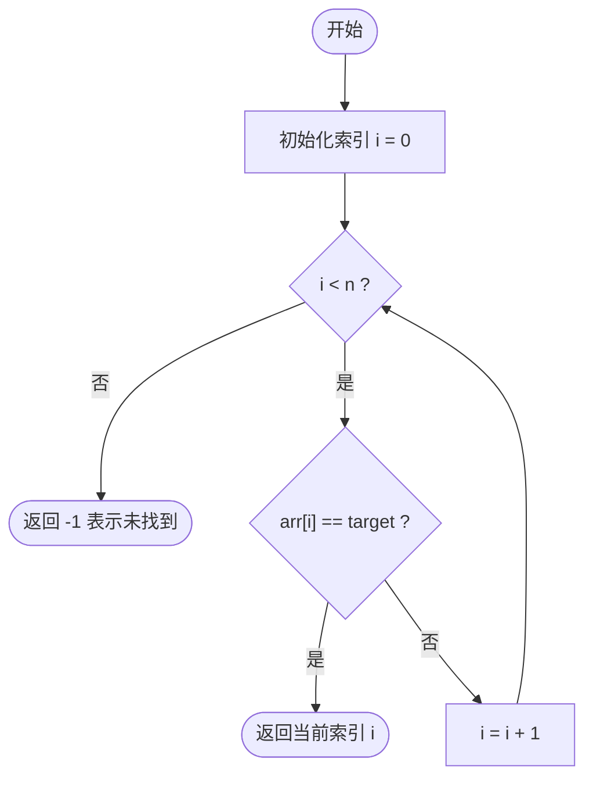
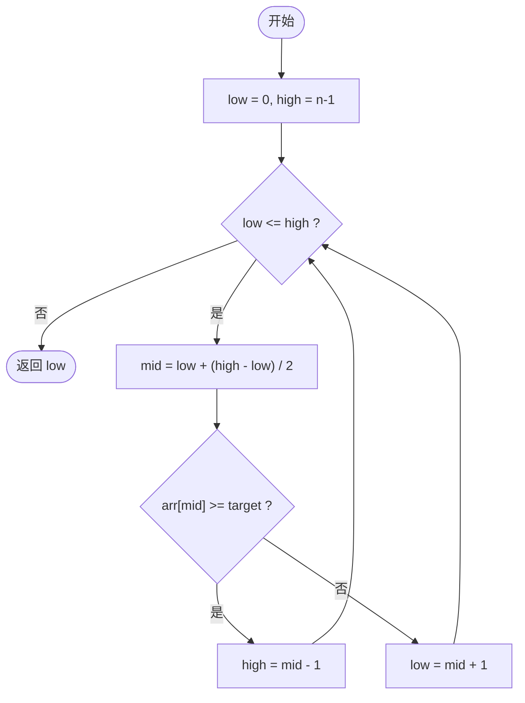
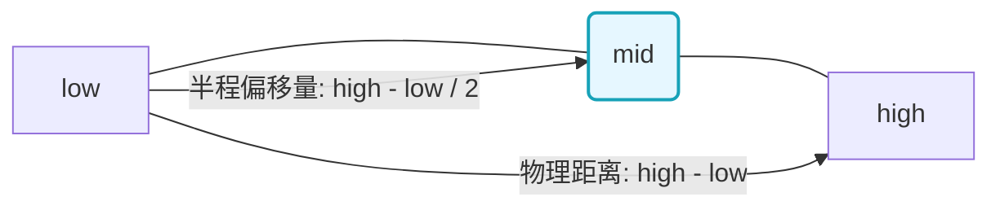
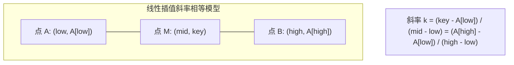

# 1.3.2.3 查找算法

## 常见查找算法底层原理与比较

### 导论
在计算机科学与软件工程的广袤领域中，查找（Search / Retrieval）是指在一个特定的数据集合中，根据给定的检索键（Search Key），通过某种系统化的步骤与策略定位到与之匹配的记录（Record）或元素，并获取其物理或逻辑地址的计算过程。查找操作是整个现代计算系统的基石。无论是底层的数据库存储引擎索引检索、编译器前端词法分析中的符号表解析，还是操作系统内核级的文件系统寻址、分布式高性能缓存系统的路由映射，查找算法的效率都直接且决定性地制约着整个系统的吞吐量（Throughput）与响应时延（Latency）。

查找算法的效率并非仅取决于时间复杂度与空间复杂度这两个在图灵机模型下的抽象理论维度。在真实物理计算机体系中，查找操作的微观性能表现深受底层计算机硬件架构的深切制约。具体而言，它受到以下三个物理维度的直接影响：
1. **物理存储介质的随机访问特性**：顺序存储结构（如数组）支持以 $O(1)$ 的开销进行任意地址跳转，而链式存储结构（如单链表）则必须顺着物理指针链依次遍历，这种物理寻址能力的差异从根本上限定了算法分支选择的边界。
2. **内存层次结构与高速缓存局部性**：现代 CPU 采用多级高速缓存（L1, L2, L3 Cache）以弥补 CPU 运算速度与动态随机存取内存（DRAM）读取速度之间几个数量级的鸿沟。数据在内存中的连续度（如数组的物理连续与链表的物理离散）直接决定了 Cache Line 的加载效率与 CPU 硬件预取器（Hardware Prefetcher）的命中概率。
3. **指令流水线与分支预测**：现代 CPU 普遍使用超标量（Superscalar）和深流水线（Deep Pipeline）架构。在查找算法中，为了缩减空间或判断状态，不可避免地会引入大量的条件分支语句。频繁的条件分支极易导致 CPU 分支预测失败（Branch Misprediction），从而带来清空流水线（Pipeline Flush）的沉重时延代价。

因此，对查找算法的分析，不仅要从数学模型的角度推导其渐进复杂度，更要从底层微观硬件的运行机理出发，剖析其在真实机器上的执行开销。本文将以查找算法的底层机制为轴，深入剖析线性检索、哨兵优化、折半检索（及三大边界模板）、插值检索、斐波那契检索以及哈希检索的执行逻辑、数学模型、退化机制与硬件级优化策略。

---

## 1. 线性检索 (Linear Search)

### 1.1 基本机制与形式化描述
线性检索，在某些学术文献中也被称为顺序检索（Sequential Search），是所有查找算法中最为直观、最不依赖数据结构先验知识的基础算法。其物理执行逻辑极度简单：从数据集的起始边界开始，顺次将每一个被遍历元素的检索键与目标检索键进行逐一比对。一旦二者物理相等，则表示检索成功，算法立即中断并输出该元素对应的存储索引；若遍历至数据集的终止边界仍未能建立相等关系，则输出检索失败的信息。

形式化地，设有一组包含 $n$ 个记录的有限序列：
$$S = \{s_0, s_1, s_2, \dots, s_{n-1}\}$$
其对应的检索键序列为 $K = \{k_0, k_1, k_2, \dots, k_{n-1}\}$。给定待查找的检索键为 $key$，线性检索的目标是寻找一个索引 $i \in [0, n-1]$，满足 $k_i = key$。其基本迭代控制逻辑可以通过如下伪代码（以通用 C/C++ 结构为例）表达：

```c
int standard_linear_search(const int arr[], int n, int target) {
    for (int i = 0; i < n; i++) {
        if (arr[i] == target) {
            return i; // 命中目标，返回逻辑索引
        }
    }
    return -1; // 遍历结束，未能匹配，返回失败标识
}
```



### 1.2 无序列表检索局限与时间复杂度数学分析
线性检索不需要数据集具备任何单调性、分布规律或者特殊的物理连续度。这种“无条件依赖”是其最大的生存空间，但随之而来的代价则是低效的检索表现。在一个完全无序的列表中，由于没有任何关于数据分布的先验知识（Priori Knowledge），我们无法在检索过程中排除任何子空间，每一次比较都是孤立的。

#### 1.2.1 时间复杂度分析
- **最好情况（Best Case）**：待查找的目标元素恰好位于序列的第一个物理单元（即 $arr[0]$ 处）。算法仅需执行 1 次值比较，时间复杂度为 $\Theta(1)$。
- **最坏情况（Worst Case）**：目标元素位于序列的最后一个位置（即 $arr[n-1]$ 处），或者根本不存在于该序列中。算法必须完整地遍历整个序列，执行 $n$ 次边界判断与 $n$ 次值匹配比对，时间复杂度为 $\Theta(n)$。
- **平均情况（Average Case）**：这是评估查找算法常规表现的核心指标。我们引入概率论模型进行推导。
  设目标元素存在于序列中的概率为 $p$（通常在闭合数据集内部检索时，假设 $p=1$）。假设目标元素在序列的 $n$ 个位置上出现的概率是完全均等的，即对于任意 $i \in [0, n-1]$，其概率 $P(s_i) = \frac{1}{n}$。
  成功检索时，所需的平均比较次数（Average Search Length, ASL）为：
  $$ASL_{succ} = \sum_{i=1}^{n} P(s_i) \times i = \sum_{i=1}^{n} \frac{1}{n} \times i = \frac{1}{n} \sum_{i=1}^{n} i = \frac{1}{n} \times \frac{n(n+1)}{2} = \frac{n+1}{2}$$
  如果考虑目标元素可能不存在于序列中，则有 $1-p$ 的概率发生检索失败，此时必须比较 $n$ 次。因此，总的平均比较次数为：
  $$ASL_{total} = p \times ASL_{succ} + (1-p) \times n = p \times \frac{n+1}{2} + (1-p)n = n - p \frac{n-1}{2}$$
  当 $p=1$ 时，$ASL_{total} = \frac{n+1}{2}$。无论概率 $p$ 如何取值，只要它是一个常数，线性检索的平均时间复杂度在渐进意义上都牢牢锁定在 $O(n)$ 级别。

#### 1.2.2 局限性分析
1. **数据规模敏感性**：当数据规模 $n$ 膨胀至 $10^7$ 甚至更高数量级时，线性检索的 CPU 时钟周期消耗呈线性暴增，会迅速吃满单核计算资源。
2. **总线带宽瓶颈**：每一次比较都需要将内存中的数据通过系统总线加载至 CPU 寄存器中，在海量数据检索中，这会带来高额的内存带宽消耗，导致 I/O 堵塞。
3. **缺乏状态持久化**：线性检索是一种“无记忆”的查找，前一次检索的结果与过程无法为下一次检索提供任何加速，每次检索都是一次全新的 $O(n)$ 遍历。

---

### 1.3 哨兵优化法 (Sentinel Search)
为了在无序列表检索中榨干最后一丝 CPU 性能，计算机科学家提出了“哨兵优化法（Sentinel Search）”。该方法在微观执行效率上对传统线性检索进行了极其巧妙的改良。

#### 1.3.1 哨兵优化的核心原理
在传统的线性检索循环体内部，每一次迭代都必须包含**两类**逻辑判断：
1. `i < n`：用于防止数组越界访问的边界判断。
2. `arr[i] == target`：用于核对键值是否匹配的数据匹配判断。

虽然 `i < n` 这一判断非常简单，但在循环被执行数百万次时，该判断所消耗的 CPU 指令周期、寄存器比较操作以及伴随的条件跳转指令，将汇聚成一股不可忽视的开销。
**哨兵优化的精髓在于：在数组的物理末尾（或头部多预留的一个插槽中）临时强行写入待查找的目标值本身（这一被强行写入的值被称为“哨兵”，Sentinel）**。
由于数组的末端必然存在目标值，算法在遍历时**绝无可能**发生越界，因为最坏情况下，它也必然会在这个“哨兵”位置命中并终止。因此，我们可以在循环体中彻底拿掉 `i < n` 这一边界检查。

#### 1.3.2 C 语言实现与微观逻辑剖析
以下为哨兵优化的 C 语言代码实现：

```c
int sentinel_linear_search(int arr[], int n, int target) {
    if (n <= 0) return -1;
    
    // 特殊情况处理：如果末尾元素本身就是目标值，直接返回
    if (arr[n - 1] == target) {
        return n - 1;
    }
    
    // 暂存原数组最后一个元素的值，以便后续恢复
    int temp = arr[n - 1];
    
    // 将待查找的目标值写入数组末尾，充当“哨兵”
    arr[n - 1] = target;
    
    int i = 0;
    // 核心循环：此时完全去除了 i < n 的边界检查，只有数据匹配判断
    while (arr[i] != target) {
        i++;
    }
    
    // 恢复数组末尾原先的数值，避免破坏原始数据
    arr[n - 1] = temp;
    
    // 如果 i 停留在 n-1 之前，或者原先的最后一个元素就是 target
    // 说明在非哨兵位置或者本来的末尾位置找到了目标
    if (i < n - 1 || temp == target) {
        return i;
    }
    
    return -1; // 停在哨兵位置且原末尾元素不等于 target，说明数据集中无此元素
}
```

#### 1.3.3 汇编指令与 CPU 运行机制级分析
为了彻底讲透哨兵优化的威力，我们必须将高级语言编译后的机器指令放到 CPU 的执行机制中进行剖析。

在 x86-64 架构下，传统的线性查找核心循环编译出的伪汇编代码如下：
```assembly
.Lloop_start:
    cmp  rax, rcx         ; 检查 i (rax) 是否小于 n (rcx)
    jge  .Lnot_found      ; 若 i >= n，跳转至未找到分支
    mov  edx, [rdi+rax*4] ; 将 arr[i] 读入 edx 寄存器
    cmp  edx, esi         ; 比较 arr[i] (edx) 与 target (esi)
    je   .Lfound          ; 若相等，跳转至成功分支
    inc  rax              ; i++
    jmp  .Lloop_start     ; 跳回循环起点
```
在这段常规代码中，每次循环包含了 **2 次比较指令（`cmp`）** 和 **2 次条件跳转指令（`jge`, `je`）**，以及 1 次无条件跳转指令（`jmp`）。

而在引入哨兵后，编译出的核心循环汇编代码被极度精简为：
```assembly
.Lloop_start:
    mov  edx, [rdi+rax*4] ; 将 arr[i] 读入 edx 寄存器
    cmp  edx, esi         ; 比较 arr[i] (edx) 与 target (esi)
    je   .Lloop_exit      ; 若相等，跳出循环
    inc  rax              ; i++
    jmp  .Lloop_start     ; 跳回循环起点
```
此时，循环体内仅剩下 **1 次比较指令** 与 **1 次条件跳转指令**。

这一改进在现代超深流水线 CPU 上能带来显著的性能提升：
1. **指令周期缩减**：每次迭代的机器指令数减少了约 40%，直接降低了 CPU 执行单元（Execution Unit）的负担。
2. **缓解分支预测器的压力**：现代 CPU 依赖分支预测器（Branch Predictor）预测条件跳转指令的走向，以提前将指令载入流水线。当遇到 `jge .Lnot_found` 时，预测器需要不断做出判断，直到循环结束时发生预测失败，清空流水线。哨兵优化直接干掉了这个多余的分支判断，使得 CPU 只需要维护一个匹配判断分支。由于在绝大多数迭代中，目标值不会立即匹配成功，分支预测器会稳定地预测“不跳转”，流水线运行极其顺畅，从而在微观层面上实现了实质性的加速。

---

## 2. 折半检索 (Binary Search / 二分查找)

折半检索（Binary Search），常被称为二分查找，是一种基于经典分治（Divide and Conquer）策略的检索算法。通过将当前检索区间均分成两半，并根据中点元素与目标值的大小关系，选择性地保留左半部分或右半部分，从而实现搜索空间的指数级压缩。

### 2.1 物理前提：为什么必须是“顺序存储且物理有序”？
二分查找的效率极高，但它对物理存储和数据状态有着极其严苛的物理前提限制：

1. **必须采用顺序存储结构（即支持 $O(1)$ 随机访问的数组）**：
   二分查找在每一轮折半时，都必须通过索引 `mid = (low + high) / 2` 直接获取中点元素的值。对于数组而言，由于其在物理内存中是连续分配的，CPU 可以通过首地址加偏移量直接计算出目标元素的物理内存地址，在 $O(1)$ 时间内完成读取。
   如果将数据存储在单链表中，尽管链表中的数据是有序的，但由于链表在物理内存上是散落分布的，无法进行地址直接计算。为了获取中点元素 $arr[mid]$，我们必须从链表头节点开始，顺着 `next` 指针顺序遍历 $mid$ 次，这需要耗费 $O(n)$ 的寻址时间。这会导致二分查找的整体时间复杂度直接退化为 $O(n)$，彻底失去了分治加速的物理基础。

2. **数据表中的元素必须是单调有序的**：
   单调性是折半剪枝的数学先验条件。正因为数组是有序的（例如单调递增：$arr[i] \le arr[i+1]$），当我们在中点发现 $arr[mid] > target$ 时，我们才能基于传递律确信：在 $mid$ 右侧的所有元素（即所有满足 $j \ge mid$ 的元素）也必然满足 $arr[j] > target$。基于这一先验，我们才能安全地将整个右半区间 $[mid, high]$ 从搜索空间中直接裁剪掉。

---

### 2.2 二分查找三种经典模板及边界条件精细推演
二分查找虽然逻辑清晰，但在实际编码时，“边界条件”的控制是出了名的难缠，极其容易导致死循环或漏掉边界元素。下面我们将对三类最经典的二分查找模板进行严密的数学和物理推演。

#### 2.2.1 模板一：基础精确查找（精确查找某个值）
**适用场景**：在一个单调递增且**无重复元素**的数组中，寻找精确等于 `target` 的元素的物理索引。

##### 1. 区间定义与循环不变式
该模板的核心在于采用**双闭区间** $[low, high]$ 进行检索控制。
- **初始状态**：`low = 0`，`high = n - 1`。这代表待查找的有效范围覆盖了从索引 0 到 $n-1$ 的所有元素。
- **循环终止条件**：`low <= high`。
  当该条件不满足时，即 `low > high`（在步长为 1 的移位下，即 `low = high + 1`），区间变成了 $[high + 1, high]$。这是一个在数学上毫无意义的空集。这意味着所有的可能空间都已被排查完毕，算法应该终止。
- **状态转移逻辑**：
  计算中点 $mid$。
  - 若 $arr[mid] == target$：正好命中，直接返回 $mid$。
  - 若 $arr[mid] > target$：说明中点值大于目标值。由于数组单调递增，中点右侧的所有元素也都必然大于目标值，所以右侧被安全排除。同时，因为当前 $mid$ 处的元素已经被验证为不等于 $target$，所以新搜索区间无需包含 $mid$。区间收缩为左半闭区间 $[low, mid - 1]$。因此，执行 `high = mid - 1`。
  - 若 $arr[mid] < target$：同理，中点及其左侧元素均小于目标值，被安全排除。新搜索区间收缩为右半闭区间 $[mid + 1, high]$。因此，执行 `low = mid + 1`。

##### 2. 通用语言代码实现
```java
int binary_search_exact(const int arr[], int n, int target) {
    int low = 0;
    int high = n - 1;
    
    while (low <= high) {
        int mid = low + (high - low) / 2;
        if (arr[mid] == target) {
            return mid;
        } else if (arr[mid] > target) {
            high = mid - 1; // 严格收缩右界
        } else {
            low = mid + 1;  // 严格收缩左界
        }
    }
    return -1; // 搜索空间收敛为空，未找到
}
```

##### 3. 边界极限测试与不变性证明
- **单元素边界测试**：设数组长度为 1（`n=1`，`low=0, high=0`）。
  进入循环（满足 `0 <= 0`），计算得 `mid = 0`。
  - 若 `arr[0] == target`，匹配成功，返回 0。
  - 若 `arr[0] > target`，`high` 变为 `-1`，进入下一轮迭代前，判断 `low <= high`（`0 <= -1`）为假，循环安全退出，返回 `-1`。
  - 若 `arr[0] < target`，`low` 变为 `1`，判断 `low <= high`（`1 <= 0`）为假，循环安全退出，返回 `-1`。
  整个过程符合数学逻辑，且无死循环死锁。

---

#### 2.2.2 模板二：查找第一个等于或大于等于目标的边界模板（左边界/Lower Bound）
**适用场景**：在一个包含**重复元素**的单调递增数组中，寻找第一个**大于等于** `target` 的元素的物理索引。这在数学上被称为寻找下界（Lower Bound），通常代表该目标值在有序数组中可以被插入的最左侧合法位置。

##### 1. 区间定义与逻辑推演
为了寻找左侧边界，我们同样在闭区间 $[low, high]$ 上进行精细操作。
- **初始状态**：`low = 0`，`high = n - 1`。
- **循环终止条件**：`low <= high`。
- **状态转移逻辑**：
  - 若 $arr[mid] \ge target$：这说明当前中点处的值已经落在了“大于等于目标值”的有效区间内。由于我们的目标是寻找“第一个”大于等于目标的元素，这个 $mid$ 可能就是我们要找的起点，但也可能在 $mid$ 的更左侧还有其他元素同样满足该条件。为了不丢失这个潜在的合规位置，同时继续向左探索，我们需要将右边界向左收缩。由于 $mid$ 位置已被记录，我们可以安全地收缩到 `high = mid - 1`。
  - 若 $arr[mid] < target$：说明中点值严格小于目标。因为数组递增，包括 $mid$ 在内的左侧所有元素都必定小于目标。因此，我们要找的下界必然在 $mid$ 的右侧，我们直接将左边界右移：`low = mid + 1`。

##### 2. 终止状态与指针物理含义证明
当 `low > high`（即 `low = high + 1`）时，循环强行终止。我们来推演最后一步的临界状态：
- 设在倒数第二步，区间收缩到仅剩一个元素，此时 `low == high`。
- 计算中点 `mid = low`。
- 此时程序必进以下两个分支之一：
  - **分支一：`arr[mid] >= target`**：
    执行 `high = mid - 1`。此时 `high` 变得小于 `low`，循环结束。
    由于 `low` 在这一步没有发生改变，它依然指向 `mid`。而我们在这一步判定了 `arr[mid] >= target`。同时，由于我们在之前的收缩中，所有被排除在 `low` 左侧的元素都是严格小于 `target` 的。因此，当前的 `low` 就是全数组第一个大于等于 `target` 的索引。
  - **分支二：`arr[mid] < target`**：
    执行 `low = mid + 1`。此时 `low` 变得大于 `high`，循环结束。
    既然 $arr[mid]$ 已经小于 `target`，那么它绝不可能是大于等于 `target` 的下界，只有它的下一个位置 `mid + 1` 才可能是。因此，`low` 更新为 `mid + 1` 是完全正确的，它刚好指向了第一个可能大于等于 `target` 的元素。
- **结论**：当循环终止时，`low` 指针总是精准地指向第一个大于等于 `target` 的位置。



##### 3. 代码实现
```cpp
int lower_bound(const int arr[], int n, int target) {
    int low = 0;
    int high = n - 1;
    
    while (low <= high) {
        int mid = low + (high - low) / 2;
        if (arr[mid] >= target) {
            high = mid - 1; // 锁定右界，尝试向左挤压
        } else {
            low = mid + 1;  // 目标值偏大，向右挤压左界
        }
    }
    // 退出时，low 的值即为第一个 >= target 的索引。
    // 注意：若 target 大于数组中的所有元素，low 最终会收敛至 n。
    return low; 
}
```

---

#### 2.2.3 模板三：查找最后一个等于或小于等于目标的边界模板（右边界/Upper Bound）
**适用场景**：在一个包含**重复元素**的单调递增数组中，寻找最后一个**小于等于** `target` 的元素的物理索引。这在数学上也被称为寻找上界（Upper Bound）。

##### 1. 区间定义与逻辑推演
- **初始状态**：`low = 0`，`high = n - 1`。
- **循环终止条件**：`low <= high`。
- **状态转移逻辑**：
  - 若 $arr[mid] \le target$：说明当前中点的值落在了“小于等于目标值”的合规区间内。因为我们要寻找的是“最后一个”合规元素，该元素可能就是 $mid$，也可能在 $mid$ 的右侧。为了向右探测更靠后的可能位置，我们主动将左边界向右推进：`low = mid + 1`。
  - 若 $arr[mid] > target$：说明中点值严格大于目标。由于递增关系，从 $mid$ 开始往右的所有元素都必然大于目标。因此，右侧区间被安全排除，我们执行：`high = mid - 1`。

##### 2. 终止状态与指针物理含义证明
当 `low > high` 时循环终止。我们同样推演最后一步 `low == high` 的临界状态：
- 计算 `mid = low`。
- 此时程序将进入以下两个分支之一：
  - **分支一：`arr[mid] <= target`**：
    执行 `low = mid + 1`。此时 `low` 超过 `high`，循环终止。
    由于 `high` 维持原状不变（依然等于 `mid`），且当前位置满足 `arr[mid] <= target`。而在之前的排查中，所有被排除在 `high` 右侧的元素都是严格大于 `target` 的。因此，当前的 `high` 就是最后一个小于等于 `target` 的元素索引。
  - **分支二：`arr[mid] > target`**：
    执行 `high = mid - 1`。此时 `high` 变得小于 `low`，循环终止。
    由于 $arr[mid]$ 已经大于 `target`，它不能作为小于等于目标的上界，只有它的前一个位置 `mid - 1` 才可能是。因此，`high` 更新为 `mid - 1`，精准指向了上界位置。
- **结论**：当循环终止时，`high` 指针总是精准地指向最后一个小于等于 `target` 的位置。

##### 3. 代码实现
```cpp
int upper_bound(const int arr[], int n, int target) {
    int low = 0;
    int high = n - 1;
    
    while (low <= high) {
        int mid = low + (high - low) / 2;
        if (arr[mid] <= target) {
            low = mid + 1;  // 锁定左界，尝试向右挤压
        } else {
            high = mid - 1; // 目标值偏小，向左挤压右界
        }
    }
    // 退出时，high 的值即为最后一个 <= target 的索引。
    // 注意：若 target 小于数组中的所有元素，high 最终会收敛至 -1。
    return high;
}
```

---

### 2.3 避坑细节：防溢出的中点计算公式物理推导
在很多教科书中，二分查找的中点计算常直接表述为：
$$mid = \frac{low + high}{2}$$
在纯粹的数学代数运算中，该公式是毫无瑕疵的。然而，在真实的计算机软硬件体系结构中，这行代码潜藏着一个经典的 **整型溢出（Integer Overflow）** 安全漏洞。

#### 2.3.1 溢出机理剖析
在主流编程语言中，整型（如 32 位 signed int）能表示的数值是有上限的。设其最大正整数表示范围为 $V_{max}$（在 32 位有符号整型下，$V_{max} = 2^{31} - 1 = 2,147,483,647$）。
当我们在一个超大型数组中执行检索时，随着检索范围不断向右半区域收缩，`low` 和 `high` 的数值都会变得非常庞大。如果发生以下情况：
$$low + high > V_{max}$$
那么，`low + high` 的加法运算结果在计算机底层的补码加法器中，会直接越过符号位，溢出变成一个**负数**。随后，将这个负数除以 2，得到的 `mid` 依然是一个负值。
当程序尝试用这个负值索引去访问内存 `arr[mid]` 时，在 C/C++ 中会引发未定义行为（Undefined Behavior），极大可能导致非法内存段错误（Segmentation Fault）；而在 Java 等强安全语言中，则会直接抛出 `ArrayIndexOutOfBoundsException` 异常，导致程序崩溃。

#### 2.3.2 物理推导过程
为了规避由于两数直接相加导致的溢出问题，我们必须换一种计算思路，将绝对位置计算转化为**相对偏移计算**。

我们知道，`low` 和 `high` 是数轴上的两个物理坐标点。
1. 首先计算这两个坐标点之间的物理跨度（距离）：
   $$Distance = high - low$$
   因为在查找过程中，我们始终有 $0 \le low \le high$，所以两数相减的结果 $high - low$ 永远是正数，且其最大值绝对不会超过数组的最大容量，因而**绝对没有溢出的风险**。
2. 接下来，计算这个跨度的一半：
   $$Half\_Distance = \left\lfloor \frac{high - low}{2} \right\rfloor$$
3. 最后，从基准坐标点 `low` 开始，向右平移这一半的距离，即可精准定位到它们的中点：
   $$mid = low + Half\_Distance = low + \left\lfloor \frac{high - low}{2} \right\rfloor$$

通过这个推导，原本高风险的两个大数加法 `low + high`，被巧妙地转换成了“两个大数做减法，然后再与大数做加法”的形式：
$$mid = low + \frac{high - low}{2}$$
这一公式确保了在所有计算步骤中，中间结果与最终结果都严格控制在 $[0, V_{max}]$ 区间内，从数学与物理上双重消除了溢出隐患。



#### 2.3.3 位运算优化及其语法陷阱
在追求极致性能的底层开发中，除法指令通常比较缓慢。由于二进制右移一位等价于除以 2，开发者常将其改写为位运算：
```java
int mid = low + ((high - low) >> 1);
```
**致命陷阱警告**：
在主流语言的算术运算符优先级中，**加减法运算符（`+`, `-`）的优先级明显高于移位运算符（`>>`, `<<`）**。
如果由于粗心，漏掉了外层括号，写成：
```java
int mid = low + (high - low) >> 1; // 错误写法！
```
编译器会将其解析为：
```java
int mid = (low + (high - low)) >> 1; // 等价于 high >> 1
```
这不仅彻底算错了中点位置，还失去了防溢出的保护，是工程开发中必须警惕的低级语法陷阱。

---

### 2.4 时间复杂度 $O(\log n)$ 的数学严密推导
为了严谨地证明二分查找的时间复杂度为 $O(\log n)$，我们这里给出两种证明路径。

#### 2.4.1 基于主定理（Master Theorem）的推导
在每一轮二分查找中，算法都需要计算一次中点并进行一次值比较（常数级开销 $\Theta(1)$），随后将问题规模缩减为原来的一半。
由此，我们可以写出其运行时间的递推关系方程（Recurrence Relation）：
$$T(n) = T\left(\frac{n}{2}\right) + \Theta(1)$$
根据主定理，对于形如 $T(n) = aT(n/b) + f(n)$ 的分治递推式：
这里对应的常数因子为 $a = 1, b = 2$，而额外开销项为 $f(n) = \Theta(1) = \Theta(n^0)$。
计算特征指数：
$$\log_b a = \log_2 1 = 0$$
因为 $f(n) = \Theta(n^{\log_b a}) = \Theta(n^0)$，这完美符合主定理的第二种情况（Case 2）。
根据主定理推论，该递推式在渐进意义下的解为：
$$T(n) = \Theta\left(n^{\log_b a} \log n\right) = \Theta(n^0 \log n) = \Theta(\log n)$$
即二分查找的时间复杂度为 $O(\log n)$。

#### 2.4.2 基于几何级数收缩极限的直观推导
假设数组的初始物理长度为 $n$。在最坏情况下，每一次比较都没能命中，检索区间被迫对半收缩：
- 第 1 次迭代后，区间长度剩余：$n \times \frac{1}{2}$
- 第 2 次迭代后，区间长度剩余：$n \times \left(\frac{1}{2}\right)^2$
- 第 $k$ 次迭代后，区间长度剩余：$n \times \left(\frac{1}{2}\right)^k$

当检索区间被彻底收缩到仅剩 1 个元素时（此时将进行最后一次比较，随后跳出），满足：
$$n \times \left(\frac{1}{2}\right)^k = 1 \implies 2^k = n \implies k = \log_2 n$$
因此，算法在最坏情况下的最大比对次数为：
$$k_{max} = \lceil\log_2 n\rceil$$
这同样证明了二分查找的时间复杂度上限为 $O(\log n)$。

---

## 3. 插值检索 (Interpolation Search) 与斐波那契检索 (Fibonacci Search)

尽管二分查找表现优异，但它对区间划分的策略是极其机械的“对半均分”。这种划分机制完全忽略了待查找的数据本身与区间两个端点值之间的数值比例关系。在很多特定的有序数据分布场景下，我们完全可以通过更科学的“估算”公式来加速检索过程。

### 3.1 插值检索 (Interpolation Search)

#### 3.1.1 比例切分定位的数学原理与物理推导
插值检索是二分查找在数学层面的精细化变体。它的核心逻辑类似于人们日常查阅纸质字典：如果要查找以字母 “B” 开头的单词，我们绝不会从字典的物理正中间位置翻开，而是会直接从靠近开头的前几页开始翻阅；反之，若要查找以 “Y” 开头的单词，我们会选择直接从字典的末尾往前翻。

插值查找的核心数学假设是：**数据表中的所有数据元素，其数值大小在物理索引区间内是呈现“均匀分布（Uniform Distribution）”的**。
基于这一前提，我们可以将索引的确定从“固定 0.5 比例位置”改为“基于线性插值公式估算出的比例位置”。

**数学公式推导过程**：
设有序数组为 $A$，当前检索区间的低位索引为 $low$，高位索引为 $high$，对应的存储数值分别为 $A[low]$ 和 $A[high]$。我们需要定位的目标值为 $key$。
我们希望计算出一个自适应的中点索引 $mid$，使得在该处的元素估算值 $A[mid]$ 能够尽可能逼近 $key$。

假设点 $(low, A[low])$、$(mid, key)$ 和 $(high, A[high])$ 在笛卡尔坐标系中处于同一条直线上（即数值随索引呈完美的线性递增分布）。
根据直线的斜率公式，这三点构成的两个线段，其斜率必然完全一致：
$$\frac{key - A[low]}{mid - low} = \frac{A[high] - A[low]}{high - low}$$
我们的目标是求解估算索引 $mid$。对上式进行代数变形与移项：
1. 等式两边同时乘以 $(mid - low)$，并除以右侧的分子：
   $$mid - low = \frac{key - A[low]}{A[high] - A[low]} \times (high - low)$$
2. 将 $low$ 移至等式右侧，最终推导出插值查找的定位公式：
   $$mid = low + \frac{key - A[low]}{A[high] - A[low]} \times (high - low)$$



#### 3.1.2 均匀分布下的时间复杂度 $O(\log \log n)$
在数据确实呈严格均匀分布（如连续随机数列表）的情况下，插值查找展现出了极其恐怖的收敛速度。每一轮定位都能极其精准地落在目标值的物理邻域内。
经严密的数学证明，在均匀分布的前提下，插值查找的时间复杂度为：
$$T(n) = O(\log(\log n))$$
对于一个拥有 40 亿（$4 \times 10^9$）条记录的超大型均匀分布表：
- 二分查找大约需要 $\log_2(4 \times 10^9) \approx 32$ 次比较。
- 插值查找平均仅需 $\log_2(\log_2(4 \times 10^9)) \approx \log_2(32) = 5$ 次左右的比较。
这种性能提升在数据规模巨大时是极具工程诱惑力的。

#### 3.1.3 数据极度不均匀时的退化机制分析
然而，插值查找是一把极易伤己的双刃剑。它极度依赖其数学假设——“均匀分布”。一旦真实数据分布发生扭曲，如呈现偏态分布、指数分布、幂律分布，或者数组中存在极少数极端值（Outliers），插值查找的性能将发生灾难性的崩溃。

**退化实例深度解剖**：
假设我们有一个长度为 10 的有序数组：
$$A = [1, 2, 3, 4, 5, 6, 7, 8, 9, 1000000]$$
这个数组绝大部分元素非常平缓，但最后一个元素陡增到 $1,000,000$（严重的右偏态数据分布）。
现在，我们尝试在其中查找目标值 `2`。
- **第一轮迭代**：
  - $low = 0, A[low] = 1$
  - $high = 9, A[high] = 1000000$
  - $key = 2$
  - 计算估算索引 $mid$：
    $$mid = 0 + \frac{2 - 1}{1000000 - 1} \times (9 - 0) = \frac{1}{999999} \times 9 \approx 0.000009$$
    经过计算机向下取整后，得到 $mid = 0$。
  - 比较结果：$A[0] = 1 < 2$，导致左边界收缩：`low = mid + 1 = 1`。
- **第二轮迭代**：
  - $low = 1, A[low] = 2$
  - $high = 9, A[high] = 1000000$
  - 计算中点：
    $$mid = 1 + \frac{2 - 2}{1000000 - 2} \times (9 - 1) = 1 + 0 = 1$$
  - 比较结果：$A[1] = 2 == 2$，命中。

在上面的例子中，虽然在第二步由于目标值太靠近左侧而侥幸命中，但我们可以清晰地看到：由于数组末尾大数 $1,000,000$ 的拉扯，导致每次计算出来的 $mid$ 都几乎只比 $low$ 增加 0。
如果我们尝试查找一个不存在的数，比如 `15`。由于估算中点的斜率完全被极端值扭曲，算法每一次计算出的 $mid$ 都极其缓慢地从 0, 1, 2, 3 $\dots$ 顺次递增。每一轮迭代仅仅剪掉了 1 个元素。
这种情况下，**插值查找退化成了披着查找外衣的线性查找，时间复杂度退化为 $O(n)$**。
因此，在现代软件工程实践中，除非能确保数据是高度均匀分布的，否则极少采用纯粹的插值查找。常见的折中方案是限制插值比例，或者在检测到区间收缩率过低时，强制降级为二分查找。

---

### 3.2 斐波那契检索 (Fibonacci Search)

#### 3.2.1 黄金分割原理与斐波那契数列区间划分机制
斐波那契检索（Fibonacci Search）是另一种对二分查找进行区间划分改良的高效算法。不同于二分查找每次固定以 $0.5$ 比例切分，也不同于插值查找根据数值动态插值，斐波那契检索利用了**黄金分割比（Golden Ratio $\approx 0.618$）**这一数学规律。

该算法的核心设计建立在斐波那契数列的物理拆分规律之上。
根据定义，斐波那契数列满足递推关系式：
$$F(k) = F(k-1) + F(k-2), \quad (k \ge 2)$$
为了将其映射到物理空间划分上，我们将公式等式两边同时减去 1，得到：
$$(F(k) - 1) = (F(k-1) - 1) + 1 + (F(k-2) - 1)$$
这是一个在物理空间上极为优雅的区间拆分公式。它意味着：**一个物理长度为 $F(k) - 1$ 的有序数组，可以被完美地切分为三个紧密衔接的部分**：
1. **左半部分子数组**：其长度刚好为 $F(k-1) - 1$。
2. **分割点元素**：占据 $1$ 个元素位置，其物理索引位置为 $mid = low + F(k-1) - 1$。
3. **右半部分子数组**：其长度刚好为 $F(k-2) - 1$。

```mermaid
flowchart LR
    Sub1["左半子数组长度: F("k-1") - 1"] --- Mid["分割点索引: mid"]
    Mid --- Sub2["右半子数组长度: F("k-2") - 1"]
    style Mid fill:#fff3cd,stroke:#ffc107,stroke-width:2px
```

当算法在 $mid$ 位置进行比对后：
- 若 $arr[mid] > target$：说明目标元素必然在左半区域。左半区域的长度正好符合下一个较小的斐波那契分布（即长度为 $F(k-1) - 1$）。因此，我们只需要将查找项的索引向左收缩，使得斐波那契级别 $k$ 递减 1（`k = k - 1`）。
- 若 $arr[mid] < target$：说明目标元素在右半区域。右半区域的长度符合另一个斐波那契分布（即长度为 $F(k-2) - 1$）。我们令 `low = mid + 1`，并将斐波那契级别 $k$ 递减 2（`k = k - 2`）。
- 若相等，则命中目标。

#### 3.2.2 物理地址计算中无乘除法的底层技术优势
二分查找需要计算 $mid = low + (high - low)/2$。虽然除以 2 能够被高级编译器识别并直接优化为移位操作（`>> 1`），但在某些陈旧的微处理器、低功耗嵌入式处理器（如某些早期的 8 位/16 位单片机或特定的数字信号处理器 DSP）中，**乘法与除法指令可能根本没有硬件乘法器支持**，全靠软件模拟实现，因而执行周期极长。

斐波那契检索最大的底层技术优势在于：**在整个迭代核心循环体内，彻底消除了乘除法运算**。
由于 $F(k) - 1$ 的拆分比例直接存储在预先生成的斐波那契数组中，计算下一个分割点索引仅需要一次整数加减法：
```java
mid = low + fib[k - 1] - 1;
```
随后的区间转移控制，也仅仅涉及 $k$ 值的常数减法（`k = k - 1` 或 `k = k - 2`）。这种**纯加减法**的运算特点，使得它能够在硬件计算单元极度受限的微观设备中，展现出显著高于插值查找甚至二分查找的运行效能。

#### 3.2.3 斐波那契查找步骤与通用 C++ 代码实现
1. **寻找匹配的斐波那契长度**：首先在预设的斐波那契表中，找到一个满足 $F(k) - 1 \ge n$ 的最小斐波那契数 $F(k)$。
2. **辅助数组扩充（Padding）**：因为原数组实际长度 $n$ 极大概率达不到 $F(k)-1$，为了防止越界，我们需要扩展数组，将索引从 $n$ 到 $F(k)-1$ 之间的所有空间，全部复制填充为原数组最后一个元素 $arr[n-1]$ 的值。
3. **收敛迭代**：按照斐波那契拆分逻辑进行边界的加减推进。

```cpp
#include <vector>
#include <iostream>

// 预生成斐波那契数列，防止在核心算法中重复计算
std::vector<int> build_fibonacci_table(int limit) {
    std::vector<int> fib = {0, 1};
    while (fib.back() < limit) {
        fib.push_back(fib[fib.size() - 1] + fib[fib.size() - 2]);
    }
    return fib;
}

int fibonacci_search(const std::vector<int>& arr, int target) {
    int n = arr.size();
    if (n == 0) return -1;

    // 1. 生成足够长度的斐波那契表
    std::vector<int> fib = build_fibonacci_table(n + 100);
    
    // 2. 找到最小的 k，使得 F(k) - 1 >= n
    int k = 0;
    while (fib[k] - 1 < n) {
        k++;
    }

    // 3. 构建临时数组扩容至 F(k) - 1 长度，尾部用原数组末尾元素填充
    std::vector<int> temp = arr;
    temp.resize(fib[k] - 1, arr[n - 1]);

    int low = 0;
    int high = n - 1;

    while (low <= high) {
        if (k < 1) break; // 斐波那契项越界防范

        int mid = low + fib[k - 1] - 1;

        if (target < temp[mid]) {
            // 目标在左侧子区域，新区间长度为 F(k-1) - 1
            high = mid - 1;
            k = k - 1; 
        } else if (target > temp[mid]) {
            // 目标在右侧子区域，新区间长度为 F(k-2) - 1
            low = mid + 1;
            k = k - 2;
        } else {
            // 命中，但需判断该位置是原数组中真实的元素还是填充元素
            if (mid < n) {
                return mid;
            } else {
                return n - 1; // 落在填充部分，返回原数组末尾索引
            }
        }
    }
    return -1;
}
```

---

## 4. 哈希检索 (Hash Search)

哈希检索（Hash Search）代表了查找算法领域的一种颠覆性范式。此前探讨的所有检索算法（线性、二分、插值、斐波那契），其本质都是**“基于值比较的查找”**。在数学信息论的限制下，基于比较的查找算法其平均时间复杂度下界在渐进意义上无法突破 $\Omega(\log n)$。而哈希检索力图打破这一理论天花板，实现与数据集规模无关的常数级查找。

### 4.1 哈希查找机制与数学模型
哈希检索的数学核心是建立了一座连接键值空间与物理内存地址空间的“桥梁”——**哈希函数（Hash Function）**。
设所有可能存入的数据键值空间为 $K$，哈希表在内存中分配的物理地址范围为：
$$D = \{0, 1, 2, \dots, m-1\}$$
我们定义一个映射函数：
$$h: K \to D$$
对于任意插入或需要检索的键值 $key \in K$，通过计算 $h(key)$，我们能立即得到该键值在内存数组中的存储下标。
- **理想状态**：哈希函数是完美单射，且映射结果极其均匀地散落在物理空间内。此时，要检索某个值，仅需要计算一次 $h(key)$ 并执行一次内存存取即可，时间复杂度为惊人的 **$O(1)$**。

---

### 4.2 哈希冲突对检索复杂度的劣化影响
由于实际应用中，键值的取值空间 $K$（如所有可能的英文字符串组合）往往是极其庞大甚至无穷的，而我们在物理内存中能够为哈希表申请的槽位数 $m$ 总是有限的。
根据**鸽巢原理（Pigeonhole Principle）**，必然存在两个完全不同的键值 $key_1 \neq key_2$，使得它们的哈希函数输出值完全相同：
$$h(key_1) = h(key_2)$$
这一现象被称为**哈希冲突（Hash Collision）**。一旦发生冲突，多个数据元素就会被分配到相同的物理存储槽位中。若冲突处理机制不佳，哈希表的检索效率将会面临严重的退化风险。

#### 4.2.1 冲突解决策略及其检索路径退化分析
1. **链地址法（Separate Chaining）**：
   哈希表中的每一个槽位不直接存储数据元素，而是指向一个单链表的头指针。所有发生冲突的元素，直接挂载到对应槽位的单链表上。
   - **检索路径**：先计算 $h(key)$ 定位到特定的桶（Bucket），随后在挂载的单链表上执行**顺序线性检索**。
   - **最坏劣化分析**：如果哈希函数设计不当，或者遭受恶意的 Hash DoS 攻击，使得所有存入的键值计算出的哈希值全部相同，那么所有记录都将被塞进同一个链表中。此时，原本设计为 $O(1)$ 的哈希检索，将彻底退化为时间复杂度为 **$O(n)$** 的单链表线性检索。

2. **开放寻址法（Open Addressing）**：
   所有的记录直接存放在哈希表的连续物理槽位中。当计算出的首要地址发生冲突时，通过探测算法生成一个探测序列，依次尝试表中的下一个可能位置。
   其探测寻址公式为：
   $$H_i(key) = (h(key) + d_i) \pmod m, \quad i = 1, 2, \dots, m-1$$
   - **线性探测（Linear Probing）**：$d_i = i$。冲突时，依次检查后方的相邻物理槽位。
     - **劣化机理**：线性探测会引发严重的**一次聚集（Primary Clustering）**。即物理相邻被占用的连续空间会像滚雪球一样越来越大。任何落在此区域附近的冲突，都必须顺次遍历这块庞大的连续区域，使得检索路径显著变长。
   - **二次探测（Quadratic Probing）**：$d_i = \pm i^2$。以平方的步长跳跃探测，可以有效避免邻近物理块的一次聚集，但在相同哈希值的冲突处理上，依然存在二次聚集。
   - **双重哈希（Double Hashing）**：$d_i = i \times h_2(key)$。步长由第二个哈希函数决定，使冲突数据分布更随机，彻底消除聚集。但由于需要进行二次哈希计算，运算开销有所上升。

#### 4.2.2 负载因子对检索性能的量化推导
负载因子（Load Factor）是评估哈希查找健康度的最关键量化参数，定义为：
$$\alpha = \frac{n}{m}$$
其中，$n$ 是当前已经写入哈希表的记录总数，$m$ 是哈希表在内存中申请的物理插槽总数。
我们通过排队论模型，可以给出在不同冲突处理机制下，成功检索（Successful Search）与失败检索（Unsuccessful Search）所对应的平均比较次数（平均查找长度 ASL）。

- **链地址法下的性能推导**：
  在简单一致哈希假定（Simple Uniform Hashing Assumption）下，表中的元素完全随机地被分配到各个桶中。每个桶下的平均链表长度正好为负载因子 $\alpha$。
  - **检索失败时的 ASL**：由于需要将目标桶下的链表从头到尾全部比对一遍才能判定不存在，所以平均比较次数为：
    $$U_n \approx 1 + \alpha$$
  - **检索成功时的 ASL**：假设每次查找的目标都是等概率存在的。我们可以推导出其平均比较次数为：
    $$S_n \approx 1 + \frac{\alpha}{2}$$

- **开放寻址法（线性探测）下的性能推导**：
  由于聚集现象的存在，探测序列并不是完全独立的。其查找次数推导公式极度依赖负载因子 $\alpha$：
  - **检索失败时的 ASL**：
    $$U_n \approx \frac{1}{2}\left(1 + \frac{1}{(1-\alpha)^2}\right)$$
  - **检索成功时的 ASL**：
    $$S_n \approx \frac{1}{2}\left(1 + \frac{1}{1-\alpha}\right)$$
  
  这两个公式揭示了一个极其残酷的物理现象：当负载因子 $\alpha \to 1$ 时（即物理哈希表几乎快要装满时），检索失败的 ASL 会因为分母中二次方的趋近于 0，呈现出**二次级数的爆发性增长**。
  例如，当负载因子 $\alpha = 0.9$（哈希表被占用了 90% 的空间）时：
  - 检索失败的平均比较次数：
    $$U_n \approx \frac{1}{2}\left(1 + \frac{1}{(1-0.9)^2}\right) = \frac{1}{2}(1 + 100) = 50.5 \text{ 次比较}$$
  原本设计精良的 $O(1)$ 级别算法，其实际物理比较次数竟然劣化了 50 倍。这也是为什么在高性能软件开发中，通常会为哈希表设置一个默认扩容阈值（如负载因子触发阈值通常设定为 $0.75$），一旦超出，便会触发重新哈希（Rehash）并进行内存扩容，以强行将 $\alpha$ 拉回低位。

```mermaid
plot
    title "Load Factor vs. Average Search Length (ASL)"
    x-axis "Load Factor (alpha)"
    y-axis "ASL (Comparisons)"
```

#### 4.2.3 现代工程优化手段
为了规避哈希表由于高负载或极端冲突导致的时间复杂度彻底退化，现代高性能底层设计引入了防御性的转化技术。
以典型的工业级实现为例：
当链地址法中某个特定桶的单链表长度增长超过阈值（如设为 8）且表总容量足够大时，系统会将该槽位下的单链表**结构性重构为红黑树（Red-Black Tree）**。
这一转化的核心设计理念在于：当冲突元素较少时，单链表的物理结构极为简单，内存占用极低，遍历开销可忽略不计；而当冲突元素异常暴增时，红黑树的自平衡性质可以强行将局部检索的最坏时间复杂度控制在 **$O(\log k)$**（$k$ 为冲突元素的数量），从而彻底断绝了发生 $O(n)$ 退化带来的系统瘫痪风险。

---

## 5. 查找算法的综合维度对比

不同的查找算法在数学复杂性、内存消耗、硬件友好性上各有侧重。在构建大规模分布式系统或进行底层软件设计时，掌握各算法的微观细节是进行准确架构选型的前提。

### 5.1 指标对比汇总表

| 算法维度 | 最好时间复杂度 | 最坏时间复杂度 | 平均时间复杂度 | 空间复杂度 | 必须物理有序？ | 依赖随机寻址？ | 物理内存连续性要求 | 典型适用场景 |
| :--- | :--- | :--- | :--- | :--- | :--- | :--- | :--- | :--- |
| **线性检索** | $O(1)$ | $O(n)$ | $O(n)$ | $O(1)$ | 否 | 否 | 连续或离散皆可 | 小规模无序数据集、链表检索 |
| **哨兵检索** | $O(1)$ | $O(n)$ | $O(n)$ | $O(1)$ | 否 | 否 | 物理连续（需多预留尾部插槽） | 微观性能敏感的无序小数组 |
| **二分查找** | $O(1)$ | $O(\log n)$ | $O(\log n)$ | $O(1)$ | **是** | **是** | 必须连续 | 中大规模静态有序表、只读索引 |
| **插值检索** | $O(1)$ | $O(n)$ | $O(\log \log n)$| $O(1)$ | **是** | **是** | 必须连续 | 大规模且极度均匀的数据检索 |
| **斐波那契检索**| $O(1)$ | $O(\log n)$ | $O(\log n)$ | $O(n)$ | **是** | **是** | 必须连续 | 无乘除法硬件单元的微处理器设备 |
| **哈希检索** | $O(1)$ | $O(n)$ | $O(1)$（低载下）| $O(n)$ | 否 | **是** | 表体物理连续，冲突项可离散 | 缓存表路由、数据库单点 Key 快速定位 |

---

### 5.2 内存布局与缓存局部性（Cache Locality）的深度探讨
在经典的算法大纲中，我们往往假设对于任意内存地址的读取，其物理时延都是相等的（这是理论上 Random Access Machine 模型的假设）。但在现代多级存储层级结构（Memory Hierarchy）下，这一假设是完全不成立的。

#### 5.2.1 现代 CPU 多级缓存物理常识
现代 CPU 读取内存并不是直接以单个变量为单位的。
- 每次发生内存读取指令，CPU 都是以 **缓存行（Cache Line，通常为 64 字节）** 为最小单位，将包含该数据在内的连续 64 字节物理内存整体搬运至 CPU 的高速缓存（L1/L2/L3 Cache）中。
- 同时，现代 CPU 内部集成了**硬件预取器（Hardware Prefetcher）**。当它检测到当前代码以固定的物理跨度（特别是顺序的、步长为常数的模式）读取内存时，它会主动通过系统总线，在 CPU 执行到相关指令前，提前把接下来几组 Cache Line 加载进 L1/L2 缓存中。

#### 5.2.2 数组上的二分查找 vs 链表上的二分查找：物理机制的绝对对立
我们在前文中提到，链表上的二分查找，其时间复杂度从数学逻辑上就已经退化到了 $O(n)$，这是因为无法通过 $O(1)$ 寻址中点。
但即便我们设计出了一种在逻辑结构上支持 $O(\log n)$ 检索的链式结构（例如二叉搜索树、跳表），在底层硬件上，其微观运行速度也常常会显著落后于基于物理连续数组实现的二分查找。

其根本物理原因就在于**缓存局部性（Cache Locality）**与**缓存缺失（Cache Miss）**：

1. **物理连续度差异**：
   - **数组**：在物理内存上是一段完全连续的存储块。数组上的二分查找虽然在中点跳转时会产生一定的跨度，但当搜索区间被压缩到一定大小以内时（例如当区间内的元素总大小少于 64 字节），整个子数组会被完美地容纳在同一个 Cache Line 中。后续的比较、更新区间指针等操作，将完全在 CPU 的 L1/L2 缓存内部完成。
   - **链式结构（包含二叉树、跳表节点）**：节点通常是通过运行时 `new` 或 `malloc` 在堆（Heap）区动态申请的。这意味着它们在物理内存空间上极大概率是离散且杂乱分布的。

2. **缓存失效（Cache Miss）带来的时延瓶颈**：
   - 在二叉树中，当 CPU 访问 $Node_A$ 的内存时，搬运到 Cache Line 中的 64 字节数据大半都是与当前查找无关的内存数据，而其子节点 $Node_{left}$ 的物理地址可能处于非常遥远的位置。
   - 当程序执行 `node = node->left` 尝试访问下一层节点时，由于物理地址不连续，极大概率无法在 L1/L2/L3 缓存中命中，从而引发一次严重的 **Cache Miss**。
   - **时延对比**：CPU 执行一次普通的寄存器操作或 L1 缓存读取大约仅需 0.5ns 至 1ns（约 1 个 CPU 时钟周期）；而一次严重的 Cache Miss 导致总线发起对 DRAM 物理内存的直接读取，则需要耗费 **50ns 到 100ns**（相当于 100 到 200 个 CPU 周期）。
   在查找深层树节点或长链表节点时，每一次指针解引用都在迫使 CPU 陷入漫长的“主存等待”中。这种由于物理离散分布带来的硬件等待，使得链式结构即使有着 $O(\log n)$ 的逻辑复杂度，其微观物理耗时也难以企及紧凑的物理连续数组。

```mermaid
flowchart TD
    subgraph 数组: 内存物理连续 (Cache Line 加载高效)
        A1["arr 0"] === A2["arr 1"] === A3["arr 2"] === A4["arr 3"]
    end
    subgraph 链式树节点: 内存物理离散 (Cache Line 命中率极低)
        N1["Node A"] -.->|地址离散| N2["Node B"]
        N2 -.->|物理跨度大| N3["Node C"]
    end
    style A1 fill:#e2f0d9,stroke:#385723
    style A2 fill:#e2f0d9,stroke:#385723
    style A3 fill:#e2f0d9,stroke:#385723
    style A4 fill:#e2f0d9,stroke:#385723
    style N1 fill:#fce4d6,stroke:#c65911
    style N2 fill:#fce4d6,stroke:#c65911
    style N3 fill:#fce4d6,stroke:#c65911
```

---

### 5.3 工程选型决策与最佳实践指导

在实际的软件架构与底层开发中，查找算法的选型切忌生搬硬套复杂度指标，而是应当根据数据集大小、读写频率、物理介质等特征做出最合理的权衡：

1. **对于极小规模数据集（如元素个数 $n < 64$）**：
   优先选择最朴素的**线性检索**或**哨兵检索**。
   **决策理由**：在此规模下，$O(n)$ 与 $O(\log n)$ 在执行次数上的差异非常微弱。线性查找没有额外的边界控制或复杂数学公式开销，且数组在物理上的绝对连续特征能带来 100% 的 CPU 高速缓存命中率。实际性能往往优于包含复杂分支判断的二分查找。

2. **静态数据集且伴随高频检索（如编译器关键字词典、离线静态配置索引）**：
   首选在系统初始化时，先对数据进行一次全局排序（虽然有一次性 $O(n \log n)$ 成本），随后使用**数组二分查找（配合模板一或模板二）**。
   若已明确数据集元素数值呈现极高的均匀分布，可以尝试使用**插值检索**。

3. **动态高频写入且高频检索（如数据库引擎索引、文件目录表）**：
   不宜直接选用连续数组二分查找。因为虽然查找是 $O(\log n)$，但数组由于需要维持物理连续，其插入与删除的最坏时间复杂度为 $O(n)$，会产生巨大的数据搬移成本。
   在此场景下，应选择**平衡二叉树（如红黑树、AVL树）**或**多路平衡搜索树（如 B+ 树）**。它们将物理连续要求妥协为链式离散，以在动态变化中为插入、删除和查找同时提供稳定的 $O(\log n)$ 保证。

4. **超高频的单点 Key 对值映射检索（如路由转发、进程 ID 映射、缓存 Key 匹配）**：
   首选**哈希检索**。
   但在工程落地时，必须注意以下三点：
   - 严格选择分布性好、防碰撞的散列函数（如工程中常用的 MurmurHash 或 SipHash）。
   - 严格监控负载因子，当 $\alpha > 0.75$ 时强制进行扩容与 Rehash，以防检索路径发生严重的退化。
   - 在高并发或数据安全性要求极高的场合，建议采用“链表超过阈值转换为红黑树”的防御性实现，以封死哈希冲突引发的拒绝服务攻击瓶颈。
