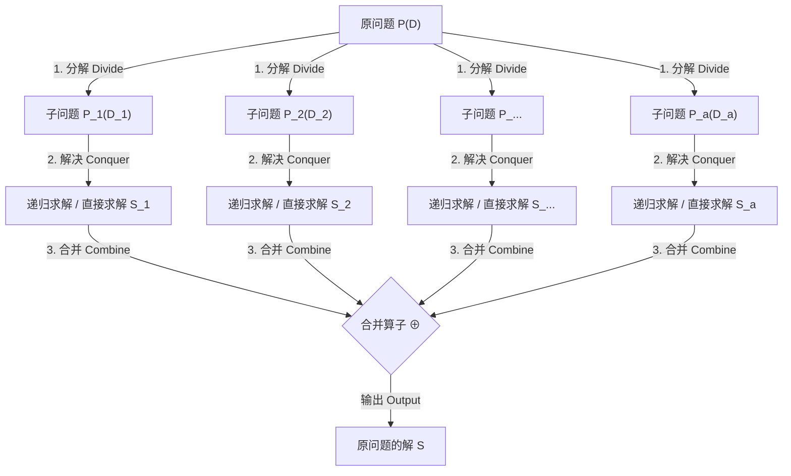
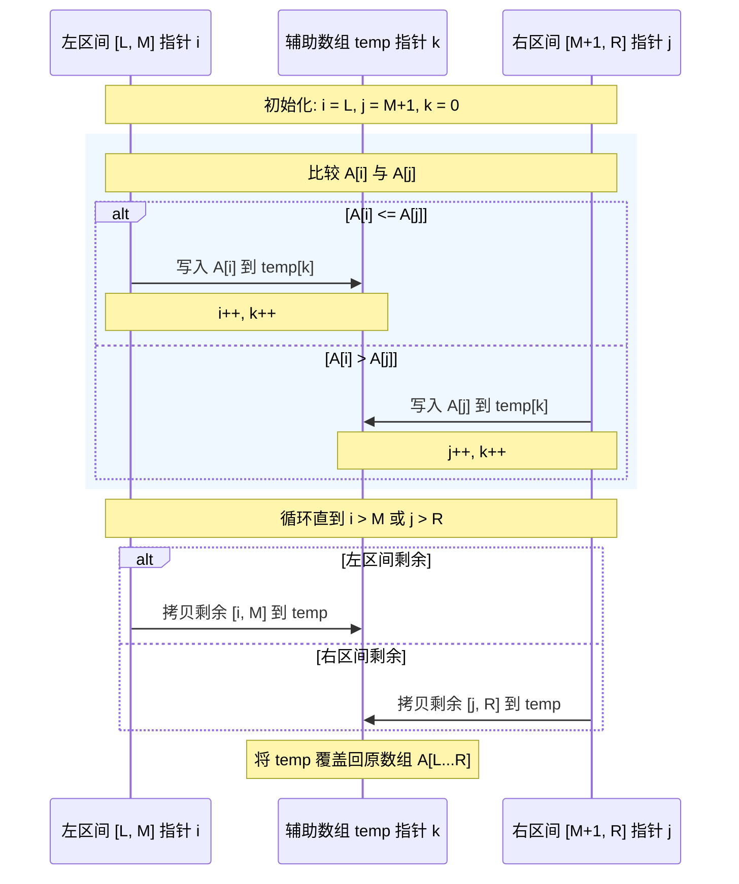
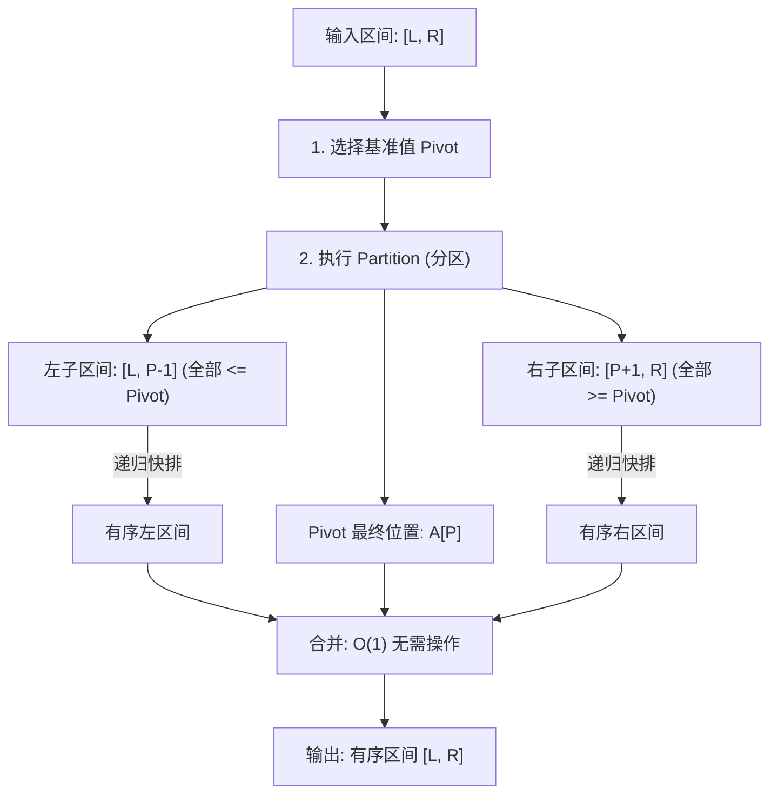

# 1.3.2.5 分治算法

## 1. 引言：分治算法的设计哲学与方法论起源

### 1.1 从物理战略到计算范式的演进
在人类历史的宏大叙事中，“分而治之”（拉丁语：*Divide et impera*）作为一种政治与军事策略，已被运用了数千年。其核心逻辑在于：统治者通过削弱、分裂对手的力量，使其无法形成统一的联合体，从而能够以相对较小的代价逐个击破。20世纪中叶，随着现代电子计算机的诞生与计算理论的奠基，这一古老的方法论被计算机科学家们引入到了算法设计领域，演变为一种极具威力且优雅的程序设计范式——**分治算法 (Divide and Conquer)**。

分治算法的核心哲学是**复杂性控制（Complexity Control）**。在计算理论中，一个系统所面临的输入规模 $N$ 往往与其求解难度呈非线性关系。当问题规模 $N$ 呈线性增长时，直接求解的计算代价可能会以平方（$O(N^2)$）、立方（$O(N^3)$）甚至指数级（$O(2^N)$）的速度发生灾难性的退化。分治算法的战略核心在于：通过系统性的结构分解，将非线性时间复杂度的全局大问题，降维并拆分为多个规模较小、但数学性质完全相同的局部子问题。由于子问题的规模通常呈现指数级缩小，其求解开销显著降低，最终通过高效的合并算子将这些独立的局部解拼装为全局解。这一思想不仅实现了计算效率上的质的飞跃（例如将排序的复杂度从 $O(N^2)$ 降低到 $O(N \log N)$ ），而且在算法结构的整洁性、可扩展性以及多核并行化支持上，都树立了极高的标准。

### 1.2 计算复杂度的物理屏障与多项式可计算性
在图灵机模型与现代冯·诺依曼计算架构下，计算资源（主要指 CPU 时钟周期与内存空间）是极其宝贵的物理实体。根据计算复杂性理论，算法的渐近时间复杂度决定了该问题在物理世界中的“可计算性边界”。
- **指数级与平方级屏障**：对于一个时间复杂度为 $O(2^N)$ 的算法，当 $N=100$ 时，其所需的计算步骤大约为 $1.26 \times 10^{30}$ 次。即便使用当前世界上最快的超级计算机（每秒执行 $10^{18}$ 次浮点运算），求解该问题也需要耗费数百万年的时间。因此，高阶非线性或指数级算法在物理上是“不可计算”的。
- **分治的破局之道**：分治算法通过将大尺度输入进行“对数降采样”或“平衡划分”，将计算路径转化为一棵平衡递归树。这种结构往往能将原本具有平方级复杂度的问题降维至接近线性（如 $O(N \log N)$ 或 $O(N^{1.58})$）的水平。例如，在 $N=10^6$ 的数据量下，$N^2 = 10^{12}$ 次操作，而 $N \log_2 N \approx 2 \times 10^7$ 次操作，两者在现代 CPU 上的运行时间差距可达数万倍。分治算法成功将许多原本处于物理屏障之外的问题，拉回到了多项式时间可计算的范畴之内。

### 1.3 分治算法的三步循环机制形式化定义
从形式化与程序控制流的角度来看，分治算法是一种自顶向下（Top-Down）的递归控制框架。对于任意一个原问题 $P(D)$，其中 $D$ 为输入的数据集，分治算法严格遵循三个基本步骤的循环迭代：**分解 (Divide)**、**解决 (Conquer)** 与 **合并 (Combine)**。



#### 1.3.1 分解 (Divide) 的形式化表达
分解步骤的目标是定义一种映射规则，将规模为 $N = |D|$ 的原问题数据集 $D$ 划分或投影为 $a$ 个不同的子数据集序列 $\{D_1, D_2, \dots, D_a\}$。
我们定义划分算子 $f$：
$$f: D \to \{D_1, D_2, \dots, D_a\}$$
使得子问题序列 $\{P_1(D_1), P_2(D_2), \dots, P_a(D_a)\}$ 满足以下数学约束：
1. **形式一致性**：对任意的 $i \in [1, a]$，子问题 $P_i$ 的数学性质、约束条件以及求解目标与原问题 $P$ 完全相同，仅数据输入变为 $D_i$。
2. **规模收缩性**：每个子问题的输入规模都必须严格小于原问题，即对所有的 $i \in [1, a]$，恒有 $|D_i| < |D|$。在最理想的平衡划分下，每个子问题的规模为原问题的等比缩减，即 $|D_i| \approx N / b$，其中 $b > 1$ 是常数缩减因子。
3. **划分开销的可控性**：执行划分算子 $f$ 所需的计算时间记为 $D(n)$，该开销必须是低阶的多项式级（通常为 $O(1)$ 或 $O(n)$），否则划分步骤本身将成为算法的性能瓶颈。

#### 1.3.2 解决 (Conquer) 的形式化表达
在分解出子问题后，算法需要对其进行求解。求解过程是一个分支判定控制流：
- **递归阶段**：若当前子问题规模 $|D_i|$ 依然大于某个设定的临界阈值 $c$（通常 $c$ 是一个极小的常数，如 1 或 2），则该子问题不具备直接求解的条件，算法将继续调用自身，将其作为新的输入启动下一轮“分解-解决-合并”循环。
- **直接求解阶段（Base Case）**：若子问题规模 $|D_i| \le c$，则算法停止递归向下展开，直接启动基本求解器：
  $$S_i = \text{Solver}(P_i(D_i))$$
  在底层物理执行中，Base Case 的计算代价通常是极其微小的常数时间 $\Theta(1)$。
  精确定义 Base Case 的物理边界是分治算法的核心。若边界判定失效或基准情况设计错误，将直接导致程序陷入无限递归，迅速耗尽系统调用栈空间，触发系统级的 `Stack Overflow` 异常。

#### 1.3.3 合并 (Combine) 的形式化表达
合并步骤是分治算法中将局部解合成为全局解的代数桥梁。它的任务是定义并执行一个合并算子 $\oplus$，将所有已解决的子问题局部解 $\{S_1, S_2, \dots, S_a\}$ 进行有序融合，输出原问题的全局解 $S$：
$$S = \bigoplus_{i=1}^{a} S_i$$
合并算子的计算开销记为 $C(n)$。合并步骤的设计往往决定了整个分治算法的高下。例如，在归并排序中，合并算子通过相向双指针顺序扫描，耗时为 $O(n)$；而在快速排序中，由于在分解阶段已经借助分区操作确定了基准值的绝对位置，其合并阶段不需要执行任何实质操作，开销仅为 $O(1)$。若合并算子的计算代价过高（例如达到 $O(n^2)$），即使前面的划分和递归再迅速，算法总体的渐近复杂度也无法得到实质性的改善。

---

## 2. 数学底座：子问题独立性与分治的物理边界

要深刻理解分治算法，就必须探索其成立的底层数学边界与物理限制。并非所有可以被分解的问题都能够采用分治法进行高效求解。

### 2.1 分治法与动态规划的本质区别
分治算法与动态规划（Dynamic Programming）在程序构造上都大量使用了递归或子问题分解，这导致许多开发者在工程实践中难以准确区分两者的适用场景。从数学本质上讲，它们在**子问题空间的拓扑结构**上有着本质的分野。

#### 2.1.1 拓扑结构：树状图 (Tree) 与有向无环图 (DAG) 的对比
- **分治法的子问题空间**：呈现出严格的树状结构（Tree-like Structure）。在分治算法中，大问题划分为子问题后，各个子问题在计算路径上是**物理隔离**且**互不相交**的。子问题 $P_1$ 的求解过程既不需要知道子问题 $P_2$ 的任何中间状态，也不存在任何公共的底层子问题。这种数学特质被称为**无重叠子问题（Non-overlapping Subproblems）**。其计算依赖图没有任何合并节点。
- **动态规划的子问题空间**：呈现出复杂的有向无环图结构（Directed Acyclic Graph, DAG）。在动态规划所针对的问题中，不同的父问题在向下分解时，往往会指向同一个或多个公共的底层子问题，这就是经典的**重叠子问题（Overlapping Subproblems）**。

```mermaid
graph TD
    subgraph 分治法的子问题空间 (树状结构 - 无重叠)
        A[P_n] --> B1["P_n/2 _ Left"]
        A --> B2["P_n/2 _ Right"]
        B1 --> C1["P_n/4 _ L1"]
        B1 --> C2["P_n/4 _ L2"]
        B2 --> C3["P_n/4 _ R1"]
        B2 --> C4["P_n/4 _ R2"]
    end

    subgraph 动态规划的子问题空间 (DAG结构 - 重叠)
        D[P_n] --> E1["P_n-1"]
        D --> E2["P_n-2"]
        E1 --> E2
        E1 --> E3["P_n-3"]
        E2 --> E3
        E2 --> E4["P_n-4"]
        E3 --> E4
    end
```

#### 2.1.2 子问题重叠度 (Overlapping Degree) 的数学刻画与计算劣化
我们通过一个数学模型来量化这种拓扑差异带来的计算性能退化。
设问题规模为 $n$。
- 定义 $S(n)$ 为原问题分解后产生的**相异子问题（Unique Subproblems）的总数**。
- 定义 $N(n)$ 为分治递归算法在不做任何缓存时，自顶向下展开所创建的**递归树节点总数（即函数调用次数）**。
- 我们定义**子问题重叠度 $\gamma$** 为：
  $$\gamma(n) = \frac{N(n)}{S(n)}$$

##### 1. 分治法下的重叠度
在完美分治（如归并排序）中，原问题拆分为两个规模为 $n/2$ 的子问题，它们彼此完全独立。
相异子问题数 $S(n)$ 满足：
$$S(n) = 2 S(n/2) + 1 \implies S(n) = \Theta(n)$$
  而递归树展开的节点总数 $N(n)$ 同样满足：
$$N(n) = 2 N(n/2) + 1 \implies N(n) = \Theta(n)$$
因此，分治算法下的重叠度：
$$\gamma(n) = \frac{\Theta(n)}{\Theta(n)} = \Theta(1)$$
这表明子问题之间几乎没有重叠，纯递归求解是渐近最优的，没有进行任何重复计算。

##### 2. 存在重复子问题时的分治劣化
如果我们强行用朴素分治递归去求解一个子问题重叠度极高的系统（如斐波那契数列 $F(n) = F(n-1) + F(n-2)$）：
该问题的相异子问题空间实际上非常小，仅包含 $n$ 个不同的项：
$$S(n) = n$$
然而，由于我们没有利用子问题之间的关联，纯递归分治会将其强行展开为一棵深度为 $n$ 的二叉树，其节点总数 $N(n)$ 满足：
$$N(n) = N(n-1) + N(n-2) + 1$$
这是一个经典的二阶常系数线性非齐次递推方程。其齐次特征方程为：
$$r^2 - r - 1 = 0 \implies r_1 = \frac{1+\sqrt{5}}{2} \approx 1.618, \quad r_2 = \frac{1-\sqrt{5}}{2} \approx -0.618$$
因此，随着 $n$ 的增大，后一项由于绝对值小于 1 快速收敛于 0，递归树节点总数渐近退化为：
$$N(n) = \Theta\left(\Phi^n\right) \approx \Theta(1.618^n)$$
此时，该系统的子问题重叠度为：
$$\gamma(n) = \frac{\Theta(1.618^n)}{n}$$
重叠度呈现出恐怖的**指数级增长**！这意味着相同的子问题被重复计算了无数次（例如在求解 `fib(n)` 时，`fib(2)` 被重复调用了数以亿计次）。
而动态规划通过引入状态存储表（Memoization 或 DP Table），在计算出某一子问题后立即将其物理写入内存，后续若再次遇到该子问题，通过 $O(1)$ 的查表操作直接拦截并返回结果。这成功将计算依赖图强行剪枝为单向线性链表，从而将时间复杂度压制在 $\Theta(n)$。
因此，分治算法的物理边界在于：**子问题展开后，重叠度 $\gamma(n)$ 必须是常数级的。若子问题空间存在大量交集，则必须放弃分治，转向动态规划。**

#### 2.1.3 状态管理与数据流向的解耦性对比
- **分治算法（Stateless）**：数据流向是自顶向下流动、自底向上合并的。子问题是**无状态（Stateless）**的。在并发环境下，这极易实现解耦，各子任务的计算可以在完全不同的内存地址空间甚至不同的物理机器上独立进行，不需要任何同步锁机制。
- **动态规划（State-Dependent）**：数据流向依赖于状态转移方程（State Transition Equation）。子问题之间存在着强烈的**拓扑序（Topological Order）**依赖，必须先计算并保存好基础状态，才能进行高阶状态的推演。它的状态表在内存中是共享的，这在多线程并行化时会产生高额的读写同步与锁开销。

### 2.2 分治法与相关设计范式的边界
除了动态规划，分治法与减治法和贪心算法在方法论上也极易产生重叠。

##### 2.2.1 减治法 (Decrease and Conquer) 的本质
减治法是分治法的一种高度特化变种。其核心特征在于：将原问题分解为子问题后，算法能够通过某些已知的先验数学性质，**确切地知道解只可能存在于其中某一个子问题分支中**，从而可以安全地将其他子问题分支全部抛弃。
例如**二分查找（Binary Search）**：
$$T(n) = T(n/2) + O(1)$$
在这个方程中，虽然我们每次都将数组中分为左右两半，但通过与中间值的比较，我们只需继续递归其中一侧，另一侧则直接丢弃。因为分支因子 $a=1$，所以在整个计算链路中不需要进行任何“合并”操作。

##### 2.2.2 贪心算法 (Greedy Algorithm) 的决策本质
贪心算法在面临问题时，不进行全局的递归树展开，而是直接根据当前的局部状态做出“当前最优”的决策（即贪心选择性质）。这一步决策会直接将问题规模降低，而无需像分治法那样对所有可能的分支进行完备的求解和事后合并。贪心算法的正确性建立在拟阵（Matroid）理论等严格的数学证明之上，通常没有递归合并这一物理阶段。

---

## 3. 经典分治算法与应用案例推演

通过对归并排序、快速排序以及Karatsuba大整数乘法这三个经典案例的深度剖析，我们可以清晰地看到分治算法在底层物理内存、指针控制以及数学消元上的巧妙运用。

### 3.1 归并排序 (Merge Sort)
归并排序是分治算法最直观、结构最优雅的物理体现。它强制推行完美的平衡二分拆分，并通过双指针合并算法实现渐近最优的稳定排序。

#### 3.1.1 分割中点的防溢出计算与平衡划分原理
归并排序的第一步是确定区间的物理分割点。设数组的有效排序区间为 $[L, R]$，其中点 $M$ 的常规计算公式为 $(L+R)/2$。
然而，在底层的计算机寄存器级运算中，若 $L$ 和 $R$ 都是很大的正整数（例如在处理超大数组或大文件映射时接近整型最大值 `INT_MAX`），$(L+R)$ 的加法计算可能会导致**算术溢出（Arithmetic Overflow）**，使结果变为负数，进而导致非法内存越界访问。
为了消除这一隐患，工业级代码统一采用如下防溢出公式：
$$M = L + \frac{R - L}{2}$$
或者在支持位运算优化的语言中，采用无符号右移：
$$M = L + ((R - L) \gg 1)$$
这种写法在物理上保证了中间结果 $R-L$ 恒小于等于当前区间长度，绝对安全。

#### 3.1.2 辅助内存空间开销与双指针合并机制
归并排序的合并步骤（Merge Step）需要将两个已经各自有序的相邻子区间 $A[L \dots M]$ 和 $A[M+1 \dots R]$ 合并为一个全局有序的区间。
由于这两个区间在物理内存上是连续分布的，若直接在原数组内进行元素的挪动 and 插入，会导致后续元素的大规模右移，单次合并的时间复杂度将直接上升到 $O(n^2)$。
为了保持 $O(n)$ 的线性合并效率，我们必须在系统堆区开辟一块与当前合并区间大小完全相等的**临时辅助空间** `temp`，其长度为 $R - L + 1$。

##### 双指针相向扫描控制逻辑
1. 设定两个读取指针：左指针 `i` 初始化为左子区间的起点 $L$；右指针 `j` 初始化为右子区间的起点 $M+1$。设定写入指针 `k` 指向辅助数组的起点 0。
2. 比较 $A[i]$ 与 $A[j]$：
   - 若 $A[i] \le A[j]$，则将 $A[i]$ 写入 `temp[k]`，随后将指针 `i` 和 `k` 分别向右移动一位。
   - 若 $A[i] > A[j]$，则将 $A[j]$ 写入 `temp[k]`，随后将指针 `j` 和 `k` 分别向右移动一位。
3. 重复步骤 2，直到某一个指针越界（即 `i > M` 或 `j > R`）。
4. 将未越界的另一个子区间中剩余的全部元素顺序拷贝到 `temp` 的尾部。
5. 将辅助数组 `temp` 中的所有有序数据覆盖拷贝回原数组的物理区间 $A[L \dots R]$，并释放 `temp` 占用的堆内存。



#### 3.1.3 排序稳定性的代数维持条件
在合并的判断条件中，比较算子是否带等号具有极其关键的物理意义：
`if (A[i] <= A[j]) temp[k++] = A[i++];`
此处若写为 `A[i] <= A[j]`，则当左子区间和右子区间存在相等的两个元素时，由于条件成立，左子区间靠前的元素会被优先拷贝入辅助数组。这就保证了相同元素在排序前后的**相对顺序保持不变**，即维持了**排序的稳定性**。如果将其错误地改写为 `A[i] < A[j]`，则在遇到相等元素时，算法会优先拷贝右子区间的元素，从而破坏了稳定性，使其退化为不稳定排序。

#### 3.1.4 多路归并 (Multi-way Merge) 与败者树 (Loser Tree) 物理实现
当待排序的数据规模过于庞大，单机物理内存无法完整容纳时，必须将数据拆分为多个可以放入内存的小分片，局部排序后输出为 $k$ 个独立的外部有序文件（称为有序段，Runs）。随后，需要将这 $k$ 个有序段合并为一个最终的大文件。

如果采用传统的二路归并，合并 $k$ 个有序段需要进行 $\lceil \log_2 k \rceil$ 次完整的磁盘I/O轮次，这在磁盘读写极慢的物理架构下会带来难以承受的时间延迟。
为了将归并轮次降低到 1，必须采用 **$k$ 路归并**。
在 $k$ 路归并中，我们同时读取这 $k$ 个有序文件的头部元素。为了找出当前这 $k$ 个元素中的最小值，如果采用简单的线性扫描，每次需要进行 $k-1$ 次比较。合并含有 $N$ 个元素的总体文件需要的时间复杂度为 $O(N \cdot k)$。当 $k$ 很大时，这个开销过大。

为了消除对 $k$ 的线性依赖，引入了**败者树（Loser Tree）**。
败者树是一棵完全二叉树，其中叶子节点表示这 $k$ 个有序段的当前头部元素。每个非叶子节点并不记录胜者（最小值），而是记录在其左右子树比较中的**败者**（指向叶子节点的索引），而胜者继续向上层攀升，直到根节点之上的一个特殊节点记录全局胜者。
##### 败者树调整的物理过程
当根节点输出当前全局最小值后，我们从该最小值对应的有序文件中读取下一个元素，将其替换到原叶子节点位置。
此时，为了重新调整败者树以找出新的最小值，该叶子节点只需要沿着其父节点指针一路向上进行比较：
- 在每一层父节点，当前胜者与该父节点记录的败者进行比较。
- 比较后的败者被写入该父节点，而新的胜者继续向上比较。
- 该过程一直持续到根节点。
在这个调整过程中，由于每个节点已经存储了历史败者，胜者在每一层只需要进行 **1 次比较**。因此，对于一棵深度为 $\lceil \log_2 k \rceil$ 的败者树，重构的比较次数为 $\log_2 k$。这成功将 $k$ 路归并的总时间复杂度降低到 $O(N \log k)$。
（作为对比，若使用最小堆，堆顶元素被替换后执行自顶向下调整时，当前节点需要与其左右两个子节点同时比较以确定最小值，在每一层需要进行 **2 次比较**。因此，败者树在每一层减少了一半的比较开销，在大规模外部排序中能够显著降低 CPU 时钟占用）。

#### 3.1.5 归并排序标准 C 语言实现
```c
#include <stdio.h>
#include <stdlib.h>

// 将 A[left...mid] 和 A[mid+1...right] 合并
void merge(int A[], int left, int mid, int right) {
    int i = left;
    int j = mid + 1;
    int k = 0;
    int size = right - left + 1;
    
    // 动态分配物理辅助内存
    int *temp = (int *)malloc(size * sizeof(int));
    if (temp == NULL) {
        perror("Out of memory in merge space allocation.");
        exit(EXIT_FAILURE);
    }
    
    // 双指针相向比较
    while (i <= mid && j <= right) {
        if (A[i] <= A[j]) { // 关键：<= 维持排序的稳定性
            temp[k++] = A[i++];
        } else {
            temp[k++] = A[j++];
        }
    }
    
    // 拷贝左半部分剩余元素
    while (i <= mid) {
        temp[k++] = A[i++];
    }
    
    // 拷贝右半部分剩余元素
    while (j <= right) {
        temp[k++] = A[j++];
    }
    
    // 将有序数据写回原数组
    for (k = 0; k < size; k++) {
        A[left + k] = temp[k];
    }
    
    // 释放辅助内存
    free(temp);
}

// 归并排序递归主体
void merge_sort(int A[], int left, int right) {
    if (left < right) {
        // 计算防溢出中点
        int mid = left + (right - left) / 2;
        
        // 递归分解左半部分
        merge_sort(A, left, mid);
        // 递归分解右半部分
        merge_sort(A, mid + 1, right);
        
        // 合并子问题局部解
        merge(A, left, mid, right);
    }
}
```

---

### 3.2 快速排序 (Quick Sort)
与归并排序“重合并、轻分解”的设计相反，快速排序的全部计算精妙都集中在“分解”阶段，而在“合并”阶段不执行任何实质性的操作。

#### 3.2.1 基准值 (Pivot) 选择策略及其退化防范
快速排序的分区操作（Partition）需要在区间内选择一个值作为基准值（Pivot）。
如前文所述，若算法每次都简单地选择区间最左端或最右端的元素作为 Pivot，当面对一个已经完全有序或基本有序的数组时，分区将产生极度的不平衡（一侧规模为 0，另一侧为 $N-1$）。这会导致快速排序的时间复杂度退化为 $O(N^2)$。

为了防范这种最坏情况的发生，现代快速排序实现必须引入基准值选择优化：
- **随机化基准 (Randomized Pivot)**：在当前区间 $[L, R]$ 内，利用伪随机数生成器产生一个随机索引 $K \in [L, R]$。随后交换 $A[K]$ 与 $A[L]$，以消除输入数据特定排列特征带来的干扰。
- **三数取中 (Median-of-Three)**：取区间左端点 $A[L]$、中点 $A[M]$ 和右端点 $A[R]$ 三个元素，对其进行局部排序，找出它们的中位数。然后交换该中位数与 $A[L]$，作为最终 Partition 阶段的 Pivot。这一策略在消灭已排序序列退化风险的同时，规避了生成随机数带来的额外时钟周期消耗。



#### 3.2.2 Partition 物理分区方案的深度对比 (Lomuto vs Hoare)
分区的底层实现有两种最经典的设计：**Lomuto 分区方案** 与 **Hoare 分区方案**。它们在指针运动轨迹、数据交换次数以及对重复元素的鲁棒性上有着巨大的物理差异。

##### 1. Lomuto 分区方案
Lomuto 方案使用两个同向移动的指针：
- 设 Pivot 为当前区间最右端的元素 $A[high]$。
- 指针 `i` 始终指向最后一个已被确认为小于等于 Pivot 的元素位置。初始时 `i = low - 1`。
- 指针 `j` 作为扫描指针，从 `low` 顺序移动到 `high - 1`。
- 在每一次循环中，若发现 $A[j] \le \text{Pivot}$，则将 `i` 右移一位，并交换 $A[i]$ 与 $A[j]$ 的数据。
- 扫描结束后，交换 $A[i+1]$ 与 $A[high]$，分区结束。

##### 2. Hoare 分区方案
Hoare 方案采用两个相向运动的指针：
- 选择首元素为基准值 `pivot = A[low]`。
- 指针 `i` 初始指向 `low - 1`，指针 `j` 初始指向 `high + 1`。
- 循环控制逻辑：
  - 指针 `i` 不断向右移动，直到找到第一个满足 $A[i] \ge \text{pivot}$ 的元素。
  - 指针 `j` 不断向左移动，直到找到第一个满足 $A[j] \le \text{pivot}$ 的元素。
  - 若此时两指针相遇或交叉（即 `i >= j`），则分区操作结束，返回 `j` 作为分割点。
  - 否则，交换 $A[i]$ 与 $A[j]$ 的值，随后各前进一步，继续循环。

##### Lomuto 与 Hoare 对全重复元素数组的物理差异推导
假设我们要排序一个包含 $N$ 个完全相同元素（例如全部都是 5）的数组。
- **在 Lomuto 分区下**：
  由于判断条件为 $A[j] \le \text{Pivot}$，而 $5 \le 5$ 恒成立。因此，`j` 指针的每次扫描都会触发一次交换，且指针 `i` 会跟着右移。
  最终，分区点被固定在 $high$ 的位置，左子区间的规模为 $N-1$，右子区间的规模为 0。
  这导致快速排序对全重复数组的排序退化为完全的**单支树形式**，时间复杂度降为 $O(N^2)$。
- **在 Hoare 分区下**：
  我们来看双指针在遇到全重复值时的运动轨迹。由于 Hoare 分区在指针移动的循环中采用的是严格的不等号判定（`A[i] < pivot` 和 `A[j] > pivot`），所以在遇到 $5$ 时，两个循环都会立即退出，即两个指针都会**停下来**。
  随后，算法交换 $A[i]$ 与 $A[j]$ 的值，并执行 `i++` 和 `j--`。
  因为每次遇到重复元素两端都会停下并强行进行交换，这使得 `i` 和 `j` 能够在数组的几何中心点相遇。
  最终，Hoare 分区成功将这个全重复数组完美地一分为二，使得左右子区间规模均约为 $N/2$。
  这确保了即使面对最极端的全重复数据，快速排序的递归深度依然保持在健康的 $O(\log N)$ 层，总复杂度依然为稳定的 $O(N \log N)$。
  这种在微小边界判定上的数学设计，深刻体现了算法物理实现的健壮性。

#### 3.2.3 尾递归消除与小区间退化优化
为了使快速排序具备工业级的高性能和安全性，必须加入以下两项优化：
1. **尾递归消除 (Tail Call Elimination)**：为了限制最坏情况下的系统调用栈深度，在完成 Partition 后，算法只递归执行规模较小的子区间，而对规模较大的子区间通过修改循环变量直接在当前函数内进行迭代。这能确保在任何恶劣的输入下，最大的递归栈深度恒在 $O(\log N)$ 内。
2. **小区间退化 (Cutoff)**：当递归子区间的长度小于某个阈值（通常设定为 10 到 15）时，由于递归栈帧创建的比例过高，算法选择停止快排递归，转而直接调用**插入排序**。插入排序在小规模基本有序的数据上具有极高的常数项优势，可以使快排的整体运行效率提升约 10%。

#### 3.2.4 快速排序标准 C 语言实现 (Hoare Partition + 尾递归优化 + 小区间阈值)
```c
#include <stdio.h>
#include <stdlib.h>

#define CUTOFF 15

// 插入排序，用于处理小规模区间
void insertion_sort(int A[], int low, int high) {
    for (int i = low + 1; i <= high; i++) {
        int key = A[i];
        int j = i - 1;
        while (j >= low && A[j] > key) {
            A[j + 1] = A[j];
            j--;
        }
        A[j + 1] = key;
    }
}

// 三数取中选择 Pivot
void median_of_three(int A[], int low, int high) {
    int mid = low + (high - low) / 2;
    // 排序 low, mid, high 三处的值
    if (A[low] > A[mid]) {
        int temp = A[low]; A[low] = A[mid]; A[mid] = temp;
    }
    if (A[low] > A[high]) {
        int temp = A[low]; A[low] = A[high]; A[high] = temp;
    }
    if (A[mid] > A[high]) {
        int temp = A[mid]; A[mid] = A[high]; A[high] = temp;
    }
    // 将中位数交换到 low 位置，作为 Pivot
    int temp = A[low];
    A[low] = A[mid];
    A[mid] = temp;
}

// Hoare 分区算法
int hoare_partition(int A[], int low, int high) {
    median_of_three(A, low, high);
    int pivot = A[low];
    int i = low - 1;
    int j = high + 1;
    
    while (1) {
        do {
            i++;
        } while (A[i] < pivot); // 严格小于，使得相同元素时停下
        
        do {
            j--;
        } while (A[j] > pivot); // 严格大于，使得相同元素时停下
        
        if (i >= j) {
            return j;
        }
        
        // 交换停下来的两个元素
        int temp = A[i];
        A[i] = A[j];
        A[j] = temp;
    }
}

// 快速排序主体控制逻辑（带尾递归消除优化）
void quick_sort_optimized(int A[], int low, int high) {
    while (low < high) {
        // 小区间退化优化
        if (high - low <= CUTOFF) {
            insertion_sort(A, low, high);
            break;
        }
        
        int p = hoare_partition(A, low, high);
        
        // 尾递归消除：优先递归较小区间，迭代较大区间
        if (p - low < high - p) {
            quick_sort_optimized(A, low, p); // 递归较小子区间
            low = p + 1;                     // 迭代较大子区间
        } else {
            quick_sort_optimized(A, p + 1, high);
            high = p;
        }
    }
}
```

---

#### 3.3 大整数乘法 (Karatsuba 算法)
Karatsuba 算法作为分治思想在算术代数领域的经典应用，向我们展示了如何通过纯代数结构上的降维，突破平方级计算屏障。

##### 3.3.1 传统大数乘法的 $\Theta(n^2)$ 瓶颈
在计算机硬件中，当我们需要计算两个 $n$ 位的大整数（如二进制位宽达到数万位的密码学参数）乘积时，由于超出了硬件 ALU 的直接位宽（通常为 64 位），我们必须使用多字数组来表示这些数。
传统的手算方法将大数 $X$ 的每一位与 $Y$ 的每一位相乘，产生 $n^2$ 个单数乘法。即使采用硬件级别的并行加法，其时间复杂度依然被牢牢锁死在 $\Theta(n^2)$。

##### 3.3.2 Karatsuba 的代数推导与乘法压缩
Karatsuba 算法的核心策略是将两个 $n$ 位的大整数 $X$ 和 $Y$ 按照中点拆分为高位和低位两部分。
设拆分长度为 $m = \lfloor n / 2 \rfloor$，基数为 $B$（在十进制中 $B=10$，在二进制中 $B=2$）：
$$X = A \cdot B^m + B_{low}$$
$$Y = C \cdot B^m + D$$
这里 $A$ 和 $C$ 为高位段，$B_{low}$ 和 $D$ 为低位段。它们的位宽均约为 $n/2$。

我们将这两个代数式直接相乘，展开其乘积：
$$X \cdot Y = (A \cdot B^m + B_{low})(C \cdot B^m + D) = A \cdot C \cdot B^{2m} + (A \cdot D + B_{low} \cdot C) \cdot B^m + B_{low} \cdot D$$
设三个核心子项为：
$$z_2 = A \cdot C$$
$$z_1 = A \cdot D + B_{low} \cdot C$$
$$z_0 = B_{low} \cdot D$$
若直接递归求解，我们需要单独计算四次乘法：$AC$、$AD$、$B_{low}C$、$B_{low}D$。这需要求解 4 个规模为 $n/2$ 的子问题，根据主定理，总时间复杂度依然是 $O(n^2)$。

Karatsuba 的核心洞察在于，对于最终合并公式而言，我们实际上**不需要**单独知道 $A \cdot D$ 和 $B_{low} \cdot C$ 的值，我们仅仅需要知道它们的代数和 $z_1$。
考虑如下等式关系：
$$(A + B_{low})(C + D) = A \cdot C + A \cdot D + B_{low} \cdot C + B_{low} \cdot D$$
将 $z_2$ 和 $z_0$ 带入该式：
$$(A + B_{low})(C + D) = z_2 + z_1 + z_0$$
移项整理，即可得到 $z_1$ 的消元表达式：
$$z_1 = (A + B_{low})(C + D) - z_2 - z_0$$
在这个公式中，计算 $z_1$ 只需要计算一次新的乘法 $z_3 = (A + B_{low})(C + D)$，然后再进行两次减法（减去已经算好的 $z_2$ 和 $z_0$）。

因此，整个合并流程中，我们**只需进行 3 次规模为 $n/2$ 的大数乘法**：
1. $z_2 = A \cdot C$
2. $z_0 = B_{low} \cdot D$
3. $z_3 = (A + B_{low})(C + D)$
最终结果合并为：
$$X \cdot Y = z_2 \cdot B^{2m} + (z_3 - z_2 - z_0) \cdot B^m + z_0$$

在计算机内部，乘以 $B^{2m}$ 和 $B^m$ 的操作不需要进行实际的 CPU 乘法指令。如果以机器字为基数（如 $B = 2^{64}$），乘以基数的幂等同于**内存指针的地址偏移与低位补零**。该操作和加减法的复杂度均为线性级 $O(n)$。因此，我们用廉价的 $O(n)$ 加减移位成功替换掉了一次昂贵的递归大数乘法。

##### 3.3.3 复杂度渐近线推导过程
我们根据这一设计构建递归方程：
$$T(n) = 3 T(n/2) + O(n)$$
这里分支因子 $a = 3$，规模缩减常数 $b = 2$，非递归辅助开销 $f(n) = O(n)$。
临界指数为：
$$\log_b a = \log_2 3 \approx 1.585$$
我们将 $f(n) = O(n)$ 与 $n^{\log_2 3}$ 进行比较。
由于 $n = O\left(n^{\log_2 3 - \epsilon}\right)$，只要取 $\epsilon = \log_2 3 - 1 \approx 0.585 > 0$ 即可。
根据主定理 Case 1，该递推方程的渐近紧确界为：
$$T(n) = \Theta\left(n^{\log_2 3}\right) \approx O(n^{1.585})$$
这使算法能够跨越传统平方级的物理屏障，在超大数乘法中占据了压倒性的效率优势。

##### 3.3.4 Toom-Cook 算法与基于 FFT 的多项式卷积大数乘法
1. **Toom-Cook 算法**：Karatsuba 算法的本质是“将大数分成 2 段”。如果我们将其推广，将大数分成 $k$ 段，这就是 Toom-Cook 算法。例如，Toom-3 将大数均分为 3 段，通过构建插值多项式，将原需 9 次子乘法压缩为 5 次，其复杂度降为 $O(n^{\log_3 5}) \approx O(n^{1.465})$。随着分段数 $k$ 的增加，虽然复杂度指数会继续下降，但其插值系数转换带来的加减法常数开销会呈几何级数暴涨。
2. **基于 FFT（快速傅里叶变换）的乘法**：对于百万位以上的大数乘法，最强大的工具是快速傅里叶变换。
   我们将大数 $X$ 和 $Y$ 视作形式幂级数多项式：
   $$A(x) = \sum_{i=0}^{n-1} x_i x^i, \quad B(x) = \sum_{i=0}^{n-1} y_i x^i$$
   两个数的乘积在代数上等价于两个多项式的乘积 $C(x) = A(x) \cdot B(x)$ 并在 $x = B$ 处取值。
   多项式相乘的系数 $c_k = \sum_{i+j=k} x_i y_j$ 正是两个系数序列的**离散卷积（Discrete Convolution）**。
   传统的离散卷积计算需要 $O(n^2)$ 的时间。
   根据快速傅里叶变换的卷积定理：
   - 首先利用 FFT，在 $O(n \log n)$ 时间内将多项式从系数表示转换到频域（点值表示）。
   - 在点值表示下，两个多项式的乘积仅仅是对应点的标量乘法（Pointwise Multiplication），时间复杂度仅为 $O(n)$。
   - 随后，利用逆快速傅里叶变换（IFFT）在 $O(n \log n)$ 时间内将点值乘积转换回系数表示。
   - 最后，对系数序列进行进位处理，得到最终大数乘积。
   这一天才的设计使得超大数乘法的复杂度降到了 $O(n \log n)$ 级别，代表了近代计算数学的巅峰之一。

---

### 4. 分治算法时间复杂度的严密数学分析
掌握对分治方程的严密推导，是评估和设计分治算法的基石。计算机科学中，我们主要使用**递归树模型**获得直观的几何认知，并通过**主定理**和 **Akra-Bazzi 方法**进行严格的代数推导。

#### 4.1 递归树 (Recursion Tree) 的几何直观分析

##### 4.1.1 递归树模型构建
对于最通用的分治算法递归方程：
$$T(n) = a T(n/b) + f(n)$$
为了推导其复杂度，我们将方程展开为一棵几何树。
- 树的根节点（第 0 层）代表规模为 $n$ 的原问题，其非递归部分计算开销为 $f(n)$。
- 根节点拥有 $a$ 个子节点，每个子节点的子问题规模均收缩为 $n/b$。每个子节点的非递归计算开销为 $f(n/b)$。
- 依此类推，在树的第 $j$ 层，共有 $a^j$ 个节点，每个节点的输入规模均为 $n/b^j$，处理每个节点所需的非递归分裂合并开销为 $f(n/b^j)$。
- 当子问题规模降为 1 时，递归停止。令 $n/b^L = 1$，求得递归树的最大深度 $L = \log_b n$。
- 在最后一层（第 $L$ 层，即叶子节点层），共有 $a^L = a^{\log_b n} = n^{\log_b a}$ 个叶子节点。每个叶子节点的 Base Case 计算时间为常数 $c$。

##### 4.1.2 各层开销的几何级数求和与收敛性证明
我们将每一层的非叶子节点开销进行累加。第 $j$ 层的总开销为该层节点数乘以单个节点的开销：
$$\text{Cost of Layer } j = a^j f(n/b^j)$$
将非叶子层的所有开销与叶子层的总开销求和，得到递归树的总计算代价：
$$T(n) = \sum_{j=0}^{\log_b n - 1} a^j f\left(\frac{n}{b^j}\right) + \Theta\left(n^{\log_b a}\right)$$
这个求和公式的渐近行为完全取决于 $a^j f(n/b^j)$ 在各层之间的比例关系。如果我们在每一层求和项中提取一个比率公比 $q$，就会发现它会形成收敛、发散或常数分布的几何等比数列。

##### 4.1.3 典型方程的递归树推导演示
###### 实例 1：几何收敛状态 $T(n) = T(n/2) + cn^2$
我们构建一棵递归树以求解该方程。
- $a = 1, b = 2, f(n) = cn^2$。
- 叶子节点数：$a^L = 1^{\log_2 n} = 1$。叶子层开销 $\Theta(1)$。
- 第 $j$ 层的非叶子开销为：
  $$a^j f(n/b^j) = 1^j \cdot c\left(\frac{n}{2^j}\right)^2 = \frac{cn^2}{4^j} = cn^2 \left(\frac{1}{4}\right)^j$$
- 对所有非叶子层求和：
  $$T(n) = \sum_{j=0}^{\log_2 n - 1} cn^2 \left(\frac{1}{4}\right)^j + \Theta(1) = cn^2 \sum_{j=0}^{\log_2 n - 1} \left(\frac{1}{4}\right)^j + \Theta(1)$$
  这是一个公比为 $1/4 < 1$ 的收敛等比数列。
  当 $n \to \infty$ 时，等比级数的和趋近于常数极限值：
  $$\sum_{j=0}^{\infty} \left(\frac{1}{4}\right)^j = \frac{1}{1 - 1/4} = \frac{4}{3}$$
  因此，总开销为：
  $$T(n) = \frac{4}{3} cn^2 + \Theta(1) = \Theta(n^2)$$
  这表明，当等比级数的公比小于 1 时，递归树的开销呈现自顶向下**几何级数收敛**。算法绝大部分的计算量都集中在根节点（第一层）。后续层由于规模迅速减小，其合并与分裂代价几乎可以忽略。因此，总复杂度直接等同于根节点本身的开销 $\Theta(f(n))$。

###### 实例 2：叶子节点占主导 $T(n) = 3T(n/2) + cn$
我们推导 Karatsuba 算法的形式。此时 $a=3, b=2, f(n)=cn$。
代入求和公式：
$$T(n) = \sum_{j=0}^{\log_2 n - 1} 3^j \cdot c\left(\frac{n}{2^j}\right) + \Theta\left(n^{\log_2 3}\right)$$
$$T(n) = cn \sum_{j=0}^{\log_2 n - 1} \left(\frac{3}{2}\right)^j + \Theta\left(n^{\log_2 3}\right)$$
注意到求和部分是一个等比数列，其公比为 $q = 3/2 > 1$。
根据等比数列求和公式：
$$\sum_{j=0}^{L - 1} q^j = \frac{q^L - 1}{q - 1}$$
将 $q = 3/2$ 和 $L = \log_2 n$ 代入：
$$\sum_{j=0}^{\log_2 n - 1} \left(\frac{3}{2}\right)^j = \frac{\left(\frac{3}{2}\right)^{\log_2 n} - 1}{\frac{3}{2} - 1} = 2 \left( \frac{3^{\log_2 n}}{2^{\log_2 n}} - 1 \right)$$
利用对数恒等式 $x^{\log_y z} = z^{\log_y x}$：
$$3^{\log_2 n} = n^{\log_2 3}$$
$$2^{\log_2 n} = n$$
代入化简：
$$\sum_{j=0}^{\log_2 n - 1} \left(\frac{3}{2}\right)^j = 2 \left( \frac{n^{\log_2 3}}{n} - 1 \right) = \frac{2}{n} n^{\log_2 3} - 2$$
将此求和结果带回 $T(n)$ 的表达式：
$$T(n) = cn \cdot \left( \frac{2}{n} n^{\log_2 3} - 2 \right) + \Theta\left(n^{\log_2 3}\right)$$
$$T(n) = 2c \cdot n^{\log_2 3} - 2cn + \Theta\left(n^{\log_2 3}\right) = \Theta\left(n^{\log_2 3}\right)$$
这表明，当公比 $q > 1$ 时，递归树的各层开销呈现**几何级数递增**。越往底走，节点的计算量就越庞大。最终，整棵树的计算量被叶子节点那一层完全统治。因此，算法的总复杂度在渐近意义上直接等于叶子层的开销。

---

#### 4.2 主定理 (Master Theorem) 的严格数学解析
主定理是分治时间复杂度推导的核心代数判定工具。

##### 4.2.1 三大 Case 划分与正则性条件 (Regularity Condition) 物理意义
主定理通过分析 $f(n)$ 与 $n^{\log_b a}$ 的渐近关系，定义了三个分支：
1. **Case 1**：若存在常数 $\epsilon > 0$，使得 $f(n) = O\left(n^{\log_b a - \epsilon}\right)$，则 $T(n) = \Theta\left(n^{\log_b a}\right)$。这代表递归树的开销集中在叶子节点。
2. **Case 2**：若存在常数 $k \ge 0$，使得 $f(n) = \Theta\left(n^{\log_b a} \log^k n\right)$，则 $T(n) = \Theta\left(n^{\log_b a} \log^{k+1} n\right)$。这代表各层开销均匀分布。在最常见的 $k=0$ 时，即 $f(n) = \Theta\left(n^{\log_b a}\right)$, 则 $T(n) = \Theta\left(n^{\log_b a} \log n\right)$。
3. **Case 3**：若存在常数 $\epsilon > 0$，使得 $f(n) = \Omega\left(n^{\log_b a + \epsilon}\right)$，且满足**正则性条件**：对于某个常数 $c < 1$ 和足够大的 $n$，恒有 $a f(n/b) \le c f(n)$，则 $T(n) = \Theta(f(n))$。这代表递归树的开销集中在根节点。

###### 正则性条件的物理本质
为什么在 Case 3 中必须强制要求满足正则性条件 $a f(n/b) \le c f(n)$？
在数学上，有些函数虽然在渐近线意义上增长很快，比如 $f(n) = n^{\log_b a + 1} (2 + \cos n)$，它确实满足 $f(n) = \Omega\left(n^{\log_b a + \epsilon}\right)$。
但是，由于 $\cos n$ 存在波动，随着 $n$ 的增长，它的值在 1 到 3 之间周期性震荡。当我们代入正则条件：
$$a \left(\frac{n}{b}\right)^{\log_b a + 1} (2 + \cos(n/b)) \le c \cdot n^{\log_b a + 1} (2 + \cos n)$$
由于两边的三角函数相位不同，在某些区间内，左边的开销可能反而大于右边，不等式无法对任何常数 $c < 1$ 恒成立。
这在物理上意味着，递归树的各层开销并没有形成收敛的等比级数，而是在不同的层之间产生了**非线性波动与能量震荡**。这会导致最终的复杂度无法稳定收敛在 $\Theta(f(n))$。正则性条件保证了分裂合并代价的向下收敛性。

##### 4.2.2 主定理的数学死角与非多项式可比性
主定理在很多看似简单的方程中会完全失效，因为它的 Case 1 和 Case 3 要求 $f(n)$ 与 $n^{\log_b a}$ 之间必须存在**多项式级偏大或偏小**关系，即相差一个 $n^\epsilon$ 因子。
**经典死角**：
$$T(n) = 2 T(n/2) + n \log n$$
在此方程中，$a=2, b=2$，临界函数为 $n^{\log_2 2} = n$。
我们来比较 $f(n) = n \log n$ 与 $n$ 的渐近关系。
显然，$f(n)$ 增长快于 $n$。但是它是否符合 Case 3 呢？
要符合 Case 3，必须找到一个 $\epsilon > 0$，使得 $n \log n = \Omega(n^{1+\epsilon})$，即：
$$\lim_{n \to \infty} \frac{n \log n}{n^{1+\epsilon}} = \lim_{n \to \infty} \frac{\log n}{n^\epsilon} = 0 \quad (\text{对任何 } \epsilon > 0 \text{ 均成立})$$
这表明，由于 $\log n$ 的增长慢于任何多项式因子 $n^\epsilon$，所以 $n \log n$ 与 $n$ 之间并不存在多项式级偏大的关系。因此，主定理的 Case 3 失效。
（注：此问题在广义主定理中被定义为 Case 2 的扩展情况，即当 $f(n) = \Theta(n^{\log_b a} \log^k n)$ 且 $k = 1$ 时，其解为 $T(n) = \Theta(n \log^2 n)$）。

另一个绝对死角：
$$T(n) = 2 T(n/2) + \frac{n}{\log n}$$
此处 $f(n)$ 渐近小于 $n$，但不存在多项式因子能够描述两者的差距（因为比值是 $\log n$）。故主定理的 Case 1 在此处完全失效。

##### 4.2.3 Akra-Bazzi 方法及其在非规整分治方程中的应用
当面临子问题划分极其不规则的分治算法时（如某些非平衡树问题），主定理彻底瘫痪。此时，必须求助于通用的 **Akra-Bazzi 公式**。

对于递归方程：
$$T(n) = \sum_{i=1}^k a_i T(b_i n + h_i(n)) + f(n)$$
Akra-Bazzi 定理通过寻找唯一的实数根 $p$：
$$\sum_{i=1}^k a_i b_i^p = 1$$
来确定算法的物理特征指数，进而给出渐近解的统一积分表达：
$$T(n) = \Theta\left( n^p \left( 1 + \int_1^n \frac{f(u)}{u^{p+1}} du \right) \right)$$

###### 实例求解：$T(n) = T(n/5) + T(7n/10) + cn$
这是一个子问题规模极不均等的分治方程：一个是 1/5 规模，另一个是 7/10 规模。
1. 提取参数：
   - $k=2$，对应项为 $a_1=1, b_1=1/5$；$a_2=1, b_2=7/10$。
   - 分裂合并开销为线性函数 $f(n) = cn$。
2. 构建关于特征值 $p$ 的方程：
   $$\left(\frac{1}{5}\right)^p + \left(\frac{7}{10}\right)^p = 1$$
   我们来估算这个实数根 $p$ 的值：
   - 当 $p=1$ 时，$\frac{1}{5} + \frac{7}{10} = \frac{9}{10} < 1$。
   - 当 $p=0$ 时，$1 + 1 = 2 > 1$。
   - 由于函数 $g(p) = (1/5)^p + (7/10)^p$ 是一个关于 $p$ 单调递减的连续函数，根据介值定理，在 $(0, 1)$ 区间内存在唯一实数根 $p$ 满足该方程。
   通过数值计算可求得 $p \approx 0.83$。
3. 将 $p \approx 0.83$ 和 $f(u) = cu$ 代入 Akra-Bazzi 积分表达式中：
   $$T(n) = \Theta\left( n^p \left( 1 + \int_1^n \frac{cu}{u^{p+1}} du \right) \right)$$
   $$T(n) = \Theta\left( n^p \left( 1 + c \int_1^n u^{-p} du \right) \right)$$
   因为 $p \approx 0.83 < 1$，所以对幂函数进行积分：
   $$\int_1^n u^{-p} du = \left[ \frac{u^{1-p}}{1-p} \right]_1^n = \frac{n^{1-p} - 1}{1-p}$$
   代回原式：
   $$T(n) = \Theta\left( n^p \left( 1 + \frac{c}{1-p} (n^{1-p} - 1) \right) \right)$$
   展开括号：
   $$T(n) = \Theta\left( n^p + \frac{c}{1-p} n^p \cdot n^{1-p} - \frac{c}{1-p} n^p \right)$$
   由于 $n^p \cdot n^{1-p} = n$，且 $p < 1$，当 $n \to \infty$ 时，线性项 $n$ 的增长速度快于 $n^p$。
   因此，保留最高阶项后，最终的渐近复杂度为：
   $$T(n) = \Theta(n)$$
   通过 Akra-Bazzi 定理，我们完成了对这个复杂非均等分治方程的严格数学求解。该算法的总体时间复杂度是惊人的线性级 $O(n)$。

---

### 5. 工程实践与性能优化思考
任何算法在计算机上的执行速度，不仅取决于其数学渐近复杂度，更深层地取决于它与底层硬件存储体系架构的契合程度。

#### 5.1 分治算法的并行化 (Parallel Divide and Conquer)
由于子问题相互独立（Non-overlapping），分治算法天然适合在多核处理器上并行化。在工程实现中，最常用的并行模式是基于 **Fork-Join 框架**。

##### 5.1.1 Fork-Join 框架与工作窃取 (Work-Stealing) 算法物理机制
在 Fork-Join 线程池模型中，为了防止多核环境下的负载不均（例如某些核心已完成计算，而其他核心仍有大量子任务在排队），引入了**工作窃取（Work-Stealing）算法**。

```mermaid
graph LR
    subgraph 核心 A (工作线程)
        QA["双端队列 Deque A"]
        HA["头部 Head"]
        TA["尾部 Tail"]
    end

    subgraph 核心 B (工作线程)
        QB["双端队列 Deque B"]
        HB["头部 Head"]
        TB["尾部 Tail"]
    end

    ThreadA["线程 A"] -->|1. Pop 任务| HA
    ThreadB["线程 B"] -->|1. Pop 任务| HB
    ThreadB -.->|2. 窃取大任务| TA
    style ThreadB fill:#f9f,stroke:#333,stroke-width:2px
```

###### 物理运行机制
1. 每个物理工作线程都维护着一个双端队列（Double-Ended Queue, Deque），用于存放其待执行的分治子任务。
2. 当工作线程 A 自己 Fork 出新的子任务时，会将其压入自己队列的**头部（Head）**。当 A 索取新任务时，也从队列 Nob 头获取并执行。这遵循了后进先出（LIFO）的原则，可以优先计算局部子问题，具有极佳的空间局部性。
3. 当工作线程 B 的任务队列被清空后，为了避免闲置，B 会随机选择另一个工作线程 A 的队列，并从该队列的**尾部（Tail）**发起“窃取（Steal）”。
4. **头部获取与尾部窃取的精妙设计**：
   - **锁竞争最小化**：线程 A（所有者）只在头部操作，线程 B（窃取者）只在尾部操作。这最大程度避免了两个线程因争夺同一数据结构而产生的锁冲突。
   - **大任务优先窃取**：由于分治算法是自顶向下递归展开的，最早被 Fork 并压入队列底部的任务（即位于队列尾部的任务）往往对应着递归树中靠近根节点、问题规模最庞大的子任务。当线程 B 从尾部窃取了一个大任务后，B 会在自己的本地线程将其进一步分解为子任务，从而在接下来的较长一段时间内能够自给自足，避免了频繁发起窃取操作，极大地优化了多核系统的吞吐率。

##### 5.1.2 Amdahl 定律对并行 Combine 阶段的物理制约
根据阿姆达尔定律（Amdahl's Law），并行的加速上限受到算法中串行部分比例的致命限制。
在并行归并排序中，虽然我们可以将原数组拆分为 8 个子数组，并在 8 个核心上同时并行进行排序（Conquer），但最后一次将两个长度为 $N/2$ 的子区间归并为一个长度为 $N$ 的完整大区间的 Merge 步骤，在常规设计中是必须单线程串行完成的，其时间复杂度为 $O(N)$。
这就导致，随着处理器核心数 $N$ 趋于无穷，算法的总耗时最终被牢牢锁死在最后几次归并操作的串行耗时上。
为了解决这一物理限制，工程上通常需要引入**并行归并算法（Parallel Merge）**，利用二分定位和分治思想，使两个有序数组的合并操作也能够在多核心上并行化，从而消除阿姆达尔定律中的串行瓶颈。

#### 5.2 递归调用的物理限制与手动栈模拟

##### 5.2.1 递归栈帧的内存分配与栈溢出风险
在操作系统的物理内存规划中，每个线程分配到的栈区（Stack Area）通常是非常狭窄的（通常为 1MB 到 8MB）。
每一次递归调用，CPU 都会执行相应的汇编指令（如 x86 架构下的 `CALL`），在当前线程栈上开辟一块新的栈帧（Stack Frame）。栈帧中必须保存：
- 当前函数的实参和形参。
- 局部变量。
- 函数调用完毕后的返回地址（PC 寄存器的值）。
- CPU 寄存器的现场保存数据。

在平衡的分治树中（递归深度为 $O(\log N)$），即便 $N = 10^9$，最大递归深度也仅为 30 层左右，占用栈内存不足几十 KB，运行绝对安全。
但是，若快速排序由于 Pivot 选择不当退化为单支树（递归深度为 $O(N)$），当 $N = 10^5$ 时，十万个栈帧的物理堆叠会瞬间耗尽仅有的数兆字节栈空间，触发内核保护机制，抛出系统级的 `Stack Overflow` 物理崩溃。

##### 5.2.2 非递归（迭代式）分治的显式栈控制
为了解决系统栈空间受限的物理约束，我们在编写高性能工业算法时，常常需要将递归转化为非递归形式。
这需要我们在堆区（Heap Area）手动分配并维护一个自定义的栈（Explicit Stack）结构。因为现代计算机的堆区几乎可以占用所有剩余的物理内存，这彻底消除了由于深度调用导致程序崩溃的风险。
在非递归快排中，我们用一个自定义栈结构来保存每次等待分区的区间边界 `[low, high]`。其物理结构如下：

```c
typedef struct {
    int low;
    int high;
} SubTask;

void quick_sort_iterative(int A[], int n) {
    // 动态开辟堆内存栈
    SubTask *stack = (SubTask *)malloc(n * sizeof(SubTask));
    int top = -1;
    
    // 根任务压栈
    stack[++top] = (SubTask){0, n - 1};
    
    while (top >= 0) {
        // 出栈当前处理区间
        SubTask task = stack[top--];
        int L = task.low;
        int R = task.high;
        
        if (L < R) {
            // 执行物理分区，得到分割点
            int p = hoare_partition(A, L, R);
            
            // 为了优化栈的最大深度，优先将规模较大的子区间压栈，较小区间后压栈
            // 这样较小子任务可以被先弹出并处理，确保显式栈最大深度在 O(log n) 级别
            if (p - L < R - p) {
                if (p + 1 < R) stack[++top] = (SubTask){p + 1, R};
                if (L < p)     stack[++top] = (SubTask){L, p};
            } else {
                if (L < p)     stack[++top] = (SubTask){L, p};
                if (p + 1 < R) stack[++top] = (SubTask){p + 1, R};
            }
        }
    }
    
    // 释放堆区栈物理内存
    free(stack);
}
```

#### 5.3 高速缓存友好度 (CPU Cache-Friendliness) 与空间局域性
现代 CPU 架构采用金字塔级存储设计。CPU 对 L1 高速缓存的读写延迟在 1ns 左右，而对物理主内存（DRAM）的访问延迟高达 50ns 到 100ns。因此，算法的物理运行效率在很大程度上取决于其 **Cache 命中率**。

##### 5.3.1 缓存行 (Cache Line) 预取机制
当 CPU 访问内存中某一特定地址的数据时，硬件机制会自动将包含该地址在内的一块连续内存区域（通常为 64 字节，称为一个 **Cache Line**）整体读入高速缓存。
如果算法随后的操作都是访问相邻的物理内存，数据便可以直接从 CPU 的 L1/L2 缓存中瞬间获取，这就是**空间局域性（Spatial Locality）**。

##### 5.3.2 快速排序与归并排序在缓存命中率上的物理交锋
尽管在渐近时间复杂度上，快速排序与归并排序的最佳/平均情况都是 $\Theta(N \log N)$，但在物理机器上，快速排序的运行速度通常要比归并排序快 2 到 3 倍。其核心的物理原因就在于 **Cache 友好度**的差异：
1. **快速排序的原地局域性**：
   快速排序的 Partition 操作是在原数组内部通过双指针相向移动完成的。指针的读写是**连续且单向顺序访问**的。这能极其精准地激活 CPU 硬件的预取模块（Hardware Prefetcher），使 Cache Line 的利用率达到极限。此外，由于它是原地交换，没有在多个内存区间之间频繁拷贝数据的动作，因此数据在 L1/L2 缓存中能够被高效重用。
2. **归并排序的内存抖动与拷贝损耗**：
   归并排序在每次 Merge 阶段，都必须开辟一块新的物理内存区间（辅助数组），并执行原数组到辅助数组、再从辅助数组写回原数组的大规模数据搬运。
   这种频繁跨大内存区块的读写，会导致当前高速缓存中的 Cache Line 被反复地擦除、替换和污染，产生严重的**缓存抖动（Cache Thrashing）**。频繁的非局域性拷贝还迫使 CPU 必须不断等待慢速的主内存读写，这极大地拖慢了算法的物理执行时间。

---

### 6. 常见认知误区与边界总结

#### 6.1 递归控制流与分治设计范式的解耦
很多开发者在认知上存在一个普遍的误区：认为“只要用了递归就是分治法”，或者“分治法必须通过递归来编写”。
- **递归不等于分治**：递归仅仅是编程语言提供的一种**控制流控制机制**（控制函数调用栈的展开）。如果一个算法仅仅是递归地遍历一个单向链表，或者递归计算阶乘，这只是简单的单路径减治或迭代，因为其不包含“多个独立子问题的分解”与“子问题局部解的有序合并（Combine）”这一算法结构。
- **分治不依赖递归**：前文展示的非递归快速排序证明了：即便我们完全不使用递归，通过在堆上构建显式栈，同样可以完美实现分治算法的三个阶段。

#### 6.2 划分不平衡与高额合并开销的退化陷阱
很多分治算法在理论上很优秀，但在实际编写时若忽略了边界条件，极易跌入性能退化的深渊。
- **划分失衡陷阱**：在快速排序中，若忽视 Pivot 的随机化或三数取中，输入数据的微小变动（如已排序）就足以让 $O(N \log N)$ 的复杂度瞬间瘫痪，退化为 $O(N^2)$。
- **合并代价过高陷阱**：如果我们在设计分治时，采用完美的二分策略，但在 Combine 阶段设计了一个极其繁重的合并算子（如 $O(N^2)$ 的合并操作），那么根据主定理，总复杂度依然是 $O(N^2)$，分治在此处非但没有降低复杂度，反而因为递归的开销使运行速度慢于暴力求解。

#### 6.3 经典算法与设计范式综合对比
为了给软件架构和算法设计提供明确的工程选型参考，下表对常见的分治算法及相关范式进行了系统性的对比：

| 算法 / 范式 | 分支因子 $a$ | 问题缩减因子 $b$ | 合并复杂度 $f(n)$ | 额外空间复杂度 | 排序稳定性 | Cache 友好度 | 物理瓶颈与主要开销 | 典型适用场景 |
| :--- | :--- | :--- | :--- | :--- | :--- | :--- | :--- | :--- |
| **二分查找** | 1 | 2 | $O(1)$ | $O(1)$ | N/A | **极高** | 每次仅访问单点，无合并开销 | 静态有序数据集的快速检索 |
| **归并排序** | 2 | 2 | $O(n)$ | $O(n)$ | **是** | 较差 | 频繁的堆内存分配与辅助数组读写拷贝 | 外部排序、大文件归并、稳定性要求高的场景 |
| **快速排序** | 2 (期望) | 2 (期望) | $O(1)$ | $O(\log n)$ (期望栈深) | **否** | **极高** | 坏情况下的区间划分退化与栈溢出风险 | 内存内通用高性能排序、排序标准库底层实现 |
| **Karatsuba 算法** | 3 | 2 | $O(n)$ | $O(n)$ | N/A | 较差 | 递归调用开销，大数加减位移与内存偏移 | 密码学与计算数学中的任意精度大整数乘法 |
| **动态规划** | N/A | N/A | N/A | $O(n^k)$ | N/A | 取决于遍历序 | 状态转移表占用的物理内存空间 | 存在大量重复子问题的最优决策与组合优化 |
