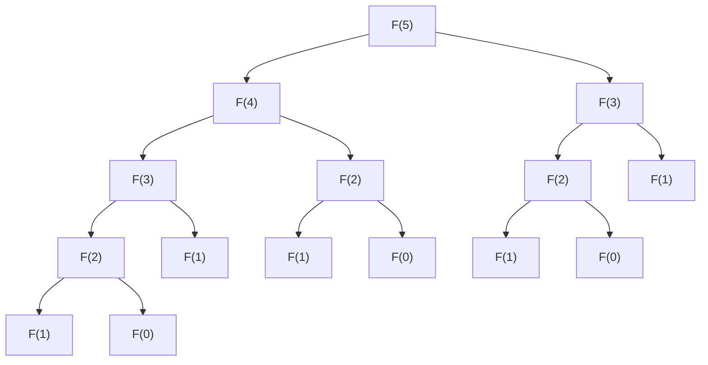
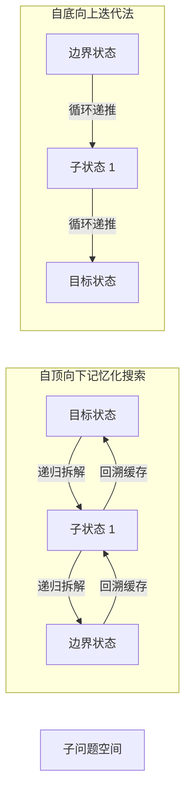

# 1.3.2.6 动态规划

动态规划（Dynamic Programming，简称 DP）是运筹学与计算机科学中用于求解多阶段决策过程最优化问题的重要数学方法论。它由美国数学家理查德·贝尔曼（Richard Bellman）于 20 世纪 50 年代初提出。在计算机算法设计中，动态规划并非一种具体的某种数据结构算法，而是一种**通过将复杂问题分解为相互重叠的子问题，并通过存储子问题解来规避重复计算的算法设计范式**。

本文将从数学内涵、实现流派、状态定义与转移方程设计、经典模型推演、以及与其他算法的对比等多维度，对动态规划的底层原理进行深度的剖析。

---

## 1. 动态规划的数学内涵与本质性质

动态规划的理论基石建立在多阶段决策过程的最优化之上。要深入理解动态规划，必须首先剖析其三大数学性质：**最优子结构**、**重叠子问题**以及**无后效性**。

### 1.1 决策过程的形式化定义
在数学上，一个 $n$ 阶段决策过程可以形式化地由以下要素定义：
1. **阶段（Stage）**：将问题求解过程划分为若干个相互关联的阶段，通常用步数、时间或空间索引 $k$ 表示（$k = 1, 2, \dots, n$）。
2. **状态（State）**：表示每个阶段开始时过程所处的自然状况或客观条件。第 $k$ 阶段的状态记为 $s_k$，所有可能状态的集合称为状态空间 $S_k$。
3. **决策（Decision）**：当过程处于某一阶段的某一状态时，可以做出的选择或决定。在状态 $s_k$ 下可供选择的决策集合记为 $U_k(s_k)$，具体的决策记为 $u_k \in U_k(s_k)$。
4. **状态转移（State Transition）**：状态随着决策的做出而发生的变化。这种变化由状态转移方程描述：
   $$s_{k+1} = T(s_k, u_k)$$
5. **阶段指标与累计指标（Stage Effect & Cumulative Objective）**：每一阶段的决策会产生局部效应或收益 $v_k(s_k, u_k)$。整个决策过程的总效应是各阶段局部效应的某种函数合成（如求和、乘积或求最大值值），称为累计指标函数 $V_{1,n}(s_1)$：
   $$V_{1,n}(s_1) = \sum_{k=1}^n v_k(s_k, u_k)$$

动态规划的本质，就是寻找一个决策序列 $\{u_1, u_2, \dots, u_n\}$，使得累计指标函数 $V_{1,n}(s_1)$ 达到极大值或极小值。根据贝尔曼最优性原理，这一全局最优解可以通过解一系列重叠的子问题来获得。

### 1.2 最优子结构性质（Optimal Substructure）
#### 1.2.1 数学定义
最优子结构性质是指**问题的最优解包含其子问题的最优解**。换言之，我们能够通过子问题的最优解来构造出原问题的最优解。这意味着我们不需要评估所有可能的非最优子决策组合，而只需要聚焦于子问题的最值。

#### 1.2.2 严格数学证明范式
我们通常采用**反证法（Proof by Contradiction）**或**剪枝证明法（Cut-and-Paste Technique）**来证明最优子结构性质。

设原问题 $P$ 的最优解为 $A^* = \{a_1, a_2, \dots, a_n\}$，其对应的最优代价为 $Cost(A^*)$。假定该最优解可划分为两部分：第一阶段的决策 $a_1$ 以及后续子问题 $P_{sub}$ 的决策序列 $A^*_{sub} = \{a_2, \dots, a_n\}$，使得：
$$Cost(A^*) = v_1(s_1, a_1) + Cost(A^*_{sub})$$
假设子问题 $P_{sub}$ 的最优解并非 $A^*_{sub}$，而是另一个决策序列 $A'_{sub}$，即：
$$Cost(A'_{sub}) < Cost(A^*_{sub}) \quad (\text{假设求解最小化问题})$$
此时，我们可以通过“剪切”掉原最优解中的 $A^*_{sub}$，并“粘贴”上更优的子解 $A'_{sub}$，从而构造出一个新的全局解 $A' = \{a_1\} \cup A'_{sub}$。该全局解的代价为：
$$Cost(A') = v_1(s_1, a_1) + Cost(A'_{sub}) < v_1(s_1, a_1) + Cost(A^*_{sub}) = Cost(A^*)$$
这表明 $A'$ 的代价比 $A^*$ 更低，与 $A^*$ 是原问题 $P$ 的最优解这一前提发生直接矛盾。因此，原问题最优解中的子问题决策序列 $A^*_{sub}$ 必须是子问题 $P_{sub}$ 的最优解。这就是最优子结构的基本数学逻辑。

#### 1.2.3 边界与反例分析
并非所有优化问题都具备最优子结构。最优子结构成立的隐性前提是**子问题之间是互相独立的**（Independent Subproblems），即一个子问题的决策不能影响另一个子问题的决策空间或资源限制。

*   **正例：最短路径问题（Shortest Path）**
    设从节点 $u$ 到节点 $v$ 的最短路径为 $p$，且 $p$ 经过了中间节点 $w$。那么，路径 $p$ 中从 $u$ 到 $w$ 的子路径 $p_1$ 必然是 $u$ 到 $w$ 的最短路径，从 $w$ 到 $v$ 的子路径 $p_2$ 也必然是 $w$ 到 $v$ 的最短路径。子问题之间没有共享的冲突资源，满足最优子结构。
*   **反例：最长无环路径问题（Longest Simple Path）**
    考虑无向图：$A - B - C - D$，每条边权重为 1。从 $A$ 到 $D$ 的最长无环路径是 $A \to B \to C \to D$，长度为 3。
    然而，该路径对应的子问题——从 $A$ 到 $C$ 的最长无环路径在整体路径中的投影是 $A \to B \to C$（长度为 2）。但是，如果独立求解从 $A$ 到 $C$ 的最长无环路径，其结果应当是 $A \to D \to C$（长度为 2，若存在此通路）。如果我们尝试组合子问题的最优解：$A \to D \to C$（$A$ 到 $C$ 的最长路径）与 $C \to D$（$C$ 到 $D$ 的最长路径），我们会发现它们合并后的路径 $A \to D \to C \to D$ 包含了重复节点 $D$，因而不是简单无环路径。
    这是因为子问题之间不独立——求解 $A$ 到 $C$ 的最优路径占用了节点 $D$，导致在求解 $C$ 到 $D$ 时无法再使用 $D$。因此，最长无环路径问题不具备最优子结构，不能使用标准的动态规划求解。

### 1.3 重叠子问题性质（Overlapping Subproblems）
#### 1.3.1 定义与计算量分析
重叠子问题性质是指**在递归求解原问题的过程中，相同的子问题会被反复遇到，而不是每次都产生新的子问题**。

以著名的斐波那契数列（Fibonacci Sequence）递归计算为例：
$$F(n) = F(n-1) + F(n-2)$$
如果我们采用纯粹的分治递归方法（不带备忘录）求解 $F(n)$，其递归调用树呈指数级增长：

在这棵调用树中，$F(3)$ 被重复计算了 2 次，$F(2)$ 被重复计算了 3 次。
设 $T(n)$ 为计算 $F(n)$ 的时间复杂度。由于 $T(n) = T(n-1) + T(n-2) + O(1)$，通过特征方程法可求得其渐进时间复杂度为：
$$T(n) = O\left(\left(\frac{1+\sqrt{5}}{2}\right)^n\right) \approx O(1.618^n)$$
这种指数级计算量的根源在于**对重叠子问题的无节制重复求解**。动态规划正是通过引入存储机制，将每个子问题的求解次数限制在 $O(1)$，从而将整体时间复杂度降低至状态空间的大小（本例中为 $O(n)$）。

### 1.4 无后效性（Markov Property / No-memory Property）
#### 1.4.1 定义与形式化阐述
无后效性（Markov Property）在数学决策论中的经典表述为：**“未来只取决于现在，而与过去无关。”**
形式化地，设决策过程的当前状态为 $s_k$。在 $s_k$ 已知的条件下，系统在第 $k$ 阶段之后的发展（即状态 $s_{k+1}, s_{k+2}, \dots$ 及其对应的指标函数值）仅取决于当前状态 $s_k$ 和此后的决策序列，而与系统是如何到达 $s_k$ 的历史路径无关。

在马尔可夫决策过程（MDP）中，转移概率满足：
$$P(S_{k+1} = s_{k+1} \mid S_k = s_k, S_{k-1} = s_{k-1}, \dots, S_0 = s_0) = P(S_{k+1} = s_{k+1} \mid S_k = s_k)$$
而在确定性系统里，这意味着状态转移函数只接受当前状态和当前决策：
$$s_{k+1} = T(s_k, u_k)$$
任何历史决策信息，一旦被当前状态 $s_k$ 吸收或忽略，就不应对未来的状态演化产生额外的、无法被 $s_k$ 表达的约束。

#### 1.4.2 消除后效性的技术：状态升维（State Expansion）
在实际建模中，许多问题在初步定义状态时具有后效性。此时，可以通过**引入新的状态维度（即状态升维）**，将历史决策的关键信息“固化”到当前状态的表示中，从而强制使问题满足无后效性。

##### 实例分析：带有交易冷冻期的股票买卖问题
假设我们被允许买卖某只股票，但有一个限制条件：**卖出股票后，无法在次日立即买入（即存在 1 天的冷冻期）**。
*   **错误的、具有后效性的状态定义**：
    设 $dp[i]$ 表示第 $i$ 天结束时的最大利润。为了计算 $dp[i]$，我们需要知道第 $i$ 天是否进行了买入或卖出决策。如果我们在第 $i$ 天想要买入股票，必须判断第 $i-1$ 天是否刚进行了卖出操作。然而，仅仅通过 $dp[i-1]$ 的数值，我们无法得知第 $i-1$ 天是否发生了卖出决策。这就产生了**后效性**。
*   **消除后效性的状态重定义（升维）**：
    为了消除这一后效性，我们将状态升维，记录第 $i$ 天结束时的具体持股与冷却状态。我们定义三个互斥状态：
    1. $dp[i][0]$：第 $i$ 天结束时，**持有**股票的最大利润。
    2. $dp[i][1]$：第 $i$ 天结束时，**未持有**股票且处于**冷冻期**（即第 $i$ 天刚卖出了股票）的最大利润。
    3. $dp[i][2]$：第 $i$ 天结束时，**未持有**股票且不处于**冷冻期**（即第 $i$ 天没有卖出操作，或者处于更早卖出后的平稳期）的最大利润。

    通过这种升维，状态转移方程可以无后效性地写为：
    *   $dp[i][0] = \max(dp[i-1][0], dp[i-1][2] - price[i])$ （昨天就持有，或者昨天不处于冷冻期且今天买入）
    *   $dp[i][1] = dp[i-1][0] + price[i]$ （今天刚卖出股票，昨天必然持股）
    *   $dp[i][2] = \max(dp[i-1][2], dp[i-1][1])$ （今天无操作，昨天就不处于冷冻期，或者昨天刚从冷冻期解冻）

    此时，第 $i$ 天的状态转移仅依赖于第 $i-1$ 天的这三个明确状态，历史路径上的具体交易细节已被全部消除，无后效性成立。

---

## 2. 动态规划两大实现流派：机制、对比与选型

动态规划在具体算法实现上分为两大主流学派：**自顶向下带备忘录法（Top-down with Memoization）**与**自底向上迭代法（Bottom-up Tabulation）**。两者在计算方向、存储管理以及执行效率上存在本质差异。



### 2.1 自顶向下带备忘录法（记忆化搜索）
#### 2.1.1 执行机制
自顶向下（Top-down）方法的思考方式与传统递归一致：从终极目标问题出发，递归地将其拆解为子问题，直到遇到最基础的边界条件（Base Case）。
为了避免重复子问题的计算，记忆化搜索在递归的基础之上引入了**备忘录缓存（Memoization）**。备忘录通常是一个多维数组或哈希表。其执行逻辑如下：
1. 每次进入递归函数时，首先以当前状态参数为键值，在备忘录中进行检索。
2. 若命中缓存，则直接返回已保存的子问题解，避免继续向下分裂。
3. 若未命中，则按照状态转移关系继续递归求解，并将求得的结果存入备忘录中，然后再返回。

#### 2.1.2 伪代码与控制流
```go
// 记忆化搜索伪代码 (以斐波那契为例)
func fibMemo(n int, memo []int) int {
    if n <= 1 {
        return n
    }
    // 1. 检查备忘录
    if memo[n] != -1 {
        return memo[n]
    }
    // 2. 递归计算并写入备忘录
    memo[n] = fibMemo(n-1, memo) + fibMemo(n-2, memo)
    return memo[n]
}
```

#### 2.1.3 系统栈开销与溢出防范
虽然记忆化搜索在算法复杂度上可以与迭代递推保持一致，但在工程实现中存在显著隐患：
*   **系统调用栈溢出（Stack Overflow）**：由于递归调用的深度正比于决策的阶段数 $N$，在操作系统中，每个线程的调用栈空间（通常为几百 KB 到几 MB 之间）是极其有限的。当 $N$ 非常大时（例如 $N > 10^5$），高频度的函数调用会导致系统调用栈空间耗尽，程序异常崩溃。
*   **栈帧分配开销**：每一次递归调用都需要在栈帧中保存返回地址、寄存器现场、形式参数和局部变量。这在 CPU 层面引入了额外的开销（指令跳转、内存读写等）。
*   **防范方案**：
    1.  **显式栈模拟（Explicit Stack Allocation）**：在内存堆中手动分配一个容器（如 `std::vector` 或 `ArrayList`）来模拟系统调用栈，将递归改写为基于显式栈的迭代。
    2.  **尾递归优化（Tail Recursion Elimination）**：部分编译器支持将尾递归优化为循环跳转。然而，动态规划中的转移方程通常包含多个分支相加或取最值（如 $F(n-1) + F(n-2)$），这使得其不属于严格的尾递归，编译器难以直接进行自动优化。

### 2.2 自底向上迭代法（递推法）
#### 2.2.1 执行机制
自底向上（Bottom-up）方法是一种更加契合物理内存结构和 CPU 缓存机制的解决思路。它不使用递归，而是直接从最基础的边界状态（Base Case）出发，利用循环迭代，按照**状态依赖的拓扑顺序**，逐步推导出更高阶状态的解，直到计算出最终目标状态。
在自底向上方法中，我们通常需要显式声明一个状态表（DP Table，一般为多维数组），通过循环控制更新。

#### 2.2.2 状态拓扑序的重要性
自底向上迭代能够成功的前提是**计算顺序必须遵循状态依赖图的拓扑排序（Topological Order）**。
也就是说，在计算状态 $S_k$ 时，状态转移方程中所依赖的所有子状态 $S_{k-1}, S_{k-2}, \dots$ 必须已经被计算并存储在 DP Table 中。如果遍历的循环顺序与依赖图的拓扑序相反，就会读取到未初始化的无效状态，导致递推崩溃。

例如，在图的最短路径算法（如 Floyd-Warshall 算法）中，三层循环的嵌套顺序必须是：最外层循环遍历中间过渡节点 $k$，内层两层循环遍历起点 $i$ 和终点 $j$。如果颠倒这一顺序，将过渡节点 $k$ 放在内层循环，就会因为破坏了状态的依赖关系，导致计算出的路径并非全局最优。

### 2.3 两种流派的深度对比与工程选型
| 对比维度 | 自顶向下带备忘录法（记忆化搜索） | 自底向上迭代法（Tabulation） |
| :--- | :--- | :--- |
| **计算流向** | 自目标状态向边界状态延伸，再回溯 | 自边界状态向目标状态逐步递推 |
| **控制流** | 递归函数调用链，控制流由系统调用栈管理 | 多重 `for` 循环，控制流由循环计数器显式控制 |
| **空间开销** | 额外的系统栈空间 $O(N)$ + 备忘录空间 $O(N)$ | 仅需 DP 表空间 $O(N)$，且极易进行空间压缩 |
| **时间常数** | 较大（存在大量的栈帧创建与销毁、函数跳转开销） | 较小（仅为纯粹的循环迭代和数组内存存取） |
| **状态遍历度** | **按需计算**：只计算目标状态依赖的子状态，不相关的子状态不会被触及 | **全量计算**：无论最终是否需要，都会按照规则将 DP 表的所有单元格计算一遍 |
| **缓存局部性** | 较差，递归调用中的内存访问可能发生跨区域跳转 | 极佳，数组在物理内存中连续存储，可完美触发 Cache Prefetching |
| **栈溢出风险** | 存在高风险，必须针对深层递归进行防护 | 无任何风险 |

#### 2.4 底层硬件特征分析：Cache 局部性与分支预测
在硬件层面，自底向上迭代法相比记忆化搜索具有明显的性能优势，这得益于 CPU 的以下两个特征：

##### 1. 缓存局部性（Cache Locality）
自底向上方法使用多维数组，在物理内存上是连续分配的。当程序访问数组中的某个元素 $dp[i][j]$ 时，根据空间局部性原理，CPU 会将包含该元素在内的整个 Cache Line（通常为 64 字节）一次性加载到 L1/L2 缓存中。
*   如果我们的迭代内层循环是按照内存地址增长的顺序（行优先）访问数组，接下来的几次内存访问将直接在缓存中命中（L1 Cache Hit，耗时约 1-2 纳秒）。
*   而在记忆化搜索中，递归调用是由运行时栈决定的，栈内存与堆内存交替访问，容易产生跳跃，引发频繁的缓存失效（Cache Miss，需要访问主存，耗时约 50-100 纳秒）。

##### 2. 分支预测（Branch Prediction）
自底向上迭代法的控制流由规则的 `for` 循环组成，循环次数确定，内部状态转移往往是平铺直叙的算术运算或简单的逻辑判断。现代 CPU 的分支预测器（Branch Predictor）可以极高精度地预测循环边界。
而在递归记忆化搜索中，频繁的函数调用以及基于哈希表或数组的条件跳转（判断是否已计算），会大幅增加分支预测器失误的概率。一旦预测失败，CPU 将不得不清空流水线，带来严重的指令执行延迟。

**工程选型建议**：
*   若问题的**状态空间极其庞大，但实际求解过程中仅有极少部分子状态被激活/依赖**（稀疏状态空间），优先选用**记忆化搜索**，因为它可以免去大量无用子状态的计算开销。
*   若问题的**状态空间被密集访问**，且对性能、内存消耗有严苛要求，应当优先选用**自底向上迭代法**，以获得更好的缓存局部性、极低的时间常数，并规避栈溢出的风险。

---

## 3. 状态定义与状态转移方程设计

动态规划算法的核心灵魂在于**状态定义**与**状态转移方程（State Transition Equation）**的设计。这是将一个实际的优化问题映射为数学计算的关键步骤。

### 3.1 如何科学定义状态（状态空间表示）
状态定义是构建动态规划算法的“基石”。一个优秀的状态定义必须具备**完备性**、**互斥性**与**最小必要性**。

1.  **明确决策的“阶段”与“约束限制”**：
    通常，状态定义的维度由两部分构成：
    *   **主维度**：描述当前决策进行到了哪一个阶段。例如，在序列问题中是“前 $i$ 个元素”；在网格问题中是“当前单元格 $(r, c)$”。
    *   **限制/约束维度**：描述在当前阶段下，为了进行下一步决策所必须携带的历史约束或资源存量。例如，在背包问题中是“当前剩余容量 $w$”；在零钱兑换中是“当前的累计金额 $amount$”。
2.  **最小必要性原则**：
    状态中包含的信息应该“不多不少”。多余的信息会导致状态空间呈几何级数膨胀（维度灾难），而缺少关键信息则会导致无法写出满足“无后效性”的转移方程。
3.  **确定物理意义**：
    每一个状态 $dp[i][j]$ 必须有极其明确的物理含义。例如：“在前 $i$ 个物品中选择，且当前背包剩余容量为 $j$ 时，能够获得的最大价值”。物理意义一旦偏离，后续的转移方程设计和边界处理就会彻底陷入混乱。

### 3.2 递推公式的数学设计
状态转移方程本质上是**最优性原理（Principle of Optimality）**的数学表述，体现了“如何从前序子问题的最优解中挑选当前阶段的最优决策”。

构建状态转移方程通常遵循以下三部曲：
1.  **决策分解（Categorization & Choice）**：
    分析在当前状态下，面临哪些可行的决策。例如，在序列比对问题中，对于字符 $X[i]$ 和 $Y[j]$，我们的决策可以是：匹配两者、跳过 $X[i]$（相当于删除）、或者跳过 $Y[j]$（相当于插入）。
2.  **取极值决策（Optimization Selection）**：
    根据优化目标（最大化或最小化），将所有可行决策对应的子状态结果与当前决策效应进行聚合，取 $\max$ 或 $\min$。
    $$dp[i][j] = \max \Big( \text{决策}_1(dp[i-1][j-1]), \, \text{决策}_2(dp[i-1][j]), \, \dots \Big)$$
3.  **严格定义边界条件（Boundary Conditions）**：
    边界条件是递推的“引擎起点”，没有正确的边界条件，递推就会变成无源之水。
    *   **数学边界**：通常是空集、长度为 0 的前缀、负数容量等极值情况。例如，当背包容量 $w < 0$ 时，该状态是物理非法状态，在求最大值问题中应初始化为负无穷大 $-\infty$，在求最小值问题中应初始化为正无穷大 $+\infty$。
    *   **边界的物理意义**：$dp[0][j]$ 表示不选任何物品时的状态价值，此时对于所有容量 $j \ge 0$，其价值应为 0。

### 3.3 空间复杂度极致优化技术：滚动数组与状态压缩
随着状态维度的增加，DP Table 所消耗的物理内存会成倍增长。在工程实践中，为了使算法满足极端的资源限制，必须采用空间优化技术。

#### 3.3.1 滚动数组（Rolling Array）的底层原理与物理依赖
滚动数组的核心数学基础是**局部依赖性**。
如果我们在计算第 $i$ 阶段的状态 $dp[i][j]$ 时，只需要知道第 $i-1$ 阶段的状态 $dp[i-1][k]$，而与 $i-2$ 之前的历史状态完全无关，那么我们根本没有必要保留前 $i-2$ 阶段的物理内存。

我们可以将空间从 $O(N \times M)$ 优化到 $O(2 \times M)$，即声明一个大小为 `2` 的第一维数组，通过模运算 `i % 2` 循环重用物理空间。
进一步地，如果满足更严格的索引单向依赖（如 $k \le j$），我们甚至可以将第一维完全抹去，将空间压缩至一维的 $O(M)$：
```go
dp[j] = dp[j] + dp[j - w] // 就地覆盖
```
在从二维降为一维物理存储时，**遍历方向的控制至关重要**。如果转移依赖于上一行较小索引的元素，且我们采用了正序遍历，那么较小索引的元素会在当前行率先被覆盖为“当前行新值”，导致后续计算读取到错误的“新值”而非“上一行旧值”。

#### 3.3.2 状态压缩技术（State Compression / Bitmask DP）
状态压缩是专门针对**集合类型状态**的优化技术。它使用一个二进制整数的位模式（Bitmask）来表示一个大小为 $N$ 的集合中各个元素的选中状态。
*   设集合中有 $N$ 个元素，若第 $k$ 个元素被选中，则二进制的第 $k$ 位为 `1`，否则为 `0`。
*   状态空间的维度从 $2^N$ 的对象集合结构降为单个整型变量 `mask`，其中 `mask` 的取值范围为 $[0, 2^N - 1]$。

##### 状态压缩中的位运算操作细节：
*   **判断第 $i$ 个元素是否在集合中**：`(mask >> i) & 1` 或者 `(mask & (1 << i)) != 0`
*   **将第 $i$ 个元素加入集合**：`mask | (1 << i)`
*   **将第 $i$ 个元素移出集合**：`mask & ~(1 << i)`
*   **翻转第 $i$ 个元素的存在状态**：`mask ^ (1 << i)`
*   **快速遍历包含于 `mask` 的所有非空子集 `sub`**：
    ```c
    for (int sub = mask; sub > 0; sub = (sub - 1) & mask) {
        // 处理子集 sub
    }
    ```
    【数学原理解析】：此遍历技巧可在 $O(3^N)$ 的时间复杂度内，完成对所有状态的全部子集的遍历，而不是直接遍历导致 $O(4^N)$ 复杂度。这是因为对任意一个元素，在 `mask` 与 `sub` 中只有三种状态：(1) 不在 `mask` 中；(2) 在 `mask` 中但不在 `sub` 中；(3) 既在 `mask` 中也在 `sub` 中。因此，对于大小为 $N$ 的集合，总迭代状态数为 $\sum_{i=0}^N \binom{N}{i} 2^i = (1+2)^N = 3^N$。

##### 实例展示：基于状态压缩的旅行商问题（TSP - Traveling Salesperson Problem）
旅行商问题要求寻找一条访问 $N$ 个城市且每个城市仅访问一次的最短闭合路径。
*   **状态定义**：设 $dp[mask][i]$ 表示已访问城市的集合状态为 $mask$，且当前所处的最后一个城市为 $i$ 时的最小路径长度。其中，如果集合中第 $k$ 个城市已被访问，则 $mask$ 的第 $k$ 位为 `1`。
*   **状态转移方程**：
    为了求 $dp[mask][i]$，我们寻找它的前驱状态。前驱状态应当是不包含城市 $i$ 的集合状态，即 $mask \setminus \{i\}$，对应的位运算表示为 `mask ^ (1 << i)`。我们遍历集合中的任意一个其他城市 $j$ 作为上一步所处的城市：
    $$dp[mask][i] = \min_{j \in mask \setminus \{i\}} \Big( dp[mask \setminus \{i\}][j] + cost[j][i] \Big)$$
    位运算实现为：
    $$dp[mask][i] = \min \Big( dp[mask \ \text{^} \ (1 \ll i)][j] + cost[j][i] \Big) \quad \text{其中} \ (mask \ \& \ (1 \ll j)) \neq 0$$

#### 3.3.3 空间压缩的代价：追溯链丢失与补偿算法
空间压缩将空间复杂度降低，但带来了一个明显的副作用：**完全丢失了追溯最优决策链（Backtracking path）的能力**。

在一维 DP 表中，我们只保留了最终的最优值，而产生该最优值的前驱状态在迭代过程中已经被覆盖抹除。如果业务需求不仅要求输出“最大价值是多少”，还要求输出“具体选择了哪些物品”，则必须采用以下补偿方案：
1.  **还原回二维物理空间**：放弃空间压缩，保留完整的二维转移矩阵。从终点状态 $dp[N][W]$ 开始，逆向比较 $dp[i][w]$ 是否等于 $dp[i-1][w]$，若不相等，说明第 $i$ 个物品被选择，然后更新容量 $w = w - w_i$；若相等，说明第 $i$ 个物品未被选择。以此类推，逐步回溯至起点。
2.  **前驱决策表补偿法**：在进行一维空间递推的同时，额外声明一个轻量级的决策记录表 `parent[i][j]`，仅记录在状态 $(i, j)$ 时所做出的转移选择（例如，`0` 代表不选，`1` 代表选）。由于决策表通常仅需存储枚举类型或布尔值，其内存开销远小于存储复杂浮点数或大整型值的状态表，同时保留了重构最优路径的能力。

---

## 4. 经典动态规划模型与推演

通过对经典模型的深入推演，我们能够切实掌握动态规划的落地应用。本节将详细剖析 **0-1 背包问题**、**最长公共子序列 (LCS)** 和 **最长递增子序列 (LIS)**。

### 4.1 0-1 背包问题 (0-1 Knapsack Problem)
#### 4.1.1 数学建模
给定 $N$ 个物品，每个物品 $i$ 有对应的重量 $w_i$ 和价值 $v_i$。另有一个容量限制为 $W$ 的背包。每个物品只有一件，要么不装入背包（0），要么装入背包（1）。求解在背包总重量不超过 $W$ 的约束下，能装入物品的最大总价值。

数学描述为：
$$\max \sum_{i=1}^N v_i x_i \quad \text{s.t.} \quad \sum_{i=1}^N w_i x_i \le W, \quad x_i \in \{0, 1\}$$

#### 4.1.2 状态与转移方程
我们定义状态为二维矩阵 $dp[i][j]$：
*   **物理意义**：前 $i$ 个物品在容量限制为 $j$ 的情况下，能装入背包的最大价值。
*   **边界条件**：
    *   $dp[0][j] = 0 \quad (\forall j \in [0, W])$ （没有物品时，价值为 0）
    *   $dp[i][0] = 0 \quad (\forall i \in [0, N])$ （背包容量为 0 时，价值为 0）

对于任意物品 $i$ 和当前容量 $j$，我们面临两种决策选择：
1.  **不选择第 $i$ 个物品**：背包的当前最大价值应当与只考虑前 $i-1$ 个物品、容量同样为 $j$ 时的最大价值一致。即：
    $$dp[i][j] = dp[i-1][j]$$
2.  **选择第 $i$ 个物品**（前提是当前容量允许，即 $j \ge w_i$）：背包的最大价值等于把第 $i$ 个物品放入后，加上剩余容量 $j - w_i$ 在前 $i-1$ 个物品中选择的最大价值。即：
    $$dp[i][j] = dp[i-1][j-w_i] + v_i$$

结合这两种选择，我们可以写出完整的状态转移方程：
$$dp[i][j] = \begin{cases} 
dp[i-1][j] & j < w_i \\ 
\max\Big(dp[i-1][j], \, dp[i-1][j-w_i] + v_i\Big) & j \ge w_i 
\end{cases}$$

#### 4.1.3 状态决策矩阵推导展示
假设有 3 个物品，背包容量 $W = 5$：
*   物品 1：$w_1 = 1, v_1 = 15$
*   物品 2：$w_2 = 3, v_2 = 20$
*   物品 3：$w_3 = 4, v_3 = 30$

我们可以推导得到如下的 $dp[i][j]$ 状态矩阵：

| 物品索引 $i$ \ 容量 $j$ | 0 | 1 | 2 | 3 | 4 | 5 |
| :--- | :--- | :--- | :--- | :--- | :--- | :--- |
| **0 (无物品)** | 0 | 0 | 0 | 0 | 0 | 0 |
| **1 ($w=1, v=15$)** | 0 | 15 | 15 | 15 | 15 | 15 |
| **2 ($w=3, v=20$)** | 0 | 15 | 15 | 20 | 35 | 35 |
| **3 ($w=4, v=30$)** | 0 | 15 | 15 | 20 | 35 | 45 |

**推演解析**：
*   以 $dp[2][4]$ 为例：物品 2 的重量 $w_2 = 3$，价值 $v_2 = 20$。因为容量 $4 \ge 3$，我们取以下两者之最大值：
    *   不选物品 2：$dp[1][4] = 15$
    *   选物品 2：$dp[1][4 - 3] + v_2 = dp[1][1] + 20 = 15 + 20 = 35$
    *   最大值为 $\max(15, 35) = 35$。
*   以 $dp[3][5]$ 为例：物品 3 的重量 $w_3 = 4$，价值 $v_3 = 30$。容量 $5 \ge 4$，取最大值：
    *   不选物品 3：$dp[2][5] = 35$
    *   选物品 3：$dp[2][5 - 4] + v_3 = dp[2][1] + 30 = 15 + 30 = 45$
    *   最大值为 $\max(35, 45) = 45$。

#### 4.1.4 一维空间压缩的数学原理与逆序遍历证明
若我们直接去掉第一维，使用一维数组 `dp[j]` 进行递推更新，方程形式化为：
$$dp[j] = \max(dp[j], dp[j-w_i] + v_i)$$
为了保证此方程在数学上等价于原二维方程，内层循环对容量 $j$ 的遍历方向必须是**逆序（从大到小，即从 $W$ 到 $w_i$）**。

##### 数学证明：
假设当前外层循环进行到第 $i$ 个物品的计算。我们需要用第 $i-1$ 行的数据来更新第 $i$ 行。
在一维数组中，我们在物理上只拥有一行内存。在更新 $dp[j]$ 时，我们需要用到 $dp[j-w_i]$。
*   **情况 A：正序遍历（$j$ 从 $w_i$ 递增到 $W$）**
    当我们更新较小容量的 $dp[j-w_i]$ 时，它立刻被修改成了第 $i$ 阶段的新值，即 $dp^{(i)}[j-w_i]$。
    随后，当我们更新较大容量的 $dp[j]$ 时，根据转移公式，我们需要读取 $dp[j-w_i]$ 的值。此时，这个位置已经被污染，我们读取到的是 $dp^{(i)}[j-w_i]$，而不是上一行的旧值 $dp^{(i-1)}[j-w_i]$。
    这相当于我们在计算第 $i$ 个物品时，**重复且多次地引入了该物品**，这在语义上违背了“每个物品最多只选一次（0-1）”的约束，反而变成了**完全背包问题（物品数量无限）**的解法。
*   **情况 B：逆序遍历（$j$ 从 $W$ 递减到 $w_i$）**
    因为 $j - w_i < j$，当我们更新较大容量 of $dp[j]$ 时，所依赖的较小容量的 $dp[j-w_i]$ 尚未被更新。因此它依然保存着上一阶段的旧值，即 $dp^{(i-1)}[j-w_i]$。
    我们使用正确的旧值完成了对 $dp[j]$ 的更新，这保证了当前物品只被评估和决策了一次。

#### 4.1.5 背包问题极值变体思考
在实际算法设计中，可能遇到超出常规的边缘情况。例如：
*   **超大背包容量限制**：如果背包容量 $W$ 极大（例如 $W \le 10^9$），而物品数量较小（如 $N \le 100$），此时直接使用上述以容量为维度的 DP Table 会引发内存溢出（Out of Memory）。
*   **状态逆向映射优化**：在此种约束下，我们需要转换思维，将状态的定义反向：
    *   **新定义状态**：设 $dp[i][v]$ 表示前 $i$ 个物品凑齐总价值正好为 $v$ 时，所需物品的**最小总重量**。
    *   此时，状态表的第二维维度大小变为了所有物品的最大可能价值总和（通常较小，如 $\sum v_i \le 10^5$），而非巨大的容量 $W$。
    *   状态转移方程相应演变为：
        $$dp[i][v] = \min\Big(dp[i-1][v], \, dp[i-1][v - v_i] + w_i\Big)$$
    *   最终，在所有满足 $dp[N][v] \le W$ 的状态中，找到的最大价值 $v$ 即为所求最优解。

##### 0-1 背包完整 Java 代码实现（带详细注释）：
```java
public class Knapsack {
    /**
     * 求解 0-1 背包问题（空间压缩版）
     * @param weights 物品重量数组
     * @param values  物品价值数组
     * @param capacity 背包最大容量
     * @return 最大总价值
     */
    public static int solveKnapsack(int[] weights, int[] values, int capacity) {
        if (weights == null || values == null || weights.length != values.length || capacity <= 0) {
            return 0;
        }
        
        int n = weights.length;
        // 一维 dp 数组，初始化默认为 0
        int[] dp = new int[capacity + 1];
        
        // 遍历每一个物品
        for (int i = 0; i < n; i++) {
            int currentWeight = weights[i];
            int currentValue = values[i];
            // 逆序遍历容量，防止同一个物品被重复计算
            // 边界为 currentWeight，因为当容量小于当前物品重量时，dp[j] 只能维持原状，无需更新
            for (int j = capacity; j >= currentWeight; j--) {
                dp[j] = Math.max(dp[j], dp[j - currentWeight] + currentValue);
            }
        }
        
        return dp[capacity];
    }
}
```

---

### 4.2 最长公共子序列 (LCS - Longest Common Subsequence)
#### 4.2.1 问题定义与数学表述
给定两个序列 $X = \langle x_1, x_2, \dots, x_m \rangle$ 和 $Y = \langle y_1, y_2, \dots, y_n \rangle$，求一个最长序列 $Z$，使得 $Z$ 同时是 $X$ 和 $Y$ 的子序列（注：子序列不要求连续，但要求保持原有字符的相对顺序）。

#### 4.2.2 状态定义与转移方程
设 $dp[i][j]$ 表示前缀序列 $X[1..i]$ 与 $Y[1..j]$ 的最长公共子序列的长度。
*   **边界条件**：
    $$dp[0][j] = 0 \quad (\forall j \in [0, n])$$
    $$dp[i][0] = 0 \quad (\forall i \in [0, m])$$
*   **状态转移分析**：
    1.  若当前字符相等，即 $X[i] == Y[j]$，则它们必定属于当前公共子序列的末尾元素。最长公共子序列的长度在去掉该字符的前缀 LCS 上加 1：
        $$dp[i][j] = dp[i-1][j-1] + 1$$
    2.  若当前字符不相等，即 $X[i] \neq Y[j]$，则当前这两个字符不可能同时出现在 LCS 的尾部。此时面临两种选择，取最大值：
        *   舍弃 $X[i]$，即计算 $X[1..i-1]$ 与 $Y[1..j]$ 的 LCS，长度为 $dp[i-1][j]$；
        *   舍弃 $Y[j]$，即计算 $X[1..i]$ 与 $Y[1..j-1]$ 的 LCS，长度为 $dp[i][j-1]$。
        $$dp[i][j] = \max(dp[i-1][j], dp[i][j-1])$$

综上所述，LCS 的状态转移方程为：
$$dp[i][j] = \begin{cases} 
dp[i-1][j-1] + 1 & X[i] == Y[j] \\ 
\max(dp[i-1][j], \, dp[i][j-1]) & X[i] \neq Y[j] 
\end{cases}$$

#### 4.2.3 最优路径重构算法（还原公共子序列）
为了从 $dp[i][j]$ 的最终值中还原出具体的子序列，我们需要从状态表右下角 $dp[m][n]$ 开始，利用转移方向向左上角进行逆向追溯：
*   若 $X[i] == Y[j]$，则说明 $X[i]$ 是 LCS 的一部分，将其收集，并移至 $dp[i-1][j-1]$。
*   若 $X[i] \neq Y[j]$，则比较 $dp[i-1][j]$ 和 $dp[i][j-1]$：
    *   若 $dp[i-1][j] \ge dp[i][j-1]$，说明当前最大值来自上方，移至 $dp[i-1][j]$。
    *   若 $dp[i-1][j] < dp[i][j-1]$，说明当前最大值来自左侧，移至 $dp[i][j-1]$。
*   当任一指针归零时，追溯结束。最后将收集到的字符逆序输出，即可得到真实的 LCS 序列。

```mermaid
graph SE
    dp_ij["dp[i][j] (当前状态)"]
    dp_prev_match["dp["i-1"][j-1] (字符匹配)"]
    dp_prev_top["dp["i-1"][j] (丢弃 X[i])"]
    dp_prev_left["dp[i][j-1] (丢弃 Y[j])"]
    
    dp_ij -- "若 X[i]==Y[j]" --> dp_prev_match
    dp_ij -- "若 X[i]!=Y[j] 且 dp["i-1"][j]>=dp[i][j-1]" --> dp_prev_top
    dp_ij -- "若 X[i]!=Y[j] 且 dp["i-1"][j]<dp[i][j-1]" --> dp_prev_left
```

#### 4.2.4 LCS 空间复杂度极致优化（滚动数组）
如果仅仅要求计算 LCS 的长度而不需要重构序列，由于当前状态 $dp[i][j]$ 仅依赖于上一行的 $dp[i-1][j]$、上一行的 $dp[i-1][j-1]$ 以及当前行的前序状态 $dp[i][j-1]$，因此我们可以使用大小为 $O(\min(M, N))$ 的一维数组进行优化。
我们需要引入一个额外的辅助变量 `prev`，在迭代覆盖前，缓存上一行的 $dp[i-1][j-1]$ 值。

##### 完整 LCS 计算与重构 Java 代码实现：
```java
public class LongestCommonSubsequence {
    
    public static class LCSResult {
        public int length;
        public String sequence;

        public LCSResult(int length, String sequence) {
            this.length = length;
            this.sequence = sequence;
        }
    }

    /**
     * 计算最长公共子序列长度并重构其序列
     */
    public static LCSResult computeLCS(String text1, String text2) {
        if (text1 == null || text2 == null || text1.isEmpty() || text2.isEmpty()) {
            return new LCSResult(0, "");
        }

        int m = text1.length();
        int n = text2.length();
        int[][] dp = new int[m + 1][n + 1];

        // 1. 构建状态转移矩阵
        for (int i = 1; i <= m; i++) {
            char c1 = text1.charAt(i - 1);
            for (int j = 1; j <= n; j++) {
                char c2 = text2.charAt(j - 1);
                if (c1 == c2) {
                    dp[i][j] = dp[i - 1][j - 1] + 1;
                } else {
                    dp[i][j] = Math.max(dp[i - 1][j], dp[i][j - 1]);
                }
            }
        }

        int lcsLength = dp[m][n];

        // 2. 逆向回溯重构 LCS 序列
        StringBuilder sb = new StringBuilder();
        int i = m, j = n;
        while (i > 0 && j > 0) {
            if (text1.charAt(i - 1) == text2.charAt(j - 1)) {
                // 当前字符属于公共子序列，加入缓冲
                sb.append(text1.charAt(i - 1));
                i--;
                j--;
            } else if (dp[i - 1][j] >= dp[i][j - 1]) {
                // 向上移动
                i--;
            } else {
                // 向左移动
                j--;
            }
        }

        // 因为是逆向收集，最后需要反转字符串
        String lcsSeq = sb.reverse().toString();
        return new LCSResult(lcsLength, lcsSeq);
    }
}
```

---

### 4.3 最长递增子序列 (LIS - Longest Increasing Subsequence)
#### 4.3.1 问题定义
给定一个无序的整数数组 $nums$，找到其中最长严格递增子序列的长度。子序列同样不要求连续。

#### 4.3.2 方案 A：标准 DP 状态转移设计（时间复杂度 $O(N^2)$）
*   **状态定义**：
    $dp[i]$ 表示以元素 $nums[i]$ **结尾**的最长递增子序列的长度。
*   **状态设计的物理内涵**：
    如果仅定义 $dp[i]$ 为前 $i$ 个元素中的最长递增子序列，当我们面临第 $i+1$ 个元素 $nums[i+1]$ 时，由于我们不知道前 $i$ 个元素所组成的最长递增子序列的最后一个元素是多少，我们就无法判断 $nums[i+1]$ 能否拼接在它的后面。这引入了严重的后效性。而限制“以 $nums[i]$ 结尾”则完美解决了这个决策断层。
*   **状态转移方程**：
    为了求以 $nums[i]$ 结尾的最长递增子序列，我们需要扫描它之前的所有元素 $nums[j]$（其中 $0 \le j < i$）。
    如果 $nums[i] > nums[j]$，则说明 $nums[i]$ 可以追加在以 $nums[j]$ 结尾的递增子序列后面，形成一个长度为 $dp[j] + 1$ 的新递增子序列。
    $$dp[i] = \max_{0 \le j < i, \, nums[j] < nums[i]} (dp[j]) + 1$$
*   **边界值**：
    每个元素自身都可以单独作为一个长度为 1 的递增子序列，因此初始状态下对所有 $i$，均有 $dp[i] = 1$。
*   **最终结果**：
    全局最长递增子序列的终点可以在数组中的任意位置，因此结果为：
    $$\text{LIS} = \max_{0 \le i < N} (dp[i])$$

#### 4.3.3 方案 B：贪心与二分查找结合的极致优化（时间复杂度 $O(N \log N)$）
为了将计算复杂度从 $O(N^2)$ 降低到 $O(N \log N)$，我们需要重新构思状态空间。这种方法利用了**贪心选择**，并维护了一个单调辅助数组。

##### 状态重新定义与辅助数组 `tails`：
我们定义一个数组 `tails`，其中 `tails[k]` 存储**所有长度为 $k+1$ 的递增子序列中，末尾元素的最小值**。

##### tails 数组严格单调递增性质的数学证明：
我们需要证明对于任意的 $a < b$，都有 `tails[a] < tails[b]`。

**证明过程（反证法）**：
1. 假设存在某时刻 $a < b$，使得 $\text{tails}[a] \ge \text{tails}[b]$。
2. 根据定义，$\text{tails}[b]$ 是一个长度为 $b+1$ 的递增子序列的末尾元素。我们将这个长度为 $b+1$ 的递增子序列记为 $S_b = \langle x_1, x_2, \dots, x_b, x_{b+1} \rangle$，其中末尾元素 $x_{b+1} = \text{tails}[b]$。
3. 因为 $S_b$ 是一个严格递增的序列，所以它满足 $x_1 < x_2 < \dots < x_b < x_{b+1}$。
4. 由于 $a < b$，这意味着 $a+1 \le b$。我们可以在序列 $S_b$ 中截取前 $a+1$ 个元素，它们构成了一个长度为 $a+1$ 的子序列 $S_a = \langle x_1, x_2, \dots, x_{a+1} \rangle$。
5. 显然，这个截取出的子序列 $S_a$ 也是一个合法的严格递增子序列，并且其末尾元素为 $x_{a+1}$。
6. 因为序列是严格单调递增的，所以对于任何 $a+1 \le b$，其尾部元素必然满足：
   $$x_{a+1} < x_{b+1} = \text{tails}[b]$$
7. 回顾 $\text{tails}[a]$ 的物理定义：它是**所有**长度为 $a+1$ 的递增子序列的尾部元素的**最小值**。而我们刚才截取出的 $S_a$ 正好是一个长度为 $a+1$ 的递增子序列，尾部为 $x_{a+1}$。因此，根据最小值的定义，必然有：
   $$\text{tails}[a] \le x_{a+1}$$
8. 结合步骤 6 与步骤 7 的不等式，可得：
   $$\text{tails}[a] \le x_{a+1} < \text{tails}[b] \implies \text{tails}[a] < \text{tails}[b]$$
9. 这与我们的假设 $\text{tails}[a] \ge \text{tails}[b]$ 产生了直接的数学冲突。
10. 因此，假设不成立，$\text{tails}$ 数组在任意时刻都必然是严格单调递增的。

##### 决策转移与二分查找机制：
由于 `tails` 数组是严格单调递增的，我们可以对其使用**二分查找（Binary Search）**。
对于数组中的每一个数 $num$，我们在 `tails` 中查找第一个大于等于 $num$ 的元素（设其索引为 $i$）：
1.  若 $num$ 大于 `tails` 数组中的所有元素，说明 $num$ 可以拼在当前已知最长递增子序列的后面，使最长递增子序列的长度增加 1。我们将 $num$ 追加到 `tails` 的末尾。
2.  若在 `tails` 中找到了第一个大于等于 $num$ 的元素 `tails[i]`，我们就用 $num$ 替换掉 `tails[i]`。
    *   **贪心逻辑物理阐释**：由于 $num \le \text{tails}[i]$，用更小的 $num$ 来作为长度为 $i+1$ 的子序列的末尾元素，显然比原来的 `tails[i]` 更有扩展优势（越小的末尾元素，越有利于在其后拼接更多的新元素）。同时由于 $num$ 大于 `tails[i-1]`，这保证了替换后 `tails` 数组依旧维持严格单调递增。
3.  最终，`tails` 数组的长度即为整个数组的最长递增子序列长度。

#### 4.3.4 难点：如何重构并输出真实的 LIS 序列
一个常见的算法设计误区是：在执行完贪心二分法后，直接输出 `tails` 数组中的内容作为最长递增子序列。

> [!WARNING]
> `tails` 数组在递推过程中可能发生了中间状态的覆盖，其所保存的元素**并不是**一个真实的、符合原始相对顺序的递增子序列。它仅仅是一个“长度代表最优，末尾元素代表最小”的辅助数组。
> 
> 例如：对于输入 `[10, 9, 2, 5, 3, 7, 101, 18]`，在执行过程中，`tails` 的变化步骤如下：
> *   输入 `10`  $\rightarrow$ `tails = [10]`
> *   输入 `9`   $\rightarrow$ `tails = [9]` (替换了 10)
> *   输入 `2`   $\rightarrow$ `tails = [2]` (替换了 9)
> *   输入 `5`   $\rightarrow$ `tails = [2, 5]`
> *   输入 `3`   $\rightarrow$ `tails = [2, 3]` (替换了 5)
> *   输入 `7`   $\rightarrow$ `tails = [2, 3, 7]`
> *   输入 `101` $\rightarrow$ `tails = [2, 3, 7, 101]`
> *   输入 `18`  $\rightarrow$ `tails = [2, 3, 7, 18]` (18 替换了 101)
> 
> 在此例中，虽然 `tails` 最终输出的 `[2, 3, 7, 18]` 确实是一个合法的子序列，但在更复杂的场景下，替换会打乱原有的元素相对顺序。例如对于输入 `[2, 4, 3, 1]`：
> *   输入 `2`, `4` $\rightarrow$ `tails = [2, 4]`
> *   输入 `3` $\rightarrow$ `tails = [2, 3]`
> *   输入 `1` $\rightarrow$ `tails = [1, 3]`
> 此时 `[1, 3]` 的实际长度是 2。但根据原始输入，`1` 出现在 `3` 的后面，原序列中根本不存在子序列 `[1, 3]`。

##### 解决方案：指针映射链（Index Mapping Chain）
要重构真实的 LIS 序列，我们需要在二分更新的同时，使用一个额外的指针回溯链：
1.  维护一个大小为 $N$ 的数组 `parent`。`parent[i]` 存储：在 `nums[i]` 被加入或更新到 LIS 路径中时，它在原数组中前一个紧邻递增元素的物理索引。
2.  维护一个与 `tails` 同样大小的索引数组 `position`。`position[i]` 存储当前对应长度的子序列尾部元素在 `nums` 中的物理索引。
3.  每次二分查找替换或追加元素时：
    *   设查找到的插入位置为 `idx`。
    *   在 `tails[idx]` 被 `num[i]` 替换或追加时，记录 `parent[i]` 的值为 `position[idx - 1]`（即前一个长度的子序列尾部元素的物理索引）。
    *   更新 `position[idx]` 为当前元素 $i$ 的索引。
4.  最后，从 `position` 的最后一个元素（即 LIS 的终点索引）出发，沿着 `parent` 数组逆向回溯，即可精确重构出一条物理正确的、相对顺序无误的最长递增子序列。

##### LIS 的 $O(N \log N)$ 完整 Go 语言实现（带完整重构逻辑）：
```go
package main

import "fmt"

// LISResult 包含 LIS 长度以及具体的子序列元素
type LISResult struct {
	Length   int
	Sequence []int
}

// SolveLIS 求最长递增子序列，并在 O(N log N) 时间内重构其序列内容
func SolveLIS(nums []int) LISResult {
	if len(nums) == 0 {
		return LISResult{Length: 0, Sequence: []int{}}
	}

	n := len(nums)
	tails := make([]int, 0, n)     // 记录各个长度下最小尾部元素
	position := make([]int, 0, n)  // 对应 tails 元素在 nums 中的物理索引
	parent := make([]int, n)       // 回溯指针，parent[i] 记录 nums[i] 的前驱节点索引

	for i := 0; i < n; i++ {
		parent[i] = -1 // 默认无前驱
	}

	for i := 0; i < n; i++ {
		num := nums[i]
		// 二分查找第一个大于等于 num 的位置
		left, right := 0, len(tails)
		for left < right {
			mid := left + (right-left)/2
			if tails[mid] < num {
				left = mid + 1
			} else {
				right = mid
			}
		}

		// 记录前驱指针
		if left > 0 {
			parent[i] = position[left-1]
		}

		// 替换或追加操作
		if left == len(tails) {
			tails = append(tails, num)
			position = append(position, i)
		} else {
			tails[left] = num
			position[left] = i
		}
	}

	// 开始回溯重构序列
	lisLen := len(tails)
	lisSeq := make([]int, lisLen)
	
	// 从最后一个有效尾部元素的物理索引开始回溯
	currIdx := position[lisLen-1]
	for k := lisLen - 1; k >= 0; k-- {
		lisSeq[k] = nums[currIdx]
		currIdx = parent[currIdx]
	}

	return LISResult{
		Length:   lisLen,
		Sequence: lisSeq,
	}
}

func main() {
	nums := []int{10, 9, 2, 5, 3, 7, 101, 18}
	result := SolveLIS(nums)
	fmt.Printf("LIS 长度: %d\n", result.Length)
	fmt.Printf("LIS 子序列: %v\n", result.Sequence) // 输出: [2, 3, 7, 18]
}
```

---

## 5. 动态规划与其他经典算法的范式对比

为了更加立体地展现动态规划的独特性，本节将动态规划、**分治算法**以及**贪心算法**进行横向的多维度对比。

### 5.1 动态规划 vs 分治算法
*   **相同点**：两者都体现了**“分而治之”**的思想，都是将一个难以直接求解的大问题，拆解为若干个规模较小的子问题来进行求解。
*   **不同点（重叠性 vs 独立性）**：
    *   **分治算法**：要求子问题是**完全独立（Disjoint Subproblems）**的，即子问题之间没有交集。例如归并排序（Merge Sort）和快速排序（Quick Sort），被拆分出来的左半部分和右半部分在物理上是完全无关的独立序列。由于没有子问题的重叠，分治法直接采用自顶向下的递归求解，不存在重复计算。
    *   **动态规划**：针对的是**重叠子问题（Overlapping Subproblems）**。子问题之间存在紧密的相互依赖，如果直接使用分治法的纯递归，会导致计算量的指数级爆炸。动态规划通过引入 DP Table 或备忘录来打破这一瓶颈。

### 5.2 动态规划 vs 贪心算法
*   **相同点**：两者都要求问题具备**最优子结构**性质，即局部最优能够被推演和组合为全局最优。
*   **不同点（决策时机与回溯性）**：
    *   **贪心算法**：在每一步决策时，做出**当前看来最优的选择**（局部最优选择），决策一旦做出，便立即进入下一状态，**绝对不会发生回溯（No backtracking）**。贪心算法不从全局视角对比所有的决策路径，因此它的时间复杂度通常极低（如 $O(N)$ 或 $O(N \log N)$）。但它需要极其严密的数学证明（通常基于拟阵 Matroid 理论）来保证全局最优性。
    *   **动态规划**：在决策时是**全局审视**的。在计算当前状态时，它会综合对比所有可能转移到当前状态的前驱决策，并取其中的极值。动态规划在逻辑上**遍历了所有的可行决策路径**，只是通过存储机制规避了无用的计算。因此，它能够保证全局最优，但空间和时间开销通常高于贪心。

##### 经典案例对比：找零钱问题（Coin Change）
设有面值为 `[1, 3, 4]` 的硬币，我们需要凑出总金额 `6`，要求使用的硬币数量最少。
*   **贪心算法的决策路径**：
    为了使硬币数量最少，贪心算法每次都会选择当前可用的最大面值。
    1. 选择面值 `4`，剩余金额 `6 - 4 = 2`。
    2. 剩余金额 `2` 无法选择面值 `3` 或 `4`，只能选择面值 `1`。剩余金额 `2 - 1 = 1`。
    3. 继续选择面值 `1`。剩余金额归零。
    *   贪心选择结果：`[4, 1, 1]`，共使用 **3** 枚硬币。
*   **动态规划的决策路径**：
    动态规划会评估凑出金额 `6` 的所有可能决策分支：
    *   由金额 `5` 转移而来（加上一枚面值 `1` 的硬币）：$dp[5] + 1$
    *   由金额 `3` 转移而来（加上一枚面值 `3` 的硬币）：$dp[3] + 1$
    *   由金额 `2` 转移而来（加上一枚面值 `4` 的硬币）：$dp[2] + 1$
    根据计算：$dp[3] = 1$（使用一枚面值 `3`），因此最优决策为 $dp[3] + 1 = 2$。
    *   动态规划选择结果：`[3, 3]`，共使用 **2** 枚硬币。
    由此可见，由于不满足“贪心选择性质”，贪心算法在此问题上失效，必须使用动态规划来保证全局最优解。

### 5.3 算法选型与特性对比矩阵
| 特性维度 | 分治算法 (Divide & Conquer) | 贪心算法 (Greedy) | 动态规划 (Dynamic Programming) |
| :--- | :--- | :--- | :--- |
| **子问题关系** | 互相独立，没有交集 | 重叠或独立，具备贪心选择性 | 重叠且相互依赖，不具备贪心选择性 |
| **最优解保证** | 天然保证（各部分合并） | 需严格的数学证明方可保证最优 | 天然保证（遍历所有决策路径） |
| **计算流向** | 自顶向下递归 | 自顶向下逐步决策（单向） | 自底向上迭代 / 自顶向下带备忘录 |
| **空间复杂度** | $O(\log N)$ 栈空间 | 通常为 $O(1)$ | $O(N)$ 至 $O(N^2)$，可进行空间压缩 |
| **时间复杂度** | 通常为多项式级（如 $O(N \log N)$） | 极低，通常为 $O(N)$ 或 $O(N \log N)$ | 中等，取决于状态空间与决策分支数 |
| **典型问题场景** | 归并排序、快速排序、大整数乘法 | 霍夫曼编码、最小生成树（Kruskal/Prim） | 背包问题、最短路径（Floyd-Warshall）、LCS |

---

## 6. 总结与动态规划认知升华

理解动态规划的最高层次，是将其视为**在状态空间组成的有向无环图（DAG）上寻找最长或最短路径的过程**。

如果我们把每一个状态定义为图中的一个节点，状态之间的转移关系定义为有向边，边的权重代表决策的阶段效应或转移代价。那么，由于无后效性性质的存在，这个状态转移图必然不存在任何环路，即它是一个标准的 DAG。
*   **寻找最优解**，本质上就是在该 DAG 上求解从起点（边界状态）到终点（目标状态）的最短路径（求最小值问题）或最长路径（求最大值问题）。
*   **备忘录与状态表**，其本质是对 DAG 节点的拓扑排序计算结果的缓存，避免了对同一节点的前驱/后继路径的重复检索。

掌握动态规划，绝非死记硬背状态转移方程，而是要培养敏锐的状态抽象能力，科学地对复杂的现实约束进行升维或降维，在无后效性与空间开销之间取得完美的工程平衡。

