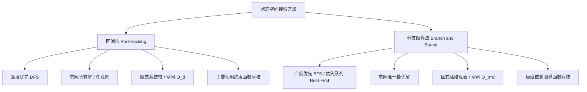
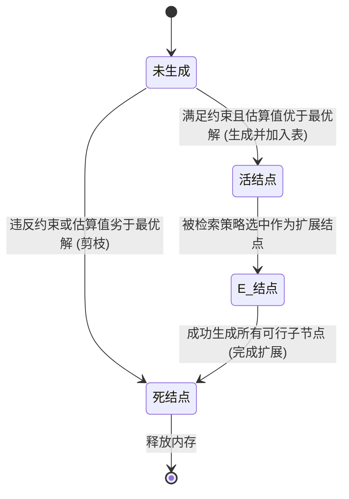
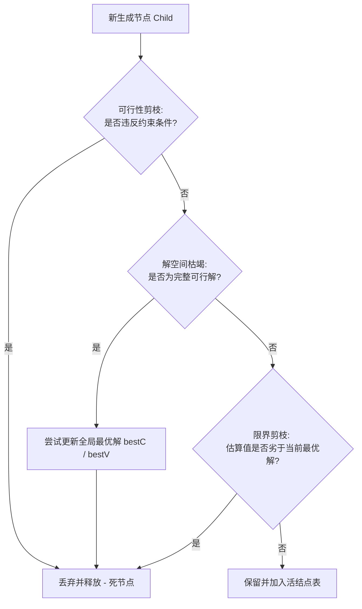
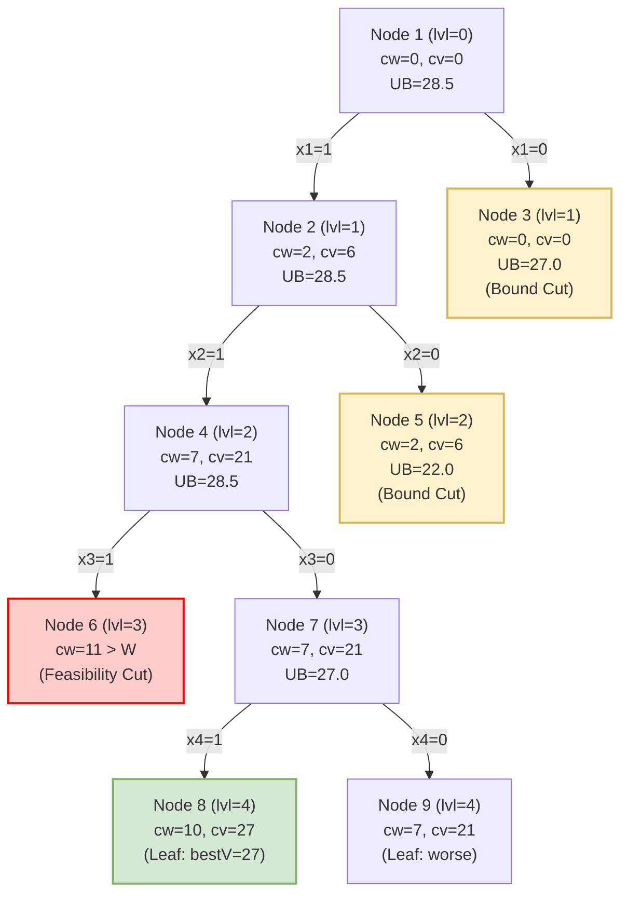
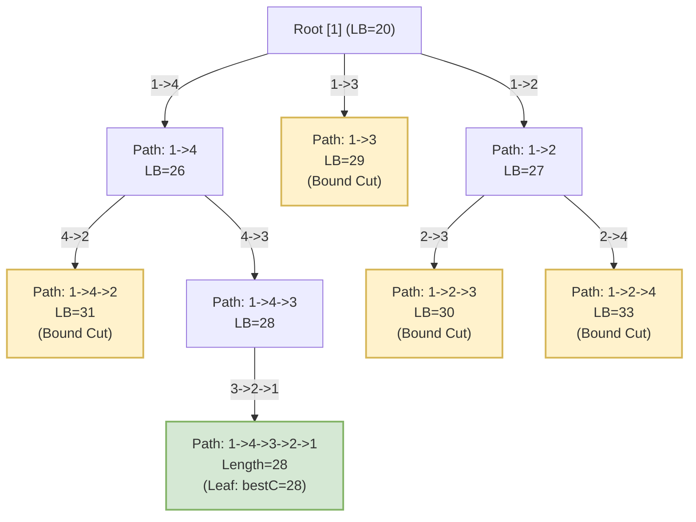

# 1.3.2.9 分支限界法

## 1. 分支限界法的核心概念与设计初衷

在计算复杂性理论中，以旅行商问题（TSP）、0-1 背包问题、最大团问题以及装箱问题为代表的组合优化问题，大多被证明属于 NP-Hard 难题。随着问题规模 $N$ 的增长，其可行解的解空间将呈现出指数级（如子集树的 $O(2^N)$）或阶乘级（如排列树的 $O(N!)$）的爆发式增长。这使得直接采用暴力穷举在物理上变得完全不可行。

为了在合理的时间内求得这些组合优化问题的**精确最优解**（而非近似解或启发式解），运筹学与计算机科学界引入了**分支限界法（Branch and Bound, B&B）**。该算法最早由 A. H. Land 和 A. G. Doig 于 1960 年在解决混合整数线性规划问题时提出，随后由 J. D. C. Little 等人成功应用于旅行商问题，逐渐演变为求解离散和组合优化问题最强有力的系统性精确求解框架。

### 1.1 什么是分支限界法？

分支限界法是一种在问题的解空间树（State Space Tree）上，以**广度优先（Breadth-First Search, BFS）**或**最小耗费/最大收益优先（Best-First Search）**的方式，系统地搜索组合优化问题最优解的算法框架。其核心思想可以用八个字来概括：“**系统分裂，乐观限界**”。

*   **分支（Branching）**：指的是将当前面临的复杂大问题（对应解空间树中的一个节点）系统地划分为若干个更小的、互不重叠的子问题（对应子节点）。通过这种不断的划分，算法将隐式地构建出一棵覆盖整个可行解空间的状态树。
*   **限界（Bounding）**：指的是在搜索过程中，不对子问题的子树进行盲目的穷举，而是通过数学方法快速计算出一个评估值。对于最小化问题，该评估值代表以当前节点为根的子树所能达到的目标函数**下界（Lower Bound）**；对于最大化问题，则代表**上界（Upper Bound）**。该限界必须保证在数学上的“乐观性”，即它不能差于该子树中实际包含的最优解。
*   **剪枝（Pruning）**：算法在搜索过程中动态维护一个当前已知的全局最佳可行解的值（记为 $best$）。一旦某个子节点的限界估算值劣于或等于 $best$，就意味着在这个子分支中即使穷尽搜索，也绝对不可能找到比当前全局最优解更好的方案。此时，算法会立即将该节点标记为“死节点”并彻底舍弃它，防止对其子树展开任何无用的搜索。

### 1.2 分支限界法与回溯法的本质对比

分支限界法与回溯法（Backtracking）都是在问题的状态空间树中搜索解的系统化方法。然而，它们在设计哲学、搜索行为、数据结构以及求解目标上存在着本质的区别。



为了更清晰地呈现两者的差异，下表从六个关键维度进行了横向对比：

| 对比维度 | 回溯法 (Backtracking) | 分支限界法 (Branch and Bound) |
| :--- | :--- | :--- |
| **搜索策略** | **深度优先搜索（DFS）**。<br>沿着一条路径一直向下深入，直到触发剪枝条件或到达叶子节点，然后回退（回溯）并尝试其他分支。 | **广度优先搜索（BFS）** 或 **优先队列（Best-First）**。<br>横向逐层扩展，或者根据启发式估算值，每次挑选最有潜力的结点进行优先扩展。 |
| **求解目标** | 通常旨在找出满足约束条件的**所有可行解**、**任意可行解**或**解的数量**（如八皇后问题、图着色问题、数独）。 | 旨在求解满足约束条件的**一个最优解**（如最小成本、最大收益）。 |
| **核心数据结构** | **系统栈（递归）** 或 显式声明的单栈。<br>回溯过程通过调用栈的压栈与出栈隐式完成。 | **显式维护的活结点表（Live Node List）**。<br>常表现为普通队列（FIFO）或二叉堆构建的优先队列（LC-Search）。 |
| **剪枝依据** | 主要依赖**约束函数（Constraint Function）**。<br>在节点处检查是否违反显式约束；在少数优化问题中也会结合粗糙的限界函数。 | **约束函数** 与 **限界函数（Bounding Function）** 并重。<br>通过严格的数学上下界估算，与全局动态最优解进行比对，实行强力剪枝。 |
| **内存消耗** | **空间复杂度极低**，一般为 $O(d)$（$d$ 为树的最大深度）。<br>内存中只保留从根节点到当前正在访问节点的单条路径上的决策状态。 | **空间复杂度极高**，最坏情况下呈指数级 $O(b^d)$。<br>必须在内存中保存当前搜索前沿（Frontier）的所有活结点状态，面临极大的 OOM 风险。 |
| **状态节点生命周期** | 节点的生命周期很短，在递归调用返回时，其局部状态即被销毁，并在回溯时撤销对全局状态的影响。 | 活结点在被扩展前必须一直驻留在活结点表中，其生命周期长，需显式创建、调度、并在死亡后进行内存释放。 |

#### 深度原理解析：为什么单目标优化问题中分支限界法效率更高？

在处理单目标优化问题时，回溯法面临一个致命的弱点：**盲目性**。由于回溯法采用 DFS 策略，它被迫沿着状态树的第一条可行路径一路向下，即使这条路径最终产生的解质量非常低，它也必须走完。只有在遍历了大量无关的左侧子树后，回溯法才能更新其 $best$ 值。而在搜索树的右侧，即使某些高层分支的估算值已经明显差于已知的 $best$ 值，回溯法也因为无法进行全局维度的节点比较，只能按照固定的 DFS 顺序继续深入，直到触发局部的约束条件或到达叶节点。

相比之下，分支限界法（尤其是优先队列式）能够以**全局最优的视角**来调度搜索方向。它通过限界函数对所有待扩展的“活结点”进行评估，每次都挑出“最有可能产生全局最优解”的结点进行扩展。这就好比是在黑暗中登山，回溯法是沿着一条路摸黑走到山顶（或无路可走）再退回来换一条；而分支限界法则是同时观察多个方向，始终朝着坡度最陡、最有可能登顶的方向前行。这使得分支限界法能够以极快的速度触碰到真正的最优解，并利用这个高质量的全局最优解作为“门槛”，将剩下的绝大多数分支在极高层直接剪掉。

---

## 2. 状态空间树的检索策略与活结点管理

在分支限界法的执行过程中，解空间并不是一次性全部读入内存的，而是随着搜索的推进，在内存中动态构建和销毁的。这就涉及到状态空间树中结点的生命周期及其管理机制。

### 2.1 结点的生命周期与状态转换

在状态空间树中，每个结点在任意时刻都处于以下三种状态之一：

1.  **活结点（Live Node）**：该结点本身已经被生成，并且已经通过了约束条件与限界函数的初步筛选，但尚未对其进行子结点的分支扩展。它们被寄存在“活结点表”中，等待算法调度。
2.  **E-结点（Expansion Node，扩展结点）**：当前正在被读取并进行分支扩展的唯一结点。算法会根据检索策略从活结点表中挑出一个结点作为 E-结点，生成它的所有可行子结点。
3.  **死结点（Dead Node）**：一个结点在完成了它的分支扩展（它的所有合法的孩子结点都已被生成并放入活结点表中）后，就变成了死结点。此外，如果一个结点在被调度或生成时，直接被限界函数判定为没有潜力，或者违反了可行性约束，它不需要进行扩展，也会直接变为死结点。死结点可以安全地从内存中释放。



### 2.2 活结点表（Live Node List）的维护机制

活结点表是分支限界法的核心数据结构。检索策略的不同，本质上就是活结点表所采用的**数据结构与调度算法**的不同。

#### 2.2.1 先进先出（FIFO）分支限界法

FIFO 分支限界法使用**标准队列（Queue）**作为活结点表的底层实现。

*   **工作机制**：
    1.  将根结点作为初始活结点插入队列。
    2.  如果队列为空，算法结束。否则，从队头弹出一个元素作为当前 E-结点。
    3.  依次生成 E-结点的所有孩子结点。
    4.  对于每一个孩子结点，检查其是否满足约束条件。如果满足，并且其限界估算值优于当前全局最优解，则将该孩子结点作为活结点插入队尾。
    5.  如果孩子结点已经是叶子结点，且其真实的目标函数值优于当前全局最优解，则更新全局最优解 $best$。
    6.  将 E-结点移出，释放内存。重复步骤 2。

*   **优缺点与局限性分析**：
    FIFO 检索在逻辑上非常简单，且不需要对活结点表进行复杂的排序操作，入队和出队的时间复杂度均为 $O(1)$。然而，它的缺点极其明显：它是一种**盲目的横向搜索**。在状态树的前几层，FIFO 会无差别地扩展所有结点，导致活结点表的大小呈指数级膨胀。此外，由于它不能优先深入有潜力的分支，它往往需要搜索到很晚才能碰触到第一个可行叶子结点，这导致在搜索的前期，全局最优解 $best$ 迟迟得不到更新，无法提供一个紧致的剪枝门槛，从而产生了大量不必要的无效搜索。

#### 2.2.2 后进先出（LIFO）分支限界法

LIFO 分支限界法使用**显式栈（Stack）**来管理活结点表。

*   **工作机制**：
    每次从栈顶弹出最近生成的活结点作为 E-结点进行扩展，生成的新活结点再次压入栈顶。这在搜索路径上表现为深度优先。
*   **与回溯法的区别**：
    尽管 LIFO 在搜索顺序上与回溯法（DFS）一致，但在底层实现上，LIFO 分支限界法并不依赖于函数递归调用栈，而是通过一个显式的数据结构（栈对象）来保存每个节点的完整状态。此外，LIFO 分支限界法通常会存储更多的决策信息，用于在出栈时进行即时的限界剪枝。然而，因为 LIFO 缺乏启发式估算信息的指导，且在内存控制上并不能像传统回溯法那样通过隐式回溯和状态撤销做到 $O(d)$ 的极低消耗（因为栈中仍然需要显式存储状态对象），因此在实际应用中非常罕见，通常只作为特定混合检索策略的辅助手段。

#### 2.2.3 优先队列（LC，Least Cost）分支限界法

LC 分支限界法（也称 Best-First 搜索）是分支限界法中最具威力、使用最广泛的检索策略。它使用**二叉堆构建的优先队列（Priority Queue）**来管理活结点表。

*   **工作机制**：
    1.  为每个结点 $x$ 设计一个评估函数值 $\hat{g}(x)$。对于最小化问题，$\hat{g}(x)$ 通常代表该结点能达到的最小开销估计值；对于最大化问题，它代表最大价值估计值。
    2.  将根结点存入优先队列。
    3.  每次从优先队列中取出 $\hat{g}(x)$ 最优（即估算开销最小或估算价值最大）的结点作为当前 E-结点。
    4.  扩展 E-结点，计算其子结点的估算值，将通过剪枝筛选的子结点存入优先队列。
    5.  如果遇到可行叶子结点，尝试更新全局最优解 $best$。
    6.  **提前终止判定**：对于 LC 搜索，如果当前从优先队列中弹出的队头 E-结点的估算值已经劣于或等于全局最优解 $best$，由于队头已经是队列中估算最优秀的结点，剩下的所有结点的估算值必定更加恶劣，因此我们可以**立即宣布搜索结束**，此时的 $best$ 即为最终的最优解。这一机制能够避免对剩余所有队列元素的扩展，实现了完美的提前收敛。

*   **评估堆的维护开销**：
    LC 搜索通过引入优先队列，使搜索具有了“方向感”。但它的代价是，每次将活结点插入队列或从队列中取出最值结点时，都需要进行堆的重构。设当前活结点表中有 $M$ 个结点，入队和出队的时间复杂度为 $O(\log M)$。虽然这比 FIFO 的 $O(1)$ 要慢，但由于它能极大程度地减少被扩展的结点总数，在整体运行时间上通常会取得数量级的领先。

---

## 3. 限界函数（Bounding Function）与剪枝优化

分支限界法的灵魂在于**限界函数**。限界函数设计的优劣，直接决定了算法是走向高效收敛，还是由于内存爆炸（OOM）而崩溃。

### 3.1 限界函数的数学形式与定义

为了精确描述限界函数的数学原理，我们假设面临一个目标函数为最小化的组合优化问题：
$$\min_{y \in S} f(y)$$
其中 $S$ 是整个可行解的集合。在状态空间树中，每个结点 $x$ 实际上代表了可行解集 $S$ 的一个子集 $S_x \subseteq S$（即以 $x$ 为根的子树中所有叶子结点所代表的可行解的集合）。

我们必须为每个结点 $x$ 设计一个下界估算函数 $\hat{c}(x)$，以及对于最大化问题的上界估算函数 $\hat{u}(x)$。以最小化问题为例，$\hat{c}(x)$ 必须满足以下三个核心性质：

#### 3.1.1 可行性/乐观性（Admissibility）

对任意结点 $x$，其估算下界 $\hat{c}(x)$ 必须小于等于该节点子树中所有可行解的实际目标函数最小值。即：
$$\hat{c}(x) \le \min_{y \in S_x} f(y)$$
这被称为“**乐观估计原则**”。在最小化问题中，我们的估计必须是乐观的（认为开销会很小）；在最大化问题中，我们的价值估计必须偏大。

*   **证明（完备性保障）**：
    假设存在一个最优解叶子结点 $y^* \in S_x$。如果我们设计的下界函数不满足可行性，导致 $\hat{c}(x) > f(y^*)$。此时，如果当前已找到的某个可行解的值为 $bestC$，且满足 $f(y^*) < bestC < \hat{c}(x)$，算法在判断结点 $x$ 时，会因为 $\hat{c}(x) > bestC$ 认为该子树不可能包含优于 $bestC$ 的解，从而将 $x$ 强行剪枝。这直接导致最优解 $y^*$ 被永久丢失。因此，**下界的乐观性是算法能够寻找到全局最优解的数学基石**。

#### 3.1.2 单调性（Monotonicity）

如果结点 $y$ 是结点 $x$ 的子结点，那么有：
$$\hat{c}(x) \le \hat{c}(y)$$
也就是说，随着搜索的不断深入，解空间不断缩小，我们所能获取的局部信息越来越丰富，估算出来的下界应该单调递增，逐渐逼近真实的叶子结点值。

*   **物理意义**：
    由于 $S_y \subseteq S_x$，子集上的最小值必然大于或等于父集上的最小值，即 $\min_{z \in S_y} f(z) \ge \min_{z \in S_x} f(z)$。单调性要求限界函数能够真实地反映这一物理事实。如果限界函数满足单调性，就能保证我们在向树的深层探索时，限界值能够迅速抬升，从而尽早超越全局剪枝阈值，触发剪枝。

#### 3.1.3 收敛性（Convergence）

当结点 $x$ 本身就是叶子结点（即 $S_x$ 只包含一个可行解 $y$）时，限界函数的值必须等于其实际的目标函数值：
$$\hat{c}(x) = f(y)$$

### 3.2 剪枝决策条件（Pruning Rules）

在搜索过程中，每个结点生成后，都需要进行三项严格的筛查：



1.  **可行性剪枝（Fathoming by Infeasibility）**：
    检查当前节点的决策路径是否违反了显式约束条件（如背包容量超重、图的通路中断等）。若违反，直接将其判定为死节点，予以舍弃。
2.  **解空间枯竭剪枝（Fathoming by Completion）**：
    如果当前节点已经代表了一个完整的可行解（叶子节点），则计算其确切的目标函数值。如果该值优于全局最优解 $best$，则更新 $best = f(x)$。更新后，由于该节点已经没有子空间需要扩展，它不需要加入活结点表，直接转化为死节点。
3.  **限界剪枝（Fathoming by Bound）**：
    将当前节点的估算最值与全局最优解进行对比：
    *   **最小化问题**：若 $\hat{c}(x) \ge bestC$（当前已知的最小开销），剪枝。
    *   **最大化问题**：若 $\hat{u}(x) \le bestV$（当前已知的最大收益），剪枝。

### 3.3 限界函数的准确性（Tightness）对算法效率的决定性影响

限界函数的设计存在一个经典的“**准确度与计算复杂度的博弈（Tightness-Complexity Trade-off）**”：

```
       限界函数设计光谱 (Spectrum of Bounding Function Design)
       
  [极弱限界 (Weak Bound)]  <===========================>  [极强限界 (Strong Bound)]
  - 计算复杂度: O(1)                                    - 计算复杂度: 高 (NP-Hard 近似 / LP)
  - 剪枝能力: 极差                                      - 剪枝能力: 极强
  - 搜索树节点数: 指数爆炸 (OOM)                         - 搜索树节点数: 极少
  - 整体效率: 极低                                      - 整体效率: 受限于单个节点计算耗时
```

#### 3.3.1 限界过松（Loose Bound）
如果限界函数设计得过于简单粗糙（例如在 TSP 问题中直接把下界定为 0，或者在背包问题中直接把上界设为所有剩余物品价值的无条件加和），虽然计算单个节点的限界值只需要 $O(1)$ 的时间，但由于剪枝能力太弱，算法几乎退化为纯粹的广度优先搜索。在指数级状态空间下，活结点队列中会迅速积压数以百万计的节点，导致内存在一瞬间溢出（OOM），算法运行失败。

#### 3.3.2 限界过紧（Over-tight / High Computation Cost）
为了追求极致的剪枝效果，我们可以设计非常精准的限界函数。例如，在每个节点处，通过求解一个复杂的拉格朗日松弛问题，或者运行一个多项式时间内的启发式算法来获得一个极其接近真实值的下界。此时，搜索树被压缩得非常小，可能只需要扩展几十个节点就能找到最优解。然而，由于求解每个节点的下界都需要耗费大量的 CPU 运算时间，导致整体的运行时间反而比使用稍弱但计算快速的限界函数还要长。

#### 3.3.3 限界设计的黄金法则
一个优秀的限界函数必须是**计算效率**与**剪枝质量**的完美折中。在实际工程中，通常要求限界函数的计算复杂度控制在多项式时间内（如 $O(N)$ 或 $O(N \log N)$），并且能够利用问题松弛化（Relaxation）——例如将离散的整数规划松弛为连续的线性规划（Linear Programming Relaxation），线性规划可以使用极其高效的单纯形法（Simplex Method）或内点法在极短时间内求解，从而为分支限界提供了高质量的限界值。

---

## 4. 经典模型实例深度推演

为了透彻理解分支限界法在具体问题中的运行物理时序，本节将针对两个最经典的组合优化模型：**0-1 背包问题**和**旅行商问题（TSP）**进行极其详尽的数学和步骤演算。

### 4.1 0-1 背包问题的优先队列分支限界求解

#### 4.1.1 数学模型与松弛限界设计
已知有 $N$ 个物品，每个物品 $i$ 的重量为 $w_i$，价值为 $v_i$。背包的最大承重限制为 $W$。我们希望选择部分物品装入背包，在不超过承重的前提下，使得总价值最大。

为了求得其上界估算函数 $\hat{u}(x)$，我们对该问题进行**连续背包松弛（Fractional Knapsack Relaxation）**。在连续背包问题中，物品是可以被分割的（选择变量 $x_i \in [0, 1]$）。我们知道，连续背包问题可以通过**贪心算法**在 $O(N \log N)$ 时间内求得精确最优解：
1.  计算所有物品的单位价值（价值/重量比值）：$p_i = \frac{v_i}{w_i}$。
2.  按照单位价值从大到小对物品进行降序排列。
3.  依次将物品装入背包，直到某物品无法完全装入，此时将该物品切片，填满背包剩余容量。

设当前节点已对前 $k$ 个物品做出了决策（当前重量为 $cw$，当前价值为 $cv$）。
对于剩余的物品 $k+1, \dots, N$，我们计算其能填满剩余容量 $W - cw$ 的最大连续价值。由于松弛问题的可行解空间包含了原 0-1 背包问题的可行解空间，因此**连续背包的最优解必然大于或等于 0-1 背包的最优解**。这构成了我们完美的乐观上界：
$$\hat{u}(x) = cv + \sum_{i=k+1}^{j-1} v_i + (W - cw - \sum_{i=k+1}^{j-1} w_i) \times \frac{v_j}{w_j}$$
其中 $j$ 是剩余物品中第一个无法完全装入背包的物品索引。

#### 4.1.2 实例数据定义
*   背包最大容量：$W = 10$。
*   物品数量：$N = 4$。
*   物品属性（已按单位价值排序）：
    *   物品 1：$w_1 = 2, v_1 = 6$（单位价值 = $3.0$）
    *   物品 2：$w_2 = 5, v_2 = 15$（单位价值 = $3.0$）
    *   物品 3：$w_3 = 4, v_3 = 10$（单位价值 = $2.5$）
    *   物品 4：$w_4 = 3, v_4 = 6$（单位价值 = $2.0$）

全局最优价值初始化：$bestV = 0$。

#### 4.1.3 状态空间树搜索时序演算

**【步骤 1】初始化根节点（节点 1）**
*   参数：$level = 0, cw = 0, cv = 0$。
*   计算上界 $\hat{u}(1)$：
    *   剩余容量 $r = 10$。
    *   装入物品 1：$w_1 = 2 \le 10$。装入，$\hat{v} = 6$，$r = 8$。
    *   装入物品 2：$w_2 = 5 \le 8$。装入，$\hat{v} = 6 + 15 = 21$，$r = 3$。
    *   尝试装入物品 3：$w_3 = 4 > 3$。无法完全装入，将物品 3 切下 $\frac{3}{4}$ 放入背包。
    *   获得上界：$\hat{u}(1) = 21 + 3 \times \frac{10}{4} = 28.5$。
*   将节点 1 压入优先队列。当前队列：`{ [Node 1: UB=28.5, cw=0, cv=0, lvl=0] }`。

**【步骤 2】扩展节点 1**
*   出队：取出队头 `Node 1`（UB = 28.5）作为扩展节点。
*   分支选择：针对物品 1，生成左、右两个孩子节点。
*   **左孩子（节点 2）**：选择物品 1（$x_1 = 1$）。
    *   状态：$lvl = 1, cw = 2, cv = 6$。
    *   可行性判定：$cw = 2 \le 10$，可行。
    *   计算上界 $\hat{u}(2)$：剩余容量 $r = 8$。物品 2（$w_2=5 \le 8$）完全装入，物品 3（$w_3=4 > 3$）切片装入。$\hat{u}(2) = 6 + 15 + 3 \times 2.5 = 28.5$。
    *   入队：将节点 2 加入队列。
*   **右孩子（节点 3）**：不选择物品 1（$x_1 = 0$）。
    *   状态：$lvl = 1, cw = 0, cv = 0$。
    *   可行性判定：$cw = 0 \le 10$，可行。
    *   计算上界 $\hat{u}(3)$：剩余容量 $r = 10$。物品 2（$w_2=5$）装入，物品 3（$w_3=4$）装入，剩余容量 $1$。物品 4（$w_4=3 > 1$）切片 $\frac{1}{3}$ 装入。$\hat{u}(3) = 15 + 10 + 1 \times 2.0 = 27.0$。
    *   入队：将节点 3 加入队列。
*   当前优先队列：`{ [Node 2: UB=28.5, cw=2, cv=6], [Node 3: UB=27.0, cw=0, cv=0] }`。

**【步骤 3】扩展节点 2**
*   出队：取出队头 `Node 2`（UB = 28.5）进行扩展。
*   分支选择：针对物品 2，生成左、右两个孩子节点。
*   **左孩子（节点 4）**：选择物品 2（$x_2 = 1$）。
    *   状态：$lvl = 2, cw = 2 + 5 = 7, cv = 6 + 15 = 21$。
    *   可行性判定：$cw = 7 \le 10$，可行。
    *   计算上界 $\hat{u}(4)$：剩余容量 $r = 3$。物品 3（$w_3=4 > 3$）切片装入。$\hat{u}(4) = 21 + 3 \times 2.5 = 28.5$。
    *   入队：将节点 4 加入队列。
*   **右孩子（节点 5）**：不选择物品 2（$x_2 = 0$）。
    *   状态：$lvl = 2, cw = 2, cv = 6$。
    *   可行性判定：$cw = 2 \le 10$，可行。
    *   计算上界 $\hat{u}(5)$：剩余容量 $r = 8$。物品 3（$w_3=4$）完全装入，物品 4（$w_4=3$）完全装入，剩余容量 $1$。无剩余物品。$\hat{u}(5) = 6 + 10 + 6 = 22.0$。
    *   入队：将节点 5 加入队列。
*   当前优先队列（按 UB 降序）：`{ [Node 4: UB=28.5, cw=7, cv=21], [Node 3: UB=27.0, cw=0, cv=0], [Node 5: UB=22.0, cw=2, cv=6] }`。

**【步骤 4】扩展节点 4**
*   出队：取出队头 `Node 4`（UB = 28.5）进行扩展。
*   分支选择：针对物品 3，生成左、右两个孩子节点。
*   **左孩子（节点 6）**：选择物品 3（$x_3 = 1$）。
    *   状态：$lvl = 3, cw = 7 + 4 = 11, cv = 21 + 10 = 31$。
    *   可行性判定：$cw = 11 > 10$。违反容量约束，**直接剪枝（不入队）**。
*   **右孩子（节点 7）**：不选择物品 3（$x_3 = 0$）。
    *   状态：$lvl = 3, cw = 7, cv = 21$。
    *   可行性判定：$cw = 7 \le 10$，可行。
    *   计算上界 $\hat{u}(7)$：剩余容量 $r = 3$。物品 4（$w_4=3 \le 3$）完全装入。$\hat{u}(7) = 21 + 6 = 27.0$。
    *   入队：将节点 7 加入队列。
*   当前优先队列：`{ [Node 3: UB=27.0, cw=0, cv=0], [Node 7: UB=27.0, cw=7, cv=21], [Node 5: UB=22.0, cw=2, cv=6] }`。

**【步骤 5】扩展节点 7**
（假定队头排序规则在 UB 相同时优先选择层数深的节点，先扩展节点 7）
*   出队：取出队头 `Node 7`（UB = 27.0）进行扩展。
*   分支选择：针对物品 4，生成左、右两个孩子节点。
*   **左孩子（节点 8）**：选择物品 4（$x_4 = 1$）。
    *   状态：$lvl = 4, cw = 7 + 3 = 10, cv = 21 + 6 = 27$。
    *   可行性判定：$cw = 10 \le 10$，可行。
    *   由于是叶子节点，计算其实际价值 $v = 27$。
    *   更新全局最优值：由于 $27 > bestV$，我们更新 **$bestV = 27$**，记录当前的最优决策向量为 $[1, 1, 0, 1]$。
    *   叶子节点不入队。
*   **右孩子（节点 9）**：不选择物品 4（$x_4 = 0$）。
    *   状态：$lvl = 4, cw = 7, cv = 21$。
    *   由于是叶子节点，其值 $21 \le bestV$（27），不入队。

**【步骤 6】队列清理与提前终止检查**
*   当前队列中剩下的活节点为：`{ [Node 3: UB=27.0, cw=0, cv=0], [Node 5: UB=22.0, cw=2, cv=6] }`。
*   检查队头 `Node 3` 的上界 $UB = 27.0$。由于 $UB \le bestV$（27），我们发现即使对其进行扩展，最乐观的情况下也只能得到与当前已知最优解等同的值，不可能超越 27。
*   因为队头的评估值已经是队列中最优秀的，这意味着整个队列中所有剩余节点都已失去超越 $bestV$ 的可能性。
*   **算法宣告提前终止**。
*   最终最优解为：选择物品 1、物品 2、物品 4，最大价值为 27。

#### 4.1.4 0-1 背包问题分支限界搜索状态树



#### 4.1.5 0-1 背包问题分支限界法纯 C++ 代码实现

```cpp
#include <iostream>
#include <vector>
#include <queue>
#include <algorithm>

struct Item {
    int id;
    double weight;
    double value;
    double unitValue;
};

// 状态树节点定义
struct Node {
    int level;          // 当前决策的物品层级 (0 到 N-1)
    double cw;          // 当前累计重量
    double cv;          // 当前累计价值
    double bound;       // 价值上限估计值 (Upper Bound)
    std::vector<int> path; // 记录决策路径 (1:选, 0:不选)

    // 重载比较运算符，构建最大堆（价值评估高的优先出队）
    bool operator<(const Node& other) const {
        return this->bound < other.bound;
    }
};

// 计算当前结点的上界 (连续背包松弛)
double calculateBound(const Node& u, int n, double W, const std::vector<Item>& items) {
    if (u.cw >= W) return 0.0;

    double profitBound = u.cv;
    int j = u.level + 1;
    double totalWeight = u.cw;

    // 贪心装入剩余物品
    while (j < n && totalWeight + items[j].weight <= W) {
        totalWeight += items[j].weight;
        profitBound += items[j].value;
        j++;
    }

    // 处理第一个装不下的物品，切片装入
    if (j < n) {
        profitBound += (W - totalWeight) * items[j].unitValue;
    }

    return profitBound;
}

// 分支限界法求解 0-1 背包问题
void solveKnapsack(double W, std::vector<Item>& items) {
    int n = items.size();
    
    // 按照单位价值降序排列
    std::sort(items.begin(), items.end(), [](const Item& a, const Item& b) {
        return a.unitValue > b.unitValue;
    });

    std::priority_queue<Node> pq;
    
    // 初始化根节点
    Node root;
    root.level = -1;
    root.cw = 0.0;
    root.cv = 0.0;
    root.path = {};
    root.bound = calculateBound(root, n, W, items);
    
    pq.push(root);

    double bestV = 0.0;
    std::vector<int> bestPath;

    while (!pq.empty()) {
        Node curr = pq.top();
        pq.pop();

        // 提前终止或延迟剪枝判定
        if (curr.bound <= bestV) {
            break; 
        }

        int nextLvl = curr.level + 1;

        // 分支 1：选择下一个物品 (左孩子)
        Node left;
        left.level = nextLvl;
        left.cw = curr.cw + items[nextLvl].weight;
        left.cv = curr.cv + items[nextLvl].value;
        left.path = curr.path;
        left.path.push_back(1);

        if (left.cw <= W) { // 可行性约束检查
            if (left.cv > bestV) {
                bestV = left.cv;
                bestPath = left.path;
            }
            left.bound = calculateBound(left, n, W, items);
            if (left.bound > bestV) {
                pq.push(left);
            }
        }

        // 分支 2：不选择下一个物品 (右孩子)
        Node right;
        right.level = nextLvl;
        right.cw = curr.cw;
        right.cv = curr.cv;
        right.path = curr.path;
        right.path.push_back(0);
        right.bound = calculateBound(right, n, W, items);

        if (right.bound > bestV) {
            pq.push(right);
        }
    }

    std::cout << "--- 求解完成 ---" << std::endl;
    std::cout << "最大价值为: " << bestV << std::endl;
    std::cout << "决策向量 (排序后): ";
    for (int decision : bestPath) {
        std::cout << decision << " ";
    }
    std::cout << std::endl;
}

int main() {
    double W = 10.0;
    std::vector<Item> items = {
        {1, 2.0, 6.0, 3.0},
        {2, 5.0, 15.0, 3.0},
        {3, 4.0, 10.0, 2.5},
        {4, 3.0, 6.0, 2.0}
    };

    solveKnapsack(W, items);
    return 0;
}
```

---

### 4.2 旅行商问题（TSP）的分支限界求解

#### 4.2.1 矩阵规约（Matrix Reduction）下界评估原理解析
旅行商问题要求一条经过所有城市各一次且回到起点的最短通路。为了计算状态树中节点的下界估算值，我们采用**矩阵规约技术**。

1.  **行规约**：在任何合法的周游路线中，每个城市 $i$ 必须有且仅有一条“出边”。因此，无论如何选择，从城市 $i$ 出发的边权必然不小于该城市出发的所有边权中的最小值。我们将矩阵中每一行减去该行的最小值，使每一行至少出现一个 $0$。减去的常数之和记为 $R_{row}$。
2.  **列规约**：每个城市 $j$ 必须有且仅有一条“入边”。在行规约后的矩阵基础上，我们对每一列寻找最小值，并减去它，使每一列至少出现一个 $0$。减去的常数之和记为 $R_{col}$。
3.  **初次规约常数**：根节点对应的下界即为 $LB_0 = R_{row} + R_{col}$。
4.  **边选择与矩阵退化**：当我们决定沿着路径从城市 $i$ 前往城市 $j$ 时：
    *   不能再有其他边从城市 $i$ 出发，因此将**第 $i$ 行置为 $\infty$**。
    *   不能再有其他边到达城市 $j$，因此将**第 $j$ 列置为 $\infty$**。
    *   不能直接走回头路 $(j, i)$，因此将**元素 $D'[j, i]$ 置为 $\infty$**。
    *   在新的退化矩阵上，由于删除了行和列，某些行或列中原有的 $0$ 可能消失。我们必须重新进行行、列规约，计算新增的规约增量 $\Delta R$。
    *   则子节点的下界值为：
        $$LB_{child} = LB_{parent} + d_{ij} + \Delta R$$
        其中 $d_{ij}$ 是父节点矩阵中边 $(i, j)$ 的当前权值。

#### 4.2.2 实例数据定义
考虑如下的 4 城市 TSP 非对称有向距离矩阵 $D$：
$$D = \begin{pmatrix}
\infty & 4 & 12 & 7 \\
5 & \infty & 10 & 18 \\
8 & 11 & \infty & 6 \\
10 & 6 & 5 & \infty
\end{pmatrix}$$

#### 4.2.3 状态空间树搜索时序演算

**【步骤 1】根节点规约，确定初始下界**
*   **行规约步骤**：
    *   第 1 行最小值为 $4$，减去 $4$ 后为： $[\infty, 0, 8, 3]$。
    *   第 2 行最小值为 $5$，减去 $5$ 后为： $[0, \infty, 5, 13]$。
    *   第 3 行最小值为 $6$，减去 $6$ 后为： $[2, 5, \infty, 0]$。
    *   第 4 行最小值为 $5$，减去 $5$ 后为： $[5, 1, 0, \infty]$。
    *   累计行规约常数 $R_{row} = 4 + 5 + 6 + 5 = 20$。
*   **列规约步骤**（在行规约后的矩阵上进行）：
    $$D' = \begin{pmatrix}
    \infty & 0 & 8 & 3 \\
    0 & \infty & 5 & 13 \\
    2 & 5 & \infty & 0 \\
    5 & 1 & 0 & \infty
    \end{pmatrix}$$
    *   检查发现，每一列都已经至少包含了一个 $0$（第 1 列有 0，第 2 列有 0，第 3 列有 0，第 4 列有 0）。
    *   因此，列规约增量 $R_{col} = 0$。
*   **根节点初始下界**：$LB_0 = R_{row} + R_{col} = 20$。
*   根节点的规约矩阵 $M_1$ 即为上述 $D'$。

从起点城市 1 出发，可以分别走向城市 2、3 或 4。我们分别计算这三个分支。

---

**【步骤 2】分支：走向城市 2（路径 1 -> 2）**
1.  **构造退化矩阵**：
    *   在 $M_1$ 的基础上，将第 1 行全部置为 $\infty$，将第 2 列全部置为 $\infty$。
    *   由于不能立刻返回 1，将 $M_1[2, 1]$ 置为 $\infty$。
    *   得到矩阵：
        $$\begin{pmatrix}
        \infty & \infty & \infty & \infty \\
        \infty & \infty & 5 & 13 \\
        2 & \infty & \infty & 0 \\
        5 & \infty & 0 & \infty
        \end{pmatrix}$$
2.  **二次规约**：
    *   行规约：第 2 行最小值为 $5$（减去 $5$），第 3 行最小值为 $0$，第 4 行最小值为 $0$。行规约值 $R_{row} = 5$。
    *   矩阵变为：
        $$\begin{pmatrix}
        \infty & \infty & \infty & \infty \\
        \infty & \infty & 0 & 8 \\
        2 & \infty & \infty & 0 \\
        5 & \infty & 0 & \infty
        \end{pmatrix}$$
    *   列规约：第 1 列最小值为 $2$（减去 $2$），第 3 列最小值为 $0$，第 4 列最小值为 $0$。列规约值 $R_{col} = 2$。
    *   得到归约矩阵 $M_{1 \to 2}$：
        $$\begin{pmatrix}
        \infty & \infty & \infty & \infty \\
        \infty & \infty & 0 & 6 \\
        0 & \infty & \infty & 0 \\
        3 & \infty & 0 & \infty
        \end{pmatrix}$$
3.  **计算下界**：
    $$LB_{(1,2)} = LB_0 + M_1[1, 2] + R_{row} + R_{col} = 20 + 0 + 5 + 2 = 27$$

---

**【步骤 3】分支：走向城市 3（路径 1 -> 3）**
1.  **构造退化矩阵**：
    *   在 $M_1$ 的基础上，将第 1 行全部置为 $\infty$，将第 3 列全部置为 $\infty$。
    *   将 $M_1[3, 1]$ 置为 $\infty$。
    *   得到矩阵：
        $$\begin{pmatrix}
        \infty & \infty & \infty & \infty \\
        0 & \infty & \infty & 13 \\
        \infty & 5 & \infty & 0 \\
        5 & 1 & \infty & \infty
        \end{pmatrix}$$
2.  **二次规约**：
    *   行规约：第 2 行最小值为 $0$，第 3 行最小值为 $0$，第 4 行最小值为 $1$（减去 $1$）。行规约值 $R_{row} = 1$。
    *   矩阵变为：
        $$\begin{pmatrix}
        \infty & \infty & \infty & \infty \\
        0 & \infty & \infty & 13 \\
        \infty & 5 & \infty & 0 \\
        4 & 0 & \infty & \infty
        \end{pmatrix}$$
    *   列规约：每一列均有 $0$，列规约值 $R_{col} = 0$。
3.  **计算下界**：
    $$LB_{(1,3)} = LB_0 + M_1[1, 3] + R_{row} + R_{col} = 20 + 8 + 1 + 0 = 29$$

---

**【步骤 4】分支：走向城市 4（路径 1 -> 4）**
1.  **构造退化矩阵**：
    *   在 $M_1$ 的基础上，将第 1 行全部置为 $\infty$，将第 4 列全部置为 $\infty$。
    *   将 $M_1[4, 1]$ 置为 $\infty$。
    *   得到矩阵：
        $$\begin{pmatrix}
        \infty & \infty & \infty & \infty \\
        0 & \infty & 5 & \infty \\
        2 & 5 & \infty & \infty \\
        \infty & 1 & 0 & \infty
        \end{pmatrix}$$
2.  **二次规约**：
    *   行规约：第 2 行最小值为 $0$，第 3 行最小值为 $2$（减去 $2$），第 4 行最小值为 $0$。行规约值 $R_{row} = 2$。
    *   矩阵变为：
        $$\begin{pmatrix}
        \infty & \infty & \infty & \infty \\
        0 & \infty & 5 & \infty \\
        0 & 3 & \infty & \infty \\
        \infty & 1 & 0 & \infty
        \end{pmatrix}$$
    *   列规约：第 2 列最小值为 $1$（减去 $1$），其他列为 $0$。列规约值 $R_{col} = 1$。
    *   得到归约矩阵 $M_{1 \to 4}$：
        $$\begin{pmatrix}
        \infty & \infty & \infty & \infty \\
        0 & \infty & 5 & \infty \\
        0 & 2 & \infty & \infty \\
        \infty & 0 & 0 & \infty
        \end{pmatrix}$$
3.  **计算下界**：
    $$LB_{(1,4)} = LB_0 + M_1[1, 4] + R_{row} + R_{col} = 20 + 3 + 2 + 1 = 26$$

目前活结点队列内容（按下界升序）：`{ [1 -> 4: LB=26], [1 -> 2: LB=27], [1 -> 3: LB=29] }`。

---

**【步骤 5】扩展节点 [1 -> 4]**
取出下界最小的 `1 -> 4`（LB = 26）作为 E-节点。此时从城市 4 可以前往城市 2 或 3。

*   **分支 A：走向城市 2（路径 1 -> 4 -> 2）**
    1.  在 $M_{1 \to 4}$ 的基础上，第 4 行置 $\infty$，第 2 列置 $\infty$。将 $(2, 1)$ 置 $\infty$（已为 $\infty$）。
    2.  得到矩阵：
        $$\begin{pmatrix}
        \infty & \infty & \infty & \infty \\
        0 & \infty & 5 & \infty \\
        0 & \infty & \infty & \infty \\
        \infty & \infty & \infty & \infty
        \end{pmatrix}$$
    3.  二次规约：行规约全为 $0$。列规约第 3 列最小值为 $5$（减去 $5$）。规约增量累计为 $5$。
    4.  计算下界：
        $$LB_{(1,4,2)} = LB_{(1,4)} + M_{1 \to 4}[4, 2] + 5 = 26 + 0 + 5 = 31$$

*   **分支 B：走向城市 3（路径 1 -> 4 -> 3）**
    1.  在 $M_{1 \to 4}$ 的基础上，第 4 行置 $\infty$，第 3 列置 $\infty$。将 $(3, 1)$ 置 $\infty$。
    2.  得到矩阵：
        $$\begin{pmatrix}
        \infty & \infty & \infty & \infty \\
        0 & \infty & \infty & \infty \\
        \infty & 2 & \infty & \infty \\
        \infty & \infty & \infty & \infty
        \end{pmatrix}$$
    3.  二次规约：第 3 行最小值为 $2$（减去 $2$）。行规约值为 $2$，列规约值为 $0$。
    4.  计算下界：
        $$LB_{(1,4,3)} = LB_{(1,4)} + M_{1 \to 4}[4, 3] + 2 = 26 + 0 + 2 = 28$$

此时活结点队列内容：`{ [1 -> 2: LB=27], [1 -> 4 -> 3: LB=28], [1 -> 3: LB=29], [1 -> 4 -> 2: LB=31] }`。

---

**【步骤 6】扩展节点 [1 -> 2]**
取出当前下界最小的 `1 -> 2`（LB = 27）进行扩展。从城市 2 出发，可以前往城市 3 或 4。

*   **分支 A：走向城市 3（路径 1 -> 2 -> 3）**
    1.  在 $M_{1 \to 2}$ 基础上，第 2 行置 $\infty$，第 3 列置 $\infty$。将 $(3, 1)$ 置 $\infty$。
    2.  得到矩阵：
        $$\begin{pmatrix}
        \infty & \infty & \infty & \infty \\
        \infty & \infty & \infty & \infty \\
        \infty & \infty & \infty & 0 \\
        3 & \infty & \infty & \infty
        \end{pmatrix}$$
    3.  二次规约：第 4 行最小值为 $3$（减去 $3$）。行规约值为 $3$。
    4.  计算下界：
        $$LB_{(1,2,3)} = 27 + M_{1 \to 2}[2, 3] + 3 = 27 + 0 + 3 = 30$$

*   **分支 B：走向城市 4（路径 1 -> 2 -> 4）**
    1.  在 $M_{1 \to 2}$ 基础上，第 2 行置 $\infty$，第 4 列置 $\infty$。将 $(4, 1)$ 置 $\infty$。
    2.  得到矩阵：
        $$\begin{pmatrix}
        \infty & \infty & \infty & \infty \\
        \infty & \infty & \infty & \infty \\
        0 & \infty & \infty & \infty \\
        \infty & \infty & 0 & \infty
        \end{pmatrix}$$
    3.  二次规约：各行各列均有 $0$（或全为 $\infty$）。规约增量为 $0$。
    4.  计算下界：
        $$LB_{(1,2,4)} = 27 + M_{1 \to 2}[2, 4] + 0 = 27 + 6 + 0 = 33$$

此时活结点队列内容：`{ [1 -> 4 -> 3: LB=28], [1 -> 3: LB=29], [1 -> 2 -> 3: LB=30], [1 -> 4 -> 2: LB=31], [1 -> 2 -> 4: LB=33] }`。

---

**【步骤 7】扩展节点 [1 -> 4 -> 3]**
取出当前下界最小的 `1 -> 4 -> 3`（LB = 28）进行扩展。由于只剩下城市 2 未访问，因此唯一的选择是 $1 \to 4 \to 3 \to 2 \to 1$。
这是一个完整的Hamilton回路：
*   实际总开销 = $d(1,4) + d(4,3) + d(3,2) + d(2,1) = 7 + 5 + 11 + 5 = 28$。
*   由于 28 优于全局最优（$\infty$），我们更新全局最优解 **$bestC = 28$**。

---

**【步骤 8】剪枝与终止检查**
*   检查队列中剩下的节点：
    *   `[1 -> 3]` 的下界为 $29 \ge bestC(28)$。**直接剪枝并丢弃**。
    *   `[1 -> 2 -> 3]` 的下界为 $30 \ge bestC(28)$。**直接剪枝并丢弃**。
    *   `[1 -> 4 -> 2]` 的下界为 $31 \ge bestC(28)$。**直接剪枝并丢弃**。
    *   `[1 -> 2 -> 4]` 的下界为 $33 \ge bestC(28)$。**直接剪枝并丢弃**。
*   队列清空。算法圆满结束。
*   最终的最优回路为：$1 \to 4 \to 3 \to 2 \to 1$，最短回路长度为 28。

#### 4.2.4 TSP 分支限界搜索状态树



#### 4.2.5 TSP 分支限界法纯 C++ 代码实现

```cpp
#include <iostream>
#include <vector>
#include <queue>
#include <limits>
#include <algorithm>

const int INF = std::numeric_limits<int>::max();

struct TSPNode {
    int level;                      // 当前已走过的城市数量
    int currCity;                   // 当前所在的城市
    std::vector<int> path;          // 记录当前周游路径
    std::vector<std::vector<int>> matrix; // 当前节点的归约矩阵
    int bound;                      // 当前节点的下界估计值 (Lower Bound)

    // 重载比较运算符，构建最小堆（下界最小的优先出队）
    bool operator<(const TSPNode& other) const {
        return this->bound > other.bound; 
    }
};

// 对矩阵进行行、列规约，并返回规约常数
int reduceMatrix(std::vector<std::vector<int>>& mat, int n) {
    int reductionCost = 0;

    // 1. 行规约
    for (int i = 0; i < n; ++i) {
        int rowMin = INF;
        for (int j = 0; j < n; ++j) {
            if (mat[i][j] < rowMin) {
                rowMin = mat[i][j];
            }
        }
        if (rowMin != INF && rowMin > 0) {
            reductionCost += rowMin;
            for (int j = 0; j < n; ++j) {
                if (mat[i][j] != INF) {
                    mat[i][j] -= rowMin;
                }
            }
        }
    }

    // 2. 列规约
    for (int j = 0; j < n; ++j) {
        int colMin = INF;
        for (int i = 0; i < n; ++i) {
            if (mat[i][j] < colMin) {
                colMin = mat[i][j];
            }
        }
        if (colMin != INF && colMin > 0) {
            reductionCost += colMin;
            for (int i = 0; i < n; ++i) {
                if (mat[i][j] != INF) {
                    mat[i][j] -= colMin;
                }
            }
        }
    }

    return reductionCost;
}

// 求解 TSP 问题
void solveTSP(const std::vector<std::vector<int>>& distanceMatrix) {
    int n = distanceMatrix.size();
    std::priority_queue<TSPNode> pq;

    // 初始化根节点
    TSPNode root;
    root.level = 1;
    root.currCity = 0;
    root.path = {0};
    root.matrix = distanceMatrix;
    
    // 对根节点矩阵进行首次规约
    root.bound = reduceMatrix(root.matrix, n);

    pq.push(root);
    int bestC = INF;
    std::vector<int> bestPath;

    while (!pq.empty()) {
        TSPNode curr = pq.top();
        pq.pop();

        // 剪枝判定
        if (curr.bound >= bestC) {
            break; // 队列中剩余所有节点的下界都更大，提前终止
        }

        // 如果已经访问了所有城市，尝试回到起点
        if (curr.level == n) {
            int returnCost = distanceMatrix[curr.currCity][0];
            if (returnCost != INF) {
                int totalCost = curr.bound + returnCost; // 实际路径总长
                if (totalCost < bestC) {
                    bestC = totalCost;
                    bestPath = curr.path;
                    bestPath.push_back(0); // 回到起点
                }
            }
            continue;
        }

        // 遍历所有可能的下一个城市
        for (int nextCity = 0; nextCity < n; ++nextCity) {
            if (curr.matrix[curr.currCity][nextCity] != INF) {
                
                // 复制并构造子节点的归约矩阵
                std::vector<std::vector<int>> nextMat = curr.matrix;
                
                // 记录走向 nextCity 前的距离值
                int edgeCost = nextMat[curr.currCity][nextCity];

                // 物理规则修改矩阵：
                // 1. 将出发城市的行设为 INF
                for (int j = 0; j < n; ++j) nextMat[curr.currCity][j] = INF;
                // 2. 将目的城市的列设为 INF
                for (int i = 0; i < n; ++i) nextMat[i][nextCity] = INF;
                // 3. 将反向路径置为 INF
                nextMat[nextCity][0] = INF; 

                // 计算二次规约产生的增量
                int reductionIncrement = reduceMatrix(nextMat, n);

                TSPNode child;
                child.level = curr.level + 1;
                child.currCity = nextCity;
                child.path = curr.path;
                child.path.push_back(nextCity);
                child.matrix = nextMat;
                
                // 子节点的下界计算公式
                child.bound = curr.bound + edgeCost + reductionIncrement;

                if (child.bound < bestC) {
                    pq.push(child);
                }
            }
        }
    }

    std::cout << "--- TSP 求解完成 ---" << std::endl;
    std::cout << "最短路径长度: " << bestC << std::endl;
    std::cout << "访问城市顺序: ";
    for (int city : bestPath) {
        std::cout << (city + 1) << " ";
    }
    std::cout << std::endl;
}

int main() {
    std::vector<std::vector<int>> dist = {
        {INF, 4, 12, 7},
        {5, INF, 10, 18},
        {8, 11, INF, 6},
        {10, 6, 5, INF}
    };

    solveTSP(dist);
    return 0;
}
```

---

## 5. 工程实现中的痛点与高级优化

在大型工业级应用（如物流调度系统、芯片布线规划等）中，分支限界法虽然拥有精确求解的最优性保证，但其高昂的资源开销使其在落地时必须面对两大核心工程痛点：**内存爆炸（OOM）**与**并行化计算瓶颈**。

### 5.1 内存爆炸（OOM）的本质与应对之道

在最坏情况下，分支限界法（尤其是优先队列式）需要将状态空间树的整个搜索前沿（Frontier）中的活结点对象保存在内存中。随着树深度的增加，活结点的数量成几何倍数上涨。

#### 5.1.1 增量状态重构（Delta State Reconstruction）
在很多问题（如 TSP 矩阵规约）中，每一个结点都需要携带一张庞大的状态表（如规约矩阵）。若每个节点都完整保存这个二维数组，空间消耗极快。
*   **优化策略**：使用**非完全拷贝**。在节点中只存储父节点指针，以及在当前节点上作出的“决策增量”（例如，第几行、第几列被修改为了 $\infty$）。当需要获取当前节点的矩阵时，通过沿着父节点链回溯至根节点，在内存中动态复原出该矩阵。此举能将节点空间消耗降为 $O(1)$ 常数级，是以极小的 CPU 开销换取兆级内存节省的经典手段。

#### 5.1.2 节点决策路径的位压缩（Bit-Vector Compaction）
在 0-1 背包或子集选择问题中，节点的路径常以 `vector<int>` 甚至 `vector<bool>` 存储。
*   **优化策略**：在现代 64 位计算机中，使用一个 `uint64_t` 的整型变量作为二进制位图（Bitmap），每一位（0 或 1）代表对应物品是否选取。这不仅将决策路径的内存开销压缩到了极限（8 字节），还能利用位运算（如位与、位或、异或等）在硬件层加速状态的比对与判定。

#### 5.1.3 深度/广度混合检索策略（Hybrid DFS-BFS Switch）
*   **优化策略**：在程序内部设定内存监控阈值。一旦活结点表的大小触及物理内存水位线（例如 80%），算法会立即终止优先队列搜索，转而强制采用深度优先（DFS）检索去处理那些处于树深层的子树。DFS 检索可以通过快速触碰叶子节点并回溯，释放掉大量的深层活节点。一旦内存回到安全线以下，算法再恢复优先队列搜索。

#### 5.1.4 限制内存的 A\* 搜索（SMA\*，Simplified Memory-bounded A\*）
SMA\* 算法是处理 OOM 的经典理论武器。其核心规则如下：
1.  它使用分配给它的固定大小的内存。
2.  当内存未满时，它的行为与普通 Best-First 相同。
3.  当内存存满而需要插入新节点时，它会挑出当前队列中**最没有潜力**（估算开销最大/价值最小）的活节点进行“遗忘”（释放内存）。
4.  在释放该节点前，它会将该节点的估算值记录在其父节点上。如果未来有必要，算法还可以通过重新扩展其父节点来再次生成被遗忘的子节点。

### 5.2 并行化与分布式分支限界法（Parallel B&B）

由于组合优化问题的求解往往极其耗时，利用多核 CPU 和分布式集群对分支限界进行并行化处理是加速计算的必由之路。

#### 5.2.1 任务划分与动态负载失衡（Dynamic Load Imbalance）
分支限界状态树的形状在运行前是完全不可预测的。有的分支可能在两三层后由于遇到极佳的剪枝边界而被整体砍掉；而有些看似平庸的分支，却因为限界估算不够紧致，在深层派生出成百上千个复杂的子系统。这就导致静态地将状态子树分配给不同的计算核心（比如 Worker 1 负责 $x_1=1$，Worker 2 负责 $x_1=0$）会引起严重的**计算失衡**——某个 Worker 在 1 秒内完成了计算并闲置，而另一个 Worker 却被迫处理几小时的搜索，使得整体多核加速比极低。

```
                     [根节点 Root]
                     /          \
                    /            \
          [Worker 1]              [Worker 2]
         (决策分支 X)             (决策分支 Y)
             |                        |
          [剪枝快]                 [子树极其庞大]
         (迅速结束)               (面临严重计算瓶颈)
             |                        |
         【空闲/浪费】               【计算超载】
             |                        ^
             +===< 工作窃取 (Steal) ===+
```

*   **解决方案：去中心化工作窃取（Work-Stealing）**
    每个处理器核心维护一个本地的**双端优先队列（Double-Ended Priority Queue）**。
    *   本地 Worker 始终从本地队列的**头部（Top）**取出最优秀的活结点进行扩展，并将生成的子结点塞回头部。
    *   当某个 Worker 发现自己的本地队列空空如也时，它会随机向其他 Worker 发起“工作窃取”。
    *   为了保证窃取到的任务具有足够的计算容量，窃取者会从目标 Worker 队列的**尾部（Bottom）**窃取那些处于树较浅层、最具扩展潜力的结点。这种机制在工业调度（如 Intel TBB）中表现出极佳的扩展性。

#### 5.2.2 全局最优解的异步共享与通信延迟
在多机分布式环境下，Worker 之间需要共享当前的全局最优可行解 $best$。如果每次更新 $best$ 都需要进行同步的分布式锁通信，巨大的网络延迟将会吃掉所有的算力提升。
*   **解决方案：异步广播与弱一致性约束**
    每个计算节点维持一个本地的 $best$ 缓存。一旦某个节点找到了更好的可行解，它会通过底层的非阻塞网络套接字（如 MPI_Ibcast 或发布订阅消息系统），向集群中所有其他节点发送异步广播通知。接收节点在收到通知后，异步更新自身的剪枝过滤值。即使因为网络延迟导致某些节点在几毫秒内处于旧的剪枝界限下运行，也仅会多扩展一些无效节点，绝不会破坏最终求得最优解的正确性。

#### 5.2.3 并行加速异常（Acceleration Anomalies）
在并行分支限界中，存在着两种奇特的现象：
*   **超线性加速（Superlinear Speedup）**：
    即 $p$ 个处理器并行执行的速度，快于单处理器速度的 $p$ 倍（加速比 $> p$）。这是因为并行执行时，某个核心极早地在树的某个深处碰到了真正的最优解，并迅速将这一剪枝条件广播出去，从而帮助其他核心规避了在串行搜索中不得不走过的巨大无效节点区域。
*   **次线性加速/减速（Deceleration Anomalies）**：
    由于各处理器将大量计算开销花在了解空间中那些对最终最优解毫无贡献的非最优分支上，导致并行运行时间甚至长于单核串行运行时间。这通常由于负载均衡策略设计不合理或限界函数过于松散引起。

---

## 6. 总结与运筹学视角

分支限界法不仅是一个经典的数据结构与算法模型，它更是现代运筹学和工业决策的核心灵魂。

### 6.1 精确算法与启发式算法的黄金平衡
在工业界，面对数十万级节点的超大型优化问题，精确的分支限界法往往因计算开销过大而无法在数分钟内给出答案，而纯启发式算法（如遗传算法、模拟退火、禁忌搜索）虽然速度极快，却无法给出任何“当前解距离全局最优解还有多远”的数学量化保证。

这就促成了两者的融合——**数学启发式算法（Matheuristics）**。运筹学求解器通常先利用高效率的启发式算法快速寻找一个高质量的可行解，将其作为分支限界法的初始全局最优解 $best$。这不仅为后续的精确分支限界算法提供了极高、极紧致的剪枝门槛，还能将两者的优势融为一体：既拥有启发式算法的响应速度，又保留了精确算法渐进式的最优性证明。

### 6.2 现代工业求解器的基石：分支割平面法（Branch and Cut）
在当今顶尖的商用线性规划求解器（如 Gurobi, CPLEX）以及开源求解器（如 SCIP）中，最核心的算法即是分支限界法的升级版——**分支割平面法（Branch and Cut）**。

在每个状态空间树的节点上，求解器不仅计算常规的线性规划松弛以获取限界，还会通过引入**割平面（Cutting Planes，如 Gomory 割、Gub 割）**，动态向线性约束中添加新的不等式，从而将连续可行域中不包含整数解的部分切掉。这在不改变问题整数约束的前提下，极大地收紧了松弛边界，使得计算出的限界值与真实最优解的差距（MIP Gap）以惊人的速度缩小。可以说，正是分支限界法与矩阵算法、割平面理论的珠联璧合，才支撑起了现代工业调度、电力网规划、航司排班等超级系统背后的平稳运行。
