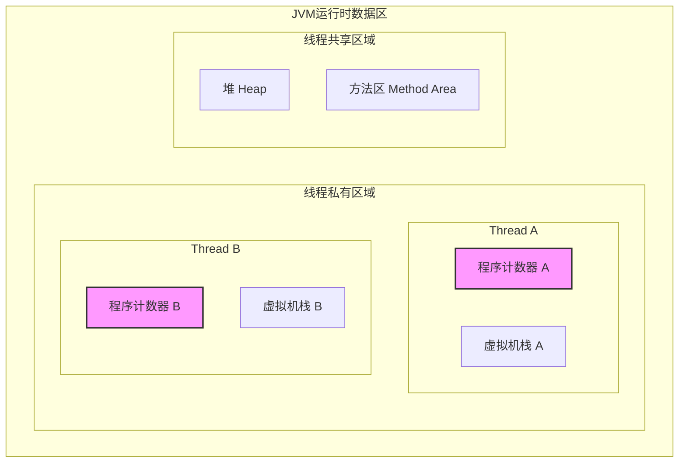
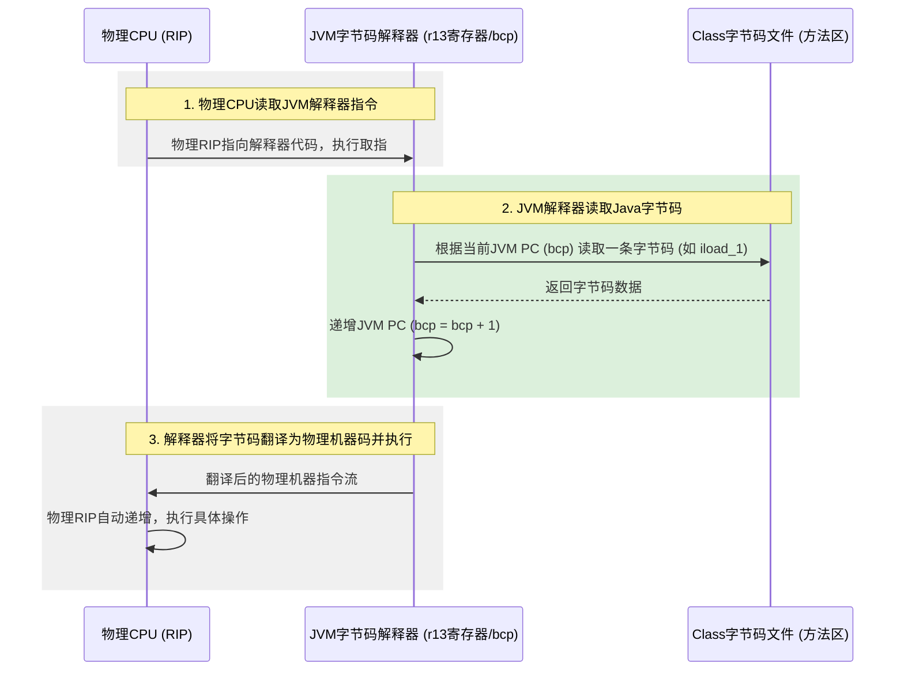
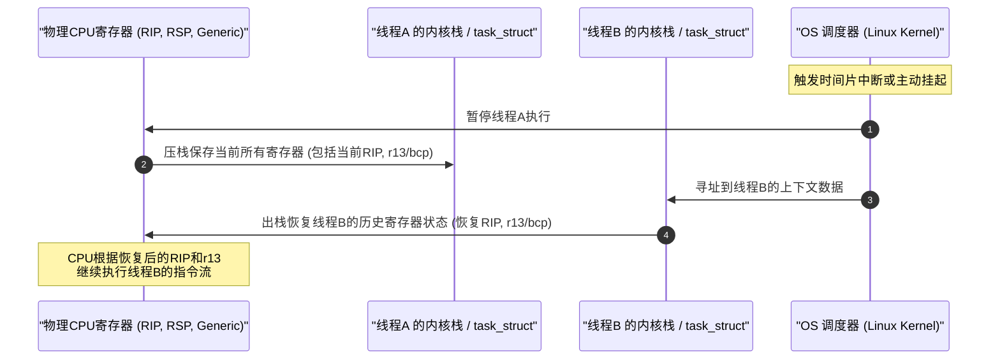
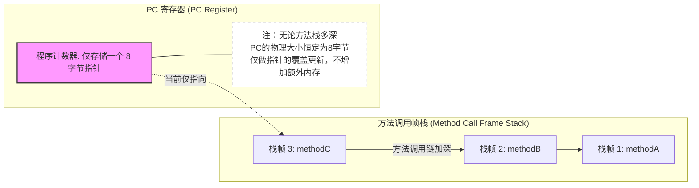

# 2.1.1.1 程序计数器

在 Java 虚拟机（JVM）的内存结构中，程序计数器（Program Counter Register，简称 PC 寄存器）扮演着极其特殊且关键的角色。虽然它是 JVM 运行时数据区（Runtime Data Areas）中内存占用最小的一个区域，但它却是整个虚拟机指令流控制的核心引擎。

本文将从 JVM 规范定义出发，由浅入深地拆解程序计数器的工作机制，并进一步下沉到操作系统内核与物理 CPU 硬件层面，深度剖析 JVM 程序计数器与物理 PC 寄存器的映射与差异、在多线程上下文切换中的关键作用、以及为什么它是 JVM 中唯一不会发生 `OutOfMemoryError`（OOM）的区域。最后，我们将结合 OpenJDK HotSpot 虚拟机的源码，一窥其在底层的微观实现细节。

---

## 1. JVM 程序计数器的定位与本质

### 1.1 规范层面的定义
根据《Java虚拟机规范》（Java Virtual Machine Specification）的规定，每一条 Java 虚拟机线程都拥有自己的程序计数器。在任意时刻，一条 JVM 线程只会执行一个方法，这个被执行的方法被称为该线程的**当前方法（Current Method）**：
*   **执行 Java 方法**：如果这个当前方法不是本地方法（Non-Native Method，即普通的 Java 代码），那么程序计数器中存储的便是**当前正在执行的虚拟机字节码指令的地址**。在具体实现中，这个地址通常表现为相对于该方法起始字节码的**偏移量（Bytecode Offset / Bytecode Pointer）**。
*   **执行 Native 方法**：如果当前线程正在执行的方法是本地方法（Native Method，如通过 JNI 调用了 C/C++ 动态链接库），那么此时程序计数器的值则被定义为 **Undefined（未定义）**。

### 1.2 核心技术特征
程序计数器具有以下三个最为显著的特征：
1.  **线程隔离性（线程私有）**：为了保证多线程环境下每个线程能够独立运行、互不干扰，程序计数器必须是线程独占的。每个线程在创建时都会被分配一个专属的程序计数器。
2.  **超低内存开销**：程序计数器只需要存储一个指向指令地址的指针。因此，在 32 位系统上它占用 4 字节，在 64 位系统上占用 8 字节。其内存占用量是一个极其微小的常数 $O(1)$。
3.  **不发生内存溢出（No OOM）**：它是《Java虚拟机规范》中唯一一个没有规定任何 `OutOfMemoryError` 情况的运行时内存区域。



---

## 2. 为什么需要程序计数器？

要理解为什么 JVM 必须设计程序计数器，我们需要从 Java 语言的并发运行机理与字节码的执行本质两个维度来分析。

### 2.1 应对多线程的时间片轮转与抢占式调度
现代操作系统普遍采用**抢占式线程调度（Preemptive Thread Scheduling）**。CPU 的执行时间被划分为极微小的时间片（Time Slice），由操作系统的调度器（如 Linux 的 CFS 调度器）分发给不同的线程。
对于 JVM 而言，Java 线程在底层映射为操作系统的内核线程。在多并发环境下，一个 CPU 核心在任何确定的时刻都只能执行某一个线程的指令。由于时间片非常短暂，线程会在 CPU 核心上频繁地被挂起（Yield/Block/Preempt）和唤醒（Resume）。

当线程 A 执行到一半被剥夺了 CPU 执行权，随后线程 B 上台执行；过了一段时间线程 A 重新获得时间片被唤醒时，**它如何知道自己刚才执行到了哪一步？它必须从哪里继续执行？**
如果没有一个机制来持久化保存线程 A 挂起瞬间的指令执行位置，线程在恢复后将彻底迷失方向。程序计数器正是为了解决这一问题而设计的。它是线程恢复执行时的“路标”，确保了多线程并发交替执行时的正确性与隔离性。

### 2.2 支撑复杂的控制流结构
Java 语言中的控制流语句非常丰富，包括顺序执行、条件分支（`if-else`）、循环（`while`, `for`'), 跳转（`break`, `continue`）、异常处理（`try-catch-finally`）以及方法调用与返回（`return`）等。
在编译成字节码后，这些复杂的控制流结构都被转换成了字节码指令的跳转逻辑（如 `goto`、`ifeq`、`if_icmpge` 等跳转指令，以及方法调用指令 `invokevirtual` 等）。
JVM 的字节码解释器需要通过不断修改程序计数器的值，来决定下一条该执行哪里的指令。没有程序计数器，字节码解释器就无法实现上述任何一种非顺序的控制流操作。

---

## 3. 深度对比：JVM 程序计数器 vs 物理 CPU 的 PC 寄存器

很多开发者容易将 JVM 的程序计数器与物理 CPU 的 PC 寄存器混为一谈。诚然，它们在设计思想上一脉相承，但在具体的实现层次、指令集类型以及底层的运行机制上，存在着本质的差异与深刻的映射关系。

### 3.1 物理 CPU 的 PC 寄存器原理
在真实的物理硬件中，程序计数器（Program Counter）是 CPU 内部不可或缺的一个专用寄存器。
*   **命名与架构**：
    *   在 Intel x86-32 架构中，它被称为 **EIP**（Extended Instruction Pointer）寄存器。
    *   在 x86-64 架构中，它被称为 **RIP**（64-bit Instruction Pointer）寄存器。
    *   在 ARM 架构中，它通常对应于通用寄存器中的 **R15** 寄存器。
*   **硬件工作周期**：物理 CPU 遵循经典的“冯·诺依曼结构”工作周期：**取指（Fetch）-> 译码（Decode）-> 执行（Execute）**。
    1.  **取指**：控制单元（Control Unit）根据 PC 寄存器（如 RIP）中存放的物理或虚拟内存地址，从内存（或 CPU 高速缓存 L1/L2/L3）中读取指令，并将其送入指令寄存器（Instruction Register）。
    2.  **自动递增**：在取指的同时，PC 寄存器的值会自动加上当前读取的指令所占用的字节数，指向下一条**即将执行的机器指令**的内存地址。
    3.  **跳转更新**：如果当前指令是一条跳转指令（如 x86 汇编中的 `JMP`、`JE`、`CALL` 等），在执行阶段会直接将跳转的目标地址写入 PC 寄存器，从而覆盖其自动递增后的值，实现程序的控制流转向。

> [!NOTE]
> **现代硬件的流水线偏差**
> 在现代采用多级流水线（Pipelining）和乱序执行（Out-of-Order Execution）架构的 CPU 中，PC 寄存器中存储的值并不总是严格等于当前正在执行的指令地址。例如，在 ARM 架构下，由于 3 级流水线（取指-译码-执行）的设计，当一条指令正在执行时，第二条指令正在译码，而第三条指令正在被读取。因此，物理 PC 寄存器（R15）的值实际上指向的是当前正在执行指令往后 2 个字（8字节）的位置。这种硬件偏差必须由编译器和处理器内部的硬件逻辑进行修正。

### 3.2 JVM 程序计数器的软件虚拟化
相比之下，JVM 是一个基于软件模拟出来的“堆栈式虚拟机”，它拥有自己独立的一套“虚拟硬件架构”，包括虚拟的指令集（字节码）、虚拟的执行引擎、以及虚拟的程序计数器。
*   **抽象原因**：JVM 必须实现“平台无关性”。不同物理架构的 CPU（如 x86, ARM, MIPS, RISC-V）拥有不同的指令集长度、不同的寄存器命名和不同的寻址方式。JVM 不能将 Java 代码的控制流直接绑定到某个具体的硬件 PC 寄存器上，必须在软件层面提供一层统一的抽象。
*   **存储内容的差异**：
    *   **硬件 PC** 指向的是**物理内存/虚拟内存**中的机器指令地址（由二进制的 0 和 1 组成，直接被 CPU 硬件解码）。
    *   **JVM PC** 指向的是**方法区（Method Area）内字节码数组（Bytecode Array）**中的偏移量，或者是正在执行的字节码指令在内存中的首地址。

### 3.3 物理 PC 与 JVM PC 的映射：解释执行与 JIT 编译
当 Java 程序在物理 CPU 上运行时，JVM 的程序计数器是如何与物理 CPU 的 PC 寄存器产生关联的呢？这取决于 JVM 当前的执行模式（Execution Mode）。

#### 3.3.1 解释执行模式下（Interpreter）
当 JVM 以解释器模式运行字节码时，字节码并不是直接在 CPU 上执行的。此时，真正运行在 CPU 上的“程序”是 JVM 自身的执行引擎（例如 C++ 编写的解释循环或汇编编写的模板代码）。
在这个阶段：
*   **物理 PC 寄存器（如 RIP）**指向的是 **JVM 解释器自身的机器码指令**，即物理 CPU 正在执行 JVM 的 C++ 或者是汇编代码。
*   **JVM 程序计数器**则是作为一个**软件变量**存在于 Java 线程的上下文中（在 HotSpot 的模板解释器中，通常直接占用一个物理通用寄存器如 `r13` 来专门存储字节码指针 `bcp`）。
此时，物理 PC 负责驱动 JVM 解释器自身的运转，而 JVM 程序计数器负责指示当前 Java 字节码指令的读取位置。



#### 3.3.2 即时编译模式下（JIT Compiler）
为了提升性能，JVM 包含即时编译器（如 HotSpot 的 C1 和 C2 编译器）。当某段 Java 代码被判定为“热点代码”时，JIT 编译器会直接将这部分字节码编译成与底层硬件强相关的**本地机器码**，并缓存在 Code Cache 中。
当执行这部分经过 JIT 编译的代码时：
*   Java 方法的控制流已经不再通过解释器来分发，而是直接由物理 CPU 执行 Code Cache 中的机器指令。
*   此时，**JVM 程序计数器在逻辑上与物理 CPU 的 PC 寄存器（RIP）合二为一**。物理 PC 寄存器的变化直接对应着 Java 方法机器指令的执行流，不再需要额外的软件指针 `bcp` 参与。

> [!NOTE]
> **JIT 模式下的解优化（Deoptimization）与安全点（Safepoint）映射**
> 既然在 JIT 编译模式下不再需要软件维护的 `bcp`，那么当线程在此期间需要暂停（如进行垃圾回收需要到达 Safepoint），或者因为某些假设失效需要回退到解释执行模式（解优化）时，JVM 又是如何找回当前的字节码程序计数器（PC）的值呢？
> JVM 在 JIT 编译热点代码时，会同步生成一份庞大的调试信息映射表，在 HotSpot 中被称为 **OopMap** 和 **ScopeDesc**。这些映射表记录了物理机器码的偏移量（物理 RIP 的相对位置）与原始字节码偏移量（Bytecode Index，即 BCI）之间的精确对应关系。当需要获取字节码 PC 时，JVM 只需要读取当前的物理 RIP，在映射表中检索，即可瞬间逆向计算出对应的字节码 PC 值。

### 3.4 物理 PC 与 JVM PC 对比总结

| 对比维度 | 物理 CPU 的 PC 寄存器 | JVM 程序计数器 |
| :--- | :--- | :--- |
| **存在形式** | CPU 内部的硬核物理寄存器（如 EIP/RIP/R15） | JVM 线程对象中抽象出来的指针变量（或绑定的物理寄存器） |
| **存储内容** | 物理/虚拟内存中即将执行的机器指令地址 | 方法区字节码数组中的字节码指令偏移量（Native 时为 Undefined） |
| **执行模式** | 硬件流水线执行，主导硬件级别的指令控制 | 解释模式下由解释器软件维护，JIT模式下映射为物理 PC |
| **可变性** | 随着硬件时钟周期自动递增，受硬件跳转指令影响 | 随着字节码执行长度递增，受字节码跳转指令（如 `goto`）控制 |
| **平台依赖性**| 强依赖具体硬件架构与指令集 | 平台无关，向上提供统一的抽象 |
| **异常情况** | 硬件地址越界会触发 CPU 硬件异常（Page Fault 等） | 《Java虚拟机规范》规定其不发生任何 OOM 异常 |

---

## 4. 多线程上下文切换中的程序计数器运作机制

Java 虚拟机支持多线程的并发执行，而底层操作系统对线程的调度是典型的时分复用。深入探讨多线程切换，需要将 JVM 的程序计数器与操作系统的上下文切换逻辑相结合。

### 4.1 操作系统级别的线程上下文切换
在 Linux 操作系统中，线程是调度的基本单位（在 Linux 内核中，线程和进程都由 `task_struct` 结构体表示）。
当发生线程切换时，操作系统内核主要通过执行 `switch_to` 宏或函数来完成。切换过程包含以下步骤：
1.  **保存旧线程的上下文**：
    物理 CPU 的所有寄存器状态（包括通用寄存器 `rax`、`rbx`、`rcx` 等，栈指针 `rsp`，指令指针 `rip`）代表了该线程当前的执行状态。操作系统会将这些寄存器的值压入当前线程的**内核栈（Kernel Stack）**中，或者写入 `task_struct` 的 `thread_struct` 结构体中进行持久化保存。
2.  **切换 CPU 栈顶指针**：
    将物理 CPU 的 `rsp` 寄存器修改为新线程的栈指针，指向新线程的内核栈。
3.  **恢复新线程的上下文**：
    从新线程的内核栈中弹出之前保存的寄存器值，恢复到物理 CPU 的各个寄存器中。
4.  **跳转执行**：
    将保存的旧 `rip` 值恢复至物理 CPU 的 `rip` 寄存器中，CPU 会根据新的 `rip` 自动获取下一条机器指令，线程上下文切换宣告完成。



### 4.2 JVM 解释器如何利用寄存器绑定实现高速切换
在 HotSpot 虚拟机的模板解释器（Template Interpreter）中，为了将字节码执行效率发挥到极限，JVM 的设计者并没有将字节码程序计数器（BCP）实现为一个普通的 C++ 堆内存变量，而是采用了**物理寄存器绑定（Register Pinning）**的技术。

在 x86-64 架构下，HotSpot 规定了以下物理寄存器与 JVM 虚拟寄存器的绑定映射：
*   **`r13` 寄存器**：硬性绑定为 **`bcp`（Bytecode Pointer，即 JVM 程序计数器）**。它时刻指向当前线程正在执行的字节码指令在内存中的实际地址。
*   **`r14` 寄存器**：硬性绑定为 `locals`（指向当前方法栈帧的本地变量表起始地址）。
*   **`r15` 寄存器**：硬性绑定为 `thread`（指向当前 `JavaThread` 对象的指针）。

当进行操作系统级别的线程切换时，由于 `r13` 物理寄存器本身就是 CPU 通用寄存器的一部分，操作系统内核在进行上下文切换时，**会自动将 `r13` 寄存器的值保存到线程 A 的内核栈中**。当线程 A 被重新调度唤醒时，操作系统又会**自动将线程 A 之前保存的值弹回到 `r13` 寄存器中**。

这种巧妙的设计，使得 JVM 根本不需要在软件层面去手动编写代码保存和恢复程序计数器的值！它完全搭了操作系统硬件上下文切换的“顺风车”，实现了极其高效的零开销切换。当线程恢复执行时，绑定的寄存器 `r13` 中已经静静地躺着上一次暂停时的字节码地址，解释器只需继续从 `r13` 指向的位置读取下一条字节码即可。

### 5. 为什么程序计数器绝不会发生 OutOfMemoryError？

在 JVM 运行时的五大内存区域中，堆（Heap）、方法区（Method Area）、虚拟机栈（JVM Stack）和本地方法栈（Native Method Stack）都有可能因为内存不足而抛出 `OutOfMemoryError`。唯独程序计数器是唯一的例外。这背后的原因可以从其内存分配的生命周期、数据结构的静态开销以及 JVM 指令执行的本质三个维度进行深度解析。

#### 5.1 内存分配的生命周期与静态开销
`OutOfMemoryError` 的触发条件是：**JVM 尝试向操作系统申请分配新的内存空间，但系统物理内存已经耗尽，且垃圾回收器经过垃圾回收后依然无法提供足够的内存**。

我们对比一下各个内存区域的动态性：
1.  **Java 堆（Heap）**：
    存放所有的对象实例。由于程序运行期间创建的对象数量和大小都是动态的、无法预知的，堆的内存使用量呈现出动态波动的状态。当不断产生大对象且 GC 无法回收时，堆空间耗尽，抛出 `OOM: Java heap space`。
2.  **方法区 / 元空间（Metaspace）**：
    存放类的元数据、常量池等。随着类加载器（ClassLoader）动态加载的类越来越多，这部分内存也会动态增长，若超出物理限制则会抛出 `OOM: Metaspace`。
3.  **虚拟机栈与本地方法栈**：
    每一个方法被调用时，JVM 都会在栈中压入一个栈帧（Stack Frame），栈帧中包含局部变量表、操作数栈等。随着方法调用链的加深，栈空间动态增长。如果栈空间不足以容纳新创建的栈帧，且无法再申请到物理内存，就会抛出 `StackOverflowError` 或 `OutOfMemoryError`。

相比之下，程序计数器是一个**完全静态的、开销恒定为 $O(1)$ 的内存区域**：
*   当一个线程被创建时，JVM 会为该线程分配一个固定大小的程序计数器。这个大小在线程创建的那一刻就确定了，对于 64 位 JVM 而言，它就是一个 8 字节的指针变量。
*   在线程的整个生命周期中，无论该线程执行了多少个类、创建了多少个对象、调用了多少层方法，程序计数器所占用的物理内存空间**永远都只有那固定的 8 字节**。
*   它不需要动态扩展，不需要根据运行期的计算结果来申请更多字节的空间。因此，从根本上排除了“因空间不够而向操作系统申请内存”的可能性。

#### 5.2 垃圾回收（GC）的免除
由于程序计数器的生命周期与线程完全一致，当线程销毁时，操作系统和 JVM 会直接回收该线程所占用的全部资源，包括那 8 字节的程序计数器空间。
在线程运行期间，程序计数器中存储的地址值是在不断被覆盖更新的，它不需要经历垃圾回收器的扫描、标记和清理过程。既然它不参与垃圾回收，也就不会因为“垃圾无法回收导致内存泄露”而产生 OOM。

#### 5.3 递归调用不增加程序计数器的开销
一个常见的误区是：“当方法发生递归调用，栈帧层层叠加，程序计数器难道不会跟着叠加吗？”
答案是：**不会**。
当发生方法递归调用时，增加的是虚拟机栈（JVM Stack）中的栈帧数量。对于程序计数器而言，它依然只有唯一的一个，它此时要做的事情非常简单：**将内部存储的地址值修改为被调用方法的首条字节码指令的地址**。
递归的深度哪怕达到 10000 层，程序计数器依然只占 8 字节，它只是把自己的值变更为当前的指令指针，而没有发生任何的内存空间扩容。导致程序崩溃的是虚拟机栈抛出的 `StackOverflowError`，而不是程序计数器。



---

## 6. OpenJDK HotSpot 源码微观视角下的 PC

为了让大家更加直观地理解程序计数器的底层实现，我们切入 OpenJDK HotSpot 虚拟机的源码，从 C++ 解释器与汇编模板解释器两个维度来看看 PC 是如何被模拟和操作的。

### 6.1 纯 C++ 字节码解释器（Bytecode Interpreter）中的 PC
在 HotSpot 源码中，有一套经典的纯 C++ 实现的字节码解释器，被称为 `BytecodeInterpreter`（位于 `src/hotspot/share/interpreter/bytecodeInterpreter.cpp`）。虽然在生产环境中为了追求极致性能，默认使用的是汇编语言编写的模板解释器，但 C++ 解释器的代码逻辑更加直观，能清晰展示 JVM PC 的运行本质。

在 `BytecodeInterpreter::run` 方法中，JVM 内部定义了一个名为 `pc` 的地址指针变量：

```cpp
// 简化后的 HotSpot 源码示意
void BytecodeInterpreter::run(interpreterState istate) {
    // 从线程状态中获取当前的字节码指针 (BCP)，这实际上就是我们的程序计数器
    address pc = istate->bcp();
    
    // 主循环：不断读取字节码并执行
    while (1) {
        // 1. 读取当前 PC 指向的字节码指令 (Opcode)
        u1 opcode = *pc;
        
        // 2. 根据不同的指令进行分发处理
        switch (opcode) {
            case Bytecodes::_iload_1: {
                // 执行 iload_1 逻辑...
                // 3. 递增程序计数器，指向下一条指令
                pc += 1; 
                break;
            }
            case Bytecodes::_iconst_1: {
                // 执行 iconst_1 逻辑...
                pc += 1;
                break;
            }
            case Bytecodes::_goto: {
                // goto 指令占用 3 个字节 (1 字节操作码 + 2 字节偏移量)
                // 获取 2 字节的跳转偏移量 (Offset)
                int16_t offset = Bytes::get_Java_u2(pc + 1);
                
                // 3. 修改程序计数器的值，直接跳转到目标地址
                pc += offset; 
                break;
            }
            case Bytecodes::_ireturn: {
                // 方法返回，恢复调用者的 PC
                address caller_pc = istate->sender()->bcp();
                pc = caller_pc;
                break;
            }
            // ... 其他海量字节码指令的分发
        }
        
        // 每次循环结束，将更新后的 PC 写回到线程的状态中，以防被挂起
        istate->set_bcp(pc);
    }
}
```

从上面的 C++ 源码中可以清晰地看出：
1.  **程序计数器就是一个普通指针变量 `address pc`**。
2.  遇到普通指令时，`pc` 根据指令的长度（字节数）进行递增（如 `pc += 1`）。
3.  遇到跳转指令（如 `_goto`）时，`pc` 通过累加一个带符号的偏移量（`offset`）来实现跨越式跳转。
4.  整个运行过程中，`pc` 的修改完全是在原址（In-Place）进行的，没有任何动态内存申请操作（如 `malloc` 或 `new`），这就从底层源码级别实证了为什么它永远不会发生 `OutOfMemoryError`。

### 6.2 模板解释器（Template Interpreter）中的汇编级 PC
在主流的 HotSpot 虚拟机中，为了消除 C++ `switch-case` 带来的巨大分发开销，采用了**模板解释器**。它在 JVM 启动时，会动态生成一段高度优化的汇编机器码，为每一个字节码指令都准备好了一段专用的机器码模板。

在 x86_64 平台上，HotSpot 汇编器（位于 `src/hotspot/cpu/x86/assembler_x86.cpp`）将物理寄存器 `r13` 绑定为 `bcp`（字节码指针，即 JVM PC）。

下面以 `goto` 字节码指令在模板解释器中的汇编代码生成为例：

```assembly
# 简化后的 HotSpot x86_64 汇编模板生成逻辑
# 当解释器遇到 goto 指令时，会执行类似如下的汇编机器指令：

# 1. 从 r13 (当前 BCP 指针) 往后偏移 1 字节处，读取 2 字节的跳转偏移量到通用寄存器 bx
movswl 1(%r13), %ebx

# 2. 将跳转偏移量累加到 r13 (BCP) 寄存器中，完成程序计数器的更新
addq   %rbx, %r13

# 3. 获取更新后的 r13 指向的下一条字节码指令的 Opcode，并继续分发执行
movzbl 0(%r13), %eax
jmp    *dispatch_table(,%rax,8)
```

这段硬核汇编展示了程序计数器在物理硬件上的真实跳动：
*   **读取偏移**：`movswl 1(%r13), %ebx`
*   **修改计数器**：`addq %rbx, %r13` —— 通过物理寄存器 `r13` 的加法指令直接完成了 JVM 程序计数器的更新。
*   这再次用无可辩驳的底层汇编事实证明：程序计数器在硬件层面就是寄存器操作，纯粹是 CPU 寄存器数值的变更，绝无任何内存分配行为，因此绝不可能 OOM。

---

## 7. 总结

JVM 的程序计数器（Program Counter Register）虽然微小，却是连接虚拟世界与物理世界的桥梁。

*   **从软件层面看**，它是线程私有的控制流路标，记录着当前字节码的执行地址，支撑着 Java 程序的多线程切换和分支跳转。
*   **从物理层面看**，在解释执行模式下，它通过物理寄存器绑定（如 x86-64 上的 `r13` 寄存器）与操作系统的上下文切换完美融合；在 JIT 编译模式下，它被虚拟化映射至 CPU 硬件的 PC 寄存器（RIP），借助 OopMap 和 ScopeDesc 实现状态回溯。
*   **从内存安全看**，它所占用的空间大小恒定为 4/8 字节（$O(1)$），且随着线程生命周期生死与共，不涉及动态内存分配和复杂的垃圾回收，因而成为了 JVM 运行时内存区域中唯一一个不会发生 `OutOfMemoryError` 的“绝对安全港湾”。

理解程序计数器的底层机理，不仅能够帮助我们更深刻地体会 JVM 优秀的架构设计，也为我们在面对多线程并发调度、线上性能调优以及底层技术栈的深挖时，打下了坚实的技术根基。
