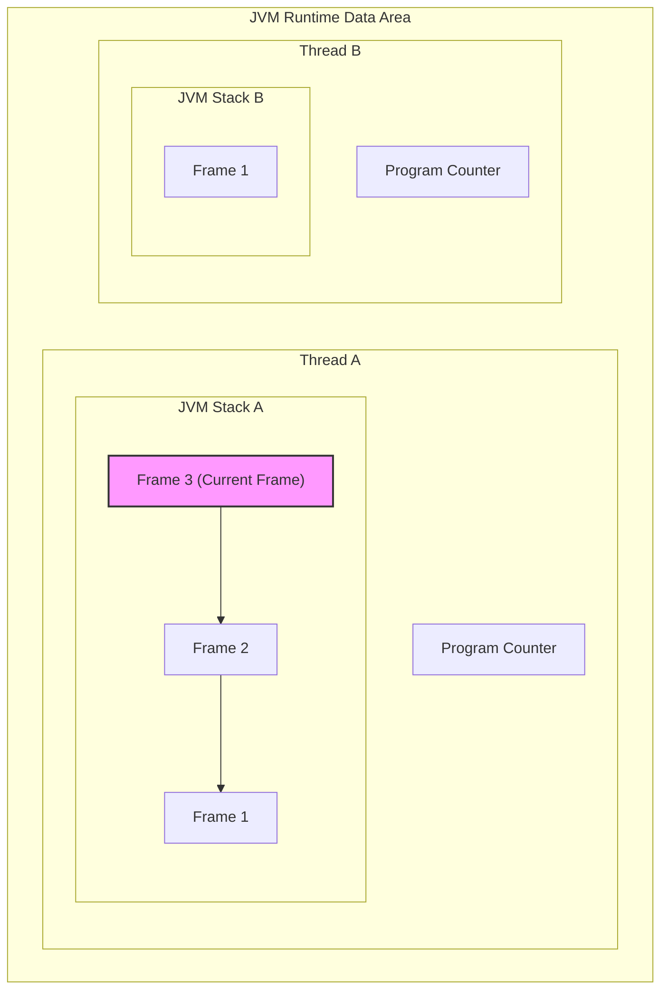
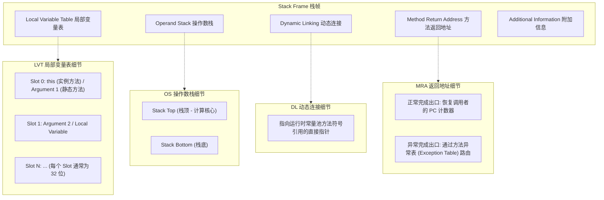
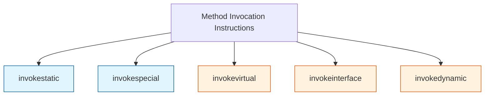

# 2.1.1.2 虚拟机栈

在 Java 虚拟机（JVM）的内存架构中，**虚拟机栈（Java Virtual Machine Stacks）**是支撑方法调用、局部变量存储以及字节码执行的核心内存区域。它是线程私有的，其生命周期与线程紧密绑定。对于任何一个编写高效 Java 代码、进行底层调优以及排查线上内存溢出或调用链错误的工程师而言，深入理解虚拟机栈的内部机制、栈帧（Stack Frame）的精细物理结构、字节码在执行引擎中的推演过程，以及即时编译器（JIT）针对栈空间的逃逸优化，是必不可少的基本功。

本文将提供系统深入的深度剖析，细化概念边界、机制细节、推导过程、典型问题和实践案例，并保持通用 JVM 技术视角，绝对禁止引入任何 Android 或 ART 相关的机能。

---

## 1. 虚拟机栈的物理定位与生命周期

### 1.1 线程私有与生命周期
Java 虚拟机栈是线程私有的，这意味着每一个 Java 线程在创建时，JVM 都会为其分配一个专属的虚拟机栈空间。
* **物理隔离**：不同的线程之间无法相互访问对方的虚拟机栈，这天然保证了线程内局部变量的安全性，不需要额外的同步锁机制来保护栈内数据。
* **生命周期一致性**：当一个 Java 线程启动时，对应的虚拟机栈被创建；当线程运行结束销毁时，该栈空间随之被操作系统或 JVM 内存管理器完全回收。

### 1.2 栈的物理表现：`-Xss` 参数与内存溢出
虚拟机栈的容量大小可以直接限制方法调用的深度。JVM 提供了 `-Xss` 参数（例如 `-Xss1m` 或 `-Xss256k`）用于控制单个线程栈的大小。

在 JVM 规范中，虚拟机栈可能产生以下两种异常：
1. **StackOverflowError（栈溢出错误）**：当线程请求的栈深度大于虚拟机所允许的深度时抛出。这通常发生在深度递归调用、无限循环调用或单次栈帧占用空间过大（如包含超大局部变量表）的场景。
2. **OutOfMemoryError（内存溢出错误）**：如果虚拟机栈容量允许动态扩展（有些虚拟机允许，但 HotSpot 虚拟机为了追求极致性能，其栈大小是固定的，不支持动态扩展），当栈尝试扩展但无法申请到足够内存时，或者在创建新线程时由于系统物理内存耗尽而无法为新线程分配虚拟机栈时，就会抛出 `OutOfMemoryError`。

> [!NOTE]
> 对于 HotSpot 虚拟机而言，虽然栈容量本身在运行时不可变（不触发动态扩展的 OOM），但在多线程高并发场景下，如果 `-Xss` 配置过大，会导致系统无法创建更多线程。其计算公式大致为：
> $$\text{最大线程数} \approx \frac{\text{系统可用物理内存} - \text{堆内存 (Xmx)} - \text{元空间 (MaxMetaspaceSize)} - \text{直接内存} - \text{JVM自身运行开销}}{\text{线程栈大小 (-Xss)}}$$
> 因此，在排查 `java.lang.OutOfMemoryError: unable to create new native thread` 时，适当**减小** `-Xss` 反而能够创建更多的线程。

### 1.3 逻辑结构与物理内存的映射
从逻辑上看，虚拟机栈是由一个又一个**栈帧（Stack Frame）**组成的后进先出（LIFO）容器。而在物理层面上，虚拟机栈对应的通常是 JVM 进程虚拟内存地址空间中一段连续的内存块。HotSpot 为了提高 CPU 缓存行（Cache Line）的命中率，栈帧的分配是紧凑连续的。

下图展示了线程、虚拟机栈与栈帧之间的宏观关系：



---

## 2. 栈帧（Stack Frame）的精细内部物理布局

每当一个方法被调用，JVM 就会在当前线程的虚拟机栈中同步压入一个栈帧；当方法执行完毕（无论是正常返回还是抛出未捕获异常），该栈帧就会被弹出并销毁。

栈帧是支持虚拟机进行方法调用和方法执行的数据结构，它不仅封装了方法的执行状态，还保存了方法运行所需的全部上下文信息。一个栈帧通常由以下五个核心部分组成：
1. **局部变量表（Local Variable Table）**
2. **操作数栈（Operand Stack）**
3. **动态连接（Dynamic Linking）**
4. **方法返回地址（Method Return Address）**
5. **附加信息（Additional Information）**

栈帧在编译期（即生成 Class 文件时）就已经确定了它所需要的局部变量表的最大容量（`max_locals`）和操作数栈的最大深度（`max_stack`），这两个数值会被显式写入 Class 文件的 `Code` 属性中。因此，一个栈帧在运行期需要分配多少内存，完全取决于编译器，而与运行期的实际数据无关。

栈帧的精细内部物理布局与细节关系如图所示：



---

## 3. 核心机制深挖之一：局部变量表（Local Variable Table）

局部变量表是一组变量值存储空间，用于存放方法参数和方法内部定义的局部变量。由于它是栈帧中占用空间最大的部分之一，其设计和利用率直接决定了栈帧的大小和内存开销。

### 3.1 变量槽（Slot）的物理设计
局部变量表的容量以**变量槽（Variable Slot，简称 Slot）**为最小单位。JVM 规范并没有明确规定一个 Slot 应该占用的具体物理内存大小（如 32 位或 64 位），而是采用了一种逻辑定义：一个 Slot 应该能存放一个 `boolean`, `byte`, `char`, `short`, `int`, `float`, `reference` 或 `returnAddress` 类型的数据。

* **32位与64位系统上的统一逻辑表现**：
  在 32 位 JVM 中，一个 Slot 物理上占用 4 个字节；在 64 位 JVM 中，如果开启了压缩指针（`-XX:+UseCompressedOops`），引用类型（`reference`）依然占用 4 个字节，而如果不开启，则占用 8 个字节。为了在不同硬件架构上提供一致的行为，JVM 规范屏蔽了物理差异，统一在逻辑上将一个普通 Slot 视为可以存放一个 32 位数据类型的容器。
* **64位数据类型（long, double）的相邻双 Slot 占用机制**：
  对于 64 位的 `long` 和 `double` 类型，JVM 采用高位对齐的方式为其分配**两个连续的 Slot**。
  
  $$\text{Slot } N \text{ 与 Slot } N+1 \text{ 共同存储一个 64 位值}$$
  
  虚拟机通过索引 $N$ 来定位这个双 Slot 的数据。在读取或写入该值时，虽然物理上分为高 32 位和低 32 位两次操作，但由于虚拟机栈是线程私有的，绝不会出现其他线程并发篡改中间状态的问题，因此在此处**无需考虑 64 位读写的原子性问题**。

### 3.2 Slot 的复用机制与垃圾回收（GC）的精细交互
为了尽可能节省栈帧空间，局部变量表中的 Slot 是高度复用的。方法体中定义的局部变量，其作用域并不一定会延伸到整个方法的末尾。当 PC 计数器的值已经超出了某个变量的作用域（例如超出了变量定义的代码块 `{}`），该变量占用的 Slot 就可以被后续定义的变量复用。

这种 Slot 的复用机制会引发一个经典的、与垃圾回收（GC）密切相关的“假引用残留”现象。

#### 经典案例分析
我们来看以下三个代码片段，它们展示了不同的 Slot 状态如何影响堆内存中大对象的回收。

##### 【场景一】变量超出作用域但无新变量复用 Slot
```java
public void testGc1() {
    {
        byte[] placeholder = new byte[64 * 1024 * 1024]; // 64MB
    }
    System.gc();
}
```
* **执行结果**：控制台输出显示 64MB 的堆内存**没有被回收**。
* **物理机制分析**：虽然 `placeholder` 变量在代码块结束后已经失效（超出了其词法作用域），但此时并没有其他局部变量被定义，导致原属于 `placeholder` 的 Slot（假设为 Slot 1）依然持有对堆中 64MB 数组对象的引用。当 JVM 执行垃圾回收时，虚拟机会扫描当前栈帧的局部变量表，Slot 1 被视为一个活跃的 GC Root，因此 64MB 数组被判定为可达，无法被回收。

##### 【场景二】新变量复用了 Slot
```java
public void testGc2() {
    {
        byte[] placeholder = new byte[64 * 1024 * 1024]; // 64MB
    }
    int a = 0;
    System.gc();
}
```
* **执行结果**：控制台输出显示 64MB 的堆内存**成功被回收**。
* **物理机制分析**：在代码块外部定义了变量 `a`。由于 `placeholder` 已经失效，JVM 编译器为了节省栈帧空间，将变量 `a` 分配到了原属于 `placeholder` 的 Slot（Slot 1）。这使得该 Slot 里的数值被覆盖为整型值 `0`。此时，栈帧的局部变量表中不再持有对堆中 64MB 字节数组的引用，GC Root断开，因此数组得以成功回收。

##### 【场景三】显式赋 `null` 断开引用
```java
public void testGc3() {
    byte[] placeholder = new byte[64 * 1024 * 1024]; // 64MB
    placeholder = null;
    System.gc();
}
```
* **执行结果**：64MB 堆内存**成功被回收**。
* **物理机制分析**：显式执行 `placeholder = null`，直接向局部变量表的 Slot 写入了空值，断开了与堆中大对象的关联。

#### 深度思考：在实际开发中是否应当提倡手动 `a = null`？
> [!TIP]
> 绝大多数情况下，**不提倡**手动将变量赋 `null`。
> 1. **JIT 即时编译器的活性分析（Liveness Analysis）**：上述回收失败的现象主要发生在**解释执行**阶段。当代码经过 JIT 编译器编译为本地机器码执行时，JIT 会进行极为精确的活性分析。一旦判定某变量在后续代码中不会再被读取，即使没有新变量复用其 Slot，JIT 编译后的代码在运行到垃圾回收点（Safepoint）时，也不会再把这个失效 Slot 视为活跃的 GC Root。
> 2. **编码规范性**：手动赋 `null` 会破坏代码的简洁性与可读性。只有在方法极其庞大、调用链极长且伴随大对象创建，同时该大对象的作用域很早结束且后面有耗时较长的阻塞操作（如 I/O 读写）的极端解释执行场景下，手动赋 `null` 才有微弱的作用。更好的重构方案是将大对象的操作拆分为独立的小方法，利用栈帧出栈天然断开引用。

### 3.3 静态方法与实例方法的 Slot 布局差异
局部变量表在分配 Slot 时，首要处理的是方法参数，其次才是方法内部的局部变量。对于静态方法（`static`）与实例方法（非 `static`），其 Slot 布局存在一个关键差异：

* **实例方法**：局部变量表的第 0 个 Slot 默认是隐式参数 `this`，用于指向当前调用该方法的对象实例。其余方法参数按声明顺序依次从 Slot 1 开始向后排布。
* **静态方法**：没有 `this` 指针，方法参数直接从 Slot 0 开始排布。

```java
// 实例方法
public void instanceMethod(int x, double y) { ... }
// 其局部变量表 Slot 布局：
// Slot 0: this (reference)
// Slot 1: x (int)
// Slot 2 & 3: y (double, 占用两个Slot)

// 静态方法
public static void staticMethod(int x, double y) { ... }
// 其局部变量表 Slot 布局：
// Slot 0: x (int)
// Slot 1 & 2: y (double)
```

这就是为什么在 Java 实例方法中可以直接使用 `this` 关键字，而静态方法中无法使用 `this` 的字节码层面根源。

---

## 4. 核心机制深挖之二：操作数栈（Operand Stack）

操作数栈是一个后进先出（LIFO）的数据结构。它是 JVM “栈式执行引擎” 的计算核心。与基于寄存器架构（如 x86 汇编、ARM 汇编）的执行引擎不同，JVM 的绝大多数字节码指令都是通过从操作数栈中弹出数据、计算后再压入操作数栈的方式工作的。

### 4.1 编译期深度的状态机分析与 `max_stack`
操作数栈的最大深度（`max_stack`）在编译期就被精确计算出来。编译器在将 Java 代码编译为字节码时，通过符号执行（Symbolic Execution）模拟每条指令执行时操作数栈的深度变化，并记录下整个方法执行路径中可能达到的最大深度。

例如，执行一条 `iadd` 指令，需要从栈顶弹出两个 `int` 数据，计算相加后再将结果压回栈。该操作在状态机中的深度变化为：

$$\text{Depth} \to \text{Depth} - 2 + 1 = \text{Depth} - 1$$

JVM 规范严格规定：在运行期间，操作数栈的任何位置的数据类型必须与当前的字节码指令相匹配。例如，不允许在栈顶明明是一个 `float` 数据的情况下，执行 `iadd`（要求两个 `int`）指令。

### 4.2 压栈与出栈的图解与字节码演示
我们通过一个简单的加法计算方法来透视局部变量表与操作数栈在字节码层面的交互过程。

```java
public int calculate(int a, int b) {
    int sum = a + b;
    return sum;
}
```

使用 `javap -c` 反编译后得到的字节码如下：

```bytecode
public int calculate(int, int);
  Code:
   0: iload_1       // 将局部变量表中 Slot 1 (a) 的值压入操作数栈
   1: iload_2       // 将局部变量表中 Slot 2 (b) 的值压入操作数栈
   2: iadd          // 弹出栈顶两个 int 值相加，将结果压入操作数栈
   3: istore_3      // 弹出栈顶的相加结果，存入局部变量表 Slot 3 (sum)
   4: iload_3       // 将局部变量表 Slot 3 (sum) 的值压入操作数栈
   5: ireturn       // 弹出栈顶的 sum 值并返回给调用者
```

下面使用表格来追踪上述 6 条指令执行时，局部变量表与操作数栈的实时物理变化：

| 字节码偏移量 | 对应指令 | 操作数栈状态（右侧为栈顶） | 局部变量表状态 | 详细物理操作描述 |
| :--- | :--- | :--- | :--- | :--- |
| 初始化 | - | `[]` | `[this, a, b, empty]` | 方法调用启动，栈帧建立，参数已填入 Slot |
| 0 | `iload_1` | `[a]` | `[this, a, b, empty]` | 读取 Slot 1 压入栈顶 |
| 1 | `iload_2` | `[a, b]` | `[this, a, b, empty]` | 读取 Slot 2 压入栈顶，此时栈深度为 2 |
| 2 | `iadd` | `[a+b]` | `[this, a, b, empty]` | 弹出 `a` 和 `b` 发送至 CPU ALU 计算，结果压回栈顶，深度变为 1 |
| 3 | `istore_3` | `[]` | `[this, a, b, a+b]` | 弹出栈顶元素，写入局部变量表 Slot 3 (`sum`) |
| 4 | `iload_3` | `[a+b]` | `[this, a, b, a+b]` | 读取 Slot 3 (`sum`) 压入栈顶，准备返回 |
| 5 | `ireturn` | `[]` | `[this, a, b, a+b]` | 弹出栈顶元素并将其作为返回值传给调用者，当前栈帧销毁 |

### 4.3 栈顶缓存技术（Top-of-Stack Caching, ToSC）
虽然基于栈的架构使得 JVM 的指令集小巧、紧凑，并且高度平台无关，但其性能软肋非常明显：**频繁的内存访问**。相较于寄存器架构，栈架构在完成同样的计算时需要多出数倍的指令（存栈、取栈操作），这些操作在底层的虚拟机实现中表现为大量的内存读写，极易成为 CPU 的性能瓶颈。

为了解决这一物理限制，现代高性能 JVM（如 HotSpot）的执行引擎引入了**栈顶缓存技术（ToSC）**。
* **物理机制**：虚拟机在运行期间，会将操作数栈最顶层的一个或两个元素直接缓存在 CPU 的物理寄存器（如 x86 的 `rax`、`rdx`）中，而不是直接写入物理内存。
* **效果**：绝大多数的运算指令可以直接在寄存器之间进行，只有在发生方法调用、寄存器溢出或上下文切换时才将数据刷回内存中的真实栈空间。这极大弥补了栈式架构在硬件层面上的执行劣势。

---

## 5. 核心机制深挖之三：动态连接（Dynamic Linking）

每一个栈帧的内部都持有一个**指向运行时常量池（Runtime Constant Pool）中该栈帧所属方法的引用**。这个引用的存在是为了支持方法调用过程中的**动态连接（Dynamic Linking）**。

### 5.1 符号引用与直接引用
在 Java 的 Class 文件中，所有的方法调用、字段访问都以符号的形式记录在常量池中，这被称为**符号引用（Symbolic Reference）**。符号引用由类名、方法名、参数描述符和返回值类型组成，它是一个纯粹的字面量，并不包含任何内存地址信息。
* 例如：`com/example/Service.execute:()V` 

在方法实际运行前，或者类加载时，或者每次运行时，JVM 必须将这些符号引用转化为指向实际内存入口的指针，即**直接引用（Direct Reference）**。

### 5.2 解析（Resolution）与动态连接（Dynamic Linking）的异同
符号引用转化为直接引用发生在两个不同的时机，对应着两种截然不同的绑定机制：

1. **静态解析（Early Binding - 早期绑定）**：
   如果方法在编译期可知，且运行期保持不变。这类方法的符号引用会在类加载阶段或者第一次使用时就被完全转化为直接引用。
   * **适用场景**：静态方法（`static`）、私有方法（`private`）、实例构造器（`<init>`）、父类方法（通过 `super` 调用）。这些方法无法被子类重写（Override），因此其调用目标是唯一的，这被称为“非虚方法”。
2. **动态连接（Late Binding - 晚期绑定）**：
   如果方法在编译期无法确定具体的调用入口，必须在每一次运行期间根据调用对象的实际类型来实时转化符号引用为直接引用。
   * **适用场景**：多态机制下的虚方法分派（如重写的方法调用）。

### 5.3 虚拟机方法调用指令的物理运作
JVM 设计了五条专门用于方法调用的字节码指令，它们在底层的动态连接处理方式各有侧重：



* **`invokestatic`**：调用静态方法。在类加载的解析阶段即完成符号引用的转化，属于早期绑定。
* **`invokespecial`**：调用实例构造器方法、私有方法和超类方法。由于这些方法不可重写，同样在类加载解析阶段转为直接引用，属于早期绑定。
* **`invokevirtual`**：调用所有虚方法（如公共的、受保护的普通实例方法）。这是多态的核心。其物理运行逻辑如下：
  1. 从操作数栈顶找到当前调用对象的实际类型（即接收者对象，Receiver）。
  2. 在接收者对象的类型元数据中查找与符号引用一致的方法。
  3. 如果在该类中找到，则进行权限校验，通过则直接返回该方法的直接引用；如果未找到，则按照继承链由下至上依次对父类进行搜索和验证。
* **`invokeinterface`**：调用接口方法。与 `invokevirtual` 类似，但由于一个类可以实现多个接口，因此不能像 `invokevirtual` 那样直接通过固定的虚方法表（vtable）偏移量定位，而是需要通过接口方法表（itable）在运行时动态搜索，执行性能略慢于 `invokevirtual`。
* **`invokedynamic`**：动态方法调用（Java 7 引入，Java 8 广泛用于 Lambda 表达式）。它将方法分派的决定权从虚拟机转移到了用户自定义的代码中。它在运行时首次执行时，会调用一个被称为“引导方法（Bootstrap Method）”的逻辑，动态生成并绑定一个 `CallSite` 对象，后续的调用均通过该对象直接路由，实现了极高的运行期灵活性。

#### 虚方法表（Virtual Method Table, vtable）的底层提速
为了避免 `invokevirtual` 在每次调用时都沿着继承链从下往上进行昂贵的线性搜索，JVM 在类加载的连接阶段，会为每个类在方法区构建一个**虚方法表（vtable）**（对于接口调用，则构建接口方法表 itable）。

* **原理**：虚方法表中存放着各个虚方法的实际入口地址。如果子类没有重写父类的方法，那么子类 vtable 中该方法的入口地址与父类同一方法的入口地址是完全相同的，甚至它们的**索引偏移量（Offset）也是完全一致的**。
* **执行**：当执行 `invokevirtual` 时，JVM 只需要根据编译期计算好的 Offset，直接去接收者对象的 vtable 中提取方法入口地址即可，时间复杂度降为 $O(1)$。

---

## 6. 核心机制深挖之四：方法返回地址（Method Return Address）

当一个方法开始执行后，只有两种方式可以退出这个方法：**正常退出**与**异常退出**。不论何种退出方式，在退出后，虚拟机都必须恢复到当前方法被调用前的位置，并保证调用者能够继续执行。

### 6.1 正常退出与异常退出的物理区别

#### 正常完成出口（Normal Method Completion）
* **物理机制**：执行引擎在执行过程中遇到了任意一个方法返回的字节码指令（如 `ireturn`、`lreturn`、`freturn`、`dreturn`、`areturn` 或 `return`）。
* **地址恢复**：此时，调用者的**程序计数器（PC 计数器）的值**将作为返回地址。当前栈帧的返回地址区域会保存该值。在栈帧出栈时，JVM 会把这个 PC 值重新写回 CPU 的 PC 寄存器，以便调用者继续执行下一条指令。
* **返回值处理**：正常退出时，当前栈帧操作数栈顶的返回值会被弹出，并直接压入调用者栈帧的操作数栈中。

#### 异常完成出口（Abrupt Method Completion）
* **物理机制**：方法在执行过程中遇到了异常（包括 JVM 自动抛出的内部异常或字节码 `athrow` 指令抛出的异常），且这个异常在当前方法体内**没有被妥善处理**（即在方法的异常表 `Exception Table` 中没有匹配到对应的 catch 处理器）。
* **地址恢复**：此时，方法不会给它的调用者产生任何返回值。返回地址**无法通过 PC 计数器简单恢复**，而是需要通过 JVM 的异常分派机制来决定。栈帧弹出后，异常会被重新抛给调用者，调用者方法中的异常处理器表将决定后续的跳转地址。

### 6.2 栈帧退出的物理恢复步骤
当一个方法执行完毕，栈帧销毁并返回调用者时，JVM 会在物理上执行以下四个级联操作：
1. **恢复调用者的环境**：恢复调用者的局部变量表和操作数栈指针。
2. **传递返回值**：将当前方法的返回值（如果有）压入调用者操作数栈的栈顶。
3. **恢复 PC 计数器**：将当前栈帧中保存的返回地址（PC 值）重新载入线程的 PC 寄存器中，指向调用指令的下一条指令。
4. **调整栈顶指针（SP）**：向低地址方向移动栈指针，彻底回收当前栈帧在物理栈空间中所占用的内存。

### 6.3 字节码异常表（Exception Table）对异常返回的控制
在编译后的 Class 文件中，每个方法如果包含 `try-catch` 或 `try-finally` 块，编译器都会为其生成一个**异常表（Exception Table）**。

下面是一个包含异常处理的方法的异常表示意：

```bytecode
Exception table:
   from    to  target type
      0     4     7   Class java/io/IOException
```

* **含义**：如果 PC 计数器在 $[0, 4)$ 字节码偏移量范围内抛出了类型为 `IOException`（或其子类）的异常，执行引擎将直接把 PC 计数器重置到偏移量 `7`（即 target 处）继续执行（也就是 catch 块的入口）。
* **异常返回**：如果抛出的异常类型无法在当前方法的异常表中匹配到，当前栈帧将被强制弹出，异常会向上“传播”，直至在调用者栈中找到匹配的异常处理器；若传播到虚拟机栈的最底层（`main` 方法或线程启动入口）仍未匹配成功，则线程将被异常终止。

---

## 7. 栈帧的辅助支持与优化

除了上述四大核心组件外，栈帧中还包含了一些辅助运行的物理结构和特定虚拟机的黑科技优化。

### 7.1 调试信息支持
在生成 Class 文件时，编译器会根据用户的编译参数（如 `javac -g`）将调试信息写入方法属性中，这些信息在运行时会被载入栈帧的辅助结构中：
* **`LineNumberTable`（行号表）**：记录字节码偏移量与 Java 源码行号的映射关系。当程序抛出异常时，堆栈轨迹（Stack Trace）中显示的行号就是通过它读取的。
* **`LocalVariableTypeTable`（局部变量类型表）**：在泛型引入后，用于辅助调试器识别局部变量的泛型签名。

### 7.2 栈帧重叠优化（Frame Overlapping）
在 JVM 规范的逻辑描述中，两个栈帧作为独立的内存块是完全隔离的。然而，在以 HotSpot 为代表的优秀虚拟机实现中，为了追求极致的性能，引入了**栈帧重叠**优化。

* **物理原理**：在进行方法调用时，调用者的部分**操作数栈**会与被调用者的**局部变量表**产生一部分重叠。
* **优势**：
  在调用方法时，调用者需要把参数压入自己的操作数栈，而被调用者需要从自己的局部变量表中读取这些参数。HotSpot 通过让这两个区域在物理内存上发生重叠，使得参数传递可以直接在重叠区域进行，被调用者无需进行昂贵的数据复制操作（即无物理内存拷贝），大大提高了方法调用的效率。

```mermaid
style Overlap fill:#ffecb3,stroke:#ffb300,stroke-width:2px;
graph TD
    subgraph Caller Frame
        C_LVT["Local Variable Table"]
        C_OS["Operand Stack"]
    end
    subgraph Overlapping Area
        Overlap["Overlapping memory (Caller OS / Callee LVT)"]
    end
    subgraph Callee Frame
        Callee_OS["Operand Stack"]
        Callee_LVT["Local Variable Table"]
    end
    
    C_OS --> Overlap
    Overlap --> Callee_LVT
    class Overlap Overlap;
```

---

## 8. JIT 编译器的黑科技：逃逸分析（Escape Analysis）与栈上优化

在传统的 Java 认知中，“对象只能分配在堆上，引用分配在栈上”。然而，随着 JIT（Just-In-Time）编译器的日益强大，这个定理已经被打破。基于**逃逸分析（Escape Analysis）**的优化技术，使得部分对象能够绕过堆，直接在栈上分配或被拆解。

### 8.1 逃逸分析的定义与判定算法
逃逸分析是 JIT 编译器在**即时编译**阶段（将字节码编译为本地机器码）进行的一种高难度数据流分析。其核心目的是：**分析一个在方法内部创建的对象，其生命周期是否会超出当前方法或当前线程的边界。**

根据对象的作用域，逃逸状态可分为以下三种：

1. **全局逃逸（Global Escape）**：对象逃逸出了当前线程。例如，对象被赋值给类变量（静态变量）、实例变量，或者作为返回值返回给其他线程可见的对象。
2. **参数逃逸（Arg Escape）**：对象作为参数传递给了其他方法，但该方法没有将其继续泄露给其他线程，其生命周期在当前线程内。
3. **无逃逸（No Escape）**：对象仅在当前方法内部被创建和使用，一旦当前方法退出，该对象就再也无法被访问到。

### 8.2 栈上分配（Stack Allocation）的理想与现实
* **理论**：如果一个对象被判定为**无逃逸**，那么将其分配在 Java 堆上是极其浪费的。堆内存是所有线程共享的，垃圾回收器（GC）为了清理堆中的无用对象需要付出巨大的 CPU 停顿代价。如果直接将无逃逸对象分配在虚拟机栈上，那么当方法结束、栈帧出栈时，该对象所占用的内存就会随之自然销毁，零 GC 开销。
* **HotSpot 的现实实现**：由于 HotSpot 虚拟机的对象头、锁状态、垃圾回收器标记等底层机制高度耦合于堆内存模型，如果在栈上物理地分配一个完整的、连续的对象，需要对 JVM 的执行引擎做出极其复杂的改动。因此，**HotSpot 并没有真正实现物理上的栈上对象分配，而是通过一种更轻量、更彻底的替代方案来实现相同的优化效果——标量替换。**

### 8.3 标量替换（Scalar Replacement）的物理拆解
* **标量（Scalar）**：指无法再被进一步拆分的数据，例如 Java 中的基本数据类型（`int`、`long`、`double`、`reference` 等）。
* **聚合量（Aggregate）**：指可以被拆分为更小单元的数据，Java 中的类对象就是最典型的聚合量。

**标量替换的物理机制**：如果逃逸分析证实一个对象**无逃逸**，并且这个对象是可以被拆散的，那么 JIT 编译器在编译该方法时，**根本不会在内存中创建这个对象**。取而代之的是，它会将这个对象的成员变量拆解出来，当作一个个独立的局部变量直接分配在当前栈帧的局部变量表（Slot）中。

#### 代码级别演进示例

##### 原始 Java 代码：
```java
public class EscapeTest {
    static class Point {
        int x;
        int y;
        public Point(int x, int y) {
            this.x = x;
            this.y = y;
        }
    }

    public int testScalarReplacement() {
        Point p = new Point(1, 2); // 判定为无逃逸
        return p.x + p.y;
    }
}
```

##### 第一步：JIT 进行方法内联（Method Inlining）
为了更准确地进行逃逸分析，JIT 往往先将构造函数内联到调用处：
```java
public int testScalarReplacement() {
    Point p = new Point(); // 分配内存
    p.x = 1;              // 字段赋值
    p.y = 2;              // 字段赋值
    return p.x + p.y;
}
```

##### 第二步：JIT 进行标量替换（Scalar Replacement）
JIT 发现 `p` 完全没有逃逸，于是将 `p` 拆解为两个独立的整型标量 `px` 和 `py`，并直接抹去 `Point` 对象的创建逻辑：
```java
public int testScalarReplacement() {
    int px = 1; // 直接作为局部变量存入栈帧 Slot
    int py = 2; // 直接作为局部变量存入栈帧 Slot
    return px + py;
}
```
* **效果**：没有发生任何堆内存分配，没有产生任何对象头开销，计算完全在 CPU 寄存器和栈帧局部变量表中完成。

### 8.4 同步消除 / 锁消除（Synchronization Elimination）
如果一个对象被逃逸分析判定为**无逃逸**（甚至无线程逃逸），这意味着这个对象只可能被当前线程访问，其他线程无法通过任何途径获取其引用。
既然该对象是线程私有的，那么针对该对象的所有同步锁（`synchronized`）操作都是毫无意义的。JIT 编译器在编译时会直接把这些同步代码块剔除，这被称为**锁消除**。

```java
public void testLockElimination() {
    Object lock = new Object(); // 判定为无逃逸
    synchronized(lock) {
        // 执行业务逻辑
        System.out.println("No lock contention");
    }
}
```
经过 JIT 优化后，上述代码中的 `synchronized(lock)` 锁获取与释放逻辑会被直接抹去，消除了在高并发下申请偏向锁或轻量级锁所带来的 CAS 硬件指令开销。

### 8.5 逃逸分析相关参数
在现代 HotSpot 虚拟机中，逃逸分析及其相关的栈优化默认是全开的。在调优或诊断时，可以使用以下 JVM 参数进行控制：

* `-XX:+DoEscapeAnalysis`：启用逃逸分析（默认开启）。
* `-XX:+EliminateAllocations`：启用标量替换优化（默认开启）。
* `-XX:+EliminateLocks`：启用同步消除/锁消除（默认开启）。
* `-XX:+PrintEscapeAnalysis`：打印逃逸分析的筛选细节（仅在 Debug/FastDebug 版 JVM 中有效，生产环境可通过 `-XX:+UnlockDiagnosticVMOptions` 与相关诊断参数配合使用）。

---

## 9. 深度案例剖析：从字节码与虚拟机栈运行轨迹看程序执行

为了让读者真正融会贯通，我们将编写一段包含数学计算、多态虚方法分派以及异常捕获的 Java 代码，通过反编译其字节码，彻底还原执行引擎在虚拟机栈内的完整运行轨迹。

### 9.1 实战案例代码
```java
public class StackDemo {
    
    interface Calculator {
        int calculate(int val);
    }
    
    static class DoubleCalculator implements Calculator {
        @Override
        public int calculate(int val) {
            return val * 2;
        }
    }
    
    public int execute(Calculator calc, int input) {
        int result = 0;
        try {
            int factor = 10;
            int step = calc.calculate(input); // 虚方法调用
            result = factor + step;
        } catch (NullPointerException e) {
            result = -1;
        }
        return result;
    }
}
```

### 9.2 `execute` 方法的 `javap` 深度解剖
我们使用 `javap -c -v StackDemo.class` 提取出 `execute` 方法的字节码及其附加结构：

```bytecode
public int execute(StackDemo$Calculator, int);
  descriptor: (LStackDemo$Calculator;I)I
  flags: ACC_PUBLIC
  Code:
    stack=2, locals=5, args_size=3
       0: iconst_0          // 将常量 0 压入操作数栈
       1: istore_3          // 将栈顶的 0 存入局部变量表 Slot 3 (result)
       2: bipush        10  // 将单字节常量 10 压入操作数栈
       4: istore        4  // 将栈顶的 10 存入局部变量表 Slot 4 (factor)
       6: aload_1           // 将局部变量表 Slot 1 (calc 引用) 压入操作数栈
       7: iload_2           // 将局部变量表 Slot 2 (input) 压入操作数栈
       8: invokeinterface #2,  2  // 调用接口方法 Calculator.calculate:(I)I
      13: istore        5  // 将方法返回的结果压入局部变量表 Slot 5 (step)
      15: iload         4  // 将 factor (Slot 4) 压栈
      17: iload         5  // 将 step (Slot 5) 压栈
      19: iadd              // 相加
      20: istore_3          // 将相加结果写入 result (Slot 3)
      21: goto          28  // 跳过 catch 块直接前往返回逻辑
      24: astore        4  // 【异常处理器入口】将异常对象引用存入 Slot 4 (覆盖 factor)
      26: iconst_m1         // 将 -1 压入操作数栈
      27: istore_3          // 将 -1 存入 result (Slot 3)
      28: iload_3           // 将 result (Slot 3) 压栈
      29: ireturn           // 返回栈顶的 result
    Exception table:
       from    to  target type
           2    21    24   Class java/lang/NullPointerException
```

### 9.3 接口虚方法分派与动态连接推演
在字节码偏移量 `8` 处，执行了 `invokeinterface #2,  2` 指令。
1. **寻找运行时常量池中的符号引用**：`#2` 指向常量池中的 `InterfaceMethodref` 符号：`StackDemo$Calculator.calculate:(I)I`。
2. **定位接收者（Receiver）**：JVM 从操作数栈中取出栈顶的下第二个元素（即偏移量 `6` 压入的 `calc` 引用）。
3. **动态连接与虚分派机制**：
   * 检查 `calc` 是否为 `null`。若是，则立即抛出 `NullPointerException`（此时直接中断执行，跳转到字节码偏移量 `24` 的异常处理器）。
   * 若不为 `null`，JVM 提取 `calc` 指向的堆中真实对象的 Class 元数据（假设为 `DoubleCalculator`）。
   * 检索 `DoubleCalculator` 的接口方法表（itable），根据方法签名和偏移量找到实际的实现方法 `DoubleCalculator.calculate:(I)I` 的直接引用。
   * **新建栈帧**：JVM 为 `DoubleCalculator.calculate` 方法分配一个新的栈帧，将调用者栈帧中的 `calc` 和 `input` 作为参数填入新栈帧的局部变量表（Slot 0 和 Slot 1），并将 PC 寄存器指向该方法的首条指令，开始执行。
   * **返回**：子方法执行完毕后，执行 `ireturn`，子栈帧出栈，其返回值被压入 `execute` 方法的操作数栈顶，控制权交回，从偏移量 `13` 继续往下执行。

---

## 10. 虚拟机栈相关故障排查与实战

在生产环境中，虚拟机栈最常见的两类问题是 `StackOverflowError` 和 `OutOfMemoryError`。下面我们通过代码 and 工具进行诊断演练。

### 10.1 编写触发 `StackOverflowError` 的程序并计算最大栈深度
我们可以通过一段没有终止条件的递归程序来快速耗尽栈空间：

```java
public class StackOverflowDemo {
    private int depth = 0;

    public void leak() {
        depth++;
        leak();
    }

    public static void main(String[] args) {
        StackOverflowDemo demo = new StackOverflowDemo();
        try {
            demo.leak();
        } catch (StackOverflowError e) {
            System.err.println("StackOverflow reached! Maximum depth: " + demo.depth);
        }
    }
}
```

* **运行分析**：
  * 在默认参数下运行，控制台输出的最大深度通常在数千到上万次。
  * 限制参数运行：使用 `java -Xss160k StackOverflowDemo` 运行，可以发现最大递归深度显著降低。这直接证明了单个栈帧的内存消耗在累积后迅速触及了 `-Xss` 的上限。

### 10.2 栈帧内数据量对栈深度的物理影响
我们将上述代码进行改造，在方法内加入大量的局部变量：

```java
public class StackOverflowVariablesDemo {
    private int depth = 0;

    public void leak() {
        // 定义大量局部变量，强行增大单个栈帧的局部变量表
        long a1 = 1L; long a2 = 2L; long a3 = 3L; long a4 = 4L; long a5 = 5L;
        long a6 = 6L; long a7 = 7L; long a8 = 8L; long a9 = 9L; long a10 = 10L;
        depth++;
        leak();
        // 保持局部变量活性，防止被 JIT 优化抹去
        System.out.print("" + a1 + a2 + a3 + a4 + a5 + a6 + a7 + a8 + a9 + a10);
    }

    public static void main(String[] args) {
        StackOverflowVariablesDemo demo = new StackOverflowVariablesDemo();
        try {
            demo.leak();
        } catch (StackOverflowError e) {
            System.err.println("Maximum depth with variables: " + demo.depth);
        }
    }
}
```
* **结论**：运行上述代码会发现，其最大递归深度会急剧缩减。因为单个栈帧中局部变量表的增大，导致每次方法调用分配的栈帧内存物理尺寸变大。在相同的 `-Xss` 限制下，虚拟机栈能够容纳的栈帧数量自然大幅减少。

### 10.3 生产环境 `OutOfMemoryError` 根源排查
当线上服务器抛出 `java.lang.OutOfMemoryError: unable to create new native thread` 时，通常表明 JVM 已经无法向操作系统申请新的线程物理栈空间。

#### 排查步骤：
1. **收集线程快照（Thread Dump）**：使用 `jstack <pid> > dump.txt` 或 `jcmd <pid> Thread.print` 导出当前的线程状态。
2. **分析线程数量**：检查 dump 文件中各状态的线程数量是否异常（如存在数千个处于 `WAITING` 状态且不断增长的线程池线程）。
3. **查看系统限制**：在 Linux 系统中执行 `ulimit -u` 查看最大用户进程/线程数限制，检查是否触及了操作系统层面的配额。
4. **内存分配诊断**：如果物理内存确实吃紧，查看堆大小是否设置过大。若堆占用过多物理内存，留给本地方法栈和虚拟机栈的内存便会严重缩水。此时，可以考虑使用 `-Xss` 调小单线程栈容量，或者减小堆的最大容量（`-Xmx`），以释放物理内存供给线程创建。

---

## 11. 全景知识总结

虚拟机栈作为 Java 程序运行的动力引擎，通过严密的后进先出栈帧结构，完美地支撑了方法调用、参数传递与运算逻辑。我们通过一张全景脑图来复盘并沉淀这些核心机制：

```mermaid
graph LR
    Root("(虚拟机栈")) --> Base[基础属性]
    Root --> Frame[栈帧结构]
    Root --> JIT["JIT 逃逸分析优化"]
    Root --> Exc[典型异常]

    Base --> ThreadPrivate["线程私有"]
    Base --> Lifecycle["生命周期与线程绑定"]
    Base --> Xss["-Xss 参数控制容量"]

    Frame --> LVT["局部变量表 (LVT)"]
    Frame --> OS["操作数栈 (OS)"]
    Frame --> DL["动态连接 (DL)"]
    Frame --> MRA["方法返回地址 (MRA)"]

    LVT --> Slot["变量槽 Slot (32/64位逻辑统一)"]
    LVT --> SlotReuse["Slot 复用与 GC 交互"]
    LVT --> ThisSlot["Slot 0 存放 this 指针"]

    OS --> LifoModel["LIFO 栈式计算模型"]
    OS --> MaxStack["编译期 max_stack 决定深度"]
    OS --> ToSC["栈顶缓存技术 (ToSC)"]

    DL --> ConstRef["指向运行时常量池的方法引用"]
    DL --> EarlyBinding["早期绑定 (静态解析)"]
    DL --> LateBinding["晚期绑定 (动态连接)"]
    DL --> Vtable["虚方法表 (vtable) 机制"]

    MRA --> NormalReturn["正常退出 (恢复 PC 计数器)"]
    MRA --> AbruptReturn["异常退出 (通过异常表路由)"]

    JIT --> State["逃逸状态 (无逃逸/参数逃逸/全局逃逸)"]
    JIT --> Optimize["优化手段 (标量替换/同步消除)"]

    Exc --> SOE["StackOverflowError (栈越界)"]
    Exc --> OOM["OutOfMemoryError (创建线程失败)"]
```

通过本文的系统性拆解，我们可以清晰地看到，虚拟机栈不仅仅是存放局部变量的简单内存区域，其内部复杂的 Slot 复用机制、操作数栈与 JIT 栈顶缓存优化、动态连接的虚分派策略，以及基于逃逸分析的标量替换和锁消除，都在为 Java 代码的高效、安全运行默默保驾护航。深度理解这些底层机理，能够帮助我们在面对复杂线上系统问题时，快速穿透抽象迷雾，直击本质。
