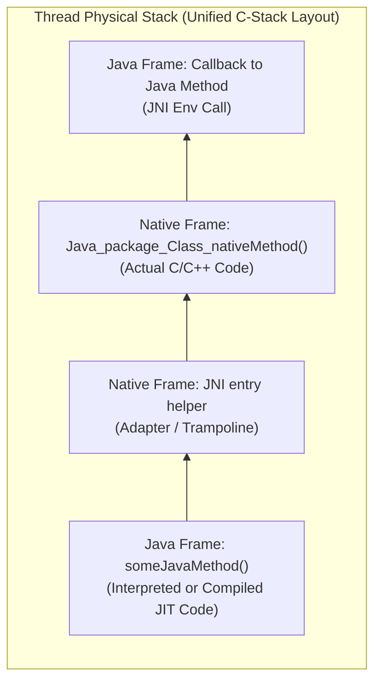
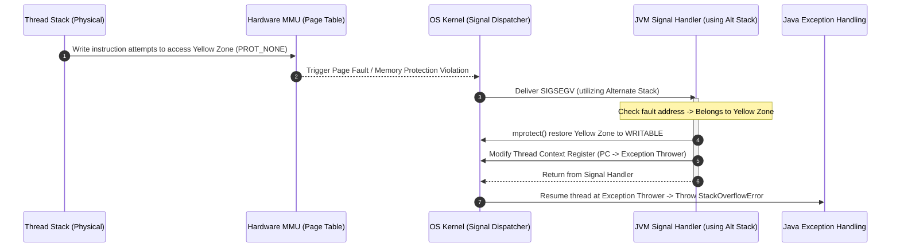

# 2.1.1.3 本地方法栈

在 Java 虚拟机（JVM）的内存架构中，托管代码（Managed Code）与底层硬件及操作系统之间的交互是其能够执行一切系统级任务的基石。Java 语言依靠 JVM 提供的内存管理、垃圾回收、跨平台指令集等特性，为开发者构建了一个安全、封闭的运行沙盒。然而，Java 并非空中楼阁，它最终必须依赖底层操作系统和硬件来执行任务。当 Java 程序需要访问操作系统底层的核心能力（如硬件驱动、文件系统、网络通信），或者为了实现极致的计算性能、重用现有的 C/C++ 遗留库时，就必须借助 **本地方法接口（Java Native Interface, JNI）** 来打破沙盒的限制。

与 JNI 紧密相随的，就是专门用来管理本地方法执行的内存区域——**本地方法栈（Native Method Stack）**。本文将深入剖析本地方法栈的理论设计、实现机制、物理栈结构、JNI 调用时的深层栈行为以及相关的异常与优化。

---

## 1. 规范定义：本地方法栈的理论模型

《Java 虚拟机规范》（Java Virtual Machine Specification）对本地方法栈做出了明确的逻辑划分与行为规定。

### 1.1 职责与定位
本地方法栈是专为虚拟机执行 **本地方法（Native Method）** 服务的逻辑内存区域。当线程调用一个 Java 方法时，JVM 会在 Java 虚拟机栈（Java Virtual Machine Stack）中压入一个栈帧；而当线程调用一个本地方法（例如用 C/C++ 编写的函数）时，JVM 则通过本地方法栈来管理和维护该方法的调用状态、局部变量以及返回过程。

### 1.2 生命周期与访问控制
* **线程私有（Thread-Private）**：本地方法栈与 Java 虚拟机栈一样，都是线程私有的。每个新线程被创建时，JVM 都会为其分配独立的本地方法栈空间。
* **生命周期一致性**：其生命周期与线程的生命周期完全相同。栈空间随线程的启动而分配，随线程的终结而释放、销毁。

### 1.3 异常状况与边界限制
规范中定义了本地方法栈在异常情况下的两种表现形式：
1. **StackOverflowError**：如果线程请求分配的栈深度（或栈容量）超过了本地方法栈所允许的最大容量，JVM 将抛出 `StackOverflowError`。
2. **OutOfMemoryError**：如果本地方法栈可以动态扩展，但在尝试扩展时无法申请到足够的物理内存；或者在创建新线程时，系统没有足够的空闲内存来初始化该线程对应的本地方法栈，JVM 将抛出 `OutOfMemoryError`。

> [!NOTE]
> 《Java 虚拟机规范》赋予了虚拟机实现者极大的自由度。规范并不强制规定本地方法栈的具体实现语言、栈的物理数据结构以及内存的组织方式。如果一个虚拟机实现完全不需要支持 `native` 方法，那么它甚至可以不实现本地方法栈。

---

## 2. HotSpot 虚拟机的实现：二合一机制

虽然 JVM 规范将“Java 虚拟机栈”与“本地方法栈”划分为两个独立的逻辑区域，但在实际的高性能虚拟机实现中，这种逻辑划分往往会被物理实现所消解。最具代表性的就是 Oracle/OpenJDK 的 **HotSpot 虚拟机**。

在 HotSpot 虚拟机中，**虚拟机栈和本地方法栈被合二为一（Unified Stack）**。也就是说，解释执行的 Java 字节码栈帧、即时编译（JIT）生成的机器码栈帧，以及通过 JNI 调用的 C/C++ 本地代码栈帧，在物理上都共享同一个真实的物理栈（C-Stack）。



### 2.1 为什么选择“二合一”设计？
HotSpot 采取这种物理上合一的设计，基于以下几点核心考量：

1. **消除栈切换（Stack Switching）开销**
   如果将 Java 栈和本地方法栈作为两块独立的物理内存，那么每次 Java 代码调用 Native 代码（或者 Native 代码反向回调 Java 代码）时，CPU 都必须进行栈指针（Stack Pointer, SP）和帧指针（Frame Pointer, FP）在两个不同物理区域之间的剧烈切换，同时需要保存和恢复大量的 CPU 寄存器上下文。对于频繁发生 JNI 调用的高并发应用而言，这种上下文切换的开销会非常昂贵。而合二为一的物理栈消除了这种不必要的物理隔离，使调用过程流畅地过渡。

2. **简化内存分配与控制**
   如果采用双栈结构，JVM 就需要分别为每个线程维护两个独立的栈内存大小（例如分别设置 Java 栈大小和 Native 栈大小）。而在合二为一的结构中，JVM 只需要利用一个 `-Xss` 参数（Thread Stack Size）即可控制整个线程在物理上所能占用的最大栈内存，极大地降低了操作系统虚拟内存管理的复杂度。

3. **执行引擎与硬件架构的自然融合**
   在现代 CPU 架构中，不管是 HotSpot 解释器模拟执行的栈帧，还是 JIT 编译器（C1/C2）直接编译生成的机器指令栈帧，对于底层 CPU 来说，最终都是机器码。将 Java 帧与 C/C++ 帧无缝地交织在同一个 C 语言风格的调用栈上，是最自然、最符合硬件执行规律的设计。

---

## 3. JNI 调用时的栈行为与深层原理

要透彻理解本地方法栈的运转，必须剖析当一个 Java 方法越过边界、调用 C/C++ 函数时，物理栈帧的实际变化以及底层的运行机制。

### 3.1 Native Frame 的物理结构与调用惯例
当执行流程进入 Native 函数时，该函数对应的栈帧是由本地编译器（如 GCC, Clang）根据特定硬件平台的 **应用二进制接口（ABI, Application Binary Interface）** 规范生成的。

以主流的 `x86-64` 体系结构下的 **System V AMD64 ABI**（Linux / macOS 默认 ABI）为例，一个标准的 C/C++ 栈帧在物理栈上的布局通常如下：

| 内存地址方向 | 栈帧元素 | 职责说明 |
| :--- | :--- | :--- |
| **高地址** | 传入参数 (Argument n...7) | 超过寄存器传参限制的参数，从右向左压入栈中 |
| | 返回地址 (Return Address) | `call` 指令自动压入，指向调用者函数的下一条指令 |
| | 保存的帧指针 (Saved RBP) | 上一个栈帧的基址，用于在函数返回时恢复栈帧结构 |
| | 保存的寄存器 (Callee-saved Registers) | 如 `rbx`, `r12`-`r15`，如果在函数内被修改，必须先压栈保存 |
| | 局部变量与临时缓冲区 | 函数内定义的局部变量、数组以及编译器的临时中间变量 |
| **低地址** | 栈顶指针 (RSP) | 始终指向当前栈帧的顶部 |

在 JNI 机制中，Java 方法的参数传递必须遵循上述 ABI 规范。

### 3.2 参数传递与隐式参数注入
当 Java 线程通过 JNI 调用一个本地方法时，JNI 桥接层（JNI Bridge / Trampoline）会对参数进行重新编排，以符合 Native 编译器的调用惯例：

1. **JNIEnv 指针与对象引用注入**
   对于任何一个 Java `native` 方法，即使它的 Java 声明中没有参数，其对应的 C/C++ 函数在物理编译后也会隐式接受至少两个参数：
   * **第一个参数 (`JNIEnv* env`)**：指向 JNI 函数表的指针。这代表当前线程在 JVM 中的上下文。Native 代码正是通过这个指针来反向调用 JVM 提供的 API（如获取字段、创建对象等）。
   * **第二个参数 (`jobject` 或 `jclass`)**：
     * 若为**非静态实例方法**，该参数为 `jobject obj`，代表调用该本地方法的 Java 对象实例的引用。
     * 若为**静态方法**，该参数为 `jclass clazz`，代表该本地方法所属 of Java 类的 Class 对象引用。
   * **后续参数**：才是 Java 代码中声明的实际参数列表。

2. **数据类型映射与传递规则**
   * **基本数据类型**：如 `int`, `double` 等。JVM 会直接进行值传递。Java 的 `int` 映射为 C 的 `jint`（本质上就是 32 位整型），直接通过 CPU 寄存器（如 `edi`, `esi` 等）或物理栈传递。这部分没有任何格式转换开销。
   * **引用数据类型**：如 `jstring`, `jobjectArray`, 自定义 Java 对象。由于 JVM 存在垃圾回收器（GC），GC 在运行期间会发生对象的移动和地址的更新。为了防止 Native 代码中保存的物理指针失效，JVM **绝对不允许**将堆中对象的真实物理内存地址直接暴露给 Native 代码。因此，所有传递给 C/C++ 的引用类型都是**句柄（Handle）**，即指向句柄表项的指针，这些句柄表项指向了实际的 Java 对象物理地址。

---

## 4. 栈的边界管理与溢出处理机制

在纯 Java 世界里，JVM 可以通过软件层面的栈深度计数或显式的条件检查来预防栈溢出。然而，一旦执行流越过 JNI 边界进入 Native 空间，C/C++ 代码的运行将彻底脱离 JVM 的指令监控。如果 Native 代码中发生失控的死循环递归，或者在物理栈上分配了极其巨大的局部数组，物理栈空间可能会被瞬间耗尽。

为了防止物理栈溢出直接导致整个 JVM 进程被操作系统强杀（Segment Fault），JVM 实现了一套**基于硬件页保护与替代信号栈的栈溢出拦截机制**。

### 4.1 守护页机制：黄色警戒区与红色致死区
在为线程分配的栈空间底端，JVM 会划出几页特殊的虚拟内存空间作为保护区，通过操作系统的 `mprotect` 系统调用将其属性设置为**不可读写（PROT_NONE）**：

```
+------------------------------------------------+  高地址
|              可用栈空间 (Writable)             |
|                                                |
|                   |                            |
|                   v (栈向下生长)                |
+------------------------------------------------+
|          黄色警戒区 (Yellow Zone)              |  不可读写 (PROT_NONE)
+------------------------------------------------+
|          红色致死区 (Red Zone)                 |  不可读写 (PROT_NONE)
+------------------------------------------------+  低地址
```

1. **Yellow Zone（黄色警戒区）**：
   通常占用 1 到 2 页（比如 4KB - 8KB）。当栈空间向下生长，且读写操作触碰到黄色警戒区时，MMU（内存管理单元）会抛出页保护异常，操作系统内核会向该线程发送 `SIGSEGV`（段错误）信号。
2. **Red Zone（红色致死区）**：
   紧挨着黄色警戒区的最底部，通常为 1 页。如果程序不仅突破了黄色警戒区，还越过了红色致死区，说明物理内存已彻底耗尽。此时已没有任何缓冲余地，JVM 将无法进行优雅的异常抛出，整个进程会直接崩溃。

### 4.2 信号处理与替代栈（sigaltstack）
当 Native 代码触发了黄色警戒区的物理溢出并产生 `SIGSEGV` 时，处理流程如下：

1. **硬件拦截与信号分发**：
   操作系统内核捕获到异常后，会将当前线程的执行上下文切换到 JVM 预先注册好的信号处理器（Signal Handler，如 `JVM_handle_linux_signal`）。
2. **替代信号栈（Alternate Stack）的作用**：
   执行信号处理函数的代码自身也需要栈空间。因为此时原线程栈已经写满（正停在 Yellow Zone），如果直接在原栈上执行信号处理，会立即触发二次段错误，导致进程死锁或直接崩溃。因此，JVM 在线程初始化时，会通过系统调用 `sigaltstack()` 为每个线程注册一块独立的、专用于执行信号处理的内存空间。
3. **页属性恢复与异常重定向**：
   信号处理器被调起后，会检查发生 `SIGSEGV` 的内存地址是否落在了当前线程的 Yellow Zone 内。
   * 如果是，说明这是一次受控的栈溢出。JVM 会临时通过 `mprotect` 将该 Yellow Zone 恢复为可读写状态，以便线程在清理和回退过程中可以使用该区域。
   * 接着，信号处理器会修改保存在操作系统内核中的线程 CPU 上下文（尤其是指令寄存器 PC），使其指向 JVM 内部的“异常抛出器（Exception Thrower）”。
   * 信号处理函数返回后，操作系统会将线程恢复到被修改后的 PC 处执行，从而在 Java 世界中抛出一个规整的 `java.lang.StackOverflowError`，避免了进程的异常死亡。



---

## 5. 执行状态流转与安全点（Safepoint）协同

在 JVM 内部，每个线程的执行状态（Thread State）是被严密监控的。最典型的状态包括：
* `_thread_in_Java`：表示线程正在执行 Java 字节码，或正在执行 JIT 编译生成的机器码。
* `_thread_in_native`：表示线程正在执行 Native 方法（C/C++ 代码）。

当线程跨越 JNI 边界时，其内部的状态机会发生状态转换，这一设计对于垃圾回收（GC）的正确运转至关重要。

### 5.1 进入 Native 世界：进入 GC 安全区
在 JNI 桥接层调用具体的 C/C++ 函数之前，会通过一条内存屏障指令，将当前线程的状态修改为 `_thread_in_native`。

当线程处于 `_thread_in_native` 状态时，JVM 认为该线程处于 **GC 安全区（Safe Region）**：
* **GC 线程无需等待**：当垃圾回收器需要发起一次全局 Safepoint（例如准备进行 Major GC）时，它不需要等待处于 Native 状态的线程响应暂停信号。GC 线程可以直接锁定堆内存并开始工作，因为 Native 线程此时只能执行不直接修改 JVM 堆内存的 C/C++ 代码。

### 5.2 离开 Native 世界：安全点拦截
当 Native 函数执行完毕准备返回，或者在 Native 函数内部通过 `JNIEnv` 调用 Java 方法时，线程必须将状态改回 `_thread_in_Java`。

在此转换瞬间，JNI 适配器代码中会插入一个**安全点轮询（Safepoint Poll）**：
* 如果此时 JVM 的 GC 正在运行（即 JVM 处于 Safepoint 挂起期），试图回到 Java 世界的线程会在此轮询处被**强制挂起（Block）**，进入等待状态。
* 只有当 GC 运行结束，全局 Safepoint 被解除后，该线程才会被唤醒并恢复状态，继续执行后续的 Java 指令。这有效防止了线程在垃圾回收期间并发读写堆内存，从而破坏内存一致性。

---

## 6. JNI 内存管理：引用生存周期与句柄机制

在 C/C++ 中，程序员拥有绝对的内存控制权，但这与 JVM 的自动垃圾回收机制产生了冲突。为了解决这一矛盾，JNI 引入了严格的引用管理机制。

### 6.1 句柄（Handle）与对象地址间接化
如前文所述，Native 函数中的 `jobject`、`jstring`、`jclass` 等类型，并不是指向 Java 堆内对象的真实指针。它们的物理本质是 **指向句柄表项的指针（oop*）**。

```
+-----------------+      +-----------------------+      +-----------------------+
|  Native Stack   |      |  Thread Handle Table  |      |       JVM Heap        |
|  (C/C++ Frame)  |      |                       |      | (Garbage Collected)   |
|                 |      |                       |      |                       |
|   jobject  ------------->  Handle Entry (oop)  --------->   Actual Java       |
|  (Pointer to    |      | (Pointer to object)   |      |   Object Instance     |
|   Handle)       |      |                       |      |                       |
+-----------------+      +-----------------------+      +-----------------------+
```

当垃圾回收器在 GC 过程中移动了该 Java 对象并更新了其物理内存地址时，GC 只需要在处于安全点的线程句柄表中，更新对应的 Handle Entry 的值。而 Native 函数持有的 `jobject` 指针值本身无需任何改变，从而保证了 Native 代码中指针的持久有效性。

### 6.2 引用类型的划分与管理规范

#### 1. 局部引用（Local Reference）
* **创建与范围**：通过 JNI 接口（如 `NewObject`, `FindClass`, `NewStringUTF` 等）返回的任何引用默认都是局部引用。它们被记录在当前线程的 **局部引用表（Local Reference Table）** 中。
* **生命周期**：与当前 Native 方法的栈帧绑定。当 Native 方法返回 Java 世界时，JVM 会自动销毁对应的局部引用表，从而使表中的引用失效。
* **溢出隐患**：局部引用表是有容量限制的（通常默认上限为 512 或 1024）。如果在一个 Native 循环中不断产生新的局部引用，而没有显式释放，就会引发 `Local Reference Table Overflow` 错误。
  * *解决方案*：在循环体内部，及时使用 `(*env)->DeleteLocalRef(env, local_ref)` 显式销毁不再使用的局部引用，或者使用 `PushLocalFrame` / `PopLocalFrame` 将循环体包裹在临时局部引用帧中。

#### 2. 全局引用（Global Reference）
* **创建与用途**：如果 Native 代码需要跨多次 JNI 方法调用、或在多线程间共享某个 Java 对象引用，必须调用 `(*env)->NewGlobalRef(env, local_ref)` 将局部引用升级为全局引用。
* **生命周期**：全局引用不会随着栈帧的销毁而失效，它的生命周期完全由开发者控制。只有当显式调用 `(*env)->DeleteGlobalRef(env, global_ref)` 时，它才会被释放。
* **内存泄漏风险**：如果 Native 代码忘记释放全局引用，对应的 Java 对象将永远无法被 GC 回收，这会导致严重的 **Java 堆内存泄漏（Java Heap Leak）**。

#### 3. 弱全局引用（Weak Global Reference）
* **特性**：通过 `NewWeakGlobalRef` 创建。它类似于 Java 中的 `WeakReference`，不会阻止所指向的对象被 GC 回收。
* **安全使用**：在每次访问弱全局引用之前，Native 代码必须通过 `(*env)->IsSameObject(env, weak_ref, NULL)` 来验证所引用的 Java 对象是否依然存活，避免引发野指针访问崩溃。

---

## 7. 常见问题排查与工程实践指南

在日常的 JVM 调优和 Native 代码集成过程中，围绕本地方法栈和 JNI 的 Bug 往往是最隐蔽且最难排查的。以下是几种典型问题及其对应的防范方案。

### 7.1 C/C++ 代码导致的物理栈溢出
* **现象描述**：JVM 进程在毫无征兆的情况下突然崩溃退出，没有任何 Java 的异常堆栈打印，控制台可能只留下一句 `Segmentation fault` 或者操作系统生成的 `core dump` 核心转储文件。
* **原因分析**：
  1. 在 C/C++ 代码中声明了过大的局部变量（例如，直接在栈上分配了巨大的临时缓冲区：`char buffer[2048 * 1024]`）。
  2. Native 函数中发生了死循环或过深的递归。
* **优化策略**：
  * **避免栈上大对象**：大容量的数据缓冲区应在 **C-Heap（堆内存）** 中通过 `malloc` 或 `new` 进行动态分配，并在使用完毕后通过 `free` 或 `delete` 及时释放。
  * **调整线程栈大小**：通过启动参数 `-Xss` 调大每个线程的物理栈容量（例如 `-Xss2m` 或 `-Xss4m`），但要注意，过大的 `-Xss` 会消耗更多的系统虚拟内存，导致在相同内存容量下可创建的线程总量减少。

### 7.2 循环体中未释放局部引用导致的表溢出
* **典型错误代码**：
  ```c
  // 错误示范：在处理大批数据时，局部引用不断堆积
  for (int i = 0; i < 10000; i++) {
      jobject element = (*env)->GetObjectArrayElement(env, arr, i);
      // 对 element 进行业务处理 ...
      // 未调用 DeleteLocalRef，导致局部引用表迅速被撑爆，VM 崩溃
  }
  ```
* **正确优化写法**：
  ```c
  // 正确示范：在循环体结束时立即释放局部引用
  for (int i = 0; i < 10000; i++) {
      jobject element = (*env)->GetObjectArrayElement(env, arr, i);
      // 对 element 进行业务处理 ...
      (*env)->DeleteLocalRef(env, element); // 立即回收该项句柄占用的槽位
  }
  ```

### 7.3 未挂载 Native 线程直接调用 JNI 导致的异常
* **现象描述**：在 C/C++ 层通过系统的 `pthread_create` 创建了独立的本地线程，在该新线程中尝试直接通过 `JNIEnv` 调用 Java 方法时，程序瞬间崩溃。
* **原因分析**：
  由 C/C++ 自主创建的线程对于 JVM 而言是“隐形的”。该线程既没有在 JVM 线程表中登记，其物理栈也没有被划入 JVM 线程的管理范围，因此它无法获取当前线程的 `JNIEnv` 上下文。
* **解决方案**：
  1. 在本地线程需要执行 JNI 调用之前，必须先通过全局的 `JavaVM*` 实例调用 `AttachCurrentThread(jvm, (void**)&env, NULL)`。这样可以将当前本地线程注册并挂载到 JVM，为其生成对应的 `JNIEnv`。
  2. 在线程退出或执行完 JNI 调用后，必须显式调用 `DetachCurrentThread(jvm)` 将其从 JVM 中注销，否则会导致严重的系统资源和线程对象泄漏。

---

## 8. 总结

本地方法栈在 JVM 内存规范中是一个逻辑上独立的组成部分，专门用以保障 `native` 方法的执行。但在以 HotSpot 为代表的现代高性能虚拟机中，通过“虚拟机栈与本地方法栈合二为一”的物理设计，最大化地降低了上下文切换带来的损耗。

在 JNI 边界交互中，硬件保护页（Yellow/Red Zone）提供了底层栈溢出的物理拦截屏障，而“句柄间接化”和“局部引用表”则构成了托管堆与 C/C++ 物理栈之间安全传递参数的防火墙。理解这一套复杂而精致的机制，对于开发高性能、高稳定的混合系统（Java + C/C++）具有决定性的指导意义。
