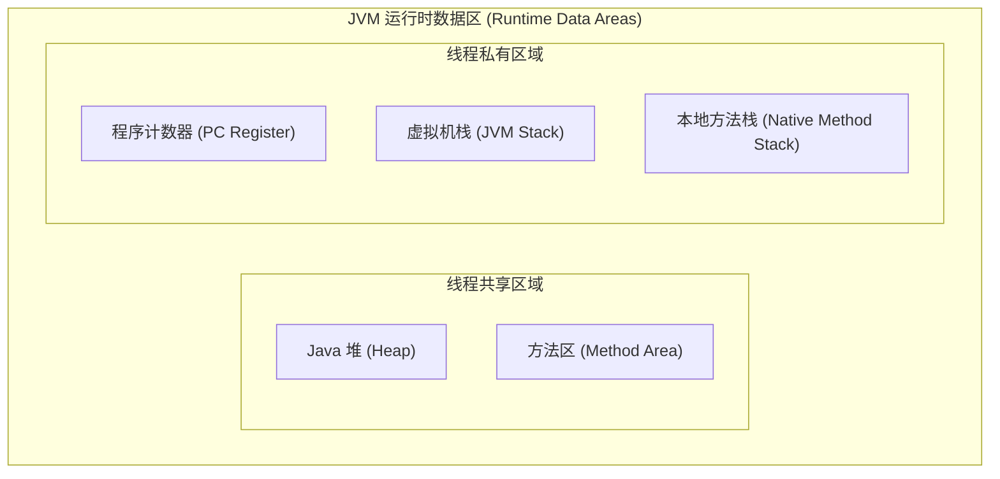
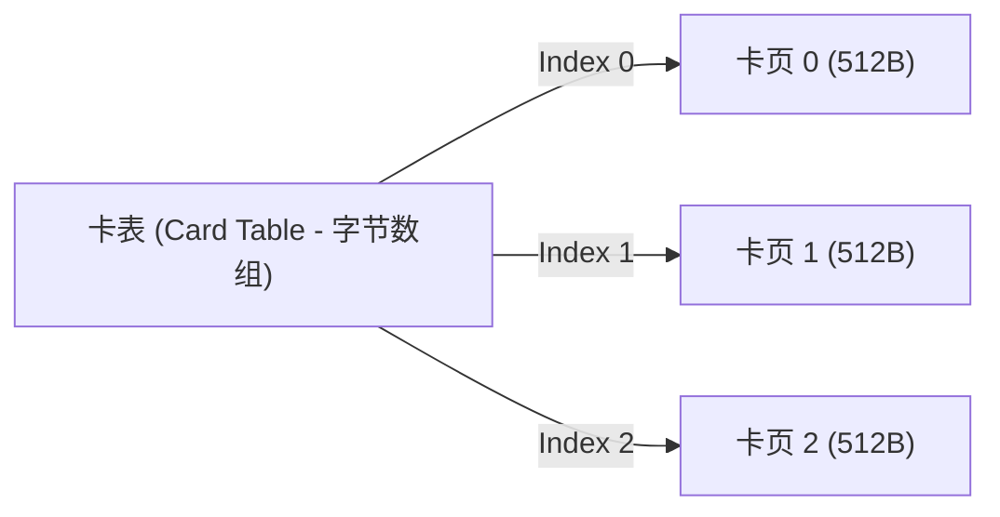
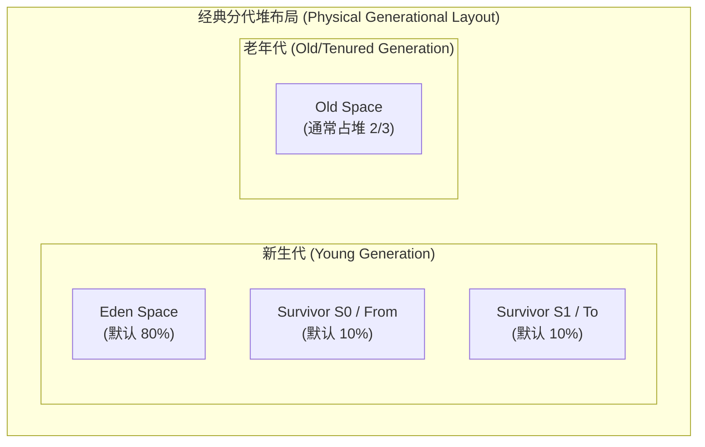
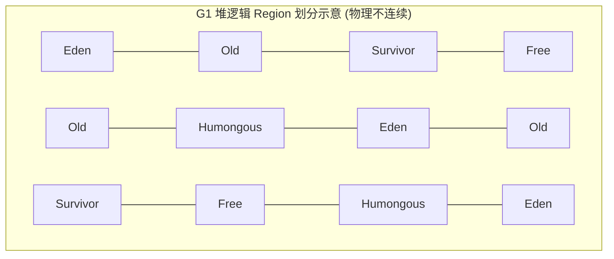
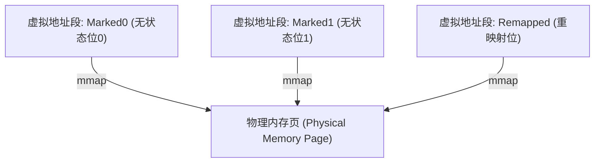
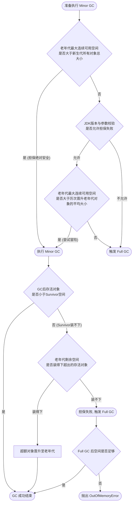
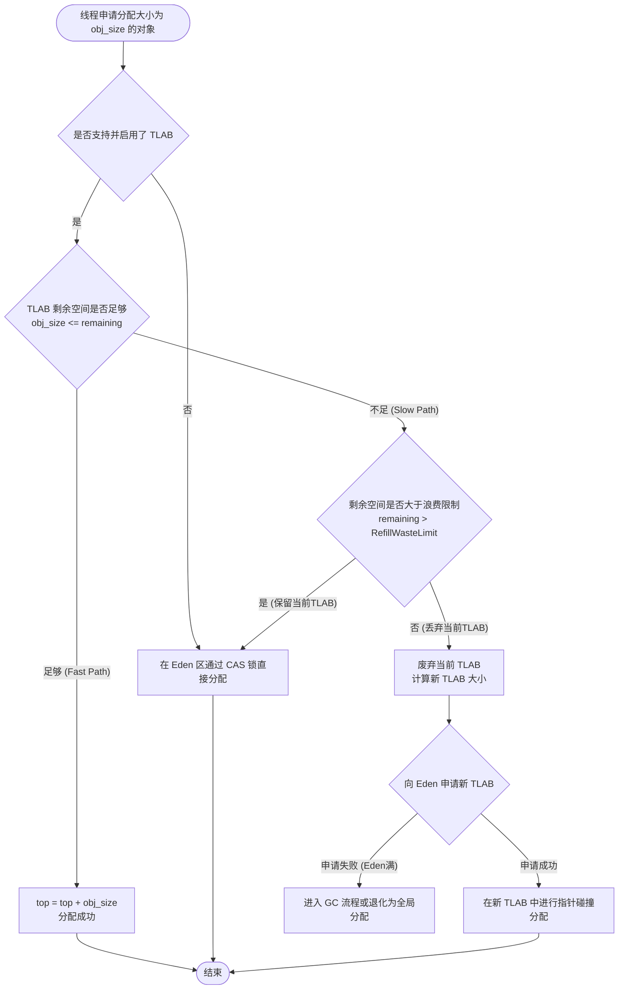
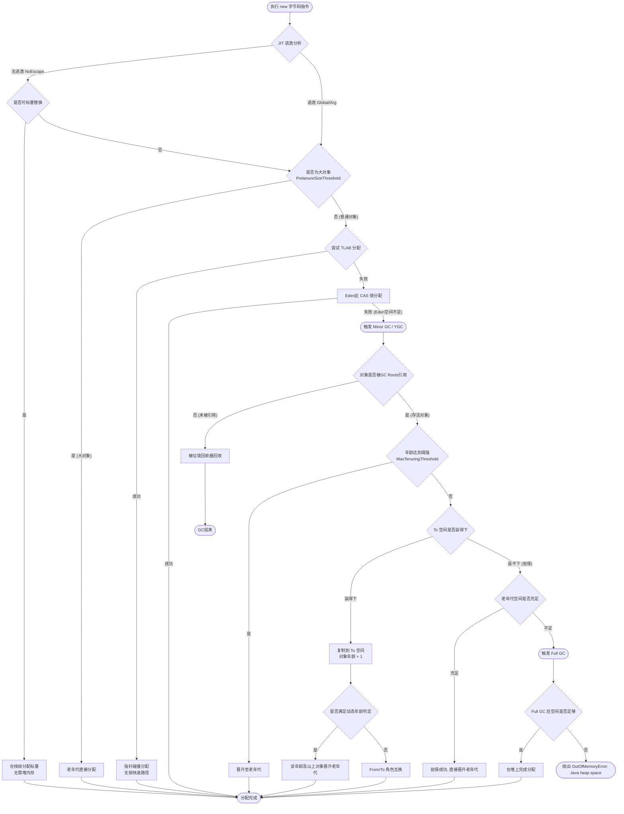
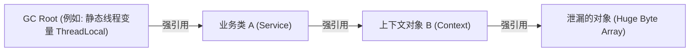
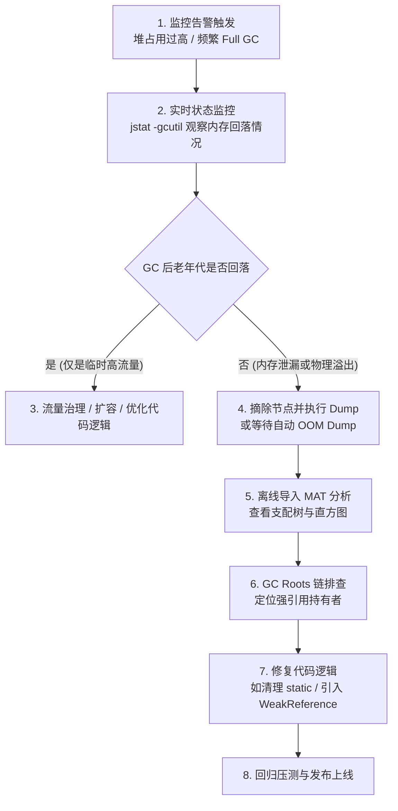

# 2.1.1.4 堆

Java 堆（Java Heap）是 Java 虚拟机（JVM）所管理的内存中最大的一块区域。在 JVM 规范中，Java 堆是所有线程共享的内存区域，在虚拟机启动时创建。该区域的唯一目的就是存放对象实例，几乎所有的对象实例以及数组都在这里分配内存。

随着即时编译器（JIT）的蓬勃发展，特别是逃逸分析（Escape Analysis）技术的日益成熟，栈上分配、标量替换等优化手段打破了“所有对象都在堆上分配”的传统认知，Java 堆的绝对定位也随之发生着微妙的变化。然而，在现代高并发、大吞吐量的应用场景中，合理地规划、调优与诊断 Java 堆，依然是保障 JVM 进程高可用性与高性能的基石。

---

## 1. Java 堆的定义与核心定位

### 1.1 JVM 内存模型中的核心角色
根据《Java虚拟机规范》（Java Virtual Machine Specification, JVMS）的定义，JVM 在运行期间会将其管理的内存划分为若干个不同的数据区域。Java 堆是其中生命周期与虚拟机本身绑定、且被所有线程共享的区域。



在功能上，Java 堆是垃圾回收器（Garbage Collector, GC）管理的主战场，因此在很多文献中也被称为“GC 堆”（Garbage Collected Heap）。

### 1.2 JLS 与 JVMS 规范的定义与演进
在《Java语言规范》（Java Language Specification, JLS）与《Java虚拟机规范》中，关于堆的描述有一句经典的表述：
> "The heap is the run-time data area from which memory for all class instances and arrays is allocated."（堆是运行时数据区，所有类实例和数组的内存均在此分配。）

但在具体的虚拟机实现中（如 HotSpot），“all” 已经演变为 “almost all”。现代 JIT 编译器在编译字节码时，会通过**逃逸分析（Escape Analysis）**来判定对象的生命周期是否仅限于某个方法内部。如果未发生方法逃逸或线程逃逸，编译器可以通过**标量替换（Scalar Replacement）**将对象拆解为若干局部变量，直接在**栈帧上分配**（Stack Allocation），从而免去堆分配的开销与垃圾回收的压力。

### 1.3 堆的共享性与并发挑战
堆的共享性带来了极大的便利，使不同线程能够无缝传递数据；但它也是并发竞争的核心源头。
当数以百计的线程同时申请在堆上创建新对象时，虚拟机必须面临高并发下的内存分配同步问题。JVM 在底层主要通过**指针碰撞（Bump the Pointer）**与**空闲列表（Free List）**进行空间分配，而在多线程场景下：
- 如果直接在全局堆空间上采用 CAS（Compare-And-Swap）机制来保证并发分配的原子性，当并发量极大时，CAS 的自旋重试会导致严重的 CPU 缓存同步开销与分配延迟。
- 引入 **TLAB（Thread Local Allocation Buffer）** 则是解决该并发冲突的灵魂设计。TLAB 在物理堆的 Eden 区中，为每个线程开辟了一块专属的预分配缓冲区，使大部分对象的分配退化为线程私有的“无锁”操作，极大提升了吞吐量。

---

## 2. Java 堆的物理与逻辑分区

### 2.1 经典分代收集理论
经典 JVM 堆内存划分基于**分代收集理论（Generational Collection Theory）**，这并非是具体的物理实现限制，而是基于对大量真实程序运行状况的统计总结。其核心由三条经验法则支撑：

#### 2.1.1 弱分代假说（Weak Generational Hypothesis）
> 绝大多数对象都是朝生夕死的（Die Young）。

在大部分业务场景中，对象被创建出来用于临时计算、逻辑封装或作为局部变量，在其生命周期超出当前方法作用域后，很快就会变得不可达。研究表明，在典型的企业级应用中，超过 90% 的 Java 对象在第一次 Minor GC（年轻代垃圾回收）时就会被宣告死亡。

#### 2.1.2 强分代假说（Strong Generational Hypothesis）
> 熬过越多次垃圾回收过程的对象就越难以消亡（Live Long）。

那些经历多次垃圾回收仍顽强存活的对象，往往是系统中的常驻组件（如 Spring Bean 容器、缓存管理器、线程池、配置上下文等）。针对这些对象，每次 GC 都去扫描和移动它们的开销极大，因此应该将它们移动到另一个生存周期更长的区域（老年代），并以较低的频率进行垃圾回收。

#### 2.1.3 跨代引用假说（Intergenerational Reference Hypothesis）
> 跨代引用相对于同代引用来说仅占极少数。

年轻代的对象可能会被老年代的对象所引用，或者老年代的对象依赖年轻代的对象。为了确定年轻代中哪些对象存活，如果必须扫描整个老年代来寻找引用，那年轻代收集（Minor GC）的效率将大打折扣，失去了“分代收集”的初衷。

##### 记忆集（Remembered Set）与卡表（Card Table）的实现
为了解决跨代引用问题，JVM 引入了**记忆集（Remembered Set）**这一抽象数据结构，而**卡表（Card Table）**是记忆集最常用的具体实现方式。

在 HotSpot 虚拟机中，卡表通常是一个简单的字节数组（Byte Array），其元素与老年代的一块固定大小（通常是 512 字节）的内存区域（称为卡页，Card Page）一一对应。



- 当老年代中的某个对象写入或修改了一个指向年轻代对象的引用时，JVM 会触发一个**写屏障（Write Barrier）**，将该引用所在的卡页在卡表中对应的字节置为 `0x01`（表示 Dirty，脏页）。
- 在进行 Minor GC 时，垃圾回收器不需要扫描整个老年代，只需扫描卡表中标记为 Dirty 的卡页，将其中的对象加入 GC Roots 扫描链中，从而实现了年轻代的高效回收。

### 2.2 新生代与老年代的经典划分
在 JDK 8 及其以前（以及默认使用 Parallel GC 或 CMS 的场景），Java 堆在物理上和逻辑上都是严格分代的。整个堆划分为：
1. **新生代（Young Generation）**：进一步细分为一个 **Eden 空间**和两个 **Survivor 空间**（分别称为 **From Survivor / S0** 和 **To Survivor / S1**）。
2. **老年代（Old / Tenured Generation）**：存放长期存活的对象和大对象。



#### 2.2.1 为什么 Survivor 空间是两块？
从垃圾回收算法的角度来推导，如果只有一个 Survivor 空间，当发生 Minor GC 时：
- Eden 区中存活的对象会被复制到 Survivor 中。
- 此时 Survivor 区中存在上一次 GC 留下来的对象，为了防止内存碎片，必须对整个 Survivor 区进行内存整理，或者通过复杂的标记清除法处理。但这会带来可观的内存移动开销或导致严重的内存碎片。
- 当 Survivor 区填满时，新一轮 GC 将无法直接处理这部分“混合”了新旧存活对象的区域。

采用**双 Survivor 机制（From 与 To 角色互换）**，在任何时刻，总有一块 Survivor 空间是空的（To 空间）：
1. 发生 Minor GC 时，将 Eden 区中存活的对象以及 From 空间中仍存活且未达到晋升年龄的对象，统一一次性复制到 To 空间中。
2. 清空 Eden 和 From 空间。
3. 将 From 与 To 的角色对调（原 From 变成 To，原 To 变成 From）。
4. 这种方式保证了内存分配区域的绝对规整，避免了内存碎片的产生，同时也维持了复制算法（Copying Algorithm）在应对高死亡率区域时的高效性。

#### 2.2.2 为什么 Eden : S0 : S1 的默认比例是 8:1:1？
这个设计是吞吐量与内存碎片管理折中后的经验数值：
- 如果年轻代只包含 Eden，那每次 GC 后存活的对象只能直接晋升老年代，导致老年代迅速积压，频繁触发高昂的 Full GC / Major GC。
- 假设每次 Minor GC 后，新生代对象的存活率约为 10%（基于弱分代假说）。
- 如果我们将 Eden 和两个 Survivor 按 $8:1:1$ 的比例划分：
  - 每次年轻代可用于分配新对象的内存为 Eden + From = 90% 的新生代空间。
  - 只有 10% 的 To 空间作为预留的复制目的地而被闲置。
  - 这种设计达到了 **90% 的空间利用率**，同时刚好能容纳约 10% 的存活对象拷贝，是在资源开销与垃圾回收效率之间的最佳契合点。
  - If Survivor 占比过大（如 6:2:2），则实际可用于新对象分配的 Eden 空间减少，会导致 Minor GC 触发频率变高，从而降低应用整体吞吐量。

### 2.3 现代非连续/区域化堆结构（Region-based Heap Layout）
随着 JVM 技术的发展，特别是 G1、Shenandoah 与 ZGC 的引入，物理上连续的分代概念逐渐被打破。

#### 2.3.1 G1 (Garbage-First) 收集器的 Region 划分
G1 收集器将整个 Java 堆划分为数千个（通常在 2048 到 4096 个之间）大小相等的独立物理区域（Region）。每个 Region 的大小可以通过 `-XX:G1HeapRegionSize` 设定，范围在 $1\text{MB} \sim 32\text{MB}$ 之间，且必须为 2 的幂次方。



在 G1 中，**新生代和老年代不再是物理隔离的**，它们是由一系列不连续的 Region 组成的逻辑集合：
- **E（Eden Region）**：存放新分配的对象。
- **S（Survivor Region）**：存放 Minor GC 后存活的对象。
- **O（Old Region）**：存放晋升的长生命周期对象。
- **H（Humongous Region）**：当一个对象的大小超过了普通 Region 容量的 50% 时，会被判定为“巨型对象”。G1 会在堆中寻找连续的 Humongous Region 来存储该对象。这种设计避免了在普通 Region 之间拷贝大对象时产生的巨大开销，但也容易引发堆内存碎片化问题。

#### 2.3.2 Shenandoah 与 ZGC 的物理堆演变
- **Shenandoah 收集器**：沿用了 G1 的 Region 划分，但它是无分代的（在早期版本中），所有 Region 的地位平等，不刻意区分 Eden 或 Old，极大地简化了标记与整理的拓扑模型。
- **ZGC (Z Garbage Collector) 收集器**：
  - ZGC 将内存划分为不同粒度的 **Page（页面）**，包括：
    - **Small Page (2MB)**：分配小于 256KB 的对象。
    - **Medium Page (32MB)**：分配大于等于 256KB 且小于 4MB 的对象。
    - **Large Page (动态大小)**：分配大于等于 4MB 的对象。每个 Large Page 只会包含一个对象，并且在垃圾回收时**不会被重分配（Relocate）**，因为移动一个超大对象的代价极其高昂。
  - **染色指针与多重映射（Multi-mapping）**：
    ZGC 使用了**染色指针（Colored Pointers）**技术，将 64 位指针的其中 4 位（Marked0, Marked1, Remapped, Finalizable）用于标识对象的 GC 状态。这导致同一个对象在不同阶段可能拥有三个不同的虚拟内存地址。
    为了解决这一问题，ZGC 通过操作系统（如 Linux 的 `shm_open` 和 `mmap`）的内存映射机制，将这三个不同的虚拟地址段映射到同一个物理内存页面上。



---

## 3. JVM 堆参数调优与分代比例设置依据

### 3.1 核心参数详解
控制 Java 堆空间大小与分代的关键 JVM 配置参数如下表所示：

| 参数名称 | 默认值 / 推荐配置 | 功能描述 |
| :--- | :--- | :--- |
| `-Xms` | 默认物理内存的 1/64 | 初始化堆大小。建议与 `-Xmx` 设置为相同大小，避免频繁缩容/扩容带来的 STW 抖动。 |
| `-Xmx` | 默认物理内存的 1/4 | 最大堆大小。 |
| `-Xmn` | 默认由 `-XX:NewRatio` 计算得到 | 新生代（年轻代）的大小。 |
| `-XX:NewRatio` | `2` | 老年代与年轻代的比例。即 $Old : Young = 2 : 1$，年轻代占堆的 1/3。 |
| `-XX:SurvivorRatio` | `8` | Eden 区与单个 Survivor 区的比例。即 $Eden : S0 : S1 = 8 : 1 : 1$。 |
| `-XX:TargetSurvivorRatio` | `50`（表示 50%） | Minor GC 后 Survivor 空间的目标占用率。用于动态年龄判定。 |
| `-XX:MaxTenuringThreshold` | Parallel GC: `15`<br>CMS: `6` | 对象晋升到老年代的最大年龄阈值。 |
| `-XX:PretenureSizeThreshold` | `0`（不限制） | 晋升直达老年代的对象大小阈值（单位：字节）。仅对 Serial / ParNew 等垃圾回收器有效。 |

### 3.2 比例设置的深层调优考量
调整新生代与老年代的比例，本质上是在**吞吐量（Throughput）**与**响应时间（Latency/Pause Time）**之间寻找最优平衡点。

#### 3.2.1 吞吐量优先场景
- **特征**：后台大批量数据计算、科学计算、非交互式离线任务。
- **调优策略**：需要较大的新生代（例如 `-XX:NewRatio=1`，即 $1:1$），以此来减少 Minor GC 的频率。较大的年轻代意味着单次 GC 的间隔更长，能让大多数短命对象在年轻代被彻底清理掉，避免其过早晋升（Premature Promotion）至老年代。

#### 3.2.2 响应时间优先场景
- **特征**：实时 Web API 服务、微服务网关、高频交互系统。
- **调优策略**：单次 GC 的停顿时间必须控制在极低水平。此时不宜将新生代设得过大（在传统的 Copier 收集器下），否则单次收集存活对象多，会导致 STW 时间过长。通常采用 G1 或 ZGC 等现代收集器，通过 `-XX:MaxGCPauseMillis` 参数让 JVM 自动动态调节年轻代 Region 的数量，从而达到目标停顿时间。

### 3.3 动态对象年龄判定机制
JVM 并不是必须要等到对象的年龄（经历的 Minor GC 次数）达到 `-XX:MaxTenuringThreshold` 设定值之后才会将对象晋升到老年代。为了避免 Survivor 区溢出，JVM 内部实现了一套**动态年龄判定（Dynamic Age Tenuring）**算法。

#### 3.3.1 动态年龄判定算法
在一次 Minor GC 之后，垃圾回收器会统计 Survivor 空间（当前作为 To 空间的 Survivor）中所有存活对象的大小。
1. 将所有存活对象按照年龄从小到大（年龄 1, 年龄 2, ..., 年龄 $N$）进行排序。
2. 从年龄 1 开始累加各年龄段对象占用的总内存。
3. 当累加到年龄为 $Age_{target}$ 的对象时，如果发现**累加内存总和已经超过了 Survivor 空间大小的 `-XX:TargetSurvivorRatio`（默认 50%）**，那么：
   - 此时会将 $Age_{target}$ 与 `-XX:MaxTenuringThreshold` 进行对比，取两者中的较小值作为本次晋升老年代的实际年龄阈值。
   - 所有年龄大于或等于该实际阈值的对象，都会在本次或下一次 GC 被直接晋升（Promote）到老年代。

##### 动态年龄判定公式
$$SumSize(Age_1 \to Age_k) \ge SurvivorSize \times TargetSurvivorRatio \implies Age_{threshold} = \min(k, MaxTenuringThreshold)$$

> [!TIP]
> 如果业务系统在高并发下产生的大量临时对象（生命周期稍长于单次 Minor GC）导致 Survivor 空间频繁越过 50% 阈值，会引发大批低年龄对象提前进入老年代，进而引起频繁的 Full GC。此时，可以通过调大 `-XX:SurvivorRatio`（减小 Survivor 占比以期望 GC 能在 Eden 彻底清理）或直接调大堆空间、调高 `-XX:TargetSurvivorRatio`（如 80% 或 90%）来缓解该问题。

### 3.4 空间分配担保机制
在发生 Minor GC 之前，由于新生代采用复制算法，如果出现极端情况——Minor GC 后新生代所有对象全部存活，那么 Survivor 空间肯定无法容纳。此时，就需要老年代进行“分配担保”（Handle Promotion Guarantee），将装不下的对象直接接入老年代。

为了保证这个担保过程是安全的，JVM 在执行 Minor GC 之前会进行以下严格的流程校验：



---

## 4. TLAB (Thread Local Allocation Buffer) 深度剖析

### 4.1 并发分配下的内存竞争痛点
在堆上分配对象内存，最直接的机制是通过**指针碰撞（Bump the Pointer）**：
- 维护一个指针，指向空闲空间的起始位置。
- 分配对象时，根据对象大小将指针向空闲方向移动相应距离。

但在多线程并发分配的场景下，两个线程同时申请分配内存，其指针更新操作（如 `ptr = ptr + size`）存在竞态条件。如果通过全局锁来同步此操作，所有的内存分配都会退化成串行执行，导致多核 CPU 的计算资源被锁竞争严重浪费。

### 4.2 TLAB 的设计思想
为了消除全局内存分配锁的开销，JVM 采用了 **TLAB（线程局部分配缓冲区）** 设计。
- TLAB 是 JVM 在 Java 堆的 **Eden 区**中为每个线程专门划分的一块线程私有内存区域。
- 线程初始化或 TLAB 用尽时，会向 Eden 区申请分配一块新的 TLAB。这个申请过程需要通过 CAS 进行同步锁定。
- 一旦 TLAB 分配成功，该线程在后续创建对象时，直接在自己的 TLAB 空间内通过**指针碰撞**完成分配。由于这块空间是当前线程独占的，因此**完全不需要加锁**。
- 这条快速分配路径被称为 **Fast Path**。只有当 TLAB 空间耗尽，需要重新申请新的 TLAB 或直接进行堆分配时，才会进入带锁的 **Slow Path**。

### 4.3 TLAB 内存布局与分配原理
在 HotSpot 源码中，TLAB 的内部结构由三个关键指针进行维护，它们被定义在线程的内部状态中：

```
+--------------------------------------------------+
|                     Eden 区                      |
|  +-----------------------+                       |
|  |     Thread-A TLAB     |                       |
|  |  +-----------------+  |                       |
|  |  |                 |  |                       |
|  |  +-----------------+  |                       |
|  |  ^        ^        ^  |                       |
|  |  |        |        |  |                       |
|  | start    top      end |                       |
|  +-----------------------+                       |
+--------------------------------------------------+
```

- `start`：当前线程 TLAB 的起始物理地址。
- `top`：当前 TLAB 内部已分配对象的边界地址。`[start, top)` 之间是已分配的对象，`[top, end)` 之间是未分配的空闲空间。
- `end`：当前 TLAB 的终止物理地址（实际上还有一个 `pf_top` 指针用于硬件预取优化，此处不展开）。

#### 4.3.1 TLAB 空间分配决策与 Refill Waste Limit（浪费因数）
当线程申请创建大小为 `obj_size` 的对象时，TLAB 的剩余空间为 `remaining = end - top`：
1. 如果 `obj_size <= remaining`：直接在 TLAB 内分配，`top = top + obj_size`。这是最快的分支。
2. 如果 `obj_size > remaining`：说明当前 TLAB 装不下这个对象。此时面临两个选择：
   - **方案 A（丢弃 TLAB）**：废弃当前的 TLAB（将其收回为 Eden 的一部分，或作为碎片保留），向 Eden 申请一个新的 TLAB，并在新的 TLAB 中分配该对象。
   - **方案 B（直接堆分配）**：保留当前 TLAB，将该对象直接在 Eden 区进行分配（使用 CAS 锁进行全局分配）。

为了在“浪费空间”与“分配效率”之间做出权衡，JVM 引入了 **Refill Waste Limit（最大浪费限额）**：
- 如果 `remaining > Refill Waste Limit`：说明当前 TLAB 剩余的空闲空间还比较大，如果废弃它会导致严重的内存碎片和浪费。因此 JVM 决定**不丢弃 TLAB**，而是执行方案 B，直接在 Eden 区进行慢速的 CAS 分配，当前线程的 TLAB 依然保留供后续更小的对象使用。
- 如果 `remaining <= Refill Waste Limit`：说明当前 TLAB 已经用得差不多了，剩余的空闲空间很小。JVM 决定执行方案 A，**废弃当前 TLAB**，申请一块全新的 TLAB 来容纳当前对象。



### 4.4 TLAB 参数与动态调整
为了防范内存碎片的急剧增长，JVM 默认会开启 TLAB 大小的自适应动态调整。
- `-XX:+UseTLAB`：开启 TLAB 机制（HotSpot 默认开启）。
- `-XX:TLABSize`：设定 TLAB 的初始大小。如果不指定，JVM 会在启动时根据线程数、Eden 大小进行动态计算。
- `-XX:+ResizeTLAB`：是否根据线程的分配行为动态调整 TLAB 的大小（默认开启）。JVM 会根据历史统计数据，对分配活跃的线程分配更大的 TLAB，对不活跃的线程分配较小的 TLAB。
- `-XX:TLABWasteTargetPercent`：设置 TLAB 占用 Eden 区的百分比（默认为 1%）。
- `-XX:PrintTLAB`：诊断参数，用于打印每个线程在 GC 时的 TLAB 使用统计数据（浪费的比例、逃逸到全局分配的次数等）。

---

## 5. 对象在堆上的分配与晋升流程

### 5.1 逃逸分析与 JIT 编译器优化
在进入实际的堆内存分配路径之前，现代高版本 JVM 的即时编译器（JIT）会利用**逃逸分析（Escape Analysis）**对代码进行深度优化。

#### 5.1.1 逃逸分析算法
逃逸分析是 JIT 编译器（如 C2 编译器）在编译期进行的控制流和数据流静态分析。其目的是判定一个在方法内部创建的对象，是否会被方法外部的其他代码或线程所访问。对象的逃逸状态主要有三种：
1. **全局逃逸（GlobalEscape）**：对象逃逸出了当前线程。例如：对象被赋值给静态变量、或者被作为方法的返回值返回给未知的外部调用者、或者重写了 `finalize()` 方法。
2. **参数逃逸（ArgEscape）**：对象被作为参数传递给了其他方法，但在该方法运行期间不会被其他线程访问，且该方法不会将该对象进一步泄露。
3. **无逃逸（NoEscape）**：对象只在当前方法内部可见，外部无法通过任何渠道访问它。

#### 5.1.2 基于逃逸分析的优化手段

##### 标量替换（Scalar Replacement）
- **标量（Scalar）**：是指一个无法再细分的数据类型，如 Java 中的基本数据类型（`int`, `long`, `double` 等）和对象引用（`reference`）。
- **聚合量（Aggregate）**：是指可以被进一步拆分的数据，Java 中的对象就是典型的聚合量。
- **优化机制**：如果逃逸分析证明一个对象是**无逃逸**的，JIT 编译器在编译该方法时，**不会在堆上创建该对象**，而是直接将这个对象拆解，把它的成员变量当作一个个独立的局部变量（标量）在**栈帧上分配**（Stack Allocation）。
- **效果**：省去了堆内存分配的锁同步和指针碰撞，且该方法的局部变量随着栈帧的出栈而自动销毁，完全不给 GC 带来负担。

> [!NOTE]
> 很多开发者误以为 JVM 实现了真正的“栈上分配（Stack Allocation）”。实际上，HotSpot 并没有直接在虚拟机栈里压入一个完整的对象实体（因为这需要重新设计类布局与栈帧结构，代价极大），而是通过**标量替换**这种等效的手段达到了相同的目的。

##### 锁消除（Lock Elimination）
- 如果逃逸分析确认一个对象是无逃逸的（不会逃逸出当前线程），那么这个对象就不可能存在多线程竞争。
- 此时，编译器在编译时会自动将针对该对象的所有同步锁操作（例如 `synchronized(obj)`）彻底消除掉，从而大幅提升运行效率。

##### 逃逸分析的局限性
逃逸分析本身是一项非常高昂的静态分析技术。为了避免编译时间过长，JVM 只会对热点代码（JIT 编译的代码）进行逃逸分析。如果对象仅在解释执行阶段运行，是无法享受到这项优化的。

### 5.2 对象的生命周期流转与晋升机制
当一个对象经过逃逸分析被判定为必须在堆上分配，或者无法进行标量替换时，它将遵循以下标准的生命周期流转机制：

#### 5.2.1 晋升老年代的四大核心条件
1. **长期存活，达到年龄阈值**：
   对象每经历一次 Minor GC，其年龄就加 1。当年龄达到 `-XX:MaxTenuringThreshold`（默认 Parallel 为 15，CMS 为 6）时，对象会被晋升到老年代。
2. **触发动态年龄判定**：
   当某次 Minor GC 后，Survivor 区中相同年龄的所有对象大小总和大于 Survivor 空间的一半时，年龄大于或等于该年龄的对象将直接晋升，无需等待最大年龄限制。
3. **大对象直接进入老年代**：
   如果对象体积过大，超过了 `-XX:PretenureSizeThreshold`（对于 G1，则是超过了 Region 大小的一半），为避免在新生代两个 Survivor 空间之间来回复制产生高昂的内存拷贝成本，该对象在创建时就会绕过年轻代，直接在老年代中分配物理空间。
4. **空间分配担保机制生效**：
   当新生代在 Minor GC 后有大量存活对象，导致 To 空间被完全塞满时，多余的对象将通过担保机制直接进入老年代。

### 5.3 完整分配与晋升决策流程图
以下是 JVM 在运行时，从一个对象被 `new` 出来，到其可能晋升老年代或被垃圾回收的完整决策流程：



---

## 6. 现代垃圾回收器的堆内存视角演变

垃圾回收器的演进历史，实际上就是 Java 堆物理结构的蜕变史。从起初的“物理分代隔离”，到“逻辑分代、物理区域化”，再到“彻底去分代与多重映射”，每一步都伴随着内存管理粒度的精细化。

### 6.1 传统收集器：物理分代隔离（Serial, Parallel, CMS）
在传统收集器中，堆的边界是清晰且固定的。
- **新生代与老年代物理隔离**。新生代使用复制算法（Copying），老年代使用标记-清除（Mark-Sweep）或标记-整理（Mark-Compact）算法。
- 堆的扩容与缩容必须对整个年轻代或老年代的边界进行整体平移，这需要承担极大的 STW（Stop The World）代价。

### 6.2 G1 收集器：逻辑分代与 Region 化
G1 彻底打破了物理边界，将堆切碎为数以千计的 Region。

```
+-------------------------------------------------+
|  [ E ]  [ O ]  [ S ]  [ F ]  [ O ]  [ E ]  [ H ]|
|  [ S ]  [ E ]  [ F ]  [ O ]  [ E ]  [ H ]  [ O ]|
|  [ O ]  [ F ]  [ S ]  [ O ]  [ F ]  [ E ]  [ S ]|
+-------------------------------------------------+
(E: Eden, S: Survivor, O: Old, H: Humongous, F: Free)
```

#### 6.2.1 CSet（Collection Set）
- CSet 是指在一轮垃圾回收中，被选定准备进行垃圾清理的 Region 集合。
- 在年轻代回收（Young GC）时，CSet 只包含所有的年轻代 Region。
- 在混合收集（Mixed GC）时，CSet 会包含所有的年轻代 Region，加上根据收益比率算法挑选出来的、垃圾占比最高的若干个老年代 Region。

#### 6.2.2 RSet（Remembered Set）
为了解决 Region 之间的跨区域引用问题，G1 放弃了全局卡表，转而在**每个 Region 内部维护一个独立的 RSet**。
- RSet 采用的是“谁引用了我”的**双向记录模式**（Point-in）。
- 当 Region A 中的对象引用了 Region B 中的对象，Region B 的 RSet 中就会记录下 Region A 的这一引用关系。
- 这种设计避免了全堆扫描，但其代价是极其高昂的内存占用。在 G1 堆中，RSet 可能会吃掉堆总容量的 10% 到 20% 的内存空间。

### 6.3 Shenandoah 收集器：去分代与并发整理
Shenandoah 进一步模糊了分代的概念。在早期版本中，它完全不进行年轻代与老年代的区分。
- 它的 Region 状态只有：Free（空闲）、Ready for garbage collection（等待回收）、Allocating（正在分配）。
- **Brooks Pointer（转发指针）**：为了实现并发整理（即在用户线程运行的同时移动对象），Shenandoah 在每个对象的对象头前增加了一个转发指针（Forwarding Pointer）。在正常状态下，该指针指向对象自身；当对象被 GC 线程拷贝到新位置后，旧对象的转发指针会通过 CAS 操作指向新对象。这样，即便用户线程访问到了旧对象，也会通过转发指针自动重定向到新对象，保证了并发访问的数据一致性。

### 6.4 ZGC 收集器：大内存映射与染色指针

ZGC 是专为大内存（T级）低延迟设计的垃圾回收器。它的堆内存划分称为 **Page（页面）**，并且其内存管理机制深度依赖于虚拟内存技术。

#### 6.4.1 染色指针（Colored Pointers）
在 64 位系统下，指针的长度为 64 位。ZGC 仅使用其中的低 42 位来寻址（可支持 4TB 的物理内存，新版本中扩展到了 16TB），而将其中的高 4 位用于存储 GC 的标记状态：

```
+-------------------+-------------+-----------------------------------------------+
| 16 bits (Unused)  | 4 bits (GC) | 44 bits (Object Address - Max 16TB)          |
+-------------------+-------------+-----------------------------------------------+
                      | | | |
                      | | | +-- Finalizable (用于 finalizer 标记)
                      | | +---- Remapped (是否已经完成重映射)
                      | +------ Marked1 (标记活跃对象状态 1)
                      +-------- Marked0 (标记活跃对象状态 0)
```

#### 6.4.2 物理堆与虚拟内存的多重映射（Multi-mapping）
由于指针中包含了非地址信息的状态位（Marked0 / Marked1 / Remapped），如果直接将其作为物理地址去寻址，CPU 会发生段错误。
ZGC 的解决办法是通过操作系统的内存映射机制，创建三个虚拟内存段，同时指向同一个物理内存页。

- 无论指针处于 `Marked0` 状态、`Marked1` 状态还是 `Remapped` 状态，它们通过多重映射最终读写的都是物理堆中完全相同的数据。
- 这项设计允许 ZGC 在**不进行任何指针转换**的情况下，直接通过引用指针本身携带的标记位来执行读屏障（Read Barrier）和并发整理，将 GC 的停顿时间控制在 1 毫秒以内。

---

## 7. 堆内存溢出（OOM）原因与典型场景剖析

当 Java 堆中没有足够的空间来分配新对象，且垃圾回收器经过全力回收后（Full GC）依然无法释放出足够的空间，或者垃圾回收所占用的 CPU 时间过长时，JVM 就会抛出著名的 `java.lang.OutOfMemoryError`。

### 7.1 `OutOfMemoryError: Java heap space`

#### 7.1.1 内存泄漏（Memory Leak）
- **定义**：对象已经不再被程序的实际业务逻辑所需要，但由于某些存活的 GC Roots 依然保持着对该对象的强引用，导致垃圾回收器无法收回其占用的堆空间。
- **典型成因 1：静态集合类持有长生命周期对象**
  ```java
  public class CacheManager {
      // 静态 Map 作为缓存，如果只加不减，且没有过期淘汰机制，会导致 OOM
      private static final Map<String, Object> CACHE = new HashMap<>();

      public static void put(String key, Object value) {
          CACHE.put(key, value);
      }
  }
  ```
- **典型成因 2：ThreadLocal 内存泄漏**
  在线程池（如 Tomcat 的 HTTP 线程池）中，线程是复用的。如果使用 `ThreadLocal` 存储了大对象，而在使用完毕后没有显式调用 `remove()`，该对象将随着线程的生命周期一直存活，造成顽固的堆积。
  ```java
  public void processRequest(Request req) {
      ThreadLocalHolder.set(new HugeContext()); // 存入大对象
      try {
          doBusiness();
      } finally {
          // 必须调用 remove()，否则线程回到线程池后，HugeContext 无法被回收
          ThreadLocalHolder.remove(); 
      }
  }
  ```

#### 7.1.2 内存溢出（Memory Overflow）
- **定义**：程序确实需要使用这么多内存，但 JVM 配置的 `-Xmx` 最大堆物理空间无法满足当前的数据规模。
- **典型成因 1：一次性读取超大规模数据**
  在进行数据库查询、报表导出或文件解析时，未使用分页或流式读取，直接将数百万条记录一次性 `select *` 加载到堆内存中。
- **典型成因 2：高并发下的请求对象积压**
  当系统接口响应变慢，而外部流量持续涌入时，大量处于活跃状态的 Request/Response 对象在堆中积压，瞬间撑爆 Eden 区和老年代。

### 7.2 `OutOfMemoryError: GC Overhead Limit Exceeded`
- **触发机制**：
  这是 JVM 提供的一种自我保护机制。当满足以下两个数学指标时，JVM 将抛出此异常，而不是让系统陷入无休止的“挣扎状态”（频繁 GC，但每次只能释放一丁点内存，导致 CPU 满载且业务完全停滞）：
  1. **GC 占用的时间超过了整个 JVM 运行时间的 98%**。
  2. **单次 GC 回收掉的堆内存空间不足整个堆容量的 2%**。
- **设计意图**：
  与其让应用处于近乎卡死的“假死”状态，不如主动抛出异常崩溃，以便运维系统能够及时进行节点摘除与报警重建。

---

## 8. 堆内存诊断与常见堆诊断手段

### 8.1 命令行诊断工具箱

#### 8.1.1 `jps` (JVM Process Status Tool)
- **作用**：列出本地运行的 Java 进程，获取目标进程的 LVMID（Local Virtual Machine Identifier）。
- **常用命令**：
  ```bash
  jps -l -v
  ```
  *(参数说明：`-l` 输出主类的全限定名，`-v` 输出 JVM 启动时的参数)*

#### 8.1.2 `jstat` (JVM Statistics Monitoring Tool)
- **作用**：实时收集并监控 JVM 的类加载、内存使用、垃圾回收等运行状态数据。
- **常用命令**：
  ```bash
  jstat -gcutil <pid> 1000 10
  ```
  *(参数说明：每隔 1000 毫秒执行一次，共执行 10 次。输出年轻代 Eden (E)、Survivor (S0, S1)、老年代 (O) 的空间占用百分比，以及 YGC、FGC 的次数和累计时间)*
- **分析指标**：
  - 如果发现 `O`（老年代）长期处于 95% 以上，且 `FGC` 次数在疯狂递增，说明堆内存即将溢出或存在严重的 Full GC 抖动。

#### 8.1.3 `jmap` (JVM Memory Map)
- **作用**：用于生成堆转储快照（Heap Dump），或者查看堆配置、对象直方图。
- **常用命令**：
  1. **导出堆转储文件（核心）**：
     ```bash
     jmap -dump:format=b,file=/tmp/heap.hprof <pid>
     ```
  2. **查看内存直方图（按对象大小降序）**：
     ```bash
     jmap -histo:live <pid> | head -n 30
     ```
     *(参数说明：`:live` 会先触发一次 Minor GC，只统计堆中当前存活的对象，能快速定位存活的异常大对象)*

> [!CAUTION]
> **生产环境使用 `jmap -dump` 的高风险提示**：
> 在大堆（例如 16GB 到 64GB 以上）的 Java 进程上执行 `jmap -dump` 会引发**完全的 STW（Stop The World）**，进程可能会被挂起数秒甚至数分钟。这在生产环境中会导致健康检查超时、节点被网关下线，甚至引起雪崩效应。
> **安全替代方案**：
> 1. 配置 JVM 参数，在发生 OOM 时自动触发 Dump（此操作已无可挽回，故安全）：
>    `-XX:+HeapDumpOnOutOfMemoryError -XX:HeapDumpPath=/var/log/jvm/heap.hprof`
> 2. 使用 Linux 系统的 `gcore` 命令快速生成核心转储文件（Core Dump），这通常只需要几十毫秒，然后再通过 JVM 自带的 `jhsdb jmap` 工具，在离线状态下将 Core Dump 转换为标准的 HPROF 文件。

#### 8.1.4 `jcmd` (JVM Command)
- **作用**：从 JDK 7 开始推荐的多功能诊断命令行工具，旨在替代 `jmap`、`jstack` 等老旧命令。其底层执行开销更低，更加安全。
- **常用命令**：
  ```bash
  # 查看堆基本配置与使用率
  jcmd <pid> GC.heap_info
  # 打印对象直方图
  jcmd <pid> GC.class_histogram
  # 执行堆 Dump
  jcmd <pid> GC.heap_dump /var/log/jvm/heap.hprof
  ```

---

### 8.2 可视化与深度剖析工具

#### 8.2.1 Eclipse Memory Analyzer (MAT)
MAT 是分析大体积 `.hprof` 堆转储文件的利器。其核心功能与分析套路如下：

1. **Histogram（直方图）**：
   展示每个类创建的实例个数、Shallow Heap（对象自身占用的内存大小）与 Retained Heap（对象自身加上其直接或间接引用的所有对象占用的内存总大小）。
2. **Dominator Tree（支配树）**：
   列出堆中拥有最大 Retained Heap 的对象节点。如果一个对象在支配树中处于顶层，说明它一旦被回收，其下支配的一整棵子树的对象都将被回收。这是定位内存泄漏源头最精准的图表。
3. **GC Roots 路径溯源（Path to GC Roots）**：
   右键目标对象 -> `List objects` -> `with incoming references`（谁引用了我），或者直接选择 `Path To GC Roots` -> `exclude all phantom/weak/soft references`。
   通过排除虚引用、弱引用与软引用，只保留强引用链，可以直观地看到是哪个业务类或者静态容器将本该消亡的对象死死“拽住”，从而找出真正的泄露路径。



#### 8.2.2 VisualVM
JDK 自带（或独立下载）的图形化监控工具。通过 JMX 或 jstatd 连接远程 JVM，能直观监控堆内存折线图的起伏。
- 如果堆内存的曲线呈现出“锯齿状”且波峰波谷稳定，说明垃圾回收非常健康。
- 如果曲线在 GC 后波谷无法回落，且呈现持续上升的斜坡态势，则是典型的内存泄漏前兆。

---

### 8.3 生产环境堆诊断方法论与实战闭环

要在生产环境中快速定位堆内存问题，推荐遵循以下闭环排查步骤：



#### 典型实战案例：大对象引发的频繁 Full GC 诊断
1. **现象**：某线上 Web 服务运行数小时后，CPU 占用率飙升至 90% 以上。排查 APM 监控发现 Full GC 每分钟执行十几次，且单次停顿长达 300 毫秒。
2. **第一步**：使用 `jstat -gcutil <pid> 1000` 观察，发现老年代（O）占比达 99.8%，且每次 Full GC 后，空间占用率只下降了不到 1%，证明堆中充斥着无法被回收的强引用对象。
3. **第二步**：由于是生产集群，从负载均衡（SLB）中摘除该问题节点，使其不再接入新流量，防止直接 Dump 导致业务瘫痪。
4. **第三步**：在问题节点执行 `jcmd <pid> GC.heap_dump /data/dump.hprof` 导出堆快照。
5. **第四步**：将文件下载至本地，使用 MAT 打开。进入 **Dominator Tree**，发现排在第一位的是一个 `org.apache.poi.xssf.usermodel.XSSFWorkbook` 实例，其 Retained Heap 占用了将近 3GB 的内存（该堆最大配置为 4GB）。
6. **第五步**：右键该对象，查看其 **Path to GC Roots**，发现其被一个静态的报表导出线程池中的某个 `ThreadLocalMap` 强引用持有。
7. **结论**：开发人员在导出 Excel 报表时，使用了 POI 的用户模型（Workbook），该模型会将整个 Excel 文件的数据全部解压在内存中，导致内存膨胀数十倍。更严重的是，报表导出完成后，未在 `finally` 块中调用 `ThreadLocal.remove()`，导致复用的工作线程一直持有这 3GB 的 Workbook 实例。
8. **修复**：在代码中添加 `ThreadLocal.remove()` 以切断强引用链；同时，将底层解析框架升级为基于流式读写的轻量级报表工具，彻底杜绝了大对象的产生。

---

## 9. 总结

Java 堆作为 JVM 内存模型中最核心的共享存储区，其物理结构伴随着垃圾回收器的历史沿革，经历了从“连续分代”到“零散 Region”再到“多重映射染色页面”的演进。
- **TLAB** 通过在共享堆中划分线程私有的快速通道，消除了并发分配的锁竞争。
- **逃逸分析** 与 **标量替换** 等 JIT 编译优化技术打破了堆分配的垄断，使生命周期短暂的对象得以在栈帧中高效流转。
- **动态对象年龄判定** 与 **分配担保机制** 则是 JVM 维持新生代与老年代内部平衡的精密天平。

在面对现代微服务和云原生大内存场景时，深入理解 Java 堆的物理与逻辑拓扑结构，熟练运用 MAT 和 JVM 诊断工具链进行内存泄漏排查，是每一位中高级 Java 工程师的必修功课。
