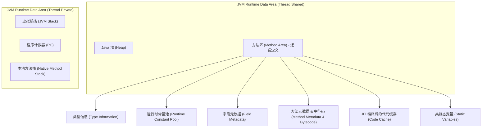
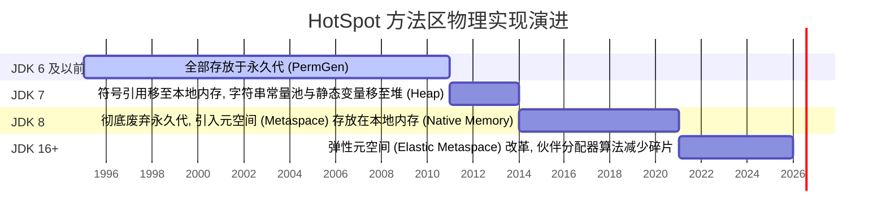
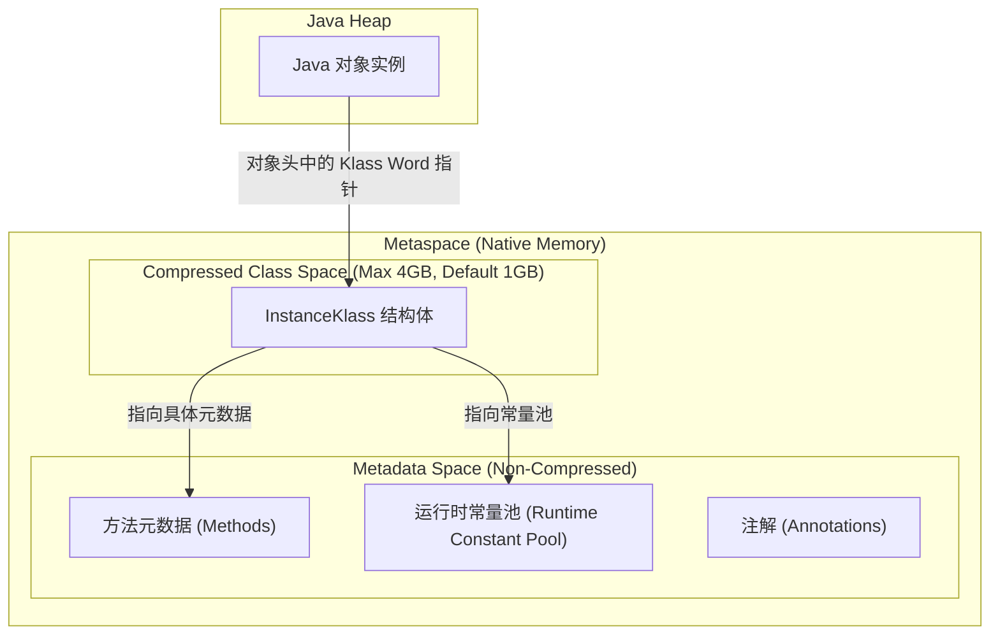
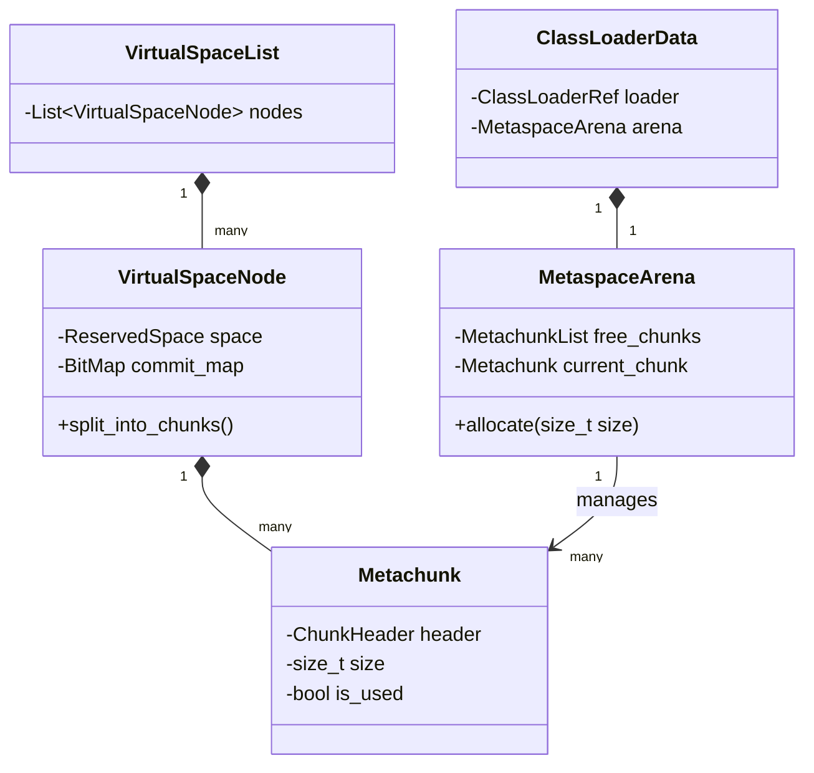
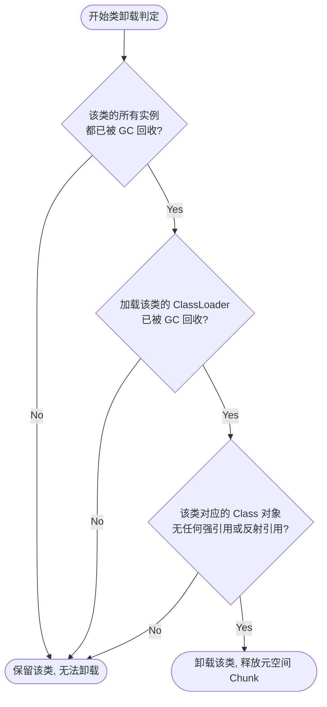
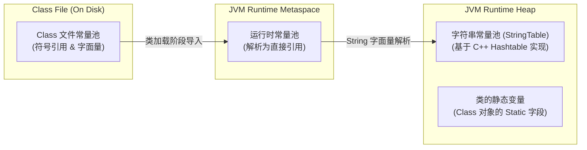
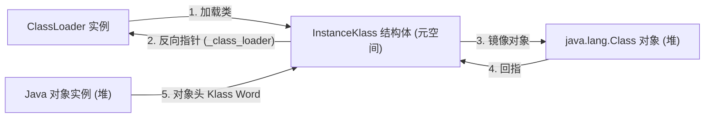
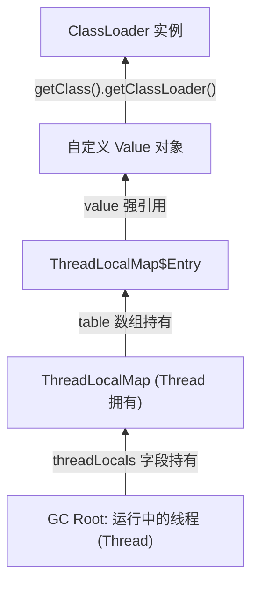
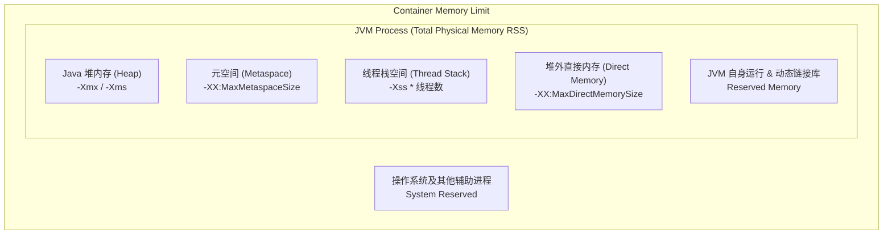

# 2.1.1.5 方法区

方法区（Method Area）是 Java 虚拟机（JVM）运行时数据区中极其核心且复杂的一块逻辑区域。它不仅承载着 JVM 运行所需的全部类型元数据，还直接关系到类的加载、解析、即时编译（JIT）优化以及垃圾回收的底层运转。在 HotSpot JVM 的演进历程中，方法区的实现经历了从“永久代（PermGen）”到“元空间（Metaspace）”的颠覆性重构。这一演进过程不仅改变了内存的物理存储介质，还深刻影响了 JVM 的内存调优与问题排查方法。

本章将对方法区进行深度剖析，从 JVM 规范的逻辑定义出发，追溯其物理实现的演进历史，详解元空间的物理组成与内存管理算法，剖析类卸载与 GC 触发的底层逻辑，对比各类常量池的物理演变，并结合生产环境下的 Metaspace OOM 案例提供系统性的诊断与调优指南。

---

## 1. JVM 规范中的方法区

根据《Java 虚拟机规范》（Java Virtual Machine Specification），方法区是所有 Java 虚拟机线程共享的**逻辑区域**。它在虚拟机启动时创建，其物理内存不需要是连续的，也可以选择不实现垃圾回收。



### 1.1 存储内容深度解剖
当一个类被加载时，类加载器会读取对应的 `.class` 字节码文件，并将其解析为 JVM 内部的数据结构，存放在方法区中。具体包含以下内容：

1. **类型信息（Type Information）**：
   - 类的完整包名与类名（如 `java.lang.Object`）。
   - 类的直接超类（Superclass）的完整有效名称（除非是 `interface` 或 `java.lang.Object`，它们没有超类）。
   - 类的修饰符（`public`、`abstract`、`final` 等）。
   - 类的直接接口（Interfaces）列表。
2. **字段元数据（Field Metadata）**：
   - 字段的修饰符（`public`、`private`、`volatile`、`transient` 等）。
   - 字段的类型（如 `int`、`java.lang.String`）。
   - 字段的名称。
3. **方法元数据与字节码（Method Metadata & Bytecode）**：
   - 方法的修饰符。
   - 方法的返回值类型及参数列表（包括参数顺序与类型）。
   - 方法的字节码（Bytecode）流。
   - 方法的局部变量表（Local Variable Table）和操作数栈（Operand Stack）的大小。
   - 异常表（Exception Table）：记录每个异常处理代码块的开始、结束位置以及捕获的异常类型。
4. **运行时常量池（Runtime Constant Pool）**：
   - 包含编译期生成的各种字面量（Literals）和符号引用（Symbolic References）。在类加载后，这些符号引用会在解析阶段被替换为直接引用（指向内存中的实际物理地址）。
5. **即时编译器编译后的代码缓存（Code Cache）**：
   - 尽管在 HotSpot JVM 内部，Code Cache 在物理上通常有一块独立的内存区域（可通过 `-XX:ReservedCodeCacheSize` 调整），但从 JVM 规范的逻辑视角看，JIT 编译生成的本地机器码（Native Code）缓存同样属于方法区的范畴。

### 1.2 方法区的多线程安全性
方法区是所有线程共享的，因此类加载过程必须是线程安全的。
当多个线程同时尝试加载同一个尚未被加载的类时，JVM 内部会使用锁机制进行同步。在 HotSpot 中，这一机制由 `SystemDictionary`（系统字典）和类加载锁（ClassLoader Lock）共同协作完成。
- **`SystemDictionary`**：JVM 内部维护的一个全局哈希表，Key 是 `ClassLoader + ClassName` 的组合，Value 是指向具体 Klass 对象的指针。
- **并发控制**：在加载类时，JVM 会对类名和类加载器进行加锁。如果一个线程正在加载某个类，其他线程在进入 `SystemDictionary` 查询或写入时必须等待，直到该类加载并解析完毕。这确保了同一个类在方法区中只存在一份物理元数据结构（如 `InstanceKlass`）。

---

## 2. 方法区实现的演进历史：从永久代到元空间

虽然 JVM 规范定义了方法区，但并未规定如何去实现它。不同的虚拟机实现，其方法区的物理结构截然不同。在 HotSpot JVM 的发展史中，方法区的具体实现经历了重大的工程重构。



### 2.1 永久代（Permanent Generation, PermGen）
在 JDK 7 及以前，HotSpot 团队选择将方法区实现为**永久代**。
- **物理本质**：永久代是 **Java 堆内存（Java Heap）的一部分**。在内存空间上，永久代与年轻代（Young Generation）、老年代（Old Generation）是物理连续的虚拟地址空间。
- **内存回收机制**：永久代与老年代共享同一个垃圾回收器。当永久代空间不足时，会触发 Full GC。由于永久代属于堆的一部分，垃圾回收器在进行垃圾标记和清理时，必须把永久代作为一个代际进行扫描。
- **参数控制**：通过 `-XX:PermSize` 设置初始大小，`-XX:MaxPermSize` 设置上限。

### 2.2 元空间（Metaspace）
从 JDK 8 开始，HotSpot 彻底移除了永久代，改为使用**元空间**来实现方法区。
- **物理本质**：元空间**不再使用 Java 堆内存**，而是直接分配在**本地内存（Native Memory）**中。因此，默认情况下，元空间的大小只受限于操作系统的物理内存和虚拟内存大小。
- **内存回收机制**：元空间拥有独立的内存分配器与回收算法，不再与老年代的 GC 强行绑定。只有在元空间使用量达到动态计算的水位线，或者本地内存不足时，才会触发 Full GC。
- **参数控制**：通过 `-XX:MetaspaceSize` 设置初始高水位线，`-XX:MaxMetaspaceSize` 设置上限值。

### 2.3 物理存放位置的演进细节对比

下表直观展示了在不同 JDK 版本中，方法区内各核心数据的物理存放位置演变：

| 数据类型 | JDK 6 及以前 | JDK 7 | JDK 8 及以后 |
| :--- | :--- | :--- | :--- |
| **类的元数据（Class Metadata）** | 永久代（PermGen） | 永久代（PermGen） | **元空间（Metaspace，本地内存）** |
| **运行时常量池（Runtime Constant Pool）** | 永久代（PermGen） | 永久代（PermGen） | **元空间（Metaspace，本地内存）** |
| **字符串常量池（StringTable）** | 永久代（PermGen） | **Java 堆（Java Heap）** | **Java 堆（Java Heap）** |
| **类的静态变量（Class Statics）** | 永久代（PermGen） | **Java 堆（Java Heap，Class对象末尾）** | **Java 堆（Java Heap，Class对象末尾）** |
| **符号引用（Symbols）** | 永久代（PermGen） | **本地内存（Native Memory）** | **本地内存（Native Memory）** |

---

## 3. 从永久代演进到元空间的根本动因

HotSpot 团队之所以大刀阔斧地废弃运行多年的永久代，并重构为元空间，主要是基于以下深层次的工程和架构考量：

### 3.1 动态类加载带来的内存溢出（OOM）顽疾
在传统的企业级 Java 开发中，应用的类数量在编译期几乎是确定的。但在现代 Java 生态中，大量的框架和库严重依赖**动态字节码生成**与**动态类加载**技术。例如：
- **Spring Framework**：使用 CGLIB 动态生成 AOP 代理类。
- **MyBatis / Hibernate**：动态生成持久层接口的实现类。
- **动态反射与运行时编译**：如各类规则引擎、热部署工具、Groovy 脚本动态加载等。

在这些场景下，JVM 在运行期间会持续创建成千上万个全新的类。由于永久代的大小是通过 `-XX:MaxPermSize` 静态指定的，上限非常容易被突破。如果配置得太小，就会频繁抛出 `java.lang.OutOfMemoryError: PermGen space`；如果配置得太大，又会造成物理内存的浪费。
元空间改用本地内存后，默认没有上限，空间可以随类的加载动态扩张，极地形塑了系统应对动态类加载的弹性，避免了因类数量超出预期而导致服务崩溃的现象。

### 3.2 垃圾回收（GC）架构的解耦与性能提升
在永久代时期，方法区是 Java 堆的一部分。这意味着：
- **GC 复杂度极高**：垃圾回收器在进行 G1 或 CMS 并发标记时，必须处理永久代与老年代之间的跨代引用关系。
- **回收效率极低**：类元数据的回收（类卸载）条件极其苛刻（详见第 5 节），通常只有在 Full GC 时才会被回收。而永久代的空间不足又会反过来频繁触发 Full GC，导致整个 Java 应用频繁发生 Stop-The-World（STW），严重降低了系统的吞吐量和响应时间。
- **解耦方法区**：通过将方法区移出 Java 堆，使其独立于堆内存管理，老年代和年轻代的 GC 逻辑得以极大简化。现代垃圾回收器（如 ZGC、Shenandoah）在进行并发标记和并发整理时，无需再考虑永久代复杂的代际屏障与代际指针扫描。

### 3.3 融合 HotSpot 与 JRockit 的战略需要
Oracle 在收购 BEA 和 Sun 公司之后，致力于将优秀的 JRockit JVM 的功能（如 JFR 诊断工具、先进的 JIT 编译器等）移植并融合到 HotSpot JVM 中。
由于 JRockit 内部没有“永久代”的设计（JRockit 的方法区本就是直接分配在本地内存中），为了统一两者的代码基（Code Base），彻底移除 HotSpot 的永久代并采用元空间是实现两大虚拟机融合的核心前提。

### 3.4 动态内存碎片治理与 Elastic Metaspace
尽管元空间在 JDK 8 解决了 PermGen OOM 的问题，但在运行期，频繁的类加载与类加载器（ClassLoader）卸载依然会产生严重的本地内存碎片。
由于早期的元空间分配器是以固定大小的 Chunk（块）分配内存，当某个类加载器卸载后，其释放的内存块很难合并并归还给操作系统，导致 JVM 进程的物理内存占用（RSS）持续膨胀。

为了解决这一问题，JDK 16 引入了 **Elastic Metaspace（弹性元空间）**（JEP 387）。它将内存分配的粒度细化为更小的“页”（Granule，默认 64KB），并引入了伙伴分配器（Buddy Allocator）算法。这使得元空间不仅能更高效地分配内存，还能够在类加载器被卸载后，及时释放空闲的物理页，将其主动 uncommit 并归还给操作系统，从而完美解决了本地内存碎片化和 RSS 虚高的难题。

---

## 4. 元空间（Metaspace）的内存架构与物理组成

元空间的物理架构相比永久代更为复杂。为了在支持 64 位高性能寻址的同时节省内存空间，HotSpot 将元空间划分为了两个物理上独立但逻辑上协同的子空间：**元数据区（Metadata Space）** 与 **压缩类空间（Compressed Class Space）**。



### 4.1 压缩类空间（Compressed Class Space）的底层原理

在 64 位操作系统的 JVM 中，每个 Java 对象在堆内存中的布局包含一个对象头（Object Header）。对象头内有一个关键指针——**Klass Word**（指向该对象所属类的元数据结构 `Klass`）。

1. **指针膨胀问题**：
   在 64 位系统下，原生的指针长度为 8 字节（64位）。如果 JVM 加载了大量对象，每个对象头中的 Klass Word 都会占用 8 字节，这会带来显著的内存开销并降低 CPU 缓存（L1/L2 Cache）的命中率。
2. **压缩指针（UseCompressedClassPointers）**：
   为了优化内存占用，JVM 引入了压缩指针技术。当启用 `-XX:+UseCompressedClassPointers`（默认开启）时，Klass Word 压缩为 4 字节（32位）。
   - **基地址寻址**：32 位指针最大只能寻址 4GB 的内存空间。为了让 32 位的压缩指针能够正确指向内存中的 `Klass` 结构，JVM 必须把所有类的 `InstanceKlass`（即类的核心 C++ 结构体）集中存放在一个连续的、最大不超过 4GB 的虚拟内存空间中。
   - **计算公式**：32 位压缩指针寻址通过以下公式转换为 64 位真实物理地址：
     $$\text{Absolute Address} = \text{Metaspace Base Address} + (\text{Compressed Pointer} \ll \text{LogKlassAlignment})$$
     这个专用的连续虚拟内存区域，就是**压缩类空间（Compressed Class Space）**。
3. **物理分区划分**：
   - **压缩类空间**：仅存放 `Klass` 结构体本身（如 `InstanceKlass`、`InstanceMirrorKlass` 等）。
   - **元数据区（Non-Compressed Class Space）**：存放除 `Klass` 结构体以外的其他所有类元数据，包括方法字节码（`Method`）、方法计数器、常量池、注解、字段信息等。这部分空间是完全不受 4GB 寻址限制的本地内存。
4. **依赖关系**：
   `UseCompressedClassPointers` 依赖于 `UseCompressedOops`（压缩普通对象指针）。如果通过参数关闭了 `-XX:-UseCompressedOops`，那么 `-XX:+UseCompressedClassPointers` 也会自动失效。此时，压缩类空间将不会被创建，所有的类元数据（包括 `InstanceKlass` 结构体）都将统一存放在普通的本地内存元数据区中。
5. **参数限制**：
   压缩类空间的大小由参数 `-XX:CompressedClassSpaceSize` 控制，默认值为 `1G`。这限制了 JVM 能够加载的类的最大数量（通常 1G 空间大约可以容纳 30 万到 50 万个类）。如果该空间被占满，即使物理内存非常充足，JVM 也会抛出 `java.lang.OutOfMemoryError: Compressed class space`。

### 4.2 元空间的内存管理与分配单元（HotSpot 内存管理体系）

为了避免频繁向操作系统申请内存（如通过 `malloc` 系统调用），元空间实现了一套精细的二级内存管理体系。



1. **VirtualSpaceNode 与 VirtualSpaceList**：
   元空间向操作系统申请的内存区域称为 `VirtualSpaceNode`（虚拟空间节点）。这些节点连接起来构成 `VirtualSpaceList`。每个 Node 是一个较大的连续内存区域（通常为几兆到几十兆字节）。
2. **Metachunk（元数据块）**：
   每个 `VirtualSpaceNode` 会被切分成许多大小不一的 `Metachunk`。在 JDK 16 之前，Chunk 分为四种类型：
   - `SpecializedChunk`（1KB - 2KB）：用于加载类很少的类加载器（如反射生成的 DelegateClassLoader）。
   - `SmallChunk`（4KB）：中等规模分配。
   - `MediumChunk`（64KB）：常规类加载器分配。
   - `HumongousChunk`（大于 Medium）：用于加载超大型类元数据。
3. **ClassLoaderData 与 MetaspaceArena**：
   - 每个类加载器（ClassLoader）在 JVM 内部都关联着一个 `ClassLoaderData` 结构，里面绑定了一个 `MetaspaceArena`（元空间沙箱）。
   - 当类加载器需要为加载的类分配内存时，`MetaspaceArena` 会从全局的 Chunk 管理器中申请一个 `Metachunk`。
   - 该类加载器加载的**所有类**的元数据，都会被紧凑地分配在这个 `Metachunk` 中。如果当前 Chunk 被填满，Arena 会再申请一个新的 Chunk。
4. **生命周期绑定与一次性释放机制**：
   - 这种设计带来了巨大的性能优势：**类元数据的生命周期与类加载器完全绑定**。
   - 属于同一个类加载器的所有 Chunk 无需进行细粒度的内存整理。当该类加载器被垃圾回收时，其关联的整个 `MetaspaceArena` 拥有的所有 `Metachunk` 会被**一次性全部释放**。
   - 释放后的 Chunk 会被归还给全局的 `ChunkManager`（块管理器），用于后续其他类加载器的分配，或者退还给操作系统。

---

## 5. 元空间垃圾回收（GC）机制深度剖析

元空间本身**没有**像堆内存那样的新生代、老年代的分代概念。它的垃圾回收（尤其是类元数据的清理）是一种**全有或全无**的机制，且与类卸载（Class Unloading）紧密相连。

### 5.1 类卸载（Class Unloading）的三个硬性条件
一个类在元空间中占用的内存如果想要被垃圾回收器回收，该类必须被“卸载”。要卸载一个类，必须**同时满足**以下三个极为苛刻的条件：



1. **条件一：该类所有的实例对象都已被回收**：
   在 Java 堆中，已经不存在该类及其任何子类的实例对象。
2. **条件二：加载该类的类加载器（ClassLoader）已被回收**：
   这是最难达到的条件。因为：
   - 启动类加载器（Bootstrap ClassLoader）、扩展/平台类加载器（Extension/Platform ClassLoader）和系统应用类加载器（Application ClassLoader）在 JVM 运行期间是永远强引用可达的，这意味着它们加载的类（如 JDK 核心类库、应用程序主类）**永远不会被卸载**。
   - 只有自定义的类加载器（如 Web 容器为每个 Web 应用创建的 ClassLoader，或 OSGi 框架为每个 Bundle 创建的 ClassLoader）在生命周期结束、完全切断引用链后才可能被 GC 回收。
3. **条件三：该类的 `java.lang.Class` 对象没有任何地方被强引用**：
   Class 对象不能被任何静态变量、局部变量、ThreadLocal 或者 JVM 内部的反射缓存（Reflective Caches）所引用。

只有当上述三个条件同时满足时，在下一次 Full GC 过程中，类加载器才会被宣告死亡，其在元空间中占用的所有 `Metachunk` 才会整体被宣告释放，重新回到空闲链表或退还给操作系统。

### 5.2 水位线控制与 GC 触发阈值

元空间不会像年轻代那样在占满后自动触发 Minor GC。它的 GC 主要是通过**水位线控制机制**触发的。

1. **`-XX:MetaspaceSize`（高水位线，High Water Mark）**：
   - 这是元空间触发第一次 Full GC 的初始阈值，默认值根据操作系统平台的不同，通常在 `12MB` 到 `22MB` 之间。
   - 当元空间已提交（Committed）的内存大小达到 `-XX:MetaspaceSize` 时，JVM 就会触发一次 **Full GC**，以尝试回收不再使用的类加载器并进行类卸载。
2. **高水位线的动态调整算法**：
   GC 结束后，JVM 会根据释放的元空间大小，动态调整高水位线的值：
   - **如果释放的空间非常少**：说明当前加载的类很多都是活跃的，现有的水位线偏低。JVM 会**调高**高水位线，使其更接近 `-XX:MaxMetaspaceSize`，以减少频繁触发 Full GC。
   - **如果释放的空间非常多**：说明有很多无用的类被清理了，JVM 可能会**调低**高水位线，以节约物理内存。
3. **`-XX:MinMetaspaceFreeRatio`（默认 40%）**：
   GC 后，如果空闲的元空间容量占总共分配的元空间容量的比例低于此值（即剩余可用空间不足 40%），JVM 就会尝试提高高水位线，防止下一次快速占满再次触发 GC。
4. **`-XX:MaxMetaspaceFreeRatio`（默认 70%）**：
   GC 后，如果空闲的元空间容量占比高于此值（即空闲空间多于 70%），说明元空间分配过大，JVM 就会尝试降低高水位线，以释放虚拟内存。
5. **`-XX:MaxMetaspaceSize`（最大限制）**：
   元空间物理上限。如果设置了该值，且元空间扩容达到该上限仍无法通过 Full GC 释放出足够的空间，JVM 就会抛出 `OutOfMemoryError: Metaspace`。

> [!WARNING]
> **初启 Full GC 震荡风险**
> 由于 `-XX:MetaspaceSize` 的默认值很低（约 20MB），而现代微服务应用启动时加载的类通常多达数万个，元空间需求通常在 100MB 到 200MB 以上。
> 如果不手动调大 `-XX:MetaspaceSize`，应用在启动过程中就会**连续触发数次 Full GC**。这不仅会严重拉长应用的启动时间，还会造成启动阶段 CPU 使用率瞬间飙高。

---

## 6. 常量池全家族对比与物理演进

在 Java 体系中，“常量池”是一个极易混淆的概念。通常涉及到三个不同的常量池：**Class 文件常量池**、**运行时常量池**和**字符串常量池**。它们的物理存放位置在 JDK 的演进中发生了巨大的变化。



### 6.1 常量池的核心概念与区别

#### 6.1.1 Class 文件常量池（Class Constant Pool）
- **定义**：存在于编译期生成的 `.class` 字节码文件中。
- **内容**：主要存放编译期生成的各种**字面量（Literals）**和**符号引用（Symbolic References）**。
  - **字面量**：文本字符串、声明为 `final` 的常量值、基本数据类型的值。
  - **符号引用**：类和接口的全限定名、字段的名称 and 描述符、方法的名称和描述符。
- **性质**：属于静态的磁盘文件数据，在类被加载前不占用 JVM 运行时的内存。

#### 6.1.2 运行时常量池（Runtime Constant Pool）
- **定义**：是 JVM 在**类加载阶段**将 Class 文件常量池中的符号信息载入内存后，在方法区中为每个类构建的动态数据结构。
- **特性**：
  - **每个类私有**：每个已加载的类或接口都有自己独立的运行时常量池。
  - **动态性**：Java 语言并不要求常量一定只有编译期才能产生，运行期间也可以将新的常量放入池中。
  - **符号解析**：在类加载的“解析（Resolution）”阶段，JVM 会将运行时常量池中的符号引用（如某个方法的描述符字符串）替换为物理内存中的直接引用（指向具体内存地址的指针或偏移量）。

#### 6.1.3 字符串常量池（String Constant Pool / StringTable）
- **定义**：JVM 全局唯一的、用于缓存字符串实例以避免重复创建对象的哈希表（在 HotSpot C++ 源码中为 `StringTable`）。
- **底层实现**：本质上是一个基于 C++ 实现的哈希表（Hashtable），使用拉链法解决哈希冲突。其 Bucket 数量在不同版本有不同默认值，可通过 `-XX:StringTableSize` 进行配置。
- **存储内容**：在 JDK 7 及以后，字符串常量池里存放的**不是**字符串对象的字符数组，而是**指向堆中 String 对象的引用**。String 对象及其底层的 `char[]` / `byte[]` 数组全部存放在 Java 堆内存中。

### 6.2 物理存储位置演进背后的设计意图

从 JDK 6 到 JDK 8，字符串常量池与静态变量被从永久代移出，放入了 Java 堆，而运行时常量池则跟随类元数据移入了本地内存的元空间。这一物理位置的调整有着极其严密的架构考量：

1. **为什么将字符串常量池和静态变量移到堆？**
   - **生命周期特性的本质差异**：
     - **类元数据与运行时常量池**：它们的生命周期非常长，几乎与类加载器（ClassLoader）同生死。这类数据非常适合放在相对静态的元空间中，随 ClassLoader 整体卸载而回收。
     - **字符串常量**：在实际业务运行中，由于字符串拼接、JSON 解析、数据库查询等操作，会产生海量的、生命周期极短的临时字符串。如果把它们放在元空间中，而元空间只有在 Full GC 时才会被清理，这会导致大量死字符串长期占用本地内存，极易导致内存泄漏。将其移到堆中，可以使它们在常规的 **Minor GC** 阶段就被快速、高效地回收。
     - **静态变量**：静态变量所引用的对象实例是存放在 Java 堆中的。如果静态变量（即引用源）存放在永久代中，那么垃圾回收器在扫描 GC Roots 时，必须频繁地在永久代和堆内存之间进行跨代引用追踪。将静态变量直接挂载在堆中的 `java.lang.Class` 实例末尾，可以让所有的对象引用关系都保持在堆内部，极大简化了 GC 追踪路径与卡表（Card Table）的维护开销。

2. **为什么运行时常量池留在元空间？**
   - 运行时常量池中包含的是类结构信息的符号表示（如类名、方法签名符号引用等）。这些信息是类结构体的有机组成部分。既然类元数据（`InstanceKlass`）整体移入了本地内存的元空间，那么作为其子属性的运行时常量池自然应当留在元空间，以保持类数据结构的完整性。

### 6.3 字符串常量池与 `String.intern()` 底层机制变化

`String.intern()` 是一个 native 方法。当调用该方法时，JVM 会在字符串常量池中寻找是否存在等值的字符串：
- **在 JDK 6 及以前**：
  如果字符串常量池中没有该字符串，`intern()` 方法会**在永久代中拷贝一份该字符串的实例**，并返回永久代中这个拷贝的引用。
- **在 JDK 7 及以后**：
  由于字符串常量池已经移到了堆中，为了节省内存，如果常量池中没有该字符串，`intern()` **不会再在堆中拷贝一份对象**，而是直接**在常量池中记录当前堆中该字符串对象的引用**，并返回该引用。

---

## 7. 元空间内存溢出（OOM）根源分析与排查实战

当元空间（或压缩类空间）内存耗尽且无法通过垃圾回收释放出空间时，JVM 就会抛出 `OutOfMemoryError`。

### 7.1 两种不同的元空间 OOM 报错

在实际排查中，首先要通过异常信息区分是哪个子空间溢出：

1. **`java.lang.OutOfMemoryError: Metaspace`**：
   - **本质**：元空间的**元数据区（Metadata Space）**被占满。
   - **主因**：加载的类过多，或者存在大面积的类加载器泄露（ClassLoader Leak），导致大量的类无法被卸载，超出了 `-XX:MaxMetaspaceSize` 的限制（或将系统物理内存耗尽）。
2. **`java.lang.OutOfMemoryError: Compressed class space`**：
   - **本质**：**压缩类空间（Compressed Class Space）**被占满。
   - **主因**：加载的类数量极多，使得 `InstanceKlass` 结构体数量超出了默认 1G 空间的承载上限。即使此时操作系统的物理内存还非常宽裕，只要压缩类空间满，就会抛出此异常。

### 7.2 典型 OOM 场景与成因剖析

#### 7.2.1 动态字节码与动态代理类的未复用泄露
在使用 CGLib 动态代理、ByteBuddy、Javassist 或 JDK 动态代理时，很多开发者或第三方框架在编写代码时，每次调用都会生成一个新的代理类：
```java
// 错误示例：每次方法调用都创建一个新的 Enhancer，导致无限生成新的代理类
public Object getProxy(Class<?> clazz) {
    Enhancer enhancer = new Enhancer();
    enhancer.setSuperclass(clazz);
    enhancer.setCallback(new MyMethodInterceptor());
    return enhancer.create(); // 每次调用都会在运行时产生一个全新的 Class 并载入元空间
}
```
由于这些动态类没有被缓存复用，且每次生成时都可能使用独立的类加载器，导致元空间中的类数量呈线性增长，最终崩溃。

#### 7.2.2 类加载器泄露（ClassLoader Leak）
在 Java 中，类加载器与它所加载的类之间存在相互引用的强指针关系：



- **泄露根源**：只要堆内存中存在该类加载器加载的**任意一个类实例**的引用，或者该类的 `java.lang.Class` 对象被强引用持有，整个 `ClassLoader` 实例就无法被 GC 回收。
- **后果**：类加载器无法回收，意味着它在元空间占用的所有 `Metachunk` 块都处于“活跃”状态，无法被标记为 Free，从而导致元空间发生实质性内存泄露。
- **典型诱因**：
  - 将类实例或 Class 对象放入了全局的静态集合（`static Map`）中未及时清理。
  - 使用 `ThreadLocal` 存储了由自定义类加载器加载的对象，且线程未销毁、`ThreadLocal` 未调用 `remove()`。
  - 注册了第三方驱动（如 JDBC 驱动、日志框架 Appender）但在应用卸载时未进行显式注销。

### 7.3 排查实战步骤与诊断工具

当生产环境出现元空间 OOM 或 Metaspace 内存持续上涨时，可按照以下步骤进行系统化排查：

#### 7.3.1 第一步：使用 `jstat` 动态监控元空间变化
通过 `jstat` 命令，以 1 秒为间隔监控元空间和压缩类空间的提交与使用情况：
```bash
jstat -gc <pid> 1000
```
**关键输出指标含义**：
- `MC`：当前元空间已提交（Committed）的大小（KB）。
- `MU`：当前元空间已使用（Used）的大小（KB）。
- `CCSC`：当前压缩类空间已提交的大小（KB）。
- `CCSU`：当前压缩类空间已使用的大小（KB）。
- `FGC`：Full GC 的次数。如果发现 `MU` 接近 `MC`，且 `FGC` 伴随着 `MC` 的增长频繁增加，说明元空间正在发生内存不足或泄露。

#### 7.3.2 第二步：使用 `jcmd` 分析元空间详细统计信息
`jcmd` 是目前排查元空间最强大的原生工具，能输出极具诊断价值的数据：
```bash
jcmd <pid> VM.metaspace
```
**重点关注输出中的以下部分**：
- **Waste（浪费空间）**：如果 Waste 占比极高（例如超过 30%），在 JDK 16 之前说明存在严重的内存碎片化问题。
- **Virtual space map**：展示当前申请了多少个 `VirtualSpaceNode`。
- **ClassLoader statistics**：列出每个类加载器加载的类数量和占用的元空间大小，能瞬间帮我们找出是哪个自定义类加载器加载了异常庞大的类集合。

#### 7.3.3 第三步：使用 `jmap` 列出类加载器信息
```bash
jmap -clstats <pid>
```
此命令会列出当前 JVM 中所有存活的类加载器的类加载信息。如果发现某种自定义类加载器（如 `org.springframework.boot.loader.LaunchedURLClassLoader`）的实例数量异常多，通常就是类加载器泄露的明确信号。

#### 7.3.4 第四步：开启 JVM 统一日志进行实时监控
如果问题在测试环境可以复现，可以在 JVM 启动参数中加入以下日志配置，实时观察类的加载与卸载行为：
```bash
-Xlog:class+load=info:file=/tmp/class_load.log:time,uptime
-Xlog:class+unload=info:file=/tmp/class_unload.log:time,uptime
```
运行一段时间后，对比两个文件：如果 `class_load.log` 中记录了大量的动态类加载，而 `class_unload.log` 中几乎没有任何类被卸载，说明动态生成的类由于类加载器泄露而全部滞留在内存中。

#### 7.3.5 第五步：堆内存转储与 MAT 深度诊断
当确定有类加载器泄露后，必须通过分析堆转储（Heap Dump）来锁定强引用链：
1. **生成 Dump 文件**：
   ```bash
   jmap -dump:format=b,file=heap.hprof <pid>
   ```
2. **导入 MAT (Eclipse Memory Analyzer)**：
   - **查找重复类（Duplicate Classes）**：
     在 MAT 中打开 `Duplicate Classes` 查询。如果看到大量同名类被不同的类加载器实例加载，说明类加载器没有被复用，存在多版本类共存的泄露。
   - **分析 ClassLoader 引用链**：
     在 MAT 的 `ClassLoader Explorer` 中找到那个异常增多的 ClassLoader 实例。右键选择 `Path To GC Roots` -> `exclude all phantom/weak/soft references`。



如上图所示，当一个运行中的线程（GC Root）通过 `ThreadLocalMap` 强引用了一个自定义 Value 对象，而该 Value 对象的类是由某个自定义 ClassLoader 加载的，这就会导致该 ClassLoader 无法被 GC 回收，元空间内存泄露随之发生。我们通过 MAT 追踪到这条强引用链后，只需在业务代码中适时调用 `ThreadLocal.remove()`，或者断开对应的静态变量强引用，即可彻底解决此泄露。

---

## 8. 元空间调优参数配置与最佳实践

在生产环境（尤其是容器化部署）中，合理的元空间参数配置是保证 JVM 稳定运行的重要基石。

### 8.1 核心调优参数详解与推荐配置

#### 8.1.1 `-XX:MetaspaceSize`（初始高水位线）
- **默认值**：约 12MB - 22MB。
- **问题**：过小的默认值会导致应用启动时发生频繁的 Full GC 震荡。
- **推荐配置**：生产环境建议将其直接设置为一个合理的初始大值（如 `128M`、`256M` 或 `512M`），通常可以**将其设置与最大值一致**，以彻底消除应用启动时的 Full GC 抖动。

#### 8.1.2 `-XX:MaxMetaspaceSize`（最大物理限制）
- **默认值**：无限制（-1）。
- **问题**：如果在大规模微服务集群中不设置上限，一旦某个服务发生类加载器泄露，元空间会无限制地蚕食宿主机或物理节点的本地内存，最终导致整机崩溃或被宿主机 OOM-killer 杀死。
- **推荐配置**：对于大多数常规微服务应用，建议设置为 `256M` 到 `512M`。若有动态脚本编译等重度类加载场景，可设为 `1G`。

#### 8.1.3 `-XX:CompressedClassSpaceSize`（压缩类空间大小）
- **默认值**：`1G`。
- **推荐配置**：若无特殊的大规模类加载需求，保持默认值即可。若限制了 `MaxMetaspaceSize` 小于 1G（例如设为 512M），JVM 会自动收缩压缩类空间的大小以作适配。

#### 8.1.4 典型参数配置范例：
```bash
-XX:MetaspaceSize=256m \
-XX:MaxMetaspaceSize=256m \
-XX:+UseCompressedClassPointers \
-XX:CompressedClassSpaceSize=128m
```

### 8.2 容器化（Docker / K8s）环境下的内存规划

在 Docker/K8s 容器环境部署 Java 应用时，容器的内存限制（Memory Limit）是针对容器内所有进程的物理内存占用（RSS）之和。
如果仅通过 `-Xmx` 限制了 JVM 的堆大小，而忽视了元空间等堆外内存，极易导致容器被 K8s 强行 Kill（退出码 137，OOMKilled）。



在规划容器内存 Limit 时，必须遵循以下严密的数学公式，为包括元空间在内的堆外内存预留出足够空间：

$$\text{Container Memory Limit} \ge \text{Heap Size (Xmx)} + \text{MaxMetaspaceSize} + (\text{Thread Stack Size (Xss)} \times \text{Thread Count}) + \text{MaxDirectMemorySize} + \text{OS \& JVM Overhead}$$

例如，若一个 Java 服务的参数配置如下：
- `-Xmx2g -Xms2g`
- `-XX:MaxMetaspaceSize=256m`
- `-Xss1m`（线程数约 200 个，栈空间需 200MB）
- `-XX:MaxDirectMemorySize=256m`
- 预留 JVM 自身运行及系统开销约 300MB。

则该服务的容器 Memory Limit 至少应配置为：
$$2\text{GB} + 256\text{MB} + 200\text{MB} + 256\text{MB} + 300\text{MB} \approx 3.0\text{GB}$$
如果将容器 Limit 错误地设置为了 `2.5GB`，当服务在高峰期线程数增加、或元空间打满扩容时，容器就会面临被操作系统 OOM-killer 直接杀死的巨大风险。

---

## 9. 总结

方法区从“堆内永久代”向“堆外元空间”的物理演进，是 HotSpot JVM 历史上一次极其成功的技术重构。它将复杂的类元数据、运行时常量池解耦于 Java 堆，移入了弹性的本地内存中，大幅简化了垃圾回收器的架构设计，减轻了开发者调试 `PermGen OOM` 的心智负担。

然而，元空间的本地化并不意味着可以对其放任不管。在复杂的微服务与动态字节码应用场景下，理解元空间的内部构造（如压缩类空间）、掌握类卸载的判定条件、合理配置 `-XX:MetaspaceSize` 与 `-XX:MaxMetaspaceSize`，并在容器化环境下做好细致的堆外内存规划，依然是保障高并发 Java 应用稳定高效运行的必修课。
