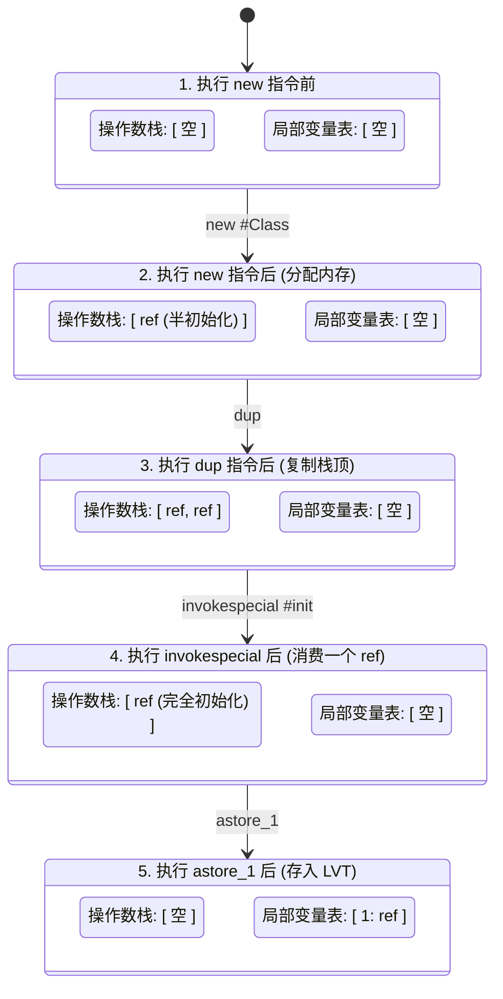
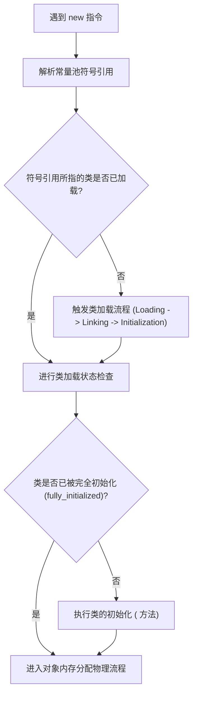
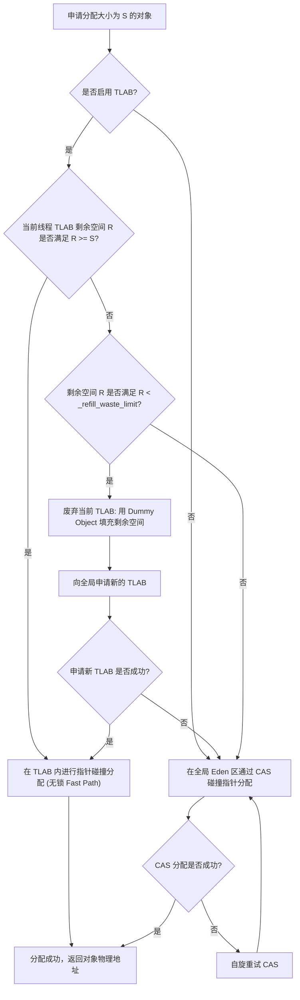
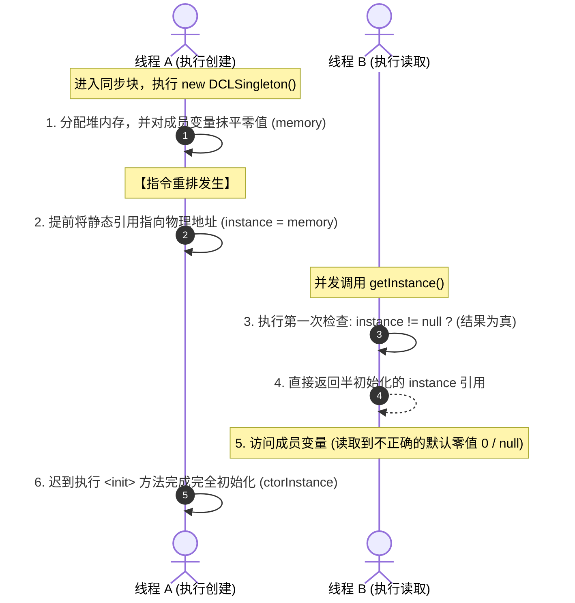

# 深入剖析 HotSpot 虚拟机对象创建物理机制

在 Java 语言中，创建一个对象通常只需要一个简单的 `new` 关键字。然而在 JVM（Java Virtual Machine）底层，对象的创建是一个极其复杂的物理协作过程。这一过程跨越了**前端编译器（javac）的字节码重构、类加载器的元数据解析、堆内存的物理划分与寻址算法、多核 CPU 级别的并发同步原语、HotSpot C++ 解释器的分配路径选择，以及对象实例在内存中的二进制对齐与初始化**。

本文将以 **OpenJDK HotSpot VM** 为核心，自上而下地深入剖析 Java 对象从无到有的完整物理生命周期与底层细节。

---

## 1. 字节码视角下的对象创建（`new` 关键字的三部曲解构）

从 Java 源码来看，`MyObject obj = new MyObject();` 是一行紧凑的声明。但在编译后的 Class 字节码中，该操作被解构为了一个经典的“三部曲”：`new`、`dup` 和 `invokespecial`。

### 1.1 `new` 字节码指令的物理语义与底层运作
`new` 指令的物理格式为 `new #index`，其中 `#index` 是指向 Class 文件运行时常量池（Runtime Constant Pool）的一个类型符号引用（Symbolic Reference）。

当虚拟机执行 `new` 指令时，其底层物理动作如下：
1. **常量池寻址**：根据指令携带的偏移量，定位到常量池中的 `CONSTANT_Class_info` 项，获取类的全限定名。
2. **实例空间计算**：JVM 根据该类的类元信息（包含字段数量、字段类型、对齐填充等），在编译期就已精确算出了该类单个实例所需的物理内存大小（以字节为单位）。
3. **物理内存分配**：在 Java 堆（Heap）中划出一块对应大小的内存。此时，这块内存处于**“半初始化状态”**（Semi-initialized Object）——虽然它已经有了物理内存地址，但除了虚拟机自身初始化的基础结构外，其上的 Java 成员变量全为默认零值，也还没调用过任何 Java 语言层面的构造函数。
4. **引用压栈**：将新分配的半初始化对象的物理引用（Reference）压入当前线程方法栈帧的操作数栈（Operand Stack）顶。

### 1.2 `dup` 字节码指令的引入原因与设计意图
在 `new` 指令之后，编译器必然会紧跟一条 `dup` 指令。`dup` 的作用是复制操作数栈顶的值，并将复制后的值重新压入操作数栈顶。此时，操作数栈顶会有两个指向同一个半初始化对象的引用。

为什么必须引入 `dup` 指令？这与 JVM 的“栈基架构”以及方法调用的参数消费机制密切相关。

在 JVM 规范中，非静态方法（包括实例构造器 `<init>`）在被调用时，必须将方法的接收者（Receiver，即 `this` 指令目标）作为隐式的第 0 个参数传给被调用方法的局部变量表（Local Variable Table）。
1. **如果没有 `dup` 指令**：
   - 执行完 `new` 后，操作数栈顶仅有一个对象引用：`[ref]`。
   - 接下来执行 `invokespecial` 调用构造器。该指令会弹出栈顶的 `ref` 作为 `this` 参数传给构造器，并开始执行 `<init>`。
   - 构造器执行完毕并弹栈返回后，当前方法的操作数栈变为空：`[]`。
   - 此时，如果我们想执行 `astore_1`（将创建好的对象引用赋值给局部变量表的 1 号槽位），会发现栈顶空无一物，无法完成赋值。
2. **引入 `dup` 指令后**：
   - 执行完 `new`，栈顶为：`[ref]`。
   - 执行 `dup`，复制栈顶，栈顶变为：`[ref, ref]`。
   - 执行 `invokespecial`，弹出栈顶的第一个 `ref` 并消耗掉它（作为 `this` 参数进入 `<init>` 构造器内部执行）。此时栈顶状态变为：`[ref]`。注意，此时留下的 `ref` 所指向的物理地址已经经历过了构造器的洗礼，成为了一个“完全初始化”的对象。
   - 执行 `astore_1`，弹出栈顶剩下的那个 `ref`，存入局部变量表的 1 号槽位。栈顶恢复为空。

### 1.3 `invokespecial` 字节码指令的机制与定位
`invokespecial` 是用于调用特殊实例方法的字节码指令。它在编译期就完成了方法接收者和方法描述符的确定，属于**静态绑定（Static Binding）**。

在对象创建的语境下，`invokespecial` 专门用于调用实例初始化方法 `<init>`。
- **与 `<clinit>` 的本质区别**：`<clinit>` 是类构造器（Class Initializer），在类加载的“初始化（Initialization）”阶段被虚拟机自动调用，用于初始化类变量（静态变量）和静态代码块；而 `<init>` 是实例初始化方法（Instance Initializer），在对象创建时被显式调用，用于初始化实例变量和构造函数。
- **解析流程**：`invokespecial` 接收常量池中的方法符号引用（指向 `<init>` 描述符）。JVM 会解析该符号引用，定位到目标类及其父类的具体方法实现，直接调用，不进行运行期的多态动态分派。

### 1.4 `new-dup-invokespecial` 操作数栈与局部变量表的物理变化流程

下面以 Mermaid 状态图直观展示在创建对象并赋值给局部变量的完整过程中，栈帧中操作数栈与局部变量表（Local Variable Table, LVT）的物理演变：



---

## 2. 虚拟机内部的类加载检查流程

当 HotSpot 虚拟机的执行引擎（解释器或 JIT 编译出的机器码）遇到 `new` 指令时，并不能直接开始分配内存，它首先需要确保目标类已经被虚拟机正确装载。



### 2.1 符号引用的验证与解析
`new` 指令背后的操作数 `#index` 是一个常量池索引。如果该索引对应的类尚未被解析，JVM 将触发解析过程：
1. **常量池检查**：虚拟机检查该索引指向的常量池类型是否为 `JVM_CONSTANT_Class`。如果是一个未解析的类（`unresolved class`），则必须动态解析。
2. **直接引用转化**：通过类加载机制，将 Class 文件中的类名字符串符号引用（如 `Ljava/lang/Object;`）转换为指向 JVM 方法区（元空间 Metaspace）内 `InstanceKlass` 结构体的直接内存指针。
3. **访问权限验证**：在解析阶段，JVM 还会验证发起创建动作的类是否有权访问目标类（例如检查 `public`、包私有访问控制修饰符）。如果无权访问，则抛出 `IllegalAccessError`。

### 2.2 类加载状态检查与动态装载
虚拟机定位到类元数据后，会检查该类的初始化状态（Initialization State）：
- 在 HotSpot 中，`InstanceKlass` 内维护着一个表示类加载状态的成员变量 `_init_state`。其状态包括：`allocated`（已分配，但尚未链接）、`loaded`（已加载）、`linked`（已链接）、`being_initialized`（正在初始化）、`fully_initialized`（已完全初始化）等。
- 如果检查发现 `_init_state` 未达到 `fully_initialized`，则说明当前类还未完成加载或初始化。此时，虚拟机必须暂停当前的对象分配，触发完整的类加载与初始化流程（通过双亲委派机制加载类文件、验证字节码、准备类变量并赋零值、解析符号引用，最终执行静态构造器 `<clinit>` 方法）。

### 2.3 类元信息在元空间的物理布局
类加载完成后，类的所有元信息（Method 结构体、ConstantPool 结构体、Field 结构体等）都会存储在本地内存（Native Memory）的**元空间（Metaspace）**中。
在堆中，虚拟机会为每个类生成一个唯一的 `java.lang.Class` 实例，作为 Java 程序访问类元数据的入口。但实际上，JVM 内部进行方法分派、类型检查和对象大小计算时，都是直接读取元空间中的 `InstanceKlass` C++ 对象。

---

## 3. 对象内存分配物理算法

当类加载检查通过后，虚拟机需要为新生对象在 Java 堆中分配一块确定大小的内存空间。内存分配的物理方式主要取决于 **Java 堆内存是否规整**，而 Java 堆是否规整又直接取决于 **所使用的垃圾回收器（Garbage Collector）是否具备内存压缩整理能力**。

### 3.1 指针碰撞（Bump the Pointer）算法
#### 3.1.1 算法前提
Java 堆中的内存是**绝对规整**的。也就是说，所有用过的内存都放在一边，空闲的内存放在另一边，中间放置着一个物理指针（Allocation Pointer，通常简称为 `top`）作为分界点。

```
+------------------------------------+------------------------------------+
|          已分配对象区域             |             空闲内存区域            |
+------------------------------------+------------------------------------+
                                     ^
                                 AllocPointer
```

#### 3.1.2 物理工作机制
当需要分配一个大小为 `size` 的对象时，分配器只需要把 `AllocPointer` 向空闲空间方向移动一段与对象大小相等的距离即可：
$$\text{AllocPointer}_{\text{new}} = \text{AllocPointer}_{\text{old}} + \text{size}$$
返回 `AllocPointer_{\text{old}}` 作为新对象的起始物理地址。该算法的时间复杂度为常数阶 $O(1)$，效率极高。

#### 3.1.3 适用垃圾回收器
该算法要求垃圾回收器必须有**压缩（Compact）**或**复制（Copying）**的行为，以确保垃圾回收后空闲空间是连续且规整的。
- **Serial / ParNew**：新生代收集器，采用复制算法。回收后 Eden 区和 From 空间会被完全清空，剩余存活对象被整齐复制到 To 空间。
- **Parallel Scavenge**：同样基于复制算法，保持新生代内存规整。
- **Parallel Old / Serial Old**：老年代收集器，采用标记-整理（Mark-Compact）算法。通过将存活对象向内存一端滑动，清理出整块连续的空闲空间。
- **G1 (Garbage-First)**：虽然堆被划分为离散的 Region，但在每一个单独的 Region 内部，新对象的分配也是通过 Region 级别的指针碰撞来实现的。

### 3.2 空闲列表（Free List）算法
#### 3.2.1 算法前提
Java 堆中的内存是**不规整**的。已使用的内存和未使用的内存相互交错，无法通过一个简单的分界指针来完成分配。

```
+--------+--------+--------+--------+--------+--------+--------+--------+
|  已用  |  空闲  |  已用  |  空闲  |  已用  |  空闲  |  已用  |  空闲  |
+--------+--------+--------+--------+--------+--------+--------+--------+
```

#### 3.2.2 物理工作机制
虚拟机必须在内部维护一个空闲内存块的数据结构（通常是链表或更复杂的跳表/红黑树）。每次分配对象时，分配器需要检索该列表，找到一块大小足够容纳新对象的空闲块，将对象放入该块，并更新列表上的记录。

#### 3.2.3 物理分配策略
- **首次适应（First Fit）**：从空闲列表头部开始遍历，找到第一个大小大于或等于请求大小 `size` 的空闲块。将其切分，一部分分配给对象，剩下的放回列表。该策略分配速度快，但容易在列表头部留下大量难以利用的微小碎片。
- **最佳适应（Best Fit）**：遍历整个空闲列表，寻找大小最接近 `size` 且大于 `size` 的空闲块进行切分。这能最大限度保留大块内存，但搜索开销大，且极易产生极小的空间碎片。
- **最差适应（Worst Fit）**：找到当前最大的空闲块进行切分。这样切剩的部分依然很大，可以继续使用，但它会迅速消耗堆中大连续空间，导致后续大对象无法分配。

#### 3.2.4 适用垃圾回收器
- **CMS (Concurrent Mark Sweep)**：老年代收集器，采用标记-清除（Mark-Sweep）算法。它在垃圾回收时不移动存活对象，因此老年代会产生大量内存碎片，分配对象时必须依赖空闲列表进行检索。当碎片化严重到无法分配大对象时，会触发 Full GC 退化到 Serial Old 进行垃圾整理。

---

## 4. 内存分配的并发安全保障机制

在多线程环境下，Java 堆是所有线程共享的资源。当多个线程同时尝试在 Eden 区申请分配内存时，如果只是简单地更新指针或空闲列表，就会发生**竞态条件（Race Condition）**，导致两个线程分配到同一块物理内存。

为了在保证高吞吐量的同时确保内存分配的线程安全性，HotSpot 虚拟机采用了 **CAS + 失败重试** 与 **TLAB（Thread Local Allocation Buffer）** 结合的双层防御机制。

### 4.1 CAS + 失败重试（乐观锁自旋）
当 TLAB 无法分配或被关闭时，虚拟机必须在全局 Eden 堆空间进行分配。

#### 4.1.1 物理实现机制
JVM 采用 CAS（Compare-And-Swap）操作来保证更新分配指针的原子性。
以 x86 架构为例，其底层的 C++ 代码最终会翻译为带 `lock` 前缀的汇编指令：
```assembly
lock cmpxchg [destination], source
```
- `lock` 前缀在多核处理器上会激活**缓存锁（Cache Locking）**。根据 **MESI 缓存一致性协议**，尝试修改分配指针的 CPU 核心会获取包含该指针缓存行（Cache Line）的独占状态（Exclusive/Modified），并强制其他 CPU 内核中对应的缓存行失效（Invalid）。
- 如果另一个线程在同一时刻也尝试更新该指针，它的 CAS 操作将会失败。

#### 4.1.2 失败重试逻辑
失败的线程不会挂起，而是进入自旋循环（Optimistic Loop），重新读取当前的最新的 `AllocPointer` 物理地址，重新计算偏移，并再次尝试执行 CAS，直到成功。

#### 4.1.3 性能缺陷
在高并发场景下，成百上千个线程同时对全局唯一的 `AllocPointer` 进行 CAS 竞争，会导致严重的**“总线风暴（Bus Storm）”**与 CPU 缓存行频繁失效（Cache Thrashing）。这使得大部分 CPU 时间片都浪费在了硬件级别的同步上，严重拉低了系统的并发吞吐量。

### 4.2 TLAB（线程本地分配缓冲区）的核心物理机制
为了彻底解决全局 CAS 竞争的瓶颈，JVM 引入了 TLAB 机制。

#### 4.2.1 什么是 TLAB？
TLAB 是 JVM 在 Java 堆的 Eden 区中，为每个线程提前划分的一块专属的内存缓冲区。

```
Eden 区物理布局:
+-------------------------------------------------------------+
| Thread 1 TLAB | Thread 2 TLAB | ... | 公共 Eden 剩余空闲区   |
+-------------------------------------------------------------+
```

每个线程在分配小对象时，直接在自己的 TLAB 内部进行分配。由于这块区域是线程私有的，分配动作无需任何加锁或 CAS 操作，退化为了纯粹的单线程指针碰撞，即快速路径（Fast Path）。

#### 4.2.2 TLAB 的物理结构
在 HotSpot 源码中，每个线程的 `Thread` 结构体中都归档了 `ThreadLocalAllocBuffer` 实例，它包含以下核心物理指针：
- `_start`：当前 TLAB 缓冲区的起始物理地址。
- `_top`：当前分配的边界地址。新对象分配时，若成功，`_top = _top + size`。
- `_end`：当前 TLAB 的逻辑结束地址。
- `_refill_waste_limit`：重填浪费阈值。

#### 4.2.3 TLAB 溢出与 Refill 决策机制
当一个线程需要分配大小为 $S$ 的对象，而当前 TLAB 剩余空间 $R = \text{\_end} - \text{\_top}$ 满足 $R < S$ 时，发生 TLAB 溢出。此时，JVM 需要通过物理数学模型来决定：是废弃当前 TLAB 申请新的，还是保留当前 TLAB 并退退到全局 Eden 区分配？

这一决策受 `-XX:TLABRefillWasteFraction` 参数（默认 64，表示占 TLAB 大小的 $1/64 \approx 1.56\%$）控制，该参数动态决定了 `_refill_waste_limit` 的物理阈值。

##### 物理决策逻辑：
1. **若 $R < \text{\_refill\_waste\_limit}$**：
   - JVM 认为当前 TLAB 剩余的可用空间已经非常小了，即使废弃它，造成的空间浪费也在可接受范围内。
   - **物理动作**：
     1. 将当前 TLAB 剩余的 $R$ 字节空间，用一个 `int[]` 类型的 **Dummy Object（填充对象）** 填满。这是为了保持堆内存的**“可解析性（Parsability）”**，使垃圾回收器在 GC 线性扫描堆时能够识别并跳过该废弃块，而不会将其误判为损坏的内存。
     2. 线程向 JVM 申请一块新的 TLAB（此申请过程涉及全局 Eden 竞争，需通过 CAS 保证安全）。
     3. 在新申请的 TLAB 中，通过指针碰撞分配当前对象。
2. **若 $R \ge \text{\_refill\_waste\_limit}$**：
   - JVM 认为当前 TLAB 剩余空间还比较大，直接废弃会导致较严重的内存浪费。
   - **物理动作**：
     1. 当前线程的 TLAB 保持原封不动，继续供后续小对象分配使用。
     2. 当前大小为 $S$ 的对象被退退到全局 Eden 区，通过 **CAS + 失败重试** 机制在共享堆空间中直接分配。

#### 4.2.4 TLAB 分配与全局堆分配决策流程图



---

## 5. 成员变量初始化为物理“零值”

内存分配完成（不论是在 TLAB 中分配，还是在全局堆空间中分配）后，虚拟机会立即将分配到的内存空间（**不包括对象头**）统一进行物理清零。

### 5.1 零值初始化（Zero Initialization）的含义
这意味着，Java 对象的实例变量（Instance Fields）在任何 Java 逻辑代码（包括 `<init>` 构造器）执行之前，其物理内存位（bits）都已经被抹平为 0。
- 对于整型数据（`byte, short, int, long`），其值为 `0`。
- 对于浮点型（`float, double`），其值为 `0.0`。
- 对于布尔型（`boolean`），其值为 `false`（在 JVM 底层，`boolean` 用 `0` 表示）。
- 对于引用类型（`reference`），其值为指向物理零地址的 `null`。

### 5.2 物理清零的底层实现
在 HotSpot 源码中，清零操作是由底层 C++ 代码在分配函数中通过以下方式之一快速完成的：
1. **向量化清零指令**：调用类似 `Copy::fill_to_words` 的函数，该函数会根据 CPU 架构（如 x86 架构下的 AVX-512、ARM 架构下的 Neon）自动优化为超宽向量寄存器的一键写入指令，将该内存区间以 Cache Line（通常为 64 字节）为单位快速擦除。
2. **操作系统页初始化配合**：在某些大内存申请场景下，操作系统返回的物理内存页本身就是已清零的（Zeroed Pages），JVM 会跳过重复的置零动作。

### 5.3 物理零值擦除的必要性
这一步确保了 Java 语言的**安全性与确定性**。它保证了 Java 程序员在编写代码时，即使类的成员变量没有在声明时显式赋初值，直接在方法中访问这些变量，也绝不会读取到上一次内存分配残留的“垃圾脏数据”，而只会读取到数据类型对应的标准零值。

> [!NOTE]
> **为什么局部变量在使用前必须显式赋值，而成员变量不需要？**
> 局部变量存储在栈帧的局部变量表中，栈帧的分配与销毁极其高频。如果 JVM 在每次方法调用创建栈帧时，都去对局部变量表进行统一清零，会带来灾难性的性能退化。因此，JVM 不对栈帧局部变量表进行零值擦除，而是通过编译器在编译期进行**数据流静态分析**，强制要求局部变量必须显式初始化，否则拒绝编译。

---

## 6. 对象头（Object Header）物理写入与底层细节

在内存分配并擦除零值后，虚拟机需要对对象进行**对象头（Object Header）**的设置。这是 HotSpot **Oop-Klass 二元模型**的物理核心。Java 对象的堆内存布局由三部分组成：**对象头（Header）**、**实例数据（Instance Data）**和**对齐填充（Padding）**。

```
Java 对象在堆中的物理内存排布:
+------------------------------------------------------------+-----------------+-----------------+
|                         对象头 (Header)                     |    实例数据      |    对齐填充     |
|   - Mark Word (8 字节)                                     |  (Instance Data)|    (Padding)    |
|   - Klass Word (8 字节 或 4 字节压缩指针)                    |                 |                 |
|   - 数组长度 (4 字节, 仅数组对象拥有)                        |                 |  (8字节对齐补齐) |
+------------------------------------------------------------+-----------------+-----------------+
```

### 6.1 64位 HotSpot 虚拟机下 Mark Word 各位域的物理排布
Mark Word 占用 8 个字节（64 bits）。为了在极小的空间内存储尽可能多的运行时状态，JVM 采用了一种“动态复用”的机制。在不同的锁状态下，64 位的各个位域代表着完全不同的物理含义：

| 锁状态 (Lock State) | 62 ~ 3 bit (共 60 bits) | 2 bit (未使用) | 1 bit (偏向锁标志) | 2 bit (锁标志位) | 物理含义与解释 |
| :--- | :--- | :--- | :--- | :--- | :--- |
| **无锁（Unlocked）** | 25-bit 未使用 \| 31-bit Identity HashCode \| 4-bit 分代年龄 | 0 | 0 | 01 | 存放系统生成的哈希码与 GC 分代年龄 |
| **偏向锁（Biased）** | 54-bit 偏向线程 ID \| 2-bit Epoch \| 4-bit 分代年龄 | 0 | 1 | 01 | 指向持有偏向锁的线程物理 ID |
| **轻量级锁（Lightweight）** | 62-bit 指向当前线程栈中 Lock Record 的物理指针 | 0 | 无位域（锁标志占 2 bits） | 00 | 锁记录包含原 Mark Word 的拷贝 |
| **重量级锁（Heavyweight）** | 62-bit 指向底层 C++ ObjectMonitor 结构体的物理指针 | 0 | 无位域（锁标志占 2 bits） | 10 | 依赖操作系统的互斥量（Mutex）实现 |
| **GC 标记（Marked for GC）** | 62-bit 空（JVM 内部 GC 算法使用） | 0 | 无位域（锁标志占 2 bits） | 11 | 对象即将被回收 |

#### 6.1.1 关键位域物理机制深度剖析
- **Identity HashCode 的延迟物理写入**：
  新创建的对象，其 Mark Word 中的 Identity HashCode 区域默认全部为 `0`。只有当 Java 代码中首次调用 `Object.hashCode()` 或 `System.identityHashCode(obj)` 时，JVM 才会通过内部的随机数算法或物理内存地址计算出 HashCode，并将其物理写入 Mark Word。一旦写入，该值在对象生命周期内将保持不变。
  
  *并发冲突*：如果对象处于偏向锁状态（此时 Mark Word 被写入了 Thread ID），若代码突然调用了 Identity HashCode 计算，偏向锁将瞬间崩溃，锁会立即**升级/撤销**为轻量级锁或重量级锁，以将 HashCode 存放到外部的 Lock Record 或 ObjectMonitor 中。
- **GC 分代年龄（Age）**：
  分代年龄仅占 4 个 bits，这决定了它的最大物理数值只能是 $2^4 - 1 = 15$（即二进制 `1111`）。这也是为什么 JVM 参数 `-XX:MaxTenuringThreshold` 设定晋升老年代的年龄最大值只能是 15 的底层物理根源。

### 6.2 Klass Word（类型指针）与指针压缩（Compressed Class Pointers）
Klass Word 是一个指向元空间中该类对应的 `InstanceKlass` C++ 结构体的物理指针。

#### 6.2.1 物理大小与指针压缩原理
- 在 64 位 JVM 中，未开启指针压缩时，Klass Word 占用 8 个字节（64 bits）。
- 开启指针压缩（`-XX:+UseCompressedClassPointers`）后，Klass Word 被压缩为 4 个字节（32 bits）。

##### 32位指针如何寻址大于 4GB 的元空间？
In 64 字节对齐的前提下，任何对象的内存起始地址，其二进制表示的最后 3 位必然是 `000`。

利用这一物理特性，JVM 引入了**“移位压缩”**算法：
1. **压缩过程**：在存储指针时，JVM 将 64 位真实地址向右移动 3 位，将低 3 位的 `000` 丢弃，只保留高 32 位存入 Klass Word。
2. **解压过程**：当 CPU 需要使用该指针进行方法寻址时，JVM 自动将 32 位压缩值向左移动 3 位，在低位补上 `000`，恢复为 64 位真实地址。

通过这种“空间折叠”技术，32 位指针可以表达的物理内存范围提升了 8 倍：
$$2^{32} \times 8 \text{ 字节} = 32\text{GB}$$
这就是著名的 **32GB 内存墙** 的物理数学推导。如果堆内存或元空间的总大小超过 32GB，由于无法再利用 8 字节对齐进行无损移位，指针压缩机制将会失效，JVM 将强制退化为使用 64 位原始指针。

### 6.3 数组长度（Array Length）
如果创建的对象是一个数组（如 `int[] arr = new int[10];`），JVM 会在 Klass Word 之后紧接着写入一个 32 位（4 字节）的物理位域，专门用于记录该数组的元素长度。
因为 Java 规范中规定数组的最大长度不能超过 `Integer.MAX_VALUE`（即 $2^{31} - 1$），用 32 位有符号整型存储工作良好，且无需做多余的对齐浪费。

### 6.4 对象头的物理写入时机与内存屏障
在 TLAB 或全局堆完成内存分配与零值填充后，C++ 层的分配器会执行以下步骤初始化对象头：
1. **构建 prototype_header**：读取类元数据 `InstanceKlass` 里的 `_prototype_header`。如果启用了偏向锁且满足条件，此 header 的低 3 位通常为 `101`（可偏向状态）。
2. **原子性写入 Mark Word**：将构建好的 `prototype_header` 写入对象内存的 0~7 字节偏移处。
3. **写入 Klass Word**：将指向当前 `InstanceKlass` 的物理地址写入对象内存的 8~15 字节（或指针压缩后的 8~11 字节）。
4. **内存屏障保证**：在完成对象头和基本类型清零后，在将对象引用（Reference）暴露给外部栈帧之前，JVM 会根据 CPU 架构插入 `StoreStore` 内存屏障（在 x86 架构下，由于其为强内存模型，StoreStore 是空操作，但在 ARM 等弱内存模型架构下，这会转化为一条显式的 `dmb` 汇编指令）。这确保了对象头及零值的写入，在物理上绝对先于引用的赋值。

---

## 7. OpenJDK HotSpot C++ 源码微观视角下的 `_new` 操作

为了更直观地理解上述过程，我们需要将视角切入到 OpenJDK 的 C++ 源码中。在 HotSpot 中，字节码解释器处理 `_new` 操作的代码主要存放在 `bytecodeInterpreter.cpp` 文件内。

### 7.1 快速路径与慢速路径的物理分水岭
JVM 执行 `new` 字节码指令时，为了极致的执行效率，会将分配逻辑分为两条路径：
- **快速路径（Fast Path）**：直接在 C++ 解释器中通过内联汇编或紧凑代码，在 TLAB 或全局堆上通过指针碰撞完成对象分配与对象头设置，无需触发 JVM 运行时的函数调用。
- **慢速路径（Slow Path）**：当快速路径的准入条件不满足时，抛弃 C++ 解释器分配，调用重量级的运行时 C++ 函数 `InterpreterRuntime::_new` 进行类加载、初始化、GC 触发以及异常抛出。

#### 快速路径的准入条件：
1. 目标类对应的符号引用在常量池中已经被完全解析。
2. 目标类已经被完全初始化（`InstanceKlass::is_initialized()` 为真）。
3. 该类不是一个抽象类、接口或特殊对象（如包含 Finalizer 方法的对象）。
4. TLAB 未发生溢出，或全局 CAS 碰撞指针一次性成功。

### 7.2 `bytecodeInterpreter.cpp` 核心源码解构
以下是 HotSpot 字节码解释器处理 `opc_new` 指令的 C++ 源码片段及详细物理注释：

```cpp
CASE(_new): {
    // 1. 获取 new 字节码指令后面的 2 字节常量池索引
    u2 index = Bytes::get_Java_u2(pc+1);
    ConstantPool* constants = rcvr->constants();
    
    // 2. 检查常量池中该类是否已经被解析
    if (constants->tag_at(index).is_unresolved_klass()) {
        // 【慢速路径】：若类未解析，必须通过 InterpreterRuntime 执行慢速解析与加载
        CALL_VM(InterpreterRuntime::_new(THREAD, constants, index), handle_exception);
        // 将慢速分配生成的对象（暂存在 Thread 的 vm_result 中）压入操作数栈
        SET_STACK_OBJECT(THREAD->vm_result(), 0);
        THREAD->set_vm_result(NULL);
    } else {
        // 3. 【快速路径】：获取已经解析完成的 Klass 指针，并强转为 InstanceKlass
        Klass* k = constants->resolved_klass_at(index);
        InstanceKlass* ik = InstanceKlass::cast(k);
        
        // 4. 验证类是否已完成初始化，且能够被快速分配
        if (ik->is_initialized() && ik->can_be_fastpath_allocated()) {
            // 获取该类对象所需的物理大小（Helper Size，已包含对齐填充）
            size_t obj_size = ik->size_helper();
            oop result = NULL;
            
            // 5. 优先尝试在线程私有的 TLAB 中进行指针碰撞分配
            if (UseTLAB) {
                result = (oop) THREAD->tlab().allocate(obj_size);
            }
            
            // 6. 如果没有启用 TLAB 或 TLAB 空间不足溢出，则尝试在公共 Eden 区通过 CAS 碰撞分配
            if (result == NULL) {
                Need_GC_or_something:
                // 获取堆的 Eden 区当前空闲指针的 top 和结束边界 end
                HeapWord* compare_value = Universe::heap()->top_addr();
                HeapWord* new_top = compare_value + obj_size;
                
                // 判断堆是否有足够的空间
                if (new_top <= Universe::heap()->end_addr()) {
                    // 执行 CPU 级别的原子 CAS 比较并交换指针
                    if (Atomic::cmpxchg(new_top, Universe::heap()->top_addr(), compare_value) == compare_value) {
                        result = (oop) compare_value;
                    }
                }
            }
            
            // 7. 物理分配成功后的初始化处理
            if (result != NULL) {
                // 设置 Mark Word（若启用偏向锁则写入 prototype_header，否则写入无锁初始态）
                if (UseBiasedLocking) {
                    result->set_mark(ik->prototype_header());
                } else {
                    result->set_mark(markOopDesc::prototype());
                }
                
                // 设置 Klass Word 类型指针
                result->set_klass_gap(0);
                result->set_klass(k);
                
                // 对实例数据区域进行快速内存物理清零
                const size_t header_size = oopDesc::header_size();
                Copy::fill_to_words((HeapWord*)result + header_size, obj_size - header_size, 0);
                
                // 将完全合法的对象引用写入操作数栈顶，快速路径分配完成
                SET_STACK_OBJECT(result, 0);
            } else {
                // 8. 快速分配因空间不足或锁竞争失败，被迫进入慢速路径
                CALL_VM(InterpreterRuntime::_new(THREAD, constants, index), handle_exception);
                SET_STACK_OBJECT(THREAD->vm_result(), 0);
                THREAD->set_vm_result(NULL);
            }
        } else {
            // 类未初始化，走慢速路径（这会触发类初始化流程，执行 <clinit>）
            CALL_VM(InterpreterRuntime::_new(THREAD, constants, index), handle_exception);
            SET_STACK_OBJECT(THREAD->vm_result(), 0);
            THREAD->set_vm_result(NULL);
        }
    }
}
```

> [!TIP]
> **生产环境中的模板解释器（Template Interpreter）优化**
> 尽管上述 `bytecodeInterpreter.cpp` 的 C++ 源码逻辑极为清晰，但在 HotSpot 的实际生产运行中，默认启用的是**模板解释器**。模板解释器会直接在虚拟机启动时，将 `new` 指令翻译为一段特定的机器汇编指令集。这段汇编代码会直接操作 CPU 寄存器（如 x86 的 `rax`、`rbx`）以及线程的寄存器上下文，直接从 CPU 层面执行 TLAB 指针相加、越界判断与 CAS 操作，从而彻底消除了 C++ 函数调用的栈帧开销。

---

## 8. 执行 `<init>` 实例初始化方法

经历过内存分配、物理零值填充、以及对象头设置后，从 JVM 内部视角看，一个对象其实已经完全成型且安全可控了。但在 Java 语言层面的视角中，这个对象才刚刚完成“半初始化”，它的所有业务字段静态初始化全部都是默认零值（如 `0` 或 `null`）。

为了将对象推向真正的可用状态，JVM 必须发起第三步：执行 `<init>` 实例初始化方法。

### 8.1 `<init>` 实例初始化方法的物理本质
在 Class 字节码层面，Java 编译器（javac）并没有为类的成员变量显式赋值、非静态初始化块以及各个重载的构造函数（Constructor）生成各自独立的二进制段。相反，编译器将这些零散的代码块进行了**“物理缝合”**，融合成了一个或多个 `<init>` 实例初始化方法。

#### `<init>` 内部代码的严格物理执行顺序：
1. **父类 `<init>` 调用**：首先隐式或显式地调用父类的 `<init>` 方法（通过 `invokespecial` 级联向上，一直追溯到 `java.lang.Object` 的 `<init>`）。这确保了父类的实例成员变量在子类之前完成初始化。
2. **实例变量的显式赋值与非静态初始化块**：按它们在 Java 源码中从上到下出现的**物理书写顺序**，依次转化为 `putfield` 指令嵌入 `<init>` 方法中执行。
3. **本类构造函数主体代码**：最后执行程序员在构造函数（Constructor）中自定义编写的业务初始化代码。

#### 字节码编译示例：
假设我们有如下 Java 类：
```java
public class InitDemo {
    private int value = 10;
    {
        value = 20;
    }
    public InitDemo() {
        value = 30;
    }
}
```
经过编译后，该类的构造器 `<init>` 方法所对应的字节码流等价于：
```bytecode
 0: aload_0
 1: invokespecial #1                  // Method java/lang/Object."<init>":()V (调用父类构造)
 4: aload_0
 5: bipush        10
 7: putfield      #2                  // Field value:I (执行显式赋值 value = 10)
10: aload_0
11: bipush        20
13: putfield      #2                  // Field value:I (执行非静态代码块 value = 20)
16: aload_0
17: bipush        30
19: putfield      #2                  // Field value:I (执行构造函数体 value = 30)
22: return
```

### 8.2 DCL（双重检查锁）中的半初始化对象逸出漏洞与 JMM 物理解决机制
半初始化对象的存在，在多线程环境下会引发极其隐蔽且致命的并发安全漏洞。最典型的场景就是**双重检查锁单例模式（DCL Singleton）**。

#### 8.2.1 物理漏洞成因
以下是经典的 DCL 漏洞代码段：
```java
public class DCLSingleton {
    private static DCLSingleton instance;
    
    public static DCLSingleton getInstance() {
        if (instance == null) { // 第一次检查（无锁）
            synchronized (DCLSingleton.class) {
                if (instance == null) { // 第二次检查（有锁）
                    instance = new DCLSingleton(); // 物理漏洞发生处
                }
            }
        }
        return instance;
    }
}
```
对于代码 `instance = new DCLSingleton();`，在 JMM（Java 内存模型）的视角下，它包含了三个步骤的执行：
1. `memory = allocate();`  // 1. 分配对象的堆内存空间，并进行零值填充与对象头初始化（半初始化状态）
2. `ctorInstance(memory);` // 2. 调用 invokespecial 执行 <init> 方法，填充真正的实例变量值
3. `instance = memory;`    // 3. 将静态引用变量 instance 指向分配的物理内存地址（此时引用不为 null）

由于 JMM 允许在不改变单线程执行结果的前提下进行**指令重排（Instruction Reordering）**。步骤 2 和步骤 3 在编译期或 CPU 执行期并没有数据依赖关系，因此它们极有可能被颠倒执行：
1. `memory = allocate();`  // 1. 分配内存并置零，对象呈半初始化状态
2. `instance = memory;`    // 3. 提前将引用指向物理地址（此时 instance != null，但 <init> 尚未执行！）
3. `ctorInstance(memory);` // 2. 补救式调用 <init> 进行实例初始化

若发生此重排，且线程 A 刚好执行完步骤 3（尚未执行步骤 2），此时线程 B 并发调用 `getInstance()` 方法。
线程 B 在第一次检查 `if (instance == null)` 时，由于 instance 已经指向了真实的物理地址，判断结果为 `false`，于是线程 B 直接将当前这个**半初始化状态**的对象引用返回。
当线程 B 尝试访问该单例的成员变量时，就会读取到未初始化完全的默认零值，或者因为对象状态损坏而触发无法预测的程序崩溃。

#### 8.2.2 漏洞时序解构图



#### 8.2.3 JMM 的物理解决机制——`volatile` 内存屏障
为了彻底封堵此漏洞，必须将 `instance` 变量声明为 `volatile`。
`volatile` 在底层的物理语义是通过 JVM 插入**内存屏障（Memory Barrier）**来强制约束 CPU 的重排行为：
- **写屏障保障**：在 `volatile` 变量的写操作（步骤 3）之前，JVM 会强制插入一条 `StoreStore` 屏障。该屏障物理上禁止了前面的所有普通写（即构造器内实例变量的赋值写入，步骤 2）重排到 `volatile` 写（步骤 3）之后。
- **可见性保障**：在 `volatile` 写操作之后，插入一条 `StoreLoad` 屏障，强制刷新 CPU 的写缓冲区，使得该写入对其他所有 CPU 核心的 L1/L2 缓存立即可见。

通过 `volatile` 的硬件级屏障约束，保证了 `<init>` 的执行物理上必然先于引用的暴露，完美杜绝了半初始化对象逸出。

---

## 9. 总结与设计思考

通过对 HotSpot 虚拟机中对象创建物理机制的深度剖析，我们可以清晰地看到 JVM 在吞吐量、并发安全与执行效率之间的精妙平衡：

1. **栈基架构的优雅**：通过 `new-dup-invokespecial` 指令的巧妙组合，在无状态的虚拟操作数栈上完美解决了“构造器参数消费”与“对象引用留存”的矛盾。
2. **化整为零的 TLAB**：通过将全局共享的 Eden 堆空间切分为线程私有的分配缓冲区，TLAB 成功将高并发下的全局锁竞争降维为无锁的本地指针碰撞，极大提升了多线程分配性能。
3. **空间复用的 Mark Word**：仅仅 8 个字节的物理位域，通过锁标志位的动态复用，承载了哈希码、GC 分代年龄、锁记录指针、偏向线程 ID 等大量关键信息，展现了极致的结构体空间优化设计。
4. **安全底线的零值擦除**：在多线程协作中，通过底层的物理内存清零和内存屏障控制，为上层 Java 语言筑牢了类型安全性与数据确定性的底线。
