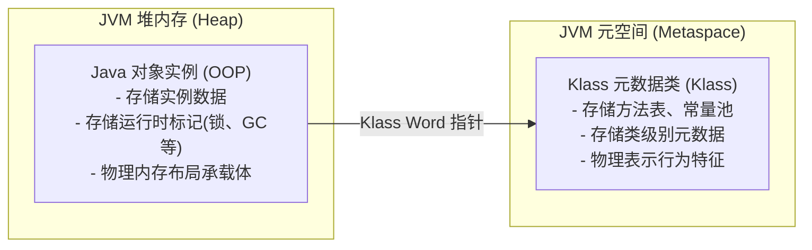
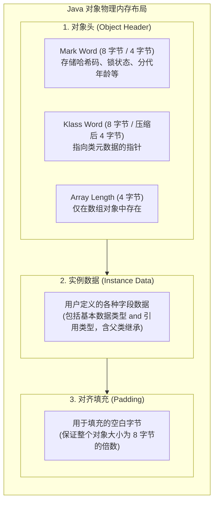
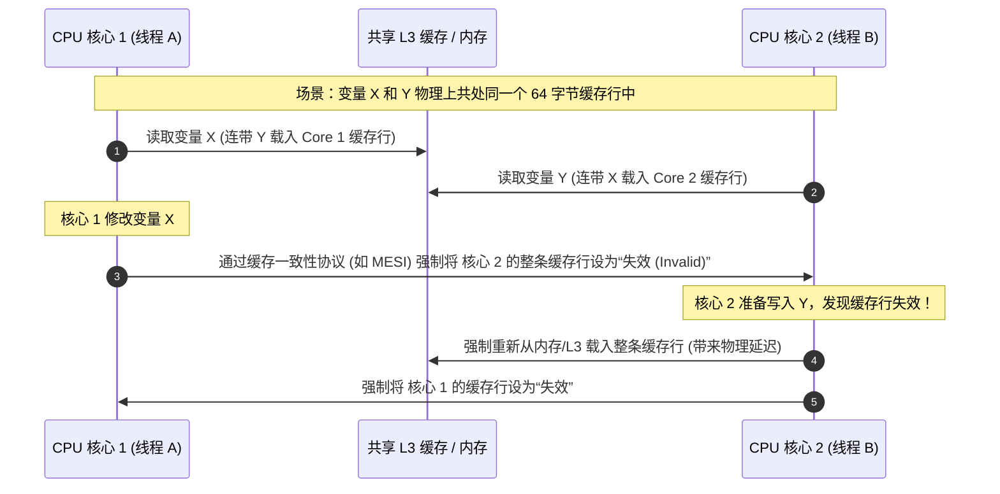
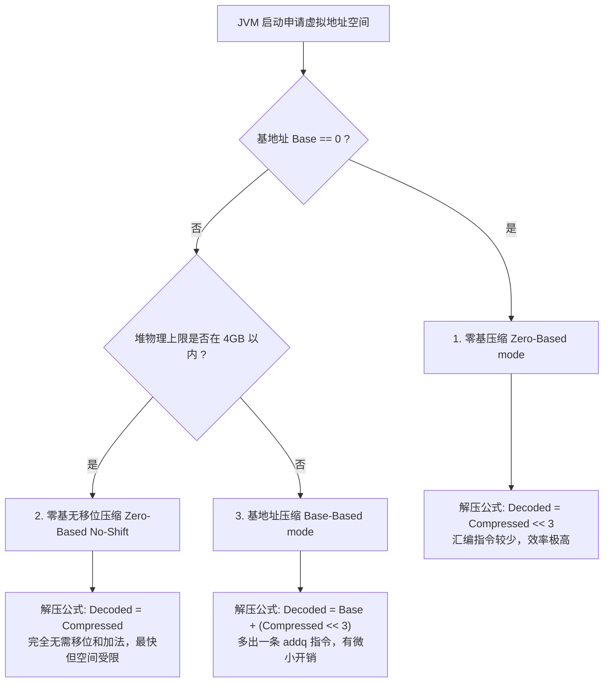

# 2.1.2.2 深入剖析 JVM HotSpot 对象内存布局

在 Java 虚拟机（JVM）的高性能运行体系中，对象的创建、分配、寻址和垃圾回收是最为核心的链路。虽然 Java 语言将底层的内存管理细节封装了起来，使得开发者能够以“万物皆对象”的视角进行业务编码。但在底层的 JVM 规范与 HotSpot 实现中，Java 对象在堆内存（Heap）中的物理存在形式是极其紧凑且复杂的。

深入理解 Java 对象的内存布局，不仅是掌握 JVM 类加载、垃圾回收（GC）、锁优化（同步机制）等底层机理的基石，更是我们在面临高并发、大数据量场景时，进行内存调优（如解决内存溢出、减少垃圾回收频率、消除伪共享等）的必备利器。

本文将彻底拆解 HotSpot 虚拟机中 Java 对象的内存布局，从物理结构三大区、Mark Word 位图、Klass Word、实例字段的重排列策略，到 CPU 寻址效率与指针压缩技术，并最终结合 Java Object Layout (JOL) 工具进行实战剖析，揭示 JVM 物理设计之美。

---

## 1. HotSpot 对象模型：OOP-Klass 二分模型背景

在正式讨论对象的内存布局之前，有必要先了解 HotSpot 虚拟机所采用的经典 **OOP-Klass 模型**。

为了实现 Java 语言中“行为（方法、元数据）”与“数据（成员变量）”的分离，并避免每个对象实例都冗余地携带大量的元数据，HotSpot 并没有采用将方法表直接存放在对象实例中的设计，而是设计了 **OOP-Klass 二分模型**：



- **OOP（Ordinary Object Pointer，普通对象指针）**：代表了 Java 对象的实例。它主要负责存储对象的属性数据，以及对象自身的运行时状态（如锁状态、GC 分代年龄等）。OOP 对应在堆内存中分配的物理空间，也就是我们本文要探讨的“对象内存布局”。
- **Klass**：代表了 Java 类的元数据信息（包括方法、常量池、字段描述符等），存放在方法区（Metaspace 元空间）中。Klass 是 Class 在 JVM 底层的 C++ 表示形式，它定义了对象的“行为”和“类型特征”。

在堆中分配的每一个 Java 对象实例（OOP），在其头部都包含一个指向其元数据类（Klass）的指针。这种设计极大了节省了堆内存空间。而指向这个 Klass 的类型指针，就是对象内存布局中非常关键的组成部分。

---

## 2. 对象内存布局三大核心区域剖析

在 HotSpot 虚拟机中，一个 Java 对象在堆内存中的物理布局可以清晰地划分为三个部分：**对象头（Object Header）**、**实例数据（Instance Data）** 和 **对齐填充（Padding）**。

### 2.1 三大区域的物理功能定位

我们首先通过一个高阶结构图来直观了解其物理分布：



#### 2.1.1 对象头（Object Header）
它是 JVM 实现对象生命周期管理、线程同步锁以及类型定位的物理支撑区。对象头包含：
- **Mark Word（标记字段）**：用于存储对象自身的运行时数据，如哈希码（HashCode）、GC分代年龄、锁状态标志、线程持有的锁、偏向线程 ID、偏向时间戳等。
- **Klass Word（类型指针）**：即对象指向它的类元数据的指针，JVM 通过这个指针来确定这个对象是哪个类的实例。
- **Array Length（数组长度）**：**仅当对象是数组时存在**。因为普通对象的元数据（Klass）中可以确定对象的大小，但数组的长度是动态的，JVM 必须在对象头中显式记录数组的元素个数，以便于分配空间和进行越界检查。

#### 2.1.2 实例数据（Instance Data）
这是对象真正存储有效信息的区域，即我们在 Java 代码中定义的各种成员变量字段（包括从父类继承下来的字段）。无论是基本数据类型（Primitive Types）还是引用类型（Reference Types），都会在此处被物理分配空间。

#### 2.1.3 对齐填充（Padding）
对齐填充并不是物理必然存在的，也没有任何业务上的功能含义，它仅仅起着**占位符**的作用。由于 HotSpot VM 的自动内存管理系统要求对象的起始地址以及大小都必须是 **8 字节的整数倍**（即 8 字节对齐，8-byte Alignment）。如果对象头加上实例数据的大小不是 8 字节的整数倍，就需要通过对齐填充来补齐到 8 字节的倍数。

### 2.2 不同运行环境下三大区域的物理空间占用对比

在不同的系统架构（32位与64位）以及是否开启“指针压缩（Compressed OOPs）”的情况下，对象头各部分的物理大小会有所变化。下表详细列出了这些物理占用情况（单位：字节 Byte）：

| 对象结构组分 | 32位系统 (固定无压缩) | 64位系统 (未开启指针压缩) | 64位系统 (开启指针压缩 `-XX:+UseCompressedOops`) |
| :--- | :--- | :--- | :--- |
| **Mark Word** | 4 字节 | 8 字节 | 8 字节 |
| **Klass Word** | 4 字节 | 8 字节 | 4 字节 |
| **Array Length** *(仅数组)* | 4 字节 | 4 字节 | 4 字节 |
| **实例数据 (Instance Data)** | 依字段类型而定 | 引用类型占 8 字节 | 引用类型占 4 字节 |
| **对齐填充 (Padding)** | 视上述总和是否为 8 倍数进行填充 | 视上述总和是否为 8 倍数进行填充 | 视上述总和是否为 8 倍数进行填充 |

从上表可以看出：
- **64 位系统开启指针压缩后**，Klass Word 成功由 8 字节缩减为 4 字节，这能显著降低对象头的整体空间消耗（对于普通非数组对象，对象头从 16 字节缩减为 12 字节）。
- **数组长度字段（Array Length）始终固定为 4 字节（32位）**。这就解释了为什么在 Java 中，数组的最大长度被限制为 $2^{31} - 1$（即 `Integer.MAX_VALUE`），因为存储数组长度的物理空间只有 32 位有符号整型的容量。

---

## 3. 深入 Mark Word 的物理位图与状态转换

**Mark Word** 是整个对象头中设计最为精妙的部分。在极度苛刻的内存空间限制下（32位系统为 32 bits，64位系统为 64 bits），为了尽可能多地存储对象自身的运行期数据，JVM 将 Mark Word 设计成了一个**非固定的动态数据结构**。这意味着，随着对象生命周期的演进和并发竞争状态的变化，Mark Word 中各个物理位（Bit）所代表的业务含义会发生剧烈变化。

### 3.1 32位系统与64位系统下的 Mark Word 内存位图对照

为了精准把握 Mark Word 在不同锁状态下的物理位排布，我们必须通过最底层的位图来分析。

在 OpenJDK 源码 `src/hotspot/share/oops/markWord.hpp` 中，对这两种架构下的位图分布有着最权威的代码注释定义：
```cpp
// Bit-format of an object header (most significant first, big endian layout below):
//
//  32 bits:
//  --------
//             hash:25 ------------>| age:4    biased_lock:1 lock:2 (normal object)
//             JavaThread*:23 epoch:2 age:4    biased_lock:1 lock:2 (biased object)
//
//  64 bits:
//  --------
//  unused:25 hash:31 -->| unused:1   age:4    biased_lock:1 lock:2 (normal object)
//  JavaThread*:54 epoch:2 unused:1   age:4    biased_lock:1 lock:2 (biased object)
```

我们将上述物理分布整理为以下两张直观的状态图表。

#### 3.1.1 32位系统 Mark Word 内存分布位图

| 锁状态 (State) | 29 ~ 30 bit (共 30 位) | 2 bit (age) | 1 bit (biased) | 2 bit (lock) | 锁标志位解释 |
| :--- | :--- | :--- | :--- | :--- | :--- |
| **无锁 (Unlocked)** | `identity_hashcode: 25 bits` | `age: 4` | `0` | `01` | **无锁状态**，存放哈希值和GC分代年龄 |
| **偏向锁 (Biased)** | `thread: 23 bits` \| `epoch: 2 bits` | `age: 4` | `1` | `01` | **偏向锁状态**，存放偏向线程ID和偏向时间戳 |
| **轻量级锁 (Lightweight)** | `ptr_to_lock_record: 30 bits` | *无 (被覆盖)* | *无 (被覆盖)* | `00` | 指向持有该锁的线程栈中 Lock Record |
| **重量级锁 (Heavyweight)** | `ptr_to_heavyweight_monitor: 30 bits` | *无 (被覆盖)* | *无 (被覆盖)* | `10` | 指向底层的 ObjectMonitor 对象 |
| **GC标记 (Marked for GC)**| `empty: 30 bits` | *无 (被覆盖)* | *无 (被覆盖)* | `11` | 标记整理/清除算法在垃圾回收阶段使用 |

#### 3.1.2 64位系统 Mark Word 内存分布位图

在 64 位系统中，Mark Word 扩展到了 64 bits，这为 Identity HashCode 以及线程 ID 提供了更宽广的物理位存储：

| 锁状态 (State) | 25 bit | 31 bit | 1 bit | 4 bit (age) | 1 bit (biased) | 2 bit (lock) | 物理总长度 |
| :--- | :--- | :--- | :--- | :--- | :--- | :--- | :--- |
| **无锁 (Unlocked)** | `unused: 25` | `identity_hashcode: 31` | `unused: 1` | `age: 4` | `0` | `01` | 64 bits |
| **偏向锁 (Biased)** | `thread: 54 bits` | `epoch: 2` | `unused: 1` | `age: 4` | `1` | `01` | 64 bits |
| **轻量级锁 (Lightweight)** | `ptr_to_lock_record: 62 bits` (指向栈中锁记录的指针) | | | | | `00` | 64 bits |
| **重量级锁 (Heavyweight)** | `ptr_to_heavyweight_monitor: 62 bits` (指向 ObjectMonitor 指针) | | | | | `10` | 64 bits |
| **GC标记 (Marked for GC)** | `empty: 62 bits` | | | | | `11` | 64 bits |

---

### 3.2 核心字段深度解析与动态转换机理

#### 3.2.1 锁标志位（lock）与是否偏向锁（biased_lock）的判定组合
JVM 并不仅仅依靠最后两位的 `lock` 标志来决定对象的锁状态。因为 `01` 这个状态同时被“无锁”和“偏向锁”所共用。因此，JVM 的同步子系统必须结合 `biased_lock` 标志位进行联合判断：
- 当 `lock = 01` 且 `biased_lock = 0` 时：判定为**无锁**状态。
- 当 `lock = 01` 且 `biased_lock = 1` 时：判定为**偏向锁**状态。
- 其余 `00`（轻量级锁）、`10`（重量级锁）、`11`（GC 标记）则不依赖 `biased_lock` 位。

#### 3.2.2 GC分代年龄（Age）为什么最大是 15？
在 JVM 的分代垃圾回收机制中，新生代（Young Generation）中的对象每经历一次 Minor GC 并存活下来，其 GC 分代年龄就会加 1。当分代年龄达到设定的阈值时，对象就会被晋升（Promotion）到老年代（Old Generation）。
这个阈值可以通过 JVM 参数 `-XX:MaxTenuringThreshold` 进行配置。
**为什么该参数的最大配置值只能是 15？**
从上面的物理位图可以看出，在 32 位和 64 位系统中，**用于存放 GC 年龄的物理空间仅占 4 个 bit**。
在计算机二进制中，4 位二进制数能够表示的最大无符号整数是：
$$2^4 - 1 = 15 \text{ (即二进制的 1111)}$$
这是一个不可逾越的物理限制。如果试图将 `-XX:MaxTenuringThreshold` 设置为 16 或更大的数值，JVM 在启动初始化参数校验时就会抛出致命错误并拒绝启动。

#### 3.2.3 Identity HashCode（恒定哈希码）的存储危机与锁升级退化
Identity HashCode 是通过 `System.identityHashCode(Object)` 或未覆写 `hashCode()` 方法的默认实现产生的哈希值。该值与对象的物理地址或者特定生成算法绑定，一旦生成，在对象的整个生命周期中必须保持恒定不变。

**Identity HashCode 的延迟加载与存储机制：**
- 当一个对象刚被创建时，它的 Mark Word 中的 `identity_hashcode` 部分全为 0。只有当程序第一次显式或隐式调用上述哈希码获取方法时，JVM 才会计算出哈希值，并将其持久化写入到 Mark Word 的对应位中。

**哈希码存储与锁状态的严重冲突：**
- **偏向锁状态下**，Mark Word 的绝大部分空间（54 bits）被写入了偏向线程的 ID。这导致**偏向锁的位图中根本没有物理空间来存放 31 位的 Identity HashCode**。
- **冲突发生时的降级/升级逻辑**：
  1. **偏向锁状态下计算 HashCode**：如果一个对象已经处于偏向锁状态，此时程序调用了其默认的 `hashCode()`，由于偏向锁没有位置存哈希值，JVM 会**立即撤销偏向锁**。如果此时没有竞争，对象会直接退化为**无锁状态**，并将计算出的哈希码写入 Mark Word 中；如果存在竞争，则锁会直接膨胀为**重量级锁**。
  2. **已计算过 HashCode 的对象无法偏向**：如果一个对象在无锁状态下已经计算过并写入了 Identity HashCode，那么这个对象就**再也无法进入偏向锁状态**。因为一旦允许其偏向，写入线程 ID 就会覆盖掉已有的 HashCode，导致后续再次调用 `hashCode()` 时无法返回一致的哈希值。因此，这类对象在进行 `synchronized` 同步时，会跳过偏向锁，直接升级为**轻量级锁**。
  3. **轻量级锁与重量级锁的 HashCode 备份**：
     - 在轻量级锁状态下，整个 62 位空间被覆盖为指向栈帧中 Lock Record 的指针。为此，JVM 会在当前线程的栈帧中创建一个名为“锁记录（Lock Record，具体为 `BasicObjectLock` 结构）”的空间，并将对象原本的 Mark Word（包含已计算出的 HashCode）复制一份到 Lock Record 的 `_displaced_header` 字段中。释放锁时，再将该值通过 CAS 还原回对象头中。
     - 在重量级锁状态下，Mark Word 指向一个底层的 C++ `ObjectMonitor` 对象。`ObjectMonitor` 内部拥有独立的成员变量字段（如 `_header`），用于备份和保存对象原本的 Mark Word 及其 HashCode。

#### 3.2.4 偏向线程 ID（Thread ID）与 Epoch 的协作与锁撤销成本
- **Thread ID**：记录了当前持有偏向锁的线程在内核/JVM 中的物理线程标识。当此线程再次进入同步块时，只需对比该 Thread ID 是否与自身一致，若一致则无需任何 CAS 锁操作，直接进入。
- **偏向锁的撤销成本**：偏向锁的撤销开销非常大，因为它必须等待**全局安全点（Safe Point）**，在这个时刻所有 Java 线程都是暂停的。JVM 会检查持有偏向锁的线程是否存活，如果线程已死亡或已退出同步块，则将锁对象头恢复为无锁状态；如果仍然在同步块中，则升级为轻量级锁。
- **Epoch**：这是一个偏向时间戳，用于表示偏向锁的有效性。它与该对象所属 Class 的 `prototype_header`（原型对象头）中的 Epoch 对应。JVM 借助 Epoch 可以高效地实现**批量重偏向（Bulk Rebias）**：
  - 当一个 Class 对象的锁撤销次数达到阈值（由 `-XX:BiasedLockingBulkRebiasThreshold` 控制，默认 20 次）时，JVM 会判定该类的偏向设置存在偏差。
  - 于是，JVM 会递增该类的 Epoch 值，使得所有存活的该类实例的偏向锁瞬间失效（因为对象头里的 Epoch 与类元数据里的 Epoch 不一致了），从而允许其他线程重新偏向，免去了逐个对象撤销偏向锁的巨大开销。
  - 如果锁撤销次数继续飙升达到更高阈值（由 `-XX:BiasedLockingBulkRevokeThreshold` 控制，默认 40 次），JVM 会认为这个 Class 在当前并发环境下根本不适合使用偏向锁。于是会执行**批量撤销（Bulk Revoke）**，将该类的 `prototype_header` 中的偏向锁标志彻底关闭。此后，新创建的该类实例将直接处于无锁状态，不再启用偏向锁。

---

## 4. Klass Word 类型指针与数组长度字段

### 4.1 Klass Word 类型指针

Klass Word 是一个物理指针，它指向存放在方法区/元空间（Metaspace）中的 `InstanceKlass` 对象（代表该类的元数据）。

在 64 位系统下，如果不做任何优化，一个原生指针需要占用 8 字节的物理空间。当堆中存在海量小对象时，仅类型指针一项就会耗费庞大的堆内存。为此，HotSpot 引入了**指针压缩（Compressed Class Pointers）**技术。
- 当开启 `-XX:+UseCompressedClassPointers` 时，JVM 使用一个 32 位的压缩值来表示 Klass 指针。
- 解压时，JVM 会将这个 32 位的窄指针（`narrowKlass`）加上一个基地址，并左移指定的位数，从而还原为真实的 64 位 `InstanceKlass` 物理地址。
- 这使得 Klass Word 的空间占用从 8 字节下降到 4 字节，大幅提升了内存效率。

### 4.2 数组长度字段（Array Length）

Java 语言中的数组也是一个特殊的对象。对于非数组对象，JVM 可以通过读取其对应的 `InstanceKlass` 元数据，获取其字段的定义和类型，从而准确计算出该对象在内存中需要占用多少字节。

然而，数组的长度是在运行期动态指定的，同一个数组类（例如 `int[]`）可以实例化出长度为 10 或长度为 10000 的不同数组实例。因此，**JVM 无法仅凭类型指针（Klass Word）确定一个数组对象的物理大小**。

为了解决这个问题，JVM 规范规定：**所有数组对象的对象头中，必须额外包含一个 32 位的 Array Length 字段**。

```
数组对象头布局（64位系统 + 启用指针压缩）：
|-------------------------------------------------------|
|          Mark Word (64 bits / 8 Bytes)                 |
|-------------------------------------------------------|
|       Klass Word (32 bits / 4 Bytes, Compressed)      |
|-------------------------------------------------------|
|          Array Length (32 bits / 4 Bytes)             |
|-------------------------------------------------------|
对象头总大小：16 字节
```

由于 Array Length 被固定分配为 4 字节（32 位），且在 Java 中数组下标是非负的，因此数组理论上的最大元素个数限制为：
$$2^{31} - 1 = 2,147,483,647$$
这从物理上决定了 Java 数组在任何时候都无法超越这个容量界限。

---

## 5. 实例数据的字段重排列与内存缝隙压缩优化

Java 对象的第二个核心区域是**实例数据（Instance Data）**。在这里，JVM 会为类的所有非静态成员变量（包括从各级父类继承而来的非静态变量）分配物理内存空间。

为了最大化内存利用率并保证底层的内存对齐，JVM 绝不会按照我们在 Java 源码中声明变量的先后顺序直接在内存中排布字段。相反，JVM 会执行严格的**字段重排列（Fields Reordering）**。

### 5.1 字段类型宽度与对齐基准

在进行重排列之前，我们首先需要明确 Java 中各种数据类型在 JVM 底层的物理宽度（Width）：

| Java 类型 | 物理宽度 (字节 Byte) | 物理宽度 (位 Bit) |
| :--- | :--- | :--- |
| `double`, `long` | 8 字节 | 64 位 |
| `int`, `float` | 4 字节 | 32 位 |
| `short`, `char` | 2 字节 | 16 位 |
| `byte`, `boolean` | 1 字节 | 8 位 |
| `reference` (引用类型) | 8 字节 (关闭压缩) / 4 字节 (开启压缩) | 64 位 / 32 位 |

JVM 在物理分配时，要求**任何字段的起始内存偏移量（Offset），都必须是该字段自身物理宽度（字节数）的整数倍**。
- 例如：`long` 或 `double` 字段 of 起始偏移量必须能被 8 整除。
- `int` 字段 of 起始偏移量必须能被 4 整除。
- 如果不满足这个规则，CPU 访问该字段时就会遭遇非对齐访问，导致性能急剧下降（详见第 6 节）。

### 5.2 默认的字段重排列策略：FieldsAllocationStyle

为了以最少的对齐填充（Padding）代价满足上述对齐基准，HotSpot JVM 设计了三种字段重排列样式（Allocation Styles），由 JVM 参数 `-XX:FieldsAllocationStyle` 控制，默认值为 `1`。

#### Style 0
排布顺序为：**`Fields (References)` -> `doubles / longs` -> `ints / floats` -> `shorts / chars` -> `bytes / booleans`**
即优先分配所有对象引用（oops），然后按照宽度从大到小的顺序排列基本类型。

#### Style 1 (JVM 默认策略)
排布顺序为：**`doubles / longs` -> `ints / floats` -> `shorts / chars` -> `bytes / booleans` -> `Fields (References)`**
即首先排布宽度最大的基本类型（8 字节），然后依次递减，最后排布对象引用（oops）。这种策略将所有引用类型聚集在最后，有利于垃圾回收器快速扫描对象图中的引用字段。

#### Style 2
排布顺序为：**`doubles / longs` -> `ints / floats` -> `shorts / chars` -> `bytes / booleans` -> `Fields (References) 紧凑排布`**
JVM 会根据具体的字段数量和对齐间隙，动态调整 oops 的位置，将其与窄基本类型交错排列，以求达到极致的空间节省。

无论采用哪种 Style，其核心思想都是：**将相同宽度的字段聚集在一起排列**。这样可以确保只要起始位置对齐了，后续同宽度的字段都能天然对齐，从而最大化消除每个字段之间由于“对齐”而不得不插入的空白字节。

### 5.3 父子类继承下的布局规则与 CompactFields 优化

在继承关系下，Java 对象的实例数据布局必须遵循以下两个基本规则：

1. **父类定义的字段必须排布在子类定义的字段之前**。
   这是为了保证多态和类型转换的安全性。当我们将一个子类对象的指针强转为父类类型时，父类部分的内存偏移量保持绝对一致，JVM 能够以完全相同的方式访问父类字段。
2. **父类字段结束与子类字段开始之间的对齐限制**。
   通常情况下，父类的实例数据结束之后，必须对齐到 4 字节（或 8 字节，取决于指针宽度及 JVM 版本）。如果父类的最后一个字段导致父类数据部分的结尾没有对齐，就会留下一个“空白缝隙（Gap）”。

为了消灭这种因继承对齐产生的内存缝隙，HotSpot 引入了 `-XX:+CompactFields` 参数（默认开启）。
- 当开启时，JVM 允许**子类中宽度较窄的字段（如 byte、short 等）打破“父类在前，子类在后”的绝对顺序，逆向塞入父类末尾由于对齐留下的缝隙（Gap）中**。
- 这项优化在深层继承结构中能够省下非常可观的堆空间。

我们用一个具体的物理布局对比图来说明这一过程。
假设父类 `Parent` 包含一个 `byte` 字段，子类 `Child` 包含一个 `int` 字段。
在开启指针压缩（对象头 12 字节）的环境下：

#### 情况 A：未开启 `CompactFields`（`-XX:-CompactFields`）
1. 对象头占用 `0 ~ 11` 字节。
2. 父类 `Parent` 的 `byte` 字段占第 `12` 字节。
3. 父类部分结束。为了让接下来的子类字段对齐，JVM 必须将偏移量对齐到 4 字节的倍数（即 16 字节），这就导致第 `13, 14, 15` 字节成为**完全浪费的 Gap（缝隙）**。
4. 子类 `Child` 的 `int` 字段从第 `16` 字节开始，占 `16 ~ 19` 字节。
5. 此时总大小为 20 字节。由于整个对象必须 8 字节对齐，最后需要填充 4 字节的 Padding（`20 ~ 23` 字节）。整个对象占用 **24 字节**。

#### 情况 B：开启 `CompactFields`（`-XX:+CompactFields`，默认）
1. 对象头占用 `0 ~ 11` 字节。
2. 父类 `Parent` 的 `byte` 字段占第 `12` 字节。
3. 此时在达到下一个 4 字节边界（第 16 字节）前，有 3 字节的 Gap（`13, 14, 15` 字节）。
4. 如果子类中有宽度小于或等于 3 字节的字段，JVM 会将其塞入此 Gap。
5. 若子类 `Child` 包含的是一个 `short` 字段（2 字节）和一个 `byte` 字段（1 字节）。
   - JVM 会将子类的 `short` 字段直接排入第 `13, 14` 字节，将子类的 `byte` 字段排入第 `15` 字节。
   - 这样，父子类的所有数据完美填满了原本是空白的 Gap。对象在第 16 字节结束，且天然是 8 字节对齐的。
   - 最终整个对象只占用 **16 字节**，相比未开启优化时的 24 字节，空间节省了 **33.3%**！

---

## 6. 对齐填充（Padding）与底层硬件动因

为什么 JVM 要如此执着地进行 8 字节对齐？为什么不能像紧凑型序列化协议那样，一个字节挨着一个字节物理存储，把空间利用率提升到 100%？

这背后的根本动因并不在软件层面，而在于**计算机硬件的物理设计与 CPU 的运行效率**。

### 6.1 CPU 数据总线寻址与内存读取机制

现代 64 位 CPU（如 Intel Core、AMD Ryzen 或 ARM 架构）与内存（RAM）之间的数据交互是通过数据总线（Data Bus）完成的。
- 64 位 CPU 的数据总线宽度为 64 位（8 字节）。
- 这意味着，**CPU 每次发起一次内存读周期（Memory Read Cycle），从内存芯片中读取数据的步长固定是 8 字节**。CPU 无法物理上只“读取任意起始地址的 1 个字节”。
- 内存的物理寻址边界被硬性划分在 `0x00, 0x08, 0x10, 0x18 ...` 这样的 8 字节整倍数地址上。

如果我们在内存中存放一个 `double` 类型的变量（占 8 字节），且没有进行对齐，例如它的存储起始地址是 `0x03`，结束地址是 `0x0A`：

```
物理内存分布 (每格 1 字节)：
地址: 0x00  0x01  0x02 [0x03  0x04  0x05  0x06  0x07] [0x08  0x09  0x0A] 0x0B  0x0C  0x0D
数据:  --    --    --  [       double 变量的前半部分     ] [   后半部分   ]  --    --    --
寻址块: |---------- 读周期 1 (0x00 ~ 0x07) ----------| |---------- 读周期 2 (0x08 ~ 0x0F) ----------|
```

当 CPU 想要读取这个 `double` 变量时，它将面临**非对齐访问（Unaligned Access）**灾难：
1. **第一次读取**：CPU 必须先发出读取 `0x00 ~ 0x07` 地址块的指令，拿到该块后，将低位无用数据丢弃，保留第 `0x03 ~ 0x07` 字节。
2. **第二次读取**：CPU 接着发出读取 `0x08 ~ 0x0F` 地址块的指令，拿到该块后，丢弃高位无用数据，保留第 `0x08 ~ 0x0A` 字节。
3. **数据拼接**：CPU 内部的寄存器和移位器将这两次读取到的数据进行位移操作，最后拼接组合成一个完整的 64 位 `double` 数据。

原本只需要**一次**内存访问就能解决的操作，由于未对齐，变成了**两次内存访问 + 额外的移位拼接开销**，导致硬件级性能急剧下降。

通过要求所有 Java 对象的大小和起始地址都强制进行 8 字节对齐，JVM 保证了**任何对象中任何大小小于或等于 8 字节的基本类型字段，在内存中都绝对不会跨越 8 字节的物理寻址边界**。这让 CPU 能够始终以单次读周期的最高效率完成字段访问。

### 6.2 CPU 硬件缓存行（Cache Line）与伪共享（False Sharing）

除了数据总线寻址外，CPU 内部的多级缓存（L1, L2, L3 Cache）也是以固定大小的块进行管理的。这个最小管理单位被称为**缓存行（Cache Line）**，在主流的 x86/x64 CPU 上，一个缓存行的大小通常为 **64 字节**。

#### 6.2.1 伪共享（False Sharing）的物理本质
当多线程并发执行时，即使每个线程访问的是对象中完全不同的两个独立变量，如果这两个变量由于没有良好对齐，被物理分配在了**同一个 64 字节的缓存行**中，就会触发“伪共享”问题。



在上述机制下，两核心虽然操作不同变量，却因为同一缓存行的绑定，陷入了无休止的“缓存行失效 -> 重新载入 -> 再次失效”的恶性循环，使得并发性能大幅滑坡。

#### 6.2.2 JVM 解决方案与 `@Contended` 注解原理
为了解决高并发下的伪共享，JVM 提供了对齐填充的更高级应用。在 JDK 8 中，引入了 `sun.misc.Contended` 注解。
- 当我们在类的某个字段（或整个类）上标记 `@Contended` 时，JVM 会在字段的物理排布前后，**强制自动填充宽度为 128 字节（2 个标准缓存行宽度）的空白 Padding**。
- 这样可以物理上将该字段与其他任何字段隔开，确保它绝对能够独占一个独立的 CPU 缓存行，彻底消除伪共享。
- *注*：默认情况下，`@Contended` 仅对 JVM 内部类库（如 `java.util.concurrent` 中的 `ConcurrentHashMap`、`LongAdder` 等）生效。若想在用户业务代码中启用，必须在 JVM 启动参数中加入 `-XX:-RestrictContended`。

---

## 7. 指针压缩（Compressed OOPs）的技术内核

随着 64 位计算架构的普及，JVM 物理可寻址的内存空间打破了 4GB 的上限。然而，64 位系统也带来了一个巨大的副作用：**指针大小翻倍**。
在 64 位系统下，堆中所有的对象引用（OOP，Ordinary Object Pointer）都从 32 位扩展到了 64 位（8 字节）。这意味着：
1. 堆中存储的所有对象引用将多消耗一倍的内存，导致堆内存有效承载业务数据的容量下降 20% ~ 30%（内存膨胀）。
2. 更宽的指针意味着相同容量 of CPU L1/L2/L3 缓存中能装载的有效对象数量变少，导致缓存命中率（Cache Hit Rate）降低。

为了化解这一尴尬，HotSpot 设计了**指针压缩技术（Compressed OOPs）**。

### 7.1 物理寻址与位移计算的数学原理

既然 Java 对象在堆中都是 **8 字节对齐**的，那么任何一个对象的起始物理内存地址的二进制表示中，**低 3 位（即最右边的 3 位）必定全部是 0**。
例如，以下是几个对象的起始地址（二进制表示）：
- 地址 `8` (0x08)：`... 00001000`
- 地址 `16` (0x10)：`... 00010000`
- 地址 `24` (0x18)：`... 00011000`

既然每一个有效对象地址的最后三位永远是 `000`，那我们就可以不用在堆中存储这三位。

**指针压缩的核心思想：**
1. **压缩存储（Encode）**：当 JVM 要把一个 64 位的真实物理对象指针写入堆内存（例如存入某个引用的实例变量）时，先将该指针**逻辑右移 3 位**（丢弃最后 3 个恒为 0 的位）。
   $$\text{CompressedOOP} = \text{RealAddress} \gg 3$$
   通过这一步，原本需要 35 位才能完整表达的地址，被成功缩减到了 32 位，从而可以用一个普通的 4 字节（32位）空间来存放。
2. **解压还原（Decode）**：当 CPU 需要通过该引用去内存中访问对应的对象时，JVM 在底层自动执行**逻辑左移 3 位**操作，在最右边补上 `000`。
   $$\text{RealAddress} = \text{CompressedOOP} \ll 3$$
   还原出的 64 位真实指针直接送入 CPU 寻址线。

---

### 7.2 32GB 内存屏障（The 32GB Barrier）的推导

为什么业界一致公认，**32GB 是 Java 堆内存调优的一个绝对分水岭**？

我们可以通过严谨的数学推导来证明这一结论：
- 经过指针压缩后，堆中存放的引用是一个 32 位的无符号整型（`narrowOop`）。
- 32 位二进制数能够表示的物理状态总数是：
  $$2^{32} = 4,294,967,296 \text{ (即 4G 个不同的数值)}$$
- 如果不使用指针压缩，这 4G 个不同的数值只能代表 4G 个字节的地址，即最大寻址 **4GB**。
- 但是，因为我们在解压时会将其左移 3 位（相当于乘以 8），这意味着这 4G 个数值中的每一个，所代表的不是“1个字节”的偏移，而是**“一个 8 字节对齐的对象块”**。
- 因此，32 位指针在 8 字节对齐的加持下，实际能够涵盖的最大物理堆内存空间是：
  $$\text{Max Addressable Space} = 2^{32} \times 8 \text{ 字节} = 32\text{GB}$$

如果我们将 JVM 的堆内存（`-Xmx`）配置为 **大于 32GB**（例如 32.1GB 或 40GB）：
- 32 位的压缩指针将无法映射超出 32GB 范围的对象物理地址。
- 此时，JVM 在启动时会自动**关闭指针压缩（Compressed OOPs 失效）**，退化为使用原生 64 位的普通对象指针。
- 这一退化会导致堆中所有的引用类型瞬间膨胀为 8 字节。实验表明，从 31.5GB 调大到 33GB，由于指针压缩失效，可用对象的总容量不增反降，往往需要将堆内存直接加大到 **38GB ~ 40GB** 才能抵消指针压缩失效带来的内存损耗。

> [!TIP]
> **如何突破 32GB 限制并保持指针压缩？**
> 可以通过调整 JVM 参数 `-XX:ObjectAlignmentInBytes=16`，将对象的对齐基准从默认的 8 字节提高到 16 字节。
> 此时解压移位从左移 3 位变为左移 4 位（乘以 16）。最大寻址空间扩展为：
> $$2^{32} \times 16 \text{ 字节} = 64\text{GB}$$
> **代价**：这也意味着每个对象的平均对齐填充空隙会变大，可能会引入更多的内存碎片。因此，除非经过精细测试，否则不建议轻易修改此参数。

---

### 7.3 指针压缩的三种工作模式与汇编寻址效率

根据操作系统分配的虚拟堆内存基地址的不同，HotSpot JVM 的指针解压有三种不同的运行模式，其执行效率存在细微差异。



#### 7.3.1 Zero-Based Compressed OOPs（零基压缩）
当 JVM 成功向操作系统申请到从虚拟地址 `0` 开始的连续地址空间时启用。由于基地址（Base）为 0，解压公式简化为 `Decoded = Compressed << 3`。
解压 32 位 `narrowOop` 到 64 位寄存器：
```assembly
movl %eax, %rbx       ; 将 32 位 narrowOop 加载到 64 位寄存器 rbx 的低 32 位，高位自动清零
shlq $3, %rbx          ; 将 rbx 逻辑左移 3 位
```
这仅需两条简单的寄存器内指令，不产生任何主存或寄存器间加法计算开销，速度极快。

#### 7.3.2 Zero-Based No-Shift Compressed OOPs（零基无移位压缩）
当堆内存上限非常小（例如小于 4GB）且基地址为 0 时启用。此时指针甚至不需要执行左移 3 位操作，因为 32 位地址已经足以在不移位的情况下寻址整个堆。解压公式就是 `Decoded = Compressed`。这是终极效率，但极其罕见。

#### 7.3.3 Heap-Based/Base-Based Compressed OOPs（基地址压缩）
如果低地址空间已被其他系统进程占用，JVM 只能申请到高位地址的内存块（例如基地址为 `0x70000000`）。此时的解压公式必须带上基地址：`Decoded = Base + (Compressed << 3)`。
其汇编指令排布：
```assembly
movl %eax, %rbx       ; 载入 narrowOop 到 rbx
shlq $3, %rbx          ; 逻辑左移 3 位
addq %r12, %rbx       ; 将 r12（存放堆基址 narrow_oop_base 寄存器）值加到 rbx 上
```
这里多出了一条 `addq` 指令，这意味着每次通过引用字段寻址对象，CPU 都要多执行一次加法计算。在高并发大吞吐量场景下，累加起来的 CPU 时钟周期损耗也是不可忽视的。JVM 会在启动时尽可能以 0 地址为基准申请空间，以保证零基压缩的顺利启用。

---

## 8. 使用 JOL (Java Object Layout) 工具的实战对象结构分析与计算示例

为了看清对象内存布局的每一位真容，我们需要借助 OpenJDK 官方提供的 **JOL (Java Object Layout)** 工具进行运行时内存结构打印。

### 8.1 实验类设计

我们设计如下具有代表性的类来进行实验：

```java
package com.jvm.jol;

// 1. 空类
class EmptyObject {
}

// 2. 基础类 (演示字段重排列与对齐填充)
class BaseObject {
    private long aLong = 1L;
    private int anInt = 2;
    private byte aByte = (byte) 3;
    private String aStr = "Hello";
}

// 3. 继承类 (演示 CompactFields 与 Gap 缝隙填充)
class ChildObject extends BaseObject {
    private byte childByte = (byte) 4;
}
```

### 8.2 实战分析一：空对象布局分析 (64位 + 开启指针压缩)

我们在默认开启指针压缩的环境下运行以下测试代码：

```java
import org.openjdk.jol.info.ClassLayout;

public class JOLTest {
    public static void main(String[] args) {
        EmptyObject obj = new EmptyObject();
        System.out.println(ClassLayout.parseInstance(obj).toPrintable());
    }
}
```

#### JOL 打印输出结果：

```
com.jvm.jol.EmptyObject object internals:
OFF  SZ   TYPE DESCRIPTION               VALUE
  0   8        (object header: mark)     0x0000000000000001 (non-biasable; age: 0)
  8   4        (object header: klass)    0xf800c143 (compressed class pointer)
 12   4        (loss due to the next object alignment)
Instance size: 16 bytes
Space losses: 0 bytes internal + 4 bytes external = 4 bytes total
```

#### 逐行翻译与计算：
- **`0  8 (object header: mark)`**：对象偏移量从 0 开始的 8 个字节，是 **Mark Word**。其十六进制输出的值为 `0x0000000000000001`。
  - 最低字节是 `01`（对应二进制 `00000001`），其中的最后两位是 `01`，倒数第三位是 `0`（表示非偏向锁状态）。这证明该空对象处于**无锁状态**。
  - `age: 0` 对应分代年龄为 0。
- **`8  4 (object header: klass)`**：偏移量从第 8 字节开始的 4 个字节，是 **Klass Word**（类型指针）。由于开启了指针压缩，它只占了 4 字节，而不是原生的 8 字节。它的值 `0xf800c143` 指向方法区中的 `EmptyObject.class` 元数据。
- **`12  4 (loss due to the next object alignment)`**：偏移量从第 12 字节开始的 4 个字节，是**对齐填充（Padding）**。因为此时对象头只占了 12 字节（`0 ~ 11` 字节），为了满足整个对象大小必须是 8 字节整数倍的要求，JVM 在其后强制补上了 4 字节的空白，使其达到 **16 字节** 的实例大小。

---

### 8.3 实战分析二：包含字段的对象布局与重排列 (64位 + 开启指针压缩)

我们打印包含多种基本类型及引用类型的 `BaseObject` 实例：

```java
BaseObject baseObj = new BaseObject();
System.out.println(ClassLayout.parseInstance(baseObj).toPrintable());
```

#### JOL 打印输出结果：

```
com.jvm.jol.BaseObject object internals:
OFF  SZ               TYPE DESCRIPTION               VALUE
  0   8                    (object header: mark)     0x0000000000000001 (non-biasable; age: 0)
  8   4                    (object header: klass)    0xf800c25a (compressed class pointer)
 12   4                int BaseObject.anInt          2
 16   8               long BaseObject.aLong          1
 24   1               byte BaseObject.aByte          3
 25   3                    (alignment/padding gap)   
 28   4   java.lang.String BaseObject.aStr           (object)
Instance size: 32 bytes
Space losses: 3 bytes internal + 0 bytes external = 3 bytes total
```

#### 字段排列规律深度解剖：

让我们对比一下我们在代码中声明字段的顺序，以及 JOL 打印出来的物理偏移量（Offset）顺序：

- **代码声明顺序**：`long aLong` -> `int anInt` -> `byte aByte` -> `String aStr`
- **物理排列顺序**：`int anInt` -> `long aLong` -> `byte aByte` -> `Gap` -> `String aStr`

**为什么物理顺序与声明顺序不同？**
1. **Gap 避让与宽度对齐**：
   对象头占了 12 字节（`0 ~ 11`）。如果第一个排布的字段是 8 字节的 `long aLong`，根据 8 字节对齐基准，其起始偏移量必须是 8 的倍数。那么它就不能从第 12 字节开始，必须空出第 `12 ~ 15` 字节，从第 16 字节开始。这就会造成 4 字节的 Gap 浪费。
   JVM 采用默认 of 重排列 Style，将 4 字节宽度的 `int anInt` 调到了最前面，**填满了第 12 ~ 15 字节这块原本会成为 Gap 的空间**。
2. **基本数据类型与引用类型的分离**：
   `int` 分配完毕后，恰好空出了 16 字节这一 8 的整数倍地址。此时 8 字节的 `long aLong` 紧跟其后分配在 `16 ~ 23` 字节，实现了完美对齐。
   接着分配 1 字节的 `byte aByte` 占第 24 字节。
   由于引用类型 `aStr`（压缩指针，4 字节）需要对齐到 4 字节整倍数偏移量上，而当前偏移量是 25。为了让其对齐，JVM 在这里插入了 3 字节的内部分配缝隙（`alignment/padding gap`，`25 ~ 27`），使得 `aStr` 得以分配在 `28 ~ 31` 字节。
3. **最终大小**：32 字节，恰好能被 8 整除，无需在对象尾部进行外部对齐填充。

---

### 8.4 实战分析三：关闭指针压缩下的同一对象布局对照

如果在 JVM 启动参数中显式关闭指针压缩（配置 `-XX:-UseCompressedOops`），上述 `BaseObject` 的内存布局将发生什么改变？

#### 运行命令：
```bash
java -XX:-UseCompressedOops com.jvm.jol.JOLTest
```

#### 理论计算与 JOL 预测结果：
- **对象头**：
  - Mark Word：8 字节
  - Klass Word：8 字节（不再压缩）
  - 对象头总计：16 字节。
- **实例数据排布**（无压缩下，引用类型 `aStr` 变为 8 字节）：
  - 偏移量 `16` 处刚好是 8 的倍数，可以直接排布 8 字节的 `long aLong`（`16 ~ 23`字节）。
  - 接着排布 4 字节的 `int anInt`（`24 ~ 27`字节）。
  - 接着排布 1 字节的 `byte aByte`（`28`字节）。
  - 剩下的引用类型 `String aStr` 占 8 字节，其起始偏移量必须能被 8 整除。当前的 29 显然不行。所以需要填充 3 字节 Gap（`29 ~ 31`字节），使得 `aStr` 排布在 `32 ~ 39` 字节。
- **总大小计算**：
  $$16 \text{ (Header)} + 8 \text{ (long)} + 4 \text{ (int)} + 1 \text{ (byte)} + 3 \text{ (Gap)} + 8 \text{ (String)} = 40 \text{ 字节}$$
  整个对象的大小从 **32 字节暴涨到了 40 字节**。

---

### 8.5 实战分析四：继承关系下的字段排布与 Gap 缝隙填充

现在我们观察 `ChildObject`（子类包含一个 `byte childByte`，父类包含一个 `byte aByte` 且末尾产生了 3 字节缝隙）。

```java
ChildObject childObj = new ChildObject();
System.out.println(ClassLayout.parseInstance(childObj).toPrintable());
```

#### JOL 打印输出结果：

```
com.jvm.jol.ChildObject object internals:
OFF  SZ               TYPE DESCRIPTION               VALUE
  0   8                    (object header: mark)     0x0000000000000001 (non-biasable; age: 0)
  8   4                    (object header: klass)    0xf800c3c2 (compressed class pointer)
 12   4                int BaseObject.anInt          2
 16   8               long BaseObject.aLong          1
 24   1               byte BaseObject.aByte          3
 25   1               byte ChildObject.childByte     4     <-- 逆向塞入父类的内部分配 Gap 中！
 26   2                    (alignment/padding gap)   
 28   4   java.lang.String BaseObject.aStr           (object)
Instance size: 32 bytes
Space losses: 2 bytes internal + 0 bytes external = 2 bytes total
```

#### 内存优化分析：
在没有子类变量之前，父类 `BaseObject` 的 `byte aByte`（偏移量 24）后面留下了 3 字节的 Gap（`25, 26, 27`）。
当我们实例化子类 `ChildObject` 时，子类声明的字段 `byte childByte` 宽度为 1 字节，被 JVM **直接塞回了第 25 字节**（父类的内部分配 Gap 中）。
这样一来，原本 3 字节的内部分配 Gap 缩减为了 2 字节，并且整个子类对象依然保持了 32 字节的紧凑尺寸，完全没有因为增加了字段而导致整个对象膨胀到 40 字节。这就是 `-XX:+CompactFields` 带来的物理优化。

---

### 8.6 实战分析五：数组对象的内存布局分析

我们增加一个包含 5 个元素的 `int` 数组来进行打印：

```java
int[] array = new int[5];
System.out.println(ClassLayout.parseInstance(array).toPrintable());
```

#### JOL 打印输出结果：

```
[I object internals:
OFF  SZ   TYPE DESCRIPTION               VALUE
  0   8        (object header: mark)     0x0000000000000001 (non-biasable; age: 0)
  8   4        (object header: klass)    0xf80000b5 (compressed class pointer)
 12   4        (object header:  size)    5
 16  20    int [I.<elements>             N/A
 36   4        (loss due to the next object alignment)
Instance size: 40 bytes
Space losses: 0 bytes internal + 4 bytes external = 4 bytes total
```

#### 数组物理布局拆解：
- **`12  4 (object header: size)`**：占用第 12 ~ 15 字节，正是数组的**长度字段（Array Length）**，其存放的物理数值为 5。
- **`16  20 int [I.<elements>`**：占用第 16 ~ 35 字节。每个 `int` 元素占 4 字节，5 个元素共计 20 字节。
- **`36  4 (loss due to the next object alignment)`**：占用第 36 ~ 39 字节，为对齐填充。
- **总大小**：`16 (Header) + 20 (Elements) + 4 (Padding) = 40 字节`。

---

### 8.7 实战分析六：锁升级过程中的 Mark Word 变化分析

为了验证第 3 节中锁升级的理论，我们在 JVM 启动参数中配置 `-XX:BiasedLockingStartupDelay=0`，使偏向锁立即生效，然后运行以下测试代码：

```java
package com.jvm.jol;

import org.openjdk.jol.info.ClassLayout;

public class LockUpgradeTest {
    public static void main(String[] args) throws Exception {
        EmptyObject obj = new EmptyObject();
        
        System.out.println("=== 1. 新建无锁/可偏向状态 ===");
        System.out.println(ClassLayout.parseInstance(obj).toPrintable());

        synchronized (obj) {
            System.out.println("=== 2. 持有同步锁 (偏向锁状态) ===");
            System.out.println(ClassLayout.parseInstance(obj).toPrintable());
        }

        Thread thread2 = new Thread(() -> {
            synchronized (obj) {
                System.out.println("=== 3. 另一线程交替进入 (轻量级锁状态) ===");
                System.out.println(ClassLayout.parseInstance(obj).toPrintable());
            }
        });
        thread2.start();
        thread2.join();

        Thread thread3 = new Thread(() -> {
            synchronized (obj) {
                try { Thread.sleep(100); } catch (InterruptedException e) {}
            }
        });
        
        synchronized (obj) {
            thread3.start();
            Thread.sleep(20); // 制造竞争
            System.out.println("=== 4. 激烈竞争触发 (重量级锁状态) ===");
            System.out.println(ClassLayout.parseInstance(obj).toPrintable());
        }
        thread3.join();
    }
}
```

#### 关键阶段 Mark Word 的十六进制字节数据对比与逐位解析

由于在 x86 架构下，内存数据是以**小端字节序（Little Endian）**存放的（低位字节在低地址）。从 JOL 输出中读取 Mark Word 时，**必须从右往左（将字节逆序）还原出正常的 64 位二进制表示**。

##### 1. 无锁状态输出：
```
(object header: mark)     0x0000000000000001 (non-biasable; age: 0)
```
- 二进制最低字节：`00000001`
  - 锁标志位（最后 2 位）：`01` -> 无锁/偏向锁
  - 是否偏向锁（倒数第 3 位）：`0` -> **无锁**
  - 分代年龄（第 4 ~ 7 位）：`0000` -> **0岁**

##### 2. 偏向锁状态输出：
```
(object header: mark)     0x00007f9c8f008805 (biased; age: 0)
```
- 二进制最低字节：`00000101`（对应十六进制 `05`）
  - 锁标志位：`01` -> 无锁/偏向锁
  - 是否偏向锁：`1` -> **偏向锁**
  - 高 54 位物理值 `0x00007f9c8f0088` 部分正是当前持有该锁的 Java 物理线程 ID。

##### 3. 轻量级锁状态输出：
```
(object header: mark)     0x000070000d2359b0 (thin lock; age: 0)
```
- 二进制最低字节：`10110000`（对应十六进制 `b0`）
  - 锁标志位：`00` -> **轻量级锁**
  - 整个 62 位的值作为指针，指向当前线程栈帧中的 Lock Record 物理地址。

##### 4. 重量级锁状态输出：
```
(object header: mark)     0x00007f9c8f821a02 (fat lock; age: 0)
```
- 二进制最低字节：`00000010`（对应十六进制 `02`）
  - 锁标志位：`10` -> **重量级锁**
  - 整个 62 位的值作为指针，指向底层的 C++ `ObjectMonitor` 对象的物理内存地址。

---

## 9. 总结与高并发大对象下的内存优化最佳实践

针对对象布局的优化能够直接转换为服务器成本的节省。

### 9.1 大内存机器下的 32GB 堆法则
- **避免尴尬的 33GB 堆配置**：如果业务流量增长需要扩容内存，切记不要将其设置为 32GB 略多一点。因为这会导致指针压缩失效，堆中所有引用类型宽度翻倍，原本能存下的对象数量反而减少。
- **最佳扩容路线**：若 31GB 不够用，在保留默认指针压缩的情况下，先考虑进行代码层面的大对象优化。如果非要扩容堆，应当直接从 31GB 调大至 **40GB** 以上，或者配合调整 `-XX:ObjectAlignmentInBytes=16` 并进行严密的内存占比压测。

### 9.2 高频小对象的包装类型开销警示
包装类型（如 `Long`、`Integer`）会带来惊人的内存膨胀。
以一个 `long` 基本类型为例，在 Java 中它仅占 **8 字节**。而若使用 `Long` 对象，在 64 位开启指针压缩的环境下，需要消耗 **24 字节** 的空间。
内存开销直接翻了 3 倍！如果是在海量数据处理、高频并发容器中，应当尽可能使用原始基本数据类型，或使用基于基本类型的专有数据结构，避免包装类对象带来的 GC 压力。

### 9.3 字段声明顺序的开发习惯
虽然 JVM 底层会通过重排列将同类型的字段聚集以最大化节省 Padding，但我们在业务代码编写中，如果能够习惯将相同宽度的字段或同类型字段声明在相邻位置，不仅有助于代码的可读性，也能让开发人员更直观地感知对象的物理空间消耗，从而设计出更为紧凑的数据模型。
