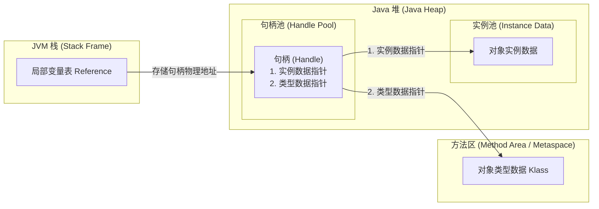
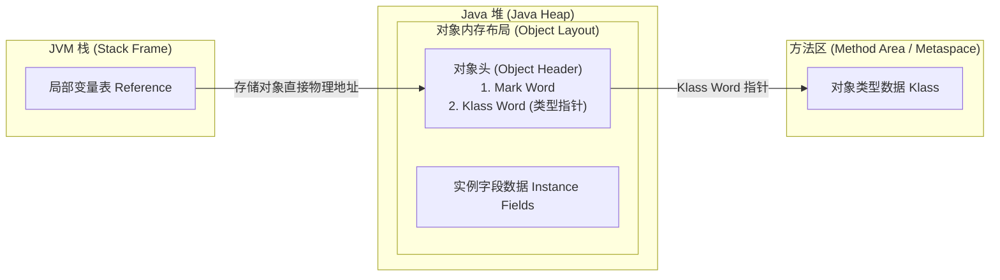
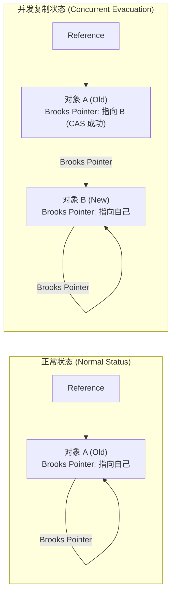
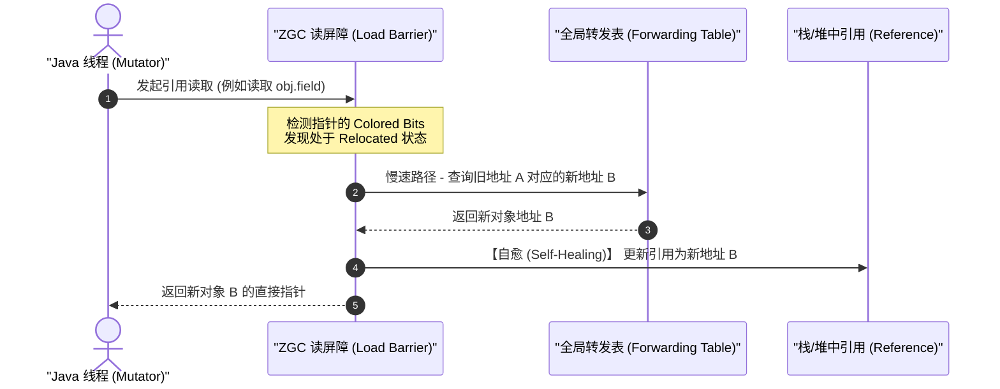

# 2.1.2.3 对象访问定位

在 Java 虚拟机（JVM）中，Java 对象的生命周期和访问机制是其核心运行基石之一。当我们在 Java 代码中通过关键字 `new` 创建一个对象时，JVM 栈中的局部变量表（Local Variable Table）会分配一个 `reference` 类型的引用，而对象具体的实例数据则分配在 Java 堆（Heap）中，对象的类元信息（如方法、字段描述符、父类等）则存储在方法区（Method Area/Metaspace）中。

`reference` 类型在 JVM 规范中被定义为一种指向对象的引用。然而，JVM 规范并未规定这个引用应该通过何种方式去定位、访问到堆中的具体对象。因此，对象访问定位的实现完全取决于虚拟机的具体设计。在 JVM 发展历史上，主要存在两种主流的对象访问定位方式：**句柄访问（Handle Access）** 与 **直接指针访问（Direct Pointer Access）**。

本文将深入 JVM 底层、硬件架构与垃圾回收器（GC）的设计视角，详细剖析这两种对象访问定位机制的物理设计、性能模型、HotSpot 虚拟机的工程权衡，以及现代整理型 GC 在无句柄设计下的前沿寻址优化。

---

## 1. 句柄访问（Handle Access）机制深度剖析

### 1.1 概念模型与设计初衷
句柄访问的核心思想是**“间接寻址”**。为了避免局部变量表中的 `reference` 直接暴露堆中对象的物理内存地址，JVM 在 Java 堆中划分出一块独立的内存区域作为**句柄池（Handle Pool）**。

在这种设计下，`reference` 变量中存储的不再是堆中对象的实际物理地址，而是该对象在句柄池中所对应句柄的**物理地址**。句柄充当了引用与真实对象数据之间的“中介”。

### 1.2 双重解耦指针模型与物理设计
句柄池中的每个句柄并不是一个简单的单指针，而是一个结构体，通常包含两个核心的物理指针，形成**双重解耦指针模型**：

1. **对象实例数据指针（Instance Data Pointer）**：指向 Java 堆中该对象实际的实例数据（Fields 成员变量）的物理起始地址。
2. **对象类型数据指针（Type Data Pointer）**：指向方法区（或元空间 Metaspace）中该对象所属类元数据的物理地址（在 HotSpot 语义中即 `Klass` 结构体）。



### 1.3 双重解耦的数学与工程推导
为什么需要这样一层间接的物理抽象？其最大的工程价值在于**解耦了对象位置的变动对执行栈的影响**。

设堆中对象的物理基地址为 $P_{obj}$，句柄的物理地址为 $P_{handle}$，栈中引用的值为 $R$。
在句柄访问模式下，它们的关系满足：
$$R = P_{handle}$$
$$P_{handle} \rightarrow P_{obj}$$

当垃圾回收器执行整理（Compaction）或者复制（Evacuation）算法时，对象在堆中的物理地址会从 $P_{obj}$ 移动到 $P'_{obj}$。
* **对于栈与寄存器**：由于 $R = P_{handle}$ 依然成立，局部变量表或 CPU 寄存器中的引用 $R$ **完全不需要做任何修改**。
* **对于句柄池**：GC 只需要单点更新句柄池中 $P_{handle}$ 对应的“实例数据指针”，将其从指向 $P_{obj}$ 修改为指向 $P'_{obj}$。

在早期垃圾回收器（如 Serial、ParNew 等 STW 整理型垃圾回收器）的设计中，这种双重解耦极大地简化了 GC 的**重定位（Relocation/Update References）**阶段的逻辑。因为 GC 线程不需要去深度扫描线程栈、修改每个线程栈帧中的局部变量表，也不需要扫描其他堆中对象对当前对象的引用，只需集中更新句柄池即可。

---

## 2. 直接指针访问（Direct Pointer Access）机制深度剖析

### 2.1 概念模型与高效寻址
直接指针访问的核心思想是**“直接寻址”**。在这种模式下，JVM 栈中局部变量表的 `reference` 存储的直接就是堆中对象实例数据的**物理起始地址**。

### 2.2 $O(1)$ 高速字段访问设计与 Klass 指针下沉
如果 `reference` 直接指向了堆中对象的物理首地址，那么当程序通过引用访问对象字段时，CPU 可以直接发起针对该地址的内存加载指令，不需要经过任何中介，这实现了绝对物理意义上的 $O(1)$ 字段访问。

然而，这也带来了一个关键问题：**如何访问该对象的类型数据（Klass 元数据）？**

为了解决这个问题，直接指针访问将“类型数据指针”从句柄池下沉到了**对象自身的内存布局**中。在直接指针模型下，堆中对象的物理结构被设计为包含两个部分：
1. **对象头（Object Header）**：
   * **Mark Word**：存储对象自身的运行时数据（哈希码、GC 分代年龄、锁状态标志、偏向线程 ID 等）。
   * **Klass Word（类型指针）**：直接指向方法区中类元数据（`Klass`）的物理地址。
2. **实例数据（Instance Data）**：存储用户定义的各个字段的实际内容。



在直接指针定位下：
* **访问对象实例字段**：通过 `reference`（即对象起始物理地址 $P_{obj}$）加上字段偏移量（Field Offset）直接计算出内存地址并读取，仅需一次指针解引用。
* **访问对象类型数据（如执行虚方法分派、类型检查 `instanceof`）**：需要通过 `reference` 找到对象头，读取其中的 Klass Word 指针，再通过该指针寻址到方法区中的 `Klass`。这需要两次指针解引用。

---

## 3. 句柄与直接指针的微观性能度量对比

为了更直观地理解两种访问定位在 CPU 硬件流水线与内存子系统中的差异，我们可以从“高频字段读写”与“GC 整理期对象移动”两个微观场景进行量化对比。

### 3.1 高频字段读写场景（Read/Write Dominant）
在现代工业级应用中，Java 线程运行期间，有超过 95% 的 CPU 时钟周期都用于执行业务逻辑（如字段的读取、修改、计算），而 GC 占用的时间通常只占很小比例。因此，对象访问在 CPU 端的微观性能至关重要。

#### 3.1.1 硬件寻址指令数与流水线停顿（Pipeline Stall）
* **句柄访问的指令序列**：
  要在句柄模式下读取一个对象内部的整型字段（设字段偏移量为 16 字节），在 x86-64 汇编层面的伪代码如下：
  ```assembly
  ; 假设 rsi 寄存器存放着 reference (句柄的物理地址)
  mov rdi, [rsi]       ; 第一次解引用：加载句柄中指向对象实例数据的指针到 rdi
  mov eax, [rdi + 16]  ; 第二次解引用：加载实例数据物理地址偏移 16 字节处的字段到 eax
  ```
  在 CPU 执行上述指令时，第二条指令 `mov eax, [rdi + 16]` 严格依赖于第一条指令 `mov rdi, [rsi]` 的执行结果（数据相关性，Data Dependency）。这意味着，在 L1 Cache 未命中（Cache Miss）的情况下，CPU 的指令流水线将不得不停顿（Stall），等待慢速的内存总线将句柄数据读取到寄存器中，然后才能发射第二条读取指令。
* **直接指针的指令序列**：
  直接指针模式下的汇编层操作：
  ```assembly
  ; 假设 rsi 寄存器存放着 reference (对象的直接物理地址)
  mov eax, [rsi + 16]  ; 一次解引用：直接通过物理基地址偏移 16 字节读取字段
  ```
  该指令直接计算物理地址并发起 Load 操作，没有数据依赖关系链，CPU 乱序执行引擎（Out-of-Order Engine）可以轻松地将此内存加载操作与其他非依赖指令并发执行，大大提高了流水线吞吐量。

#### 3.1.2 CPU 缓存局部性（Cache Locality）与 Cache Miss
现代 CPU 依靠高速缓存（L1、L2、L3 Cache）来弥补内存访问延迟。内存是以缓存行（Cache Line，通常为 64 字节）为单位载入 CPU 高速缓存的。
* 在**直接指针**模式下，对象头和对象的实例数据在堆内存中是物理连续的。当 CPU 读取对象的第一个字段时，由于物理相邻，后续字段甚至 Klass Word 极大概率已经随着同一个 Cache Line 被一起加载到了 L1/L2 Cache 中，表现出极高的空间局部性。
* 在**句柄访问**模式下，句柄池和实例数据分布在堆内不同的物理内存段上。这意味着访问一个对象需要加载两个物理不连续的内存块，这不仅使得每次对象访问的 Cache Miss 概率翻倍，而且还会迅速污染（Pollute）宝贵的 CPU Cache，挤占其他活跃数据的缓存空间。

### 3.2 GC 整理期对象移动场景（GC Evacuation/Relocation）
垃圾回收器（如 Mark-Compact、Copying GC）为了消除内存碎片，会频繁在堆内移动存活的对象。

#### 3.2.1 引用更新的计算复杂度与重定位开销
当对象从旧地址 $P_{old}$ 移动到新地址 $P_{new}$ 时，所有指向该对象的 `reference` 都必须被修正为 $P_{new}$。
* **句柄访问**：
  * **时间复杂度**：$O(1)$。
  * **机制**：GC 只需要将句柄池中对应的句柄修改为指向 $P_{new}$。由于句柄地址 $P_{handle}$ 未变，所有指向该句柄的 `reference`（无论是栈中、寄存器中，还是其他对象的字段中）都不需要被扫描和修改。
* **直接指针**：
  * **时间复杂度**：$O(N)$，其中 $N$ 为该对象被引用的总次数。
  * **机制**：GC 必须扫描整个运行栈（Stack Frames）、寄存器（Registers）、全局根（JNI Handles、System Dictionary等），以及全堆中所有其他对象的引用字段（通过 Card Table 或 Remembered Set 辅助定位），将所有指向 $P_{old}$ 的物理指针全部改写为 $P_{new}$。这带来了显著的 CPU 开销和同步屏障开销。

### 3.3 性能量化度量对比表

| 度量维度 | 句柄访问（Handle） | 直接指针（Direct Pointer） | 硬件与系统工程考量 |
| :--- | :--- | :--- | :--- |
| **实例字段访问耗时** | 慢（2次内存解引用） | **极快（1次内存解引用）** | 字段读写是 Java 应用的绝对高频操作，直接指针性能提升显著 |
| **类型数据访问耗时** | 较快（2次内存解引用，通过句柄） | 较慢（2次内存解引用，通过对象头） | 两者复杂度相同，但在多态调用频繁时，直接指针通过 inline cache 规避 |
| **内存访问指令依赖** | 存在强数据相关性，容易导致 CPU 流水线停顿 | **无依赖，便于乱序执行和指令级并行（ILP）** | 直接指针可最大化利用 CPU 乱序执行引擎的空闲计算周期 |
| **CPU 高速缓存效率** | 差（句柄池和实例池不连续，引发双重 Cache Miss） | **优（对象头与字段物理连续，局部性强）** | 减少了内存总线带宽的无谓消耗 |
| **GC 对象移动开销** | **极低（只需更新句柄池中的单一指针）** | 较高（需更新栈、堆中所有指向该对象的引用） | 随着堆体积增大，直接指针在并发整理时的引用更新成本极高 |
| **额外空间开销** | 句柄池占用独立内存，每个对象额外消耗 8~16 字节 | **无句柄池开销（但对象头需保留 Klass 指针）** | 句柄池会带来堆内存的零碎化和额外开销 |

---

## 4. OpenJDK HotSpot 虚拟机的权衡逻辑

作为目前全球使用最广泛的 JVM 实现，OpenJDK HotSpot 虚拟机在对象访问定位上毫不犹豫地选择了**直接指针访问**。这一决策背后有着深刻的工程权衡逻辑。

### 4.1 “高频”与“低频”的博弈
在软件系统的性能优化中，有一条黄金定律：**优先优化占运行时间 99% 的核心路径，可以适当容忍占 1% 的边缘路径开销**。

* **高频路径（Mutator 执行）**：Java 业务代码在运行期间，伴随着海量的对象字段读写（如 `getfield`/`putfield` 字节码指令）。如果采用句柄访问，意味着每一次字段读写都要多出一次内存跳转。对于一个密集型计算或者高并发的 Web 应用，累积的性能损耗是毁灭性的。
* **低频路径（GC 执行）**：虽然对象移动在 GC 期间发生，但即使是在吞吐量优先的 Parallel GC 或者并发的 CMS GC 中，GC 运行时间占应用生命周期的比例通常也被控制在 1%~5% 以下。直接指针虽然使得 GC 在对象移动时的引用更新（Update References）步骤变得繁重，但这一代价是由“低频”的 GC 来承担，换取了“高频”的 Mutator（业务线程）在 95% 以上的时间里以极速运行。

因此，HotSpot 团队在设计之初就明确了这一权衡：**宁可在 GC 期间承受更高的扫描与更新开销，也要保证 Java 业务代码运行期间最高的字段访问效率。**

### 4.2 局部性原理与现代硬件架构的契合
从奔腾时代到现在的多核多线程服务器芯片，CPU 频率的增长远快于内存延迟的降低（即“内存墙”问题）。因此，现代硬件架构非常依赖局部性原理（Locality Principle）和 CPU 预取器（Prefetcher）。

* 直接指针让对象在堆中保持了紧凑、连续的物理布局，对象的 Mark Word、Klass Word 和 Fields 都在一个连续的内存视界内。当 JVM 解释执行或通过 JIT 编译器生成机器码时，连续的内存布局可以让 CPU 硬件预取器提前将对象数据拉入高速缓存。
* 句柄访问导致的“指针跳跃”会彻底打乱预取器的算法，使硬件预取失效，导致 CPU 大量时间浪费在等待内存响应上。

### 4.3 澄清：HotSpot 源码中的 `Handle` 误区
很多阅读过 OpenJDK HotSpot 源码的开发者可能会感到困惑：在 HotSpot 的 C++ 源码中，随处可见 `Handle`、`oop` 以及 `HandleMark` 等命名，例如：
```cpp
// HotSpot 内部 C++ 源码示例
void LinkResolver::resolve_special_method(CallInfo& result, Handle recv, ...) {
    // 这里的 recv 是一个 Handle 类型的变量
}
```
**这是否意味着 HotSpot 底层使用了句柄访问？**

这是一个非常经典的认识误区。我们需要区分 **Java 字节码/解释器视角的引用定位** 与 **JVM 内部 C++ 运行时视角的指针管理**：

1. **Java 字节码层面（JIT/解释器）**：Java 代码中编译出来的 `reference` 对应的机器码，直接就是堆中对象的物理内存地址（即**直接指针**）。在 Java 运行时环境里，没有句柄池的概念。
2. **JVM 内部 C++ 运行时层面**：HotSpot 本身是用 C++ 编写的。当 C++ 代码在执行垃圾回收、类加载、反射或者安全点（Safepoint）检查等操作时，GC 可能会在后台运行并移动堆中的 Java 对象。如果 C++ 层的变量直接持有一个堆内 Java 对象的原始指针（在 HotSpot 中称为 `oop`，即 Ordinary Object Pointer），一旦发生 GC，堆中对象被移动，C++ 栈中的 `oop` 就会变成野指针，导致 JVM 崩溃。
   为了解决 C++ 指针失效的问题，HotSpot 在 C++ 内部实现了一套 `Handle` 机制。C++ 线程的栈帧中会分配一个内部句柄区域（Handle Area），C++ 代码中的 `Handle` 变量指向这个句柄区域，而句柄区域内的槽位再指向真实的 Java 堆对象。当 GC 移动对象时，GC 线程会自动更新这个 C++ 内部句柄区域中的指针。
   
因此，**HotSpot 内部的句柄是专门用来保护 C++ 运行时的安全指针机制，与 Java 堆内的句柄访问模型是完全不同的物理概念。**

---

## 5. 现代整理型垃圾回收器在直接指针下的无句柄优化

随着堆内存进入 GB 乃至 TB 时代，传统的 Stop-the-World（STW）整理算法因为暂停时间过长而无法满足低延迟（Low-Latency）应用的需求。现代垃圾回收器（如 G1, Shenandoah, ZGC 等）都引入了**并发整理（Concurrent Evacuation）**技术，即在 Java 业务线程正常运行的同时，GC 线程在后台并发地复制和移动对象。

由于没有了句柄池的解耦，直接指针在并发整理上面面临着极其严峻的挑战：**当 GC 线程把对象 A 复制到新位置 B，但栈和堆中大量的引用依然指向旧位置 A 时，Java 线程如果并发地去读写 A，就会产生严重的数据不一致（数据脏读/脏写）**。

现代 GC 并没有妥协退回到句柄模式，而是通过在直接指针下引入**写屏障（Write Barrier）、读屏障（Load Barrier）以及指针自愈（Self-Healing）**等硬核技术，完美攻克了这一难题。

### 5.1 Shenandoah GC 的 Brooks Pointers 与读/写屏障

Shenandoah GC 是首个实现在大内存下进行并发整理的收集器。在它的早期版本中，为了在直接指针下支持并发移动，引入了 **Brooks Pointer（布鲁克斯指针）**。

#### 5.1.1 物理结构与指向关系
在 Brooks Pointer 设计中，每个 Java 对象的内存布局在原有对象头（Mark Word + Klass Word）的前面，额外增加了一个**引用指针字段（Brooks Pointer）**。

* 在对象创建后或非 GC 并发复制阶段，这个 Brooks Pointer 默认指向对象**自身**的首地址。
* 此时，`reference` 依然直接指向对象，而访问其字段时，都隐含着一层针对 Brooks Pointer 的解引用。



#### 5.1.2 并发复制与 CAS 保护
当 GC 线程决定并发复制对象 A 时：
1. GC 线程在新的内存区域分配空间，并将对象 A 的全部内容（包括 Brooks Pointer）原样复制到新对象 B。此时新对象 B 的 Brooks Pointer 指向它自己。
2. GC 线程尝试通过 **CAS（Compare-And-Swap）** 操作，将旧对象 A 的 Brooks Pointer 指向新对象 B。
3. 如果 CAS 成功，说明复制完成，且新对象 B 成为合法的活跃对象。
4. 如果 CAS 失败（说明在这期间有 Java 线程并发地写入了旧对象 A 并抢先修改了 Brooks Pointer），GC 线程将放弃新复制的对象 B，依然以旧对象 A 为准。

#### 5.1.3 读/写屏障的配合机制
Java 线程在读写对象字段时，JVM 会在生成的机器码中插入**读写屏障**：
* 当 Java 线程执行字段写操作 `obj.field = value` 时，**写屏障（Write Barrier）**会强制先获取 `obj` 头部的 Brooks Pointer，并解引用定位到最新的物理对象（如果已经复制完成，则是对象 B，否则是对象 A），然后再执行字段改写。这确保了写操作绝对不会发生在外溢的旧对象上。
* 当 Java 线程读取引用时，**读屏障（Load Reference Barrier, LRB）**会截获该引用，并通过 Brooks Pointer 返回新对象的直接物理地址，从而在直接指针下规避了句柄，保障了并发整理的正确性。

---

### 5.2 ZGC 的着色指针（Colored Pointers）与自愈读屏障（Load Barrier with Self-Healing）

ZGC 是一款无停顿（Sub-millisecond Pause）的现代并发垃圾回收器，它摒弃了 Brooks Pointer 这种需要在每个对象头部增加额外物理指针的设计，转而采用了更高效的**着色指针（Colored Pointers）**与**自愈读屏障（Self-Healing Load Barrier）**技术。

#### 5.2.1 着色指针的物理设计
在 64 位系统下，虚拟地址空间非常巨大（$2^{64}$ 字节，即 16EB），而目前没有任何物理硬件能支持如此庞大的物理内存。因此，现代操作系统和 CPU 通常只使用了 64 位虚拟地址中的低 48 位。

ZGC 巧妙地利用了这 48 位地址线中的高几位来携带 GC 的元数据状态，即“着色指针”。在 ZGC 中，64 位指针的分配如下：
* **0 ~ 41 位（42 位，共 4TB）**：表示真实的堆内对象物理内存地址。
* **42 ~ 45 位（4 位）**：元数据标志位（Metadata Bits），包括：
  * `Marked0` / `Marked1`：用于并发标记（Marking）阶段，记录对象是否存活。
  * `Remapped`：用于并发重定位（Relocation）阶段，表示该指针是否已经指向了对象移动后的最新地址。
  * `Finalizable`：与析构/终结器相关。
* **46 ~ 63 位（18 位）**：未使用，保留为 0。

```
+-------------------+-------------+-----------------------------------------------+
| 63             46 | 45       42 | 41                                          0 |
+-------------------+-------------+-----------------------------------------------+
|      未使用       | 元数据标志位  |             对象真实的物理内存地址              |
|    (Must be 0)    | (Colored)   |               (Max 4TB Heap)                  |
+-------------------+-------------+-----------------------------------------------+
                       |  |  |  +-- Finalizable
                       |  |  +----- Remapped
                       |  +-------- Marked1
                       +----------- Marked0
```

通过这一设计，对象的“状态信息”被直接写在了指向它的**引用指针（Reference）**里，而不是对象本身。

#### 5.2.2 读屏障与自愈机制（Self-Healing）
当 Java 线程通过局部变量表中的 `reference` 访问对象字段时，ZGC 会在 CPU 指令中触发一个**读屏障（Load Barrier）**。这个读屏障并不是一个沉重的系统调用，而是一段非常轻量级的汇编检测代码。

其自愈运行机理如下：



1. **状态检测**：当 Java 线程读取引用时，读屏障快速测试该引用指针的元数据标志位。如果指针的颜色是 `Remapped`，说明该指针已经指向了对象的最新位置，测试直接通过，以 $O(1)$ 的速度继续执行（这是**快速路径 Fast Path**，仅需 1~2 个 CPU 周期）。
2. **触发慢速路径（Slow Path）**：如果测试发现指针的颜色不是 `Remapped`，而是处于并发移动（Relocation）过程中的旧状态，读屏障将拦截该请求并跳转到慢速路径。
3. **查询转发表（Forwarding Table）**：慢速路径代码会去全局的 `Forwarding Table`（转发表，记录了所有被移动对象的旧物理地址与新物理地址的映射关系）中查询当前对象的新物理地址。
   * 如果该对象已经被 GC 线程复制到了新位置，直接获取新地址。
   * 如果该对象还没被复制，当前 Java 线程将**主动协助 GC**，在原地将该对象复制到新位置，并更新转发表（通过 CAS 竞争）。
4. **自愈（Self-Healing）**：一旦获取到新物理地址，读屏障在将新地址返回给 CPU 的同时，会**顺手更新原引用变量（即栈或堆中的那条 reference 记录）的内容**，将其改写为最新的物理地址，并把标志位涂上 `Remapped` 颜色。
5. **后续加速**：下一次 Java 线程再次访问这同一个 `reference` 时，读屏障检测到已经是 `Remapped` 状态，直接走快速路径，无需再次查表。

通过着色指针与自愈读屏障，ZGC 彻底解决了并发整理下指针更新的难题。它使得 JVM 在**不使用句柄**、保持**直接指针高速访问**的前提下，实现了极低延迟的并发垃圾回收。

---

### 5.3 G1 GC 的记忆集（Remembered Set）与写屏障

G1（Garbage-First）垃圾回收器是一种基于 Region 分区的垃圾回收器，它在进行 Minor GC（新生代收集）和 Mixed GC（混合收集）时，会选择性地对部分 Region 进行垃圾复制 and 整理。

虽然 G1 在整理阶段是 Stop-the-World（STW）的，即它会暂停所有的 Java 线程来移动对象和更新引用，但在拥有数十 GB 乃至数 TB 内存的服务器上，如果靠全堆扫描来寻找并更新所有指向被移动对象的直接指针，STW 的停顿时间依然会失控。

#### 5.3.1 记忆集（Remembered Set, RSet）的作用
为了避免全堆扫描，G1 在每个 Region 内维护了一个称为 **Remembered Set（RSet，记忆集）** 的数据结构。RSet 记录了**“谁指向了我”**，即哪些其他 Region 中的对象引用了当前 Region 中的对象。

当 Region X 中的对象 A 被复制到新位置并获得新直接指针地址时，G1 不需要扫描全堆，只需要查看 Region X 的 RSet，即可知道全堆中具体有哪些 Region 的哪些对象槽位（Slot）持有了指向对象 A 的引用。G1 只需要精准扫描并更新这些特定的槽位即可，从而将引用更新的时间控制在极短的范围内。

#### 5.3.2 卡表（Card Table）与写后屏障（Post-Write Barrier）
RSet 的维护不能依靠 GC 时的扫描，而必须在 Java 线程日常运行期间实时记录。这就依赖于**写后屏障（Post-Write Barrier）**。

1. **卡表（Card Table）**：G1 将整个堆内存划分为无数个大小为 512 字节的虚拟卡页（Card Page）。并在外部用一个字节数组表示卡表，每个卡页对应卡表中的一个字节（Card Byte）。
2. **写屏障拦截**：当 Java 线程执行对象引用的赋值操作（如 `objA.field = objB`）时，JVM 会在赋值指令之后插入写后屏障。
3. **卡标记（Card Dirtying）**：写屏障会根据 `objA` 字段所在的物理内存地址，计算出其对应的卡表字节，并将其标记为 **Dirty（脏卡）**。
4. **异步 RSet 更新**：G1 的后台辅助线程（Concurrent Refinement Threads）会定期扫描这些被标记为 Dirty 的卡页，提取其中发生变化的直接指针引用，并将新的引用关系登记到被引用对象所在 Region 的 RSet 中。

G1 通过写屏障和 RSet 这种精细的账本式管理，使得直接指针在面对局部区域并发/STW 整理时，依然能够快速、高效地完成引用的更新，而无需回退到句柄模式。

---

## 6. 总结与思维脉络梳理

对象访问定位是 JVM 运行时系统设计中最底层、也最核心的命题之一。从“句柄”到“直接指针”，再到“并发垃圾回收器下的读/写屏障与指针自愈”，其演进历程折射出了 JVM 设计者在**“执行效率”**与**“内存管理（GC）成本”**之间的反复权衡。

1. **句柄访问**以牺牲每次字段读写的 CPU 时钟周期为代价，换取了 GC 对象整理时的绝对解耦与低开销。在早期内存小、GC 算法简单、CPU 单核且对缓存不敏感的时代，这是一种非常稳妥的设计。
2. **直接指针**则反其道而行之，将性能优化的砝码完全倾斜给高频的业务执行路径（Mutator），实现了 $O(1)$ 速度的极速字段访问，高度契合了现代多核 CPU 的乱序执行与高速缓存架构。
3. 进入大内存与并发 GC 时代后，为了解决直接指针下并发移动对象的指针不一致问题，JVM 并未退回到句柄模式，而是借助了**读/写屏障（Brooks Pointer, LRB）**、**着色指针（Colored Pointers）与指针自愈（Self-Healing）**等底层软硬件协同技术，在维持直接指针高效寻址的前提下，实现了近乎零停顿的并发整理。

这一演进历程完美践行了系统工程设计的终极思想：**将复杂度沉淀在底层框架与垃圾回收器中，把极致的性能和简单性留给上层的 Java 应用程序**。
