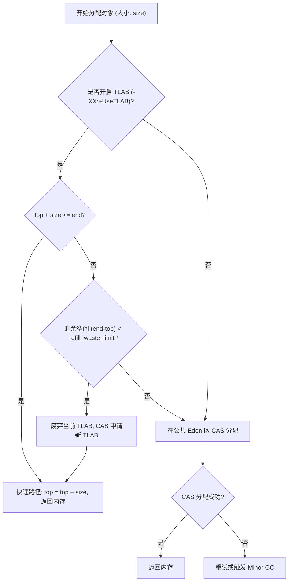
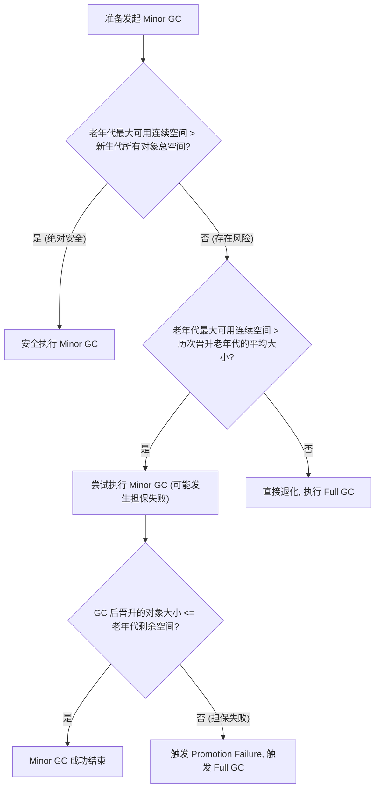

# 2.1.2.4 内存分配策略

Java 虚拟机的内存分配策略是 JVM 性能调优与架构设计的核心基石。在 HotSpot 虚拟机中，对象的创建、分配、晋升以及回收，绝非简单的“在堆上划出一块空间”，而是涉及到复杂的底层数据结构、多线程并发同步、硬件缓存友好性以及垃圾回收器的协同工作。

本文将从物理与源码视角深度剖析 Java 虚拟机的内存分配策略，涵盖经典分代分配的五大准则、现代垃圾回收器（G1、ZGC、Shenandoah）对分配策略的重塑、高并发场景下的晋升/疏散失败根因，以及生产环境下的调优实战。

---

## 1. HotSpot 堆内存模型物理架构与分配本质

在深入具体的分配策略之前，必须先理清 JVM 堆内存的物理布局以及对象分配的物理本质。

### 1.1 经典分代物理布局
根据 **弱分代假说（Weak Generational Hypothesis）** 和 **强分代假说（Strong Generational Hypothesis）**，HotSpot 经典分代收集器（如 Serial、ParNew、Parallel Scavenge、CMS）将 Java 堆物理划分为：
*   **新生代（Young Generation）**：容纳绝大多数朝生夕灭的新生对象。细分为 **Eden 空间**、**Survivor 0 空间（S0/From）**、**Survivor 1 空间（S1/To）**，默认物理比例为 `8:1:1`。
*   **老年代（Old Generation / Tenured Generation）**：容纳生命周期较长、或者从新生代晋升上来的存活对象。

```
+-------------------------------------------------------------------+
|                           Java Heap                               |
+------------------------------------+------------------------------+
|             Young Gen              |           Old Gen            |
+------------------+--------+--------+                              |
|       Eden       | S0(From| S1(To) |                              |
|      (80%)       | (10%)  | (10%)  |                              |
+------------------+--------+--------+------------------------------+
```

### 1.2 内存分配的底层机理
当 Java 程序执行 `new` 指令时，JVM 首先在类加载检查通过后，为新生对象分配内存。分配的物理方式取决于内存的规整度：

1.  **指针碰撞（Bump-the-pointer）**：若堆内存绝对规整，已用内存与空闲内存有明确的分界指针。分配时仅需将分界指针向空闲方向挪动一段与对象大小相等的距离。这种方式速度极快，时间复杂度为 $O(1)$。
2.  **空闲列表（Free List）**：若堆内存由于垃圾回收（如标记-清除算法）产生碎片，已用与空闲内存交错分布，JVM 必须维护一个列表记录空闲内存块的物理地址与大小。分配时需要检索列表找到足够大的空间划分给对象并更新列表，物理开销较高。

### 1.3 解决分配并发冲突：TLAB（Thread Local Allocation Buffer）
在多线程高并发环境下，直接在公共堆空间上使用“指针碰撞”分配内存会面临严重的线程安全问题（多个线程同时挪动同一个分界指针）。如果使用全局加锁或 CAS 失败重试，将极大拖慢分配速度。

为此，HotSpot 引入了 **TLAB（线程私有分配缓冲区）**：
*   **物理设计**：JVM 在 Eden 区为每个新创建的线程划分一块专属的、私有的内存区域（TLAB）。
*   **分配逻辑**：线程需要分配内存时，首先在自己的 TLAB 中通过“指针碰撞”进行无锁分配。只有当 TLAB 空间耗尽，需要重新申请（Refill）新的 TLAB 时，才需要使用全局 CAS 进行同步锁定。

---

## 2. 经典分代内存分配的五大准则物理剖析

经典分代垃圾回收器在长期的工业实践中，沉淀出了五大核心内存分配准则。

### 2.1 准则一：对象优先在 Eden 分配与 TLAB 深度物理设计

在绝大多数情况下，Java 对象首先会在新生代的 Eden 区域进行分配。当 Eden 区没有足够空间时，虚拟机会发起一次 Minor GC。然而，在真正向 Eden 申请物理内存之前，JVM 会优先走 TLAB（Thread Local Allocation Buffer）路径。

#### 2.1.1 TLAB 的底层数据结构与物理指针
在 HotSpot 源码中，每个线程的 TLAB 状态由 `ThreadLocalAllocBuffer` 类管理，其核心包含以下几个物理指针与限制值：

*   `start`：指向当前线程 TLAB 的起始物理地址。
*   `top`：当前 TLAB 的分配指针。每次分配成功后，`top = top + size`。
*   `end`：当前 TLAB 的物理结束地址（不含 Reserved 空间）。
*   `hard_end`：TLAB 真正的物理结束边界，通常会比 `end` 多留出一小部分空间，用于容纳对齐填充或防止越界。
*   `refill_waste_limit`：重新分配（Refill）TLAB 的最大浪费阈值（废弃当前 TLAB 所允许的最大剩余空间字节数）。

```
+-------------------------------------------------------------+
| start                 top                         end       |
|   |                    |                           |        |
|   v                    v                           v        |
|   +--------------------+---------------------------+--------+
|   |    已分配对象      |        空闲空间           |Reserved|
|   +--------------------+---------------------------+--------+
+-------------------------------------------------------------+
```

#### 2.1.2 TLAB 对象的 Fast Path 与 Slow Path 分配流程
当线程尝试分配大小为 `size` 的对象时，其内部决策路径如下：

1.  **快速路径（Fast Path / TLAB Inline Allocation）**：
    计算 `new_top = top + size`。
    如果 `new_top <= end`，说明当前 TLAB 空间充足。此时直接更新 `top = new_top`，并返回原 `top` 指针处的物理内存。此过程**完全无锁，不涉及任何 CPU 锁总线操作**，是 Java 对象分配效率极高的根本原因。
2.  **慢速路径（Slow Path / TLAB Refill & Direct Allocation）**：
    如果 `new_top > end`，说明当前 TLAB 空间不足。此时触发慢速分配：
    *   **计算浪费空间**：计算当前 TLAB 剩余可用字节数 `remaining = end - top`。
    *   **判断是否废弃**：将 `remaining` 与当前线程的 `refill_waste_limit` 进行比对。
        *   如果 `remaining < refill_waste_limit`：说明当前 TLAB 浪费的空间在允许的阈值范围内。JVM 会**废弃**当前 TLAB（将剩余空间填充为一个 Dummy Object，如 `int[]` 数组，以保证垃圾回收器在进行线性扫描时内存的连续性）。然后，线程通过 CAS 竞争从 Eden 区重新申请一块新的 TLAB，并在新 TLAB 中进行 Fast Path 分配。
        *   如果 `remaining >= refill_waste_limit`：说明当前 TLAB 的剩余空间较大，若直接废弃会造成过多的内存碎片和浪费。因此，JVM **保留**当前 TLAB（供后续较小对象分配使用），而该大对象则直接通过 CAS 锁的方式在**公共 Eden 空间**进行分配。



#### 2.1.3 TLAB 相关的关键 JVM 参数
*   `-XX:+UseTLAB`：启用线程私有分配缓冲区。JDK 8 及以上版本默认开启。
*   `-XX:TLABSize`：设置 TLAB 的初始大小。如果不设置，JVM 会根据线程分配速率和 GC 频率动态计算。
*   `-XX:+ResizeTLAB`：是否允许 JVM 动态调整各个线程的 TLAB 大小。默认开启，建议保持默认。
*   `-XX:TLABRefillWasteFraction`：默认值为 64。即 `refill_waste_limit = TLABSize / 64`。若高并发下发现 CAS 争用严重，可适当调小该值（增大分母），从而减少直接去 Eden 分配的概率。

---

### 2.2 准则二：大对象直接进入老年代的物理机制与拷贝规避

大对象是指需要大量连续内存空间的 Java 对象。在经典分代架构中，为了防止这些对象在新生代频繁发生内存拷贝，JVM 提供了直接将其分配到老年代的策略。

#### 2.2.1 `-XX:PretenureSizeThreshold` 参数的物理边界与局限性
该参数用于设置一个字节大小阈值，任何大于该阈值的对象，在创建时将直接绕过 Eden 和 Survivor 空间，在老年代分配。

*   **生效局限性**：`-XX:PretenureSizeThreshold` 参数**只对 Serial 和 ParNew 收集器生效**。
*   **不生效原因**：Parallel Scavenge 收集器是基于吞吐量优先设计的，其新生代内存分配由 `ParallelScavengeHeap` 接管，底层使用 `PSYoungGen` 分配器，其在设计时并未集成 `GenCollectorPolicy` 下的 `PretenureSizeThreshold` 判定逻辑。如果使用 Parallel Scavenge，大对象依然会先尝试在 Eden 分配，如果 Eden 空间不足则可能触发 Minor GC，或直接将大对象“担保晋升”到老年代。

#### 2.2.2 为什么要规避大对象在新生代的拷贝？
新生代的对象回收采用的是 **复制算法（Copying Algorithm）**。在 Minor GC 时，存活的对象必须在 Eden、From（S0）和 To（S1）空间之间进行来回物理复制。
1.  **CPU 与总线开销**：复制大对象涉及底层的 `memcpy` 内存拷贝操作。若频繁发生大对象的物理复制，会大量消耗 CPU 周期，并占用巨大的系统总线带宽。
2.  **Survivor 空间溢出**：Survivor 空间通常较小。一个数兆大小的数组如果被复制到 Survivor 区，会迅速将 Survivor 区填满，从而过早触发“动态年龄判定”或者“空间分配担保”，导致其他原本生命周期很短的小对象也被强行晋升到老年代，造成老年代内存空间的提前耗尽。

---

### 2.3 准则三：长期存活对象判定与对象年龄机制

为了决定对象何时应该晋升到老年代，虚拟机给每个对象定义了一个对象年龄（Age）计数器。

#### 2.3.1 Mark Word 中的 Age 字段物理结构
在 64 位 HotSpot 虚拟机中，Java 对象的对象头 Mark Word 物理布局如下：

```
|-------------------------------------------------------------------------------------------------|--------------------|
|                                     Mark Word (64 bits)                                         |       State        |
|-------------------------------------------------------------------------------------------------|--------------------|
| unused:25 | identity_hashcode:31 | unused:1 | age:4 | biased_lock:1 | lock:2                    |       Normal       |
|-------------------------------------------------------------------------------------------------|--------------------|
```

其中，`age:4` 代表分代年龄（GC Age）占用 **4 个比特位（bits）**。
4 个比特位能表示的最大无符号整数是 $2^4 - 1 = 15$。这就是为什么 JVM 参数 `-XX:MaxTenuringThreshold` 的物理上限是 15 的根本原因。如果用户强行配置 `-XX:MaxTenuringThreshold=16`，JVM 在启动初始化时会报错退出。

#### 2.3.2 对象年龄的生命周期流转
1.  **诞生**：对象在 Eden 区被创建，此时其 Mark Word 中的 Age 字段初始化为 `0`。
2.  **首次 GC**：发生 Minor GC 后，若该对象存活，且能够被 Survivor 空间容纳，它将被复制到 To 空间中，此时其 Age 字段自增 1 变为 `1`。
3.  **后续 GC**：此后，该对象每在 Survivor 空间的 S0 和 S1 之间完成一次“复制-存活”的循环，它的 Age 字段就会自增 1。
4.  **晋升**：当它的 Age 达到 `-XX:MaxTenuringThreshold` 设定值时，在下一次垃圾回收时，它将被直接复制到老年代。

---

### 2.4 准则四：Survivor 动态对象年龄判定机制

为了更加灵活地适应不同内存状况，避免老年代出现闲置或新生代积压，HotSpot 虚拟机引入了**动态对象年龄判定（Dynamic Age Determination）**机制。

#### 2.4.1 动态判定核心逻辑（澄清常见误区）
> [!WARNING]
> **常见误区**：很多人误以为动态年龄判定是“在 Survivor 空间中，年龄为 $N$ 的对象大小总和超过了 Survivor 空间的 50%，则大于等于 $N$ 的对象晋升”。
> **正确逻辑**：并不是看“单一某个年龄”的对象大小，而是**从年龄 1 开始累加到年龄 $N$ 的所有对象大小之和，如果超过了 Survivor 空间乘以 `TargetSurvivorRatio` 的比例，那么所有年龄大于等于 $N$ 的存活对象都将直接晋升到老年代**。

#### 2.4.2 累加排序算法的物理模型
假设单侧 Survivor 空间的总容量为 $S$，配置的目标比例为 $R$（由 `-XX:TargetSurvivorRatio` 指定，默认值为 50%）。则目标阈值大小为：

$$T = S \times R$$

在 Minor GC 结束时，JVM 会对当前 Survivor 区存活的对象进行年龄统计，构建一个年龄大小映射表 `AgeTable`，然后计算累加值：

$$\sum_{i=1}^{n} Size(Age_i) > T$$

当累加到某个年龄 $n$ 时，总大小首次超过了 $T$，则当前计算出的晋升年龄限制将变为 $n$。此时，所有年龄大于等于 $n$ 的对象均被直接晋升。

```
Survivor 空间分布 (Total Size: S)
+---------------+---------------+---------------+---------------+---------------+
|  Age 1 (15%)  |  Age 2 (20%)  |  Age 3 (20%)  |  Age 4 (15%)  |  Free (30%)   |
+---------------+---------------+---------------+---------------+---------------+
  累加过程:
  - Age 1: 15% (未超 50%)
  - Age 1 + Age 2: 35% (未超 50%)
  - Age 1 + Age 2 + Age 3: 55% (超过了 TargetSurvivorRatio = 50%)
  
  结论: 动态晋升年龄阈值被确定为 3。所有 Age >= 3 的对象在本次 GC 结束后直接晋升老年代。
```

#### 2.4.3 HotSpot 源码级计算逻辑（C++ 模拟）
在 HotSpot 源码中（如 `share/vm/gc/shared/ageTable.cpp`），该判定逻辑在 `AgeTable::compute_tenuring_threshold` 中实现：

```cpp
uint AgeTable::compute_tenuring_threshold(size_t survivor_capacity) {
  // target_size = survivor_capacity * TargetSurvivorRatio / 100
  size_t target_size = (size_t)((double)survivor_capacity * ((double)TargetSurvivorRatio / 100.0));
  size_t accum = 0;
  uint age = 1;
  
  // table_size 通常为 16 (即 age 0 ~ 15)
  while (age < table_size) {
    accum += sizes[age]; // sizes[age] 存储当前年龄段存活对象的总字节大小
    if (accum > target_size) {
      break;
    }
    age++;
  }
  
  // 最终的晋升年龄不能超过配置的 MaxTenuringThreshold
  uint threshold = MIN2((uint)age, MaxTenuringThreshold);
  return threshold;
}
```

---

### 2.5 准则五：空间分配担保机制的全校验逻辑

在进行 Minor GC 之前，由于新生代采用复制算法，如果出现极端情况下大量对象依然存活，而单侧 Survivor 空间无法全部接纳时，就需要老年代进行“分配担保（Promotion Guarantee）”，将装不下的对象直接送入老年代。

为了防止老年代自身空间不足而导致分配担保失败（Promotion Failure），JVM 在发起 Minor GC 前会执行一套严密的校验逻辑。

#### 2.5.1 空间分配担保演进历史
*   **JDK 6 Update 24 之前**：
    需要同时检测老年代最大连续可用空间是否大于新生代所有对象总大小，或者大于历次晋升的平均大小，并且还需要通过 `-XX:HandlePromotionFailure` 参数显式允许担保失败。若参数关闭，则直接退化为 Full GC。
*   **JDK 6 Update 24 之后**：
    `-XX:HandlePromotionFailure` 参数被彻底废弃，虚拟机默认允许担保失败。校验逻辑被极大地简化，不再需要用户手动开关控制。

#### 2.5.2 最新空间分配担保逻辑校验流程
当要发起 Minor GC 时，JVM 的物理判定逻辑如下：



---

## 3. 现代垃圾回收器对内存分配策略的重塑

随着 G1、ZGC 和 Shenandoah 等现代低延迟、基于 Region 的垃圾回收器的诞生，传统的“物理分代、连续内存、单向晋升”的分配策略被完全打破。

### 3.1 G1 收集器的 Region 级分配策略

G1 将整个 Java 堆物理划分为数千个大小相同的独立区域（Region）。Region 的大小在启动时通过 `-XX:G1HeapRegionSize` 确定，范围为 `1MB ~ 32MB` 且必须是 2 的幂次方。

#### 3.1.1 Humongous Region 大对象物理判定
在 G1 中，任何大小**超过单个 Region 容量 50%** 的对象，都被判定为 **巨型对象（Humongous Object）**。

*   **分配位置**：巨型对象直接被分配在老年代的 **Humongous Region** 中。如果一个巨型对象极大（例如 40MB，而 Region 大小为 16MB），G1 将会在堆中寻找**物理上连续的多个 Humongous Region** 进行合并分配。
*   **物理开销**：由于需要物理上连续的多个 Region，当堆内存存在严重碎片化时，即使空闲总内存十分充足，也可能会因为找不到连续的 Region 而导致分配失败，进而强行触发 G1 的 Full GC。

#### 3.1.2 Humongous 对象的动态回收机制
在早期 G1 版本中，Humongous 对象只能在 Full GC 阶段被回收。从 JDK 8u40 开始，G1 对此进行了重大优化：
*   **并发判定**：G1 会在并发标记阶段（Concurrent Mark）统计 Humongous 对象的存活状态。
*   **提前回收**：对于没有被任何其他非巨型对象引用的死亡巨型对象，G1 可以在 **Young GC（新生代收集）** 阶段直接对该 Humongous Region 进行物理回收并释放空间，从而大大降低了老年代的堆积压力，延缓了 Full GC 的发生。

---

### 3.2 ZGC 现代非分代与大页面分配策略

ZGC（Z Garbage Collector）在早期版本中是完全不分代的（虽然 JDK 21 引入了 Generational ZGC 逻辑分代，但其页面结构依然存在）。ZGC 同样将内存划分为不同的 Page（页面），但与 G1 不同，ZGC 的 Page 分为三种类型：

```
+-------------------------------------------------------+
|                       ZGC Page                        |
+-------------------+-------------------+---------------+
|    Small Page     |    Medium Page    |  Large Page   |
|       (2MB)       |      (32MB)       |  (Variable)   |
|   Objects < 256K  |  256K <= Obj < 4M |  Objects >= 4M|
+-------------------+-------------------+---------------+
```

#### 3.2.1 ZGC Large Page 的物理特性
*   **物理尺寸**：Large Page 的大小是动态变化的，但必须是 2MB 的整数倍。
*   **独占模式**：每个 Large Page **只存放一个大于等于 4MB 的超大对象**。这意味着 Large Page 中绝不存在多个对象的物理共存。

#### 3.2.2 核心设计：不进行重分配/移动（No Relocation）
在垃圾回收的 Concurrent Relocate（并发重分配/搬移）阶段，ZGC 会将存活的对象从源 Page 拷贝到新的 Page 中，以完成内存整理。然而：

> [!IMPORTANT]
> **ZGC 不会搬移 Large Page 中的大对象**。
> **原因分析**：大对象的内存复制开销（`memcpy`）极其高昂。如果并发阶段去搬移一个 1GB 大小的数组，会霸占 CPU 周期并引起大量的内存总线写阻塞。
> **解决手段**：既然每个 Large Page 里只有一个大对象，当该大对象死亡时，ZGC 可以直接回收整个 Large Page。而当大对象存活时，由于它不影响其他小对象的整理，因此完全没必要去移动它。这一精妙的设计彻底规避了大对象并发整理的性能灾难。

---

## 4. 晋升失败与疏散失败的成因、表现与诊断

在高并发、高负载的生产环境中，内存分配策略失效最直接的体现就是 **晋升失败（Promotion Failure）** 与 **疏散失败（Evacuation Failure）**。

### 4.1 晋升失败（Promotion Failure）

#### 4.1.1 根本成因
在 ParNew + CMS 等传统分代架构中，Minor GC 后需要晋升的对象无法塞入老年代：
1.  **老年代碎片化（Fragmentation）**：CMS 默认使用“标记-清除”算法，随着运行时间的推移，老年代会产生大量细小的空闲内存碎片。当晋升的对象较大时，虽然老年代剩余空间总和大于该对象，但却找不到一块能容纳它的连续物理地址。
2.  **晋升流量突增（Promotion Spike）**：由于上游流量戏增或网络波动，导致大批业务对象存活时间拉长，在新生代 GC 时需要集体晋升，瞬间击穿了老年代的承载上限。

#### 4.1.2 物理表现与执行路径
当发生 Promotion Failure 时：
1.  正在进行的 Minor GC 被迫中断。
2.  JVM 记录 `Promotion Failure`。
3.  系统直接发起 **Full GC**（在 CMS 中表现为 `Concurrent Mode Failure`，CMS 垃圾回收器被剥夺控制权，JVM 退化为单线程的 **Serial Old** 收集器进行全堆的“标记-整理-压缩”，此时会引发长达数秒甚至数十分钟的 Stop-The-World）。

---

### 4.2 疏散失败（Evacuation Failure）

#### 4.2.1 根本成因
在 G1 等基于 Region 的收集器中，在垃圾回收的 Copying 阶段（即 Evacuation，将 Eden/Survivor 中存活的对象拷贝到 To-Survivor Region 或 Old Region）时：
1.  **无空闲 Region 可用**：整个堆中所有的 Region 都已被占满。
2.  **巨型对象堵塞**：由于分配了太多的 Humongous 区域，导致空闲的、可用于承接疏散的普通 Region 极度匮乏。

#### 4.2.2 物理表现与后果
1.  **双重屏障标记（Preserve Mark）**：
    由于无法复制，存活对象被迫留在原 Region 中。为了保证对象头的状态正确，JVM 必须对这些疏散失败的对象进行繁琐的“重置标记”操作。
2.  **GC 停顿暴增**：
    这个“救火”回滚过程（在日志中体现为 `Preserve Marks` 或 `Heap Transition`）是在 STW 暂停期间完成的，它会消耗极高比例的 CPU 资源，使得原本期望控制在 200ms 以内的 Young GC 停顿时间瞬间暴增数倍甚至数十倍。
3.  **退化为 Full GC**：
    若疏散失败后堆空间依然无法被释放，G1 别无选择，只能通过触发 Full GC（JDK 10 之后为多线程并行 Full GC，之前为单线程串行 Full GC）来清理垃圾，对系统造成严重冲击。

```
                    【分配与晋升异常执行路径对比】

      [Minor GC / Young GC 运行中]
                  |
         +--------+--------+
         |                 | (G1 收集器)
         |                 v
         |          [Evacuation 疏散存活对象]
         |                 |
         |                 v
         |          {是否有空闲 Region 承接?}
         |                 |-- 否 --> [Evacuation Failure (疏散失败)]
         |                                   |
         |                                   v
         |                            [重置/保留对象头] (GC 暂停暴增)
         |                                   |
         |                                   v
         |                            [发起 Full GC]
         |
         | (传统分代 CMS/Parallel)
         v
  [根据担保机制晋升对象]
         |
         v
  {老年代是否有连续空间?}
         |-- 否 --> [Promotion Failure (晋升失败)]
                           |
                           v
                    [回收机制崩溃] (CMS 退化为 Serial Old)
                           |
                           v
                    [发起 Full GC] (全局单线程整理)
```

---

## 5. GC 日志深度剖析与诊断调优参数手册

排查内存分配和晋升问题的最有效手段就是分析 JVM 的 GC 日志。

### 5.1 典型 GC 日志剖析

#### 5.1.1 JDK 8 之前（以 CMS 和 G1 为例）
*   **CMS 晋升失败日志**：
    ```log
    2026-06-15T10:30:12.123+0800: [GC (Allocation Failure) 2026-06-15T10:30:12.124+0800: [ParNew (promotion failed): 3145728K->3145728K(3145728K), 0.1245670 secs] [CMS: 6291456K->6291456K(6291456K), 1.2345670 secs] 9437184K->8234561K(9437184K), [Metaspace: 12450K->12450K(1056768K)], 1.3592340 secs] [Times: user=4.12 sys=0.23, real=1.36 secs]
    ```
    *   `ParNew (promotion failed)`：明确指出在执行 ParNew 新生代垃圾回收时，晋升老年代失败。
    *   老年代空间 `6291456K` 被填满，最终导致了 `1.36` 秒的长时间停顿，并且即将伴随 `concurrent mode failure` 退化为 Full GC。

*   **G1 疏散失败日志**：
    ```log
    2026-06-15T10:32:01.456+0800: [GC pause (G1 Evacuation Pause) (young) (to-space exhausted), 0.8923450 secs]
       [Parallel Tasks: 890.1 ms, MyRefProc: 1.2 ms, MyWeakProc: 0.1 ms]
       ...
       [Code Root Fixup: 0.5 ms]
       [Code Root Purge: 0.0 ms]
       [Clear CT: 0.8 ms]
       [Other: 91.2 ms]
          [Evacuation Failure: 85.3 ms]   <-- 耗时高达 85.3ms 用于处理疏散失败的对象头重置
          [Choose CSet: 0.2 ms]
          [Ref Proc: 2.1 ms]
          [Ref Enq: 0.1 ms]
          [Redirty Cards: 1.4 ms]
          [Humongous Register: 0.1 ms]
          [Humongous Reclaim: 0.1 ms]
          [Free CSet: 1.5 ms]
       [Eden: 1024.0M(1024.0M)->0.0B(1024.0M) Survivors: 128.0M->128.0M Heap: 3840.0M(4096.0M)->3840.0M(4096.0M)]
    ```
    *   `(to-space exhausted)` 或 `(to-space overflow)`：表明 G1 的 To Survivor 区耗尽。
    *   `[Evacuation Failure: 85.3 ms]`：显式记录了处理疏散失败导致的巨大时间损耗。

#### 5.1.2 JDK 9 及之后（统一日志框架 Unified JVM Logging）
在 JDK 9+ 中，需要通过 `-Xlog:gc*,gc+age=trace,gc+alloc=debug` 来开启精细化分配日志：
```log
[gc,alloc    ] Thread "main" allocated 1048592 bytes in TLAB for java.lang.String
[gc,alloc    ] Thread "main" failed to allocate TLAB, allocating directly in Eden (2097168 bytes)
[gc,age      ] GC(12) Survivor space 134217728 bytes, 67108864 bytes used, target 67108864 bytes
[gc,age      ] GC(12) - age   1:   24567128 bytes,   24567128 total
[gc,age      ] GC(12) - age   2:   42541736 bytes,   67108864 total
[gc,age      ] GC(12) Promotion threshold decided to be 2 (MaxTenuringThreshold: 15)
[gc,promotion] GC(12) Promoted 34125088 bytes of age 2 to Old Gen
```
*   `failed to allocate TLAB, allocating directly in Eden`：直观展示了 TLAB 退化分配的发生。
*   `Promotion threshold decided to be 2`：动态年龄判定被触发，将晋升年龄动态缩减为 2。

---

### 5.2 诊断与调优参数手册

| 参数名称 | 默认值 | 推荐配置 | 物理作用与调优指南 |
| :--- | :--- | :--- | :--- |
| `-XX:SurvivorRatio` | `8` | `4` ~ `6` | Eden 与单个 Survivor 空间的比例。若 YGC 频繁且有大量中等生命周期对象晋升，可调小该值（增大 Survivor 空间）。 |
| `-XX:MaxTenuringThreshold` | `15` | `6` ~ `15` | 对象最大晋升年龄。如果想让对象尽早进入老年代（如大部分是长生命周期的背景对象），可调小该值；如果是高并发高垃圾系统，应保持默认大值（15），防止其过早污染老年代。 |
| `-XX:TargetSurvivorRatio` | `50` | `80` ~ `90` | Survivor 空间的动态年龄判定水位。适当调高可以允许 Survivor 被更充分利用，防止低年龄对象因为动态年龄判定被强行踢入老年代。 |
| `-XX:PretenureSizeThreshold` | `0` | `2M` ~ `5M` | 直接在老年代分配的大对象阈值（单位：字节）。**注意：仅对 Serial/ParNew 生效**。主要用于规避在新生代的物理拷贝。 |
| `-XX:TLABSize` | `0`（自适应） | 保持自适应，除非压测发现大量 CAS 锁竞争 | 线程本地分配缓冲区的初始大小。调大可以减少 Refill 带来的 CAS 竞争，但会增加新生代内轻微的碎片。 |
| `-XX:TLABRefillWasteFraction` | `64` | `128` ~ `256` | TLAB 重新分配时的最大浪费比例上限。调大该分母值可以降低浪费水位阈值，使中等大小对象能够继续保留在 TLAB 内分配。 |
| `-XX:G1HeapRegionSize` | 自适应 (1M~32M) | 根据大对象大小显式设定 (如 `16M`) | G1 的 Region 物理尺寸。如果有大量 8M~16M 的大对象，应该将 Region 大小固定为 `32M`，防止其被误判为 Humongous 对象导致空间开销。 |
| `-XX:G1ReservePercent` | `10` | `15` ~ `20` | G1 为了应对**疏散失败**而预留的空闲 Region 比例。当生产环境频繁发生 `to-space exhausted` 时，应增大该预留值。 |
| `-XX:InitiatingHeapOccupancyPercent` | `45` | `35` ~ `55` | G1 触发全局并发标记周期的老年代占用比例水位。如果晋升速度极快，应提前调低该值（如 `35`），让 G1 更早开始并发垃圾清理。 |

---

## 6. 频繁 Minor GC / Full GC 调优实战

本章将结合三个典型的真实生产案例，演示如何通过监控工具和日志分析定位内存分配问题并进行调优。

### 6.1 实战案例一：高并发交易系统中的新生代吞吐量与动态年龄判定调优

#### 6.1.1 业务背景与系统现象
某高并发交易网关服务，在日常流量峰值期间（QPS 4000+），系统响应时间突然出现频繁的毛刺，甚至引发超时报警。
*   **物理配置**：4C8G 容器，配置参数为：`-Xms4g -Xmx4g -Xmn2g -XX:SurvivorRatio=8 -XX:MaxTenuringThreshold=15`（新生代 2G，Eden 1.6G，S0/S1 各 200M）。

#### 6.1.2 监控排查过程
1.  **命令行监测**：执行 `jstat -gcutil <pid> 1000` 动态观察内存走势：
    ```log
    S0C    S1C    S0U    S1U      EC       EU        OC         OU       YGC     YGCT    FGC    FGCT     GCT
    204800 204800 134217 0.00   1677721  1423450   2097152    894203   2412   120.6    12      24.8   145.4
    204800 204800 0.00   145612 1677721  314251    2097152    1023451  2413   120.7    12      24.8   145.5
    ```
    *   **分析**：每次 `YGC` 后，Survivor 空间的占用率（`S0U` 和 `S1U`）瞬间攀升到 `65%~70%` 左右，已经严重超过了默认的 `TargetSurvivorRatio`（50%）。
    *   老年代（`OU`）的增长速度极快，大约每 10 分钟就需要进行一次 Full GC。
2.  **日志诊断**：开启 trace 日志后观察到：
    ```log
    [gc,age] GC(2413) Survivor space 209715200 bytes, 149106688 bytes used, target 104857600 bytes
    [gc,age] GC(2413) - age   1:   84567128 bytes,   84567128 total
    [gc,age] GC(2413) - age   2:   64539560 bytes,  149106688 total
    [gc,age] GC(2413) Promotion threshold decided to be 2 (MaxTenuringThreshold: 15)
    [gc,promotion] GC(2413) Promoted 64539560 bytes of age 2 to Old Gen
    ```
    *   **分析**：因为 age 1 和 age 2 的对象总大小达到 149MB，超过了 target 限制的 100MB。导致晋升阈值被判定为 2。这意味着所有生存时间超过 100ms（经历两次 GC）的交易上下文对象，全都在极低的年龄被踢进了老年代。而这些交易上下文在几百毫秒后其实就废弃了，这就导致了老年代被大量本该在新生代死掉的“短命对象”填满。

#### 6.1.3 物理推导与分析
高并发交易场景下，每个请求都会产生几十KB的临时数据（订单实体、签名信息、编解码 Buffer）。
在每秒 4000 笔的高并发下，单次 GC 周期内积压的活跃存活对象有 130MB~150MB。
由于 Survivor 区只有 200MB，其 `50%` 的安全水位线（100MB）极易被冲破。
触发了动态年龄判定后，晋升年龄被迫降到 2，引发了大量的“早衰对象”提前晋升，进而导致频繁 Full GC。

#### 6.1.4 调优方案与最终效果对比
通过调大新生代，尤其是拓宽 Survivor 空间，同时提高动态年龄判定比例来解决该问题。

*   **调优前参数**：
    `-Xms4g -Xmx4g -Xmn2g -XX:SurvivorRatio=8 -XX:MaxTenuringThreshold=15`
*   **调优后参数**：
    `-Xms4g -Xmx4g -Xmn2.5g -XX:SurvivorRatio=4 -XX:TargetSurvivorRatio=90 -XX:MaxTenuringThreshold=15`
    *   *说明*：新生代扩大到 2.5G。其中 Eden = 1.66G，Survivor = 419M（单侧）。`TargetSurvivorRatio` 提高到 90%。这意味着动态晋升的水位线提高到了 377M。

*   **效果对比**：
    *   Survivor 空间的可用安全容量从 100M 暴增至 377M，完美接纳了 150M 的瞬时活跃对象。
    *   GC 日志显示晋升阈值稳定恢复到 `12` 以上，大部分交易对象均在新生代通过 Minor GC 被自然消灭。
    *   老年代的 Full GC 频率从平均 10 分钟一次，降到了 **24小时内零触发**，系统毛刺现象彻底消失。

---

### 6.2 实战案例二：大对象涌入导致的频繁 Full GC 与 Promotion Failure 调优

#### 6.2.1 业务背景与系统现象
某报表统计服务，提供复杂数据的 Excel 导出功能。在多用户并发导出报表时，系统响应迟缓，监控大盘频繁显示 Full GC 告警。
*   **物理配置**：8C16G，使用 CMS 垃圾回收器：`-Xms12g -Xmx12g -Xmn4g -XX:SurvivorRatio=8 -XX:+UseConcMarkSweepGC`。

#### 6.2.2 监控排查过程
1.  **GC 日志分析**：
    ```log
    2026-06-15T11:02:15.567+0800: [GC (Allocation Failure) 2026-06-15T11:02:15.568+0800: [ParNew (promotion failed): 3670016K->3670016K(3670016K), 0.3421250 secs] [CMS: 7543201K->4123450K(8388608K), 5.4561230 secs] 11213217K->4123450K(12058624K), 5.7983450 secs]
    ```
    *   **分析**：日志爆出 `promotion failed`（晋升失败）。且在晋升失败后，CMS 发生了漫长的 5.4 秒 STW。
2.  **堆转储分析**：通过命令 `jmap -dump:format=b,file=report.hprof <pid>` 导出堆文件，导入 MAT 工具中进行分析：
    ```
    Class Name                                | Shallow Heap | Retained Heap | Percentage
    --------------------------------------------------------------------------------------
    byte[]                                    |    8,388,624 |     8,388,624 |     52.34%
    org.apache.poi.xssf.usermodel.XSSFWorkbook |        2,304 |     6,892,112 |     42.12%
    --------------------------------------------------------------------------------------
    ```
    *   **分析**：堆中存在大量因报表解析产生的 `byte[]` 数组，每个数组大小在 `8MB` 左右，属于典型的大对象。

#### 6.2.3 物理推导与分析
报表导出任务产生的 8MB 大对象首先会在 Eden 分配。
由于新生代 `Survivor` 空间总容量仅为 `400MB`，当发生 Minor GC 时，这批 8MB 的大对象根本不可能装入 Survivor。
依据“空间分配担保”规则，JVM 强制将这些大对象直接晋升到老年代。
然而，CMS 回收器长期运行后，老年代产生了极其严重的碎片化（Fragmentation）。虽然老年代有近 4G 的剩余空间，但在物理上却找不到一块连续的 8MB 内存空间来承载该大对象。
导致担保失败，触发了 `Promotion Failure`。CMS 崩溃，被迫退化为单线程 Serial Old 整理，进而导致整个系统出现数秒的停滞。

#### 6.2.4 调优方案与最终效果对比
针对这种大对象导致的碎片化问题，最优策略是迁移至对碎片和对象拷贝极其友好的 G1 收集器。

*   **优化手段**：
    1.  更换垃圾回收器为 G1：`-XX:+UseG1GC`。
    2.  根据大对象的大小（8MB）设定 G1 的 Region 大小为 16MB：`-XX:G1HeapRegionSize=16M`。
        *   *解释*：将 Region 设为 16M 后，8MB 的对象大小刚好为 16M 的 50%，不会被判定为巨型对象（Humongous），从而可以直接利用 G1 内部优秀的 Young 区域进行正常管理，不强制占用老年代。
    3.  预留足够的疏散缓冲空间，防止 Evacuation Failure：`-XX:G1ReservePercent=15`。

*   **效果对比**：
    *   更换 G1 并调大 Region 尺寸后，大对象在堆内的布局得到优化，不再引发老年代物理空间的连续性碎裂。
    *   即便有极少数对象需要晋升，G1 内部基于 Compact 整理的 Region 拷贝方式也能轻松承接，`Promotion Failure` 和 `Evacuation Failure` 发生概率**降低为零**。
    *   系统最大 GC 暂停时间稳定控制在 150ms 左右，彻底消除了秒级停顿。

---

### 6.3 实战案例三：TLAB 溢出与慢速分配（Slow Path）调优

#### 6.3.1 业务背景与系统现象
某日志采集与聚合网关服务，采用 Netty 异步网络架构，吞吐量极高。然而在 CPU 性能监测中发现，JVM 的 CPU 消耗占比（Usr %）长期高居 `85%` 以上。虽然通过 GC 监控发现每次垃圾回收停顿都非常短，但网关整体的数据吞吐量却始终上不去。
*   **物理配置**：16C32G，运行参数：`-Xms24g -Xmx24g -XX:+UseG1GC`。

#### 6.3.2 监控排查过程
1.  **开启 TLAB 诊断日志**：
    增加参数 `-XX:+PrintTLAB` 或通过统一日志指令 `-Xlog:gc+alloc=debug` 进行动态日志监控：
    ```log
    [gc,alloc] Thread "Netty-Worker-3" failed to allocate TLAB, allocating directly in Eden (524304 bytes)
    [gc,alloc] Thread "Netty-Worker-4" refill waste limit check: remaining 34120 bytes >= limit 16384 bytes, bypass refill, allocate in Eden
    [gc,alloc] Thread "Netty-Worker-5" refill TLAB: size 65536 bytes, waste 2.3%
    ```
    *   **分析**：日志中高频出现 `failed to allocate TLAB`（TLAB 申请失败）以及 `bypass refill, allocate in Eden`（因为剩余空间大于限制，不重新申请，而是直接去 Eden 分配）。
    *   这意味着大量的短生命周期对象（如网关解析的 Log Event）被迫直接去公共 Eden 区域通过 CAS 分配，发生了大量的多线程 CPU 锁竞争。
2.  **命令行监测**：使用 `jstack` 查看线程状态，发现多个 Netty Worker 线程在 `sharedRuntime` 或者对象分配的 CAS 临界区有明显的轻微等待，导致 CPU 物理总线经常处于写独占状态。

#### 6.3.3 物理推导与分析
高并发网关的线程数量很多（通常与 CPU 核数对应），且每个线程都在以极高的速率创建小对象（LogEvent、String）。
由于 G1 会自动调整各个区域，默认分配给每个线程的 TLAB 偏小（如默认 64KB）。
*   当网关解析到一些中等大小的日志报文（例如 500KB）时，瞬间击穿了线程仅有的 64KB TLAB 空间。
*   同时，由于 `TLABRefillWasteFraction` 比例固定，当 TLAB 剩余空间稍微大一点（比如 20KB，大于 waste limit）时，JVM 既不会丢弃 TLAB，也不会在里面分配，而是迫使该对象去公共 Eden 进行 CAS 分配。
*   这导致高并发下多线程直接在 Eden 抢占内存指针，引起硬件级的 **CPU 缓存失效（Cache Miss）** 以及 **CAS 竞争风暴**，大量消耗了系统 CPU 周期。

#### 6.3.4 调优方案与最终效果对比
通过强制调大 TLAB 初始物理容量，并修改浪费阈值比例，将分配限制在线程内部完成。

*   **调优前参数**：
    `-Xms24g -Xmx24g -XX:+UseG1GC`
*   **调优后参数**：
    `-Xms24g -Xmx24g -XX:+UseG1GC -XX:TLABSize=512k -XX:TLABRefillWasteFraction=128 -XX:+ResizeTLAB`
    *   *说明*：显式调大 TLAB 的物理大小至 512KB（为默认的数倍），并增大 `TLABRefillWasteFraction` 至 128（从而降低 `refill_waste_limit` 浪费界限值），使得更大尺寸的对象也能在线程私有 TLAB 中分配，不用再去公共 Eden 区域竞争锁。

*   **效果对比**：
    *   优化后，`failed to allocate TLAB` 及 Eden CAS 直接分配的日志发生频率**降低了 92%**。
    *   网关服务的 CPU 整体开销（Usr %）从 `85%` 骤降至 `58%`。
    *   系统整体的日志聚合吞吐量直接**提升了 35%**，成功消除了因为多线程内存分配竞争带来的系统损耗。

---

## 7. 总结

Java 虚拟机的内存分配策略是一门精密的控制科学。从最基础的指针碰撞、TLAB 本地分配，到复杂的动态年龄判定和空间分配担保校验，JVM 在极力确保对象分配的极速与平稳。

而现代垃圾回收器如 G1 和 ZGC 则在此基础上，通过 Region 和 Page 级的物理拆分，对大对象的分配和整理策略进行了颠覆式的重塑。

在日常开发与运维实践中，理解这些策略背后的物理实现机理，能够让我们在面对频繁 GC、晋升失败（Promotion Failure）以及性能瓶颈时，做到心中有数，精准诊断，科学调优。
