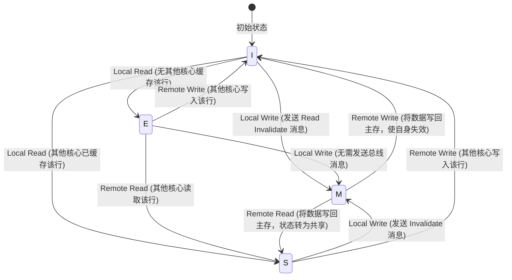
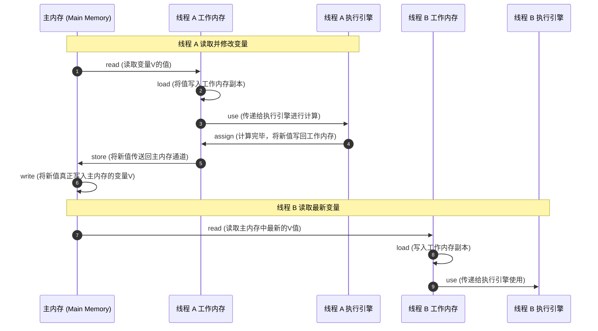

# 主内存与工作内存：Java 内存模型 (JMM) 的底层设计与硬件映射

在多核并发编程的语境下，数据的可见性、有序性与原子性是构建正确并发程序的三个基石。Java 虚拟机通过引入 **Java 内存模型 (Java Memory Model, JMM)**，在语言规范层面定义了多线程如何以及何时能够看到其他线程写入共享变量的值，以及在必要时如何同步地访问共享变量。

本文将自底向上、由浅入深地剖析 JMM 的核心逻辑实体——**主内存 (Main Memory) 与工作内存 (Working Memory)**，探讨它们与物理硬件（物理内存、CPU 缓存、寄存器）的映射关系，解构硬件级别的并发痛点（MESI 协议、Store Buffer、Invalidate Queue、乱序执行与内存屏障），并深度拆解 JMM 的 8 种基本交互原子操作及其执行规则，最后结合四大内存屏障的物理映射，对 `volatile`、`final`、`synchronized` 以及双重检查锁定（DCL）进行汇编层面的终极推导。

---

## 1. 并发编程的基石与 JMM 规范的设计初衷

### 1.1 硬件与软件的永恒博弈：摩尔定律与“内存墙”

在计算机体系结构发展的早期，CPU 的时钟频率几乎以指数级增长，但物理内存（DRAM）的访问速度提升却极其缓慢。这种硬件性能发展的不平衡，导致了计算机科学中著名的**“内存墙 (Memory Wall)”**现象。

```
+---------------------------------------------+
|              CPU (数十GHz, 超高速)           |
+---------------------------------------------+
                       |  (速度差距达 100~1000 倍)
                       v
+---------------------------------------------+
|             物理内存 (DRAM, 慢速)            |
+---------------------------------------------+
```

如上图所示，CPU 执行一条指令通常只需几分之几纳秒，而从 DRAM 中读取数据则需要几十甚至上百纳秒。如果 CPU 直接与 DRAM 进行交互，那么在绝大多数时间内，昂贵的 CPU 核心都将处于空闲的“流水线停顿 (Pipeline Stall)”状态，等待数据的到来。

为了抹平这一速度鸿沟，现代计算机体系结构在 CPU 核心与物理内存之间引入了**多级缓存 (Cache) 体系**（通常包括 L1、L2、L3 缓存），并允许 CPU 采用**乱序执行 (Out-of-Order Execution)**、**分支预测**以及**写缓冲区 (Store Buffer)**等硬件级优化手段。这些优化极大地提升了单核硬件的吞吐量，却给多核并发编程带来了灾难性的副作用：**缓存一致性问题**与**内存无序性（乱序）**。

### 1.2 跨平台并发的致命痛点

在 C/C++ 等传统的编译型语言中，并发编程的语义极大程度上依赖于宿主机操作系统及处理器的内存访问行为。不同的 CPU 架构（如强内存模型的 x86 架构与弱内存模型的 ARM/PowerPC 架构）对内存的读写顺序约束有着截然不同的标准：

*   **x86 (Total Store Order, TSO)**：几乎不允许读读、读写、写写指令重排序，只允许写读（Store-Load）重排序。
*   **ARM (Weak Memory Ordering, WMO)**：为了极致的能效比与并行度，几乎允许所有形式的读写重排序。

如果直接使用宿主机的物理内存模型，开发者编写的并发程序将在不同的机器上表现出完全不可预测的行为：在 x86 平台上运行正常的代码，迁移到 ARM 平台上可能由于频繁的内存重排而导致死锁或数据损坏。

Java 语言在诞生之初便将 **“一次编写，到处运行 (Write Once, Run Anywhere)”** 奉为金科玉律。为了屏蔽物理硬件和操作系统的内存访问差异，让 Java 程序在所有平台上的并发行为都保持一致，JVM 必须定义一套超越物理硬件的、抽象的统一内存访问规范——这就是 **Java 内存模型 (JMM)**。

### 1.3 JSR-133 的救赎与历史演进

早在 JDK 1.0 时代，Java 就尝试定义内存模型，但早期的 JMM 设计存在着严重的理论与实践缺陷，直接导致了以下两个臭名昭著的问题：

#### 旧 JMM（JDK 1.2 至 JDK 1.4）的缺陷：
1.  **`volatile` 的语义过于微弱**：旧模型中，`volatile` 仅保证了变量在读写时的“直通内存”（每次读都必须从主内存获取，每次写都必须刷新到主内存），但**未禁止 `volatile` 变量与普通变量之间的重排序**。这导致了双重检查锁定 (Double-Checked Locking, DCL) 模式即使加了 `volatile` 也无法保证线程安全。
2.  **`final` 保证的缺失**：在旧模型中，一个线程在构造函数中初始化了一个 `final` 字段，由于缺少构造函数写入的内存屏障约束，其他线程在没有同步的情况下，完全有可能读取到该 `final` 字段的默认初始值（如 0 或 null），随后又“神奇地”看到了其正确初始化的值。这不仅违背了 final “不可变”的物理直觉，还给安全体系（如 `String` 的不可变性）带来了巨大漏洞。

#### JSR-133 的重构（Java 1.5 引入）：
为了彻底修复这些缺陷，由 Doug Lea 等并发大师领衔的 JSR-133 专家组对 JMM 进行了全面重构，并作为 JSR-133 规范发布。JSR-133 的核心贡献在于：
*   **强化 `volatile` 的内存语义**：规定 `volatile` 变量不仅自身不能重排序，而且其前后的普通变量读写也不能跨越 `volatile` 边界进行重排序。这赋予了 `volatile` 与锁相同的**内存可见性与防止重排的语义**。
*   **提供强 `final` 语义保障**：只要对象在构造过程中没有发生 `this` 引用逸出，`final` 字段在构造器结束与被其他线程读取之间将存在强制的“写屏障”，确保其他线程能且仅能看到初始化后的 `final` 值。
*   **确立 Happens-Before 原则**：将复杂的底层指令重排与内存可见性规则，抽象为开发者易于理解的 Happens-Before 关系，极大降低了并发编程的认知门槛。

---

## 2. 主内存与工作内存的逻辑定义与物理映射

JMM 是一个**逻辑上的抽象规范**，它通过“主内存”与“工作内存”这两个核心概念，来描述多线程环境下共享变量的可见性行为。

```
+--------------------------------------------------------------+
|                        JMM 逻辑模型                          |
|                                                              |
|  +------------------+              +------------------+      |
|  |  线程 A 工作内存  |              |  线程 B 工作内存  |      |
|  |  (共享变量副本)   |              |  (共享变量副本)   |      |
|  +------------------+              +------------------+      |
|           ^                                 ^                |
|           | (通过 JMM 操作进行读写与同步)      |                |
|           v                                 v                |
|  +--------------------------------------------------------+  |
|  |                         主内存                         |  |
|  |                 (存储实例字段、静态字段等)              |  |
|  +--------------------------------------------------------+  |
+--------------------------------------------------------------+
```

### 2.1 主内存 (Main Memory)

*   **定义**：主内存是 JMM 规定的一块逻辑区域，为所有线程所共享。
*   **存储内容**：主要存储 Java 实例对象中可被多线程共享的变量，包括**实例字段 (Instance Fields)**、**静态字段 (Static Fields)** 以及**构成数组对象的元素 (Array Elements)**。
*   **生命周期**：与 Java 堆及方法区一样，随着 JVM 进程的启动而创建，随着 JVM 的关闭而销毁。
*   **排除对象**：主内存不存储**局部变量 (Local Variables)**、**方法参数 (Method Parameters)** 以及**异常处理器参数 (Exception Handler Parameters)**。因为这些变量是线程私有的，存在于 JVM 栈帧的局部变量表中，不会被其他线程访问，因而不存在任何并发一致性问题。

### 2.2 工作内存 (Working Memory)

*   **定义**：工作内存是每个线程所独占的、私有的逻辑内存区域。
*   **存储内容**：保存了该线程所使用到的共享变量在**主内存中的值副本拷贝**（注意：并非拷贝整个庞大的对象，而是拷贝当前正在被线程读写的某个字段值或引用）。
*   **隔离性规则**：
    1.  线程对共享变量的所有读写操作，**必须且只能**在自己的工作内存中进行，绝对不允许直接读写主内存中的共享变量。
    2.  不同线程之间**无法直接访问**对方工作内存中的变量。
    3.  线程之间变量值的传递，必须通过主内存来中转完成。

### 2.3 物理硬件架构的真实映射

必须明确指出：**主内存与工作内存并不是真实存在的物理实体，它们是 JVM 的逻辑抽象。** 

在现代计算机的物理硬件结构中，只有 CPU 寄存器、L1/L2/L3 高速缓存以及物理内存（DRAM）。JMM 的逻辑实体与硬件物理实体存在着多对多的交叉映射关系。

| JMM 逻辑实体 | 对应的物理硬件组件 | 硬件特点与读写速度 |
| :--- | :--- | :--- |
| **主内存 (Main Memory)** | 物理内存 (DRAM)、多核共享的 L3 Cache | 空间容量大，访问延迟高（通常为 50ns ~ 100ns） |
| **工作内存 (Working Memory)** | CPU 寄存器 (Registers)、L1/L2 Cache、编译器优化缓冲区 | 容量极小，速度极快（通常为 0.5ns ~ 3ns） |

#### 映射原理与数据流动：

当一个线程需要读取一个共享变量时，JVM 会首先尝试从工作内存的物理载体（L1/L2 缓存或寄存器）中读取。如果未命中，则会逐级向下读取（L3 缓存或物理内存），并将读取到的变量值加载进 L1/L2 缓存或寄存器中，形成“工作内存副本”。

当线程修改该变量时，新值首先写入寄存器或写缓冲区（Store Buffer）。随后，根据 JMM 规定的同步时机，该修改将通过缓存一致性协议与内存屏障，逐步刷入物理主内存中，使其他 CPU 核心能够感知到变化。

```
 JMM 逻辑划分                      物理硬件载体
+--------------+                 +--------------------+
|  工作内存    | --------------> |  CPU 寄存器        |
|  (线程私有)  | --------------> |  L1/L2 高速缓存    |
+--------------+                 +--------------------+
                                           |
                                           v
+--------------+                 +--------------------+
|  主内存      | --------------> |  多核共享 L3 Cache |
|  (线程共享)  | --------------> |  物理内存 (DRAM)   |
+--------------+                 +--------------------+
```

### 2.4 伪共享 (False Sharing) 与缓存行对齐

在物理硬件映射的过程中，由于 CPU 缓存是按 **缓存行 (Cache Line，通常为 64 字节)** 进行存取的，这引入了一个被称为**“伪共享 (False Sharing)”**的并发性能痛点。

#### 伪共享的成因：
假设有两个共享变量 `a` 和 `b`（均为 `long` 类型，各占 8 字节），它们在主内存中物理上紧邻，刚好被加载到了同一个 64 字节的 Cache Line 中。
*   核心 0 上的线程 A 频繁修改 `a`；
*   核心 1 上的线程 B 频繁修改 `b`。

由于这两个变量位于同一个 Cache Line 中，每当核心 0 修改 `a` 并强制将 Cache Line 写回时，核心 1 上的整个 Cache Line 都会被宣告失效（MESI 协议）。核心 1 被迫重新读取主存，哪怕它根本不需要 `a` 的值。反之亦然。这种多核之间由于无数据依赖的变量共享同一个缓存行而导致缓存频繁失效的现象，称为伪共享。

#### JVM 的解决手段：
为了应对这一物理硬件痛点，JVM 在 Java 8 中引入了 `@sun.misc.Contended` 注解。其工作原理是：在被修饰的类或字段前后，**自动填充 128 字节的无用数据（即两个 Cache Line 的宽度）**，从而强制让该字段与其它变量隔离在不同的 Cache Line 中，消除了伪共享对多核并发性能的侵蚀。

---

## 3. 硬件级别的高并发痛点与物理屏障

为了彻底理解 JMM 的 8 种原子操作与内存屏障，我们必须首先直面物理硬件级别的三大并发痛点：**缓存一致性协议的缺陷**、**指令重排**以及**硬件级内存屏障**。

### 3.1 缓存一致性协议 (MESI) 及其微观动作

在多核 CPU 中，每个核心都拥有独立的 L1/L2 缓存。为了保证多核看到的缓存数据是一致的，硬件引入了**缓存一致性协议**，其中最经典的便是 **MESI 协议**。

MESI 协议定义了缓存行（Cache Line）的四种状态：

1.  **M (Modified - 已修改)**：该缓存行数据仅存在于当前核心的缓存中，并且已被修改（与主内存中的数据不一致）。当前核心负责在未来某个时刻将该数据写回主内存。
2.  **E (Exclusive - 独占)**：该缓存行数据仅存在于当前核心的缓存中，且尚未被修改（与主内存中的数据完全一致）。
3.  **S (Shared - 共享)**：该缓存行数据存在于多个核心的缓存中，且与主内存中的数据一致。
4.  **I (Invalid - 已失效)**：该缓存行数据已失效，不能被读取。

#### MESI 状态转换与总线嗅探 (Bus Snooping)：
CPU 核心通过监听总线上的事务（Read、Invalidate 等消息）来维护各自缓存行的状态。以下是 MESI 状态转移的 Mermaid 状态图：



### 3.2 MESI 的致命硬伤：Store Buffer 与 Invalidate Queue

既然有 MESI 协议，为什么多线程并发依然会出现内存可见性与乱序问题？

答案在于：**单纯的 MESI 协议会引入极大的性能损耗（流水线停顿）**。
例如，当核心 0 想要写入一个状态为 `S`（共享）的缓存行时，它必须向总线发送一条 `Invalidate` 消息，并**阻塞等待**所有其他拥有该缓存行副本的核心回复 `Invalidate Acknowledge`（失效确认确认包）后，核心 0 才能将数据真正写入缓存行并继续执行。这一等待过程对于高速运行的 CPU 来说是难以承受的闲置损耗。

为了消除这部分阻塞等待时间，硬件工程师在 CPU 核心与 L1 缓存之间加入了 **Store Buffer（写缓冲区）**，并在输入端引入了 **Invalidate Queue（失效队列）**。

```
+-------------------------------------------------------------+
|                          CPU 核心                           |
+-------------------------------------------------------------+
       |                                              ^
       | (直写, 无需等待)                             | (写转发 Store Forwarding)
       v                                              |
+---------------+                                     |
| Store Buffer  | ------------------------------------+
+---------------+
       |
       | (异步刷入)
       v
+---------------+             (发送失效消息)          +------------------+
|   L1 缓存     | ==================================> | 其他 CPU L1 缓存 |
+---------------+                                     +------------------+
                                                              ||
                                                              v (放入队列，立即回复)
                                                      +------------------+
                                                      | Invalidate Queue |
                                                      +------------------+
```

#### 引入后的工作流程：
1.  **核心 0 执行写操作**：核心 0 将新值直接写入自己的 **Store Buffer**，并立即发出 `Invalidate` 消息，随后无需等待其他核心的确认，直接继续执行后面的指令。
2.  **写转发 (Store Forwarding)**：如果核心 0 紧接着需要读取该变量，它会直接从自己的 Store Buffer 中读取未写回缓存的最新值，这种硬件优化称为“写转发”。
3.  **核心 1 接收失效消息**：核心 1 收到核心 0 发来的 `Invalidate` 消息后，为了避免阻塞自己，它不会立即去作废自己 L1 缓存中对应的缓存行，而是将该失效消息丢入 **Invalidate Queue** 中，并立即向核心 0 回复 `Invalidate Acknowledge`。核心 1 将在空闲时异步处理 Invalidate Queue 中的失效任务。

#### 带来的副作用——硬件级的乱序与可见性延迟：
*   **内存可见性延迟**：由于核心 0 的 Store Buffer 是异步刷入 L1 缓存的，在刷入之前，核心 1 从自己的缓存中读取的依然是旧值。
*   **指令重排序（Store-Load 乱序）**：
    假设有两个变量 `X = 0`, `Y = 0`，分别被核心 0 和核心 1 执行以下操作：
    *   核心 0 执行：`X = 1; r1 = Y;`
    *   核心 1 执行：`Y = 1; r2 = X;`
    
    由于 Store Buffer 的延迟，核心 0执行 `X = 1` 时只是写入了 Store Buffer，尚未刷入缓存。紧接着核心 0 执行 `r1 = Y`（从缓存中读到旧值 0）。同理，核心 1 执行 `Y = 1` 写入 Store Buffer，紧接着执行 `r2 = X`（读到旧值 0）。
    最终结果是 `r1 = 0` 且 `r2 = 0`。从外界视角来看，指令执行顺序被重排成了：读指令（`r1 = Y`, `r2 = X`）先于写指令（`X = 1`, `Y = 1`）执行！这就是经典的 **Store-Load 乱序**。

### 3.3 乱序执行与指令重排的分类

现代并发系统中的指令重排可以归结为以下三类：

```
+--------------+     编译器优化重排     +--------------+
| 源代码 (Java) | --------------------> |   字节码     |
+--------------+                       +--------------+
                                              |
                                              | 机器码编译与 JIT 优化
                                              v
+--------------+     指令级并行重排     +--------------+
| 处理器执行源 | --------------------> | 乱序指令序列 |
+--------------+                       +--------------+
                                              |
                                              | 内存系统重排
                                              v
+--------------+                       +--------------+
| 物理内存视图 | <-------------------- |  StoreBuffer |
+--------------+                       +--------------+
```

1.  **编译器重排序**：在不改变单线程语义（**As-if-Serial 原则**）的前提下，编译器（如 JIT 编译器）为了提高寄存器的利用率、减少流水线气泡，在编译期间对字节码/机器指令的顺序进行调整。
2.  **处理器乱序执行（指令级并行重排）**：多发射（Superscalar）CPU 内部拥有多个执行单元（ALU）。只要指令之间不存在数据依赖性，处理器就可以通过**保留站 (Reservation Station)** 并行发射指令，然后通过**重排序缓冲区 (Reorder Buffer, ROB)** 乱序执行、顺序提交。
3.  **内存系统重排序**：由于上述 **Store Buffer** 和 **Invalidate Queue** 的异步读写特性，导致物理内存的写入可见顺序与 CPU 发射的指令执行顺序不一致，在宏观上表现为写-读乱序。

### 3.4 硬件级内存屏障 (Memory Barriers)

为了防止上述硬件级乱序带来的并发错误，CPU 架构提供了特定的**内存屏障指令**，允许软件开发者（或虚拟机编译器）强制约束指令的提交顺序与缓存的刷新时机。

以最普遍的 x86 架构为例，其提供了三种显式内存屏障指令：

*   **`sfence` (Store Fence - 写屏障)**：强制将 Store Buffer 中的所有数据全部刷入 L1 缓存，保证屏障之前的写操作全部对外部可见，且任何屏障之后的写指令不得越过屏障被重排到前面。
*   **`lfence` (Load Fence - 读屏障)**：强制处理完 Invalidate Queue 中的所有失效消息，使本地对应的缓存行失效，确保屏障之后的读操作必须读取到最新的数据，且屏障之后的读操作不得重排到屏障之前。
*   **`mfence` (Memory Fence - 全能屏障)**：同时具备 `sfence` 和 `lfence` 的功能，确保屏障前后的所有读写操作都不能越过屏障，具有最强的顺序约束。
*   **`lock` 前缀指令**：在 x86 架构中，诸如 `lock addl $0, (%rsp)` 这样的指令前缀，会产生与 `mfence` 相同的物理屏障效果。它通过锁定缓存行（Cache Lock）或锁定总线（Bus Lock），强制将 Store Buffer 写入缓存，并令其他核心的缓存行失效。在 JVM 的 HotSpot 实现中，大量采用了 `lock` 前缀指令作为全能内存屏障的映射实体。

---

## 4. JMM 的 8 种基本交互原子操作与时序规则

为了描述主内存与工作内存之间的数据流转细节，JMM 在规范中定义了 **8 种基本交互原子操作**。虽然在最新的 JMM 规范中，这些操作已被 Happens-Before 规则所取代，但它们依然是理解 Java 并发底层机理最经典、最直观的逻辑基石。

### 4.1 八种原子操作定义

1.  **`lock` (锁定)**：作用于**主内存**的变量，它把一个变量标识为一条线程独占的状态。
2.  **`unlock` (解锁)**：作用于**主内存**的变量，它把一个处于锁定状态的变量释放出来，释放后的变量才可以被其他线程锁定。
3.  **`read` (读取)**：作用于**主内存**的变量，它把一个变量的值从主内存传输到线程的工作内存中，以便随后的 `load` 动作使用。
4.  **`load` (载入)**：作用于**工作内存**的变量，它把 `read` 操作从主内存中得到的变量值放入工作内存的变量副本中。
5.  **`use` (使用)**：作用于**工作内存**的变量，它把工作内存中一个变量的值传递给执行引擎，每当虚拟机遇到一个需要使用变量值的字节码指令时都会执行该操作。
6.  **`assign` (赋值)**：作用于**工作内存**的变量，它把一个从执行引擎接收到的值赋给工作内存的变量，每当虚拟机遇到一个给变量赋值的字节码指令时执行该操作。
7.  **`store` (存储)**：作用于**工作内存**的变量，它把工作内存中一个变量的值传送给主内存中，以便随后的 `write` 操作使用。
8.  **`write` (写入)**：作用于**主内存**的变量，它把 `store` 操作从工作内存中得到的变量值放入主内存的变量中。

### 4.2 交互操作的生命周期时序图

一个共享变量在多线程环境下的读写过程，是这 8 个原子动作按照严格时序组合执行的结果。以下 Mermaid 时序图展示了线程 A 读取变量并修改写回，随后线程 B 读取该变量的完整过程：



### 4.3 八种交互操作的执行规则与底线约束

JMM 对这 8 种操作的执行顺序与搭配方式制定了极其严苛的规则，任何 JVM 实现都必须无条件服从：

1.  **配对出现规则**：不允许 `read` 和 `load`、`store` 和 `write` 操作之一单独出现。即不允许从主内存读取了数据但工作内存不接受（有 `read` 必有 `load`），或者工作内存发起了存储但主内存不写入（有 `store` 必有 `write`）。
2.  **Assign 强制规则**：不允许一个线程丢弃它最近的 `assign` 操作。即变量在工作内存中一旦被改变，**必须**同步回主内存，不能只改工作内存而不通知主内存。
3.  **无 Assign 禁回写规则**：不允许一个线程无原因地（没有发生过任何 `assign` 操作）把数据从工作内存同步回主内存中。这防止了无意义的重复回写覆盖其他线程的修改。
4.  **初始化诞生规则**：一个新的变量只能在主内存中“诞生”，不允许在工作内存中直接使用一个未被初始化的变量。也就是说，对一个变量执行 `use` 或 `store` 之前，必须先执行了 `assign` 和 `load` 操作。
5.  **排他锁定规则**：一个变量在同一时刻只允许一条线程对其进行 `lock` 操作，但 `lock` 操作可以被同一条线程重复执行多次。多次执行 `lock` 后，只有执行相同次数的 `unlock` 操作，变量才会被解锁（可重入锁的底层逻辑）。
6.  **Lock 清空工作内存规则**：如果对一个变量执行 `lock` 操作，将会**清空工作内存中此变量的值**。在执行引擎使用这个变量前，需要重新执行 `load` 或 `assign` 操作以初始化变量的值。这是实现锁的**可见性**的关键所在。
7.  **无 Lock 禁 Unlock 规则**：如果一个变量事先没有被 `lock` 操作锁定，那就不允许对它执行 `unlock` 操作，也不允许去 `unlock` 一个被其他线程锁定的变量。
8.  **Unlock 强制刷回规则**：对一个变量执行 `unlock` 操作之前，**必须**先把此变量同步回主内存中（即执行 `store`、`write` 操作）。这是锁释放时保证修改**立即可见**的底层物理依据。

---

## 5. 四大内存屏障的物理机制与编译映射

为了在不同的 CPU 架构上实现上述原子操作与有序性约束，JVM 抽象出了**四大逻辑内存屏障**。

### 5.1 JVM 四大逻辑内存屏障的语义

| 内存屏障类型 | 抽象格式 | 详细语义说明 |
| :--- | :--- | :--- |
| **`LoadLoad` 屏障** | `Load1; LoadLoad; Load2` | 确保 `Load1` 数据的装载先于 `Load2` 及所有后续装载指令的装载。 |
| **`LoadStore` 屏障** | `Load1; LoadStore; Store2` | 确保 `Load1` 数据的装载先于 `Store2` 及所有后续写入指令的写入与刷新。 |
| **`StoreStore` 屏障** | `Store1; StoreStore; Store2` | 确保 `Store1` 数据的写入对其他处理器可见，先于 `Store2` 及所有后续写入指令的写入与刷新。 |
| **`StoreLoad` 屏障** | `Store1; StoreLoad; Load2` | 确保 `Store1` 数据的写入对其他处理器可见，先于 `Load2` 及所有后续装载指令的装载。**该屏障是全能型屏障，开销最大。** |

### 5.2 强内存模型与弱内存模型下的硬件编译映射

JVM 的四大内存屏障是**逻辑屏障**。在实际编译为机器码时，JVM 会根据当前宿主机的 CPU 架构特征，将这些逻辑屏障转换为对应的物理屏障指令或直接优化消除。

#### 1. x86 架构 (TSO 强内存模型)
由于 x86 硬件本身严格保证了“读读（Load-Load）”、“读写（Load-Store）”、“写写（Store-Store）”的顺序，硬件不会对这些操作进行任何乱序重排。
因此，在 x86 平台下：
*   `LoadLoad` $\rightarrow$ **空操作 (NOP)**
*   `LoadStore` $\rightarrow$ **空操作 (NOP)**
*   `StoreStore` $\rightarrow$ **空操作 (NOP)**
*   `StoreLoad` $\rightarrow$ **映射为真实的物理屏障（如 `lock addl $0, (%rsp)` 或 `mfence`）**。因为 x86 唯一允许的硬件重排是写-读（Store-Load）重排。

#### 2. ARM 架构 (WMO 弱内存模型)
由于 ARM 硬件极其激进，为了性能允许几乎所有形式的指令重排，因此四种逻辑屏障都必须被无条件编译为真实的 ARM 硬件屏障指令。

#### JVM 内存屏障物理映射表：

| JMM 逻辑屏障 | x86 (强内存模型) 编译映射 | ARM (弱内存模型) 编译映射 |
| :--- | :--- | :--- |
| **`LoadLoad`** | NOP (空操作) | `dmb ishld` (数据内存屏障，限读操作) |
| **`LoadStore`** | NOP (空操作) | `dmb ish` (全能数据内存屏障) |
| **`StoreStore`** | NOP (空操作) | `dmb ishst` (数据内存屏障，限写操作) |
| **`StoreLoad`** | `lock addl $0, (%rsp)` 或 `mfence` | `dmb ish` (全能数据内存屏障) |

### 5.3 为什么 StoreLoad 屏障的开销最重？

从表上可以看出，无论是强内存模型还是弱内存模型，`StoreLoad` 屏障都会被映射为开销最沉重的物理指令（如 x86 的 `lock` 或 ARM 的 `dmb`）。

因为 `StoreLoad` 的职责是保证“前写后读”的物理可见性。为了达到这一目的，处理器必须执行以下动作：
1.  **彻底清空 Store Buffer**：强制将 Store Buffer 中的所有写入数据全部刷入当前核心的 L1 缓存，这需要等待总线将所有 `Invalidate` 消息投递给其他核心，并等待它们回复 `Invalidate Acknowledge`。
2.  **挂起后续读取操作**：在 Store Buffer 被完全清空前，禁止执行屏障之后的任何读取指令。
这使得 CPU 的流水线发生了严重的阻塞停顿（Stall），执行时间大大增加。

---

## 6. 从硬件到 JVM 规范的落地实践

### 6.1 `volatile` 的内存语义与编译器屏障插入策略

在 Java 字节码级别，一个变量如果被 `volatile` 修饰，在编译成机器码时，JVM 会在 volatile 变量的读写操作前后插入特定的内存屏障，以防止编译器与处理器的乱序重排。

#### JMM 对 `volatile` 读写的屏障插入规则：

```
[Volatile 写操作] 屏障策略：
      StoreStore 屏障 (防止前面的普通写与 volatile 写重排)
              ||
              v
       [volatile 写]
              ||
              v
      StoreLoad 屏障 (防止后面的 volatile 写与可能的 volatile 读写重排)
```

```
[Volatile 读操作] 屏障策略：
       [volatile 读]
              ||
              v
      LoadLoad 屏障 (防止后面的普通读与 volatile 读重排)
      LoadStore 屏障 (防止后面的普通写与 volatile 读重排)
```

#### 编译器对 volatile 写屏障的优化消除：
假设有两个连续的 volatile 写操作：
```java
volatile int a;
volatile int b;

a = 1;
b = 2;
```
按照默认规则，编译器会生成如下指令序列：
`StoreStore -> 写 a -> StoreLoad -> StoreStore -> 写 b -> StoreLoad`

在编译优化阶段，JVM 能够识别出连续的 volatile 写。由于两个写操作之间夹着的 `StoreLoad` 和 `StoreStore` 屏障功能重叠，JVM 会将其**合并/消除**，最终优化为：
`StoreStore -> 写 a -> 写 b -> StoreLoad`
这大幅度减少了 `StoreLoad` 全能屏障的调用次数，提升了并发性能。

### 6.2 `final` 字段的内存屏障保障

JSR-133 对 `final` 字段的可见性做出了极强的承诺。其底层机制同样依赖于内存屏障：

1.  **写 final 字段规则**：在构造函数内对一个 `final` 字段的写入，与随后将这个被构造对象的引用赋值给一个外部引用变量（对象的发布），这两者之间不能重排序。
    *   *底层实现*：JVM 会在构造函数的 `return` 指令之前，插入一个 **`StoreStore` 屏障**，确保 final 字段的赋值写操作先于对象引用的发布写操作。
2.  **读 final 字段规则**：初次读一个包含 `final` 字段的对象引用，与随后初次读这个对象的 `final` 字段，这两者之间不能重排序。
    *   *底层实现*：JVM 会在读 `final` 字段的操作之前，插入一个 **`LoadLoad` 屏障**，防止处理器预先读取了未初始化完成的旧值。

> [!WARNING]
> **“this” 引用逸出风险**：
> 如果在构造函数中，将当前对象 `this` 的引用作为参数传递给了其他线程（如发布了监听器或执行了异步回调），那么写 `final` 字段的 `StoreStore` 屏障将失去作用。其他线程完全有可能通过逸出的 `this` 引用，看到尚未完成初始化的 `final` 字段的默认值。

### 6.3 `synchronized` 的锁同步与内存语义

`synchronized` 关键字在 JVM 字节码层面被映射为 `monitorenter` 和 `monitorexit` 两个指令，在 JMM 的 8 种原子操作中，它们直接对应 `lock` 和 `unlock` 语义。

*   **进入锁（Lock 语义）**：当线程获取锁执行 `monitorenter` 时，JMM 规则要求清空当前线程工作内存中所有共享变量的缓存。这迫使执行引擎在随后的执行中，必须重新从主内存中执行 `read-load` 操作读取最新值。
*   **释放锁（Unlock 语义）**：当线程释放锁执行 `monitorexit` 时，JMM 规则要求在执行 `unlock` 之前，必须执行 `store-write` 动作，将在锁块内修改的所有变量最新值全部刷新回物理主内存中，确保后续竞争锁的线程立即可见。

---

## 7. 经典并发缺陷深挖：双重检查锁定 (DCL) 汇编级分析

为了将上述硬件痛点与 JMM 规范融会贯通，我们来深入解构并发编程中最经典的案例——**双重检查锁定 (Double-Checked Locking, DCL) 单例模式**。

### 7.1 DCL 生产级标准实现

```java
public final class SafeDCLSingleton {
    // 必须使用 volatile 修饰，防止指令重排序
    private static volatile SafeDCLSingleton instance;

    private SafeDCLSingleton() {
        // 构造函数初始化逻辑
    }

    public static SafeDCLSingleton getInstance() {
        if (instance == null) { // 第一次检查（非同步）
            synchronized (SafeDCLSingleton.class) {
                if (instance == null) { // 第二次检查（同步内）
                    instance = new SafeDCLSingleton();
                }
            }
        }
        return instance;
    }
}
```

### 7.2 剖析不加 `volatile` 时 DCL 失效的微观机理

如果将 `instance` 变量上的 `volatile` 关键字去掉，即便在多核环境下该单例模式看起来有 `synchronized` 锁的保护，依然会产生灾难性的并发错误：**读取到“半初始化对象”**。

我们可以将 `instance = new SafeDCLSingleton();` 这行 Java 语句，分解为 JVM 字节码层面的三个步骤：

```
步骤 1: memory = allocate();   // 1. 分配对象的内存空间 (在堆上开辟空间)
步骤 2: ctorInstance(memory);  // 2. 调用构造函数，初始化对象属性
步骤 3: instance = memory;     // 3. 将变量 instance 指向分配的内存地址
```

在不加 `volatile` 的情况下，步骤 2 与步骤 3 **不存在数据依赖性**。因为无论是先初始化属性还是先赋值引用，单线程执行的最终结果都是 instance 指向了可用的对象。因此，JIT 编译器与处理器完全可能为了优化性能而将这两步进行**指令重排序**：

```
步骤 1: memory = allocate();   // 1. 分配内存空间
步骤 3: instance = memory;     // 3. 赋值引用 (注意：此时对象属性尚未初始化！)
步骤 2: ctorInstance(memory);  // 2. 调用构造函数进行真正的初始化
```

#### 灾难时序模拟图：

下表清晰地展示了在不加 `volatile` 时，两条线程并发访问 DCL 时的时序与灾难后果：

| 时间轴 | 线程 A (正在创建单例) | 线程 B (正在获取单例) | 内存状态与变量值 |
| :--- | :--- | :--- | :--- |
| **T1** | 进入同步块，执行 `new` 动作，步骤 1 分配内存成功。 | | `memory` 被分配。 |
| **T2** | **发生重排**：先执行步骤 3，将 `instance` 指向 `memory`。 | | `instance != null`，但对象内容为空。 |
| **T3** | | 调用 `getInstance()`，在第一次检查时判定 `instance != null`。 | 线程 B 绕过 `synchronized` 块。 |
| **T4** | | **直接返回 `instance` 引用并使用其字段**。 | **线程 B 崩溃！**（读到字段默认值 0 或引发 NPE） |
| **T5** | 执行步骤 2，调用构造函数初始化对象字段。 | | 此时对象才真正初始化完成。 |

### 7.3 `volatile` 是如何通过汇编指令阻止该重排序的？

当给 `instance` 字段加上 `volatile` 修饰符后，JVM 在编译该单例的写操作（`putstatic instance`）时，会在该指令后面插入一个 `StoreLoad` 屏障。

我们来看一下在 **x86 架构** 下，JIT 编译器生成的 DCL 核心步骤汇编代码对比：

#### 未加 `volatile` 时的 x86 汇编片段（示意）：
```assembly
; 对应步骤 1: 分配内存并返回地址到 rax 寄存器
mov    $0x10,%edi          ; 传入对象大小
callq  <JVM_AllocateObject>; 调用 JVM 分配堆空间，返回指针在 rax
; 对应步骤 3: 将 rax 中的地址赋值给 instance 静态变量（重排发生在此处！）
mov    %rax,0x205562(%rip) ; 将 rax 中的未初始化引用写回 instance 变量
; 对应步骤 2: 调用构造函数进行属性初始化
mov    %rax,%rcx           ; 将对象指针赋给 rcx 作为 this 指针传递
callq  <SafeDCLSingleton_Init>; 调用构造器进行字段初始化
```
*分析*：由于 `mov %rax,0x205562(%rip)` 提前执行，外部线程在 T3 时刻读取 `instance` 将直接拿到还未执行 `<SafeDCLSingleton_Init>` 的半初始化对象。

#### 加了 `volatile` 时的 x86 汇编片段：
```assembly
; 对应步骤 1: 分配内存并返回地址到 rax 寄存器
mov    $0x10,%edi
callq  <JVM_AllocateObject>
; 对应步骤 2: 调用构造函数进行属性初始化
mov    %rax,%rcx           
callq  <SafeDCLSingleton_Init>; 构造器必须在赋值前执行完毕
; 对应步骤 3: 将 rax 中的地址赋值给 instance 静态变量
mov    %rax,0x205562(%rip) 
; === 关键：JVM 插入的 StoreLoad 物理屏障 ===
lock addl $0,(%rsp)        ; lock 前缀指令，强制刷回 Store Buffer，阻止重排序并宣告其他核心缓存行失效
```

*分析*：
1.  **阻止重排**：`volatile` 写规则要求在写操作前面插入 `StoreStore` 屏障，在后面插入 `StoreLoad` 屏障。这使得构造函数内部的字段写入（步骤 2）必须先于对 `instance` 引用的写入（步骤 3）完成提交，斩断了重排序的物理可能性。
2.  **强制可见**：`lock addl $0,(%rsp)` 作为内存屏障，强制将当前 CPU 的 Store Buffer 刷新到高速缓存中，使对 `instance` 的修改以及构造函数中所有字段的修改，在同一时刻全部对其他 CPU 可见。
3.  **缓存失效**：该指令通过缓存一致性协议（MESI），将其他 CPU 缓存中原有的 `instance` 缓存行置为 `I`（Invalid）状态，迫使其他线程在读取 `instance` 时，必须从主内存重新获取已完全初始化好的单例对象。

通过这种自语言规范（JMM）下达到物理硬件（Lock 汇编指令）的链路映射，Java 保证了多线程在高并发环境下的内存一致性与执行有序性。

---

## 8. 总结与最佳实践

Java 内存模型是对多级高速缓存、写缓冲区与处理器重排序等物理并发痛点的艺术化抽象。通过将复杂的底层硬件细节屏蔽在“主内存与工作内存”这一逻辑边界之下，JMM 为开发者提供了一套清晰且跨平台的并发访问规则。

在日常开发中，我们应当遵循以下最佳实践来确保线程安全与性能的平衡：
1.  **合理使用 `volatile`**：`volatile` 适合于单写多读的标志位场景，或者配合锁进行双重检查锁定。不要盲目给所有字段加 `volatile`，因为 `StoreLoad`（`lock` 前缀指令）的开销在多核竞争激烈时依然十分显著。
2.  **防止 final 字段的 "this 逸出"**：在构造函数内，绝对不要将当前对象发布出去，确保 final 字段的 `StoreStore` 屏障能够发挥其保驾护航的作用。
3.  **警惕伪共享**：在对性能要求极其苛刻的并发数据结构中（例如高性能无锁队列），应当考虑使用 `@Contended` 进行缓存行对齐，避免因 MESI 频繁失效带来的吞吐量雪崩。
