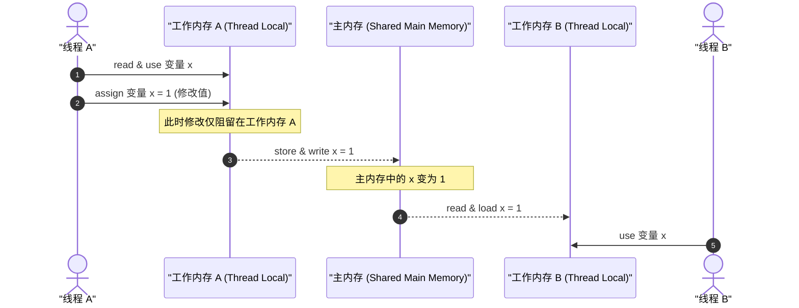
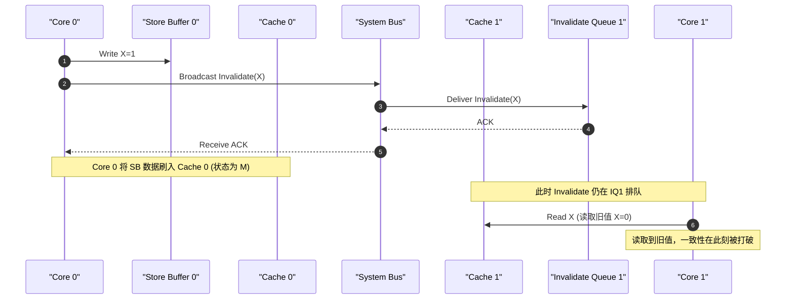
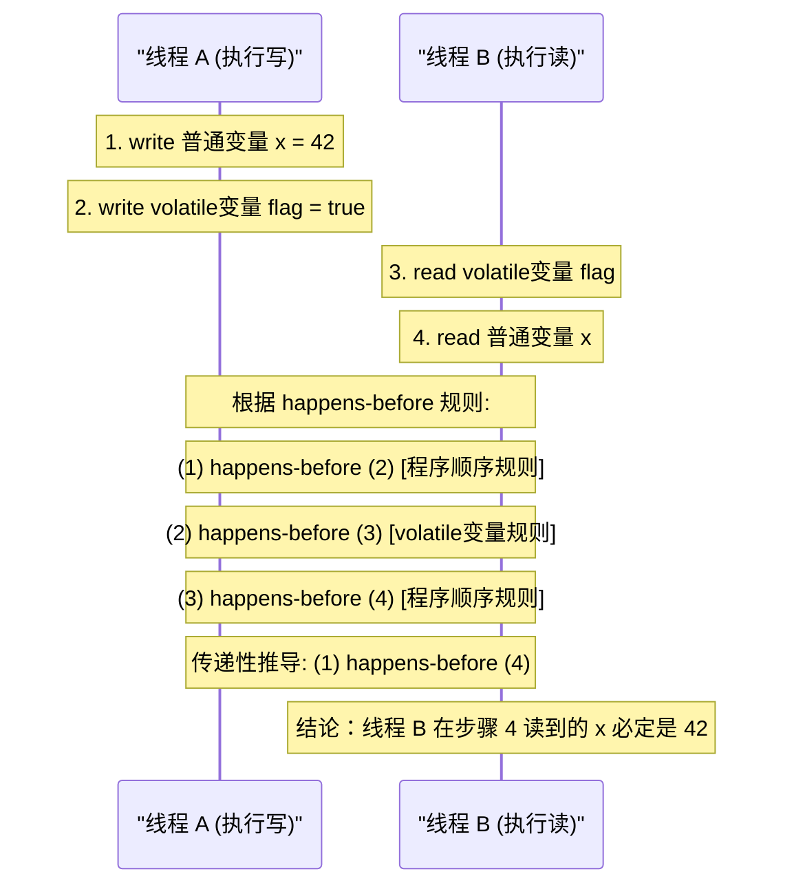
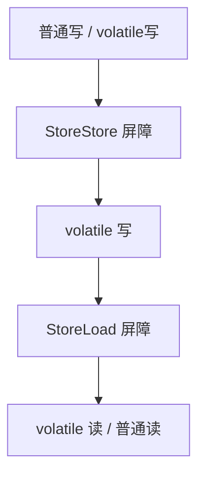
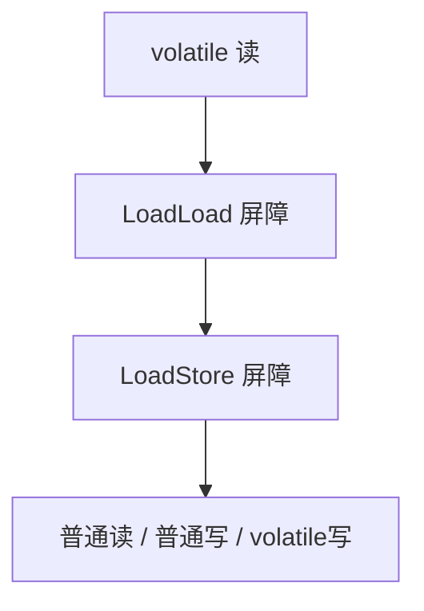
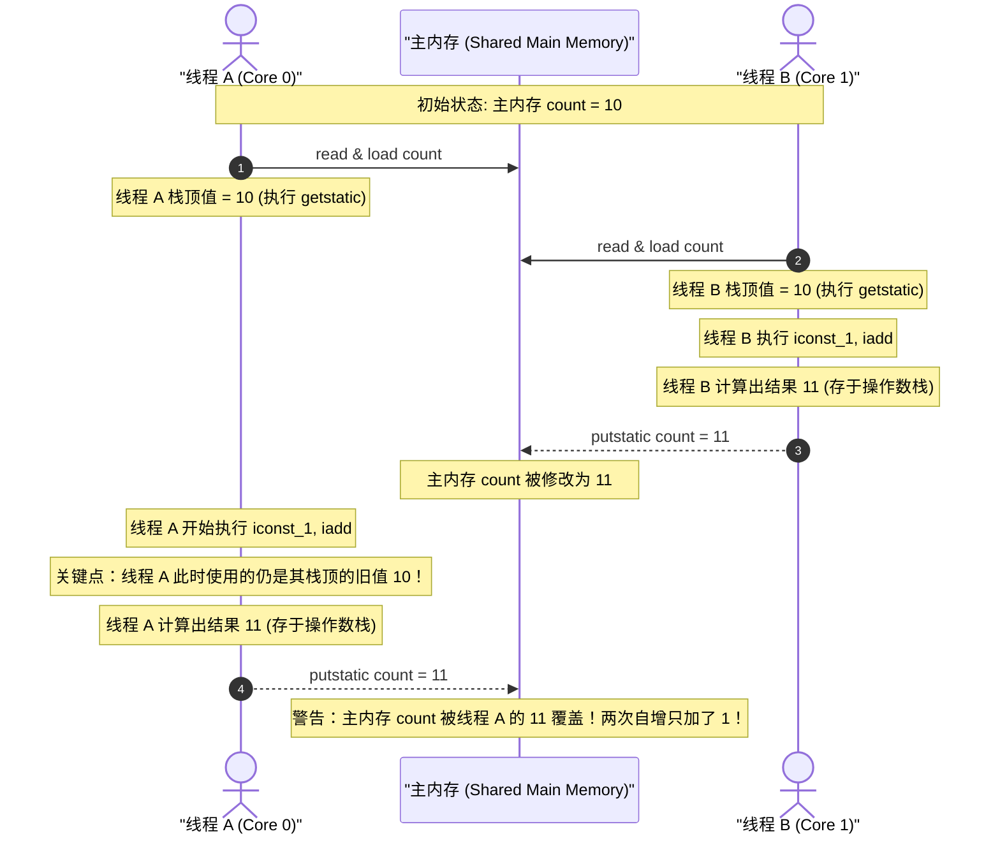
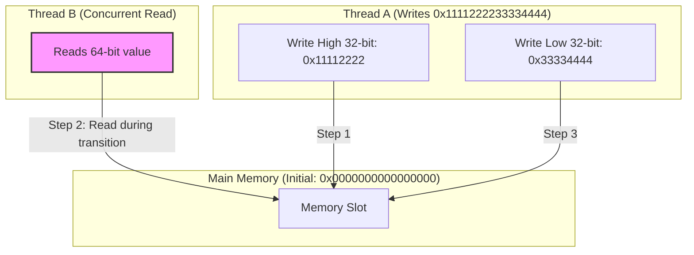
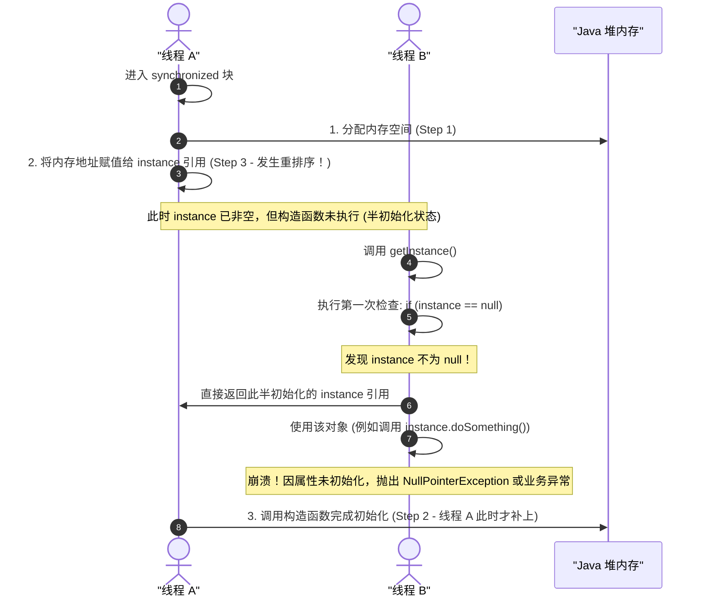

# 深入理解 Java volatile 关键字的物理与内存模型机理

在多线程并发编程中，`volatile` 是 Java 虚拟机（JVM）提供的一种轻量级的同步机制。与传统的 `synchronized` 互斥锁相比，它在多线程环境下提供了一种更低开销的内存可见性和有序性（防止重排序）保障，但不提供互斥的原子性。要真正掌握 `volatile` 的工作原理，必须从底层硬件的缓存一致性协议、处理器的内存屏障，以及 Java 内存模型（JMM，Java Memory Model）的语言规范和 JIT 编译器优化等多个物理和软件层面的维度进行全方位的解构。

本文将深入探究 `volatile` 的物理机理、指令重排序约束、四大内存屏障插入规范、汇编级 `lock` 前缀语义、非原子性缺陷、64 位数据类型原子化、伪共享问题，以及在并发设计模式中的典型应用案例。

---

## 1. 物理硬件背景与 JMM 抽象

### 1.1 现代 CPU 架构的多级缓存与“缓存一致性”挑战

现代计算机的 CPU 运算速度极快，而主内存（DRAM）的访问延迟（通常在数十到上百纳秒）远远落后于处理器的处理能力（通常在几分之一纳秒以内）。为了弥补这种吞吐量与响应时间的巨大鸿沟，芯片设计者在 CPU 和主内存之间引入了多级高速缓存（L1, L2, L3 Cache），通常其访问速度相差数个数量级。随着多核 CPU 架构的发展，缓存的结构通常设计为：每个处理器核心（Core）拥有自己独立的 L1、L2 缓存，而所有核心共享 L3 缓存与主内存。

```mermaid
graph TD
    subgraph "Core 0"
        Reg0[Register 0] --> L1_0[L1 Cache]
        L1_0 --> L2_0[L2 Cache]
    end
    subgraph "Core 1"
        Reg1[Register 1] --> L1_1[L1 Cache]
        L1_1 --> L2_1[L2 Cache]
    end
    L2_0 --> L3[Shared L3 Cache]
    L2_1 --> L3
    L3 --> MainMem[Main Memory (DRAM)]
```

这种多核高速缓存结构带来了显著的性能提升，但也引入了**缓存一致性（Cache Coherence）**问题。当多个核心并发读取、修改同一个内存地址的数据时，各自核心的 L1/L2 缓存中可能会保存同一份数据的多个副本。如果 Core 0 修改了数据，而没有及时同步给 Core 1，那么 Core 1 就会继续使用其缓存中的旧数据，从而导致并发程序出现严重的逻辑错误。这就是“内存可见性”在物理硬件层面的根本症结。

### 1.2 JMM 的抽象与设计初衷

为了屏蔽不同操作系统与硬件平台（如 x86, ARM, MIPS, POWER 等）之间复杂的内存访问差异，Java 虚拟机构建了一套统一的**Java 内存模型（JMM）**。JMM 是一种规范，它定义了 Java 虚拟机如何与计算机内存（RAM）进行交互，以及在何种条件下，一个线程对共享变量的写入能够对其他线程可见。

JMM 将物理硬件的硬件缓存与寄存器抽象为**工作内存（Working Memory）**，将主内存（DRAM）抽象为**主内存（Main Memory）**：
*   **主内存**：所有变量都存储在主内存中，它是所有线程共享的内存区域。
*   **工作内存**：每个线程都拥有自己的工作内存（它是一个抽象概念，涵盖了 CPU 寄存器、写缓冲区、L1/L2/L3 缓存等物理组件）。线程对变量的所有读写操作都必须在工作内存中进行，而不能直接读写主内存。



在普通的并发操作中，线程 A 修改了共享变量的值，将其写回到工作内存，再在某个不确定的时间点刷新回主内存。而线程 B 去读取主内存中的变量时，也有可能直接使用了自己工作内存中的缓存旧值。这种延迟和不确定性，导致了多线程数据交互的不一致。`volatile` 关键字的引入，就是为了在此抽象模型上建立强一致性的读写规则。

---

## 2. volatile 可见性保障的物理机理

`volatile` 最核心的功能之一就是提供**可见性（Visibility）**保障。当一个共享变量被声明为 `volatile` 后，一个线程对它的修改会立即可见于其他线程。这一特性的实现是硬件级缓存一致性协议与 JVM 规范级交互规则共同作用的结果。

### 2.1 硬件级缓存一致性协议（MESI）

多核 CPU 中为了解决缓存不一致问题，硬件层面通常采用**缓存一致性协议**，其中最经典的是 **MESI 协议**（也称作 Illinois 协议）。MESI 协议为每个缓存行（Cache Line，通常是 64 字节）定义了四种状态：

1.  **M (Modified，修改)**：该缓存行只被当前 CPU 缓存，且其数据已被修改，与主内存中的数据不一致。该缓存行的数据在被替换或者其他 CPU 读取前，必须写回主内存。
2.  **E (Exclusive，独占)**：该缓存行只被当前 CPU 缓存，且其数据与主内存一致。当其他 CPU 读取此内存地址时，状态会转变为 Shared。
3.  **S (Shared，共享)**：该缓存行可能被多个 CPU 缓存，且各个缓存行中的数据与主内存一致。
4.  **I (Invalid，失效)**：该缓存行的数据已失效，不能使用。当前 CPU 想要读取该数据时，必须重新从主内存或者其他状态为 M 的 CPU 缓存中获取。

#### MESI 状态转换矩阵与总线窥探（Bus Snooping）

为了维持这一致性状态，CPU 核心之间通过**总线窥探（Bus Snooping）**机制监视总线上的所有活动。下表展示了 MESI 协议在不同总线事件下的状态流转矩阵：

| 当前状态 | 读命中 (Read Hit) | 读未命中 (Read Miss) | 写命中 (Write Hit) | 写未命中 (Write Miss) | 窥探到读总线 (Snoop Read) | 窥探到写/失效总线 (Snoop Write/Invalid) |
| :--- | :--- | :--- | :--- | :--- | :--- | :--- |
| **M (Modified)** | 保持 M | — | 保持 M | — | 写入主存，状态转为 **S** | 写入主存，状态转为 **I** |
| **E (Exclusive)**| 保持 E | — | 状态转为 **M** | — | 状态转为 **S** | 状态转为 **I** |
| **S (Shared)**   | 保持 S | — | 发送失效信号，状态转为 **M** | — | 保持 S | 状态转为 **I** |
| **I (Invalid)**   | — | 发送读信号，转为 **S** 或 **E** | — | 发送读并失效信号，转为 **M** | 保持 I | 保持 I |

*   **读操作**：当 Core 0 发生缓存未命中，需要读取某行数据时，它会在总线上发送一条 Read 消息。其他 Core 窥探总线，如果发现自己拥有该数据的 M 状态副本，则必须先将数据写回主内存，或者直接转发给 Core 0，并将自身状态修改为 S。
*   **写操作**：当 Core 0 试图写入一个状态为 S 的缓存行时，它必须在总线上广播一条 Read Invalidate（读并失效）或 Invalidate 消息，强制要求所有其他缓存了该数据的 Core 将其对应的缓存行状态置为 **I (Invalid)**。只有在收到所有其他 Core 的 Invalid Acknowledge 响应后，Core 0 才能将自身缓存行修改为 **M (Modified)** 并写入新值。

#### 为什么 MESI 无法直接保证强一致性？

MESI 协议在理论上似乎能完美解决缓存一致性，但在物理实现上，为了追求极致的性能，硬件工程师做出了妥协：
1.  **Store Buffer（写缓冲区）**：在 Core 0 写入数据时，如果它需要向其他核心发送 Invalidate 消息并等待确认（Acknowledge），在等待期间 Core 0 将会处于停顿（Stall）状态，这会极大地浪费运算资源。为此，处理器引入了 **Store Buffer**。Core 0 写入时只需把数据放入 Store Buffer，就可以立即继续执行后续指令。当收到所有的 Invalidate ACK 信号后，处理器才会把 Store Buffer 中的数据刷入缓存行。
2.  **Invalidate Queue（失效队列）**：当 Core 1 收到 Core 0 发送的 Invalidate 信号时，如果它当时正忙于其他任务，无法立刻将对应的缓存行置为 Invalid。为了不阻塞发送方，Core 1 会把该 Invalid 消息放入 **Invalidate Queue** 中，并立即向 Core 0 返回 ACK。但实际上，此时 Core 1 的缓存行并未真正失效，它仍有可能继续读取到自己缓存行中的旧值。



这就是**硬件层面的弱内存模型**。Store Buffer 和 Invalidate Queue 的存在导致了写操作的延迟生效和读操作的旧值滞后，这就需要通过软件指令（内存屏障）来强制清除这些缓冲队列，从而恢复强一致性。

### 2.2 volatile 的 JMM 规范级实现

为了在 JVM 级别保障内存可见性，JMM 规范定义了 8 种操作来完成主内存与工作内存的交互：`lock`（锁定）、`unlock`（解锁）、`read`（读取）、`load`（载入）、`use`（使用）、`assign`（赋值）、`store`（存储）、`write`（写入）。

针对 `volatile` 声明的共享变量，JMM 在这 8 种操作上施加了特殊的规则（即 **volatile 特殊规则约束**）：

1.  **Read-Load-Use 必须连续绑定**：对于线程 $T$，对变量 $V$ 的前一个动作是 `use`，仅当后一个动作是 `load` 时才能执行；而对 $V$ 的前一个动作是 `load`，仅当后一个动作是 `read` 时才能执行。这意味着：**每一次在工作内存中使用 volatile 变量前，都必须强行从主内存中 read 并 load 最新值**。这保证了读操作的实时可见性。
2.  **Assign-Store-Write 必须连续绑定**：对于线程 $T$，对变量 $V$ 的前一个动作是 `assign`，仅当后一个动作是 `store` 时才能执行；而对 $V$ 的前一个动作是 `store`，仅当后一个动作是 `write` 时才能执行。这意味着：**每一次在工作内存中对 volatile 变量赋值后，都必须强行立即 store 并 write 回主内存**。这保证了写操作的实时可见性。
3.  **禁止重排 volatile 变量之间的操作**：假定动作 $A$ 是对变量 $V$ 的 `use/assign`，动作 $B$ 是对应的 `load/store`，动作 $C$ 是对应的 `read/write`；假定动作 $F$ 是对变量 $W$ 的 `use/assign`，动作 $G$ 是对应的 `load/store`，动作 $H$ 是对应的 `read/write`。如果 $A$ 先于 $F$，那么 $C$ 也必须先于 $H$。这就确保了 `volatile` 读写序列的物理顺序与程序逻辑顺序一致。

---

## 3. volatile 禁止指令重排序语义与重排序规则表

指令重排序是现代编译器和处理器为了提升指令级并行度（ILP）而采取的一种优化手段。然而，在多线程环境下，重排序往往是导致并发程序产生诡异 Bug 的温床。`volatile` 能够通过内存屏障禁止特定的指令重排序。

### 3.1 重排序的分类

指令重排序主要分为以下三类：
1.  **编译器优化的重排序**：编译器（如 JIT 编译器）在不改变单线程程序语义（as-if-serial）的前提下，可以重新安排语句的执行顺序。
2.  **指令级并行的重排序（Processor Reordering）**：现代处理器采用了超标量流水线、乱序执行（Out-of-Order Execution）和分支预测技术，将多条指令重叠执行。如果指令之间不存在数据依赖性，处理器可以改变它们在机器指令级别上的执行顺序。
3.  **内存系统的重排序**：由于前面提到的 Store Buffer 和 Invalidate Queue 的存在，导致主存的读写操作看起来像是在乱序执行。这属于物理表现上的“重排序”。

### 3.2 happens-before 关系中的 volatile 规则

在 JMM 中，`happens-before` 概念用以阐述多线程操作之间的内存可见性关系。
*   **happens-before 规则中关于 volatile 的定义**：**对于一个 volatile 变量的写操作，happens-before 于后面对这个 volatile 变量的读操作。**

根据 happens-before 的传递性规则（如果 $A$ happens-before $B$，且 $B$ happens-before $C$，那么 $A$ happens-before $C$），我们可以推导出多线程之间利用 volatile 进行状态同步的可靠机制：



在这个模型中，为了保证第 2 步（volatile 写）不会与第 1 步（普通写）重排序，并且第 3 步（volatile 读）不会与第 4 步（普通读）重排序，JMM 必须对特定的操作对施加禁止重排序的约束。

### 3.3 JMM 重排序规则表

JSR-133 规范对 `volatile` 变量做出了极为严苛的重排序限制。下表展示了 JMM 针对不同操作类型组合是否允许重排序的约束：

| 第一个操作 \ 第二个操作 | 普通读 / 普通写 | volatile 读 | volatile 写 |
| :--- | :---: | :---: | :---: |
| **普通读 / 普通写** | 允许重排 | 允许重排 | **禁止重排** |
| **volatile 读** | **禁止重排** | **禁止重排** | **禁止重排** |
| **volatile 写** | 允许重排 | **禁止重排** | **禁止重排** |

#### 重排序规则表的设计意图与代码演练剖析：

##### 1. 当第二个操作是 volatile 写时，前一个操作（无论是普通读写还是 volatile 读写）都不能与其重排序。
*   *代码示例*：
    ```java
    int a = 1;          // 普通写 (Store1)
    volatile int v = 2; // volatile写 (Store2)
    ```
*   *分析*：如果允许重排，`v = 2` 可能会在 `a = 1` 之前执行。这会导致其他线程观察到 `v == 2` 时，`a` 的值依然是旧值。所以，**StoreStore 屏障** 必须插入在两者之间。

##### 2. 当第一个操作是 volatile 读时，后一个操作（无论是普通读写还是 volatile 读写）都不能与其重排序。
*   *代码示例*：
    ```java
    volatile int v = 2; // volatile读 (Load1)
    int a = v;          // 普通读 (Load2)
    int b = 3;          // 普通写 (Store2)
    ```
*   *分析*：如果允许重排，`int b = 3` 可能会跑到 `volatile int v = 2` 之前执行，或者 `a = v` 跑到它之前。这会导致逻辑上的颠倒，使后续计算基于脏数据进行。所以，**LoadLoad 屏障** 和 **LoadStore 屏障** 必须插入在 `volatile` 读之后。

##### 3. 当第一个操作是 volatile 写，第二个操作是 volatile 读时，禁止重排序。
*   *代码示例*：
    ```java
    volatile int v1 = 1; // volatile写 (Store1)
    volatile int v2 = 2; // volatile读 (Load2)
    ```
*   *分析*：这是最严格的同步防线。必须保证当前的写操作物理落地（刷入主存/缓存一致性生效），才能进行后续的读操作。所以，**StoreLoad 屏障** 必须插入其间。

---

## 4. 四大内存屏障在 JVM 中的插入规范

**内存屏障（Memory Barrier，或称 Memory Fence）** 是一组 CPU 指令，用于限制屏障前后的内存访问指令的执行顺序，并强制将写缓冲区的数据刷新到主内存中。

### 4.1 内存屏障的四种抽象类型

JMM 将内存屏障抽象为四种基本类型，它们在不同的物理架构下会被转化为具体的 CPU 屏障指令：

1.  **LoadLoad 屏障**
    *   *语法*：`Load1; LoadLoad; Load2`
    *   *语义*：保障在 `Load2` 及后续读取操作的数据被访问前，`Load1` 读取的数据已经读取完毕。
2.  **StoreStore 屏障**
    *   *语法*：`Store1; StoreStore; Store2`
    *   *语义*：保障在 `Store2` 及后续写入操作执行前，`Store1` 写入的数据已对其他处理器可见（即强制冲刷 Store Buffer）。
3.  **LoadStore 屏障**
    *   *语法*：`Load1; LoadStore; Store2`
    *   *语义*：保障在 `Store2` 及后续写入操作被执行前，`Load1` 读取的数据已经读取完毕。
4.  **StoreLoad 屏障**
    *   *语法*：`Store1; StoreLoad; Load2`
    *   *语义*：保障在 `Load2` 及后续读取操作执行前，`Store1` 的写入操作已对其他处理器可见。
    *   *特性*：**StoreLoad 是一个“全能型”屏障（Full Barrier）**，它同时具备其他三个屏障的效果。因为要保证写操作先于读操作可见，它必须强行排空写缓冲区（Store Buffer）并同步失效队列。其开销是四种屏障中最大的，在主流 CPU 上通常会引发流水线全部停顿（Stall）。

### 4.2 JMM 的 volatile 屏障插入策略

为了实现上述重排序规则表，JIT 编译器在编译 Java 代码生成机器码时，会采用一套高度保守且严谨的内存屏障插入策略。

#### A. volatile 写操作前后的屏障插入策略：
*   在每个 **volatile 写操作的前面** 插入一个 **StoreStore 屏障**。
*   在每个 **volatile 写操作的后面** 插入一个 **StoreLoad 屏障**。



*   **StoreStore 屏障的作用**：防止前面的所有普通写操作与当前的 volatile 写操作发生重排序，确保普通写在 volatile 写之前对其他处理器可见。
*   **StoreLoad 屏障的作用**：防止当前的 volatile 写与后面可能出现的 volatile 读或普通读/写发生重排序。它强制把当前的 volatile 写刷新到主存，从而使其他线程能够立即看到。

#### B. volatile 读操作前后的屏障插入策略：
*   在每个 **volatile 读操作的后面** 插入一个 **LoadLoad 屏障**。
*   在每个 **volatile 读操作的后面** 再插入一个 **LoadStore 屏障**。



*   **LoadLoad 屏障的作用**：防止后面的所有普通读操作与当前的 volatile 读操作发生重排序，保证后续读读取的都是最新的主存值。
*   **LoadStore 屏障的作用**：防止后面的所有普通写操作与当前的 volatile 读操作发生重排序。

---

## 5. JIT 编译生成的汇编级剖析

理论上的屏障最终必须落地到具体的 CPU 指令集上。我们通过 JIT（Just-In-Time）编译器在不同 CPU 架构下生成的汇编指令，来一窥物理世界中的 `volatile` 是如何工作的。

### 5.1 x86 架构下的编译实例与 `lock` 前缀

假定我们有如下简单的 Java 代码：

```java
public class VolatileBarrierDemo {
    private volatile int flag = 0;

    public void setFlagToOne() {
        flag = 1; // volatile 写
    }
}
```

当 JIT 编译器（如 HotSpot C2 编译器）将 `setFlagToOne()` 编译为机器码时，在 x86 架构下，对应的 volatile 写操作对应的关键汇编指令如下所示：

```assembly
0x000000010a3f4e1d: mov    %edi,0x10(%rsi)      ; 将值 1 写入 flag 字段对应的内存偏移地址
0x000000010a3f4e20: lock addl $0x0,(%rsp)       ; 关键：StoreLoad 内存屏障的物理落地！
```

我们看到，JIT 并没有为前面的 `StoreStore` 插入多余的汇编指令，而在写操作 `mov` 之后，插入了一条特殊的指令：`lock addl $0x0, (%rsp)`。

#### 为什么是 `lock addl $0x0, (%rsp)`？
1.  **x86 属于强内存模型（Strong Memory Model）**：x86 架构在硬件设计上保证了“写写不乱序”（Store-Store Ordered），即所有的写操作都会按照程序顺序进入 Store Buffer，并且硬件会自动维护其可见顺序。因此，在 x86 上，JMM 规范中的 `StoreStore` 屏障是个空操作（No-op），不需要生成额外的汇编指令。同理，`LoadLoad` 和 `LoadStore` 在 x86 上也是天然被保障的，无需物理屏障。
2.  **唯一需要防御的是 Store-Load 重排序**：x86 允许 Store-Load 重排序，即当前核心的写操作还在 Store Buffer 中等待时，后续 of 读操作可以抢先在本地缓存中执行。因此，`StoreLoad` 屏障必须物理插入。
3.  **`lock addl $0x0, (%rsp)` 的妙用**：
    *   该指令是一条空加法指令（给栈顶指针寄存器 `%rsp` 指向的地址加 0），其目的不是为了计算，而是为了使用其 **`lock` 前缀**。
    *   在 x86 指令集中，`lock` 前缀能够将该指令变为一个原子指令（Atomic Instruction），并隐式地充当一个 **Full Barrier（全双工内存屏障）**。

### 5.2 `lock` 前缀的底层硬件实现演进

在 x86 处理器中，`lock` 前缀的硬件实现经历了两代演进：

1.  **总线锁（Bus Locking）**：
    *   在早期的多核处理器中，当一个核心执行带有 `lock` 前缀的指令时，它会在系统总线（System Bus）上声称一个 `LOCK#` 信号。
    *   这个信号会锁定总线，使得在当前指令执行完毕前，其他核心无法通过总线访问系统内存。总线锁的代价极其昂贵，因为它将并行的多核系统退化成了单核串行系统。
2.  **缓存锁（Cache Locking）**：
    *   现代 CPU（如 Intel Core/Xeon，AMD Ryzen）引入了缓存锁定机制。如果 `lock` 指令操作的内存区域已经缓存在当前核心的 L1/L2 缓存中，且该缓存行处于 MESI 协议的 M 或 E 状态，处理器不会声明 `LOCK#` 信号。
    *   相反，它会利用自身的缓存一致性机制（如 MESI），锁定当前缓存行。在执行写操作时，它会阻止其他核心通过窥探（Snooping）机制修改该数据，并强行阻断其他核心对此缓存行的读写，直到写操作物理写回缓存并完成了对其他核心的 Invalidate 广播。

#### `lock` 前缀对 Store Buffer 和 Invalidate Queue 的物理效应：
*   当 Core 0 遇到 `lock` 前缀指令时，它必须将当前 **Store Buffer** 中的所有待写数据彻底刷新到 L1 缓存中（并向总线广播，使其他核心的对应缓存行失效）。在 Store Buffer 排空前，Core 0 无法执行任何后续的读操作。
*   同时，执行 `lock` 指令的核心会等待其他核心返回的 Invalid ACK 确认。这在物理层面上完美契合了 `StoreLoad` 屏障的定义。

### 5.3 对比弱内存模型架构（以 ARMv8 架构为例）

与 x86 这种强内存模型不同，ARM 架构属于**弱内存模型（Weak Memory Model）**。在 ARM 处理器上，读读、读写、写写、写读全部允许重排序。

在传统的 ARMv7 架构下，JIT 必须依赖 `DMB`（数据内存屏障）或 `DSB`（数据同步屏障）来手动填充各个抽象屏障。然而，在现代的 **ARMv8 架构** 中，引入了专用的单向控制原语（Acquire / Release 语义指令），这使编译器能够生成更加精炼的代码：

*   **`LDAR` (Load-Acquire)**：对应 `volatile` 读。其语义为：在 `LDAR` 之后的所有内存读写操作，决不能被重排序到 `LDAR` 之前。这直接合并了 `LoadLoad` 与 `LoadStore` 屏障的功能。
*   **`STLR` (Store-Release)**：对应 `volatile` 写。其语义为：在 `STLR` 之前的所有内存读写操作，决不能被重排序到 `STLR` 之后。这直接合并了 `StoreStore` 与 `LoadStore` 屏障的功能。

```assembly
; ARMv8 汇编示例 (volatile 写 flag = 1)
MOV  W0, #1
STLR W0, [X1]   ; 一步完成 Store 并释放屏障，防止前面的写跑到这后面
```

这种硬件级别的机制改进，大幅减轻了内存屏障对 ARM 平台执行流水线造成的性能冲击。同时也展示了 JMM 抽象出内存屏障，再由 JVM 根据具体架构进行编译转换的巨大优势。

---

## 6. volatile 为什么不能保证原子性

虽然 `volatile` 保证了可见性并禁止了重排序，但它**绝对无法保证原子性**（除非操作本身就是单条原子性内存读写指令，如对 volatile 变量的简单赋值 `x = 1`）。最经典的证明案例就是多线程并发执行 `count++`。

### 6.1 `count++` 的字节码解剖

在 Java 中，`count++` 看起来只是一行代码，但实际上它并不是一个原子操作。通过 `javap -c` 命令行工具将包含 `count++` 的类反编译后，可以看到其在 JVM 字节码层面被拆分成了 4 条指令：

```assembly
public void increase();
  Code:
     0: getstatic     #2                  // Field count:I (获取静态变量 count 的值，推入栈顶)
     3: iconst_1                          // 将常量 1 将被推入栈顶
     4: iadd                              // 将栈顶的两个值弹出相加，并将结果压入栈顶
     5: putstatic     #2                  // Field count:I (将栈顶相加后的结果写回静态变量 count)
     8: return
```

如果 `count` 变量被声明为 `volatile`，虽然这 4 条字节码指令在执行时会遵循 JMM 的可见性规则，但由于它们**不是互斥的**，多个线程可以交错执行这组指令。

### 6.2 详细的多线程交错执行时序与 CPU 缓存行并发竞争

假设初始状态下，主内存中的 `volatile int count = 10`。现在有两个线程（线程 A 和 线程 B）并发执行 `increase()` 操作（即 `count++`）。

下图展示了两者在时间轴上的交错执行过程，以及为什么会导致“写覆盖”从而丢失一次自增：



#### 深度原理解析：
1.  **加载阶段（`getstatic`）**：在时刻 1 和时刻 2，线程 A 和线程 B 都从主内存读取了 `count = 10` 并加载到各自的操作数栈顶。因为 `volatile` 规定了“使用前必须从主内存重新读取”，这一步两者确实拿到了最新的 10。
2.  **计算阶段（`iadd`）**：当线程 B 快速完成了计算并把 `11` 写入主内存（时刻 6）时，硬件层面通过 MESI 协议，使线程 A 所在的 Core 0 对应的缓存行状态变为了 **Invalid**。
3.  **写回阶段（`putstatic`）**：按常理，既然 Core 0 的缓存行失效了，线程 A 的写回应该报错或者重新读取才对？**并非如此**。
    *   对于线程 A，它已经完成了字节码指令 `getstatic`，当前变量 `10` 已经存在于它的**运行期操作数栈**中。
    *   接下来的 `iadd` 指令只对操作数栈内部的数据进行操作，不需要再去读取缓存行中的 `count` 变量。
    *   当线程 A 执行 `putstatic` 时，它将计算好的 `11` 写入 Core 0 的 Store Buffer，并最终写回主内存。此时 Core 0 重新获取缓存行独占权，强制覆盖了线程 B 刚刚写入的 `11`。
    *   在这个过程中，`volatile` 无法阻止已加载到栈中的旧值被继续用于计算。要解决这个问题，必须使用类似 `CAS`（如 `AtomicInteger`）或锁机制（如 `synchronized`）来实现整体操作的原子性。

---

## 7. 64位数据类型（long/double）的非原子性协定与 volatile 的强制原子化

在 Java 语言规范中，存在一个关于 64 位数据类型（`long` 和 `double`）的特殊机制，称为 **“非原子性协定”（Non-Atomic Treatment of double and long Variables）**。

### 7.1 非原子性协定（Word Tearing，字撕裂）的物理由来

在早期的 32 位 CPU 架构（如 Intel 80386 时代）下，处理器的寄存器和数据总线宽度只有 32 位。这意味着，如果要向内存写入一个 64 位的数据（如 `long` 或 `double`），处理器必须分两次 32 位的写操作来完成：
1.  第一次写操作：写入高 32 位数据。
2.  第二次写操作：写入低 32 位数据。

如果在这个分步写入的过程中，另外一个线程并发读取了这个 64 位变量，它可能会读到“半个新值”和“半个旧值”的混合体。这种现象在并发工程中被称为 **“字撕裂”（Word Tearing）**。



*   如果线程 B 在步骤 2 发生读取，它拿到的是高 32 位已经被修改为 `0x11112222`，而低 32 位依然是 `0x00000000`。
*   最终线程 B 组合出的数据是 `0x1111222200000000`，这是一个在物理世界上根本从未存在过的脏数据！

### 7.2 volatile 对 64 位数据类型的强制原子化

为了彻底消除字撕裂的隐患，Java 虚拟机规范（JVMS）做出了明确的规定：

> **通过 `volatile` 关键字修饰的 64 位 `long` 或 `double` 变量，对其进行的读写操作在 JVM 实现层面上必须保证是原子性的。**

#### JVM 底层的实现手段：
在 32 位 JVM 上，如果一个变量被定义为 `volatile long/double`，JVM 会在底层通过特殊的硬件指令来保障其 64 位读写的原子性。
*   例如，在 x86 32 位系统上，JVM 常常会利用 SSE 指令集中的 `movq`（Move Quadword，移动 64 位四字）指令，或者通过 `FILD`（Float Load）/ `FISTP`（Float Store and Pop）浮点数指令，来实现单次 64 位的内存总线交互，从而规避分步读写。
*   在现代 64 位操作系统和 64 位 JVM 上，由于 CPU 本身就天然支持 64 位寄存器 and 数据总线，普通的 `long` 和 `double` 读写也已经是原子性的了。但规范对 `volatile` 强加的原子化保证，确保了代码在老旧 32 位架构上的绝对安全。

---

## 8. 硬件级缓存优化的副作用：volatile 与伪共享（False Sharing）

在追求极致并发性能的过程中，单纯理解 `volatile` 的屏障和可见性是不够的。由于 `volatile` 变量的写入会频繁使其他核心的缓存行失效，这会引发一个著名的硬件性能陷阱——**伪共享（False Sharing）**。

### 8.1 什么是伪共享？

CPU 缓存的读取和刷新并不是以字节为单位的，而是以**缓存行（Cache Line）**为基本单位，主流 CPU 的缓存行大小通常为 **64 字节**。

假定我们有两个变量 `x` 和 `y`，它们都是 `long` 类型（每个占 8 字节），并且它们在内存中是连续分配的。因为它们合起来只有 16 字节，CPU 会将它们加载到同一个缓存行中。

```mermaid
graph LR
    subgraph "Cache Line (64 Bytes)"
        VarX[volatile long x (8B)]
        VarY[volatile long y (8B)]
        Padding[Padding (48B)]
    end
```

如果 Core 0 上的线程只频繁修改 `x`，而 Core 1 上的线程只频繁修改 `y`：
1.  虽然从逻辑上讲，这两个线程各干各的，没有任何共享数据冲突。
2.  但由于它们处于同一个缓存行，根据 MESI 协议，Core 0 每次对 `x` 的 `volatile` 修改写回时，都必须把该缓存行的状态广播为 **Invalid**。
3.  这导致 Core 1 上本应命中的 `y` 变量缓存被迫失效，必须重新从 L3 缓存或主存加载。
4.  同样，Core 1 修改 `y` 也会导致 Core 0 的 `x` 缓存失效。

这种多个线程并发修改位于同一个缓存行上的不同变量，导致缓存行在多核之间像乒乓球一样来回传递，性能出现剧烈下滑的现象，就叫做 **“伪共享（False Sharing）”**。

### 8.2 伪共享的解决之道：`@Contended` 与缓存对齐填充

为了解决伪共享问题，在早期的 Java 版本中，开发者通常采用**手动填充（Padding）**的方式。即在变量前后定义多个无用的 `long` 变量，强行将目标变量隔开，使其独占一个缓存行：

```java
// 手动对齐填充示例
public class PaddingObject {
    public volatile long p1, p2, p3, p4, p5, p6, p7; // 填充 56 字节
    public volatile long targetValue;                 // 核心变量 (8 字节)
    public volatile long p9, p10, p11, p12, p13, p14, p15; // 填充 56 字节
}
```

从 **Java 8** 开始，JVM 引入了官方注解 **`@sun.misc.Contended`**。
*   当用 `@Contended` 修饰一个字段或类时，JVM 在内存布局阶段会自动在该字段的周围插入对齐填充，通常大小为当前 CPU 缓存行的大小（通常是 128 字节，以兼容不同的处理器架构）。
*   注意：为了防止垃圾字段泛滥，使用 `@Contended` 注解时需要 JVM 启动参数配置 `-XX:-RestrictContended` 才能在非系统类中生效。

---

## 9. volatile 典型应用场景与代码实践剖析

理解了 `volatile` 的物理机理后，我们来看它在实际高并发系统开发中的核心应用。

### 9.1 场景一：DCL（Double-Checked Locking，双重检查锁）单例模式中防御半初始化逸出

双重检查锁（DCL）是 Java 并发编程中最著名的设计模式之一。但在实现 DCL 时，如果不对单例变量加 `volatile`，程序将面临致命的崩溃风险。

#### 经典的 DCL 代码实现：

```java
public class SafeDoubleCheckedLocking {
    // 必须加上 volatile，防止指令重排序与半初始化对象逸出
    private static volatile SafeDoubleCheckedLocking instance;

    private SafeDoubleCheckedLocking() {
        // 执行复杂的对象初始化动作，例如加载配置文件、建立数据库连接等
    }

    public static SafeDoubleCheckedLocking getInstance() {
        if (instance == null) { // 第一次检查（无锁，提高性能）
            synchronized (SafeDoubleCheckedLocking.class) {
                if (instance == null) { // 第二次检查（有锁，保证单例）
                    instance = new SafeDoubleCheckedLocking(); // 关键行
                }
            }
        }
        return instance;
    }
}
```

#### 为什么不加 `volatile` 会产生安全隐患？

问题的根源在于关键行 `instance = new SafeDoubleCheckedLocking();`。在 JVM 字节码层面，创建一个对象并将其赋值给引用的过程被分为三个步骤：

```assembly
1: new           #3  // Step 1: 分配内存空间，并在堆中创建对象的实例（此时成员变量均为默认零值）
2: dup
3: invokespecial #4  // Step 2: 调用构造方法 <init>，对成员变量执行真正的初始化
4: putstatic     #2  // Step 3: 将分配的内存地址赋值给静态引用 instance 字段
```

由于 Step 2（调用构造函数）和 Step 3（赋值给引用）之间不存在数据依赖性，JIT 编译器或者 CPU 可能会将它们进行**重排序**，变成：`Step 1 -> Step 3 -> Step 2`。

这种重排序在单线程下没有任何问题，但在多线程并发访问时，会导致严重的灾难：



#### volatile 如何防御此问题？

当 `instance` 变量被声明为 `volatile` 后：
*   JIT 编译器在执行到 `putstatic`（即 Step 3）指令前，会强行插入一个 **StoreStore 屏障**。
*   根据 JMM 屏障规则，`StoreStore` 屏障能够确保前面的 `invokespecial`（Step 2，构造方法写入对象属性）物理上先于 `putstatic`（Step 3）执行，彻底切断了 `1 -> 3 -> 2` 的重排序可能。
*   这样，其他线程在第一次检查 `instance == null` 时，只要它不为 `null`，就必定是一个已经彻底初始化完毕的可用对象。

---

### 9.2 场景二：高并发下的状态标记控制（Graceful Shutdown）

在许多后台服务中，我们需要一个工作线程循环执行某项任务，并在外部事件触发（如接收到系统关闭信号）时优雅地退出循环。

#### 错误示范：普通变量导致死循环

```java
public class TaskRunner implements Runnable {
    // 错误：未使用 volatile 修饰
    private boolean running = true;

    @Override
    public void run() {
        while (running) {
            // 执行业务逻辑
        }
        System.out.println("Thread gracefully stopped.");
    }

    public void shutdown() {
        this.running = false;
    }
}
```

#### 为什么不加 `volatile` 会导致线程无法停止？

在非 volatile 场景下，JIT 编译器的**循环不变式外提（Loop Invariant Code Motion, LICM）**优化会将代码优化：
*   因为在 `run()` 方法的 `while` 循环内部，并没有对 `running` 变量进行修改操作。
*   JIT 编译器可能会判定该变量是“循环内不变”的，为了提高读取效率，它会把 `running` 的值直接读入 CPU 的内部寄存器，以后每次循环都只去寄存器中读取，而不再去 L1/L2 缓存或主存读取。
*   当外部主线程调用 `shutdown()` 将其修改为 `false` 并写回主内存时，工作线程由于只读取寄存器中的旧值（`true`），将永远无法感知这一修改，从而陷入死循环。

#### 正确示范：使用 volatile 实现精准状态控制

```java
public class SafeTaskRunner implements Runnable {
    // 正确：使用 volatile 保证每次循环都读取最新主存状态，且阻止 JIT 错误优化
    private volatile boolean running = true;

    @Override
    public void run() {
        while (running) {
            // 执行业务逻辑，例如处理队列数据
        }
        System.out.println("Thread gracefully stopped.");
    }

    public void shutdown() {
        this.running = false;
    }
}
```

*   **运行期机理**：声明为 `volatile boolean` 后，JIT 编译器在生成汇编代码时，会禁止将该变量的读取优化到循环外部的寄存器中。
*   每一次 `while(running)` 判定，都会被编译成一次对该内存地址的 `mov` 动作，并且由于后面跟随着 `LoadLoad` 屏障，它会强制排空失效队列，确保当前核心读到的是其他核心（主线程）刚刚刷新回主存的最新的 `false` 状态，工作线程得以在下一次循环判定时精准退出。

---

## 10. 总结与思维拓展

为了更好地在实际并发开发中应用 `volatile`，我们将其与另外两个常见的并发原语进行横向对比：

| 特性 | volatile | synchronized | CAS (Compare And Swap / Atomic) |
| :--- | :--- | :--- | :--- |
| **可见性保障** | 是（通过 MESI 协议与工作内存强制刷新） | 是（解锁前强制将变量刷回主存） | 是（底层由 volatile 变量或内存屏障支撑） |
| **有序性保障** | 是（禁止特定指令重排序） | 是（通过互斥锁实现单线程执行的 as-if-serial） | 是（底层汇编的 lock 前缀提供屏障效果） |
| **原子性保障** | 否（仅能保证单次读/写的物理原子性） | 是（通过 monitor 进入与退出实现块原子性） | 是（由硬件级原子比较并交换指令保障） |
| **性能开销** | 极低（主要是 StoreLoad 屏障带来的硬件开销） | 较高（涉及线程挂起、上下文切换、重量级锁升级） | 中等（在无锁竞争严重时会产生自旋 CPU 损耗） |

### 10.1 为什么 volatile 是无锁（Lock-Free）算法的基石？

如果你去阅读 JDK 并发包（`java.util.concurrent`）的源码，你会发现 `volatile` 几乎无处不在。
*   在 **AQS（AbstractQueuedSynchronizer）** 中，用于表示锁获取状态的 `state` 变量被声明为 `volatile`：
    ```java
    private volatile int state;
    ```
*   在 **ConcurrentHashMap** 中，Node 节点的 `val` 和 `next` 指针被声明为 `volatile`：
    ```java
    volatile V val;
    volatile Node<K,V> next;
    ```

这是因为，无锁算法的核心在于“读取时不加锁，写入时利用 CAS 进行冲突检测”。为了让读操作能够在没有任何同步开销的情况下，安全、实时地获取到最新的链表节点或状态值，我们必须依赖 `volatile` 的内存读屏障。而在写入时，借助于 `volatile` 写屏障，我们能够保证刚刚通过 CAS 修改成功的数据，立刻被后续的所有并发读线程观察到。两者相辅相成，共同构成了现代高性能 Java 并发框架的底层基石。
