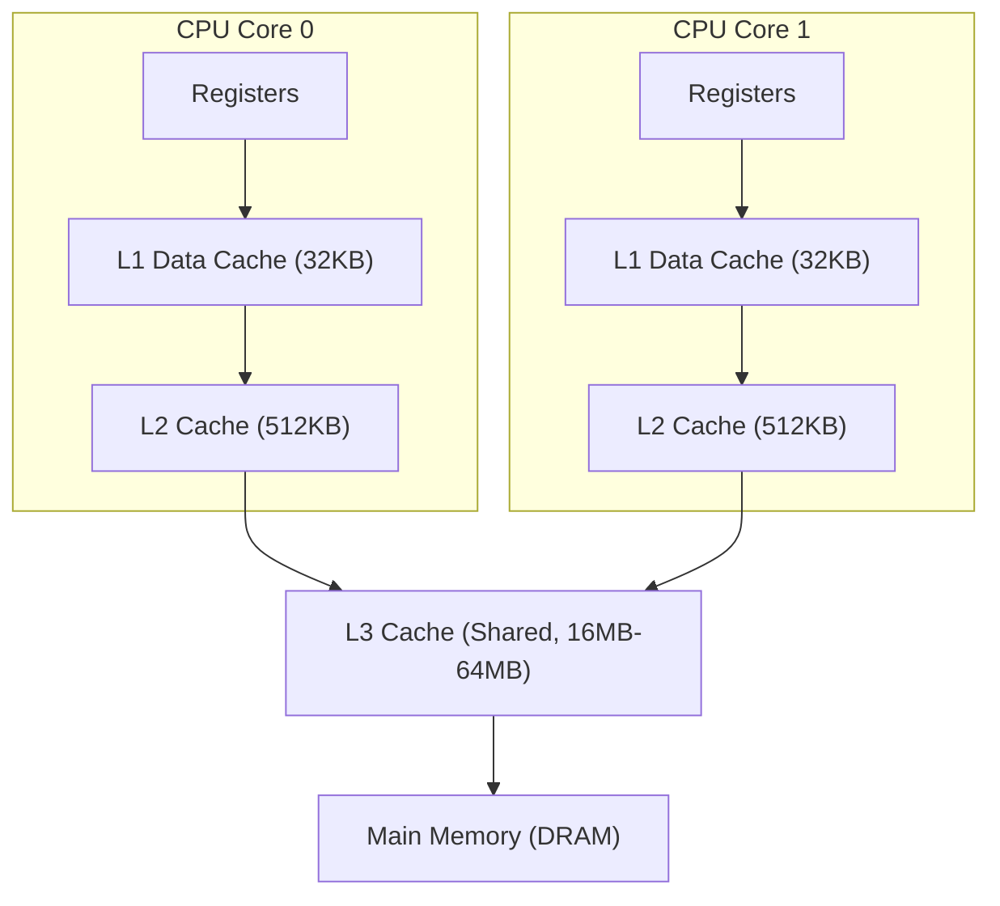
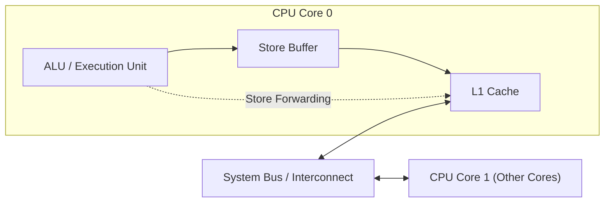
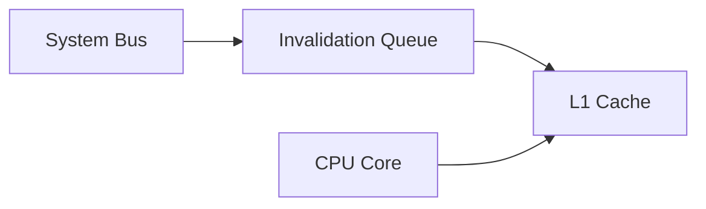
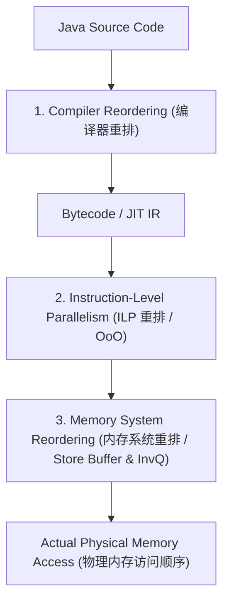
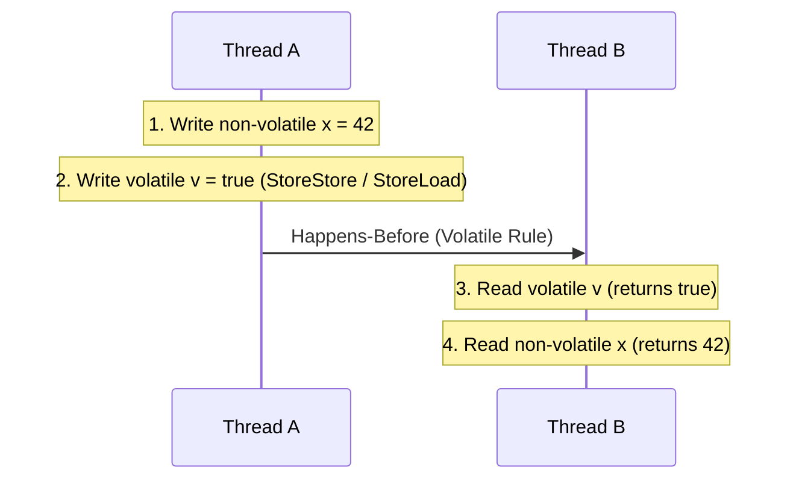
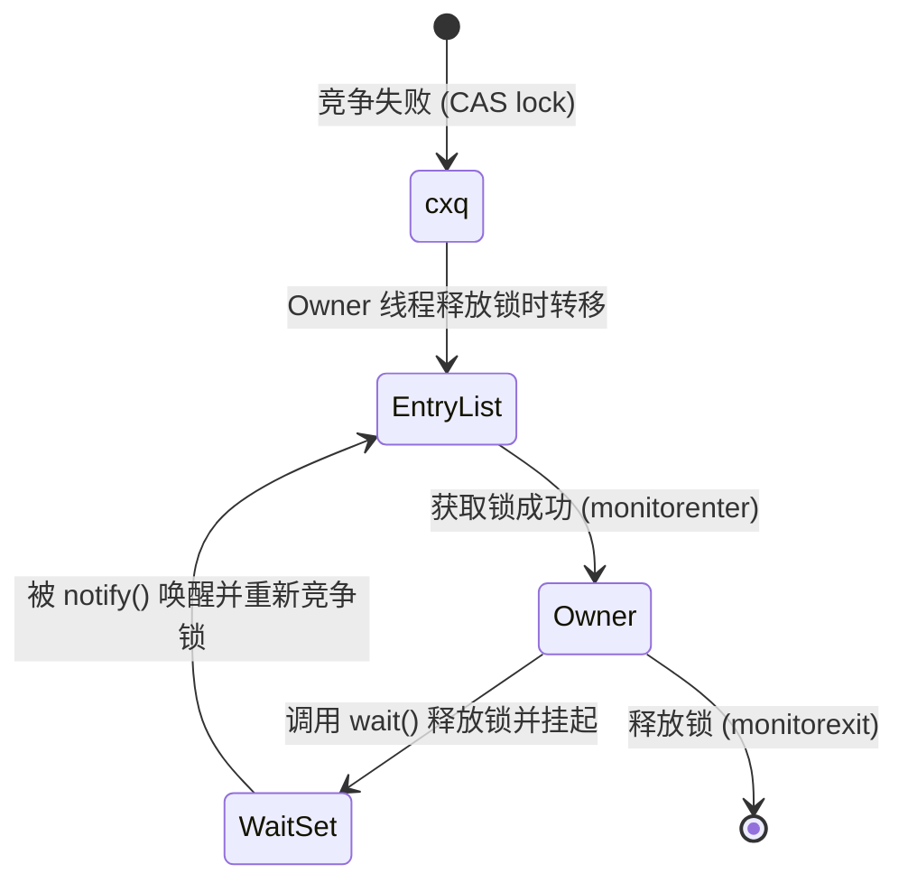
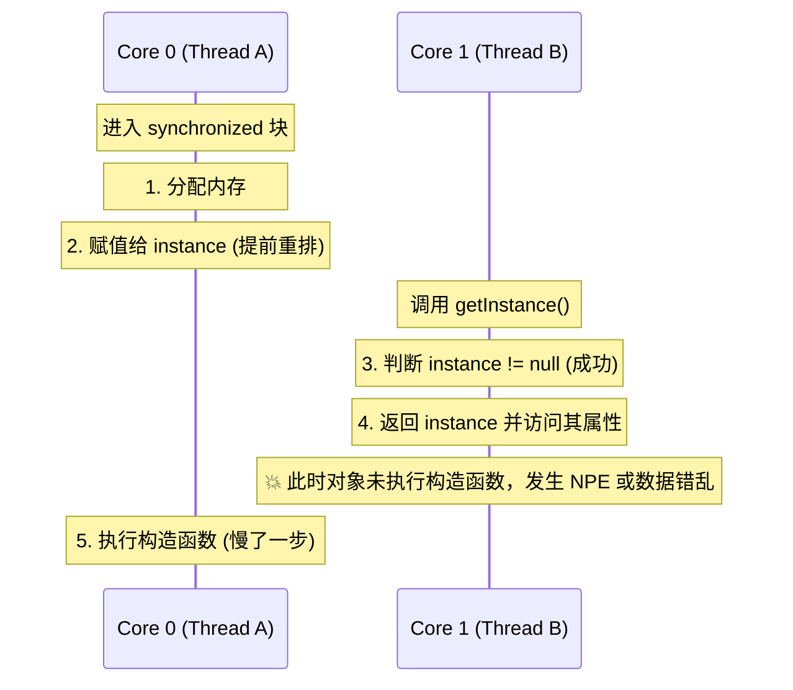
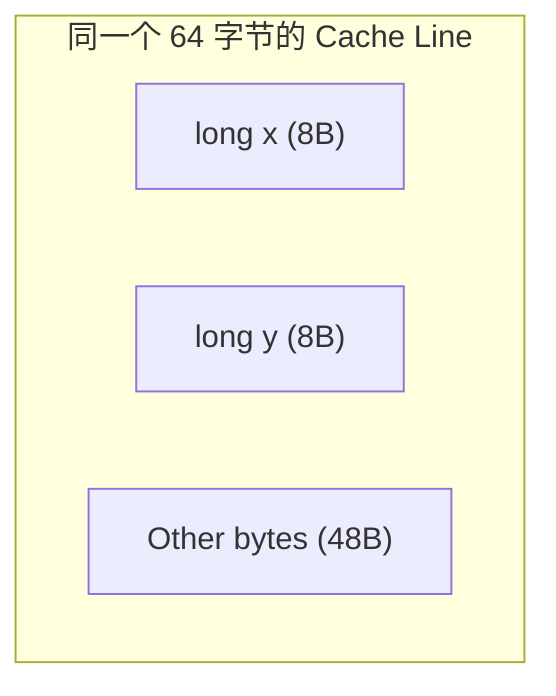

# 并发三要素的物理级深度剖析：原子性、可见性与有序性

在多核现代计算机体系结构中，并发编程的底层复杂性主要源于 CPU 架构对极致性能的追求。Java 内存模型（JMM，Java Memory Model）作为一种高级抽象，旨在屏蔽不同硬件平台与操作系统的内存访问差异，为开发者提供统一的并发语义。

为了真正理解 Java 中 `volatile`、`synchronized`、`final` 以及 `CAS` 的底层机理，我们必须剥离 JVM 的外壳，深入到多核 CPU 拓扑结构、缓存一致性协议（MESI）、写缓冲区（Store Buffer）、无效化队列（Invalidation Queue）、流水线乱序执行（OoO）以及汇编级内存屏障等硬件视角的物理级本质。

---

## 1. 并发三要素的理论边界与定义

并发编程的核心问题可以归结为三个基本要素：**原子性（Atomicity）**、**可见性（Visibility）** 和 **有序性（Ordering）**。

### 1.1 原子性 (Atomicity)
**定义**：一个或多个操作在 CPU 执行的过程中，要么全部正确执行且期间不被任何因素中断，要么全部不执行。对于其他线程而言，不存在“执行了一半”的中间状态。

*   **硬件边界**：在单核 CPU 时代，原子性的威胁主要来自线程切换（时钟中断引发的抢占式调度）。在多核时代，即使单条汇编指令（如 `add dword ptr [edi], 1`），在 CPU 层面也需要经历“读取-修改-写入”（Read-Modify-Write, RMW）三个子步骤，这在多核并发访问同一物理内存时并非天生原子的。硬件层面的原子性保障依赖于 **总线锁（Bus Locking）** 或 **缓存锁（Cache Locking）**。
*   **软件边界**：Java 中除了基本的八种基本类型（除 `long` 和 `double` 在 32 位系统上可能存在半写入外）的读写是原子性的，其他复合操作（如 `i++`）必须借助锁（如 `synchronized`）或原子类（如 `AtomicInteger`，基于 CAS）来保证原子性。

### 1.2 可见性 (Visibility)
**定义**：当一个线程修改了共享变量的值，其他线程能够立即、准确地得知这个修改。

*   **硬件边界**：可见性问题的物理根源是 **CPU 缓存（L1/L2/L3 Cache）** 以及 **写缓冲区（Store Buffer）** 和 **无效化队列（Invalidation Queue）**。当 Core A 修改了其本地 Cache 中的数据后，该修改并不会立即、同步地写回主内存，其他核心对应的 Cache 也不会被实时刷新，从而导致 Core B 读取到过期的旧值。
*   **软件边界**：JMM 规定，所有变量都存储在主内存中，每个线程都有自己的工作内存（抽象对应 CPU 的寄存器和缓存）。线程对变量的所有操作都必须在工作内存中进行，不能直接读写主内存。JMM 通过插入特定的内存屏障，强制将工作内存的修改同步回主内存，并使其他线程的工作内存置为失效。

### 1.3 有序性 (Ordering)
**定义**：程序执行的顺序按照代码的先后顺序执行。在单线程环境下，程序的执行结果看起来总是与严格的顺序执行一致（即 `as-if-serial` 语义）；但在多线程并发环境下，由于重排序的存在，从另一个线程观察，代码的执行顺序可能是杂乱无章的。

*   **硬件边界**：为了提高指令执行效率，编译器和 CPU 会在不改变**单线程**执行结果的前提下，对指令序列进行重排序。这包括编译器的优化重排、处理器的指令级并行（ILP）乱序执行、以及由于存储系统引入的内存访问重排。
*   **软件边界**：JMM 允许编译器和处理器进行重排序，但通过 `Happens-Before` 规则定义了跨线程的偏序关系。当程序需要强有序性时，开发者必须通过 `volatile` 或锁显式限制重排序。

---

## 2. 硬件级根源：多核 CPU 缓存与一致性局限

要透彻理解可见性与有序性的物理根源，必须首先剖析现代多核 CPU 的存储拓扑结构，以及为了追求极致吞吐而引入的异步硬件组件。

### 2.1 现代多核 CPU 的存储拓扑
为了弥补 CPU 执行速度与物理内存（DRAM）访问延迟之间几个数量级的巨大鸿沟，现代 CPU 采用了多级缓存结构：



由于每个 Core 都有独立的 L1/L2 缓存，当 Core 0 和 Core 1 同时将同一个主存变量加载到自己的 L1/L2 中并进行修改时，就会产生“数据不一致”问题。

### 2.2 缓存一致性协议（以 MESI 为例）
为了在硬件层面维护多核缓存的一致性，CPU 引入了缓存一致性协议，最经典的是 **MESI 协议**（也称 Illinois 协议）。它将每个缓存行（Cache Line，通常为 64 字节）标记为以下四种状态之一：

| 状态 | 缩写 | 描述 |
| :--- | :--- | :--- |
| **Modified** (已修改) | **M** | 缓存行仅存在于当前 Core 的缓存中，且已被修改（与主内存数据不一致）。当前 Core 拥有独占写入权，且负责写回主内存。 |
| **Exclusive** (独占) | **E** | 缓存行仅存在于当前 Core 的缓存中，且与主内存数据一致。可以随时被修改为 M 状态而无需通知其他核心。 |
| **Shared** (共享) | **S** | 缓存行存在于多个 Core 的缓存中，且与主内存数据一致。当前 Core 只能读，不能直接写。 |
| **Invalid** (无效) | **I** | 缓存行数据已失效，不能读取或写入。需要从其他核心或主内存重新加载。 |

#### MESI 状态转换的同步阻塞痛点
假设 Core 0 想要对其缓存中处于 **Shared (S)** 状态的某个变量进行写操作：
1. **发送无效化消息**：Core 0 不能直接修改该缓存行，它必须在总线上广播一条 `Invalidate`（无效化）消息，通知所有其他持有该缓存行副本的 Core 将其置为 **Invalid (I)** 状态。
2. **同步等待确认**：Core 0 必须挂起（Stall）并处于等待状态，直到所有其他核心返回 `Invalidate Acknowledge`（无效化确认）消息。
3. **状态跃迁与写入**：收到所有确认后，Core 0 将该缓存行状态提升为 **Modified (M)** 并写入新值。

在 CPU 动辄 3GHz+ 的主频下，等待总线通信并接收确认消息可能需要几十甚至上百个 CPU 周期。这种**同步等待造成的 Stall 会严重损耗 CPU 的吞吐量**。

---

## 3. Store Buffer 与 Invalidation Queue 的物理引入

为了彻底消除上述 MESI 同步等待的 Stall，硬件架构师引入了两个极其关键的异步硬件缓冲区：**Store Buffer（写缓冲区）** 和 **Invalidation Queue（无效化队列）**。

### 3.1 Store Buffer 的工作机理与 Store Forwarding
为了避免等待 `Invalidate Acknowledge`，CPU 核心旁边增加了一个被称为 **Store Buffer** 的高速写缓冲区：



#### 工作机制
1. 当 Core 0 想要写入一个处于 `Shared` 状态的共享变量时，它将写入请求（地址和新值）直接扔进自己的 **Store Buffer** 中。
2. Core 0 立即异步发送 `Invalidate` 消息，并且**不再等待确认**，直接继续执行后续的指令。
3. 当确认消息 `Invalidate Acknowledge` 陆陆续续返回后，CPU 内部的存储控制器再把 Store Buffer 中的数据刷入（Flush）对应的 Cache Line，并将其状态修改为 `Modified`。

#### Store Forwarding (写转发)
引入 Store Buffer 后，带来了一个直观的问题：Core 0 在把 `a = 1` 写入 Store Buffer 后，还没来得及刷入 Cache，紧接着又执行了 `r1 = a`。如果 Core 0 直接去自己的 L1 Cache 里读，此时 Cache 里依然是旧值。
为了解决单线程内部的数据一致性，硬件实现了 **Store Forwarding** 技术：当 Core 0 读取变量时，会同时向自己的 L1 Cache 和自己的 Store Buffer 发起检索。如果 Store Buffer 中存在未刷盘的最新数据，则直接从 Store Buffer 中获取。

然而，**Store Buffer 是当前核心独占的，其他核心根本无法访问它，也感知不到它的存在。**

---

### 3.2 Invalidation Queue 的工作机理
随着 Store Buffer 的引入，写端速度大幅提升。但如果读端（接收 `Invalidate` 消息的其他核心）处理速度跟不上，导致总线积压，依然会拖慢整体速度。
为了加速接收端的响应，硬件又在每个核心的缓存输入端增加了 **Invalidation Queue（无效化队列）**：



#### 工作机制
1. 当 Core 1 收到来自 Core 0 的 `Invalidate` 消息时，它不等待自己的缓存行物理完成失效动作，而是**直接把该消息放入本地的 Invalidation Queue 中**。
2. Core 1 立即向总线回复 `Invalidate Acknowledge` 确认。
3. Core 1 的 CPU 核心在闲暇时或在特定指令触发时，才会去扫描并处理 Invalidation Queue，将其对应的缓存行置为 `Invalid`。

---

### 3.3 物理机制带来的副作用：可见性延迟与乱序

Store Buffer 和 Invalidation Queue 极大提升了硬件吞吐量，但却彻底颠覆了“物理内存顺序一致性”，直接导致了可见性延迟与乱序。

#### 1. 可见性延迟的物理本质
*   **写端延迟**：Core 0 修改了数据，但在写入 Store Buffer 到真正刷入 Cache Line 之间有一段时间差。在此期间，其他 Core 无法通过总线看到这个新值。
*   **读端延迟**：Core 1 虽然接收到了 `Invalidate` 消息并回复了确认，但由于该消息还滞留在 Invalidation Queue 中未被物理处理，Core 1 的本地 Cache Line 依然处于 `Shared` 状态。此时 Core 1 读取该变量，读到的依旧是自己 Cache 中的旧值。

#### 2. Store Buffer 引入的 Write-Read 乱序（写后读乱序）
这是最著名的内存系统重排序。我们通过经典的 **Dekker 算法片段** 来演示这一硬件过程。

**初始状态**：变量 `a` 和 `b` 都在主内存中，且值均为 0。Core 0 缓存了 `a`（处于 Shared 状态），Core 1 缓存了 `b`（处于 Shared 状态）。

```java
// Core 0 执行
a = 1;      // Store a = 1 (指令 1)
r1 = b;     // Load b      (指令 2)

// Core 1 执行
b = 1;      // Store b = 1 (指令 3)
r2 = a;     // Load a      (指令 4)
```

按照直觉（顺序一致性），`r1` 和 `r2` 至少有一个应该为 1，不可能同时为 0。但在硬件物理层面上，可能会发生如下流转：

1.  **Core 0** 执行 `a = 1`。因为 `a` 是 Shared 状态，需要发送 Invalidate 消息。Core 0 将 `a = 1` 写入其 **Store Buffer** 中，并向总线广播 Invalidate 消息，随后立即向下执行。
2.  **Core 1** 执行 `b = 1`。同样，`b` 是 Shared 状态，Core 1 将 `b = 1` 写入其 **Store Buffer** 中，发送 Invalidate 消息，随后立即向下执行。
3.  此时，Core 0 的 Store Buffer 里是 `a = 1`，Core 1 的 Store Buffer 里是 `b = 1`。但它们都**还没有刷入各自的 Cache**。
4.  **Core 0** 执行 `r1 = b`。由于 Core 0 本地 Cache 中 `b` 的缓存行依然是有效状态（其收到的关于 `b` 的 Invalidate 消息可能刚到 Invalidation Queue 还没处理），且 Core 0 的 Store Buffer 里没有 `b`，所以它直接读取本地 Cache，读到 `b = 0`，赋值给 `r1`。
5.  **Core 1** 执行 `r2 = a`。同理，Core 1 读取自己本地 Cache 中的 `a`，读到 `a = 0`，赋值给 `r2`。
6.  随后，双方的 Store Buffer 刷入 Cache。

**结果**：`r1 = 0` 且 `r2 = 0`。
从外部观察者视角来看，Core 0 的执行顺序仿佛变成了 `r1 = b` 先于 `a = 1` 执行；Core 1 仿佛变成了 `r2 = a` 先于 `b = 1` 执行。这就是著名的 **Store-Load 重排序**（或称 **Write-Read 乱序**）。

---

## 4. 三大重排序类型深度剖析

重排序并不是单一层面的问题，从我们编写的 Java 源码到最终在 CPU 运行的物理电信号，会经历三层重排序的过滤。



### 4.1 编译器重排 (Compiler Reordering)
编译器（包括 Java 的 `javac` 和 JIT 编译器，如 C1/C2）在不改变单线程程序语义的前提下，为了提高代码执行效率，会重新安排指令的执行顺序。
*   **优化手段**：
    *   **指令调度（Instruction Scheduling）**：调整指令顺序以减少 CPU 流水线气泡（Stall）。
    *   **寄存器分配（Register Allocation）**：尽量让多次使用的变量留在寄存器中，避免频繁读写内存，这会改变内存访问的物理交错顺序。
    *   **公共子表达式消除与常量折叠**。
*   **约束限制**：编译器必须遵守 `as-if-serial` 语义。如果两个操作存在数据依赖性，编译器严禁重排序。例如：
    ```java
    double r = 3.14;     // A
    double area = r * r; // B (B 依赖 A，不能重排)
    ```

### 4.2 处理器指令级并行 (ILP) 重排 (Instruction-Level Parallelism Reordering)
现代高性能 CPU 绝非简单按顺序执行指令的机器，它们是高度复杂的乱序执行（Out-of-Order Execution, OoO）引擎。

#### 1. 流水线（Pipeline）与分支预测（Branch Prediction）
CPU 执行一条指令分为多个阶段：取指（IF）、译码（ID）、执行（EX）、访存（MEM）、写回（WB）。如果指令 A 在执行阶段需要等待内存数据，后面的指令 B（不依赖 A）如果闲置，CPU 就会让指令 B 提前进入执行阶段。这就是指令级并行。
此外，通过分支预测，CPU 可能会在条件判断结果出来之前，就提前猜测并“预执行”分支中的指令。如果猜测正确，则直接提交结果，这客观上造成了执行顺序的改变。

#### 2. 乱序执行引擎的物理实现：ROB 与 保留站
现代 CPU（如 x86/ARM）内部包含以下核心组件来实现乱序执行与顺序提交：

*   **保留站（Reservation Stations / Issue Queue）**：指令被译码后，会被分配到保留站。只要该指令所需的源操作数（来自寄存器或其他指令的输出）准备就绪，且对应的执行单元（如 ALU）空闲，该指令就可以立刻被发射（Issue）执行，而不必等待排在它前面的未就绪指令。
*   **重排序缓冲区（Reorder Buffer, ROB）**：这是保证乱序执行程序不会乱套的关键。所有的指令按照原始的程序顺序（Program Order）进入 ROB 队列。指令虽然是乱序执行的，但执行完毕后的结果只能先写入 ROB，不能直接修改物理寄存器或写回内存。只有当排在 ROB 队列最前面的指令执行完毕后，该指令才能被“提交（Retire / Commit）”，并将其结果真正写回寄存器或内存。
*   **物理效果**：ROB 实现了“乱序执行，顺序提交”。然而，对于内存操作，即使指令在 ROB 中是顺序提交的，一旦数据进入了 **Store Buffer**，它在多核总线上的传播依然是异步乱序的，这便进入了第三类重排序。

### 4.3 内存系统重排 (Memory System Reordering)
如前文所述，这是由多核缓存架构中的 **Store Buffer** 和 **Invalidation Queue** 导致的。即使处理器核心内部完美地按照程序顺序（In-Order）提交了写指令和读指令，但在总线上，由于写缓冲区的异步排队写回和无效化队列的延迟处理，多核之间观察到的内存访问顺序依然被打乱了。

---

## 5. 硬件内存屏障的消解机制

为了在必要时抑制上述重排序，提供跨核的同步语义，硬件厂商在 CPU 指令集中提供了特殊的指令——**内存屏障（Memory Barriers / Memory Fences）**。

### 5.1 内存屏障的物理功能分类
从功能上看，硬件内存屏障主要分为以下三类：

1.  **写屏障 (Store/Write Barrier)**：
    *   **物理效果**：强制将当前核心 Store Buffer 中的所有挂起写操作刷入 Cache Line，或者通过在 Store Buffer 中插入一个标记（Marker），使得屏障之后的写操作必须等待屏障之前的写操作全部刷入 Cache 之后才能执行。
    *   **解决问题**：保证写屏障之前的写操作对其他核心的可见性顺序。
2.  **读屏障 (Load/Read Barrier)**：
    *   **物理效果**：强制当前核心处理其 Invalidation Queue 中的所有无效化消息，使得本地 Cache 中对应的缓存行物理失效。
    *   **解决问题**：保证读屏障之后的读操作能够看到其他核心最新的写入。
3.  **全屏障 (Full Barrier)**：
    *   **物理效果**：同时具备读屏障和写屏障的功能。强制冲刷 Store Buffer 并处理 Invalidation Queue。

---

### 5.2 强内存模型与弱内存模型的硬件差异
不同 CPU 架构在处理内存重排序时的激进程度完全不同，这决定了它们对内存屏障的依赖程度：

| 架构类型 | 代表 CPU | 允许 Read-Read 重排 | 允许 Read-Write 重排 | 允许 Write-Write 重排 | 允许 Write-Read 重排 | 内存模型分类 |
| :--- | :--- | :--- | :--- | :--- | :--- | :--- |
| **x86 / x64** | Intel / AMD | 否 | 否 | 否 | **是** | **TSO (Total Store Order, 强顺序模型)** |
| **ARM / POWER** | Apple M系列等 | **是** | **是** | **是** | **是** | **Weakly Ordered (弱顺序模型)** |

#### x86 (TSO 模型) 的屏障消解
x86 是一种非常“友好”的强内存模型架构，硬件几乎帮我们处理了绝大多数乱序。在 x86 上：
*   不存在 Read-Read 乱序。
*   不存在 Write-Write 乱序。
*   不存在 Read-Write 乱序。
*   **仅存在 Write-Read 乱序（Store-Load 重排）**。

因此，在 x86 架构下：
*   `lfence`（读屏障）和 `sfence`（写屏障）在普通内存读写上通常是空操作（No-op），它们只用于非临时性内存（Non-temporal Stores，如 SSE/AVX 的指令绕过缓存直接写内存）。
*   要想解决唯一的 Write-Read 乱序，必须使用全功能屏障 `mfence`。

#### ARM (弱顺序模型) 的屏障消解
ARM 架构为了追求极致的能效比，采用了非常松散的弱内存模型。它允许几乎所有的重排序。为了维护正确的顺序，ARM 提供了丰富的屏障指令：
*   **DMB (Data Memory Barrier)**：数据内存屏障。保证屏障前后的内存访问指令顺序，但不阻塞 CPU 流水线。
*   **DSB (Data Synchronization Barrier)**：数据同步屏障。比 DMB 更强，它会挂起 CPU，直到屏障前所有的内存访问完全完成。
*   **ISB (Instruction Synchronization Barrier)**：指令同步屏障。冲刷流水线，确保屏障后所有的指令都从 Cache 中重新提取并译码。

---

## 6. JMM 的内存屏障抽象与 Happends-Before 规范

由于底层硬件平台的差异极其庞大，Java 虚拟机规范定义了统一的逻辑内存模型（JMM），通过逻辑上的四大屏障来统一不同硬件的实现。

### 6.1 JMM 抽象屏障
JMM 定义了四种逻辑内存屏障：

| 逻辑屏障类型 | 语法定义与物理语义 |
| :--- | :--- |
| **LoadLoad** | 指令顺序：`Load1; LoadLoad; Load2`。确保 `Load1` 的数据装载先于 `Load2` 及后续所有装载指令。 |
| **StoreStore** | 指令顺序：`Store1; StoreStore; Store2`。确保 `Store1` 的数据对其他处理器可见（冲刷到 Cache）先于 `Store2` 及后续所有存储指令。 |
| **LoadStore** | 指令顺序：`Load1; LoadStore; Store2`。确保 `Load1` 的数据装载先于 `Store2` 及后续所有存储指令的刷新。 |
| **StoreLoad** | 指令顺序：`Store1; StoreLoad; Load2`。全能型屏障。确保 `Store1` 的物理写回对其他处理器可见先于 `Load2` 及后续所有装载指令。 |

> [!IMPORTANT]
> **StoreLoad 屏障开销极其昂贵**。在几乎所有现代 CPU 架构上，执行 StoreLoad 屏障都必须强制冲刷 Store Buffer，这会导致 CPU 流水线彻底 Stall，直到写缓冲区清空。

---

### 6.2 Happens-Before 规则的数学本质
`Happens-Before` 是 JMM 最核心的偏序关系规范。如果操作 A `happens-before` 操作 B，那么 A 的执行结果对 B 可见，且 A 的顺序排在 B 之前。

#### 1. 经典 Happens-Before 规则
1.  **程序顺序规则 (Program Order Rule)**：在一个线程内，按照程序代码顺序，书写在前面的操作 happens-before 书写在后面的操作。（这是单线程内 `as-if-serial` 语义的延伸）。
2.  **监视器锁规则 (Monitor Lock Rule)**：对一个锁的解锁（unlock）操作 happens-before 随后对这个锁的加锁（lock）操作。
3.  **volatile 变量规则 (Volatile Variable Rule)**：对一个 volatile 变量的写操作 happens-before 随后对这个变量的读操作。
4.  **传递性 (Transitivity)**：如果 A happens-before B，且 B happens-before C，那么 A happens-before C。
5.  **线程启动规则 (Thread Start Rule)**：Thread 对象的 `start()` 方法 happens-before 此线程的每一个动作。
6.  **线程终止规则 (Thread Join Rule)**：线程中的所有操作都 happens-before 对此线程的终止检测（通过 `Thread.join()` 结束或 `Thread.isAlive()` 检测）。
7.  **线程中断规则 (Thread Interrupt Rule)**：对线程 `interrupt()` 方法的调用 happens-before 被中断线程的代码检测到中断事件的发生。
8.  **对象终结规则 (Finalizer Rule)**：一个对象的初始化完成（构造函数执行结束）happens-before 它的 `finalize()` 方法的开始。

#### 2. 传递性与多线程同步推导
Happens-Before 的强大之处在于通过 **传递性** 将单线程的顺序性与多线程的可见性关联起来：



依据规则：
*   根据程序顺序规则：`1 happens-before 2`，`3 happens-before 4`。
*   根据 volatile 变量规则：`2 happens-before 3`。
*   根据传递性推导：`1 happens-before 4`。

**结论**：即使 `x` 只是一个普通的非 volatile 变量，当 Thread B 成功读到 `v == true` 时，也必然能够百分之百读到 Thread A 写入的 `x = 42`。这就是 JMM 提供的强一致性保证。

---

## 7. JMM 满足三大特性的具体硬件实现机理

本节深入剖析 JVM（以 HotSpot 为例）是如何利用汇编指令、锁机制以及类加载器机制来实现 JMM 规范的。

### 7.1 volatile 的硬件级实现（屏障插入策略与 lock 汇编）

#### 1. 编译器视角的屏障插入策略
JIT 编译器在将字节码编译为机器码时，会采用如下高度保守的策略插入逻辑屏障：

*   **volatile 写** 操作前插入：`StoreStore` 屏障（禁止上面的普通写和 volatile 写与当前写重排）。
*   **volatile 写** 操作后插入：`StoreLoad` 屏障（禁止当前的 volatile 写与下面可能存在的 volatile 读/写或普通读重排）。
*   **volatile 读** 操作后插入：`LoadLoad` 屏障（禁止上面的 volatile 读与下面的普通读和 volatile 读重排）。
*   **volatile 读** 操作后紧接着插入：`LoadStore` 屏障（禁止上面的 volatile 读与下面的普通写和 volatile 写重排）。

JMM 屏障与 volatile 读写的逻辑结构如下：
*   **Volatile 写** 结构：
    `[StoreStore Barrier]` $\rightarrow$ `[Volatile Store]` $\rightarrow$ `[StoreLoad Barrier]`
*   **Volatile 读** 结构：
    `[Volatile Load]` $\rightarrow$ `[LoadLoad Barrier] & [LoadStore Barrier]`

#### 2. JIT 在不同处理器架构下的物理翻译
如前文所述，真实的 CPU 并没有直接名为 `LoadLoad` 的指令。JVM 必须将其翻译为目标平台的物理指令：

##### 在 ARM 架构上
*   `StoreStore` $\rightarrow$ `DMB ST`
*   `LoadLoad` / `LoadStore` $\rightarrow$ `DMB LD`
*   `StoreLoad` $\rightarrow$ `DMB ISH`（全系统内存屏障）

##### 在 x86 架构上（重点）
由于 x86 极其强劲的 TSO 内存模型：
*   `StoreStore` 逻辑屏障：**直接翻译为空指令（NOP）**！因为 x86 硬件本身就绝不允许写写乱序。
*   `LoadLoad` 和 `LoadStore` 逻辑屏障：**直接翻译为空指令（NOP）**！因为 x86 本身就不允许读读、读写乱序。
*   **`StoreLoad` 逻辑屏障**：由于 x86 允许写后读（Store-Load）乱序，所以这个屏障**必须**被翻译成硬屏障。

在 HotSpot x86 实现中，`StoreLoad` 没有使用 `mfence` 指令，而是使用了一条极其特别的汇编：
```assembly
lock addl $0x0, (%rsp)   ; 在栈顶指针指向的内存加上 0
```
##### 为什么使用 `lock addl $0x0, (%rsp)` 代替 `mfence`？
1.  **兼容性与性能**：在早期奔腾处理器时代，`mfence` 指令的执行开销极大（甚至会使管线完全清空且有额外的微码延迟），而 `lock` 前缀指令由于是 CPU 核心高频执行的操作（如 CAS、自旋锁），硬件厂商对其进行了深度优化。在大多数 x86 CPU 上，`lock` 变体的执行速度优于 `mfence`。
2.  **物理效果等价性**：`lock` 前缀指令具有如下硬件级语义：
    *   **锁总线/锁缓存（Bus/Cache Lock）**：在执行加法操作的瞬间，独占对应的缓存行（或锁住系统总线），阻止其他 Core 同时读写该内存地址。
    *   **冲刷 Store Buffer**：强行将当前 CPU 核心 Store Buffer 中的所有挂起写操作刷入 Cache Line。这满足了 `Store` 的可见性。
    *   **失效其他核心缓存**：让其他 CPU 核心中所有对应的 Cache Line 立即失效。这保证了后续 `Load` 的新鲜度。
    因此，`lock` 指令在物理效果上完全等价于一个强力的 Full Barrier，完美实现了 `StoreLoad` 的语义。

---

### 7.2 CAS 的汇编本质与 lock cmpxchg
并发包中 `AtomicInteger` 等无锁工具的核心是 CAS（Compare-And-Swap）。

#### 1. Java 层的 CAS 声明
在 Java 中，CAS 是通过 `sun.misc.Unsafe` 类的 native 方法实现的：
```java
public final native boolean compareAndSwapInt(Object o, long offset, int expected, int x);
```

#### 2. C++ 源码层面的映射（HotSpot）
在 JVM 源码中（以 `unsafe.cpp` 为例），最终会调用平台相关的 `Atomic::cmpxchg` 函数。在 `atomic_linux_x86.inline.hpp` 中，我们可以看到其内联汇编实现：
```cpp
inline jint Atomic::cmpxchg (jint exchange_value, volatile jint* dest, jint compare_value) {
  int mp = os::is_MP(); // 检查是否为多核 (Multi-Processor)
  __asm__ volatile (
    "lock; cmpxchgq %1,(%3)"
    : "=a" (exchange_value)
    : "r" (exchange_value), "a" (compare_value), "r" (dest)
    : "cc", "memory"
  );
  return exchange_value;
}
```

#### 3. 汇编指令剖析：lock cmpxchg
*   `cmpxchg` 是 x86 的比较并交换指令。但在多核 CPU 下，单纯的 `cmpxchg` 指令**并不是原子的**。
*   `lock` 前缀：如果检测到是多核处理器（`is_MP` 返回 1），JVM 会在 `cmpxchg` 前加上 `lock` 前缀。
*   `lock cmpxchg` 的物理防线：
    1.  **早期（总线锁）**：锁住系统总线（Assert #LOCK signal），在指令执行期间，任何其他核心都无法通过总线访问内存，开销极大。
    2.  **现代（缓存锁）**：如果目标数据已经缓存在当前核心的 Cache 中，并且其状态为 Exclusive 或 Modified，CPU 就不再锁总线，而是使用缓存锁。它会利用 MESI 协议，阻止其他核心读取或修改对应的缓存行，直到 CAS 指令执行完毕。
    3.  **内存屏障效果**：类似于 volatile，`lock` 前缀具有天然的内存屏障效果，能保证当前核心在 CAS 之前和之后的指令不发生乱序，且数据变更立即可见。

---

### 7.3 synchronized 的字节码与重量级锁物理机制

#### 1. 字节码表现
当我们对一个方法或代码块使用 `synchronized` 时，编译器会生成相应的字节码：
*   **同步代码块**：使用 `monitorenter` 和 `monitorexit` 指令。
    ```bytecode
    0: aload_0
    1: monitorenter      // 获取锁
    2: ...               // 临界区代码
    3: aload_0
    4: monitorexit       // 正常释放锁
    5: goto          13
    8: astore_1
    9: aload_0
    10: monitorexit      // 异常退出时释放锁，保证不发生死锁
    11: aload_1
    12: athrow
    ```
*   **同步方法**：在 Class 文件的常量池中通过设置 `ACC_SYNCHRONIZED` 标志位隐式实现。JVM 在方法调用时检测到该标志，会自动进行加锁。

#### 2. 重量级锁的物理基石：ObjectMonitor
当锁膨胀为重量级锁时，锁对象的 Mark Word 会指向一个 `ObjectMonitor` 对象。在 HotSpot 中，`ObjectMonitor` 的核心结构如下：

```cpp
ObjectMonitor() {
  _header       = NULL;
  _count        = 0;          // 记录无锁/锁状态及重入次数
  _owner        = NULL;       // 指向持有 ObjectMonitor 对象的线程
  _cxq          = NULL;       // 单向链表，自旋竞争失败的线程会被挂载到这里
  _EntryList    = NULL;       // 双向链表，处于 Blocked 状态的线程队列
  _WaitSet      = NULL;       // 调用 wait() 方法后处于 Waiting 状态的线程队列
  _recursions   = 0;          // 锁的重入次数
}
```

#### 3. 状态流转与物理同步屏障



*   **加锁机制 (monitorenter)**：
    线程尝试通过 CAS 将 `_owner` 指向自己。如果失败，说明有竞争：
    1.  线程会进行若干次自旋（Spinning）尝试获取锁，避免直接挂起引起的上下文切换。
    2.  若依然获取失败，则通过 CAS 将自己插入到 `_cxq` 队列的首部。
    3.  最终调用 OS 系统的 `pthread_mutex_lock`，通过内核的互斥体将线程挂起（Park）。
*   **释放锁机制 (monitorexit)**：
    持有锁的线程将 `_owner` 置空，并且唤醒 `_EntryList` 或 `_cxq` 中的线程（通常是把 `_cxq` 中的线程转移到 `_EntryList` 中，然后唤醒 `_EntryList` 的首节点）。
*   **内存屏障效果**：
    在 `monitorenter` 成功后，JVM 内部会隐含执行读屏障（使本地缓存失效，从主内存重新加载共享变量）；在 `monitorexit` 释放锁之前，会执行写屏障（强制将临界区内所有修改刷回主内存）。这完美契合了 Happens-Before 的监视器锁规则。

---

### 7.4 final 关键字的内存语义与防溢出屏障

`final` 不仅代表“不可变”，在 JMM 中，它有着极其重要的内存语义，能够确保对象在不加锁的情况下的**安全发布**。

#### 1. final 的写屏障语义
*   **规则**：在构造函数内对一个 `final` 域的写入，与随后把这个被构造对象的引用赋值给一个引用变量，这两个操作之间不能重排序。
*   **实现机制**：JIT 编译器会在 `final` 域的写入之后，构造函数 `return` 之前，插入一个 **StoreStore 屏障**。
*   **物理效果**：这确保了当其他线程能够读到该对象的引用时，该对象的 `final` 属性已经被正确初始化并刷入 Cache，绝不会读取到 `final` 属性的默认初始值（如 `0`、`false` 或 `null`）。

#### 2. final 的读屏障语义
*   **规则**：初次读一个包含 `final` 域的对象的引用，与随后初次读这个对象的 `final` 域，这两个操作之间不能重排序。
*   **实现机制**：JIT 编译器会在读 `final` 域操作的前面插入一个 **LoadLoad 屏障**（在一些如 ARM 等弱内存模型架构下特别关键，防止读操作乱序导致先读到了 final 域，后读到了对象引用）。
*   **物理效果**：这确保了在读对象的 `final` 域之前，一定会先读入该对象的引用。

#### 3. 构造函数溢出（this 逃逸）的致命危害
尽管 final 有强力的屏障护航，但前提是**不能发生 this 逃逸**。

##### 错误示范：this 逃逸
```java
public class EscapeExample {
    final int a;
    static EscapeExample instance;

    public EscapeExample() {
        a = 42; // 1. 写入 final 域
        // 致命错误：在此处将 this 暴露出去
        instance = this; // 2. 将引用发布到 static 变量中
    }
}
```
##### 物理漏洞分析
根据 final 的 JMM 规则，`StoreStore` 屏障被插入在构造函数的最后一行（即右括号 `}` 处）。
然而在上面的代码中，`instance = this` 发生在构造函数结束之前。编译器和处理器可能会将操作 1 和操作 2 进行重排序（因为它们之间没有数据依赖性）。
如果发生重排序：
1.  Core 0 执行构造函数，先将当前半初始化的 `this` 引用赋值给 `instance`（操作 2 提前）。
2.  Core 1 此时读取 `instance`。由于 `instance` 不为 null，Core 1 试图读取 `instance.a`。
3.  因为 `a = 42`（操作 1）此时还没有执行，或者其 `StoreStore` 屏障还未生效，Core 1 读取到的 `a` 值为 **`0`**（默认初始值）。
4.  随后 Core 0 才执行 `a = 42` 的写入。

**结论**：`this` 逃逸破坏了 `final` 屏障的安全发布边界，使多线程下的不可变安全性荡然无存。

---

## 8. 经典并发问题剖析与实战案例

### 8.1 双重检查锁定（DCL）单例模式的崩塌与重构

DCL（Double-Checked Locking）是研究有序性和可见性的最经典案例。

#### 1. 错误的 DCL（无 volatile）
```java
public class DoubleCheckedLocking {
    private static DoubleCheckedLocking instance; // 未加 volatile

    private DoubleCheckedLocking() {}

    public static DoubleCheckedLocking getInstance() {
        if (instance == null) { // 第一次检查
            synchronized (DoubleCheckedLocking.class) {
                if (instance == null) { // 第二次检查
                    instance = new DoubleCheckedLocking(); // 问题所在行
                }
            }
        }
        return instance;
    }
}
```

#### 2. 对象创建的字节码视角与重排序
我们聚焦于 `instance = new DoubleCheckedLocking();` 这一行。在 JVM 字节码层面，它对应着以下 4 条核心指令：
```bytecode
0: new           #2  // class DoubleCheckedLocking (分配内存空间，并赋默认值)
3: dup
4: invokespecial #3  // Method "<init>":()V (调用构造函数，执行成员变量初始化)
7: putstatic     #4  // Field instance:LDoubleCheckedLocking; (将引用赋值给 instance 变量)
```
在没有 `volatile` 限制时，编译器或 CPU 乱序执行引擎可能会对指令 4（`invokespecial`）和指令 7（`putstatic`）进行重排序，即变成如下顺序：
1.  **分配内存空间**。
2.  **将引用赋值给 `instance` 变量**（此时 `instance` 已非空，但**尚未执行构造函数**，处于半初始化状态）。
3.  **调用构造函数**。

#### 3. 跨核冲突的物理链路
当 Core 0 和 Core 1 并发访问时：



1.  **Core 0** 执行 `getInstance()`，进入同步块，执行对象创建。由于重排序，它先将引用赋值给 `instance`。
2.  **Core 1** 刚好执行到第一次检查 `if (instance == null)`。由于 Core 0 已经将引用写到了主存（或者 Core 1 通过缓存看到该引用不为 null），Core 1 判定条件为 `false`，直接返回了 `instance`。
3.  Core 1 拿着这个“半初始化”的单例对象去使用，在访问其成员变量时，程序崩溃（NPE 或读取到各种诡异的默认值）。

#### 4. volatile 解决方案与屏障图解
将 `instance` 声明为 `volatile` 后：
```java
private static volatile DoubleCheckedLocking instance;
```
JIT 会在写 `instance` 指令之前插入 `StoreStore` 屏障，在其之后插入 `StoreLoad` 屏障。
*   `StoreStore` 屏障保证：在 `instance` 引用赋值（`putstatic`）之前，构造函数内的所有写入（`invokespecial`）必须物理完成。
*   这彻底阻断了指令 4 和指令 7 的重排序，从而保证了 DCL 的绝对线程安全。

---

### 8.2 伪共享（False Sharing）与缓存行对齐

可见性的物理载体是 **缓存行（Cache Line）**。虽然多核缓存一致性协议（MESI）保证了数据一致，但如果使用不当，会导致极其严重的性能滑坡，即 **伪共享（False Sharing）**。

#### 1. 伪共享的成因
CPU 缓存是以缓存行（通常为 64 字节）为单位进行管理的。
假设我们有一个类，里面有两个独立的成员变量：
```java
public class Pointer {
    long x; // 8 字节
    long y; // 8 字节
}
```
在内存分布上，`x` 和 `y` 大概率会被分配在同一个 64 字节的 Cache Line 中。



如果 Thread A 运行在 Core 0 上，频繁修改 `x`；Thread B 运行在 Core 1 上，频繁修改 `y`。
根据 MESI 协议：
1.  Core 0 修改 `x` 时，必须让 Core 1 对应的 Cache Line 失效（将整行置为 **Invalid**）。
2.  Core 1 修改 `y` 时，也必须让 Core 0 对应的 Cache Line 失效。
3.  结果：这个 Cache Line 在两个 Core 之间频繁地来回穿梭、失效、重载（这被称为 **Ping-Pong 效应**）。
虽然 `x` 和 `y` 在逻辑上毫无关联，但由于物理上处于同一个 Cache Line，导致多核之间发生了虚假的共享竞争，CPU 的吞吐量呈断崖式下跌。

#### 2. Java 中的消解方案

##### 方案 A：手动填充（Padding）- Java 7 及以前
通过在变量前后声明无意义的 long 变量，强制将目标变量隔离到不同的 Cache Line 中。
```java
public class VolatileLongPadding {
    public volatile long p1, p2, p3, p4, p5, p6, p7; // 填充 56 字节
    public volatile long value = 0L;                 // 目标变量
    public volatile long p9, p10, p11, p12, p13, p14, p15; // 填充 56 字节
}
```

##### 方案 B：使用 `@Contended` 注解 - Java 8 及以后
Java 8 引入了 `@sun.misc.Contended` 注解，由 JVM 在类加载和内存布局时自动在对象字段前后增加填充（通常为 128 字节，可覆盖绝大多数处理器的 Cache Line 宽度）。
```java
@sun.misc.Contended
public class Point {
    long x;
    long y;
}
```
*   **配置限制**：默认情况下，该注解只对 JDK 核心库类（由 Bootstrap ClassLoader 加载的类）生效。若要在用户自定义类中使用，必须在 JVM 启动参数中开启：`-XX:-RestrictContended`。

---

## 9. 总结：并发三要素硬件成因与消解矩阵

最后，我们通过一张完整的矩阵映射表，将软件并发语义、JMM 规范与底层的物理硬件机制贯通起来：

| 特性维度 | 软件并发语义 | JMM 规范级手段 | 底层逻辑屏障 | x86 (TSO) 物理实现 | ARM (弱顺序) 物理实现 |
| :--- | :--- | :--- | :--- | :--- | :--- |
| **原子性** | `i++` 非原子<br>`a = 1` 原子 | `synchronized`<br>Lock<br>CAS | 无直接屏障映射<br>(依赖互斥逻辑) | `lock cmpxchg`<br>总线锁 / 缓存锁 | `ldrex` / `strex` 独占加载与存储指令 |
| **可见性** | 线程 A 写入后<br>线程 B 立即可见 | `volatile`<br>`synchronized`<br>锁释放与获取 | `StoreStore`<br>`LoadLoad` | 默认硬件可见性维护<br>(仅在 Store-Load 时需 `lock addl` 强制刷写) | `DMB ST` 强制刷写<br>`DMB LD` 强制应用失效队列 |
| **有序性** | 禁止指令重排<br>保证 Happends-Before | `volatile`<br>`final`<br>Happens-Before | `StoreStore`, `StoreLoad`<br>`LoadLoad`, `LoadStore` | `StoreLoad` $\rightarrow$ `lock addl`<br>其他逻辑屏障 $\rightarrow$ **NOP (空指令)** | `DMB ISH` (全能屏障)<br>`DMB ST`<br>`DMB LD` |

并发三要素的底层探索是一段从高级语言代码逐渐下沉到硅片物理结构的过程。作为 Java 开发者，虽然 JMM 为我们筑起了精美的抽象长城，但只有深刻理解硬件底层的 Store Buffer、Invalidation Queue 和内存屏障的消解机制，才能在面对高并发、低延迟的性能瓶颈时，做到游刃有余、明察秋毫。
