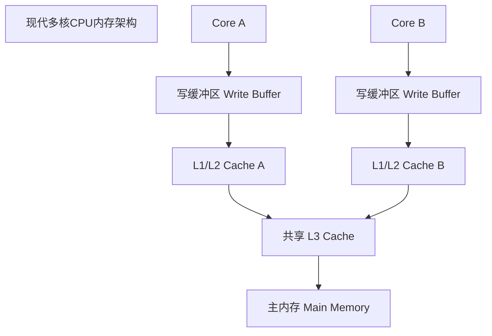
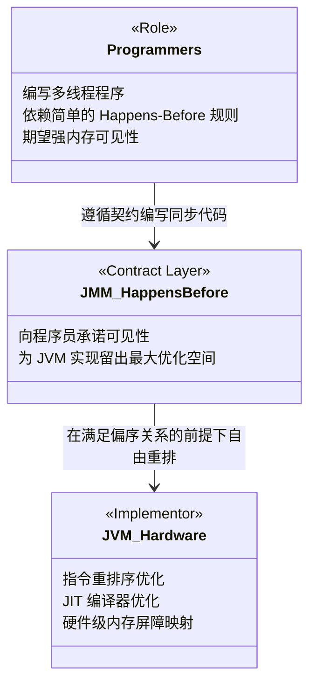
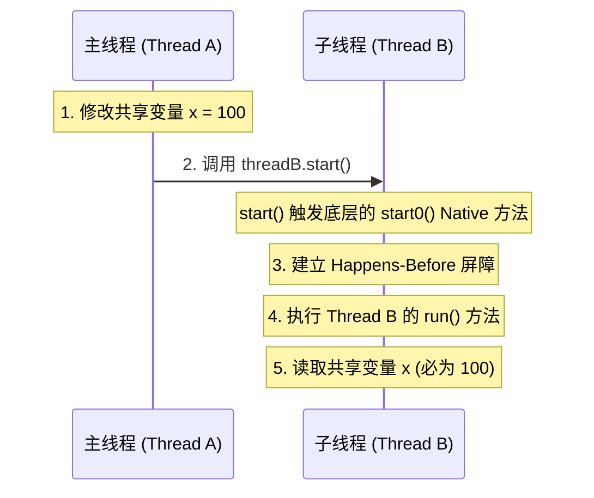
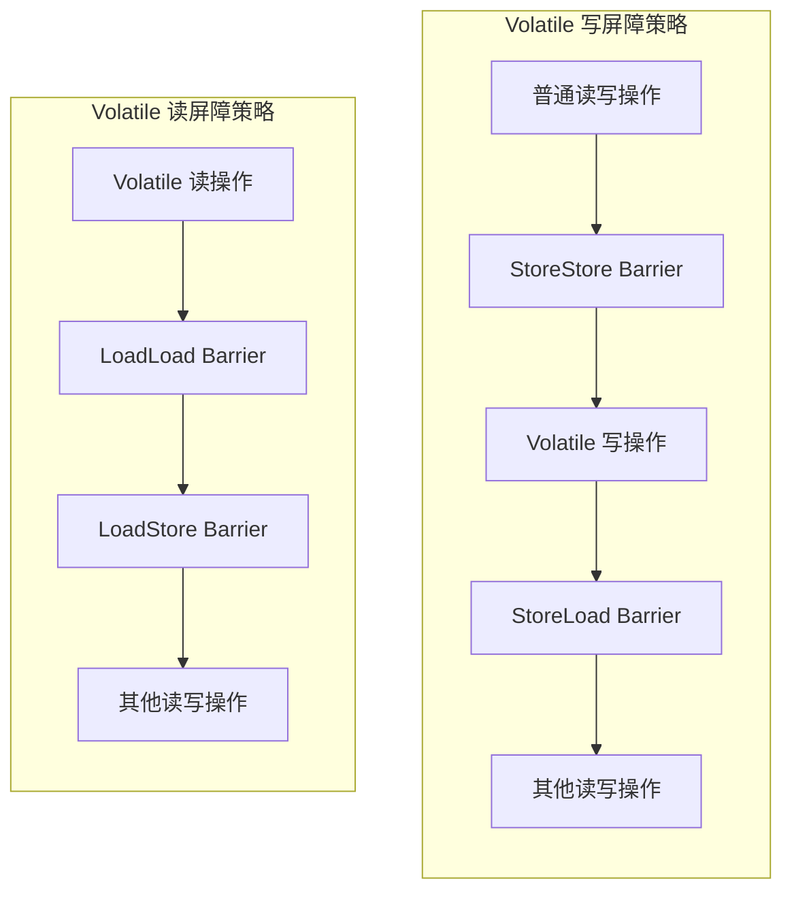
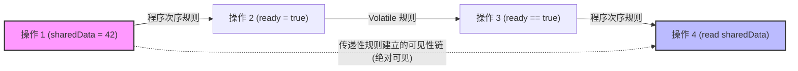

# 2.1.3.4 Happens-Before原则

在多线程并发编程的世界中，由于现代计算机体系结构的复杂性，程序员编写的源代码与最终在 CPU 上执行的指令序列之间存在着巨大的鸿沟。编译器为了榨干单核 CPU 的性能，会进行指令重排序优化；多核 CPU 拥有各自独立的高速缓存（L1, L2, L3 Cache）与写缓冲区（Write Buffer），导致不同核心间的内存视图不一致。

为了在“运行效率”与“可编程性”之间寻找黄金平衡点，Java 虚拟机在 JSR-133（Java 内存模型与线程规范）中引入了 **Happens-Before 原则**（先行发生原则）。它是 Java 内存模型（Java Memory Model, JMM）的核心基石，是理解 Java 并发编程可见性、有序性与数据竞争防范的关键钥匙。

本文将从现代硬件体系结构的物理冲突出发，深度剖析 Happens-Before 的设计哲学、JSR-133 规范定义的 8 大规则、硬件级内存屏障的映射机制、可见性传导链的物理推演，以及 Happens-Before 与物理时间先后顺序的本质区别。

---

## 1. 现代硬件与编译优化的冲突：为什么需要 Happens-Before？

要透彻理解 Happens-Before，必须先了解它所拯救的“混乱世界”。在单线程中，程序员习惯了顺序执行的直觉。然而在多核多线程环境中，以下三种因素会彻底打破这种直觉：

### 1.1 编译器重排序（Compiler Reordering）
编译器（如 javac、JIT 编译器）在不改变**单线程执行结果（As-if-Serial）**的前提下，为了提高寄存器与流水线的利用率，会调整代码的执行顺序。
例如：
```java
int a = 1;
int b = 2;
```
对于单线程，先执行 `a = 1` 还是先执行 `b = 2` 没有任何区别。编译器为了优化寄存器分配，可能会将其编译为先给 `b` 赋值，再给 `a` 赋值。但在多线程下，这种重排序可能会导致严重的并发 bug。

### 1.2 处理器乱序执行与重排序（Instruction Reordering）
现代 CPU 采用超标量架构，支持**乱序执行（Out-of-Order Execution）**和**分支预测（Branch Prediction）**。只要指令之间不存在数据依赖关系（Data Dependency），CPU 就会利用空闲的执行单元并发执行指令，导致物理执行顺序与程序指令顺序不一致。

### 1.3 内存系统重排序与缓存不一致（Memory System Reordering）
即使 CPU 严格按顺序执行指令，由于高速缓存（Cache）与写缓冲区（Write Buffer）的存在，内存读写操作在其他核心看来依然可能是乱序的。

当 Core A 执行写操作时，数据可能先写入自己的 **Write Buffer** 中，而没有立即刷入 L1/L2 Cache，更没有刷入共享的 L3 Cache 或主内存。此时 Core B 去读取该数据，读取到的依然是旧值。这种由于写缓冲区延迟刷新和无效队列（Invalidation Queue）延迟处理导致的现象，从效果上等同于“内存操作被重排序了”。

#### 1.3.1 MESI 缓存一致性协议与硬件级冲突
在物理硬件上，多核 CPU 通过 **MESI（Modified-Exclusive-Shared-Invalid）** 协议保证多核缓存数据的一致性：
*   **M (Modified, 已修改)**：该缓存行只被当前 CPU 缓存，且已被修改，与主内存数据不一致。需要适时写回主内存。
*   **E (Exclusive, 独占)**：该缓存行只被当前 CPU 缓存，数据与主内存一致。
*   **S (Shared, 共享)**：该缓存行被多个 CPU 缓存，且与主内存一致。
*   **I (Invalid, 已失效)**：该缓存行数据已失效，不能被读取。

然而，MESI 协议在遭遇连续写操作时，会导致处理器因为等待其他核的失效响应（Invalidate Acknowledge）而处于阻塞挂起状态。为了彻底榨干处理器的执行时钟，硬件设计者引入了 **Store Buffer（写缓冲区）** 和 **Invalidate Queue（无效化队列）**：

*   **Store Buffer（写缓冲区）的引入与风险**：
    处理器执行写指令时，直接将数据写入本地的 Store Buffer，并向其他处理器广播 Invalidate 消息，随后无需等待其他核心响应即可继续执行下一条指令。当收到所有失效确认后，处理器才异步将 Store Buffer 中的数据同步到 Cache 中。
    *这导致了一个经典的物理重排序：Store Buffer Forwarding（写缓冲区转发）。当前核心自己读取能读到最新写入的值，但其他核心由于失效广播还没处理完毕，根本看不到最新值。从效果上，写操作被延迟推后了，导致了“写-读（Store-Load）”重排序。*
    
*   **Invalidate Queue（无效化队列）的引入与风险**：
    为了加速响应 Invalidate 消息，处理器将收到的失效请求直接存入本地的 Invalidate Queue，便立刻回复 Invalidate Acknowledge 消息。然而，处理器并不会立即处理 Invalidate Queue，而是等待空闲时才去处理，使相应的缓存行失效。
    *这导致另一个处理器已经确认了“失效”并回复了确认，但实际上它的 Cache 中依然保留着脏数据，随后的读操作直接读取到了本地未被置为失效的旧数据。从效果上，读操作被“提前”或读取了过时的数据。*

### 1.4 顺序一致性模型与 JVM 的折中
最直观的并发模型是**顺序一致性模型（Sequential Consistency Model）**，它有两个核心特征：
1. 一个线程中的所有操作都必须按照程序的顺序来执行。
2. （不管线程是否同步）所有线程都只能看到一个单一的全局执行顺序，且每个操作都必须是原子执行的，并立即对所有线程可见。

然而，如果 JVM 强制实现顺序一致性模型，就必须在每一条可能发生冲突的指令前后插入昂贵的内存屏障，这会彻底废掉 CPU 的流水线、超标量乱序执行、多级缓存以及编译器的所有优化，导致程序运行速度暴跌数个数量级。

因此，JVM 采取了**折中方案**：默认情况下，JVM 不保证顺序一致性，只保证**单线程下的 As-if-Serial 语义**。但它提供了一套规则与工具——**Happens-Before 原则**，让程序员在需要时通过少量的同步手段（如 `volatile`、`synchronized`）来建立跨线程的可见性与有序性保障。

---

## 2. Happens-Before 的设计哲学：解耦的并发契约

Happens-Before 的本质是一种**契约（Contract）**，它在“程序员易于使用的并发抽象”与“编译器/CPU 追求的高效执行”之间建立了一座清晰解耦的桥梁。



### 2.1 双向折中的艺术
*   **面向程序员的承诺**：
    如果操作 A happens-before 操作 B，那么 JMM 向程序员保证：**操作 A 的执行结果对操作 B 可见，且操作 A 的执行顺序排在操作 B 之前**。这为程序员提供了一个强内存模型（Strong Memory Model）的幻觉，让我们无需关心底层复杂的 CPU 缓存一致性协议和复杂的汇编指令，就能推导出程序的并发行为。
*   **面向 JVM 与硬件的解耦**：
    JMM 向底层申明：**只要不改变单线程执行语义（As-if-Serial）以及 Happens-Before 约定的偏序关系，编译器和 CPU 可以进行任何重排序与缓存优化**。这意味着，即使 A happens-before B，但如果重排序 A 与 B 之后的执行结果与按照 Happens-Before 关系执行的结果完全一致，那么 JVM 完全允许这种重排序。

### 2.2 偏序关系（Strict Partial Order）
在数学上，Happens-Before 关系是一种**偏序关系**。它具有以下数学性质：
1.  **非自反性（Irreflexivity）**：对于任意操作 $A$，不存在 $A \text{ happens-before } A$。一个操作不能发生在它自己之前。
2.  **非对称性（Asymmetry）**：如果 $A \text{ happens-before } B$，那么 $B$ 不能 $\text{happens-before } A$。
3.  **传递性（Transitivity）**：如果 $A \text{ happens-before } B$，且 $B \text{ happens-before } C$，那么 $A \text{ happens-before } C$。

通过这种偏序关系，JMM 并没有定义一个全局唯一的、绝对的执行时间线，而是只在那些**确实存在并发因果关系**的操作之间建立约束。对于其他无关联的操作，则保留了极致的并发优化自由。

---

## 3. JSR-133 规范定义的 8 大 Happens-Before 规则逐条深度技术剖析

根据 JSR-133（在 Java 5 及后续版本中正式确立），Java 内存模型定义了以下 8 条最基础的 Happens-Before 规则。它们是判断数据是否存在竞争、线程是否安全的首要依据。

### 3.1 程序次序规则（Program Order Rule）
> **定义**：在一个线程内，按照程序代码顺序，书写在前面的操作 happens-before 书写在后面的操作。

#### 深度解析：
*   **边界限制**：该规则仅在**同一个线程内**有效。
*   **数据依赖性（Data Dependency）与控制依赖性（Control Dependency）**：
    虽然规则说“前面的操作 happens-before 后面的操作”，但并不意味着前面的操作一定比后面的操作先执行。JVM 只在存在**数据依赖**时才会禁止重排序。
    例如：
    ```java
    double r = 1.0;     // A
    double pi = 3.14;   // B
    double area = pi * r * r; // C
    ```
    这里，A happens-before B 吗？按照规则，是的，在单线程里 A happens-before B。
    但实际上，A 与 B 之间没有任何数据依赖关系，编译器可以把 B 重排序到 A 之前。然而，C 依赖 A 和 B 的值，因此 A happens-before C 且 B happens-before C 是被严格强制保证的，编译器绝对不能把 C 重排序到 A 或 B 之前。这就是 **As-if-Serial** 语义的体现。
    同样，**控制依赖**通常发生在分支判断中：
    ```java
    if (flag) {       // D
        int val = a;  // E
    }
    ```
    在物理硬件上，CPU 可以采用分支预测投机执行操作 E。如果预测失败，则废弃结果。但从逻辑上，JMM 会通过屏障限制和程序顺序确保 D happens-before E 产生的可见性效果不被破坏。

### 3.2 监视器锁规则（Monitor Lock Rule）
> **定义**：一个 unlock 操作 happens-before 后面对同一个锁的 lock 操作。这里的“后面”是指物理时间上的先后顺序。

#### 深度解析：
*   **同一把锁**：锁规则强调必须是“同一个锁”。如果线程 A 释放了锁 `lock1`，线程 B 获取了锁 `lock2`，它们之间不具备 Happens-Before 关系。
*   **JVM 锁优化背后的可见性保障**：
    在 JVM 内部，锁的获取（lock）和释放（unlock）对应着 `monitorenter` 和 `monitorexit` 字节码指令。为了实现监视器锁规则，JVM 在实现这两个操作时，会隐式插入特定的内存屏障或执行特定的同步指令：
    *   **进入锁（Lock/Monitorenter）**：会让当前线程的本地缓存（L1/L2 Cache、Write Buffer 等）失效，从而强制该线程接下来对共享变量的读取必须直接从主内存中获取。
    *   **释放锁（Unlock/Monitorexit）**：强制将当前线程在临界区内对共享变量做出的所有修改，立即从 Write Buffer 和本地缓存中刷新写入主内存中，确保后续抢到锁的线程能看到最新值。
*   **锁膨胀（Lock Inflation）的影响**：
    无论是偏向锁（Biased Locking）、轻量级锁（Lightweight Locking）还是重量级锁（Heavyweight Locking），JVM 必须保证无论锁如何膨胀，其对应的内存屏障语义不能丢失。
    *   在重量级锁下，底层依赖操作系统的互斥量（Mutex Lock）来实现。获取 Mutex 时，内核层会自动插入硬件级的内存屏障，确保 CPU 不会在临界区边界外进行重排序。
    *   在轻量级锁或偏向锁下，通过 `CAS (Compare-And-Swap)` 修改对象头的 Mark Word。CAS 操在 x86 等多核架构下翻译为带 `lock` 前缀的指令（例如 `lock cmpxchg`），该前缀会自动锁定总线/缓存，阻止乱序并刷新本地 Store Buffer，从而在无锁膨胀时依然隐式地提供了强内存屏障功能。

### 3.3 volatile 变量规则（volatile Variable Rule）
> **定义**：对一个 volatile 变量的写操作 happens-before 后面对这个 volatile 变量的读操作。这里的“后面”是指物理时间上的先后顺序。

#### 深度解析：
*   **禁止指令重排序（Instruction Reordering Prevention）**：
    对 volatile 变量的写入和读取，会作为内存物理边界。编译器在编译代码时，会在 volatile 读写指令的前后插入特定屏障，阻止非 volatile 变量越过 volatile 变量边界进行重排序。
*   **可见性传递**：
    当线程 A 写入一个 volatile 变量，线程 B 随后读取该变量时，线程 A 在写入该变量之前所做的所有共享变量的修改，都将被同步刷新到主内存，且对线程 B 是立即可见的。
*   **为何 volatile 不保证原子性，却能保证强可见性？**
    `volatile` 仅保证单个变量读/写的原子性（如 64 位的 `long` 和 `double` 读写在 volatile 修饰下被强制要求是原子的），但不保证复合操作（如 `count++`，它包含“读-改-写”三步）的原子性。
    然而，在可见性层面，通过硬件级的高速缓存一致性协议（如 MESI 协议）与内存屏障，volatile 写操作会使其他 CPU 核心持有的该变量的缓存行（Cache Line）立即置为**无效（Invalid）**状态，当其他核心再次读取该变量时，必须发起总线请求从主内存或拥有最新数据的缓存行重新读取。
*   **volatile 的引用局限性**：
    ```java
    private static volatile User user = new User("Alice");
    ```
    如果修改 `user` 引用（如 `user = new User("Bob")`），其可见性完全受 volatile 规则保护。但如果仅仅修改 `user` 内部的属性（如 `user.setName("Bob")`），**该属性的可见性是不受 volatile 保护的**。因为 volatile 规则只作用于该变量本身的读写，无法向下传递至其引用的对象字段（除非 `User` 内部的 `name` 字段也声明为 `volatile`）。

### 3.4 线程启动规则（Thread Start Rule）
> **定义**：Thread 对象的 `start()` 方法 happens-before 此线程的每一个动作。



#### 深度解析：
*   **技术原理**：
    当我们在主线程 A 中调用 `threadB.start()` 时，Java 虚拟机在底层会调用 Native 方法 `JVM_StartThread`。在创建并启动底层操作系统线程（如调用 `pthread_create`）之前，JVM 会强制执行一次内存屏障操作，将主线程中在 `threadB.start()` 之前发生的所有写操作刷新到主内存中。
*   **推论**：
    子线程 B 开始执行 `run()` 方法时，能够 100% 看到主线程 A 在调用 `threadB.start()` 之前做出的所有数据修改。
*   **如果没有此规则**：
    主线程初始化的各种配置参数、准备好的共享数据，可能会因为子线程内部的读取操作重排序到启动前，或者主线程的数据还残留在 Store Buffer 中，导致子线程启动后读取到一堆未完全初始化的默认零值，发生不可预测的空指针或运行期错误。

### 3.5 线程终止规则（Thread Termination Rule）
> **定义**：线程中的所有操作都 happens-before 对此线程的终止检测。我们可以通过 `Thread.join()` 方法结束、`Thread.isAlive()` 的返回值等手段检测到线程已经终止执行。

#### 深度解析：
*   **应用场景**：
    当主线程 A 启动了子线程 B 去执行某项耗时计算，并在 A 中调用了 `threadB.join()` 等待其结束。一旦 `join()` 方法成功返回，或者 `threadB.isAlive()` 返回 `false`，主线程 A 就可以百分之百确定：子线程 B 在运行期间做出的所有共享变量修改，此时已经全部对主线程 A 可见。
*   **底层机制**：
    当子线程 B 执行完毕准备退出时，JVM 底层在销毁线程对象的 native 清理流程中（如 `JavaThread::exit`），会释放该线程持有的锁（即线程对象自身的 Monitor），并调用 `notifyAll` 唤醒所有在等待该线程结束的线程（如在 `join()` 里挂起的线程）。这一释放锁的操作（unlock）与等待线程被唤醒后的操作（lock/读取状态）建立起了 Happens-Before 关系。
*   **源码痕迹**：
    在 HotSpot 虚拟机源码中，线程销毁的核心逻辑位于 `thread.cpp` 的 `JavaThread::exit()` 函数。该函数内部会调用 `ensure_join(this)`。而在 `ensure_join` 内，会获取当前 `JavaThread` 对象锁，将线程状态标记为死亡，并执行 `lock.notify_all(thread)`。此时，由于释放了锁并退出了同步代码块，触发了隐式的内存释放屏障（Unlock 操作），将该线程的所有写缓存全部刷回主内存。

### 3.6 线程中断规则（Thread Interrupt Rule）
> **定义**：对线程 `interrupt()` 方法的调用 happens-before 被中断线程的代码检测到中断事件的发生（可以通过 `Thread.interrupted()` 或者是 `Thread.isInterrupted()` 检测到）。

#### 深度解析：
*   **可见性传导**：
    如果线程 A 调用了线程 B 的 `interrupt()` 方法，接着线程 B 在运行过程中检测到了中断（抛出 `InterruptedException` 或者通过 `isInterrupted()` 返回 `true`），那么线程 B 在检测到中断的这一刻，不仅能看到中断状态已被修改，还能百分之百看到线程 A 在调用 `interrupt()` 之前所做的所有共享变量的修改。
*   **底层的 OS 支持**：
    调用 `interrupt()` 会在底层触发操作系统的同步机制。例如，在 HotSpot 中，`Thread::interrupt()` 会修改线程的中断标志位（`_interrupted`），并调用操作系统相关的唤醒动作（如 `os::interrupt` 中使用 `pthread_kill` 发送信号，或通过 `ParkEvent` 的 `unpark` 唤醒挂起的线程）。在这个过程中，底层的互斥锁或系统调用会起到内存屏障的作用，保证状态的发布对读取线程立即可见。

### 3.7 对象终结规则（Finalizer Rule）
> **定义**：一个对象的初始化完成（构造函数执行结束） happens-before 它的 finalize() 方法的开始。

#### 深度解析：
*   **对象生命周期保障**：
    该规则确保了在垃圾回收器调用对象的 `finalize()` 方法时，该对象的所有非静态成员变量都已经完成了初始化赋值，避免在析构/清理时读取到垃圾数据或未初始化的默认零值。
*   **底层的执行机制**：
    JVM 在创建一个含有自定义 `finalize()` 方法的对象时，会在其构造函数执行完之后，将该对象的引用包装成一个 `Finalizer` 对象（它是 `FinalReference` 的子类），并注册到 JVM 的双向注册链表中。在 GC 时，垃圾回收器会将即将被回收的 `Finalizer` 对象移入一个特定的引用队列（`ReferenceQueue`），由 JVM 中的守护线程 `FinalizerThread` 循环从队列中取出并调用对象的 `finalize()` 方法。
    *在这个注册到队列、被守护线程消费的完整路径上，JVM 保证了必要的锁同步与屏障插入，从而从逻辑上保证了“构造函数结束” happens-before “finalize() 运行”。*
*   **安全发布的前提**：
    需要特别注意的是，该规则仅保证“构造函数结束”与“finalize() 开始”的先后关系。如果对象在构造过程中发生了**构造器溢出（Constructor Escape）**，即在构造函数尚未执行完之前，就将当前对象 `this` 暴露给了其他线程，那么其他线程依然可能会读取到未初始化完全的字段值。

### 3.8 传递性规则（Transitivity Rule）
> **定义**：如果操作 A happens-before 操作 B，且操作 B happens-before 操作 C，那么操作 A happens-before 操作 C。

#### 深度解析：
传递性规则是 Happens-Before 原则中**最强大、最具实用价值**的规则。它像一根无形的链条，能够将单线程内部的“程序次序规则”与跨线程的“锁规则”或“volatile 规则”串联起来，从而建立跨越多个线程的、宏大的可见性传导网。我们将在接下来的第 5 节中，对传递性规则如何与 volatile 规则合作，进行详尽的物理时序与逻辑链推演。

---

## 4. 内存屏障（Memory Barrier）与底层物理实现

Happens-Before 规则不是凭空产生的，它是 JVM 规范对底层编译器和硬件平台能力的一种高层抽象。在虚拟机层面，Happens-Before 主要是通过**内存屏障（Memory Barrier / Fence）**来强制约束指令重排序和缓存刷新的。

### 4.1 四种逻辑内存屏障
为了屏蔽各种 CPU 架构的差异，JMM 定义了四种逻辑上的内存屏障：

| 屏障类型 | 逻辑含义 | 物理效果 |
| :--- | :--- | :--- |
| **LoadLoad** | `Load1; LoadLoad; Load2` | 确保 `Load1` 的数据装载先于 `Load2` 及所有后续装载指令执行，防止读读重排序。 |
| **StoreStore** | `Store1; StoreStore; Store2` | 确保 `Store1` 的数据对其他处理器可见（刷新到高速缓存/主存）先于 `Store2` 及所有后续存储指令的执行，防止写写重排序。 |
| **LoadStore** | `Load1; LoadStore; Store2` | 确保 `Load1` 数据装载先于 `Store2` 及所有后续存储指令刷新，防止读写重排序。 |
| **StoreLoad** | `Store1; StoreLoad; Load2` | 确保 `Store1` 数据对其他处理器可见先于 `Load2` 及所有后续装载指令执行。它是最重型的屏障，通常会冲刷整个写缓冲区（Write Buffer）。 |

### 4.2 volatile 读写前后的屏障插入策略
为了实现 `volatile` 变量的 Happens-Before 语义，JVM 机制制定了极其严格的屏障插入策略：



#### 4.2.1 写屏障详解：
*   **StoreStore 屏障**：在 volatile 写之前插入。作用是禁止前面的普通写操作与 volatile 写操作发生重排序，并强制将前面普通写产生的 Write Buffer 数据刷新，确保在 volatile 变量发生改变前，所有普通写操作已对其他核心可见。
*   **StoreLoad 屏障**：在 volatile 写之后插入。作用是禁止 volatile 写与后面可能发生的 volatile 读或普通读写发生重排序。此屏障也是四种屏障中开销最大的物理执行点，它会强制要求当前核心彻底清空其 Store Buffer，等待所有的 Invalidate Acknowledge 消息全部返回。

#### 4.2.2 读屏障详解：
*   **LoadLoad 屏障**：在 volatile 读之后插入。禁止后面的普通读与当前 volatile 读重排序，避免物理上发生读操作提前导致读到过期缓存。
*   **LoadStore 屏障**：在 volatile 读之后插入。禁止后面的普通写操作与当前 volatile 读发生重排序，维护严格的物理逻辑执行先后。

### 4.3 硬件架构映射：x86 与 ARM 的物理实现差异
不同的 CPU 物理架构有着截然不同的**内存一致性模型（Memory Consistency Model）**。

#### 1. x86 强内存模型架构（Strong Memory Model）
x86 是一种 **Total Store Order (TSO)** 架构。它在硬件层面保证：
*   **不会**对“读-读”进行重排序（无 LoadLoad 重排序）。
*   **不会**对“写-写”进行重排序（无 StoreStore 重排序）。
*   **不会**对“读-写”进行重排序（无 LoadStore 重排序）。
*   **唯一可能发生重排序的**是“写-读”操作（StoreLoad 重排序），即当前核的写操作还停留在 Write Buffer 中，随后的读操作已经从缓存中读取了。

**映射实现**：
在 x86 架构下，JVM 编译出的汇编指令中：
*   `LoadLoad`、`LoadStore`、`StoreStore` 均映射为**空操作（NOP）**，不需要插入任何硬件屏障，性能极高。
*   `StoreLoad` 屏障则无法省略。在 x86 中，通常通过使用带有 `lock` 前缀的指令（例如 `lock addl $0, (%rsp)`，向栈顶加 0 的空操作）来实现。`lock` 前缀指令会锁住总线或使用缓存锁定协议，强制把 Write Buffer 中的数据刷回缓存，并让其他核心的缓存行失效，其效果等同于 `MFENCE` 指令，但兼容性更好、效率更高。

#### 2. ARM 弱内存模型架构（Weak Memory Model）
ARM 架构为了追求极致的能耗比与高并发吞吐，采用了非常宽松的弱内存模型。在 ARM 下，除了存在数据依赖关系的操作外，所有的“读-读”、“读-写”、“写-写”、“写-读”在硬件层面**全部允许乱序执行**。

**映射实现**：
在 ARM 架构下，JVM 必须老老实实地将上述四种逻辑屏障翻译成真实的硬件屏障指令：
*   使用 `DMB` (Data Memory Barrier) 或 `DSB` (Data Synchronization Barrier) 指令。
*   例如，`DMB ISHLD` 用于约束读读和读写，`DMB ISHST` 用于约束写写，而 `DMB ISH` 则充当最重的全能屏障。
*   在最新的 ARMv8 架构中，引入了单方向的单边加载/存储指令：`LDAR` (Load-Acquire) 和 `STLR` (Store-Release)。这两条指令天生自带部分屏障属性，JVM 能够直接利用它们以更高的性能实现 `volatile` 读与写。

---

## 5. 黄金搭档的物理推推演：传递性与 volatile 规则的联合可见性链

为了看清 Happens-Before 是如何确保跨线程数据可见性的，我们设计一个最经典的并发协作模型——**基于 Flag 状态标志的线程同步**，并逐步推演其底层的物理过程。

### 5.1 经典协作代码
```java
public class VolatileVisibilityDemo {
    private int sharedData = 0;          // 普通共享变量
    private volatile boolean ready = false; // volatile 状态标志变量

    // 线程 A 执行写操作
    public void writer() {
        sharedData = 42;                 // 操作 1
        ready = true;                    // 操作 2
    }

    // 线程 B 执行读操作
    public void reader() {
        if (ready) {                     // 操作 3
            System.out.println(sharedData); // 操作 4 （预期输出：42）
        }
    }
}
```

### 5.2 Happens-Before 逻辑链条的建立（逻辑推导）
我们来用 8 大规则中的三条来推导为什么操作 4 能百分之百读到操作 1 写入的 `42`：

1.  **根据程序次序规则**：
    在线程 A 内，操作 1 和操作 2 是顺序书写的，因此：$\text{操作 1 } \text{happens-before } \text{操作 2}$。
    在线程 B 内，操作 3 和操作 4 是顺序书写的，因此：$\text{操作 3 } \text{happens-before } \text{操作 4}$。
2.  **根据 volatile 变量规则**：
    由于 `ready` 是 volatile 变量，且线程 A 写入 `ready`（操作 2），线程 B 读取 `ready`（操作 3）。如果线程 B 在物理时间上随后读取到了 `ready == true`，那么必有：$\text{操作 2 } \text{happens-before } \text{操作 3}$。
3.  **根据传递性规则**：
    我们拥有以下三个偏序关系：
    $$\text{操作 1 } \text{happens-before } \text{操作 2}$$
    $$\text{操作 2 } \text{happens-before } \text{操作 3}$$
    $$\text{操作 3 } \text{happens-before } \text{操作 4}$$
    根据传递性数学定理，我们可以推导出：
    $$\mathbf{\text{操作 1 } \text{happens-before } \text{操作 4}}$$

这就是说，操作 1 的执行结果对操作 4 **绝对可见**。因此，只要 `ready` 读取为 `true`，`sharedData` 就必然为 `42`，绝对不可能读取到旧值 `0`。



### 5.3 底层硬件与缓存物理时序推演
现在，我们剥离 JMM 的高层抽象，下沉到 CPU 硬件的多级缓存与内存屏障的物理运作过程，还原这一“奇迹”是如何发生的。

假设我们运行在 ARM64 处理器架构上：

```
[时间轴 t] 线程 A (Core A) 执行 writer()                     线程 B (Core B) 执行 reader()
--------------------------------------------------------------------------------------------------
t1: 执行 sharedData = 42 
    由于 sharedData 是普通变量，Core A 将 42 写入
    其本地的 Write Buffer A 中。
    (此时 sharedData 尚未刷入主内存，对 Core B 不可见)

t2: 执行 ready = true 之前的 StoreStore 屏障
    JIT 编译器在此插入了 DMB ISHST 指令。
    物理效果：强制要求 Core A 必须将 Write Buffer A 
    中所有在屏障之前的写操作（sharedData = 42）
    刷新到高速缓存（L1/L2 Cache）中，并向总线发出信号。

t3: 执行 ready = true (volatile 写)
    由于 ready 是 volatile 变量，其写入操作发生。
    Core A 的缓存行状态变为 Modified (M)，通过缓存
    一致性协议（MESI），通知其他核心该地址失效。
    接着，StoreLoad 屏障（DMB ISH）被执行，
    强制将 `ready` 和 `sharedData` 的最新数据冲刷出
    Core A 的本地私有缓存，写入共享 L3 缓存及主内存。

t4:                                                    执行 ready 变量的读取 (volatile 读)
                                                       由于 ready 是 volatile 变量，
                                                       Core B 的读操作伴随着 LoadLoad/LoadStore 屏障。
                                                       Core B 发现自己本地缓存中的 ready 缓存行已失效(I)，
                                                       强制通过总线向主内存（或 Core A 的 Cache）重新拉取。
                                                       读取到 ready 的值为 true。

t5:                                                    执行 LoadLoad 屏障
                                                       JIT 插入了 DMB ISHLD 指令。
                                                       物理效果：使 Core B 本地缓存中所有普通变量的缓存行
                                                       全部失效（如 sharedData 的缓存行置为 Invalid），
                                                       阻止了后续对普通变量的读操作被重排序到 volatile 读之前。

t6:                                                    执行读取 sharedData (操作 4)
                                                       Core B 从缓存读取 sharedData，发现已失效，
                                                       被迫从主内存（或已刷新的共享 Cache）中重新加载，
                                                       成功读取到最新的物理数值 42。
```

通过这套物理机制，JMM 成功利用了内存屏障与 MESI 协议，将 volatile 写与读作为一扇门，把普通变量的数据也“夹带”着同步了过去。

---

## 6. Happens-Before 与物理时间先后顺序的本质区别

在初学者中，最普遍也是最危险的误区就是：**将 Happens-Before 机械地等同于“物理时间上的先后顺序（Temporal Precedence）”**。

事实上，**“A happens-before B” 与 “A 在物理时间上先于 B 执行” 既非充分条件，也非必要条件**。它们是两个完全维度下的概念。为了彻底厘清这一认知，我们设计了两个经典的反例。

### 6.1 反例一：物理时间上先执行，但无 Happens-Before 关系（未同步的读写）
考虑以下代码：

```java
public class TemporalPrecedenceDemo {
    private int value = 0;

    public void setValue(int v) { // 操作 A
        this.value = v;
    }

    public int getValue() {       // 操作 B
        return this.value;
    }
}
```

假设有两个线程：线程 1 调用 `setValue(100)`，线程 2 调用 `getValue()`。

*   **物理时间上的序列**：
    在物理时间线上，线程 1 在 $t = 10ms$ 时完成了 `setValue(100)` 的执行。而线程 2 在 $t = 20ms$ 时才去调用 `getValue()`。从物理时间上来看，操作 A 绝对、远远先于操作 B 执行。
*   **Happens-Before 关系的缺失**：
    我们对照 8 大 Happens-Before 规则：
    *   两个操作在不同线程中，不适用程序次序规则。
    *   没有使用 `synchronized` 锁，不适用管程锁定规则。
    *   没有使用 `volatile` 修饰 `value`，不适用 volatile 变量规则。
    *   其他启动、终止、中断、传递性等规则均无法在此套用。
    结论是：**操作 A 与操作 B 之间不存在 Happens-Before 关系！**
*   **灾难性后果**：
    由于没有 Happens-Before 关系，这意味着 JMM 允许将这两个操作的内存视图进行隔离。即便线程 1 在物理时间上早执行了 10 毫秒，由于 Core 1 的写操作未刷新、Core 2 的读操作直接读了本地旧缓存，线程 2 读取到的 `value` 依然可能是 `0`。
*   **逻辑图解**：
    虽然时间先后很清晰，但由于没有建立 Happens-Before，内存可见性通道不存在：
    ```
    线程 1 (setValue):   [value = 100] ---> (停留在 Core 1 本地缓存/Write Buffer，未同步)
                                                     ❌ (无可见性链路)
    线程 2 (getValue):                      [read value] <--- (直接读取 Core 2 旧缓存，读到 0)
    ------------------------------------------------------------------------------------> 物理时间轴 (t)
                         t = 10ms           t = 20ms
    ```
*   **核心心法**：
    **物理时间上的先发生，在无同步手段保护时，对多线程的可见性没有任何指导意义。**

### 6.2 反例二：存在 Happens-Before 关系，但物理时间上并非字面先后（重排序下的执行）
考虑以下代码：

```java
public class OutOfOrderHBDemo {
    private int a = 0;
    private int b = 0;

    public void execute() {
        a = 1; // 操作 A
        b = 2; // 操作 B
    }
}
```

*   **Happens-Before 关系的存在**：
    在单线程内调用 `execute()`。根据**程序次序规则**，操作 A（`a = 1`）happens-before 操作 B（`b = 2`）。
*   **物理执行顺序的颠倒**：
    由于变量 `a` 和 `b` 是独立的普通变量，相互之间无任何数据依赖性，JIT 编译器完全有权对其进行重排序。编译后的机器码可能先执行 `b = 2`（操作 B），再执行 `a = 1`（操作 A）。在物理时间上，操作 B 先于操作 A 执行。
*   **为什么这没有违背 Happens-Before 承诺？**
    Happens-Before 的承诺是：“操作 A 的结果对操作 B 可见”。在单线程中，不管谁先谁后执行，`execute()` 执行完毕后，`a` 最终都是 1，`b` 最终都是 2，其单线程语义（As-if-Serial）没有发生任何偏离。既然如此，重排序在 JMM 看来是“合法的”，即使物理执行顺序被颠倒了，Happens-Before 关系依然在逻辑上成立。
*   **核心心法**：
    **Happens-Before 保证的是内存一致性的逻辑因果关系，而非物理指令的时钟执行顺序。**

### 6.3 深度对比总结表

| 维度 | Happens-Before 关系 | 物理时间先后（Temporal Precedence） |
| :--- | :--- | :--- |
| **本质属性** | JMM 定义的、跨线程的**逻辑可见性偏序关系**。 | 物理世界中，事件发生的**绝对物理时钟顺序**。 |
| **关注核心** | 内存视图的一致性：“A 的修改是否对 B 可见”。 | 执行的时刻：“A 指令是在哪个纳秒被 CPU 调度的”。 |
| **受何影响** | 受 Java 同步原语（`volatile`, `synchronized`）影响。 | 受 CPU 时钟周期、系统调度、流水线状况影响。 |
| **编译器态度**| 编译器必须严格遵守，不能通过重排序破坏其可见性链。 | 编译器完全不关心，只要不破坏单线程语义可随意颠倒。 |
| **并发判定** | 是判定多线程程序是否存在“数据竞争”的唯一科学依据。| 无法用来保证线程安全，物理上的“先”不代表内存上的“见”。 |

### 6.4 经典综合反例分析：双重检查锁定 (DCL) 漏洞

将 Happens-Before 与时间先后搞混的最经典灾难案例莫过于未加 `volatile` 的**双重检查锁定单例模式**：

```java
public class Singleton {
    private static Singleton instance; // 漏洞所在：未加 volatile
    
    private Singleton() {}
    
    public static Singleton getInstance() {
        if (instance == null) { // 第一次检查 (操作 1)
            synchronized (Singleton.class) {
                if (instance == null) {
                    instance = new Singleton(); // 第二次检查与创建 (操作 2)
                }
            }
        }
        return instance; // 操作 3
    }
}
```

#### 1. 物理层面的乱序灾难：
在物理上，操作 2 的 `instance = new Singleton();` 并不是一个原子指令，它在字节码和机器码层面被拆分为 3 步执行：
1.  **分配内存**：在堆上分配该对象所需的内存空间。
2.  **初始化对象**：调用 `Singleton` 的构造函数，初始化成员变量。
3.  **引用赋值**：将这块内存的物理首地址赋值给 `instance` 静态引用。

由于编译器重排序和 CPU 乱序执行，在没有任何约束的情况下，这 3 步完全可能会被重排序为 **1 -> 3 -> 2**（分配内存后，先赋值给引用，最后再去初始化对象）。

#### 2. 物理时间先后与 Happens-Before 破裂的交织：
假设线程 A 在执行 `instance = new Singleton()` 时发生了上述重排序，刚刚执行完了第 3 步（赋值引用，此时 `instance != null`，但构造函数还没跑完）。
就在此时，线程 B 在物理时间上刚好运行到 `getInstance()` 的第一次检查（操作 1）。由于 `instance` 已经被线程 A 赋值为了非空，线程 B 不需要加锁，直接欢快地执行了操作 3，返回了该引用并调用对象的方法。
*在物理时间上，线程 A 绝对先对 `instance` 进行了写入赋值（甚至可能在几纳秒前就已经写入），随后线程 B 才执行了读取操作。但由于此时线程 A 的构造初始化操作（第 2 步）被重排在赋值之后、甚至数据还留存在核心 A 的写缓冲区中，而线程 B 与线程 A 之间在“第一次检查”时没有发生任何锁同步（无 Happens-Before）。*
最终结果：线程 B 拿到了一个未完全初始化、所有成员变量全是零值默认值的“半成品对象”，并在访问时发生难以预测的行为。

#### 3. 破局：加入 volatile 建立完整的 Happens-Before 链
当我们在 `instance` 上声明 `volatile` 后：
```java
private static volatile Singleton instance;
```
按照 volatile 写屏障策略，JVM 编译时会在操作 2 写入引用前强制插入一个 `StoreStore` 屏障。这锁定了底层的执行序列，使第 2 步（初始化对象）绝对不能重排序到第 3 步（引用赋值）之后。
同时，线程 B 进行 `if (instance == null)` 的第一次读取属于 volatile 读，后面紧跟 `LoadLoad` 与 `LoadStore` 屏障。
此时，根据 **volatile 变量规则**与**传递性规则**，线程 A 的初始化操作与线程 B 获取引用并使用的操作之间建立了逻辑严密的 Happens-Before 关系，彻底保障了多线程环境下安全发布的可见性。

---

## 7. JMM 下的 Final 字段内存语义与 Happens-Before

除了 8 大 Happens-Before 规则外，JMM 还对 `final` 字段定义了特殊的**发布内存语义**，这是 Java 安全发布（Safe Publication）的一项隐式但极其重要的基石。

### 7.1 Final 域的重排序规则
`final` 变量与普通变量不同，它的写入和读取拥有额外的编译器与硬件级内存屏障保障：

#### 1. 写 final 域的重排序规则：
*   **规则**：JMM 禁止编译器把 `final` 域的写重排序到构造函数之外。
*   **实现**：编译器会在写完 `final` 域之后、构造函数 return 之前，插入一个 `StoreStore` 屏障。
*   **效果**：确保在对象引用被其他线程获取（即对象被发布）之前，该对象的 `final` 域已经在物理上完成了赋值。

#### 2. 读 final 域的重排序规则：
*   **规则**：在一个线程中，初次读对象引用与初次读该对象含有的 `final` 域，JMM 禁止处理器重排序这两个操作。
*   **实现**：编译器会在读 `final` 域操作的前面插入一个 `LoadLoad` 屏障。
*   **效果**：确保在读取该对象的 `final` 域之前，一定先读到了该对象的引用，防止读到了还未初始化的旧值。

### 7.2 经典代码解析与安全发布
```java
public class FinalMemorySemantics {
    private final int finalVal;
    private int normalVal;
    private static FinalMemorySemantics instance;

    public FinalMemorySemantics() {
        this.finalVal = 100; // 写入 final 域
        this.normalVal = 200; // 写入普通域
    }

    public static void writer() {
        instance = new FinalMemorySemantics(); // 发布引用
    }

    public static void reader() {
        if (instance != null) {
            int val1 = instance.finalVal;   // 保证读到 100
            int val2 = instance.normalVal;  // 可能会读到 0 (因为没有 happens-before)
        }
    }
}
```

在上述代码中：
*   线程 A 执行 `writer()`，线程 B 执行 `reader()`。
*   对于普通字段 `normalVal`，其写入操作可能会被编译器重排序到构造函数之外（比如先将分配的内存地址赋给 `instance`，随后再给 `normalVal` 赋值）。此时线程 B 读取 `val2`，极有可能是默认初始值 `0`。
*   对于 `final` 字段 `finalVal`，由于写 final 域的重排序规则，JVM 确保其赋值操作 `this.finalVal = 100` 绝对不可能溢出到构造函数外面。因此，只要线程 B 检测到 `instance != null`，那么 `val1` 就铁定是 `100`。这就是 `final` 在多线程安全发布中的独特威力。

### 7.3 灾难：构造器溢出（Constructor Escape）
虽然 final 提供了强力的重排序屏障，但其生效的绝对前提是：**在构造函数内部，对象引用不能发生溢出**。

```java
public class EscapeDemo {
    private final int value;
    private static EscapeDemo obj;

    public EscapeDemo() {
        this.value = 42;
        // 灾难：将尚未构造完毕的 this 提前暴露给外部静态变量
        obj = this; 
    }
}
```
当 `obj = this` 发生时，构造函数还没有结束（StoreStore 屏障尚未插入）。其他线程如果通过 `obj` 去读取 `value`，读取到的仍然可能是 `0` 而非 `42`。这彻底摧毁了 final 域的内存安全保障。

---

## 8. JMM 底线保证：“无中生有”安全性与 64 位非原子性协定

当我们编写的多线程代码没有任何同步手段（无 Happens-Before 关系）时，程序处于极度危险的数据竞争（Data Race）中。然而，JMM 并非彻底摆烂，它依然为程序员提供了底线的物理安全边界。

### 8.1 保证无中生有（Out-of-Thin-Air）安全性
JMM 保证，哪怕发生严重的数据竞争，线程读取未同步的普通共享变量时，获取到的值也只能是：**要么是此前某个线程写入的值，要么是默认的系统初始值（如 0, false, null）**。

JVM 绝不会像 C/C++ 那样发生未定义行为（Undefined Behavior），即读取到脏的堆栈垃圾数据，或越界读写出完全由未分配内存产生的垃圾“无中生有”数据。这在虚拟机实现上，是通过强制对堆内存进行清零分配等物理操作来实现的。

### 8.2 64 位值（long 和 double）的非原子性协定
虽然 JMM 提供了“无中生有”的安全性，但对于 **非 volatile 修饰的 64 位基本数据类型（long 和 double）**，JMM 做出了极其特殊的规定，被称为**非原子性协定（Non-Atomic Treatment of double and long）**：

*   **规则详情**：
    在某些 32 位的硬件处理器或 JVM 实现中，允许将一个 64 位的写入或读取操作拆分为两个 32 位的操作来执行（高 32 位和低 32 位）。
*   **并发危害**：
    如果没有 Happens-Before 保护，当线程 A 尝试写入一个 `long` 变量，而线程 B 读取该变量时，可能会发生极度诡异的状况：线程 B 读到了线程 A 刚写入的“高 32 位”，但“低 32 位”还是旧的值。最终线程 B 组合出了一个既不是旧值，也不是新值，而是一个莫名其妙的“怪物”数据。
*   **如何规避**：
    1.  在最新的 64 位操作系统和 JVM 下，由于 CPU 指令集天然支持 64 位位宽操作（如使用 x86-64 的 SSE/AVX 寄存器），大部分 VM 已经默认实现了 64 位读写的原子性。
    2.  规范层面的终极保障是在 `long` / `double` 字段前修饰 `volatile`。因为 JMM 规定：**被 volatile 修饰的 64 位变量的读写操作必须是原子执行的**。

---

## 9. 总结与并发设计心法

理解 Happens-Before 原则是从“巧合型并发编程”走向“确定型并发编程”的标志。在进行 Java 高并发系统设计时，可以提炼出以下核心心法：

1.  **忘记物理时间，专注逻辑依赖**：
    在多线程环境下分析可见性问题，立刻关掉你的时钟心智，不要问“谁先运行完毕”。而是去寻找线程间是否建立了 `Happens-Before` 链。如果没有锁、没有 `volatile`、没有线程启动/终止边界，哪怕两行指令在物理时间上只差一微秒，它们也处于不同的内存平行宇宙中。
2.  **善用传递性建立“可见性顺风车”**：
    并不需要将所有的共享变量都声明为 `volatile`。可以通过合理设计，将大批量的普通变量读写安排在某一个 `volatile` 变量的读写前后。利用“程序次序规则 + volatile 规则 + 传递性规则”组合拳，让普通变量搭上 volatile 可见性的“顺风车”，既保证了线程安全，又最大化了执行效率。
3.  **遵循规范，防范重排序陷阱**：
    对复杂的线程同步设计，必须严格遵循 JMM 规范。如防范 DCL 中的指令重排序危害、杜绝构造器引用逸出（Constructor Escape），保证对象的安全发布。

JMM 的 Happens-Before 原则以其精妙的偏序关系模型，解耦了软件开发与底层硬件优化的矛盾。它是每一位资深 Java 开发人员在构建复杂多线程应用时，必须烂熟于心并时刻遵守的底层契约。
