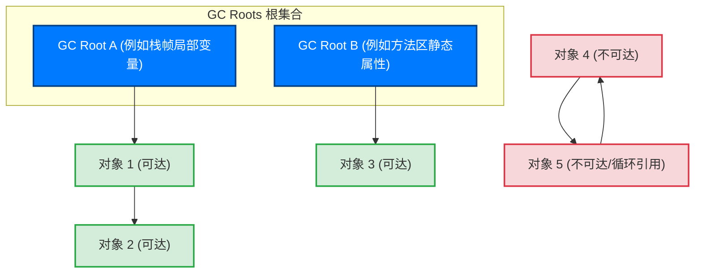
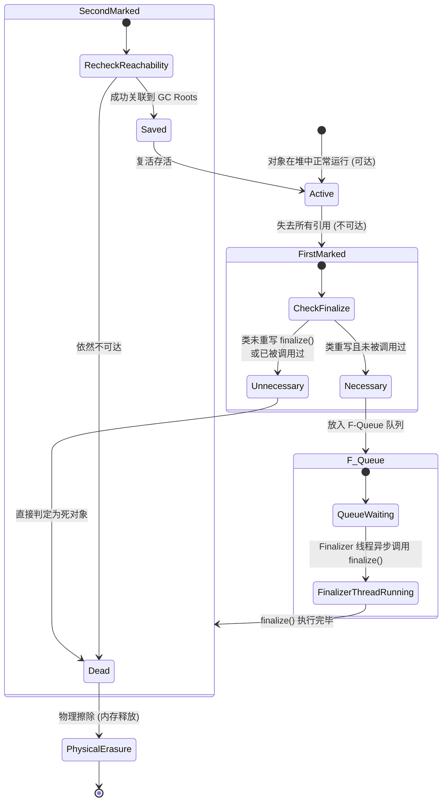

# 2.1.4.1 对象存活判断

在自动内存管理（Automatic Memory Management）的体系中，垃圾回收（Garbage Collection, GC）的核心职责是安全、高效地回收堆内存中不再被程序使用的物理空间。而进行垃圾回收的首要前提，就是**准确地判定对象的存活状态**。

如果存活判定出现“漏报”（将本该存活的对象判定为死亡），将会导致运行时的悬挂指针（Dangling Pointer）访问，直接引发虚拟机崩溃、数据损坏等灾难性后果；如果出现“误报”（将本该死亡的对象判定为存活），则会导致内存泄漏（Memory Leak），随着程序运行时间的推移，内存终将耗尽，导致系统抛出 `OutOfMemoryError`。

本篇文章将从理论模型、物理机制、JVM 规范以及 HotSpot 虚拟机的底层硬件级实现等维度，深度剖析 Java 虚拟机如何进行对象存活判定。

---

## 1. 引用计数算法（Reference Counting）深度解密

引用计数算法是自动内存管理历史上最先被提出的算法之一。其核心思想非常直观：通过在对象内部维护一个计数器来直接跟踪指向该对象的引用数量。

### 1.1 工作机制与物理模型

#### 1.1.1 计数器分配与基本数学模型
设 JVM 堆内存中的活动对象集合为 $O = \{o_1, o_2, ..., o_n\}$。在引用计数算法下，每个对象 $o_i$ 的内存布局中，其对象头（Object Header）或紧邻的元数据区会被分配一个整型的引用计数器域，记为 $RC(o_i)$。

1. **对象创建**：当一个新对象 $o_i$ 被实例化并被赋值给某个引用变量时，其引用计数器初始化为 1：
   $$RC(o_i) \leftarrow 1$$
2. **引用复制**：当有新的指针指向该对象时（例如执行赋值操作 `target = source`），该对象的计数器加 1：
   $$RC(o_i) \leftarrow RC(o_i) + 1$$
3. **引用失效**：当指向该对象的某个引用被销毁、重新赋值指向其他对象，或者超出局部变量作用域时，该对象的计数器减 1：
   $$RC(o_i) \leftarrow RC(o_i) - 1$$
4. **垃圾回收判定**：在任何时刻，当且仅当 $RC(o_i) = 0$ 时，表明该对象已无任何引用。该对象会被判定为垃圾，并立即被物理回收，其占用的内存空间被重新放回空闲列表（Free List）中。

#### 1.1.2 指针赋值时的屏障与计数更新
在虚拟机层面，修改一个引用的指针并不是简单的内存写入，它必须伴随着对引用计数的修改。这通常需要编译器在进行指针赋值操作时，在赋值指令周围插入特定的更新屏障（Write Barrier）。

以下是用 C++ 伪代码模拟的引用计数更新过程：

```cpp
/**
 * 模拟 JVM 内部进行引用的赋值操作：*field = newRef
 * @param field 目标引用字段的内存地址（二级指针）
 * @param newRef 新指向的对象指针
 */
void updateReference(Object** field, Object* newRef) {
    // 1. 新指向的对象计数器加 1（防范自赋值情况，必须先加后减）
    if (newRef != nullptr) {
        newRef->reference_count++; 
    }
    
    // 2. 暂存旧指向的对象指针
    Object* oldRef = *field;
    
    // 3. 旧指向的对象计数器减 1
    if (oldRef != nullptr) {
        oldRef->reference_count--;
        // 如果计数器归零，说明该对象已无任何引用，立即递归回收
        if (oldRef->reference_count == 0) {
            reclaimMemory(oldRef);
        }
    }
    
    // 4. 执行真正的指针写入
    *field = newRef;
}

void reclaimMemory(Object* obj) {
    // 递归减少该对象持有的所有子引用的计数器
    for (Object* child : obj->referenced_fields) {
        if (child != nullptr) {
            child->reference_count--;
            if (child->reference_count == 0) {
                reclaimMemory(child);
            }
        }
    }
    // 释放当前对象的物理内存
    free(obj);
}
```

#### 1.1.3 引用计数算法的优势
1. **实时性高（Immediate Reclamation）**：一旦对象的引用计数归零，其内存会被立即释放，不需要等待特定的垃圾回收期触发。这种增量式、即时回收的特性使得内存水位非常平稳。
2. **暂停时间低（Low Latency）**：垃圾回收的开销被分摊到了每次指针赋值的日常运行期，不需要在某个时刻停顿整个应用程序（Stop-The-World）来专门扫描大片堆内存。

---

### 1.2 循环引用（Circular Reference）死锁与回收死角

尽管引用计数法逻辑清晰，但它存在一个致命的学术缺陷与物理回收死角——**无法识别循环引用（Circular Reference）**。这也是 HotSpot 等主流商用 Java 虚拟机从未采用引用计数法作为基础存活判定算法的最根本原因。

#### 1.2.1 循环引用的物理拓扑
当两个或多个对象之间相互引用，形成一个闭环，且该闭环中所有的对象与堆外（如栈帧局部变量表、全局静态变量等）已经没有任何引用关系时，就会发生循环引用。

以下 Java 代码展示了该场景：

```java
public class Node {
    public Node next;
    // 分配 10MB 的物理内存，便于在堆中观察泄漏
    private byte[] memoryBlock = new byte[1024 * 1024 * 10]; 

    public static void testCircularReference() {
        // 步骤 1：创建两个局部变量，分别指向堆中的 Node 实例
        Node nodeA = new Node(); // 此时 Node A 计数器 = 1
        Node nodeB = new Node(); // 此时 Node B 计数器 = 1

        // 步骤 2：使 Node A 与 Node B 相互引用，形成环状拓扑
        nodeA.next = nodeB;      // Node B 被 nodeB 和 nodeA.next 引用，计数器 = 2
        nodeB.next = nodeA;      // Node A 被 nodeA 和 nodeB.next 引用，计数器 = 2

        // 步骤 3：切断外部局部变量的引用
        nodeA = null;            // Node A 计数器减 1，当前值 = 1
        nodeB = null;            // Node B 计数器减 1，当前值 = 1

        // 此时，Node A 和 Node B 还能被垃圾回收吗？
        // 如果使用引用计数算法，答案是：永远无法回收！
    }
}
```

#### 1.2.2 循环引用状态迁移图
我们可以通过 Mermaid 关系拓扑图直观地展示上述三个步骤中，引用关系及计数器的物理变迁：

```mermaid
graph TD
    subgraph 状态一: 外部引用有效
        StackFrame1["虚拟机栈 (局部变量表)"] -->|nodeA| ObjectA["Node A 实例<br/>(RC = 2)"]
        StackFrame1 -->|nodeB| ObjectB["Node B 实例<br/>(RC = 2)"]
        ObjectA -->|next| ObjectB
        ObjectB -->|next| ObjectA
    end

    subgraph 状态二: 切断外部引用 (孤岛效应)
        StackFrame2["虚拟机栈 (局部变量表)"] -.->|null| ObjectA_Isolated["Node A 实例<br/>(RC = 1)"]
        StackFrame2 -.->|null| ObjectB_Isolated["Node B 实例<br/>(RC = 1)"]
        ObjectA_Isolated -->|next| ObjectB_Isolated
        ObjectB_Isolated -->|next| ObjectA_Isolated
    end

    style ObjectA fill:#d4edda,stroke:#28a745,stroke-width:2px
    style ObjectB fill:#d4edda,stroke:#28a745,stroke-width:2px
    style ObjectA_Isolated fill:#f8d7da,stroke:#dc3545,stroke-width:2px
    style ObjectB_Isolated fill:#f8d7da,stroke:#dc3545,stroke-width:2px
```

在**状态二**中，`Node A` 和 `Node B` 组成了一个孤立的“强连通分量”。它们与虚拟机栈、方法区等外部“活”根节点已经没有任何通路，程序代码再也无法访问它们。然而，由于它们相互之间还存在引用，其引用计数器 $RC$ 永远维持在 `1`。

在引用计数法的视角里，这两个对象依旧是“存活”的，因此它们将永久驻留在堆内存中，造成无可挽回的内存泄漏。

---

### 1.3 现代垃圾回收器对引用计数法的改良尝试

为了克服循环引用的缺陷，学术界和部分小众虚拟机曾尝试引入改良机制：

1. **弱引用（Weak Reference）的引入**：要求开发者手动或者由编译器自动将某些环状引用的边标记为“弱边”（Weak Reference），弱引用不增加计数器的值。但这增加了编程的心智负担，且容易因配置错误导致对象被提前回收。
2. **环检测算法（Cycle Detection, 如 Bacon-Rajan 算法）**：
   * 该算法通过引入“三色标记”的变体进行主动环检测。
   * 当对象的计数器递减但不为零时，算法会怀疑其处于一个环中，将其标记为“紫色”并放入怀疑队列。
   * 随后，算法会顺着该对象的引用链进行一次**试探性扣减（Trial Deletion）**，即对其所有子节点的引用计数做模拟减 1 操作。
   * 扣减完毕后，重新扫描这些节点，如果发现某个对象的模拟计数器降为 0，说明该对象完全被这个孤岛内部的引用所维系。
   * 重新遍历，将引用计数不为 0 的节点复原（恢复计数），将真正为 0 的节点彻底标记为垃圾并予以回收。
   * 这种算法的代价极其高昂，它需要对对象图进行多轮深度遍历，计算复杂度高，且需要短暂暂停程序，直接摧毁了引用计数法低延迟的核心优势。

鉴于上述局限性，现代高性能 Java 虚拟机（如 Oracle HotSpot、OpenJDK 社区的各类垃圾回收器）统一采用**可达性分析算法**。

---

## 2. 可达性分析算法（Reachability Analysis）物理机制

可达性分析算法是现代垃圾回收器的基石。它不仅完美避开了循环引用无法回收的问题，而且非常契合面向对象语言的对象图物理结构。

### 2.1 算法核心思想：有向图可达性

可达性分析算法的物理模型基于图论（Graph Theory）。

在 JVM 运行期，堆中所有的对象以及对象之间的引用关系构成了一个巨大的有向图 $G = (V, E)$，其中：
* **顶点集合 $V$（Vertex）**：代表堆中当前分配的所有对象实例。
* **有向边集合 $E$（Edge）**：代表对象之间的引用关系。如果对象 `A` 的成员变量指向了对象 `B`，则存在一条有向边 $e = \langle A, B \rangle$。
* **根集合 $R$（GC Roots）**：是一组在垃圾回收时被判定为绝对存活的起点对象集合。

#### 2.1.1 判定逻辑
垃圾回收器从根集合 $R$ 中的每个节点出发，沿着有向边向下进行深度优先（DFS）或广度优先（BFS）遍历。遍历过程中走过的路径被称为**引用链（Reference Chain）**。

* **可达（Reachable）**：如果存在一条路径使得对象 $o_i$ 能够与根集合 $R$ 中的任意一个节点相通，则判定该对象是存活的，绝对不能回收。
* **不可达（Unreachable）**：若从根集合 $R$ 中的任意节点出发，都无法通过有向边到达对象 $o_j$，则在图论上 $o_j$ 属于不可达节点。即使 $o_j$ 参与了环状的循环引用，它也会被判定为已死亡，将被垃圾回收器回收。



在上面的有向图中，尽管`对象 4` 和`对象 5` 之间存在双向的引用边，幕后没有任何一条路径能把它们与 `GC Root A` 或 `GC Root B` 联系起来，所以它们在可达性分析阶段会被判定为不可达，面临回收。

---

### 2.2 7 大类 GC Roots 判定规范

在 Java 虚拟机规范中，并不是堆中的任意对象都可以作为 GC Roots。为了保证系统的正确性，作为 GC Roots 的对象必须是那些**生命周期与当前执行环境紧密绑定、或是全局性的、在逻辑上绝对不应该被回收的活动指针**。

具体而言，JVM 内部定义了以下 7 大类 GC Roots 判定规范：

#### ① 虚拟机栈（栈帧中的本地变量表）中引用的对象
每个活动 Java 线程在运行时都会分配一个私有的虚拟机栈（JVM Stack）。每当线程调用一个方法时，就会为该方法创建并压入一个栈帧（Stack Frame）。
* 栈帧内的**局部变量表（Local Variable Table）**中存放着该方法运行期所需的各类基本数据类型和对象引用（`reference` 类型）。
* 只要当前方法尚未执行完毕（即栈帧依然驻留在栈中），局部变量表内所有的 `reference` 指针所指向的堆内对象，就是 GC Roots。这包括了方法参数、方法内部创建的临时变量等。

#### ② 方法区中类静态属性引用的对象
静态属性（使用 `static` 修饰的成员变量）是类级别的，而非实例级别的。
* 当一个类被 ClassLoader 加载到虚拟机中时，该类的静态属性在准备（Prepare）和初始化（Initialization）阶段会被分配在方法区（Method Area）中（注意：在 JDK 8 之后，静态变量的物理实例移到了堆中的 Class 对象末尾，但其逻辑引用依然作为全局属性存放在方法区/元空间中）。
* 只要该类未被卸载（Unloaded），该类的静态属性所指向的堆中对象，就是 GC Roots。

#### ③ 方法区中常量引用的对象
常量（使用 `final static` 修饰的变量）一旦初始化便不可更改，代表了系统运行期间的某种全局基准或字面量。
* 例如：在运行时常量池（Runtime Constant Pool）中解析出的直接引用，或是字符串常量池（String Table）中维护的 `String` 对象实例。
* 它们生命周期极长，引用的堆对象必须作为 GC Roots 存在，防止常量池解析链断裂。

#### ④ 本地方法栈中 JNI（Java Native Interface）引用的对象
当 Java 程序通过 JNI 机制调用本地 C/C++ 代码时，底层的本地方法栈（Native Method Stack）会与 Java 运行时进行交互。
* JNI 会创建两类引用：全局引用（Global Reference）和局部引用（Local Reference）。
* 存放在 JNI 局部引用表（Local Ref Table）和全局引用表（Global Ref Table）中的指针所指向的 Java 堆内对象，在本地代码释放它们（如调用 `DeleteLocalRef`）之前，都是 GC Roots。

#### ⑤ Java 虚拟机内部的引用
JVM 自身运行所必需的常驻对象。
* **类加载器（ClassLoader）**：包括启动类加载器（Bootstrap ClassLoader）、平台类加载器（Platform ClassLoader）和系统类加载器（System ClassLoader）的实例。
* **系统 Class 对象**：如 `java.lang.Object`、`java.lang.String`、`java.lang.Class` 等核心类的 Class 镜像。
* **常驻异常实例**：为了防止在内存耗尽（OOM）或系统严重出错时因为无法分配内存而导致异常信息丢失，JVM 在启动时会预先在堆中分配好常用的异常对象，如 `OutOfMemoryError`、`NullPointerException` 的全局共享实例。

#### ⑥ 所有被同步锁（synchronized 关键字）持有的对象
在 Java 中，任何对象都可以作为锁。每个对象在物理上都关联着一个 ObjectMonitor（监视器锁对象）。
* 当某个线程正在执行同步代码块，并持有了该对象的锁时；或者当其他线程因为竞争该锁而处于该对象的锁池（Entry Set）或等待队列（Wait Set）中时。
* 该对象必须作为 GC Roots。否则，一旦锁对象被回收，JVM 内部的线程同步控制机制和线程调度状态将彻底崩溃。

#### ⑦ 反映 JVM 内部情况的特定回调与缓存
* **JVMTI（JVM Tool Interface）**：在进行性能监控、热插拔调试时，JVMTI 注册的各类事件监听器、回调钩子所持有的 Java 对象。
* **JMXBean**：Java 管理扩展中注册的各类 MBean 实例。
* **Code Cache（代码缓存）**：JIT 编译器编译生成的本地机器码（Native Code）中，直接硬编码嵌入的 Java 对象引用。

---

### 2.3 临时/跨代引用下的临时 GC Roots 扩充

在现代分代收集（Generational Collection）或者分区收集（Region-based Collection）的垃圾回收器中，为了提高回收吞吐量，虚拟机通常会进行**局部收集（Partial GC，如年轻代回收 Minor GC）**。

#### 2.3.1 跨代引用难题
设想以下场景：在年轻代回收（Minor GC）时，我们的回收目标仅仅是年轻代（Young Generation）的内存空间。

如果年轻代中的对象 $Y$ 没有被任何虚拟机栈、方法区等“全局 GC Roots”直接引用，但它被老年代（Old Generation）中的一个存活对象 $O$ 的成员变量所引用。这一引用关系被称为**跨代引用（Inter-generational Reference）**。

```mermaid
graph LR
    subgraph 老年代 (不参与本次 Minor GC)
        ObjectO["对象 O (存活)"]
    end
    subgraph 年轻代 (本次 Minor GC 的回收靶区)
        ObjectY["对象 Y (被 O 引用)"]
    end

    ObjectO -->|跨代引用| ObjectY
```

在 Minor GC 扫描时，如果我们只扫描全局 GC Roots，由于老年代不参与回收，我们不会去扫描老年代中的对象。这会导致对象 $Y$ 无法被识别为可达，进而被错误回收。

#### 2.3.2 解决方案：记忆集与卡表（Card Table）
为了解决这一问题，同时避免“为了 Minor GC 而全盘线性扫描老年代”的巨大硬件开销，JVM 引入了**记忆集（Remembered Set）**。

在 HotSpot 虚拟机中，记忆集通过**卡表（Card Table）**实现。
* **卡表物理结构**：卡表是一个字节数组 `Byte[]`，数组的每一个元素（一个字节）对应着老年代中一块固定大小的内存区域，这块区域被称为**卡页（Card Page）**，通常为 512 字节。
* **写屏障（Write Barrier）**：当老年代对象的引用字段发生写操作（即指向了一个年轻代对象）时，JIT 编译期会在指针赋值指令后插入一段写屏障指令，将该老年代对象所在的卡页在卡表中对应的字节元素标记为“脏页”（Dirty，数值通常设为 0）。
* **临时 GC Roots 扩充**：当 Minor GC 触发时，垃圾回收器不需要扫描整个老年代，而只需要扫描卡表中被标记为 `Dirty` 的卡页。把这些卡页中包含的老年代对象所引用的年轻代对象，**临时加入到本次 Minor GC 的 GC Roots 根集合中**。

这种通过卡表进行局部状态维护的技术，将扫描跨代引用的硬件开销从“全堆扫描”降低到了“卡表扫描 + 局部卡页扫描”，极大地缩短了 Minor GC 的停顿时间。

---

## 3. HotSpot 快速枚举 GC Roots 的底层物理实现

虽然现代垃圾回收器（如 G1, ZGC 等）实现了并发标记（Concurrent Marking），即在 Java 线程运行的同时进行对象图的遍历，但是**根节点枚举（Root Scanning）阶段依然需要在一致性快照下进行，并伴随着短暂的 Stop-The-World（STW）**。

如何使这一阶段的停顿时间尽可能短，与堆内存大小解耦，是 HotSpot 虚拟机底层的核心设计考量。

### 3.1 物理挑战：STW 与一致性快照的必要性

在根节点枚举时，JVM 必须暂停所有的 Java 执行线程。这是因为可达性分析必须基于一个能保证**一致性快照（Consistent Snapshot）**的内存视图。

“一致性”意味着在整个根节点枚举期间，整个系统的内存关系就像是被冻结在了某一个特定的物理时间点上。
如果在标记根节点的过程中，Java 线程仍在继续运行并修改对象之间的引用关系，就会导致标记出的根节点集合与实际运行状态发生偏差。这种偏差会导致严重的垃圾回收安全事故。

---

### 3.2 硬件与执行效率动因

在硬件层面上，当 STW 发生后，垃圾回收器面临的挑战是：**如何从庞大的物理内存、密集的线程调用栈和众多的寄存器中，瞬间把所有的引用指针找出来？**

1. **内存与栈深度的线性开销**：在大型企业级应用中，活动线程可能达到数千个，调用栈帧深度累计可达数万级。如果垃圾回收器不得不对每一个线程栈进行从栈底到栈顶的线性扫描，并对每一个物理内存单元进行检查，其耗时将达到数十毫秒甚至秒级。
2. **引用的物理模糊性（Pointer Ambiguity）**：
   在 CPU 寄存器和栈帧的物理内存中，所有存储的数据在最底层都是一串无差别的 `0` 和 `1` 二进制序列。
   一个 64 位的值 `0x7f83bc1a2080`，从二进制硬件视角来看，它既可以表示一个大的长整型数值（`long`），也可以表示一个双精度浮点数（`double`），还可以表示一个指向堆内存的绝对物理地址。
   * 早期的**保守式 GC（Conservative GC）**由于无法区分这三者，只能采取“宁可放过，绝不杀错”的保守策略：只要这个数值落在堆内存的物理边界内，且满足对齐要求，就一律把它当成引用来对待。
   * 这不仅导致了高昂的硬件判断开销，还会造成“假引用”——某些原本应当被回收的庞大对象因为栈中残留的一个普通整数恰好等同于它的物理地址，而被误判为存活，引发隐蔽的内存泄漏。

因此，现代高性能 JVM 必须采用**准确式 GC（Exact GC）**。即虚拟机在垃圾回收时，必须能够准确地知道栈和寄存器的哪个具体位置存放的是真正的对象指针（OOP, Ordinary Object Pointer）。

---

### 3.3 HotSpot 解决方案：OopMap 的物理架构

为了实现准确式 GC 并消除扫描栈的硬件开销，HotSpot 虚拟机引入了 **OopMap（Ordinary Object Pointer Map）**。

#### 3.3.1 OopMap 的物理架构与生成机制
OopMap 是一个在编译器和解释器层面共同维护的数据结构。它的本质是一个**映射表**，记录了在程序执行到某条指令时，栈帧中的哪些偏移量（Offset）以及哪些寄存器（Register）中存放着对象引用。

* **类加载期**：当一个 Java 类被类加载器（ClassLoader）解析时，JVM 会计算出该类的实例在堆中分配时，哪些偏移量上是引用类型。这些类元数据信息会被记录在类对象的局部布局表中。
* **即时编译期（JIT Compilation）**：当 JIT 编译器（如 C1、C2 编译器）将字节码编译为本地机器指令时，它会在特定的指令位置（即下文要讲的安全点 Safepoint）插入 OopMap 记录。
* **执行期**：当垃圾回收器触发根节点枚举时，它不再去线性扫描物理栈空间，而是直接根据当前线程执行到的机器指令偏移量（Instruction Pointer, PC），去查找与之关联的 OopMap。

#### 3.3.2 栈帧与 OopMap 的物理映射图解
我们可以通过以下图表展示栈帧物理空间与 OopMap 记录的映射关系：

```
栈帧物理空间 (Stack Frame)                     JIT 编译生成的 OopMap 映射表
+-----------------------------+               +--------------------------------------+
| 偏移量 [SP + 24]: 整数 100   |               | 指令偏移量 (PC) = 0x00FF4E20          |
+-----------------------------+               |                                      |
| 偏移量 [SP + 16]: 对象指针A  | <=========== | - 栈偏移量 [SP + 16] 是一个 OOP      |
+-----------------------------+               | - 栈偏移量 [SP + 0]  是一个 OOP      |
| 偏移量 [SP + 8] : 浮点数 3.1 |               | - 寄存器 rbx        是一个 OOP      |
+-----------------------------+               +--------------------------------------+
| 偏移量 [SP + 0] : 对象指针B  | <===========
+-----------------------------+
| 寄存器 rbx     : 对象指针C  | <===========
+-----------------------------+
```

当 GC 触发且当前线程暂停在机器指令地址 `0x00FF4E20` 时，垃圾回收器直接查询对应的 OopMap，得知 `[SP + 16]`、`[SP + 0]` 和寄存器 `rbx` 存放的是引用。收集器直接将这三个位置的值取出，作为 GC Roots。

整个过程不需要任何逐字节的物理扫描，其枚举耗时与堆大小完全无关，可在微秒级内极速完成。

---

### 3.4 安全点（Safepoint）与安全区域（Safe Region）

既然 OopMap 能够极大提升 GC Roots 枚举效率，为什么我们不在每一条指令后面都生成一份 OopMap 呢？

答案是：**空间成本高昂**。
如果为每一条机器指令都生成 OopMap，OopMap 占用的额外内存空间甚至会大幅超过编译出的本地机器码本身的体积。这会导致严重的空间膨胀（Space Inflation）。

因此，HotSpot 采取了一种折中方案：只在被称为**安全点（Safepoint）**的特定指令位置生成 OopMap 并允许 GC 停顿。

#### 3.4.1 Safepoint 的选址规范
Safepoint 的选址必须精心设计，既要保证 OopMap 的数量不至于过多，又要保证线程在运行过程中能够快速地到达安全点，避免垃圾回收器在发起回收请求后等待时间过长。

根据 JVM 规范，Safepoint 主要选在以下具有“长时间执行特征”的指令位置：
1. **方法调用（Call Instruction）之后**。
2. **方法临返回（Return Instruction）之前**。
3. **循环的末尾（Loop Back Branch）**：防止大循环体内长时间运行导致线程无法响应 GC 暂停请求。
4. **可能抛出异常的指令位置**。

#### 3.4.2 主动式轮询（Active Polling）机制的硬件实现
当 GC 发起时，如何让所有运行中的 Java 线程都走到最近的 Safepoint 并暂停下来？

HotSpot 采用的是**主动式轮询（Active Polling）**机制。它不采用操作系统级的强制中断信号，而是在每个 Safepoint 的编译汇编代码中，插入一条轮询指令。

为了将这一轮询的 CPU 硬件开销降到最低，HotSpot 巧妙地利用了操作系统的内存保护页（Polling Page）和硬件异常陷阱（Hardware Trap）。

汇编级别的底层机制如下：
1. **正常运行状态**：JVM 维护一个特殊的虚拟内存页，称为 **Polling Page**，该内存页的属性为**可读**。
2. **Safepoint 轮询指令**：在 Safepoint 处，JIT 会生成一条读取该 Polling Page 的汇编指令，例如：
   ```assembly
   test %eax, 0x160(%r12)  ; 其中 0x160(%r12) 指向 Polling Page 的虚拟内存地址
   ```
   在正常状态下，这只是一次平淡无奇的内存读取，CPU 可以在单个时钟周期内完成，几乎零开销。
3. **触发 GC 阶段**：JVM 改变 Polling Page 的内存属性，将其设为**不可读写（NO_ACCESS）**。
4. **触发段错误硬件中断**：当 Java 线程执行到 Safepoint 的 `test` 指令时，试图读取 Polling Page，由于其属性已变为不可读写，CPU 硬件会立即抛出一个**页面失效/内存访问越界中断（段错误，SIGSEGV 信号）**。
5. **信号捕获与挂起**：JVM 在启动时就向操作系统注册了 SIGSEGV 的信号处理函数。当捕获到该信号后，JVM 内部的信号处理器会识别出当前线程是在 Safepoint 处被中断的，进而将该线程挂起，使其进入等待状态。

这种通过硬件异常替代软件分支判断的设计，是 HotSpot 虚拟机极致榨取硬件性能的经典范例。

#### 3.4.3 安全区域（Safe Region）的设计与进出判定
主动式轮询机制要求线程必须处于“运行（Running）”状态才能主动走到 Safepoint。

如果某个线程当前处于 `Blocked`、`Sleep` 或 `Waiting` 状态（例如正在等待网络 I/O、执行 native 方法、或是被 `Thread.sleep(1000)` 挂起），它根本无法在防不胜防的 Safepoint 处主动响应 GC。

为了解决这一死锁局面，JVM 引入了**安全区域（Safe Region）**的概念。

> **安全区域（Safe Region）**是指在一段代码片段中，对象的引用关系绝对不会发生改变。在这个区域内的任意位置开始垃圾回收都是安全的。

* **进入 Safe Region 判定**：
  当 Java 线程在准备调用 native 方法、进入 Blocked 状态或调用 Sleep 方法前，它会先修改自己的状态标识，声明自己已经进入了 Safe Region。
  在此期间，如果 JVM 发起 GC，垃圾回收器将完全忽略这些处于 Safe Region 中的线程，直接进行根节点枚举和回收。
* **离开 Safe Region 判定**：
  当线程被系统唤醒、或是 native 方法执行完毕准备离开 Safe Region 时，它必须检查当前 JVM 是否已经完成了根节点枚举（或完成了需要整个系统处于 STW 状态的所有 GC 步骤）。
  * 如果已经完成，线程可以直接擦除 Safe Region 标识，继续正常执行。
  * 如果 GC 仍在 STW 阶段，该线程必须在 Safe Region 的边界处主动挂起，等待垃圾回收器发出可以通行的安全信号（Safe Signal）后，才能恢复执行。

---

## 4. 对象宣告死亡的两次标记物理机制与 F-Queue 优先级队列

在可达性分析算法中，即使一个对象被判定为到 GC Roots 不可达，它也不会被垃圾回收器立即物理清除。对象宣告死亡需要经过一个“双重标记”的物理过滤流程。

### 4.1 第一次标记与筛选条件

当垃圾回收器在可达性分析中发现对象 $o$ 到 GC Roots 没有引用链相连时，会对该对象进行**第一次标记**。

随后，JVM 会对该不可达对象进行一次**筛选**，判定其是否有必要执行 `finalize()` 方法：

* **判定为“无必要执行”**：
  1. 对象的类没有覆盖（Override）`finalize()` 方法。
  2. 对象的 `finalize()` 方法此前已经被虚拟机调用过。
  如果满足上述两点之一，JVM 判定其为无必要执行。该对象在第一次标记后即被直接宣判死亡，等待垃圾回收器在随后的物理清理阶段直接回收其堆空间。
* **判定为“有必要执行”**：
  如果对象覆盖了 `finalize()` 方法，且尚未被 JVM 调用过，那么该对象会被判定为“有必要执行”。它将获得一次“缓刑”的机会，并被移入 JVM 自动创建的 **F-Queue 优先级队列**中。

---

### 4.2 缓冲地带：F-Queue 队列与 Finalizer 线程

**F-Queue** 并不是一个普通的 JVM 内部数据结构，它是 JVM 进程中为了实现析构缓冲而建立的引用队列（其实体对应着 `java.lang.ref.Finalizer.queue`）。

#### 4.2.1 Finalizer 守护线程
JVM 内部会启动一条名为 `Finalizer` 的守护线程（Daemon Thread，通常具有极低的线程优先级）。该线程在后台无限循环，监视 `F-Queue` 队列。

当队列中有不可达对象入队时，`Finalizer` 线程会依次取出对象，并触发调用其覆盖的 `finalize()` 方法。

#### 4.2.2 虚拟机的防御性设计
**为什么 `Finalizer` 线程必须设计为低优先级且异步执行？**

这是 JVM 的自我保护和防御性设计。`Finalizer` 线程只负责触发调用对象的 `finalize()` 方法，但**绝对不会承诺或等待该方法执行结束**。

如果一个不可达对象在 `finalize()` 方法中写入了极其糟糕的代码，例如：
* 发生死循环（`while(true) {}`）。
* 执行了超时的阻塞式网络请求。
* 发生了线程死锁。

如果 JVM 同步等待 `finalize()` 执行完毕，那么 `Finalizer` 线程将被永久阻塞。这会导致 `F-Queue` 队列中积压的成千上万个垃圾对象无法被消费，这些对象由于还在队列中，依然被 `FinalReference` 强引用着，无法被垃圾回收器回收。最终会导致整个系统的垃圾回收链条断裂，瞬间引发 `OutOfMemoryError`。

因此，`Finalizer` 线程以极低的优先级运行，且完全不承诺同步等待，就是为了防止这些“垂死”对象反向拖垮整个虚拟机进程。

---

### 4.3 第二次标记：生死宣判与自我拯救

在 `Finalizer` 线程触发了对象的 `finalize()` 方法后，该对象将迎来命运的审判——**第二次标记**。

第二次标记发生在 `F-Queue` 队列中的对象被消费完毕、且下一次 GC 触发或标记阶段的收尾工作进行时。垃圾回收器会重新计算 `F-Queue` 中对象的可达性：

1. **自我拯救成功**：如果对象在它的 `finalize()` 方法中，重新与引用链上的任何一个活动对象建立了关联。例如：
   ```java
   public class SaveSelf {
       public static SaveSelf HOOK = null;

       @Override
       protected void finalize() throws Throwable {
           super.finalize();
           System.out.println("finalize() 被调用，正在实施自救...");
           // 建立关联，拯救自己
           SaveSelf.HOOK = this; 
       }
   }
   ```
   在第二次标记时，垃圾回收器会发现该对象重新变得可达。此时，它会被移出“即将回收”的集合，重新恢复存活状态。
2. **宣告死亡**：如果对象在 `finalize()` 中没有进行引用重建（大多数情况），或者它已经被执行过一次 `finalize()`（不再有自救机会），在第二次标记时它依然处于不可达状态，那么它将彻底宣告死亡，并在物理上被清除。

#### 4.3.2 两次标记与状态迁移状态机
我们可以使用以下 Mermaid 状态机图详细描绘一个覆盖了 `finalize()` 方法的对象从“不可达”到“物理擦除”或“自救复活”的完整状态变迁过程：



---

## 5. finalize() 自我拯救的底层虚拟机设计与生产灾难分析

在 Java 发展的历史长河中，`finalize()` 方法曾被误认为是类似于 C++ 析构函数（Destructor）的存在。然而，其底层的复杂设计以及带来的诸多不确定性，使其成为了 Java 历史上最失败的设计之一。

### 5.1 底层机制分析：Finalizer 与 FinalReference 的物理联系

JVM 是如何识别并管理那些需要执行 `finalize()` 的对象的？这依赖于 HotSpot 内部的 `FinalReference` 机制。

#### 5.1.1 隐式注册的物理流程
1. **类结构检查**：当 JVM 加载一个 Class 文件时，它会检查该类是否覆盖了 `finalize()` 方法。如果是（且非空实现），该类的元数据中会被打上一个特殊的标记 `has_finalizer`。
2. **实例分配与 Finalizer 创建**：当通过 `new` 字节码指令在堆中成功分配一个该类的实例 $O$ 后，虚拟机在退出分配器前，会隐式调用 `java.lang.ref.Finalizer.register(O)`。
3. **双向链表维护**：
   * `Finalizer` 类继承自 `FinalReference`（它是一种特殊的 Reference 类型）。
   * `Finalizer.register(O)` 会创建一个 `Finalizer` 实例包装对象 $O$。
   * 该 `Finalizer` 实例会被加入到一个由 `Finalizer` 维护的**全局双向链表**中。这个链表的头部由 `unfinalized` 静态变量持有。

由于 `unfinalized` 双向链表是一个全局可达的强引用链，这导致了所有覆盖了 `finalize()` 的活动对象在物理上多了一条强引用通路。

```
[Static java.lang.ref.Finalizer.unfinalized]
                   |
                   v
          +-----------------+        +-----------------+
          | Finalizer 实例1  | <====> | Finalizer 实例2  |
          +-----------------+        +-----------------+
                   |                          |
                   | (FinalReference)         | (FinalReference)
                   v                          v
             [堆中的用户对象A]            [堆中的用户对象B]
```

#### 5.1.2 垃圾回收时的剥离与排队
当垃圾回收器运行并判定对象 `A`（用户对象）已无外部用户引用时，它会发现对象 `A` 还被 `Finalizer 实例1` 强引用着。
垃圾回收器并不会在此时回收对象 `A`，而是：
1. 将 `Finalizer 实例1` 从全局的 `unfinalized` 双向链表中剥离。
2. 将其放入 JVM 内部的待处理引用队列（`pending` 队列）。
3. JVM 内部的 `ReferenceHandler` 线程会将该 `Finalizer` 实例分发到 `Finalizer.queue`（即 `F-Queue`）中，等待 `Finalizer` 线程进行出队并调用 `finalize()`。

---

### 5.2 执行一次性保证的物理屏障

很多开发者疑惑，为什么 `finalize()` 方法只会被系统自动调用一次？

这并非由对象的 Mark Word（对象头中的标记字段）直接控制，而是由上述的 **Finalizer 注册链表剥离机制** 决定的。
当对象第一次面临 GC 并准备执行 `finalize()` 时，它对应的 `Finalizer` 实例就已经从全局的 `unfinalized` 双向链表中被拆卸下来了。

即使该对象在 `finalize()` 中将 `this` 赋值给外部静态变量成功活了过来，它在堆中的状态也已经发生改变——**它变成了一个没有任何 `Finalizer` 关联引用的普通对象**。

当它在随后的运行中再次失去所有引用、第二次面临 GC 时，垃圾回收器扫描时不再需要做任何特殊的 `Finalizer` 处理。在第一次标记的筛选阶段，垃圾回收器直接判定该对象“没有必要执行 `finalize()`”（因为其注册信息已不存在），该对象便会被瞬间物理清除。

---

### 5.3 生产灾难分析：为什么绝对禁止在生产中使用 finalize()

在 JDK 9 中，`finalize()` 方法已被正式标记为 `@Deprecated(since="9")`，并且在现代 Java 开发规范中，绝对禁止使用该方法。其根本动因可以归结为以下 5 点：

#### ① 内存泄漏与堆积导致的内存溢出（OOM）
由于 `Finalizer` 线程是一个单线程，且其运行优先级被设为最低。
* 在高并发、高吞吐量的 Java 服务中，如果程序产生大量需要执行 `finalize()` 的短期对象，`Finalizer` 线程的处理速度（消费速度）将远远落后于垃圾对象的产生速度（生产速度）。
* 这会导致 `F-Queue` 队列无限积压，队列中每个待处理的垃圾对象依然被 `FinalReference` 强引用着，占据着大片堆内存。
* JVM 发现内存不足，会频繁触发 Full GC 来尝试回收，但这部分被队列持有的对象在 `finalize()` 执行完毕前是绝对回收不掉的。Full GC 频繁发生会导致系统彻底失去响应，最终抛出 `OutOfMemoryError` 崩溃。

#### ② 执行时机极其不确定，导致系统物理资源枯竭
根据 Java 语言规范（JLS），JVM 绝对不承诺 `finalize()` 的调用时机。如果系统内存非常富余，甚至可能在整个 JVM 进程运行期间都不会触发 GC，也就意味着 `finalize()` 永远不会被执行。
* 如果开发者试图在 `finalize()` 中去释放诸如**文件描述符（FD）**、**套接字连接（Socket）**或是**数据库连接池中的 Connection**，将会产生灾难性的后果。
* 系统底层的物理句柄将因为得不到释放而迅速耗尽，直接导致系统抛出 `Too many open files` 异常，瘫痪所有底层的 I/O 交互。

#### ③ 显著降低垃圾回收器吞吐量，加剧 Full GC
普通的 Java 对象在年轻代回收时，一旦不可达，在其所在的 Eden/Survivor 空间发生 GC 时就会被瞬间擦除并回收，效率极高。
* 而覆盖了 `finalize()` 的对象必须经过“第一次 GC 发现其死亡 -> 放入 F-Queue -> Finalizer 线程执行 -> 第二次 GC 物理清除”这一冗长的链路。
* 它们至少需要经历两次 GC 才能被彻底回收。在此期间，它们不得不一直停留在年轻代，极易达到晋升年龄，从而被晋升到老年代。
* 这极大地污染了老年代的内存空间，加剧了老年代的碎片化，并使得 Minor GC 的效率大幅下降，频繁引发高开销的 Full GC。

#### ④ 致命的安全漏洞：Finalizer 攻击（Finalizer Attack）
这是一个经典的 Java 安全漏洞。攻击者可以利用 `finalize()` 机制，在对象初始化失败时，复活一个“未完全初始化”的畸形对象，从而绕过安全屏障。

设想以下场景：

```java
// 被保护的敏感类
public class SecureSystem {
    public SecureSystem() {
        // 进行权限校验，若校验失败，直接抛出安全异常，拒绝实例化
        if (!SecurityManager.checkAccess()) {
            throw new SecurityException("无访问权限!");
        }
    }

    public void transferMoney(int amount) {
        System.out.println("成功转账: " + amount + " 元");
    }
}
```

在正常情况下，`new SecureSystem()` 会因为抛出 `SecurityException` 而终止，调用者无法获得其实例。

然而，攻击者可以通过继承并覆盖 `finalize()` 来实施攻击：

```java
public class MaliciousAttack extends SecureSystem {
    public static SecureSystem stolenInstance = null;

    public MaliciousAttack() {
        try {
            // 调用父类构造函数，触发权限检查并被抛出异常
            super(); 
        } catch (SecurityException e) {
            // 故意捕获异常，使构造过程正常结束（但实际上对象属于半初始化状态）
            System.out.println("捕获安全异常，准备在垃圾回收时进行 Finalizer 攻击...");
        }
    }

    @Override
    protected void finalize() throws Throwable {
        // 虽然 SecureSystem 构造失败，但 JVM 已经在堆中为 MaliciousAttack 实例分配了空间
        // 且 JVM 已经为其隐式注册了 Finalizer 链表。
        // 当 GC 触发清理这个“构造失败的对象”时，会执行这里的 finalize()
        // 我们通过将自身 (this) 赋值给静态变量，成功“复活”了该敏感对象
        stolenInstance = this;
    }
}
```

当外部执行 `new MaliciousAttack()` 时，构造函数抛出了异常。但是！JVM 已经把物理内存分配给它了，且它的 `Finalizer` 实例已经挂在了全局双向链表上。

在随后的 GC 中，JVM 调用其 `finalize()` 方法，攻击者将 `this` 赋值给 `stolenInstance`。
这样，攻击者就成功获取到了一个**绕过了权限安全校验、未完全初始化但却可以通过 `stolenInstance.transferMoney()` 执行敏感操作的“半尸对象”**。

这种安全漏洞是导致 JDK 官方在后续版本中彻底废弃 `finalize()` 并推动 `Cleaner` 机制的底层动力。

#### ⑤ 现代替代方案：Try-With-Resources 与 Cleaner

在现代 Java 程序设计中，我们应当完全使用以下方案代替 `finalize()` 进行资源释放：

##### Try-With-Resources 与 AutoCloseable（首选）
对于任何需要关闭的流、连接、句柄等，让其类实现 `java.lang.AutoCloseable` 接口。

```java
public class ResourceOwner implements AutoCloseable {
    @Override
    public void close() throws Exception {
        // 确定性地释放物理资源
        System.out.println("资源已同步关闭");
    }
}
```

使用时采用 try-with-resources：

```java
try (ResourceOwner resource = new ResourceOwner()) {
    // 执行业务逻辑
} // 编译器在此处自动插入 finally 块并调用 resource.close()，执行时机 100% 确定，且零 GC 额外开销
```

##### java.lang.ref.Cleaner（JDK 9+）
对于不得不依靠 GC 来异步清理堆外资源（如 DirectByteBuffer 释放物理堆外内存）的场景，使用 `Cleaner`。

```java
import java.lang.ref.Cleaner;

public class OffHeapResource {
    private static final Cleaner cleaner = Cleaner.create();
    
    // 清理动作封装在一个不持有原对象强引用的静态内部类中，防止循环引用导致无法回收
    static class State implements Runnable {
        private final long address; // 堆外内存地址

        State(long address) {
            this.address = address;
        }

        @Override
        public void run() {
            // 执行真正的释放堆外内存的操作
            unsafe.freeMemory(address);
            System.out.println("堆外内存已安全释放");
        }
    }

    private final State state;
    private final Cleaner.Cleanable cleanable;

    public OffHeapResource(long size) {
        long address = unsafe.allocateMemory(size);
        this.state = new State(address);
        // 注册到 Cleaner，当当前对象不可达时，触发 state 的 run 方法
        this.cleanable = cleaner.register(this, state);
    }
}
```

`Cleaner` 基于虚引用（PhantomReference）和引用队列工作。清理任务在专门的后台线程中异步且平滑地执行，**且由于 State 根本不持有原对象的强引用，从物理上杜绝了对象在清理期自我拯救的可能性，同时也避免了 Finalizer 攻击。**

---

## 6. 总结与机制对比

通过对 JVM 存活判定核心机制的梳理，我们可以清晰地看到从理论模型到物理实现的发展脉络：

| 特性 / 维度 | 引用计数算法 (Reference Counting) | 可达性分析算法 (Reachability Analysis) |
| :--- | :--- | :--- |
| **判定逻辑** | 基于每个对象持有的引用计数器是否为零 | 基于根集合 (GC Roots) 的有向图通路可达性 |
| **循环引用回收** | 无法直接回收，易形成死角导致内存泄漏 | 能够完美回收任何孤立的循环引用拓扑 |
| **STW 停顿** | 无，伴随指针操作即时进行物理释放 | 需要短暂停顿进行 GC Roots 根节点枚举 (配合 OopMap) |
| **执行开销** | 每次指针赋值都需要更新计数器，高并发下 CAS 冲突严重 | 标记阶段存在 CPU 扫描开销，通过并发标记机制进行优化 |
| **JVM 落地** | 主流商用 Java 虚拟机均未采用该算法 | HotSpot 及现代主流 JVM 统一以此为基础 |

在 HotSpot 的具体物理实现中，准确式 GC 借助 **OopMap**、**安全点 (Safepoint)** 以及 **主动式轮询 (Active Polling)**，将 STW 阶段的根节点枚举时间降到了极致。而在对象宣告死亡阶段，通过 **F-Queue**、**Finalizer 线程** 与 **FinalReference** 的深度配合，保证了 Java 语义中 `finalize()` 的平滑过渡。为了避开其历史遗留的内存与安全风险，我们在现代生产开发中必须以 **Try-With-Resources** 和 **Cleaner** 代替 `finalize()`，确保构建高性能、高安全性的 JVM 应用。
