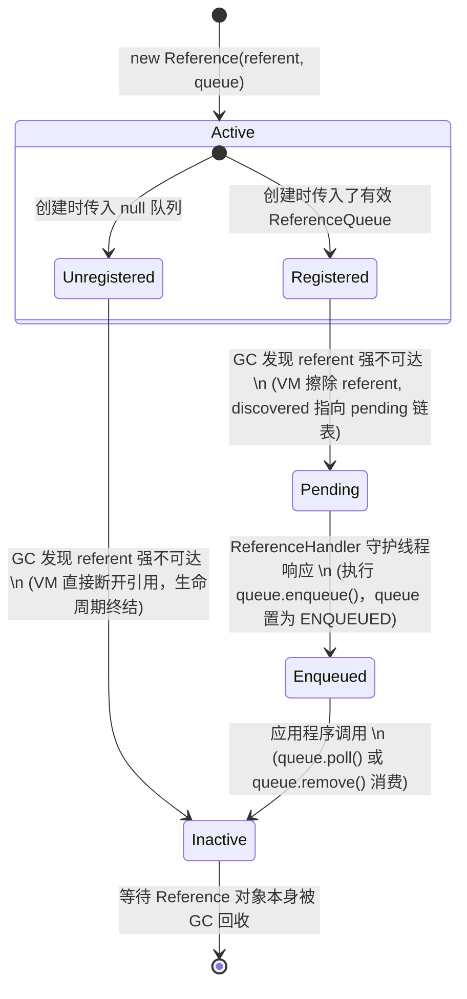
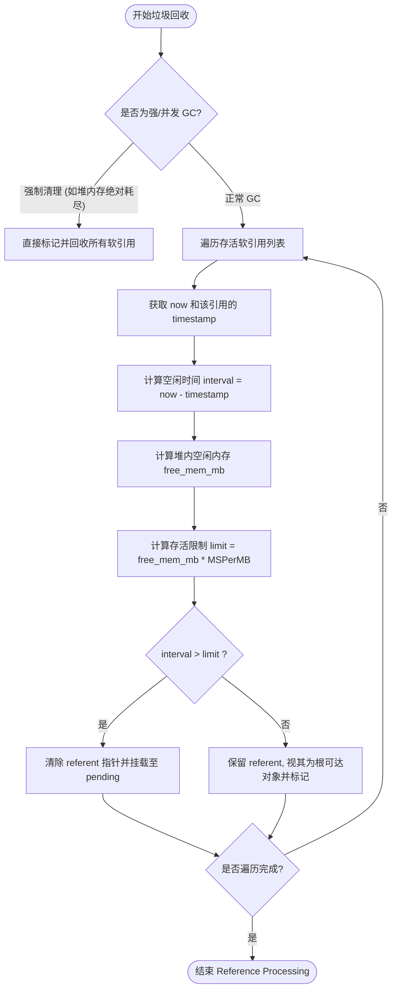
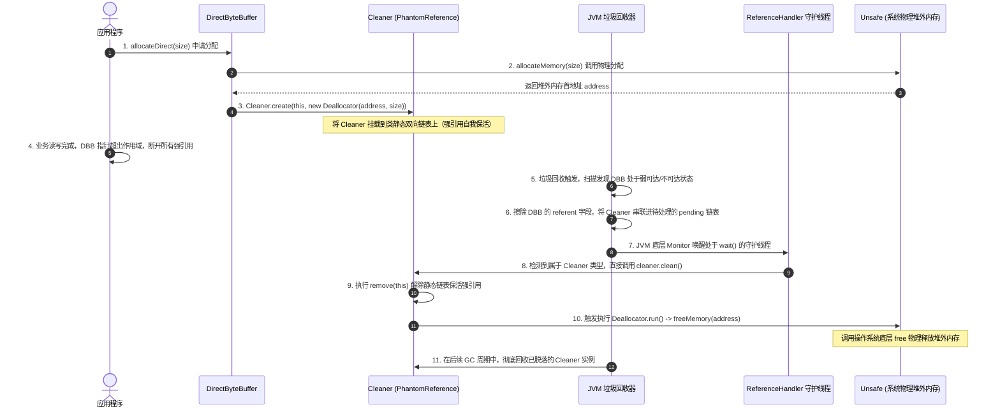

# 2.1.4.2 引用类型

在 Java 的内存管理和垃圾回收（GC）机制中，引用的设计经历了从单一到精细的演进。在 JDK 1.2 之前，引用的定义非常传统且非黑即白：若一个数据中存储的数值代表的是另一块内存的起始地址，就称这块内存被引用。这种设计无法描述“可有可无”的对象，给构建高效缓存、感知资源销毁等带来了巨大的阻碍。

为了解决这一痛点，JDK 1.2 引入了四种精细化的引用类型：**强引用（Strong Reference）**、**软引用（Soft Reference）**、**弱引用（Weak Reference）**和**虚引用（Phantom Reference）**。它们在 JVM 底层与垃圾回收器深度协同，提供了对对象生命周期不同层级的精细化控制。

本篇文档将从 JVM 底层设计、垃圾回收器（HotSpot）源码实现、状态机物理变迁、时钟算法数学公式，以及堆外内存释放和工程实践避坑等维度，深度剖析 Java 引用类型的底层机理。

---

## 1. 四大引用类型定义与底层设计机制

除了不需要显式包装的强引用外，软引用、弱引用和虚引用的核心基类均为 `java.lang.ref.Reference`。要理解引用类型的运行，必须首先理清它们在 Java 层与 JVM 底层的双重身份。

### 1.1 四大引用的核心语义与生命周期对照

| 引用类型 | 官方定义语义 | 垃圾回收（GC）回收时机 | 引用队列关联性 | 核心适用场景 |
| :--- | :--- | :--- | :--- | :--- |
| **强引用** | 最普遍的引用，如 `Object obj = new Object()`。只要强引用存在，GC 绝对不会回收被引用的对象。 | 空间不足时直接抛出 `OutOfMemoryError`，也绝不回收该对象。 | 无需关联。 | 普通业务对象、基础运行组件。 |
| **软引用** | 有用但非必须的对象。在系统即将发生内存溢出之前，垃圾回收器会把这些对象列进回收范围之中进行第二次回收。 | 内存充足时不回收；内存紧张（根据时钟算法判定超时）或即将 OOM 时进行回收。 | 可选关联。 | 内存敏感的本地缓存（例如大图缓存、文档解析缓存）。 |
| **弱引用** | 强度比软引用更弱，只生存到下一次垃圾回收发生为止。 | 只要发生垃圾回收，无论当前内存是否足够，只被弱引用关联的对象都会被回收。 | 可选关联。 | 元数据映射（WeakHashMap）、ThreadLocal 内存防漏。 |
| **虚引用** | 最弱的引用关系，完全不对对象的生命周期构成影响，也无法通过它获取对象实例（`get()` 恒返回 `null`）。 | 对象销毁时回收。唯一作用是在对象被回收时收到一个系统通知。 | **必须**关联。 | 堆外内存自动释放（Cleaner 机制）、底层物理资源安全销毁。 |

### 1.2 `Reference` 类的核心字段与 JVM 底层布局

在 `java.lang.ref.Reference` 的源码中，有几个关键的成员变量和静态变量。它们虽然定义在 Java 层，但其读写与状态流转大多是由 HotSpot 虚拟机底层的 C++ 代码直接控制的。

```java
public abstract class Reference<T> {
    // 1. 被引用对象。该字段由 JVM 垃圾回收器特殊对待并直接读写
    private T referent;         /* Treated specially by GC */

    // 2. 关联的引用队列。当 referent 被回收时，当前 Reference 对象会被加入此队列
    volatile ReferenceQueue<? super T> queue;

    // 3. 用于在 ReferenceQueue 中构建单向链表的指针（Java 层排队使用）
    @SuppressWarnings("rawtypes")
    volatile Reference next;

    // 4. JVM 底层专用的单向链表指针（仅 VM 内部可见并操作）
    // 在 GC 阶段，垃圾回收器使用 discovered 字段将所有被发现的、需要特殊处理的引用对象串联起来
    transient private Reference<T> discovered; /* used by VM */

    // 5. 与 JVM 进行协作的全局静态锁对象，用于唤醒 ReferenceHandler 守护线程
    private static class Lock { }
    private static Lock lock = new Lock();

    // 6. 等待入队的引用对象链表头指针。JVM 垃圾回收器在 GC 扫尾阶段将 discovered 链表挂载到此字段
    private static Reference<Object> pending = null;
    
    // ...
}
```

---

## 2. Reference 对象的 4 种物理状态变迁逻辑与 ReferenceQueue

在 JVM 垃圾回收器和守护线程的协同下，一个 `Reference` 对象在其生命周期中会经历四种物理状态的变迁：**Active**、**Pending**、**Enqueued** 和 **Inactive**。

### 2.1 四大物理状态的严格定义与物理字段状态值

这些状态的流转是由 JVM 内部的 `Reference Processor` 与 Java 层的 `ReferenceHandler` 线程共同驱动的。在不同状态下，Reference 内部字段的物理值具有截然不同的含义：

| 物理状态 (State) | `referent` 字段值 | `queue` 字段值 | `next` 字段值 | `discovered` 字段值 | 说明与语义定义 |
| :--- | :--- | :--- | :--- | :--- | :--- |
| **Active** | 指向强可达/弱可达的目标对象。 | 指向创建时指定的 `ReferenceQueue`，若未指定则为 `ReferenceQueue.NULL`。 | `null` | `null` | **活跃状态**：新创建的引用对象均处于此状态。受 GC 重点监控。 |
| **Pending** | `null`（已被 GC 线程在 C++ 侧擦除）。 | 指向创建时指定的 `ReferenceQueue`。 | `null`（或指向自身，视 JDK 版本而定）。 | 指向下一个 pending 的 Reference 对象。 | **等待入队状态**：被 GC 判定需要回收，且已从 Active 移出，由 JVM 挂载在全局 `pending` 链表中。 |
| **Enqueued** | `null`。 | `ReferenceQueue.ENQUEUED`（一个占位队列，防止重复入队）。 | 指向队列中下一个 Reference 对象；若为队尾则指向自己 `this`。 | `null`（从 VM 的发现链表中释放）。 | **已入队状态**：已被 `ReferenceHandler` 线程从 `pending` 链表移出，并成功插入到关联的 `ReferenceQueue` 中。 |
| **Inactive** | `null`。 | `ReferenceQueue.NULL`。 | 指向自己 `this`。 | `null`。 | **非活跃/死亡状态**：已被从队列中取出（poll/remove）消费，或者创建时未注册队列且 referent 已被 GC。生命周期彻底终结。 |

### 2.2 状态转换全景图

下面是 Reference 状态变迁的核心状态机模型：



### 2.3 状态变迁的并发安全与 `Reference.lock`

在状态变迁的过程中，GC 线程（在 SafePoint 期间执行）与 `ReferenceHandler` 守护线程（在 SafePoint 之外运行）会发生严重的竞态。

*   **JVM GC 线程的角色**：在可达性分析阶段，GC 扫描到处于 Active 状态且其 `referent` 已不具备强可达性的引用对象时，会将其 `referent` 字段置为 `null`，并修改该对象的 `discovered` 指针将其加入到待处理的引用链表中。在垃圾回收的收尾阶段，JVM 会在内部直接修改 Java 层的静态变量 `Reference.pending`，使其指向该链表的头部。随后，JVM 会通过底层同步原语，在 `Reference.lock` 对应的 Monitor 上发起 `notifyAll()` 唤醒 Java 层的守护线程。
*   **ReferenceHandler 线程的角色**：这是一个在 JVM 启动时就被创建并赋予最高优先级（`Thread.MAX_PRIORITY`）的守护线程。它在 `Reference.lock` 锁上进行无期限自旋和等待。一旦被 JVM 唤醒，它就会竞争 `lock` 锁，将 `pending` 链表中的元素挨个“剥离”下来，并送往各自注册的 `ReferenceQueue`。

---

## 3. ReferenceHandler 守护线程与 ReferenceQueue 运作细节

要探究引用类型是如何从被垃圾回收期判定死亡，最终流向应用层的，就必须从源码级深入剖析 `ReferenceHandler` 和 `ReferenceQueue` 的底层运转。

### 3.1 `ReferenceHandler` 守护线程的初始化与核心循环

在 `Reference.java` 类的静态初始化代码块中，JVM 会负责创建并启动这个至关重要的守护线程：

```java
static {
    // 获取系统的最高优先级线程组，防范安全管理器限制
    ThreadGroup tg = Thread.currentThread().getThreadGroup();
    for (ThreadGroup tgn = tg; tgn != null; tg = tgn, tgn = tg.getParent());
    
    // 初始化 ReferenceHandler 守护线程
    Thread handler = new ReferenceHandler(tg, "Reference Handler");
    handler.setPriority(Thread.MAX_PRIORITY); // 最高优先级，确保引用能被及时入队或释放
    handler.setDaemon(true);                  // 守护线程属性
    handler.start();
    // ...
}
```

我们重点分析 `ReferenceHandler` 内部的核心工作循环（以 JDK 8 核心骨架为例）：

```java
private static class ReferenceHandler extends Thread {
    // ...
    public void run() {
        while (true) {
            tryHandlePending(true);
        }
    }
}

static boolean tryHandlePending(boolean waitForNotify) {
    Reference<Object> r;
    Cleaner c;
    try {
        synchronized (lock) {
            if (pending != null) {
                r = pending;
                // 'instanceof' 操作在某些极端情况下可能会因为需要加载类而分配堆内存
                // 如果此时内存彻底耗尽，可能会抛出 OutOfMemoryError
                c = r instanceof Cleaner ? (Cleaner)r : null;
                // 将当前节点从 pending 链表移除，pending 指针前移
                pending = r.discovered;
                r.discovered = null;
            } else {
                // 若无待处理引用，则调用 wait() 释放锁并挂起，等待 JVM GC 扫尾时唤醒
                if (waitForNotify) {
                    lock.wait();
                }
                return waitForNotify;
            }
        }
    } catch (OutOfMemoryError x) {
        // 核心亮点设计：捕获 OOM 并主动让出 CPU 时间片
        // 避免因为守护线程抛出 OOM 崩溃而导致整个 JVM 引用回收机制瘫痪！
        Thread.yield();
        return true;
    } catch (InterruptedException x) {
        return true;
    }

    // 快速释放通道：如果是 Cleaner（虚引用子类），直接触发 clean()，不走 ReferenceQueue
    if (c != null) {
        c.clean();
        return true;
    }

    // 正常入队逻辑
    ReferenceQueue<? super Object> q = r.queue;
    if (q != ReferenceQueue.NULL) {
        q.enqueue(r);
    }
    return true;
}
```

#### 关键防线：为什么必须捕获 `OutOfMemoryError`？
在 `synchronized (lock)` 内部，`r instanceof Cleaner` 以及链表指针操作可能会触发 JVM 底层的类加载或元数据解析，甚至在一些经过字节码改写的环境下会有隐式的内存分配。如果在分配时堆内存已经处于绝对榨干状态，就会抛出 `OutOfMemoryError`。如果这里不加捕获，守护线程会直接终结，这会导致堆外内存释放失效、软弱引用无法入队，应用会在极短时间内由于内存崩溃而彻底瘫痪。捕获 OOM 并调用 `Thread.yield()` 能给 GC 线程争取时间，让其回收部分内存以渡过难关。

### 3.2 `ReferenceQueue` 的底层结构与头插法入队

`ReferenceQueue`（引用队列）并没有采用复杂的并发队列（如 `LinkedBlockingQueue`），而是基于 `Reference` 对象的 `next` 指针实现了一个高度定制的**单向无尾指针链表**。

#### 核心字段
```java
public class ReferenceQueue<T> {
    private static final int javaTimeMillis = 0;
    // 队列头节点
    private volatile Reference<? extends T> head = null;
    private long queueLength = 0;
    
    // 队列内部锁，用于互斥入队与出队
    static private class Lock { };
    private Lock lock = new Lock();
    // ...
}
```

#### 入队操作 `enqueue()` 源码剖析
当 `ReferenceHandler` 调用 `q.enqueue(r)` 时，底层是通过头插法将引用放入链表的：

```java
boolean enqueue(Reference<? extends T> r) {
    synchronized (lock) {
        ReferenceQueue<?> queue = r.queue;
        // 校验引用是否已经出队，或者已经入队（避免重复入队）
        if ((queue == NULL) || (queue == ENQUEUED)) {
            return false;
        }
        assert queue == this;
        
        // 1. 将引用的 queue 标记为特殊占位符 ENQUEUED，代表已在队列中
        r.queue = ENQUEUED;
        
        // 2. 头插法核心指针流转
        // 如果队列为空，则 next 指向自己；否则指向原头节点
        r.next = (head == null) ? r : head;
        head = r; // 更新头节点
        queueLength++;
        
        // 3. 唤醒在 queue.remove() 阻塞等待消费的应用线程
        lock.notifyAll();
        return true;
    }
}
```

*   **头插法的时间复杂度**：由于只维护了 `head` 指针，入队操作只需修改 `r.next = head` 和 `head = r`，时间复杂度为恒定的 $O(1)$。
*   **尾节点的 `next` 指向自己**：当队列中只有一个元素或它是队尾元素时，其 `next` 指向自身 `r`（而不是 `null`）。这在 Java 层用来区分一个 Reference 对象是处于 `Active` 状态（`next == null`）还是处于 `Enqueued/Inactive` 状态。

---

## 4. 软引用（SoftReference）存活时间时钟公式算法深度解密

软引用（SoftReference）的回收策略远比“内存不足时才回收”要精确和复杂。HotSpot 虚拟机引入了一套基于最近最少使用（LRU）的时钟算法，用于动态计算和判定某一个软引用在当前 GC 周期中是否应该被清理。

### 4.1 HotSpot 的软引用清理策略 `ReferencePolicy`

在 HotSpot 源码中（位于 `src/hotspot/share/gc/shared/referencePolicy.cpp`），定义了两个核心的回收策略：

1.  **`LRUMaxHeapPolicy`（最大堆策略，JVM 默认配置）**：按照 JVM 最大允许的堆内存限制来计算可用的空闲空间，能极大程度延长软引用的存活时间。
2.  **`LRUCurrentHeapPolicy`（当前堆策略）**：只按照当前已经向操作系统申请并提交的堆内存来计算空闲空间，相对比较激进，容易触发软引用回收。

### 4.2 核心存活判定公式与推导过程

当垃圾回收器在并发标记阶段扫描到软引用时，会调用 `should_clear_reference` 方法进行判定。其 C++ 核心逻辑如下：

```cpp
bool LRUMaxHeapPolicy::should_clear_reference(oop reference, jlong count) {
  // 1. 获取当前系统毫秒级时钟
  jlong interval = UseRealTimeClock ? os::javaTimeMillis() : clk();
  
  // 2. 获取该软引用上一次被访问的时间戳 (通过 Java 层的 timestamp 字段)
  jlong timestamp = java_lang_ref_Reference::timestamp(reference);
  
  // 3. 计算自上一次访问以来，该软引用的空闲时间间隔 (interval)
  interval -= timestamp;
  
  // 4. 获取当前堆的物理指标，计算空闲内存大小 (free_mem)
  jlong max_mem = Universe::heap()->max_capacity(); // 最大可用容量（即 -Xmx）
  jlong free_mem = max_mem - Universe::heap()->capacity() + Universe::heap()->free();
  jlong free_mem_mb = free_mem / M; // 转换为 MB 单位
  
  // 5. 计算该引用所允许的最大存活期限 (limit)
  jlong limit = free_mem_mb * SoftRefLRUPolicyMSPerMB;
  
  // 6. 判定逻辑：空闲时间是否大于限制期限
  if (interval > limit) {
    return true; // 空闲时间超标，应该清理
  }
  return false;  // 依旧“活跃”，予以保留
}
```

#### 数学判定公式
经过整理，软引用存活的判定逻辑如下：

$$\text{interval} = \text{now} - \text{timestamp}$$

$$\text{limit} = \text{free\_memory\_in\_mb} \times \text{SoftRefLRUPolicyMSPerMB}$$

$$\text{回收条件} \Longrightarrow \text{interval} > \text{limit}$$

*   **`timestamp` 的隐式更新**：在 Java 代码中调用 `SoftReference.get()` 时，如果返回值不为 `null`，JVM 内部会以高效率的运行时机制，将当前时钟值悄悄更新到 `SoftReference` 对象的私有成员变量 `timestamp` 中。
*   **`SoftRefLRUPolicyMSPerMB`**：这是一个控制回收强度的关键参数，默认值为 `1000` 毫秒。它的物理意义是：**JVM 堆中每存在 1MB 的空闲空间，软引用就可以在不被访问的情况下多存活 1 秒钟**。

#### 实例推导过程
假设当前 JVM 启动参数配置为 `-Xmx4g`（最大堆 4096MB），且 `-XX:SoftRefLRUPolicyMSPerMB=1000`（默认值）。
1.  在某一时刻发生 GC，此时 JVM 堆中已用内存为 `1096MB`。
2.  计算空闲内存：
    $$\text{free\_memory\_in\_mb} = 4096\,\text{MB} - 1096\,\text{MB} = 3000\,\text{MB}$$
3.  计算存活上限：
    $$\text{limit} = 3000 \times 1000\,\text{ms} = 3,000,000\,\text{ms} = 3000\,\text{秒} = 50\,\text{分钟}$$
4.  如果某一个软引用对象 `A` 上一次被访问是 `51` 分钟前（`interval` = 51分钟），由于 $51\,\text{分钟} > 50\,\text{分钟}$，判定为**真**，GC 将彻底断开 `A` 的引用并回收其绑定的 referent。
5.  如果另一个软引用 `B` 上一次被访问是 `10` 分钟前，由于 $10\,\text{分钟} \le 50\,\text{分钟}$，判定为**假**，GC 将在本次垃圾回收中保留 `B` 引用的对象。

### 4.3 软引用垃圾回收决策路径

在 GC 运行期间，软引用的命运由以下逻辑判定：



### 4.4 生产调优与 OOM 风险陷阱

很多开发者使用 `SoftReference` 来构建本地缓存以防止 OOM，但在高并发场景下，这里存在一个重大的**性能与内存双重陷阱**：

1.  **雪崩式大量回收**：当系统内存紧张时，堆空闲空间急剧变小。通过上述公式，所有软引用的 `limit` 会在瞬间缩短。这就导致大量本不该被回收的缓存对象在同一次 GC 周期中被判定为超时，引发大规模的软引用回收。
2.  **Reference 处理器停顿**：GC 为了计算和断开这些被判定死亡的软引用，必须在 `Reference Processing` 阶段投入大量的单线程/多线程标记时间。当软引用数量达到百万级时，这个阶段会导致 GC 的 STW（Stop-The-World）时间出现数秒甚至数十秒的暴增。
3.  **调优建议**：
    *   在内存非常充裕且对缓存命中率要求极高的服务端，应适当调大参数：`-XX:SoftRefLRUPolicyMSPerMB=5000`（每MB空闲存活5秒）。
    *   如果缓存生命周期极短，或者为了快速释放内存，可调小该值（如设置为 100 或 500）。

---

## 5. 弱引用（WeakReference）与 WeakHashMap 底层设计与内存泄漏防范

弱引用（WeakReference）的生命周期十分短暂，只要发生垃圾回收，无论内存是否充足，仅被弱引用关联的对象都一定会被回收。基于这一特性，JDK 设计了极其经典的实用容器 —— `WeakHashMap`。

### 5.1 `WeakHashMap` 的 Entry 继承体系设计

`WeakHashMap` 的核心思想是：一旦 Key 失去外界的所有强引用，Map 内部应当能够自动感知，并将该 Key 以及对应的 Value 从 Map 中彻底移除，防止内存泄漏。其底层的核心设计在于其哈希桶中的 Entry 节点：

```java
private static class Entry<K,V> extends WeakReference<Object> implements Map.Entry<K,V> {
    V value; // 对 Value 的强引用
    final int hash;
    Entry<K,V> next;

    Entry(Object key, V value, ReferenceQueue<Object> queue, int hash, Entry<K,V> next) {
        // 关键：Key 被传递给 WeakReference 的构造器，作为弱引用的 referent 监控起来
        super(key, queue);
        this.value = value;
        this.hash  = hash;
        this.next  = next;
    }
    // ...
}
```

#### 设计亮点：为什么要继承 `WeakReference` 而非持有它？
如果 Entry 类内部声明一个 `WeakReference<K>` 成员变量，那么每次在 Map 中插入一条新数据，都会在堆上多分配一个额外的 `WeakReference` 包装对象。通过让 `Entry` **直接继承** `WeakReference`，Entry 对象自身在物理结构上就成为了一个弱引用实例，彻底消除了包装对象的开销，提升了内存的局部性，减轻了 GC 的标记负担。

### 5.2 核心清理动作 `expungeStaleEntries()` 源码剖析

当 GC 判定 Key 不再具备强可达性并将其回收后，JVM 的守护线程会将该 `Entry`（即弱引用自身）加入到创建时绑定的 `queue` 中。`WeakHashMap` 并没有开启后台线程去定时扫描这个队列，而是采用了一种**被动触发、懒清理**的策略。

在 `WeakHashMap` 的大部分公有方法（如 `get()`, `put()`, `size()`, `remove()`, `resize()` 等）被调用时，首要任务就是调用内部的 `expungeStaleEntries()` 来清理已经失效的 Entry：

```java
private void expungeStaleEntries() {
    // 循环从引用队列中拉取已经失效、被 GC 回收了 Key 的 Entry
    for (Object x; (x = queue.poll()) != null; ) {
        synchronized (queue) {
            @SuppressWarnings("unchecked")
                Entry<K,V> e = (Entry<K,V>) x;
            // 1. 根据失效 Entry 的哈希值，算出其在 table 数组中的桶索引位置
            int i = indexFor(e.hash, table.length);

            // 2. 遍历该桶的单向链表，寻找当前的失效节点
            Entry<K,V> prev = table[i];
            Entry<K,V> p = prev;
            while (p != null) {
                Entry<K,V> next = p.next;
                if (p == e) {
                    // 3. 从单向链表中截断、剥离该失效节点
                    if (prev == e)
                        table[i] = next;
                    else
                        prev.next = next;
                    
                    // 4. 极为关键的一步：将失效 Entry 对 Value 的强引用置空！
                    e.value = null; // Help GC!
                    
                    size--;
                    break;
                }
                prev = p;
                p = next;
            }
        }
    }
}
```

#### 关键解析：为什么必须执行 `e.value = null`？
在 Entry 的构造函数中，Value 是被 `e.value` 强引用着的。如果只从哈希表的 `table` 链表中删除了 Entry，但由于垃圾回收和引用处理的异步特性，或者引用队列本身对 `e`（即 Entry 实例）还存在临时性的可达链条，那么 `e.value` 指向的强引用大对象就无法被 GC 判定为垃圾。只有显式地执行 `e.value = null`，斩断这一条强引用链，Value 指向的堆对象才能在随后的垃圾回收中被干净地清除。

### 5.3 `WeakHashMap` 内存泄漏经典三大陷阱

即便引入了弱引用机制，如果使用不当，`WeakHashMap` 依然会产生极其隐蔽的内存泄漏：

```
[ 陷阱一：Value 反向强引用 Key ]
WeakHashMap -> Entry (WeakReference) -> referent -> Key Object
                 |
                 +-> value (强引用) -> Value Object -> [强引用反指向] -> Key Object
```

1.  **Value 反向强引用 Key（循环引用）**：
    若 Value 对象的内部直接或间接持有了 Key 对象的强引用。此时，即使外部所有指向 Key 的强引用全部断开，但只要该 Entry 还留在 Map 中，就会存在一条：`Map -> Entry -> Value -> Key` 的强引用链条！GC 会判定 Key 依旧强可达，导致弱引用失效，内存永久泄漏。
    *防范对策*：Value 对象绝不能强引用 Key。如果必须进行反向关联，应在 Value 内部使用 `WeakReference` 包装 Key。
2.  **长寿/静态 Map 缺乏读写操作导致积压**：
    若将 `WeakHashMap` 声明为静态全局缓存且一直存活。在某一时刻，大量 Key 对象的强引用在外部被断开并被 GC 回收。但如果从此以后，应用程序再也没有访问过这个 Map（没有调用 `get/put/size` 等方法），那么 `expungeStaleEntries()` 就会永远失去被调用的机会。
    *防范对策*：长生命周期的 Map 缓存，应引入定时轮询队列机制，或者使用专业的第三方缓存库（如 Caffeine）。
3.  **Key 为常量池对象或全局静态缓存**：
    若使用 String 字面量（如 `"user_key"`）或 `Integer.valueOf(128)` 作为 Key。由于 JVM 运行时常量池或整型缓存池会永久持有这些 Key 对象的强引用，这些 Key 永远不会满足被 GC 回收的条件，导致 WeakHashMap 退化为普通 HashMap。

---

## 6. 虚引用（PhantomReference）与堆外内存回收机制

虚引用（PhantomReference）是所有引用中最弱的存在，其唯一的目的就是在其引用的对象被 GC 回收时，通过引用队列获得一个通知。这一机理在管理 JVM 堆外内存（Off-Heap Memory）时起到了决定性的隐形守护作用。

### 6.1 `sun.misc.Cleaner` 的自我保活双向链表机制

在 DirectByteBuffer（堆外直接内存）的释放过程中，JDK 引入了 `sun.misc.Cleaner`。它继承自 `PhantomReference<Object>`：

```java
public class Cleaner extends PhantomReference<Object> {
    private static final ReferenceQueue<Object> dummyQueue = new ReferenceQueue();
    
    // 全局静态的保活双向链表头节点
    private static Cleaner first = null;
    private Cleaner next = null, prev = null;
    
    private final Runnable thunk; // 实际执行物理资源释放的清理任务
    
    // ...
    public static Cleaner create(Object ob, Runnable thunk) {
        if (thunk == null) return null;
        return add(new Cleaner(ob, thunk));
    }
    
    private Cleaner(Object referent, Runnable thunk) {
        super(referent, dummyQueue); // dummyQueue 只是占位
        this.thunk = thunk;
    }
}
```

#### 核心设计哲学：Cleaner 如何防止自身在 clean() 执行前被回收？
虚引用的 referent（即 DirectByteBuffer 对象）由于没有强引用，会在下一次 GC 时被判定为不可达。
但是，`Cleaner` 对象本身也是一个堆上分配的普通对象。如果 `Cleaner` 自身在外部没有任何强引用，那么在同一个 GC 周期中，GC 会将不可达的 DirectByteBuffer 和这个 `Cleaner` 对象**一并当作垃圾回收掉**。
如果 `Cleaner` 自身被提前回收了，它就无法进入 pending 链表，也就无法被 `ReferenceHandler` 线程处理，堆外内存将发生**永久泄漏**！

为了解决这个生命周期悖论，`Cleaner` 内部维护了一个**类静态全局双向链表**：

```java
private static synchronized Cleaner add(Cleaner cl) {
    if (first != null) {
        cl.next = first;
        first.prev = cl;
    }
    first = cl; // 挂载到全局 GC Root 节点上，实现强引用“自我保活”
    return cl;
}
```

*   **保活原理**：通过将每一个新创建的 `Cleaner` 加入到静态变量 `first` 指向的双向链表中，整个 JVM 运行时便强引用了所有的 `Cleaner` 实例。因此，哪怕 DirectByteBuffer 被 GC 回收，`Cleaner` 对象自身也绝对不会被 GC 清理。
*   **解除保活与销毁**：当 `ReferenceHandler` 识别到 Cleaner 引用并调用 `clean()` 时，其内部会首先解除这种强引用关联：
    ```java
    public void clean() {
        if (!remove(this)) // 从全局静态双向链表中移除当前节点，解除强引用
            return;
        try {
            thunk.run();   // 执行真正的释放堆外内存任务 (Deallocator)
        } catch (final Throwable x) { ... }
    }
    ```
    一旦执行了 `remove(this)`，该 `Cleaner` 节点从静态链表中脱落，失去了外界所有的强引用，它才会在下一次 GC 中被安全、彻底地回收。

### 6.2 DirectByteBuffer 堆外内存回收流转时序

下面是 DirectByteBuffer 申请堆外内存至其被自动回收释放的完整底层演进链条：



### 6.3 堆外内存溢出成因与 System.gc() 的挽救逻辑

堆外内存的分配额度由 `-XX:MaxDirectMemorySize` 参数控制。在 DirectByteBuffer 构造函数中，每次申请内存都会先到 `Bits.reserveMemory` 中登记额度：

```java
static void reserveMemory(long size, int cap) {
    // ...
    // 1. 如果堆外额度充裕，直接登记并返回
    if (tryReserveMemory(size, cap)) {
        return;
    }
    
    // 2. 额度不足，尝试发起 System.gc() 促使 JVM 回收无用的 DirectByteBuffer
    System.gc();
    
    // 3. 循环自旋等待，给 ReferenceHandler 线程处理 pending 队列并释放内存留出喘息时间
    long sleepTime = 1;
    int maxSleeps = 9; // 最多休眠等待时间逐渐递增 (1ms, 2ms, 4ms, ..., 256ms)
    for (int i = 0; i < maxSleeps; i++) {
        try {
            Thread.sleep(sleepTime);
        } catch (InterruptedException e) { ... }
        if (tryReserveMemory(size, cap)) {
            return; // 抢占额度成功
        }
        sleepTime <<= 1;
    }
    
    // 4. 彻底无能为力，抛出堆外内存 OOM
    throw new OutOfMemoryError("Direct buffer memory");
}
```

#### 致命陷阱：`-XX:+DisableExplicitGC` 参数误伤
在许多生产环境中，为了防止不必要的 Full GC STW 停顿，开发人员会在 JVM 启动参数中加入 `-XX:+DisableExplicitGC` 来禁用显式垃圾回收。

然而，这会导致 `Bits.reserveMemory` 内部的 `System.gc()` 调用**完全失效并沦为空操作**。如果此时堆内内存十分充裕（没有达到自动 GC 的阈值），但堆外内存已经耗尽，JVM 将无法主动触发垃圾回收去判定和清理那些无用的 `DirectByteBuffer`。直接后果就是：**系统迅速爆出 `java.lang.OutOfMemoryError: Direct buffer memory`，应用彻底崩溃**。

*   **最佳实践**：如果需要屏蔽显式的 Full GC，不应直接禁用它，而是建议使用参数：
    `-XX:+ExplicitGCInvokesConcurrent`（配合 G1 或 CMS 使用），使显式 GC 以并发收集（Concurrent Cycle）的方式运行，既能保证堆外内存的及时释放，又避免了长时间的 STW。

---

## 7. 四大引用类型对比与综合实战避坑指南

### 7.1 四大引用类型核心维度对比表

| 维度对比 | 强引用 (Strong) | 软引用 (Soft) | 弱引用 (Weak) | 虚引用 (Phantom) |
| :--- | :--- | :--- | :--- | :--- |
| **引用强度** | 最强（默认） | 较弱 | 弱 | 最弱（无感） |
| **GC 回收时机** | 绝不回收，宁可 OOM。 | 内存紧张时，根据 LRU 算法判定回收。 | 只要发生 GC 即被回收。 | 只要发生 GC 即被回收。 |
| **referent 的擦除** | 否 | 由 GC 线程置为 `null` | 由 GC 线程置为 `null` | 由 GC 线程置为 `null` |
| **get() 返回值** | 目标对象实例。 | 目标对象实例（若未被回收）。 | 目标对象实例（若未被回收）。 | 恒定返回 `null`。 |
| **引用队列的必要性** | 无需关联。 | 可选关联（仅用于感知释放）。 | 可选关联。 | **必须关联**（否则毫无意义）。 |
| **JVM 底层角色** | 垃圾标记的起始根。 | `ReferencePolicy` 决策。 | 快速标记与清理。 | `Cleaner` 机制的基石。 |

### 7.2 实战避坑一：ThreadLocal 中的 ThreadLocalMap.Entry 内存泄漏

在多线程开发中，`ThreadLocal` 是极易引发堆内存泄漏的重灾区。其根源就在于 `ThreadLocalMap` 内部 Entry 的设计。

#### ThreadLocalMap 的引用关系链
```
Thread (强引用) -> ThreadLocalMap -> Entry -> key (WeakReference) -> ThreadLocal 对象
                                        |
                                        +-> value (强引用) -> 业务大对象
```

当我们执行 `threadLocal = null` 后，外部指向 ThreadLocal 对象强引用不复存在。因为 Entry 的 Key 是个弱引用，在下一次 GC 发生时，该 ThreadLocal 对象就会被彻底回收。此时，Entry 的 Key 变成了 `null`。

但是，由于当前线程还在继续运行（例如线程池中的常驻核心工作线程），而 `Thread` 对象持有 `ThreadLocalMap`，`ThreadLocalMap` 持有 `Entry`，`Entry` 强引用了 `Value`：

这条强引用链：**`Thread -> ThreadLocalMap -> Entry -> Value`** 依然是牢固存在的。

由于 Key 已经变成了 `null`，应用代码将再也无法通过任何 `ThreadLocal` 变量去访问到这个 Value。但它所占用的堆空间却永远无法被释放，导致了极其严重的**内存泄漏**。

#### 正确用法防线
在使用完 `ThreadLocal` 变量后，**必须在 `finally` 块中显式调用其 `remove()` 方法**。

```java
public class SafeContextHolder {
    private static final ThreadLocal<UserContext> context = new ThreadLocal<>();

    public static void execute(UserRequest request) {
        try {
            context.set(new UserContext(request));
            doBusiness();
        } finally {
            // 必须显式执行 remove()，清除当前线程 Map 中对应的 Entry 节点，截断强引用链
            context.remove();
        }
    }
}
```

---

### 7.3 实战避坑二：基于 PhantomReference 的自定义堆外资源安全回收器

为了在实际工程中取代被官方废弃的 `finalize()` 方法，并实现类似于 `DirectByteBuffer` 的安全物理资源回收（例如分配的 native 内存、Socket 链接、系统文件描述符等），我们可以利用 `PhantomReference` 与 `ReferenceQueue` 构建一套高并发安全的自定义资源清理器。

#### 核心代码实现

```java
import java.lang.ref.PhantomReference;
import java.lang.ref.ReferenceQueue;
import java.util.concurrent.ConcurrentHashMap;
import java.util.concurrent.atomic.AtomicBoolean;

/**
 * 模拟一个底层的 Native 物理连接资源（例如 C++/Native 层的连接句柄）
 */
public class NativeConnection {
    private long connectionHandle; // Native 层分配的物理句柄地址

    public NativeConnection(long handle) {
        this.connectionHandle = handle;
    }

    public long getHandle() {
        return connectionHandle;
    }
    
    // 实际的 native 释放动作
    public void free() {
        if (connectionHandle != 0) {
            System.out.println("Executing Native free connection for handle: " + connectionHandle);
            connectionHandle = 0;
        }
    }
}

/**
 * 自定义虚引用，绑定 Native 资源并持有清理任务
 */
class ConnectionPhantomReference extends PhantomReference<NativeConnection> {
    private final long handleToFree;
    private final AtomicBoolean cleaned = new AtomicBoolean(false);

    public ConnectionPhantomReference(NativeConnection referent, ReferenceQueue<? super NativeConnection> q) {
        super(referent, q);
        // 保存需要清理的物理地址，不能直接强引用 referent 本身，否则 referent 将永远无法被回收！
        this.handleToFree = referent.getHandle();
    }

    public void cleanUp() {
        // 保证幂等性，防范并发清理
        if (cleaned.compareAndSet(false, true)) {
            // 调用 native 方法或本地释放方法
            if (handleToFree != 0) {
                System.out.println("Cleaner thread freeing handle: " + handleToFree);
                // 模拟物理释放：freeMemory(handleToFree) 或 close(handleToFree)
            }
        }
    }
}

/**
 * 资源管理器，负责注册资源与启动后台守护线程监听回收
 */
public class NativeResourceManager {
    private final ReferenceQueue<NativeConnection> refQueue = new ReferenceQueue<>();
    
    // 保持对虚引用的强引用保活，防止虚引用实例自身在 clean 之前被 GC 回收
    private final ConcurrentHashMap<ConnectionPhantomReference, Boolean> activeReferences = new ConcurrentHashMap<>();

    private final Thread cleanerThread;

    public NativeResourceManager() {
        // 启动专属的后台守护线程监听引用队列
        cleanerThread = new Thread(() -> {
            System.out.println("Custom Resource Cleaner Thread started.");
            while (true) {
                try {
                    // 阻塞式获取队列中的失效引用
                    ConnectionPhantomReference ref = (ConnectionPhantomReference) refQueue.remove();
                    
                    // 执行物理清理
                    ref.cleanUp();
                    
                    // 从保活 Map 中移除，解除强引用，让虚引用实例本身被 GC
                    activeReferences.remove(ref);
                    
                } catch (InterruptedException e) {
                    System.out.println("Cleaner Thread interrupted. Stopping.");
                    break;
                } catch (Throwable t) {
                    t.printStackTrace();
                }
            }
        });
        cleanerThread.setDaemon(true);
        cleanerThread.setName("Native-Resource-Cleaner-Thread");
        cleanerThread.start();
    }

    /**
     * 注册新的连接资源进行监控
     */
    public void register(NativeConnection connection) {
        ConnectionPhantomReference ref = new ConnectionPhantomReference(connection, refQueue);
        activeReferences.put(ref, Boolean.TRUE); // 强引用保活
    }
    
    // 模拟测试入口
    public static void main(String[] args) throws InterruptedException {
        NativeResourceManager manager = new NativeResourceManager();

        // 1. 创建并注册资源连接
        NativeConnection conn = new NativeConnection(0x7F98B001L);
        manager.register(conn);

        System.out.println("Resource registered. Clearing strong reference...");
        // 2. 外部断开强引用
        conn = null;

        // 3. 强制触发垃圾回收，迫使 JVM 回收 NativeConnection 堆对象
        System.gc();

        // 留出时间让 GC 和后台清理线程协同执行
        Thread.sleep(2000);
        System.out.println("Main thread exit.");
    }
}
```

#### 关键要点解析
1.  **禁止在引用类中持有 Referent 的强引用**：在 `ConnectionPhantomReference` 中，我们仅保留了物理句柄 `handleToFree`，**绝对不能**在里面声明 `private NativeConnection connection;` 来持有原对象。否则，虚引用对象自身将强引用着被引用对象，导致其永远不可能满足 GC 回收的条件，整个释放机制直接作废。
2.  **管理器的强引用保活**：由于我们自己编写的虚引用没有像 `sun.misc.Cleaner` 那样嵌入 JVM 内部且有静态双向链表护航，所以我们必须在 `NativeResourceManager` 内部声明一个 `ConcurrentHashMap`（或全局静态 Set），用来**强引用持有创建出来的虚引用实例 `ref`**。只有当后台线程成功将引用从队列中 poll 出来并处理完清理工作后，再将其从 Map 中移出以解除保活，等待 GC 回收该引用对象自身。这完整还原了 `Cleaner` 机制的底层设计精髓。
