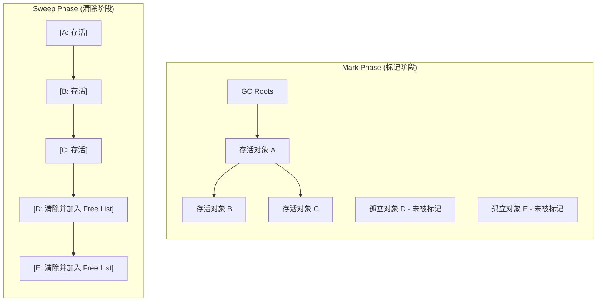
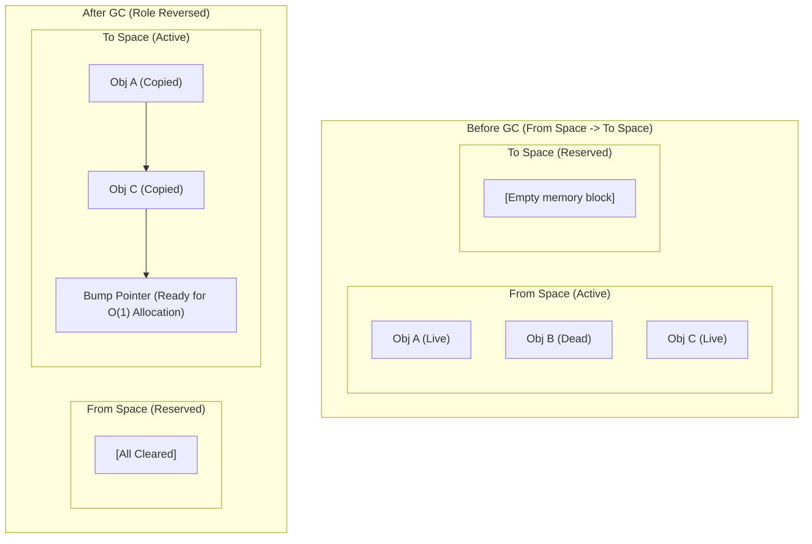
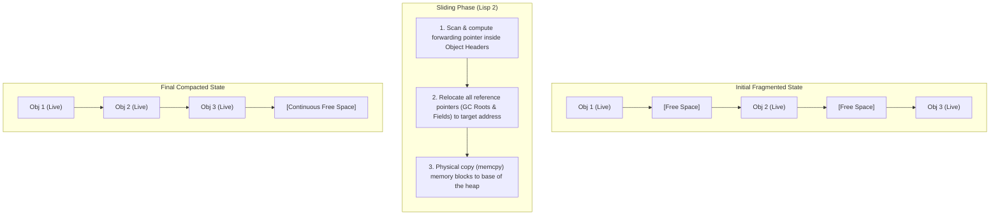
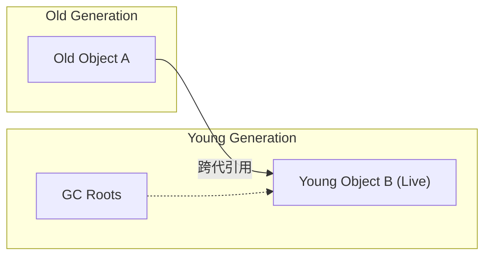
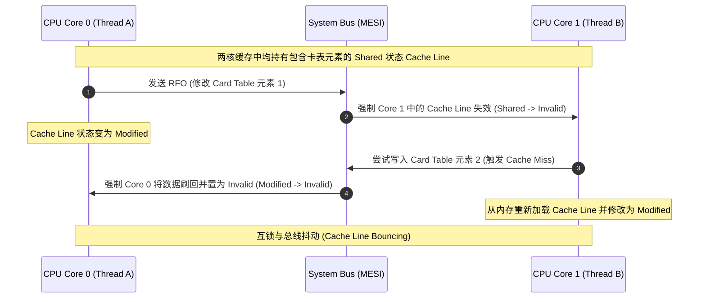
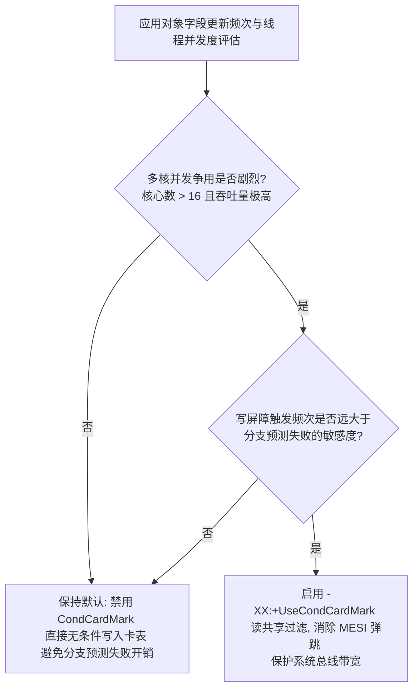
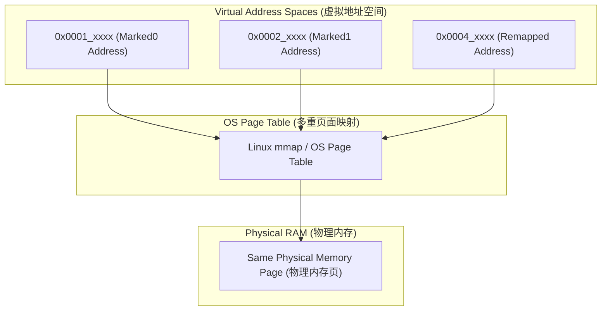
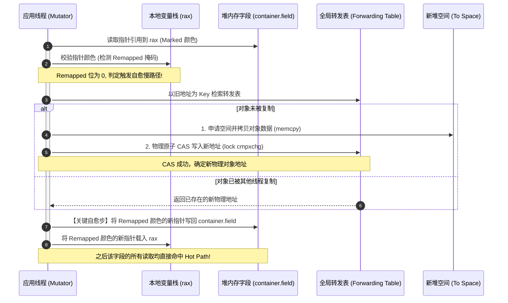

# 2.1.4.3 垃圾回收算法

在现代高并发、低延迟的 JVM（Java Virtual Machine）技术生态中，垃圾回收（Garbage Collection, GC）是自动内存管理的基石。随着硬件体系结构向多核心、超大物理内存以及非均匀内存访问（NUMA）架构演进，垃圾回收算法的设计已经不再局限于单纯的软件算法，而是演变为一场在**计算机组成原理、多核缓存一致性协议、操作系统虚拟内存管理与 JVM 运行时规范**之间的微观物理博弈。

本文将从最底层的物理约束与硬件视角出发，深度剖析三大经典垃圾回收算法的微观机理，数学推导跨代引用记忆集卡表的物理边界与写屏障条件过滤，并详细探讨并发垃圾回收器中指针重定位引发的物理缓存抖动，以及读写屏障自愈的微观协作机理。

---

## 1. 垃圾回收算法的物理约束与体系结构背景

要彻底理解垃圾回收算法的设计，必须首先厘清现代计算机存储体系所带来的物理制约。

### 1.1 存储器金字塔与冯·诺依曼瓶颈
计算机的计算速度（CPU 频率与执行单元吞吐量）以指数级增长，而物理内存（DRAM）的访问延迟和带宽增长则相对滞后。这一物理现实被称为“**冯·诺依曼瓶颈（Von Neumann Bottleneck）**”或“**内存墙（Memory Wall）**”。

为了缓解内存墙，现代 CPU 引入了多级高速缓存（L1、L2、L3 Cache）。各级存储器的访问延迟差异极大：
* **CPU 寄存器**：$< 1$ 周期
* **L1 Cache**：$\approx 4$ 周期
* **L2 Cache**：$\approx 12$ 周期
* **L3 Cache**：$\approx 30 \sim 40$ 周期
* **主内存 (DRAM)**：$\approx 200 \sim 300$ 周期

任何垃圾回收算法在执行期间，若频繁产生不规则的内存解引用、随机的指针跳转或对无效内存块的遍历，都会导致严重的 **Cache Miss（缓存未命中）**，迫使 CPU 核心处于长达数百个时钟周期的停顿（Stall）状态，从而极大削弱了 JVM 的整体运行吞吐量。

### 1.2 物理屏障与多核一致性
在多核处理器中，为了保证各个 CPU 核心看到的内存状态一致，硬件层面通过 **MESI（Modified, Exclusive, Shared, Invalid）协议** 维护 Cache Line（通常为 64 字节）的状态。
当垃圾回收器线程或应用线程（Mutator）修改内存中的对象指针或卡表标志位时，必须将该修改同步给其他核心。这会引发高速缓存行的状态迁移，产生 **RFO（Request For Ownership）** 信号，在系统总线上产生一致性流量。若写操作过于密集，总线带宽被占满，便会形成**总线抖动（Bus Jitter）**与缓存弹跳。

---

## 2. 三大经典垃圾回收算法工作机理与流程图解

经典的垃圾回收算法主要包括三种：标记-清除（Mark-Sweep）、标记-复制（Mark-Copy）与标记-整理（Mark-Compact）。它们是后续所有高级并发收集器的算法基础。

### 2.1 标记-清除算法（Mark-Sweep）

标记-清除算法由 John McCarthy 于 1960 年提出，是自动内存管理的开山鼻祖。

#### 2.1.1 工作机理与微观步骤
算法在物理执行上明确分为两个阶段：
1. **标记阶段（Mark Phase）**：
   - 收集器从 **GC Roots**（包括 JVM 栈帧中的局部变量表引用、方法区中的类静态属性与常量引用、本地方法栈中的 JNI 引用等）出发，将它们作为根节点。
   - 采用可达性分析（Reachability Analysis），沿引用链（Reference Chain）深度优先或广度优先遍历对象图。
   - 在遍历过程中，将所有存活的对象在对象头（Object Header）的 Mark Word 中，或者在外部的位图（Bit Map）中标记为“存活”（Live）。
2. **清除阶段（Sweep Phase）**：
   - 垃圾回收器以线性方式遍历整个 Java 堆的物理内存地址空间。
   - 检查每一个对象所在的内存块。若该块的对象头部或位图中未被标记为存活，则判定其为垃圾，并将其起始物理地址与长度信息记录下来，重新放回空闲空间管理器中。若对象存活，则将其标记位清零，以备下一次垃圾回收。

#### 2.1.2 内存碎片化的物理与数学成因
标记-清除算法最大的物理缺陷在于**内存碎片化（Memory Fragmentation）**。
假设 Java 堆的总物理内存为 $M$，在垃圾回收前，堆中存活的对象总大小为 $S$，这些对象共有 $N$ 个。由于对象的分配时间和生命周期不一致，存活对象在物理内存中呈现非连续、零散的分布。
在清除阶段结束后，可用的空闲内存被分割为大量不连续的小碎片。设空闲内存碎片的平均大小为 $Avg_{fragment}$，空闲碎片总数为 $F$。在最坏的随机生命周期模型下：
$$F \approx N$$
$$Avg_{fragment} = \frac{M - S}{F}$$

当应用线程尝试分配一个大小为 $Obj_{size}$ 的新对象时，即使当前堆的空闲总容量 $M - S \gg Obj_{size}$，但如果没有任何一个单块空闲碎片 $Fragment_i$ 满足：
$$Size(Fragment_i) \ge Obj_{size}$$
JVM 便无法完成此次内存分配，被迫提前触发一次垃圾回收，甚至在收集后仍无法找到连续空间时抛出 `OutOfMemoryError`。

#### 2.1.3 对后续分配性能的影响推导
由于内存不规整，JVM 无法使用简单高效的“指针碰撞”进行分配，必须通过**空闲列表（Free List）**管理空闲物理块。

1. **检索时间复杂度退化**：
   在分配新对象时，JVM 需要检索 Free List。若采用 **首次适应（First Fit）** 策略，每次都要从链表头部线性查找，平均时间复杂度为 $O(N)$；若采用 **最佳适应（Best Fit）**，需要遍历整个链表以找到最小满足要求的块，时间复杂度为 $O(N)$，且每次拆分空闲块都会产生更小的碎片；若采用 **最坏适应（Worst Fit）**，虽能减缓碎片的产生，但会迅速消灭大块空闲区。
2. **硬件流水线停顿（Pipeline Stall）**：
   Free List 物理上是一组分散在堆各处的指针链表。CPU 在遍历链表时，无法进行硬件预取（Hardware Prefetch）。每次读取下一个节点指针，都会发生严重的 Cache Miss。以主存访问延迟 200 周期计算，频繁的 Free List 检索会让 CPU 的执行流水线充满因等待数据而产生的空闲气泡，严重拉低了分配吞吐量。
3. **全局锁竞争（TLAB 退化）**：
   为了加速分配，JVM 在新生代为每个线程分配了私有的**线程局部分配缓冲区（TLAB）**。然而在严重碎片的堆中，由于空闲块尺寸太小，TLAB 频繁用尽。线程被迫频繁向全局 Free List 申请新块，这需要获取全局堆分配锁（Heap Allocation Lock）。在高并发下，这会导致严重的线程排队与锁竞争，使得并发分配性能彻底失效。

#### 2.1.4 标记-清除算法流程图解



---

### 2.2 标记-复制算法（Mark-Copy）

为了克服标记-清除算法的碎片化缺陷与 Free List 检索开销，Fenichel 和 Yochelson 等人提出了标记-复制算法。

#### 2.2.1 半区复制（Semispace Copying）与 Appel 式回收机制
* **半区复制（Semispace Copying）**：
  将可用物理内存划分为两个大小完全相同的区域：**From-Space** 和 **To-Space**。每次分配只在 From-Space 中进行。当 From-Space 空间耗尽时，触发垃圾回收：
  - 收集器从 GC Roots 开始标记存活对象。
  - 将 From-Space 中的存活对象**物理拷贝（memcpy）**到 To-Space 中，拷贝后的对象在 To-Space 中紧密排列，物理地址完全连续。
  - 拷贝完成后，一次性将 From-Space 中的所有数据清空。
  - 对调 From-Space 与 To-Space 的物理角色。



* **Appel 式回收机制**：
  半区复制算法最大的物理代价是**内存空间减半（仅能使用 50% 物理空间）**。为了解决空间利用率低的问题，现代 JVM 在新生代设计中采用了 **Appel 式回收机制**。
  - 将新生代内存细分为一个较大的 **Eden 区** 和两个较小的 **Survivor 区**（分别称为 From-Survivor 和 To-Survivor）。在 HotSpot 默认配置中，其物理占比为 **8:1:1**。
  - 应用线程平时在 Eden 区和 From-Survivor 区分配对象（可用空间达 90%）。
  - 当发生 Minor GC 时，将 Eden 和 From-Survivor 中的存活对象复制到 To-Survivor 区。
  - 清空 Eden 和 From-Survivor。From-Survivor 与 To-Survivor 角色对调。
  - **分配担保（Handle Promotion）**：若存活对象的总体积超过了单个 To-Survivor 区的物理容量（10% 限制），JVM 则依赖老年代进行内存分配担保，直接将溢出对象提升（Promote）到老年代。

#### 2.2.2 物理代价与在大对象高存活率下的退化
标记-复制算法用“物理拷贝”换取了“消除碎片”，但这也带来了特定的物理瓶颈：
1. **内存预留开销（Memory Footprint）**：
   无论如何优化，To-Survivor 区或半区在运行期间必须保持空闲状态，不能参与正常分配，这造成了物理内存的浪费。
2. **大对象高存活率下的总线饱和**：
   如果堆中对象的存活率极高（例如老年代，或者某些长生命周期的缓存对象较多的新生代），标记-复制算法将遭遇严重的物理性能衰退：
   - **大量 `memcpy` 拷贝开销**：当存活率接近 100% 时，垃圾回收器几乎要将堆中的所有对象物理拷贝一遍。这需要大量的 CPU 时钟周期以及内存总线带宽。
   - **写分配（Write Allocate）与缓存污染**：物理内存拷贝在 CPU 层面通常体现为读源地址和写目的地址。写目的地址会触发 CPU 的 Write Allocate 策略，将目标内存块调入 CPU 高速缓存。由于 GC 拷贝的对象后续可能很久都不会被应用线程访问，这种“强制调入”会把 CPU L1/L2 中原本属于热点业务数据的缓存行“污染”并挤出，导致 GC 后应用线程的 Cache Miss 率短时间内飙升。

---

### 2.3 标记-整理算法（Mark-Compact）

为了克服标记-清除的碎片问题以及标记-复制的内存减半开销，针对高存活率的老年代，设计了标记-整理算法。

#### 2.3.1 整理策略的物理对比与局部性分析
标记-整理算法在标记阶段结束后，会将所有存活对象移动到堆的起始端，从而使空闲空间完全规整。对象的移动顺序决定了算法的物理效率，主要有以下三种移动策略：

1. **任意顺序（Arbitrary）**：
   - **原理**：垃圾回收器在遍历堆时，不理会对象原本的相对位置，只要高地址有存活对象且低地址有空闲，就直接将对象填补过去。
   - **物理劣势**：彻底破坏了程序的**空间局部性（Spatial Locality）**。在 CPU 执行时，若原本相邻的对象（如二叉树的父子节点）被散布到相隔甚远的物理地址上，会使硬件 L1/L2 缓存的“预取”命中率崩塌，从而增加运行期的延迟。
2. **线性顺序（Linear）**：
   - **原理**：将具有关联引用的对象尽量排在一起。
   - **物理劣势**：在整理前需要对对象间的复杂拓扑关系进行物理分析，计算量巨大，内存和 CPU 开销高昂。
3. **滑动顺序（Sliding）**：
   - **原理**：将存活对象滑动到堆的起始端，但**严格保持对象在内存中原有的先后顺序**。
   - **物理优势**：既消除了内存碎片，又完整保留了原有的空间局部性，因此被现代 JVM 的主流整理回收器（如 Parallel Old 中的 Compact 阶段）所采用。

#### 2.3.2 Lisp 2 三指针滑动整理算法深度推导
我们以最经典的滑动整理算法——**Lisp 2 算法**为例，推导其在物理层面的三个阶段执行细节。

设堆中存活对象依地址从低到高为 $Obj_1, Obj_2, \dots, Obj_n$。

* **第一阶段：计算目标地址（Compute Forwarding Addresses）**：
  - 设置两个物理指针：`free`（指向堆的起始地址）与 `scan`（指向堆的起始地址）。
  - `scan` 线性遍历整个物理堆。每当遇到标记为存活的对象 $Obj_i$，计算该对象整理后的物理目标地址：
    $$Target(Obj_i) = free$$
  - 将 $Target(Obj_i)$ 存放在 $Obj_i$ 自身的对象头（Mark Word）中。
  - 更新 `free` 指针，向前推移该存活对象的大小：
    $$free = free + Size(Obj_i)$$
  - `scan` 继续遍历，直至堆尾。

* **第二阶段：更新引用指针（Update References）**：
  - `scan` 指针重新指向堆的起始物理地址。
  - 线性扫描堆中所有的对象引用字段（以及 GC Roots 中的栈指针）。对于任意指向对象 $Obj_x$ 的指针 $P$，修改 $P$ 的值，使其指向 $Obj_x$ 对象头中记录的物理新地址：
    $$P = Target(Obj_x)$$
  - 此时，虽然对象实体尚未在物理上发生移动，但全堆所有指向该对象的引用指针已被安全地更新为未来的目标地址。

* **第三阶段：物理移动对象（Copy Objects）**：
  - `scan` 再次线性扫描堆。
  - 遇到存活对象 $Obj_i$ 时，将其物理内存内容（`Size(Obj_i)` 字节的数据）完整拷贝到它的目标地址 $Target(Obj_i)$。
  - 拷贝完毕后，恢复对象头的 Mark Word 标记位。

##### 物理开销分析：
Lisp 2 算法完成了完美的滑动整理，其时间复杂度为 $O(N)$（$N$ 为堆物理空间大小），但由于需要线性扫描 3 次堆空间（第一次计算地址，第二次更新指针，第三次物理移动），当堆物理内存极大时，扫描整个内存空间的 CPU 时钟周期非常长。

#### 2.3.3 标记-整理算法流程图解



---

### 2.4 三大经典垃圾回收算法多维度物理对比

| 对比维度 | 标记-清除（Mark-Sweep） | 标记-复制（Mark-Copy） | 标记-整理（Mark-Compact） |
| :--- | :--- | :--- | :--- |
| **分配方式** | 空闲列表（Free List），检索开销大 | 指针碰撞（Bump-the-Pointer），$O(1)$ | 指针碰撞（Bump-the-Pointer），$O(1)$ |
| **内存碎片** | 产生大量物理碎片，无法合并 | 无碎片，整理后完全规整 | 无碎片，整理后完全规整 |
| **空间开销** | 0 额外保留空间 | 需要 50% 物理空间或保留 Survivor 区 | 0 额外保留空间 |
| **对象移动** | 否，物理地址保持不变 | 是，物理地址发生迁移 | 是，物理地址发生滑动迁移 |
| **垃圾回收时间复杂度**| $O(M)$（$M$ 为堆容量） | $O(S)$（$S$ 为存活对象大小） | $O(M)$（需要多次扫描堆空间） |
| **适用场景** | 存活率高、堆空间大（如老年代） | 存活率极低（如新生代） | 存活率高、不允许浪费（如老年代） |

---

## 3. 分代收集理论与跨代引用的卡表/记忆集过滤决策树

现代 JVM 并非生硬地套用某一种算法，而是基于**分代收集理论**。然而，分代收集带来的最大物理代价就是**跨代引用（Intergenerational Reference）**的处理。

### 3.1 跨代引用与记忆集（Remembered Set）
在进行 Minor GC 时，若老年代对象持有了新生代对象的引用，可达性分析必须将该老年代对象作为根节点之一，否则新生代对象会被误回收。
为解决此问题，JVM 在新生代中引入了**记忆集（Remembered Set, RSet）**这一抽象数据结构，用来记录从非收集区域（老年代）指向收集区域（新生代）的指针集合。

### 3.2 卡表（Card Table）的物理映射关系
卡表是记忆集的一种粗粒度实现。在 HotSpot 中，卡表被物理实现为一个字节数组 `Byte[]`。
卡表数组中的每一个元素（Card Byte）都映射着堆内存中特定大小的连续物理内存块，这个块被称为**卡页（Card Page）**。

其物理映射关系如下图所示：

```mermaid
graph LR
    subgraph Card Table (字节数组)
        CardTable["CardTable[i] = 1 Byte"]
    end
    subgraph Java Heap("Java 堆")
        CardPage["Card Page = 512 Bytes"]
    end
    CardTable -- "1:512 物理映射" --> CardPage
    CardPage -- "包含对象" --> ObjInPage["对象 A, B, C..."]
```

计算卡表索引的数学映射公式为：
$$\text{CardTable\_Index}(Addr) = \frac{Addr - \text{Heap\_Base}}{512}$$
或者在机器码级别通过位移操作高效计算：
$$\text{CardTable\_Index}(Addr) = (Addr - \text{Heap\_Base}) \gg 9$$

---

### 3.3 卡页大小（512 字节）的设计逻辑与物理推导

为什么 HotSpot 选择 512 字节作为卡页的大小？我们通过数学与硬件物理模型进行推导。

#### 3.3.1 数学开销模型
设 Java 堆的大小为 $H$，卡页大小为 $P$。
* **卡表本身的内存占用开销**：
  由于卡表每个元素占用 1 字节（$1\text{ Byte}$），则卡表占用的物理空间 $S_{table}$ 为：
  $$S_{table} = \frac{H}{P}$$
  *若 $P$ 过小（例如 $16\text{ Bytes}$），则卡表占比达整个堆内存的：*
  $$\frac{S_{table}}{H} = \frac{1}{16} = 6.25\%$$
  这是一个巨大的物理空间浪费。

* **Minor GC 扫描脏卡的开销**：
  当 Minor GC 发生时，收集器必须线性遍历整个卡表。若发现 `CardTable[i] == 0`（即脏卡，Dirty），则需要扫描该卡页对应的所有对象。
  设老年代中包含跨代引用的写操作频率为 $\lambda$，写操作在老年代中随机均匀分布。
  脏卡页的数量 $D$ 随着卡页大小 $P$ 的增大而增大（因为 $P$ 越大，单卡页包含的对象越多，只要有一个对象发生跨代写，整个卡页就被脏化）。
  Minor GC 扫描老年代的总时间开销 $T_{scan}$ 为：
  $$T_{scan} = C_1 \cdot \text{扫描卡表字节数组的时间} + C_2 \cdot \text{扫描脏卡内所有对象的时间}$$
  $$T_{scan} = C_1 \cdot \left(\frac{H}{P}\right) + C_2 \cdot D(P) \cdot P$$
  其中 $C_1, C_2$ 是硬件相关的常数。
  - **若 $P$ 极其大（例如 $4096\text{ Bytes}$，即 OS 页大小）**：虽然卡表自身空间占比极小（$0.024\%$），但由于单页包含的对象极多，少量跨代引用就会使大量卡页变脏。Minor GC 时，收集器需要花费高昂的 CPU 周期去扫描大量与跨代引用无关的邻近对象，$T_{scan}$ 急剧上升。

#### 3.3.2 硬件缓存行对齐物理推导
现代 CPU 核心读取内存数据的最小物理单位是 **Cache Line**（通常为 64 字节）。
若卡页大小定为 $P = 512\text{ Bytes}$：
1. 卡表空间占比极小且稳定：
   $$\frac{S_{table}}{H} = \frac{1}{512} \approx 0.195\%$$
2. 一个 Cache Line（64 字节）可以完整容纳 64 个卡表元素。这 64 个卡表元素对应堆中连续的：
   $$64 \times 512\text{ Bytes} = 32\text{ KB}$$
   的堆空间。
3. 当垃圾回收器以线性方式扫描卡表时，读取一个 64 字节的 Cache Line 便能一次性获知 32KB 堆区域的跨代引用情况。这极大地利用了 CPU 缓存行的空间局部性与**硬件预取器**。
4. 512 字节在 64 位 JVM 中最多仅能存放 64 个引用指针（未压缩指针）。当 CPU 扫描这 512 字节时，数据可以被完美放入 L1 Data Cache 中，整个卡页的线性扫描仅需数十个时钟周期，扫描开销几乎为零。

#### 3.3.3 跨代引用记忆集示意图


---

### 3.4 写屏障与伪共享（False Sharing）问题

每次应用线程执行引用赋值语句 `obj.field = value` 时，JVM 都会通过后置写屏障（Post-Write Barrier）脏化卡表。

#### 3.4.1 底层机器码序列（x86-64）
在编译出的汇编指令中，写屏障的表现形式如下：

```assembly
; 假设 rax 存放被写入对象 obj 的物理地址，rdi 存放被写入的值 value
mov [rax + 16], rdi            ; 执行字段物理写入：obj.field = value
shr rax, 9                     ; rax = rax >> 9 (计算卡表索引)
mov [r12 + rax], 0             ; r12 为 card_table_base，将对应的 card byte 置 0 (Dirty)
```

#### 3.4.2 缓存一致性（MESI）下的伪共享风暴
卡表是一个紧凑排列的字节数组。由于一个 64 字节的 Cache Line 包含了 64 个卡表元素（对应 32KB 堆内存），在多线程并发运行的系统上，会引发严重的**伪共享（False Sharing）**问题。

* **物理成因**：
  1. CPU Core 0 运行的线程 A 修改了物理地址 $0x1000$ 处的对象，其卡表索引为 $Idx_A$，对应的卡表字节存放在 Cache Line X。
  2. CPU Core 1 运行的线程 B 修改了物理地址 $0x4000$ 处的对象，其卡表索引为 $Idx_B$。由于两者在 32KB 物理范围内，其对应的卡表字节**同样位于 Cache Line X**。
  3. Core 0 写入卡表时，根据 MESI 协议，必须向总线发送 **RFO（Request For Ownership）** 信号，强制使 Core 1 中的 Cache Line X 状态转为 **Invalid（无效）**。
  4. 当 Core 1 的线程 B 试图写入卡表时，遭遇 Cache Miss，必须发起内存读取事务，重新将 Cache Line X 调入，并反过来向 Core 0 发送 RFO 信号将其置为 Invalid。
  5. 这种在不同核心间频繁转移 Cache Line 所有权（Cache Line Bouncing）的行为，会使系统总线带宽饱和，导致处理器流水线产生大量的空闲停顿，这就是写屏障伪共享风暴。



#### 3.4.3 条件写屏障 `-XX:+UseCondCardMark` 决策树物理推导
为了规避伪共享，JVM 引入了条件写屏障，先判断对应的卡表字节是否已经是 `0`（Dirty）。如果已经是 `0`，则跳过写操作。
由于读操作（Read）是共享的，多核心并发读取同一个 Cache Line（处于 Shared 状态）不会引发 MESI 的失效信号，从而消除了无谓的写冲突。

其汇编指令序列为：

```assembly
; rax 存放当前被写入对象 obj 的物理地址
mov [rax + 16], rdi            ; 执行物理写入: obj.field = value
shr rax, 9                     ; 计算卡表索引
cmp byte [r12 + rax], 0        ; 物理读：检查卡表对应字节是否已是 0 (Dirty)
je L_skip                      ; 若已是 0，直接跳转跳转至 L_skip
mov byte [r12 + rax], 0        ; 物理写：仅在非 0 时写入 0
L_skip:
```

##### 条件写屏障过滤决策树物理推导：
虽然 `-XX:+UseCondCardMark` 避免了伪共享，但它多出了一条 `cmp` 比较和一条 `je` 条件分支跳转指令。
如果分支预测失败（Branch Misprediction），现代 CPU 的超标量流水线（Super-scalar Pipeline）会发生清空（Pipeline Flush）开销，导致 15 级以上的流水线气泡。因此，必须根据以下决策树进行物理决策：



---

## 4. 指针重定位与物理屏障协作

在现代低延迟并发垃圾回收器（如 ZGC、Shenandoah）中，为了实现小于 1 毫秒的停顿时间，垃圾回收线程与应用线程必须并发运行。这意味着**对象拷贝（Evacuation）与指针重定位（Relocation）是在应用运行期间并发发生的**。

### 4.1 指针重定位的代价：总线抖动与缓存失效

当 GC 线程将一个对象从 Memory Region A 复制到 Region B 后，该对象的新物理地址为 $Addr_B$。此时，堆中所有引用了旧地址 $Addr_A$ 的指针，都必须被修改为 $Addr_B$。

在多核体系结构下，这种大规模的并发指针更新会对硬件系统产生剧烈的物理冲击：
1. **Cache 行失效风暴（Cache Invalidation Storm）**：
   应用堆中存放引用指针的内存块分布在物理内存的各个角落。当 GC 线程或应用线程在大范围内并发修改这些指针时，会导致多核 CPU中包含这些指针的 64 字节高速缓存行大范围失效（MESI 状态频繁由 Shared/Exclusive 转为 Invalid）。
2. **总线事务饱和（Bus Transaction Saturation）**：
   应用线程随后在执行业务逻辑、对这些对象进行解引用时，将遭遇大规模的硬件 **L1/L2/L3 Cache Miss**。CPU 核心必须不断通过系统总线向内存控制器发送物理读取请求。在双路或多路 CPU（NUMA 架构）系统中，跨 CPU 插槽（Socket）的一致性互联通道（如 Intel UPI 或 AMD Infinity Fabric）会迅速达到饱和，带宽被完全挤占，导致应用线程的执行产生物理停顿。

---

### 4.2 读屏障自愈（Load Barrier Self-Healing）的微观协作

为了在并发重定位期间彻底解决指针失效与访问安全问题，以 ZGC 为代表的收集器设计了**着色指针（Colored Pointers）**与**读屏障自愈（Load Barrier Self-Healing）**的微观协作体系。

#### 4.2.1 着色指针的物理与元数据映射
着色指针直接将 JVM 对象的引用指针（64 位虚拟地址）的高几位用作存储 GC 状态的元数据（以 x86-64 为例，使用 42 至 45 位）：

```
+-------------------+-------------+-------------+-------------+-----------------------------+
|    Bit 63-46      |   Bit 45    |   Bit 44    |   Bit 42    |          Bit 41-0           |
|   Reserved (18)   | Finalizable |  Remapped   | Marked1/0   |  Object Physical Address    |
+-------------------+-------------+-------------+-------------+-----------------------------+
```

* **Marked0 / Marked1**：标志对象存活，以及标记阶段的活对象状态。
* **Remapped**：表示该指针已经完成了自愈和重定位，直接指向最新的物理对象。

##### 物理多重映射（Multi-Mapping）机制：
当指针的着色位（第 42~45 位）变化时，由于物理地址不同，这本会导致 CPU 寻址错误。
为了解决这一物理局限，ZGC 在操作系统层通过虚拟内存多重映射，将三个不同的虚拟地址段（分别对应 `Marked0` 状态、`Marked1` 状态和 `Remapped` 状态的地址段）在物理页表中**映射到完全相同的物理内存页面**：



#### 4.2.2 读屏障自愈的微观时序与步骤
读屏障（Load Barrier）是在应用线程从堆中读取对象指针并将其加载到 CPU 寄存器时触发的一段极其精简的代码。

##### 1. 热路径（Hot Path）的汇编级极速判定：
当应用线程执行指令 `Object obj = container.field` 时，读屏障仅进行一次颜色测试。其对应的汇编伪代码如下：

```assembly
; 假设 rsi 存放 container.field 的物理内存地址
mov rax, [rsi]                 ; 将引用指针值加载到寄存器 rax
test rax, [r15 + remap_mask]   ; 与全局 Remapped 掩码（通常存在寄存器 r15 中）进行位与测试
jnz L_fast_path                ; 若 Remapped 位为 1，直接跳转至 L_fast_path (Hot Path)
                               ; 否则，进入冷路径 (Cold Path)
call L_slow_path_relocate
L_fast_path:
; 继续执行后续业务代码...
```

*若指针已是 Remapped 状态（Hot Path），仅需一条 `test` 与一条 `jnz`，在现代 CPU 分支预测器下开销通常仅为 2~3 个 CPU 时钟周期，对吞吐量几乎无损。*

##### 2. 冷路径（Cold Path）的自愈协作：
若 `test` 测试失败，代表该指针指向的对象已被移动或者尚未重定位，读屏障进入冷路径 `L_slow_path_relocate`：
* **第一步：查询转发表（Forwarding Table）**：
  应用线程以当前指针中的旧地址 $Addr_{old}$ 作为 Key，查询 GC 维护的高效哈希转发表。
* **第二步：并发复制（CAS 抢占）**：
  若转发表中无对应记录，说明该对象尚未被复制。
  当前应用线程将暂停其业务逻辑，**亲自执行物理复制操作**：在 To-Space 申请相应大小的物理内存，并将旧对象物理拷贝（memcpy）过去，生成新对象。
  复制完成后，线程使用原子指令（如 x86 的 `lock cmpxchg`）向全局转发表写入新对象的物理地址 $Addr_{new}$。
  - 若 CAS 成功，当前线程复制的对象被判定为正统，重定位地址确立。
  - 若 CAS 失败，说明另一个并发线程（或 GC 线程）已经抢先一步完成了拷贝并写入了转发表。此时，当前线程放弃其刚刚复制的临时对象，直接使用转发表中已被记录的新对象物理地址。
* **第三步：指针自愈（Self-Healing）**：
  当前应用线程在将新地址 $Addr_{new}$ 返回给用户业务代码之前，**会顺手将新地址 $Addr_{new}$ 重新着色为 Remapped 状态，并强制将其写回到 `container.field` 内存中**。
  - **物理价值**：通过这次“顺手”的写回操作，该字段上的旧指针被物理覆盖为了正确着色的 Remapped 指针。当下一次任何线程（包括当前线程本身）再次读取 `container.field` 时，在 Hot Path 的 `test` 测试中会直接命中 Remapped，立刻返回新地址，绝不会再次触发慢路径的转发表检索与 CAS 操作。

#### 4.2.3 读屏障自愈微观时序图解



---

### 4.3 读写屏障的原子竞争与内存模型约束

在并发自愈阶段，应用线程与 GC 线程并发更新同一引用字段，会引发物理内存模型级别的原子竞争。

#### 4.3.1 自愈修改的物理内存重排风险
假设在没有物理内存屏障（Memory Barrier）的情况下，CPU 核心可能会对指令进行重排（Out-of-Order Execution）。
若线程 A 刚完成了新对象的复制，并在写入转发表之前，就已经通过自愈将新着色指针写回了 `container.field`。
如果此时线程 B 读取了 `container.field`，拿到了新指针，但由于重排，新对象的物理内容尚未从线程 A 所在核心的 Store Buffer 中刷入主存，线程 B 解引用该指针便会读到未初始化的物理垃圾数据。

#### 4.3.2 汇编级屏障指令与可见性保障
为了规避此类硬件重排风险，JVM 在读屏障冷路径的汇编生成中，严格遵循指令排序屏障（Instruction Ordering Barrier）的规范：
- 在自愈写回 `container.field` 之前，必须执行一次具有 **Release** 语义的屏障（在 x86-64 上，所有的 Store 默认具有 Release 语义，或者通过 `lock` 指令强制同步；在 ARM 架构上，则明确使用 `dmb` 或 `lwsync` 指令）。
- 这确保了在新对象物理数据完整写入主存（或在 Cache 一致性网络中全网可见）之前，其他核心绝不会提前读取到指向该对象的 Remapped 指针。

---

## 5. 现代垃圾回收器的演进方向与硬件协同趋势

垃圾回收技术演进至今，其物理本质是用**极少量的吞吐量损耗（屏障代码开销）和内存足迹，换取极低的停顿时间（Latency）**。

### 5.1 各种屏障设计的物理代价对比

| 垃圾回收器 | 屏障触发类型 | 底层汇编开销 | 缓存/总线抖动风险 | 对吞吐量的物理损耗 |
| :--- | :--- | :--- | :--- | :--- |
| **Parallel GC** | 无屏障 | 0 | 0（仅在 STW 期间存在总线开销） | 0 |
| **G1 GC** | 后置写屏障 | 约 3~5 条汇编指令（脏化卡表） | 中等（存在卡表伪共享问题） | $\approx 2\% \sim 5\%$ |
| **Shenandoah** | 读写屏障（LRB） | 中等（解引用 Brooks Pointer） | 高（并发重定位修改对象引用） | $\approx 5\% \sim 10\%$ |
| **ZGC** | 读屏障（Load Barrier） | 极低（Hot Path 仅 2 指令测试） | 极小（读自愈消除重复并发写） | $\approx 2\% \sim 4\%$ |

---

### 5.2 硬件协同趋势与芯片级硬件支持

随着 TB 级以至 PB 级堆内存的应用逐渐普及，纯软件层面的屏障开销和内存映射开销正逼近其物理极限。未来的垃圾回收器技术已经清晰地展现出与 CPU 芯片级硬件协同演进的趋势：

1. **AArch64 TBI（Top Byte Ignore）硬件加速**：
   ARM 架构下的 TBI 允许 CPU 在硬件寻址时，自动忽略 64 位指针的高 8 位，并将其视作纯粹的软件元数据。这使得 ZGC 可以在 ARM 平台上直接利用这 8 位进行着色，而**无需在操作系统层使用复杂的 `mmap` 多重虚拟内存映射**。这大幅减少了系统页表项的膨胀，消除了由于多重映射引发的 TLB（Translation Lookaside Buffer）抖动与未命中开销。
2. **Intel LASS（Linear Address Space Separation）**：
   通过在芯片硬件层面提供更高效的线性地址空间物理隔离，防止用户态与内核态、或 JVM 内部堆空间与元数据区之间的非法地址穿透。这使得垃圾回收器能够硬件级免除一部分指针合法性边界检查，降低了读写屏障中的分支预测开销。
3. **硬件事务内存（HTM / TSX）的重定位加速**：
   在指针重定位与自愈阶段，应用线程与 GC 线程会频繁针对转发表（Forwarding Table）和引用字段发生 CAS 竞争。未来的芯片若能提供更稳定的硬件事务内存支持，便能够将这些并发 CAS 操作打包为一次性硬件事务执行。在发生冲突时由硬件自动回滚并重试，从而彻底规避软件级自旋或内核态锁介入的物理损耗。

总之，垃圾回收算法早已不再是空中楼阁的纯算法逻辑。它是软件算法与现代多核 CPU 架构、MESI 缓存一致性协议、总线传输速率以及操作系统 MMU 紧密缠绕的物理实体。唯有在硬件的物理边界与软件的算法边界之间取得最优的均衡，才能真正实现高吞吐与低延迟并存的现代 JVM 内存管理。
