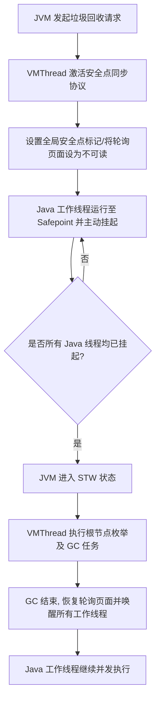
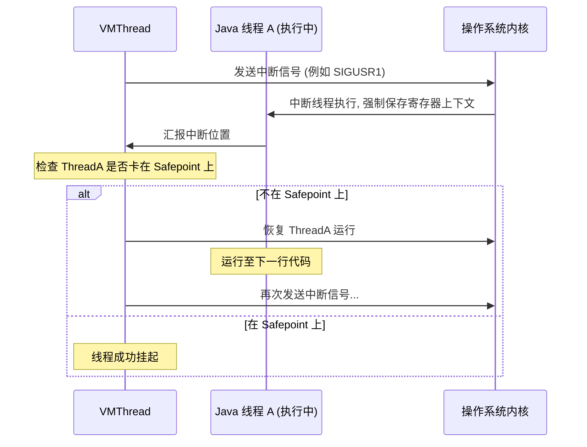
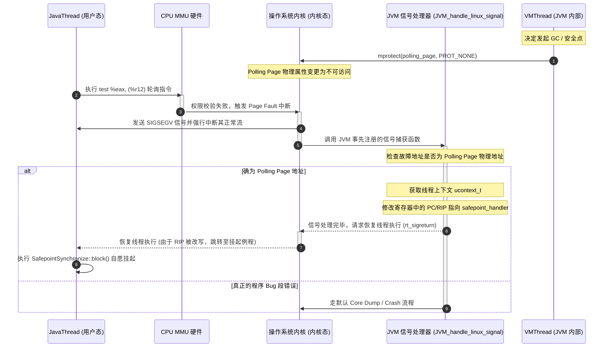
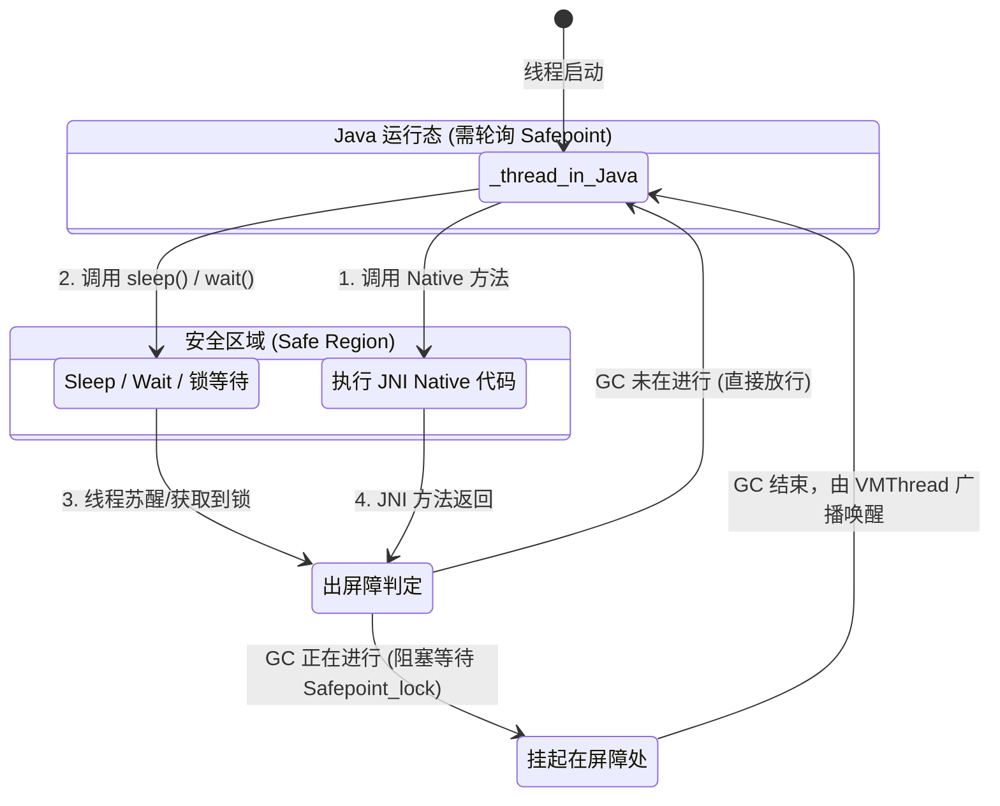
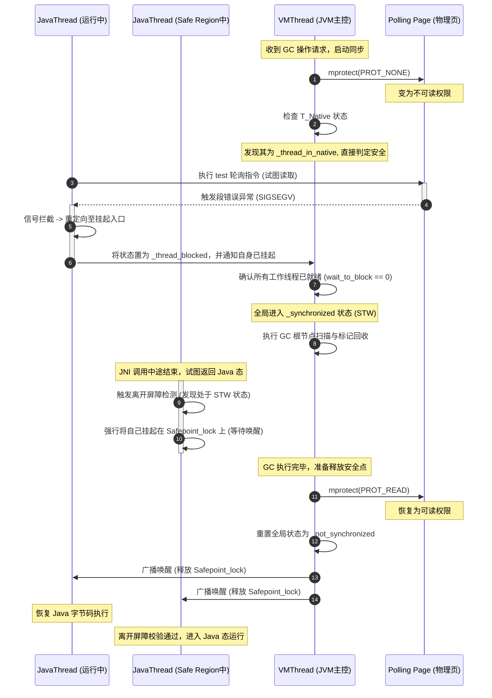

# 2.1.4.4 安全点与安全区

在现代高性能 Java 虚拟机（以 Oracle/OpenJDK HotSpot 为典型代表）中，自动内存管理（垃圾回收，Garbage Collection）是保障系统稳定性与开发效率的核心基石。然而，要实现高效、准确的垃圾回收，JVM 必须在某些特定的时刻让所有的执行线程暂停下来，以获取一个绝对一致的全局内存快照。这一线程暂停机制的实现，本质上依赖于**安全点（Safepoint）**与**安全区（Safe Region）**的精密协同。

本文将从 JVM 底层物理结构、编译器指令生成、操作系统内核信号拦截以及线上性能调优等多重维度，深度剖析安全点与安全区的设计本质、硬件触发机制、VMThread 协调协议及实战排查指南。

---

## 1. 安全点与安全区的历史渊源与设计本质

### 1.1 一致性状态（Global Consistent State）的物理定义
在多线程的 Java 程序运行过程中，每个线程的栈帧（Stack Frame）中都保存着大量的局部变量，寄存器中也存放着各种临时计算数据，这些数据中包含着大量的“指向堆中对象的引用（Ordinary Object Pointer，简称 OOP）”。

当 JVM 决定发起垃圾回收时，第一步工作是**根节点枚举（Root Scanning）**。如果允许 Java 线程在根节点枚举的过程中继续运行，它们将不断修改栈帧中的局部变量、寄存器以及堆中对象的引用关系。这种在“动态变化”的内存状态中进行的扫描，会导致如下致命问题：
1. **漏标（Under-marking）**：垃圾回收器认为某个对象已经不可达，准备予以回收，但几乎在同一瞬间，工作线程将该对象的引用写入了一个已被扫描过的存活对象属性中。这会导致处于存活状态的对象被错误回收，造成内存损坏与 JVM 崩溃（悬挂指针）。
2. **误标（Over-marking）**：工作线程销毁了某个引用的唯一拷贝，但垃圾回收器仍将其视为根节点并标记其存活，这虽不至于引发 Crash，但会产生浮动垃圾，降低回收效率。

因此，为了保证垃圾回收算法的正确性，JVM 必须在根节点枚举时，使整个虚拟机的内存状态、寄存器状态和调用栈进入一个**绝对静止、不再发生引用的新增或转移的状态**。这种状态在物理上被称为**全局一致性状态（Global Consistent State）**。

### 1.2 根节点枚举（Root Scanning）的严苛限制
为什么垃圾回收不能“边跑边扫”？虽然现代垃圾回收器（如 G1, ZGC, Shenandoah）已经实现了并发标记（Concurrent Marking）甚至并发转移（Concurrent Relocation），但**根节点枚举（Root Scanning）阶段依然必须在 STW（Stop-The-World）下进行**。

根节点枚举的起点非常多，包括但不限于：
* 所有当前活动的 Java 线程的本地调用栈（VM Stack）中的局部变量表和操作数栈。
* JVM 内部的全局静态变量、常量池中的引用类型。
* 本地方法栈（Native Method Stack）中的 JNI 局部引用与全局引用。
* 系统字典（System Dictionary）、JVM 内部的监控器对象（Monitors）等。

如果这些“源头”处于动态变化中，三色标记算法的并发变轨机制（如 SATB 或 Incremental Update 写屏障）将因为缺少一个正确的“起始标记边界”而彻底失效。因此，根节点枚举对一致性状态的要求是绝对且严苛的。

### 1.3 Stop-The-World（STW）与安全点的物理关联
**Stop-The-World（STW）** 是指 JVM 暂停所有 Java 执行线程，仅保留执行内部管理任务的特权线程（如 VMThread）运行的过程。而**安全点（Safepoint）**就是 Java 线程可以安全停止执行、且 JVM 可以安全进行内存操作的物理代码位置。

简单来说：
* **Safepoint** 是一个“代码位置”的属性：在该位置，线程的堆栈和寄存器状态是完全确定的，JVM 可以通过读取特定的映射表（OopMap）获知哪些位置存放着对象引用。
* **STW** 是一个“全局状态”：当且仅当所有的 Java 线程都到达了各自的 Safepoint 并被成功挂起时，JVM 才宣告进入 STW 状态，开始执行垃圾回收操作。



---

## 2. 安全点（Safepoint）的选址依据与编译器生成机理

### 2.1 运行时开销与及时响应的权衡（Trade-off）
从理论上讲，如果我们在 Java 字节码的每一条指令后面都设置一个安全点，那么一旦发起 GC，所有的线程都可以在纳秒级时间内立即暂停，响应速度最快。但在实际工程中，这是绝对不可行的：
1. **OopMap 空间膨胀**：每一条指令都生成对应的引用映射表，会消耗海量的内存，导致 JVM 内存被元数据吞噬。
2. **执行指令膨胀**：频繁的检测与跳转会极大地破坏 CPU 的分支预测，拖慢程序正常运行的吞吐量。

因此，安全点的选址必须在**运行时开销（Performance Overhead）**与**安全点响应延迟（Safepoint Latency）**之间做严格的权衡。其核心原则是：**安全点只能设置在程序执行流中“可能发生较长耗时”或“状态切换”的特定位置**，确保线程在此处能及时响应暂停请求，而在高频的纯计算代码段中不引入冗余开销。

### 2.2 OopMap（Ordinary Object Pointer Map）的精密数据结构
要在安全点处安全地停止线程并进行垃圾回收，JVM 必须知道每个线程栈帧中的哪些位置当前存放的是对象引用，哪些位置是基本数据类型（如 `int`, `float`, `double` 等）。如果让垃圾回收器每次都去暴力扫描和解析整个线程栈的字节码，开销将是灾难性的。

为了实现“准确式垃圾回收（Accurate GC）”，HotSpot 采用了 **OopMap**（普通对象指针映射表）这一精密的数据结构。

#### 2.2.1 OopMap 的物理布局与作用
当 JIT 编译器（C1/C2）将 Java 字节码编译为本地机器码时，会在特定的指令位置（即安全点）记录下栈帧和寄存器中引用的分布情况。OopMap 内部维护了一个映射关系：
$$\text{OopMap} = \{ \text{栈帧偏移量 / 寄存器编号} \to \text{引用类型 (OOP)} \}$$

当垃圾回收器进行根节点枚举时，它不需要盲目扫描栈帧，而是直接通过当前线程的程序计数器（PC/RIP）定位到对应的 JIT 编译代码段，并在对应的 `OopMapSet` 中查找到该 PC 对应的 `OopMap`。根据 `OopMap` 提供的信息，GC 线程可以以极快的速度准确提取出所有的根对象引用。

#### 2.2.2 为什么不能在任意指令处生成 OopMap
1. **指令流水线与重排优化**：JIT 编译器在生成机器码时会进行激进的指令重排（Instruction Reordering）和寄存器分配优化。如果任意位置都是安全点，意味着编译器在任何位置都必须维护引用的清晰状态，这会直接限制 JIT 编译器的寄存器分配器（Register Allocator），使得大量原本可以缓存在寄存器中的数据被迫频繁刷回内存，造成性能雪崩。
2. **元数据体积**：如果为每一行机器指令生成 OopMap，OopMap 占用的内存空间将是编译后机器码体积的数倍，严重浪费 JVM 进程的元空间（Metaspace）和堆外内存。

### 2.3 经典选址场景深层剖析
HotSpot JVM 在以下四个经典场景中，会在编译期或解释期强制生成安全点：

#### 2.3.1 方法调用（Call Instruction）
在方法调用指令（如 x86 的 `call`）之后。进入一个新方法意味着接下来要执行一系列未知的复杂计算，且栈帧发生压栈操作，调用关系改变。在方法调用处设置安全点，能够确保线程在进入新方法体之前或在多层嵌套调用时及时响应挂起请求。

#### 2.3.2 方法返回（Return Instruction）
在方法返回指令（如 x86 的 `ret`）之前。方法返回时，当前栈帧即将被销毁（退栈），寄存器和局部变量的生存周期发生剧烈改变。在返回前设置安全点，既能回收这部分栈帧资源，又能确保线程在回到调用者之前被安全截获。

#### 2.3.3 非计数循环的末尾（Non-counted Loop Backedge）
在循环体的回跳（Backedge）位置。如果一个循环的执行次数是无法在编译期确定的（例如依赖于外部输入、链表遍历等），该循环被判定为“非计数循环”。由于循环可能执行成千上万次，甚至陷入死循环，必须在每次循环回跳到头部时进行安全点检查，防止该线程长时期霸占 CPU 而不响应暂停请求。

#### 2.3.4 异常抛出点（Exception Throwing Path）
当程序抛出异常时，JVM 需要执行栈解开（Stack Unwinding）以寻找匹配的 `catch` 块。由于栈解开会改变多层栈帧的物理结构，且异常路径属于慢速路径（Slow Path），在此处设置安全点不仅不会影响正常路径的性能，还能在异常发生时提供准确的调用栈上下文。

---

### 2.4 计数循环（Counted Loop）的“安全点陷阱”
这是 JVM 性能调优和线上稳定性排查中最臭名昭著的盲区。

#### 2.4.1 Counted Loop 的定义
计数循环（Counted Loop）是指形如以下格式的循环：
```java
for (int i = start; i < limit; i++) {
    // 纯计算逻辑，无方法调用或仅有可内联的方法
}
```
其中，循环计数器 `i` 是 `int` 类型，且循环的步长与边界在进入循环时是相对确定的。

#### 2.4.2 JIT 编译器的 Loop Unrolling 优化与 Safepoint 缺失
JIT 编译器（尤其是 C2 编译器）在编译计数循环时，会应用一种非常激进的优化技术——**循环展开（Loop Unrolling）**和**范围检查消除（Range Check Elimination）**。
为了追求极致的执行速度，C2 编译器默认认为计数循环可以在极短的时间内执行完毕。因此，**C2 默认不在计数循环的回跳（Backedge）处插入安全点检查指令**。

这一优化的初衷是省去高频循环中的检查开销。但是，如果 `limit` 的值非常大（例如接近 `Integer.MAX_VALUE`），或者循环体内部存在看似简单但极度消耗 CPU 的操作（但没有触发方法调用，或者方法被 JIT 进行了内联），那么这个循环就会演变成一个**执行时间长达数秒甚至数分钟的长循环**。

由于该循环中没有任何安全点，正在执行该循环的 Java 线程**无法感知到 JVM 已经发起了安全点请求**。此时线上会发生以下连锁反应：
1. `VMThread` 发起垃圾回收，置全局安全点状态为“同步中”（`_synchronizing`）。
2. 除该长循环线程外的所有其他工作线程均运行到了各自的 Safepoint 并被成功挂起。
3. `VMThread` 处于自旋等待状态，卡在 `SafepointSynchronize::begin()` 中，等待该长循环线程停下来。
4. 由于该长循环线程还在疯狂执行计算，它不理会安全点信号。
5. **整个 JVM 的其他所有线程全部处于暂停状态，服务完全失去响应，CPU 单核被该长循环线程吃满，而 GC 却迟迟无法开始。** 这种情况被称为 **Safepoint Sync Time Out（安全点同步超时）**。

#### 2.4.3 参数控制与底层实现权衡

为了解决计数循环带来的安全点缺失问题，JVM 提供了以下两个核心参数：

1. **`-XX:+UseCountedLoopSafepoints`**：
   * **作用**：强制要求 C2 编译器在所有计数循环的回跳位置也插入安全点检查指令。
   * **代价**：会破坏编译器的循环优化（如阻碍完全的 Loop Unrolling），并因为引入了高频的轮询指令而导致循环性能下降（通常在 1% ~ 5% 左右，视循环体大小而定）。

2. **`-XX:LoopStripMiningIter=N`（JDK 10+ 引入）**：
   * **作用**：这是一种更为优雅的折中方案，被称为“循环条带开采”。它将原本的大循环改写为双重嵌套循环。内层循环执行 $N$ 次（默认 1000 次），不插入任何安全点检查，保留极致的 JIT 优化与流水线并行度；外层循环在每完成 $N$ 次迭代后，进行一次安全点检查。
   * **优势**：既保证了安全点响应延迟被控制在微秒级（最多执行 1000 次内层迭代就会遇到安全点），又几乎不损失任何循环性能。

---

## 3. 线程挂起方式的演进：抢占式中断 vs. 主动式轮询

当 JVM 需要让所有线程进入安全点时，如何将这一指令送达并执行？历史上存在两种完全不同的设计思路。

### 3.1 抢占式中断（Preemptive Suspension）的理想化模型与致命缺陷
**抢占式中断**是一种强控制型的设计。



#### 3.1.1 致命缺陷
虽然抢占式中断在理论上不需要在编译代码中插入任何轮询指令，但其在实际工程中存在无法逾越的缺陷：
1. **控制开销极大**：通过操作系统发送信号（Signal）来强行中断一个线程，会引发昂贵的系统调用和内核态与用户态的上下文切换（Context Switch）。在拥有成百上千个线程的高并发应用中，这会引发严重的“信号风暴”，导致系统负载飙升。
2. **状态判定与恢复极其复杂**：如果线程被中断时刚好停留在一段非安全点代码上（例如正在执行没有 OopMap 对应的机器指令），JVM 必须将该线程唤醒，让其运行一段距离后再次强行中断。这种“中断-检查-恢复-再中断”的试错式交互，在工程上极难保证实时性，且极易引入死锁或竞争状态。
3. **系统调用与 I/O 阻塞的无能为力**：如果线程此时卡在操作系统的系统调用（System Call）或底层的 socket 读写中，抢占式信号只能中断系统调用（触发 `EINTR`），但这会破坏原本的业务逻辑，迫使底层的 C/C++ 库代码行为异常。

因此，**现代主流 JVM（如 HotSpot）已完全弃用抢占式中断，全部采用主动式轮询机制**。

### 3.2 主动式轮询（Voluntary Polling）的崛起
**主动式轮询**采用的是一种基于“协作”的柔性控制机制。它的核心逻辑是：
* JVM 不去粗暴地打断线程，而是设置一个全局的“安全点标志”（Safepoint Flag）。
* 每一个 Java 线程在自己运行到 JIT 编译器预设的安全点时，**主动**去读取这个标志位。
* 如果发现标志位显示“需要进入安全点”，线程将主动执行挂起逻辑，将自己挂起。
* 由于挂起动作是由工作线程在安全点处主动触发的，因此此时该线程的 `OopMap` 是现成且完全准确的，省去了状态判定的繁琐步骤。

---

## 4. HotSpot 轮询页面（Polling Page）硬件触发与信号拦截的硬核底层逻辑

在主动式轮询中，线程需要频繁地检查安全点标志。如何将这一频繁检查的性能损耗降至零，是 JVM 底层设计中最具智慧的部分。

### 4.1 分支指令（Conditional Branch）的灾难：为什么不用 `if (safepoint_pending)`
最直观的主动式轮询实现可以写成如下伪代码：
```c
// 假设在每个安全点插入分支判断
if (global_safepoint_flag == 1) {
    SafepointSynchronize::block(thread);
}
```
但在汇编指令层面，这至少需要三条指令：
1. **Memory Load**：将全局变量 `global_safepoint_flag` 从内存加载到寄存器。
2. **Compare**：比较寄存器的值是否为 1（`cmp` 指令）。
3. **Conditional Jump**：根据比较结果进行条件跳转（`jne` 指令）。

由于安全点检查代码遍布于每一个方法调用前后、每一个非计数循环末尾，这些判断指令在 Java 程序运行期间会被执行数以十亿次。
即使现代 CPU 拥有极其强大的分支预测器（Branch Predictor），如此庞大的分支跳转逻辑仍然会带来严重的性能损耗：
* **分支预测槽（BTB）占用**：大量的安全点跳转指令会挤占 CPU 分支预测缓存，导致真正业务代码的分支预测优化命中率下降。
* **流水线冲刷（Pipeline Flush）**：一旦 JVM 发起安全点，`global_safepoint_flag` 状态发生改变，CPU 的分支预测器会在这一瞬间全部预测失败，导致已经进入 CPU 执行流水线的指令被全部排空重来，带来明显的性能惩罚（通常在 10 ~ 20 个 CPU 周期）。

### 4.2 轮询页面机制的核心原理
为了消除分支跳转指令的开销，HotSpot 引入了基于**内存保护页（Polling Page）**的硬件异常触发机制。

其核心思想是：
1. **虚拟内存映射**：JVM 在启动时，利用操作系统的虚拟内存管理接口（Linux 下的 `mmap`），在堆外分配一个普通的内存页（通常大小为 4KB），称为 **Polling Page（轮询页面）**。
2. **正常状态（只读）**：在正常运行期间，该 Polling Page 的权限被设置为**可读（`PROT_READ`）**。
3. **免分支检查指令**：JIT 编译器在生成安全点代码时，不插入任何 `cmp` 或 `jne` 指令，而是仅插入一条极其精简的**内存读取指令**，尝试去读取 Polling Page 中某个固定偏移量处的字节数据。
4. **安全点激活（无访问权限）**：当 VMThread 需要发起安全点同步时，它调用操作系统的页属性修改函数（Linux 下的 `mprotect`），将该 Polling Page 的权限修改为**不可访问（`PROT_NONE`）**。
5. **硬件异常触发**：由于 Polling Page 变为了不可访问，工作线程一旦执行到下一条内存读取指令，CPU 的 MMU（内存管理单元）在进行地址翻译与权限检查时会发生硬件级越权异常（Page Fault），操作系统捕获后会向线程发送 `SIGSEGV`（段错误）信号。
6. **内核信号拦截与重定向**：JVM 预先注册的信号处理器（Signal Handler）拦截该 `SIGSEGV` 信号，解析出故障地址属于 Polling Page，随即将线程的执行流引导至安全点挂起例程。

### 4.3 汇编底层指令追踪（x86-64 与 AArch64）

#### 4.3.1 x86-64 架构下的指令实现
在 Linux x86-64 架构下，HotSpot JIT 编译器在安全点生成的典型汇编指令如下：

```assembly
; %r12 寄存器在 HotSpot 内部被指定为基址寄存器，保存着指向 Polling Page 的地址
test %eax, (%r12)  ; 或者 test %eax, 0x160000(%rip) [相对 RIP 寻址]
```

* **正常状态**：`%r12` 对应的地址内存是可读的。`test` 指令仅仅是将 `%eax` 寄存器的值与 `%r12` 指向地址的数据进行逻辑与运算，并更新 CPU 的标志寄存器（Flags Register）。这条指令是一条纯粹的读操作，且不涉及任何内存写入和分支跳转。现代 CPU 对此类指令有极高的并发执行度，耗时通常小于 0.5 个 CPU 周期。
* **安全点同步状态**：由于 Polling Page 变成了 `PROT_NONE`，`test %eax, (%r12)` 试图读取该内存，瞬间触发 CPU 的硬件中断。

#### 4.3.2 AArch64 (ARM64) 架构下的指令实现
在 ARM 架构中，由于其精简指令集（RISC）的特性，通常使用如下方式进行轮询：

```assembly
LDR Wzr, [X19]  ; X19 寄存器存放 Polling Page 的基地址，Wzr 为零寄存器（Zero Register）
```

这条指令尝试从 `X19` 寄存器指向的地址加载数据到零寄存器（丢弃结果）。同理，当 Polling Page 权限被置为 `PROT_NONE` 时，触发 Data Abort 硬件异常，进而产生 `SIGSEGV` 信号。

---

### 4.4 操作系统信号处理器（Signal Handler）的拦截物理过程
下图展示了当工作线程运行到轮询指令处，触发段错误并最终被 JVM 信号处理器挂起的完整物理全过程：



#### 4.4.1 C++ 源码级伪代码分析
在 HotSpot 的 `src/os_cpu/linux_x86/os_linux_x86.cpp` 源码中，信号处理器的核心拦截逻辑如下所示：

```cpp
bool JVM_handle_linux_signal(int sig, siginfo_t* info, void* ucVoid, int abort_if_unrecognized) {
    ucontext_t* uc = (ucontext_t*)ucVoid;
    
    if (sig == SIGSEGV) {
        address addr = (address)info->si_addr;
        address pc = (address)uc->uc_mcontext.gregs[REG_RIP]; // 获取发生异常时的 RIP 指针
        
        // 检查发生异常的内存地址是否为全局 Polling Page 地址
        if (os::is_poll_address(addr)) {
            // 这是由安全点轮询触发的特意段错误
            // 修改 ucontext 中的 RIP 寄存器，使其指向 JVM 预设的 Stub 汇编代码区
            // 该 Stub 会负责保存现场，并最终调用 SafepointSynchronize::block(JavaThread*)
            uc->uc_mcontext.gregs[REG_RIP] = (greg_t)SharedRuntime::get_resolve_opt_virtual_call_stub();
            return true; // 表示该信号已被 JVM 成功消费，不要 Crash
        }
    }
    
    // 如果不是 Polling Page 触发的，则交给系统的其他处理器或进行崩溃转储
    return false;
}
```

通过这种软硬件紧密配合的精妙设计，JVM 将高频的安全点轮询开销完全控制在单条 `test` 硬件读指令级别，消除了所有的分支预测惩罚，只在真正需要 STW 时才会付出一次系统调优与信号分发的系统级开销。

---

## 5. 安全区域（Safe Region）在线程非执行状态下的介入与状态机控制

### 5.1 为什么引入安全区域？
主动式轮询机制有一个致命的逻辑前提：**Java 线程必须处于“运行状态（Running）”并且能够“执行 CPU 指令”**。

然而，在实际运行的 JVM 中，很多线程往往不具备执行指令的能力。例如：
* 线程调用了 `Thread.sleep(100000)`，正处于长时间的休眠状态（`TIMED_WAITING`）。
* 线程正在等待某个底层的网络 I/O 读写，处于阻塞状态（`BLOCKED` / `WAITING`）。
* 线程通过 JNI 进入了 C/C++ 编写的 Native 代码段中执行。

在这些状态下，工作线程根本无法执行 JVM 编译生成的 `test` 轮询指令。如果 `VMThread` 发起安全点同步，它将永远等不到这些线程的“自我挂起”响应，从而导致 STW 协议被无限期挂起。

为了解决这一问题，JVM 引入了**安全区域（Safe Region）**的概念。

### 5.2 安全区域（Safe Region）的物理定义：引用关系的相对静止
**安全区域（Safe Region）是指在一段给定的代码片段之中，对象的引用关系绝对不会发生任何变化。**

当一个线程进入安全区域（如执行 Native 方法、休眠或被内核挂起）时，它不可能修改 Java 堆中的任何对象引用，也不可能去操作 Java 栈帧。说明从垃圾回收器的视角来看，**处于安全区域内的线程对垃圾回收是绝对安全的，其状态与“已在安全点挂起”的线程完全等价**。

因此，当 JVM 发起安全点同步时，`VMThread` 会直接扫描这些处于安全区域内线程的栈帧（通过其保存的最后一次 Java 栈帧指针 - Last Java FP），而不需要等待它们主动做出反应。

---

### 5.3 进出屏障控制流（State Transition & Barriers）与状态机演变
为了确保线程在进出安全区域时的内存安全，JVM 内部设计了严格的状态转换机与控制边界屏障。

#### 5.3.1 核心线程状态机
HotSpot 内部使用 `JavaThreadState` 枚举定义了线程的几种主要执行状态：
* `_thread_in_Java`：正在执行 Java 字节码或 JIT 编译生成的机器码。
* `_thread_in_native`：正在执行 Native 方法。
* `_thread_blocked`：线程因为锁竞争、`wait`、`sleep` 等原因在 JVM 或操作系统级别被阻塞。
* `_thread_in_vm`：线程正在执行 JVM 内部的 C++ 运行时函数。

#### 5.3.2 进出屏障控制逻辑
当线程的执行状态在这些状态之间进行切换时，必须跨越相应的**状态屏障（State Barrier）**。



##### 进屏障逻辑 (Entering Safe Region)
当 Java 线程要调用一个 JNI 方法或者进入 Sleep 时，JVM 会在生成的胶水代码（Stub）中插入指令，将其状态从 `_thread_in_Java` 修改为 `_thread_in_native` 或 `_thread_blocked`。这一状态的切换在物理上被视为**进入安全区域**。
此时，即使全局安全点标志被设置，由于该线程已经是安全状态，`VMThread` 会直接越过它，判定其已经处于安全状态。

##### 出屏障逻辑 (Exiting Safe Region)
当 Native 方法执行完毕准备返回，或者线程从 Sleep 中醒来，试图继续执行 Java 字节码时，它必须跨越**离开屏障（Exit Barrier）**：
1. **状态检查**：线程尝试将自身状态从 `_thread_in_native`/`_thread_blocked` 切回 `_thread_in_Java`。
2. **安全点判定**：在切换前，线程必须去检查当前 JVM 的全局安全点状态（`SafepointSynchronize::is_at_safepoint()`）。
   * **若未在进行 GC**：状态顺利切换为 `_thread_in_Java`，线程直接放行，返回 Java 态继续执行。
   * **若正在进行 GC**：说明此时整个 Java 堆正在被垃圾回收器扫描或整理，对象地址可能随时发生改变。该线程**绝对不允许**此时返回 Java 态运行。线程将立即将自己挂起在离开屏障上，阻塞在全局的 `Safepoint_lock` 上，等待 GC 完成信号。
3. **唤醒机制**：GC 结束后，`VMThread` 将全局安全点标记清除，并广播唤醒所有被卡在离开屏障上的线程。线程被唤醒后，完成状态切换，安全返回 Java 状态。

---

## 6. STW 暂停与 JVM 内部 VMThread 物理协调全流程

垃圾回收的物理执行离不开 JVM 的核心后台调度线程——**VMThread**。它是整个 JVM 的“心脏”，负责串行处理所有需要安全点支持的全局同步操作。

### 6.1 JVM 核心线程模型与 VMThread
在 HotSpot 虚拟机中，存在以下几类核心线程：
* **`JavaThread`**：代表用户创建的 Java 线程，执行 Java 字节码或 Native 方法。
* **`VMThread`**：JVM 内部最特权的单例后台线程。它维护着一个 `VM_OperationQueue`，串行处理各种全局性重型管理任务，如垃圾回收（GC）、逆优化（Deoptimization）、类重新定义（Redefine Classes）、死锁检测等。这些任务被统一封装为 `VM_Operation`。
* **`WatcherThread`**：负责定时器、周期性性能采样的辅助线程。

### 6.2 安全点同步状态机
JVM 全局安全点协议的协调状态存放在 `SafepointSynchronize` 类中，由一个全局状态变量 `_state` 表示：
* **`_not_synchronized`**：正常运行状态，所有 JavaThread 并发运行。
* **`_synchronizing`**：安全点同步中。`VMThread` 正在等待所有 JavaThread 进入安全点。
* **`_synchronized`**：安全点已建立。所有 JavaThread 均已挂起，此时 JVM 处于 STW 状态，可以安全执行 `VM_Operation`。

---

### 6.3 物理暂停与唤醒全流程步骤拆解
当一个 `JavaThread` 发起一个需要安全点的操作（例如内存分配失败，需要发起 Full GC）时，完整的物理暂停与唤醒流程如下：

#### 步骤 1：投递 VM_Operation 与唤醒 VMThread
发起线程创建一个 `VM_GenCollectForAllocation` 操作，将其 push 到 `VMThread` 的任务队列 `VM_OperationQueue` 中，随后发起线程进入阻塞状态。`VMThread` 从睡眠中被唤醒，开始处理此任务。

#### 步骤 2：进入同步阶段（begin）
`VMThread` 调用 `SafepointSynchronize::begin()`，开始安全点同步协议：
1. **加锁**：获取全局安全点锁 `Safepoint_lock`。
2. **切换状态**：将全局 `_state` 置为 `_synchronizing`。
3. **置页面为不可读**：调用系统函数将 Polling Page 的虚拟内存页权限修改为 `PROT_NONE`。

```c++
// 伪代码逻辑
os::protect_memory(polling_page_address, page_size, MEM_PROT_NONE);
```

#### 步骤 3：自旋与等待（Spin & Block）
`VMThread` 开始遍历全局线程链表（`ThreadsList`），统计尚未进入安全点的 JavaThread 数量（称为 `wait_to_block` 计数）：
1. **轻量级自旋（Spinning）**：`VMThread` 首先进行短暂的自旋等待（通常最多循环数千次），期望那些在 CPU 上高速运行的线程能迅速执行到轮询点自愿挂起。
2. **强制状态检查**：对于已经运行到轮询点的线程（触发 `SIGSEGV` 重定向到 `SafepointSynchronize::block()`），它们会将自身的执行状态标记为“已在安全点阻塞”，并减少 `wait_to_block` 的计数。
3. **处理 Native 与 Blocked 线程**：对于处于 `_thread_in_native` 和 `_thread_blocked` 的线程，由于它们已经处于 Safe Region，`VMThread` 直接将其计入“已就绪”状态。

#### 步骤 4：进入 STW 状态（synchronized）
当 `wait_to_block` 计数归零时，说明所有的 `JavaThread` 都已经处于挂起状态或安全区域内。`VMThread` 将全局状态 `_state` 切换为 `_synchronized`。

至此，**安全点建立完毕，JVM 进入完全的 STW 状态**。

#### 步骤 5：执行具体的垃圾回收任务
`VMThread` 调用并执行当前的 `VM_Operation`（如垃圾回收器的根扫描与对象标记）。在这个阶段，除了 `VMThread` 自身和辅助的并行 GC 线程外，没有任何 Java 线程可以执行任何指令。

#### 步骤 6：安全点释放与唤醒（end）
GC 任务执行完毕后，`VMThread` 调用 `SafepointSynchronize::end()`，开始恢复现场：
1. **恢复轮询页面**：将 Polling Page 的虚拟内存页权限改回可读权限（`PROT_READ`）。
2. **切换状态**：将全局状态重置为 `_not_synchronized`。
3. **广播唤醒**：释放 `Safepoint_lock`，并调用 `Safepoint_lock->notify_all()` 唤醒所有被阻塞在离开屏障上的工作线程。
4. **业务线程恢复**：所有被挂起的 `JavaThread` 恢复并发运行，STW 结束。

---

### 6.4 线程挂起与唤醒的物理时序图
下图以极其直观的时序，还原了两个 `JavaThread`（分别处于运行态和 Safe Region 态）在 `VMThread` 协调下的物理同步过程：



---

## 7. JVM 线上安全点超时与停顿排查实战指南

在高并发、低延迟的线上生产系统中，安全点相关的性能问题往往表现为突发性的接口超时（RT 骤增）、服务假死（卡死几秒到几十秒），这通常是由于**安全点同步耗时过长（Safepoint Sync Time）**或**JVM 内部 Cleanup 耗时过长**导致的。

### 7.1 安全点超时（Safepoint Timeout）带来的危害与典型现象
如果 JVM 的某些工作线程因为陷入某些无安全点的耗时代码，导致 `VMThread` 迟迟无法推进安全点建立过程，就会触发**安全点同步超时**。
其典型危害如下：
* **级联雪崩**：上游服务因为该节点的 GC STW 延迟过长，连接池被打满，触发超时熔断，产生服务雪崩。
* **节点假死**：监控系统（如 Prometheus/Zabbix）的探针无法收到该 JVM 的健康心跳，导致节点被误判下线或频繁重启。

### 7.2 安全点日志关键参数深度解读
为了能够精确诊断线上安全点问题，必须开启 JVM 的安全点专项日志参数。

#### 7.2.1 推荐参数组合（JDK 8 推荐）
```bash
# 打印安全点同步耗时与统计信息
-XX:+PrintSafepointStatistics
-XX:PrintSafepointStatisticsCount=1

# 输出更详尽的安全点变更日志
-XX:+LogSafepoint

# 设置安全点同步超时阈值（默认 10000 毫秒即 10 秒）
-XX:SafepointTimeout
-XX:SafepointTimeoutDelay=2000

# 当安全点超时时，令 JVM 自动 Crash 并抛出 Core Dump，用于离线死锁/长循环分析
-XX:+AbortVMOnSafepointTimeout
```

#### 7.2.2 推荐参数组合（JDK 11+ 统一日志框架 JVM 选项）
```bash
-Xlog:safepoint=debug:file=/path/to/safepoint.log:time,uptime,pid:filecount=5,filesize=100M
```

---

#### 7.2.3 `-XX:+PrintSafepointStatistics` 输出日志格式逐项拆解
以下是一条典型的安全点统计日志：

```text
         vmop                    [threads: total initially_running wait_to_block]    [time: spin block sync cleanup vmop] page_trap_count
2026-06-15T10:30:12.123: G1CollectForAllocation            [     250             5             1 ]    [     2  1540  1542       8   45 ]             5
```

每一项数据的物理含义与诊断价值如下表所示：

| 字段类别 | 字段名称 | 物理含义 | 调优与诊断指标分析 |
| :--- | :--- | :--- | :--- |
| **基础信息** | `vmop` | 触发此次安全点暂停的 VM 操作名称。 | 如果是 `G1Collect...`，说明是 GC 引起的；如果是 `RevokeBias`，说明是偏向锁撤销频繁导致；如果是 `Deoptimization`，说明发生了激进优化的失效。 |
| **线程统计** | `total` | JVM 当前处于活动状态的总 Java 线程数。 | 线程数过多（如 > 2000）会显著增加自旋与信号通知的基准开销。 |
| **线程统计** | `initially_running` | VM 发起同步瞬间，仍处于运行态（JavaThreadState 为 `_thread_in_Java`）的线程数。 | 这一数值反映了同步发起瞬间需要响应轮询的线程规模。 |
| **线程统计** | `wait_to_block` | 自旋阶段结束后，仍然未能进入阻塞状态、且 VMThread 必须强制等待其挂起的线程数。 | **诊断核心**：如果此数值不为 0 且 block 时间长，说明有具体的线程在拖累同步。 |
| **时间消耗(ms)** | `spin` | VMThread 自旋等待所有线程到达安全点的时间。 | 正常情况下应该小于 2ms，如果长说明部分线程未能立即做出响应。 |
| **时间消耗(ms)** | `block` | VMThread 挂起并等待所有运行中线程真正变为 block 状态的耗时。 | **最核心指标**。若 block 值极大（如几百甚至几千毫秒），说明一定有线程卡在长循环、页错误或 JNI 临界区外。 |
| **时间消耗(ms)** | `sync` | 整个安全点建立阶段的总同步时间（$\approx spin + block$）。 | 它代表了从发起 GC 请求到所有工作线程真正停下（即 STW 开始前）的耗时。 |
| **时间消耗(ms)** | `cleanup` | 安全点成功建立后，JVM 内部进行轻量级清理任务的耗时。 | 包括 Monitor Deflation、StringTable/SymbolTable 的清理、IC 缓冲区的刷新。如果此值大，说明内部垃圾元数据过多。 |
| **时间消耗(ms)** | `vmop` | 实际执行业务任务（如垃圾回收算法本身、偏向锁撤销）的纯执行耗时。 | 此项过长属于 GC 算法本身的调优范围（如垃圾回收器内存结构、并发线程数调整等）。 |
| **硬件触发数** | `page_trap_count` | 发生硬件 Page Fault 段错误异常以响应轮询的次数。 | 若该值与 `initially_running` 接近，属于正常的轮询页面触发。 |

---

### 7.3 线上经典安全点延时场景与诊断

#### 7.3.1 场景一：计数循环（Counted Loop）未设置安全点导致 STW 延迟
* **现象描述**：GC 日志显示每次 `sync` 阶段耗时极长，且时间极有规律，通常是在某一个特定的后台统计任务或大数据遍历任务运行时发生。`wait_to_block` 长期不为 0。
* **原因分析**：JIT 编译器在编译以 `int` 循环变量控制的计数循环时，未在回跳处插入安全点指令。如果该循环迭代次数达上亿次且内部无方法调用，导致该线程疯狂占用 CPU 却无法被安全点拦截。
* **诊断手段**：
  1. 开启配置 `-XX:+SafepointTimeout -XX:SafepointTimeoutDelay=2000 -XX:+AbortVMOnSafepointTimeout`。
  2. 线上运行出现超时后，JVM 自动 Crash 并产生 Core Dump。
  3. 用 `gdb` 或 `lldb` 打开 Core 文件，查看当前的线程栈帧，会发现所有线程都在 `SafepointSynchronize::block` 处等待，而唯一一个例外线程正在执行业务代码（通常是某处 `for` 循环内部的指令）。
* **代码层改造**：将循环控制变量 `i` 的类型由 `int` 修改为 `long`。由于 JIT 不支持对 `long` 循环进行常规的 Counted Loop 优化，会在回跳位置默认插入安全点，问题迎刃而解。
* **JVM 参数层改造**：使用参数 `-XX:+UseCountedLoopSafepoints` 或（JDK 10+ 推荐）`-XX:LoopStripMiningIter=1000`。

#### 7.3.2 场景二：大内存页（Huge Pages）与系统内存交换（Swapping）
* **现象描述**：在某些性能较差的虚拟化云服务器上，`block` 时间和 `vmop` 时间同时出现极大的毛刺（可能长达数秒），且此时磁盘 I/O 吞吐率异常升高。
* **原因分析**：
  1. 操作系统物理内存耗尽，启用了 Swap 分区进行虚拟内存置换。
  2. 当 `VMThread` 执行安全点建立并调用 `mprotect()` 将 Polling Page 设为 `PROT_NONE` 时，或者 Java 线程抛出段错误被挂起需要进行上下文状态切换时，由于部分虚拟内存已经被置换到了 Swap 分区，迫使操作系统执行昂贵的物理磁盘 I/O（Major Page Fault）来换入换出页面。这会导致系统调用发生严重挂起。
* **解决办法**：
  1. 线上生产系统必须**关闭 Swap 分区**，或者设置 `vm.swappiness = 0`，宁可内存不足触发 OOM Killer，也不允许使用 Swap 拖慢 JVM。
  2. 合理配置物理内存，确保 JVM 进程占用的总物理内存（堆 + 堆外 + 元空间 + 线程栈）不超过物理机可用限度的 80%。

#### 7.3.3 场景三：JVM 内部 Cleanup（清理期）耗时过长
* **现象描述**：安全点统计日志中 `cleanup` 时间异常高，达到数百毫秒。
* **原因分析**：
  1. **偏向锁撤销（Biased Locking Revocation）**：并发程序中存在严重的锁竞争，或者频繁使用了 `Hashtable`、`Vector` 等古老容器，导致 JVM 必须在安全点处进行频繁的偏向锁撤销。
  2. **Monitor Deflation 拖累**：JVM 内部为了管理多线程锁，需要维护大量的锁监视器（Monitor）。如果在短时间内创建了海量对象锁，在 Cleanup 阶段，JVM 必须单线程去扫描和注销这些无用的 Monitor。
* **解决办法**：
  1. 彻底禁用偏向锁：添加 `-XX:-UseBiasedLocking` 参数（JDK 15+ 已经默认将此项禁用）。
  2. 如果由于 Monitor Deflation 导致耗时过长，可以通过配置 `-XX:MonitorUsedDeflationThreshold` 调整清理阈值，或升级到 JDK 15 后的异步监视器消亡（Async Monitor Deflation）机制，使该清理工作从安全点中剥离到并发线程中执行。

#### 7.3.4 场景四：Native 代码执行与不规范的 JNI 临界区（JNI Critical Region）
* **现象描述**：Java 线程通过 JNI 调用了 C/C++ 动态链接库。在进行大量的数据传输或原生处理时，JVM 试图发起安全点，但同步时间极长，直到 JNI 方法执行完才恢复。
* **原因分析**：当 Java 线程进入 JNI 临界区（例如调用了 `GetPrimitiveArrayCritical` 或 `GetUnsecuredStringCritical` 来获取 Java 数组或字符串的直接内存指针时），为了防止 GC 线程并发移动对象而造成 C/C++ 指针失效，**JVM 内部会暂时关闭垃圾回收功能**。
  在此期间，即使 `VMThread` 想要发起 GC，它也无法在安全点同步时推进该 JNI 线程，只能等待该线程执行完对应的 `ReleasePrimitiveArrayCritical` 退出临界区为止。
* **解决办法**：
  1. 严格规范 JNI 代码编写，不要在 `Get...Critical` 与 `Release...Critical` 之间执行任何耗时计算或可能引发系统阻塞的 I/O 操作。
  2. 尽量使用更安全的 DirectByteBuffer 方式来传递大量的数据，避免使用 Critical 临界区函数。

---

### 7.4 线上排查方法论与诊断工具链
当你的线上业务遭遇不明原因的卡顿，且排查思路怀疑是安全点导致的停顿时，推荐按照如下标准作业程序（SOP）进行诊断：

#### 步骤一：开启安全点专项日志
在服务的 JVM 启动项中追加上文提到的 `-XX:+PrintSafepointStatistics` 以及日志输出配置，使问题复现时有底座数据可供分析。

#### 步骤二：使用 `jstack` 实施“捕鱼行动”
1. 编写一个循环脚本，以极其短暂的间隔（如 50ms）不断执行 `jstack -l <pid> > jstack_output.txt`。
2. 结合应用性能监控（APM），一旦观测到接口 RT 出现秒级突刺，立刻停止脚本。
3. 检索 `jstack_output.txt` 中被捕获的线程状态。如果在多次 `jstack` 的快照中，**几乎所有的 JavaThread 都处于 `waiting on condition` 或 `in Object.wait()` 状态，说明 JVM 正处于 STW 状态中**。
4. 寻找在多个快照中唯一一个不处于阻塞状态、仍在疯狂执行业务逻辑的线程（通常其栈顶停留在普通计算方法的某一行），该线程极大概率就是缺失安全点检查的长循环线程。

#### 步骤三：分析全局 CPU 瓶颈与系统调用
如果 `jstack` 无法抓取，可以使用 Linux 原生诊断工具：
```bash
# 查看是否有单核 CPU 使用率达到 100%，确认是否存在长循环
top -Hp <pid>

# 追踪 VMThread（可以通过 jstack 找到其 native thread id）的系统调用情况，检查是否卡在 mprotect 上
strace -p <vmthread_tid> -T -e trace=mprotect,futex
```
如果 `strace` 显示 `mprotect` 系统调用本身耗时极长（比如几十毫秒），说明存在严重的物理内存不足或操作系统 Swapping 现象，应当立即排查系统层面的内存分配情况。

#### 步骤四：通过 Profiler 分析调用热点
利用 `async-profiler` 进行堆栈采集。由于 `async-profiler` 在采集时不依赖 JVM 自身的 Safepoint（它是利用 Linux 的 `perf_event` 软硬件事件及内核信号机制实现的），即使在 JVM 陷入长 STW 期间，它依然能准确捕获到正在消耗 CPU 资源的代码路径。
```bash
# 开启 async-profiler 采集 CPU 堆栈，输出为火焰图
./profiler.sh -d 30 -f cpu_flamegraph.svg <pid>
```
在生成的火焰图中，横轴宽度最大的那个方法即为最消耗 CPU 的调用路径，配合代码逻辑检查其是否存在计数大循环即可快速定位根因。

---

## 8. 总结

安全点与安全区是现代 Java 虚拟机中保障状态确定性、维护堆一致性与实现高效垃圾回收的灵魂机制。
* **安全点**通过 JIT 编译器在编译代码中的特定场景（调用、返回、非计数循环、异常）动态织入引用映射元数据（OopMap），实现了精细化的引用追踪。
* **主动式轮询机制**借助操作系统的内存保护页（Polling Page）和硬件段错误拦截技术，巧妙规避了传统分支跳转指令带来的性能损失，将正常运行期开销压缩到了物理极致。
* **安全区域**的设立，极大地拓宽了垃圾回收的包容性，使得处于 native 或 blocked 状态的“非活跃线程”同样能被无感地纳入垃圾回收器的管辖之下。
* 针对线上多发的**安全点超时与 STW 毛刺**，熟练掌握 `-XX:+PrintSafepointStatistics` 日志分析指标，并结合长循环优化（如 `-XX:LoopStripMiningIter`）与系统资源排查，是每一位高级 Java 性能调优专家的必修课。
