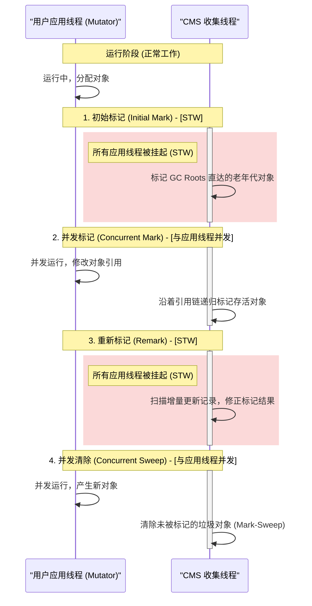
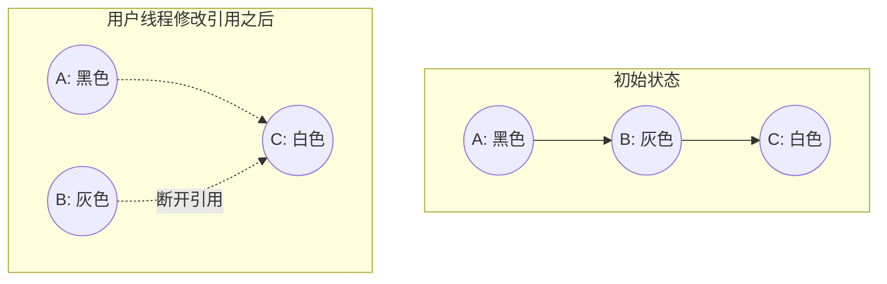
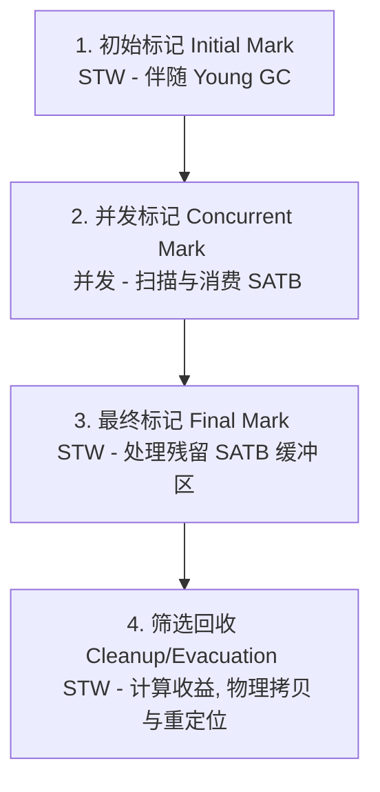
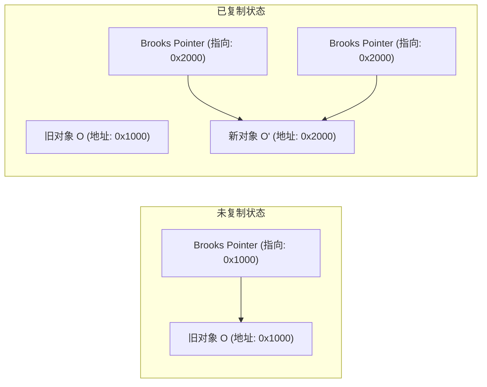
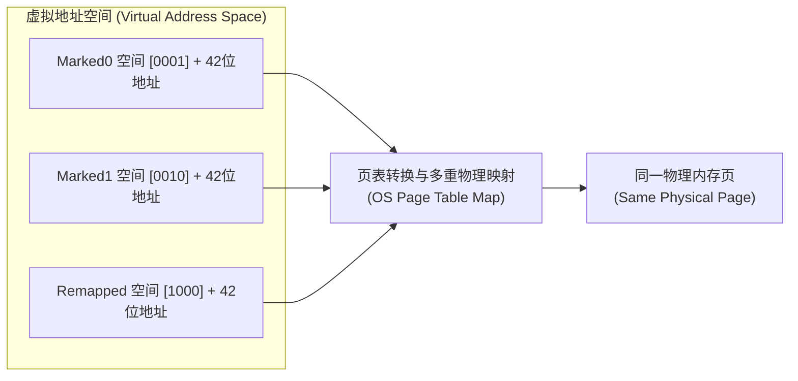
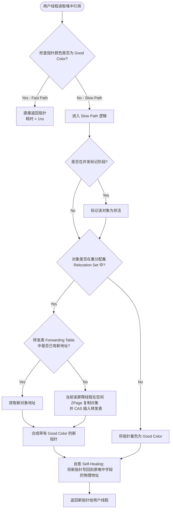

# 2.1.4.5 垃圾回收器

在 Java 虚拟机（JVM）的发展历程中，自动内存管理的核心矛盾始终围绕着**应用吞吐量（Throughput）**与**系统停顿时间（Latency）**的权衡展开。随着物理内存从兆字节（MB）级别跃升至太字节（TB）级别，垃圾回收（Garbage Collection, GC）技术的演进也经历了从“单线程 STW”到“多线程并行”，再到“并发标记清除”，乃至现代“亚毫秒级低延迟并发整理”的巨大技术变革。

本篇将深入剖析 JVM 经典垃圾回收器与现代低延迟垃圾回收器的核心运作机理、物理内存映射方案、读写屏障的底层汇编机制，以及规避三色标记漏标问题的数学逻辑。

---

## 1. 垃圾回收器演进哲学与核心矛盾

### 1.1 吞吐量与延迟的权衡
在 JVM 性能调优与架构设计中，吞吐量和延迟是两个互相对立的指标：
*   **吞吐量优先**：公式定义为 $Throughput = \frac{T_{Application}}{T_{Application} + T_{GC}}$。要求减少垃圾回收动作的发生频率，并在垃圾回收发生时，尽可能高效地利用所有 CPU 核心进行批量处理。这种策略适合非交互式的后台批处理任务。
*   **延迟优先**：要求系统响应时间的最大停顿时间（Max GC Pause Time）尽可能小。即使 GC 的总耗时有所增加（即吞吐量下降），也必须避免长时间的应用线程冻结。这对于 Web 服务、实时交易系统等高交互式应用至关重要。

### 1.2 内存布局的范式转换
为了满足不同阶段的性能目标，JVM 的堆内存物理布局经历了三次重大范式转变：


1.  **物理分代（Physical Generation）**：堆内存被划分为物理上连续的新生代（Eden、Survivor 0/1）和老年代（Tenured）。这种结构简化了对象的晋升过程，但带来了在大堆内存下扫描全堆的致命延迟瓶颈。
2.  **物理分区，逻辑分代（Region-based Partitioning）**：以 G1 为代表，将堆划分为数千个大小相等的独立区域（Region）。虽然 Region 在物理上不连续，但它们在逻辑上依然被划分为 Eden、Survivor、Old 等角色，垃圾回收可以以 Region 为最小单位进行（Mixed GC）。
3.  **动态无分代/逻辑分代（Dynamic Page / Logical Generation）**：以 ZGC、Shenandoah 为代表，彻底打破了硬性的物理分代边界，转而采用大小动态变化的页面（Page/Region），并且所有标记、复制、整理阶段均与用户线程并发执行。

---

## 2. 经典垃圾回收器运作机理

### 2.1 基础垃圾回收器概述
在深入并发收集器之前，有必要简要回顾早期收集器的机制：
*   **Serial / Serial Old**：经典的单线程垃圾回收器。新生代采用**标记-复制（Mark-Copying）**算法，老年代采用**标记-整理（Mark-Compact）**算法。其最大特点是工作时必须触发 **STW (Stop-The-World)**，完全冻结所有应用线程，仅用单 CPU 核心进行垃圾回收。
*   **Parallel Scavenge / Parallel Old**：多线程并行的吞吐量优先收集器。其内部实现了自适应调节策略，允许用户通过 `-XX:MaxGCPauseMillis`（最大垃圾回收停顿时间目标）与 `-XX:GCTimeRatio`（垃圾回收时间占总时间的比率）来控制系统的吞吐量与停顿时间。

### 2.2 CMS (Concurrent Mark Sweep) 收集器深度剖析
CMS 收集器是 HotSpot 虚拟机中第一款真正意义上的并发（Concurrent）收集器，其核心设计目标是获取最短的垃圾回收停顿时间。它只负责老年代的回收，通常与 ParNew（新生代并行复制收集器）配合工作。

#### 2.2.1 CMS 的 4 个核心阶段运作机理
CMS 的生命周期中包含 4 个最关键的阶段，其中两个阶段与用户线程并发运行，另外两个阶段则需要 STW 停顿：



1.  **初始标记（CMS Initial Mark）**：
    *   **停顿性质**：STW。
    *   **核心任务**：仅标记两类对象：
        *   GC Roots 能直接关联到的老年代对象。
        *   被新生代存活对象直接引用的老年代对象。
    *   **物理机制**：因为只扫描与根对象直接相连的“第一层”节点，不需要沿着引用链向下追踪，所以停顿时间极短。
2.  **并发标记（CMS Concurrent Mark）**：
    *   **停顿性质**：无 STW，与用户线程并发执行。
    *   **核心任务**：从初始标记阶段标记好的对象出发，遍历整个老年代的对象图，递归标记所有可达的存活对象。
    *   **物理机制**：垃圾回收线程与用户线程共享 CPU 资源。由于用户线程并发运行，对象之间的引用关系可能会发生改变，这也为后续的标记修正埋下了伏笔。
3.  **重新标记（CMS Remark）**：
    *   **停顿性质**：STW。
    *   **核心任务**：修正并发标记期间因用户线程继续运作而导致标记产生变动的那一部分对象记录。
    *   **物理机制**：由于新生代对象在并发标记期间可能新增了对老年代对象的引用，CMS 在 Remark 阶段必须扫描整个新生代以及被修改过的老年代 Card。为了降低 Remark 阶段的扫描开销，通常会配合 `-XX:+CMSScavengeBeforeRemark` 参数，在重新标记前强制触发一次 Minor GC，以清空新生代中大部分无用对象。
4.  **并发清除（CMS Concurrent Sweep）**：
    *   **停顿性质**：无 STW，与用户线程并发执行。
    *   **核心任务**：清除在标记阶段被判定为已经死亡的对象。
    *   **物理机制**：由于 CMS 采用的是**标记-清除（Mark-Sweep）**算法，在清除阶段不需要移动存活对象，因此可以直接并发抹除死亡对象所占用的内存地址。这也直接导致了内存碎片的产生。

#### 2.2.2 并发标记下的三色标记与漏标问题
在并发标记的过程中，垃圾回收器必须处理“对象图在标记过程中被用户线程动态修改”的问题。JVM 采用**三色标记（Tri-color Marking）**模型来对堆中对象的状态进行抽象：
*   **白色（White）**：表示对象尚未被垃圾回收器访问过。在垃圾回收开始时，所有对象都是白色。如果标记阶段结束时对象仍然是白色，则代表该对象不可达，属于垃圾。
*   **灰色（Gray）**：表示对象已经被垃圾回收器访问过，但该对象身上至少存在一个引用尚未被扫描。它是标记过程中的中间状态。
*   **黑色（Black）**：表示对象已经被垃圾回收器访问过，且其所有的直接引用都已经完成了扫描。黑色对象是安全存活的。黑色对象不可能直接指向白色对象，必须通过灰色对象进行过渡。

##### 漏标（Lost Object Problem）的两个必要条件
当且仅当以下两个条件同时满足时，会导致存活的白色对象被漏标记，从而在并发清除阶段被错误地当成垃圾回收：
1.  **条件一（赋值器插入）**：用户线程（Mutator）向黑色对象中插入了一条或多条指向白色对象的新引用。
2.  **条件二（赋值器删除）**：用户线程删除了所有灰色对象到该白色对象的直接或间接引用。



##### CMS 的解决方案：增量更新（Incremental Update）
CMS 破坏的是**条件一**。
*   **物理机制（写屏障拦截）**：当黑色对象插入指向白色对象的新引用时，JVM 通过写后屏障（Post-Write Barrier）截获这一操作，并将这个新插入引用的黑色对象记录下来。
*   **底层写屏障伪代码**：
    ```cpp
    void post_write_barrier(oop* field_address, oop new_value) {
        // 检查当前是否处于并发标记阶段
        if (CMSCollector::is_concurrent_marking()) {
            oop old_owner = get_object_owner(field_address);
            // 如果引用写入者是黑色，且写入的新引用是白色或灰色对象
            if (is_black(old_owner) && is_white_or_gray(new_value)) {
                // 将黑色对象退化为灰色，或者将其加入待重新扫描的队列 (Mod-Union Table)
                enqueue_for_remark(old_owner);
            }
        }
    }
    ```
*   **Remark 阶段的代价**：在重新标记（Remark）阶段，CMS 会进入 STW，并以这些被记录在队列中的退化黑色对象为根，深度重新扫描其下属的引用链。
*   **局限性**：由于增量更新只记录了引用的插入，Remark 阶段需要对这些被记录的对象进行深度的重新扫描。如果并发期间对象引用图变动剧烈，Remark 阶段的停顿时间会幅度延长，甚至失去低延迟的初衷。

#### 2.2.3 致命缺陷与退化物理机制
CMS 的非移动（Non-moving）并发清除机制，带来了三个致命缺陷：

##### 1. 浮动垃圾（Floating Garbage）
在并发清除（Concurrent Sweep）阶段，用户线程仍在运行，这期间会不断产生新的垃圾对象。由于这些垃圾产生在标记之后，CMS 无法在本次收集中清理它们，只能留待下一次 GC 时清理。因此，老年代无法像其他收集器那样等到几乎满了才触发 GC，必须预留一部分空间。
*   **触发阈值参数**：`-XX:CMSInitiatingOccupancyFraction`（例如设置为 `92`，表示老年代占用达到 92% 时即触发 CMS 收集）。

##### 2. 空间碎片（Memory Fragmentation）
由于采用 Mark-Sweep 算法，老年代中会产生大量不连续的空闲内存块。当应用需要分配一个大对象（如大数组）时，尽管老年代总空闲空间足够，但没有足够大的连续空间，无法分配。

##### 3. Promotion Failure 与退化 Serial Old 物理机制
当老年代的预留空间无法满足用户线程在并发收集期间的分配需求（发生 **Concurrent Mode Failure**），或者 Minor GC 时 Survivor 区的存活对象晋升老年代，而老年代由于碎片化严重无法找到足够大的连续空间（发生 **Promotion Failure**）时，JVM 将不得不启动后备预案：
1.  **中断并发收集**：立即中断当前的 CMS 并发收集线程。
2.  **强制 STW 停顿**：触发全局 Stop-The-World，挂起所有用户线程。
3.  **退化为 Serial Old 收集器**：强行启用单线程的 Serial Old 垃圾回收器。
4.  **执行物理整理**：在 STW 状态下，单线程对整个老年代执行一次手动的**标记-整理（Mark-Compact）**。
    *   在整理过程中，Serial Old 会遍历整个老年代，将所有存活的对象物理移动到内存的一端，依次排列，然后清理掉边界以外的全部空间，并修改堆中所有指向这些对象的引用地址。
5.  在几十 GB 甚至上百 GB 的堆内存上，单线程的物理移动和引用修改会导致系统出现长达数十秒乃至数分钟的严重卡死。

---

## 3. G1 (Garbage-First) 技术内核

G1 是一款面向服务端应用的垃圾回收器，旨在实现可预测的停顿时间目标。它在 JDK 9 中正式取代 CMS，成为默认的老年代垃圾回收器。

### 3.1 Region 分区物理布局与大对象（Humongous Region）
G1 摒弃了传统的物理连续分代，将 Java 堆划分为等大的独立区域（Region），通常为 2048 个区域。
*   **Region 大小限制**：可以通过 `-XX:G1HeapRegionSize` 设定，取值范围为 1MB 到 32MB，且必须是 2 的幂次方。
*   **逻辑角色的动态转换**：每个 Region 在任意时刻只属于 Eden、Survivor、Old、Humongous 三种角色之一。角色是在 GC 周期中动态分配和转换的。
*   **Humongous Region 机制**：
    *   **判定标准**：当一个对象的大小超过单个 Region 大小的 50% 时，该对象被判定为 Humongous（巨大对象）。
    *   **分配规则**：巨大对象直接分配在老年代中，并占用一个或多个**物理上连续**的 Humongous Region。如果一个巨大对象的大小超过了一个 Region，它会向后寻找连续的空闲 Region。
    *   **回收优化**：Humongous 对象在并发标记阶段一旦被判断为不可达，即可在 Cleanup（清除）阶段被立即回收，而不需要等到 Evacuation（复制）阶段与其他普通对象一起被拷贝，从而避免了巨额的内存拷贝开销。

### 3.2 CSet 与 RSet 双向记录开销

#### 3.2.1 CSet (Collection Set, 收集集合)
CSet 记录了本次垃圾回收周期中将被回收的 Region 集合。
*   在 **Young GC** 时，CSet 仅包含所有的年轻代 Region（Eden, Survivor）。
*   在 **Mixed GC** 时，CSet 包含所有的年轻代 Region，以及根据回收价值（即垃圾占比最大、回收收益最高）筛选出来的部分老年代 Region。

#### 3.2.2 RSet (Remembered Set, 记忆集) 与跨 Region 引用
在 Region 物理离散的内存模型下，一个 Region 内的对象可能会被其他任意 Region 内的对象引用（即发生跨 Region 引用）。如果进行局部垃圾回收（例如只收集某个 Region），为了判断该 Region 内的对象是否存活，是否需要扫描整个堆来寻找引用？
为了避免全堆扫描，G1 引入了 **RSet**。
*   **双向记录（Points-into）结构**：不同于传统的卡表（Card Table）只记录“我指向了谁”（Points-out），G1 的 RSet 记录的是“谁引用了我”。每个 Region 都拥有一个独立的 RSet，它负责记录其他 Region 指向本 Region 内对象的引用关系。

#### 3.2.3 RSet 的物理实现与三种粒度（PRT）
为了平衡内存开销与扫描效率，G1 的 RSet 内部采用了**细粒度不同的 PRT（Per-Region Table）**结构：

```
+-------------------------------------------------------------+
|                      G1 RSet 哈希表                          |
|  Key: 外部引用源 Region ID                                   |
|  Value: PRT 内部表示                                         |
+-------------------------------------------------------------+
       |
       +---> 1. 稀疏接口 (Sparse PRT): [Card Index 0, Card Index 1, ...] (数组)
       |
       +---> 2. 细粒度接口 (Fine-grained PRT): [1|0|1|1|0|...] (对应外部 Region Card 的 BitMap)
       |
       +---> 3. 粗粒度接口 (Coarse-grained PRT): [Region ID BitMap] (只记录有引用的 Region ID)
```

1.  **稀疏接口（Sparse PRT）**：使用哈希表结构，Key 是引用源 Region 的索引，Value 是一个数组，数组中记录了引用源 Region 的卡页索引（Card Index）。
2.  **细粒度接口（Fine-grained PRT）**：当稀疏接口的数组溢出时，Value 会升级为一个位图（BitMap）。位图中的每一位（Bit）对应引用源 Region 中的一个卡页（Card Page，大小为 512 字节）。
3.  **粗粒度接口（Coarse-grained PRT）**：当引用关系极度复杂，细粒度位图也溢出时，RSet 会退化为粗粒度。此时仅记录引用源的 `Region ID`（通过一个全局位图表示），而不再精确记录是哪个卡页。在 GC 时，必须扫描这整个源 Region，性能开销会随之增大。

#### 3.2.4 空间与时间开销
*   **空间开销**：每个 Region 都需要维护独立的 RSet。在引用关系错综复杂的超大堆（如上百 GB）中，RSet 会占用极高的内存，通常会消耗 Java 堆总空间的 **10% 到 20%**。
*   **时间开销（写后屏障）**：每当用户线程执行引用赋值语句 `obj.field = value` 时，如果写入的新引用是非空的，且不是自引用，JVM 就会触发写后屏障（Post-Write Barrier）来更新 RSet。

#### 3.2.5 写后屏障、Dirty Card Queue 与并发精炼（Concurrent Refinement）
如果每次引用赋值都同步去更新目标 Region 的 RSet，会严重阻塞用户线程（Mutator）。G1 采用了**异步缓冲精炼**机制：
1.  **第一步（写后屏障置灰卡片）**：引用赋值时，写后屏障计算出当前修改字段所属的卡页索引（Card Index），并将该卡页在全局卡表（Card Table）中的状态修改为 Dirty（脏）。
2.  **第二步（推入本地队列）**：写屏障把该 Dirty Card 的地址推入当前线程私有的 **Dirty Card Queue（脏卡队列）** 中。
3.  **第三步（异步消费与 RSet 更新）**：当线程私有队列满了以后，会被提交到全局的 Dirty Card Queue Set 中。后台常驻的 **Concurrent Refinement Threads（并发精炼线程）** 会实时监控并消费全局队列：
    *   取出 Dirty Card。
    *   解析该 Card 对应的 512 字节物理内存，扫描其中对象的引用字段。
    *   若发现跨 Region 引用，则更新目标 Region 的 RSet。
4.  **阈值流控（Green / Yellow / Red Zones）**：
    *   `Green Zone`：低于此阈值时，精炼线程不工作，由 GC 在 GC 期间处理。
    *   `Yellow Zone`：精炼线程开始并发工作，尝试消耗队列。
    *   `Red Zone`：当队列堆积超过 Red Zone 阈值时，精炼线程无法及时处理，此时**用户应用线程（Mutator）在执行写操作后被强行拉入，同步执行 Dirty Card 过滤与 RSet 更新**。这会导致 Mutator 的吞吐量出现瞬间滑坡。

---

### 3.3 SATB 写屏障规避漏标机理与并发标记步骤

#### 3.3.1 SATB (Snapshot-At-The-Beginning) 规避漏标的哲学
与 CMS 破坏“漏标条件一”（限制插入）不同，G1 破坏的是**条件二（限制删除）**。
G1 在并发标记开始时，在逻辑上对堆中存活的对象图打一个虚拟的“快照（Snapshot）”。
*   **SATB 存活假设**：在快照时刻存活的对象，即使在并发标记期间被断开了引用，依然被视为本次 GC 的存活对象（即使它们在本次 GC 中实际上已经变成了垃圾，也必须被标记为存活，即形成“浮动垃圾”）。此外，并发标记期间由用户新分配的对象也被视为存活。
*   **写前屏障（Pre-Write Barrier）的底层机制**：当用户线程尝试修改一个对象的引用字段时（即覆盖旧引用），JVM 会在修改动作发生前执行写前屏障，读取字段的**旧值（Old Value）**，并将其推入线程私有的 **SATB Buffer** 中。
*   **写前屏障 C++ 伪代码实现**：
    ```cpp
    void pre_write_barrier(oop* field_address) {
        // 只有在并发标记激活状态下，才开启写前屏障
        if (G1State::is_concurrent_marking_active()) {
            oop old_value = *field_address; // 读取即将被覆盖的旧引用
            if (old_value != null && !is_marked(old_value)) {
                // 如果旧引用非空且未被标记，将其放入当前线程的本地 SATB 缓冲区
                ThreadLocalSATBBuffer* satb_buf = Thread::current()->satb_buffer();
                satb_buf->enqueue(old_value);
                if (satb_buf->is_full()) {
                    // 缓冲区满后提交给全局 SATB 队列集合
                    G1SATBQueueSet::enqueue_completed_buffer(satb_buf);
                    satb_buf->reset();
                }
            }
        }
    }
    ```
*   **规避漏标的逻辑推导**：
    *   假设并发标记期间，用户执行 `B.next = null;`。
    *   写前屏障捕获了 $B$ 的旧引用值 $C$（白色），并将其推入 SATB Buffer。
    *   即使随后执行 `A.next = C;`，由于 $C$ 已经被推入 SATB 队列，GC 线程在标记时会扫描该队列，将 $C$ 强制标记为存活对象，从而避免了 $C$ 被漏标。

#### 3.3.2 G1 并发标记的完整步骤
G1 通过以下四个步骤完成一轮完整的并发标记过程：



1.  **初始标记（Initial Mark）**：
    *   **状态**：STW。
    *   **细节**：标记 GC Roots 直接关联的对象，并修改每个 Region 的 **TAMS（Top-at-Mark-Start）** 指针的值。
    *   **TAMS 指针的物理意义**：每个 Region 包含两个 TAMS 指针（`PrevTAMS` 和 `NextTAMS`）。并发标记开始时，`NextTAMS` 指向当前 Region 的 `Top` 位置。在并发标记期间，用户新分配的对象都会在 `NextTAMS` 到 `Top` 之间的空间分配，这些新对象在本次 GC 周期中默认被标记为存活，不参与标记遍历。
2.  **并发标记（Concurrent Mark）**：
    *   **状态**：并发。
    *   **细节**：从 GC Roots 开始递归遍历对象图。同时，GC 线程会不断取出全局 SATB 队列中的旧引用，将其加入标记栈进行追踪。
3.  **最终标记（Final Mark）**：
    *   **状态**：STW。
    *   **细节**：暂停所有应用线程，并行处理并发标记阶段结束后仍残留的少量线程本地 SATB 缓冲区数据。
4.  **筛选回收（Cleanup / Evacuation）**：
    *   **状态**：STW。
    *   **细节**：
        *   **存活率统计**：计算各个 Region 的回收价值（存活对象比例与垃圾空间大小）。
        *   **CSet 制定**：结合用户设定的最大停顿时间 `-XX:MaxGCPauseMillis`，选出性价比最高的 Region 组成回收集合（CSet）。
        *   **物理 Evacuation**：多线程并行将 CSet 中存活的对象拷贝到干净的 Region 中，然后直接将原 Region 的内存清空并放回空闲链表。由于涉及存活对象的物理移动，为了防止指针失效，此阶段必须 STW。

---

## 4. 现代低延迟 GC 革命

随着大型分布式应用和超大堆内存（数十 GB 到数 TB）的普及，G1 停顿时间（通常为几十毫秒至上百毫秒）仍显过长。因此，现代垃圾回收器引入了**并发整理（Concurrent Evacuation）**技术，将最重的“对象物理复制”阶段与用户线程并发执行。

### 4.1 Shenandoah 收集器：并发整理与转发指针

Shenandoah 由 Red Hat 团队开发，在 JDK 12 中引入，旨在让垃圾回收的停顿时间与堆大小无关，完全控制在 10 毫秒以内。它的核心突破是实现了**并发 Evacuation**。

#### 4.1.1 Brooks Pointer 转发指针的物理结构
为了在用户线程并发运行的同时复制对象，Shenandoah 1.0 在传统的 HotSpot 对象内存布局中，在对象头（Object Header）前面物理上增加了一个 8 字节的指针字段——**转发指针（Brooks Pointer）**。

```
常规对象物理布局 (例如 64位 HotSpot 堆内):
[Mark Word (8 字节)] -> [Klass Word (8 字节)] -> [Instance Fields (N 字节)]

Shenandoah 1.0 对象物理布局:
[-8 字节: Brooks Pointer] -> [0 字节: Mark Word] -> [8 字节: Klass Word] -> [16 字节: Instance Fields (N 字节)]
```

*   **指向关系的变化**：
    *   **非 GC / 未复制状态**：对象的 Brooks Pointer 指向对象自己（即存储的地址是对象 Mark Word 的起始地址）。
    *   **已复制（Evacuated）状态**：当对象被复制到新 Region 中的新地址后，旧对象的 Brooks Pointer 会被原子地更新为新对象的地址。



#### 4.1.2 并发 Evacuation 的 CAS 汇编机制
并发 Evacuation 最棘手的问题是防止用户线程修改旧对象（导致更新丢失）。
1.  **垃圾回收线程（GC Thread）**在空闲 Region 中分配一块空间，将旧对象 $O$ 的所有字节复制过去，创建出新对象 $O'$。此时 $O'$ 的 Brooks Pointer 暂时指向自身。
2.  **原子切换**：GC 线程通过 **CAS (Compare-And-Swap) 原子指令**，尝试将旧对象 $O$ 的 Brooks Pointer 里的地址值，从指向 $O$ 自身（`0x1000`）修改为指向 $O'$（`0x2000`）。
3.  **写屏障与解引用（JIT 汇编级别）**：
    为了确保并发写入的安全性，JIT 编译器在编译期为所有的写操作（Write Access）插入写屏障。在汇编层面，对对象任何字段的修改都必须先读取 Brooks Pointer 进行间接寻址：
    ```assembly
    ; 假设 rsi 寄存器中保存的是旧对象 O 的首地址 (0x1000)
    ; rdi 寄存器中是即将写入的新值，准备写入对象偏移行 16 字节的字段
    mov rax, [rsi - 8]    ; 读取位于 O 首地址前 8 字节的 Brooks Pointer
    ; 此时 rax 寄存器获得了最新的对象地址 (如果是已复制对象，则为 O' 的地址 0x2000)
    mov [rax + 16], rdi   ; 将新值写入最新对象首地址偏移 16 字节处
    ```
4.  **CAS 竞争机制**：如果用户线程与 GC 线程同时尝试修改同一个对象。若用户线程先完成了写操作，或者另一线程先完成了复制，CAS 指令会保证只有一个新对象生效。失败的复制线程会释放刚刚分配的新空间。

#### 4.1.3 Shenandoah 2.0 的演进：Load-Reference Barrier (LRB)
*   **物理 Brooks Pointer 的弊端**：每个对象头前增加 8 字节，在大堆上会带来极高（10% 以上）的内存空间损耗。此外，每次读写对象都要通过一次间接寻址，降低了 CPU Cache 的命中率。
*   **LRB 的实现方案**：在 Shenandoah 2.0 中，彻底移除了对象头前 8 字节的物理指针，还原为标准的对象头结构。取而代之的是在 JIT 编译器中引入了 **Load-Reference Barrier（读引用屏障）**。
*   当用户线程从堆中读取（Load）任何引用型数据时，LRB 会被触发：
    *   检查该引用是否指向待回收区（CSet）。
    *   如果是，说明其正在被复制或已经复制。LRB 会去查询全局的**转发表（Forwarding Table）**。如果对象已经完成了复制，直接返回新对象地址，并自动更新栈中的引用；如果尚未复制，当前读屏障线程会抢先完成该对象的物理复制，并在转发表中通过 CAS 注册新旧映射，然后返回新对象地址。

---

### 4.2 ZGC (Z Garbage Collector) 技术内核

ZGC 是一款在 JDK 11 中引入的、旨在实现亚毫秒级停顿（Sub-millisecond）的垃圾回收器。它在 JDK 21 中演进出了分代收集器（Generational ZGC），实现了延迟与吞吐量的双重飞跃。

#### 4.2.1 着色指针（Colored Pointers）物理多重映射

##### 64位指针的解构与分配
ZGC 的一大创举是将 GC 标记信息直接记录在**对象指针（Object Pointer）**中，而不是对象头中。在 64 位 JVM 中，ZGC 对指针的高位进行了重新解构（基于 JDK 13-15 的 44 位寻址结构）：

```
+-------------------+-------------+-----------------------------------------------+
| 18 bits (unused)  | 4 bits (GC) | 42 bits (Object Offset/Virtual Address Space) |
+-------------------+-------------+-----------------------------------------------+
                    |
                    +-> [45] Finalizable
                    +-> [44] Remapped (重定位完成)
                    +-> [43] Marked1 (存活标记1)
                    +-> [42] Marked0 (存活标记0)
```

*   **`[0 - 41] 位`**（共 42 位）：物理寻址空间，允许 ZGC 寻址最大 4TB 的堆内存（在 JDK 15 升级到 44 位，支持最大 16TB 堆内存）。
*   **`[42 - 45] 位`**（共 4 位）：着色位（Color Bits）。
    *   `Marked0` / `Marked1`：并发标记周期的存活标记位。双缓冲交替使用，以区分两个相邻 GC 周期中的存活对象。
    *   `Remapped`：指针重定位完成标志。若为 1，代表该指针已经指向了复制后的最新地址，不需要再进行转发表的转换与自愈。
    *   `Finalizable`：标记对象仅可通过 Finalizer 可达。

##### 物理多重映射（Virtual Memory Multi-mapping）底层原理
如果 CPU 直接使用带有标记位（如第 42 位或 44 位为 1）的指针去寻址，由于高位包含了 GC 元数据，CPU 会将其视为不同的虚拟地址。这会导致用户线程读取该指针时发生段错误（Segmentation Fault）。
为解决该冲突，ZGC 在操作系统虚拟内存页表管理层面，引入了**物理多重映射（Multi-mapping）**：



*   **底层物理实现（Linux 共享内存与 `mmap`）**：
    ZGC 在堆初始化时，利用 `memfd_create` 系统调用在内存中创建一个匿名的物理内存文件描述符。然后利用 `mmap` 配合 `MAP_FIXED` 标志，将同一个物理文件描述符映射到三个不同的虚拟地址范围：
    ```cpp
    // ZGC 虚拟内存映射 C++ 伪代码
    int fd = memfd_create("zgc_heap", MFD_CLOEXEC);
    ftruncate(fd, heap_size);

    // 将物理页分别映射到 Marked0, Marked1, Remapped 的虚拟基地址上
    void* m0_addr = mmap(ZAddressSpaceMarked0Start, heap_size, PROT_READ|PROT_WRITE, MAP_SHARED|MAP_FIXED, fd, 0);
    void* m1_addr = mmap(ZAddressSpaceMarked1Start, heap_size, PROT_READ|PROT_WRITE, MAP_SHARED|MAP_FIXED, fd, 0);
    void* remap_addr = mmap(ZAddressSpaceRemappedStart, heap_size, PROT_READ|PROT_WRITE, MAP_SHARED|MAP_FIXED, fd, 0);
    ```
*   **优势**：通过操作系统的 MMU 映射，无论指针被着色为 `Marked0`、`Marked1` 还是 `Remapped`，CPU 在硬件寻址时最终指向的都是同一个物理内存页。这意味着**着色状态的转换仅改变指针高位，不产生任何物理内存拷贝与位掩码指令开销**。

---

### 4.3 自愈读屏障（Load Barrier with Self-Healing）逻辑

ZGC 完全放弃了写屏障，所有的并发标记、并发复制一致性控制都通过**读屏障（Load Barrier）**在用户线程读取引用时实现。

#### 4.3.1 读屏障的物理工作流程
当用户线程执行 `oop val = obj.field` 试图从堆中读取一个对象引用时，读屏障会被自动触发。



1.  **Fast Path（快速路径）**：
    *   检查该指针的着色位是否符合当前 GC 阶段的“期望值”（即是否为 Good Color）。
    *   如果是 Good Color，直接将该指针装入寄存器，不触发任何额外动作。这只需要 2~3 条汇编指令，几乎零开销。
2.  **Slow Path（慢速路径）**：
    *   若指针的着色状态是 Bad Color，说明该引用在复制或标记阶段开始后尚未被处理过，代码流跳转至慢速处理函数：
    *   **C++ 慢速路径伪代码实现**：
        ```cpp
        oop ZLoadBarrier::on_weak_to_strong_slow_path(oop* field_address, oop old_ptr) {
            // 1. 若处于并发标记阶段，首先将该旧对象标记为存活
            if (ZGlobalPhase::is_marking()) {
                mark_object(old_ptr);
            }
            
            // 2. 检查对象是否在重分配集 (Relocation Set) 中
            if (in_relocation_set(old_ptr)) {
                // 查找转发表 (Forwarding Table) 获取新对象物理地址
                oop new_ptr = forwarding_table.get(old_ptr);
                if (new_ptr == null) {
                    // 若尚未被复制，当前用户线程的读屏障会“亲自”将其复制到干净的 ZPage 中
                    new_ptr = relocate_object(old_ptr);
                }
                old_ptr = new_ptr; // 切换为新对象指针
            }
            
            // 3. 将指针修改为 Remapped 状态 (或当前周期的 Good Color)
            oop good_ptr = make_good_color(old_ptr);
            
            // 4. 自愈 (Self-Healing)：把最新合成的“好指针”写回原堆字段地址中
            *field_address = good_ptr; 
            
            return good_ptr;
        }
        ```

#### 4.3.2 自愈（Self-Healing）的威力
自愈机制是 ZGC 超低延迟的核心基石。当 Slow Path 处理完坏指针并获得新对象指针后，它会**顺手将该好指针写回到原来读取它的堆内存字段中（即完成了自愈）**。
*   下一次当自己或其他任何线程再次读取同一个堆中字段时，读屏障在第一步测试时就会判定其为 Good Color，从而直接走 **Fast Path**，无需再次触发 Slow Path。
*   这种“懒加载更新（Lazy Relocation）”机制将全堆引用的更新开销平摊到了用户线程的日常读取操作中，彻底消灭了 G1 筛选回收阶段漫长的 STW 停顿。

---

### 4.4 ZGC 并发步骤与世代演进

#### 4.4.1 ZGC 并发步骤


1.  **并发标记（Concurrent Mark）**：
    *   从 GC Roots 开始并发遍历对象图，着色存活对象为 `Marked0` 或 `Marked1`。
2.  **并发准备重分配（Concurrent Prepare for Relocate）**：
    *   统计各个 ZPage 的存活数据，选择需要回收的页面组成重分配集（Relocation Set）。
3.  **并发重分配（Concurrent Relocate）**：
    *   重分配开始时，会有一个短暂的 STW 停顿，用于重定位 GC Roots 直接引用的对象。
    *   随后，进入并发重分配阶段。GC 线程并发地将重分配集中的存活对象拷贝到新的 ZPage 中，并在转发表中维护映射。
    *   在此期间，如果用户线程读取未复制的对象，会通过读屏障自愈，协助完成复制。
4.  **并发重定位（Concurrent Remap，合并优化）**：
    *   ZGC **没有单独的并发重定位阶段**。当并发重分配结束后，上一次 GC 留下的大量旧引用并不会被遍历更新。相反，ZGC 将重定位操作合并到**下一个 GC 周期的并发标记阶段**中。当下一个周期遍历对象图时，遇到上一次的坏指针（Bad Color），读屏障会自动查表将其修正为最新地址，并着色为当前周期的 Marked。这一合并设计省去了一次全堆引用的遍历扫描。

#### 4.4.2 Generational ZGC（分代 ZGC）的演进
在 JDK 21 中，ZGC 引入了**分代收集（Generational ZGC）**机制。
*   **核心痛点**：非分代 ZGC 在大堆高分配率下，需要频繁遍历整个堆，极易发生“分配速率跟不上垃圾回收速度”（Allocation Stall），导致应用停顿。
*   **物理机制的变化**：
    *   引入了年轻代（Young）和老年代（Old）的逻辑分区，并以不同的频率收集年轻代和老年代。
    *   由于需要追踪老年代到年轻代的跨代引用，分代 ZGC 引入了**写屏障（Store Barrier）**与卡表（Card Table）机制。
    *   它将读屏障（Load Barrier）与写屏障（Store Barrier）融合，继续保持了着色指针和自愈的特性，在保持最大停顿时间在亚毫秒级（< 1ms）的同时，将垃圾回收的吞吐量提升了 30%~50%。

---

## 5. 四大垃圾回收器横向深度对比

| 维度 / 收集器 | CMS (Concurrent Mark Sweep) | G1 (Garbage-First) | Shenandoah | ZGC (Z Garbage Collector) |
| :--- | :--- | :--- | :--- | :--- |
| **内存物理布局** | 连续物理分代（Eden, Survivor, Old） | 离散等大 Region 分区，逻辑分代 | 离散等大 Region 分区，无物理分代边界 | 离散动态 Page（S/M/L），逻辑/非物理分代 |
| **垃圾回收算法** | 标记-清除（Mark-Sweep） | 标记-复制（年轻代） / 标记-整理（混合回收） | 并发标记-复制（Concurrent Mark-Copying） | 并发标记-复制（Concurrent Mark-Copying） |
| **标记阶段屏障** | 写后屏障（Incremental Update 增量更新） | 写前屏障（SATB 记录删除） + 写后屏障（卡表维护） | 读引用屏障（Load-Reference Barrier） | 读屏障（Load Barrier with Self-Healing） |
| **整理阶段并发性**| 不进行整理（退化时由 Serial Old 执行 STW 整理） | STW 整理（Evacuation 拷贝） | **并发整理**（通过 LRB / Brooks Pointer） | **并发整理**（通过自愈读屏障 + 转发表） |
| **漏标规避方案** | 增量更新（Incremental Update） | 原始快照（SATB） | 读引用屏障拦截 + 原始快照（SATB） | 着色指针（Colored Pointers）+ 读屏障 |
| **最大停顿时间** | 百毫秒级（退化时可达秒级/分钟级） | 十毫秒级（通常 10ms - 200ms） | 10毫秒以内（通常 < 10ms） | **亚毫秒级**（通常 < 1ms，最大不超过 10ms） |
| **内存规模适配** | 4GB - 8GB 以下较好 | 4GB - 64GB 之间 | 4GB - 100GB+ | 16MB - 16TB (极广) |
| **物理硬件限制** | 无限制，通用 | 无限制，通用 | 无限制，通用 | **要求 64 位操作系统**（因使用高位着色指针） |
| **主要性能损耗** | 内存碎片（无整理） | RSet 内存消耗（10%~20%），写屏障 CPU 消耗 | 读引用屏障的 CPU 开销 | 虚拟内存多重映射及页表开销，读屏障开销 |

---

## 6. 总结与技术选型指南

在 JVM 的实际应用中，垃圾回收器的选型应紧密围绕业务指标展开：

1.  **高吞吐量批处理任务**：
    *   **推荐**：`Parallel Scavenge` + `Parallel Old`。
    *   **原因**：该组合无运行时的内存读写屏障开销，在 CPU 资源紧张时能提供最高的计算吞吐量。
2.  **大内存中等延迟控制（4GB - 64GB）**：
    *   **推荐**：`G1`。
    *   **原因**：作为 JDK 9 后的默认收集器，G1 技术极其成熟。在百毫秒级的停顿范围内，G1 能够提供非常稳定的吞吐量与堆内存控制。
3.  **超低延迟要求（微服务、高并发交易系统、大堆内存）**：
    *   **推荐**：`ZGC`（推荐 JDK 21+ 的分代 ZGC）。
    *   **原因**：在亚毫秒级延迟控制上，ZGC 几乎做到了极致。在堆大小从数百 MB 扩展至数 TB 时，停顿时间依旧能稳定在 1 毫秒以内，极大地消除了因 GC 导致的突发接口超时。
