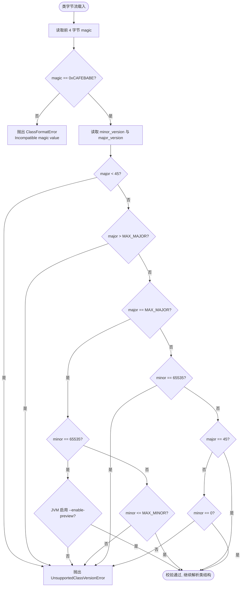
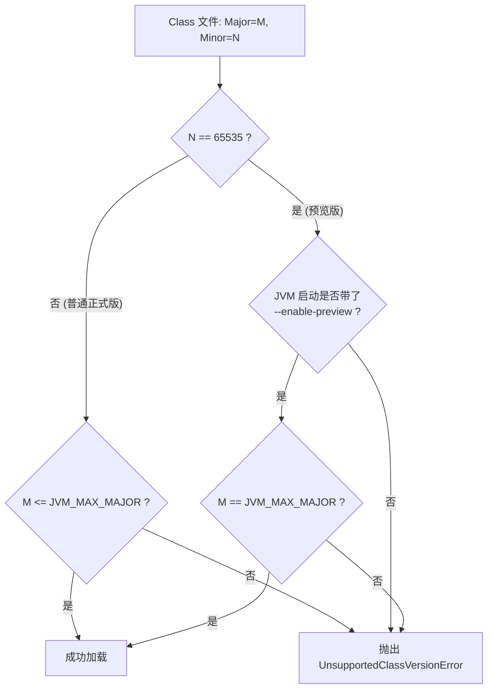

# 2.1.5.1 魔数与版本号

在 Java 技术体系中，“一次编写，到处运行”（Write Once, Run Anywhere）的物理基石是其平台无关且高度规范的 **Class 文件结构**。无论何种编程语言（如 Kotlin、Scala、Groovy 等），只要能被编译器编译成符合 JVM 规范的二进制 Class 字节流，即可在任何支持 Java 虚拟机的平台上运行。

作为 Class 二进制流的“开门两件事”，**魔数（Magic Number）** 与 **版本号（Version Numbers）** 占据了 Class 文件的前 8 个字节。它们作为 JVM 类加载子系统的第一道防线，承担着“身份认证”与“准入控制”的核心职责。本文将从底层的物理字节结构、操作系统的文件识别机理、JVM 校验源码逻辑以及 JDK 预览特性的版本演进等维度，对魔数与版本号进行深挖透彻的剖析。

---

## 一、 魔数（Magic Number）：`0xCAFEBABE` 的深层剖析

### 1. 物理字节结构与大端序解析
Java Class 文件是一种紧凑的、无缝的二进制字节流。为了节省存储空间和提高解析效率，JVM 规范没有像 XML 或 JSON 那样引入任何冗余的标签或分隔符。Class 文件中的所有数据项都是按照严格的顺序排列的，最小的基本数据单元是无符号单字节（`u1`）。

在 Class 文件的物理布局中，最开头的 4 个字节被定义为 `u4` 类型的 `magic` 字段，其存储的值恒为十六进制的 `0xCAFEBABE`。

#### 字节序（Endianness）的物理意义
JVM 规范硬性规定：**Class 文件必须采用大端字节序（Big-Endian / Network Byte Order）进行存储**。
* **大端字节序（Big-Endian）**：数据的高位字节存储在内存的低地址端，低位字节存储在内存的高地址端。这与人类阅读数字的习惯一致（从左到右）。
* **小端字节序（Little-Endian）**：数据的高位字节存储在内存的高地址端，低位字节存储在内存的低地址端。这是目前大多数主流 x86/x64 硬件架构的本地内存存储方式。

当我们在十六进制编辑器中打开一个合法的 Java Class 文件时，偏移量 `0x00000000` 到 `0x00000003` 的物理字节分布如下表所示：

| 字节偏移量 (Offset) | 物理二进制字节 (Hex) | JVM 字段定义 | 字段类型 | 物理意义 |
| :--- | :--- | :--- | :--- | :--- |
| `0x00` | `CA` | `magic[0]` | `u1` | 魔数高位第 1 字节 |
| `0x01` | `FE` | `magic[1]` | `u1` | 魔数高位第 2 字节 |
| `0x02` | `BA` | `magic[2]` | `u1` | 魔数低位第 3 字节 |
| `0x03` | `BE` | `magic[3]` | `u1` | 魔数低位第 4 字节 |

JVM 在加载字节流时，会逐字节读取。在大端序下，JVM 可以直接将读取到的四个字节拼接为 32 位无符号整型数值 `0xCAFEBABE`，而无需根据本地 CPU 架构进行复杂的位反转操作，保证了跨平台解析的高效统一。

### 2. 历史来源与 Hexspeak 趣谈
为什么偏偏选择 `CAFEBABE`？这并非随机生成的杂乱数字，而是一个充满了技术历史与“极客幽默”的词汇。

#### Hexspeak 现象
在计算机科学早期，程序员们喜欢使用十六进制字符（`A-F`、`0-9`）拼写出一些英文单词或短语，这被称为 **Hexspeak**。例如 `0xDEADBEEF`（死牛肉，常用于内存越界检测标记）、`0xBADCAFE`、以及 Java 使用的 `0xCAFEBABE`（咖啡宝贝）。

#### James Gosling 的回忆与 NeXTSTEP 的巧合
根据 Java 之父詹姆斯·高斯林（James Gosling）的公开回忆：
在开发 Java 的前身 Oak 语言期间，高斯林和他的团队需要定义一种紧凑的文件格式来存储编译后的类文件。当时他们频繁造访帕洛阿尔托（Palo Alto）当地的一家咖啡馆，并围绕“咖啡（Cafe）”这一概念产生了许多灵感。

此时，高斯林正为寻找一个能够凑成 Hexspeak 的 32 位魔数发愁。他发现 `CAFE` 占了 2 字节（`0xCAFE`），如果再找 2 字节，就能组成一个 32 位的魔数。当时 NeXTSTEP 操作系统的 Fat Binary（多架构胖二进制文件）已经在使用 `0xCAFEBABE` 作为其识别魔数。高斯林觉得这个词不仅好记，而且与他们热爱的咖啡以及团队文化有着微妙的契合，于是便将其沿用作为 Oak（后来的 Java）类文件的唯一标识符。

直到今天，Java 的官方 Logo 依然是一杯热气腾腾的咖啡，而 `0xCAFEBABE` 则成为了 Java 程序员群体中最著名的技术彩蛋之一。

---

## 二、 硬件及操作系统级别的文件格式识别机理

在深入探讨 JVM 如何校验魔数之前，我们需要先从计算机系统的广义视角来看待文件格式的识别。现代计算设备在读取、解析和运行一个文件时，主要存在两种识别机制：**扩展名对比法** 与 **内容魔数法**。

### 1. 扩展名识别法及其局限性
早期的操作系统（如 MS-DOS 及早期的 Windows）高度依赖文件后缀名（如 `.txt`、`.jpg`、`.exe`、`.class`）来判定文件类型。
* **工作逻辑**：操作系统在注册表中维护了一张后缀名与关联打开程序的映射表。当用户双击 `HelloWorld.class` 时，系统查询到 `.class` 关联的是 `java.exe`，便启动 JVM 并将文件路径传递给它。
* **安全风险（扩展名欺骗）**：文件扩展名完全是外部元数据，可以被任意修改。攻击者可以将一个包含恶意指令的可执行文件（如二进制木马 `malware.exe`）重命名为 `image.jpg`，甚至在文件名中利用 Unicode 控制字符（如 RLO，从右向左呈现字符）将 `malware.exe.jpg` 欺骗性地显示为 `malware.jpg`。
如果仅仅依赖后缀名做类型限制，一旦把恶意文件上传至某些只验证文件后缀的 Web 服务器，就极易引发安全漏洞（例如，将恶意的 Java Class 改名为 `.png` 绕过上传过滤，再通过服务器的本地路径执行）。

### 2. 魔数对比法与安全防御线
相比于不可信的文件后缀，成熟的软件系统与操作系统底层（如 Linux 中的 `file` 命令、ELF 格式加载器、JVM 类加载器）普遍采用 **魔数对比法**。
* **工作逻辑**：直接读取文件二进制流的前几个字节，与已知的文件格式签名数据库进行比对。
  * **Linux ELF 可执行文件**：前 4 字节恒为 `7F 45 4C 46`（即 `0x7F` + `ELF`）。
  * **PNG 图像文件**：前 8 字节恒为 `89 50 4E 47 0D 0A 1A 0A`。
  * **PDF 电子书**：前 4 字节恒为 `25 50 44 46`（即 `%PDF`）。
  * **Java Class 文件**：前 4 字节恒为 `CA FE BA BE`。

#### JVM 的安全“防卫线”
当 Java 类加载器通过字节流加载一个类时，由于可能存在网络传输劫持、磁盘文件损坏或恶意篡改，JVM 绝不会默认传入的二进制流是一段合法的字节码。

在类加载的第一阶段（Loading 阶段的格式检查），JVM 的类解析引擎首先提取输入流的前 4 个字节，在内部执行硬编码的 `magic == 0xCAFEBABE` 判定。如果校验失败，JVM 会立刻终止后续的常量池构建、类名提取和方法表解析，抛出 `java.lang.ClassFormatError: Incompatible magic value` 异常。

这种机制可以从物理层面防御一系列针对文件解析器的漏洞：
1. **防止格式解析器溢出**：如果加载的不是合法的 Class 文件，而是一些随机噪声数据或超长的非结构化数据，强行当做 Class 解析极易导致 JVM 的常量池解析器发生缓冲区溢出（Buffer Overflow）。
2. **阻断恶意伪装**：直接拦截并丢弃被恶意修改后缀的文件，保证虚拟机内部执行的代码都是具备规范结构的字节码。

---

## 三、 主次版本号（Minor/Major Version）在字节流中的位置

紧跟着魔数 `0xCAFEBABE` 的 4 个字节，是用于描述该 Class 文件版本信息的两个关键字段：**次版本号（Minor Version）** 与 **主版本号（Major Version）**。

### 1. 物理位置与位宽分布
在 JVM Class 文件规范中：
* **`minor_version`（次版本号）**：占据偏移量 `0x04 - 0x05` 的 2 字节（`u2` 类型）。
* **`major_version`（主版本号）**：占据偏移量 `0x06 - 0x07` 的 2 字节（`u2` 类型）。

我们可以用以下 Mermaid 图展示 Class 文件最开头 8 字节的物理排布关系：

```mermaid
graph TD
    subgraph Class File Header("First 8 Bytes")
        magic["magic<br>Offset: 0x00 - 0x03<br>Size: 4 Bytes<br>Value: 0xCAFEBABE"]
        minor["minor_version<br>Offset: 0x04 - 0x05<br>Size: 2 Bytes<br>e.g. 0x0000"]
        major["major_version<br>Offset: 0x06 - 0x07<br>Size: 2 Bytes<br>e.g. 0x0034"]
    end
    style magic fill:#f9f,stroke:#333,stroke-width:2px
    style minor fill:#ccf,stroke:#333,stroke-width:2px
    style major fill:#cfc,stroke:#333,stroke-width:2px
```

### 2. 大端序转换实例
假设我们在十六进制文本查看器中得到一个 Class 文件的头部前 8 字节如下：
`CA FE BA BE 00 00 00 3D`

我们来逐步还原它的物理含义：
1. **`CA FE BA BE`**（第 0-3 字节）：解析为魔数，通过校验，确认为合法 Java Class 文件。
2. **`00 00`**（第 4-5 字节）：读取 `minor_version` 字节，转换为十进制无符号 16 位整型，结果为 `0`。
3. **`00 3D`**（第 6-7 字节）：读取 `major_version` 字节，转为十进制：
   $$0 \times 16^3 + 0 \times 16^2 + 3 \times 16^1 + 13 \times 16^0 = 48 + 13 = 61$$
   结果为主版本号 `61`。通过后文的对应关系表可知，该 Class 文件是由 **JDK 17** 编译生成的。

---

## 四、 JDK 历史版本与 Class 版本号数值的完全对应表

Java 自 1995 年诞生以来，经历了漫长的迭代。每一个主要的 JDK 大版本发布，都会伴随着 Class 文件格式的微调或重大扩展（例如泛型、动态指令、模块化、密封类等）。为了对这些结构做出正确解析，JVM 会在编译时为 Class 写入对应的 Major Version。

以下是自 JDK 1.1 起，直到最新预览的 JDK 25，Class 文件版本号数值的完整、严谨的完全对应表：

| JDK 版本 | 主版本号 (Major Version) <br>十进制 | 主版本号 (Major Version) <br>十六进制 | 次版本号 (Minor Version) <br>十进制 | Class 头部前 8 字节物理示例 <br>(Hex 格式) | 关键特性变更与备注 |
| :--- | :--- | :--- | :--- | :--- | :--- |
| **JDK 1.1** | 45 | `0x002D` | 3 (或 0) | `CA FE BA BE 00 03 00 2D` | 支持 45.0 到 45.3，也是唯一在正式发布中次版本号不为0的版本。 |
| **JDK 1.2** | 46 | `0x002E` | 0 | `CA FE BA BE 00 00 00 2E` | 引入了 Java 2 平台及集合框架。 |
| **JDK 1.3** | 47 | `0x002F` | 0 | `CA FE BA BE 00 00 00 2F` | 修正 HotSpot 引擎，成为默认虚拟机。 |
| **JDK 1.4** | 48 | `0x0030` | 0 | `CA FE BA BE 00 00 00 30` | 引入 assert 关键字、NIO 等。 |
| **JDK 5.0** | 49 | `0x0031` | 0 | `CA FE BA BE 00 00 00 31` | 引入泛型、枚举、注解、自动装箱。 |
| **JDK 6** | 50 | `0x0032` | 0 | `CA FE BA BE 00 00 00 32` | 引入 StackMapTable 属性，进行静态字节码验证。 |
| **JDK 7** | 51 | `0x0033` | 0 | `CA FE BA BE 00 00 00 33` | 引入 `invokedynamic` 指令支持动态语言。 |
| **JDK 8** | 52 | `0x0034` | 0 | `CA FE BA BE 00 00 00 34` | 引入 Lambda 表达式、默认方法、方法引用。 |
| **JDK 9** | 53 | `0x0035` | 0 | `CA FE BA BE 00 00 00 35` | 模块化系统（Project Jigsaw）。 |
| **JDK 10** | 54 | `0x0036` | 0 | `CA FE BA BE 00 00 00 36` | 局部变量类型推断（var）。 |
| **JDK 11** | 55 | `0x0037` | 0 | `CA FE BA BE 00 00 00 37` | 长期支持版（LTS），移除 Java EE 模块。 |
| **JDK 12** | 56 | `0x0038` | 0 (或 65535) | `CA FE BA BE 00 00 00 38` | 开始引入预览版机制（启用预览时 Minor=65535）。 |
| **JDK 13** | 57 | `0x0039` | 0 (或 65535) | `CA FE BA BE 00 00 00 39` | 预览 Text Blocks 等特性。 |
| **JDK 14** | 58 | `0x003A` | 0 (或 65535) | `CA FE BA BE 00 00 00 3A` | 预览 Switch 表达式（正式版在 14）。 |
| **JDK 15** | 59 | `0x003B` | 0 (或 65535) | `CA FE BA BE 00 00 00 3B` | 密封类（Sealed Classes）预览、隐藏类。 |
| **JDK 16** | 60 | `0x003C` | 0 (或 65535) | `CA FE BA BE 00 00 00 3C` | Record 记录类型正式化。 |
| **JDK 17** | 61 | `0x003D` | 0 (或 65535) | `CA FE BA BE 00 00 00 3D` | 长期支持版（LTS）。 |
| **JDK 18** | 62 | `0x003E` | 0 (或 65535) | `CA FE BA BE 00 00 00 3E` | 默认 UTF-8 字符集。 |
| **JDK 19** | 63 | `0x003F` | 0 (或 65535) | `CA FE BA BE 00 00 00 3F` | 虚拟线程（Virtual Threads）首个预览版。 |
| **JDK 20** | 64 | `0x0040` | 0 (或 65535) | `CA FE BA BE 00 00 00 40` | 虚拟线程第二版预览。 |
| **JDK 21** | 65 | `0x0041` | 0 (或 65535) | `CA FE BA BE 00 00 00 41` | 长期支持版（LTS），虚拟线程、模式匹配正式化。 |
| **JDK 22** | 66 | `0x0042` | 0 (或 65535) | `CA FE BA BE 00 00 00 42` | 预览外部函数和内存 API。 |
| **JDK 23** | 67 | `0x0043` | 0 (或 65535) | `CA FE BA BE 00 00 00 43` | 预览 Markdown 注释、隐式声明类。 |
| **JDK 24** | 68 | `0x0044` | 0 (或 65535) | `CA FE BA BE 00 00 00 44` | - |
| **JDK 25** | 69 | `0x0045` | 0 (或 65535) | `CA FE BA BE 00 00 00 45` | 长期支持版（LTS - 预期）。 |

> [!NOTE]
> 从表格可以看出，JDK 1.2 以后，Java 的主版本号呈现非常直观的线性递增关系：
> $$\text{Major Version} = \text{JDK Version} + 44 \quad (\text{对于 } \text{JDK} \ge 1.2)$$
> 例如，JDK 17 对应的主版本号为 $17 + 44 = 61$。

---

## 五、 JVM 虚拟机的前向兼容与拒绝机制

虚拟机在执行类加载时，其最基本的设计哲学决定了其对版本的态度。

### 1. 向下兼容与前向拒绝的逻辑边界
* **向下兼容（Downward Compatibility）**：优秀的系统设计必须能运行历史资产。JVM 保证高版本的 JRE 可以加载低版本编译出的 Class。例如，运行在服务器上的 Java 21 虚拟机，可以顺畅地运行你在 2004 年用 JDK 1.4 编译出的第三方 jar 包。
* **前向拒绝（Forward Incompatibility / Forward Reject）**：旧版本的虚拟机绝不容许加载并解析新版本的 Class。因为高版本的 Class 包含低版本虚拟机根本无法识别的字节码指令、常量池结构标签（Tag）或新属性。如果不加控制强行运行，会在类解析或运行过程中发生内存崩溃或严重的非预期运行时错误。

### 2. java.lang.UnsupportedClassVersionError 报错剖析
当发生前向版本冲突时，虚拟机抛出 `java.lang.UnsupportedClassVersionError`。
该错误继承自 `java.lang.LinkageError`（是一个 Error，而非 Exception），意味着无法完成类与运行环境之间的链接过程。

我们常在生产中见到以下堆栈信息：
```text
java.lang.UnsupportedClassVersionError: com/example/App : Unsupported major.minor version 61.0
```
或在较新版本的 JDK 中：
```text
java.lang.UnsupportedClassVersionError: com/example/App has been compiled by a more recent version of the Java Runtime (class file version 61.0), this version of the Java Runtime only recognizes class file versions up to 52.0
```
这句极富解释性的日志明确指出了冲突根源：
* 目标 Class 文件是在 **JDK 17（major 61）** 编译的。
* 当前用于运行程序的 JRE 却是一个 **JDK 8（major 52）** 环境，它最多只认到 `52.0`。

### 3. HotSpot JVM 内部的校验逻辑模拟
在 OpenJDK HotSpot 虚拟机的底层源码中，类解析任务由 `ClassFileParser` 完成。以下是用 C++ 伪代码深度模拟 JVM 对魔数和版本号进行联合校验的逻辑：

```cpp
// 模拟 HotSpot 中的类解析核心方法
void ClassFileParser::parse_class_file_header(ClassFileStream* stream) {
    // 1. 读取 4 字节的魔数
    u4 magic = stream->get_u4_fast();
    if (magic != 0xCAFEBABE) {
        // 如果魔数不匹配，立即抛出 ClassFormatError 并终止加载
        throw_class_format_error("Incompatible magic value 0x%X in class file", magic);
    }

    // 2. 读取 2 字节的次版本号与 2 字节的主版本号
    u2 minor_version = stream->get_u2_fast();
    u2 major_version = stream->get_u2_fast();

    // 3. 校验版本是否在当前虚拟机支持的合法区间内
    if (!is_supported_version(major_version, minor_version)) {
        // 如果版本号不被支持，抛出 UnsupportedClassVersionError
        throw_unsupported_class_version_error(major_version, minor_version);
    }
}

// 模拟 JVM 内部对版本号区间及预览版判定的逻辑
bool ClassFileParser::is_supported_version(u2 major, u2 minor) {
    // 获取当前 JVM 的版本边界限制（由编译该 JVM 的 JDK 版本决定）
    u2 max_supported_major = JVM_MAX_SUPPORTED_VERSION;      // 例如 JDK 17 JVM 中此值为 61
    u2 max_supported_minor = JVM_MAX_SUPPORTED_MINOR_VERSION;// 对于非预览正式版，通常为 0
    u2 min_supported_major = JVM_MIN_SUPPORTED_VERSION;      // 一般是 45 (JDK 1.1)

    // 边界条件判断 1：低于 JVM 支持的下限版本直接拒绝
    if (major < min_supported_major) {
        return false;
    }

    // 边界条件判断 2：如果主版本号已经大于当前虚拟机支持的最大主版本号，亮红牌拒绝
    if (major > max_supported_major) {
        return false;
    }

    // 边界条件判断 3：主版本号正好等于当前虚拟机支持的最大版本号
    if (major == max_supported_major) {
        // 判定是否属于 JDK 12 开始的预览特性类文件 (次版本号为 65535)
        if (minor == 65535) {
            // JVM 启动参数中必须显式设置了 --enable-preview 参数才允许加载
            return Arguments::enable_preview();
        }
        // 如果不是预览版本，次版本号必须小于等于当前 JVM 支持的最大次版本号（通常为 0）
        return minor <= max_supported_minor;
    }

    // 边界条件判断 4：主版本号小于当前虚拟机支持的最大版本号（这是一个旧版 Class）
    // 按照 JVM 规范，旧版本 Class 绝对不允许带有预览属性 (即不能是 65535)
    if (minor == 65535) {
        return false;
    }

    // 对于历史旧版本 Class，如果是 JDK 1.1 (major == 45)，其余的次版本号（如 3）也是合法的
    if (major == 45) {
        return true; 
    }

    // 在 JDK 1.2 至 JDK 11 的旧版 Class 文件中，正式版的次版本号必须全部为 0
    return minor == 0;
}
```

我们可以将上述 C++ 逻辑抽象为决策树。下图展示了当 Class 文件进入 JVM 加载器时的完整判定流程：



### 4. 为什么要坚决前向拒绝？
许多开发者常会产生疑问：“如果我高版本 Class 中只写了普通的 System.out.println()，不包含任何新特性，难道旧 JVM 就不能兼容运行吗？”

事实上，JVM 必须在此处执行“一刀切”的前向拒绝，原因在于：
1. **常量池项（Constant Pool Tag）的物理格式不兼容**：
   在 Class 文件中，所有的字面量、方法名、类名都放在常量池中，每个常量池项都以一个 1 字节的标签（Tag）开头。
   * JDK 7 引入了 `CONSTANT_MethodHandle_info` (Tag 15) 等。
   * JDK 11 引入了 `CONSTANT_Dynamic` (Tag 17) 等。
   如果低版本 JVM 读入这些高版本 Class，其常量池解析引擎在遇到不支持的 Tag 时会瞬间迷失在字节流中，因为不知道这组常量的确切位宽，这直接导致后续的字节流偏移量全部错位，引起系统级 Crash。
2. **字节码指令集的变动**：
   例如，JDK 7 引入了 `invokedynamic` (字节码值 `0xBA`) 指令。若 JDK 6 JVM 执行到该指令，虚拟机的解释器或 JIT 编译器在转换底层汇编时根本找不到该指令对应的执行逻辑，属于致命故障。
3. **数据结构的语义扩展**：
   高版本 Class 的类信息、字段表、方法表可能带有新的属性（Attributes），旧虚拟机由于不支持这些属性，可能会直接忽略它们，进而导致在运行时破坏了代码的封装性与安全性。

---

## 六、 JDK 12 预览机制下版本号与次版本号的改变

随着 Java 发布周期的加快（改为每半年发布一个大版本），如果按照以前的流程：新特性必须彻底成熟才能进入标准 JDK。这会导致一些重大语法方案无法尽早经受实战打磨。

为了打破僵局，JDK 12 引入了 **预览特性机制（Preview Features）**。该机制允许在标准 JDK 中内置一部分还在测试中的语法与 API（如早期的 Switch Expressions、Records、Virtual Threads 等）。而这一机制的核心支撑，就是 Class 文件中**次版本号**的“复活”。

### 1. 哨兵值：`65535` (即 `0xFFFF`)
在非预览状态下，从 JDK 1.2 起所有的正式编译结果中次版本号均为 `0`。

当开发者在编译时，显式加上 `--enable-preview` 参数后，编译器生成的 Class 文件结构会发生显著变化：
* **主版本号（Major Version）**：依然是当前 JDK 的主版本号。
* **次版本号（Minor Version）**：会被强制写入无符号 16 位整型的最大值：**`65535`**（二进制为 `11111111 11111111`，十六进制为 `0xFFFF`）。

#### 实例解析
如果你在 JDK 17 环境下，启用预览特性编译一个类：
```bash
javac --enable-preview --release 17 MyPreviewClass.java
```
编译生成的 `MyPreviewClass.class` 文件前 8 个字节将是：
`CA FE BA BE FF FF 00 3D`
* 魔数：`CA FE BA BE`
* 次版本号：`FF FF`（即 65535）
* 主版本号：`00 3D`（即 61）

### 2. JVM 对预览特性的准入判定树
为什么要把预览特性的次版本号设为 65535？这是为了在加载时设置一堵极为严格的安全隔离墙，防止开发者误将测试中的、可能会在未来被修改或废弃的“预览特性 Class”直接部署到生产环境。

JVM 的准入条件遵循以下两条死铁律：
1. **启动参数硬约束**：JVM 启动命令行中必须包含 `--enable-preview` 选项。如果没有该选项，当 JVM 读取到次版本号为 `65535` 的 Class 文件时，将无视主版本号是否符合，**直接抛出 UnsupportedClassVersionError 错误**。
2. **同版本绝对绑定约束**：即使 JVM 启动时开启了 `--enable-preview`，它也**只允许加载主版本号与自己当前 JVM 主版本号完全相等**的预览 Class。
   * 例如：JDK 21 的 JVM 启动时带有 `--enable-preview` 开关，它能加载主版本号为 `65` (JDK 21) 且次版本号为 `65535` 的 Class 文件。
   * 但是，它**绝对不被允许加载**主版本号为 `61` (JDK 17) 且次版本号为 `65535` 的 Class 文件！

这一巧妙的机制阻止了不同 JDK 版本之间预览版特性的混用，保护了生产环境的稳定性。下图形象地体现了这一过滤网的作用：



---

## 七、 实战分析与工具链操作

在开发、运维及架构设计中，因 Class 版本冲突导致的应用无法正常启动是极为普遍的现象。下面将介绍如何通过系统底层工具快速定位和妥善解决此类版本问题。

### 1. 使用命令行分析 Class 版本
不需要安装任何复杂的二进制阅读器，JDK 自身和主流操作系统已经为我们提供了轻量级的工具。

#### 方法 A：使用 `javap` 命令行（最标准）
使用 JDK 自带的字节码反编译器 `javap` 的 `-v` (verbose) 参数，可以快速解析 Class 的元信息：
```bash
javap -v MyClass.class
```
在输出结果的前几行，你可以清晰地找到对应的版本字段：
```text
Classfile /Users/lizhiyang/Desktop/MyClass.class
  Last modified 2026-6-15; size 450 bytes
  SHA-256 checksum 8df3c9b...
  Compiled from "MyClass.java"
public class com.example.MyClass
  minor version: 0
  major version: 61
  flags: (0x0021) ACC_PUBLIC, ACC_SUPER
...
```
此时通过 `major version: 61`，我们就能直观知道该类文件必须在不低于 JDK 17 的环境中运行。

#### 方法 B：使用 macOS / Linux 系统命令直接读取
如果目标服务器上没有安装 JDK 环境，无法使用 `javap`，我们可以通过系统底层的十六进制显示工具直接窥探其前 8 个字节。

* **在 macOS / Linux 上使用 `xxd` 命令**：
  ```bash
  xxd -l 8 MyClass.class
  ```
  输入后，终端会打印前 8 个字节的十六进制：
  ```text
  00000000: cafebabe 0000 003d                      ...=
  ```
  物理字节序列为 `cafebabe` (魔数) + `0000` (次版本) + `003d` (主版本)。

* **使用 `od` 命令**：
  ```bash
  od -t x1 -N 8 MyClass.class
  ```
  输出：
  ```text
  0000000 ca fe ba be 00 00 00 3d
  ```

### 2. 深入探讨 `javac` 编译参数：`-source`、`-target` 与 `--release`
为了避免版本不兼容，我们经常需要在一台高版本 JDK（如 JDK 17）的开发机上编译出能够在低版本 JVM（如 JDK 8）上正常运行的字节码。

历史上，Java 提供了 `-source`（源文件语法级别）和 `-target`（目标 Class 版本）参数：
```bash
# 在 JDK 17 环境下编译，目标运行环境为 JDK 8
javac -source 8 -target 8 MyClass.java
```
这种编译方式虽然能使输出的 Class 文件的 `major_version` 变为 `52`（JDK 8），但在实际生产中却隐藏着巨大的 **API 跨版本调用灾难**。

#### 旧式编译的 API 错配灾难（NoSuchMethodError）
假设你在 `MyClass.java` 中调用了 JDK 9 引入的新 API：`java.util.List.of()`。
当你运行 `javac -source 8 -target 8 MyClass.java` 时：
1. 编译器会将 Class 版本号写入为 `52` (JDK 8)。
2. 但编译过程中，编译器默认链接的是当前 JDK 17 中的标准类库（`rt.jar` / `modules`），其中确实存在 `List.of()` 方法，因此**编译顺利通过**。
3. 当你将这个 jar 包部署到只有 JDK 8 运行环境的服务器上时：
   * 8 字节的版本检查通过了（JVM 发现是 52）。
   * 但当运行到 `List.of()` 时，JVM 无法在低版本的 `List` 类中找到 `of()` 方法，轰然抛出致命的运行时异常：
     `java.lang.NoSuchMethodError: java.util.List.of(...)Ljava/util/List;`

#### 终极解决方案：`--release` 参数（JDK 9+）
为了彻底根治以上 API 兼容性灾难，从 JDK 9 开始，引入了 **`--release`** 参数，其可以完全替代 `-source` 与 `-target` 的组合：
```bash
# 在 JDK 17 环境下安全编译目标版本为 JDK 8
javac --release 8 MyClass.java
```
它的物理执行原理如下：
1. **自动设置版本**：隐式地将 `-source` 和 `-target` 设为 `8`，确保 Class 文件的主版本号为 `52`。
2. **重定向签名连接库（核心）**：编译器将不会连接当前 JDK 17 下的完整 runtime，而是通过读取 JDK 内部自带 of API 签名描述映射库（存放于 JDK 目录下的 `lib/ct.sym` 中），严格将当前代码可调用的类与方法限制在 JDK 8 的定义范围内。
此时，若代码中调用了高版本独有的 `List.of()`，编译期会直接抛出语法错误：
`error: cannot find symbol: method of(...)`
从而在开发期就将不兼容的潜在漏洞彻底抹杀，确保了生成的 Class 代码在低版本 JRE 上能够真正稳定运行。

---

## 八、 总结

在 JVM 庞大的虚拟机规范中，魔数与版本号就像两名坚实的卫兵，驻守在二进制字节流的最前线。
* **魔数（0xCAFEBABE）** 确保了输入源在格式上的合法性与完整性，构筑了拦截恶意文件欺骗的第一道防火墙。
* **版本号（Major & Minor Version）** 实现了精确的版本兼容控制。通过向下兼容与前向拒绝的严格执行，保障了 Java 虚拟机在运行过程中不会因无法识别的新语法特征或常量池标签发生致命崩溃。
* **预览机制（Preview Features）的 65535 哨兵设计**，则展示了 Java 语言在保证向后兼容这一庄严承诺的前提下，追求现代化迭代与工程稳定性的绝佳平衡。

理解这 8 个字节的物理与逻辑机制，是每一位深入探索 JVM 底层运行机理的 Java 架构师必不可少的基本功。
