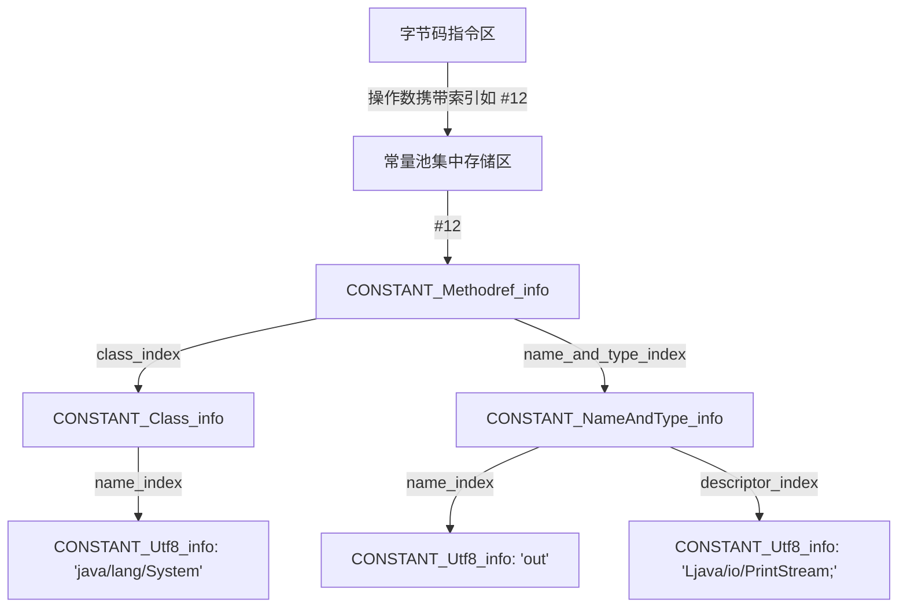
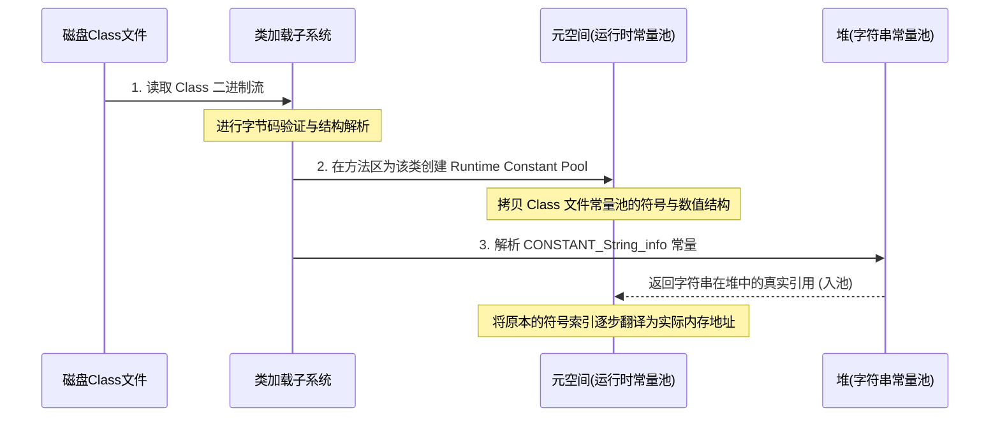
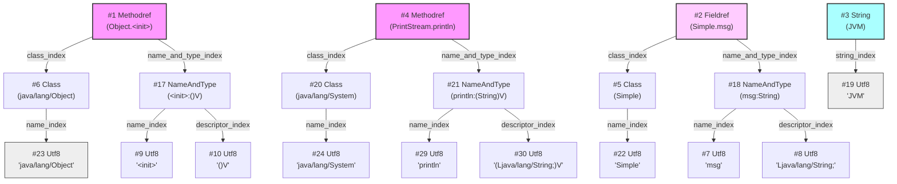
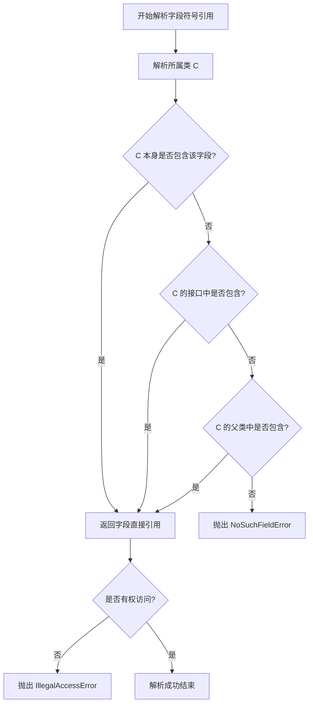

# 2.1.5.2 常量池

在 Java 虚拟机（JVM）的规范设计中，Class 文件是一种结构紧凑、定义严密的二进制流。而在 Class 文件的内部结构中，**常量池（Constant Pool）**无疑是其最核心的“数据仓库”与“信息中枢”。它不仅集中存储了类定义中的所有字面量，还以符号引用的形式构建起类与外部世界（其他类、字段、方法）沟通的桥梁。

本文将以 JVM 规范为基石，深入解剖 Class 文件常量池的物理结构、17 种常量项的字节级布局、字面量与符号引用的演变规律、手撕十六进制字节码寻址网络，以及符号引用向直接引用转化的底层机理。

---

## 1. 常量池在 Class 文件中的地位与设计哲学

在开始分析具体字节结构之前，我们需要厘清一个根本性问题：**为什么 Class 文件需要设计一个常量池？**

### 1.1 静态解耦与集中式索引存储
在传统的编译型语言（如 C/C++）生成的二进制目标文件或可执行文件中，符号和地址往往在链接期被物理重写为绝对偏移量或相对地址。这种方式虽然运行效率极高，但牺牲了跨平台性与动态扩展性。

Java 语言以“一次编写，到处运行”（Write Once, Run Anywhere）和“动态加载”为核心设计目标。为了实现这一点，Java 编译器在编译期不能确定类、字段和方法在内存中的实际物理地址。因此，Class 文件必须采用一种**“符号化描述”**的机制来引用外部实体。

如果将这些符号化描述（如类名、方法名、参数类型等描述符）直接嵌入到每一条字节码指令的操作数中，会导致两大严重弊端：
1.  **空间冗余极其严重**：同一个方法名或类名在字节码中可能被多次调用，若每次都存储完整字符串，Class 文件的体积将呈指数级增长。
2.  **字节码指令长度不稳定**：字节码指令的操作数如果包含变长字符串，将导致指令解码器设计极其复杂，破坏了 JVM 字节码“紧凑、规整”的设计初衷。

为此，JVM 设计者采用了**“集中式索引存储”**的方案：将所有的字符串、类名、方法名、字段名以及数值字面量集中提取出来，统一放置在一个公共区域，这便是**常量池**。而字节码指令只需在其操作数中携带一个指向常量池的固定长度索引（通常为 2 字节的 `u2` 类型），即可在运行时通过寻址定位到具体的符号或字面量。



通过这种设计，Class 文件实现了**静态解耦与极高的空间利用率**，为 JVM 的动态链接和安全验证奠定了坚实的物理基础。

### 1.2 常量池与运行时数据区的演进与桥梁作用
必须明确区分 Class 文件中的**静态常量池（Constant Pool Table）**与 JVM 内存区域中的**运行时常量池（Runtime Constant Pool）**及**字符串常量池（String Table）**：

*   **静态常量池**：存在于磁盘上的 Class 文件中，是纯粹的静态二进制字节流，扮演“冷存储”角色。
*   **运行时常量池**：是 JVM 在方法区（Method Area，在 JDK 8 及以后的 HotSpot 虚拟机中物理对应为元空间 Metaspace）中为每个已加载的类分配的内存结构。当类被加载（Loading）到 JVM 中后，Class 文件中的静态常量池将被读入内存，并转化为运行时常量池。它具有动态性，运行期间可以通过代码（如反射或动态代理）向其中添加新的常量。
*   **字符串常量池（String Table）**：在 HotSpot 虚拟机中，全局仅有一份，物理位于堆（Heap）中。运行时常量池中的某些字符串符号引用，在解析时会指向字符串常量池中的具体 String 对象。

静态常量池是构建运行时常量池的图纸，而运行时常量池则是 JVM 解释执行字节码、进行动态链接时的直接信息源。

---

## 2. 常量池计数器（constant_pool_count）与 0 号常量的设计奥秘

在 Class 文件的物理结构中，紧跟在魔数（Magic Number, `u4`）与版本号（Minor/Major Version, `u2/u2`）之后的就是**常量池计数器（constant_pool_count）**。

### 2.1 constant_pool_count 的物理表达与限制
`constant_pool_count` 是一个占 2 字节的无符号整数（`u2`）。因此，其最大理论值为 $2^{16} - 1 = 65535$。这意味着一个 Class 文件的常量池中最多只能容纳 65534 个常量项（实际由于 Long/Double 占双槽，可用项数会更少）。

### 2.2 1-based 索引设计意图：为什么从 1 开始？
与计算机科学中常见的“以 0 为起始索引（0-based）”的习惯不同，JVM 常量池的索引是从 **1** 开始计数的（1-based）。例如，若 `constant_pool_count` 的值为 `29`（十进制），则代表常量池中实际占有 28 个常量项，它们的索引范围是 `1` 到 `28`。

这种非同寻常的设计有着明确的意图：**留出 0 号索引作为特殊占位符**。

在 Class 文件的某些属性或指令的操作数中，如果需要表达“不引用任何一个常量池项目”或者“无/空（NULL）”的含义，就可以将该引用的索引值设为 `0`。

#### 0 号常量的实际应用场景：
1.  **父类索引（super_class）**：在 Class 文件的结构中，`super_class` 也是一个 `u2` 类型的值，指向常量池中的一个 `CONSTANT_Class_info` 常量。对于除了 `java.lang.Object` 之外的所有 Java 类，`super_class` 的值都必须是一个合法的常量池索引（即大于等于 1）。但是，对于 `java.lang.Object` 类自身，它没有父类，因此其 Class 文件中的 `super_class` 索引值就被物理写入为 `0`。
2.  **方法抛出异常表、局部变量表等属性**：在各种 Class 属性表中，若某项指标指向常量池的索引为 `0`，则代表该指标为空。

通过将 0 号索引预留为特殊用途，JVM 规范避免了为表示“无”而引入额外的标志位，保持了数据结构的紧凑和优雅。

### 2.3 Long 与 Double 类型的“Slot 占用”设计
在常量池的物理存储中，有一个历史遗留的、甚至被 JVM 官方设计者称为“倒霉的设计决定”（unfortunate decision）的机制：**`CONSTANT_Long_info` 和 `CONSTANT_Double_info` 这两个 64 位宽的常量项，在常量池中会占用两个索引槽位（Slots）**。

这意味着，如果在常量池索引为 `n` 的位置存储了一个 `CONSTANT_Long_info` 常量，那么下一个常量的索引将直接跳跃到 `n+2`。而索引 `n+1` 则是无效的、不可访问的，JVM 规范禁止任何指令或常量去引用这个“被跳过”的索引。

这直接导致了一个结果：**常量池中实际存在的常量项物理个数，往往小于 `constant_pool_count - 1`**。

#### 为什么会有这种设计？
在 JVM 诞生初期（20世纪90年代中期），底层的处理器大多是 32 位架构。为了简化虚拟机在 32 位计算机上的局部变量表、栈以及常量池的寻址和操作数栈对齐设计，设计者将基本的数据单位定为 32 位（即一个 Slot）。Long 和 Double 作为 64 位数据，为了统一对齐规则，被强制分配为两个连续的 Slot 空间。

虽然在现代 64 位处理器和优化后的 JVM 内部，这种物理连续占用两个索引的设计已经完全没有必要，但为了保持 Class 文件的向后兼容性，这一规范被永久地保留了下来。

---

## 3. JVM 规范中 17 种常量项的 Tag 与物理字节结构全景解析

常量池是由一系列变长的常量项（Constant Pool Items）组成的。在 JVM 规范中，目前共定义了 **17 种** 常量项类型。

每个常量项的物理字节流首部都必须是 **1 字节的无符号整数（`u1`）**，被称为 **Tag（标志）**。JVM 在解析常量池时，首先读取这 1 字节的 Tag，以识别该常量的类型，进而确定该常量项后续的物理字节长度和字段结构。

### 3.1 17 种常量项一览表

| 常量项名称 | Tag 值 | 描述 | 引入版本 |
| :--- | :--- | :--- | :--- |
| `CONSTANT_Utf8_info` | 1 | Modified UTF-8 编码的字符串 | JDK 1.0.2 |
| `CONSTANT_Integer_info` | 3 | 32 位整数字面量 | JDK 1.0.2 |
| `CONSTANT_Float_info` | 4 | 32 位单精度浮点数字面量 | JDK 1.0.2 |
| `CONSTANT_Long_info` | 5 | 64 位长整数字面量（占两个 Slot） | JDK 1.0.2 |
| `CONSTANT_Double_info` | 6 | 64 位双精度浮点数字面量（占两个 Slot） | JDK 1.0.2 |
| `CONSTANT_Class_info` | 7 | 类或接口的符号引用 | JDK 1.0.2 |
| `CONSTANT_String_info` | 8 | 字符串类型的字面量（指向 Utf8） | JDK 1.0.2 |
| `CONSTANT_Fieldref_info` | 9 | 字段的符号引用 | JDK 1.0.2 |
| `CONSTANT_Methodref_info` | 10 | 类中方法的符号引用 | JDK 1.0.2 |
| `CONSTANT_InterfaceMethodref_info` | 11 | 接口中方法的符号引用 | JDK 1.0.2 |
| `CONSTANT_NameAndType_info` | 12 | 字段或方法的名称与类型描述符 | JDK 1.0.2 |
| `CONSTANT_MethodHandle_info` | 15 | 表示方法句柄（用于支持 invokedynamic） | JDK 7 |
| `CONSTANT_MethodType_info` | 16 | 表示方法类型（用于支持 invokedynamic） | JDK 7 |
| `CONSTANT_Dynamic_info` | 17 | 动态计算的常量（用于支持 lazy loading） | JDK 11 |
| `CONSTANT_InvokeDynamic_info` | 18 | 动态方法调用点（用于支持 invokedynamic） | JDK 7 |
| `CONSTANT_Module_info` | 19 | 表示模块的符号引用 | JDK 9 |
| `CONSTANT_Package_info` | 20 | 表示包的符号引用 | JDK 9 |

---

### 3.2 17 种常量项的物理字节布局与字段剖析

#### 1. CONSTANT_Utf8_info (Tag: 1)
这是整个常量池中最关键的“叶子节点”。绝大多数其他常量项（如类名、方法名、描述符）最终都会直接或间接地指向 `CONSTANT_Utf8_info` 来获取实际的字符数据。

##### 物理字节结构：
| 字节类型 | 字段名 | 数量 | 描述 |
| :--- | :--- | :--- | :--- |
| `u1` | `tag` | 1 | 物理固定值：`0x01` |
| `u2` | `length` | 1 | 指明后续字节数组的长度（单位：字节） |
| `u1` | `bytes` | `length` | 存储具体字符数据的字节数组（使用 Modified UTF-8 编码） |

##### Modified UTF-8 编码细节与边界限制：
JVM 规范中定义的 Modified UTF-8 与标准的 UTF-8 编码存在两个极其显著的差异：
1.  **Null 字符（`\u0000`）的编码**：标准 UTF-8 中，Null 字符编码为单字节 `0x00`。而在 Modified UTF-8 中，为了防止在 C/C++ 编写的 JVM 核心代码中被错误地识别为 C 风格字符串的截止符 `\0`，Null 字符被强制编码为双字节的 `0xC0 0x80`。
2.  **补充字符（Supplementary Characters）的编码**：对于 Unicode 码点超出基本多语言平面（BMP，即码点大于 `U+FFFF`，如大部分 Emoji 和生僻字）的字符，标准 UTF-8 使用 4 字节编码。而 Modified UTF-8 则是先将其拆分为两个 Surrogate Pairs（代理对），然后对每个代理对分别使用 3 字节的 UTF-8 进行编码，总共耗费 6 字节。
3.  **最大长度限制**：由于 `length` 字段是一个 `u2` 类型的无符号整数，其最大值为 `65535`。因此，Java 中**任何类名、方法名、描述符，以及代码中声明的单条字符串字面量的最大字节长度都不能超过 65535 字节**。如果硬编码超长字符串，Java 编译器会在编译期直接报错：`constant string too long`。

---

#### 2. CONSTANT_Integer_info (Tag: 3)
存储 4 字节的整数字面量。

##### 物理字节结构：
| 字节类型 | 字段名 | 数量 | 描述 |
| :--- | :--- | :--- | :--- |
| `u1` | `tag` | 1 | 物理固定值：`0x03` |
| `u4` | `bytes` | 1 | 大端序（Big-Endian）存储的 32 位有符号整数值 |

---

#### 3. CONSTANT_Float_info (Tag: 4)
存储 4 字节的单精度浮点数字面量。

##### 物理字节结构：
| 字节类型 | 字段名 | 数量 | 描述 |
| :--- | :--- | :--- | :--- |
| `u1` | `tag` | 1 | 物理固定值：`0x04` |
| `u4` | `bytes` | 1 | 按照 IEEE 754 单精度浮点数标准编码的 32 位值 |

> [!NOTE]
> 对于 `NaN`（非数）、正无穷大（Positive Infinity）和负无穷大（Negative Infinity），其对应的 IEEE 754 物理二进制编码会被原封不动地存储在此 4 字节中。

---

#### 4. CONSTANT_Long_info (Tag: 5)
存储 8 字节的长整数字面量，占用常量池中 2 个索引槽位。

##### 物理字节结构：
| 字节类型 | 字段名 | 数量 | 描述 |
| :--- | :--- | :--- | :--- |
| `u1` | `tag` | 1 | 物理固定值：`0x05` |
| `u4` | `high_bytes` | 1 | 长整型值的高 32 位字节（大端序） |
| `u4` | `low_bytes` | 1 | 长整型值的低 32 位字节（大端序） |

---

#### 5. CONSTANT_Double_info (Tag: 6)
存储 8 字节的双精度浮点数字面量，同样占用常量池中 2 个索引槽位。

##### 物理字节结构：
| 字节类型 | 字段名 | 数量 | 描述 |
| :--- | :--- | :--- | :--- |
| `u1` | `tag` | 1 | 物理固定值：`0x06` |
| `u4` | `high_bytes` | 1 | 按照 IEEE 754 标准编码的高 32 位字节 |
| `u4` | `low_bytes` | 1 | 按照 IEEE 754 标准编码的低 32 位字节 |

---

#### 6. CONSTANT_Class_info (Tag: 7)
表示一个类或接口的符号引用。

##### 物理字节结构：
| 字节类型 | 字段名 | 数量 | 描述 |
| :--- | :--- | :--- | :--- |
| `u1` | `tag` | 1 | 物理固定值：`0x07` |
| `u2` | `name_index` | 1 | 指向常量池中一个 `CONSTANT_Utf8_info` 项的索引，表示该类或接口的全限定名 |

> [!IMPORTANT]
> 此处指向的类全限定名，必须使用正斜杠 `/` 代替 Java 源代码中的点号 `.`。例如，`java.lang.String` 在常量池中的物理存储格式必须是 `java/lang/String`。

---

#### 7. CONSTANT_String_info (Tag: 8)
表示 String 类型的对象字面量。

##### 物理字节结构：
| 字节类型 | 字段名 | 数量 | 描述 |
| :--- | :--- | :--- | :--- |
| `u1` | `tag` | 1 | 物理固定值：`0x08` |
| `u2` | `string_index` | 1 | 指向常量池中一个 `CONSTANT_Utf8_info` 项的索引，表示字符串的字符内容 |

---

#### 8. CONSTANT_Fieldref_info (Tag: 9)
表示一个类的字段的符号引用。

##### 物理字节结构：
| 字节类型 | 字段名 | 数量 | 描述 |
| :--- | :--- | :--- | :--- |
| `u1` | `tag` | 1 | 物理固定值：`0x09` |
| `u2` | `class_index` | 1 | 指向一个 `CONSTANT_Class_info` 项，表示声明该字段的类 |
| `u2` | `name_and_type_index` | 1 | 指向一个 `CONSTANT_NameAndType_info` 项，表示该字段的名称和类型描述符 |

---

#### 9. CONSTANT_Methodref_info (Tag: 10)
表示类中声明的方法的符号引用（非接口方法）。

##### 物理字节结构：
| 字节类型 | 字段名 | 数量 | 描述 |
| :--- | :--- | :--- | :--- |
| `u1` | `tag` | 1 | 物理固定值：`0x0A` |
| `u2` | `class_index` | 1 | 指向一个 `CONSTANT_Class_info` 项，表示声明该方法的类 |
| `u2` | `name_and_type_index` | 1 | 指向一个 `CONSTANT_NameAndType_info` 项，表示该方法的名称和方法描述符 |

---

#### 10. CONSTANT_InterfaceMethodref_info (Tag: 11)
表示接口中声明的方法的符号引用。

##### 物理字节结构：
| 字节类型 | 字段名 | 数量 | 描述 |
| :--- | :--- | :--- | :--- |
| `u1` | `tag` | 1 | 物理固定值：`0x0B` |
| `u2` | `class_index` | 1 | 指向一个 `CONSTANT_Class_info` 项，表示声明该方法的接口 |
| `u2` | `name_and_type_index` | 1 | 指向一个 `CONSTANT_NameAndType_info` 项，表示该接口方法的名称和方法描述符 |

---

#### 11. CONSTANT_NameAndType_info (Tag: 12)
表示一个字段或方法的名称和类型描述符，但不包含它们所属的类或接口信息。它被 `Fieldref_info` 和 `Methodref_info` 共享引用。

##### 物理字节结构：
| 字节类型 | 字段名 | 数量 | 描述 |
| :--- | :--- | :--- | :--- |
| `u1` | `tag` | 1 | 物理固定值：`0x0C` |
| `u2` | `name_index` | 1 | 指向一个 `CONSTANT_Utf8_info` 项，表示字段或方法的简单名称（如 `toString`、`count`） |
| `u2` | `descriptor_index` | 1 | 指向一个 `CONSTANT_Utf8_info` 项，表示字段的类型描述符（如 `I`、`Ljava/lang/String;`） or 方法的描述符（如 `(I)V`） |

---

#### 12. CONSTANT_MethodHandle_info (Tag: 15)
表示一个方法句柄（Method Handle）。这是为了在 JVM 字节码层面支持动态类型语言和高效率的函数式调用（`invokedynamic`）而引入的。

##### 物理字节结构：
| 字节类型 | 字段名 | 数量 | 描述 |
| :--- | :--- | :--- | :--- |
| `u1` | `tag` | 1 | 物理固定值：`0x0F` |
| `u1` | `reference_kind` | 1 | 值在 `1` 到 `9` 之间，定义了该方法句柄的类型及对应的解析行为 |
| `u2` | `reference_index` | 1 | 指向常量池中字段、方法或接口方法的符号引用的索引 |

##### reference_kind 的九种取值与对应的常量项：
*   `1 (REF_getField)`: 指向 `CONSTANT_Fieldref_info`
*   `2 (REF_getStatic)`: 指向 `CONSTANT_Fieldref_info`
*   `3 (REF_putField)`: 指向 `CONSTANT_Fieldref_info`
*   `4 (REF_putStatic)`: 指向 `CONSTANT_Fieldref_info`
*   `5 (REF_invokeVirtual)`: 指向 `CONSTANT_Methodref_info`
*   `6 (REF_invokeStatic)`: 指向 `CONSTANT_Methodref_info`（或者在 JDK 8 之后指向接口的 `InterfaceMethodref_info`）
*   `7 (REF_invokeSpecial)`: 指向 `CONSTANT_Methodref_info` 或 `InterfaceMethodref_info`
*   `8 (REF_newInvokeSpecial)`: 指向 `CONSTANT_Methodref_info`（对应构造器 `<init>`）
*   `9 (REF_invokeInterface)`: 指向 `CONSTANT_InterfaceMethodref_info`

---

#### 13. CONSTANT_MethodType_info (Tag: 16)
表示方法的类型，即方法的参数类型和返回值类型。同样为 `invokedynamic` 提供底层数据支持。

##### 物理字节结构：
| 字节类型 | 字段名 | 数量 | 描述 |
| :--- | :--- | :--- | :--- |
| `u1` | `tag` | 1 | 物理固定值：`0x10` |
| `u2` | `descriptor_index` | 1 | 指向一个 `CONSTANT_Utf8_info` 项，表示方法的描述符字符串（如 `(Ljava/lang/String;)V`） |

---

#### 14. CONSTANT_Dynamic_info (Tag: 17)
表示一个动态计算的常量（Dynamic Constant）。使用 `ldc` 指令加载，通过引导方法（Bootstrap Method）在运行时动态解析并生成该常量的值（常用于 Lambda 表达式和动态代理的高效执行）。

##### 物理字节结构：
| 字节类型 | 字段名 | 数量 | 描述 |
| :--- | :--- | :--- | :--- |
| `u1` | `tag` | 1 | 物理固定值：`0x11` |
| `u2` | `bootstrap_method_attr_index` | 1 | 指向 Class 文件属性表中 `BootstrapMethods` 属性数组的有效索引（0-based） |
| `u2` | `name_and_type_index` | 1 | 指向一个 `CONSTANT_NameAndType_info` 项，表示该动态常量的名称和类型 |

---

#### 15. CONSTANT_InvokeDynamic_info (Tag: 18)
表示一个动态调用点（Call Site），专门用于支持 `invokedynamic` 字节码指令。它指明了用于确定目标方法的引导方法，以及被调用方法的名称和描述符。

##### 物理字节结构：
| 字节类型 | 字段名 | 数量 | 描述 |
| :--- | :--- | :--- | :--- |
| `u1` | `tag` | 1 | 物理固定值：`0x12` |
| `u2` | `bootstrap_method_attr_index` | 1 | 指向 Class 文件属性表中 `BootstrapMethods` 属性数组的有效索引（0-based） |
| `u2` | `name_and_type_index` | 1 | 指向一个 `CONSTANT_NameAndType_info` 项，表示被调用的动态方法的名称和描述符 |

---

#### 16. CONSTANT_Module_info (Tag: 19)
表示一个模块的符号引用，用于 Java 9 引入的模块化系统（Project Jigsaw）。

##### 物理字节结构：
| 字节类型 | 字段名 | 数量 | 描述 |
| :--- | :--- | :--- | :--- |
| `u1` | `tag` | 1 | 物理固定值：`0x13` |
| `u2` | `name_index` | 1 | 指向一个 `CONSTANT_Utf8_info` 项，表示模块的名称（如 `java.base`） |

---

#### 17. CONSTANT_Package_info (Tag: 20)
表示一个包的符号引用，同样在 Java 9 模块化系统中引入，用于指明模块导出的包或开放的包。

##### 物理字节结构：
| 字节类型 | 字段名 | 数量 | 描述 |
| :--- | :--- | :--- | :--- |
| `u1` | `tag` | 1 | 物理固定值：`0x14` |
| `u2` | `name_index` | 1 | 指向一个 `CONSTANT_Utf8_info` 项，表示包的名称（如 `java/lang`） |

---

## 4. 字面量与符号引用在编译期与加载期的映射变化

在 Java 程序的生命周期中，常量池经历了从**磁盘文件静态结构**向**内存运行时动态结构**的重大转变。

### 4.1 字面量（Literals）与符号引用（Symbolic References）的定义与边界

常量池中存储的内容大体上可以分为两大类：**字面量**与**符号引用**。

#### 1. 字面量（Literals）
字面量接近于 Java 语言层面的“常量”概念，属于比较基础的数据实体。主要包括：
*   **文本字符串**：即在代码中双引号声明的字符串，如 `"Hello World"`，编译后进入常量池的 `CONSTANT_String_info` 和 `CONSTANT_Utf8_info`。
*   **声明为 final 的常量值**：类中被 `static final` 修饰的基本数据类型或 String 常量。
*   **数值字面量**：超出指令集范围的 `int`、`long`、`float`、`double` 数据。

> [!TIP]
> **编译期内联优化与常量池逃逸**：
> 并非所有的数值字面量都会进入常量池。如果一个 `int` 类型的字面量在 $[-1, 5]$ 范围内，编译器会直接使用 `iconst_m1` 至 `iconst_5` 这类无操作数的快捷指令；若在 $[-128, 127]$ 范围内，则会使用 `bipush` 指令直接嵌入操作数中；若在 $[-32768, 32767]$ 范围内，则会使用 `sipush` 指令。只有当数值超出这些范围，或者被声明为 `final` 且在多处被引用时，才会正式入驻常量池的 `CONSTANT_Integer_info` 中，并通过 `ldc`（Load Constant）指令加载。

#### 2. 符号引用（Symbolic References）
符号引用是 JVM 动态链接思想的核心。它是对目标的一种**“非物理化”描述**，它以一组无歧义的符号字符串来指代目标，而与 JVM 内存的实际布局无关。只要符号能够唯一地定位到目标即可。

JVM 规范定义了以下三类符号引用：
1.  **类和接口的全限定名**：如 `java/util/List`。它只表达了包名和类名，不包含任何指向 JVM 堆或方法区中该类 Class 对象的物理内存指针。
2.  **字段的名称和描述符**：如字段名 `count`，描述符 `I`。它并不包含该字段在目标实例对象中的物理偏移量（Field Offset）。
3.  **方法的名称和描述符**：如方法名 `execute`，描述符 `(Ljava/lang/String;)V`。它不包含该方法在虚方法表（vtable）中的物理索引或方法体入口的内存地址。

---

### 4.2 Class 静态常量池向 JVM 运行时常量池的演进与映射

当 JVM 加载一个 Class 文件时，其内存映射和结构转换流程如下：



#### 1. 结构扁平化与对象实例化
在磁盘 Class 文件中，所有的数据都以紧凑的、变长的字节数组形式存放。类加载完成后，JVM 会在元空间中为这个类构建一个运行时常量池。此时：
*   所有 `u2` 类型的索引关联都会转变为内存中**直接的数据结构指针**或**动态索引表**。
*   静态常量池中的符号描述，在内存中会被表示为 JVM 内部的 C++ 结构体（如 HotSpot 中的 `ConstantPool` 类对象）。

#### 2. 字符串字面量的“入池”机理
对于常量池中的 `CONSTANT_String_info`，它在编译期仅仅代表一个字符序列符号。但在类加载的“解析”阶段或运行时首次执行到 `ldc` 指令时，JVM 会执行以下步骤：
1.  读取 `CONSTANT_String_info` 指向的 `CONSTANT_Utf8_info` 字符串值。
2.  查询堆中的全局字符串常量池（StringTable）。
3.  如果 StringTable 中已经存在一个内容相同的 String 对象，则直接将该对象的引用返回给运行时常量池，将其作为该常量项的物理目标；若不存在，则在 JVM 堆中实例化一个新的 String 对象，并将其引用注册进 StringTable 中，同时将引用返回。
4.  这保证了在整个 JVM 运行期，代码中的同一个字符串字面量在堆中永远指向同一个 String 实例。

---

## 5. 实战还原：手撕 Hex 字节码与 javap 寻址网络

为了将理论彻底转化为具象化的认知，我们通过一个极其简易的 Java 类，手动追踪其底层的二进制字节，并使用 `javap -v` 还原其常量池的寻址网络。

### 5.1 实验用 Java 源码
我们编写一个名为 `Simple.java` 的类，该类只包含一个实例字段、一个构造函数和一个调用外部方法的方法：

```java
public class Simple {
    private String msg = "JVM";

    public void print() {
        System.out.println(msg);
    }
}
```

使用 `javac Simple.java` 编译后，我们得到 `Simple.class`。

---

### 5.2 Hex 原始十六进制字节对照分析
使用十六进制编辑器打开 `Simple.class`，截取其前部涉及常量池的原始十六进制字节序列如下：

```text
CA FE BA BE 00 00 00 3D 00 1E 0A 00 06 00 11 09
00 05 00 12 08 00 13 0A 00 14 00 15 07 00 16 07
00 17 01 00 03 6D 73 67 01 00 12 4C 6A 61 76 61
2F 6C 61 6E 67 2F 53 74 72 69 6E 67 3B 01 00 06
3C 69 6E 69 74 3E 01 00 03 28 29 56 01 00 04 43
6F 64 65 01 00 0F 4C 69 6E 65 4E 75 6D 62 65 72
54 61 62 6C 65 01 00 05 70 72 69 6E 74 01 00 0A
53 6F 75 72 63 65 46 69 6C 65 01 00 0B 53 69 6D
70 6C 65 2E 6A 61 76 61 0C 00 09 00 0A 0C 00 07
00 08 01 00 03 4A 56 4D 07 00 18 0C 00 19 00 1A
01 00 06 53 69 6D 70 6C 65 01 00 10 6A 61 76 61
2F 6C 61 6E 67 2F 4F 62 6A 65 63 74 01 00 10 6A
61 76 61 2F 6C 61 6E 67 2F 53 79 73 74 65 6D 01
00 03 6F 75 74 01 00 15 4C 6A 61 76 61 2F 69 6F
2F 50 72 69 6E 74 53 74 72 65 61 6B 3B 01 00 13
6A 61 76 61 2F 69 6F 2F 50 72 69 6E 74 53 74 72
65 61 6D 01 00 07 70 72 69 6E 74 6C 6E 01 00 15
28 4C 6A 61 76 61 2F 6C 61 6E 67 2F 53 74 72 69
6E 67 3B 29 56
```

我们来逐字节解剖这段十六进制流：

#### 1. 基础头部信息
*   `CA FE BA BE`：Magic Number（魔数），确认此文件是一个合法的 Java Class 文件。
*   `00 00`：Minor Version（次版本号），值为 `0`。
*   `00 3D`：Major Version（主版本号），十六进制 `3D` 转换为十进制为 `61`（对应 JDK 17）。

#### 2. 常量池计数器
*   `00 1E`：`constant_pool_count`。十六进制 `001E` 对应的十进制为 `30`。
    这说明：**常量池中共有 29 个常量项**，索引从 `#1` 到 `#29`。

#### 3. 逐项物理拆解常量池（由于篇幅，我们挑取核心的链路进行全手工还原）

##### **常量项 #1**：`0A 00 06 00 11`
*   第一个字节为 `0A`（十进制 10），查表可知 Tag 为 `10`，代表 `CONSTANT_Methodref_info`。
*   后续的字节结构为两个 `u2`：
    *   `00 06`（十进制 6）：`class_index`，指向常量池的 **#6** 项。
    *   `00 11`（十进制 17）：`name_and_type_index`，指向常量池的 **#17** 项。
*   *总结*：#1 常量是一个方法引用，它表示“第 #6 类的第 #17 方法”。

##### **常量项 #2**：`09 00 05 00 12`
*   第一个字节为 `09`（十进制 9），Tag 为 `9`，代表 `CONSTANT_Fieldref_info`。
*   后续的两个 `u2`：
    *   `00 05`（十进制 5）：`class_index`，指向常量池的 **#5** 项。
    *   `00 12`（十进制 18）：`name_and_type_index`，指向常量池的 **#18** 项。
*   *总结*：#2 常量是一个字段引用，表示“第 #5 类的第 #18 字段”。

##### **常量项 #3**：`08 00 13`
*   第一个字节为 `08`（十进制 8），Tag 为 `8`，代表 `CONSTANT_String_info`。
*   后续的一个 `u2`：
    *   `00 13`（十进制 19）：`string_index`，指向常量池的 **#19** 项。
*   *总结*：#3 常量是一个字符串字面量，其文本内容在 **#19** 项中存储。

##### **常量项 #4**：`0A 00 14 00 15`
*   第一个字节为 `0A`（十进制 10），Tag 为 `10`，代表 `CONSTANT_Methodref_info`。
*   后续的两个 `u2`：
    *   `00 14`（十进制 20）：`class_index`，指向 **#20** 项。
    *   `00 15`（十进制 21）：`name_and_type_index`，指向 **#21** 项。
*   *总结*：#4 常量表示“第 #20 类的第 #21 方法”（即 `System.out.println` 调用）。

##### **常量项 #5**：`07 00 16`
*   第一个字节为 `07`（十进制 7），Tag 为 `7`，代表 `CONSTANT_Class_info`。
*   后续的一个 `u2`：
    *   `00 16`（十进制 22）：`name_index`，指向常量池的 **#22** 项（指向类名字符串）。

##### **常量项 #6**：`07 00 17`
*   第一个字节为 `07`，Tag 为 `7`，代表 `CONSTANT_Class_info`。
*   后续的一个 `u2`：
    *   `00 17`（十进制 23）：`name_index`，指向常量池的 **#23** 项。

##### **常量项 #7**：`01 00 03 6D 73 67`
*   第一个字节为 `01`，Tag 为 `1`，代表 `CONSTANT_Utf8_info`。
*   后续的 `u2`：`00 03`，表明字符串占用 3 个字节。
*   后续的 3 个字节：`6D 73 67`。按照 ASCII/UTF-8 编码翻译：
    *   `0x6D` = 'm'
    *   `0x73` = 's'
    *   `0x67` = 'g'
*   *总结*：#7 项存储的字符串为 `"msg"`。

我们跳过部分线性排布的 Utf8 字段，直接看 **常量项 #19** （对应十六进制流后部的 `01 00 03 4A 56 4D`）：
*   Tag 为 `01` (`CONSTANT_Utf8_info`)。
*   长度为 `00 03`。
*   字节为 `4A 56 4D`。
    *   `0x4A` = 'J'
    *   `0x56` = 'V'
    *   `0x4D` = 'M'
*   *总结*：#19 项存储的是字符串 `"JVM"`。回到常量项 #3（`CONSTANT_String_info`），它指向的就是这个 #19 项。这说明常量池第 3 项在运行时表示的字符串内容就是 `"JVM"`。

---

### 5.3 javap -v 反编译树对照
我们使用 JVM 自带的反编译工具 `javap -v Simple.class`，可以输出完全可读的常量池树结构：

```text
Constant pool:
   #1 = Methodref          #6.#17         // java/lang/Object."<init>":()V
   #2 = Fieldref           #5.#18         // Simple.msg:Ljava/lang/String;
   #3 = String             #19            // JVM
   #4 = Methodref          #20.#21        // java/io/PrintStream.println:(Ljava/lang/String;)V
   #5 = Class              #22            // Simple
   #6 = Class              #23            // java/lang/Object
   #7 = Utf8               msg
   #8 = Utf8               Ljava/lang/String;
   #9 = Utf8               <init>
  #10 = Utf8               ()V
  #11 = Utf8               Code
  #12 = Utf8               LineNumberTable
  #13 = Utf8               print
  #14 = Utf8               SourceFile
  #15 = Utf8               Simple.java
  #16 = NameAndType        #9.#10         // "<init>":()V
  #17 = NameAndType        #9.#10         // "<init>":()V
  #18 = NameAndType        #7.#8          // msg:Ljava/lang/String;
  #19 = Utf8               JVM
  #20 = Class              #24            // java/lang/System
  #21 = NameAndType        #25.#26        // java/io/PrintStream.println:(Ljava/lang/String;)V
  #22 = Utf8               Simple
  #23 = Utf8               java/lang/Object
  #24 = Utf8               java/lang/System
  #25 = Utf8               out
  #26 = Utf8               Ljava/io/PrintStream;
  #27 = Class              #28            // java/io/PrintStream
  #28 = Utf8               java/io/PrintStream
  #29 = Utf8               println
  #30 = Utf8               (Ljava/lang/String;)V
```

*(注意：在一些版本的编译中，由于本地变量、源文件信息的差别，常量项索引顺序及总数可能有细微不同，但其链式引用拓扑完全一致。)*

---

### 5.4 常量项物理寻址网络拓扑

上面的常量项通过索引建立起了复杂的拓扑结构。我们可以将其中最核心的两个操作：**实例初始化时对超类构造器的调用（Methodref #1）** 和 **输出方法调用（Methodref #4）** 的物理链接寻址过程绘制出来。



在这个寻址网络中，任何执行引擎（Execution Engine）在解析指令如 `invokevirtual #4` 时，都可以通过这张网络层层向下寻址，最终在 `CONSTANT_Utf8_info` 节点上获取到纯文本格式的方法签名、类名和描述符，并用它们去目标类中完成精确匹配。

---

## 6. 符号引用向直接引用转化的深度解析

在 Class 文件被加载到虚拟机后，常量池中的符号引用必须转化为**直接引用（Direct References）**，虚拟机才能根据物理内存布局找到真正的目标并执行。

### 6.1 符号引用与直接引用的本质区别
*   **符号引用（Symbolic Reference）**：以一组符号来描述所引用的目标，符号可以是任何形式的字面量，只要使用时能无歧义地定位到目标即可。符号引用与虚拟机的内存布局**完全无关**，引用的目标并不一定已经加载到内存中。
*   **直接引用（Direct Reference）**：可以是**直接指向目标的指针**（例如指向方法区中具体 Method 结构体的内存地址）、**相对偏移量**（例如实例变量在对象内存中的偏移量）或一个**能间接定位到目标的句柄**（例如虚方法表中该方法的索引 vtable offset）。直接引用是与虚拟机实现的内存布局**紧密相关**的。

---

### 6.2 转化机制一：静态解析（Resolution）

静态解析是指**在类加载过程中的解析（Resolution）阶段**，JVM 将常量池内的符号引用替换为直接引用的过程。

哪些符号引用可以在这个阶段被解析？答案是：**非虚方法（Non-virtual Methods）**。
非虚方法具备一个核心特征：**“编译期可知，运行期不可变”**。这意味着它们在运行期不需要根据调用对象的实际类型进行多态分派，其调用目标在编译期就已经完全确定。

#### 哪些属于非虚方法？
1.  **静态方法（Static Methods）**：通过 `invokestatic` 指令调用。静态方法属于类本身，与任何具体实例无关，不存在多态重写可能。
2.  **私有方法（Private Methods）**：通过 `invokespecial` 指令调用。私有方法无法被子类继承和重写，调用目标唯一。
3.  **实例构造器（Constructor, `<init>`）**：通过 `invokespecial` 指令调用。在创建对象时调用，调用的目标类和初始化逻辑是唯一的。
4.  **父类方法（Super Methods）**：通过 `invokespecial` 指令调用。例如在子类中使用 `super.method()` 显式调用父类被覆盖的方法，此时目标是明确的父类方法。
5.  **被 final 修饰的方法（Final Methods）**：虽然在字节码中依然使用 `invokevirtual` 指令进行调用，但由于其被 `final` 修饰，禁止了任何子类重写的可能性，因此它们同样是静态绑定的非虚方法。

这些非虚方法的符号引用会在类加载的解析阶段，直接被 JVM 翻译为指向方法区对应方法代码段的物理内存首地址。这个过程被称为**早期绑定（Early Binding）**或**静态绑定**。

---

### 6.3 转化机制二：动态链接（Dynamic Linking）

对于可以在运行期被重写的**虚方法（Virtual Methods）**，例如通过 `invokevirtual` 或 `invokeinterface` 调用的普通成员方法，JVM 无法在类加载阶段将其符号引用解析为直接引用。

因为在类加载期，JVM 根本无从得知运行期调用该方法时，传入的具体实例对象谁。同一个符号引用，在不同的执行时刻，可能会指向不同子类重写后的方法。

#### 动态链接的运行机理：
1.  **栈帧中的动态链接指针**：在 JVM 的线程栈中，每个方法被调用时都会创建一个栈帧（Stack Frame）。每个栈帧的内部都保存着一个指向**运行时常量池中该方法符号引用的指针**。这个指针就是为了支持**动态链接（Dynamic Linking）**。
2.  **运行时解析**：当字节码指令执行到 `invokevirtual` 时，JVM 首先通过栈帧中的引用找到对应的符号，接着执行以下步骤：
    *   通过操作数栈顶找到当前调用该方法的实际对象引用（称为 Receiver 接收者）。
    *   获取该对象的实际类型 Class。
    *   在当前 Class 的**虚方法表（vtable）**或**接口方法表（itable）**中，根据方法名称和描述符进行物理检索，找到具体重写后的方法物理入口地址。
    *   将该符号引用临时转化为指向该地址的直接引用，并进行物理调用。
3.  这种在运行期每次调用时才将符号引用转换为直接引用的行为，被称为**晚期绑定（Late Binding）**或**动态绑定**。

---

### 6.4 解析过程的底层的物理算法与安全校验

JVM 规范对解析阶段的各个细分过程（类或接口解析、字段解析、方法解析）规定了极其详尽的物理遍历算法和异常抛出逻辑。

#### 1. 类或接口的解析（Class or Interface Resolution）
假设当前类为 `D`，需要将一个指向类或接口 `C` 的符号引用解析为直接引用：
1.  **装载与创建**：若 `C` 还未被加载，JVM 将会把该符号引用的全限定名传递给类加载子系统，去加载、验证并创建类 `C`。如果在加载过程中发生任何异常，解析宣告失败。
2.  **权限校验**：当类 `C` 被成功加载后，JVM 会验证 `D` 是否拥有对 `C` 的访问权限（如果是同一个包内，或者 `C` 是 `public` 的，则允许访问）。如果校验失败，将抛出 `java.lang.IllegalAccessError` 异常。

#### 2. 字段解析（Field Resolution）
若要解析一个指向字段的符号引用，首先需要对其 `class_index` 指向的类或接口进行解析。解析成功后，JVM 会按照以下顺序在该类/接口（记为 `C`）中对该字段进行递归搜索：
1.  **本类检索**：如果在 `C` 中找到了名字和描述符都与目标相匹配的字段，则返回这个字段的直接引用，搜索结束。
2.  **接口检索**：如果本类没找到，JVM 会递归搜索 `C` 要求的各个接口以及它们的父接口。如果找到，返回直接引用，搜索结束。
3.  **父类检索**：如果接口中仍未找到，JVM 会按照继承关系递归搜索 `C` 的父类，直至 `java.lang.Object`。如果在某个父类中找到匹配的字段，则返回直接引用，搜索结束。
4.  **失败抛错**：如果经历上述三步依然没有找到相匹配的字段，则抛出 `java.lang.NoSuchFieldError` 异常。
5.  **权限校验**：若成功找到字段，JVM 还会检验调用类是否拥有对该字段的访问权限（例如私有字段被跨类调用）。若无权访问，则抛出 `java.lang.IllegalAccessError`。



#### 3. 类方法解析（Class Method Resolution）
类方法解析同样需要先解析出方法所属的类（记为 `C`）。接着执行以下步骤：
1.  **接口检验**：如果解析出来的 `C` 其实是一个接口而不是一个类，JVM 会直接抛出 `java.lang.IncompatibleClassChangeError` 异常。
2.  **本类检索**：在类 `C` 中查找是否有名字和描述符都匹配的方法。若有，返回直接引用，检索结束。
3.  **父类检索**：在类 `C` 的父类中递归查找。若有，返回直接引用，检索结束。
4.  **接口检索**：在类 `C` 实现的接口列表及父接口中递归查找。如果在此处找到了匹配的方法，说明类 `C` 是一个没有实现该接口方法的抽象类。此时，JVM 会停止检索，并抛出 `java.lang.AbstractMethodError` 异常。
5.  **失败抛错**：如果依然没有找到，则抛出 `java.lang.NoSuchMethodError`。
6.  **权限校验**：成功获取直接引用后，进行访问权限验证。若无权访问，抛出 `java.lang.IllegalAccessError`。

#### 4. 接口方法解析（Interface Method Resolution）
解析接口方法时，首先解析出其所属的接口（记为 `I`）：
1.  **类检验**：如果解析出来的 `I` 实际上是一个类而不是接口，JVM 会直接抛出 `java.lang.IncompatibleClassChangeError`。
2.  **接口检索**：在接口 `I` 中查找是否有名字和描述符都匹配的方法。若有，则返回直接引用。
3.  **父接口检索**：在接口 `I` 的父接口（直到 `java.lang.Object`，因为接口也隐式继承了 Object 的 public 方法）中递归查找。若有，则返回直接引用。
4.  **失败抛错**：如果找不到，则抛出 `java.lang.NoSuchMethodError`。
5.  **权限校验**：由于接口方法默认都是 `public` 的，因此在 JDK 8 之前通常不存在权限限制问题。但随着 JDK 8 引入 `private` 接口方法，JVM 同样会对接口方法进行访问控制校验，不满足时抛出 `java.lang.IllegalAccessError`。

---

## 7. 总结与最佳实践

常量池是 Java Class 文件中最复杂、也最精妙的数据组织形式。它集中承载了类文件的“语义元数据”，并以 1-based 索引寻址网络的设计，在 Class 文件有限的物理体积内构建起了一套庞大而有序的符号互连系统。

在日常开发、框架设计以及安全防护中，深刻理解常量池的设计可以为我们带来以下关键的指导意义：
1.  **字节码插桩与 AOP 原理**：在使用 ASM、Javassist 等字节码操作框架时，所有的方法增强、属性注入，本质上都是在常量池中追加新常量（如 `CONSTANT_Utf8_info`、`CONSTANT_Methodref_info`），并修改字节码指令的操作数索引。如果对常量池的物理布局和引用依赖网络缺乏清晰认知，极易破坏 Class 文件的拓扑完整性，导致 JVM 在类加载验证阶段抛出 `ClassFormatError` 或 `VerifyError`。
2.  **字符串性能优化**：理解常量池中 `CONSTANT_String_info` 的解析机理，能够让我们更加科学地使用 `String.intern()` 等方法，在运行时合理复用堆中的字符串常量池（StringTable）空间，避免大量重复字符串导致的堆内存溢出（OOM）。
3.  **常量优化与死代码消除**：理解 `final` 基本类型和字符串常量的内联机制，有助于我们在编写业务代码时，通过合理的常量定义减少运行期的常量池寻址次数，提升 JVM 执行效率。
