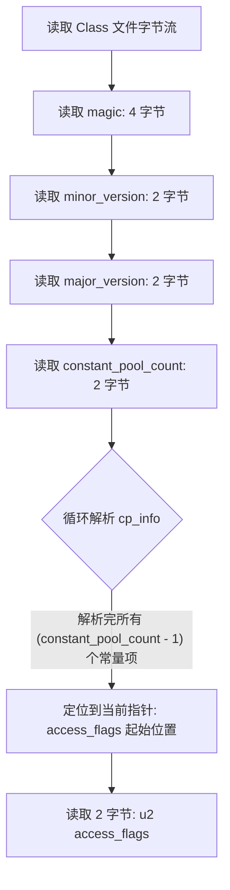
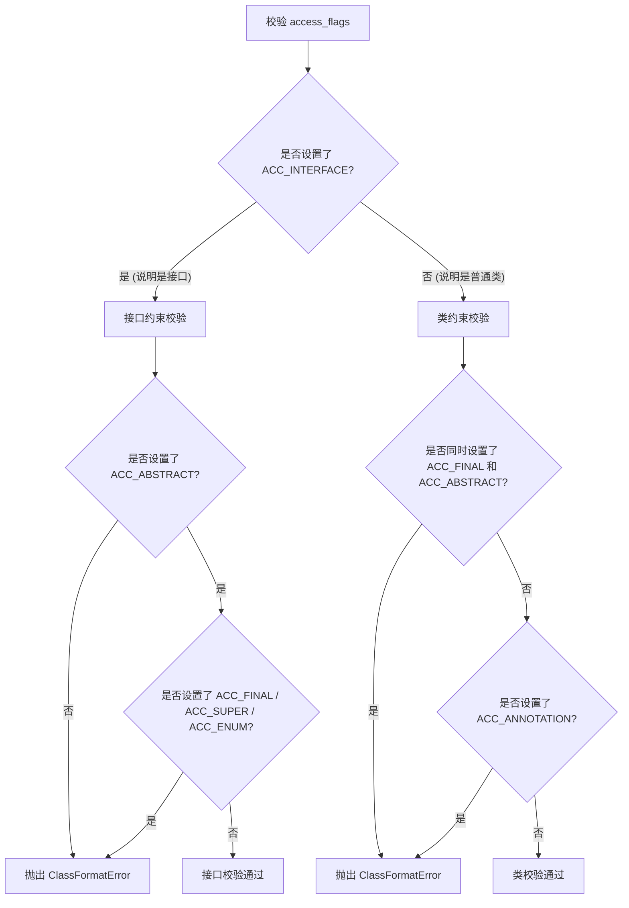
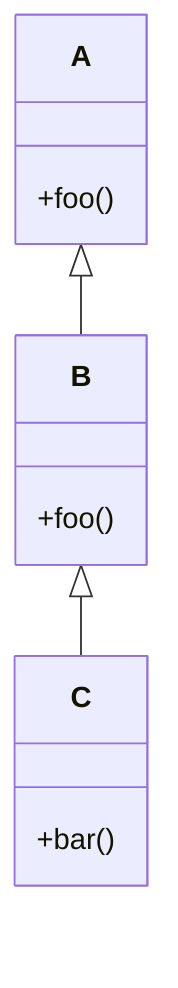
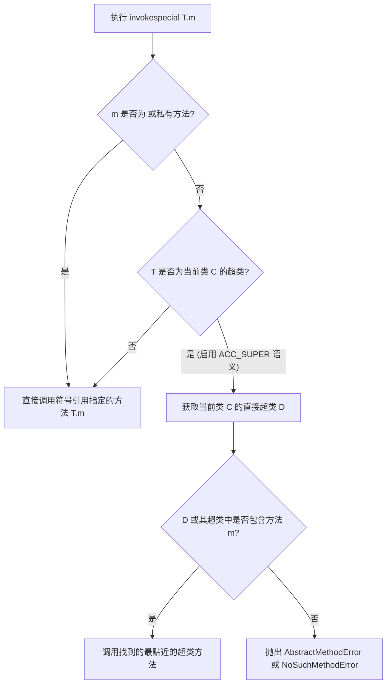

# 2.1.5.3 访问标志（access_flags）

在 Java 虚拟机（JVM）的类文件结构中，访问标志（`access_flags`）扮演着定义类或接口的“身份与权限”的角色。它紧跟在常量池（`constant_pool`）之后，占据 2 字节（`u2`）的物理空间。`access_flags` 不仅规定了一个类是 `class`、`interface`、`enum` 还是 `annotation`，还定义了它的访问修饰符（如 `public`、`abstract`、`final`）以及是否为编译器自动生成的合成类（`synthetic`）。

本文将深入剖析 `access_flags` 在 Class 文件中的物理位置、8 大核心类级访问标志的二进制表示与位运算解析机制、标志位之间的互斥约束校验规则，以及历史遗留标志 `ACC_SUPER` 的前因后果与现代 JVM 中的地位变迁。

---

## 1. access_flags 的物理位置与二进制排布

### 1.1 Class 文件宏观结构中的定位

根据《Java 虚拟机规范》（Java Virtual Machine Specification），Class 文件是由无符号字节流构成的二进制文件。它的前半部分具有高度确定的物理结构，其经典排布如下所示：

```c
ClassFile {
    u4             magic;               // 魔数，固定为 0xCAFEBABE
    u2             minor_version;       // 次版本号
    u2             major_version;       // 主版本号
    u2             constant_pool_count; // 常量池计数器（大小为常量池项数 + 1）
    cp_info        constant_pool[constant_pool_count-1]; // 常量池数据，不定长
    u2             access_flags;        // 访问标志，2 字节 (u2)
    u2             this_class;          // 当前类索引，指向常量池
    u2             super_class;         // 超类索引，指向常量池
    u2             interfaces_count;    // 接口数量
    u2             interfaces[interfaces_count]; // 接口表，不定长
    ...
}
```

从上述结构可以看出，`access_flags` 紧邻 `constant_pool`。由于常量池的大小（`constant_pool_count`）以及常量池中每个数据项（`cp_info`）的类型和物理长度都是不固定的，因此 **`access_flags` 在 Class 文件中的物理偏移量（Offset）是动态的**。

要定位 `access_flags` 的起始字节地址，JVM 在加载 Class 文件时必须完整解析并跳过常量池。定位的计算逻辑如下：



### 1.2 物理位置定位计算公式

设 Class 文件字节流为数组 $B$，其中：
- $B[0..3]$ 为魔数；
- $B[4..5]$ 为次版本号；
- $B[6..7]$ 为主版本号；
- $B[8..9]$ 为常量池计数器的值 $N$（即 `constant_pool_count`）。

从第 10 个字节开始为常量池数据，其起始物理地址 $Offset_{cp\_start} = 10$。
常量池由 $N-1$ 个大小不一的常量项（`cp_info`）组成。每个常量项的第 1 个字节为 `tag`（标识常量类型），后续字节长度由 `tag` 决定。若第 $i$ 个常量项的长度为 $L_i$（包括 `tag` 字节），则常量池的总长度 $L_{cp}$ 为：

$$L_{cp} = \sum_{i=1}^{N-1} L_i$$

> [!NOTE]
> 必须注意，在 JVM 规范中，`Double` (CONST_Double) 和 `Long` (CONST_Long) 类型占用常量池中的两个连续索引位置。虽然它们占据两个逻辑位置，但在物理存储上仍表现为一个完整的 `cp_info` 结构。

因此，访问标志 `access_flags` 在 Class 文件中的起始偏移量 $Offset_{access\_flags}$ 为：

$$Offset_{access\_flags} = 10 + L_{cp}$$

`access_flags` 占据 $Offset_{access\_flags}$ 和 $Offset_{access\_flags} + 1$ 这 2 个字节。

---

## 2. 8 大核心类级访问标志详解

在 Class 文件的类级别，一共有 16 个可用的标志位（因为是一个 `u2` 类型的字段，即 16 个 bit）。目前 JVM 规范一共定义了其中的 8 个核心标志，其余未定义的位均作为保留位，必须在编译器生成的类文件中置为 `0`，且 JVM 在加载时也会忽略它们。

下表详细列出了这 8 大核心类级访问标志的数值、二进制排布和具体的语义含义：

| 标志名称 | 十六进制值 | 二进制位图 (16位) | 详细语义说明 |
| :--- | :--- | :--- | :--- |
| `ACC_PUBLIC` | `0x0001` | `0000 0000 0000 0001` | 声明为 `public`，可以被包外的其他类访问。 |
| `ACC_FINAL` | `0x0010` | `0000 0000 0001 0000` | 声明为 `final`，不允许被继承，不能有子类。 |
| `ACC_SUPER` | `0x0020` | `0000 0000 0010 0000` | 改变 `invokespecial` 指令对超类方法的调用分派语义（现代 JDK 默认开启，并已逐步弃用其显式设置，详见后文）。 |
| `ACC_INTERFACE` | `0x0200` | `0000 0010 0000 0000` | 标识这是一个接口（`interface`），而不是一个普通的类（`class`）。 |
| `ACC_ABSTRACT` | `0x0400` | `0000 0100 0000 0000` | 声明为 `abstract`，不能被实例化。接口也必须设置此标志。 |
| `ACC_SYNTHETIC` | `0x1000` | `0001 0000 0000 0000` | 标识该类由编译器自动生成，在源代码中并不存在对应的显式定义。 |
| `ACC_ANNOTATION` | `0x2000` | `0010 0000 0000 0000` | 标识这是一个注解类型（`annotation`），必须与 `ACC_INTERFACE` 一起设置。 |
| `ACC_ENUM` | `0x4000` | `0100 0000 0000 0000` | 标识这是一个枚举类型（`enum`）。 |

### 8 大标志位的深入原理解析

1. **`ACC_PUBLIC` (0x0001)**
   在 Java 源码中，如果一个类或接口被声明为 `public`，编译器就会为其标记此标志。对于非 `public` 的包私有（Package-Private）类，该位为 `0`。

2. **`ACC_FINAL` (0x0010)**
   一旦类被 `ACC_FINAL` 修饰，在类加载的“准备与解析”阶段，JVM 的字节码验证器若发现有其他类试图继承此类，将立即抛出 `VerifyError`。

3. **`ACC_SUPER` (0x0020)**
   这是一个非常特殊的标志，主要用于向后兼容，解决 JDK 1.0.2 之前 `invokespecial` 寻找超类方法时的缺陷。在现代 Class 文件中，编译器默认会将其设为 1。

4. **`ACC_INTERFACE` (0x0200)**
   当此标志为 `1` 时，代表该 Class 文件描述的是一个接口，而不是普通的类。此标志的存在会直接改变 JVM 对该 Class 的解析方式（例如，不允许该类拥有实例字段，所有方法默认为 `public` 等）。

5. **`ACC_ABSTRACT` (0x0400)**
   指示类是抽象的。任何包含抽象方法的类、或者接口本身，都必须设置此标志。对于接口而言，它的修饰通常包含 `ACC_INTERFACE | ACC_ABSTRACT`。

6. **`ACC_SYNTHETIC` (0x1000)**
   该标志指示这个类并没有对应的 Java 源代码声明。例如，在编译包含内部类和外部类的代码时，编译器为了处理私有成员的访问，或者为了支持特殊的桥接机制，可能会自动生成一些辅助类。这些辅助类的 Class 文件的 `access_flags` 就会包含 `ACC_SYNTHETIC`。此外，热部署工具、动态代理框架（如 CGLIB、ByteBuddy）生成的类也往往会带有此标志。

7. **`ACC_ANNOTATION` (0x2000)**
   表示该接口是一个注解类型。Java 5 引入的 `@interface` 在编译成 Class 文件后，本质上也是一个接口，因此会同时打上 `ACC_INTERFACE`、`ACC_ABSTRACT` 和 `ACC_ANNOTATION`。

8. **`ACC_ENUM` (0x4000)**
   表示该类是一个枚举类型。在 Java 中，所有的枚举类在编译后都会继承自 `java.lang.Enum`。打上 `ACC_ENUM` 标志可以帮助 JVM 识别该类，从而在反射、序列化等场景下应用特殊的枚举语义约束（例如，禁止通过反射调用构造器实例化枚举）。

---

## 3. 按位或（Bitwise OR）的合成与位运算解析机制

在 Class 文件中，`access_flags` 的设计采用了计算机体系结构中非常经典的**位掩码（Bitmask）**机制。这意味着，一个类所拥有的全部修饰属性，都是通过对其各个标志位的十六进制/二进制值进行**按位或（Bitwise OR，符号为 `|`）**计算，融合成一个唯一的 16 位整数存储的。

### 3.1 编译器合成过程（按位或）

假设我们编写了一个普通的 Java 公共类，其声明如下：

```java
public final class Demo { ... }
```

该类具有两个显式修饰符：`public` 和 `final`。此外，根据 JVM 规范，编译器还会隐式为其打上 `ACC_SUPER` 标志。

编译器在将其转换为 `access_flags` 时，会执行以下按位或运算：

```text
  ACC_PUBLIC (0x0001) : 0000 0000 0000 0001
| ACC_FINAL  (0x0010) : 0000 0000 0001 0000
| ACC_SUPER  (0x0020) : 0000 0000 0010 0000
--------------------------------------------
  合成结果    (0x0031) : 0000 0000 0011 0001
```

在生成的 Class 文件的物理结构中，对应的 `access_flags` 字段位置就会写入大端序的 `0x0031`（即字节流中依次为 `00 31`）。

### 3.2 JVM 解析过程（按位与）

当 JVM 加载 Class 文件并读取到 `access_flags` 的值（假设为 `unsigned short flag`）后，不能直接通过等值比较来识别属性（因为 `0x0031 != 0x0001` 且 `0x0031 != 0x0010`）。

JVM 必须通过**按位与（Bitwise AND，符号为 `&`）**来提取并校验对应的属性：

$$\text{hasFlag} = (\text{access\_flags} \ \& \ \text{FLAG\_MASK}) \neq 0$$

以判断上述类是否为 `final` 为例：

```text
  access_flags (0x0031) : 0000 0000 0011 0001
& ACC_FINAL    (0x0010) : 0000 0000 0001 0000
----------------------------------------------
  判定结果     (0x0010) : 0000 0000 0001 0000  => 结果不为 0，说明包含 ACC_FINAL
```

同理，若想判断该类是否为接口：

```text
  access_flags  (0x0031) : 0000 0000 0011 0001
& ACC_INTERFACE (0x0200) : 0000 0010 0000 0000
----------------------------------------------
  判定结果      (0x0000) : 0000 0000 0000 0000  => 结果为 0，说明不是接口
```

### 3.3 JVM 底层解析模拟代码

在 JVM 源码中（以典型的 HotSpot 虚拟机设计风格为例），访问标志通常会被封装成一个辅助的 C++ 类或 Java 模拟类，提供底层的位运算支持。以下是模拟的高效解析代码：

```java
public final class AccessFlags {
    // 标志常量定义
    public static final int ACC_PUBLIC     = 0x0001;
    public static final int ACC_FINAL      = 0x0010;
    public static final int ACC_SUPER      = 0x0020;
    public static final int ACC_INTERFACE  = 0x0200;
    public static final int ACC_ABSTRACT   = 0x0400;
    public static final int ACC_SYNTHETIC  = 0x1000;
    public static final int ACC_ANNOTATION = 0x2000;
    public static final int ACC_ENUM       = 0x4000;

    private final int flags;

    public AccessFlags(int flags) {
        this.flags = flags & 0xFFFF; // 确保是 u2 范围
    }

    public boolean isPublic() {
        return (flags & ACC_PUBLIC) != 0;
    }

    public boolean isFinal() {
        return (flags & ACC_FINAL) != 0;
    }

    public boolean isSuper() {
        return (flags & ACC_SUPER) != 0;
    }

    public boolean isInterface() {
        return (flags & ACC_INTERFACE) != 0;
    }

    public boolean isAbstract() {
        return (flags & ACC_ABSTRACT) != 0;
    }

    public boolean isSynthetic() {
        return (flags & ACC_SYNTHETIC) != 0;
    }

    public boolean isAnnotation() {
        return (flags & ACC_ANNOTATION) != 0;
    }

    public boolean isEnum() {
        return (flags & ACC_ENUM) != 0;
    }
}
```

---

## 4. 标志位之间的互斥约束与校验规则

由于 Java 语言规范（JLS）和 JVM 规范具有严格的类型安全设计，某些访问标志在逻辑上是**天然互斥**或**强制关联**的。因此，JVM 在类加载的“连接（Linking） - 验证（Verification）”阶段，会对 `access_flags` 的各个位组合进行严格校验。一旦发现非法组合，JVM 会抛出 `java.lang.ClassFormatError` 并拒绝加载该类。

### 4.1 核心互斥与依赖规则

根据 JVM 规范，类级访问标志必须遵循以下约束法则：



详细的约束条目说明如下：

#### 1. 接口（Interface）相关约束
如果设置了 `ACC_INTERFACE` 标志，则：
* **必须同时设置** `ACC_ABSTRACT` 标志（因为在 JVM 底层，接口没有实例，本质上是高度抽象的）。
* **绝对不能设置** `ACC_FINAL` 标志（接口必须被实现，不能是终结的）。
* **绝对不能设置** `ACC_SUPER` 标志（`ACC_SUPER` 仅对普通类的方法分派起作用，接口方法调用有专用的 `invokeinterface` 等指令，且在 JDK 8 之前，接口根本没有默认方法，因此无需 `ACC_SUPER` 纠正）。
* **绝对不能设置** `ACC_ENUM` 标志（枚举和接口是两种互斥的物理类型）。

#### 2. 类（Class）相关约束
如果没有设置 `ACC_INTERFACE` 标志，则：
* **绝对不能同时设置** `ACC_FINAL` 和 `ACC_ABSTRACT`。因为 `final` 禁止类被继承，而 `abstract` 强制类必须通过子类继承来实例化，两者在语义上完全对立。
* **绝对不能设置** `ACC_ANNOTATION` 标志（注解必定是接口的一种特殊形式）。

#### 3. 注解（Annotation）相关约束
如果设置了 `ACC_ANNOTATION` 标志，则：
* **必须同时设置** `ACC_INTERFACE` 和 `ACC_ABSTRACT`。也就是说，注解一定是接口。

#### 4. 枚举（Enum）相关约束
如果设置了 `ACC_ENUM` 标志，则：
* **绝对不能设置** `ACC_INTERFACE`。
* 可以包含 `ACC_FINAL` 或 `ACC_ABSTRACT`（当枚举类包含抽象方法，由各枚举项在内部匿名重写时，该枚举类的 class 文件会被置为 `ACC_ABSTRACT`；普通枚举类则通常隐式为 `ACC_FINAL`）。

### 4.2 互斥约束校验矩阵

以下为 8 大核心标志的互斥关系矩阵图。其中，`Y` 表示允许共存，`N` 表示绝对互斥，`Req` 表示存在关联依赖（例如 A 必须依赖 B 的存在）：

| 标志 | PUBLIC | FINAL | SUPER | INTERFACE | ABSTRACT | SYNTHETIC | ANNOTATION | ENUM |
| :--- | :---: | :---: | :---: | :---: | :---: | :---: | :---: | :---: |
| **PUBLIC** | — | Y | Y | Y | Y | Y | Y | Y |
| **FINAL** | Y | — | Y | **N** | **N** | Y | **N** | Y |
| **SUPER** | Y | Y | — | **N** | Y | Y | **N** | Y |
| **INTERFACE** | Y | **N** | **N** | — | **Req** | Y | Y | **N** |
| **ABSTRACT** | Y | **N** | Y | **Req** | — | Y | Y | Y |
| **SYNTHETIC** | Y | Y | Y | Y | Y | — | Y | Y |
| **ANNOTATION**| Y | **N** | **N** | **Req**| **Req**| Y | — | **N** |
| **ENUM** | Y | Y | Y | **N** | Y | Y | **N** | — |

> [!WARNING]
> 一旦 Class 文件的二进制字节流在被 JVM 读入时违反了上述表中的任何一条 `N`（互斥）或者 `Req`（依赖）规则，JVM 在类加载的验证阶段（Class Verification）就会立即失败，产生 `java.lang.ClassFormatError`。

---

## 5. 历史遗留标志 ACC_SUPER 深度剖析

在 8 大核心标志位中，`ACC_SUPER` 是技术渊源最深、背景最为复杂的标志。它的诞生和退役，直接见证了 Java 语言早期调用分派机制的缺陷与演进。

### 5.1 诞生背景：改变 invokespecial 的超类方法分派缺陷

在 JDK 1.0.2 之前，`invokespecial` 指令在 JVM 规范中的行为与如今大相径庭。在最早期，`invokespecial` 采用的是**静态分派（Non-Virtual Invocation）**语义。

#### 1. 问题场景重现

假设有如下继承关系的三个类 $A$、$B$ 和 $C$：



其 Java 源代码如下：

```java
class A {
    void foo() { System.out.println("A.foo"); }
}

class B extends A {
    @Override
    void foo() { System.out.println("B.foo"); }
}

class C extends B {
    void bar() {
        super.foo(); // 调用直接超类的方法
    }
}
```

在编译类 `C` 的 `bar()` 方法时，编译器会为 `super.foo()` 生成一条 `invokespecial` 字节码指令：

```text
invokespecial B.foo:()V
```

#### 2. 无 ACC_SUPER 标志下的解析缺陷

在早期没有 `ACC_SUPER` 标志约束的 JVM 中，当执行 `invokespecial B.foo` 时，JVM **不会**根据继承链去动态定位，而是简单直接地查找类 `B` 的 `foo()` 方法。

这在平时工作正常，但如果遇到以下动态链接场景，就会产生灾难性的结果：
如果我们在不重新编译类 `C` 的情况下，修改并重新编译类 `B`，将类 `B` 中的 `foo()` 方法删除（让类 `B` 继承自类 `A` 的 `foo()`）。
此时，类 `C` 的字节码依然是 `invokespecial B.foo`。
* **早期的 JVM（无 ACC_SUPER 语义）**：在解析 `B.foo` 时，发现类 `B` 中并没有 `foo()` 方法（因为被删除了），JVM 会直接抛出 `NoSuchMethodError`，或者错误地无法向上检索。
* **合理的预期行为**：既然类 `C` 调的是 `super.foo()`，并且类 `B` 继承自 `A`，那么应该顺着继承链向上查找，最终安全调用到 `A.foo()`。

### 5.2 ACC_SUPER 的引入及其动态检索机制

为了修复这一设计缺陷，同时为了不破坏那些已经在 JDK 1.0 编译并运行良好的旧 Class 文件的兼容性，Sun 公司于 **JDK 1.0.2** 引入了 `ACC_SUPER` 访问标志（值为 `0x0020`）。

* 当 `ACC_SUPER` 标志为 **`0`**：表示使用旧的、基于静态符号绑定的方式处理 `invokespecial` 指令。
* 当 `ACC_SUPER` 标志为 **`1`**（自 JDK 1.0.2 之后的所有新编译器编译出来的 Class 都默认将其置为 1）：`invokespecial` 指令将启用改进后的**动态超类分派（Dynamic Super Invocation）**语义。

#### invokespecial + ACC_SUPER 的运行时解析算法

当 `ACC_SUPER` 为 1，执行 `invokespecial` 调用一个符号引用中指定为类 $T$、方法为 $m$ 的方法时，如果该方法不是实例初始化方法（`<init>`），也不是私有方法，且 $T$ 是当前类 $C$ 的超类，JVM 会按照以下流程进行动态搜索：



通过这一动态检索机制，即便超类 `B` 的方法结构发生了改变（例如方法上移至 `A`），`invokespecial` 依然能通过 $C \to B \to A$ 的继承链找到正确的实现，保证了二进制兼容性（Binary Compatibility）。

---

### 5.3 现代 JDK（JDK 21+）中的地位变迁与彻底弃用

随着 Java 版本的飞速迭代，`ACC_SUPER` 经历了“从补丁到默认，再到弃用”的漫长演进：

#### 1. Java SE 8 时代的强制默认
自 Java SE 8 起，随着接口默认方法（Default Methods）和更复杂的类分派逻辑的引入，旧的非 `ACC_SUPER` 语义已完全无法满足类型安全需求。规范规定：
> **自 Java SE 8 起，在每个 Class 文件中，JVM 均会默认所有访问标志中的 `ACC_SUPER` 标志为已设置（即默认值为 1）**，无论 Class 文件中的 `access_flags` 字段是否实际设置了该位，也不管 Class 文件的版本号是多少。

这标志着早期（JDK 1.0.2 之前）的不带 `ACC_SUPER` 的执行路径在现代 JVM 中已被废弃，不再起作用。

#### 2. JDK 21+ 时代的正式 Deprecation（弃用）
随着 JDK 21（包括后续的 JDK 22 和 Project Valhalla 的孵化），Java 类文件规范对许多历史包袱进行了彻底的清理。

* **Classfile API 的演进**：JDK 21 引入了全新的 `java.lang.classfile` 标准 API（预览版），用于解析和生成类文件。在新的 Classfile API 中，由于所有生成的类默认且必须开启 `ACC_SUPER`，该标志已不再需要显式操纵。
* **规范重定义**：在 JDK 21 的《JVM 规范》中，`ACC_SUPER` 标志被明确标记为 **Deprecated（弃用）**。规范明确指出，在未来的主要版本中，该标志位可能被重新定义为保留位，或者挪作他用（例如，在 Project Valhalla 中，用于区分是 Value Class 还是 Identity Class 的一些新标志位可能会复用此空间）。
* **兼容性断代**：现代 JVM 事实上已经彻底移除了对 JDK 1.0.2 之前 Class 字节码的兼容解析引擎。因此，`ACC_SUPER` 作为区分历史版本的“开关”使命已经彻底终结，沦为了 Class 文件格式中的一个历史遗存。

---

## 6. JVM 字节码实战分析：以枚举类（Enum）为例

下面通过一个具体的实战案例，带领大家从底层的十六进制字节码中定位、计算并验证 `access_flags`。

### 6.1 编写源代码与编译

我们编写一个简单的枚举类 `Status.java`：

```java
package com.example;

public enum Status {
    ACTIVE,
    INACTIVE
}
```

使用 `javac` 进行编译：

```bash
javac com/example/Status.java
```

### 6.2 字节码物理位置手动分析（十六进制视角）

使用十六进制编辑器（如 HexFiend 或 `od -t x1`）打开生成的 `Status.class` 文件。我们截取最前面的一部分字节 data 进行分析：

```text
CA FE BA BE 00 00 00 3D 00 23 07 00 02 01 00 11  |.......#........|
```

下面我们一步步解析：

1. **`CA FE BA BE`**：4 字节的魔数 `magic`。
2. **`00 00`**：2 字节的次版本号 `minor_version` = 0。
3. **`00 3D`**：2 字节的主版本号 `major_version` = 61（即 JDK 17）。
4. **`00 23`**：2 字节的常量池计数器 `constant_pool_count` = 35（即常量池中共有 34 个常量项）。

紧随其后的是这 34 个常量项。因为手工计算 34 个复杂常量项的物理长度过于繁琐，我们可以借助 `javap -v` 或专门的字节码分析器直接得到常量池的物理边界。

通过解析，我们获知常量池一共占据了后续的若干字节，在常量池结束之后，字节流呈现为：

```text
... 00 02 40 31 00 04 00 06 00 00 ...
```

在常量池数据项的末尾，紧跟着 `access_flags`：
* 我们发现其对应的值为：`40 31`（十六进制）。
* 紧跟在 `40 31` 后面的是 `this_class` 的指向索引：`00 04`。

因此，该枚举类的 `access_flags` 十六进制表示即为 **`0x4031`**。

### 6.3 0x4031 的位运算解码

我们将 `0x4031` 展开为二进制并拆解：

```text
0x4031 = 0100 0000 0011 0001
```

我们将 8 大核心访问标志与该值逐一进行“按位与（`&`）”计算：

1. **`0x4031 & ACC_PUBLIC (0x0001)`**:
   `0100 0000 0011 0001 & 0000 0000 0000 0001 = 0x0001` (非0) $\implies$ **拥有 `public` 修饰符**。
2. **`0x4031 & ACC_FINAL (0x0010)`**:
   `0100 0000 0011 0001 & 0000 0000 0001 0000 = 0x0010` (非0) $\implies$ **拥有 `final` 修饰符**（JVM 中枚举类默认是 final 的，禁止继承）。
3. **`0x4031 & ACC_SUPER (0x0020)`**:
   `0100 0000 0011 0001 & 0000 0000 0010 0000 = 0x0020` (非0) $\implies$ **开启了 `ACC_SUPER` 标志**。
4. **`0x4031 & ACC_ENUM (0x4000)`**:
   `0100 0000 0011 0001 & 0100 0000 0000 0000 = 0x4000` (非0) $\implies$ **拥有 `enum` 属性**，标志着该 Class 是一个枚举类型。

其他标志位如 `ACC_INTERFACE` (0x0200)、`ACC_ABSTRACT` (0x0400) 的按位与结果均为 `0`。

通过运算，我们成功得出 `Status.class` 的复合标志为：
$$\text{access\_flags} = \text{ACC\_PUBLIC} \mid \text{ACC\_FINAL} \mid \text{ACC\_SUPER} \mid \text{ACC\_ENUM}$$

### 6.4 使用 javap 工具验证

我们在命令行中执行：

```bash
javap -v com.example.Status
```

输出的类头部信息如下所示：

```text
Classfile /com/example/Status.class
  Last modified 2026-06-15; size 982 bytes
  SHA-256 checksum 1234567890abcdef...
  Compiled from "Status.java"
public final class com.example.Status extends java.lang.Enum<com.example.Status>
  minor version: 0
  major version: 61
  flags: (0x4031) ACC_PUBLIC, ACC_FINAL, ACC_SUPER, ACC_ENUM
...
```

控制台输出的 `flags: (0x4031) ACC_PUBLIC, ACC_FINAL, ACC_SUPER, ACC_ENUM` 与我们上面进行的手动十六进制寻址以及按位与位运算推导结果完全吻合，闭环验证了 `access_flags` 的全部运行机制。

---

## 7. 总结

在 JVM Class 文件中，`access_flags` 是一个精简且设计极其精妙的 `u2` 字段。它通过按位或的紧凑形式存储了类级别的一系列描述信息，并在类加载验证阶段通过互斥规则与约束保护着 JVM 的类型安全。

从历史上看，`ACC_SUPER` 的兴衰折射出早期 Java 在语言规范和底层实现间的权衡与妥协。而在现代 JDK 中，该标志随着虚拟机的技术迭代和历史兼容负担的卸去，已逐渐步入历史尘埃。对于 Java 开发者而言，深入理解 `access_flags` 的底层二进制机制，不仅能够帮助我们编写出更加安全的动态代理与字节码修改库，也能为我们学习其他运行在 JVM 上的现代化语言（如 Kotlin、Scala）的底层编译器生成行为打下坚实的基础。
