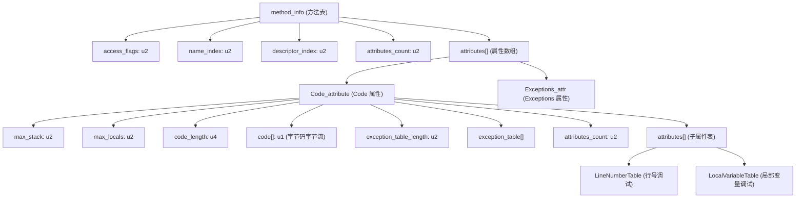
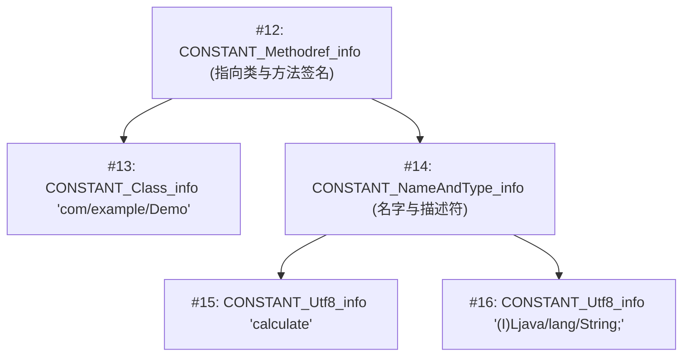
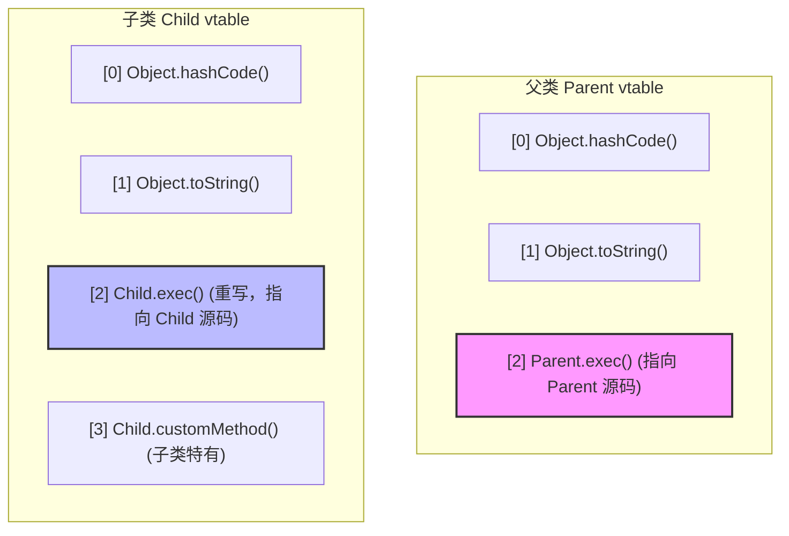

# 2.1.5.4 字段表与方法表

在 Java 虚拟机的物理设计中，Class 文件是以 8 位字节为基础单位的紧凑二进制流。在这个结构高度规整的字节流中，每一个字段（Field）和每一个方法（Method）都有着属于它们自己的物理边界和逻辑表达。字段表（`field_info`）与方法表（`method_info`）分别承载了 Java 类中静态属性声明与动态行为实现的元数据。

本文将从 Class 文件的物理布局出发，深度剖析字段表与方法表的底层结构、访问标志的二进制运算机制、类型描述符的物理语法规范、Code 属性的内部构造，以及 Java 语言规范与 JVM 字节码规范在方法重载与重写上的冲突与底层统一。

---

## 1. Class 物理布局定位与承接关系

在 Class 文件的物理结构中，字段表与方法表并不是孤立存在的。Class 文件采用了一种类似 C 语言结构体的伪结构来存储数据，其物理结构顺序是严格固定的。从文件头开始，依次为：

1. 魔数（Magic Number, `u4`）
2. 副版本号（Minor Version, `u2`）与主版本号（Major Version, `u2`）
3. 常量池计数器（`constant_pool_count`, `u2`）与常量池表（`constant_pool[]`）
4. 类访问标志（`access_flags`, `u2`）
5. 类索引（`this_class`, `u2`）与父类索引（`super_class`, `u2`）
6. 接口计数器（`interfaces_count`, `u2`）与接口索引表（`interfaces[]`）
7. **字段计数器（`fields_count`, `u2`）与字段表集合（`fields[]`）**
8. **方法计数器（`methods_count`, `u2`）与方法表集合（`methods[]`）**
9. 属性计数器（`attributes_count`, `u2`）与属性表集合（`attributes[]`）

字段表集合紧跟在接口索引表之后，而方法表集合则紧跟在字段表集合之后。这种设计的物理原因非常直接：在解析 Class 文件时，JVM 需要先明确这个类“是什么”（类索引、父类、实现的接口），然后明确它“拥有什么静态属性”（字段表），最后才能明确它“能做出什么动态行为”（方法表）。

通过这种有条不紊的字节流排布，JVM 能够在一次顺序读取（Single-Pass Scan）中，高效地将类元数据载入内存，并构建出对应的内部数据结构（如 JDK 8 及之后在元空间中构建的 `InstanceKlass` 对象）。

---

## 2. 字段表（field_info）的物理结构与原理解析

字段表用于描述接口或者类中声明的变量。这些变量包括了类级别变量（`static`）和实例级别变量，但不包括方法内部声明的局部变量。

### 2.1 字段表的物理字节布局

每个字段的物理结构都由一个 `field_info` 结构体来定义。在 JVM 规范中，其物理结构定义如下：

```c
field_info {
    u2             access_flags;
    u2             name_index;
    u2             descriptor_index;
    u2             attributes_count;
    attribute_info attributes[attributes_count];
}
```

其各个组成部分的具体含义与物理宽度如下表所示：

| 字段名称 | 物理宽度（字节） | 说明 |
| :--- | :--- | :--- |
| `access_flags` | 2 字节 (`u2`) | 字段的访问修饰符与特征标志（如 `public`、`static`、`final` 等） |
| `name_index` | 2 字节 (`u2`) | 指向常量池中 `CONSTANT_Utf8_info` 类型的索引，代表字段的简单名称 |
| `descriptor_index` | 2 字节 (`u2`) | 指向常量池中 `CONSTANT_Utf8_info` 类型的索引，代表字段的类型描述符 |
| `attributes_count` | 2 字节 (`u2`) | 字段属性表的计数器，指示该字段拥有的额外属性个数 |
| `attributes[]` | 可变长度 | 字段属性的集合，例如用于指定常量值的 `ConstantValue` 属性等 |

### 2.2 字段访问标志（access_flags）深挖

`access_flags` 是一个 16 位的二进制掩码（Mask），用于标识字段的访问权限和特征。JVM 规范定义了以下 9 种字段访问标志：

| 标志名称 | 掩码值（十六进制） | 掩码值（二进制） | 含义 |
| :--- | :--- | :--- | :--- |
| `ACC_PUBLIC` | `0x0001` | `0000 0000 0000 0001` | 字段是否为 `public` |
| `ACC_PRIVATE` | `0x0002` | `0000 0000 0000 0010` | 字段是否为 `private` |
| `ACC_PROTECTED` | `0x0004` | `0000 0000 0000 0100` | 字段是否为 `protected` |
| `ACC_STATIC` | `0x0008` | `0000 0000 0000 1000` | 字段是否为 `static` |
| `ACC_FINAL` | `0x0010` | `0000 0000 0001 0000` | 字段是否为 `final` |
| `ACC_VOLATILE` | `0x0040` | `0000 0000 0100 0000` | 字段是否为 `volatile` |
| `ACC_TRANSIENT` | `0x0080` | `0000 0000 1000 0000` | 字段是否为 `transient` |
| `ACC_SYNTHETIC` | `0x1000` | `0001 0000 0000 0000` | 字段是否由编译器自动产生 |
| `ACC_ENUM` | `0x4000` | `0100 0000 0000 0000` | 字段是否为 `enum` 成员 |

#### 按位或（Bitwise OR）组合标志
当一个字段同时被多个修饰符修饰时，JVM 编译器会通过“按位或”运算将这些标志组合成一个单一的 `u2` 数值。
例如，一个字段的声明为：
```java
public static final transient int value;
```
其对应的访问标志计算过程如下：
- `ACC_PUBLIC` = `0x0001`
- `ACC_STATIC` = `0x0008`
- `ACC_FINAL` = `0x0010`
- `ACC_TRANSIENT` = `0x0080`

物理合并计算：
$$\text{Flags} = 0x0001 \mid 0x0008 \mid 0x0010 \mid 0x0080 = 0x0099$$
在 Class 文件的字段表中，该字段的 `access_flags` 处的物理字节就会被写入 `0x0099`。

#### 按位与（Bitwise AND）判定标志
在 JVM 运行期，当执行引擎需要判断某个字段是否具备特定的修饰符（如判断是否为 `static`，以决定是否进行类变量的读写操作）时，它会使用“按位与”操作：
$$\text{IsStatic} = (\text{access\_flags} \ \& \ \text{ACC\_STATIC}) == \text{ACC\_STATIC}$$
如果结果为 `true`，则证明该字段具有 `static` 属性。

#### 约束与互斥规则
JVM 规范对字段访问标志设定了严格的校验规则。如果 Class 文件不符合这些约束，类加载的验证阶段（Verification）将会抛出 `ClassFormatError` 或 `VerifyError`：
1. `ACC_PUBLIC`、`ACC_PRIVATE`、`ACC_PROTECTED` 这三个标志是互斥的，最多只能选择其中一个。
2. 接口中的字段必须同时设置 `ACC_PUBLIC`、`ACC_STATIC` 和 `ACC_FINAL` 标志（即接口字段默认为 `public static final`）。
3. `ACC_FINAL` 和 `ACC_VOLATILE` 不能同时设置。因为 `final` 保证了字段一经初始化即不可变，而 `volatile` 保证了多线程间的可见性与防止指令重排，对一个不可变的常量设置 `volatile` 是矛盾且无意义的。

### 2.3 常量池解引用模型

在 `field_info` 结构中，`name_index` 和 `descriptor_index` 是两个至关重要的常量池索引指针。它们通过解引用（Dereferencing）的方式与常量池关联。

- **`name_index`（名称索引）**：指向常量池中的一个 `CONSTANT_Utf8_info` 结构。该结构存储了该字段的**简单名称**（Simple Name），即没有类型和包名修饰的字段原始名称（例如：`value`、`TAG`）。
- **`descriptor_index`（描述符索引）**：同样指向一个 `CONSTANT_Utf8_info` 结构，存储的是字段的**描述符**（Descriptor），用于定义该字段的物理类型信息（如 `I` 代表 `int`，`Ljava/lang/String;` 代表字符串对象）。

下图清晰展示了字段表与常量池的指向和解引用拓扑模型：

```mermaid
graph LR
    field_info["field_info (字段表项)"] --> access_flags["access_flags: 0x0002 (private)"]
    field_info --> name_index["name_index: #5"]
    field_info --> descriptor_index["descriptor_index: #6"]
    field_info --> attributes_count["attributes_count: 0"]
    
    subgraph 常量池 (Constant Pool)
        cp_5["#5: CONSTANT_Utf8_info 'id'"]
        cp_6["#6: CONSTANT_Utf8_info 'I'"]
    end
    
    name_index -.-> |解引用指向| cp_5
    descriptor_index -.-> |解引用指向| cp_6
```

---

## 3. 类型描述符物理语法定义与解析规范

类型描述符是 JVM 内部的一套高度精炼的符号表示系统。它不仅被字段表用于描述字段类型，也被方法表用于描述方法的参数列表与返回值类型。

### 3.1 字段描述符（Field Descriptor）语法规范

JVM 规范中定义的描述符符号与其物理类型的映射关系如下：

| 描述符字符 | 物理含义 | 对应 Java 语言中的类型 | 占用槽数（Slot）/ 备注 |
| :---: | :--- | :--- | :--- |
| `B` | byte | 基本类型 byte | 1 Slot |
| `C` | char | 基本类型 char | 1 Slot |
| `D` | double | 基本类型 double | 2 Slot (双精度浮点数) |
| `F` | float | 基本类型 float | 1 Slot |
| `I` | int | 基本类型 int | 1 Slot |
| `J` | long | 基本类型 long | 2 Slot (长整型) |
| `S` | short | 基本类型 short | 1 Slot |
| `Z` | boolean | 基本类型 boolean | 1 Slot (在字节码中通常用 0/1 的 int 表示) |
| `V` | void | 无返回值 | 仅用于方法描述符中表示返回值 |
| `L全限定名;` | 对象类型 | 引用类型 (Reference) | 1 Slot，必须以分号 `;` 结尾 |
| `[` | 数组类型 | 数组引用 (Array Reference) | 1 Slot，每一维增加一个 `[` 符号 |

#### 深度解析：引用类型描述符以分号 `;` 结尾的设计考量
为什么 `Ljava/lang/String;` 必须以分号 `;` 结尾，而基本类型如 `I`、`B` 则不需要？
这是因为在 JVM 编译设计中，基本类型描述符都是长度为 1 的单个字符，而引用类型（对象类型）的类名长度是可变的。在方法描述符或复合描述符中，多个参数是无缝拼接在一起的。例如，假设没有分号 `;` 作为结束标识符，对于如下拼接：
`Ljava/lang/StringLjava/lang/Object`
解析器将完全无法分清这究竟是一个名为 `java/lang/StringLjava/lang/Object` 的类，还是两个独立的类。通过在类名后添加统一的物理结束符 `;`，解析器在遇到 `L` 时开启类名读取，直到遇到 `;` 为止，从而保证了描述符串无二义性的线性扫描解析。

#### 深度解析：多维数组的表示方式
数组类型使用左方括号 `[` 表示，每增加一维，就在前面多加一个 `[`。
- 一维整型数组 `int[]`：描述符为 `[I`。
- 二维字符数组 `char[][]`：描述符为 `[[C`。
- 三维字符串数组 `String[][][]`：描述符为 `[[[Ljava/lang/String;`。

对于数组类型，JVM 在执行 `newarray`、`anewarray` 或 `multianewarray` 指令时，会依据这些描述符在运行时动态创建对应的数组类（如 `[Ljava/lang/String;` 类，这类类并不是由具体的 `.class` 文件加载的，而是由 JVM 运行期直接生成的）。

### 3.2 方法描述符（Method Descriptor）物理语法规范

方法描述符用于定义方法的参数列表（按声明顺序排列）和返回值类型。其物理语法格式定义为：
$$\text{MethodDescriptor} \rightarrow (\ \text{ParameterDescriptor}^* \ ) \ \text{ReturnDescriptor}$$

其中：
- 参数列表被严格包裹在左右圆括号 `()` 内。
- 若方法无参数，则圆括号内为空，即 `()`。
- 返回值类型紧跟在右括号 `)` 之后。

#### 常见方法描述符实例拆解

1. **示例一：`void run()`**
   - 描述符：`()V`
   - 解析：无参数，返回值为 `void`。
2. **示例二：`int compare(int x, double y)`**
   - 描述符：`(ID)I`
   - 解析：参数 1 为 `int` (`I`)，参数 2 为 `double` (`D`)，返回值为 `int` (`I`)。
3. **示例三：`String[] execute(int index, String name, Object obj)`**
   - 描述符：`(ILjava/lang/String;Ljava/lang/Object;)[Ljava/lang/String;`
   - 解析：参数 1 为 `int`，参数 2 为 `String`，参数 3 为 `Object`，返回值为一维 `String` 数组。

#### 方法描述符的物理分割与解析算法状态机

对于 JVM 类加载器或编译器而言，解析一个方法描述符是一个典型的有限状态自动机（Finite State Machine, FSM）处理过程。由于描述符没有使用空格或逗号进行分割，解析器必须逐字符向前读取（Lookahead），并根据当前状态做出转换决策。

下图展示了方法描述符解析状态机的转移逻辑：

```mermaid
stateDiagram-v2
    [*] --> Start: 开始解析方法描述符
    Start --> ParseParams: 读取到 '('
    
    state ParseParams {
        [*] --> NextParam: 准备读取下一个字符
        NextParam --> BaseType: 遇到 B/C/D/F/I/J/S/Z
        BaseType --> NextParam: 记录基本类型参数，继续
        
        NextParam --> ObjectType: 遇到 'L'
        ObjectType --> ReadClassName: 循环读取字符直到遇到 ';'
        ReadClassName --> NextParam: 记录对象类型参数，继续
        
        NextParam --> ArrayType: 遇到 '['
        ArrayType --> ArrayDimension: 累加数组维度
        ArrayDimension --> NextParam: 遇到基本类型/L，记录数组参数，重置维度，继续
    }
    
    ParseParams --> ParseReturn: 读取到 ')'
    
    state ParseReturn {
        [*] --> ReturnType: 读取返回值字符
        ReturnType --> RetBase: 遇到 B/C/D/F/I/J/S/Z/V
        ReturnType --> RetObject: 遇到 'L'
        RetObject --> RetClassName: 循环读取字符直到遇到 ';'
        ReturnType --> RetArray: 遇到 '['
        RetArray --> RetArrayDim: 累加维度并读取元素类型
    }
    
    RetBase --> End: 解析结束
    RetClassName --> End: 解析结束
    RetArrayDim --> End: 解析结束
    End --> [*]
```



我们可以用以下伪代码展示 JVM 解析参数列表的核心逻辑：

```python
def parse_method_descriptor(descriptor_str):
    parameters = []
    return_type = None
    
    # 物理验证边界
    if not descriptor_str.startswith('('):
        raise ValueError("Invalid descriptor: must start with '('")
        
    index = 1
    length = len(descriptor_str)
    
    # 1. 解析参数列表
    while index < length:
        char = descriptor_str[index]
        if char == ')':
            index += 1
            break
            
        # 解析单个参数类型
        param_type, bytes_consumed = parse_single_type(descriptor_str, index)
        parameters.append(param_type)
        index += bytes_consumed
        
    # 2. 解析返回值类型
    if index >= length:
        raise ValueError("Invalid descriptor: missing return type")
        
    return_type, _ = parse_single_type(descriptor_str, index)
    
    return parameters, return_type

def parse_single_type(descriptor, start):
    char = descriptor[start]
    
    # 处理基本类型与 void
    if char in ('B', 'C', 'D', 'F', 'I', 'J', 'S', 'Z', 'V'):
        return char, 1
        
    # 处理数组类型 (递归或循环)
    elif char == '[':
        dimension = 0
        curr = start
        while descriptor[curr] == '[':
            dimension += 1
            curr += 1
        element_type, consumed = parse_single_type(descriptor, curr)
        return '[' * dimension + element_type, (curr - start) + consumed
        
    # 处理引用对象类型
    elif char == 'L':
        end = descriptor.find(';', start)
        if end == -1:
            raise ValueError("Invalid Object descriptor: missing ';'")
        return descriptor[start : end + 1], (end - start) + 1
        
    else:
        raise ValueError(f"Unknown type char: {char}")
```

---

## 4. 方法表（method_info）的物理结构与原理剖析

方法表用于描述类中定义的方法。其整体物理结构与字段表非常相似，但其携带的属性表以及访问标志的语义有着极大的差别。

### 4.1 方法表的物理字节布局

每个方法的物理结构由 `method_info` 结构体定义，如下所示：

```c
method_info {
    u2             access_flags;
    u2             name_index;
    u2             descriptor_index;
    u2             attributes_count;
    attribute_info attributes[attributes_count];
}
```

*结构定义与字段表完全相同，但其各字段所能承载的值及其逻辑意义与字段表不同。*

### 4.2 方法访问标志（access_flags）深挖

方法的 `access_flags` 是一个 16 位的二进制掩码，用于标识方法的可见性、执行特性以及虚方法判定。JVM 规范定义了以下方法访问标志：

| 标志名称 | 掩码值（十六进制） | 含义 |
| :--- | :--- | :--- |
| `ACC_PUBLIC` | `0x0001` | 方法是否为 `public` |
| `ACC_PRIVATE` | `0x0002` | 方法是否为 `private` |
| `ACC_PROTECTED` | `0x0004` | 方法是否为 `protected` |
| `ACC_STATIC` | `0x0008` | 方法是否为 `static` |
| `ACC_FINAL` | `0x0010` | 方法是否为 `final`（不能被重写） |
| `ACC_SYNCHRONIZED` | `0x0020` | 方法是否为 `synchronized`（执行前需获取监视器锁） |
| `ACC_BRIDGE` | `0x0040` | 桥接方法，由编译器在生成泛型擦除代码时自动生成 |
| `ACC_VARARGS` | `0x0080` | 方法是否接受变长参数（Varargs） |
| `ACC_NATIVE` | `0x0100` | 方法是否为本地方法（C/C++ 实现） |
| `ACC_ABSTRACT` | `0x0400` | 方法是否为抽象方法（无具体实现） |
| `ACC_STRICT` | `0x0800` | 方法是否为 `strictfp`（严格浮点数计算） |
| `ACC_SYNTHETIC` | `0x1000` | 方法是否由编译器自动产生 |

#### 访问标志的校验与排他性约束
JVM 在类加载的验证阶段会对方法表中的 `access_flags` 进行严格的多维度检查：
1. **可见性互斥**：`ACC_PUBLIC`、`ACC_PRIVATE` 和 `ACC_PROTECTED` 只能三选一。
2. **抽象互斥**：如果方法被标记为 `ACC_ABSTRACT`（抽象方法），则它**不能**再被标记为以下任意一种：
   - `ACC_PRIVATE`（私有方法子类不可见，无法重写实现）
   - `ACC_STATIC`（静态方法属于类，抽象方法属于实例多态）
   - `ACC_FINAL`（阻止重写与必须重写相矛盾）
   - `ACC_SYNCHRONIZED`（同步需要锁对象，抽象方法无执行体，无法上锁）
   - `ACC_NATIVE`（本地方法由系统实现，与抽象无实现体矛盾）
   - `ACC_STRICT`（严格浮点计算与抽象无执行体矛盾）
3. **接口方法约束**：在 Java 8 之前，接口中的所有方法必须是 `ACC_ABSTRACT` 和 `ACC_PUBLIC` 的。而在 Java 8 引入 `default` 方法和静态方法后，非抽象方法可以存在于接口中，但仍需遵守相应的访问控制规则。

---

## 5. Code 属性存放设计与深度解构

在 `method_info` 结构中，如果一个方法不是抽象方法（`ACC_ABSTRACT`）且不是本地方法（`ACC_NATIVE`），那么它必须包含一个名为 `Code` 的属性。`Code` 属性是整个 Java 类文件结构中最为复杂的属性，也是 Java 代码经过编译器编译后，虚拟机可执行字节码指令的物理载体。

### 5.1 Code_attribute 属性的物理结构

在 JVM 规范中，`Code` 属性的结构体物理定义如下：

```c
Code_attribute {
    u2 attribute_name_index;   // 指向常量池 "Code" 字符串的索引
    u4 attribute_length;       // 属性总长度 (不含前 6 字节)
    u2 max_stack;              // 操作数栈最大深度
    u2 max_locals;             // 局部变量表大小 (以 Slot 为单位)
    u4 code_length;            // 字节码指令流长度
    u1 code[code_length];      // 实际的字节码指令数组
    u2 exception_table_length; // 异常表长度
    {   u2 start_pc;
        u2 end_pc;
        u2 handler_pc;
        u2 catch_type;
    } exception_table[exception_table_length]; // 异常表
    u2 attributes_count;       // 附属属性计数
    attribute_info attributes[attributes_count]; // 附属属性表
}
```

下图展示了 `method_info` 与 `Code` 属性以及其他辅助属性的层次化物理拓扑：



### 5.2 核心字段原理解析

#### 5.2.1 `max_stack`（操作数栈最大深度）
在方法执行期间，JVM 执行引擎依靠操作数栈（Operand Stack）来完成几乎所有的指令操作。`max_stack` 规定了该方法在任意时刻执行时，操作数栈能达到的最大深度值。
JVM 在类加载的验证阶段会利用数据流分析（Dataflow Analysis）对字节码进行静态模拟执行，计算出这个深度极限，从而在运行时为该栈帧分配固定大小的物理栈内存。

#### 5.2.2 `max_locals`（局部变量表大小）
`max_locals` 定义了该方法栈帧中局部变量表（Local Variable Table）的容量，单位是 `Slot`。
- 长度为 32 位的基本数据类型（如 `int`、`float`）和对象引用（`reference`）占用 1 个 Slot。
- 长度为 64 位的 double 和 long 类型占用 2 个 Slot。

##### 重点：`this` 隐式参数对 `max_locals` 的物理影响
对于 Java 中的**实例方法**（即非 `static` 方法），当方法被调用时，调用者对象的引用 `this` 会被作为第 0 个参数隐式传递给被调用方法。因此，在实例方法的局部变量表中，`index = 0` 的位置会固定存放 `this` 引用。这意味着：
- 任何实例方法的 `max_locals` 至少为 1（即使该方法在 Java 源代码中没有任何局部变量和形式参数）。
- 而静态方法（`static`）由于不依赖具体对象实例，不会在局部变量表的 0 号槽位传递 `this`。其初始的 `max_locals` 大小仅取决于其显式声明的参数列表和内部声明的局部变量。

#### 5.2.3 `code_length` 与 `code` 字节码指令流
`code_length` 规定了字节码指令数组 `code` 的物理字节长度。虽然它是 `u4` 类型（最大可表示 4GB 的指令），但 JVM 规范对该长度做出了强约束：**单个方法的字节码指令长度必须小于 65536 字节（即 64KB）**。如果编译器生成的字节码超出了此限制，将无法通过 JVM 的加载验证（这通常发生在自动生成的超大 Java 类或超长初始化方法中）。

#### 5.2.4 异常表（exception_table）物理结构与原理解析
异常表是 Java 中 `try-catch-finally` 结构的物理实现载体。每一个异常表项由以下四个字段组成：
- `start_pc` 和 `end_pc`：指示当前异常处理器（Catch Handler）监控的字节码指令范围。该范围是前闭后开区间 `[start_pc, end_pc)`。
- `handler_pc`：当发生异常时，跳转的目标字节码指令行号（即 catch 块的起始地址）。
- `catch_type`：指向常量池中 `CONSTANT_Class_info` 的索引。表示这个 Catch 块要捕获的异常类。如果 `catch_type = 0`，代表监控所有的异常（这通常用于实现 `finally` 块的清理逻辑）。

##### 异常分派处理的底层逻辑
当方法执行过程中发生异常时，JVM 的分派器（Dispatcher）会：
1. 暂停当前指令流的执行。
2. 线性扫描当前方法的异常表。
3. 检查当前的程序计数器（Program Counter, PC）是否处于某个异常表项的 `[start_pc, end_pc)` 范围内。
4. 如果 PC 处于该范围内，且抛出的异常对象是 `catch_type` 所指向的异常类（或者是其子类），则 JVM 会将 PC 计数器直接修改为该表项的 `handler_pc` 值，继续向下执行。
5. 如果遍历完当前方法的整个异常表都没有找到匹配的处理器，JVM 将弹出当前的栈帧，在调用该方法的方法（即调用栈的上一层）中重复上述异常查表分派过程。

---

## 6. 方法重载（Overloading）与重写（Overriding）的底层冲突与统一

在 Java 语言中，方法的重载与重写是面向对象多态性的重要基石。然而，许多开发者并不知道，**Java 语言规范（JLS）与 JVM 虚拟机规范（JVMS）在重载和重写的判定依据上存在着物理冲突**。

### 6.1 字节码特征签名 vs Java 语言签名

#### 1. Java 语言层面的判定规范
根据 Java 语言规范，在一个类中，如果两个方法的方法名相同，但**参数列表不同**（参数个数、参数类型或参数顺序不同），它们就被认为是重载方法。
**特别强调**：方法的返回值类型、抛出的异常列表以及方法修饰符，**不能**作为区分重载方法的依据。因此，在 Java 源码中，以下代码在编译期会直接报错：
```java
// 错误示例：在 Java 语言中无法通过编译
public int calculate(int x) { return x; }
public String calculate(int x) { return String.valueOf(x); }
```

#### 2. JVM 虚拟机规范（JVMS）层面的判定规范
而在 JVM 虚拟机规范中，在同一个类文件的 Class 字节码结构中，两个方法如果想要并存，它们的**特征签名（Feature Signature）**必须是唯一的。
最为核心的区别在于：**JVM 规范中定义的特征签名包含了方法的返回值类型！**
也就是说，在 Class 文件级别，只要两个方法的名字相同，但**参数列表或者返回值类型不同**，这两个方法就可以同时存在于同一个 Class 文件中。

#### 3. 为什么 JVM 允许仅返回值不同的同名同参方法并存？

在 Class 文件的常量池中，方法调用指令（如 `invokevirtual`）所引用的符号链接是通过 `CONSTANT_Methodref_info` 表达的。而该常量又指向一个 `CONSTANT_NameAndType_info` 结构。



由于 `CONSTANT_NameAndType_info` 中的 `descriptor_index` 引用了**完整的方法描述符**（如 `(I)I` 与 `(I)Ljava/lang/String;`），这就使得：
- 对于 JVM 的解析器和链接引擎而言，这两个方法的物理符号地址是截然不同的。
- 虚拟机在解析符号引用并进行方法分派时，是把 `calculate(I)I` 和 `calculate(I)Ljava/lang/String;` 当作两个完全独立的方法入口来处理的。

#### 4. 字节码操纵实战验证：绕过 Java 编译器生成“返回值重载”方法

由于 Java 编译器（如 `javac`）严格遵守 Java 语言规范（JLS），它会在编译阶段过滤掉仅返回值不同的方法。但是，我们可以通过字节码生成库（如 ASM）或者直接修改编译好的 Class 字节码，向 Class 文件中写入两个名字相同、参数相同但返回值不同的方法。

以下是使用 ASM 框架动态生成此类 Class 文件的示例代码：

```java
import org.objectweb.asm.ClassWriter;
import org.objectweb.asm.MethodVisitor;
import org.objectweb.asm.Opcodes;

public class CustomClassGenerator implements Opcodes {

    public static byte[] generateClass() {
        ClassWriter cw = new ClassWriter(ClassWriter.COMPUTE_FRAMES);
        
        // 定义类: public class OverloadDemo extends Object
        cw.visit(V1_8, ACC_PUBLIC | ACC_SUPER, "OverloadDemo", null, "java/lang/Object", null);

        // 1. 生成构造方法 <init>()V
        MethodVisitor mvInit = cw.visitMethod(ACC_PUBLIC, "<init>", "()V", null, null);
        mvInit.visitCode();
        mvInit.visitVarInsn(ALOAD, 0);
        mvInit.visitMethodInsn(INVOKESPECIAL, "java/lang/Object", "<init>", "()V", false);
        mvInit.visitInsn(RETURN);
        mvInit.visitMaxs(1, 1);
        mvInit.visitEnd();

        // 2. 生成第一个 test 方法: public int test()
        MethodVisitor mvInt = cw.visitMethod(ACC_PUBLIC, "test", "()I", null, null);
        mvInt.visitCode();
        mvInt.visitLdcInsn(100); // 压入 int 常量 100
        mvInt.visitInsn(IRETURN);
        mvInt.visitMaxs(1, 1);
        mvInt.visitEnd();

        // 3. 生成第二个 test 方法: public String test()  <-- 这在 Java 中是不合法的，但字节码完全允许
        MethodVisitor mvStr = cw.visitMethod(ACC_PUBLIC, "test", "()Ljava/lang/String;", null, null);
        mvStr.visitCode();
        mvStr.visitLdcInsn("Hello from Bytecode!"); // 压入字符串常量
        mvStr.visitInsn(ARETURN);
        mvStr.visitMaxs(1, 1);
        mvStr.visitEnd();

        cw.visitEnd();
        return cw.toByteArray();
    }
}
```

当我们使用自定义类加载器加载这个动态生成的 `OverloadDemo` 类时，JVM 能够**顺利加载、链接、验证并通过**。在其他类中，我们可以通过显式编写字节码指令来精确调用这两个方法：
```bytecode
// 调用 int test() 
invokevirtual OverloadDemo.test:()I
pop

// 调用 String test()
invokevirtual OverloadDemo.test:()Ljava/lang/String;
astore_1
```
这证明了在底层的 JVM 字节码物理世界中，**描述符（含返回值）才是区分方法的终极物理标识**。

---

### 6.2 重写（Overriding）的动态分派与物理实现机理

与重载在编译期即可基本确定的“静态分派（Static Dispatch）”不同，方法重写是运行期的“动态分派（Dynamic Dispatch）”。

#### 1. 动态分派的字节码起点：`invokevirtual` 的物理语义

在 Java 中，当调用一个实例方法时，编译出的字节码通常是 `invokevirtual` 指令。根据 JVM 规范，`invokevirtual` 指令的解析执行逻辑如下：

1. **寻找操作数栈顶**的第一个元素所指向的对象的**实际类型**（Actual Type），记为 $C$。
2. **在类型 $C$ 中查找**与常量池中符号引用匹配的方法：
   - 检查是否存在名字、描述符（包含参数与返回值）都完全一致的方法，且当前类对其有访问权限。如果存在，则直接返回该方法的物理代码入口地址。
3. **递归向上查找**：如果类 $C$ 中没有找到，则按照继承关系自底向上，依次对类 $C$ 的父类进行相同的查找。
4. **抛出异常**：如果直到 `java/lang/Object` 都未找到，则抛出 `AbstractMethodError`。

#### 2. 动态分派的物理加速装置：虚方法表（vtable）

如果在每一次执行 `invokevirtual` 时，JVM 都需要沿着继承链从底向上递归查找方法表，那么方法调用的性能开销将会是灾难性的。为此，JVM 在类的准备阶段（Preparation）在内存中为每个类构建了一个专门的物理数据结构——**虚方法表（Virtual Method Table, vtable）**。

##### 虚方法表的物理结构与两大特征

1. **共享继承与重写更新**：
   - 如果子类没有重写父类的方法，那么子类 vtable 中该方法的指针将直接指向父类的物理代码入口。
   - 如果子类重写了父类的方法，子类 vtable 中该方法对应位置的指针将被更新为指向子类自身的实现。
2. **索引一致性偏移（Index Offset Stability）**：
   - 这是 vtable 物理实现中最美妙的设计。**同一个方法，无论是在父类的虚方法表中，还是在子类的虚方法表中，其所在的偏移量（Index Offset）是完全相同的。**

我们通过下图的虚方法表内存布局来直观理解这一机制：



由于 `exec()` 方法在父类和子类 vtable 中的索引都是 `[2]`，JVM 执行引擎在执行 `invokevirtual` 时，其物理流程直接简化为：

1. 根据栈顶对象引用，获取实际类型的 vtable 内存首地址。
2. 直接通过固定的偏移量 `Offset = 2` 取出方法入口指针并跳转执行。

这使得动态分派的检索效率从 $O(N)$（$N$ 为继承树深度）直接跃升到 $O(1)$ 的常数级性能。

#### 3. 接口方法分派的特殊挑战：接口方法表（itable）

既然 vtable 如此高效，为什么还需要**接口方法表（Interface Method Table, itable）**？
这是由于 Java 允许单继承、多实现的特性所导致的。
假如有两个接口 `IA` 和 `IB`，类 `ClassA` 实现了 `IA`，类 `ClassB` 实现了 `IA` 和 `IB`。
- 对于 `ClassA`，`IA` 中的方法 `foo()` 可能被分配到 vtable 的索引 `[2]`。
- 对于 `ClassB`，由于它还实现了其它的接口或有其它的父类，`foo()` 在 `ClassB` 的 vtable 中可能被分配到索引 `[4]`，而 `IB` 中的方法 `bar()` 被分配到索引 `[5]`。
这时候，如果我们要通过接口引用调用方法：
```java
void invoke(IA obj) {
    obj.foo();
}
```
在编译期，编译器只知道传入的 `obj` 实现了接口 `IA`，但无法预知 `obj` 的实际类型是 `ClassA` 还是 `ClassB`。因为 `foo()` 在 `ClassA` 和 `ClassB` 的 vtable 中的偏移量并不一致，JVM 执行引擎就**无法使用固定的 vtable 偏移量**来直接定位方法。

为了解决这个物理设计难题，JVM 引入了 **itable** 结构。itable 并不像 vtable 那样是一个简单的线性指针数组，而是由两部分组成：
1. **偏移表（Offset Table）**：存储了类实现的各个接口及其对应的虚方法表偏移量。
2. **方法表（Method Table）**：存储了接口中具体方法的入口指针。

在运行期，当通过 `invokeinterface` 指令调用接口方法时，JVM 首先需要在对象的 itable 中进行一次**线性检索**，找到对应的接口项，然后再通过接口项内部的偏移量定位到具体的方法地址。尽管这种检索效率略低于 vtable 的常数级 $O(1)$，但 JVM 会通过内联缓存（Inline Cache）等期末优化手段将其性能损失降到最低。

---

## 7. 物理结构拆解与调试实践

为了对字段表与方法表有一个完全具象化的认识，我们通过对一个最简单的 Java 类进行编译，并使用 `javap` 及十六进制分析工具进行底层的“像素级”拆解。

### 7.1 实验对象源码

```java
package com.jvm.study;

public class Demo {
    private int count;
    public static final String VERSION = "1.0";

    public int getCount() {
        return this.count;
    }
}
```

### 7.2 十六进制字节码拆解

将上述源码编译为 `Demo.class`，我们提取其 `fields` 和 `methods` 部分对应的二进制片段。

#### 1. 字段表物理拆解

在 Class 文件字节流中，解析完接口索引表后，遇到了 `fields_count`：
- **物理字节**：`0x0002`
- **解析**：该类包含 2 个字段。

紧接着是字段表项 `fields[]`：

##### 字段 1：`count`
- **字节流**：`00 02 00 05 00 06 00 00`
- **像素级拆解**：
  - `00 02` (access_flags): 对应 `ACC_PRIVATE` (`0x0002`)。
  - `00 05` (name_index): 指向常量池第 5 项，为常量 `count`。
  - `00 06` (descriptor_index): 指向常量池第 6 项，为描述符 `I`。
  - `00 00` (attributes_count): 该字段没有额外属性。

##### 字段 2：`VERSION`
- **字节流**：`00 19 00 07 00 08 00 01 00 09 00 00 00 02 00 0A`
- **像素级拆解**：
  - `00 19` (access_flags): 对应 `ACC_PUBLIC | ACC_STATIC | ACC_FINAL` = `0x0001 | 0x0008 | 0x0010` = `0x0019`。
  - `00 07` (name_index): 指向常量池第 7 项，为常量 `VERSION`。
  - `00 08` (descriptor_index): 指向常量池第 8 项，为描述符 `Ljava/lang/String;`。
  - `00 01` (attributes_count): 具有 1 个属性。
  - `00 09` (attribute_name_index): 指向常量池第 9 项，属性名为 `ConstantValue`。
  - `00 00 00 02` (attribute_length): 属性内容长度为 2 字节（即紧跟的 `constantvalue_index` 的宽度）。
  - `00 0A` (constantvalue_index): 指向常量池第 10 项，对应字符串常量 `"1.0"` 的符号引用。

---

#### 2. 方法表物理拆解

字段表结束后，紧接着是 `methods_count`：
- **物理字节**：`0x0002`
- **解析**：包含 2 个方法（默认的无参构造方法 `<init>` 以及实例方法 `getCount`）。

紧接着是第一个方法表项：

##### 方法 1：`<init>()V`
- **字节流**：`00 01 00 0B 00 0C 00 01 ... (Code 属性字节流)`
- **像素级拆解**：
  - `00 01` (access_flags): 对应 `ACC_PUBLIC`。
  - `00 0B` (name_index): 指向常量池第 11 项，方法名为 `<init>`。
  - `00 0C` (descriptor_index): 指向常量池第 12 项，方法描述符为 `()V`。
  - `00 01` (attributes_count): 包含 1 个属性，即 `Code` 属性。

##### 方法 2：`getCount()I`
- **字节流**：`00 01 00 0D 00 0E 00 01 00 0F 00 00 00 2F ...`
- **像素级拆解**：
  - `00 01` (access_flags): 对应 `ACC_PUBLIC`。
  - `00 0D` (name_index): 指向常量池第 13 项，方法名为 `getCount`。
  - `00 0E` (descriptor_index): 指向常量池第 14 项，描述符为 `()I`。
  - `00 01` (attributes_count): 包含 1 个属性。
  - `00 0F` (attribute_name_index): 指向常量池第 15 项，属性名为 `Code`。
  - `00 00 00 2F` (attribute_length): `Code` 属性长度为 47 字节。
  - 接下来解析 `Code` 属性的具体内容：
    - `00 01` (max_stack): 栈最大深度为 1。
    - `00 01` (max_locals): 局部变量表容量为 1。由于是实例方法，且无参数，这个唯一的局部变量槽位分配给了 `this`。
    - `00 00 00 05` (code_length): 字节码指令流长度为 5 字节。
    - `2A B6 00 02 AC` (code): 实际字节码指令。
      - `2A` -> `aload_0`：将 `this` 引用压入操作数栈。
      - `B4 00 02` -> `getfield #2`：获取常量池第 2 项（即字段 `count`）的值。此时栈顶的 `this` 出栈，读取出的整型值被压入栈顶。
      - `AC` -> `ireturn`：返回栈顶的整型值。
    - `00 00` (exception_table_length): 无异常处理。
    - `00 00` (attributes_count): 无子属性。

通过上述这种十六进制的“微观”解剖，Java 类中的属性声明与方法指令如何在 Class 文件中完成物理映射，得到了最直接的印证。

---

## 8. 总结与常见设计误区避坑

在深入学习 JVM 类文件结构时，有几个常见的概念误区需要特别注意：

### 误区一：混淆 throws 异常列表与异常处理表
在 Java 中，方法签名后面可以声明抛出的异常：
```java
public void readFile() throws IOException { ... }
```
很多开发者认为这个 `IOException` 会保存在 `Code` 属性的异常表中。
**纠正**：方法签名中声明的 `throws` 异常属于方法的声明性元数据，它是通过专门的 `Exceptions` 属性存放在方法表的属性集合中的（即与 `Code` 属性并列）。只有方法体内部通过 `try-catch` 或 `finally` 编写的异常捕获逻辑，才会被编译器编译为 `Code` 属性底层的 `exception_table`。

### 误区二：误认为局部变量名称直接保存在方法描述符中
有些开发者认为在类加载时，JVM 能够通过方法描述符知道参数的名称。
**纠正**：方法描述符（例如 `(ILjava/lang/String;)V`）仅保存了参数的**类型顺序**和**返回值类型**，没有任何参数名称信息。Java 源码中的参数名称（如 `int index`, `String name`）是在编译时被丢弃的。如果想要在调试时能够看到参数名，需要编译器在编译时加入 `-g` 参数，将参数名信息写入到 `Code` 属性子属性表中的 `LocalVariableTable` 里。否则，在运行期通过反射是无法直接获取参数名的（直到 Java 8 引入了 `-parameters` 选项并将名称存入 `MethodParameters` 属性中）。

### 误区三：分不清 Class 文件中的 Method Signature 与 Descriptor
在一些 Java 反射或字节码操纵 API 中，经常同时出现 `Descriptor` 与 `Signature`。
- **`Descriptor`（描述符）**：是 JVM 规范规定的针对**基本类型、普通对象类型和数组类型**的物理映射表示，它只进行类型符号替换（不保留泛型）。
- **`Signature`（特征签名属性）**：是自 JDK 1.5 引入泛型后，为了解决泛型擦除问题而新增的一个类、字段或方法属性。`Signature` 属性中保存了**包含泛型信息**的类、方法或字段的签名（例如 `(Ljava/util/List<Ljava/lang/String;>;)V`）。这样反射机制在运行期依然能够获取到其声明的泛型类型，而 JVM 执行引擎在执行方法分派和类型安全检查时，依然使用擦除后的 `Descriptor`。
