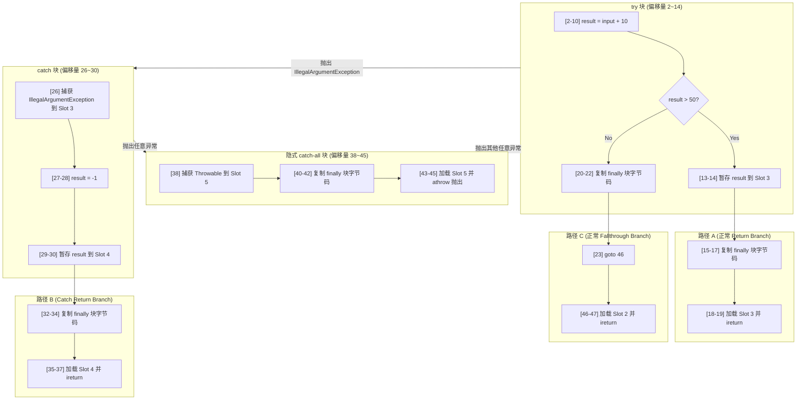

# 2.1.5.5 属性表（Attribute Table）深度剖析

在 Java 虚拟机（JVM）的类文件结构中，**属性表（Attribute Table）**是承载 Class 文件中绝大多数关键元数据与执行逻辑的核心结构。无论是方法的字节码、局部变量的名字、调试时的行号映射、静态常量的初值，还是 Java 动态语言支持（`invokedynamic`）背后的引导方法，都是以“属性”的形式寄宿在 Class 文件中的。

本文将从 Class 文件的物理字节流出发，深度解剖 JVM 属性表的开放扩展设计哲学，详拆 8 大核心属性的物理二进制结构，并通过 16 进制字节码对照与 `javap -v` 解析，揭示 Java 编译器在处理 `finally` 块时，如何通过“多路径复制代码段”进行物理拼装与异常表控制流重构的底层细节。

---

## 一、 属性表的设计哲学与通用物理结构

### 1.1 开放扩展的生态与设计意图
在 Class 文件结构中，诸如字段表（`field_info`）与方法表（`method_info`）在结构设计上都是高度静态与收敛的。它们的大小与所包含的字段（如 `access_flags`、`name_index`、`descriptor_index`）在 Class 规范中被完全硬编码规定，这能够最大化压缩二进制体积并提升解析效率。

然而，随着 Java 版本的演进，虚拟机需要记录的元数据类型呈爆炸式增长。如果每次引入新特性（例如泛型、Lambda 表达式、模块化、强类型校验等）都去修改 Class 文件的静态骨架，将导致严重的向前与向后兼容性灾难。

为此，JVM 规范在 ClassFile、`field_info`、`method_info` 以及 `Code_attribute` 内部都预留了**属性表（attributes）**。属性表采取了一种**彻底开放的自描述与非强约束架构**。任何编译器、JVM 实现厂商、乃至第三方字节码处理工具（如混淆器、APM 探针等），都可以往属性表中写入自定义的属性。

### 1.2 属性表的通用物理结构（`attribute_info`）
在 Class 文件物理字节流中，所有属性都必须符合如下的通用骨架结构：

```c
attribute_info {
    u2 attribute_name_index;
    u4 attribute_length;
    u1 info[attribute_length];
}
```

其各字段的物理意义如下：

| 字节类型 | 字段名 | 物理意义 |
| :--- | :--- | :--- |
| **u2** | `attribute_name_index` | 指向常量池（Constant Pool）中一个 `CONSTANT_Utf8_info` 常量的索引，该常量以字符串形式声明了本属性的名称（如 `"Code"`、`"LineNumberTable"` 等）。 |
| **u4** | `attribute_length` | 声明了当前属性内容的具体字节长度。**特别注意：该长度不包含 `attribute_name_index`（2 字节）和 `attribute_length` 本身（4 字节），仅指紧随其后的 `info` 数组的字节数。** |
| **u1** | `info[attribute_length]` | 属性的实际载荷。它的内部结构完全由 `attribute_name_index` 对应的属性名称决定。不同属性在这个字节流中的解析逻辑各不相同。 |

### 1.3 长度抽象（`u4 length`）的重大意义
通用骨架中的 `attribute_length` 是 u4（4 字节，可表示最大约 4GB 的数据长度）设计，具有极强的战略性前瞻意义：
1. **平滑的向前/向后兼容性（Backward/Forward Compatibility）**：当老旧版本的 JVM 读取了由高版本编译器编译的 Class 文件时，一旦遇到未知的属性（例如 JDK 1.1 的虚拟机遇到了 JDK 8 独有的 `MethodParameters` 属性），虚拟机不需要崩溃报错。它只需要读取 `attribute_name_index` 识别出这是一个“陌生”属性，然后读取其 `attribute_length`，在字节流中**直接跳过对应长度的字节**，即可安全地继续解析 Class 文件的其余部分。
2. **厂商及工具的自定义扩展**：商业 JVM 厂商或第三方框架可以在 Class 文件中植入特有的属性（如混淆标记、性能监控锚点、字节码加解密校验签名等）。只要保证属性名字不冲突，且严格遵守 `attribute_info` 的通用物理骨架，这些自定义属性就可以完美共存，而不会破坏任何符合 JVM 标准的运行期环境。

---

## 二、 8 大核心属性的物理字节结构详拆

JVM 规范定义了数十种属性，本节精选其中最核心、对执行引擎与类加载机制影响最深远的 8 大属性进行字节级拆解。

---

### 2.1 `Code` 属性：JVM 执行引擎的灵魂
`Code` 属性是 JVM 方法表（`method_info`）中最关键的属性，它承载了 Java 方法被编译后的具体 Java 字节码指令流。除了接口方法（Interface Method）和原生方法（Native Method）外，所有方法都必须有且仅有一个 `Code` 属性。

#### 2.1.1 物理字节结构表
`Code` 属性本身的结构非常复杂，包含嵌套的异常表以及内部子属性表，其物理结构定义如下：

```c
Code_attribute {
    u2 attribute_name_index;
    u4 attribute_length;
    u2 max_stack;
    u2 max_locals;
    u4 code_length;
    u1 code[code_length];
    u2 exception_table_length;
    {   u2 start_pc;
        u2 end_pc;
        u2 handler_pc;
        u2 catch_type;
    } exception_table[exception_table_length];
    u2 attributes_count;
    attribute_info attributes[attributes_count];
}
```

*   **`max_stack`（u2）**：声明该方法执行时操作数栈（Operand Stack）所能达到的最大深度。JVM 执行引擎在为该方法创建栈帧（Stack Frame）时，会根据此值分配操作数栈的大小。编译器在编译期间，通过对所有可能的分支路径模拟指令的入栈、出栈行为，静态计算出该最大深度。
*   **`max_locals`（u2）**：声明该方法局部变量表（Local Variable Table）所需的存储空间大小。其基本单位是 **Slot（变量槽）**。
    *   `double` 和 `long` 类型的局部变量占用 2 个 Slot，其余类型（如 `int`、`float`、`reference`、`returnAddress`）占用 1 个 Slot。
    *   非静态方法（Non-Static Method）的 Slot 0 会被隐式分配给指向当前对象实例的引用 `this`。
    *   **变量槽复用机制**：为了压缩栈帧空间，局部变量表中的 Slot 是可以高度复用的。一旦某个局部变量的生命周期在方法内结束（即超出了其作用域范围），它所占用的 Slot 就可以重新分配给后文定义的其他变量。因此，`max_locals` 通常小于方法中声明的所有局部变量大小总和。
*   **`code_length`（u4）**：字节码流 `code` 的长度。虽然该字段是 u4 类型，但 JVM 规范明文规定，**单个方法的字节码长度不能超过 65535 字节**（因为异常表、调试表中的 PC 指针偏移量多数是 u2 类型限制）。
*   **`code[code_length]`（u1 数组）**：实际存放 JVM 字节码指令的二进制字节流。在 JVM 执行时，PC（程序计数器）指针会指向这里，按字节解析并执行具体的指令码（Opcode）和操作数（Operands）。
*   **`exception_table`（异常表）**：记录方法体内所有显式或隐式的异常处理逻辑（即 `try-catch` 块的运行期映射）。每个条目包含：
    *   `start_pc` (u2) 和 `end_pc` (u2)：共同划定该异常处理器所监控的字节码偏移量区间，区间为 **左闭右开 `[start_pc, end_pc)`**。
    *   `handler_pc` (u2)：若在此区间内发生匹配的异常，JVM 将直接把 PC 指针跳转到该偏移量处（即 catch 块的入口）。
    *   `catch_type` (u2)：常量池索引，指向一个 `CONSTANT_Class_info` 结构，表示捕获的异常类。**若 `catch_type` 值为 0，则代表匹配任意类型的异常（any），这专门用于实现 `finally` 语义或 catch-all 兜底拦截器**。
*   **`attributes_count` 与 `attributes`**：`Code` 属性内部嵌套的子属性表，用于存放如行号表（`LineNumberTable`）、局部变量表（`LocalVariableTable`）、类型快照表（`StackMapTable`）等辅助执行或调试的元数据。

#### 2.1.2 JVM 内部异常查找算法模拟（基于 HotSpot 实现原理）
当方法执行过程中抛出异常时，JVM 不会无脑终止执行，而是会遍历该方法 `Code` 属性内部的 `exception_table`。其搜索逻辑可以用如下 C++ 伪代码表达：

```cpp
// 模拟 JVM 在 Code 属性中查找异常处理器
int search_exception_handler(Method* method, int current_pc, InstanceKlass* exception_klass) {
    // 1. 获取 Code 属性中的异常表
    ExceptionTable* ex_table = method->exception_table();
    int table_length = ex_table->length();
    
    // 2. 按编译器生成的顺序进行线性扫描
    for (int i = 0; i < table_length; i++) {
        ExceptionTableEntry entry = ex_table->get(i);
        
        // 3. 校验当前 PC 计数器是否在 try 的 [start_pc, end_pc) 区间内
        if (current_pc >= entry.start_pc && current_pc < entry.end_pc) {
            
            // 4. 判断 catch 类型是否是 catch-all 拦截器 (常用于 finally)
            if (entry.catch_type == 0) {
                return entry.handler_pc; // 直接命中，返回 finally 入口
            }
            
            // 5. 解析常量池中的异常类符号引用
            InstanceKlass* catch_klass = method->constants()->klass_at(entry.catch_type);
            
            // 6. 进行类型安全检查：抛出的异常是否是 catch 声明异常的子类/相同类
            if (exception_klass->is_subtype_of(catch_klass)) {
                return entry.handler_pc; // 类型匹配，跳转到指定的 catch 块入口
            }
        }
    }
    
    // 7. 若方法内未找到任何匹配的处理器，通知执行引擎进行栈桢弹栈 (Stack Unwinding)
    return -1; 
}
```

#### 2.1.3 编译期操作数栈模拟 DFS 算法简述
在编译期间，编译器为了确定 `max_stack` 的大小，会对控制流图（Control Flow Graph）进行深度优先搜索（DFS）。在遍历每个基本块的字节码指令时，维护一个虚拟栈。每当遇到压栈指令（如 `iload`）就将深度加 1，遇到出栈指令（如 `iadd` 会弹出两个操作数并压入一个结果，净变化为 -1）就更新当前深度。
通过这种静态拓扑推导，编译器可以得到在各种执行路径下可能达到的最大栈深度，该最大值将被写回并固定在 Class 文件的 `max_stack` 字段中。

---

### 2.2 `Exceptions` 属性：方法签名 throws 的宣告
**特别注意：`Exceptions` 属性必须与 `Code` 属性内部的异常处理表（Exception Table）区分开来。**
*   `Code` 属性内部的 Exception Table 是方法执行期间，控制流发生异常跳转的**指令级路由表**。
*   `Exceptions` 属性是方法级别的属性（与 `Code` 属性同级），它用于记录方法签名中通过 `throws` 关键字列出的所有受检异常（Checked Exceptions）。其主要服务于编译期类型检查以及 Java 反射机制。

#### 2.2.1 物理字节结构表
```c
Exceptions_attribute {
    u2 attribute_name_index;
    u4 attribute_length;
    u2 number_of_exceptions;
    u2 exception_index_table[number_of_exceptions];
}
```

*   **`number_of_exceptions`（u2）**：声明了该方法抛出的受检异常总数。
*   **`exception_index_table[number_of_exceptions]`（u2 数组）**：每个元素都是一个指向常量池中 `CONSTANT_Class_info` 的索引，表示被 throws 声明的异常类的符号引用。

---

### 2.3 `ConstantValue` 属性：静态常量的编译期直接注入
`ConstantValue` 属性是用于字段表（`field_info`）中的属性。它的作用是在类加载的早期阶段，为被声明为**静态常量**的字段直接分配初始值。

#### 2.3.1 物理字节结构表
```c
ConstantValue_attribute {
    u2 attribute_name_index;
    u4 attribute_length; // 恒等于 2
    u2 constantvalue_index;
}
```

*   **`constantvalue_index`（u2）**：常量池索引。该索引指向的常量池条目类型根据字段类型而不同：
    *   若字段为 `int`、`boolean`、`char`、`short`、`byte`，指向 `CONSTANT_Integer_info`。
    *   若字段为 `long`，指向 `CONSTANT_Long_info`。
    *   若字段为 `float`，指向 `CONSTANT_Float_info`。
    *   若字段为 `double`，指向 `CONSTANT_Double_info`。
    *   若字段为 `String`，指向 `CONSTANT_String_info`。

#### 2.3.2 静态常量的编译期验证与非静态常量辨析
在 Java 中，并非所有 `static final` 的变量都会产生 `ConstantValue` 属性。
例如：
*   `public static final int A = 100;` 会生成此属性。
*   `public static final double B = Math.random();` 则**不会**生成此属性。

这是因为 `Math.random()` 并不是一个能够在编译期静态确定的字面量（Literal），它依赖于运行时的指令执行才能获得结果。在这种情况下，编译器会抛弃 `ConstantValue` 属性，转而将对 `B` 的初始化赋值语句编译进静态代码块 `<clinit>` 中。

---

### 2.4 `InnerClasses` 属性：内部类的拓扑关联
Java 语言允许在类内部定义内部类，但 JVM 物理层面上并没有“嵌套类”的概念，所有的类在编译后都会生成独立的 `.class` 文件。`InnerClasses` 属性定义在 ClassFile 级别，专门用来记录当前类与内部类之间的从属与关联拓扑结构。

#### 2.4.1 物理字节结构表
```c
InnerClasses_attribute {
    u2 attribute_name_index;
    u4 attribute_length;
    u2 number_of_classes;
    {   u2 inner_class_info_index;
        u2 outer_class_info_index;
        u2 inner_name_index;
        u2 inner_class_access_flags;
    } classes[number_of_classes];
}
```

对于 `classes` 数组中的每个元素，字段含义如下：
*   **`inner_class_info_index`（u2）**：常量池索引，指向 `CONSTANT_Class_info`，代表该内部类的符号引用。
*   **`outer_class_info_index`（u2）**：指向外部宿主类的 `CONSTANT_Class_info`。**若此内部类是匿名内部类（Anonymous Inner Class）或局部内部类（Local Class），则该值为 0。**
*   **`inner_name_index`（u2）**：指向一个 `CONSTANT_Utf8_info` 索引，表示内部类的简单名称（如 `"Inner"`）。**如果是匿名类，则该值为 0。**
*   **`inner_class_access_flags`（u2）**：内部类的访问标志（Access Flags），如 `ACC_PUBLIC`、`ACC_PRIVATE`、`ACC_STATIC` 等。与普通类不同的是，内部类在此可以包含非普通类所拥有的标志（例如 `ACC_PRIVATE` 表示内部类是私有的）。

---

### 2.5 `LineNumberTable` 属性：崩溃堆栈还原的基石
`LineNumberTable` 属性是 `Code` 属性下的一个可选子属性。它用于建立**字节码指令偏移量（PC 指针位置）与 Java 源代码行号之间的映射关系**。

#### 2.5.1 物理字节结构表
```c
LineNumberTable_attribute {
    u2 attribute_name_index;
    u4 attribute_length;
    u2 line_number_table_length;
    {   u2 start_pc;
        u2 line_number;
    } line_number_table[line_number_table_length];
}
```

*   **`start_pc`（u2）**：当前代码行所对应的第一条字节码指令在 `code` 字节流中的偏移量。
*   **`line_number`（u2）**：对应的 Java 源码行号。

---

### 2.6 `LocalVariableTable` 与 `LocalVariableTypeTable` 属性：泛型擦除后的救赎

#### 2.6.1 `LocalVariableTable` 物理字节结构表
`LocalVariableTable` 是 `Code` 属性下的可选子属性，建立局部变量槽索引与源代码中变量名、类型描述符的映射。

```c
LocalVariableTable_attribute {
    u2 attribute_name_index;
    u4 attribute_length;
    u2 local_variable_table_length;
    {   u2 start_pc;
        u2 length;
        u2 name_index;
        u2 descriptor_index;
        u2 index;
    } local_variable_table[local_variable_table_length];
}
```

*   **`start_pc`（u2）与 `length`（u2）**：定义了该局部变量在字节码指令流中的生存作用域 `[start_pc, start_pc + length)`。
*   **`descriptor_index`（u2）**：指向 `CONSTANT_Utf8_info`，存储类型描述符。如 `Ljava/util/List;`。

#### 2.6.2 泛型还原与 `LocalVariableTypeTable` 的对比
由于 Java 语言的泛型采用**类型擦除（Type Erasure）**机制，方法参数如 `List<String> list` 在编译后，其在 `LocalVariableTable` 中的 `descriptor_index` 将只保留擦除后的裸类型 `Ljava/util/List;`。
为了能让 IDE 在调试时识别出泛型参数的真实类型，或者让反射工具提取非擦除的泛型信息，编译器会并行生成另一个属性——**`LocalVariableTypeTable`**。

其结构与 `LocalVariableTable` 几乎完全一致，唯一的区别在于将 `descriptor_index` 替换为了 **`signature_index`（u2）**。该索引指向的 UTF-8 常量中存储了包含泛型信息的特征签名，形如：`Ljava/util/List<Ljava/lang/String;>;`。通过这两个属性的互相配合，调试器才能在运行时重现泛型上下文。

---

### 2.7 `StackMapTable` 属性：类加载快路径校验的密码
`StackMapTable` 属性自 Java 6（Class 版本号 50.0 及以上）被引入，作为 `Code` 属性的子属性。它是 JVM 类加载时“连接-验证”阶段的重大安全与性能优化。

#### 2.7.1 诞生背景：从 $O(N^3)$ 到 $O(N)$ 的质变
在早期的 JVM 实现中，类加载器在对字节码进行安全校验时，为了验证操作数栈和局部变量表的类型安全性，需要使用**数据流分析（Dataflow Analysis）**算法。
*   该算法在运行期模拟执行，遍历方法内所有的跳转和汇合路径，推演每个 PC 偏移量处的类型状态，这会导致高达 $O(N^3)$ 甚至更高的算法复杂度，且消耗大量堆内存。
*   自 Java 6 起，JVM 规范强制规定：如果 Class 文件的编译版本不低于 50.0，且方法包含跳转指令，则必须带有 `StackMapTable` 属性。
*   **类型检查验证器（Type Checker）**机制：编译器在编译期间，已经分析出了方法内部控制流在**所有分叉/汇合目标点（分支跳转点）**的操作数栈与局部变量表的“类型状态快照”（称为 **Stack Map Frame**）。类加载验证器在验证时，只需在线性扫描字节码的过程中，把当前的计算状态与 `StackMapTable` 中预存的 Frame 进行对比即可，时间复杂度骤降为 $O(N)$。

#### 2.7.2 类型的汇合并退化原理（Type Merging）
当多条控制流路径在某个节点汇合时，验证器必须合并不同分支流入的局部变量或栈顶元素的类型。其类型合并遵循以下核心法则是：
1. **类继承体系的合并**：若分支 A 在 Slot 1 存放类型为 `Dog` 的对象，分支 B 在 Slot 1 存放类型为 `Cat` 的对象。合并后的类型将退化为它们的**最近公共祖先类（Least Common Superclass）**，即 `Animal`。
2. **接口合并退化特殊机制**：根据 JVM 规范，若分支 A 与分支 B 流入的两个类，其共同祖先是一个或多个**接口（Interfaces）**，出于运行时验证效率以及规避接口多继承网络的高代价图遍历算法考虑，验证器在 `StackMapTable` 生成时，会将其**统一退化为 `java.lang.Object`**。而具体的类型安全性保障，则由执行引擎在后续运行期利用 `invokeinterface` 等指令做动态分派时进行防御。

#### 2.7.3 `Uninitialized` 类型的生命周期安全保护
在 `verification_type_info` 中，类型标志为 8 的是 **`Uninitialized`**，它在物理流中紧跟一个 `u2 offset` 字段。
*   该偏移量指向创建此对象的 `new` 指令在 `code` 中的位置。
*   **设计原因**：当 JVM 执行 `new` 指令时，它只是在堆上分配了内存，此时对象尚未调用构造函数 `<init>`，处于“未初始化”状态。若此时该引用被复制、赋值或进行了字段存取，会导致严重的安全隐患。
*   **安全规则**：类型检查验证器通过在栈帧中标记 `Uninitialized(new_offset)`，确保在此对象被 `invokespecial` 调用构造器完成初始化之前，任何针对该引用的非法操作（如 `getfield`、`putfield` 等）都会被直接拦截。一旦 `<init>` 被成功调用，验证器会将该 Frame 以及操作数栈中所有标记为 `Uninitialized(new_offset)` 的类型在线性扫描过程中原子转换为正式的类类型。

#### 2.7.4 变长 Frame 物理字节结构拆解
`StackMapTable` 中由首字节 `frame_type` 派生出以下各种不同 Frame 的物理结构：

```c
// 1. same_frame (0-63)
// 偏移增量即为 frame_type，无需额外数据

// 2. same_locals_1_stack_item_frame (64-127)
same_locals_1_stack_item_frame {
    u1 frame_type; /* 64-127 */
    verification_type_info stack[1];
}

// 3. same_locals_1_stack_item_frame_extended (247)
same_locals_1_stack_item_frame_extended {
    u1 frame_type; /* 247 */
    u2 offset_delta;
    verification_type_info stack[1];
}

// 4. chop_frame (248-250)
chop_frame {
    u1 frame_type; /* 248-250 */
    u2 offset_delta;
}

// 5. same_frame_extended (251)
same_frame_extended {
    u1 frame_type; /* 251 */
    u2 offset_delta;
}

// 6. append_frame (252-254)
append_frame {
    u1 frame_type; /* 252-254 */
    u2 offset_delta;
    verification_type_info locals[frame_type - 251];
}

// 7. full_frame (255)
full_frame {
    u1 frame_type; /* 255 */
    u2 offset_delta;
    u2 number_of_locals;
    verification_type_info locals[number_of_locals];
    u2 number_of_stack_items;
    verification_type_info stack[number_of_stack_items];
}
```

*   **`offset_delta`（偏移量增量）的精确计算**：
    在 `StackMapTable` 中，为了最大化压缩物理体积，除方法中首个 Frame 以外，后续所有 Frame 存储的都不是绝对的 PC 偏移量，而是 **相对上一个 Frame 的偏移增量（`offset_delta`）减 1**。
    例如，若前一个跳转目标点在 PC 20，下一个跳转目标点在 PC 26。它们之间的绝对差值是 6。在物理存储中，其 `offset_delta` 实际存储为 `6 - 1 = 5`（对于 extended 系列帧）。这种紧凑结构极大减少了高频复杂跳转下 Class 文件的字节膨胀率。

---

### 2.8 `BootstrapMethods` 属性：动态绑定的核心纽带
`BootstrapMethods` 属性定义在 ClassFile 级别。它是 Java 7 为支持动态语言及 Java 8 实现 Lambda 表达式而引入的 `invokedynamic` 指令的灵魂伴侣。

#### 2.8.1 物理字节结构表
```c
BootstrapMethods_attribute {
    u2 attribute_name_index;
    u4 attribute_length;
    u2 num_bootstrap_methods;
    {   u2 bootstrap_method_ref;
        u2 num_bootstrap_arguments;
        u2 bootstrap_arguments[num_bootstrap_arguments];
    } bootstrap_methods[num_bootstrap_methods];
}
```

*   **`bootstrap_method_ref`（u2）**：常量池索引，必须指向一个 `CONSTANT_MethodHandle_info` 常量。这个 MethodHandle 必须引用一个静态的引导方法（Bootstrap Method，例如 Lambda 编译时常用的 `java.lang.invoke.LambdaMetafactory.metafactory`）。
*   **`num_bootstrap_arguments`（u2）**：传给上述引导方法的静态参数个数。
*   **`bootstrap_arguments[num_bootstrap_arguments]`（u2 数组）**：每一个都是常量池的索引，将作为静态常量参数在类加载期间传递给引导方法。

#### 2.8.2 invokedynamic 指令与 Lambda 编译链条全解析
为了理清这一动态调用过程，我们以 Java 8 中的经典 Lambda 语句为例：

```java
Runnable r = () -> System.out.println("Hello");
```

其底层的二进制常量池索引以及 `BootstrapMethods` 属性表的调用链条如下：

1.  **字节码指令指令流**：
    编译器在编译该 Lambda 时，会产生如下字节码指令：
    ```assembly
    0: invokedynamic #2,  0  // 引用常量池第 2 项，第二个参数 0 为占位符
    ```
2.  **常量池（Constant Pool）解析**：
    *   索引 `#2` 指向一个 **`CONSTANT_InvokeDynamic_info`** 结构：
        ```c
        CONSTANT_InvokeDynamic_info {
            u1 tag; // 18 (表示 InvokeDynamic)
            u2 bootstrap_method_attr_index; // 指向 BootstrapMethods 属性表中第 0 个条目
            u2 name_and_type_index; // 指向常量池中的 #15 "run:()Ljava/lang/Runnable;"
        }
        ```
3.  **定位 `BootstrapMethods` 属性表条目 0**：
    该条目用于指示如何在运行期首次装配该调用点：
    *   **`bootstrap_method_ref`** 指向 `CONSTANT_MethodHandle_info`，它以 `REF_invokeStatic` 方式链接至 `java.lang.invoke.LambdaMetafactory.metafactory` 方法。
    *   **`bootstrap_arguments`** 包含三个关键静态参数：
        1.  `samMethodType`（指向类型描述符 `()V`）：表示 Lambda 最终需要实现的接口方法类型签名。
        2.  `implMethod`（指向一个 `CONSTANT_MethodHandle_info`）：该句柄指向编译器悄悄生成的私有静态辅助方法 `lambda$main$0`（该方法内部承载了真正的 `System.out.println` 代码）。
        3.  `instantiatedMethodType`（指向类型描述符 `()V`）：运行时实例化后，被限制的特定类型签名。

#### 2.8.3 MethodHandle 与反射（Method）的性能与验证差异
`invokedynamic` 和引导方法的核心依赖是 `java.lang.invoke.MethodHandle`（方法句柄）。它与传统的 Java 反射 `java.lang.reflect.Method` 相比有本质区别：
1. **安全检查时机**：反射在每次调用 `invoke()` 时，都会重复进行一次完整的安全性、可见性及访问控制权限检查。这导致大量的性能损耗。而 `MethodHandle` 的访问检查仅在**解析与获取**（即引导方法执行时的 `lookup`）阶段执行一次。一旦方法句柄生成并绑定到 `CallSite`，随后的执行路径就像直接进行虚方法调用一样快速，不存在额外的安全开销。
2. **底层设计哲学**：反射 `Method` 包含了方法名、类信息、注解等全量元数据，是 Java 代码视角的“全相”表示；而 `MethodHandle` 是 JVM 视角的执行引擎优化。它是一个高度抽象的类型安全指针，仅仅封装了方法的调用入口和类型签名，使得执行引擎能够将其完全内联（Inline）并做高强度编译期优化。

---

## 三、 深度解刨：finally 块的字节码级物理拼装与多路径复制代码实现

在 Java 语言规范中，`finally` 块中的代码被赋予了强力的语义保证：**无论 `try` 块内是正常执行完毕、发生异常，还是执行了 `return`、`break` 乃至 `continue` 等控制流中断操作，`finally` 块中的代码都确保一定会被执行。**

然而，如果从 JVM 指令集的物理层面去审视，**JVM 并没有提供任何类似于 `finally` 或 `ensure_execute` 这样的专属指令**。那么，编译器是如何在物理字节码层面上，将这一语言级的强保证落实到每一条跳转指令之上的？

### 3.1 历史演进：从 `jsr` 的弃用到“多路径复制”的诞生
在早期的 JDK 编译策略中（Java 5 及以前），编译器使用 `jsr`（Jump Subroutine，跳转到子程序）和 `ret`（从子程序返回）指令来实现 `finally`。
*   在这种实现下，`finally` 块的代码在字节码中只存在一份物理副本（作为“子程序”）。当 `try` 正常结束、返回或发生异常时，均调用 `jsr` 跳转到这份子程序处执行，完成后再通过 `ret` 返回到原调用处。
*   **弃用原因**：`jsr` 指令会让数据流分析校验极其困难，因为它创造了复杂的局部重入控制流。为了配合 Java 6 引入的 `StackMapTable` 快路径线性验证，JVM 规范在 50.0 版本的 Class 文件中**彻底废弃并禁止了 `jsr` 与 `ret` 指令**。
*   **现代方案：多路径复制代码段（Inlining finally blocks）**。编译器在编译时，会把 `finally` 块的字节码**复制并物理拼装到所有可能的控制流出口路径中**，并通过自动构建 catch-all 异常处理器（Exception Handler）来实现异常出口下的兜底调用。

---

### 3.2 实战拆解：多路径复制代码的物理对照

为了彻底看清编译器是如何拼装物理路径的，我们编写并编译一个包含 `try-catch-finally` 且在多处存在 `return` 的典型 Java 类形式：

```java
package scratch;

public class FinallyShowcase {
    public int execute(int input) {
        int result = 0;
        try {
            result = input + 10;
            if (result > 50) {
                return result; // 路径 A: try 内满足条件提前 return
            }
        } catch (IllegalArgumentException e) {
            result = -1;
            return result; // 路径 B: catch 内捕获异常后 return
        } finally {
            result = 99; // finally 修改变量值
        }
        return result; // 路径 C: try 正常执行完毕后的 fallthrough 正常 return
    }
}
```

---

#### 3.2.1 `javap -v` 反编译结果输出
使用 JDK 11（Class 版本 55.0）编译后，使用 `javap -v scratch.FinallyShowcase` 对其 `execute` 方法进行反汇编，得到如下输出：

```assembly
  public int execute(int);
    descriptor: (I)I
    flags: (0x0001) ACC_PUBLIC
    Code:
      stack=2, locals=6, args_size=2
         0: iconst_0
         1: istore_2
         2: iload_1
         3: bipush        10
         5: iadd
         6: istore_2
         7: iload_2
         8: bipush        50
        10: if_icmple     20
        13: iload_2
        14: istore_3
        15: bipush        99
        17: istore_2
        18: iload_3
        19: ireturn
        20: bipush        99
        22: istore_2
        23: goto          46
        26: astore_3
        27: iconst_m1
        28: istore_2
        29: iload_2
        30: istore        4
        32: bipush        99
        34: istore_2
        35: iload         4
        37: ireturn
        38: astore        5
        40: bipush        99
        42: istore_2
        43: aload         5
        45: athrow
        46: iload_2
        47: ireturn
      Exception table:
         from    to  target type
             2    15    26   Class java/lang/IllegalArgumentException
             2    15    38   any
            26    32    38   any
            38    40    38   any
```

---

#### 3.2.2 16 进制原始字节码对照表
接下来，我们提取该 Class 文件中 `execute` 方法的 `Code` 属性下的 `code` 二进制流（共 48 字节），进行逐字节指令级物理对照：

```
Raw Hex: 03 3d 1b 10 0a 60 3d 1c 10 32 a4 00 0a 1c 3e 10 63 3d 1d ac 10 63 3d a7 00 17 4e 02 3d 1c 36 04 10 63 3d 15 04 ac 3a 05 10 63 3d 19 05 bf 1c ac
```

以下是每一个字节的物理指令、操作数以及对应逻辑路径的逐条对照解析表：

| 偏移 (PC) | 十六进制字节码 | 指令助记符与操作数 | 物理作用与控制流解析 |
| :--- | :--- | :--- | :--- |
| **0** | `03` | `iconst_0` | 将常数 `0` 压入操作数栈顶。 |
| **1** | `3d` | `istore_2` | 将栈顶的 `0` 存入局部变量 Slot 2（即初始化 `result = 0`）。 |
| **2** | `1b` | `iload_1` | **[Try 块起点]** 加载 Slot 1（参数 `input`）到栈顶。 |
| **3** | `10 0a` | `bipush 10` | 将常数 `10` 压入操作数栈。 |
| **5** | `60` | `iadd` | 执行加法，得到 `input + 10`。 |
| **6** | `3d` | `istore_2` | 结果存入 Slot 2（`result = input + 10`）。 |
| **7** | `1c` | `iload_2` | 加载 `result`。 |
| **8** | `10 32` | `bipush 50` | 压入常数 `50`。 |
| **10** | `a4 00 0a` | `if_icmple 20` | 若 `result <= 50`，分支跳转到偏移量 **20** 处。 |
| **13** | `1c` | `iload_2` | **[路径 A: try 内 return 发生处]** 加载当前的 `result`。 |
| **14** | `3e` | `istore_3` | **[核心] 将当前的返回值暂存到 Slot 3 中。** 以防后文的 finally 代码覆盖 Slot 2 从而污染返回值。 |
| **15** | `10 63` | `bipush 99` | **[finally 代码副本 A]** 将常量 `99` 压栈。 |
| **17** | `3d` | `istore_2` | **[finally 代码副本 A]** 写入 Slot 2（执行 `result = 99`）。 |
| **18** | `1d` | `iload_3` | 重新把刚才暂存在 Slot 3 的返回值加载到栈顶。 |
| **19** | `ac` | `ireturn` | **[路径 A 物理结束]** 返回栈顶的 `result` 历史值（不包含 99）。 |
| **20** | `10 63` | `bipush 99` | **[路径 C: 正常流程无 return 时]** **[finally 代码副本 C]** 压入常量 `99`。 |
| **22** | `3d` | `istore_2` | **[finally 代码副本 C]** 写入 Slot 2（执行 `result = 99`）。 |
| **23** | `a7 00 17` | `goto 46` | 跳转到偏移量 **46**（即 try-catch 外的最后那个统一 return 处）。 |
| **26** | `4e` | `astore_3` | **[路径 B: catch 块入口]** 捕获 `IllegalArgumentException` 对象，存入 Slot 3（即变量 `e`）。 |
| **27** | `02` | `iconst_m1` | 将常数 `-1` 压栈。 |
| **28** | `3d` | `istore_2` | 结果存入 Slot 2（`result = -1`）。 |
| **29** | `1c` | `iload_2` | **[路径 B: catch 内 return 发生处]** 加载当前的 `result`（即 -1）。 |
| **30** | `36 04` | `istore 4` | **[核心] 将 catch 路径下的返回值暂存至 Slot 4。** |
| **32** | `10 63` | `bipush 99` | **[finally 代码副本 B]** 将常量 `99` 压栈。 |
| **34** | `3d` | `istore_2` | **[finally 代码副本 B]** 写入 Slot 2（执行 `result = 99`）。 |
| **35** | `15 04` | `iload 4` | 重新把暂存在 Slot 4 的 `-1` 加载到栈顶。 |
| **37** | `ac` | `ireturn` | **[路径 B 物理结束]** 返回栈顶的 `-1`。 |
| **38** | `3a 05` | `astore 5` | **[路径 D: 隐式 catch-all 入口]** 捕获任意 `Throwable` 对象，暂存到 Slot 5。 |
| **40** | `10 63` | `bipush 99` | **[finally 代码副本 D]** 将常量 `99` 压栈. |
| **42** | `3d` | `istore_2` | **[finally 代码副本 D]** 写入 Slot 2（执行 `result = 99`）。 |
| **43** | `19 05` | `aload 5` | 从 Slot 5 中重新加载之前被临时保护起来的异常对象。 |
| **45** | `bf` | `athrow` | **[异常路径物理结束]** 物理抛出此异常给上层调用者。 |
| **46** | `1c` | `iload_2` | **[路径 C 汇合点]** 加载 Slot 2（已经在偏移量 22 处被 finally 修改为了 `99`）。 |
| **47** | `ac` | `ireturn` | **[路径 C 物理结束]** 返回 `99`。 |

---

### 3.3 控制流执行状态轨迹（Trace）明细表
为了清晰展示每条路径下操作数栈与局部变量表槽位的状态变化，以下对 4 条主要路径执行期间各步骤的物理状态进行模拟跟踪：

#### 路径 A（Try 块满足 `result > 50` 提前 Return）
假设输入参数 `input` = 45：
1. **PC 2**: 局部变量为 `[this, 45, 0]`，操作数栈为空。
2. **PC 3-5**: 加法操作。操作数栈变化：`[45]` -> `[45, 10]` -> 加法结果 `[55]`。
3. **PC 6**: `55` 弹出并写入 Slot 2。此时变量为 `[this, 45, 55]`。
4. **PC 7-10**: 比较操作。操作数栈变化：`[55]` -> `[55, 50]` -> 比较后栈空，不发生跳转（继续向下）。
5. **PC 13-14**: **[核心保护]** 将 Slot 2 的 `55` 加载入栈并存入 Slot 3。此时变量为 `[this, 45, 55, 55]`。该 Slot 3 用于冻结并锁定返回值。
6. **PC 15-17**: **[物理拼装 finally]**。操作数栈放入 `99`，并弹出改写 Slot 2 的值为 `99`。此时变量变更为 `[this, 45, 99, 55]`。
7. **PC 18**: 将冻结在 Slot 3 中的 `55` 重新加载入栈。
8. **PC 19**: 执行 `ireturn`，将栈顶的 `55` 返回。方法生命周期结束。

---

### 3.4 扩展场景思考：多重 Catch 与嵌套 Throw 下的异常表爆发
当方法的 `try` 块配置了多个不同的 `catch` 分支，且这些 `catch` 块自身还会抛出异常时，编译器生成的异常表物理条目将呈几何级数增长。这是因为：
1. **多 catch 入口重叠**：每一层具体的 `catch` 块本身也是被 `finally` 异常兜底器监控的。如果 catch 块 1 在执行时抛出新异常，它必须无缝触发 finally 块的副本并完成异常重新抛出。
2. **控制流出口拦截**：对于多 catch 分支下的每个 return 操作，编译器都需要单独为其生成一份 finally 块的物理副本拼装在 `ireturn`/`areturn` 之前。
这导致虽然源码看起来十分精简，但在 Class 二进制字节流中，方法的 `code` 长度和异常表物理条目会成倍激增。

---

### 3.5 控制流拓扑与多路径复制的可视化

结合上面的字节码分析，我们可以把整个方法的控制流以拓扑图形式画出来。可以明显看到，原本在 Java 代码中只写了一次的 `finally` 代码块（`result = 99`，即字节码指令 `bipush 99; istore_2`），在物理字节码中被复制了 **4 次**：



---

### 3.6 异常表的边界控制与物理隔离

仔细观察 `Exception table`，可以发现编译器非常精细地利用了**异常表的左闭右开区间**，以避免控制流死循环并保证异常的正确覆盖。

```assembly
      Exception table:
         from    to  target type
             2    15    26   Class java/lang/IllegalArgumentException
             2    15    38   any
            26    32    38   any
            38    40    38   any
```

#### 3.6.1 核心路由策略解析
1. **第一条规则 `2 ~ 15 -> 26 (IllegalArgumentException)`**：
   * 监控 try 块。其左闭右开区间 `[2, 15)` 刚好包含了所有的 try 指令，但**完全排除了偏移量 15 处的 finally 副本段**。这确保了如果异常发生在 finally 副本执行期间，它不会被当前的 catch 块重复捕获，避免了逻辑混乱。
2. **第二条规则 `2 ~ 15 -> 38 (any)`**：
   * 在 try 块内部抛出任何其他非 `IllegalArgumentException` 异常时，控制流将被重定向到 **38** （即 catch-all 的 Throwable 拦截器）。
3. **第三条规则 `26 ~ 32 -> 38 (any)`**：
   * 监控 catch 块。其区间为 `[26, 32)`。一旦在 catch 块执行 `result = -1` 并准备暂存返回值（偏移量 30 的 `istore 4`）期间发生任何异常，控制流依然会跳转到 **38**。
   * **这就是 finally 即使在 catch 块抛出异常时也一定会执行的物理原因。**
4. **第四条规则 `38 ~ 40 -> 38 (any)`**：
   * 监控异常拦截器的开头 `[38, 40)`。这可以防范在保存原有异常到 Slot 5 时可能发生的极端系统级异常（如 `StackOverflowError`），确保系统能尝试重入或彻底上报。

---

### 3.7 降维打击：从字节码看经典面试题

#### 3.7.1 为什么 try 块中 return 的值不会被 finally 块里的修改所篡改？
*   **Java 源码表象**：
    ```java
    try {
        result = input + 10; // 假设为 60
        return result; 
    } finally {
        result = 99;
    }
    ```
    外部调用此方法拿到的返回值是 `60`，而不是 `99`。
*   **字节码级本质**：
    在执行 finally 副本（偏移量 15-17）之前，编译器已经在偏移量 14 处通过 `istore_3`，**将要返回的值（60）物理复制并保存在了局部变量表的 Slot 3 中**。
    虽然 finally 段（17 处）确实将 Slot 2（变量 `result`）的值写改为了 `99`，但在方法真正退出（19 处的 `ireturn`）之前，JVM 会通过 `iload_3` **重新将 Slot 3 里的 60 加载回操作数栈顶**并将其返回。
    所以，**被修改的只是原来的局部变量槽，而返回值早已在执行 finally 前被物理隔离并受保护**。

#### 3.7.2 为什么在 finally 块里写 return 会导致异常“神秘丢失”？
*   **Java 源码表象**：
    若我们在 `finally` 块里写了 `return result;`。此时如果 `try` 块内发生了除零异常（`ArithmeticException`），原本应该抛给调用者，但由于 `finally` 里有 `return`，调用者会收到一个正常的返回值（如 99），而异常被直接“吞掉”了。
*   **字节码级本质**：
    对比两段不同的字节码逻辑：
    
    *   **正常无 return 的 finally 块异常出口**：
        ```assembly
        38: astore 5       // 捕获 Throwable 到 Slot 5
        40: bipush 99      // 执行 finally 副本
        42: istore_2
        43: aload 5        // 重新加载异常
        45: athrow         // 抛出异常！
        ```
    *   **含有 return 语句的 finally 块**：
        若 finally 中包含 `return result;`（即 bipush 99; istore_2; iload_2; ireturn），编译器会**直接将重新抛出异常的物理路径截断**：
        ```assembly
        38: astore 5       // 捕获 Throwable 到 Slot 5
        40: bipush 99      // 执行 finally 副本
        42: istore_2
        43: iload_2        // 加载变量值 99
        44: ireturn        // 直接执行方法退出！
        ```
        可以清晰看到，**45 处的 `athrow` 指令在物理上被完全抹去了，直接替换为了 `ireturn`。**
        控制流一旦到达 `ireturn`，当前的栈帧即被销毁，保存在 Slot 5 中的异常引用直接被 JVM 抛弃，异常彻底丢失。

---

## 四、 生产实践：字节码增强工具（ASM / ByteBuddy）与属性操作

在通用的 Java 性能分析、链路追踪（Java Agent）以及面向切面（AOP）框架的开发中，我们常常需要使用字节码增强类库（如 ASM、ByteBuddy）在运行期动态读取或篡改 Class 的属性表。

### 4.1 使用 ASM 操作 Code 属性及局部变量表
ASM 是一个低底层的字节码操控框架，它几乎是 Class 文件字节流的一对一映像映射。通过继承 `MethodVisitor`，我们能精准修改操作数栈或为方法插入全新的局部变量名：

```java
import org.objectweb.asm.MethodVisitor;
import org.objectweb.asm.Opcodes;

public class MyMethodAdapter extends MethodVisitor {
    public MyMethodAdapter(MethodVisitor mv) {
        super(Opcodes.ASM9, mv);
    }

    @Override
    public void visitCode() {
        super.visitCode();
        // 在方法的 Code 字节码最开头，动态织入一条输出打印语句
        mv.visitFieldInsn(Opcodes.GETSTATIC, "java/lang/System", "out", "Ljava/io/PrintStream;");
        mv.visitLdcInsn("Method Entered!");
        mv.visitMethodInsn(Opcodes.INVOKEVIRTUAL, "java/io/PrintStream", "println", "(Ljava/lang/String;)V", false);
    }

    @Override
    public void visitLocalVariable(String name, String descriptor, String signature, 
                                   Label start, Label end, int index) {
        // 该回调可以直接读取并改写 LocalVariableTable 和 LocalVariableTypeTable
        super.visitLocalVariable(name, descriptor, signature, start, end, index);
    }
}
```

### 4.2 开发级避坑指南
1. **重新计算 `max_stack` 和 `max_locals`**：当向方法体注入新指令或局部变量后，极易打破原本 Code 属性的 `max_stack` 限制，导致类验证失败（抛出 `VerifyError`）。在使用 ASM 的 `ClassWriter` 时，建议务必开启 **`COMPUTE_FRAMES`** 和 **`COMPUTE_MAXS`** 参数。这样，ASM 会在底层自动模拟 DFS 算法并重新计算生成 `StackMapTable` 及操作数栈高度。
2. **注意局部变量槽的复用偏移**：若手动通过字节码向方法内新增局部变量，需要仔细计算 `max_locals` 的起始 Slot 索引，避免新变量与原本已被复用的槽位发生物理冲突，进而污染参数或返回值。

### 4.3 JVM 类型验证器为什么要在 `athrow` 时强检 `Throwable`？
在 JVM 安全规范中，当执行 `athrow` 指令时，操作数栈顶存放的必须是一个能够向上转型为 `java.lang.Throwable` 的对象引用。
如果类型检查验证器（Type Checker）在线性扫描中发现，在 `athrow` 处操作数栈顶元素为非 Throwable 类型（例如是一个 `java.lang.String` 或者 `int` 基本类型），或者是一个虽然实例化但未曾执行构造函数 `<init>` 的 `Uninitialized` 引用，类加载连接的验证阶段就会直接中断并抛出 `java.lang.VerifyError`。
这保证了 JVM 运行时异常路由和派发体系（Exception Handler Dispatcher）的绝对稳定，杜绝了由于非正常异常对象伪装而引发的执行器类型混淆安全漏洞。

在通过 ASM 手动构建一个抛出异常的代码片段时，标准的字节码顺序应为：
```assembly
new java/lang/RuntimeException   // 1. 堆上分配对象
dup                              // 2. 复制引用（一份给构造，一份给 athrow）
ldc "Error Message"              // 3. 准备构造参数
invokespecial <init>             // 4. 调用构造函数完成初始化
athrow                           // 5. 抛出异常
```
若漏掉了第 2 步的 `dup` 或第 4 步的初始化，JVM 在加载该 Class 时，类型检查验证器就会通过 `StackMapTable` 中的 `Uninitialized` 跟踪规则直接拦截，保证运行时系统的健壮与安全。

---

## 五、 总结与最佳实践

### 5.1 属性表的核心机制总结
通过对 JVM 属性表的详细解剖，我们可以得出以下关键技术结论：
1. **架构高内聚低耦合**：JVM 通过通用的 `attribute_info` 物理骨架与 `attribute_length` 变长表示，构建了高度可扩展的类文件元数据结构，支撑了 Java 从 1.0 到现代版本的无缝演进。
2. **职责极其细分**：
   * `Code` 属性专注于运行期指令表达与局部变量/栈深度规划；
   * `StackMapTable` 专注于提升类验证阶段的效率，实现了类型状态快照机制；
   * `BootstrapMethods` 则是连接静态 Class 文件与 Java 运行时高度动态分派（Lambda 及动态类型）的桥梁。
3. **语言特性的物理还原**：诸如 `try-catch-finally` 这类复杂的语言特性，JVM 并没有为其设立专门的操作码，而是依靠编译器在字节码层面，通过**复制物理路径、拆分 Exception table 的左闭右开区间、以及使用专用的局部变量变量槽保护返回值**等手段，进行了精妙的物理拼装。

### 5.2 属性相关开发与排障建议
1. **合理配置编译参数**：
   * 在生产环境打包时，确保不要丢弃 `LineNumberTable`，否则会让线上 APM 监控和崩溃日志丧失行号定位能力。
   * 对于现代微服务框架（如 Spring Boot），建议在编译时开启 `-parameters` 参数，以便利用更标准的属性进行形参反射，减少对庞大的局部变量表的硬解析依赖。
2. **规避 Finally 的不良编码习惯**：
   * **绝对禁止**在 `finally` 块中书写 `return` 语句，这会导致任何被拦截的未捕获异常、甚至 try 块内原本的返回值被直接吞没。
   * **绝对禁止**在 `finally` 块中抛出新的异常，因为这同样会覆盖 try 或 catch 块内抛出的原始异常，给排障带来误导。
