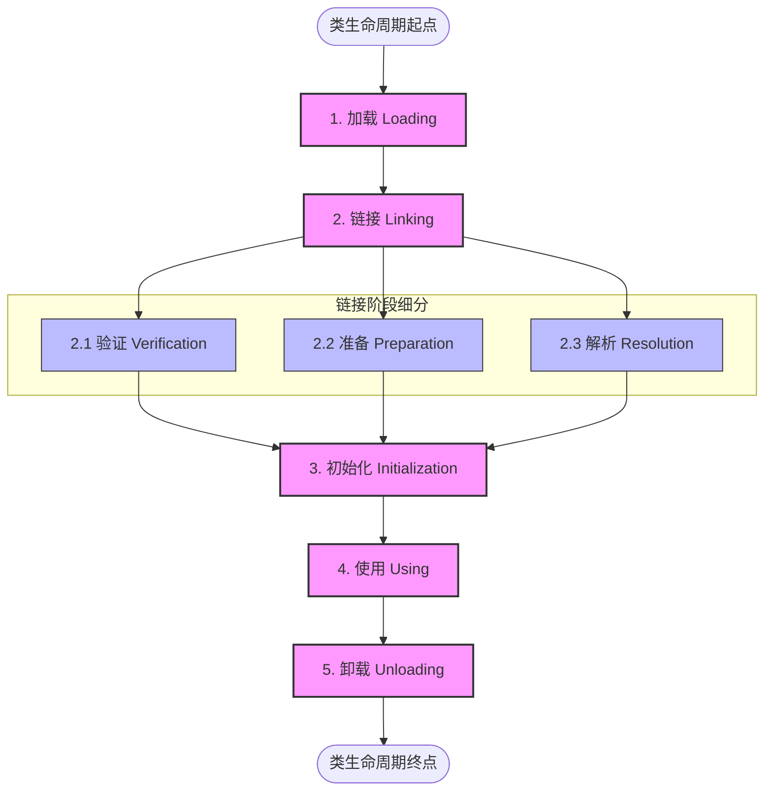
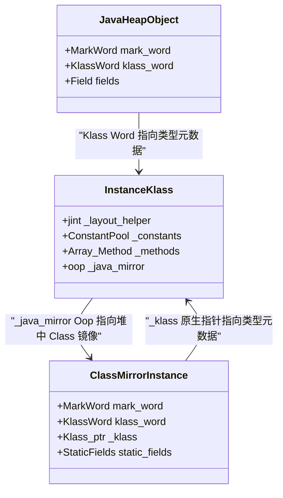
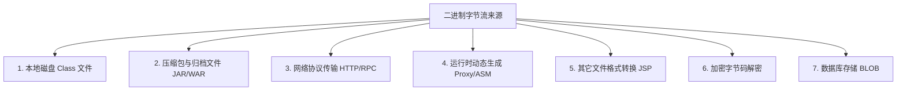
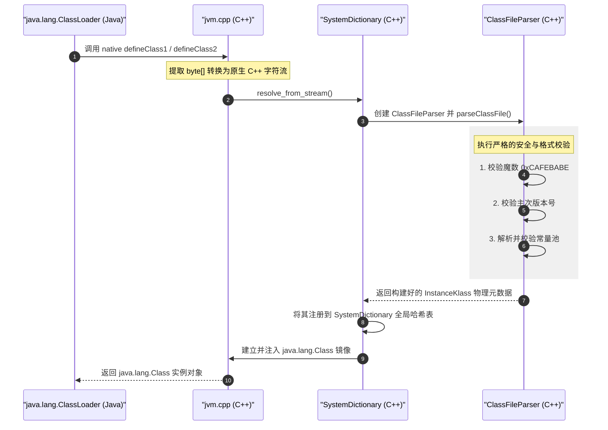

# 2.1.6.1 加载

类的“加载”（Loading）阶段是整个虚拟机类加载过程（Class Loading）的第一个阶段。在这个阶段中，Java 虚拟机（JVM）的主要任务是解决“如何将外部的二进制字节流导入到 JVM 内部，并将其转化为方法区内的运行时数据结构，同时在堆中创建对外访问通道”的问题。

需要特别指出的是，**“加载”（Loading）**只是**“类加载”（Class Loading）**过程中的一个子阶段，切勿将二者混淆。类加载过程是一个由“加载 -> 链接（验证、准备、解析） -> 初始化”等多个阶段有机结合的复杂生命周期，而加载阶段则是该生命周期的起点。

---

## 一、 类生命周期与加载阶段的定位

在深入剖析加载阶段之前，我们首先需要明确它在整个 Java 类生命周期中的位置。根据《Java 虚拟机规范》（Java Virtual Machine Specification），一个类从被加载到虚拟机内存开始，到被卸载出内存为止，它的整个生命周期将经历以下阶段：



在上述生命周期中，**加载**、**验证**、**准备**、**初始化**和**卸载**这五个阶段的顺序是确定的。类的加载过程必须按照这种顺序按部就班地**开始**（注意，是“开始”而不是“进行”或“完成”，因为这些阶段通常都是互相交叉地混合进行的，例如在加载阶段尚未完成时，验证阶段可能已经开始）。而**解析**阶段则不一定：它在某些情况下可以在初始化阶段之后再开始，这是为了支持 Java 语言的运行时绑定（也称为动态绑定或晚期绑定）。

---

## 二、 加载阶段的核心“三步走”

《Java 虚拟机规范》对加载阶段的职责给出了极为明确且宽泛的定义。在加载阶段，JVM 必须完成以下三件核心工作：

1. **通过一个类的全限定名来获取定义此类的二进制字节流。**
2. **将这个字节流所代表的静态存储结构转化为方法区的运行时数据结构。**
3. **在内存中生成一个代表这个类的 `java.lang.Class` 对象，作为方法区这个类的各种数据的访问入口。**

这三个步骤看似简单，但其背后的实现机制、数据转化过程以及内存布局协同却非常复杂。下面我们将逐一对这三个步骤进行深度剖析。

### 1. 第一步：通过全限定名获取二进制字节流

#### （1）全限定名（Fully Qualified Name）的表达
在 Java 代码中，我们通常使用点号分割的形式来表示一个类的全限定名，例如 `java.lang.String`。但在 Class 文件格式以及 JVM 内部，类的全限定名采用的是**斜杠分割**的形式，这被称为**“原始类型描述符”**或**“内部形式”**，例如 `java/lang/String`。

当 JVM 试图加载一个类时，它会拿着这个全限定名去寻找对应的二进制数据。

#### （2）“二进制字节流”的宽泛定义
《Java 虚拟机规范》在这一步的控制上留出了极大的弹性空间。它并没有限制二进制字节流必须从一个本地的、物理存在的 `.class` 文件中读取。正是因为这种设计，Java 生态系统衍生出了极具生命力的动态扩展能力。这个“二进制字节流”可以来自本地文件、网络传输、内存计算甚至是由其他非 Java 语言编写的源文件实时编译而来（详见本文第三部分）。

---

### 2. 第二步：将静态存储结构转化为方法区的运行时数据结构

二进制字节流本身是一个遵循 Class 文件格式（Class File Format）的扁平数据序列，它包含魔数（Magic Number）、版本号（Version）、常量池（Constant Pool）、访问标志（Access Flags）、字段表（Fields）、方法表（Methods）以及属性表（Attributes）等静态结构。

这些静态结构无法直接被 JVM 的执行引擎高效读取和操作。因此，JVM 在读取这些二进制字节流时，必须将其解析并重构为虚拟机内部的 C++ 数据结构，并存放在方法区中。

#### （1）方法区与元空间（Metaspace）
在 Java 8 之后，HotSpot 虚拟机废除了永久代（PermGen），改用本地内存（Native Memory）来实现方法区，称为**元空间（Metaspace）**。在这个阶段，Class 文件的静态物理布局被转化为元空间中的 C++ 运行时对象。

#### （2）InstanceKlass 的构建
在 HotSpot 虚拟机中，类元数据由 `InstanceKlass`（对于普通类）或 `ArrayKlass`（对于数组类）来表达。当静态字节流被解析时，JVM 会在元空间中分配一块内存，构建一个 `InstanceKlass` 对象。
这个 C++ 对象将持久保存类的以下元数据：
- **常量池的解析版**：Class 文件中的常量池符号引用被导入，并可能在后续的链接阶段被部分解析为直接引用。
- **字段元数据（FieldInfo）**：记录类中声明的各个字段的名称、类型、修饰符以及其在对象实例中的偏移量（Offset）。
- **方法元数据（MethodInfo）**：记录方法的字节码（Bytecode）、最大局部变量表大小、操作数栈深度、异常表、方法修饰符等。
- **继承与实现关系**：指向父类 `Klass` 的指针以及实现的接口列表。
- **虚方法表（vtable）与接口方法表（itable）**：用于支持 Java 多态方法调用的分派表。

---

### 3. 第三步：在堆中生成 java.lang.Class 对象作为访问入口

当静态字节流被转化为方法区中的 `InstanceKlass` 结构后，JVM 还需要在 Java 堆（Heap）中创建该类对应的 `java.lang.Class` 实例。这个实例在 JVM 内部被称为**“Class 镜像”（Class Mirror）**。

#### （1）Class 对象的存放位置
在早期的 JDK 版本（如 JDK 1.6 及以前）中，`java.lang.Class` 对象随着方法区（永久代）一同存放。然而，为了更好地进行垃圾回收以及统一对象管理，从 **JDK 1.7** 开始，所有的 `java.lang.Class` 实例均被移至 **Java 堆**中。方法区只保留类自身的元数据（即 `InstanceKlass`），而堆中的 `java.lang.Class` 则作为这些元数据的代理与暴露窗口。

#### （2）双向指针关联机制
在 HotSpot 虚拟机中，堆中的 `java.lang.Class` 对象与元空间中的 `InstanceKlass` 之间保持着紧密的**双向指针**关联：



- **从堆指向元空间**：堆中的 `java.lang.Class` 实例内部有一个特殊的隐藏字段（通常在 C++ 层面表示为 `_klass`），它是一个原始的 C++ 指针，指向元空间中对应的 `InstanceKlass`。
- **从元空间指向堆**：元空间中的 `InstanceKlass` 内部有一个名为 `_java_mirror` 的成员变量，它是一个普通对象指针（Oop），指向堆中对应的 `java.lang.Class` 实例。
- **为什么需要这种双向设计？**
  1. **安全隔离**：Java 代码无法直接操作底层的 C++ 原生指针（即无法直接接触 `InstanceKlass`）。所有的反射操作（如 `Class.getDeclaredMethods()`）在 Java 层都是针对 `java.lang.Class` 对象进行的，JVM 内部拦截这些请求后，通过反射底层的 Native 方法，安全地顺着 `_klass` 指针读取元空间中的 `InstanceKlass` 元数据，再返回给 Java 层。
  2. **静态变量存储的物理载体**：自 JDK 1.7 之后，类的静态字段（static fields，除了基本类型和 String 常量可能直接在常量池中外）不再存放在方法区中，而是直接作为实例变量存储在堆中该类对应的 `java.lang.Class` 对象内。由于 `java.lang.Class` 是一个普通的 Java 对象，其静态字段作为对象实例数据存在于堆中，这极大地简化了 GC 对静态字段引用的追踪。

---

## 三、 获取二进制字节流的多种途径

如前所述，JVM 规范对二进制字节流的来源没有硬性约束。正是这一灵活性，使得 Java 在很多高阶架构和复杂场景中拥有了极其强大的生命力。以下是 JVM 常见的二进制字节流获取途径及其实践场景：



### 1. 本地文件系统（Standard File System）
这是最常见、最传统的加载方式。Java 编译器（如 `javac`）将 `.java` 源文件编译为遵循 Class 规范的 `.class` 文件并保存在本地磁盘上。JVM 启动时，通过 classpath 指定的路径，由系统类加载器（AppClassLoader）通过标准的文件 I/O 接口读取文件字节码。

### 2. 压缩包与归档文件（ZIP/JAR/WAR/EAR）
这是 Java 类库分发和部署的标准格式。
- **JAR (Java Archive)**：主要用于封装类库、工具包或独立的 Java 应用程序。
- **WAR (Web Application Archive)**：用于部署 Java Web 应用，其中包含 `WEB-INF/classes` 下的普通类文件以及 `WEB-INF/lib` 下的 JAR 包。
在加载时，类加载器内部使用 `java.util.zip` 和 `java.util.jar` 包下的 API（如 `JarFile`、`ZipEntry`）解开归档包，定位到对应的实体并读取为内存字节流。

### 3. 网络传输（Network Streaming）
这是 Java 发展初期的经典设计（如 Java Applet，它允许浏览器从远程 Web 服务器下载 `.class` 文件并在本地 JVM 沙箱中运行）。
在现代分布式计算和微服务中，这一机制仍然以其他形式存在。例如：
- **RMI（Remote Method Invocation）**：在进行远程方法调用时，如果客户端缺乏某个类的定义，可以通过指定的 Codebase URL 从远程服务器动态下载 Class 字节流。
- **热补丁与动态下发**：系统从远程配置中心或 OSS 服务器下载加密的字节流，在内存中解密并加载，实现不停机功能更新。

### 4. 运行时动态生成（Dynamic Code Generation）
这是现代 Java 框架（如 Spring、Hibernate）的基石。程序在运行期间不需要读取磁盘上的文件，而是直接在内存中计算出符合 Class 规范的二进制字节数组，并直接调用 ClassLoader 的 `defineClass` 方法生成 `Class` 对象。

#### （1）JDK 动态代理（JDK Dynamic Proxy）
JDK 动态代理利用 `java.lang.reflect.Proxy` 在内存中生成代理类。其底层核心是 `sun.misc.ProxyGenerator` 类（在较新的 JDK 中有所调整，但基本原理相同），它会直接在内存中拼接 Class 文件的各个板块（包括魔数、常量池、方法表等），并将生成的 `byte[]` 传递给 Native 的 `defineClass`。
例如，如果我们为一个接口 `IService` 生成代理，JDK 会在内存中生成一个名为 `$Proxy0` 的类，该类继承自 `Proxy` 并实现了 `IService` 接口：

```java
// JVM 动态拼接并加载的代理类结构示意
public final class $Proxy0 extends Proxy implements IService {
    private static Method m3; // 对应 IService 的方法
    
    public $Proxy0(InvocationHandler h) {
        super(h);
    }
    
    public final void doSomething() {
        try {
            super.h.invoke(this, m3, null);
        } catch (Error | RuntimeException e) {
            throw e;
        } catch (Throwable t) {
            throw new UndeclaredThrowableException(t);
        }
    }
}
```

#### （2）字节码操纵技术（ASM / ByteBuddy / CGLIB）
- **ASM**：一个轻量级的 Java 字节码操纵与分析框架。它通过直接修改字节数组来改变已有的类，或者直接在内存中无中生有地生成新类。
- **ByteBuddy / CGLIB**：高级封装库，通常用于 AOP（面向切面编程）的实现。例如 Spring AOP 在需要对普通类（非接口）进行代理时，会使用 CGLIB 在运行时动态创建该类的子类字节码并加载。

### 5. 由其他文件格式转换（Non-Class File Formats）
最典型的应用场景是 **JSP（JavaServer Pages）**。
当 Web 容器（如 Tomcat）接收到对 `.jsp` 文件的首次请求时，Tomcat 内部的 Jasper 编译器会解析该 JSP 模板，将其翻译成符合 Servlet 规范的 `.java` 源文件（继承自 `HttpJspBase`），接着调用 `javac` 编译为 `.class` 字节码文件，最后由容器自定义的类加载器（如 `JasperLoader`）将此 `.class` 字节流加载到 JVM 中。

### 6. 加密与混淆字节码的解密加载
出于商业机密保护或版权考虑，许多商业软件会使用混淆器（如 ProGuard）或加密工具对编译后的 Class 文件进行对称加密（如使用 AES 算法将字节流的明文转换为密文）。
标准的类加载器由于无法识别非规范的加密字节流，会直接报 `ClassFormatError`。此时，开发者会实现自定义类加载器，在 `findClass` 阶段从磁盘读取加密文件后，在内存中进行对称解密还原出明文字节流，然后再传入 `defineClass` 方法中进行加载。这构成了 Java 代码物理安全防线的重要一环。

---

## 四、 数组类的特殊加载过程

在 Java 中，**数组类（Array Class）**是一种极其特殊的类型。例如 `String[]`、`int[][]` 等。理解数组类的加载，必须厘清它与普通“非数组类”在加载路径上的根本分歧。

### 1. 数组类的非传统创建方式
普通的类（如 `java.lang.String`）是通过类加载器定位、解析其 `.class` 字节流并导入的。但**数组类本身没有对应的 `.class` 字节码文件**。
根据《Java 虚拟机规范》，**数组类不由类加载器创建，而是由 Java 虚拟机在运行期直接在内存中构建出来的**。

#### 数组类的类加载器归属
虽然数组类不是由类加载器加载的，但它与类加载器依然存在关联。数组类的类加载器由它的**组件类型（Component Type）**的类加载器决定：
- 如果我们调用 `String[].class.getClassLoader()`，它将返回 `null`（因为 `String` 类的加载器是 Bootstrap ClassLoader）。
- 如果我们定义了一个自定义类 `MyClass` 并由自定义加载器 `MyClassLoader` 加载，那么 `MyClass[].class.getClassLoader()` 将返回该 `MyClassLoader` 的实例。
- 如果是基本数据类型的数组，如 `int[].class.getClassLoader()`，其返回值为 `null`。

---

### 2. 元素类型（Element Type）与组件类型（Component Type）

在分析数组类加载时，必须严格区分以下两个概念：
- **元素类型（Element Type）**：是指去掉所有维度之后的非数组类型。无论是几维数组，元素类型只有一种。例如，`String[][][]` 的元素类型是 `String`，`int[]` 的元素类型是 `int`。
- **组件类型（Component Type）**：是指去掉最外侧的一个维度之后所得到的类型。例如，`String[][][]` 的组件类型是 `String[][]`；而 `String[]` 的组件类型是 `String`。

---

### 3. 数组类的类加载控制流与双亲委派机制

尽管数组类是 JVM 内存中直接创建的，但如果数组的组件类型是**引用类型**，JVM 在创建该数组类前，必须确保其组件类型已经被正确加载。这会触发一个精细的控制流：

```mermaid
flowchart TD
    Start([开始创建数组类, 如 X[][]]) --> CheckComponent{组件类型 X[] 是否是引用类型?}
    
    CheckComponent -- "否 (如 int)" --> CreateTypeArray["1. JVM 直接创建 TypeArrayKlass"]
    CreateTypeArray --> BindBootstrap["2. 关联类加载器为 Bootstrap ClassLoader"]
    BindBootstrap --> End([数组类创建完成])
    
    CheckComponent -- "是" --> ResolveComponent["1. 递归加载组件类型 X["]]
    ResolveComponent --> DoubleDelegation{"通过双亲委派机制加载其元素类型 X"}
    DoubleDelegation -- "加载成功" --> CreateObjArray["2. JVM 直接创建 ObjArrayKlass"]
    CreateObjArray --> BindLoader["3. 标记在加载组件类型的 ClassLoader 命名空间中"]
    BindLoader --> DefineVisibility["4. 确定数组类的可访问性与组件类型一致"]
    DefineVisibility --> End
    DoubleDelegation -- "加载失败" --> ThrowCNF["抛出 ClassNotFoundException"]
```

#### （1）引用类型组件的加载分支
如果数组的组件类型是引用类型（如 `MyClass[]` 的组件类型是 `MyClass`），JVM 会首先发出指令，要求加载该组件类型。
这个加载过程完全遵循**双亲委派机制**：
1. 数组的组件类型的加载请求被委派给相应的类加载器。
2. 类加载器通过 `loadClass` 递归向上委派，直至 Bootstrap ClassLoader，然后再向下尝试加载。
3. 一旦组件类型被成功加载，JVM 会在内存中为该数组类构建对应的类型元数据——在 HotSpot 中体现为 `ObjArrayKlass`。
4. **命名空间绑定**：该数组类将被标记在加载其组件类型的类加载器的**类名称空间**上。这意味着，只有该类加载器（以及它的子类加载器，根据可见性规则）能够识别和使用这个数组类。这确保了 JVM 的类型安全，防止不同类加载器加载的同名组件类型所组成的数组在运行期发生混淆。

#### （2）基本类型组件的加载分支
如果数组的组件类型不是引用类型（如 `int[]` 的组件类型是 `int`，属于基本数据类型），JVM 的处理方式非常直接：
1. 基本数据类型由 JVM 内部直接支持，不需要任何类加载器去定位和解析。
2. JVM 会在内存中直接为该数组类创建对应的类型元数据——在 HotSpot 中体现为 `TypeArrayKlass`。
3. **加载器关联**：JVM 会自动将该基本类型数组的类加载器属性关联为 **Bootstrap ClassLoader**（引导类加载器）。

#### （3）可见性与可访问性控制
数组类的可见性（Visibility）与它的组件类型的可见性完全一致：
- 如果组件类型是 `public` 的，那么数组类也是 `public` 的。
- 如果组件类型是非 `public` 的（如包私有 package-private），那么数组类也是非 `public` 的，它将继承组件类型的包访问权限。

---

### 4. 垃圾回收与可达性（Reachability）控制
数组类与普通非数组类在生命周期管理上也有所不同。
在 JVM 中，类的卸载条件极为苛刻。对于普通类，其对应的类加载器必须被回收，该类才能被卸载。
由于数组类是 JVM 动态生成的，它的存活状态与它的组件类型高度绑定：
- **组件类型可达**：只要组件类型在内存中是活跃的（即加载该组件类型的类加载器未被回收，且该组件类型的 Class 对象可达），该组件类型所派生出的各种维度数组的元数据（`ObjArrayKlass`）就必须在元空间中保持存活。
- **协同回收**：数组类不会被独立地进行垃圾回收。只有当组件类型的加载器被回收、组件类型自身被卸载时，对应的数组类才会被 JVM 垃圾回收器一同清理。

---

## 五、 堆与方法区的物理协同与内存布局

加载阶段的最终成果，是分别在方法区和 Java 堆中建立了对应的物理内存结构。理解这一过程，需要我们深入 HotSpot 虚拟机的底层 C++ 设计，剖析 **OOP-Klass 模型** 以及它们之间的物理协作。

### 1. HotSpot 的 OOP-Klass 模型
在 HotSpot 虚拟机中，为了实现对 Java 对象的统一表达并高效支持多态性，设计了 **OOP-Klass** 模型。
- **OOP（Ordinary Object Pointer，普通对象指针）**：代表 Java 对象实例。在 C++ 中，`oopDesc` 是所有 OOP 的基类。每一个 Java 对象在堆中都是以一个继承自 `oopDesc` 的 C++ 结构体形式存在的。
- **Klass（类型元数据）**：代表 Java 类的信息（即元数据）。在 C++ 中，`Klass` 是所有元数据类的基类。它保存了类的结构、虚方法表等。所有的 `Klass` 对象都存放在**方法区（元空间）**中。

```mermaid
graph LR
    subgraph Java Heap "Java 堆"
        ObjectInstance["Java 对象实例 oopDesc"] -->|"对象头 Klass Word 指针"| InstanceKlassInMetaspace
        ClassMirror["java.lang.Class 镜像对象"] -->|"隐藏指针 _klass"| InstanceKlassInMetaspace
    end

    subgraph Metaspace "元空间 / 方法区"
        InstanceKlassInMetaspace["InstanceKlass C++ 对象"] -->|"_java_mirror 指针"| ClassMirror
        InstanceKlassInMetaspace -->|"指向运行时常量池"| ConstantPool["ConstantPool C++ 对象"]
        InstanceKlassInMetaspace -->|"指向方法列表"| MethodArray["Method 数组"]
    end
```

### 2. Metaspace 中的 InstanceKlass 内存布局
当一个非数组类被加载时，JVM 内部会解析 Class 文件并在元空间中 new 一个 `InstanceKlass` 对象。`InstanceKlass` 内部的内存排布十分紧凑，其核心成员变量如下：

| C++ 成员变量 | 数据类型 | 描述说明 |
| :--- | :--- | :--- |
| `_layout_helper` | `jint` | 记录该类实例对象在堆中分配时所需的内存大小、对齐边界等信息。 |
| `_class_state` | `ClassState` | 记录类的状态，如 `allocated` (已分配)、`loaded` (已加载)、`linked` (已链接)、`being_initialized` (正在初始化)、`fully_initialized` (初始化完成)。 |
| `_constants` | `ConstantPool*` | 指向运行时常量池的指针。运行时常量池中保存了各种字面量和符号引用。 |
| `_methods` | `Array<Method*>*` | 方法列表指针，指向该类声明的所有方法的 C++ 结构体数组（包含字节码、异常表等）。 |
| `_fields` | `Array<u2>*` | 字段列表指针，保存该类声明的所有字段（包括名称、描述符、偏移量等）。 |
| `_local_interfaces` | `Array<Klass*>*` | 该类直接实现的接口列表。 |
| `_transitive_interfaces`| `Array<Klass*>*` | 该类递归实现的所有接口列表（包括父类实现的接口）。 |
| `_vtable_len` / `_itable_len` | `int` | 虚方法表（vtable）和接口方法表（itable）的长度。 |
| `_java_mirror` | `oop` | **核心指针**：指向 Java 堆中对应的 `java.lang.Class` 镜像对象。 |

### 3. Java 堆中 java.lang.Class 对象的内存布局
在 Java 堆中创建的 `java.lang.Class` 实例也是一个标准的 Java 对象（在 JVM 内部是一个 `instanceOopDesc`），但它具有特殊的布局：
- **对象头（Header）**：
  - **Mark Word**：保存哈希码、GC 分代年龄、锁状态标记等。
  - **Klass Word**：指向 `java.lang.Class` 对应的 `Klass`（即 `SystemDictionary` 中的 `class_klass`，用来表示“Class 类本身”的元数据）。
- **镜像关联指针 `_klass`**：这是一个隐藏的原生 C++ 指针，指向该 Class 对象所代理的、位于元空间中的具体类元数据（如 `InstanceKlass`）。
- **静态字段区（Static Fields）**：从 JDK 1.7 开始，该类所有的静态引用和基本类型变量（除编译期常量外）都以实例变量的形式，直接紧凑地排布在 `Class` 对象的实例数据区中。

### 4. 堆与方法区的物理协同流
当我们在 Java 代码中执行 `new MyObject()` 时，JVM 在底层的物理协同流如下：
1. **定位类型元数据**：执行引擎通过指令拿到 `MyObject` 的类符号引用。
2. **检查加载状态**：JVM 去常量池中查找该引用，并通过全局系统字典 `SystemDictionary` 查找对应的 `MyObject` 是否已被加载。如果尚未加载，立即触发“加载”阶段。
3. **内存分配计算**：`MyObject` 成功加载后，元空间中已存在其 `InstanceKlass`。JVM 读取 `InstanceKlass` 中的 `_layout_helper`，得知 `MyObject` 实例在堆中所需的物理大小。
4. **堆内存分配**：JVM 在堆中划出一块物理内存，创建 `instanceOopDesc` 对象实例。
5. **初始化对象头**：JVM 将堆中新创建的 `MyObject` 实例对象头的 Klass Word 设置为元空间中 `InstanceKlass` 的内存物理地址。
6. **访问入口提供**：如果 Java 代码中调用了 `MyObject.class` 或 `obj.getClass()`，JVM 会直接通过该对象指向的 `InstanceKlass` 找到其 `_java_mirror` 指针，将堆中的 `java.lang.Class` 实例返回给 Java 程序，作为反射和动态操作的唯一安全入口。

---

## 六、 非数组类加载的控制权：自定义 ClassLoader 与 `defineClass` 底层实现

加载阶段是非数组类唯一一个对外部完全开放、允许开发者介入和完全控制的阶段。这主要是通过自定义类加载器（Custom ClassLoader）和调用 `defineClass` 方法来实现的。

### 1. 自定义类加载器的机制与控制点
在 Java 中，所有的类加载器都继承自抽象类 `java.lang.ClassLoader`。当我们需要自定义类的加载逻辑时，JVM 提供了两个级别的控制介入点：

#### （1）控制点一：重写 `loadClass` 方法（不推荐，除非要打破双亲委派）
`loadClass(String name, boolean resolve)` 负责协调整个类加载的流程。标准的双亲委派机制就是在这个方法里实现的。如果你重写了它，你就可以完全决定何时去父加载器查找，何时自己查找，从而能够打破双亲委派（例如 Tomcat 实现 Web 应用隔离）。

#### （2）控制点二：重写 `findClass` 方法（推荐，遵循双亲委派）
标准的 `loadClass` 流程在父加载器均无法加载类时，会调用 `findClass(String name)`。自定义类加载器应该重写这个方法，在其中定位字节码文件的物理源头（如读取磁盘、从网络下载、内存生成等），将其读入一个 `byte[]` 数组，最后调用核心方法 `defineClass`。

---

### 2. `defineClass` 的底层 C++ 演进与核心调用链

`ClassLoader.defineClass()` 方法是 Java 类加载机制的物理终点。它负责将一个内存中的 `byte[]` 字节数组转化为堆中的 `java.lang.Class` 对象，并在元空间构建 `InstanceKlass`。

这个方法是一个核心方法，最终会调用 Native 方法。我们来看看它在 HotSpot 中的底层 C++ 调用链：



1. **Java 层拦截**：在进入 Native 方法前，Java 的 `ClassLoader.defineClass` 会进行基础的安全检查，这主要在 `preDefineClass` 中完成（详见下文安全校验）。
2. **进入 C++ 临界区**：调用 `ClassLoader.c` 中的 native 函数，最终路由到 HotSpot 源码 `jvm.cpp` 中的 `JVM_DefineClassWithSource` 函数。
3. **流转换（Stream Conversion）**：JVM 将 Java 层的 `byte[]` 转换为 C++ 原生的字节流对象 `ClassFileStream`。
4. **解析与创建（ClassFileParser）**：调用 `SystemDictionary::resolve_from_stream`，该方法内部会实例化一个核心解析器 `ClassFileParser`。`ClassFileParser` 负责对 Class 字节流进行结构化解析和物理内存分配。

---

### 3. ClassFileParser 的解析与物理格式校验
在加载阶段的尾声，`ClassFileParser` 会在内存中对字节流执行极其严苛的物理格式校验。这属于类加载中“验证（Verification）”阶段的第一个子步骤（文件格式验证），但由于它必须在解析字节流时同步进行，因此在时间轴上被合并在了“加载”阶段中进行：

- **魔数（Magic Number）校验**：
  字节流的前 4 个字节必须是固定的十六进制数 `0xCAFEBABE`。如果不匹配，解析器会立即终止，抛出 `java.lang.ClassFormatError: Incompatible magic value` 异常。
- **主次版本号（Major/Minor Version）校验**：
  紧随魔数之后的 4 个字节代表 Class 文件的版本号。JVM 会读取这个版本号，并与当前 JVM 能够支持的最高版本号进行对比。例如，JDK 8 的主版本号是 52。如果尝试在一台运行 JDK 8 的虚拟机上加载由 JDK 11（版本号 55）编译的 Class 文件，`ClassFileParser` 将抛出经典异常：
  `java.lang.UnsupportedClassVersionError: ... has been compiled by a more recent version of the Java Runtime`
- **常量池解析与越界检查**：
  解析常量池的项数（constant_pool_count），并根据每项的 tag（如 `CONSTANT_Class_info`、`CONSTANT_Fieldref_info` 等）解析后面的内容。校验每个符号引用的索引是否越界，tag 的类型是否合法。
- **结构对齐与大小检查**：
  检查字节流的总长度是否与 Class 文件各板块所声明的长度相吻合，防止数据缺失或尾部有多余恶意字节。

---

### 4. 双重防线：包名安全隔离与沙箱校验

在类加载的加载阶段，安全是 JVM 考虑的重中之重。为了防止恶意代码伪造核心 API（如自定义一个 `java.lang.String` 并将其注入 JVM），Java 设计了严密的安全防线。

#### （1）Java 层的“第一道防线”：禁止加载以 java. 开头的类
在 Java 的 `ClassLoader.java` 源码中，所有 `defineClass` 的重载最终都会汇聚到 `defineClassInternal` 或是底层的私有方法。在真正将字节流交给 Native 之前，JVM 会强制调用 `preDefineClass`：

```java
// java.lang.ClassLoader 源码片段
private ProtectionDomain preDefineClass(String name, ProtectionDomain pd) {
    if (!checkName(name)) {
        throw new NoClassDefFoundError("IllegalName: " + name);
    }

    // 极其关键的安全护城河
    if ((name != null) && name.startsWith("java.")) {
        throw new SecurityException("Prohibited package name: " + name);
    }
    
    if (pd == null) {
        pd = defaultDomain;
    }

    if (name != null) {
        checkCerts(name, pd.getCodeSource());
    }
    
    return pd;
}
```

- **安全设计考量**：
  Java 语言的访问权限控制中，包私有（package-private，即不加任何修饰符的成员）允许同一个包下的类互相访问。如果允许外部开发者加载以 `java.` 开头的类（例如自定义一个 `java.lang.HackSystem`），那么该类就能直接利用包访问权限，读取 JDK 内部受保护的、包私有的敏感类 and 敏感字段，从而彻底瓦解 Java 的沙箱安全模型。
  因此，一旦检测到类名以 `java.` 开头，JVM 会立即抛出 `java.lang.SecurityException: Prohibited package name: java.xxx`。

#### （2）JVM C++ 层的“第二道防线”：内部安全网
即便有人绕过了 Java 层（例如通过底层的某些反射黑魔法，或者直接通过 C++ 层调用 Native 方法），HotSpot 内部的 `SystemDictionary` 在将类注册到全局系统字典之前，也会进行二次包名检查。
在 `SystemDictionary` 的解析路径中，会校验类的名称是否属于受保护的包空间。如果发现是非法注入的核心类库，JVM 会直接在 C++ 层面抛出异常或使虚拟机崩溃，绝对不允许其元数据进入全局系统字典中。

#### （3）签名校验与安全源（CodeSource / ProtectionDomain）
在 `ClassLoader.defineClass` 的安全模型中，每个被加载的类都必须与一个保护域（`ProtectionDomain`）相关联。
- 保护域封装了代码源（`CodeSource`，包含类文件的物理来源 URL 和证书签名）以及该代码所拥有的权限集合（`PermissionCollection`）。
- JVM 在加载类时，会读取 Class 字节流中携带的证书签名信息，并与 `ClassLoader` 本身信任的证书库进行比对。如果签名不一致，或者篡改了核心 JAR 包中的类，JVM 将拒绝生成堆中的 `Class` 对象。

---

## 七、 常见误区与边界问题剖析

在实际的开发、性能调优和排障中，开发者对加载阶段常常存在一些模糊的认知。以下是几个关于加载阶段最为核心的误区和边界问题的剖析。

### 1. 误区一：类加载的“加载”阶段完成了所有的校验工作？
**澄清**：
加载阶段只执行了**最基本的物理格式校验**（如前文所述的魔数、主次版本号）。这是为了防止损坏的、无法读取的字节流进入元空间导致 JVM 崩溃。
而更加深入的语义校验、字节码验证（如验证方法体中的操作数栈是否溢出、指令跳转是否合法、类型转换是否安全等）是在**链接（Linking）的验证（Verification）阶段**进行的。也就是说，一个类即使成功通过了加载阶段并生成了 `Class` 对象，它仍然可能在接下来的验证阶段被判定为非法并抛出 `VerifyError`。

---

### 2. 误区二：同一个 Class 文件被加载后，在 JVM 中必定是唯一的？
**澄清**：
在 Java 虚拟机中，确定一个类的唯一性有两个决定性维度：
1. **类的全限定名**（如 `com.example.MyService`）。
2. **加载该类的类加载器实例（ClassLoader Instance）**。

```mermaid
graph TD
    subgraph JVM Memory Space "JVM 内存命名空间"
        subgraph Namespace A "加载器 A 的命名空间"
            ClassA["Class: com.example.Test"]
        end
        subgraph Namespace B "加载器 B 的命名空间"
            ClassB["Class: com.example.Test"]
        end
    end
    
    ClassA -.->|"逻辑隔离, equals 判定不相等"| ClassB
```

同一个 Class 文件，如果被两个不同的类加载器实例（即使它们的类加载器类型完全一样，只要是不同的实例对象）加载，JVM 就会在元空间中为它们分别创建两个完全独立的 `InstanceKlass`，并在堆中创建两个完全不同的 `java.lang.Class` 对象。
这意味着：
- 用 `==` 对这两个 Class 对象进行比较，结果为 `false`。
- 使用 `instanceof` 进行类型判定，会返回 `false` / `ClassCastException`。
这正是热部署、OSGi 模块化架构实现类物理隔离的核心原理。

---

### 3. 误区三：加载阶段一定会触发其父类的完整加载与初始化？
**澄清**：
是的，加载阶段具有**向上递归传导性**，但它与“初始化（Initialization）”阶段的触发规则完全不同。
- 在加载一个类 `Son` 时，JVM 必须首先解析它的父类 `Father`。如果 `Father` 尚未被加载，JVM 会强制先触发 `Father` 的加载阶段，一直递归向上，直到 `java.lang.Object`。
- 然而，这并不意味着会触发父类的**“初始化”**。例如，如果子类调用的是从父类继承来的**静态非 final 字段**，只会触发父类的初始化，而子类只会被加载，并不会被初始化（子类的 `<clinit>` 方法不会执行）。
- 同样，声明一个类的数组（如 `MyClass[] arr = new MyClass[10]`）会触发数组类自身的动态构建和 `MyClass` 的加载阶段，但绝对不会触发 `MyClass` 的初始化阶段。

---

### 4. 误区四：加载阶段会分配内存给 static 变量并赋予初始值？
**澄清**：
这属于阶段职责的混淆。
- **加载阶段**：只负责解析类的结构，并为 `java.lang.Class` 镜像对象分配空间。此时，类的静态变量虽然已经作为实例字段存在于堆中的 `Class` 对象内，但它们尚未被赋予默认零值。
- **准备（Preparation）阶段**：这才是**正式为类变量（static 变量）分配内存并设置类变量初始值（即默认零值，如 0, 0.0, null 等）**的阶段。
- **初始化（Initialization）阶段**：这才是执行类构造器 `<clinit>()` 方法的阶段，静态变量会在此阶段被赋予代码中显式指定的初始值（如 `public static int a = 123;` 中的 `123`）。

---

## 八、 总结

Java 虚拟机类加载的“加载”阶段，是 Java 动态性与安全性的交汇点。
从理论上看，它是获取二进制字节流、转化方法区结构、建立堆内访问入口的核心三步走；从实际上看，它支撑起了 JAR 部署、网络动态下发、JDK 动态代理、字节码插桩等一系列工程技术。
在 JVM 物理层面上，它通过 **OOP-Klass 模型** 的双向指针，实现了 Java 层反射调用与 JVM 底层 C++ 元数据的安全解耦与物理协同。
而在安全层面，通过 `preDefineClass` 在 Java 层的包名拦截，配合 C++ 层 Class 文件的严苛解析校验，为 JVM 沙箱环境筑起了第一道坚不可摧的防线。
理解加载阶段的这一系列底层机理，是深入掌握 JVM 运行机制、排查类冲突异常（如 `NoClassDefFoundError`、`LinkageError` 等）以及进行 JVM 高级架构设计的必经之路。
