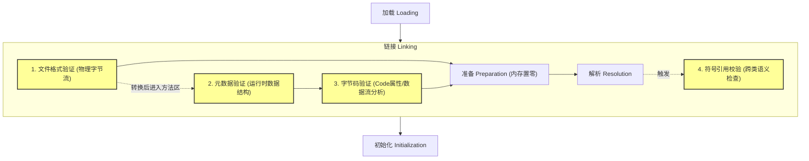

# 2.1.6.2 验证阶段深度剖析

在 Java 虚拟机（JVM）的类加载生命周期中，链接（Linking）是承前启后的关键阶段，而**验证（Verification）**则是链接阶段的第一步。验证阶段在保障虚拟机自身安全、防范恶意代码注入以及维持 Java 强类型系统的稳定性方面扮演着至关重要的角色。

从宏观上看，验证阶段可以划分为四个彼此递进的子阶段：**文件格式验证（File Format Verification）**、**元数据验证（Metadata Verification）**、**字节码验证（Bytecode Verification）**以及**符号引用验证（Symbolic Reference Verification）**。下图展示了验证阶段的整体架构以及这四个阶段在类加载生命周期中的物理位置与交互逻辑：



---

## 一、 信任的防线：验证阶段的必要性

### 1.1 编译器与虚拟机的“信任边界”
Java 语言一贯以“安全”著称。在编写 Java 源代码时，编译器（如 `javac`）会进行极其严苛的静态检查：它强制进行类型匹配、限制访问权限（如 `private` 成员不可跨类访问）、确保受检异常（Checked Exception）被捕获或声明抛出，并拦截非法的类型转换。然而，**Java 虚拟机并不直接运行 Java 源代码，而是执行二进制字节流形式的 Class 文件。**

这就产生了一个本质的“信任边界”断裂：
*   **编译器是善意的，但 Class 文件是开放的。** 任何人都可以在没有任何 Java 编译器参与的情况下，直接通过十六进制编辑器篡改 Class 文件，或者利用字节码操纵框架（如 ASM、ByteBuddy、Javassist 等）动态生成任意的 Class 文件。
*   **JVM 的运行环境必须防御“敌意输入”。** 如果 JVM 盲目信任所有输入的 Class 文件，直接将其送入执行引擎，那么精心构造的恶意字节码将能轻易击穿虚拟机的安全防线。

### 1.2 字节码伪造与恶意注入风险
如果没有验证阶段，恶意 Class 文件可以利用如下手段破坏虚拟机甚至宿主机的安全：
1.  **类型混淆（Type Confusion）与内存越权读写**：
    字节码可以伪造一条指令，将一个 `int` 类型的数值直接当作对象引用（`reference`）存入局部变量表，然后使用 `getfield` 指令读取。对于基于虚拟地址寻址的 JVM 来说，这相当于允许恶意代码将任意内存地址转换为对象指针，实现对宿主机物理内存的直接读取或篡改，从而彻底摧毁虚拟机的沙箱保护。
2.  **方法越权访问**：
    绕过 `javac` 编译器对 `private`、`protected` 或包访问权限的限制，强行在字节码中通过 `invokevirtual` 或 `invokespecial` 访问其他类库中的私有方法或系统内部的受保护资源。
3.  **栈溢出与栈下溢攻击**：
    通过精心构造的字节码控制流，在方法结束时使操作数栈上残留大量垃圾数据，或者在操作数栈为空时强行执行弹出操作（栈下溢），从而导致虚拟机内部状态失衡、崩溃，甚至引发缓冲区溢出漏洞。
4.  **未初始化对象的使用**：
    在执行 `new` 指令分配内存空间后，绕过构造函数（`<init>` 方法）直接调用实例方法或读写字段，导致虚拟机在对象内部状态不确定的情况下运行，进而引发不可预测的崩溃。

因此，验证阶段是 JVM 维持“沙箱安全模型”的核心防线。它本着**“不信任任何外部输入”**的原则，在链接期对 Class 文件进行地毯式扫描，确保其符合《Java 虚拟机规范》的全部约束。

---

## 二、 第一道防线：文件格式验证（物理字节流校验）

### 2.1 物理校验的独特性
文件格式验证是**唯一一个直接作用于物理二进制字节流（`byte[]`）上的校验阶段**。

当类加载器读取 Class 文件的字节码并将其送入 JVM 时，这些数据还仅仅是一段没有任何语义关联的扁平字节数组。在此阶段，JVM 尚未在方法区中为该类创建运行时数据结构。文件格式验证的目的，就是确保这段物理字节流在格式上完全符合 Class 文件规范，能够被安全地解析并翻译成虚拟机方法区内部的运行时数据结构（如 HotSpot 的 `InstanceKlass`）。

一旦此阶段校验成功，物理字节流就会被导入方法区，并转换为运行时常量池和类元数据。后续的元数据验证、字节码验证和符号引用验证，全部是在方法区内的运行时数据结构上进行的，不再直接接触底层的物理字节流。

```
[磁盘或网络中的 Class 字节流] 
        │
        ▼ (物理字节流)
┌─────────────────────────────────┐
│     子阶段 1：文件格式验证      │ ──(校验失败)──> 抛出 ClassFormatError
└─────────────────────────────────┘
        │ (校验通过)
        ▼ (物理字节流转换为方法区运行时数据结构)
[方法区 / Runtime Constant Pool / InstanceKlass]
        │
        ├─> 子阶段 2：元数据验证
        ├─> 子阶段 3：字节码验证
        └─> 子阶段 4：符号引用验证
```

### 2.2 核心校验项与物理细节

#### 2.2.1 魔数（Magic Number）校验
Class 文件的头 4 个字节必须是固定的十六进制魔数 `0xCAFEBABE`。它的作用是用于快速识别该文件是否确实为 Class 格式。如果头 4 个字节不匹配，虚拟机将立即抛出 `java.lang.ClassFormatError: Incompatible magic value` 并终止类加载。

#### 2.2.2 主次版本号（Major & Minor Version）校验
紧随魔数之后的 4 个字节是次版本号（2 字节）和主版本号（2 字节）。
JVM 会检查该 Class 的版本号是否在当前虚拟机所能支持的有效范围内。JVM 遵循**“向下兼容，拒绝向上兼容”**的原则。例如，JDK 8 的 JVM 能够加载主版本号在 $45.0$ 到 $52.0$ 之间的 Class 文件，但如果尝试加载主版本号为 $53.0$（JDK 9 编译生成）的 Class 文件，JVM 会抛出 `java.lang.UnsupportedClassVersionError`（该类是 `ClassFormatError` 的子类）。

下表列出了部分典型 JDK 版本与 Class 主版本号的对应关系：

| JDK 版本 | 主版本号（Dec） | 十六进制表示（Major Version） |
| :--- | :--- | :--- |
| JDK 1.1 | 45 | `0x002D` |
| JDK 1.2 | 46 | `0x002E` |
| JDK 5.0 | 49 | `0x0031` |
| JDK 8   | 52 | `0x0034` |
| JDK 11  | 55 | `0x0037` |
| JDK 17  | 61 | `0x003D` |
| JDK 21  | 65 | `0x0041` |

#### 2.2.3 常量池（Constant Pool）校验
常量池是 Class 文件中最庞大、也是结构最复杂的区域。文件格式验证阶段需要对常量池进行深度的结构健壮性检查：
1.  **常量池计数器（`constant_pool_count`）校验**：
    验证常量池声明的大小是否与文件实际包含的常量项数量严格吻合，防止因文件截断或恶意填充导致 OOB（Out Of Bounds）读取。
2.  **常量标记（Tag）合法性校验**：
    常量池中每一项的第一字节都是一个 `tag`，用于标识该项的常量类型。校验器会检查该 `tag` 是否在规范定义的集合内（例如，`CONSTANT_Utf8_info` 对应 1，`CONSTANT_Class_info` 对应 7 等）。如果出现未定义的 `tag`（如 2、13、14 等空缺值），立即抛出 `ClassFormatError`。
3.  **索引边界与类型匹配校验**：
    常量池中的许多项都包含指向常量池其他项的索引值。例如，一个 `CONSTANT_Class_info` 项的结构为：
    ```c
    CONSTANT_Class_info {
        u1 tag;          // 必须为 7
        u2 name_index;   // 指向常量池中的类名
    }
    ```
    校验器会确保 `name_index` 满足以下条件：
    *   索引值必须大于 0 且小于 `constant_pool_count`。
    *   `name_index` 指向的常量池项的 `tag` 必须是 `CONSTANT_Utf8_info`（值为 1）。如果指向了一个 `CONSTANT_Integer_info`，则视为格式损坏。
4.  **UTF-8 编码规范性校验**：
    对于 `CONSTANT_Utf8_info` 类型，校验器会读取其声明的字节长度，并对其包含的字节进行 Modified UTF-8 编码验证，确保没有非法的字节序列（例如，在 Class 文件中，空字符 `\u0000` 必须被编码为双字节的 `0xC0 0x80`，而不是标准的单字节 `0x00`）。

#### 2.2.4 物理结构完整性与属性表（Attributes）校验
*   **修饰符（Access Flags）组合校验**：
    类的 `access_flags` 占用 2 字节。校验器会检查修饰符是否出现了非法的互斥组合，例如 `ACC_FINAL` 和 `ACC_ABSTRACT` 不能同时被设置。
*   **结构对齐与截断检查**：
    校验器会根据类文件头部的各个表计数器（如 `fields_count`、`methods_count`、`attributes_count`），严格按序向下解码。如果文件在解码完成前就已经结束（物理文件被截断），或者解码完毕后文件仍有多余的无法解释的字节，说明文件损坏，拒绝加载。
*   **属性长度校验**：
    每个属性表的头部都包含 `attribute_name_index`（指向属性名）和 `attribute_length`（指示该属性后续数据的物理字节长度）。校验器会核对 `attribute_length` 是否与其对应的具体属性结构（如 `Code`、`StackMapTable` 等）的预设大小或内部子项大小相匹配。

---

## 三、 第二道防线：元数据验证（语义层面校验）

当类文件通过文件格式验证后，其物理字节流已经被成功翻译成了方法区内的运行时数据结构。接下来，虚拟机进入**元数据验证**阶段。

元数据验证不对方法体内部的具体字节码指令流进行逻辑分析，而是**对类与类之间的继承关系、接口实现契约、方法的重写与重载声明进行静态语义审查**，以确保这些定义符合 Java 语言规范的约束。

### 3.1 核心校验项与语义分析

#### 3.1.1 继承树的合法性校验
1.  **单继承限制**：
    在 Class 文件结构中，除 `java.lang.Object` 外，每一个类都必须有且仅有一个父类（通过 `super_class` 指向非零的常量池索引）。元数据验证会确保继承树的拓扑结构合法。
2.  **循环继承（Class Circularity）检查**：
    校验器会沿着当前类的父类指针一路向上追溯，直到 `java.lang.Object`。如果在追溯的路径中再次碰到了当前类，说明继承树中存在环状引用（例如类 A 继承自类 B，而类 B 又继承自类 A）。一旦检测到环路，JVM 将抛出 `java.lang.ClassCircularityError`。
3.  **继承 final 类校验**：
    检查当前类的直接父类是否在方法区中被标记为 `ACC_FINAL`。如果是，抛出 `java.lang.VerifyError`。

#### 3.1.2 抽象类与接口契约的校验
如果当前类不是一个抽象类（其 `access_flags` 没有设置 `ACC_ABSTRACT`），那么它必须是一个具体类（Concrete Class）。元数据验证器会执行以下检查：
*   **完整实现校验**：
    遍历该类继承的所有父类以及实现的所有接口。对于其中声明的每一个抽象方法（带有 `ACC_ABSTRACT` 标志且没有方法体），校验器必须在当前具体类（或其非抽象父类）中找到一个具有相同名称、签名和返回值的方法实现。如果存在未被实现的抽象方法，验证失败，抛出 `java.lang.ClassFormatError` 或 `java.lang.VerifyError`。

#### 3.1.3 方法重写（Override）的语义校验
当子类定义了一个与父类签名完全相同的方法时，即构成了方法重写。元数据验证会对其重写规则进行安全性检查：
1.  **访问权限兼容性**：
    子类重写方法的访问控制权限不能比父类方法更为严格。例如，父类中定义了一个 `protected` 方法，子类在重写时不能将其改为包访问权限（无修饰符）或 `private`。这保证了多态调用时不会因权限收窄而导致运行时非法访问。
2.  **协变返回值与签名校验**：
    子类方法的返回值类型必须与父类被重写方法的返回值类型相同，或者为其子类型（在符合 Java 5+ 协变返回值的条件下，且在方法描述符层面上满足赋值兼容性）。
3.  **受检异常声明校验**：
    重写方法声明抛出的受检异常，其类型必须是父类方法抛出异常的子集或子类型，绝对不能声明抛出任何父类方法未曾声明的新受检异常。

#### 3.1.4 字段与方法的标识符与修饰符冲突
*   **修饰符互斥校验**：
    对字段和方法的修饰符进行排他性检查。例如，一个方法不能同时拥有 `ACC_PRIVATE` 和 `ACC_ABSTRACT` 标志，因为私有方法无法被子类继承并实现，这在逻辑上是矛盾的。同理，`ACC_ABSTRACT` 与 `ACC_FINAL`、`ACC_ABSTRACT` 与 `ACC_NATIVE` 也属于非法冲突组合。
*   **命名与描述符校验**：
    检查字段名、方法名以及它们的描述符是否符合规范。例如，方法名不能包含非法字符（如 `.`、`;`、`[` 等，除了特殊的 `<init>` 和 `<clinit>` 构造器名称）。

---

## 四、 第三道防线：字节码验证（控制流与数据流分析的微观世界）

**字节码验证**是整个类加载验证阶段中**最核心、最复杂、最耗费 CPU 算力**的步骤。它的验证对象是方法体中的 `Code` 属性。

在这个阶段，虚拟机将通过极其精密的数据流分析和控制流分析，确保方法体内的字节码指令序列在运行时不会做出危害虚拟机的非法动作。

### 4.1 物理运行模型与验证器的模拟执行
JVM 是一个基于栈的虚拟机，其指令的执行高度依赖于**操作数栈（Operand Stack）**和**局部变量表（Local Variables Table）**。

在字节码验证阶段，验证器会在内存中为被校验的方法构建一个“模拟执行栈”和“模拟局部变量表”。验证器并不会真正去运行该方法的代码，也不会关心变量中保存的具体数值（例如，它不会知道一个 `int` 变量的值是 5 还是 10），它**只跟踪这些位置上的静态数据类型**。

```
实际运行期：
[局部变量表] ──(包含具体值)──> [10, "Hello", 3.14]
[操作数栈]   ──(包含具体值)──> [20]

验证期模拟：
[模拟局部变量表] ──(仅包含类型)──> [int, reference(java/lang/String), double]
[模拟操作数栈]   ──(仅包含类型)──> [int]
```

### 4.2 字节码验证的微观校验机制

#### 4.2.1 局部变量表与操作数栈的大小与索引越界校验
*   **最大深度校验**：
    方法编译时，编译器会在 `Code` 属性中写入 `max_stack`（最大栈深度）和 `max_locals`（局部变量表槽位数）。验证器在模拟执行每一条指令时，会精确计算操作数栈的深度变化。如果在任意一条执行路径上，模拟栈的深度超过了 `max_stack`，或者由于过度弹出导致栈深度变为负数（栈下溢，Stack Underflow），验证器将立即拒绝该 Class。
*   **索引边界校验**：
    对于任何读写局部变量表的指令（如 `iload <index>`、`fstore <index>`），验证器会校验 `<index>` 是否满足：
    $$0 \le \text{index} < \text{max\_locals}$$
    由于 `double` 和 `long` 类型数据占用 2 个局部变量槽（Slots），当执行 `dload <index>` 时，验证器会校验 `index` 和 `index + 1` 是否均小于 `max_locals`。

#### 4.2.2 强类型系统一致性校验
验证器必须保证，在方法运行的任意时刻，操作数栈顶的数据类型与当前准备执行的指令所需的输入类型完全匹配。
*   **操作数类型匹配**：
    如果当前指令是 `iadd`（整数加法），验证器会检查模拟操作数栈顶的前两个位置，确保它们的类型都是 `int`。如果栈顶是 `float` 或 `reference`，校验失败。
*   **宽类型成对读写限制**：
    `long` 和 `double` 作为双字（64位）宽类型，必须被视为一个不可分割的整体。如果在 slot 1 写入了一个 `long`（实际上占用了 slot 1 和 slot 2），验证器会将 slot 1 标记为 `Long_upper`，slot 2 标记为 `Long_lower`。如果在后续指令中，恶意字节码试图使用 `iload_1`（读取单字 `int`）或 `istore_2` 拆分读取或覆盖这两个槽位，验证器会予以拦截。
*   **指令跳转边界校验**：
    JVM 字节码是变长的。例如 `ifeq <branchbyte1> <branchbyte2>` 包含 1 字节的操作码和 2 字节的偏移量。验证器会校验：所有的跳转指令（如 `goto`、`if_xx`、`tableswitch` 等）其跳转目标地址（偏移量加上当前 PC 指针）**必须是该方法体中另一条合法指令的起始字节码偏移量**。绝对不允许跳转到某条多字节指令的中间位置（即操作数所在处），否则会导致执行引擎将操作数误当作操作码来执行。

#### 4.2.3 未初始化对象（Uninitialized Objects）安全防线
在 Java 中，创建一个对象包含两个物理步骤：分配堆内存与调用构造函数。在字节码层面，这对应着 `new` 指令和 `invokespecial <init>` 指令。
在对象分配内存后、构造函数被调用前，该对象处于“未初始化状态”。此时，如果允许程序读取该对象的字段或调用其方法，会导致严重的内存安全隐患。

字节码验证器对此建立了极严格的追踪机制：
1.  当扫描到 `new` 指令（假设其偏移量为 `12`）时，验证器会在模拟操作数栈顶压入一个特殊的类型：`uninitialized(12)`，表示这是一个在偏移量 12 处创建、但尚未初始化的对象。
2.  在此状态下，该 `uninitialized(12)` 引用**禁止被任何指令使用**（不能调用其方法，不能将其赋给类的字段，不能作为参数传递给其他方法）。它只能被复制（`dup`）或者存放在局部变量表中。
3.  当且仅当执行到 `invokespecial` 指令且其解析目标为该类的 `<init>` 方法时，验证器才会在模拟状态表中，**把所有的 `uninitialized(12)` 类型全部替换为具体的类类型（如 `reference(java/lang/String)`）**。
4.  如果方法体在没有调用 `<init>` 的情况下直接执行 `return`，或者在构造函数 `this()` / `super()` 调用前就读取当前实例的方法，验证器会直接抛出 `VerifyError`。

#### 4.2.4 异常处理表（Exception Table）合法性校验
方法的 `Code` 属性中包含异常处理表，其每一项包含 `[start_pc, end_pc, handler_pc, catch_type]`。
*   **区间合法性**：验证器会核对 `start_pc` 和 `end_pc` 是否落在方法字节码的合法范围内，且满足 `start_pc < end_pc`。同时，`start_pc` 和 `end_pc` 必须正好对齐在指令的起始字节边界上。
*   **处理器入口校验**：`handler_pc` 指向的异常处理块入口地址，必须是方法体内一条有效指令的起始字节。
*   **捕获类型校验**：如果 `catch_type` 不为 0（0 代表 `finally`），它必须是一个指向常量池 `CONSTANT_Class_info` 的索引，且该类必须是 `java.lang.Throwable` 或其子类。

### 4.3 传统验证器：基于数据流分析的类型推导（Type Inference）算法
在早期 JVM（Java 5 及以前）中，字节码验证器是通过在控制流图上迭代求解数据流方程来推导类型的。

#### 4.3.1 算法基本原理
1.  **构建控制流图（CFG）**：
    将方法的字节码切分为若干个基本块（Basic Blocks，即只有唯一入口和唯一出口的线性字节码序列）。
2.  **分配初始类型状态**：
    在方法的入口点，操作数栈为空，局部变量表包含方法的形参（对于非静态方法，slot 0 的类型为当前类 `this`）。
3.  **沿着 CFG 传播与合并状态**：
    验证器从入口块开始，模拟执行基本块中的每一条指令，改变类型状态，并将其传播给后继基本块。
    当一个基本块有多个前驱基本块（即控制流在此处分叉后汇合）时，验证器必须将多个来源的类型状态进行**合并（Meet）**。

#### 4.3.2 状态合并规则与格理论（Lattice Theory）
类型状态的合并遵循半格（Semilattice）代数结构。对于两个局部变量表或栈槽位中的类型 $T_1$ 和 $T_2$，合并操作 $\sqcup$（求最小上界，Least Upper Bound, LUB）的规则如下：

*   若 $T_1 = T_2$，则 $T_1 \sqcup T_2 = T_1$。
*   若一个是基本类型，另一个是引用类型，则合并失败（类型冲突，抛出 `VerifyError`）。
*   若 $T_1$ 和 $T_2$ 均为引用类型，则它们合并的结果为其在 JVM 类继承树中的**最小公共超类（LUB）**。例如，`reference(String)` $\sqcup$ `reference(Integer)` = `reference(Object)`。
*   若其中一个为 `null` 引用类型，另一个为引用类型 $R$，则合并结果为 $R$。
*   任何类型与未定义状态 `Top` 合并，结果仍为 `Top`。

```
           java.lang.Object (格的顶部)
               /       \
     CharSequence     Number
         /              \
     String           Integer
         \              /
         null (格的底部)
```

#### 4.3.3 迭代痛点与 $O(N^2)$ 的时间复杂度
在控制流图中，一旦存在循环结构（如 `for`、`while` 循环引入的向后跳转边），合并后的类型状态可能会发生改变（例如，局部变量的类型从某个具体子类退化为了更抽象的超类）。

一旦状态发生变化，验证器就必须**重新将变化后的状态传播给所有后继基本块，并重新计算合并状态**。这一过程需要不断迭代，直到所有基本块的类型状态达到“不动点”（Fixpoint）为止。

**痛点**：
*   **计算开销高昂**：对于包含大量分支嵌套、复杂循环、或者由工具自动生成的方法，迭代次数会呈指数或二次方级增长。在最坏情况下，类型推导算法的时间复杂度可达 $O(N^2)$（$N$ 为字节码指令数量），并伴随大量的内存分配与垃圾回收开销。
*   **类加载性能瓶颈**：随着 Java 应用规模的膨胀，数以万计的类在加载时逐个进行 $O(N^2)$ 的数据流迭代计算，成为了 JVM 启动速度和热点类动态加载的最大性能瓶颈。

---

## 五、 字节码验证黑科技：StackMapTable 属性机理

为了解决传统“类型推导（Type Inference）”在类加载期所带来的巨大性能消耗，Java 虚拟机团队在 JSR 202（Java 6）中引入了一项关键革新：**类型检查（Type Checking）**机制，并通过 **`StackMapTable`** 属性在 Class 文件中落实。

自 Java 7（Class 版本号 $\ge 51.0$）开始，对于包含跳转或异常处理的方法，`StackMapTable` 属性在 Class 文件中成为了**硬性强制要求**，否则 JVM 将直接拒绝加载。

### 5.1 类型推导（Type Inference）与类型检查（Type Checking）的区别
`StackMapTable` 的核心设计哲学是：**将复杂的类型计算转移到编译期（离线计算），在运行期仅进行低消耗的匹配检查。**

*   **编译期（Compiler Side）**：
    Java 编译器（如 `javac`）拥有完整的语法树与类型信息，在生成字节码的同时，可以轻易计算出在**每一个控制流分叉/汇合点（即跳转目标指令处）**，操作数栈和局部变量表所对应的精确类型状态。编译器将这些状态信息序列化后，作为 `StackMapTable` 属性打包写入 Class 文件的 `Code` 属性中。
*   **运行期（JVM Verifier Side）**：
    JVM 验证器不再需要构建控制流图，也不需要进行多次迭代的数据流方程求解。它只需要对字节码进行**单次线性扫描（$O(N)$ 复杂度）**。
    在扫描过程中，遇到普通指令，直接模拟更新状态；一旦扫描到作为跳转目标的指令时，验证器直接读取 `StackMapTable` 中预存的类型状态帧（Stack Map Frame），比对当前模拟状态是否与预存状态兼容。比对完毕后，直接将当前模拟状态更新为预存的状态，继续向下扫描。

### 5.2 StackMapTable 属性的物理结构与紧凑编码
为了防止 `StackMapTable` 的引入导致 Class 文件体积过度膨胀，规范定义了一套极其精妙的**增量编码（Delta Encoding）**机制，用 1 字节的 `frame_type` 来区分不同的帧类型。

```c
StackMapTable_attribute {
    u2 attribute_name_index;    // 指向 "StackMapTable"
    u4 attribute_length;
    u2 number_of_entries;
    stack_map_frame entries[number_of_entries]; // 栈映射帧数组
}
```

每个 `stack_map_frame` 仅记录**当前帧与前一个帧（或者是方法入口状态）之间的状态差异以及偏移量差值（`offset_delta`）**。

#### 5.2.1 栈映射帧（Stack Map Frame）微观类型剖析

根据 `frame_type` 字节的值，帧被划分为以下 7 类：

1.  **`same_frame` (0 - 63)**：
    *   **语义**：当前位置的局部变量表与前一帧完全一致，且当前操作数栈为空。
    *   **编码**：`offset_delta` 直接编码在 `frame_type` 值中：
        $$\text{offset\_delta} = \text{frame\_type}$$
    *   **结构**：无额外字段，仅 1 字节。

2.  **`same_locals_1_stack_item_frame` (64 - 127)**：
    *   **语义**：局部变量表与前一帧一致，操作数栈中恰好有 1 个元素。
    *   **编码**：$$\text{offset\_delta} = \text{frame\_type} - 64$$
    *   **结构**：1 字节的 `frame_type`，后跟一个 `verification_type_info` 结构，指明操作数栈顶这唯一元素的类型。

3.  **`same_locals_1_stack_item_frame_extended` (247)**：
    *   **语义**：与第二类相同，但跳转偏移量差值较大（超过 63 字节），无法用上述紧凑型表示。
    *   **结构**：
        ```c
        same_locals_1_stack_item_frame_extended {
            u1 frame_type; // 247
            u2 offset_delta;
            verification_type_info stack[1];
        }
        ```

4.  **`chop_frame` (248 - 250)**：
    *   **语义**：当前操作数栈为空，且局部变量表比前一帧**减少**了 $k$ 个变量（其中 $k = 251 - \text{frame\_type}$，即减少 1 到 3 个变量）。
    *   **结构**：
        ```c
        chop_frame {
            u1 frame_type; // 248-250
            u2 offset_delta;
        }
        ```

5.  **`same_frame_extended` (251)**：
    *   **语义**：局部变量表与前一帧完全一致，操作数栈为空，但 `offset_delta` 较大（$\ge 64$）。
    *   **结构**：
        ```c
        same_frame_extended {
            u1 frame_type; // 251
            u2 offset_delta;
        }
        ```

6.  **`append_frame` (252 - 254)**：
    *   **语义**：当前操作数栈为空，且局部变量表比前一帧**增加**了 $k$ 个变量（其中 $k = \text{frame\_type} - 251$，即增加 1 到 3 个变量）。
    *   **结构**：
        ```c
        append_frame {
            u1 frame_type; // 252-254
            u2 offset_delta;
            verification_type_info locals[frame_type - 251]; // 新增的变量类型
        }
        ```

7.  **`full_frame` (255)**：
    *   **语义**：最完整的帧。当局部变量表和操作数栈与前一帧发生剧烈改变，无法用上述增量帧描述时使用。
    *   **结构**：
        ```c
        full_frame {
            u1 frame_type; // 255
            u2 offset_delta;
            u2 number_of_locals;
            verification_type_info locals[number_of_locals];
            u2 number_of_stack_items;
            verification_type_info stack[number_of_stack_items];
        }
        ```

#### 5.2.2 `verification_type_info` 类型信息标记
在上述帧结构中，变量或栈内元素的类型不是用字符串描述的，而是用 1 字节的 `tag` 来表示：
*   `ITEM_Top (0)`：代表该位置未分配类型（如宽类型占用的第二个槽，或者是未初始化的垃圾槽位）。
*   `ITEM_Integer (1)`：`int` 类型。
*   `ITEM_Float (2)`：`float` 类型。
*   `ITEM_Double (3)`：`double` 类型.
*   `ITEM_Long (4)`：`long` 类型。
*   `ITEM_Null (5)`：`null` 引用。
*   `ITEM_UninitializedThis (6)`：构造器中未初始化的当前实例 `this`。
*   `ITEM_Object (7)`：普通对象类型，其后会紧随一个 2 字节的常量池索引，指向 `CONSTANT_Class_info` 常量项。
*   `ITEM_Uninitialized (8)`：new 出来但未初始化的对象，其后紧随一个 2 字节的偏移量（指示生成它的 `new` 指令的物理 PC 值）。

---

### 5.3 StackMapTable 实例级微观跟踪

为了彻底说清 `StackMapTable` 的工作机理，下面通过一个具体包含 `if-else` 分支的 Java 代码段进行端到端的跟踪解析。

#### 5.3.1 示范 Java 源代码
```java
package com.jvm.verify;

public class Demo {
    public Object process(int flag, String name) {
        Object result;
        if (flag > 0) {
            result = name;
        } else {
            result = Integer.valueOf(0);
        }
        return result;
    }
}
```

#### 5.3.2 对应的字节码指令流
使用 `javap -v` 工具反编译 `process` 方法，得到如下字节码：

```text
public java.lang.Object process(int, java.lang.String);
  descriptor: (ILjava/lang/String;)Ljava/lang/Object;
  flags: ACC_PUBLIC
  Code:
    stack=1, locals=4, args_size=3
       0: iload_1
       1: ifle          9
       4: aload_2
       5: astore_3
       6: goto          13
       9: iconst_0
      10: invokestatic  #2                  // Method java/lang/Integer.valueOf:(I)Ljava/lang/Integer;
      13: astore_3
      14: aload_3
      15: areturn
```

#### 5.3.3 控制流分析与汇合点识别
该方法的控制流图包含两个分叉路径：
*   **路径 A (If 分支)**：PC 0 -> 1 (满足条件跳转) -> 4 -> 5 -> 6 (无条件跳转) -> 14 -> 15。
*   **路径 B (Else 分支)**：PC 0 -> 1 (不满足跳转) -> 9 -> 10 -> 13 -> 14 -> 15。

在本例中，控制流在两处地方发生汇合或跳转目标：
1.  **偏移量 9**：`ifle 9` 指令的目标地址。
2.  **偏移量 13**：`goto 13` 指令的目标地址。

因此，编译器必须在 `StackMapTable` 中为偏移量 **9** 和 **13** 分别生成对应的栈映射帧。

#### 5.3.4 模拟执行栈与变量表状态表
我们沿着字节码的执行顺序，逐步展示验证器在扫描期间的**模拟状态**以及与 `StackMapTable` 的比对：

| 字节码偏移量 (PC) | 对应指令 | 局部变量表状态 (Locals) | 操作数栈状态 (Stack) | 关联 StackMapTable 帧与校验动作 |
| :--- | :--- | :--- | :--- | :--- |
| **0** | `iload_1` | `[this, int, String, Top]` | `[]` | 方法入口，初始状态继承自方法签名。 |
| **1** | `ifle 9` | `[this, int, String, Top]` | `[int]` | 发现跳转目标为 **9**。验证器需要将当前状态与偏移量 9 处的帧进行匹配。 |
| **4** | `aload_2` | `[this, int, String, Top]` | `[]` | 进入 If 分支。 |
| **5** | `astore_3` | `[this, int, String, Top]` | `[String]` | 弹出栈顶 `String` 并存入 slot 3。 |
| **6** | `goto 13` | `[this, int, String, String]` | `[]` | 发现跳转目标为 **13**。验证器将当前状态保存为到达 13 的前驱状态之一。 |
| **9** | `iconst_0` | `[this, int, String, Top]` | `[]` | **跳转目标点 1**。读取 `StackMapTable` 对应帧 1：`same_frame` (offset_delta=9)。比对：局部变量一致，栈为空。匹配成功！状态更新为此帧状态。 |
| **10** | `invokestatic` | `[this, int, String, Top]` | `[int]` | 调用 valueOf，弹出 `int` 压入 `Integer`。 |
| **13** | `astore_3` | `[this, int, String, Top]` | `[Integer]` | **跳转目标点 2**。读取 `StackMapTable` 对应帧 2：`same_locals_1_stack_item_frame` (offset_delta=4, stack=[Integer])。比对：局部变量一致，栈顶是 `Integer`。匹配成功！ |
| **14** | `aload_3` | `[this, int, String, Object]` | `[]` | 状态被重置为帧 2 的状态（由于 slot 3 存入了 `Integer`，它属于 `Object` 的子类，在合并后此处类型安全）。 |
| **15** | `areturn` | `[this, int, String, Object]` | `[Object]` | 返回栈顶的 `Object`，与方法签名返回值声明完全一致。校验通过！ |

#### 5.3.5 StackMapTable 属性的二进制转储（Binary Dump）分析
在这个 Class 文件中，`StackMapTable` 的 entries 会包含如下两个帧的数据：

```text
StackMapTable: number_of_entries = 2
  frame_type = 9 /* same_frame */
    offset_delta = 9
  frame_type = 68 /* same_locals_1_stack_item_frame */
    offset_delta = 3   // 13 - 9 - 1 = 3
    stack = [ class java/lang/Integer ]
```

*   **第一帧（PC=9）**：
    `frame_type = 9`。它属于 `same_frame` (0-63) 范围。偏移量差值 $\text{offset\_delta} = 9$。表示比方法起始 PC 0 偏离了 9 个字节，变量与入口一致，栈为空。
*   **第二帧（PC=13）**：
    `frame_type = 68`。它属于 `same_locals_1_stack_item_frame` (64-127) 范围。
    此时的实际偏移量差值计算：
    $$\text{offset\_delta} = \text{实际偏移量} - \text{前一帧实际偏移量} - 1 = 13 - 9 - 1 = 3$$
    根据公式，其对应 `frame_type` 应该为：
    $$\text{frame\_type} = \text{offset\_delta} + 64 = 3 + 64 = 68$$
    其后跟的类型是 `ITEM_Object`，并指向常量池中 `java/lang/Integer` 对应的项。

通过这种方式，验证器只需要在线性扫描时，在 PC=9 和 PC=13 处做两次类型比对，整个验证过程在 $O(N)$ 复杂度内高效完成。

---

## 六、 第四道防线：符号引用校验（解析期的跨类校验）

与前三个阶段（文件格式、元数据、字节码验证）在类加载链接的“验证”阶段集中执行不同，**符号引用校验是一个“被动触发”、“动态推迟”的校验过程**。

### 6.1 符号引用校验的触发时机与逻辑定位
在 Class 文件的常量池中，类、字段和方法的引用均以文本形式的“符号引用”（Symbolic Reference）保存。当虚拟机执行到某些需要访问外部类、字段或方法的指令时（如 `new`、`getfield`、`putstatic`、`invokevirtual` 等），它必须将这些符号引用替换为直接指向内存地址或方法表偏移量的“直接引用”（Direct Reference）。

这个“解析（Resolution）”过程一旦发生，JVM 就会在替换前**立即触发符号引用校验**。它的主要任务是：**确保当前类不仅能“找到”引用的目标，且“有权限”对其进行访问**。

```
[执行字节码指令，如 invokevirtual #5]
                 │
                 ▼ (解析符号引用)
      ┌──────────────────────┐
      │  进行符号引用校验    │ ──(校验失败)──> 抛出 LinkageError 子类
      └──────────────────────┘
                 │ (校验通过)
                 ▼ (将符号引用修改为物理指针)
[符号引用替换为直接引用，执行方法分派]
```

### 6.2 三类主要符号引用的校验细节

#### 6.2.1 类或接口的符号引用校验
*   **加载可用性检查**：
    校验器通过常量池中 `CONSTANT_Class_info` 项所保存的类全限定名，委托当前类的类加载器去加载目标类。如果目标类无法被成功加载（如磁盘上缺失 class 文件、类加载过程中发生故障），则校验失败，抛出 `java.lang.NoClassDefFoundError`。
*   **访问权限校验**：
    校验当前类是否有权访问被引用的类或接口。如果目标类不是 `public` 的，且当前类与目标类不属于同一个包（Package），则抛出 `java.lang.IllegalAccessError`。

#### 6.2.2 字段的符号引用校验
当解析一个 `CONSTANT_Fieldref_info` 时，校验器按如下步骤校验：
1.  **字段存在性检索**：
    *   首先在目标类中搜索是否存在简单名称和描述符均匹配的字段。
    *   若找不到，则在其实现的接口以及接口的父接口中递归查找。
    *   若仍找不到，则在其父类中递归查找。
    *   如果最终在整个继承树和接口网络中都未能定位该字段，抛出 `java.lang.NoSuchFieldError`。
2.  **访问控制校验**：
    校验当前类对定位到的字段是否拥有访问权（检查字段修饰符 `private`、`protected`、`public` 以及包可见性）：
    *   若字段为 `private`，当前类必须是目标类本身，或者满足 JVM 11 引入的 Nestmates（嵌套伙伴类）契约，否则抛出 `java.lang.IllegalAccessError`。
    *   若字段为 `protected` 且跨包，当前类必须是目标类的子类。

#### 6.2.3 方法的符号引用校验
解析 `CONSTANT_Methodref_info` 或 `CONSTANT_InterfaceMethodref_info` 时：
1.  **存在性检索**：
    *   在目标类/接口及其父类/父接口中递归查找名称与描述符匹配的方法。如果找不到，抛出 `java.lang.NoSuchMethodError`。
2.  **方法抽象性（Abstraction）校验**：
    *   如果解析目标是一个普通类的方法引用，但定位到的方法是一个带有 `ACC_ABSTRACT` 标志的抽象方法，且当前类试图直接实例化或调用它，抛出 `java.lang.AbstractMethodError`。
3.  **引用类型一致性校验**：
    *   如果在解析一个普通类方法引用（`CONSTANT_Methodref_info`）时，定位到的目标实体的 `access_flags` 带有 `ACC_INTERFACE`（即目标在运行时实际上是一个接口），或者反过来用接口方法引用去定位普通类方法，JVM 将抛出 `java.lang.IncompatibleClassChangeError`。
4.  **访问权限校验**：
    *   若调用者类没有权限访问该方法，抛出 `java.lang.IllegalAccessError`。

---

### 6.3 符号引用校验失败异常矩阵与成因分析

符号引用校验失败时，JVM 会抛出 `java.lang.LinkageError` 的子类。这些异常是 Java 动态链接特性的直接体现，常发生于编译期与运行期类路径（ClassPath）中 Jar 包版本不一致的场景（即 Dependency Hell）。

下表汇总了这些异常的微观触发原因与应用场景：

| 抛出异常 | 直接成因与校验逻辑 | 典型发生场景 |
| :--- | :--- | :--- |
| **`NoClassDefFoundError`** | 在解析类引用时，类加载器在 ClassPath 中找不到目标类的 class 文件。 | 编译时依赖了某 Jar 包，但打包部署时漏掉了该 Jar 包，导致运行时找不到类。 |
| **`NoSuchFieldError`** | 找到了目标类，但目标类及其父类中不包含名称和描述符完全一致的字段。 | 三方依赖升级时发生破坏性变更（Breaking Change），移除了某个公开字段，而主程序未重新编译。 |
| **`NoSuchMethodError`** | 找到了目标类，但在类及其继承树中检索不到名称与签名匹配的方法。 | 多版本 Jar 包冲突。例如 ClassPath 中同时存在同一框架的 `1.0` 和 `2.0` 版本，运行时错误的加载了缺失新方法的 `1.0` 包。 |
| **`IllegalAccessError`** | 目标类/方法/字段存在，但当前类受 Java 语言可访问性（Accessibility）限制，无权访问之。 | 试图利用反射或篡改后的字节码强制调用其他包内非 public 类的包私有方法。 |
| **`AbstractMethodError`** | 试图调用一个被声明为抽象（`abstract`）但未能在运行时类中被实现的方法。 | 运行时加载的子类是由一个较老版本的库编译的，漏掉了实现新版本父类/接口中新增的抽象方法。 |
| **`IncompatibleClassChangeError`** | 符号引用声明的类型与运行时加载的实体物理类型发生冲突（如类与接口冲突）。 | 编译时 `A` 是一个 Class，运行时加载的 `A.class` 却被替换为了一个 `interface A`。 |

---

## 七、 验证阶段的性能调优与故障排查

由于验证阶段（尤其是字节码验证和符号引用加载）伴随着大量的类型推导、格式扫描以及跨类解析，它在大型企业级应用中往往会消耗显著的启动时间。

### 7.1 关闭验证的参数与历史演进
在某些特定的、受信任的封闭生产运行环境中，为了极大地缩短系统的启动与热恢复时间，开发者常常会考虑关闭 JVM 验证阶段。

*   **优化参数**：`-Xverify:none` 或 `-noverify`。
*   **底层机理**：该参数指示 JVM 彻底跳过元数据验证和字节码验证，仅保留最基本的文件格式校验（防止魔数错误导致物理崩溃）。
*   **性能提升**：在包含数万个类的 Spring Boot 应用或微服务集群中，开启 `-Xverify:none` 通常可缩短 **10% ~ 30%** 的 JVM 启动耗时。
*   **致命风险**：
    一旦关闭验证，JVM 就失去了沙箱安全的最后防线。若类路径中混入了损坏的、恶意篡改的 Class 文件，或者混淆器产生了逻辑破损的字节码，JVM 将不再报错抛出异常，而是会直接产生 **Segmentation Fault**（段错误）导致 Java 进程异常退出，甚至面临内存越界访问的安全入侵威胁。
*   **JVM 的废弃趋势**：
    鉴于安全风险极大，JDK 团队一直在收紧对该选项的控制：
    *   **Java 13** 宣布 `-Xverify:none` 参数为**已废弃（Deprecated）**，启动时会打印警告信息。
    *   **Java 16** 正式**移除（Removed）**了这一参数。在 Java 16 及更高版本上设置 `-Xverify:none` 或 `-noverify` 会直接导致 JVM 拒绝启动并报错。

---

### 7.2 运行时 `java.lang.VerifyError` 深度排障指南
在生产中，我们有时在没有受到恶意攻击的情况下，也会遇到运行时抛出 `VerifyError` 的故障。

#### 7.2.1 典型诱因分析
1.  **三方字节码织入（Bytecode Instrumentation）工具缺陷**：
    诸如 APM 性能监控监控探针、热修复框架、动态代理代理库、或是 AOP 框架（如 Spring AOP、AspectJ、ByteBuddy）在运行时通过织入字节码来增强方法逻辑时，如果其内部对局部变量表大小、操作数栈最大深度的计算发生偏差，或者在修改控制流后**忘记重新计算并更新 `StackMapTable` 属性**，就会导致 JVM 验证字节码时出错。
2.  **代码混淆器（Obfuscator）Bug**：
    混淆器（如 ProGuard 等）在对类文件执行重构、瘦身、混淆和内联优化时，可能会产生不合法的字节码跳转目标，或者未能正确同步更新栈映射帧，导致生成了物理结构合法但逻辑不合法的 Class 文件。
3.  **多源编译 Class 文件混合部署**：
    利用不同版本的编译器编译生成的多个 Class 混合在一个 classpath 下运行，或者在打包时错误的将 Kotlin 编译器与 Java 编译器产生的某些中间产物非对称链接，造成类型语义不一致。

#### 7.2.2 故障排查工具与路径
当遭遇 `VerifyError` 时，可按以下标准步骤进行分析与定位：

1.  **解读异常堆栈信息**：
    JVM 抛出的 `VerifyError` 通常非常精准。例如：
    ```text
    Exception in thread "main" java.lang.VerifyError: Bad type on operand stack
    Exception Details:
      Location:
        com/jvm/verify/Demo.process(ILjava/lang/String;)Ljava/lang/Object; @13: astore_3
      Reason:
        Type 'java/lang/Integer' (current frame, stack[0]) is not assignable to 'java/lang/String' (stack map, stack[0])
    ```
    *   **Location**：指出了报错的类名、方法名和方法描述符，以及最关键的**报错字节码偏移量（`@13`）**和在该偏移量处的**指令（`astore_3`）**。
    *   **Reason**：指出了具体校验失败的原因。上面这个模拟报错意味着，在第 13 字节处，运行时模拟出来的栈顶是 `Integer` 类型，但是编译器预存在 `StackMapTable` 中的映射帧却声称此处栈顶应该是个 `String` 类型，两者不匹配导致验证夭折。

2.  **利用 `javap` 进行字节码反编译与静态校验**：
    执行如下命令：
    ```bash
    javap -v -p -c com.jvm.verify.Demo
    ```
    定位到报错的方法，对照 `@13` 指令前后的指令序列，人工模拟局部变量表和操作数栈的变化，查看是否在控制流跳转的源头和目标上出现了类型突变。

3.  **使用 ASM 的校验适配器（`CheckClassAdapter`）**：
    如果在开发动态字节码生成工具，可将 ASM 生成的 `byte[]` 传入 `CheckClassAdapter`。它会在运行时对字节码做全套离线模拟校验，并在抛出错误时给出直观的堆栈图，帮助快速定位是哪一行字节码生成逻辑导致了 `VerifyError`。

---

## 八、 总结

验证阶段并不是 Java 类加载中可有可无的附庸，而是 JVM 维持整个生态安全、稳定与高性能运行的基石。

它通过**文件格式验证**过滤了物理层面的“垃圾字节流”；通过**元数据验证**在类声明和继承层面上完成了“语义契约”检查；通过极其精密的**字节码验证**在方法体内部筑起了“数据流与控制流安全防护堤”；并通过**符号引用校验**，保证了跨类动态链接的“访问合规性”。而像 **`StackMapTable`** 这样的黑科技，则是 JVM 设计者在“静态安全性保证”与“类加载动态性能”之间做出的极其精妙的技术平衡与创新。
