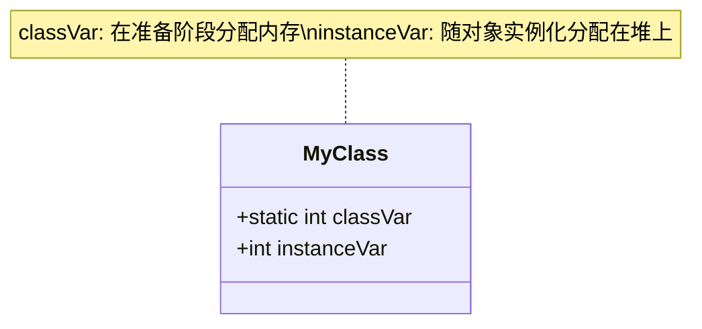
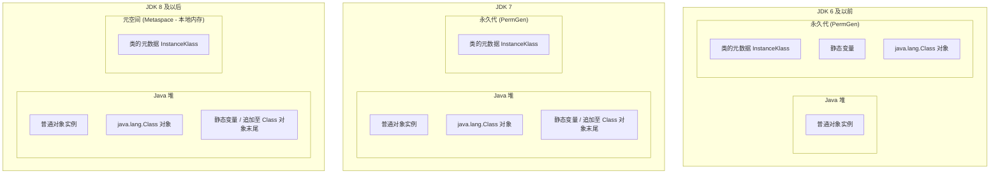

# 2.1.6.3 准备

在 Java 虚拟机的生命周期中，类的加载过程包含“加载”（Loading）、“连接”（Linking）与“初始化”（Initialization）三个核心阶段。而“准备”（Preparation）则是连接阶段的第二步，介于“验证”（Verification）与“解析”（Resolution）之间。

准备阶段的主要职责是：**为类中定义的静态变量（即被 `static` 修饰的变量，也称类变量）分配内存，并将其初始化为默认的“零值”**。尽管这一阶段在概念上看似简单，但在 JVM 的具体物理实现、历史架构演进以及针对 `final` 关键字的特殊优化方面，却有着极为复杂的底层细节。

本文将从准备阶段的定位、静态变量内存分配原则、JVM 方法区演进与静态变量的物理存放地变迁、零值赋予的物理机理、`ConstantValue` 属性触发机制，以及常见认知误区等维度进行深度的底层剖析。

---

## 1. 准备阶段在类生命周期中的定位

要深入理解准备阶段，首先需要明确它在整个类加载生命周期中的相对位置。类加载的生命周期可以概括为以下流程：


在“加载”阶段，JVM 通过类的全限定名获取定义此类的二进制字节流，并将其转化为方法区内的运行时数据结构，同时在 Java 堆中生成一个代表该类的 `java.lang.Class` 对象。

进入“连接”阶段后：
1. **验证**：确保被加载类的字节流符合 JVM 规范，不会危害虚拟机自身安全。
2. **准备**：正式为类变量分配内存并设置初始零值。此时，这些内存仅在 JVM 内部进行逻辑和物理上的“预占”，尚未执行任何用户编写的 Java 初始化代码。
3. **解析**：将常量池内的符号引用替换为直接引用。

因此，**准备阶段是 JVM 真正开始为类变量分配物理空间的起点**，它为后续初始化阶段执行具体的赋值操作奠定了内存基础。

---

## 2. 内存分配的核心原则与范围边界

在准备阶段，内存分配的行为受到严格的范围限制，主要遵循以下两个基本原则：

### 2.1 仅针对静态类变量（Class Variables）分配内存
准备阶段只为被 `static` 关键字修饰的静态类变量分配内存。这些变量是属于“类”本身的，而非属于某个特定的“实例对象”。因此，它们的生命周期与类的生命周期紧密绑定。

### 2.2 绝对不包括实例变量（Instance Variables）
实例变量（没有被 `static` 修饰的成员变量）的生命周期与具体的对象实例一致。
* **物理位置**：实例变量在准备阶段不占用任何空间。
* **分配时机**：它们会随着对象实例化（执行 `new` 指令或反射创建对象）时，与对象本身一同被分配在 Java 堆（Heap）中。
* **赋值时机**：实例变量的默认值赋值，是在堆上为对象分配空间时由垃圾回收器或内存分配器直接将该段内存区域清零实现的；而其实际值的赋值则在实例构造器 `<init>()` 执行时完成。



---

## 3. JVM 方法区演进与类变量物理存放地的变迁

Java 虚拟机规范（JVMS）定义了“方法区”（Method Area）作为一个逻辑概念，用于存储类的元数据、常量池、方法字节码以及静态变量。然而，在以 HotSpot 为代表的虚拟机实现中，方法区的物理存放地点在不同 JDK 版本之间经历了巨大的架构变迁。这种变迁直接改变了类变量在内存中的真实物理存放位置。

### 3.1 JDK 6 及之前：永久代（PermGen）时代
在 JDK 6 及更早的版本中，HotSpot 虚拟机的设计者使用“永久代”（Permanent Generation）这一垃圾回收分代结构来实现方法区。

* **物理存放地**：类变量与类的元数据（如 `InstanceKlass` 结构）、常量池（包括字符串常量池和符号引用）在物理上全部存放在永久代中。
* **内存局限性**：永久代的内存大小通过 `-XX:PermSize` 和 `-XX:MaxPermSize` 参数进行硬性限制，通常与堆空间是相互隔离的。
* **弊端**：如果应用中加载了大量的类，或者静态变量中引用了过多的数据，极易触发 `java.lang.OutOfMemoryError: PermGen space`。而且，永久代的垃圾回收（GC）效率极低，类卸载的条件非常苛刻。

### 3.2 JDK 7：过渡阶段（去永久代的起点）
为了逐步移除永久代，JDK 7 对内存布局做出了重大调整：

* **物理存放地**：**将静态类变量（Class Variables）和运行时字符串常量池（String Table）从永久代中移出，直接存放到 Java 堆（Heap）中**。
* **具体物理实现**：静态类变量被移到了该类对应的 `java.lang.Class` 对象（即类的镜像对象，Mirrors）的末尾。在 HotSpot 中，`java.lang.Class` 实例也是一个普通的 Java 对象，存放在堆中。类加载器在加载类并创建 `java.lang.Class` 对象时，会在该对象的尾部追加一段空间，专门用于存放该类的静态字段（Static Fields）。
* **意义**：这一改动极大释放了永久代的空间压力。因为静态变量中可能包含大量的全局引用（例如静态集合类、缓存等），将它们放入堆中，可以使用 Java 堆中成熟的垃圾回收器（如 CMS、G1）进行统一的高效回收，而无需依赖复杂的永久代回收算法。

### 3.3 JDK 8 及之后：元空间（Metaspace）时代
在 JDK 8 中，永久代被彻底废除，取而代之的是“元空间”（Metaspace）。

* **元空间的本质**：元空间不再使用 JVM 的堆内存，而是直接使用**本地内存（Native Memory）**。类的类型信息（`InstanceKlass`）、方法描述符、常量池（Constant Pool，不含字符串常量池）等均存放在元空间中。
* **静态变量的物理位置**：**静态类变量并没有随元数据一起进入元空间，而是依然保留在 Java 堆（Heap）中**，继续作为 `java.lang.Class` 镜像对象的追加字段存放在堆里。
* **逻辑与物理的统一**：由于 `java.lang.Class` 对象本身也是一个普通的 Java Heap 对象，因此其持有的静态变量自然也必须存在于堆中，这样可以保持 JVM 内部垃圾回收引用链（OOP 链）的一致性。

### 3.4 HotSpot 物理布局演变示意图



---

## 4. 初始“零值”赋值机理与数据类型对照表

在准备阶段，JVM 必须为新分配的类变量赋予“初始零值”。这里的“零值”是 JVM 规范中定义的一种默认初始状态，并非用户在 Java 源代码中显式指定的初始化值。

### 4.1 “准备阶段零值”与“初始化阶段实际值”的区别
通过一个典型的例子来说明这两个阶段在赋值上的不同：

```java
public static int value = 123;
```

这段代码在类加载过程中的赋值变化如下：
1. **准备阶段**：JVM 为静态变量 `value` 分配内存，并将其赋值为默认零值 `0`。此时，`value` 的值为 `0`，而不是 `123`。
2. **初始化阶段**：JVM 会收集类中所有的静态变量赋值语句和静态代码块，将其合并编译为类构造器 `<clinit>()` 方法。在初始化阶段执行 `<clinit>()` 方法时，JVM 会调用字节码指令 `putstatic`，将 `value` 的值真正修改为 `123`。

如果在此过程中，有其他类在当前类未完成初始化之前访问了 `value`，它们读取到的将是准备阶段赋予的默认零值 `0`，这种机制保障了 Java 程序的类型安全，防止因访问未分配或随机脏内存而导致虚拟机崩溃。

### 4.2 8 种基本数据类型与引用类型的零值对照表

在准备阶段，不同数据类型的零值在 JVM 底层有着不同的物理表现。如下表所示：

| 数据类型 | 默认零值 | JVM 底层物理/字节码表现形式 |
| :--- | :--- | :--- |
| `boolean` | `false` | 整型 `0`（JVM 规范中，boolean 在底层通常以 int 类型表示） |
| `byte` | `(byte) 0` | 整型 `0`（在类文件中以 int 类型表示，读取时按 8 位截断） |
| `char` | `\u0000` | 整型 `0`（无符号 16 位整型，表示 Unicode 的空字符） |
| `short` | `(short) 0` | 整型 `0`（有符号 16 位整型） |
| `int` | `0` | 32 位有符号整型 `0` |
| `long` | `0L` | 64 位有符号整型 `0` |
| `float` | `0.0f` | 32 位符合 IEEE 754 标准的单精度浮点数 `0.0`（二进制全 0） |
| `double` | `0.0d` | 64 位符合 IEEE 754 标准的双精度浮点数 `0.0`（二进制全 0） |
| `reference` | `null` | 空指针引用（物理上为全 0 指针，如 C++ 底层的 `nullptr`） |

> [!NOTE]
> 在 HotSpot 虚拟机的 C++ 底层实现中，对于新分配的 `java.lang.Class` 镜像对象中的静态字段区，虚拟机会直接使用 `memset` 或类似的系统调用将该内存区域全部清零。这在物理层面上一次性完成了所有静态字段（无论是基本类型还是引用类型）的零值赋予。

---

## 5. `ConstantValue` 属性机制：`static final` 的特殊处理

虽然准备阶段通常只赋予变量零值，但对于一种特殊情况——**编译期常量**，JVM 会在准备阶段直接将其赋予用户指定的实际值。这一机制依赖于 Class 文件结构中的 `ConstantValue` 属性。

### 5.1 什么是 `ConstantValue` 属性？
当一个类变量同时被 `static` 和 `final` 关键字修饰（即静态常量），并且该变量的值可以在编译期确定时，Java 编译器（`javac`）就会在生成 Class 文件时，在对应的 `field_info` 属性表（Attribute Table）中添加一个名为 `ConstantValue` 的属性。

`ConstantValue` 属性的结构定义在 JVM 规范中如下：

```c
ConstantValue_attribute {
    u2 attribute_name_index; // 指向常量池中 "ConstantValue" 字符串的索引
    u4 attribute_length;     // 属性长度，固定为 2 字节
    u2 constantvalue_index;  // 指向常量池中具体字面量（如 Integer, Float, String 等）的索引
}
```

### 5.2 准备阶段的直接赋值机理
如果在准备阶段，JVM 发现某个静态字段的 `field_info` 中包含了 `ConstantValue` 属性，那么 **JVM 不会将其初始化为默认零值，而是会直接读取该属性所指向的常量池中的值，并将其赋给该字段**。

我们通过对比两段代码来展示其底层的差异：

#### 案例 A：普通静态变量
```java
public static int count = 100;
```
* **Javac 编译结果**：在 Class 文件的 `field_info` 中没有 `ConstantValue` 属性。
* **JVM 行为**：
  * **准备阶段**：`count` 被赋予零值 `0`。
  * **初始化阶段**：执行 `<clinit>()` 方法中的 `bipush 100 -> putstatic count`，`count` 变为 `100`。

#### 案例 B：编译期静态常量
```java
public static final int LIMIT = 100;
```
* **Javac 编译结果**：在 Class 文件的 `field_info` 中附加了 `ConstantValue` 属性，其值指向常量池中的整数 `100`。
* **JVM 行为**：
  * **准备阶段**：JVM 识别到 `ConstantValue` 属性，直接将 `LIMIT` 赋值为 `100`。
  * **初始化阶段**：无相关操作。`<clinit>()` 方法中甚至不需要包含对 `LIMIT` 的赋值指令。

```mermaid
sequenceDiagram
    participant Javac as 编译器 (Javac)
    participant ClassFile as Class 文件
    participant Prep as 准备阶段 (JVM)
    participant Init as 初始化阶段 (JVM)

    rect rgb(240, 240, 240)
    Note over Javac, ClassFile: 场景 A: public static int count = 100;
    Javac->>ClassFile: 生成无 ConstantValue 属性的字段
    ClassFile->>Prep: 分配空间，赋默认值 0
    ClassFile->>Init: 执行 &lt;clinit&gt;() 字节码，赋实际值 100
    end

    rect rgb(220, 240, 220)
    Note over Javac, ClassFile: 场景 B: public static final int LIMIT = 100;
    Javac->>ClassFile: 生成带有 ConstantValue 属性的字段 (指向 100)
    ClassFile->>Prep: 分配空间，直接根据 ConstantValue 属性赋值 100
    ClassFile->>Init: 无须在 &lt;clinit&gt;() 中处理该字段
    end
```

### 5.3 字节码视角下的 `ConstantValue`
为了更直观地观察这一机制，我们可以编写一个简单的类并使用 `javap -v` 命令进行反编译。

```java
public class ConstantDemo {
    public static int normalVar = 666;
    public static final int constVar = 888;
}
```

使用 `javap -v ConstantDemo` 反编译后，这两个字段的字节码输出对比：

```text
public static int normalVar;
  descriptor: I
  flags: (0x0009) ACC_PUBLIC, ACC_STATIC

public static final int constVar;
  descriptor: I
  flags: (0x0019) ACC_PUBLIC, ACC_STATIC, ACC_FINAL
  ConstantValue: int 888
```

可以看到，`constVar` 字段的修饰符中多了 `ACC_FINAL`，并且在结构体中多出了 `ConstantValue: int 888` 这一行。这直接指示了 JVM 在准备阶段去执行直接赋值。

再看类的初始化方法 `<clinit>()` 的字节码：

```text
static {};
  descriptor: ()V
  flags: (0x0008) ACC_STATIC
  Code:
    stack=1, locals=0, args_size=0
       0: sipush        666
       3: putstatic     #2                  // Field normalVar:I
       6: return
```

在这个类构造器中，只有针对 `normalVar` 的赋值指令（`sipush 666` 和 `putstatic`），而根本没有出现对 `constVar` 的任何操作。这也印证了 `constVar` 的赋值工作已经完全在准备阶段闭环完成。

### 5.4 并非所有 `static final` 变量都能生成 `ConstantValue`
这是一个非常容易混淆的边界问题。**并不是只要被 `static final` 修饰的变量就会在准备阶段直接赋实际值**。`ConstantValue` 属性的生成必须满足以下三个前提条件：

1. **基本类型或 String 类型**：该变量的类型必须是 8 种基本数据类型之一，或者是 `java.lang.String`。
2. **编译期可折叠的常量表达式**：其值必须在编译期间就能够完全确定。这意味着右值只能是字面量（如数字、字符串字面量）或者由字面量构成的简单算术表达式（如 `2 * 1024`）。
3. **不能包含运行时动态计算**：如果右值需要调用方法、创建对象或进行任何运行时的计算，则无法生成 `ConstantValue` 属性。

#### 边界特例对比表：

| 变量声明 | 是否生成 `ConstantValue` | 赋值发生的阶段 |
| :--- | :---: | :--- |
| `public static final int A = 100;` | **是** | 准备阶段（直接赋值为 100） |
| `public static final String B = "hello";` | **是** | 准备阶段（直接赋值为 "hello" 的引用） |
| `public static final int C = 10 + 20;` | **是** | 准备阶段（编译器直接将其折叠为 30，直接赋值） |
| `public static final double D = Math.random();` | **否** | 初始化阶段（Math.random() 必须在运行时通过调用方法执行） |
| `public static final Object E = new Object();` | **否** | 初始化阶段（必须在堆中 new 一个新对象，必须运行字节码指令） |
| `public static final String F = new String("hello");` | **否** | 初始化阶段（使用 new 关键字创建了 String 对象，无法在编译期确定） |

---

## 6. JVM 规范与虚拟机实现中的常见误区澄清

在涉及 JVM 类加载连接阶段的知识时，由于历史版本的迭代以及抽象概念的复杂性，开发者常常会陷入以下误区：

### 误区一：准备阶段会执行用户编写的任何 Java 初始化代码
* **澄清**：准备阶段完全是 JVM 底层的物理行为，不涉及任何 Java 字节码指令的执行（除了上面提到的，隐式地将 `ConstantValue` 属性值写入静态字段的内存中）。所有的用户初始化逻辑（如静态代码块、静态变量的显式赋值表达式）都会被编译器编译到 `<clinit>()` 方法中，在**初始化阶段**才会开始执行。

### 误区二：JDK 8 之后，静态变量存放在元空间（Metaspace）中
* **澄清**：这是对元空间功能定位的误解。元空间采用本地内存，其主要存储的是**类元数据（Class Metadata）**，如方法字节码、类型结构、常量池描述等。而静态类变量，由于其本质是附属于 `java.lang.Class` 镜像对象的属性字段，因此在 JDK 7 及之后就一直存放在 Java 堆（Heap）中，直到类被卸载。元空间不存放静态变量本身。

### 误区三：引用类型的类变量，在准备阶段会默认创建一个空对象
* **澄清**：在准备阶段，所有非 `ConstantValue` 限制下的引用类型变量，其初始值一律被设置为 `null`（即全零的内存块或空指针）。它绝对不会去调用构造函数来创建任何默认对象，只有在初始化阶段或后续代码运行期间执行 `new` 指令时，才会发生堆上对象的物理创建。

### 误区四：只要是 final 变量，其值就一定在准备阶段被确定
* **澄清**：
  1. 实例 final 变量（非 static final）不在准备阶段处理，而是在对象实例化（`<init>()`）时处理。
  2. 即使是 `static final` 变量，也只有属于编译期常量的变量才会在准备阶段通过 `ConstantValue` 赋值；其他运行期才能确定的 `static final` 变量仍然需要在初始化阶段被赋值。

---

## 7. 总结

JVM 的准备阶段在类加载中扮演着内存奠基者的角色。通过本篇的详细拆解，我们可以归纳出以下核心结论：

1. **职责划分**：准备阶段的目标仅针对**静态类变量（static）**分配内存并赋予零值，实例变量则随着对象的创建在 Java 堆中分配。
2. **物理演进**：静态变量在 JDK 6 之前位于永久代；JDK 7 开始随 `java.lang.Class` 对象下移并迁移到了 Java 堆的尾部，此布局在 JDK 8 元空间时代依然延续。
3. **赋值分支**：
   * 普通静态变量在准备阶段仅获得默认零值，实际的赋值操作由初始化阶段的 `<clinit>()` 方法完成。
   * 符合编译期常量标准的 `static final` 变量，通过编译期生成的 `ConstantValue` 属性，在准备阶段直接被赋予最终的实际值。
