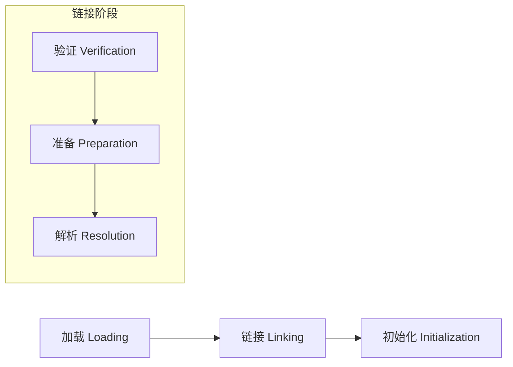
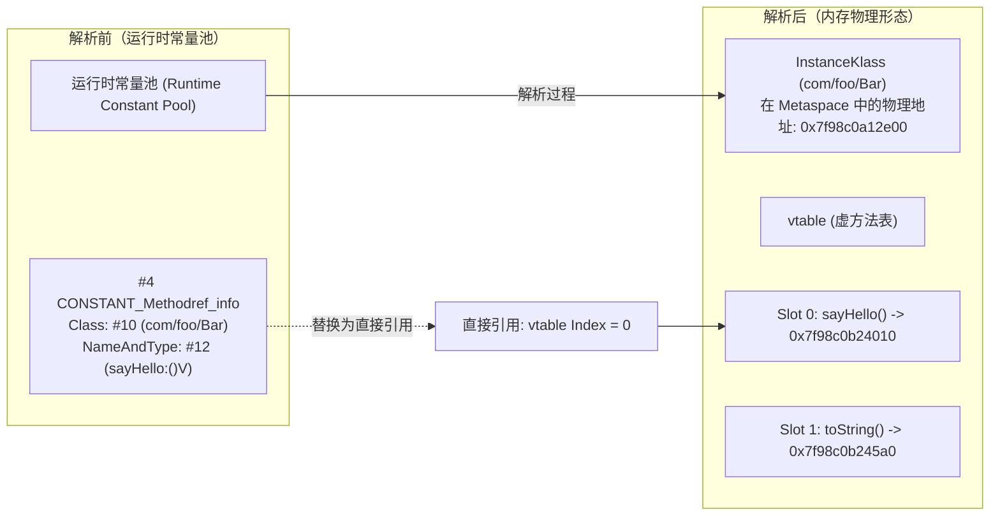
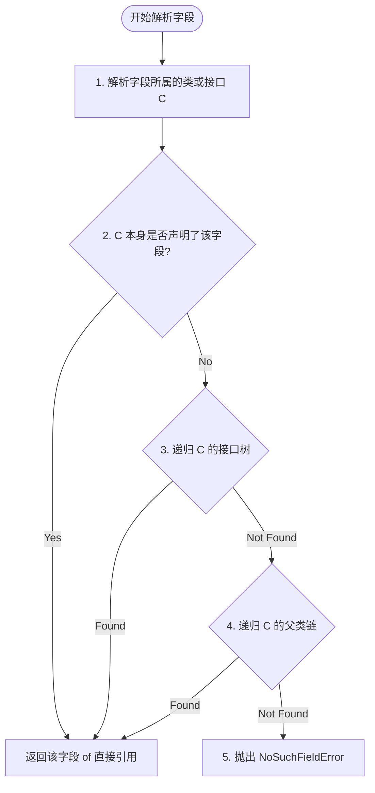
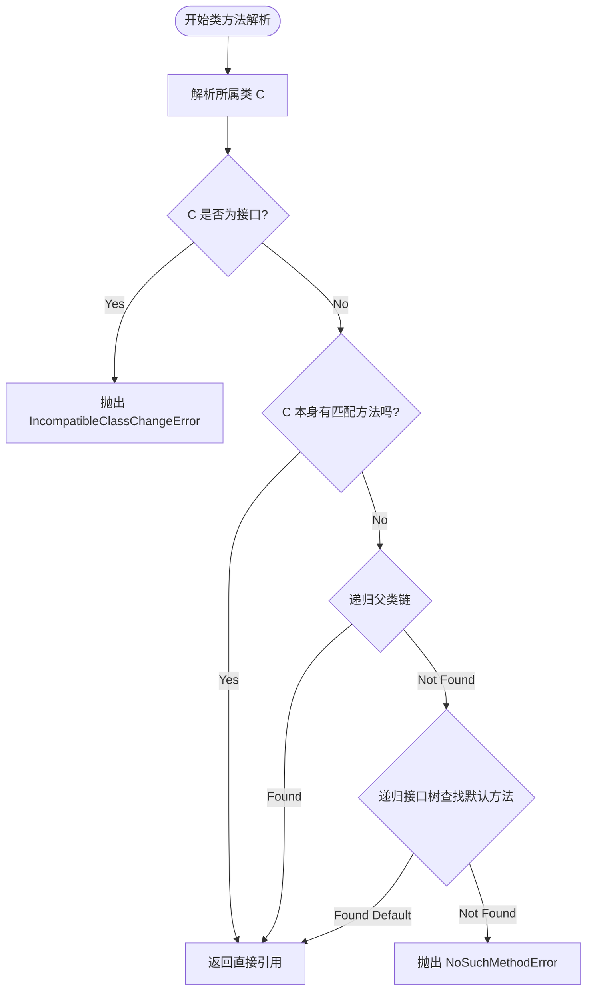
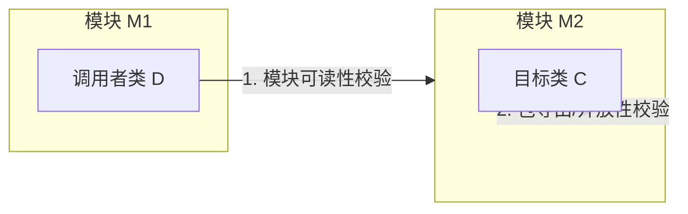

# 2.1.6.4 解析

在 Java 虚拟机的类加载生命周期中，**解析（Resolution）** 是链接（Linking）阶段的核心步骤。它的主要任务是将运行时常量池（Runtime Constant Pool）内的**符号引用（Symbolic Reference）** 替换为指向内存中目标实体的**直接引用（Direct Reference）**。这一过程不仅涉及复杂的类加载触发与递归寻址算法，还与虚拟机的底层执行效率（如运行时常量池缓存 `ConstantPoolCache`）以及安全沙箱机制（如可访问性校验与模块化封装）深度绑定。

本文将从 JVM 规范与 HotSpot 虚拟机的物理实现双重视角，对解析机制进行底层的物理级深度剖析。

---

## 1. 解析（Resolution）的定义与底层本质

### 1.1 什么是类加载中的解析？
在 Java 编译期，编译器并不知道类、字段或方法在内存中的具体布局和物理地址。因此，Class 文件中所有对其他类、方法、字段的引用，都是以符号引用的形式存储在常量池中。

解析阶段的本质，就是 **将这些抽象的符号表示转换为可以直接被 CPU 硬件、执行引擎或 JVM 寻址系统识别的物理形态**。

根据 Java 虚拟机规范（JVMS），解析阶段在逻辑上是链接阶段的第三步：



### 1.2 解析在类生命周期中的阶段与定位
虽然 JVM 规范将“解析”定义为链接的子阶段，但它在实际执行时具有高度的灵活性：
1. **预先解析（Eager Resolution）**：在类被加载、验证和准备之后，虚拟机可以主动解析该类常量池中的所有符号引用。
2. **惰性解析（Lazy/Late Resolution）**：虚拟机可以等到某个字节码指令（如 `getstatic`、`invokevirtual`）真正执行并需要使用该符号引用时，才去对其进行解析。

目前主流的商用 JVM（如 Oracle HotSpot）默认采用**惰性解析**策略。这意味着，除了某些必须在类加载阶段确定的引用外，绝大多数符号引用在类加载链接时并不会被解析，而是保持“未解析（Unresolved）”状态，直到其对应的字节码指令首次被执行。

### 1.3 静态解析与动态解析的边界
- **静态解析（Static Resolution）**：在编译期或类加载链接期即可完全确定物理指向的引用。例如，静态方法（`invokestatic`）、私有方法/构造器/父类方法（`invokespecial`）以及 `final` 方法。由于它们不具备多态特征，其目标方法在运行期是不可能发生变化的，因此这类符号引用在首次解析后便可彻底绑定到具体的物理地址（即“早期绑定”）。
- **动态解析（Dynamic Resolution）**：必须在运行期根据调用发生时的实际接收者类型（Receiver Type）来确定具体物理指向的引用。例如，通过 `invokevirtual` 调用的普通虚方法，或通过 `invokeinterface` 调用的接口方法。虽然符号引用本身在运行期首次执行时会被解析，但其真正的寻址还需要依赖运行时的方法表（vtable/itable）间接索引（即“晚期绑定”）。

---

## 2. 符号引用与直接引用的物理形态与机器寻址差异

符号引用与直接引用不仅在概念上不同，它们在 JVM 内部的**物理存储结构**和**机器码级的寻址方式**上也有着本质差异。

### 2.1 符号引用的 Class 二进制结构与字面量形态
符号引用是 Class 文件常量池中的一组字面量，其结构完全符合 JVMS 定义的常量池表项规范。它们是纯粹的逻辑描述，不依赖于任何物理内存布局。

以方法符号引用为例，在 Class 文件中，它由 `CONSTANT_Methodref_info` 结构体表示：

| 字段名 | 类型 | 说明 |
| :--- | :--- | :--- |
| `tag` | `u1` | 固定为 `10`（代表 `CONSTANT_Methodref`） |
| `class_index` | `u2` | 指向 `CONSTANT_Class_info` 的索引，表示方法所属的类 |
| `name_and_type_index` | `u2` | 指向 `CONSTANT_NameAndType_info` 的索引，表示方法名和描述符 |

进一步拆解，`CONSTANT_Class_info` 指向类名的 UTF-8 字符串；`CONSTANT_NameAndType_info` 指向方法名（如 `"toString"`）和方法描述符（如 `"()Ljava/lang/String;"`）的 UTF-8 字符串。

**物理特性**：符号引用在磁盘上是一串字节流，在类加载后被读入内存，存放在方法区（Metaspace）的运行时常量池中。此时它依然只是一个逻辑标识符（如“类 `com.example.Service` 的 `execute` 方法，参数为空，返回值是 `void`”），CPU 无法直接通过它跳转执行。

### 2.2 直接引用的机器寻址层物理形态
直接引用是能够让虚拟机在宿主机硬件或执行引擎中直接或间接定位到目标实体的物理凭证。在 HotSpot 虚拟机中，直接引用主要有以下三种形态：

#### 2.2.1 物理内存指针（Direct Pointer）
对于类（`Klass` 对象）或静态成员，解析完成后，直接引用就是指向方法区中该目标对象内存首地址的绝对物理指针。
在 64 位 JVM 中，这通常是一个 64 位的虚拟内存地址（若启用了指针压缩，则为 32 位压缩指针）。

- **寻址表现**：CPU 可以将该指针直接加载到寄存器中，执行跳转或数据读取。

#### 2.2.2 物理内存偏移量（Field Offset）
对于实例变量（Field），解析完成后，直接引用是该字段在类实例对象（OOP）内存布局中相对于对象起始地址的**相对物理偏移量（Offset）**。

Java 对象在堆中的物理结构由对象头（Mark Word、Klass Word）和实例数据组成。在类加载的准备阶段，JVM 已经计算出了每个字段的物理大小和排列顺序。

- **寻址表现**：假设一个类 `User` 含有实例变量 `int age`，解析后该字段的直接引用为整数值 `16`（表示相对于对象头起始位置偏移 16 字节）。
  在 x86-64 汇编层级，若当前对象的引用存放在寄存器 `rsi` 中，读取 `age` 字段的机器指令可直接写为：
  ```assembly
  mov eax, [rsi + 16]   ; rsi (对象基址) + 16 (字段偏移量)
  ```
  不需要任何查找，一条 CPU 指令即可完成内存寻址。

#### 2.2.3 虚方法表/接口方法表索引（vtable/itable Index）
对于需要支持多态派发的虚方法（`invokevirtual`）和接口方法（`invokeinterface`），解析出来的直接引用并不是一个固定的方法入口指针，而是一个**虚方法表索引（vtable Index）**或**接口方法表索引（itable Index）**。

- **vtable（Virtual Method Table）**：每个类（`Klass`）在方法区中都有一个线性表，存放着该类所有可动态绑定的虚方法入口指针。子类继承父类时，子类的 vtable 会拷贝父类的 vtable，若子类重写了父类方法，则在相同索引（Slot）处覆盖为子类的方法指针。
- **寻址表现**：解析完成后，直接引用就是一个整型索引值（如 `3`，代表 vtable 中的第 3 个槽位）。
  执行虚方法调用时的寻址逻辑为：
  1. 通过对象头（OOP）获取其动态类型元数据指针（`Klass*`）。
  2. 根据 `Klass*` 找到其虚方法表（vtable）的起始地址。
  3. 加上索引偏移量（`index * 8`），取出实际的方法实体指针（`Method*`）。
  4. 跳转到该方法入口执行。

### 2.3 符号引用到直接引用的内存布局演变图解



### 2.4 x86-64 汇编层面的寻址对比（未解析 vs 已解析）

以读取一个实例字段 `getfield #3`（`#3` 指向一个未解析的字段符号引用）为例，在机器执行层面的对比：

#### 场景 A：未解析状态（慢速路径）
由于常量池中只有符号引用，字节码解释器或 JIT 编译器无法直接执行。它必须陷入 JVM 运行时的“慢速路径”：
1. 调用 JVM 内部的 C++ 链接解析器（`LinkResolver`）。
2. 在 C++ 栈中执行类、字段的查找算法（下文详述）。
3. 进行安全可访问性校验。
4. 将物理偏移量写回缓存。
5. 恢复线程执行。整个过程涉及数百条汇编指令和上下文切换。

#### 场景 B：已解析状态（快速路径）
一旦解析完成，符号引用已被替换为物理偏移量（假设为 24）。在解释执行或 JIT 编译后，其对应的 x86-64 汇编代码精简为：
```assembly
; rbx 存放当前对象的指针 (Oop)
; r10 存放解析后的偏移量 24
mov rax, [rbx + r10]    ; 直接寻址：将对象内存地址 + 24 处的数据加载到 rax 寄存器
```
整个寻址在 1 个 CPU 时钟周期内即可完成，性能相差数千倍。

---

## 3. 解析时机与 HotSpot 运行时常量池缓存（ConstantPoolCache）深度剖析

由于解析的开销极大，如果每次字节码指令执行时都去运行时常量池中通过字符串比对和算法查找，Java 程序的性能将无法接受。为此，HotSpot 设计了高效的**运行时常量池缓存（ConstantPoolCache）**机制。

### 3.1 早期绑定（Early Resolution）与晚期绑定（Late Resolution）
- **早期绑定**：主要应用于静态链接。在类加载的链接阶段，JVM 就会将符号引用解析为直接引用。例如，`invokestatic` 和 `invokespecial` 指令指向的目标。
- **晚期绑定**：主要应用于动态链接。直到程序运行到该条指令时，JVM 才开始解析。例如，`invokevirtual` 和 `invokeinterface` 指令，它们在不同运行时刻可能指向不同的子类实现，必须依赖晚期绑定及运行时多态派发。

### 3.2 常量池缓存（ConstantPoolCache）的设计动机
原始的运行时常量池（`ConstantPool`）是只读的，且结构与 Class 文件一一对应，不便于在运行期动态修改。
为了实现快速路径跳转并规避多次解析，HotSpot 在类加载的链接阶段，会在元空间（Metaspace）中为每个类单独分配一个可读写的缓存区域 —— **`ConstantPoolCache`（简称 `cpCache`）**。

`cpCache` 并不直接存储常量，而是为需要频繁解析和执行的字节码指令（如 `getfield`、`putfield`、以及所有的 `invoke*` 系列指令）对应的常量池项，建立一个对等的缓存条目 `ConstantPoolCacheEntry`。

```
[原始 ConstantPool] (只读)
      ^
      | 1:1 映射
      v
[ConstantPoolCache] (可读写，位于 Metaspace)
  +-----------------------------------+
  | ConstantPoolCacheEntry [0]        |
  | ConstantPoolCacheEntry [1]        |  --> 包含解析后的直接引用（偏移量/指针）
  | ...                               |
  +-----------------------------------+
```

### 3.3 `ConstantPoolCacheEntry` 的物理内存结构
在 HotSpot 源码中，每个 `ConstantPoolCacheEntry` 占用 **4 个字宽（Word Size，在 64 位系统下为 32 字节）**。其 C++ 定义位于 `src/share/vm/oops/cpCache.hpp`，包含以下四个核心物理字段：

```cpp
class ConstantPoolCacheEntry {
  volatile intptr_t _indices;  // 索引与字节码状态标记
  volatile Metadata* _f1;      // 元数据指针（指向 Method* 或 Klass*）
  volatile intptr_t _f2;       // 偏移量或方法表索引
  volatile intptr_t _flags;    // 类型及状态标志位
}
```

#### 3.3.1 `_indices` 字段的位域设计与多状态表示
`_indices` 是一个多功能的位域（Bit Field），在 64 位系统中其低位与高位被赋予了不同的物理含义：
- **[15:0] 位**：存储原始只读常量池中的索引（Constant Pool Index），用于在未解析时反向查找原始符号引用。
- **[23:16] 位**：存储字节码指令 1（`bytecode_1`），通常是原始的未解析字节码（如 `getfield`）。
- **[31:24] 位**：存储字节码指令 2（`bytecode_2`），当解析成功后，JVM 会将此处改写为高度优化的“快速执行字节码”（如 `_fast_igetfield`、`_fast_aputfield`），解释器看到该字节码后会直接走汇编快速通道。
- **[63] 位（符号位）**：解析完成标志位（Resolved Flag）。若该位被置为 1，则表示该条目已成功解析，直接引用已就绪。

#### 3.3.2 `_f1` 与 `_f2` 字段的多义性映射
这两个字段根据被解析实体的不同（字段还是方法），承载完全不同的物理数据：

| 实体类型 | `_f1` 物理含义 | `_f2` 物理含义 |
| :--- | :--- | :--- |
| **字段 (Field)** | 未使用（为 `NULL`） | 字段在对象内存中的**物理偏移量 (Offset)** |
| **非虚方法 (Static/Special)** | 指向目标 `Method` 元数据的物理指针（`Method*`） | 未使用（为 `0` 或存放特殊标记） |
| **虚方法 (Virtual)** | 指向定义该虚方法的类元数据（`Klass*`） | 该虚方法在当前类 vtable 中的**索引 (vtable Index)** |
| **接口方法 (Interface)** | 指向定义该接口的元数据（`Klass*`） | 该方法在 itable 中的**索引 (itable Index)** |

#### 3.3.3 `_flags` 字段的元数据编码
`_flags` 用于存放丰富的数据特征，以供执行引擎在寻址时快速做出分支判断，避免通过昂贵的 C++ RTTI 进行类型推导：
- **[3:0] 位 (TOS State)**：**栈顶状态（Top of Stack State）**。指示该字段或方法返回值的物理类型（如 `l` 代表 long，`d` 代表 double，`a` 代表引用类型 object）。解释器根据此状态可以直接决定将数据压入哪个物理寄存器。
- **[4] 位 (is_final)**：指示该字段或方法是否被 `final` 修饰。
- **[5] 位 (is_volatile)**：指示该字段是否被 `volatile` 修饰。如果是，解释器在执行 `putfield` 时必须插入内存屏障（Memory Barrier）以保证可见性与有序性。
- **[7] 位 (is_vfinal)**：指示该虚方法是否为 `final` 方法。虽然它是虚方法，但由于不能被子类重写，因此它不需要走 vtable 派发，其 `_f2` 可以直接存放 `Method*` 指针。

#### 3.3.4 HotSpot 字段写入逻辑（C++ 物理实现）
在解析字段成功后，HotSpot 并不会直接将其赋给只读的常量池，而是通过 `ConstantPoolCacheEntry::set_field` 写入缓存条目。其底层的 C++ 实现逻辑如下：

```cpp
void ConstantPoolCacheEntry::set_field(
  Bytecodes::Code     get_code,       // 快速 get 字节码，如 _fast_igetfield
  Bytecodes::Code     put_code,       // 快速 put 字节码，如 _fast_iputfield
  KlassHandle         field_holder,   // 声明该字段的 Klass 句柄
  int                 field_index,    // 字段在 Klass 中的索引
  int                 field_offset,   // 字段相对于对象首地址的物理偏移量
  TosState            field_type,     // 栈顶状态 (TOS)
  bool                is_local,       // 是否为当前类字段
  bool                is_final,       // 是否是 final 字段
  Klass*              referrer        // 引用该字段的类
) {
  // 1. 验证偏移量是否合理
  assert(field_offset >= 0, "offset is invalid");
  
  // 2. 构造 _flags 字段的值
  int volatile_bit = field_holder()->field_is_volatile(field_index) ? 1 : 0;
  intptr_t flags = (field_type << tos_state_shift) |
                   (is_final     << is_final_shift) |
                   (volatile_bit << is_volatile_shift);

  // 3. 将偏移量和标志写入对应的物理槽中
  _f1 = NULL; // 字段解析不需要 f1 指针
  _f2 = field_offset;
  _flags = flags;

  // 4. 最后更新 _indices，带入快速执行的字节码，并触发 release 屏障以使得多线程可见
  intptr_t indices = (put_code << bytecode_2_shift) |
                     (get_code << bytecode_1_shift) |
                     _indices; // 保留原始常量池索引
  OrderAccess::release_store(&_indices, indices | resolved_bit_mask);
}
```

### 3.4 快速路径（Fast Path）与慢速路径（Slow Path）的转换机理
当 JVM 执行一条包含符号引用的字节码指令时，其底层状态转换与寻址分支如下：

```mermaid
stateDiagram-v2
    [*] --> Unresolved : 首次加载类后，条目处于未解析状态
    
    state Unresolved {
        direction LR
        A: _indices 包含原始常量池索引
        B: _f1 = NULL, _f2 = 0
    }

    Unresolved --> Interpreter_Slow_Path : 执行字节码，触发慢速路径
    
    state Interpreter_Slow_Path {
        direction TB
        C: 调用 LinkResolver::resolve_field/method
        D: 执行递归查找算法
        E: 校验 Access Control
    }

    Interpreter_Slow_Path --> Resolved : 解析成功，写入物理数据
    
    state Resolved {
        direction TB
        F: _indices 高位置 resolved 标记 & 改写为快速字节码 (如 _fast_igetfield)
        G: _f1/_f2 填入指针或偏移量
    }

    Resolved --> Fast_Path : 再次执行该指令
    
    state Fast_Path {
        H: 汇编级读取 _f2 (偏移量/vtable索引)
        I: CPU 直接寻址执行
    }
    
    Fast_Path --> [*]
```

### 3.5 运行时多次解析规避的无锁化与原子性保障
在多线程并发环境下，可能会有多个线程同时执行同一条未解析的字节码指令。为了避免复杂的锁竞争，HotSpot 在更新 `ConstantPoolCacheEntry` 时采用了**无锁化的原子写操作**：
1. **单次解析保障**：虽然多个线程可能并行进入 `LinkResolver` 的慢速路径去解析同一个符号引用，但它们计算出的直接引用（物理指针或偏移量）是完全相同的。
2. **Release Barrier 写入**：在写入 `_f1`、`_f2` 和 `_flags` 之后，最后通过 `OrderAccess::release_store` 原子性地写入 `_indices` 字段中的 `resolved` 状态标记。
3. **内存屏障保证**：当其他线程通过 `OrderAccess::acquire` 读取到 `_indices` 已更新时，可以绝对保证 `_f1` 和 `_f2` 的物理写入已被同步到当前 CPU 核心的 Cache 中。已解析的条目将永远不会再次触发慢速路径，从而在物理层面规避了多次解析的开销。

---

## 4. 四大类型符号引用解析的底层递归算法与冲突判定

当 JVM 决定对一个符号引用进行解析时，会调用核心模块 `LinkResolver`。针对不同类型的符号引用，JVM 规范定义了严格的递归寻址与消歧义（Disambiguation）算法。

### 4.1 类或接口解析（Class or Interface Resolution）
设当前调用者类为 $D$，符号引用指向的类或接口为 $C$。解析 $C$ 的物理步骤如下：
1. **加载路径判定**：
   - 如果 $C$ 不是一个数组类型，JVM 将 $C$ 的全限定名（以 UTF-8 字符串形式）传递给类加载器 $L_D$（即加载了调用者类 $D$ 的那个加载器）去主动加载类 $C$。如果在加载过程中触发了其他类的加载且失败，则向上抛出 `NoClassDefFoundError`。
   - 如果 $C$ 是一个数组类型，且其元素类型为引用类型（如 `[[Ljava/lang/String;`），JVM 会先递归调用上述步骤解析其元素类型 `java/lang/String`。解析成功后，JVM 内部直接在内存中构建代表该多维数组的 `ArrayKlass` 对象。
2. **可访问性验证**：
   - 类加载成功后，JVM 必须立即校验类 $D$ 是否具有访问类 $C$ 的权限。如果校验失败，抛出 `IllegalAccessError`。

---

### 4.2 字段解析（Field Resolution）
字段解析首先会解析其所属的类或接口 $C$。若成功，则在 $C$ 中对字段符号引用（包含字段简单名称与描述符）进行递归查找。

#### 4.2.1 字段查找算法步骤
为了兼容 Java 语言的各种继承特征，JVM 规范规定了以下严格的递归查找顺序：



详细的算法执行路径如下：
1. **本类查找**：检查 $C$ 本身。如果 $C$ 中定义了简单名称和描述符都与符号引用匹配的字段，则查找成功，直接返回该字段的直接引用。
2. **接口树递归查找（深度优先）**：如果本类没有，则从 $C$ 直接实现的每个接口开始，沿着接口继承链向上**深度优先（Depth-First）**递归查找其父接口。如果在某个接口中找到了匹配的字段，则返回。
3. **父类链递归查找（自底向上）**：如果接口树中也没有，且 $C$ 存在父类 $S$（$S \neq \text{Object}$），则沿着父类继承链自底向上（Bottom-Up）递归查找 $S$ 及其所有父类。若在某个父类中找到，则返回。
4. **异常抛出**：若上述三步均未找到匹配的字段，说明该字段物理上不存在，抛出 `java.lang.NoSuchFieldError`。

#### 4.2.2 多重继承接口树的 Ambiguous 冲突判定与 JVM 规范约束
Java 虽然不支持类的多重继承，但支持接口的多重实现。如果在接口树的递归查找中，多个互不相干的接口分支中都存在同名同类型的字段，就会引入**歧义性（Ambiguity）**。

##### 运行期歧义性示例：
假设我们有两个接口 $I_1$ 和 $I_2$，它们之间没有任何继承关系。
```java
public interface I1 {
    int VAL = 100;
}

public interface I2 {
    int VAL = 200;
}

// 类 C 实现了这两个接口，但并没有声明 VAL
public class C implements I1, I2 {
}
```

如果在编译期，Java 编译器检查到 `C.VAL` 的调用，会直接拦截并抛出编译错误。然而，如果有字节码强行引用 `com/foo/C.VAL` 并绕过了编译检验（例如在运行期动态组装 Class 文件），则在类加载解析阶段，JVM 将按照以下判定逻辑进行**二义性判定**：

```
      [I1] (VAL=100)      [I2] (VAL=200)
         \                  /
          \                /
           \              /
            \-- [ C ] <--/
```

1. 解析器在 $C$ 本身没有找到该字段。
2. 检索接口树，沿着实现的接口进行深度优先遍历。
3. 发现 $I_1$ 提供了匹配的字段 `VAL`，同时 $I_2$ 也提供了匹配的字段 `VAL`。
4. 因为 $I_1$ 和 $I_2$ 互不为子父类关系（它们在拓扑上是平行的分支），解析器无法确定使用哪一个物理常量。
5. 此时 JVM 将判定为 **Ambiguous Reference（模糊引用）**，并且由于在接口树中无法消歧义，HotSpot 虚拟机会抛出 `java.lang.IncompatibleClassChangeError`。

---

### 4.3 类方法解析（Class Method Resolution）
类方法解析用于处理声明在类（而非接口）中的方法符号引用。

#### 4.3.1 类方法查找算法步骤
设方法所属的类型为类 $C$：
1. **类型校验**：如果解析出的 $C$ 实际上是一个**接口**，说明调用者试图用类方法指令去调用接口方法，JVM 立即抛出 `java.lang.IncompatibleClassChangeError`。
2. **本类查找**：在类 $C$ 中查找是否有简单名称和描述符均匹配的方法。若有，则返回该方法的直接引用。
3. **父类链递归查找**：若本类没有，在类 $C$ 的父类继承链中自底向上递归查找。若在某个父类中找到匹配的方法，则返回。
4. **接口树查找（默认方法解析）**：若父类链中依然没有，则在类 $C$ 直接或间接实现的所有接口树中进行递归查找。
   - 如果在接口中找到了匹配的方法，并且该方法是**默认方法（Default Method，即被 `default` 修饰且非 `abstract` 的方法）**，则返回。
   - 如果找到了匹配的方法但它是 `abstract` 的，或者找到了多个冲突的默认方法，则根据消歧义规则处理。
5. **未找到异常**：若上述步骤均宣告失败，抛出 `java.lang.NoSuchMethodError`。



#### 4.3.2 默认方法（Default Method）引入后的多接口冲突与继承树消歧义
Java 8 引入接口默认方法后，接口不再仅仅定义抽象契约，还承载了具体的实现。当一个类通过不同的分支继承了多个默认方法时，其消歧义寻址算法变得更为精细：

##### 场景一：继承链覆盖（Sub-interface Wins）
```java
public interface I1 {
    default void hello() { System.out.println("I1"); }
}
public interface I2 extends I1 {
    @Override
    default void hello() { System.out.println("I2"); }
}
public class C implements I1, I2 {}
```
在解析 `C.hello()` 时：
- `I2` 继承自 `I1`，因此 `I2` 的 `hello` 比 `I1` 的更为具体（More Specific）。
- 解析器能够成功消歧义，自动判定 `I2` 的默认方法为唯一的解析结果，返回其物理入口。

##### 场景二：无继承关系的平行分支冲突
```java
public interface I1 {
    default void hello() { System.out.println("I1"); }
}
public interface I2 {
    default void hello() { System.out.println("I2"); }
}
public class C implements I1, I2 {}
```
在解析 `C.hello()` 时：
- `I1` 和 `I2` 是两个互不相关的接口。它们都提供了 `hello()` 的默认实现。
- 类 `C` 自身并没有通过覆写 `hello()` 方法来解决冲突。
- 此时，类方法解析在检索接口树时检测到发生了**默认方法命名冲突（Default Method Conflict）**。
- 由于没有任何规则能够消歧义，JVM 必须在此处阻止该调用，并在链接解析阶段直接抛出 `java.lang.IncompatibleClassChangeError`。

#### 4.3.3 `AbstractMethodError` 与 `NoSuchMethodError` 的边界划分
这两个错误经常让开发者产生混淆，它们在 JVM 解析和链接时的触发机制有着严格的界限：
- **`NoSuchMethodError`**：发生在**解析阶段**。即在整个类继承链和接口树中，完全找不到一个与符号引用在“名字”和“方法描述符”上完全一致的方法声明。
- **`AbstractMethodError`**：发生在**解析成功后的链接或运行期调用阶段**。
  - 场景 1：符号引用被成功解析到了一个方法，但该方法在物理上是一个 `abstract` 方法，而执行引擎在运行时尝试对其进行调用（例如，由于编译期与运行期的类版本不一致，子类没有实现该抽象方法）。
  - 场景 2：在动态绑定过程中，运行时查找到的实际调用目标（来自 vtable 派发）依然是 `abstract` 的，此时抛出此错。

---

### 4.4 接口方法解析（Interface Method Resolution）
接口方法解析用于处理声明在接口中的方法符号引用。

#### 算法执行路径：
设方法所属的类型为接口 $I$：
1. **类型校验**：如果解析出的 $I$ 实际上是一个**类**而非接口，立即抛出 `java.lang.IncompatibleClassChangeError`。
2. **本接口查找**：在接口 $I$ 本身中查找，若存在匹配的方法，返回直接引用。
3. **父接口链递归查找**：在接口 $I$ 的所有父接口（包括 `java.lang.Object` 的接口投射模型）中递归查找。若在某个父接口中找到匹配的方法，返回直接引用。
4. **`java.lang.Object` 兜底查找**：由于 Java 中所有的接口类型引用在语言级都可以调用 `java.lang.Object` 中的 `public` 实例方法（例如 `toString()`），但在类文件中，接口并不显式继承自 `Object`。
   因此，若在接口树中仍未找到，JVM 会在顶层 `java.lang.Object` 类的所有 `public` 实例方法中进行检索。若匹配，则返回该方法的直接引用。
5. **未找到异常**：若均未找到，抛出 `java.lang.NoSuchMethodError`。

---

## 5. 解析成功后的可访问性（Accessibility）校验规则及安全防护

解析阶段不仅要找到目标，还必须承担 JVM 安全沙箱第一道关卡的职责，验证调用者类是否具有访问目标实体（类、字段、方法）的物理权限。

### 5.1 可访问性校验的物理触发时机
可访问性校验（Access Control）发生在符号引用成功解析出直接引用之后、将其写入 `ConstantPoolCacheEntry` 之前。如果校验未通过，当前的直接引用将被废弃，解析宣告失败，并向当前线程抛出错误。

### 5.2 核心修饰符的校验算法与底层边界
设调用者类为 $D$，目标实体为 $E$（可以是类、字段或方法），声明 $E$ 的类为 $C$。

#### 5.2.1 `public` 与 `package-private` 校验
- **`public`**：
  - 若 $E$ 被 `public` 修饰，在不考虑 Java 9 模块化的前提下，任何类 $D$ 均可自由访问。
- **`package-private`（默认无修饰符）**：
  - 类 $D$ 与类 $C$ 必须处于同一个**运行时包（Runtime Package）**中。
  - **关键概念**：运行时包不仅要求包名完全一致（如 `com.foo`），还要求加载它们的**类加载器（ClassLoader）是同一个**。由不同类加载器加载的同名包下的类，在 JVM 底层被视为处于不同的安全域，彼此之间无法访问包私有成员。

#### 5.2.2 `private` 校验与 Java 11+ Nestmates（嵌套类伙伴）机制
- 在 Java 11 之前，`private` 成员只允许声明它的类 $C$ 自身访问。如果在类中定义了内部类，内部类访问外部类的 `private` 成员，编译器必须暗中生成包私有的桥接方法（Bridge Method，如 `access$000`），这不仅增加了 Class 文件体积，也带来了安全漏洞。
- **Nestmates 机制**：自 Java 11（JVMS 11）起，引入了嵌套成员属性（Nest Host 和 Nest Members）。
  - 如果类 $D$ 和类 $C$ 的 Class 文件属性中指向了同一个 **Nest Host（嵌套主类）**，它们就被称为 Nestmates。
  - 在可访问性校验时，JVM 允许 Nestmates 之间直接访问彼此的 `private` 成员，无需任何桥接方法。

#### 5.2.3 `protected` 校验的底层难点：子类接收者类型约束（Receiver Type Constraint）
`protected` 的校验是 JVM 安全体系中最复杂、也最容易被误解的部分。

##### 校验算法：
若目标实体 $E$ 是被 `protected` 修饰的成员，声明它的类为 $C$。调用者类为 $D$。访问要获得许可，必须满足以下两个条件之一：
1. 类 $D$ 与类 $C$ 处于同一个运行时包内。
2. 类 $D$ 是类 $C$ 的**子类（Subclass）**。

然而，对于条件 2，如果 $E$ 是**实例成员**（非静态字段或非静态方法），JVM 会施加极其严格的**接收者类型约束（Receiver Type Constraint）**：

> **JVM 规范约束**：
> 设调用发生时，执行访问的目标对象引用（即 Receiver）的符号类型为 $T$。
> 那么，$T$ 必须是类 $D$ 本身，或者是类 $D$ 的子类。

##### 为什么需要这个约束？
如果没有这个约束，子类就可以利用 `protected` 特权去访问或修改父类中其他不相关子类实例的受保护成员，从而破坏面向对象的强封装性。

```
          [Animal] (声明 protected int age)
             ^
             |
     +-------+-------+
     |               |
   [Dog]           [Cat]  <-- 它们是兄弟类
```

##### 物理校验的代码场景剖析：
我们通过一个跨包继承的具体 Java 示例来展示这个约束在运行期的影响：

```java
// 声明包 p1
package p1;
public class Father {
    protected int money = 1000;
}

// 声明包 p2
package p2;
import p1.Father;

public class Son extends Father {
    public void check(Father f, Son s) {
        // 场景 1
        int myMoney = s.money; // 允许！因为引用类型为 Son，Son 继承自 Father，且 Son 是调用类 Son 的自身。
        
        // 场景 2
        int hisMoney = f.money; // 编译报错！在运行期也会触发 IllegalAccessError！
                                // 虽然调用者 Son 继承了 Father，但这里访问的引用符号类型是 Father。
                                // Father 既不是 Son 也是不是 Son 的子类。
    }
}
```

##### 为什么场景 2 会被拦截？
假设存在另一个兄弟类 `Daughter` 同样继承自 `Father`，且未重写 `money`。如果 JVM 允许场景 2 发生，这意味着在类 `Son` 中，我们只要拿到一个指向 `Daughter` 实例的 `Father` 引用，就可以肆无忌惮地读取或更改 `Daughter` 的受保护数据。
因此，JVM 强加了“接收者类型必须是调用类及其子类”的约束。
在类方法解析或字段解析的最后，JVM 对 `protected` 字段的读写（如 `getfield`）和方法的调用（如 `invokevirtual`）都会进行该项合法性检查，一旦发现引用类型 $T$ 的 Klass 无法向上转型（Assignable）为调用者类 $D$ 的 Klass，就会抛出 `IllegalAccessError`。

---

### 5.3 Java 9+ 强封装性下的模块化可访问性校验（JPMS）
自 Java 9 引入模块系统（JPMS）后，JVM 在可访问性校验中引入了第三维度的校验 —— **模块可读性与包导出性**。
如果调用者类 $D$ 位于模块 $M_1$ 中，目标类 $C$ 位于模块 $M_2$ 中：



1. **模块可读性（Reads Relationship）**：模块 $M_1$ 必须在模块声明中明确声明依赖（`requires`）了模块 $M_2$。
2. **包导出性（Exports Package）**：模块 $M_2$ 必须在其模块声明中明确将类 $C$ 所在的包导出（`exports`）给 $M_1$。
3. **反射开放性（Opens Package）**：如果调用者 $D$ 是通过 Java 反射 API 试图解析并访问 $C$ 的非 `public` 成员，则 $M_2$ 必须将该包开放（`opens`）给 $M_1$。

如果上述条件任意一项未满足，即使类、字段或方法的修饰符是 `public`，JVM 的解析器依然会拦截并拒绝访问。

#### 模块化校验反射与字节码直接调用的底层差异：
在 Java 9 之后，反射 API 的解析动作在 JVM 层面通过 `Reflection::reflect_check_access` 汇编或 C++ 方法进行二次安全验证：
- **静态字节码链接**：只验证 `module_a` 对 `module_b` 的 `exports` 属性。
- **反射动态解析**：必须验证 `module_b` 是否对 `module_a` 进行了 `opens` 导出。如果未进行 `opens`，调用者使用反射的 `setAccessible(true)` 时，JVM 会直接抛出 `IncompatibleObjectAccessError` 或 `IllegalAccessError`。这一机制彻底消除了第三方库通过反射肆意窥探 JDK 内部元数据的安全隐患。

### 5.4 `IllegalAccessError` 的抛出机制与 HotSpot 源码级触发流
在 HotSpot 虚拟机的链接器 `LinkResolver` 中，一旦可访问性校验判定失败，就会触发异常生成逻辑。

#### 源码级调用链流程：
```
[LinkResolver::resolve_field / resolve_method]
                      |
                      v
      [LinkResolver::check_field_accessability]
                      |
                      v
[LinkResolver::check_method_accessability]  --> (发现无权访问)
                      |
                      v
          [Exceptions::new_exception]
                      |
                      v
[THROW_MSG_NULL(vmSymbols::java_lang_IllegalAccessError())]
```

当 `LinkResolver` 抛出 `IllegalAccessError` 时，会伴随非常详尽的错误信息，包括：
- 调用者的类名与加载器。
- 目标类名与加载器。
- 目标包是否未被导出等模块化诊断信息。

---

## 6. 典型解析异常的生产案例与排障指南

解析阶段的异常通常在运行时突然抛出，破坏系统稳定性。以下是生产环境中最常见的三大类解析异常及其底层成因。

### 6.1 依赖冲突（Jar Hell）导致的 `NoSuchMethodError`

#### 生产场景：
项目在本地测试一切正常，部署到生产服务器后，在调用某个第三方 SDK 的方法时突然崩溃，抛出如下异常：
`java.lang.NoSuchMethodError: com.foo.Bar.service(Ljava/lang/String;)V`

#### 底层成因：
这是典型的 **Jar Hell（包冲突）**。
1. **编译期**：项目依赖了 `foo-sdk-v2.jar`，其中 `com.foo.Bar` 包含 `service(String)` 方法。编译器顺利生成了指向该方法的符号引用。
2. **运行期**：由于类路径（ClassPath）中意外夹带了旧版本的 `foo-sdk-v1.jar`，且其在类路径中的顺序优于 v2 版。类加载器首先从 v1 包中加载了 `com.foo.Bar`。
3. **解析时**：当代码执行到调用处，JVM 对符号引用进行解析。在解析类方法时，递归检索已加载的 `com.foo.Bar`（来自 v1），发现其中只有旧的 `service()`（无参）方法，完全不存在符合签名 `(Ljava/lang/String;)V` 的方法，导致类方法解析第 5 步被触发，直接抛出 `NoSuchMethodError`。

---

### 6.2 运行期接口与类定义的类型颠倒引起的 `IncompatibleClassChangeError`

#### 生产场景：
服务在运行过程中抛出：
`java.lang.IncompatibleClassChangeError: Found class com.foo.Helper, but interface was expected`

#### 底层成因：
1. **编译期**：编译项目时，`com.foo.Helper` 被定义为一个接口，项目代码中通过 `invokeinterface` 生成了调用 Helper 方法的字节码。
2. **运行期**：在部署环境里，`Helper` 类文件被替换为了一个同名但被修改为 `class` 的实现。
3. **解析时**：JVM 在接口方法解析的第一步执行类型校验，发现符号引用期望的目标是一个接口，但通过类加载器实际加载出来的元数据（`Klass*`）是一个普通的类（`InstanceKlass`），触发了类型校验不匹配规则，直接抛出 `IncompatibleClassChangeError`。

---

### 6.3 跨模块/反射调用越权引起的 `IllegalAccessError`

#### 生产场景：
在向 Java 17/21 升级过程中，某些依赖反射的底层框架（如序列化工具、动态代理）在解析 JDK 内部类时崩溃：
`java.lang.IllegalAccessError: class my.App cannot access class sun.security.x509.X509CertImpl (in module java.base) because module java.base does not export sun.security.x509 to unnamed module`

#### 底层成因：
1. 自 Java 9 起，JDK 对非公有 API 实施了强封装。
2. `my.App` 处于未命名模块（Unnamed Module），而目标类 `X509CertImpl` 处于模块 `java.base` 的 `sun.security.x509` 包中。
3. 虽然该类在物理上依然存在于 JVM 内存中，但由于 `java.base` 模块没有对未命名模块 `exports` 或 `opens` 该包，JVM 在进行可访问性校验时直接拦截，抛出 `IllegalAccessError`。这是强封装安全策略的物理体现。
