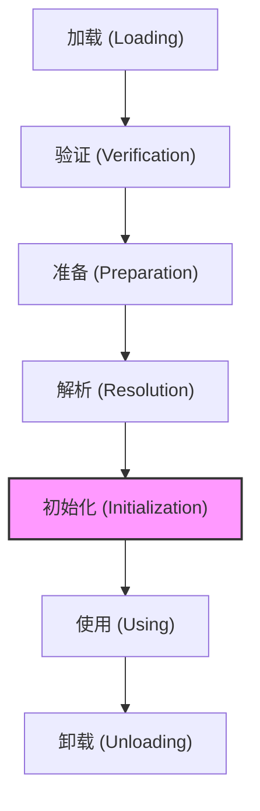
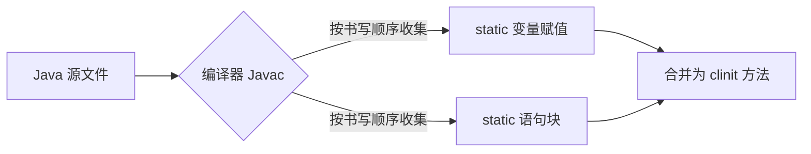
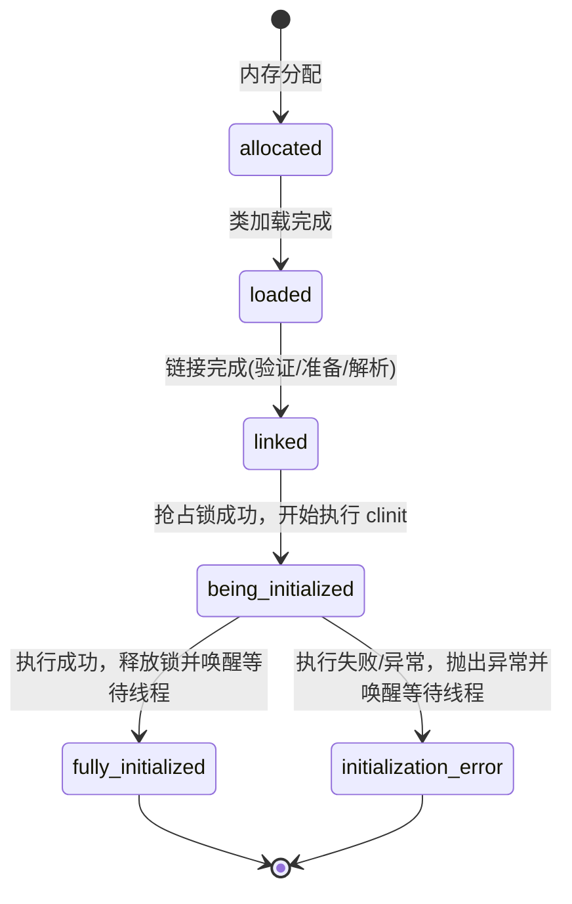

# 2.1.6.5 初始化

类初始化（Class Initialization）是类加载过程的最后一步。在前面的加载、验证、准备和解析阶段中，除了在加载阶段用户自定义的类加载器可以参与外，其余动作完全由虚拟机主导和控制。直到初始化阶段，虚拟机才真正开始执行类中定义的 Java 程序代码（或者说字节码）。

本篇文档将从 JVM 规范与 HotSpot 虚拟机底层实现的角度，对类初始化阶段进行物理级的深度剖析。

---

## 1. 初始化阶段在类生命周期中的定位与本质

### 1.1 虚拟机类加载全生命周期概述
根据《Java虚拟机规范》（Java Virtual Machine Specification, JVMS），一个类型（Class 或 Interface）从被加载到虚拟机内存开始，到被卸载出内存为止，它的整个生命周期包括以下 7 个阶段：



在这 7 个阶段中，验证、准备和解析这三个部分统称为**链接（Linking）**阶段。类初始化紧随解析阶段之后（在某些情况下，解析阶段可以在初始化之后再开始，以支持 Java 语言的运行时动态绑定）。

### 1.2 准备阶段与初始化阶段的物理边界与差异
许多开发者容易混淆“准备阶段”与“初始化阶段”对变量的赋值动作。这两个阶段在 JVM 底层有着完全不同的物理行为与内存状态：

| 物理维度 | 准备阶段 (Preparation) | 初始化阶段 (Initialization) |
| :--- | :--- | :--- |
| **核心任务** | 为类变量（`static` 变量）分配内存并设置**类变量的初始零值**。 | 执行类构造器 `<clinit>()` 方法，按照程序员的主观计划去初始化类变量和其他资源。 |
| **内存位置** | 在 JDK 7 及以前，类变量分配在永久代（Permanent Generation）；JDK 8 及以后，类变量随 Class 对象一起存放在堆（Heap）中。 | 对已分配内存的类变量进行实际值的覆写。 |
| **执行引擎** | 由 JVM 的 C++ 内部引擎直接操作内存，不执行任何 Java 字节码。 | JVM 执行由编译器生成的 `<clinit>()` 方法的 Java 字节码指令。 |
| **特殊情况** | 若变量被 `final` 修饰且是编译期常量，则在准备阶段直接根据 `ConstantValue` 属性赋值为最终值。 | 即使被 `final` 修饰，如果不是编译期常量（需运行时计算），依然在初始化阶段赋值。 |

#### 实例对比剖析
假设有如下类变量定义：
```java
public static int value = 123;
public static final int CONSTANT = 456;
```
1. **在准备阶段**：
   - JVM 为 `value` 分配内存，并将其物理内存区域清零，此时 `value` 的值为 `0`。
   - JVM 为 `CONSTANT` 分配内存，由于它被 `final` 修饰且是一个字面量常量，编译器在编译时已为该字段生成了 `ConstantValue` 属性。JVM 在准备阶段读取该属性，直接将 `CONSTANT` 赋值为 `456`。
2. **在初始化阶段**：
   - JVM 执行类构造器 `<clinit>()` 方法。在该方法中，有一条字节码指令将常量 `123` 推送至栈顶，然后通过 `putstatic` 指令将其赋值给 `value`。此时 `value` 的值才真正变成了 `123`。

### 1.3 初始化阶段的本质
初始化阶段的本质是**类构造器 `<clinit>()` 方法的执行过程**。
在该阶段之前，所有类加载动作都是 JVM 内部的资源准备和格式校验；而到了初始化阶段，JVM 真正移交了执行权，开始运行在 Class 文件中由 Java 源代码编译而来的字节码。可以说，**初始化阶段是类生命周期中，程序员编写的 Java 代码首次获得 CPU 执行权的起点**。

---

## 2. 类构造器 `<clinit>()` 的生成机制与微观动作

类构造器 `<clinit>()`（Class Initializer）是一个特殊的方法，它与实例构造器 `<init>()`（Instance Initializer）在生成时机、执行时机和字节码结构上有着本质的不同。

### 2.1 `<clinit>()` 方法的定义与生成规则
`<clinit>()` 方法并不是由程序员在 Java 代码中显式定义的方法，而是**由 Java 编译器（Javac）在编译阶段自动收集并生成的**。

编译器生成 `<clinit>()` 的物理规则如下：
1. **自动收集与合并**：编译器会自动收集类中所有**静态变量（static）的赋值动作**以及**静态语句块（static {}）中的语句**，并将它们按照在源文件中出现的顺序依次合并，最终生成 `<clinit>()` 方法。
2. **无静态内容不生成**：如果一个类中既没有静态变量的赋值操作，也没有静态语句块，那么编译器在编译该类时，**根本不会**为其生成 `<clinit>()` 方法。在生成的 Class 文件方法表中，不会存在 `<clinit>` 这一项。

### 2.2 静态变量赋值与静态语句块的合并与顺序控制
`<clinit>()` 方法中字节码的执行顺序严格依赖于源文件中代码的物理书写顺序。



#### 字节码合并示例说明
编写如下 Java 类：
```java
public class OrderTest {
    static {
        number = 200;
        System.out.println("静态块执行");
    }
    public static int number = 100;
}
```
我们通过 `javap -v OrderTest.class` 反编译其字节码，查看其自动生成的 `<clinit>()` 方法：
```text
static {};
  descriptor: ()V
  flags: ACC_STATIC
  Code:
    stack=2, locals=0, args_size=0
       0: sipush        200
       3: putstatic     #2                  // Field number:I
       6: getstatic     #3                  // Field java/lang/System.out:Ljava/io/PrintStream;
       9: ldc           #4                  // String 静态块执行
      11: invokevirtual #5                  // Method java/io/PrintStream.println:(Ljava/lang/String;)V
      14: bipush        100
      16: putstatic     #2                  // Field number:I
      19: return
```
**分析：**
- 字节码偏移量 `0` 和 `3` 对应的是静态语句块中的 `number = 200;`，它被先编译。
- 字节码偏移量 `6` 至 `11` 对应的是静态语句块中的控制台打印逻辑。
- 字节码偏移量 `14` 和 `16` 对应的是在静态块后面定义的 `public static int number = 100;` 变量赋值动作。
- 这意味着，在类初始化完成后，`number` 的最终物理值是 `100`，因为后面的赋值指令覆写了前面的赋值指令。

### 2.3 实例构造器 `<init>()` 与类构造器 `<clinit>()` 的本质区别
这两者在 JVM 规范中是完全不同的概念：

| 维度 | 类构造器 `<clinit>()` | 实例构造器 `<init>()` |
| :--- | :--- | :--- |
| **触发时机** | 类被主动引用并进行初始化时执行。 | 实例对象被创建（如 `new`、反射实例化）时执行。 |
| **调用链关系** | JVM 保证父类的 `<clinit>()` 执行完毕后，才执行子类的 `<clinit>()`。无需显式调用。 | 子类 `<init>()` 首行必须隐式或显式地调用父类的 `<init>()`（即 `super()`）。 |
| **锁机制** | JVM 内部自动加互斥锁，多线程环境下保证同步。 | 除非代码中显式同步，否则多线程并发调用实例构造器时是无锁的。 |
| **是否必须** | 如果类无静态赋值和静态块，则没有该方法。 | 任何类（除了特殊的接口）至少会由编译器生成一个默认的无参 `<init>()` 方法。 |

### 2.4 非法向前引用（Illegal Forward Reference）的深度剖析
在 Java 类中定义静态语句块时，存在一个经典的编译期限制：**静态语句块可以对定义在它之后的静态变量进行赋值，但是不能够访问它。**

#### 2.4.1 物理现象与典型代码
```java
public class ForwardReference {
    static {
        value = 2;              // 编译通过：允许赋值（写操作）
        // System.out.println(value); // 编译报错：Illegal forward reference（读操作）
    }
    public static int value = 1;
}
```

#### 2.4.2 编译期检查的语法与 AST 分析原理
为什么 Java 编译器会制定这种“允许写、禁止读”的规则？

这属于 Java 语言规范（Java Language Specification, JLS §8.3.3）中的限制。
在 Java 编译器的语义分析阶段，当解析到静态语句块中的表达式时，编译器会为当前类构建抽象语法树（AST），并维护一个符号表。
- 当编译器在静态语句块中遇到 `value = 2;` 时，它识别到这是一个**左值（Lhs, Left-hand side）表达式**（赋值操作）。由于静态变量 `value` 的声明在后，且这只是一个纯粹的赋值动作，并不会读取该变量在内存中的旧值，因此编译器允许此行为，并直接在生成的 `<clinit>()` 中生成一条 `putstatic` 指令。
- 当编译器遇到 `System.out.println(value);` 时，它识别到 `value` 被用作**右值（Rhs, Right-hand side）表达式**（读取操作）。编译器在符号表中检索 `value`，发现其物理声明位置位于当前静态块之后。由于此时 `value` 的声明尚未被执行（在 Class 字节码顺序中），读取它可能会得到一个非预期的“半初始化”的值，为了避免引起逻辑上的混乱与潜在的死锁、空指针风险，Java 语言规范在编译期便通过 AST 遍历器拦截了此种读行为，直接抛出 `Illegal forward reference` 编译错误。

#### 2.4.3 字节码指令级剖析与执行流推导
如果忽略编译器的读限制（假设只保留赋值），我们反编译 `ForwardReference.class`：
```text
static {};
  Code:
    0: iconst_2
    1: putstatic     #2                  // Field value:I
    4: iconst_1
    5: putstatic     #2                  // Field value:I
    8: return
```
1. `0: iconst_2`：将常量 `2` 推送到操作数栈顶。
2. `1: putstatic #2`：将操作数栈顶的 `2` 赋值给静态变量 `value`。
3. `4: iconst_1`：将常量 `1` 推送到操作数栈顶。
4. `5: putstatic #2`：将操作数栈顶的 `1` 赋值给静态变量 `value`。
5. `8: return`：方法结束。

根据该字节码流可以清晰看到，如果在静态块中允许读取 `value` 的值，在字节码第 1 步执行完毕后，`value` 的临时值是 `2`。然而，当 `<clinit>()` 执行完毕后，其最终值又变回了 `1`。这种临时值与最终值的不一致，是编译器限制向前引用读操作的另一个物理原因。

#### 2.4.4 绕过编译期检查的运行期行为与安全隐患
我们可以通过特定的代码技巧（例如通过方法调用、反射或句柄）来骗过编译器，绕过编译期的向前引用限制。

##### 示例：通过方法调用绕过限制
```java
public class ForwardBypass {
    private static int value = getValue();

    static {
        System.out.println("Static Block 1: temp_value = " + temp_value); // 此时 temp_value 未被赋值
    }

    private static int temp_value = 100;

    static {
        System.out.println("Static Block 2: temp_value = " + temp_value); // 此时 temp_value 已被赋值
    }

    private static int getValue() {
        return temp_value;
    }

    public static void main(String[] args) {
        // 触发初始化
        System.out.println("Main: value = " + value);
    }
}
```

##### 物理运行结果输出：
```text
Static Block 1: temp_value = 0
Static Block 2: temp_value = 100
Main: value = 0
```

##### 物理机制推导与安全隐患：
1. **准备阶段**：JVM 分配内存，`value` 和 `temp_value` 的物理内存均被清零，值均为 `0`。
2. **初始化阶段**执行 `<clinit>()`：
   - 顺序执行第一个静态字段赋值：`value = getValue();`。
   - 调用静态方法 `getValue()`，该方法返回 `temp_value` 的当前值。由于此时 `temp_value` 的物理赋值动作（`temp_value = 100`）在字节码中尚未执行，因此 `temp_value` 依然是其准备阶段的零值 `0`。
   - `getValue()` 返回 `0`，并赋值给 `value`。
   - 顺序执行第一个静态代码块：输出 `temp_value` 的值为 `0`。
   - 顺序执行第二个静态字段赋值：`temp_value = 100;`。
   - 顺序执行第二个静态代码块：输出 `temp_value` 的值为 `100`。
3. **安全隐患**：绕过向前引用限制后，代码在运行期得到了意料之外的 `value = 0`，这种“半初始化”的值在复杂系统（如加载底层驱动、分配核心内存缓冲）中可能会导致极难排查的逻辑漏洞与数据越界。

---

## 3. 父子类与接口在初始化阶段的物理保证与执行顺序

当虚拟机加载并初始化一个包含继承体系的类结构时，它必须严格按照一定的物理顺序来执行各个类的 `<clinit>()` 方法，以确保类型的完整性。

### 3.1 父类与子类初始化顺序的物理锁定
根据 JVMS 规定：**虚拟机在执行子类的 `<clinit>()` 方法之前，必须保证其直接父类的 `<clinit>()` 方法已经执行完毕。**

在 JVM 底层，这是通过以下物理流程控制的：

```mermaid
seqDiagram
    autonumber
    participant JVM as JVM 引擎
    participant Sub as 子类 SubClass
    participant Super as 父类 SuperClass

    JVM->>Sub: 尝试初始化 SubClass
    Note over JVM,Sub: 检查 SubClass 是否已被初始化
    JVM->>Sub: 检测到存在父类 SuperClass 且未初始化
    JVM->>Super: 暂停子类初始化，优先初始化 SuperClass
    Super-->>JVM: 执行 SuperClass 的 clinit 方法完毕
    JVM->>Sub: 恢复子类初始化，开始执行 SubClass 的 clinit 方法
    Sub-->>JVM: 初始化完成
```

由于父类的 `<clinit>()` 先于子类执行，这意味着**父类中定义的静态语句块和静态变量赋值动作，要优先于子类的静态变量赋值操作。**

### 3.2 静态语句块与静态变量赋值的交叉执行顺序剖析
我们编写一个包含继承关系的测试类来验证这一顺序：
```java
class Father {
    public static int A = 1;
    static {
        A = 2;
        System.out.println("Father static block, A = " + A);
    }
}

class Son extends Father {
    public static int B = A;
    static {
        System.out.println("Son static block, B = " + B);
    }
}

public class InitOrderTest {
    public static void main(String[] args) {
        System.out.println("Main active call: Son.B = " + Son.B);
    }
}
```

#### 物理输出结果：
```text
Father static block, A = 2
Son static block, B = 2
Main active call: Son.B = 2
```

#### 执行顺序推导：
1. `main` 方法中调用 `Son.B`，这是一次对子类静态字段的主动引用，触发 `Son` 类的初始化。
2. JVM 发现 `Son` 继承自 `Father` 且 `Father` 尚未被初始化，因此挂起 `Son` 的初始化进程，优先初始化 `Father`。
3. 执行 `Father` 的 `<clinit>()`：
   - 静态字段 `A` 赋值为 `1`。
   - 静态块执行，`A` 被赋值为 `2`，打印 `Father static block, A = 2`。
   - `Father` 初始化完成。
4. 恢复 `Son` 的初始化，执行 `Son` 的 `<clinit>()`：
   - 静态字段 `B` 读取 `Father.A` 的当前值（为 `2`）并赋值给 `B`。
   - 静态块执行，打印 `Son static block, B = 2`。
   - `Son` 初始化完成。

### 3.3 接口（Interface）初始化的特殊物理规则与机制
接口与普通的 Java 类在类加载与初始化阶段有着明显的物理界限：
1. **接口中不能使用静态语句块（static {}）**：Java 语法直接在编译期禁止了在接口中书写静态语句块。
2. **接口仍然会生成 `<clinit>()`**：如果接口中定义了静态成员变量（接口中的变量隐式为 `public static final`），且该变量的初始值需要通过运行期计算得到（而非编译期字面量），或者接口定义了 JDK 8 的默认方法（`default`），则编译器仍然会为该接口生成 `<clinit>()` 方法。
3. **父接口不自动初始化规则（最核心差异）**：
   - 当初始化一个类时，JVM 物理上**不要求**先初始化其实现的接口。
   - 当初始化一个接口时，JVM 物理上**不要求**先初始化其父接口（Superinterface）。
   - **触发父接口初始化的唯一时机**：只有当程序运行期真正使用了父接口中定义的非常量静态字段（或者调用了父接口的默认方法）时，才会强制触发父接口的初始化。

### 3.4 接口与类初始化差异的字节码与运行期佐证
我们编写以下代码，利用外部类 `InitializerHelper` 的静态方法输出日志，来检测接口的初始化物理时机：

```java
class InitializerHelper {
    public static int getVal(String name) {
        System.out.println("Interface initialized: " + name);
        return 100;
    }
}

interface ParentInterface {
    public static final int VALUE_PARENT = InitializerHelper.getVal("ParentInterface");
}

interface ChildInterface extends ParentInterface {
    public static final int VALUE_CHILD = InitializerHelper.getVal("ChildInterface");
}

class Implementor implements ChildInterface {
    static {
        System.out.println("Implementor class initialized!");
    }
}

public class InterfaceInitTest {
    public static void main(String[] args) {
        System.out.println("---- Test 1: Access ChildInterface.VALUE_CHILD ----");
        int val = ChildInterface.VALUE_CHILD;
        
        System.out.println("---- Test 2: Access Implementor Class ----");
        new Implementor();
    }
}
```

#### 物理输出结果：
```text
---- Test 1: Access ChildInterface.VALUE_CHILD ----
Interface initialized: ChildInterface
---- Test 2: Access Implementor Class ----
Implementor class initialized!
```

#### 物理机制分析：
- 在 **Test 1** 中，我们通过主动引用访问了 `ChildInterface.VALUE_CHILD`，这导致 `ChildInterface` 的 `<clinit>()` 方法被执行，从而输出了 `Interface initialized: ChildInterface`。然而，在此过程中，**并没有输出** `Interface initialized: ParentInterface`。这物理上证明了：**子接口的初始化绝对不会自动触发父接口的初始化。**
- 在 **Test 2** 中，我们实例化了 `Implementor` 对象，触发了 `Implementor` 类的初始化，输出了 `Implementor class initialized!`。在此过程中，没有输出任何接口的初始化信息。这物理上证明了：**实现类的初始化绝对不会触发其实现的接口的初始化。**

---

## 4. 线程安全性与 JVM 内部锁机制细节（HotSpot 源码级剖析）

在多线程并发环境下，一个类被首次使用时，可能会有多个线程尝试同时去初始化它。为了避免类变量被重复初始化、状态不一致或者因多线程竞争导致的内存破坏，JVM 内部实现了一套极其严密、安全的锁与状态转移机制。

### 4.1 JVM 内部的 Class 对象状态机（ClassState）
在 HotSpot 虚拟机内部，类的加载和状态信息由 C++ 中的 `InstanceKlass` 类来表示。在 `InstanceKlass` 中，定义了类在整个生命周期中的初始化状态（定义于 `instanceKlass.hpp`）：

```cpp
// HotSpot 内部定义的类初始化状态
enum ClassState {
  allocated,                          // 已分配内存，处于初始状态
  loaded,                             // 已加载，Class 文件已被读入并解析
  linked,                             // 已链接，验证、准备、解析完成
  being_initialized,                  // 正在初始化，有线程正在执行其 <clinit>()
  fully_initialized,                  // 已完全初始化完毕，可安全使用
  initialization_error                // 初始化过程中发生异常，标记为错误状态
};
```

这些状态的流转是单向且受互斥锁控制的。



### 4.2 HotSpot JVM `InstanceKlass::initialize` 12 步物理锁与初始化算法
根据 JVMS 5.5 规范以及 HotSpot 的 `instanceKlass.cpp` 中的 `initialize_impl` 函数逻辑，JVM 内部通过一个**唯一的初始化锁 LC（Initialization Lock，通常与 Class 对象的 Monitor 关联）**来同步以下 12 个步骤的物理动作：

1. **第 1 步：同步锁获取**
   当前线程尝试获取类 `C` 的初始化锁 `LC`。如果无法获取，当前线程会被阻塞，直到锁被释放。
2. **第 2 步：检查正在初始化状态（非自身线程）**
   如果 `C` 的状态为 `being_initialized`，且当前正在执行初始化的线程**不是**当前线程，则当前线程释放锁 `LC` 并使自己进入等待（Wait）状态。当前线程会在该类的条件变量上挂起，直到正在执行初始化的线程将其唤醒。唤醒后，当前线程重新获取 `LC` 并回到第 1 步。
3. **第 3 步：检查递归初始化状态（自身线程）**
   如果 `C` 的状态为 `being_initialized`，且当前正在执行初始化的线程**就是**当前线程本身（说明发生了递归类初始化调用，例如在静态块中调用了触发自身初始化的代码），则释放锁 `LC`，并正常退出初始化过程（宣告成功）。
4. **第 4 步：检查完全初始化状态**
   如果 `C` 的状态为 `fully_initialized`，则释放锁 `LC`，并正常退出初始化过程。
5. **第 5 步：检查错误状态**
   如果 `C` 的状态为 `initialization_error`，则说明之前的初始化尝试失败了。释放锁 `LC`，并抛出 `NoClassDefFoundError`。
6. **第 6 步：抢占初始化权**
   如果 `C` 的状态尚未处于上述任何状态（即状态为 `linked`），则当前线程将 `C` 的状态修改为 `being_initialized`，并记录当前线程的标识（Thread ID）。随后，当前线程释放锁 `LC`。
7. **第 7 步：执行父类与父接口初始化**
   如果 `C` 是一个普通类（不是接口），且其直接父类 `SC` 尚未被初始化，则递归地对 `SC` 运行该初始化算法。如果在初始化 `SC` 过程中抛出异常，当前线程需要重新获取 `LC`，将 `C` 的状态设置为 `initialization_error`，唤醒所有在 `LC` 条件变量上等待的线程，释放 `LC`，并将该异常抛出。
8. **第 8 步：确定是否需要初始化默认方法接口**
   如果 `C` 实现了某个定义了默认方法的接口，且该接口尚未被初始化，则递归地对该接口运行该初始化算法。如果发生异常，处理同第 7 步。
9. **第 9 步：执行字节码 `<clinit>()`**
   当前线程执行类 `C` 的类构造器 `<clinit>()` 方法（即开始执行静态块与静态变量赋值的字节码）。
10. **第 10 步：成功处理**
    如果 `<clinit>()` 正常执行完毕，当前线程重新获取锁 `LC`，将 `C` 的状态修改为 `fully_initialized`，唤醒所有在 `LC` 条件变量上等待的线程。接着释放 `LC`，正常退出初始化过程。
11. **第 11 步：异常捕获与包装**
    如果 `<clinit>()` 在执行过程中抛出异常，且该异常不是 `Error`（如抛出了未捕获的运行时异常 `NullPointerException` 等），则用该异常作为原因，创建一个新的 `ExceptionInInitializerError` 实例。如果由于 OOM 等原因连 `ExceptionInInitializerError` 都无法创建，则直接抛出 `OutOfMemoryError`。
12. **第 12 步：失败广播**
    当前线程重新获取锁 `LC`，将 `C` 的状态修改为 `initialization_error`，唤醒所有在 `LC` 条件变量上等待的线程。接着释放 `LC`，抛出第 11 步产生的异常。

### 4.3 类的初始化锁与多线程阻塞现象
由于 JVM 强制使用互斥锁 `LC` 进行上述 12 步控制，因此如果一个类的 `<clinit>()` 方法执行非常缓慢（例如静态块中包含耗时的网络请求、复杂的循环计算或数据库连接池创建），会导致**所有其他试图访问该类的线程全部进入 Wait 状态，发生无声的严重阻塞**。

更可怕的是，这种阻塞在 Java 应用层是没有栈轨迹体现为主动加锁的，它完全体现在 JVM 内部的 Monitor 锁上，对监控工具极不友好。

### 4.4 初始化阶段死锁（Deadlock）的隐患与物理成因分析
类初始化锁 LC 不仅会引起线程阻塞，若代码设计不当，甚至会直接导致**死锁（Deadlock）**。

#### 典型死锁代码示例
```java
class ClassA {
    static {
        System.out.println("Thread [" + Thread.currentThread().getName() + "] loading ClassA");
        try { Thread.sleep(1000); } catch (InterruptedException e) {} // 故意延迟
        try {
            Class.forName("ClassB"); // 试图触发 ClassB 的初始化
        } catch (ClassNotFoundException e) {
            e.printStackTrace();
        }
        System.out.println("Thread [" + Thread.currentThread().getName() + "] loaded ClassA successfully");
    }
}

class ClassB {
    static {
        System.out.println("Thread [" + Thread.currentThread().getName() + "] loading ClassB");
        try { Thread.sleep(1000); } catch (InterruptedException e) {} // 故意延迟
        try {
            Class.forName("ClassA"); // 试图触发 ClassA 的初始化
        } catch (ClassNotFoundException e) {
            e.printStackTrace();
        }
        System.out.println("Thread [" + Thread.currentThread().getName() + "] loaded ClassB successfully");
    }
}

public class ClassInitDeadlock {
    public static void main(String[] args) {
        new Thread(() -> {
            try { Class.forName("ClassA"); } catch (ClassNotFoundException e) {}
        }, "Thread-A").start();

        new Thread(() -> {
            try { Class.forName("ClassB"); } catch (ClassNotFoundException e) {}
        }, "Thread-B").start();
    }
}
```

#### 死锁的物理时序与成因分析：
1. **Thread-A** 启动，调用 `Class.forName("ClassA")`，抢占了 `ClassA` 的初始化锁 $LC_A$，将 `ClassA` 状态置为 `being_initialized`，并开始执行 `ClassA` 的 `<clinit>()`。
2. **Thread-B** 启动，调用 `Class.forName("ClassB")`，抢占了 `ClassB` 的初始化锁 $LC_B$，将 `ClassB` 状态置为 `being_initialized`，并开始执行 `ClassB` 的 `<clinit>()`。
3. **Thread-A** 在静态块中调用 `Class.forName("ClassB")`。它发现 `ClassB` 的状态是 `being_initialized`，且执行线程不是自己（是 Thread-B）。根据前面 HotSpot 12 步初始化算法的**第 2 步**，Thread-A 释放自己的临时资源，并在 $LC_B$ 的条件变量上进入等待状态（Wait），等待 Thread-B 完成初始化并唤醒它。
4. **Thread-B** 在静态块中调用 `Class.forName("ClassA")`。同理，它发现 `ClassA` 的状态是 `being_initialized`，且执行线程是 Thread-A。Thread-B 释放自己的临时资源，并在 $LC_A$ 的条件变量上进入等待状态，等待 Thread-A 唤醒它。
5. 此时，Thread-A 持有着 $LC_A$（或者标记着自身为 ClassA 的初始化拥有者），正在等待 Thread-B 释放 $LC_B$ 的唤醒信号；而 Thread-B 持有着 $LC_B$（标记自身为 ClassB 的初始化拥有者），正在等待 Thread-A 释放 $LC_A$ 的唤醒信号。
6. 两者在 JVM 内部的 Class 对象 Monitor 锁上发生永久性死锁，且外部没有任何 Java 代码层面的 `synchronized` 关键字。

#### jstack 线程快照特征：
如果对该进程运行 `jstack`，会发现两个线程均处于 `BLOCKED` 状态，并且都在等待同一个 JVM 内部锁：
```text
"Thread-A" #12 prio=5 os_prio=31 cpu=2.11ms elapsed=15.12s tid=0x00007f9c2d008800 nid=0x5d03 in Object.wait()  [0x0000700005a0b000]
   java.lang.Thread.State: RUNNABLE
	at java.lang.Class.forName0(java.base@11.0.2/Native Method)
	at java.lang.Class.forName(java.base@11.0.2/Class.java:315)
	at ClassA.<clinit>(ClassInitDeadlock.java:7)
    ...
```
（注：在不同的 JVM 实现中，由于类加载死锁发生在 JVM 内部的锁同步上，`jstack` 工具甚至可能无法检测出这是一条 Java 锁链，使得这种死锁的诊断变得更加棘手）。

---

## 5. 主动引用触发类初始化的 6 种场景详解

JVM 规范严格规定了有且只有 6 种情况必须立即对类进行“初始化”（而加载、验证、准备阶段必须在此之前开始）。这 6 种场景在规范中被称为对一个类的**主动引用（Active Reference）**。

### 5.1 JVMS 规范严格规定的 6 种主动引用场景

#### 5.1.1 场景一：四条字节码指令（new、getstatic、putstatic、invokestatic）
当 JVM 遇到以下 4 条字节码指令时，如果目标类尚未初始化，必须立即触发其初始化：
1. **`new` 指令**：使用 `new` 关键字实例化对象时。
2. **`getstatic` 指令**：读取一个类的静态字段时（被 `final` 修饰、已在编译期把结果放入常量池的静态字段除外，详见后文被动引用）。
3. **`putstatic` 指令**：设置一个类的静态字段时。
4. **`invokestatic` 指令**：调用一个类的静态方法时。

#### 5.1.2 场景二：反射调用（java.lang.reflect）
使用 `java.lang.reflect` 包的方法对类型进行反射调用的时候，如果类型没有进行过初始化，则需要先触发其初始化。
- 经典例子：`Class.forName("com.example.DemoClass")` 默认会触发初始化。
- 特殊控制：`Class.forName("com.example.DemoClass", false, loader)` 中第二个参数 `initialize` 传入 `false` 时，JVM 只会加载并链接该类，不会触发初始化阶段。

#### 5.1.3 场景三：子类初始化触发父类初始化
当初始化类的时候，如果发现其父类还没有进行过初始化，则需要先触发其父类的初始化。
- 注意：这一规则不适用于接口。接口在初始化时，并不要求其父接口全部完成初始化。

#### 5.1.4 场景四：JVM 启动的主类（包含 main 方法）
当虚拟机启动时，用户需要指定一个要执行的主类（包含 `main()` 方法的那个类），虚拟机会先初始化这个主类。

#### 5.1.5 场景五：JDK 7 MethodHandle 句柄解析
当使用 JDK 7 的动态语言支持时，如果一个 `java.lang.invoke.MethodHandle` 实例最后的解析结果是：
- `REF_getStatic`（获取静态字段的值）
- `REF_putStatic`（设置静态字段的值）
- `REF_invokeStatic`（调用静态方法）
- `REF_newInvokeSpecial`（调用构造方法创建实例）

如果该方法句柄对应的类没有进行过初始化，则需要先触发其初始化。这是为了保证动态语言调用在底层执行时与直接调用 Java 字节码具有相同的初始化语义约束。

#### 5.1.6 场景六：JDK 8 默认方法接口的特殊触发规则
当一个接口中定义了 JDK 8 新加入的默认方法（被 `default` 关键字修饰的非抽象接口方法）时，如果这个接口的实现类发生了初始化（即触发了主动引用），那么该接口必须在实现类初始化之前先被初始化。

##### 为什么需要这个规则？
在 JDK 8 之前，接口中只能定义抽象方法和静态常量。由于接口不包含可执行的方法体，因此它的初始化时机可以极其宽松。然而，JDK 8 引入了默认方法，接口可以携带具体的行为逻辑。当一个实现类初始化时，可能会在接下来的运行中隐式或显式地调用其接口的默认方法。为了保证调用默认方法时，接口中的静态上下文和资源已经被正确加载并赋初值，JVM 必须在此规则下强制初始化对应的接口。

---

## 6. 被动引用不触发类初始化的三大经典场景与字节码剖析

除了上述 6 种主动引用场景外，所有其他引用类的方式都不会触发类的初始化，这些方式被称为**被动引用（Passive Reference）**。

下面通过完整的 Java 代码与反编译字节码，深度剖析三大经典被动引用场景。

### 6.1 场景一：通过子类引用父类的静态字段
对于静态字段，只有**直接定义这个字段的类**才会被初始化。因此，通过子类来引用父类中定义的静态字段，只会触发父类的初始化，而不会触发子类的初始化。

#### 6.1.1 现象与测试代码
```java
class SuperClass {
    static {
        System.out.println("SuperClass initialized!");
    }
    public static int value = 123;
}

class SubClass extends SuperClass {
    static {
        System.out.println("SubClass initialized!");
    }
}

public class PassiveUseTest1 {
    public static void main(String[] args) {
        System.out.println(SubClass.value);
    }
}
```

#### 物理输出结果：
```text
SuperClass initialized!
123
```
(控制台**未输出** `SubClass initialized!`，表明子类并没有进行初始化阶段)。

#### 6.1.2 字节码符号引用层面的原理解析
我们反编译 `PassiveUseTest1.class` 的 `main` 方法字节码：
```text
public static void main(java.lang.String[]);
  Code:
    0: getstatic     #2                  // Field java/lang/System.out:Ljava/io/PrintStream;
    3: getstatic     #3                  // Field SubClass.value:I -> 指向子类符号引用
    6: invokevirtual #4                  // Method java/io/PrintStream.println:(I)V
    9: return
```
虽然在字节码偏移量 `3` 处，`getstatic` 指令的符号引用指向的是 `SubClass.value`。但在类解析阶段，JVM 在解析符号引用 `#3` 时，会通过字段解析算法（Field Resolution）沿继承链向上查找，最终定位到该字段实际属于 `SuperClass`。
根据 JVMS 的执行规则，`getstatic` 动作只会触发**定义该字段的类**的初始化。因此，JVM 只会对 `SuperClass` 执行初始化，而 `SubClass` 虽然被加载和链接了，但其 `<clinit>()` 方法并不会被调用。

---

### 6.2 场景二：通过数组定义引用类
通过数组定义来引用类，不会触发该类的初始化。

#### 6.2.1 现象与测试代码
```java
public class PassiveUseTest2 {
    public static void main(String[] args) {
        SuperClass[] sca = new SuperClass[10];
    }
}
```
运行上述代码，控制台**没有任何输出**，说明 `SuperClass` 并没有被初始化。

#### 6.2.2 虚拟机动态生成的数组类物理分析
我们反编译 `PassiveUseTest2.class`：
```text
public static void main(java.lang.String[]);
  Code:
    0: bipush        10
    2: anewarray     #2                  // Class SuperClass
    5: astore_1
    6: return
```
**物理机制剖析：**
1. 字节码指令 `anewarray` 用于创建一个引用类型（即对象）数组的实例。
2. 该指令虽然包含了符号引用 `#2`（指向 `SuperClass` 类），但它在执行时，并不会调用 `SuperClass` 的 `<clinit>()`。
3. 实际上，这一步动作在 JVM 内部创建并初始化了一个名为 `[LSuperClass;` 的新类。这是一个由 JVM 在运行期自动生成并直接继承自 `java.lang.Object` 的特殊子类。
4. 创建该数组类时，触发的是数组类自身的初始化动作（如分配数组内存空间、检查边界等），而非数组成员类型（`SuperClass`）的初始化。

---

### 6.3 场景三：编译期常量存入调用类常量池
常量（被 `final` 修饰，且在编译期已确定值的静态变量）在编译阶段会通过“常量传播优化”直接存入调用类的常量池中。本质上，调用类已经与定义常量的类脱离了直接引用关系，因此不会触发该类的初始化。

#### 6.3.1 常量传播优化（Constant Propagation）的本质
我们编写如下代码：
```java
class ConstClass {
    static {
        System.out.println("ConstClass initialized!");
    }
    public static final String HELLO_WORLD = "hello world";
}

public class PassiveUseTest3 {
    public static void main(String[] args) {
        System.out.println(ConstClass.HELLO_WORLD);
    }
}
```

#### 物理输出结果：
```text
hello world
```
(控制台**未输出** `ConstClass initialized!`)。

#### 字节码级剖析：
我们使用 `javap -c` 反编译 `PassiveUseTest3.class`：
```text
public static void main(java.lang.String[]);
  Code:
    0: getstatic     #2                  // Field java/lang/System.out:Ljava/io/PrintStream;
    3: ldc           #3                  // String hello world
    5: invokevirtual #4                  // Method java/io/PrintStream.println:(Ljava/lang/String;)V
    8: return
```
**分析：**
在字节码偏移量 `3` 处，JVM 执行的是 `ldc` 指令。该指令直接将常量池中的项 `#3`（值为 `"hello world"` 的字符串字面量）推送至栈顶。
这说明，在编译阶段，**Javac 编译器就已经将 `ConstClass.HELLO_WORLD` 的值直接“硬编码”并复制到了 `PassiveUseTest3` 类的常量池中**。
此时，`PassiveUseTest3` 已经与其原本声明所在的类 `ConstClass` 彻底失去了字节码级别的符号引用关联，`PassiveUseTest3` 在运行时甚至不需要 `ConstClass` 类的 Class 字节码存在，也可以正常打印输出，自然不会触发 `ConstClass` 的任何类加载与初始化阶段。

#### 6.3.2 编译期常量与运行期常量的物理界限与字节码对比
这是一个很多开发者容易陷入的误区：**只要被 `static final` 修饰的变量就是常量，访问它就绝对不会触发初始化。这个结论是错误的。**

在 Java 虚拟机中，只有**编译期常量**（Compile-Time Constant）能够存入调用类常量池。如果一个 `static final` 变量的值在编译期无法确定，而必须在**运行期**计算出来（例如调用了某个方法），那它在物理上就属于**运行期常量**，访问它仍然会触发类的初始化。

##### 示例：编译期常量 vs 运行期常量
```java
import java.util.Random;

class ConstClassMixed {
    static {
        System.out.println("ConstClassMixed initialized!");
    }
    // 编译期常量：直接写死字面量，无方法调用
    public static final int COMPILE_CONSTANT = 100;
    
    // 运行期常量：需要调用方法计算，编译期无法知晓其值
    public static final int RUNTIME_CONSTANT = new Random().nextInt();
}

public class ConstantTest {
    public static void main(String[] args) {
        System.out.println("---- Test A: Access COMPILE_CONSTANT ----");
        System.out.println(ConstClassMixed.COMPILE_CONSTANT);
        
        System.out.println("---- Test B: Access RUNTIME_CONSTANT ----");
        System.out.println(ConstClassMixed.RUNTIME_CONSTANT);
    }
}
```

##### 物理运行输出：
```text
---- Test A: Access COMPILE_CONSTANT ----
100
---- Test B: Access RUNTIME_CONSTANT ----
ConstClassMixed initialized!
-1823908871 (随机值)
```

##### 字节码级差异证明：
我们查看 `ConstantTest.class` 的 `main` 方法反编译结果：
```text
public static void main(java.lang.String[]);
  Code:
    0: getstatic     #2                  // Field java/lang/System.out:Ljava/io/PrintStream;
    3: ldc           #3                  // String ---- Test A: Access COMPILE_CONSTANT ----
    5: invokevirtual #4                  // Method java/io/PrintStream.println:(Ljava/lang/String;)V
    8: getstatic     #2                  // Field java/lang/System.out:Ljava/io/PrintStream;
   11: bipush        100                 // 编译期直接优化，直接将常量 100 推入栈，不访问类
   13: invokevirtual #5                  // Method java/io/PrintStream.println:(I)V
   16: getstatic     #2                  // Field java/lang/System.out:Ljava/io/PrintStream;
   19: ldc           #6                  // String ---- Test B: Access RUNTIME_CONSTANT ----
   21: invokevirtual #4                  // Method java/io/PrintStream.println:(Ljava/lang/String;)V
   24: getstatic     #2                  // Field java/lang/System.out:Ljava/io/PrintStream;
   27: getstatic     #7                  // Field ConstClassMixed.RUNTIME_CONSTANT:I -> 指令为 getstatic
   30: invokevirtual #5                  // Method java/io/PrintStream.println:(I)V
   33: return
```
**分析：**
- 访问 `COMPILE_CONSTANT` 时，字节码第 `11` 步直接是 `bipush 100`。这说明值 `100` 早已被拷贝到当前类，不需要访问 `ConstClassMixed`。
- 访问 `RUNTIME_CONSTANT` 时，字节码第 `27` 步生成的是 **`getstatic #7`**。它指向 `ConstClassMixed.RUNTIME_CONSTANT`，这属于主动引用场景一中的“读取静态字段”，因此强制触发了 `ConstClassMixed` 的类初始化阶段。

---

## 7. 实践设计应用：静态内部类单例模式（Holder Pattern）的物理保证

在经典设计模式中，如何安全地实现一个既能**延迟加载（Lazy Initialization）**、又是**线程安全**、同时又具有**无锁高性能**的单例模式，是检验开发者对 JVM 底层原理掌握程度的试金石。

利用 JVM 类加载和初始化阶段的物理锁和主动引用机制，我们可以优雅地编写出“静态内部类单例模式（也称 Holder Pattern）”。

### 7.1 Holder 单例模式的代码实现
```java
public class Singleton {
    // 私有化构造方法，防止外部通过 new 实例化
    private Singleton() {
        // 防止利用反射强行破坏单例
        if (SingletonHolder.INSTANCE != null) {
            throw new IllegalStateException("Already initialized.");
        }
    }

    // 静态内部类（Holder）
    private static class SingletonHolder {
        // 在静态内部类中持有外部类的唯一实例，并使用 static final 修饰
        private static final Singleton INSTANCE = new Singleton();
    }

    // 全局唯一访问入口
    public static Singleton getInstance() {
        return SingletonHolder.INSTANCE;
    }
}
```

### 7.2 物理保证一：利用“主动引用惰性触发”实现延迟加载
在普通的饿汉式单例（Eager Initialization）中，如果我们在单例类中声明静态变量：
```java
public static final Singleton INSTANCE = new Singleton();
```
一旦外部类被加载 and 初始化（例如我们访问该类定义的其他静态字段或静态方法），就会立即触发该单例对象的创建，消耗多余的内存资源。

而在 Holder 模式中：
1. 当类 `Singleton` 被加载和初始化时，JVM 并不会自动去加载和初始化静态内部类 `SingletonHolder`。因为对 `SingletonHolder` 而言，没有发生任何主动引用的场景（外部类的加载和初始化不属于内部类主动引用的 6 种情况）。
2. 只有当用户显式调用 `Singleton.getInstance()` 时，代码中才会去访问 `SingletonHolder.INSTANCE`。
3. 访问内部类的静态属性 `INSTANCE`，物理上会生成一条 `getstatic` 字节码指令，指向 `SingletonHolder.INSTANCE`。
4. 这符合主动引用场景一：**遇到 `getstatic` 指令时，必须触发其目标类的初始化。** 此时，静态内部类 `SingletonHolder` 才会真正触发其自身的初始化阶段，开始执行其 `<clinit>()` 方法，完成对单例对象 `new Singleton()` 的创建。
5. 这完美实现了**延迟加载（Lazy Load）**。

### 7.3 物理保证二：利用类初始化锁的互斥与原子性实现无锁线程安全
当有成千上万个线程在同一时刻并发地首次调用 `Singleton.getInstance()` 时，是否会导致 `new Singleton()` 被多次调用，或者得到一个不完整的单例对象？

答案是绝对不会。这在 JVM 物理层面上由类加载锁 LC 提供了百分之百的保证：
1. 多个线程并发调用 `getInstance()`，从而同时触发 `SingletonHolder` 类的初始化过程。
2. 根据 HotSpot 的 12 步类初始化算法，第一个成功获取到类 `SingletonHolder` 初始化锁 $LC_{holder}$ 的线程（假设为 Thread-A），会将该类的状态修改为 `being_initialized`。
3. 其余所有线程（Thread-B、Thread-C 等）在进入算法第 2 步时，检测到状态为 `being_initialized`，便会释放锁，并使自己进入等待队列（Wait 状态），被完全阻塞。
4. Thread-A 独占地执行 `SingletonHolder` 的 `<clinit>()` 方法。在 `<clinit>()` 中，它安全地运行 `new Singleton()` 并赋值给 `INSTANCE`。
5. 初始化成功后，Thread-A 将类状态修改为 `fully_initialized`，并唤醒所有等待在条件变量上的线程。
6. 被唤醒的 Thread-B 等线程重新获取锁并进入算法第 4 步，检测到状态已变更为 `fully_initialized`，直接释放锁退出初始化过程。它们不再会去重复执行 `<clinit>()` 中的 `new Singleton()`。
7. 后续的调用者调用 `getInstance()` 时，由于类状态已经是 `fully_initialized`，JVM 可以在无锁状态下（即跳过了加锁和状态等待逻辑）直接返回已完全初始化完毕的 `INSTANCE` 对象的引用。

### 7.4 Holder 模式与双重检查锁（DCL）模式的底层机制与性能深度对比
很多开发者在编写单例模式时会使用双重检查锁（Double-Checked Locking, DCL）模式：

```java
// 双重检查锁单例
public class DclSingleton {
    private static volatile DclSingleton instance;

    private DclSingleton() {}

    public static DclSingleton getInstance() {
        if (instance == null) { // 第一次检查
            synchronized (DclSingleton.class) { // 同步锁
                if (instance == null) { // 第二次检查
                    instance = new DclSingleton();
                }
            }
        }
        return instance;
    }
}
```

两者的深层物理机制对比如下：

| 对比维度 | 双重检查锁（DCL） | 静态内部类单例（Holder） |
| :--- | :--- | :--- |
| **锁的级别** | 应用级 / 虚拟机显式锁 (`synchronized`) | JVM 内部类初始化隐式锁（HotSpot 级别的 Mutex） |
| **内存屏障要求** | 必须加 `volatile` 修饰，物理上依赖 `StoreStore` 和 `StoreLoad` 屏障防止指令重排，否则可能读取到未初始化完成的半对象。 | 不需要 `volatile`。因为对象的创建在类初始化方法 `<clinit>()` 中完成，JVM 保证在类初始化完成前，任何线程都无法读取到该字段。 |
| **运行期锁开销** | 尽管有外层 `if (instance == null)` 保护，但在没有完全热点编译前，依然有较多的局部变量寻址和多重判断开销。 | 初始化完成后，直接通过 `getstatic` 获取引用，由 JVM 保证引用可见性，运行期无任何同步开销与额外的判断逻辑，速度极快。 |
| **死锁风险** | 无死锁风险，除非手动持有多个显式锁。 | 必须保证静态内部类内部无复杂的相互依赖类加载逻辑，否则可能陷入前文提到的 JVM 级初始化死锁。 |
| **代码简洁性** | 较复杂，易写错（例如遗漏 `volatile` 或写错锁对象）。 | 极为简洁，符合 Java 语法本身的优雅设计。 |

#### 总结
Holder 模式之所以高性能，是因为它**精巧地将线程同步的责任，从 Java 代码层面的并发控制，转移到了 Java 虚拟机自身的 Class 状态机控制上**。利用 JVM 规范底层的物理特性，实现了无锁、高性能、延迟加载的完美线程安全。
