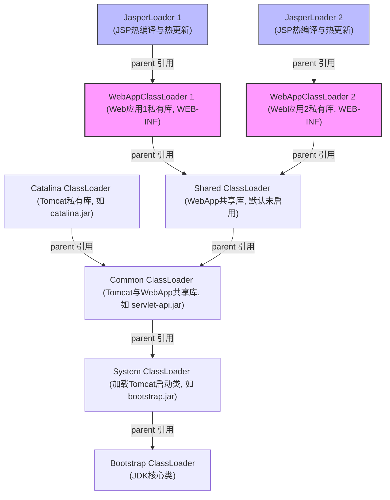

# 2.1.6.6 双亲委派模型

在 Java 虚拟机的类加载子系统中，**双亲委派模型（Parent Delegation Model）**是保障 Java 程序安全、稳定运行的核心机制之一。它规范了 JVM 内部各个类加载器（ClassLoader）在协同工作时如何定位、读取和加载字节码文件。

本文将从类加载器的物理层级架构、双亲委派的源码级执行流程、多线程锁争用机制、类型安全防卫设计、类相等性判定标准（结合元空间内存形态分析）、三大历史破坏场景（TCCL、Tomcat、OSGi 与 JDK 9 模块化）以及自定义类加载器的工程实践等维度，对双亲委派模型进行物理级的深度解刨。

---

## 1. 类加载器的层级架构：非继承的组合关系

在 Java 中，类加载器用于将 `.class` 文件（或任何符合 JVM 规范的二进制字节流）加载进内存，并在方法区（元空间）中构建出该类的元数据结构。JVM 内置了多个不同职责的类加载器，它们之间形成了一套严密的层级架构。

需要特别强调的是，**类加载器之间的“父子”关系，绝非面向对象中的“类继承”（Inheritance）关系，而是“对象组合”（Composition）关系**。即子加载器内部持有一个指向父加载器的 `parent` 成员变量。

### 1.1 类加载器的四大基本层级

#### 1. Bootstrap ClassLoader（启动类加载器）
* **实现语言**：由 C/C++ 语言编写，是 JVM 虚拟机自身的一部分（在 HotSpot 虚拟机中，它由 `ClassLoader` 静态 C++ 类实现）。
* **加载范围**：负责加载 JDK 的核心类库，通常是 `<JAVA_HOME>/lib` 目录下的核心 Jar 包（如 `rt.jar`、`resources.jar`、`charsets.jar` 等），或者由系统参数 `-Xbootclasspath` 指定的路径，并且只加载能够被虚拟机识别的类库（按文件名识别，如 `rt.jar`，名字不符合的 Jar 包即使放在 lib 目录下也不会被加载）。
* **Java 中的 `null` 表现形式**：
  在 Java 代码中，我们无法直接获取到 Bootstrap ClassLoader 的引用。如果尝试调用核心类（例如 `java.lang.String.class.getClassLoader()`）的加载器获取方法，会得到 `null`。
  * **底层原理**：在 HotSpot JVM 中，当一个类被 Bootstrap ClassLoader 加载时，其代表类加载器的 Oop（Ordinary Object Pointer）指针就是 `NULL`。在 Java API 层面的 `Class.getClassLoader()` 方法中，JVM 内部通过 Native 方法返回了这个 `null` 值。Java 代码常利用 `classLoader == null` 作为判定该类是否由启动类加载器加载的依据。

#### 2. Extension ClassLoader / Platform ClassLoader（扩展类加载器 / 平台类加载器）
* **JDK 8 及以前（Extension ClassLoader）**：
  * **具体类**：`sun.misc.Launcher$ExtClassLoader`。
  * **加载范围**：负责加载 `<JAVA_HOME>/lib/ext` 目录下的类库，或者被系统变量 `java.ext.dirs` 指定路径中的所有类库。这是一种为了让开发者能够方便扩展 JDK 核心功能而设立的机制。
* **JDK 9 及以后（Platform ClassLoader）**：
  * **重大变革原因**：JDK 9 引入了模块化系统（Project Jigsaw），原本存在于扩展目录 `lib/ext` 中的类库被模块化重构，部分类库被废弃，部分则被归入具体的模块中。为了保持兼容并重构类加载层级，JDK 9 废除了 `ExtClassLoader`，引入了平台类加载器（Platform ClassLoader），对应具体类为 `jdk.internal.loader.ClassLoaders$PlatformClassLoader`。
  * **加载范围**：负责加载 JDK 平台相关的模块与类库（例如 `java.sql`、`java.xml` 等非核心但属于 JDK 标准平台的模块）。与 JDK 8 的 `ExtClassLoader` 相比，它不再依赖特定的 `ext` 目录，而是完全基于模块化声明进行类的定位与装载。

#### 3. Application ClassLoader（应用程序类加载器 / 系统类加载器）
* **具体类**：
  * **JDK 8**：`sun.misc.Launcher$AppClassLoader`。
  * **JDK 9+**：`jdk.internal.loader.ClassLoaders$AppClassLoader`。
* **加载范围**：负责加载用户类路径（ClassPath，即我们开发时引入的第三方 Jar 包、项目编译输出的 classes 目录，或通过 `-classpath` / `-cp` / 系统属性 `java.class.path` 指定的路径）下的所有类库。
* **系统地位**：如果应用程序中没有自定义过类加载器，那么默认情况下，用户自己编写的 Java 类都是由 Application ClassLoader 进行加载的。可以通过静态方法 `ClassLoader.getSystemClassLoader()` 直接获取其对象实例。

#### 4. Custom ClassLoader（自定义类加载器）
* **实现方式**：开发者通过继承 `java.lang.ClassLoader` 类并重写其相关方法（通常是 `findClass` 方法）来实现的类加载器。
* **应用场景**：用于满足特殊的工程需求，例如：从特定网络协议（HTTP/FTP）下载字节码并加载、对 class 字节码文件进行加解密以防反编译、实现应用的插件化与动态热部署、Web 容器中的多版本类库物理隔离等。

---

### 1.2 物理继承关系 vs 逻辑组合关系

为了彻底厘清类加载器在 Java 类层级上的“继承关系”与在双亲委派模型中的“委派组合关系”，我们可以通过以下 Mermaid 图来进行对比：

```mermaid
graph TD
    subgraph "双亲委派逻辑链 (通过 parent 字段组合)"
        Bootstrap["Bootstrap ClassLoader <br/>(C++实现, Java中返回null)"]
        Platform["Platform ClassLoader (JDK 9+)<br/>/ Ext ClassLoader (JDK 8)"]
        App["Application ClassLoader<br/>(系统类加载器)"]
        Custom1["Custom ClassLoader 1<br/>(自定义加载器)"]
        Custom2["Custom ClassLoader 2<br/>(自定义加载器)"]

        Custom1 -->|parent 引用| App
        Custom2 -->|parent 引用| App
        App -->|parent 引用| Platform
        Platform -->|parent 引用| Bootstrap
    end

    subgraph "类继承关系 (Java Class Hierarchy)"
        JCL["java.lang.ClassLoader"]
        JSC["java.lang.SecureClassLoader"]
        JUC["java.net.URLClassLoader"]
        JBC["jdk.internal.loader.BuiltinClassLoader (JDK 9+)"]
        
        Ext8["ExtClassLoader (JDK 8)"]
        App8["AppClassLoader (JDK 8)"]
        Plat9["PlatformClassLoader (JDK 9+)"]
        App9["AppClassLoader (JDK 9+)"]
        Cust["CustomClassLoader"]

        JCL <|-- JSC
        JSC <|-- JUC
        JSC <|-- JBC
        JUC <|-- Ext8
        JUC <|-- App8
        JBC <|-- Plat9
        JBC <|-- App9
        JSC <|-- Cust
    end
```

从上图可以清晰地看出：
1. 在 **类继承关系** 中，JDK 8 的 `ExtClassLoader` 和 `AppClassLoader` 都继承自 `URLClassLoader`。而在 JDK 9+ 中，它们改为继承自 `BuiltinClassLoader`。自定义类加载器通常直接继承自 `SecureClassLoader` 或 `ClassLoader`。它们在 Java 类的继承关系上是平等的兄弟关系或上下级关系。
2. 在 **双亲委派逻辑链** 中，各加载器通过持有其父加载器的实例引用（即 `ClassLoader.parent` 属性）连接在一起。
   * `CustomClassLoader` 实例的 `parent` 引用默认指向 `Application ClassLoader` 实例。
   * `Application ClassLoader` 实例的 `parent` 引用指向 `Platform ClassLoader` (JDK 9+) / `ExtClassLoader` (JDK 8) 实例。
   * `Platform ClassLoader` / `ExtClassLoader` 实例的 `parent` 引用为 `null`，在逻辑上代表其父加载器是 `Bootstrap ClassLoader`。

---

## 2. 双亲委派模型的执行流程与源码级剖析

双亲委派模型的执行逻辑非常清晰，完全体现在 `java.lang.ClassLoader.loadClass(String, boolean)` 方法中。本节将深入到源码层面，深度剖析其类加载的微观执行流程。

### 2.1 核心源码剖析（基于 JDK 8/9+ 通用设计）

以下是 `java.lang.ClassLoader.loadClass` 方法的核心实现：

```java
protected Class<?> loadClass(String name, boolean resolve)
    throws ClassNotFoundException
{
    // 1. 获取类加载锁，保障多线程环境下的类加载并发安全
    synchronized (getClassLoadingLock(name)) {
        // 2. 首先，检查该类是否已经被当前类加载器加载过（本地缓存检查）
        Class<?> c = findLoadedClass(name);
        if (c == null) {
            long t0 = System.nanoTime();
            try {
                // 3. 若未加载，且存在父类加载器，则委派给父类加载器进行加载
                if (parent != null) {
                    c = parent.loadClass(name, false);
                } else {
                    // 4. 若父类加载器为 null，说明已经到达顶层，委派给 Bootstrap ClassLoader
                    c = findBootstrapClassOrNull(name);
                }
            } catch (ClassNotFoundException e) {
                // 父类加载器无法完成加载请求，抛出异常，但不中断流程，由自身尝试加载
            }

            if (c == null) {
                // 5. 若父类加载器和启动类加载器均无法加载，则调用自身的 findClass 进行加载
                long t1 = System.nanoTime();
                c = findClass(name);

                // 记录类加载性能数据
                sun.misc.PerfCounter.getParentDelegationTime().addTime(t1 - t0);
                sun.misc.PerfCounter.getFindClassTime().addElapsedTimeFrom(t1);
                sun.misc.PerfCounter.getFindClasses().increment();
            }
        }
        // 6. 若指定了 resolve 为 true，则对类进行链接（Linking）
        if (resolve) {
            resolveClass(c);
        }
        return c;
    }
}
```

---

### 2.2 核心环节逐行微观剖析

为了彻底掌握类加载的底层细节，我们需要对上述源码中的关键方法和步骤进行深度拆解：

#### 2.2.1 细粒度并发锁机制：`getClassLoadingLock(String className)`

在早期的 JDK 1.6 及以前版本中，整个 `loadClass` 方法是直接使用 `synchronized(this)` 进行同步的。这意味着对于同一个类加载器实例，在同一时刻只能有一个线程执行 `loadClass`。这会导致两个严重的问题：
1. **严重的并发性能瓶颈**：如果一个类加载器实例需要加载成百上千个不相干的类，多线程并发时会被迫串行化，大大降低了 JVM 的启动与运行效率。
2. **死锁风险**：若类加载器 A 正在加载类 X，类 X 的加载触发了对类 Y 的加载；与此同时，另一个线程正在加载类 Y，而类 Y 的加载又触发了对类 X 的加载。若这两个加载器实例存在循环引用且都锁在自身实例上，就会发生严重的线程死锁。

为了解决该痛点，JDK 1.7 引入了**并行类加载（Parallel Class Loading）**机制。其核心改动即 `getClassLoadingLock(name)`：

```java
protected Object getClassLoadingLock(String className) {
    Object lock = this;
    if (parallelLockMap != null) {
        // 创建一个全新的锁对象（Object）
        Object newLock = new Object();
        // 将类名作为 Key，放入并发 map 中。若已存在，则返回已有的锁对象
        lock = parallelLockMap.putIfAbsent(className, newLock);
        if (lock == null) {
            lock = newLock;
        }
    }
    return lock;
}
```

* **并行锁注册**：类加载器若想开启此机制，必须在类初始化时（通常在静态初始化块中）调用 `ClassLoader.registerAsParallelCapable()` 方法进行注册。注册后，底层的 `parallelLockMap`（类型为 `ConcurrentHashMap<String, Object>`）才会被初始化。
* **锁粒度细化**：开启后，锁的范围从“当前类加载器实例（`this`）”缩减到了“**当前类加载器的具体类名（`className`）**”。这意味着：
  * 线程 A 加载 `com.foo.A`，锁定的是 `parallelLockMap.get("com.foo.A")`。
  * 线程 B 加载 `com.bar.B`，锁定的是 `parallelLockMap.get("com.bar.B")`。
  * 两个线程可以完全并发，互不干扰，彻底规避了全局类加载器实例锁导致的死锁和性能瓶颈。

#### 2.2.2 缓存读取：`findLoadedClass(String name)`

这是一个 native 方法。它会去 JVM 内部的 **SystemDictionary（系统字典）** 中查找。
* SystemDictionary 是 JVM 中所有已加载类的全局哈希表，Key 是类的全限定名 + ClassLoader 实例。
* JVM 首先会验证传入的 `name` 对应的类是否已经被**当前类加载器（作为 Defining Loader）**加载并记录。如果是，则直接返回已存在的 `Class<?>` 实例，避免重复加载，保证内存中类的一致性。

#### 2.2.3 委派父加载器：`parent.loadClass(name, false)`

如果当前加载器的 `parent` 字段不为 `null`，则调用 `parent.loadClass` 启动递归委派。
* **注意**：此处传入的第二个参数是 `false`，即只进行加载，而不立刻进行链接（Linking）。链接过程通常由发起最初加载请求的那个类加载器（Initiating Loader）在最外层统一决定。

#### 2.2.4 委派启动类加载器：`findBootstrapClassOrNull(name)`

当 `parent == null` 时，说明当前加载器已经是双亲委派逻辑链的顶端（如 PlatformClassLoader 或是未设置 parent 的自定义加载器）。此时，调用 native 方法 `findBootstrapClassOrNull(name)`，将加载请求提交给 JVM 内部的 Bootstrap ClassLoader。
* 该方法会直接调用 C++ 实现的加载机制，在系统核心类库搜索路径下定位该类。如果找不到，则返回 `null`，而不是直接抛出异常，以便外层能够捕获并继续执行自身的 `findClass`。

#### 2.2.5 自身定位与加载：`findClass(name)`

这是双亲委派模型预留给子类实现的关键扩展点。
* 在 `java.lang.ClassLoader` 中，`findClass` 的默认实现非常简单：
  ```java
  protected Class<?> findClass(String name) throws ClassNotFoundException {
      throw new ClassNotFoundException(name);
  }
  ```
* 任何自定义类加载器，或者 JDK 内置的 `URLClassLoader`，都必须重写该方法。在其内部，它会去特定的物理路径（如目录、Jar 包、网络 URL 等）读取 `.class`文件的二进制字节流，然后调用 `defineClass` 方法，将字节数组转化为 JVM 内部的 `Class<?>` 对象。

#### 2.2.6 类链接：`resolveClass(Class<?> c)`

当 `resolve` 参数为 `true` 时，调用此方法（同样为 native 方法）。
* 类的生命周期中，链接阶段包含了验证、准备和解析。
* 只有完成了链接，类中的符号引用才会被替换为内存中的直接引用，类才真正具备了被实例化和执行的条件。

---

### 2.3 双亲委派递归执行时序图

为了形象化展示上述源码中各加载器之间的交互流程，我们使用 Mermaid 时序图来展现当调用 `loadClass("com.example.User")` 时的完整调用链：

```mermaid
sequenceDiagram
    autonumber
    actor Client as 应用程序调用者
    participant App as Application ClassLoader
    participant Plat as Platform ClassLoader
    participant Boot as Bootstrap ClassLoader (C++实现)

    Client->>App: loadClass("com.example.User", false)
    Note over App: 1. 获取类名锁 getClassLoadingLock("com.example.User")<br/>2. 检查缓存 findLoadedClass("com.example.User")
    
    App->>Plat: parent.loadClass("com.example.User", false)
    Note over Plat: 1. 获取类名锁 getClassLoadingLock(...)<br/>2. 检查缓存 findLoadedClass(...)
    
    Plat->>Boot: findBootstrapClassOrNull("com.example.User")
    Note over Boot: 检查JVM内部已加载类<br/>扫描rt.jar/模块路径
    
    alt Bootstrap 加载成功
        Boot-->>Plat: 返回 Class&lt;User&gt;
        Plat-->>App: 返回 Class&lt;User&gt;
        App-->>Client: 返回 Class&lt;User&gt;
    else Bootstrap 未能加载 (返回 null)
        Boot-->>Plat: 返回 null
        Note over Plat: 3. findClass("com.example.User") 尝试自行读取
        
        alt Platform 自行加载成功
            Plat-->>App: 返回 Class&lt;User&gt;
            App-->>Client: 返回 Class&lt;User&gt;
        else Platform 自行加载失败 (抛出 ClassNotFoundException)
            Plat-->>App: 抛出 ClassNotFoundException
            Note over App: 3. findClass("com.example.User") 尝试自行读取
            
            alt Application 自行加载成功
                App-->>Client: 返回 Class&lt;User&gt;
            else Application 自行加载失败 (抛出 ClassNotFoundException)
                App-->>Client: 抛出 ClassNotFoundException
            end
        end
    end
```

---

## 3. 双亲委派模型的设计哲学与核心目的

JVM 团队为何要设计如此繁琐的递归委派机制？其背后蕴含着深厚的设计哲学，主要为了实现两个核心目的：**类型安全防卫**与**类加载的唯一性**。

### 3.1 类型安全防卫（Sandbox Security）

在不受信任的网络环境或插件系统中，恶意的攻击者可能会尝试编写一些与 JDK 核心类库同名的类来篡改系统的行为。
例如，攻击者编写了一个名为 `java.lang.Object` 或 `java.lang.System` 的类，并在其中植入了恶意代码（如格式化硬盘、发送网络窃密数据等），然后通过 ClassPath 注入到系统中。

#### 双亲委派的防卫机制：
当 Application ClassLoader 尝试加载这个恶意的 `java.lang.Object` 时，根据双亲委派机制，加载请求会一级一级向上传递，最终由顶层的 Bootstrap ClassLoader 尝试加载。
* Bootstrap ClassLoader 收到请求后，会在自身的核心类库路径中搜索 `java.lang.Object`。
* 它会立刻找到真正的、由 JDK 官方提供的 `java.lang.Object` 并完成加载。
* 恶意的 `java.lang.Object` 根本没有机会被加载，从而彻底保护了 JVM 的安全边界。

#### 物理屏障：Prohibited Package 限制
为了防止开发者绕过双亲委派，直接调用自定义类加载器的 `defineClass` 方法强行注入 `java.` 开头的类，JVM 在底层做出了硬性限制。

在 `java.lang.ClassLoader.preDefineClass` 源码中（由 `defineClass` 内部强制调用）：

```java
private ProtectionDomain preDefineClass(String name, ProtectionDomain pd) {
    if (!checkName(name)) {
        throw new NoClassDefFoundError("IllegalName: " + name);
    }

    // 核心安全防卫逻辑
    if ((name != null) && name.startsWith("java.")) {
        throw new SecurityException(
            "Prohibited package name: " + name
        );
    }
    // ...
}
```

* **安全边界**：如果自定义加载器强行尝试将一个以 `java.` 开头的类转化为 Class 对象，JVM 会抛出 `java.lang.SecurityException: Prohibited package name: java.lang`。这在字节码定义阶段就彻底封锁了对 JDK 核心包名的篡改路径。

---

### 3.2 类加载的唯一性

在 Java 中，一切对象皆为 `java.lang.Object` 的实例。如果类加载器 A 加载了一份 `Object`，类加载器 B 也加载了一份 `Object`，那么在 JVM 中就会存在两个完全不同的 `Object` Class 对象。

这会造成极其严重的混乱：
* **基础类不一致**：在 Java 中，一切对象依赖的基础类和多态都会因为不同加载器加载出的多份 Class 对象而遭到破坏。
* **类型转换异常**：当你尝试将类加载器 A 加载出的 `Object` 实例，赋值给类加载器 B 加载出的 `Object` 类型变量时，虚拟机会无情地抛出 `ClassCastException`。
* **基础多态崩塌**：Java 的多态、多线程锁的同步（基于同一个 Class 对象的锁）等机制都将不攻自破。

通过双亲委派，所有的核心类都委派给了最顶层的类加载器进行加载，从而保证了在整套 JVM 运行时环境中，**基础核心类仅有一份唯一的 Class 实例**。

---

## 4. JVM 视角下的“类相等性”判定标准

对于初学者而言，通常认为只要两个类的全限定名（如 `com.example.User`）相同，它们就是同一个类。但在 JVM 的物理世界中，这个判定标准是不成立的。

### 4.1 类相等性的二元组决定论

在 JVM 内部，一个类的唯一标识（Identity）由以下两部分共同决定：
1. **类的全限定名（Fully Qualified Class Name）**
2. **加载该类的类加载器实例（Defining Loader）**

JVM 在内部使用二元组来标识一个 Class 的身份：
$$\text{Identity} = \langle \text{ClassLoaderInstance}, \text{ClassName} \rangle$$

这意味着：**即使两个 Class 对象源自同一个 `.class` 字节码文件，甚至文件内容逐字节完全相同，只要加载它们的类加载器实例不同，这两个类在 JVM 内部就被判定为完全不同的两个类。**

#### 深入理解 Defining Loader（定义加载器）与 Initiating Loader（初始加载器）
在 JVM 规范中，区分了类的两个加载角色：
* **Initiating Loader（初始加载器）**：如果一个类加载器 `L` 被用来启动加载某个类 `C`（通常是通过调用 `L.loadClass(C)`），即使该类最终被委派给其父加载器加载，我们也称 `L` 是类 `C` 的初始加载器。
* **Defining Loader（定义加载器）**：真正读取 `.class` 文件字节流并调用 `defineClass()` 生成该 Class 对象的那个类加载器 `L_def`，被称为类 `C` 的定义加载器。

在 JVM 内部的 SystemDictionary 中，会记录这些关系：
* 对于一个类 `C`，只有其**定义加载器**生成的 Class 对象才是堆中的真正物理对象。
* 若类加载器 `L` 委派父加载器加载成功，JVM 会在 SystemDictionary 中记录一对映射：`L -> Class`。虽然 `L` 没真正定义这个类，但通过该映射，`L` 在下一次收到该类请求时也能直接返回结果，这就是以 **Initiating Loader** 缓存的方式提高了性能。

---

### 4.2 物理实验：类隔离与 `ClassCastException`

为了验证上述原理，我们进行一项物理实验。我们编写一个 `User` 类，并在自定义类加载器中打破双亲委派，使其加载两份同名类，最后进行强转。

#### 步骤 1：编写业务类 `User`
```java
package com.example;

public class User {
    // 简单的实体类
}
```
我们将编译后的 `User.class` 拷贝到一个独立的磁盘路径中（例如 `/tmp/classes/com/example/User.class`），并将其从工程的 ClassPath 中删除，防止被默认的 Application ClassLoader 提前加载。

#### 步骤 2：手写一个打破双亲委派的隔离加载器 `IsolatedClassLoader`
```java
package com.example;

import java.io.ByteArrayOutputStream;
import java.io.FileInputStream;
import java.io.IOException;

public class IsolatedClassLoader extends ClassLoader {
    private String classPath;

    public IsolatedClassLoader(String classPath) {
        // 设置 parent 为 null，切断默认向 AppClassLoader 的委派
        super(null);
        this.classPath = classPath;
    }

    @Override
    public Class<?> loadClass(String name) throws ClassNotFoundException {
        // 对于非 com.example 的核心类（如 java.lang.Object），仍委派给启动类加载器加载
        if (!name.startsWith("com.example.")) {
            return super.loadClass(name);
        }
        
        // 强制自己进行 findClass，打破双亲委派
        return findClass(name);
    }

    @Override
    protected Class<?> findClass(String name) throws ClassNotFoundException {
        String file = classPath + name.replace('.', '/') + ".class";
        try (FileInputStream fis = new FileInputStream(file);
             ByteArrayOutputStream baos = new ByteArrayOutputStream()) {
            int b;
            while ((b = fis.read()) != -1) {
                baos.write(b);
            }
            byte[] data = baos.toByteArray();
            return defineClass(name, data, 0, data.length);
        } catch (IOException e) {
            throw new ClassNotFoundException(name, e);
        }
    }
}
```

#### 步骤 3：编写测试主类，运行实验
```java
package com.example;

public class ClassIdentityTest {
    public static void main(String[] args) {
        try {
            // 创建两个完全独立的类加载器实例
            IsolatedClassLoader loader1 = new IsolatedClassLoader("/tmp/classes/");
            IsolatedClassLoader loader2 = new IsolatedClassLoader("/tmp/classes/");

            // 分别使用这两个加载器加载同一个 User.class 文件
            Class<?> clazz1 = loader1.loadClass("com.example.User");
            Class<?> clazz2 = loader2.loadClass("com.example.User");

            System.out.println("clazz1: " + clazz1.hashCode() + " | Loader: " + clazz1.getClassLoader());
            System.out.println("clazz2: " + clazz2.hashCode() + " | Loader: " + clazz2.getClassLoader());

            // 1. 判定类相等性
            System.out.println("clazz1 == clazz2 ? " + (clazz1 == clazz2)); 
            System.out.println("clazz1.equals(clazz2) ? " + clazz1.equals(clazz2));

            // 2. 实例化 clazz1 对象，并尝试强转为 clazz2 代表的类型
            Object obj1 = clazz1.getDeclaredConstructor().newInstance();
            System.out.println("clazz2.isInstance(obj1) ? " + clazz2.isInstance(obj1));

            // 强转测试，会在这里抛出异常
            User user = (User) obj1; 

        } catch (ClassCastException e) {
            System.err.println("【强转失败】捕获到类转换异常：");
            e.printStackTrace();
        } catch (Exception e) {
            e.printStackTrace();
        }
    }
}
```

#### 实验输出结果分析：
```text
clazz1: 1836022229 | Loader: com.example.IsolatedClassLoader@7f31245a
clazz2: 1228832793 | Loader: com.example.IsolatedClassLoader@4f022211
clazz1 == clazz2 ? false
clazz1.equals(clazz2) ? false
clazz2.isInstance(obj1) ? false
【强转失败】捕获到类转换异常：
java.lang.ClassCastException: class com.example.User cannot be cast to class com.example.User (com.example.User is in unnamed module of loader com.example.IsolatedClassLoader @7f31245a; com.example.User is in unnamed module of loader com.example.IsolatedClassLoader @4f022211)
```

通过实验证明：
* 两个 Class 对象的内存 HashCode 完全不同，表明它们是内存中的两个对象。
* `clazz1 == clazz2` 返回 `false`。
* `isInstance` 校验判定 `obj1` 不是 `clazz2` 的实例。
* 抛出的 `ClassCastException` 异常信息明确指出：这是由两个不同 `IsolatedClassLoader` 加载的同名类之间的转换失败。

---

### 4.3 类加载隔离的 JVM 内存形态与 SystemDictionary 机制

在 JVM 内存物理层面，上述实验的底层状态如下图所示：

```
JVM 运行时数据区 (Runtime Data Area)
+---------------------------------------------------------------------------------------+
|  元空间 (Metaspace / 本地内存)                                                          |
|                                                                                       |
|  +-----------------------------------+     +-----------------------------------+      |
|  |  InstanceKlass A                  |     |  InstanceKlass B                  |      |
|  |  (代表 com.example.User)           |     |  (代表 com.example.User)           |      |
|  |                                   |     |                                   |      |
|  |  - 常量池 (Constant Pool)         |     |  - 常量池 (Constant Pool)         |      |
|  |  - 方法元数据 (Methods)            |     |  - 方法元数据 (Methods)            |      |
|  |  - 虚方法表 (vtable)               |     |  - 虚方法表 (vtable)               |      |
|  +-----------------------------------+     +-----------------------------------+      |
|                   ^                                         ^                         |
+-------------------|-----------------------------------------|-------------------------+
                    |                                         |
+-------------------|-----------------------------------------|-------------------------+
|  堆区 (Heap)       |                                         |                         |
|                   |                                         |                         |
|  +----------------|------------------+     +----------------|------------------+      |
|  | java.lang.Class 对象 1            |     | java.lang.Class 对象 2            |      |
|  | (由 loader1 关联)                 |     | (由 loader2 关联)                 |      |
|  +-----------------------------------+     +-----------------------------------+      |
|                   ^                                         ^                         |
|                   |                                         |                         |
|         +---------+                               +---------+                         |
|         |                                         |                                   |
|  +------|----------------------------+     +------|----------------------------+      |
|  | IsolatedClassLoader 实例 1        |     | IsolatedClassLoader 实例 2        |      |
|  | (loader1)                         |     | (loader2)                         |      |
|  +-----------------------------------+     +-----------------------------------+      |
|                                                                                       |
+---------------------------------------------------------------------------------------+
```

#### 底层物理机制：
1. **Metaspace（元空间）物理隔离**：
   在 HotSpot JVM 中，类的元数据（即字节码解析后的结构）存储在元空间中，以 C++ 的 `InstanceKlass` 对象表示。
   当 `loader1` 和 `loader2` 分别加载 `User` 类时，JVM 会在元空间中分配两个完全独立的 `InstanceKlass` 实例。它们拥有各自的虚方法表（vtable）、接口方法表（itable）以及常量池（Constant Pool）。
2. **SystemDictionary（系统字典）的数据项结构**：
   在 JVM 源码中，SystemDictionary 底层是一个哈希表，其哈希节点（`DictionaryEntry`）拥有以下三个核心要素：
   * `Symbol* class_name`：类名符号引用。
   * `Klass* klass`：指向元空间中真正 `InstanceKlass` 的指针。
   * `oop loader`：指向 Java 堆中加载该类的 `ClassLoader` 实例的指针。
   
   因此，当 `loader1` 和 `loader2` 分别加载同一个类名 `com.example.User` 时，JVM 分别生成了两条记录：
   * 记录 A：`{class_name="com/example/User", loader=loader1, klass=AddressA}`
   * 记录 B：`{class_name="com/example/User", loader=loader2, klass=AddressB}`
   
   在进行类型强转或判定时，JVM 会取出目标对象对应的 `klass` 地址，与当前上下文中声明的类型的 `klass` 地址进行比对。由于 AddressA 与 AddressB 的物理地址不同，类型检查必然失败，进而抛出 `ClassCastException`。

---

## 5. 打破双亲委派模型的历史与机制（三大破坏场景）

双亲委派模型并非不可逾越的铁律，在 Java 发展的历史长河中，为了满足不同的工程需求，双亲委派模型曾经遭遇过三次重大的“破坏”或架构调整。

### 5.1 第一次破坏：JDK 1.2 历史兼容与 `findClass` 的引入

#### 历史背景：
双亲委派模型是在 JDK 1.2 版本才被引入的。然而，Java 语言与 `java.lang.ClassLoader` 类在 JDK 1.0 版本就已经存在并被广泛使用了。当时，开发者实现自定义类加载器的方式，是直接重写 `ClassLoader` 中的 `loadClass()` 方法。

#### 冲突与妥协：
当 JDK 1.2 引入双亲委派模型时，为了兼容此前已经存在的旧代码，JVM 开发团队无法将 `loadClass()` 方法声明为 `final`（一旦声明为 `final`，所有旧的自定义类加载器在 JDK 1.2 下都将无法编译和运行）。

为了引导开发者将自定义的类加载逻辑与双亲委派框架相融合，JDK 1.2 对 `ClassLoader` 的架构做出了重构：
1. 提倡开发者**不再去重写整个 `loadClass()` 方法**。
2. 引入了一个全新的 `protected` 方法：`findClass(String name)`。
3. 在 `loadClass()` 的默认实现中，规范了委派流程。如果父加载器和启动类加载器都无法加载，最后才会调用 `findClass(name)`。

#### 破坏本质：
如果开发者继续重写 `loadClass()`，那么他就直接破坏了双亲委派模型（因为他可以在自定义的 `loadClass` 中切断向 parent 的委派逻辑）。为了维护双亲委派，开发者应当只重写 `findClass()`。

---

### 5.2 第二次破坏：线程上下文类加载器（TCCL）与 SPI 逆向委派

#### 5.2.1 痛点剖析：双亲委派的单向局限性

双亲委派模型的一大基石是：**越基础的类由越顶层的加载器加载，且子加载器可以访问父加载器加载的类，但父加载器无法访问子加载器加载的类。**

这种“自底向上”的单向流动在面对 **SPI（Service Provider Interface，服务提供者接口）** 架构时，会遭遇毁灭性的打击。以 **JDBC（Java Database Connectivity）** 为例：

1. **接口定义**：Java 官方在核心类库中定义了数据库驱动接口 `java.sql.Driver`。由于它位于核心库中，它是由 **Bootstrap ClassLoader** 加载的。
2. **驱动实现**：各个数据库厂商（如 MySQL、Oracle、PostgreSQL）编写具体的实现类（如 `com.mysql.cj.jdbc.Driver`），并打包成第三方 Jar 包，放置在项目的 ClassPath 中。这些类应当由 **Application ClassLoader** 加载。
3. **管理核心**：核心库中的 `java.sql.DriverManager`（由 Bootstrap ClassLoader 加载）负责管理这些驱动。

#### 核心冲突点：
当 `DriverManager` 初始化时，它需要去 ClassPath 中扫描并加载具体的数据库驱动实现类（如 `com.mysql.cj.jdbc.Driver`）。
* **按照双亲委派模型**：`DriverManager` 由 Bootstrap ClassLoader 加载，那么当它尝试加载驱动实现类时，只能向自己的父加载器委派。然而，Bootstrap ClassLoader 是最顶层的加载器，它根本无法向下访问 Application ClassLoader，更无法扫描 ClassPath 下的 Jar 包。
* **结果**：核心类库无法加载并调用第三方实现，JDBC 等 SPI 框架将彻底瘫痪。

---

#### 5.2.2 解决方案：线程上下文类加载器（Thread Context ClassLoader, TCCL）

为了解决这种“父加载器需要调用子加载器中的类”的逆向加载需求，Java 团队在 JDK 1.2 中引入了**线程上下文类加载器（Thread Context ClassLoader，简称 TCCL）**。

在 `java.lang.Thread` 中，增加了两个核心方法：
* `public ClassLoader getContextClassLoader()`：获取当前线程的上下文类加载器。
* `public void setContextClassLoader(ClassLoader cl)`：设置当前线程的上下文类加载器。

* **TCCL 的本质**：它是一个**“舞弊”机制**。当一个线程被创建时，它会默认继承父线程的上下文类加载器。在 Java 应用启动时，主线程的 TCCL 会被默认设置为 **Application ClassLoader**。
* **逆向通道**：处于顶层加载器（如 Bootstrap ClassLoader）范围内的核心类，可以通过 `Thread.currentThread().getContextClassLoader()` 强行获取到当前线程的 TCCL（即 Application ClassLoader），并用其去加载 ClassPath 下的第三方实现类。这直接击穿了双亲委派模型的单向层级，实现了“逆向委托”。

---

#### 5.2.3 JDBC DriverManager 源码微观解析

我们通过剖析 JDBC 中 `DriverManager` 的加载流程，来观察 TCCL 是如何打破双亲委派的。

##### 1. 触发 DriverManager 的类初始化
当我们在代码中执行 `Class.forName("java.sql.DriverManager")` 或直接调用 `DriverManager.getConnection(...)` 时，会触发 `DriverManager` 类的初始化，执行其静态代码块：

```java
static {
    loadInitialDrivers();
    println("JDBC DriverManager initialized");
}
```

##### 2. 深入 `loadInitialDrivers` 源码
```java
private static void loadInitialDrivers() {
    String drivers;
    try {
        drivers = AccessController.doPrivileged(new PrivilegedAction<String>() {
            public String run() {
                return System.getProperty("jdbc.drivers");
            }
        });
    } catch (Exception ex) {
        drivers = null;
    }

    // 重点：使用 ServiceLoader 机制加载驱动类
    AccessController.doPrivileged(new PrivilegedAction<Void>() {
        public Void run() {
            // ServiceLoader.load 内部正是利用了 TCCL
            ServiceLoader<Driver> loadedDrivers = ServiceLoader.load(Driver.class);
            Iterator<Driver> driversIterator = loadedDrivers.iterator();
            try{
                while(driversIterator.hasNext()) {
                    driversIterator.next();
                }
            } catch(Throwable t) {
                // Do nothing
            }
            return null;
        }
    });
    // ...
}
```

##### 3. 深入 `ServiceLoader.load(Class<S> service)` 源码
```java
public static <S> ServiceLoader<S> load(Class<S> service) {
    // 关键点：直接获取当前线程的上下文类加载器
    ClassLoader cl = Thread.currentThread().getContextClassLoader();
    return ServiceLoader.load(service, cl);
}
```
* 在这里，`DriverManager` 成功拿到了主线程的 TCCL（即 Application ClassLoader）。
* `ServiceLoader` 的迭代器（`LazyIterator`）会去扫描 ClassPath 下各 Jar 包中的 `META-INF/services/java.sql.Driver` 文件，读取出写在文件里的具体驱动类名（如 `com.mysql.cj.jdbc.Driver`）。
* 最终，`ServiceLoader` 使用传入的 TCCL 去显式调用 `cl.loadClass("com.mysql.cj.jdbc.Driver")`，完成了原本由 Bootstrap ClassLoader 绝无可能完成的加载任务。

##### 4. JDBC 破坏双亲委派时序图
以下 Mermaid 时序图完整还原了这一微观流程：

```mermaid
sequenceDiagram
    autonumber
    actor App as 应用程序代码
    participant DM as java.sql.DriverManager<br/>(Bootstrap Loader加载)
    participant SL as java.util.ServiceLoader
    participant TCCL as Thread Context ClassLoader<br/>(AppClassLoader)
    participant MyDriver as com.mysql.cj.jdbc.Driver<br/>(MySQL驱动)

    App->>DM: 触发类加载与初始化 (如 getConnection)
    Note over DM: 执行静态初始化块<br/>loadInitialDrivers()
    
    DM->>SL: ServiceLoader.load(Driver.class)
    Note over SL: 获取当前线程上下文类加载器<br/>cl = Thread.currentThread().getContextClassLoader()
    SL-->>DM: 返回 ServiceLoader 实例
    
    DM->>SL: 遍历并加载具体的 Driver 实现 (next())
    Note over SL: 扫描 ClassPath 下的<br/>META-INF/services/java.sql.Driver
    
    SL->>TCCL: cl.loadClass("com.mysql.cj.jdbc.Driver")
    Note over TCCL: 绕过父加载器限制<br/>直接读取 ClassPath 下的驱动类
    
    TCCL->>MyDriver: 加载并实例化驱动类
    MyDriver-->>TCCL: 返回 Class&lt;MySQLDriver&gt;
    TCCL-->>SL: 返回 Class&lt;MySQLDriver&gt;
    
    Note over MyDriver: 驱动类实例化时<br/>执行其静态代码块
    MyDriver->>DM: DriverManager.registerDriver(this)
    Note over DM: 将驱动实例放入 registeredDrivers 列表
    
    DM-->>App: 获取 Connection 成功
```

---

### 5.3 第三次破坏：热部署/热插拔与 JDK 9 模块化系统

第三次破坏是为了应对程序动态性（热部署、热插拔、模块运行时动态管理）的诉求，以及 JDK 模块化改造带来的底层委派变化。

#### 5.3.1 OSGi：网状依赖加载逻辑

在传统的 Java 应用中，类库的依赖是“单向树状”的。一旦一个类在 ClassPath 中存在多个版本，就会发生类冲突。
**OSGi（Open Services Gateway initiative）** 则是动态模块化标准的集大成者。为了实现 Bundle（模块）的动态热插拔、热部署以及多版本共存，OSGi 彻底抛弃了树状的双亲委派模型，构建了一套**网状的类加载结构**。

* **每个 Bundle 独占加载器**：在 OSGi 环境中，每一个 Bundle 都有一个自己专属的类加载器。
* **复杂的网状委派顺序**：当一个 Bundle 试图加载一个类时，其搜索顺序彻底颠覆了传统的向上委派：
  1. **委派核心类**：首先委派给最顶层的 Bootstrap ClassLoader，确保核心类安全（如 `java.*`）。
  2. **导入委派（Import-Package）**：检查该类所在的包是否被声明在当前 Bundle 的 `Import-Package` 属性中。如果是，则直接委派给**导出该包（Export-Package）的那个外部 Bundle 的类加载器**去加载。
  3. **自身加载**：若不是导入包，则由当前 Bundle 的类加载器在自己内部的 ClassPath 进行搜索并加载。
  4. **Fragment 委派**：检查是否是当前 Bundle 挂载的 Fragment Bundle，如果是，则委派给其加载。
  5. **动态导入委派（DynamicImport-Package）**：如果配置了动态导入，则尝试寻找能够导出此包的 Bundle 加载。
  6. **父级委派**：委派给传统的 parent（如 Application ClassLoader）进行加载。

由于 Bundle 之间可以通过导入导出形成错综复杂的双向或多向依赖，其类加载链不再是垂直的一条线，而是一张复杂的网。这种网状结构允许同一个系统内同时存在 Spring 4 和 Spring 5（分别由两个 Bundle 加载器隔离加载并互相调用），这在传统的双亲委派模型下是绝对不可能实现的。

---

#### 5.3.2 Tomcat：多 WebApp 的隔离与打破

在 Web 容器（如 Tomcat）中，一个容器需要同时运行多个独立的 Web 应用程序（WebApps）。为了满足规范，Tomcat 必须打破双亲委派模型。

##### 为什么 Tomcat 不能采用传统的双亲委派？
1. **类隔离性**：应用 A 依赖的是 `Spring 4`，应用 B 依赖的是 `Spring 5`。如果它们都委派给父加载器（Application ClassLoader），那么在父加载器中只会被成功加载一次（例如先加载了 Spring 4），这会导致应用 B 在运行时因为找不到 Spring 5 的特有类或方法而崩溃。因此，每个应用必须使用专属的 `WebAppClassLoader` 来隔离彼此的第三方依赖。
2. **本地优先加载**：Servlet 规范要求，Web 应用内部的类库（放置在 `WEB-INF/classes` 和 `WEB-INF/lib` 中）应当**优先于**容器提供的共享类库被加载。这与双亲委派中“无脑向父加载器委派”的原则恰好相反。

##### Tomcat 类加载器的树状结构：



##### Tomcat `WebAppClassLoader` 打破双亲委派的加载步骤：
当 WebAppClassLoader 接收到加载 `com.foo.Service` 的请求时，其内部实现的 `loadClass` 流程如下：

1. **查缓存**：调用 `findLoadedClass(name)`，检查当前 WebAppClassLoader 的本地缓存是否已经加载过此类。
2. **防篡改（安全第一）**：调用系统类加载器（System/Application ClassLoader）尝试加载该类。
   * **原因**：防止 Web 应用程序中的恶意类去覆盖 Java 核心类或 Tomcat 自身的启动类（如自定义一个 `java.lang.System` 或 `org.apache.catalina.startup.Bootstrap`）。这是绝对不能被打破的安全防线。
3. **打破委派（本地优先）**：如果系统类加载器没有加载成功，`WebAppClassLoader` 会**绕过父类加载器**（不调用 `parent.loadClass`），直接在本地的 `WEB-INF/classes` 和 `WEB-INF/lib` 中搜索并调用自身的 `findClass` 进行加载。
4. **父级兜底**：如果本地目录中没有找到对应的类文件，此时它才会重新委派给父类加载器（Shared ClassLoader / Common ClassLoader）进行加载。

通过这种“本地优先”的策略，Tomcat 成功实现了 Web 应用程序之间依赖的完美隔离，并且满足了 Servlet 规范的特殊加载顺序要求。

---

#### 5.3.3 JDK 9 模块化系统（Project Jigsaw）下的委派大变革

JDK 9 模块化系统的引入，从底层对双亲委派模型的执行逻辑进行了重构，使其变成了一个**“基于模块声明的定向委派网”**。

##### 1. 统一基类 `BuiltinClassLoader` 的引入与架构演变
在 JDK 9 中，内置的三个最重要类加载器（BootClassLoader、PlatformClassLoader 和 AppClassLoader）在继承体系上发生了重大改变。
* 它们不再像 JDK 8 之前那样各自为政，而是统一继承自 `jdk.internal.loader.BuiltinClassLoader`。
* `BuiltinClassLoader` 内部包含了模块读取与管理的核心逻辑，它通过读取模块描述符（`module-info.class`）中的依赖声明，将每个模块绑定到唯一的定义加载器（Defining Loader）上。

##### 2. 委派逻辑从“逐级向上”变为“精准定向”
当一个类加载器（例如 Application ClassLoader）接收到加载类 `java.sql.Connection` 的请求时，流程发生了彻底的变化：
* **模块声明感知**：类加载器会首先判断这个类是否归属于某个**已知的、在模块系统中定义好的模块（Module）**。
* **定向委派**：由于 `java.sql` 模块被明确声明为由 Platform ClassLoader（平台类加载器）负责管辖，Application ClassLoader 不会再去盲目地调用 `parent.loadClass` 向上询问，而是**直接将加载请求转发给 Platform ClassLoader** 进行加载。
* **未命名模块退化**：只有当类不属于任何已知的模块时（例如传统的 ClassPath 下的类，它们会被归入“未命名模块” Unnamed Module），类加载器才会退化为使用传统的双亲委派逻辑，逐级向上委派。

##### 3. 启动类加载器的“瘦身”与 PlatformClassLoader 职责扩充
在 JDK 8 及以前，几乎所有的基础类库（如 sql、xml、management 等）都集中在 `rt.jar` 中，全部由最顶层的 Bootstrap ClassLoader 承载。
在 JDK 9 模块化后：
* 很多非核心平台模块被从 Bootstrap ClassLoader 剥离，转移给了 **Platform ClassLoader**（例如 `java.sql`、`java.xml`、`java.compiler` 等模块）。
* Bootstrap ClassLoader 得到了彻底的“瘦身”，只负责最核心的 `java.base` 模块。
* 这种职责的重新分配，进一步强化了类加载器的隔离性，并且极大地优化了虚拟机的启动速度与内存占用。

##### 4. 强封装（Strong Encapsulation）与安全限制
在模块化环境下，即使双亲委派将类加载任务成功递交给了正确的加载器，如果加载出的类所属的模块没有通过 `exports` 或 `opens` 对外公开，调用方在链接和反射访问时依然会遭遇 `java.lang.IllegalAccessError`。类加载机制与模块安全访问控制在此阶段紧密结合，构成了 JDK 9+ 更高级的安全防卫体系。

---

## 6. 实践指南：如何实现一个自定义类加载器

在实际工程中，我们根据不同的需要，有两种典型的自定义类加载器编写方式：一种是**遵循双亲委派模型**（适用于加密字节码加载、网络字节码动态装载等），另一种是**打破双亲委派模型**（适用于类隔离、插件化系统等）。

### 6.1 案例一：遵循双亲委派的自定义类加载器（异或加密加载器）

本案例实现一个加密字节码加载器。我们将 Class 文件进行简单的异或（XOR）加密以防止反编译，并在类加载器中读取、解密并加载。

#### 1. 编写 XOR 加密工具类
```java
package com.example;

import java.io.File;
import java.io.FileInputStream;
import java.io.FileOutputStream;
import java.io.IOException;

public class ClassEncryptUtil {
    private static final byte KEY = (byte) 0xAA; // 异或密钥

    public static void encrypt(File src, File dest) throws IOException {
        try (FileInputStream fis = new FileInputStream(src);
             FileOutputStream fos = new FileOutputStream(dest)) {
            int b;
            while ((b = fis.read()) != -1) {
                // 异或操作进行加密
                fos.write(b ^ KEY);
            }
        }
    }

    public static void main(String[] args) throws Exception {
        // 演示：将编译好的普通 User.class 加密生成 User.class.enc
        File source = new File("/tmp/classes/com/example/User.class");
        File target = new File("/tmp/classes/com/example/User.class.enc");
        encrypt(source, target);
        System.out.println("字节码加密完成！输出文件：" + target.getAbsolutePath());
    }
}
```

#### 2. 实现遵循双亲委派的类加载器 `DecryptClassLoader`
为了保证双亲委派模型不被破坏，我们**绝对不要重写 `loadClass()`**，而只需重写 `findClass()`：

```java
package com.example;

import java.io.ByteArrayOutputStream;
import java.io.File;
import java.io.FileInputStream;
import java.io.IOException;

public class DecryptClassLoader extends ClassLoader {
    private String baseDir;
    private static final byte KEY = (byte) 0xAA; // 解密密钥，与加密一致

    public DecryptClassLoader(String baseDir, ClassLoader parent) {
        super(parent); // 指定 parent，保持双亲委派
        this.baseDir = baseDir;
    }

    @Override
    protected Class<?> findClass(String name) throws ClassNotFoundException {
        // 1. 定位加密文件路径
        String filePath = baseDir + name.replace('.', File.separatorChar) + ".class.enc";
        File file = new File(filePath);
        if (!file.exists()) {
            throw new ClassNotFoundException("无法找到加密类文件: " + filePath);
        }

        // 2. 读取并进行 XOR 解密还原
        byte[] decryptedData;
        try {
            decryptedData = loadAndDecryptClassData(file);
        } catch (IOException e) {
            throw new ClassNotFoundException("读取类文件异常", e);
        }

        // 3. 调用 defineClass 将字节数组转化为 JVM 内部的 Class 对象
        return defineClass(name, decryptedData, 0, decryptedData.length);
    }

    private byte[] loadAndDecryptClassData(File file) throws IOException {
        try (FileInputStream fis = new FileInputStream(file);
             ByteArrayOutputStream baos = new ByteArrayOutputStream()) {
            int b;
            while ((b = fis.read()) != -1) {
                // 解密：异或两次还原
                baos.write(b ^ KEY);
            }
            return baos.toByteArray();
        }
    }
}
```

---

### 6.2 案例二：打破双亲委派的自定义类加载器（隔离加载器）

在某些高要求的隔离部署场景（如插件容器）中，我们需要自己控制加载顺序，优先加载本地的某些类库，从而打破双亲委派。

#### 实现打破双亲委派的 `IsolatedCustomLoader`：
我们需要**重写整个 `loadClass(String name, boolean resolve)` 方法**，并在其中截断委派。

```java
package com.example;

import java.io.ByteArrayOutputStream;
import java.io.File;
import java.io.FileInputStream;
import java.io.IOException;

public class IsolatedCustomLoader extends ClassLoader {
    private String classPath;

    public IsolatedCustomLoader(String classPath, ClassLoader parent) {
        super(parent);
        this.classPath = classPath;
    }

    @Override
    protected Class<?> loadClass(String name, boolean resolve) throws ClassNotFoundException {
        synchronized (getClassLoadingLock(name)) {
            // 1. 检查缓存中是否已经加载过该类
            Class<?> c = findLoadedClass(name);
            
            if (c == null) {
                // 2. 关键安全哨兵：核心 JDK 类库 (以 java. 或 javax. 开头) 绝对不能由我们加载！
                // 如果尝试加载 java.lang.Object，强行执行自己的 findClass 
                // 底层 defineClass 阶段会抛出 SecurityException，导致 JVM 崩溃。
                // 此外，很多核心类有特殊保护，这里强制委派给系统加载器或启动类加载器。
                if (name.startsWith("java.") || name.startsWith("javax.")) {
                    c = getSystemClassLoader().loadClass(name);
                }
            }

            if (c == null) {
                try {
                    // 3. 打破委派：尝试由当前加载器在本地的物理路径中加载该类
                    // 只有在本地路径找不到时，才抛出异常
                    c = findClass(name);
                } catch (ClassNotFoundException e) {
                    // 本地没有，忽略异常，准备进行父级兜底
                }
            }

            if (c == null) {
                // 4. 父级兜底：如果在本地 ClassPath 没能成功加载，且 parent 不为 null，则委派给父加载器
                if (getParent() != null) {
                    c = getParent().loadClass(name, resolve);
                } else {
                    c = getSystemClassLoader().loadClass(name);
                }
            }

            // 5. 链接处理
            if (resolve) {
                resolveClass(c);
            }
            return c;
        }
    }

    @Override
    protected Class<?> findClass(String name) throws ClassNotFoundException {
        String filePath = classPath + name.replace('.', File.separatorChar) + ".class";
        File file = new File(filePath);
        if (!file.exists()) {
            throw new ClassNotFoundException("本地未找到类文件: " + filePath);
        }

        try (FileInputStream fis = new FileInputStream(file);
             ByteArrayOutputStream baos = new ByteArrayOutputStream()) {
            int b;
            while ((b = fis.read()) != -1) {
                baos.write(b);
            }
            byte[] data = baos.toByteArray();
            return defineClass(name, data, 0, data.length);
        } catch (IOException e) {
            throw new ClassNotFoundException(name, e);
        }
    }
}
```

#### 打破双亲委派的设计防坑指南：
1. **防范核心库篡改**：在重写 `loadClass` 时，必须保留对核心 JDK 包（如 `java.*`）的显式过滤，将其重定向到系统类加载器或启动类加载器。否则，JVM 会直接抛出 `SecurityException`。
2. **防止死锁问题**：重写 `loadClass` 时，必须保留 `synchronized (getClassLoadingLock(name))` 机制。如果不保留该并发锁，在高并发环境下会导致同一全限定名的类被多个线程同时读入内存，由于 `defineClass` 对同名类不能重复转换，会导致后续线程抛出 `LinkageError: duplicate class definition`。
3. **LinkageError 拦截**：在动态加载或热更新时，如果系统试图再次调用 `defineClass` 定义一个已经在当前加载器缓存中存在的类，JVM 会在 native 层直接拦截并报错。因此，在调用 `findClass` 之前，必须进行 `findLoadedClass` 的前置检查。

---

## 7. 总结：双亲委派模型的演进与未来

双亲委派模型是 Java 安全沙箱机制 and 类型系统一致性的基石。它通过“**向上委派，向下查找**”的简洁架构，完美解决了基础核心类的安全防范和一致性问题。

然而，软件架构的演进必然伴随着打破陈规。从 **TCCL（线程上下文类加载器）** 对 SPI 逆向调用的妥协，到 **Tomcat** 依靠隔离策略打破树状结构实现本地优先，再到 **OSGi** 基于网状路由实现动态插件热插拔，以及最后 **JDK 9 模块化系统（Jigsaw）** 重构为“基于模块名定向直达委派”的高级架构。每一次的“打破”与“重构”，都代表着 Java 平台为了应对愈发庞大、复杂的现代化工程所做出的技术妥协与系统性演进。

理解并能够自如控制类加载器的行为与双亲委派模型，是每一位高级 Java 工程师与架构师在进行容器化设计、框架开发和大型分布式微服务平台开发时的必备底层内功。
