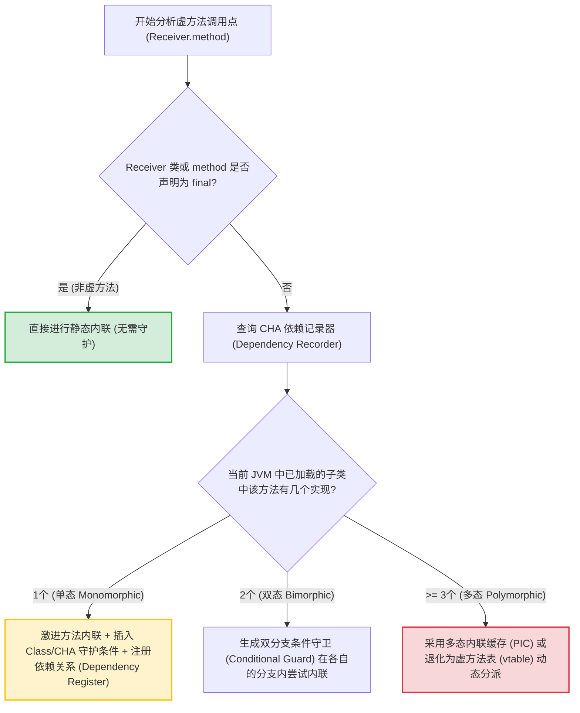
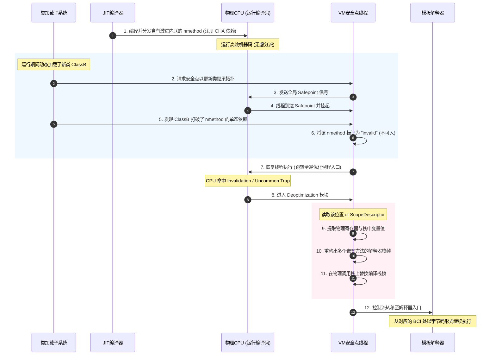
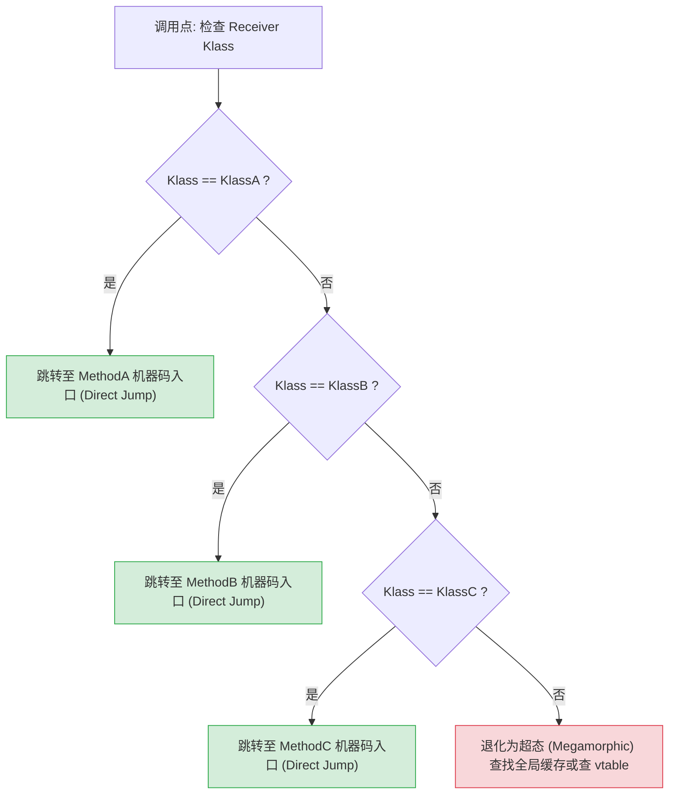
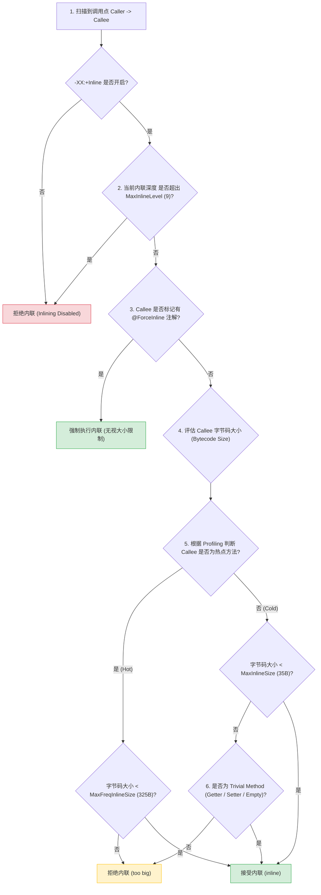

# 方法内联（Method Inlining）

方法内联是 Java 虚拟机（JVM）即时编译器（JIT Compiler，如 C1、C2、Graal）中最核心、最基础的编译优化技术。它不仅通过消除方法调用本身的硬件级开销来直接提升性能，更是后续一系列高级优化（如逃逸分析、死代码消除、公共子表达式消除、循环展开等）的“催化剂”与“铺路石”。可以说，没有方法内联，现代 JVM 的高性能执行就无从谈起。

本篇文档将从 CPU 硬件架构设计、编译原理、HotSpot 虚拟机源码设计以及诊断实践等多个维度，对方法内联进行物理级的深度剖析。

---

## 1. 方法内联的物理定义与根本性优势

### 1.1 什么是方法内联（物理视角）

在高级编程语言的抽象中，“方法调用”是代码模块化和面向对象设计的基础。然而，在 CPU 硬件的物理视角下，方法调用是一系列极具破坏性的硬件指令操作。

**方法内联（Method Inlining）**的物理定义是：**在即时编译阶段，将目标方法（Callee，被调用者）的指令序列直接复制并替换到调用方法（Caller，调用者）的调用点（Call Site）处，从而将跨方法的控制流跳转转化为顺序执行的指令流。**


从底层的机器码层面来看，内联消除的是包裹在方法业务逻辑之外的“脚手架”代码（Prologue 和 Epilogue）。

---

### 1.2 硬件级 CPU 开销的消除

在现代超标量（Superscalar）和深流水线（Deep Pipeline）的 CPU 架构下，方法调用会带来显著的硬件级开销。方法内联能够彻底消除以下几类硬件损耗：

#### 1.2.1 栈帧建立与销毁（Stack Frame Setup and Tear Down）
当发生一次未内联的方法调用时，CPU 必须为被调用者（Callee）建立一个新的栈帧（Stack Frame），并在返回时将其销毁。这涉及到：
*   **寄存器保存与恢复（Callee-saved / Caller-saved Registers）**：根据操作系统的调用约定（ABI，如 x86-64 System V ABI），在进行方法调用时，特定的寄存器必须由调用者（Caller）保存，而另一部分必须由被调用者（Callee）保存。这意味着在执行被调用者方法体之前，CPU 必须通过大量的推送指令（如 `push`）将寄存器值压入物理内存栈中，并在返回前通过弹出指令（如 `pop`）进行恢复。
*   **栈指针（RSP/EBP）修改**：需要调整栈顶指针 `rsp` 以分配被调用方法所需的局部变量空间。

#### 1.2.2 参数传递与返回值获取
在物理层面，参数和返回值需要在 Caller 和 Callee 之间进行传递：
*   如果参数较少，遵循 ABI 约定通过通用寄存器（如 x86-64 下的 `rdi`, `rsi`, `rdx`, `rcx`, `r8`, `r9`）传递；如果参数较多，必须将其压入内存栈中。
*   返回值通常通过 `rax` 寄存器传递。
*   对于高频调用的小方法（例如 Getter/Setter、工具类方法），这些传参和返回值搬运的指令耗时，甚至远超方法体内部业务逻辑的实际执行时间。

#### 1.2.3 控制流跳转与流水线气泡（Control Flow Jump & Pipeline Bubble）
这是非内联方法调用最隐蔽也是最严重的性能杀手：
*   **`call` 与 `ret` 指令的物理开销**：`call` 指令不仅会将当前的程序计数器（RIP/PC）的值（即返回地址）压入栈中，还会强制跳转至目标地址；`ret` 指令则需要从栈顶弹出返回地址并跳转回去。这两次内存/缓存读取和硬件跳转动作在流水线中具有较高的延迟。
*   **分支预测器污染（Branch Target Buffer Pollution）**：现代 CPU 依靠分支目标缓冲（Branch Target Buffer, BTB）来预测跳转指令的目标地址。如果方法调用是虚方法（具有多态性），BTB 很难准确预测下一次将跳转到哪个具体的内存地址。一旦预测错误，CPU 必须清空其深达十余级的指令流水线（Pipeline Flush），重新从内存或 L2/L3 缓存中拉取正确的指令，这会导致数十个时钟周期的“流水线气泡（Pipeline Bubble）”。更为严重的是，如果一个调用点频繁遇到不同的接收者类，BTB 项会被反复覆写（BTB Thrashing），进而污染整个 CPU 的分支预测缓存。
*   **返回栈缓冲（Return Stack Buffer, RSB）开销**：CPU 内部有一个硬件返回栈（RSB），专门用于加速 `ret` 指令的目标地址预测。当执行 `call` 时，RIP 压入 CPU 的硬件 RSB；执行 `ret` 时弹出进行比对。如果未内联的方法调用链过深或包含复杂的递归，RSB 会发生溢出（Overflow），导致后续所有的 `ret` 指令预测全部失败，带来灾难性的硬件耗时。
*   **I-Cache（指令高速缓存）局部性与指令预取**：没有内联的代码在物理内存空间上是离散分布的，这会导致 CPU 的硬件预取器（Instruction Prefetcher）无法进行高效的顺序预取，极大增加了 L1 I-Cache 发生未命中（Instruction Cache Miss）的概率。内联则将指令流物理合并，极大地提高了指令的空间局部性（Spatial Locality）。

---

### 1.3 编译器级优化的“催化剂”作用

除了直接消除上述 CPU 物理开销外，方法内联在 JIT 编译器优化体系中最重要的角色是**高级优化的“催化剂”（Catalyst）**。

在编译器科学中，如果不进行方法内联，编译器的优化视角就会被限制在单个方法内部，这被称为**过程内分析（Intraprocedural Analysis）**。一旦遇到方法调用，编译器就无法得知该方法内部是否会修改变量、是否会使对象发生逃逸、是否会产生副作用。为了保证程序的绝对正确，编译器只能做出最悲观的假设：**将方法调用视为一道“优化屏障（Optimization Barrier）”**，强制将寄存器同步回内存，停止一切基于寄存器活跃性的优化。

而方法内联将**过程间分析（Interprocedural Analysis）**转化为**过程内分析**：

```
                    【优化屏障】
[Caller Code] ===> (Method Call) ===> [Callee Code]
     |                                    |
  只能悲观假设                          无法协同优化
     \____________________________________/
                       |  进行方法内联
                       v
[Caller Code ======= Inlined Callee Code ======= Caller Code]
     |                                               |
     | <============== 融为一体的优化窗口 ==============> |
     | (开启逃逸分析、公共子表达式消除、死代码消除、标量替换)
```

内联将被调用方法的 IR（Intermediate Representation，中间表示）节点无缝拼接进调用者的 IR 图中。这样一来，调用者和被调用者的代码融为一体，原本被方法边界割裂的变量流向、对象分配以及控制流逻辑变得完全透明。这使得以下编译优化成为了可能：
1.  **逃逸分析（Escape Analysis）**：如果被调用方法在堆上创建了对象，但在内联后编译器发现该对象并没有超出调用方法的范围，就可以将其判定为“不逃逸”，从而实施**栈上分配**或**标量替换**。
2.  **公共子表达式消除（Common Subexpression Elimination, CSE）**：合并内联前后重复的计算或冗余的字段读取。
3.  **死代码消除（Dead Code Elimination, DCE）**：如果内联后的某些控制流分支永远不会被执行，编译器可以直接将这些分支的 IR 节点整块裁剪掉。

---

## 2. 虚方法（Virtual Method）内联：面向对象语言的业界难题

在 Java 等面向对象语言中，多态性是其核心特征。除了 `private`、`static` 和 `final` 方法（它们属于非虚方法，在编译期即可静态绑定）之外，绝大多数 Java 方法在字节码中都通过 `invokevirtual` 或 `invokeinterface` 指令进行调用。这些方法被称为**虚方法（Virtual Method）**。

### 2.1 虚方法的动态分派本质与寻址开销

虚方法的调用在编译期（即生成 Class 文件时）是无法确定具体指向哪个方法的，其具体执行的代码必须在运行期根据接收者对象（Receiver Object）的实际类型（即 Klass 指针）进行动态分派。

在 JVM 层面，这种动态分派依靠**虚方法表（vtable）**和**接口方法表（itable）**来实现。

```
对象实例 (Object Instance)
+-----------------------+
|  _mark (Mark Word)    |
+-----------------------+
|  _metadata (Klass*)  | ----> Klass 结构体 (Method Table 拥有者)
+-----------------------+      +---------------------------+
|  instance fields      |      |  ...                      |
+-----------------------+      |  vtable (虚方法表)         |
                               |  [0]: Object.toString()   |
                               |  [1]: Animal.makeSound()  | ----> 指向具体的机器码/字节码入口
                               |  ...                      |
                               +---------------------------+
```

当执行一条虚方法调用指令时，传统的执行流程为：
1.  通过对象头获取其 `Klass` 指针。
2.  根据方法在虚方法表中的索引值（Offset），定位到对应的 `vtable` 条目。
3.  取出条目中存储的目标方法入口地址。
4.  执行物理跳转指令跳转执行。

对于接口调用（`invokeinterface`），由于 Java 支持类实现多个接口，因此无法使用像 vtable 这样固定的偏移量寻址。JVM 必须使用**接口方法表（itable）**。在执行时，需要先遍历对象的类元数据，找到对应的接口段，再进行二次偏移量查找。这种运行时查找过程被称为 **Interface Table Walk**，开销甚至高于普通的 vtable 查找。

由于这种多重间接寻址的存在，JIT 编译器在编译包含虚方法调用的代码时，根本无法确定该内联哪一段目标代码。这使得虚方法内联成为了面向对象语言高性能编译的业界难题。

---

### 2.2 类型继承关系分析（Class Hierarchy Analysis, CHA）

为了突破虚方法无法直接内联的瓶颈，现代 JVM 引入了**类型继承关系分析（Class Hierarchy Analysis, CHA）**。

CHA 是一种全局分析技术。在 JIT 编译器对某个方法进行编译时，它会去检索 JVM 中当前已加载的所有类，构建并分析当前的类层次继承树拓扑结构，判断某个虚方法接口在当前的“封闭世界（Closed World）”中是否只有唯一的具体实现。

#### 2.2.1 判定流原理
对于一个特定的虚方法调用点，CHA 会根据当前的类加载状态做出如下判断：

*   **单态（Monomorphic）**：当前已加载的类层次结构中，该接口或父类方法**有且仅有一个**具体的子类实现。
    *   *编译器决策*：直接将该唯一的实现方法进行激进内联，但必须注册一个“依赖项（Dependency）”。
*   **双态（Bimorphic）**：当前已加载的类层次结构中，该方法有且仅有两个具体的实现。
    *   *编译器决策*：通常不会直接内联方法体，而是生成一个快速的类型分支判断（Type Guard Branching），在满足条件时分别内联两个方法，或者转为多态内联缓存（PIC）。
*   **多态（Polymorphic）**：存在三个或以上的具体实现。
    *   *编译器决策*：放弃直接内联，退化为多态内联缓存（Polymorphic Inline Cache）或者彻底通过 `vtable`/`itable` 间接寻址执行。

#### 2.2.2 CHA 的详细判断流程
CHA 并不只是一次性的静态扫描，而是随着 JVM 的运行动态维护的。以下是 CHA 对调用点进行判定时的微观流程：



---

## 3. 激进优化（Speculative Optimization）与逆优化（Deoptimization）逃生门

因为 Java 允许动态类加载（例如通过 `Class.forName()`、动态代理或在网络中传输 Class 字节码并加载），所以 CHA 判定为“单态”的类结构随时可能被打破。这种在不完整信息下做出优化假设并付诸编译的行为，称为**激进优化（Speculative Optimization）**。

为了确保激进优化的正确性，JVM 必须提供完备的“逃生门”——**逆优化（Deoptimization）**。

### 3.1 激进内联的物理假设与守护

当 JIT 编译器基于单态假设对一个虚方法实施了激进内联后，它不能直接无条件执行内联代码。编译器必须在内联代码的前端插入一段**守护代码（Guard Code）**，用于在运行时验证假设是否依然成立。

常见的守护形式有两种：

#### 1. 类层次结构守护（CHA Guard / Dependency-based Invalidation）
如果在编译时，CHA 确定整个 JVM 中仅有一个实现，JIT 可以直接生成内联机器码，不插入运行时的类型匹配指令，而是将当前编译生成的机器码与该方法的类继承树状态进行**依赖绑定**。
*   这种绑定关系记录在 HotSpot 的 `nmethod` 依赖记录表（`Dependencies`）中。
*   如果未来没有新类加载来打破单态，那么这段机器码将以最纯粹的顺序结构高效运行。

#### 2. 类型检查守护（Type Guard）
在调用点插入一条比较指令，比较当前运行对象的真实 `Klass` 指针。
```assembly
; 假设 rax 存放当前对象 receiver 的 Klass 指针
mov rbx, [rax + KlassOffset]    ; 获取实际对象的 Klass
cmp rbx, TargetKlass            ; 比较是否是编译时假设的那个唯一实现类
jne uncommon_trap               ; 若不相等，跳转到 Uncommon Trap 处理器进行逆优化
; === 成功内联的代码主体 ===
...
```

---

### 3.2 逆优化（Deoptimization）的触发契机

当 JVM 加载一个新类，并打破了原本的单态假设时，逆优化机制便会启动。

```
[ 初始状态 ]
JVM 中只有类 A，实现了接口 I。
JIT 编译器编译 caller() { I.test() } 并将 A.test() 激进内联其中。
JIT 向 Dependency Recorder 注册依赖项: (nmethod_caller -> I has single subclass A)。

[ 运行中 ]
1. 某业务逻辑执行 ClassLoader.loadClass("ClassB")。
2. ClassB 同样实现了接口 I，并重写了 test() 方法。
3. JVM 类加载系统检测到 I 增加了新的实现，触发依赖失效检查。
4. JVM 遍历 Dependency Recorder，发现 nmethod_caller 依赖于 (I has single subclass A)。
5. 该依赖关系被打破！JVM 立即将 nmethod_caller 标记为 "not entrant" (不可入状态)。
6. JVM 准备对正在运行该方法的线程实施“逆优化”。
```

---

### 3.3 逆优化的微观执行过程：栈帧重构（Frame Reconstruction）

逆优化最核心、最复杂的物理步骤是**栈帧重构（Frame Reconstruction）**。由于已编译的机器码栈帧物理结构非常扁平化（寄存器分配、嵌套内联合并了多级栈帧），而解释器需要标准的、带有局部变量表和操作数栈的嵌套栈帧结构，JVM 必须在运行时将编译栈帧精确还原为解释器栈帧。

#### 3.3.1 ScopesDesc（范围描述符）的微观结构
在 HotSpot 源码中，每个被编译的机器码段（`nmethod`）都会附带一系列 ScopesDesc 结构。ScopesDesc 是在编译期间生成的调试元数据，其核心字段结构如下：
*   `_method`：当前所处方法的 `Method*` 元数据指针。
*   `_bci`：当前执行位置对应的字节码索引（Bytecode Index）。
*   `_locals`：一个 `GrowableArray<ScopeValue*>`，按索引顺序精确保存了该字节码时刻所有局部变量的物理存放位置（可能是一个物理寄存器，或者是物理栈帧的某个偏移地址，亦或是一个已经被标量替换的常数/虚拟对象）。
*   `_expressions`：保存当前操作数栈中每一个临时值对应的物理存放位置。
*   `_monitors`：保存当前方法持有的锁对象及其物理锁记录器的映射关系。

当存在多层方法内联时，ScopesDesc 包含一个 `_sender` 指针，以链表的形式形成一个从最内层 Callee 指向最外层 Caller 的嵌套结构。

#### 3.3.2 栈帧重构的微观步骤
以下是逆优化器（Deoptimizer）执行栈帧重构的具体微观步骤：

1.  **触发 Uncommon Trap**：当运行中的已编译方法遇到类型守护失效，或者执行到了被标记为失效的机器码安全点（Safepoint）时，控制流会跳转至 HotSpot 的 `Deoptimization::uncommon_trap` 运行时入口点。
2.  **提取物理现场**：逆优化例程首先将物理 CPU 当前的所有通用寄存器值以及物理栈顶指针保存至一块被称为 `RegisterMap` 的临时内存结构中，确保物理执行现场不会丢失。
3.  **计算重构解释帧的数量与大小**：读取 Scope Descriptor 链表，确定当前这一个物理编译栈帧需要拆解成多少层解释器栈帧（例如，如果 C2 编译器将 A、B、C 三层调用内联在了一起，则需要拆解并重构出 3 个解释器栈帧）。
4.  **分配解释帧空间**：在当前线程栈上，从已编译栈帧的位置开始，向栈底方向为即将重构的所有解释器栈帧分配物理内存空间。
5.  **逐步填充解释器栈帧（还原局部变量与操作数栈）**：
    *   逆优化器从最底层的 Scope Descriptor 开始遍历。
    *   对于当前层级的 Scope Descriptor，读取其中的 `_locals` 数组。如果记录显示局部变量 0（比如 `this` 指针）此时保存在 `rsi` 寄存器中，逆优化器便从之前保存的 `RegisterMap` 中取出 `rsi` 的值，将其写入新建的解释器栈帧的“局部变量表槽 0（Local Variable Slot 0）”中。
    *   如果记录显示某个变量值保存在物理栈的 `[rsp + 0x10]` 位置，则从原编译帧对应的内存处拷贝该数值并写入对应的解释帧槽位中。
    *   以同样的方式依次重构操作数栈（`_expressions`）和还原被监视的同步锁（`_monitors`）。
6.  **重定向程序计数器（PC）**：将每一层重构出的解释器栈帧的 `bcp`（Bytecode Pointer）指向 Scope Descriptor 记录的当前方法在该层内联时的 BCI。
7.  **栈替换与控制流回退**：将线程调用栈的当前栈帧物理更新为新构建的这一组解释器栈帧链，修改 CPU 的 RSP 和 RBP 寄存器，指向解释器栈的栈顶。

最后，控制流跳转到 JVM 的**模板解释器（Template Interpreter）**，线程无缝地回退到解释执行状态，继续执行对应的字节码。

以下是“激进内联 -> 类装载打破单态 -> 逆优化栈帧重构”的完整时序图：



---

## 4. 内联缓存（Inline Cache）与多态内联缓存（Polymorphic Inline Cache, PIC）

如果类型继承关系分析（CHA）发现一个调用点存在多个子类实现（双态或多态），或者随着新类加载原本的单态内联被迫逆优化退化后，为了避免虚方法表（vtable）高昂的动态分派开销，JIT 编译器会使用**内联缓存（Inline Cache）**技术。

### 4.1 单态内联缓存（Monomorphic Inline Cache）

单态内联缓存的核心思想是：**绝大多数虚方法调用点在实际运行过程中，往往只遇到一种具体类型的对象。**

在未执行前，调用点是一段未绑定的桩代码（Stub）。当第一次执行到该虚方法调用时，JVM 拦截此调用，解析出当前接收者对象的实际 `Klass`，并将该 `Klass` 指针和对应的目标方法入口物理硬编码（Patch）到调用点的指令流中。

```assembly
; 单态内联缓存在汇编指令流中的体现
mov rax, [rcx + ObjectKlassOffset] ; 获取当前接收者对象的 Klass
cmp rax, ExpectedKlass            ; 比较是否是缓存的那个 Klass
je  TargetMethodDirectEntry       ; 【快速路径】如果是，直接跳转执行机器码
; ---------------------------------
jmp inline_cache_miss_handler     ; 【慢速路径】如果未命中，跳转到未命中处理器
```

当 `rax` 与 `ExpectedKlass` 相等时，直接进行跳转，这仅需要一次比对和一次直接跳转（Direct Jump），完全避开了访问 `vtable` 数组的两次内存间接寻址开销。

#### 单态内联缓存与 GC 的协同
由于单态内联缓存直接将特定的 `Klass` 物理指针以立即数的形式硬编码到了机器码中，这给 JVM 的垃圾回收（GC）带来了额外的约束。如果发生垃圾回收，导致某些类被卸载，或者转移（Evacuation，如 G1/ZGC 中的对象移动），这些硬编码在机器码中的 Klass 指针就必须被修正。
*   HotSpot 在 GC 期间会进行 **nmethod Scan**。
*   如果发现机器码中的硬编码指针所指向的 Klass 被标记为不可达（即将卸载），或者发生了地址移动，GC 线程会主动触发 **Stub Relocation**，修正或者将该调用点的单态内联缓存重置为最初的未绑定状态（Reset Inline Cache），防止执行时访问到悬空指针。

---

### 4.2 多态内联缓存（Polymorphic Inline Cache, PIC）

当单态内联缓存发生“未命中”（即调用点遇到了另一种类型的对象）时，如果每次都退化为慢速路径查找，性能依然会很差。为了解决这个问题，JIT 编译器会将单态内联缓存升级为**多态内联缓存（PIC）**。

PIC 在物理上表现为一段由 JIT 编译器动态生成的存根代码（Stub Code）。它的核心是构造一条有序的、基于条件分支的类型存根链表：



PIC 的指令流级别实现逻辑伪代码如下：
```assembly
; PIC 动态桩代码
mov rax, [rcx + ObjectKlassOffset] ; 提取 Klass
cmp rax, KlassA                    ; 分支 1
je  TargetMethodA
cmp rax, KlassB                    ; 分支 2
je  TargetMethodB
cmp rax, KlassC                    ; 分支 3
je  TargetMethodC
; 超过 PIC 的承载深度限制
jmp fallback_vtable_lookup         ; 慢速路径，直接查 vtable
```

*   **性能优势**：PIC 将原本需要查表、多重间接指针寻址的虚分派，转化为一组排布紧凑的、寄存器间的 `cmp` 和 `je` 指令。由于分支预测器能够对这些条件跳转进行高度优化，当类型分布具有局部性规律时，PIC 的执行速度几乎等同于直接调用。
*   **缓存限制与退化（Megamorphic）**：PIC 的深度是有限制的。这是因为如果条件分支链表过长，分支预测器会失效，且逐个比较的开销也会超越查虚方法表的开销。HotSpot 中通过 `-XX:TypeProfileWidth` 参数来配置此深度上限（默认值通常为 2 或 3）。一旦在这个调用点遇到的类类型数量超过此限制，PIC 就会退化为**超态（Megamorphic）**。超态状态下，机器码不再维护具体的类分支，而是直接进行底层的 `vtable` 或 `itable` 间接跳转。

---

## 5. HotSpot 的内联控制参数与核心启发式阈值

在 JIT 编译器中，方法内联是一把双刃剑。如果毫无限制地对所有方法进行内联，会导致严重的**代码膨胀（Code Bloat）**。
1.  生成的机器码体积大幅增加，会直接挤占宝贵的 CPU 寄存器和 L1 I-Cache（指令缓存），导致原本缓存友好的紧凑循环频繁发生 I-Cache Miss。
2.  过度内联会使 JIT 编译器分析的 IR 节点数量呈指数级增长，消耗大量的编译时间和内存，导致严重的“JIT 编译器停顿”。

因此，HotSpot 编译器设计了一套精密的启发式模型（Heuristics）和一系列调优参数来精确控制内联行为。

### 5.1 核心控制参数与编译器对比

以下是 HotSpot VM 中控制方法内联的核心配置参数：

| 参数名 | 默认值（典型 64位 JVM） | 参数说明与物理意义 |
| :--- | :--- | :--- |
| `-XX:+Inline` | `true` | 是否开启方法内联优化。这是总开关，极特殊诊断下才关闭。 |
| `-XX:MaxInlineLevel` | `9` | 方法内联的最大嵌套深度限制。防止深层递归或长调用链导致内联层级失控。 |
| `-XX:MaxInlineSize` | `35` 字节 | **非热点方法**（Cold Method）能够被内联的字节码最大限制。小于此大小的方法才会被内联。 |
| `-XX:MaxFreqInlineSize` | `325` 字节 | **热点方法**（Hot Method）能够被内联的字节码最大限制。频繁调用的方法放宽内联体积限制。 |
| `-XX:InlineSmallCode` | `1000` 字节 | 如果一个方法已经被 JIT 编译成机器码，当它被其他方法调用时，只有当其已编译机器码的体积小于此值，才会被允许直接内联。 |
| `-XX:MinInliningThreshold` | `250` | 触发内联所需的最小调用计数占比（通常与 Profiling 数据配合使用）。 |

#### 不同即时编译器的内联策略对比
JVM 内部存在不同的即时编译器，它们的内联倾向与决策重点有显著不同：

| 编译器特性 | C1 (Client Compiler) | C2 (Server Compiler) | Graal Compiler |
| :--- | :--- | :--- | :--- |
| **主要目标** | 快速编译，降低启动延迟。 | 追求极致运行性能。 | 追求极致优化，支持高级抽象。 |
| **内联策略** | 保守（Conservative）。只内联极其微小的方法，使用预设的硬编码规则进行判定。 | 贪婪（Greedy）。基于丰富的运行时 Profiling 数据，进行大范围的激进内联，再通过逆优化兜底。 | 基于图（Graph-based）的概率分析。内联决策融入全局图优化中，内联预算（Inlining Budget）更加动态。 |
| **嵌套深度** | 通常较浅（如限制为 3）。 | 默认可达 9 层，高度信赖 CHA。 | 采用自适应的评分机制，动态计算内联收益与代价。 |

---

### 5.2 热方法与非热方法的内联判定边界

HotSpot 将待编译的目标方法区分为**热方法（Hot Methods）**和**非热方法（Cold/Warm Methods）**。这种区分主要是通过运行时的 Profiling 收集的方法调用计数器（Invocation Counter）和回边计数器（Backedge Counter）决定的。

#### 1. 非热方法的内联判定
对于调用频率未达到热点阈值的方法，JIT 判定其内联的阈值非常苛刻：
*   **方法大小**：其字节码大小（Bytecode Size）必须小于等于 `-XX:MaxInlineSize`（默认 35 字节）。
*   *特殊豁免*：如果目标方法是简单的属性访问器（如仅包含 `aload_0 / getfield / ireturn` 的 Getter），或者被判定为“无价值的小方法”（Trivial Method，如空构造函数），即使方法大小略大，也会被内联。

#### 2. 热方法的内联判定
对于通过 Profiling 被判定为热点的方法，为了能够充分激发后续的联合编译优化，JIT 会将其字节码大小上限放宽到 `-XX:MaxFreqInlineSize`（默认 325 字节）。
*   然而，如果热方法深处内联调用栈的末端（深度接近 `MaxInlineLevel`），可允许内联的方法大小阈值会根据当前的调用深度呈线性退化。

#### 3. 启发式内联判定决策树
当 JIT 编译器遇到一个方法调用点并评估是否内联时，其内部的决策逻辑如下：



---

## 6. 方法内联与其它 JIT 优化的协同增益机理（代码级演练）

为了清晰地展示方法内联如何作为“催化剂”开启其他编译优化的大门，我们通过一段具体的 Java 业务代码，并将其转换为静态单赋值（SSA）形式的虚拟中间表示（IR）来进行物理推导。

### 6.1 原始 Java 代码

假设我们有如下代表二维空间点处理的类和业务逻辑：

```java
// 实体类 Point
static final class Point {
    private final int x;
    private final int y;

    public Point(int x, int y) {
        this.x = x;
        this.y = y;
    }

    public int getX() {
        return this.x;
    }

    public int getY() {
        return this.y;
    }
}

// 业务处理类
public class GeometryProcessor {
    public int offsetAndSum(int baseVal, int offset) {
        Point p = new Point(baseVal, offset);
        int localX = p.getX();
        int localY = p.getY();
        return localX + localY;
    }
}
```

---

### 6.2 转换为中间表示（IR）及逐步优化过程

在未进行方法内联之前，`GeometryProcessor.offsetAndSum` 的初始 SSA IR 逻辑非常分散，包含了多次跨方法的调用和对象分配：

#### 阶段 1：初始 SSA IR 状态 (无内联)
```text
Method GeometryProcessor.offsetAndSum(baseVal_0, offset_0):
    // 1. 在堆上分配 Point 对象
    p_0 = NewInstance(Point.class)
    // 2. 调用构造函数
    Call Void Point.<init>(p_0, baseVal_0, offset_0)
    // 3. 调用 getX()
    localX_0 = Call Int Point.getX(p_0)
    // 4. 调用 getY()
    localY_0 = Call Int Point.getY(p_0)
    // 5. 结果求和
    res_0 = Add(localX_0, localY_0)
    Return res_0
```
*   *分析*：此时，由于存在 `Call` 指令，编译器无法推断 `p_0` 的生命周期，更无法优化 `Add` 运算。

---

#### 阶段 2：执行方法内联 (Inlining)
JIT 编译器扫描到 `Point` 声明为 `final`，且 `getX` 和 `getY` 是极其微小的非虚方法（Trivial）。它读取被调用方法的字节码并将其复制拼装到 `offsetAndSum` 的 IR 图中：

```text
Method GeometryProcessor.offsetAndSum(baseVal_0, offset_0):
    p_0 = NewInstance(Point.class)
    
    // --- 内联 Point.<init> 体 ---
    StoreField(p_0.x, baseVal_0)
    StoreField(p_0.y, offset_0)
    // ----------------------------
    
    // --- 内联 Point.getX ---
    localX_0 = LoadField(p_0.x)
    // ----------------------------
    
    // --- 内联 Point.getY ---
    localY_0 = LoadField(p_0.y)
    // ----------------------------
    
    res_0 = Add(localX_0, localY_0)
    Return res_0
```
*   *突破点*：内联后，跨方法调用的 `Call` 节点全部消失，取而代之的是纯粹的数据流节点（`StoreField` 和 `LoadField`）。在现代 JIT 编译器的 **Sea-of-Nodes** 图结构中，这意味着原本阻断在 Caller 与 Callee 之间的控制边（Control Flow Edge）和内存依赖边（Memory Edge）被全部移除，两者的图拓扑直接融为了一体。

---

#### 阶段 3：逃逸分析（Escape Analysis）与标量替换（Scalar Replacement）
在内联后的 IR 图上，由于不再有跨方法的黑盒调用，编译器可以轻松跟踪 `p_0` 对象的整个生命周期：
1.  `p_0` 在方法内分配。
2.  `p_0` 的引用只被本地的 `StoreField` 和 `LoadField` 消费，从未传递给其他方法，也未赋值给全局变量。
3.  **结论**：`p_0` 没有逃逸（No Escape）。

既然对象不逃逸，且其字段可以通过局部标量表示，编译器实施**标量替换（Scalar Replacement）**：消除 `Point` 对象的堆分配，将其拆解为两个独立的虚拟局部变量 `p_x` 和 `p_y`。

```text
Method GeometryProcessor.offsetAndSum(baseVal_0, offset_0):
    // p_0 对象的物理分配被彻底消除！
    // 将原本写入对象字段的操作，转换为对局部标量变量的直接赋值：
    p_x_0 = baseVal_0
    p_y_0 = offset_0
    
    // 读取对象字段的操作，直接替换为读取对应的标量变量：
    localX_0 = p_x_0
    localY_0 = p_y_0
    
    res_0 = Add(localX_0, localY_0)
    Return res_0
```

---

#### 阶段 4：公共子表达式消除与死代码消除（CSE & DCE）
现在的 IR 包含了大量纯粹的变量赋值传递：
*   `localX_0` 直接等于 `p_x_0`，而 `p_x_0` 又等于 `baseVal_0`。
*   通过**复写传播（Copy Propagation）**，编译器可以直接消除中间临时变量 `p_x_0`、`p_y_0`、`localX_0` 和 `localY_0`。
*   在 Sea-of-Nodes 图中，失去数据流引用的 `NewInstance` 节点和其关联的内存节点会变成孤立节点。
*   无用变量与孤立节点被**死代码消除（DCE）**模块物理移除。

```text
Method GeometryProcessor.offsetAndSum(baseVal_0, offset_0):
    // 经过死代码消除后，中间所有的 Store/Load 均消失
    res_0 = Add(baseVal_0, offset_0)
    Return res_0
```

---

#### 优化结果对比

经过内联催化的系列优化后，最终生成的汇编代码和运行性能产生了质的飞跃：

| 指标 | 优化前物理运行过程 | 优化后物理运行过程 |
| :--- | :--- | :--- |
| **堆内存分配** | 触发 `new`，在 TLAB / 堆上分配 24 字节内存，写入对象头。 | **零**堆分配，无垃圾回收（GC）压力。 |
| **内存读取开销** | 发生多次字段写入与内存寻址读取（L1/L2 Cache 或 RAM 访问）。 | **零**内存访问，全部在 CPU 寄存器中完成。 |
| **控制流跳转** | 1 次 `new` 运行时调用 + 3 次 `call`/`ret` 物理跳转。 | **零**跳转，纯顺序执行。 |
| **最终汇编指令** | 数十条指令（涉及栈指针移动、寄存器备份、跳转、内存寻址）。 | 仅 **1 条**汇编指令：`add edi, esi`（直接将两个输入寄存器的值求和并返回）。 |

---

## 7. 诊断实践：JIT 内联决策的打印与深度解析

在进行底层性能调优或排查 JIT 编译性能瓶颈时，我们需要观察编译器做出的具体内联决策。HotSpot 提供了强大的诊断参数来辅助这一过程。

### 7.1 诊断参数配置

要在 Java 进程启动时获取详细的方法内联日志，必须配置以下 JVM 组合参数：

```bash
java -XX:+UnlockDiagnosticVMOptions \
     -XX:+PrintCompilation \
     -XX:+PrintInlining \
     -version
```

*   `-XX:+UnlockDiagnosticVMOptions`：解锁 JVM 诊断参数的修改权限（必须配置在最前面）。
*   `-XX:+PrintCompilation`：打印 JIT 编译的基本情况（如编译层级、编译方法名等）。
*   `-XX:+PrintInlining`：打印 JIT 编译器在编译每个方法时的具体**内联决策日志**。

---

### 7.2 日志标记（Inline Log Tags）深度剖析

当你开启了 `-XX:+PrintInlining` 后，标准输出（Stdout）或日志中会输出大量的内联树状图。以下是常见的内联日志标记及其深层的 JVM 物理原因解释：

#### 1. `'inline (hot)'`
*   *含义*：该方法已被成功内联，且由于它是热点方法（Hot Method），编译器放宽了体积上限（参考 `MaxFreqInlineSize`）。
*   *优化含义*：这是最期望看到的优化结果，说明该热点路径已成功消除跨方法开销。

#### 2. `'too big'`
*   *含义*：该方法的字节码大小超过了内联限制。
*   *深层逻辑*：
    *   如果紧随在非热点方法后面，说明该方法字节码大小大于 35 字节（`MaxInlineSize`）。
    *   如果是在频繁调用的热点方法后面，说明该方法大小超出了 325 字节（`MaxFreqInlineSize`）。
*   *调优建议*：如果这是核心热点路径，可尝试将其拆分为多个更小的方法，或者通过 `-XX:MaxInlineSize` 适度放大阈值（注意：放大可能带来代码膨胀）。

#### 3. `'already compiled'`
*   *含义*：目标方法之前已经被 JIT 编译器单独编译过了（已经生成了对应的 `nmethod` 机器码）。
*   *深层逻辑*：当编译器尝试内联该方法时，会直接提取其已经编译好的 HIR/LIR 图或者已生成的机器码结构，加速编译。

#### 4. `'never executed'`
*   *含义*：根据运行时的 Profiling 收集的数据（MDO，MethodDataOop），此方法在历史执行中**从未被执行过**。
*   *优化机制*：JIT 编译器是极其懒惰和务实的。对于从不执行的分支，它会拒绝内联以避免编译器做无用功并导致机器码无端膨胀。如果之后该分支被执行，触发逆优化重新编译。

#### 5. `'callee is too large'`
*   *含义*：被调用方法的大小超过了内联的大前提限制（通常是生成的物理机器码大小超出了 `InlineSmallCode` 的界限）。

#### 6. `'accessor'`
*   *含义*：该方法被判定为属性访问器（Accessor，即标准的 Getter/Setter）。
*   *优化机制*：这类极其微小（通常几字节）的方法会被无条件直接内联。

#### 7. `'trivial'`
*   *含义*：该方法是一个无实际逻辑的小方法（如空构造方法、空实现方法等）。
*   *优化机制*：无条件直接内联，开销为零。

#### 8. `'receiver not constant'`
*   *含义*：对于虚方法调用点，由于接收者（Receiver）不是常量，且 CHA 判定该方法有多个子类实现（多态），编译器无法锁定唯一的内联对象类型。

---

### 7.3 实战分析：一段真实 JIT 诊断日志的深度解读

下面是一段典型的 Java 应用程序在运行期间产生的 `-XX:+PrintInlining` 日志切片。我们来逐行剖析其内联决策背后的真实物理过程：

```text
1  @ 12   java.lang.String::indexOf (166 bytes)   failed to inline: hot method too big
2  @ 5    java.lang.AbstractStringBuilder::ensureCapacityInternal (16 bytes)   inline (hot)
3    @ 2    java.lang.AbstractStringBuilder::newCapacity (47 bytes)   too big
4  @ 23   java.util.ArrayList::add (25 bytes)   inline (hot)
5    @ 11   java.util.ArrayList::ensureCapacityInternal (26 bytes)   inline (hot)
6      @ 8   java.util.ArrayList::calculateCapacity (21 bytes)   inline (hot)
7      @ 14  java.util.ArrayList::ensureExplicitCapacity (26 bytes)   inline (hot)
8        @ 14  java.util.ArrayList::grow (47 bytes)   never executed
```

#### 逐行解析：

*   **第 1 行**：`@ 12 java.lang.String::indexOf (166 bytes) failed to inline: hot method too big`
    *   *解析*：在当前调用点的字节码偏移量（BCI）为 12 的位置，尝试内联 `String.indexOf`。该方法的字节码大小为 166 字节。虽然它在运行中被判定为“热方法（hot method）”，但由于其字节码大小超过了预期的频率限制（例如在深度较深时阻碍了内联），最终内联失败。

*   **第 2 行**：`@ 5 java.lang.AbstractStringBuilder::ensureCapacityInternal (16 bytes) inline (hot)`
    *   *解析*：在 BCI 为 5 的位置调用了 `ensureCapacityInternal`。它仅有 16 字节，且是一个频繁调用的热方法，成功内联入调用者中。

*   **第 3 行**：`@ 2 java.lang.AbstractStringBuilder::newCapacity (47 bytes) too big`
    *   *解析*：这是嵌套在 `ensureCapacityInternal` 内部的调用（即内联树的下一层，缩进表示）。在 BCI 为 2 的位置，它调用了 `newCapacity`（47 字节）。因为它是非热点子方法，大小超过了 `MaxInlineSize`（35 字节）的限制，所以判定为 `too big`，拒绝内联。

*   **第 4-7 行**：
    ```text
    ArrayList::add (25 bytes) -> inline (hot)
      ArrayList::ensureCapacityInternal (26 bytes) -> inline (hot)
        ArrayList::calculateCapacity (21 bytes) -> inline (hot)
        ArrayList::ensureExplicitCapacity (26 bytes) -> inline (hot)
    ```
    *   *解析*：这是一条非常完美的**连续嵌套内联成功链路**。`add` 方法调用了 `ensureCapacityInternal`，后者又分别调用了 `calculateCapacity` 和 `ensureExplicitCapacity`。由于所有被调用方法的字节码都在 30 字节以内，且处于热点调用路径上，JIT 将这 4 层调用关系全部打平，融合成了一个扁平化的机器码段。

*   **第 8 行**：`@ 14 java.util.ArrayList::grow (47 bytes) never executed`
    *   *解析*：这是嵌套在 `ensureExplicitCapacity` 里的扩容方法 `grow`。虽然它有 47 字节，但 Profiling 数据表明，系统运行至今，ArrayList 从未触发过扩容（`never executed`）。因此，JIT 决定不在此处将 `grow` 的代码展开内联，以此避免无效的代码膨胀。如果未来某次调用触发了扩容，JVM 将在此处打破假设，退回到解释器执行（逆优化），并在随后根据新的热度数据重新编译。

---

通过上述诊断与分析，我们可以深入理解 JIT 编译器在方法内联决策上的权衡取舍。在实际开发中，保持核心逻辑方法体的“短小精悍”，不仅有助于提升代码的维护性，更是迎合 JIT 编译器进行高效方法内联与协同优化的黄金法则。
