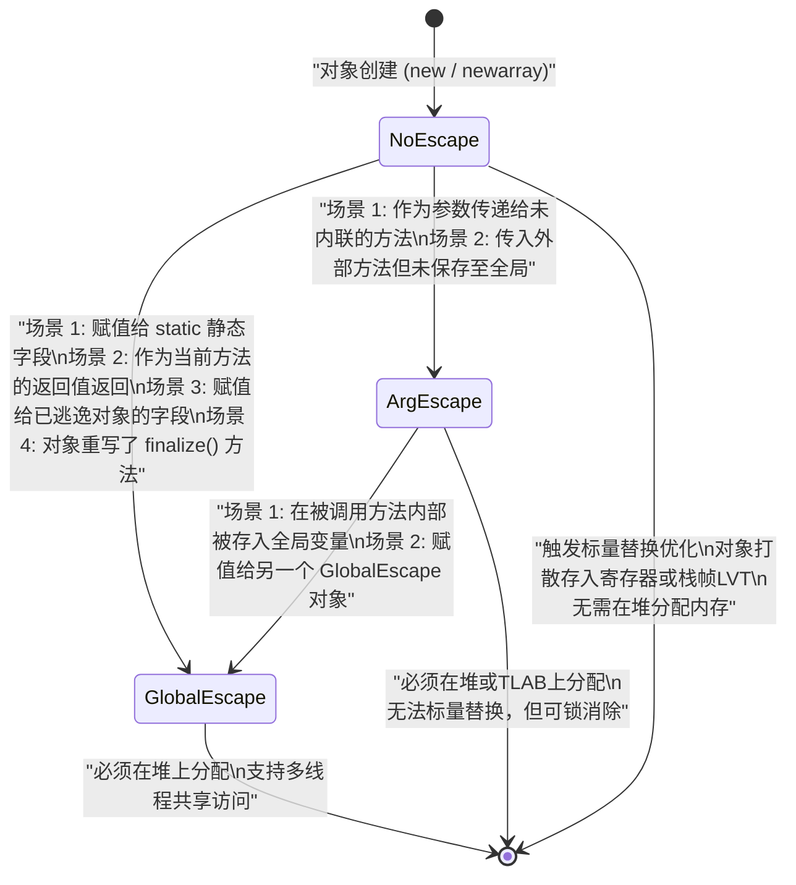

# 2.1.7.2 逃逸分析

逃逸分析（Escape Analysis, 简称 EA）是现代 Java 虚拟机（如 OpenJDK HotSpot）中最为核心的即时编译器（JIT）优化技术之一。它不是一种直接修改或优化用户代码的手段，而是一种**为其他优化技术提供依据的分析算法**。通过分析对象引用的动态作用域，JIT 编译器能够判定一个新创建的对象是否会被当前方法之外的逻辑或当前线程之外的线程所访问。

如果判定一个对象不会逃逸，JIT 编译器就可以对该对象进行一系列极其高效的物理优化，包括**标量替换（Scalar Replacement）**和**锁消除（Lock Elimination）**。在很多科普文章中，常常将标量替换误称为“栈上分配（Stack Allocation）”，本篇将从 JVM 内部的物理实现机制出发，深度剖析逃逸分析的学术定义、算法模型、状态跃迁、优化手段的物理微观过程以及具体的实验诊断。

---

## 1. 逃逸分析的学术与物理定义

在静态程序分析与编译原理中，逃逸分析的核心任务是判定**指针的动态作用域（Dynamic Scope）**。

### 1.1 动态作用域与可达性判定
在 Java 语言中，所有的对象在语义上都是通过 `new` 关键字在“堆（Heap）”上分配的。堆是所有线程共享的内存区域。这意味着，默认情况下，任何一个对象一旦在堆上被创建，它的生命周期就与创建它的方法栈帧脱离了物理绑定，其垃圾回收时机完全由垃圾收集器（GC）通过可达性分析来决定。

然而，从物理执行的角度看，许多对象的生命周期实际上非常短暂。它们仅仅在创建它们的方法内部被临时使用，一旦方法返回，这些对象就再也不会被任何代码访问。
逃逸分析的核心目标，就是**在编译期（即时编译时）找出这些生命周期局限于特定作用域的对象**。

如果一个对象在以下两个维度上都无法被外界访问，我们就认为它“未逃逸”：
1. **方法维度（Method-level Escape）**：对象没有逃逸出当前方法（或调用链）的控制范围。
2. **线程维度（Thread-level Escape）**：对象没有逃逸出当前创建它的线程的控制范围。

### 1.2 过程内分析与过程间分析
逃逸分析的实现可以分为两大类：
* **过程内分析（Intra-procedural Analysis）**：仅分析单个方法内部的数据流和控制流。如果在方法内部对象被传给了其他方法，在没有其他信息的情况下，过程内分析必须保守地假设该对象已经逃逸。
* **过程间分析（Inter-procedural Analysis, IPA）**：分析跨越方法边界的数据流。这需要跟踪方法调用的参数传递和返回值。过程间分析的计算开销极大，因此在 HotSpot 等即时编译器中，通常依赖**方法内联（Method Inlining）**将多个关联的方法扁平化为一个大方法，从而将过程间的问题转化为过程内的问题进行求解。

### 1.3 逃逸分析的数学模型：半格与不动点迭代
从学术定义上讲，逃逸分析被建模为在**有界半格（Bounded Semi-Lattice）**上的数据流分析问题。
逃逸状态构成一个偏序集（Partially Ordered Set, Poset），其格定义如下：

$$\bot \le \text{NoEscape} \le \text{ArgEscape} \le \text{GlobalEscape} \le \top$$

其中：
* $\bot$（Bottom）表示未初始化状态，或者不可达对象。
* $\top$（Top）表示冲突或不确定状态，在实际分析中通常与 `GlobalEscape` 等同看待，表示必须保守地进行堆分配。
* $\le$ 符号代表偏序关系，表示“逃逸严重程度不大于”。

在控制流图（CFG）合并处（如 if-else 分支汇合点），两个分支上的同一对象状态需要执行**汇合操作（Meet Operator, $\sqcup$）**以取得上确界（Least Upper Bound, LUB）：

$$\text{State}_{\text{Merged}} = \text{State}_{\text{Branch1}} \sqcup \text{State}_{\text{Branch2}}$$

例如，若一个对象在分支 1 中为 `NoEscape`，而在分支 2 中为 `ArgEscape`，则合并后的最终逃逸状态为：

$$\text{NoEscape} \sqcup \text{ArgEscape} = \text{ArgEscape}$$

编译器使用**工作表（Worklist）算法**对方法的连接图进行不动点迭代（Fixed-Point Iteration）求解。只要图中的节点状态仍在发生变化，迭代就不会停止，直到所有节点的状态收敛到不动点为止。

### 1.4 连接图（Connection Graph）算法与 Choi 算法
在 HotSpot 虚拟机中，C2 编译器（Server Compiler）通过构建**连接图（Connection Graph）**来实现逃逸分析，这在学术上很大程度上继承了 Jong-Deok Choi 等人发表的《Escape Analysis for Java》论文中的核心思想。

连接图包含以下三种核心节点（Nodes）：
1. **Object Node（对象节点）**：代表在堆上分配的具体对象。在编译器的 IR（中间表示）中，对应于 `NewInstance` 或 `NewArray` 节点。
2. **Reference Node（引用节点）**：代表指向对象的指针或引用。包括局部变量、方法参数、静态字段、类实例字段、数组元素等。
3. **Phantom Node（幽灵/未知节点）**：代表逃逸分析算法无法窥探其内部细节的外部引用。例如，未被内联的方法的返回值、从外部传入的参数等。

连接图包含以下两种边（Edges）：
1. **Points-to Edge（指向边）**：从一个 Reference 节点指向它可能指向的 Object 节点，表示引用关系。
2. **Deferred Edge（延迟边）**：从一个 Reference 节点指向另一个 Reference 节点，表示引用之间的赋值关系（例如 `r2 = r1`）。延迟边的引入是为了减少图的大小和加速状态传播算法，使得我们在分析过程中不需要立即更新所有受影响的指向关系。

通过在连接图上进行**闭包计算（Closure Computation）**和**可达性分析（Reaching Analysis）**，算法可以确定每个 Object 节点与 Phantom 节点（代表外部未知世界）之间是否存在可达路径。如果存在可达路径，则说明该对象发生了逃逸；如果不存在，则说明该对象是封闭的、未逃逸的。

---

## 2. 对象逃逸的三种状态与转换判定

在 HotSpot C2 编译器中，逃逸分析算法在构建完连接图并完成状态传播后，会将所有的对象（Object Nodes）归类为以下三种逃逸状态（Escape States）之一：

### 2.1 逃逸状态定义

| 状态名称 | 学术定义 | 物理本质与 JVM 行为表现 |
| :--- | :--- | :--- |
| **NoEscape (无逃逸)** | 对象仅在当前方法内部可达，且不会被当前线程以外的其他线程访问，也不会通过任何途径暴露给外部方法。 | 此时对象是完全封闭的。JIT 编译器可以对其进行**标量替换**和**锁消除**，彻底避免在堆中分配对象实体。 |
| **ArgEscape (参数逃逸 / 局部逃逸)** | 对象没有逃逸到当前线程之外，但其引用被作为参数传递给了其他方法，且该被调用方法未被内联。 | 因为对象可能被外部方法读取或写入，但由于没有暴露给全局变量，它依然是**线程私有**的。无法进行标量替换，但可以进行**锁消除**。 |
| **GlobalEscape (全局逃逸)** | 对象逃逸出了当前线程的控制范围。任何线程都可以通过全局变量或对象可达链访问该对象。 | 必须在堆（Heap）中分配该对象。无法进行任何与逃逸相关的内存优化，必须执行完整的 Monitor 同步逻辑。 |

### 2.2 全局逃逸（GlobalEscape）的典型触发场景
1. **赋值给全局静态变量**：例如 `MyClass.staticField = obj;`。
2. **作为方法的返回值被返回**：例如 `return obj;`（且调用该方法的外层方法未被内联）。
3. **赋值给已逃逸对象的实例字段**：例如，对象 `A` 已经被判定为全局逃逸，执行 `A.field = B;` 时，对象 `B` 的状态会立即传播并升级为 `GlobalEscape`。
4. **覆盖了 `finalize()` 方法**：覆盖了 `finalize()` 的对象在垃圾回收前，必须被放入 JVM 全局的 `Finalizer` 队列中，由专门的 `Finalizer` 线程调用其 `finalize()` 方法。因此，凡是拥有非平凡析构逻辑（`finalize`）的对象，在创建时即被判定为 `GlobalEscape`。

### 2.3 状态跃迁与转换判定图
在逃逸分析的迭代求解过程中，对象的状态只会向**更严重的逃逸程度**单向跃迁。例如，一个对象初始被判定为 `NoEscape`，随着控制流和数据流的遍历，当发现它被作为参数传递时，状态跃迁为 `ArgEscape`；如果随后发现它被写入了静态字段，状态最终跃迁为 `GlobalEscape`。

下面是逃逸状态的转换与判定逻辑的 Mermaid 状态图：



---

## 3. 基于逃逸分析的优化手段一：标量替换（Scalar Replacement）

标量替换是逃逸分析带来的最大性能红利。它直接打破了“Java 对象必须分配在堆上”的传统认知。

### 3.1 基本概念：标量（Scalar）与聚合量（Aggregate）
在编译原理中，数据的表示可以分为两类：
* **标量（Scalar）**：指无法再被拆分为更小的数据单元的数据。在 Java 中，所有的基本数据类型（如 `byte`, `short`, `int`, `long`, `float`, `double`, `char`, `boolean`）以及**对象的引用（Reference，即 32 位或 64 位的内存指针值）**都是标量。
* **聚合量（Aggregate）**：指可以被拆分为多个更小数据单元的数据。Java 中的**类实例（对象）**和**数组**就是典型的聚合量，因为它们内部包含多个字段或元素。

### 3.2 标量替换的微观物理过程
如果逃逸分析判定一个对象处于 `NoEscape` 状态，JIT 编译器会在中间表示（IR）生成阶段，直接将这个聚合量（对象）“打散”，用它的成员变量（标量）来代替该对象。

其微观物理过程如下：
1. **剥离对象头（Object Header）**：在正常的堆内存分配中，每个 Java 对象都需要一个对象头（在 64 位 HotSpot 虚拟机上，默认情况下，未开启指针压缩时 Mark Word 占 8 字节，Klass Word 占 8 字节，共 16 字节；开启指针压缩时共 12 字节）。标量替换后，由于不再创建对象实体，**对象头彻底消失，省去了对象头的物理内存开销**。
2. **成员变量局部变量化**：对象的各个字段（Fields）被直接映射为当前方法栈帧中的**局部变量表（Local Variable Table, LVT）**中的独立槽位（Slots）。
3. **寄存器分配**：C2 编译器的全局寄存器分配器（Register Allocator，采用基于图着色的算法）会尝试将这些“打散”后的局部变量直接分配到 CPU 的**物理寄存器（Registers）**中（如 x86-64 架构下的 `RAX`, `RCX`, `RDX` 等）。如果寄存器足够，这些字段的读写操作将完全在 CPU 内部完成，速度达到纳秒级；如果寄存器不足，则会溢出（Spill）到当前栈帧的栈内存中。
4. **消除内存分配指令**：原本字节码中的 `new` 指令在底层的机器码中会转化为调用 JVM 的内存分配例程（如从 TLAB 分配，或者慢速路径的物理堆分配）。标量替换后，**底层的内存分配汇编指令被完全消除**。

为了直观地展示这一微观过程，我们来看一下代码在编译期间的变化：

```java
// 原始 Java 代码
public void process() {
    Point point = new Point(1, 2);
    int sum = point.x + point.y;
    System.out.println(sum);
}

class Point {
    int x;
    int y;
    public Point(int x, int y) {
        this.x = x;
        this.y = y;
    }
}
```

JIT 编译器在判定 `point` 未逃逸后，执行标量替换的等价伪代码：

```java
// 标量替换后的等价表示（无对象创建）
public void process() {
    int point_x = 1; // 映射为局部变量/寄存器
    int point_y = 2; // 映射为局部变量/寄存器
    int sum = point_x + point_y;
    System.out.println(sum);
}
```

### 3.3 澄清技术误区：栈上分配 vs 标量替换
在很多技术博客和面试题中，经常会看到如下陈述：“通过逃逸分析，HotSpot 可以把未逃逸的对象直接分配在栈上，即**栈上分配**”。

**这是一个严重的物理级常识性误区。**

事实上，**HotSpot 虚拟机至今（包括最新的 JDK 版本）均未实现真正物理意义上的“栈上分配（Stack Allocation）”**。它只实现了**标量替换**。

#### 为什么 HotSpot 不采用真正的物理栈上分配？
如果在栈上分配一个完整的对象实体（即在栈帧的局部变量区开辟一块连续的内存，里面包含完整的对象头和实例数据，并让一个指针指向它）：
1. **垃圾回收器（GC）的契约被破坏**：
   JVM 的垃圾收集器（如 G1, ZGC, Parallel GC）是建立在“所有对象都存放在堆中”这一基本假设之上的。垃圾收集器在进行可达性分析、根扫描（Root Scanning）、对象移动（Compact / Evacuation）时，只需要扫描堆内存和线程栈中的**引用（Reference）**。如果栈帧中真的存在一个“物理对象实体”，那么：
   * GC 必须能够识别出栈帧中某个地址不是引用，而是一个具体的对象头。
   * 当栈上的对象包含指向堆中其他对象的引用时，GC 的 Read Barrier / Write Barrier（读写屏障）和根扫描逻辑将变得极其复杂。
   * 栈帧的大小是动态变化的，在栈上分配大小不一的对象会破坏栈帧的连续性和局部性。
2. **标量替换具有压倒性的性能优势**：
   即使实现了栈上分配，也必须要保留对象头，每次读写字段依然需要通过基址加偏移量（Base + Offset）的寻址方式访问栈内存。
   而标量替换直接把对象瓦解了。它不仅不需要对象头，还消除了所有的内存寻址指令，让字段直接驻留在 CPU 寄存器中。相比于内存访问，寄存器访问的延迟低了两个数量级。因此，标量替换在物理性能上显著优于真正的栈上分配。

我们可以用下表对这两者进行清晰的物理对比：

| 维度 | 真正的“栈上分配” (未在 HotSpot 实现) | “标量替换” (HotSpot 的真实实现) |
| :--- | :--- | :--- |
| **物理形态** | 对象作为一个整体，以 `[对象头 + 实例字段]` 的连续内存块形式存在于当前栈帧中。 | 对象实体被彻底摧毁，不存在任何统一的内存结构。 |
| **内存占用** | 需要占用对象头空间（12 或 16 字节），以及对齐填充（Padding）。 | 零对象头开销，仅占用各个独立字段所需的物理寄存器或局部变量 Slot。 |
| **寻址方式** | 通过指针加偏移量访问栈内存（例如 `[rsp + offset]`）。 | 直接读写寄存器或直接存取栈帧的局部变量槽，无对象指针寻址。 |
| **对 GC 的影响**| GC 必须能够区分栈帧中的对象实体与对象引用，极大增加了 GC Barrier 的实现难度。| 对 GC 完全透明，GC 仅需扫描标准的局部变量表引用槽，开销极低。 |

### 3.4 标量替换的深层物理纽带：安全点上的“对象重建（Object Reintegration）”
既然对象在物理上被标量替换、彻底瓦解了，那么如果程序运行到了一个**安全点（SafePoint）**，由于发生垃圾回收、或者开发人员挂载了调试器（Debugger）进行单步调试、亦或是方法抛出了异常，此时 JVM 必须向外展示出一致的“面向对象”图景。

如果调试器要求查看这个 `Point` 对象，或者抛出的异常栈需要打印包含该对象的状态，JVM 该怎么办？

这就是 JIT 编译器必须解决的**对象重建（Object Reintegration / Deoptimization Reintegration）**物理机制：
1. **Scope Descriptor（作用域描述符）**：
   C2 编译器在为标量替换后的代码生成机器指令时，会同时在生成的元数据中附带一份极其详尽的 Scope Descriptor。该描述符记录了：
   * 在当前安全点（SafePoint）上，原本存在的 `Point` 对象被拆分成了哪些字段。
   * 每一个字段当前具体存放在哪一个物理寄存器（如 `RBX`）或者栈帧的哪一个偏移量槽位（Slot）中。
2. **反优化（Deoptimization）与动态重建**：
   当触发调试、异常或逆优化时，JVM 的**逆优化器（Deoptimizer）**会接管控制权。由于解释器（Interpreter）或低层级编译器无法直接处理已被打散的标量，逆优化器必须在物理栈帧上重建这些对象：
   * **虚拟帧转换（Virtual Frame Translation）**：JVM 将当前代表编译码执行状态的 `compiledVFrame` 转换为解释器可识别的 `interpretedVFrame` 数组。在重建物理栈帧的过程中，逆优化器通过 Scope Descriptor 精准定位每个字段的当前存放位置（寄存器或栈偏移）。
   * **按需堆分配（On-demand Heap Allocation）**：逆优化器会在垃圾回收器被临时挂起（GC Suspended）的保护区内，在堆内存中重新为这些对象申请空间并执行对象头的初始化。若在此阶段发生内存不足，JVM 会记录并延迟到逆优化安全区抛出 `OutOfMemoryError`。
   * **锁状态恢复（Lock Record Re-locking）**：如果 Scope Descriptor 显示被标量替换的对象原本处于某个活跃的同步锁（`synchronized`）保护中（即虽然即时编译时被锁消除了，但此时其逻辑生存期仍处于锁块内），逆优化器会读取 Scope Descriptor 中的锁记录（Lock Record），在堆对象的 Mark Word 中重建偏向锁或轻量级锁的物理标记，并重新与栈帧中的锁记录进行绑定。
   这一过程对用户程序是完全隐蔽且透明的，它在物理层级保证了即使对象在即时编译时被瓦解，在需要时依然能够无缝地在堆中“完美复活”。


---

## 4. 基于逃逸分析的优化手段二：锁消除（Lock Elimination）

多线程编程中，为了保证共享数据的一致性，我们经常会使用 `synchronized` 关键字。但在很多情况下，虽然代码中编写了同步块，但在实际运行中，该锁对象可能根本不会被其他线程触及。

### 4.1 多线程下的锁竞争与监视器模型（Monitor）
在 Java 的物理实现中，`synchronized` 是依赖 JVM 内部的**监视器锁（Monitor）**来实现的。在字节码层面，同步块的开始和结束分别对应 `monitorenter` 和 `monitorexit` 两条指令。

在 x86 架构下，执行 `monitorenter` 时，如果锁发生膨胀或竞争，底层需要执行带 `lock` 前缀的汇编指令（如 `lock cmpxchg`），以确保多核 CPU 缓存之间的一致性并实现原子比较交换。
`lock` 前缀指令具有极高的物理开销，因为它会：
1. 锁定缓存行（Cache Line）或系统总线。
2. 强制将写缓冲区（Store Buffer）中的数据冲刷到 L1/L2 缓存中（Store Buffer Drain）。
3. 产生内存屏障（Memory Barrier），阻止 CPU 的乱序执行（Out-of-Order Execution），从而导致 CPU 流水线被强制清空（Pipeline Flush）。

### 4.2 锁消除的底层实现细节
如果逃逸分析判定一个锁对象处于 `NoEscape` 状态，说明**该锁对象仅能被创建它的这单个线程访问**。既然不可能存在第二个线程来竞争这把锁，那么所有的同步控制就是完全多余的。

JIT 编译器在编译热点代码时，会执行锁消除：
1. **IR 节点标记**：在 C2 编译器的 Opto 优化阶段，编译器会遍历 Ideal Graph（理想图），定位到与该锁对象关联的 `MonitorEnter` 和 `MonitorExit` 节点。一旦判定锁对象的逃逸状态为 `NoEscape`，编译器会将这些节点上的属性标记为“锁消除已启用（Eliminated Lock）”。
2. **宏节点展开阶段的物理消除**：在即时编译的后续阶段（Macro Node Expansion），编译器会将标记为 `Eliminated Lock` 的 `MonitorEnterNode` 和 `MonitorExitNode` 直接剥离。
3. **消除汇编级原子指令**：在最终生成的物理机器码中，**不再包含任何与该锁相关的 `monitorenter` / `monitorexit` 对应的指令，更不会产生任何 `lock cmpxchg` 等原子锁汇编指令**。这极大地降低了多核处理器因内存一致性协议而带来的延迟开销。

#### 锁消除与偏向锁（Biased Locking）的关系
有人会问：既然 HotSpot 以前有偏向锁，为什么还需要锁消除？
偏向锁的设计目的是让锁偏向于第一个获取它的线程，从而避免在无竞争时执行 CAS 操作。然而：
* 偏向锁依然需要在对象头（Mark Word）中写入线程 ID。
* 偏向锁的撤销（Revocation）开销极大，往往需要等待全局安全点（SafePoint），暂停所有线程来修改对象头。因此，在 JDK 15 之后，偏向锁被默认禁用，并在 JDK 18 之后被正式废弃。
* **锁消除在物理上彻底消除了整个同步动作**。它不需要修改对象头，不需要在运行期做任何状态比对，直接在编译期删除了所有锁代码，其优化彻底性远非偏向锁可比。

#### 锁消除的典型场景
日常开发中，即使我们没有显式写 `synchronized`，很多底层库的封装也会引入隐式的锁。例如：

```java
public String concat(String s1, String s2) {
    StringBuffer sb = new StringBuffer(); // StringBuffer 是线程安全的，内部方法都有 synchronized
    sb.append(s1);
    sb.append(s2);
    return sb.toString();
}
```

在上面的代码中，`sb` 对象的生命周期完全局限在 `concat` 方法内部，属于 `NoEscape`。虽然 `StringBuffer.append` 方法带有 `synchronized` 锁修饰，但经过 JIT 编译器的逃逸分析后，`sb` 上的锁同步指令会被物理消除，使其执行效率与非线程安全的 `StringBuilder` 完全一致。

---

## 5. 逃逸分析的局限性与时间开销

虽然逃逸分析带来的优化效果极其显著，但它并不是免费的午餐。在实际的 JVM 运行中，它面临着巨大的计算开销与算法局限。

### 5.1 为什么逃逸分析只在 C2（Server）编译期运行？
OpenJDK HotSpot 采用分层编译（Tiered Compilation）机制，主要包括五个执行层级：
* Level 0：解释执行（Interpreter）。
* Level 1：C1（Client 编译器）纯编译，不带任何 Profiling。
* Level 2：C1 编译，带基本的 Profiling。
* Level 3：C1 编译，带完全的 Profiling。
* Level 4：C2（Server 编译器）编译，进行重度全局优化。

**逃逸分析算法只在 Level 4（C2 编译期）运行，而在 C1 编译器中是关闭的。**

其根本原因在于**算法的时间与空间复杂度极高**：
1. **连接图构建与闭包传播的开销**：
   逃逸分析需要分析方法内所有变量、字段的指向关系，并进行基于格（Lattice）的状态传播。该算法在最坏情况下的时间复杂度是流敏感（Flow-sensitive）或上下文敏感（Context-sensitive）的，图的节点数和边数随代码复杂呈指数级增长。
2. **编译延迟（Compilation Latency）**：
   C1 编译器的目标是追求极致的编译速度，以缩短应用的启动时间和响应抖动。如果在 C1 中引入逃逸分析，会导致即时编译器占用大量的 CPU 资源和内存，造成应用启动时的严重卡顿。
3. **C2 的全局优化定位**：
   C2 编译器是为了产生极致优化的机器码而设计的，它愿意付出较长编译时间的代价换取运行期的高性能。因此，逃逸分析被放在 C2 阶段，与全局值期盼（GVN）、循环展开（Loop Unrolling）等重度优化一起执行。

### 5.2 与方法内联（Method Inlining）的生死依存关系
逃逸分析的有效性高度依赖于**方法内联**。可以说，**没有方法内联，逃逸分析将几乎处于瘫痪状态**。

#### 为什么逃逸分析高度依赖方法内联？
我们通过一个简单的代码结构来说明：

```java
public void caller() {
    MyObject obj = new MyObject();
    callee(obj); // 传入另一个方法
}

public void callee(MyObject o) {
    o.setValue(42);
}
```

在 `caller` 方法被 JIT 编译时：
* 如果 `callee` 方法**没有被内联**到 `caller` 中：
  逃逸分析算法在分析 `caller` 时，看到 `obj` 被传递给了 `callee(MyObject o)`。因为 `callee` 是一个独立的编译单元，逃逸分析无法跨越方法边界去窥探 `callee` 内部到底对 `o` 做了什么（例如它不知道 `callee` 是否把 `o` 保存到了全局静态变量中）。
  根据保守策略，逃逸分析必须判定 `obj` 发生了**参数逃逸（ArgEscape）**。一旦成为 `ArgEscape`，**标量替换优化将立即宣告失败**，`obj` 必须在堆上分配。
* 如果 `callee` 方法**被成功内联**到 `caller` 中：
  编译器会将 `callee` 的代码合并到 `caller` 中，消除方法调用边界。此时代码在 IR 层面被扁平化为：
  ```java
  public void caller() {
      MyObject obj = new MyObject();
      obj.setValue(42); // 内联后的逻辑
  }
  ```
  此时，逃逸分析能够非常清晰地看到 `obj` 的生命周期仅局限在 `caller` 内部，不存在任何外部暴露。它的逃逸状态将成功保持为 **NoEscape**，从而完美触发标量替换。

因此，**方法内联是逃逸分析的先决条件（Pre-requisite）**。如果由于方法体过大（超过了 `-XX:MaxInlineSize` 限制）或调用层级过深，导致关键方法未能内联，逃逸分析就无法发挥作用。

---

## 6. 诊断与实验：物理级证明

为了深入理解逃逸分析在 JVM 底层的实际作用，我们可以通过一系列 JVM 参数进行控制，并通过实际的代码实验来观察其带来的性能差异和内存变化。

### 6.1 JVM 控制与诊断参数

在 HotSpot 虚拟机中，我们可以使用以下参数来控制和观察逃逸分析的行为：

* **`-XX:+DoEscapeAnalysis`**：开启逃逸分析（JDK 8 及以上默认开启）。使用 `-XX:-DoEscapeAnalysis` 可显式关闭。
* **`-XX:+EliminateAllocations`**：开启标量替换（默认开启）。关闭参数为 `-XX:-EliminateAllocations`。
* **`-XX:+EliminateLocks`**：开启锁消除（默认开启）。关闭参数为 `-XX:-EliminateLocks`。
* **`-XX:+PrintEscapeAnalysis`**：诊断参数，用于打印逃逸分析的分析过程及判定结果（需配合 `-XX:+UnlockDiagnosticVMOptions` 使用）。
* **`-XX:+PrintEliminateAllocations`**：诊断参数，打印标量替换的具体对象信息（需配合 `-XX:+UnlockDiagnosticVMOptions` 使用）。

---

### 6.2 实验一：标量替换性能测试与 GC 监控

我们将编写一个测试程序，在循环中频繁创建局部对象，并对比在不同的逃逸分析/标量替换配置下，程序的运行时间以及 JVM 的 GC 表现。

#### 测试代码 (`EscapeAllocationTest.java`)

```java
public class EscapeAllocationTest {
    
    // 一个简单的聚合量（对象）
    static class User {
        int id;
        int age;
        
        public User(int id, int age) {
            this.id = id;
            this.age = age;
        }
    }

    public static void main(String[] args) throws Exception {
        // 预热，确保代码被即时编译（JIT）
        for (int i = 0; i < 50_000; i++) {
            allocate();
        }
        
        System.out.println("--- 预热完成，开始正式性能测试 ---");
        long start = System.currentTimeMillis();
        
        // 循环调用 1 亿次，频繁创建 User 对象
        for (int i = 0; i < 100_000_000; i++) {
            allocate();
        }
        
        long end = System.currentTimeMillis();
        System.out.println("执行耗时: " + (end - start) + " ms");
        
        // 阻塞线程，便于使用 jmap 等工具观察堆内存
        Thread.sleep(600000);
    }

    // 频繁创建局部对象的方法
    private static void allocate() {
        // user 对象没有逃逸出 allocate 方法
        User user = new User(42, 18);
        // 执行一些琐碎的计算，防止 allocate() 被整法优化消除
        int result = user.id + user.age;
        if (result == 0) {
            System.out.println("impossible");
        }
    }
}
```

#### 实验配置与数据对比

我们在相同的硬件环境下，分别使用以下三种配置来运行上述代码，观察控制台输出的耗时以及 GC 情况（通过 `-XX:+PrintGCDetails` 监控）：

##### 配置 A：完全开启优化（默认配置）
* **JVM 参数**：`java -XX:+DoEscapeAnalysis -XX:+EliminateAllocations -XX:+PrintGCDetails EscapeAllocationTest`
* **实验结果现象**：
  * 程序运行极快，耗时通常仅在 **5 ~ 20 ms** 之间。
  * **控制台完全没有发生过任何 GC 日志输出**。
  * **原因解析**：由于 `user` 对象完全是 `NoEscape` 的，JIT 编译器在编译 `allocate()` 时直接执行了**标量替换**。`User` 对象实体在物理上根本没有在堆内存中创建，而是直接将 `user.id` 和 `user.age` 打散映射到 CPU 寄存器或栈帧局部变量槽中。因此，完全没有触发堆内存的分配，自然也就不会有任何垃圾收集的开销。

##### 配置 B：开启逃逸分析，但关闭标量替换
* **JVM 参数**：`java -XX:+DoEscapeAnalysis -XX:-EliminateAllocations -XX:+PrintGCDetails EscapeAllocationTest`
* **实验结果现象**：
  * 程序运行时间显著变长，耗时通常跃升至 **400 ~ 600 ms** 左右。
  * **控制台输出了频繁的 GC 日志**（大量的 Minor GC 甚至 Full GC）。
  * **原因解析**：虽然逃逸分析确定了 `user` 对象未逃逸，但由于我们通过 `-XX:-EliminateAllocations` 强制关闭了标量替换，JVM 无法将该对象打散。因为 HotSpot 没有真正的“栈上分配”机制，JVM 别无选择，**只能将这 1 亿个对象实打实地分配到堆内存（或者 TLAB）中**。这导致年轻代堆内存迅速被填满，高频触发垃圾回收。

##### 配置 C：完全关闭逃逸分析
* **JVM 参数**：`java -XX:-DoEscapeAnalysis -XX:+PrintGCDetails EscapeAllocationTest`
* **实验结果现象**：
  * 表现与配置 B 类似，耗时长，且伴随大量的 GC 日志。
  * **原因解析**：关闭逃逸分析后，编译器在前端便无法获取对象的逃逸状态，标量替换和锁消除全部失效，所有的对象分配全部退化到堆上。

---

### 6.3 实验二：锁消除物理汇编指令对比

为了探究锁消除优化的物理底层实现，我们对比多线程同步结构在锁消除开启和关闭时的汇编表现。

#### 测试代码 (`LockEliminationTest.java`)

```java
public class LockEliminationTest {

    public static void main(String[] args) {
        // 预热
        for (int i = 0; i < 50_000; i++) {
            executeLock();
        }

        long start = System.currentTimeMillis();
        for (int i = 0; i < 100_000_000; i++) {
            executeLock();
        }
        long end = System.currentTimeMillis();
        System.out.println("耗时: " + (end - start) + " ms");
    }

    private static void executeLock() {
        // 每次方法调用都创建一个新的局部锁对象，显然属于 NoEscape
        Object lock = new Object();
        synchronized (lock) {
            // 同步块内的极简操作
            int a = 1;
        }
    }
}
```

#### 汇编指令物理剖析

通过 `-XX:+UnlockDiagnosticVMOptions -XX:+PrintAssembly` 参数，我们可以获取 JIT 编译器为 `executeLock()` 方法生成的 x86 汇编代码。

##### 1. 关闭锁消除（`-XX:-EliminateLocks`）时的关键汇编代码片段

在关闭锁消除时， JIT 依然必须严格生成进入和退出 Monitor 的物理指令。以下为 x86 架构下的部分关键指令：

```assembly
# --- 进入 Monitor 锁定阶段 ---
mov     rsi, [rsp + #offset]       # 将锁对象地址加载到寄存器 rsi
mov     rax, [rsi]                 # 读取锁对象的 Mark Word 到 rax
# 尝试偏向锁或者轻量级锁的 CAS 过程
lock cmpxchg [rsi], rdi            # 【物理核心】带有 lock 前缀的原子比较并交换指令
jnz     slow_path                  # 如果 CAS 失败，进入慢速锁膨胀路径
...
# --- 退出 Monitor 释放阶段 ---
mov     rax, [rsi]                 # 读取 Mark Word
lock cmpxchg [rsi], rbx            # 【物理核心】释放锁时的原子操作
```

**物理开销分析**：这里的 `lock cmpxchg` 指令是导致性能下降的元凶。在多核处理器上，该指令会触发总线锁定或缓存一致性协议（MESI）的强同步，强制清空当前 CPU 核 of Store Buffer，导致整个流水线发生暂停（Stall）。

##### 2. 开启锁消除（`-XX:+EliminateLocks`，默认）时的关键汇编代码片段

一旦开启锁消除，C2 编译器判定 `lock` 变量为 `NoEscape`。在生成汇编代码时，**上述所有带有 `lock` 前缀的原子指令、以及偏向锁/轻量级锁的判定分支全部被直接剥离**。

生成的汇编代码精简为类似于下面的结构：

```assembly
# --- executeLock() 方法编译后的物理指令 ---
# 没有了任何 lock cmpxchg 指令！
# 没有了对锁对象 Mark Word 的读取与比对！
mov     eax, 1                     # 直接执行同步块内部的 int a = 1 对应的赋值
ret                                # 方法直接返回
```

**物理开销分析**：开启锁消除后，原本昂贵的同步操作在物理层级直接缩减为普通的局部操作，耗时从几百毫秒骤降至个位数毫秒级。

---

## 7. 常见误区、局限与深度总结

尽管逃逸分析在大多数场景下能够极大地提升 Java 程序的执行效率，但在实际生产中，它依然存在许多局限性，如果不了解这些机制，可能会在写代码时产生错误的性能预期。

### 7.1 误区一：只要是局部创建的数组，就一定能被标量替换
在很多处理临时数据的场景中，我们会在方法内使用局部数组：

```java
public void processData() {
    int[] temp = new int[10];
    temp[0] = 1;
    // ...
}
```

数组在 Java 中也是聚合量，是否可以被标量替换？
答案是：**视情况而定。**
1. **长度限制**：JIT 编译器在处理数组的标量替换时，必须要求数组的长度在编译期是**确定的常量**，且长度不能太大。在 HotSpot 中，这个限制由 `-XX:EliminateAllocationArrayLimit` 控制，默认值为 **64**。如果一个局部数组的长度超过 64，或者数组长度是一个动态变量（例如 `new int[size]`），JIT 编译器将无法将其扁平化为独立的局部变量，此时标量替换失效，数组依然会在堆上分配。
2. **索引访问的可预测性**：如果访问数组的索引是编译期无法确定的动态变量（如 `temp[random.nextInt()]`），编译器无法知道应该将这个访问映射到哪个具体的局部变量槽位，因此也无法进行标量替换。

### 7.2 误区二：JIT 编译期的逃逸分析是完美的
逃逸分析是一项“保守”的静态分析。所谓“保守”，指的是**编译器只有在 100% 确认对象没有逃逸时，才会执行标量替换；只要存在 0.0001% 逃逸的可能，就必须放弃优化，选择在堆中分配**。

这导致了一些看似绝对安全的代码实际上无法得到优化。例如：

```java
public int compute() {
    MyObject obj = new MyObject();
    try {
        return obj.getValue();
    } catch (Exception e) {
        return -1;
    }
}
```
在部分 JVM 版本中，`try-catch` 块的控制流复杂性可能会干扰 C2 编译器的逃逸分析，导致编译器保守地认为 `obj` 可能会发生逃逸，从而放弃标量替换。

### 7.3 逃逸分析的进化：部分逃逸分析（Partial Escape Analysis）
传统的逃逸分析（如目前 HotSpot C2 的实现）是**控制流不敏感（Flow-insensitive）**的。这意味着，一个对象只要在方法的**某一条分支**上发生了逃逸，那么在所有其他不逃逸的分支上，该对象也会被判定为已逃逸。

```java
public void process(boolean flag) {
    User user = new User(1, 2);
    if (flag) {
        // 分支 A：对象作为参数传给外部，发生了逃逸
        globalSave(user);
    } else {
        // 分支 B：对象仅在本地使用，未逃逸
        System.out.println(user.id);
    }
}
```
在 C2 编译器中，由于分支 A 发生了逃逸，整个 `user` 对象在方法初始便被迫标记为 `GlobalEscape`，即使在 `flag` 为 `false`（走分支 B）的运行场景下，也必须在堆中创建 `user` 对象。

为了解决这一痛点，更先进的即时编译器（如 Graal 编译器）引入了**部分逃逸分析（Partial Escape Analysis, PEA）**。
下面是标准逃逸分析与部分逃逸分析在处理上述控制流时的物理行为差异对比：

```mermaid
flowchart TD
    subgraph Standard_EA [标准逃逸分析 (C2 EA)]
        StartA([方法开始]) --> InitA["创建 User 对象"]
        InitA --> DecisionA{"flag 是为 True?"}
        DecisionA -- Yes --> PathA1["调用 globalSave\n对象在堆分配"]
        DecisionA -- No --> PathA2["访问 user.id\n对象仍然在堆分配"]
        style PathA2 fill:#ffcccc,stroke:#333,stroke-width:2px
    end

    subgraph Partial_EA [部分逃逸分析 (PEA)]
        StartB([方法开始]) --> DecisionB{"flag 是否为 True?"}
        DecisionB -- Yes --> SinkB["动态在堆分配 User\n并调用 globalSave"]
        DecisionB -- No --> ScalarB["标量替换 User.id\n寄存器/栈直接访问"]
        style ScalarB fill:#ccffcc,stroke:#333,stroke-width:2px
    end
```

通过 PEA 优化：
* PEA 能够将对象的分配指令**延迟推迟（Allocation Sinking）**到真正发生逃逸的分支（分支 A）上去执行。
* 而在不逃逸的分支（分支 B）上，仍然可以享受标量替换的红利，避免了不必要的堆分配开销。
这代表了逃逸分析技术未来的重要演进方向。

---

## 8. 总结

逃逸分析是 JVM 缩小 Java 语言与 C/C++ 等原生语言在内存分配效率上差距的关键武器。通过本篇的物理级剖析，我们应当树立以下核心认知：

1. **逃逸分析是一项编译期的静态分析技术**，通过分析对象的动态作用域来推导其逃逸状态（`NoEscape`, `ArgEscape`, `GlobalEscape`）。
2. **标量替换不是栈上分配**。HotSpot 并没有在栈上开辟空间存放完整对象，而是通过“摧毁对象结构”的方式，将字段直接映射到栈帧局部变量槽或 CPU 寄存器中，从而消除了对象实体和对象头。在安全点，JVM 依靠 Scope Descriptor 完成对象重建以应对调试与逆优化。
3. **锁消除依赖于 NoEscape 状态的判定**，一旦判定锁对象私有，JIT 会彻底剥离 `monitorenter` / `monitorexit` 相关的物理指令，消除昂贵的带有 `lock` 前缀的 CPU 原子屏障开销。
4. **方法内联是逃逸分析的生命线**。如果方法未能成功内联，跨越方法边界的参数传递会导致对象状态升级为 `ArgEscape`，从而与标量替换失之交臂。
5. 逃逸分析本身具有较高的时间开销，因此**只在 C2（Level 4）即时编译阶段运行**。
