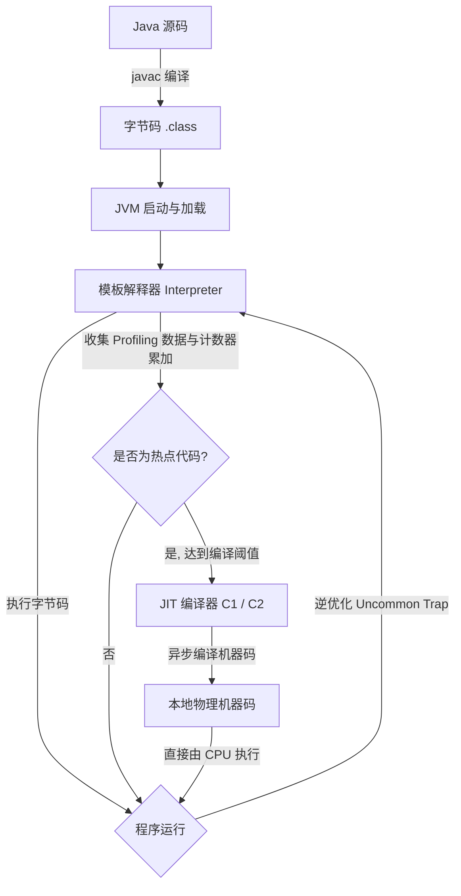
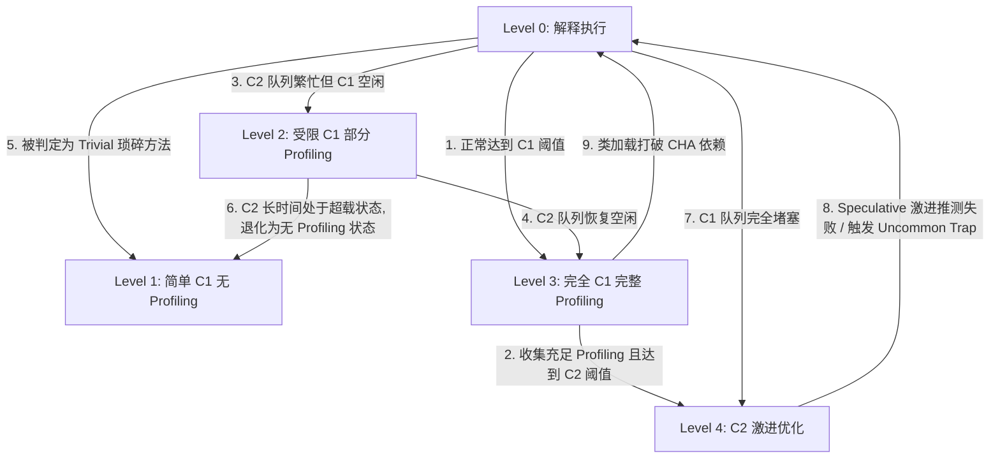
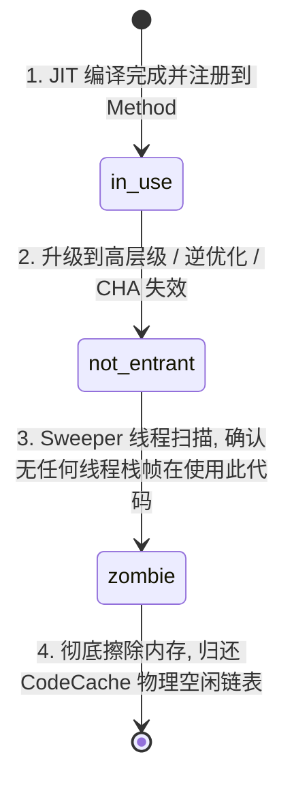

# 2.1.7.3 JIT 即时编译

在 Java 虚拟机（JVM）的执行引擎中，JIT（Just-In-Time）即时编译技术是决定 Java 程序运行期性能的绝对核心。通过将字节码（Bytecode）动态地翻译为底层物理 CPU 能够直接执行的本地机器指令（Native Machine Code），JIT 编译器使得 Java 这一解释型、平台无关的语言在运行期能够逼近、甚至在某些特定场景下超越 C/C++ 等静态编译语言的执行效率。

本文将从物理级视角对 HotSpot 虚拟机中的 JIT 即时编译机制进行深度剖析，深入探究其运行架构、热点探测机制、OSR 栈上替换、分层编译设计、核心编译器优化策略、CodeCache 物理内存管理以及生产环境下的诊断实践。

---

## 1. JIT 即时编译的本质与运行架构

### 1.1 解释器与编译器的混合协同模式（Mixed Mode）

HotSpot 虚拟机采用**混合模式（Mixed Mode）**执行引擎。在 JVM 启动初期，代码首先由**模板解释器（Template Interpreter）**接管。解释器具备“无需等待编译、即刻启动”的天然优势。但为了获得极致的运行期吞吐量，当某些方法或循环体被判定为“热点代码”时，JVM 会将其移交给 **JIT 编译器** 进行编译。



#### 1.1.1 模板解释器（Template Interpreter）的物理设计
与简单的“基于 C++ 编写的大型 `switch-case` 循环”解释器不同，HotSpot 虚拟机的模板解释器是直接由汇编代码构建的。
在虚拟机启动时，JVM 会在内存中动态装配一个“模板表（Template Table）”。这个表为 Java 的 256 个字节码指令中的每一个都关联了一段精简的、与当前物理 CPU 架构（如 x86-64, AArch64）完全匹配的物理汇编代码片段（即模板）。
- **工作机制**：解释器执行字节码时，通过程序计数器（BCI）定位当前字节码，通过查表直接跳转到对应的物理汇编段执行。
- **局限性**：虽然模板解释器极大地减少了字节码分发的开销，但由于其每次只针对单条字节码指令进行映射，它无法跨多条指令进行上下文关联优化，更无法充分利用现代物理 CPU 的海量通用寄存器。所有的操作数和局部变量依然频繁地在内存栈（Java 虚拟栈）中存取，导致大量冗余的内存读写指令（如频繁的栈顶推入、弹出）。

#### 1.1.2 JIT 编译器的工作方式
JIT 编译器是一个全局或局部的编译引擎。它不针对单条指令进行翻译，而是将整个方法或特定的循环体作为一个编译单元（Compilation Unit）进行整体编译。
- **寄存器着色分配（Register Allocation）**：JIT 编译器会通过数据流分析，将高频访问的局部变量和中间计算结果直接映射到物理 CPU 的通用寄存器中（如 x86-64 架构下的 RAX, RBX, RDX, RSI, RDI, R8-R15 等），消除了大部分内存栈访问。
- **控制流图重写（Control Flow Graph Optimization）**：JIT 编译器将字节码构建为控制流图（CFG），在图结构上应用静态单赋值（SSA）形式，从而能够实现如全局值编号（GVN）、死代码消除、循环优化等深层次的代码重构。

### 1.2 执行效率与编译代价的物理权衡

JIT 编译器能够将字节码转化为原生机器码，带来了显著的性能飞跃，但这并非没有代价。JIT 编译在物理层面是一个典型的“空间与时间换取运行期性能”的过程。

| 评估维度 | 模板解释器 (Interpreter) | JIT 编译器 (Compiler) |
| :--- | :--- | :--- |
| **启动延迟（Startup Latency）** | 极低（零预热，直接执行字节码） | 较高（需要等待编译线程完成编译） |
| **执行速度（Execution Speed）** | 中等至较低（高内存访问频率） | 极高（原生机器码，充分利用寄存器和指令并行） |
| **系统算力开销（CPU Overhead）** | 稳定（仅用于执行用户逻辑） | 存在尖峰（编译线程在后台运行，消耗物理核心算力） |
| **内存占用（Memory Footprint）** | 极小（仅存储字节码 and 少量解释器存根） | 较大（需要在本地内存分配 CodeCache 存放机器码及元数据） |

#### 1.2.1 编译线程的算力争抢
在多核 CPU 的服务器环境下，JVM 会启动数个后台编译线程（`CompilerThread`）。当应用启动或发生业务流量洪峰时，大量方法同时变热，编译线程会高负荷运行，抢占 CPU 时间片。如果配置不合理，这会导致应用线程（Worker Thread）的调度被延迟，表现为服务启动初期的“性能抖动”或瞬时响应时间（RT）飙升。

#### 1.2.2 本地内存开销
JIT 编译生成的本地机器码不能存放在 JVM 堆（Heap）中，必须存放在一块称为 **CodeCache（代码缓存）** 的连续本地内存区中。伴随着编译代码的增加，CodeCache 占用的物理内存会持续增长。如果 CodeCache 被填满，JIT 优化将彻底停滞，导致系统退化为纯解释执行。

---

## 2. 热点代码（Hot Spot Code）探测技术

JVM 能够被称为“HotSpot”，其核心就在于它能够精准地在运行期识别出程序中执行频次最高的代码段，并将有限的编译资源集中投向这些“热点代码（Hot Spot Code）”。

### 2.1 探测方法分类与物理设计

业界主流的即时编译器热点探测技术主要分为两大类：

```
                             热点代码探测技术
                                    │
         ┌──────────────────────────┴──────────────────────────┐
         ▼                                                     ▼
 基于采样的探测 (Sample-Based)                          基于计数器的探测 (Counter-Based)
 缺点：安全点阻塞易导致误判                           优点：精准记录，HotSpot JVM采用此方案
 优点：开销极小                                        缺点：需要维护计数器内存，引入插桩开销
```

1. **基于采样的热点探测（Sample-Based Hot Spot Detection）**：
   - 虚拟机周期性地检查各个线程的调用栈顶。如果发现某个方法经常出现在栈顶，就判定该方法为热点方法。
   - **优点**：实现简单，额外开销极小。
   - **缺点**：难以精确得知方法的真实调用次数。当线程发生阻塞（如等待 I/O 或锁）时，其栈顶会长期保持该方法，从而产生严重的“热点误判”；同时，由于垃圾收集等安全点（Safepoint）的限制，采样点分布不均。
2. **基于计数器的热点探测（Counter-Based Hot Spot Detection）**：
   - 虚拟机在方法或循环回边处插入特殊的计数器累加指令，精确统计其运行频次。
   - **优点**：结果极其精准，不受线程阻塞或垃圾收集安全点分布的影响。
   - **缺点**：需要在生成的执行流中注入额外的统计指令，带来轻微的运行开销，且需要为每个方法维护计数器内存结构。
   - **HotSpot 的选择**：为了保证编译决策的绝对可靠，HotSpot 虚拟机采用了**基于计数器的热点探测技术**。

### 2.2 计数器的底层数据结构设计与工作流

在 HotSpot 中，每一个加载的 Java 类在方法区都对应一个 `InstanceKlass`，而类中的每一个方法都用一个结构体 `Method` 表示。为了存储用于 JIT 编译决策的统计信息，JVM 在底层设计了两个重要的关联结构体：
- **`MethodCounters`**：存储方法最基础的执行计数信息，在方法开始变热时创建。
- **`MethodData`（MDO，MethodDataOop）**：存储更详细的 Profiling 信息（如分支跳转率、类型反馈数据），它是触发 C2（或 Graal）高阶优化的基石。

#### 2.2.1 方法调用计数器（Invocation Counter）
- **作用**：记录方法被调用的绝对次数。
- **触发入口**：在解释器执行方法的入口字节码（Method Entry）处，会首先跳转到一段累加 `_invocation_counter` 的汇编代码。
- **物理阈值**：
  - 在 client 模式（C1）下，默认阈值为 **1,500** 次。
  - 在 server 模式（C2）下，默认阈值为 **10,000** 次。
  - 该阈值通过 JVM 启动参数 `-XX:CompileThreshold` 显式控制。

#### 2.2.2 回边计数器（Back Edge Counter）
- **回边（Back Edge）的定义**：在字节码指令流中，控制流向地址低于当前指令的跳转指令（通常是由 `goto`、`if_icmplt` 等构成的循环控制结构）。回边计数器就是用来统计方法体内循环体执行次数的。
- **触发入口**：在解释器执行到循环体的向后跳转指令时，会先跳转到一段累加 `_backedge_counter` 的汇编代码。
- **阈值计算公式**：
  在非分层编译模式下，回边计数器的触发阈值并非直接等于一个固定参数，而是根据 `-XX:CompileThreshold` 和 `-XX:OnStackReplacePercentage` 动态计算得出的。
  - **Client 模式（C1）下的 OSR 阈值**：
    $$\text{Threshold}_{OSR} = \text{CompileThreshold} \times \frac{\text{OnStackReplacePercentage}}{100}$$
    在 Client 模式下，默认 `CompileThreshold = 1500`，`OnStackReplacePercentage = 933`，代入公式：
    $$\text{Threshold}_{OSR} = 1500 \times 9.33 = 13,995 \text{ 次}$$
  - **Server 模式（C2）下的 OSR 阈值**：
    $$\text{Threshold}_{OSR} = \text{CompileThreshold} \times \frac{\text{OnStackReplacePercentage} - \text{InterpreterProfilePercentage}}{100}$$
    在 Server 模式下，默认 `CompileThreshold = 10000`，`OnStackReplacePercentage = 140`，`InterpreterProfilePercentage = 33`，代入公式：
    $$\text{Threshold}_{OSR} = 10000 \times \frac{140 - 33}{100} = 10,700 \text{ 次}$$

### 2.3 计数器热度衰减（Counter Decay）与半衰周期（Half Life Time）

如果方法调用计数器和回边计数器只增不减，那么在系统长期运行的过程中，**所有执行过的 Java 代码最终都会被编译为本地机器码**。这会引发一系列灾难性的物理危机。

#### 2.3.1 没有热度衰减的危机
1. **编译风暴（Compilation Storm）**：
   在系统运行了数天甚至数周后，一些仅在系统初始化阶段执行、或每天仅执行一一次的低频方法（例如特定的配置加载、罕见的异常处理逻辑），其计数器也会以极慢的速度累加到 10,000 次。这会使后台编译队列堆积大量非核心代码的编译请求。
2. **CodeCache 内存耗尽**：
   大量低频代码的机器码长期霸占 CodeCache，导致高频核心业务机器码因 CodeCache 满而被强制退化为解释执行。
3. **性能劣化**：
   大量的机器码导致 JVM 进程的非堆内存占用过高，同时影响了垃圾回收时对方法引用的扫描效率。

#### 2.3.2 热度衰减的底层实现
为了解决上述问题，HotSpot 引入了**计数器热度衰减（Counter Decay）**机制。
- **触发时机**：当 JVM 发生垃圾收集（GC）进入安全点（Safepoint）时，或者由 Watcher 线程发起周期性维护时，虚拟机会调用 `MethodCounters::decay_counters()` 方法对全局所有方法的计数器进行热度削减。
- **衰减算法**：
  计数器值不是线性扣减，而是进行“指数减半”操作。在物理实现上，为了追求极致性能，JVM 通过将计数器值向右移位（如右移 1 位，相当于除以 2）来实现快速半衰：
  $$\text{Counter}_{new} = \text{Counter}_{old} \gg 1$$
- **半衰周期控制**：
  通过 `-XX:CounterHalfLifeTime=n` 调优，默认值为 **120** 秒。即如果一个方法在 120 秒内没有被调用，它的调用计数器值就会衰减为原来的一半。
- **调优参数**：
  - `-XX:+UseCounterDecay`：启用热度衰减（默认开启）。如果将其关闭（`-XX:-UseCounterDecay`），计数器将只增不减。
  - `-XX:CounterHalfLifeTime`：设置半衰周期的长度（单位为秒）。

---

## 3. OSR（On-Stack Replacement）栈上替换机制

普通 JIT 编译是在下一次进入该方法时，跳转到已编译的本地代码。但如果一个方法本身只被调用了一次，而其内部包含一个执行一亿次的巨型循环，如果等到该方法退出、再次被调用时才执行机器码，那么 JIT 的意义将荡然无存。

**OSR（On-Stack Replacement，栈上替换）** 机制正是为了解决这一痛点。它允许在方法处于执行状态中（通常是在循环体内部的某一次迭代时），直接将解释执行的栈帧替换为已经编译完成的本地机器码栈帧，实现程序运行期间的“热插拔”。

### 3.1 OSR 触发与编译核心细节

OSR 的触发完全依赖于回边计数器。其工作流程如下：

1. **阈值溢出**：
   当解释器执行到循环回边字节码（如 `goto`）时，回边计数器累加。一旦计数器值达到 OSR 阈值，解释器立即在该线程上发起一个 OSR 编译请求。
2. **携带 BCI 注册任务**：
   解释器向后台编译队列提交编译请求时，会额外携带当前循环体回边跳转的目标字节码偏移量（BCI，Bytecode Index）。
3. **特定局部编译**：
   编译线程不会从方法的第 0 行字节码（BCI = 0）开始构建机器码，而是以该循环体的入口 BCI（即 OSR Entry Point）为起点构建控制流图。编译器只会将该循环体及其后续能够到达的控制流路径编译成物理机器码。
4. **编译产物挂载**：
   编译完成后生成的机器码被称为 OSR nmethod。它不会被直接挂载在 `Method::_code` 上，而是被挂载在该 `Method` 结构体维护的一个专门的 OSR 链表（`Method::_osr_nmethods_head`）中，并与触发编译的 BCI 强绑定。

### 3.2 物理替换过程（栈帧重构与跳转）

OSR 栈上替换的最核心难点在于**如何在执行中物理重构调用栈帧**。这一过程发生在回边的跳转瞬间，其硬件级执行步骤如下：

```
[解释器栈帧 (Interpreter Frame)]
┌─────────────────────────────────┐
│ Locals (包含变量 a, b)           │
├─────────────────────────────────┤
│ Expression Stack (操作数栈)       │
├─────────────────────────────────┤
│ Sender FP (指向调用者的帧指针)      │ ───┐
└─────────────────────────────────┘    │
                                       │ [OSR 适配器平滑迁移数据]
                                       ▼
[已编译机器码栈帧 (Compiled Frame)]       │
┌─────────────────────────────────┐    │
│ 寄存器分配 (RDI=a, R12=b)        │ ◄───┘
├─────────────────────────────────┤
│ 机器码栈槽偏移量 [RBP - 0x10]     │
├─────────────────────────────────┤
│ Sender FP (指向调用者的帧指针)      │
└─────────────────────────────────┘
```

1. **暂停解释执行并捕获上下文**：
   当解释器下一次循环迭代回到该 BCI 时，检测到 OSR 链表中存在匹配该 BCI 的 OSR nmethod。解释器暂停字节码分发，进入 OSR 栈帧重建模块。
   此时，解释器栈帧中包含有：
   - 局部变量表（Locals）中的所有活跃变量。
   - 操作数栈（Expression Stack）中的临时值。
   - 指向调用者栈帧的帧指针（Sender FP）。
2. **提取作用域描述符（Scope Descriptor）**：
   JIT 编译器在生成 OSR 机器码时，会同步输出一份描述元数据——**作用域描述符（ScopeDesc）**。ScopeDesc 记录了在当前 BCI 处，解释器局部变量表中的第 $i$ 个 Slot 对应物理机器码中的哪一个 CPU 寄存器，或者对应物理编译栈帧中的哪一个栈偏移位置。
3. **分配物理编译栈帧并解包（Unpacking）**：
   JVM 在线程的物理调用栈上分配一个新的编译栈帧（Compiled Frame）。
   栈帧重建器执行“解包（Unpacking）”和“封包（Packing）”：
   - 读取解释器栈帧局部变量表中的值。
   - 依据 ScopeDesc 的映射，将这些值写入对应的 CPU 寄存器（例如，将原局部变量 1 的值写入 `RDI` 寄存器，变量 2 的值写入 `R12` 寄存器）。
   - 将其余无法放入寄存器的变量，写入新编译栈帧指定的栈偏移位置（如 `[RBP - 0x10]`）。
4. **栈帧物理替换（Frame Pointer Relinking）**：
   修改物理调用栈的链接。将原解释器栈帧从栈中弹出（Pop），同时将新重构的编译栈帧压入（Push），并将其 `Sender FP` 重新链接到原调用者的栈帧上。
5. **控制权移交与寄存器恢复**：
   将 CPU 的程序计数器（RIP 寄存器）修改为该 OSR nmethod 的机器码物理起始入口地址。
   恢复线程运行。此时，CPU 直接读取已填入初始值的物理寄存器，从循环体的下一次迭代处开始直接执行本地机器指令。

### 3.3 普通 JIT 编译与 OSR 编译的物理对比

| 物理特性 | 普通 JIT 编译 | OSR 栈上替换编译 |
| :--- | :--- | :--- |
| **触发计数器** | 方法调用计数器（为主）或两者之和 | 循环体回边计数器（为主） |
| **编译起点（BCI）** | 方法的起始位置（BCI = 0） | 方法内部循环回边的目的地（BCI > 0） |
| **编译范围** | 整个方法体及内联的方法 | 仅包含触发 OSR 的循环体及下游分支 |
| **调用协议（Calling Convention）** | 遵守标准的 ABI 传参协议（通过寄存器传参） | 不遵守标准调用协议，通过 ScopeDesc 动态拷贝栈与寄存器 |
| **栈帧转换时机** | 在方法被发起调用时，直接压入编译栈帧 | 在方法执行的生命周期中，动态在栈上销毁解释器栈帧并重建编译栈帧 |
| **挂载位置** | `Method::_code` 指针 | `Method::_osr_nmethods_head` 链表 |

---

## 4. 分层编译（Tiered Compilation）5个层级的深度解剖

早期的 HotSpot 虚拟机中，用户必须在 `-client`（使用编译极快的 C1 编译器）和 `-server`（使用编译较慢但优化极度的 C2 编译器）之间做出二选一的抉择。
为了兼顾 Java 程序的**启动预热速度**与**长期运行的巅峰性能**，JVM 在 JDK 7 中引入并在 JDK 8 中默认开启了**分层编译（Tiered Compilation）**机制。

### 4.1 分层编译的 5 个层级定义

分层编译将 JVM 执行引擎划分为 5 个逻辑和物理层级（Level 0 至 Level 4）：

```
                    分层编译的 5 个物理层级
                      ┌────────────────┐
                      │  Level 4 (C2)  │  ◄── 终阶激进优化（Sea-of-Nodes，逃逸分析）
                      └───────▲────────┘
                              │
                      ┌───────┴────────┐
                      │  Level 3 (C1)  │  ◄── 完全 C1 编译（插入完整 Profiling 插桩）
                      └───────▲────────┘
                              │
                      ┌───────┴────────┐
                      │  Level 2 (C1)  │  ◄── 受限 C1 编译（C2繁忙时的缓冲，部分Profiling）
                      └───────▲────────┘
                              │
                      ┌───────┴────────┐
                      │  Level 1 (C1)  │  ◄── 简单 C1 编译（无 Profiling，琐碎方法终点）
                      └───────▲────────┘
                              │
                      ┌───────┴────────┐
                      │  Level 0 (Inter)│ ◄── 纯模板解释执行（收集基础计数器）
                      └────────────────┘
```

- **Level 0：Interpreter（解释执行）**：
  - **物理行为**：程序由模板解释器执行。
  - **任务**：执行字节码；为每个方法初始化 `MethodCounters` 与 `MethodData`；统计方法调用和回边；在方法达到一定热度时，开始收集基础 Profiling 数据。
- **Level 1：Simple C1（简单 C1 编译，无 Profiling）**：
  - **物理行为**：将字节码编译为本地机器码，但在生成的机器码中**不插入任何 Profiling 收集代码**。
  - **执行效率**：代码执行效率较高，且由于没有 Profiling 的内存读写开销，其运行极其稳定。
  - **适用场景**：琐碎方法（Trivial Methods），或者在 C2 编译队列极度拥堵时，用来作为临时的高速执行体。
- **Level 2：Limited C1（受限 C1 编译，带部分 Profiling）**：
  - **物理行为**：将字节码编译为机器码，仅插入统计方法调用计数和回边计数的轻量 Profiling 插桩。
  - **适用场景**：当 C2 编译队列积压时，作为 Level 0 到 Level 3 的过渡缓冲，避免完全解释执行造成的性能暴跌。
- **Level 3：Full C1（完全 C1 编译，带完整 Profiling）**：
  - **物理行为**：将字节码编译为本地机器码，并在机器码的关键跳转和调用点**插入完整的 Profiling 探测器（Profiling Sensors）**。
  - **收集的数据**：
    - 虚调用点的实际类型分布（Receiver Type Feedback，用于去虚化）。
    - 条件跳转分支的实际走向概率（Branch Probability Data）。
    - 隐式异常与显式异常的发生频率。
  - **执行效率**：由于包含大量向 MDO 写入统计数据的内存写入操作，执行速度比 Level 1 慢 10%~30%，但能为 Level 4 提供至关重要的动态运行特征。
- **Level 4：C2（最激进优化，Server Compiler）**：
  - **物理行为**：完全基于 Level 3 收集的 Profiling 数据，进行极度激进的全局优化，生成巅峰执行效率的本地机器指令。
  - **核心技术**：逃逸分析、标量替换、同步锁消除、循环向量化等。

---

### 4.2 分层编译状态跃迁转移图

在分层编译环境下，一个方法在运行期绝非单调地从 Level 0 逐层升级，而是会根据方法特征和系统编译队列负载，在各个层级间发生复杂的跃迁。



---

### 4.3 状态跃迁判定逻辑与数学公式

在 HotSpot 的 `AdvancedThresholdPolicy` 模块中，层级跃迁的核心在于控制因子的动态计算。

#### 4.3.1 动态控制因子 $Scale$
为了防止系统在编译队列积压时依然盲目提交编译请求，JVM 引入了动态缩放因子 $Scale$，用以根据编译队列的长度弹性调节阈值：
$$Scale = \frac{\text{CompileQueue::length()}}{\text{CompilerThreads} \times \text{TierXLoadFeedback}}$$
- 当编译队列（`CompileQueue`）堆积时，$Scale$ 大于 1，编译阈值随之被放大，延迟不紧急的编译。
- 当队列空闲时，$Scale$ 趋于 0，阈值被缩小，加速编译。

#### 4.3.2 跃迁判定公式
设方法在 Level 0 或 Level 3 运行期间，其调用计数器为 $i$，回边计数器为 $b$。

##### 1. 进入 Level 3 (完全 C1) 的判定逻辑
方法必须满足以下两组条件之一，才会从解释执行升级到 Level 3：
- **条件 A：单纯调用次数溢出**
  $$i > \text{Tier3InvocationThreshold} \times Scale$$
  （其中，默认 `Tier3InvocationThreshold = 200`）
- **条件 B：调用与回边综合溢出**
  $$i > \text{Tier3MinInvocationThreshold} \times Scale \quad \text{且} \quad (i + b) > \text{Tier3CompileThreshold} \times Scale$$
  （其中，默认 `Tier3MinInvocationThreshold = 100`，`Tier3CompileThreshold = 2,000`）

##### 2. 进入 Level 4 (C2) 的判定逻辑
当方法在 Level 3 运行，并不断将 Profiling 信息录入 `MethodData` 中时，若满足以下两组条件之一，则会向 C2 编译器发起编译任务：
- **条件 A：单纯调用次数溢出**
  $$i > \text{Tier4InvocationThreshold} \times Scale$$
  （其中，默认 `Tier4InvocationThreshold = 5,000`）
- **条件 B：调用与回边综合溢出**
  $$i > \text{Tier4MinInvocationThreshold} \times Scale \quad \text{且} \quad (i + b) > \text{Tier4CompileThreshold} \times Scale$$
  （其中，默认 `Tier4MinInvocationThreshold = 600`，`Tier4CompileThreshold = 15,000`）

##### 3. 判定进入 Level 1 (简单 C1) 的琐碎方法逻辑
当方法字节码长度极短（`Method::code_size() < MaxTrivialSize`，默认 6 字节，例如简单的 Getter/Setter），或者方法内没有任何循环结构且长度小于 `TrivialMethodSize`，JVM 会判定其无进行 C2 高阶优化的必要。
该方法会被直接派发至 Level 1（Simple C1），生成机器码后即终止状态跃迁，永远不会升级到 Level 4。这极大节省了 C2 的编译排队资源。

---

## 5. 即时编译器的核心优化技术概述

JIT 编译器生成的本地机器码之所以能够展现出媲美、甚至超越静态编译的性能，完全得益于其在运行期拥有的“全局动态上下文”所支持的激进优化。

### 5.1 类型反馈（Type Feedback）与去虚化（Devirtualization）

在 Java 语言中，一切非私有、非静态、非 final 的方法调用在字节码层面都是虚调用（对于类实例方法对应 `invokevirtual`，对于接口方法对应 `invokeinterface`）。
虚调用在物理执行时，必须根据对象的实际类型，在运行期查找**虚方法表（vtable）**或**接口方法表（itable）**，获取目标函数的物理内存地址后再执行跳转（Indirect Jump）。
这带来了两大物理性能杀手：
1. **跳转开销**：间接跳转会导致 CPU 的分支预测器（Branch Predictor）频繁失效，导致流水线气泡。
2. **方法内联壁垒**：由于无法在编译期确定调用者的真实类型，编译器无法对虚调用点执行**方法内联（Method Inlining）**。

JIT 编译器通过**类型反馈（Type Feedback）**打破了这一壁垒。

#### 5.1.1 虚调用点的三种状态
当方法在 Level 3 运行阶段时，Profiling 探测器在每个虚调用点记录传入对象的实际 `klass`。经过一段时间的运行，调用点会被归类为以下三种状态之一：
1. **单态（Monomorphic）**：在该调用点上，实际传入的对象 100% 都是同一种具体类型 $T_1$。
2. **双态（Bimorphic）**：在该调用点上，实际传入的对象只出现过两种具体类型 $T_1$ 和 $T_2$。
3. **巨态（Megamorphic）**：在该调用点上，传入了三种及以上不同的具体类型。

```
              虚调用点 (Call Site) 运行期类型统计
                              │
         ┌────────────────────┼────────────────────┐
         ▼                    ▼                    ▼
     单态 (Monomorphic)    双态 (Bimorphic)      巨态 (Megamorphic)
     比例：100% 为 T1      比例：仅有 T1 / T2    比例：存在三种及以上子类
         │                    │                    │
         ▼                    ▼                    ▼
  守卫内联 (Guard Inline) 双守卫内联 (Double Guard) 退化虚分派 (Vtable lookup)
```

#### 5.1.2 守卫式内联与去虚化
对于单态调用点，C2 编译器会实施激进的去虚化，并执行**守卫式内联（Guarded Inline）**。它将原本需要查表的虚分派直接改写为直接调用并合并代码，但在合并后的机器码头部埋设一个快速的类检查守卫：
```c++
// 物理编译后的机器码逻辑表达
if (obj->_klass == ArrayList::_klass) {
    // 消除方法调用，直接执行 ArrayList::size() 的内联机器码
    int r = obj->size_field; 
} else {
    // 慢速路径：触发逆优化，回退到解释器去处理非预期的类型
    uncommon_trap(); 
}
```
同理，对于双态调用点，编译器会生成包含两个分支的类型判断守卫，分别将两个子类的方法体予以双重内联。

#### 5.1.3 类层次分析（CHA，Class Hierarchy Analysis）
如果 JIT 编译器在编译时，通过分析当前 JVM 已经加载的全部类元数据，发现某个接口或抽象类**目前有且仅有一个**加载的子类实现。
此时，C2 编译器会实施更彻底的优化：**直接取消 `if` 类检查守卫**，进行无条件内联。
But JVM 会在方法区中为该机器码注册一个**依赖关系（Dependency）**。一旦在后续运行中，用户通过动态类加载（如 `Class.forName()`）引入了该接口的第二个实现类，JVM 会在安全点上立即废弃（Invalidate）这个机器码，并通过下文的逆优化机制，强行将执行线程从该机器码中“营救”出来，退回解释器重新运行。

---

### 5.2 逆优化（Deoptimization）与推测性优化

C2 编译器采用的是**推测性优化（Speculative Optimization）**。基于“过去发生的事情，在未来大概率会继续发生”的物理经验假设，它生成的高度优化机器码中省略了大量常规的安全路径和冗余检查。
- 例如：如果过去一万次运行中，某个参数的值从未为 `null`，C2 在编译该方法时会推测未来也不会为 `null`，从而直接把机器码中的 `NullPointerException` 抛出分支彻底裁剪掉。

一旦这个假设在某次执行中被打破（例如，突然传入了 `null`，或者传入了 CHA 预料之外的全新实现类），CPU 就会执行到机器码中的 Uncommon Trap 陷阱指令，必须立即实施**逆优化（Deoptimization）**。

#### 5.2.1 逆优化的物理级回退步骤
逆优化是 JVM 中最复杂的机制之一，它要求在物理调用栈上“无损还原”解释器的状态。

```
[步骤 1: 触发 Uncommon Trap]
CPU 执行机器码，Guard 校验失败，跳转至 Uncommon Trap Handler。
                     │
                     ▼
[步骤 2: 挂起线程与堆栈扫描]
暂停该线程，读取 ScopeDesc 元数据，锁定寄存器及机器栈槽状态。
                     │
                     ▼
[步骤 3: 逆向标量替换与堆分配]
若有被逃逸分析标量替换的对象，在 Heap 上重新实例化并还原字段。
                     │
                     ▼
[步骤 4: 重构多层内联解释器帧]
将单一机器码栈帧拆解，在栈上重建出多层相对应的 Interpreter 栈帧。
                     │
                     ▼
[步骤 5: 控制权移交与重定向]
将物理 PC 指针指向触发 Trap 的字节码 BCI，恢复解释执行。
```

1. **Uncommon Trap 拦截**：
   当激进假设失败，控制流跳转至 `Uncommon Trap Handler` 存根代码，当前线程被挂起。
2. **分析 ScopeDesc 与 OopMap**：
   逆优化器读取该机器码对应的 `ScopeDesc`（作用域描述符）和 `OopMap`。`OopMap` 记录了当前安全点上哪些物理寄存器中存放的是对象的引用，防止这些对象在栈重构期间被垃圾回收。
3. **逆向标量替换（Scalar Replacement Rollback）**：
   如果在编译时，C2 通过逃逸分析（Escape Analysis）确认某对象未逃逸，并对其进行了**标量替换**（即物理上没有在堆内存中分配该对象，而是将其字段打散存放在物理寄存器中）。
   现在要回退到解释执行，解释器必须在堆上看到一个真实的对象实体。因此，逆优化器会在 JVM 堆（Heap）中**重新为该对象分配物理内存并实例化**，将寄存器中暂存的字段值重新写入该对象的堆内存中，并在重建的栈帧中建立正确的对象引用。
4. **重建多层解释器栈帧（Stack Frame Deconstruction）**：
   如果在 C2 编译时，方法 A 内联了方法 B，方法 B 又内联了方法 C，在物理上它们只占用一个 C2 物理栈帧。
   逆优化器会像拼图一样，根据 `ScopeDesc` 记录的各层变量状态，在物理栈上分配三个独立的解释器栈帧，将寄存器和栈偏移中的值还原到这三个帧的局部变量表和操作数栈中。
5. **PC 指针重定向**：
   将新构筑的解释器帧链压入物理调用栈，把 CPU 的 RIP 寄存器重定向到解释器的字节码分发入口，指向引发 Trap 时的字节码 BCI。
   线程恢复运行，对用户业务无感地完成了“在线降级”。被废弃的旧机器码会被标记为 `not_entrant`（非可进入）。

---

## 6. 代码缓存（CodeCache）的物理管理

JIT 编译器生成的机器指令不能随意堆放，它们由一块独立的、物理连续的本地内存区域——**CodeCache（代码缓存）**进行统一管理。

### 6.1 CodeCache 的作用与内部物理分区

在早期的 JVM 中，整个 CodeCache 是一个单一的连续内存块。伴随着长期的运行，频繁的编译、废弃和回收会导致内存空间产生大量的碎片。

#### 6.1.1 分段代码缓存（Segmented CodeCache，JDK 9+）
为了彻底解决碎片化问题并提升 GC 扫描效率，HotSpot 将 CodeCache 物理划分为三个独立的 Heap 区域：

```
                    CodeCache 物理分段结构 (Segmented CodeCache)
 ┌─────────────────────────┬─────────────────────────┬─────────────────────────┐
 │   non-nmethods Heap     │ profiled nmethods Heap  │non-profiled nmethods Heap│
 ├─────────────────────────┼─────────────────────────┼─────────────────────────┤
 │ 存放 JVM 内部代码      │ 存放 Level 2 / 3 C1    │ 存放 Level 1 C1 和      │
 │ 适配器、解释器存根等    │ 编译的带 Profiling 代码 │ Level 4 C2 激进优化代码  │
 ├─────────────────────────┼─────────────────────────┼─────────────────────────┤
 │ 静态，生命周期极长      │ 生命周期短，频繁申请释放 │ 生命周期极长，长期稳定  │
 └─────────────────────────┴─────────────────────────┴─────────────────────────┘
```

1. **`non-nmethods Heap`**：
   - **存放内容**：JVM 内部所需的非编译代码段，包括编译器本身的缓冲区、运行时存根（Runtime Stubs）、JNI 桥接适配器、以及模板解释器的汇编段。
   - **特性**：容量较小且几乎是完全静态的，生命周期极长，不会发生频繁的内存释放。
2. **`profiled nmethods Heap`**：
   - **存放内容**：带有 Profiling 插桩的轻度优化机器码（主要是 Level 2 和 Level 3 的 C1 编译产物）。
   - **特性**：生命周期相对短暂。当代码变热升级到 Level 4，或者因为逆优化退级时，这部分内存会被频繁申请和释放，是内存碎片的“重灾区”。
3. **`non-profiled nmethods Heap`**：
   - **存放内容**：不包含 Profiling 信息的重度优化机器码（主要是 Level 1 的 C1 产物和 Level 4 的 C2 巅峰优化产物）。
   - **特性**：一旦编译成功，会在此区域长期稳定驻留，生命周期极长。

---

### 6.2 Code Cache is Full（内存耗尽）的系统危机

如果 JVM 的 CodeCache 物理容量被耗尽（例如，由于应用频繁地使用 CGLIB 动态代理生成新类、运行动态 Groovy 脚本，或者将 `ReservedCodeCacheSize` 设置得过小），JVM 就会在标准输出中抛出灾难性的警告：
`VM warning: CodeCache is full. Compiler has been disabled.`

#### 6.2.1 物理危机剖析
当 CodeCache is full 发生时：
1. **即时编译器关闭**：JVM 会彻底挂起所有的 `CompilerThread` 编译线程。不再接收任何新的编译任务，停止对后续所有热点代码进行优化。
2. **性能断崖式下跌**：由于新变热的代码、以及之前被标记为 `not_entrant` 进行重构的代码，无法再次被编译，它们只能永远在解释器中以 Level 0 运行。系统吞吐量可能会瞬间跌落 50%~90%，CPU 占用率飙升至 100%（因为 CPU 需要消耗数倍的周期去执行解释器代码）。
3. **无法自我恢复**：在一些旧版本的 HotSpot 虚拟机中，即使开启了 CodeCache Flushing（冲刷机制），一旦 JIT 状态机被变更为 Disabled，即便后来通过 Sweeper 清理出了一部分可用空间，JIT 编译也无法被自动激活，除非重启整个 JVM 进程。

---

### 6.3 调优参数详解

为了防止 CodeCache 溢出并最大化 JIT 执行效率，应熟练掌握以下核心调优参数：

- **`-XX:InitialCodeCacheSize`**：
  - 初始 CodeCache 物理大小。默认通常为 2.4MB。在微服务等要求快速预热上线的系统里，可以适当调大（如 `64m`），避免频繁进行物理内存申请和扩展带来的开销。
- **`-XX:ReservedCodeCacheSize`**：
  - 最大保留 CodeCache 物理大小。在 x86-64 的 Server 模式下，默认一般是 240MB。如果应用大量运用了 Spring 动态代理、大量的 AOP 拦截器、Groovy 动态执行引擎、或者在类加载器中频繁动态定义新类，建议将其调大到 `512m` 甚至 `1024m`。
- **`-XX:CodeCacheExpansionSize`**：
  - CodeCache 每次物理扩展时的步长，默认通常是 32KB 或 64KB。
- **`-XX:+UseCodeCacheFlushing`**：
  - 启用 CodeCache 空间冲刷清理机制（默认开启）。
  - 当 CodeCache 空间使用率达到临界阈值（例如 95%）时，JVM 会强行唤醒后台 Sweeper 线程，开始识别并标记系统中的冷代码，将 `not_entrant` 状态的代码强制修改为 `zombie` 并回收物理内存，以防止编译器被彻底 Disabled。

---

## 7. 诊断实践与生命周期演变

在生产环境或压测阶段，开发人员需要对 JIT 编译器的运行行为、编译频率以及编译失效进行深度洞察。

### 7.1 核心诊断参数

- **`-XX:+TieredCompilation`**：
  - 显式开启分层编译（默认开启）。如果将其关闭（`-XX:-TieredCompilation`），JVM 会退化为纯解释器与单一编译器运行模式。
- **`-XX:+PrintCompilation`**：
  - 在控制台或运行日志中实时打印 JIT 编译信息。这是监控 JIT 行为最直观、最常用的非侵入式诊断手段。
- **`-XX:+PrintAssembly`**：
  - 输出 JIT 编译生成的本地物理汇编代码（包括指令寻址、寄存器使用以及 Uncommon Trap 陷阱位置）。
  - **重要前提**：使用此参数时，必须在 JVM 安装路径的 `lib/server/`（或对应平台目录）下手动放置名为 **`hsdis`（HotSpot Disassembler）** 的反汇编动态链接库插件（例如 `hsdis-amd64.so` 或 `hsdis-amd64.dylib`）。否则 JVM 启动时会报错提示无法加载反汇编器。

---

### 7.2 PrintCompilation 日志字段深度解析

当开启 `-XX:+PrintCompilation` 后，标准输出中会源源不断地打印出类似下方的诊断日志。我们来对其进行逐字段的深度解析：

```
5120   123     3       java.lang.String::hashCode (55 bytes)
5125   124  %  4       com.example.HeavyLoop::run @ 4 (120 bytes)
5128   125   s ! 3     com.example.SyncTest::compute (45 bytes)
5135   123     3       java.lang.String::hashCode (55 bytes)   made not entrant
5150   126     4       java.lang.String::hashCode (55 bytes)
5180   123     3       java.lang.String::hashCode (55 bytes)   made zombie
```

#### 7.2.1 日志输出字段说明
1. **时间戳（第一列，如 `5120`）**：
   - 物理含义：从 JVM 启动至该行编译任务执行完成，所历经的相对时间（单位：毫秒）。
2. **编译任务 ID（第二列，如 `123`, `124`）**：
   - 物理含义：JVM 内部 JIT 编译器分配的唯一递增的任务序列号。
3. **属性标记区（第三列，包含 `%`、`s`、`!` 等符号，预留五个字符宽度）**：
   - **`%`（百分号）**：**代表这是一个 OSR（栈上替换）编译**。例如第 2 行的 `com.example.HeavyLoop::run`，它是由于循环回边溢出触发的 OSR 编译，其编译入口点在字节码偏移量 `@ 4`（BCI = 4）处。
   - **`s`（字母 s）**：代表被编译的方法被关键字 `synchronized` 修饰。
   - **`!`（叹号）**：代表该方法内部包含异常处理程序（即 try-catch 异常控制流结构）。
   - **`b`（字母 b）**：代表该编译任务是在“阻塞（Blocking）”模式下执行的。即调用线程在解释器中被强行挂起，必须等待 JIT 编译器把机器码搞定才能继续运行（通常发生在分层编译关闭或同步编译参数开启时）。
   - **`n`（字母 n）**：代表这是 JVM 为一个本地方法（Native Method）生成的快速 JNI 适配器包装存根（Native Method Wrapper）。
4. **编译层级（第四列，如 `3`, `4`）**：
   - 物理含义：当前任务对应的编译目标层级（0 ~ 4）。
   - `3` 代表编译进入 Level 3（完全 C1，带 Profiling 插桩）。
   - `4` 代表编译进入 Level 4（C2 巅峰优化）。
5. **方法全限定名与元数据（第五列）**：
   - 例如 `java.lang.String::hashCode (55 bytes)`：显示被编译的目标类和方法，括号内的 `(55 bytes)` 指的是**该方法的原始 Java 字节码大小**（注意：绝对不是指编译出来的物理机器指令的大小）。

#### 7.2.2 机器码生命周期变更诊断
- **`made not entrant`（非可进入）**：
  - 例如日志第 4 行，任务 123（原本在 Level 3 编译的方法）在 5135 毫秒时被标记为了 `made not entrant`。
  - **原因**：String::hashCode 被 C2 编译器重新编译到了 Level 4（任务 126）。原本在 Level 3 编译的机器码不再被允许新进入执行。
- **`made zombie`（僵尸化）**：
  - 例如日志第 6 行，任务 123 编译的旧代码在 5180 毫秒时被标记为 `made zombie`。
  - **原因**：Sweeper 线程扫描证实，当前系统中所有活动线程栈帧中，已经没有任何一处还残留有任务 123 生成的旧机器码返回地址。这块物理内存正式被彻底宣告死亡，予以释放。

---

### 7.3 nmethod 的生命周期状态转变与 GC/Sweeper 回收

编译完成的本地机器码（在 JVM 源码中称为 `nmethod` 实例）在物理内存中有着极其严密的状态转移控制。



#### 7.3.1 为什么不能直接释放物理内存？
在多线程高并发环境下，当一个机器码因为逆优化或类加载被废弃时，极有可能某些线程（Worker Thread）的物理调用栈中，正压着该方法的栈帧，甚至当前程序计数器就停在这个机器码的某条汇编指令上。
如果 JVM 简单粗暴地立即释放这块物理内存，这些正在执行的线程将在下一个 CPU 时钟周期访问到非法物理地址，直接引发操作系统的**段错误（Segmentation Fault / SIGSEGV）**，导致 Java 进程崩溃退出。

#### 7.3.2 机器码的四个物理生命周期状态

1. **`in_use`（活跃中）**：
   - 机器码正常挂载在 `Method` 结构体入口上。所有的线程发起对该方法的调用时，都会直接执行这段机器指令。
2. **`not_entrant`（非可进入）**：
   - **发生诱因**：
     - **更优替代**：方法从 Level 3 升级至 Level 4，旧的 Level 3 机器码被废弃。
     - **逆优化触发**：Uncommon Trap 校验失败，机器码失效。
     - **CHA 被打破**：类加载器动态加载了新的实现类，CHA 假设崩塌，所有受其影响稀少的分支内联机器码在安全点（Safepoint）被全部置为失效。
   - **物理状态**：
     - JVM 会通过原子操作（Atomic Swap）重写该方法的物理入口地址，将其指向模板解释器或新编译机器码的入口。
     - 此时，**任何新发起的方法调用都不会再跳转到该 `nmethod`**。
     - **但存量线程可以继续执行**：已经进入该机器码内部执行的线程允许继续在旧栈帧里运行，直至其返回（Return）或退出该方法。
3. **`zombie`（僵尸化）**：
   - **判定过程**：
     - 后台的 CodeCache Sweeper 线程会周期性地遍历系统内所有活动线程的物理调用栈，检索每一个栈帧中的 Instruction Pointer（如 RIP）。
     - 当 Sweeper 线程确认，**没有任何一个线程的调用栈中还保留着该 `not_entrant` 机器码的返回地址**时，就意味着它的所有历史执行任务已彻底完结。
     - Sweeper 会通过原子操作将该 `nmethod` 的状态置为 `zombie`。
4. **`reclaimed`（物理回收）**：
   - 机器码状态转为 `zombie` 后，Sweeper 线程会彻底擦除该机器码在 CodeCache 中的元数据，清空关联的 OopMap 和 ScopeDesc。
   - 将这块物理内存合并回 CodeCache Heap 对应的空闲块链表（Free List）中，以备下一个编译任务重新申请使用。
