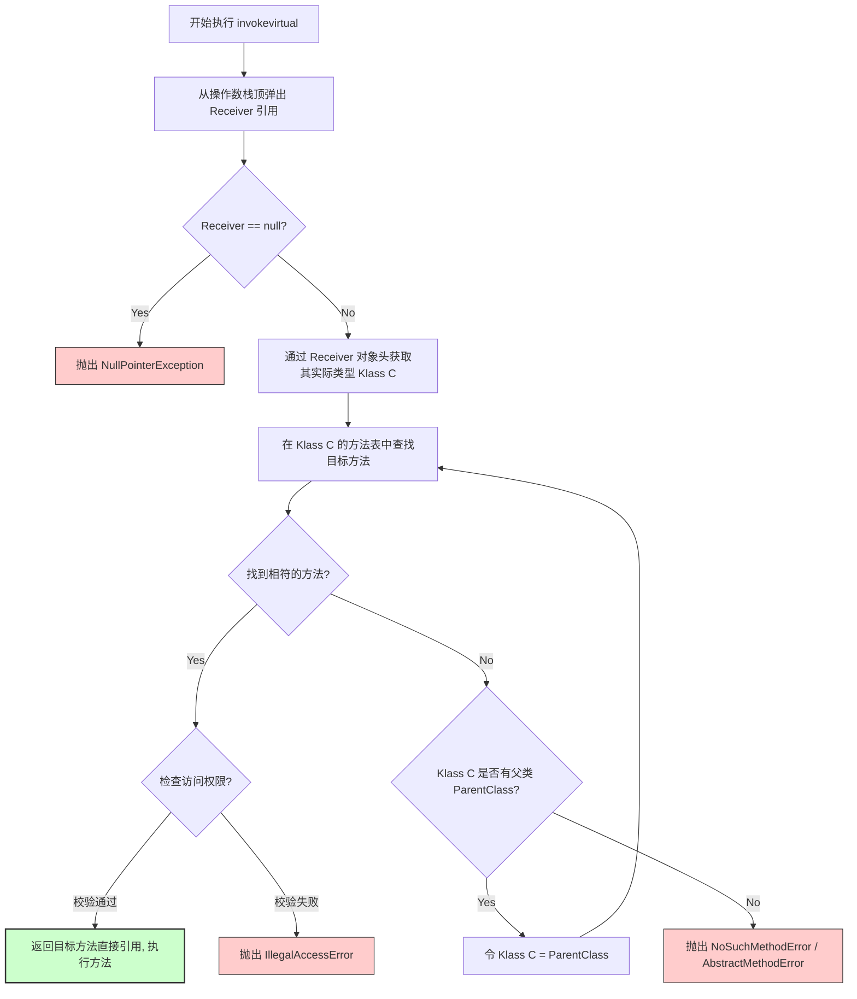
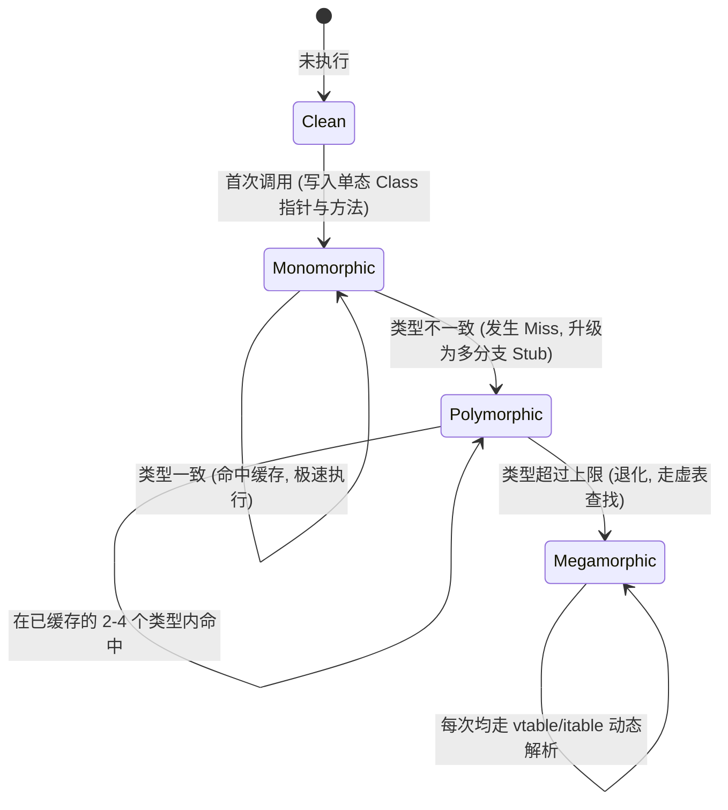
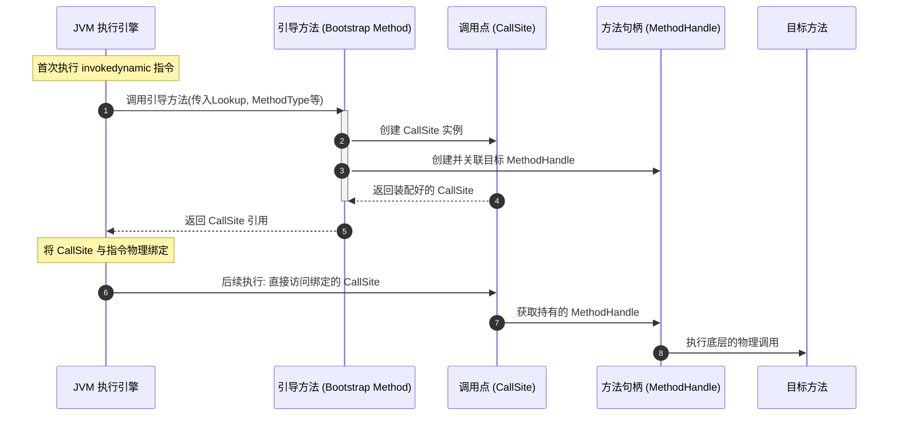

# JVM方法执行深度剖析：从字节码指令到物理内存布局与JIT优化黑科技

在 Java 虚拟机（JVM）的运行时体系中，方法执行是其最为核心的功能之一。Java 语言所具有的多态、重载、重写、接口多实现以及动态类型等特性，在底层都依赖于 JVM 方法执行引擎的精妙设计。与传统的编译型语言（如 C++）在编译期即确定大部分函数调用地址不同，JVM 为了支持动态链接和类加载机制，在编译期仅在 Class 文件的字节码中保留了方法的**符号引用（Symbolic Reference）**。在类加载阶段甚至在运行期，这些符号引用才会被解析并绑定为**直接引用（Direct Reference）**。

本文将从物理实现与底层机理的视角，深度剖析 JVM 方法执行引擎的微观运作细节，揭示从字节码指令设计、重载与重写分派、虚表/接口表的内存布局，到 JIT 编译器的黑科技优化以及 `invokedynamic` 动态绑定的全景图谱。

---

## 一、 JVM 方法调用字节码指令体系

JVM 的指令集中，用于方法调用的指令共有 5 条，它们各司其职，从指令层级定义了方法调用的不同语义和解析规则。

### 1.1 五大方法调用指令的定义与物理行为

| 字节码指令 | 物理定位与行为定义 | 绑定机制 | 查找与绑定时机 |
| :--- | :--- | :--- | :--- |
| **`invokestatic`** | 调用静态方法（`static` 修饰的方法）。 | 静态绑定 | 编译期确定，类加载解析阶段绑定。 |
| **`invokespecial`** | 调用需要特殊处理的实例方法，包括实例初始化方法 `<init>`、私有方法（`private`）以及通过 `super` 关键字调用的父类方法。 | 静态绑定 | 编译期确定，类加载解析阶段绑定。 |
| **`invokevirtual`** | 调用所有的虚方法，即普通的、非私有、非静态、非 final 的实例方法。这是 Java 多态的核心指令。 | 动态绑定 | 运行期根据实际类型进行动态查找。 |
| **`invokeinterface`** | 调用接口方法。在运行时会搜索实现该接口的对象的具体方法进行调用。 | 动态绑定 | 运行期基于接收者实际类型动态查找。 |
| **`invokedynamic`** | 动态调用指令。在运行时通过引导方法（Bootstrap Method, BSM）动态解析出实际的调用点（CallSite），然后执行绑定。 | 动态绑定 | 运行期首次执行时由引导方法动态绑定。 |

### 1.2 静态绑定与动态绑定的物理区别

方法调用在底层的本质是将方法的符号引用转换为物理内存中的直接引用（如方法入口的内存指针或偏移量）。根据转换发生的时间节点不同，可以分为**静态绑定**与**动态绑定**。

#### 1. 静态绑定（Static Binding / Early Binding）
静态绑定是指在程序运行之前（通常在类加载的**解析（Resolution）阶段**），JVM 就已经能够确定唯一的目标方法，并将字节码中的符号引用直接替换为指向目标方法元数据的直接引用。
*   **适用对象**：静态方法、私有方法、实例构造器 `<init>`、父类方法以及 `final` 方法。
*   **物理特征**：这些方法在运行期间是“不可变的”，不存在子类覆写的可能性。因此，JVM 不需要根据运行时的实际对象类型来寻址，可以直接跳转到目标方法的物理内存地址。

#### 2. 动态绑定（Dynamic Binding / Late Binding）
动态绑定是指在程序运行期间，根据接收者对象（Receiver）的**实际类型（Actual Type）**来确定最终调用的直接引用。
*   **适用对象**：除了非虚方法之外的普通实例方法（由 `invokevirtual` 或 `invokeinterface` 调用的方法）。
*   **物理特征**：在编译期，编译器仅知道接收者的**静态类型（Static Type）**，无法得知其运行时类型。在运行时，JVM 每次执行该指令时，都必须从操作数栈顶获取对象的实际引用，并顺着对象的 Klass 结构（元数据）查找具体的方法实现。

### 1.3 解析（Resolution）与分派（Dispatch）的物理区别

在 JVM 规范中，“解析”与“分派”是两个处于不同维度的概念：

*   **解析（Resolution）**：是类加载过程中的一个特定步骤。在这个阶段，JVM 将常量池（Constant Pool）中的符号引用（如 `CONSTANT_Methodref_info` 与 `CONSTANT_InterfaceMethodref_info`）替换为直接引用。解析是确定性的，它针对的是在编译期就完全确定、且在运行期不会发生改变的方法（即非虚方法）。
    *   *类方法解析*：当解析一个非接口类的方法时，JVM 首先在其所属类中查找匹配的方法；若无，则递归查找其父类；最后查找其实现的接口。若在这一过程中发现方法不可访问或类与方法不匹配，将抛出 `IllegalAccessError` 或 `IncompatibleClassChangeError`。
    *   *接口方法解析*：针对接口进行的符号引用转换。如果发现符号引用的接收者不是接口，直接抛出 `IncompatibleClassChangeError`；然后在其所属接口及超接口中进行递归查找。
*   **分派（Dispatch）**：是方法选择的具体执行过程。分派可以是静态的，也可以是动态的；可以是单分派的，也可以是多分派的。分派决定了在面临重载（Overload）或重写（Override）时，JVM 究竟应该调用哪一个方法版本。

### 1.4 虚方法与非虚方法的物理界限

在 JVM 的物理实现中，方法被严格划分为**虚方法（Virtual Method）**与**非虚方法（Non-virtual Method）**：

*   **非虚方法**：
    1.  静态方法（由 `invokestatic` 调用）。
    2.  私有方法（由 `invokespecial` 调用）。
    3.  实例构造器 `<init>`（由 `invokespecial` 调用）。
    4.  父类方法（由 `invokespecial` 调用，通过 `super` 显式调用，直接退化为静态绑定，不走虚表）。
    5.  被 `final` 修饰的实例方法（虽然由 `invokevirtual` 激活，但由于 final 限制了其不可被子类重写，因此在解析阶段即可直接确定唯一版本，JVM 规范明确将其划分为非虚方法）。
*   **虚方法**：
    *   除了上述 5 类方法之外的所有实例方法（包括可被子类重写的普通实例方法以及接口方法）。这些方法在运行时必须通过虚方法表（vtable）或接口方法表（itable）进行动态分派。

---

## 二、 静态分派与方法重载（Overload）机制的微观决策

在 Java 中，方法重载（Method Overloading）是一种经典的编译期多态表现。重载的解析过程在 JVM 术语中被称为**静态分派（Static Dispatch）**。

### 2.1 静态类型与实际类型的物理定义

为了理解静态分派，首先需要界定两个核心概念：

```java
Parent obj = new Child();
```

*   **静态类型（Static Type）**：又称为声明类型（Declared Type）或表观类型（Apparent Type）。在上述代码中，`Parent` 就是 `obj` 的静态类型。静态类型在编译期是完全可见的外显特征，且在运行期其类型不会发生改变。
*   **实际类型（Actual Type）**：又称为运行时类型（Runtime Type）。在上述代码中，`Child` 是 `obj` 的实际类型。实际类型在编译期是无法确定的（可能根据运行期条件动态创建），只有在程序运行到该行代码、对象被实例化在堆中之后才能确定。

### 2.2 编译器静态分派决策流程

静态分派是指**在编译阶段，编译器根据参数的静态类型，而非实际类型，来决定调用哪一个重载方法版本的过程。**

在编译期，Java 编译器（如 `javac`）在遇到方法调用时，会根据以下步骤进行微观决策：
1.  **确定调用点接收者的静态类型**。
2.  **提取方法调用中的所有实参的静态类型**。
3.  **在接收者静态类型所属的类中，根据“重载解析算法”匹配最合适的方法符号引用**。
4.  **将匹配到的方法符号引用写入 Class 文件的属性表（如 `invokevirtual` 指令的操作数）**。

因此，重载的决策在编译期就已经尘埃落定。

### 2.3 重载解析算法与匹配优先级链

当编译器面对多个可能匹配的重载方法时，会遵循《Java 语言规范》（JLS）中规定的**重载解析（Overload Resolution）三阶段匹配机制**。这三个阶段依次是：

1.  **第一阶段**：在不考虑自动装箱/拆箱（Autoboxing/Unboxing）以及可变参数（Varargs）的情况下，仅通过恒等转换和子类型化进行匹配（严格匹配）。
2.  **第二阶段**：引入自动装箱和拆箱机制进行匹配。
3.  **第三阶段**：允许将可变参数纳入考量进行匹配。

在每一个阶段内，如果存在多个可行的方法，编译器会计算其**“最具体方法”（Most Specific Method）**。如果无法分出胜负，则会报编译期模糊调用错误（Ambiguous Method Call）。

以下是编译器内部的物理匹配优先级决策链：

```
[实参传入] 
   │
   ├─► 1. 精确类型匹配 (Identity Match)
   │
   ├─► 2. 基本类型拓宽 (Widening Primitive Conversion)
   │      (例如: char -> int -> long -> float -> double)
   │
   ├─► 3. 自动装箱/拆箱 (Autoboxing / Unboxing)
   │      (例如: int -> Integer 或 Integer -> int)
   │
   ├─► 4. 向上转型匹配 (Widening Reference Conversion)
   │      (例如: Son -> Father -> Object, 或实现接口)
   │
   └─► 5. 变长参数匹配 (Variable Arity Method / Varargs)
```

#### 1. 基本类型的安全拓宽决策
在基本类型的匹配链中，基本类型会按照无损精度的安全方向拓宽。例如 `char` 类型，它的拓宽路径为 `char -> int -> long -> float -> double`。
*   为什么没有拓宽到 `short` 或 `byte`？因为 `char` 是无符号的（0 ~ 65535），而 `short` 和 `byte` 是有符号的（其中 `short` 范围是 -32768 ~ 32767，`byte` 是 -128 ~ 127）。将 `char` 转换为 `short` 或 `byte` 可能会导致高位丢失或符号位错乱，因此这种拓宽在 Java 规范中是不安全的，编译器不会将其作为候选。

#### 2. 多重继承与接口冲突边界
当重载方法涉及多个接口，且实参同时实现了这些接口时，静态分派会陷入经典的冲突陷阱。
例如以下设计：

```java
interface SuperA {}
interface SuperB {}
class Target implements SuperA, SuperB {}

public class CollisionResolution {
    public static void check(SuperA a) { System.out.println("Match: SuperA"); }
    public static void check(SuperB b) { System.out.println("Match: SuperB"); }

    public static void main(String[] args) {
        Target target = new Target();
        // check(target); // 编译报错：reference to check is ambiguous
    }
}
```

**物理机制剖析**：
在编译期，实参 `target` 的静态类型为 `Target`。编译器寻找 `check` 方法时，发现 `SuperA` 和 `SuperB` 都是 `Target` 的超接口。由于 `SuperA` 和 `SuperB` 在继承链上处于并列关系（没有谁比谁更具体，即没有继承关系），在计算“最具体方法”时，编译器无法从这两个优先级完全对等的重载中做出抉择，从而导致编译期歧义性报错。要解决此问题，调用者必须显式进行静态类型强转，例如 `check((SuperA) target)`，以此干预编译器的静态分派决策。

#### 3. 编译期与 JVM 运行时对“方法签名”定义的本质差异
很多开发者在重载与重写时会遇到与泛型相关的签名疑问，这源于 Java 语言编译器与 JVM 运行时对于“方法签名”定义的物理分歧：
*   **Java 语言层面（JLS）**：方法的特征签名仅由**方法名称、参数类型以及参数顺序**组成。返回值类型、泛型泛指（泛型擦除后一致）、抛出的异常类型均不作为特征签名的组成部分。因此，以下方法在 Java 源码编译时会因“签名冲突”而报错：
    ```java
    // 无法在同一个类中编译共存
    public void test(List<String> list) {}
    public void test(List<Integer> list) {}
    ```
*   **JVM 规范层面**：JVM 的方法特征签名范围更广，它由**方法名称、参数列表以及返回值类型**（即 Descriptor，描述符）共同定义。也就是说，在 JVM 底层，只要两个方法的描述符有任何一部分（包括返回值类型）不同，它们就是两个完全不同的独立方法。
    因此，如果在字节码级别（例如通过 ASM）强行往一个 Class 文件中写入两个名称相同、参数相同但返回值不同，或者通过 `Signature` 属性区隔的泛型擦除方法，JVM 执行引擎是完全能够正常加载、解析并使用 `invokevirtual` 准确分派运行它们的。

#### 4. 典型重载匹配链分析

我们通过一段包含各种转换阶段的重载代码进行推导：

```java
public class OverloadResolution {
    public static void execute(char x)      { System.out.println("Match: char"); }
    public static void execute(int x)       { System.out.println("Match: int"); }
    public static void execute(long x)      { System.out.println("Match: long"); }
    public static void execute(Character x) { System.out.println("Match: Character"); }
    public static void execute(Serializable x){ System.out.println("Match: Serializable"); }
    public static void execute(Object x)    { System.out.println("Match: Object"); }
    public static void execute(char... x)   { System.out.println("Match: char..."); }

    public static void main(String[] args) {
        execute('A');
    }
}
```

**编译期决策演进路径：**
1.  **精确匹配**：传入参数 `'A'` 的静态类型是 `char`。编译器首先寻找 `execute(char)`，直接匹配，输出 `Match: char`。
2.  **基本类型拓宽**：若注释掉 `execute(char)`，编译器会将 `char` 拓宽为 `int`，匹配 `execute(int)` 并输出。
3.  **进一步拓宽**：若继续注释掉 `execute(int)`，则会匹配 `execute(long)`（基本类型可以顺着 `char -> int -> long -> float -> double` 链条一路拓宽）。
4.  **自动装箱**：若继续注释掉所有基本类型的重载，编译器会尝试将 `char` 自动装箱为 `Character`，匹配 `execute(Character)`。
5.  **父类/接口拓宽**：若继续注释掉 `execute(Character)`，因为 `Character` 实现了 `Comparable` 和 `Serializable` 接口。此时会匹配 `execute(Serializable)`（如果在 `Serializable` 的同时还有一个 `Comparable` 重载且无更具体的父类，则会发生编译冲突）。
6.  **祖先类匹配**：若继续注释掉，则拓宽到顶层父类 `Object`，匹配 `execute(Object)`。
7.  **变长参数**：若将以上全部注释，最终才会降级匹配变长参数 `execute(char...)`。

这个微观匹配流程表明，静态分派完全是一个编译期行为，字节码一旦生成，调用哪个方法的符号引用就已彻底写死。

---

## 三、 动态分派与方法重写（Override）机制的物理演进

与重载不同，方法重写（Method Overriding）是在运行期根据对象的实际类型来确定调用版本的。这一过程被称为**动态分派（Dynamic Dispatch）**。

### 3.1 运行期实际类型分派的本质

在 Java 字节码中，重写方法的调用通常由 `invokevirtual` 指令承载。
当执行类似下述代码时：

```java
Parent obj = new Child();
obj.show();
```

编译期生成的字节码为：
```bytecode
invokevirtual #Methodref Parent.show:()V
```
虽然指令的操作数指向的是静态类型 `Parent` 的方法符号引用，但在运行时，JVM 绝不会不加思索地直接调用 `Parent` 的 `show` 方法。它会动态获取当前操作数栈顶的 `obj` 引用，并解析其真实的运行时元数据。

### 3.2 深度拆解 `invokevirtual` 指令的物理执行步骤

当 JVM 执行引擎（如 HotSpot 的 `LinkResolver` 类和解释器模板表）遇到 `invokevirtual` 指令时，其底层的物理执行步骤如下：

1.  **获取接收者对象**：从操作数栈顶弹出第一个元素，这个元素是方法调用点的接收者（Receiver），即该方法所属的对象实例引用。若该引用为 `null`，则直接抛出 `java.lang.NullPointerException`。
2.  **确定实际类型**：获取该接收者对象在堆内存中的对象头（Object Header）。通过对象头中的类型指针（Klass Word），找到该对象在元空间（Metaspace）中对应的类元数据结构，记为实际类型 $C$。
3.  **自下而上搜索方法**：
    *   在类 $C$ 中查找是否存在一个与常量池中符号引用完全一致的方法（即方法简单名称与描述符均相同）。
    *   如果存在，则进行**访问权限校验**：
        *   如果校验通过，则说明找到了该方法的具体执行版本，返回该方法的直接引用（指向具体 `Method` 结构体的物理指针），查找结束。
        *   如果校验不通过，则直接抛出 `java.lang.IllegalAccessError`。
4.  **沿继承链向上回溯**：如果类 $C$ 中没有找到相符的方法，则沿着类 $C$ 的继承链向上寻找其父类，并重复步骤 3。
5.  **抛出异常**：如果经过自下而上遍历整条继承链，直到顶级父类 `java.lang.Object` 依然没有找到相符的方法，则在运行时抛出 `java.lang.AbstractMethodError`（若方法为 abstract，例如子类未实现父类的 abstract 方法，多见于运行期 class 冲突或热部署）或 `java.lang.NoSuchMethodError`。

### 3.3 `invokevirtual` 动态查找算法流程

以下是 `invokevirtual` 指令在运行时动态分派的物理执行流程：



---

## 四、 虚方法表（vtable）与接口方法表（itable）的物理设计与内存布局

如果 JVM 每次执行 `invokevirtual` 或 `invokeinterface` 时，都顺着继承链自下而上进行字符串级别的名称与描述符匹配搜索，那么方法调用的性能开销将会是灾难性的。
为了将运行期动态分派的性能损耗降到最低，JVM 在物理内存设计上引入了**虚方法表（Virtual Method Table, vtable）**与**接口方法表（Interface Method Table, itable）**。

### 4.1 HotSpot 内部元数据结构：`InstanceKlass` 的内存分布

在 HotSpot 虚拟机中，每一个 Java 类在被类加载器加载到内存后，JVM 都会在元空间（Metaspace）中为其分配并构建一个 C++ 的 `InstanceKlass` 对象，用以表达该类的元数据。

`InstanceKlass` 的物理内存布局并非是固定大小的，它是一个变长结构：
*   **固定头部**：包含类的基本信息、常量池指针、字段表、方法表指针、父类 Klass 指针等。
*   **变长尾部**：为了减少内存碎片并提升高速缓存（Cache Line）命中率，HotSpot 故意将**虚方法表（vtable）**和**接口方法表（itable）**紧密地嵌入在 `InstanceKlass` 镜像对象的末尾，而不是作为独立的 C++ 指针对象存在。

### 4.2 虚方法表（vtable）的物理设计与常数级分派

#### 1. vtable 的构建原理与内存结构
虚方法表（vtable）是一组指针数组，数组的每个槽位（Slot）都存放着一个指向对应 `Method` 结构体（代表具体方法字节码 and 元数据）的物理内存指针。

vtable 的构建满足以下核心物理定律：
*   **继承与重写**：子类会继承父类的 vtable。如果子类没有重写父类的方法，那么子类 vtable 中对应槽位的指针与父类 vtable 相同；如果子类重写了该方法，则子类 vtable 会将该槽位的指针替换为子类自身实现的 `Method` 指针。
*   **偏移量一致性（Offset Consistency）**：**同一个虚方法在父类及其所有子类的 vtable 中，其索引偏移量（Offset / Index）是完全一致的。**

#### 2. HotSpot 内部 `klassVtable::initialize_vtable` 的初始化过程
当 JVM 加载一个类时，会在 C++ 层级对其 vtable 进行初始化，具体步骤如下：
1.  **复制父类虚表**：直接将父类的 vtable 完整复制到当前子类的 vtable 存储区域。
2.  **覆写（Override）比对**：遍历子类中定义的所有新虚方法。如果某个方法与复制过来的父类 vtable 中的某个方法具有相同的方法签名（简单名称和描述符），说明子类重写了该方法。JVM 将子类该方法的 `Method*` 指针覆盖写入对应的槽位中，维持原有偏移量不变。
3.  **追加新虚方法**：如果子类引入了父类没有的全新虚方法，则将这些新虚方法的指针顺序追加到 vtable 存储区域的末尾，并为它们分配递增的新槽位索引。
4.  **非虚方法排除**：静态方法、私有方法、构造器方法以及 `final` 方法绝不会进入 vtable。它们没有多态重写的语义，因此无需浪费 vtable 的槽位。

#### 3. 常数时间 $O(1)$ 的分派推导
假设类 `Parent` 定义了虚方法 `foo()`，在编译期，编译器分析出 `foo()` 在 `Parent` 的 vtable 中的偏移量为 `3`。
那么对于以下调用：
```java
Parent obj = ...;
obj.foo();
```
对应的字节码在执行时，物理寻址仅需 3 步：
1.  根据对象引用 `obj` 找到其 `InstanceKlass` 实例。
2.  定位到 `InstanceKlass` 末尾的 vtable 起始地址。
3.  直接取出偏移量为 `3` 的槽位中的 `Method*` 指针并跳转执行。

因为偏移量 `3` 在编译期就是确定的，无论 `obj` 的实际类型是 `Son` 还是 `Grandson`，它们实现的 `foo()` 必定都位于各自 vtable 的索引 `3` 处。这彻底免去了运行期沿继承链搜索的开销，实现了真正的 $O(1)$ 级别常数时间寻址。

#### `InstanceKlass` 与 vtable 的物理内存布局：

```
+------------------------------------------+ <--- InstanceKlass 起始地址
|               InstanceKlass              |
|   (类基本元数据: 名称, 状态, 常量池指针等)     |
+------------------------------------------+
|               _vtable_len                | (记录vtable的长度)
+------------------------------------------+
|               _itable_len                | (记录itable的长度)
+------------------------------------------+
|             klassVtable 起始             | <--- vtable 物理头部
|  [Slot 0] -> Object.toString() Method*   |
|  [Slot 1] -> Object.hashCode() Method*   |
|  [Slot 2] -> Parent.foo() Method* (未重写) |
|  [Slot 3] -> Child.bar() Method* (子类新增)|
+------------------------------------------+
```

### 4.3 接口方法表（itable）的物理设计

虽然 vtable 的固定偏移量设计完美解决了单继承下的多态调用，但在面对**接口多重实现（Multiple Interface Implementation）**时，这种机制却失效了。

#### 1. 接口多实现的冲突
假设有两个独立的接口 `InterfaceA` 和 `InterfaceB`：
*   `InterfaceA` 定义了方法 `methodA()`。
*   `InterfaceB` 定义了方法 `methodB()`。

现在有两个类：
*   `ClassX` 实现了 `InterfaceA` 和 `InterfaceB`。
*   `ClassY` 仅实现了 `InterfaceB`。

如果按照 vtable 的思路分配固定偏移量：
*   对于 `ClassX`，`methodA()` 占用槽位 0，`methodB()` 占用槽位 1。
*   对于 `ClassY`，因为其未实现 `InterfaceA`，`methodB()` 只能占用槽位 0。

此时，如果通过接口引用调用 `methodB()`：
```java
InterfaceB obj = ...;
obj.methodB();
```
对于 `ClassX` 来说，`methodB()` 的偏移量是 1；对于 `ClassY` 来说，其偏移量是 0。**由于无法在编译期为接口方法在所有类中约定统一的 vtable 偏移量，`invokeinterface` 指令无法直接通过单一偏移量完成 $O(1)$ 寻址。**

#### 2. itable 的物理构成与二维查找
为了解决这一物理限制，HotSpot 引入了接口方法表（itable）。itable 紧跟在 vtable 之后，由两部分组成：
1.  **接口偏移表（itableOffsetEntry）**：这是一组结构体数组，每个结构体包含两项：
    *   `_interface`：指向对应接口的 `Klass*` 指针。
    *   `_offset`：该接口的方法表在整个 itable 中对应的起始字节偏移量。
2.  **接口方法表（itableMethodEntry）**：紧跟在偏移表之后，存放具体实现的 `Method*` 指针。当一个类实现多个接口时，每个接口的方法表会顺序拼接在此区域。

#### itable 物理布局：

```
+-----------------------------------------------+
|                 InstanceKlass                 |
+-----------------------------------------------+
|                    vtable                     |
+-----------------------------------------------+ <--- itable 起始
| itableOffsetEntry [0] (InterfaceA, offset=48) | ◄──┐ 接口偏移表
| itableOffsetEntry [1] (InterfaceB, offset=80) | ├──┼── (一维扫描)
| itableOffsetEntry [2] (NULL, offset=0)        | ◄──┘
+-----------------------------------------------+
| InterfaceA 方法槽位开始 (offset=48)              | ◄──┐
|   [Slot 0] -> ClassX.methodA() Method*        |    │ 接口方法表A
+-----------------------------------------------+    │ (根据方法偏移量定位)
| InterfaceB 方法槽位开始 (offset=80)              | ◄──┘
|   [Slot 0] -> ClassX.methodB() Method*        |      接口方法表B
+-----------------------------------------------+
```

#### 3. Interface Table Walk 机制
当执行 `invokeinterface` 调用接口方法时，JVM 底层执行 **Interface Table Walk** 算法。
我们可以用 C++ 的模拟代码来还原 JVM 内部查找 itable 方法的物理逻辑：

```cpp
// 模拟 HotSpot 内部的 itable 寻址算法
Method* find_itable_method(InstanceKlass* klass, Klass* interface_klass, int method_index) {
    // 1. 定位到 itableOffsetEntry 的起始地址
    itableOffsetEntry* offset_entry = klass->start_of_itable();
    
    // 2. 在偏移表内进行线性扫描 (Walk)，最后一个 entry 的 interface_klass 为 NULL 作为结束符
    while (offset_entry->interface_klass() != NULL) {
        if (offset_entry->interface_klass() == interface_klass) {
            // 3. 匹配成功，提取该接口对应的方法表在 itable 中的绝对字节偏移量
            int offset = offset_entry->offset();
            
            // 4. 定位到具体接口方法表的起始点
            itableMethodEntry* method_entry = (itableMethodEntry*)((address)klass + offset);
            
            // 5. 根据方法在接口内部确定的索引（method_index）直接取出具体 Method 实例的指针
            return method_entry[method_index].method();
        }
        offset_entry++; // 递增指针，继续线性查找
    }
    return NULL; // 未找到，说明类实际上没有实现该接口，后续将抛出 IncompatibleClassChangeError
}
```

#### 4. 为什么 itable 比 vtable 慢？
因为 itable 的第一步是**线性查找（Table Walk）**。在类实现了多个接口时，必须通过循环比对接口指针来确定位置，而 vtable 是一步到位的高速直接寻址。
为了弥补这一损耗，HotSpot 会对 `invokeinterface` 的查找结果进行缓存优化，例如在 JIT 编译时使用内联缓存（Inline Cache），从而在大多数情况下将其加速至接近 vtable 的性能。此外，在现代 HotSpot 内部，还引入了快速查找表与局部缓存优化（如在编译期若能证明具体的类，则直接将其改写为 vtable 样式的直接偏移跳转），以降低 Walk 扫描带来的 L1/L2 缓存未命中和分支预测失败开销。

---

## 五、 现代 JDK 中虚方法调用的优化黑科技

在实际的 Java 企业级应用中，虚方法和接口调用随处可见。如果每次都通过内存间接寻址（去查 vtable 或 itable），会引发 CPU 频繁的内存乱序读取与流水线暂停。
因此，现代 HotSpot 虚拟机的 JIT 编译器（C1、C2 或 Graal）引入了一系列极致的性能优化黑科技。

### 5.1 方法内联（Method Inlining）的极致追求

方法内联是 JIT 编译器**最核心、最基础**的优化手段。

*   **物理本质**：将目标方法的字节码直接复制并嵌入到调用者方法的调用点上，消除实际的方法调用指令（不需要分配新栈帧、不需要压栈出栈参数、不需要控制流跳转）。
*   **优化连锁反应**：方法内联不仅消除了调用开销，更重要的是将原本处于不同方法边界的代码融合到了同一个编译单元中。这使得 JIT 编译器可以进行更大范围的**逃逸分析（Escape Analysis）、无用代码消除（Dead Code Elimination）以及循环优化**，是其他一切高端优化的基石。

#### JIT 启发式内联决策参数限制
JIT 编译器并不是无限制地内联所有方法的，它会根据方法的“热度”和“大小”来进行科学评估。主要的控制参数包括：
*   `-XX:MaxInlineLevel=9`：最大内联嵌套深度。如果内联调用链的层数超过 9 层，将不再继续向内内联。
*   `-XX:MaxInlineSize=35`：冷方法（未达到热点阈值）的最大内联大小（单位为字节码字节数）。如果一个方法是非热点方法，且其字节码大小超过 35 字节，则拒绝内联。
*   `-XX:FreqInlineSize=325`：热方法（高频调用方法）的最大内联大小限制。对于热点方法，最大内联限制放宽到 325 字节。

#### 内联对逃逸分析的催化作用
假设存在以下代码：
```java
public void process() {
    Point p = new Point(1, 2);
    printPoint(p);
}
public void printPoint(Point p) {
    System.out.println(p.getX() + ", " + p.getY());
}
```
如果 `printPoint` 方法没有被内联， JIT 编译器在编译 `process()` 时，无法确定传递给 `printPoint(p)` 的对象指针是否被存储到了全局变量中（即无法证明 `p` 没有逃逸）。
而一旦 `printPoint` 被**内联**到 `process` 中：
```java
public void process() {
    Point p = new Point(1, 2);
    System.out.println(p.getX() + ", " + p.getY()); // p 的作用域清晰可见
}
```
此时，JIT 能够清晰发现对象 `p` 的生命周期完全局限在 `process()` 方法内部。逃逸分析引擎便可大刀阔斧地展开**标量替换（Scalar Replacement）**优化：直接将 `p` 的成员变量 `x` 和 `y` 拆解为栈上的局部变量，彻底消除 `new Point` 在堆中的内存分配开销，从而完全避免了 GC 的参与。

### 5.2 类型继承关系分析（CHA, Class Hierarchy Analysis）

CHA 是一种 JVM 全局的代码分析技术。它允许编译器在编译当前方法时，分析目前**已经加载到虚拟机中的所有类**的继承关系图。

#### 1. 守护内联（Guarded Inlining）
当 JIT 编译器准备内联一个虚方法调用（如 `obj.action()`）时，它会向 CHA 引擎发起查询：
“在当前已加载的整个类体系中，`obj` 的静态类型下，`action()` 方法是否仅有一个唯一的子类实现版本（即单态）？”
*   **若答案为是（单态）**：JIT 编译器会直接对该方法进行**内联**。但是，由于 Java 允许动态类加载，未来可能会有新的类被加载并实现 `action()` 方法，从而打破单态。因此，编译器会生成一个**守护条件（Guard）**：在执行内联代码前，先插入一段极轻量的类型检查指令，或者将其注册为全局的**类加载依赖关系（Dependency）**。
*   **若答案为否（多态）**：则无法直接内联，编译器退而求其次使用**内联缓存（Inline Cache）**。

#### 2. 逆优化（Deoptimization）与安全点（Safepoint）
如果后续运行过程中，系统动态加载了新的类并打破了单态依赖，JVM 会启动**逆优化**：
1.  通知所有受影响的 JIT 编译代码失效。
2.  当线程运行到**安全点（Safepoint）**时，将执行流安全地从优化过的 JIT 汇编代码“回退”到解释器执行，或者重新触发 C1/C2 编译。

### 5.3 内联缓存（Inline Cache）机制

当 CHA 发现某处虚方法调用存在多个不同的实现版本时，内联便失效了。为了避免退化到昂贵的虚表查表，JIT 会使用**内联缓存（Inline Cache）**。

其核心物理思想是：**绝大多数调用点，在程序运行的某一段特定时间内，实际上都在重复调用同一个 Class 的方法。**

#### 1. 单态内联缓存（Monomorphic Inline Cache）
当调用点首次被执行时，JIT 在编译后的汇编指令中保留一个特定的槽位（Cache Slot），用来记录**上一次调用时对象的实际 Klass 指针**以及**对应的方法入口物理地址**。

以 X86_64 汇编层为例，单态内联缓存触发时的汇编对比代码类似于：
```assembly
; 假设 rax 存放当前 Receiver 对象的 Klass 指针
; rdx 存放缓存好的目标 Klass 指针
cmp rax, rdx
jne .inline_cache_miss   ; 如果不相等，跳转到 Miss 处理逻辑（升级为 PIC）
jmp .cached_method_entry ; 如果相等，直接通过直接跳转（JMP）进入方法入口，去除了虚表寻址开销
```
单态内联缓存的性能几乎等同于直接的方法调用，因为它省去了查找 vtable 数组并间接寻址的步骤。

#### 2. 多态内联缓存（Polymorphic Inline Cache, PIC）
当单态内联缓存发生 Miss 时，说明该调用点在运行期至少遇到了两种不同的类型。此时，JIT 会动态生成一段小巧的汇编桩代码（Stub），即**多态内联缓存（PIC）**。

PIC 的物理结构是一个类似于 `if-else` 的链表。它会在 Stub 代码中依次比对最近出现的 Class 类型：

```assembly
; PIC 汇编桩代码伪指令示意
cmp  rax, [Klass_A]    ; 检查对象 Klass 是否为 Class A
je   [Method_A_Entry]  ; 如果是, 跳转到 Method A 的入口
cmp  rax, [Klass_B]    ; 检查对象 Klass 是否为 Class B
je   [Method_B_Entry]  ; 如果是, 跳转到 Method B 的入口
cmp  rax, [Klass_C]    ; 检查对象 Klass 是否为 Class C
je   [Method_C_Entry]  ; 如果是, 跳转到 Method C 的入口
jmp  [Megamorphic_FallBack] ; 都不匹配, 退化到超态处理
```
*   **物理开销注意点**：当单态升级为多态（PIC）时，由于生成了新的汇编 Stub 并改写了调用点的跳转地址，JVM 必须对 CPU 的**指令高速缓存（Instruction Cache, I-Cache）**进行刷新，以防止 CPU 乱序执行执行了陈旧的指令流。这种刷新在多核 CPU 下会产生轻微的同步屏障开销，但相比后续避开 vtable 查表带来的性能增益，这是完全值得的。

为了防止 Stub 链表过长导致比对开销超过虚表查找，JVM 对 PIC 的链表长度有严格限制：
*   **通常限制**：最大为 2 到 4 个。
*   **超态退化（Megamorphic）**：如果类型种类超过了 PIC 的限制，该调用点就会彻底退化为超态。此时，JVM 将不再进行任何缓存和内联，而是老老实实去查对象的虚方法表（vtable / itable）。

#### Inline Cache 的物理状态机演进

Inline Cache 在运行期的生存周期可以用以下状态图表达：



---

## 六、 动态调用指令 invokedynamic 底层机制

在 Java 7 之前，JVM 的四条调用指令（`invokestatic`、`invokespecial`、`invokevirtual`、`invokeinterface`）都有一个共同的物理硬伤：**它们的首个参数必须是静态类型，且其方法签名（名称、参数、返回值）在编译期必须硬编码进 Class 文件的常量池中。**

这使得 JVM 极难高效支持动态类型语言（如 Groovy, JRuby），也限制了 Java 自身新特性的演进。为了解决这一痛点，Java 7 引入了 **`invokedynamic`（简称 Indy）** 指令，并在 Java 8 中成为了 Lambda 表达式和方法引用的底层物理基石。

### 6.1 `invokedynamic` 的革命性设计

`invokedynamic` 指令打破了原有的“符号引用 -> 查类方法表 -> 直接引用”的编译期死绑定模式。它把方法调用的控制权从 JVM 设计者手里，交到了**运行期的用户代码（或库开发者）**手中。

它引入了三剑客协作机制：
1.  **引导方法（Bootstrap Method, BSM）**：每个 `invokedynamic` 指令在 Class 文件中都关联着一个引导方法。当该指令首次执行时，JVM 会调用这个 BSM。
2.  **方法句柄（MethodHandle）**：是 JVM 中对可执行方法的一种轻量级、强类型、安全的直接引用。它相当于指针，但比反射的 `Method` 更加底层和高效。
3.  **调用点（CallSite）**：充当 `invokedynamic` 指令在运行时的“插座”。`CallSite` 内部持有并包裹着一个 `MethodHandle`。

### 6.2 MethodHandle 与反射 Method 的物理开销对比

很多开发者容易将 `MethodHandle` 与 Java 的反射 API（`java.lang.reflect.Method`）混淆，虽然它们都能动态调用方法，但在 JVM 底层的物理实现上，两者存在天壤之别：

*   **设计层次**：反射 `Method` 是专门为 Java 语言层设计的 API，包含了大量类安全验证、命名空间校验等高层逻辑；而 `MethodHandle` 是直接面向 JVM 执行引擎设计的轻量级组件，它不关心语言层的修饰符，只聚焦于参数类型和返回值类型的物理匹配（即 `MethodType`）。
*   **安全与权限检查**：反射每次调用 `invoke` 时，都必须重复进行安全权限检查（Security check）；而 `MethodHandle` 仅在**创建阶段**（由 `Lookup` 查找时）进行一次性的权限验证，一旦生成成功，其安全性即由 JVM 背书，后续调用不再重复校验。
*   **装箱与数组垃圾**：反射调用由于入参为 `Object[]`，在传递基本类型时会强行产生大量的自动装箱（Boxing/Unboxing）开销和临时数组分配；而 `MethodHandle` 的底层有强大的 `invokeExact` 机制，其类型是精确匹配的，底层的汇编适配器可以直接把实参压入物理栈帧，零装箱，零临时内存分配。
*   **内联支持**：对 JIT 编译器来说，反射是一个完全无法穿透的黑盒，无法进行方法内联优化；而 JVM 对 `MethodHandle` 具有特殊的“后门信任”，JIT 可以像对普通虚方法甚至直接调用一样，跨越句柄层直接进行**方法内联**。

### 6.3 BSM、CallSite 与 MethodHandle 的运行时绑定流程

当 JVM 首次执行到一条 `invokedynamic` 指令时，会触发以下物理绑定步骤：

1.  **定位 BSM**：JVM 解析该指令对应的常量池项 `CONSTANT_InvokeDynamic_info`，从中获取引导方法的物理位置。
2.  **传递参数执行 BSM**：JVM 调用该 BSM，并向其传递必要的运行时参数，包括：
    *   `MethodHandles.Lookup` 查找上下文（用于权限验证）。
    *   方法名（String）。
    *   方法签名（MethodType）。
    *   以及编译期写死的其他静态参数（如 Lambda 的目标接口描述符等）。
3.  **返回 CallSite 实例**：BSM 执行完毕后，必须返回一个 `java.lang.invoke.CallSite` 对象的引用。
4.  **物理绑定**：JVM 将这个返回的 `CallSite` 与当前的 `invokedynamic` 指令物理绑定在一起。
5.  **后续直接执行**：当程序后续再次执行到该 `invokedynamic` 指令时，JVM **不会再调用 BSM**。它会直接越过引导方法，从已绑定的 `CallSite` 中取出其内部当前的 `MethodHandle`，并执行该句柄所指向的目标方法。

#### 运行时调用绑定流程图：



### 6.4 Lambda 表达式的物理转化与元空间优化

在 Java 8 中，Lambda 表达式并没有像很多人想象的那样，在编译期被简单地翻译成匿名内部类（Anonymous Inner Class）。

#### 1. 为什么不用匿名内部类？
*   **磁盘与类加载开销**：如果每个 Lambda 都生成一个 `.class` 文件，会导致构建出来的 Jar 包体积暴增。在运行时，JVM 需要加载、解析这些碎片化的 class 文件，并为它们在 Metaspace 中分配大量的元数据空间，拖慢启动速度，浪费内存。
*   **前向不兼容**：如果在编译期就把 Lambda 的生成方式锁死在匿名内部类上，那么后续 JVM 的任何优化（如使用更高效的内建机制或动态代理）都无法在不重新编译 class 文件的情况下应用。

#### 2. 基于 `invokedynamic` 的 Lambda 运行时生成机理
Java 编译器 `javac` 与运行时配合，采用了一种极为优雅的动态推迟策略：

##### 编译期（Static Compilation）：
1.  **提取函数体**：`javac` 将 Lambda 表达式的实现体（例如 `() -> System.out.println("Hello")`）提取出来，生成当前类的一个私有辅助方法（通常命名为 `lambda$main$0`，如果是 `static` 静态上下文则为静态方法，否则为实例方法）。
2.  **生成 Indy 指令**：在原本声明 Lambda 的调用点上，生成一条 `invokedynamic` 指令。该指令对应的引导方法指向 JDK 内置的 `java.lang.invoke.LambdaMetafactory.metafactory(...)`。

##### 运行期（Runtime Generation）：
1.  **首次调用 BSM**：当代码运行到该 `invokedynamic` 指令时，JVM 调用 `LambdaMetafactory.metafactory`。
    我们来看看该引导方法的详细参数定义：
    ```java
    public static CallSite metafactory(
        MethodHandles.Lookup caller,      // 调用点查找上下文，负责校验该方法是否有访问权限
        String invokedName,               // 函数式接口中要求实现的方法名（例如 "run" 或 "accept"）
        MethodType invokedType,           // 调用点期望的 CallSite 签名（包含捕获参数列表及返回的接口类型）
        MethodType samMethodType,         // 接口方法原本的精确签名与类型
        MethodHandle implMethod,          // 指向静态编译时提取出的私有辅助实现方法的句柄（如 lambda$main$0）
        MethodType instantiatedMethodType // 被实例化后的具体方法签名（可能与 samMethodType 泛型擦除后不同）
    ) throws LambdaConversionException
    ```
2.  **动态字节码生成**：`LambdaMetafactory` 内部使用 ASM 字节码操作库，直接在内存中动态生成一个实现了目标函数式接口（Functional Interface）的内部类字节码（类名通常形如 `EnclosingClass$$Lambda$1`）。
3.  **加载并实例化**：利用 `Unsafe` 或内部的 ClassLoader 将该内存字节码定义为 JVM 认识的类，并实例化它。

#### 3. 动态生成匿名类的内部 Java 伪代码结构剖析
为了从物理上彻底看清动态生成的匿名类，以下还原了其反编译后的 Java 结构示意：

```java
// 假设我们在类 MyController 中定义了一个 Lambda 表达式：
// Runnable r = () -> MyController.log("clicked");
// 运行期动态生成的内部类结构如下：
final class MyController$$Lambda$1 implements Runnable {
    // 1. 如果 Lambda 没有捕获外部变量，则会优化为一个静态单例
    private static final MyController$$Lambda$1 INSTANCE = new MyController$$Lambda$1();

    // 私有构造器以防外部随意实例化
    private MyController$$Lambda$1() {}

    // 2. 接口方法的具体实现
    @Override
    public void run() {
        // 3. 它的内部物理操作：直接调用原类中静态提取的私有辅助方法
        MyController.lambda$main$0(); 
    }
    
    // 如果是 Capturing 捕获变量类型的 Lambda，伪代码会有所变化：
    /*
    private final int capturedArg1; // 保存捕获的局部变量
    
    // 需提供有参构造函数进行值传递
    public MyController$$Lambda$1(int arg1) {
        this.capturedArg1 = arg1;
    }
    
    @Override
    public void run() {
        // 调用时，将捕获的参数作为辅助方法的实参传入
        MyController.lambda$main$0(this.capturedArg1);
    }
    */
}
```

#### 4. Lambda 捕获（Capture）的两种物理状态与开销

运行时生成的匿名 Lambda 类是否会产生垃圾，取决于其是否捕获了外部的局部变量：

##### 状态 A：无捕获 Lambda (Non-capturing Lambda)
```java
// 没有使用外部变量
Runnable r = () -> System.out.println("Hello World");
```
对于无捕获的 Lambda，`LambdaMetafactory` 会对生成的内部类进行极致的单例优化：
*   **物理机制**：动态生成的字节码类中会包含一个私有静态常量 `INSTANCE`。在初始化时，会自动创建唯一的一个实例并将其赋值给 `INSTANCE`。
*   **内存开销**：当 `invokedynamic` 的 BSM 返回这个 `CallSite` 时，它绑定的是指向该单例的句柄。后续重复执行此代码，完全是复用同一个内存对象，**零 GC 压力的同时享受极高的运行性能**。

##### 状态 B：有捕获 Lambda (Capturing Lambda)
```java
int threshold = 10;
// 捕获了外部的局部变量 threshold
Predicate<Integer> p = (x) -> x > threshold;
```
对于存在变量捕获的 Lambda，情况要复杂得多：
*   **物理机制**：动态生成的内部类不再是无状态的，它会生成一个与捕获变量类型相同的实例属性字段（如 `private final int arg$1`），并提供相应的有参构造函数。
*   **内存开销**：每次运行到这个 `invokedynamic` 指令时，即使 `CallSite` 的绑定早已完成，但为了封装当前帧的 `threshold` 值，JVM 必须调用动态类的构造器在堆中 `new` 出一个新的实例对象。
*   **垃圾回收影响**：这在频繁调用的循环中会产生大量的短期生命周期对象（Garbage），对垃圾收集器（GC）带来显著压力。为此，编写高频热点代码时，应尽量避免在 Lambda 内捕获局部变量，或通过 JIT 编译器的高级内联和逃逸分析（Escape Analysis）将这些临时对象在物理上进行标量替换，以此降低内存损耗。

---

## 七、 总结

JVM 执行方法的过程，是一场编译期与运行期协同配合的艺术：

1.  **指令设计上**，`invokestatic` 和 `invokespecial` 依靠静态绑定提供极高的确定性；`invokevirtual` 和 `invokeinterface` 依靠动态绑定提供强大的多态表现力；而 `invokedynamic` 则赋予了 JVM 动态绑定的无限想象空间。
2.  **分派决策上**，重载发生在编译期，依据参数的静态类型进行精确匹配；重写发生在运行期，依据接收者的实际类型，在继承链上自下而上查找。
3.  **性能保障上**，HotSpot 摒弃了低效的链式查找，在 `InstanceKlass` 的末尾开辟了 vtable 与 itable。通过 vtable 的固定偏移量实现了虚方法调用的常数级寻址；而为了解决接口多实现冲突，itable 采用了一维扫描的 Walk 机制。
4.  **前沿优化上**，JIT 编译器利用 CHA 进行单态守护内联，消除了虚方法调用开销；通过单态和多态内联缓存（PIC）最大限度规避了查表损耗，使多态调用在大多数高频场景下都能逼近直接调用的物理极限。

正是这些底层机制的精密协作，才使得 Java 语言在保证了高度灵活性的同时，依然拥有极为优异的运行效率。
