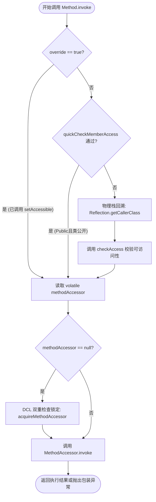
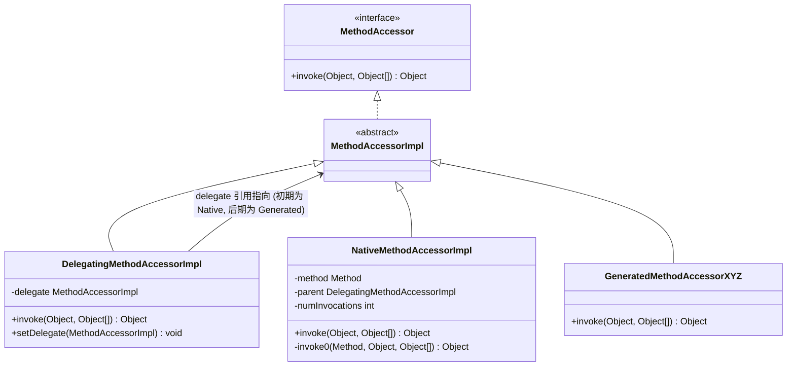
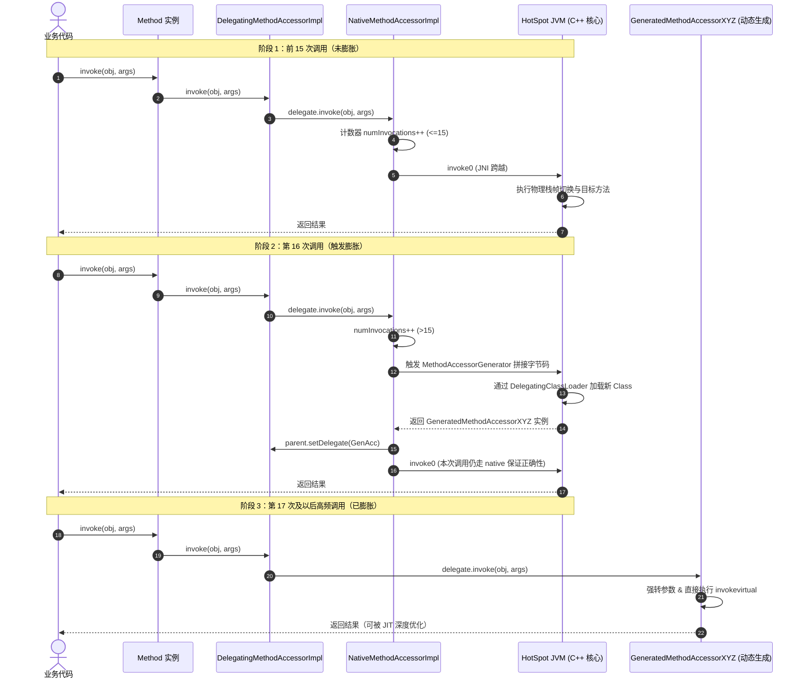
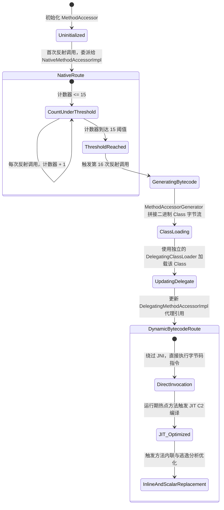
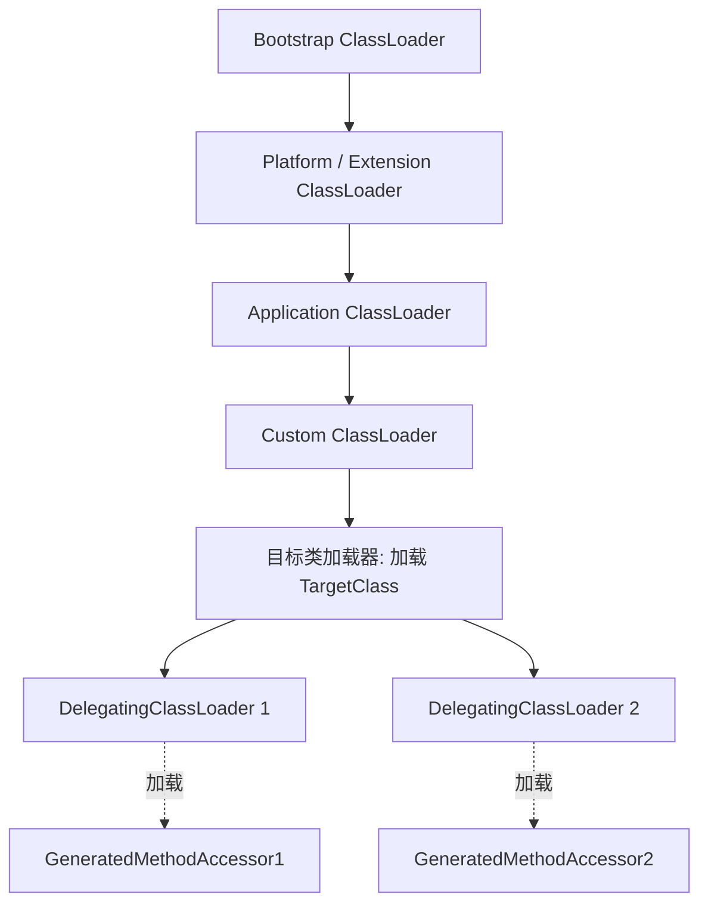

# 2.1.8.2 JVM实现反射

反射（Reflection）作为 Java 的核心动态特性，使得程序可以在运行时探知类的内部结构（构造器、字段、方法、注解等），并动态调用任意对象的方法或读写其字段。

在 JVM 物理层面，Java 是一种强类型的静态语言，其类信息在编译期被固定在 `.class` 文件的常量池、字段表和方法表中，由类加载器加载到 JVM 的元空间（Metaspace）。通常情况下，方法的调用是由编译器在编译期根据接收者类型和方法签名，生成对应的字节码指令（如 `invokevirtual`, `invokestatic`, `invokespecial`, `invokeinterface`），并在运行期由 JVM 进行符号引用解析和直接引用绑定。

反射打破了这种静态绑定的约束。它允许在编译期完全不知道目标类和方法的情况下，在运行期通过字符串形式的方法名 and 参数列表，找到对应的方法并执行。为了在保证 JVM 安全沙箱不被破坏的前提下提供这种能力，HotSpot JVM 设计了一套复杂的反射实现架构，它横跨了 Java API 层、JVM 安全防御层、C++ 核心运行期（Runtime）与 JIT 编译器优化层。

---

## 1. 反射调用的核心入口：`Method.invoke` 源码级执行流与安全防御

我们调用 `method.invoke(obj, args)` 时，经历了一系列精密的安全校验、可访问性检查，最终委派给底层的执行代理。以下是反射调用的核心入口执行流程。

### 1.1 源码级执行流追踪

以 OpenJDK 8/11 中 `java.lang.reflect.Method.invoke` 的源码为核心研究对象，其关键执行骨架如下：

```java
@CallerSensitive
public Object invoke(Object obj, Object... args)
    throws IllegalAccessException, IllegalArgumentException,
           InvocationTargetException
{
    // 1. 可访问性检查（若未设置 override = true，则必须执行安全校验）
    if (!override) {
        if (!Reflection.quickCheckMemberAccess(clazz, modifiers)) {
            // 2. 慢速路径：获取真实的调用者 Class 对象
            Class<?> caller = Reflection.getCallerClass();
            // 3. 校验调用者对目标类和目标方法的访问权限
            checkAccess(caller, clazz, obj, modifiers);
        }
    }
    // 4. 获取或创建 MethodAccessor 代理对象
    MethodAccessor ma = methodAccessor;             // volatile 读
    if (ma == null) {
        ma = acquireMethodAccessor();
    }
    // 5. 委派执行物理调用
    return ma.invoke(obj, args);
}
```

其执行链路可以归纳为下图所示的控制流：



### 1.2 `Reflection.getCallerClass()` 物理实现与安全栈回溯

`Reflection.getCallerClass()` 是一个 native 方法。它是整个反射乃至 Java 安全防御体系的基石。

```java
@CallerSensitive
public static native Class<?> getCallerClass();
```

#### 1.2.1 `@CallerSensitive` 注解的作用
在 Java 中，反射调用能够突破语言级别的 `private` / `protected` 访问控制。为了防止恶意代码（例如不受信任的沙箱代码）通过反射手段获取物理特权 API，JVM 必须**在物理上确认是谁在调用反射**。

如果一个方法被标记了 `@CallerSensitive`，那么当它内部调用 `Reflection.getCallerClass()` 时，JVM 会回溯当前的调用栈，获取该方法的调用者（即调用栈中上一个非反射的、真正的业务类）。若无此注解，该 native 方法将无法正确寻址调用者栈帧。

#### 1.2.2 栈帧回溯（Stack Walk）物理机理
在 HotSpot JVM 内部，`Reflection.getCallerClass()` 对应的 C++ 实现位于 `jvm.cpp` 中（`JVM_GetCallerClass`）。当 JVM 执行此 native 调用时，它会获取当前线程的活动栈帧指针：

1. **帧过滤**：从当前活动栈帧开始往回（向上）遍历物理栈帧。
2. **过滤反射辅助帧**：
   - 过滤掉 `Reflection.getCallerClass()` 自身的 Native 栈帧。
   - 过滤掉标记了 `@CallerSensitive` 的反射入口帧（如 `Method.invoke`）。
   - 过滤掉反射框架内部的委派帧（如 `sun.reflect.DelegatingMethodAccessorImpl.invoke`、`sun.reflect.NativeMethodAccessorImpl.invoke`，以及动态生成的字节码类 `GeneratedMethodAccessorXYZ.invoke`）。
3. **定位目标帧**：直到找到第一个不属于反射调用框架的 Java 方法帧。该帧所对应的方法声明类，就是真实的调用者类（Caller Class）。

在 HotSpot 中，这一步是通过 C++ 的 `vframeStream` 遍历物理栈帧实现的。每一次物理栈帧的回溯遍历都会检查帧中的 `Method*` 指针并解析其 Declaring Class。这意味着，**每次反射调用如果未能绕过安全检查，都会引发一次物理栈帧的遍历。调用栈越深，遍历的时间开销就越大**。

#### 1.2.3 物理栈帧回溯开销与 JIT 寄存器地图的冷查找
在 HotSpot 内部，物理栈帧的解析是一个高成本操作。因为经过 JIT 编译器（C1/C2）编译后的 Java 栈帧并没有统一的布局，局部变量和引用的物理位置由 JIT 编译器在编译期动态分配给寄存器和堆栈槽位（Stack Slot）。
为了在遍历栈帧时识别某一帧的方法和其所属类，JVM 必须利用**寄存器地图（Register Map）**和**OopMap**进行寻址：
- **OopMap 的作用**：JIT 编译器在编译每个方法时，会在关键指令处生成一份 OopMap（Ordinary Object Pointer Map），用来指示在当前指令执行处，哪些寄存器或栈槽存储的是堆对象的引用，哪些是原始值。
- **冷查找开销**：`getCallerClass` 的栈帧遍历在解码每一帧时，都必须去内存中查找并解析该方法对应的 OopMap。这是一种高开销的内存随机访问（访问元空间的 OopMap 结构表），无法有效利用 CPU 的 L1/L2 Cache（因为这些元数据是不经常被访问的冷数据）。
- **线程协作阻断**：由于遍历需要锁保护或对寄存器状态的绝对一致性要求，如果在栈回溯遍历时发生 GC，或者线程被迫在安全点（Safepoint）挂起，可能会引起全局的等待，这在高并发多线程反射调用时会导致性能劣化。

### 1.3 可访问性检查与 `override` 标志

`AccessibleObject`（`Method`、`Field`、`Constructor` 的超类）中包含一个布尔类型的成员变量 `override`：

```java
boolean override;
```

当开发人员调用 `method.setAccessible(true)` 时，实际上是将这个 `override` 标志设为 `true`。

在 `Method.invoke` 的入口处：
- 如果 `override` 为 `true`，JVM 将跳过所有的成员访问权限校验，直接进入 `MethodAccessor.invoke`。
- If `override` 为 `false`，则必须根据 Java 语言规范（JLS）校验调用者类对目标类的目标方法是否有访问权限（包括 `public`、`protected`、`package-private`、`private` 的边界）。

#### 1.3.1 JDK 9+ 模块化系统（JPMS）对可访问性检查的升级
在 JDK 9 引入模块化系统（Java Platform Module System）之后，可访问性检查更加严格与复杂。`checkAccess` 方法不仅需要校验传统的类成员访问修饰符，还需要校验**模块之间的强封装隔离**：
1. **模块可读性校验**：调用者类所在的模块是否声明了对目标类所在模块的读取依赖（`requires`）。
2. **包开放性校验**：目标类所在的包是否在其所属模块中被明确导出（`exports`）或对调用者所在的模块开放（`opens`）。
如果上述条件不满足，即便使用反射调用 `setAccessible(true)`，JVM 在底层也会物理拒绝，抛出 `InaccessibleObjectException`。除非在启动时显式使用虚拟机参数 `--add-opens` 或 `--add-exports` 打破物理封装边界。这使得底层的 `checkAccess` 内部在执行时需要动态查找模块依赖关系图（Module Graph），进一步增加了安全校验分支的物理开销。

> **显式调用 `setAccessible(true)` 即使对 public 方法也有显著的性能优化作用**。它直接在入口处拦截了校验逻辑，屏蔽了物理栈帧回溯（Stack Walk）与 JPMS 模块图查找的发生。

### 1.4 获取 `MethodAccessor` 的双重检查锁定（DCL）

`Method` 内部的 `methodAccessor` 采用延迟初始化以降低类加载时的内存与时间开销：

```java
private volatile MethodAccessor methodAccessor;

private MethodAccessor acquireMethodAccessor() {
    MethodAccessor tmp = null;
    if (root != null) tmp = root.getMethodAccessor();
    if (tmp != null) {
        methodAccessor = tmp;
        return tmp;
    }
    // 获取反射工厂，创建新的 MethodAccessor 实例
    tmp = reflectionFactory.newMethodAccessor(this);
    setMethodAccessor(tmp);
    return tmp;
}
```

#### 1.4.1 CAS 锁与内存屏障的物理意义
当多线程并发调用同一个 `Method.invoke` 且 `methodAccessor` 尚未初始化时，多个线程会并发触发 `acquireMethodAccessor()`。为了避免生成重复的 `MethodAccessor` 并确保其多线程下的发布安全性，HotSpot 在 `setMethodAccessor` 中使用了 CAS（Compare-And-Swap）物理指令（在 x86 架构下编译为带有 `lock` 前缀的 `cmpxchg` 指令），确保只有一个线程能成功将其写入底层的 `root` 节点。

同时，由于 `methodAccessor` 被声明为 `volatile`，其写操作会在机器码层面插入一条写屏障指令（在 x86 架构下通常是 `lock addl` 或利用内存重排规则，在 ARM 下是 `dmb` 等），强迫当前 CPU 的 Store Buffer 刷入一级/二级缓存（L1/L2 Cache），并使其他 CPU 核心的对应 Cache Line 宣告失效。这在物理上保证了发布安全性，避免其他线程读取到未完全初始化的 `MethodAccessor` 半对象，但同时也引入了微秒级的物理时钟停顿。

---

## 2. 动态实现与委派实现机制（Inflation 机制）

在 JVM 中，反射的执行有两种物理路径：**本地方法路径（Native Implementation）** 与 **动态字节码路径（Dynamic Bytecode Stub Implementation）**。为了折中类加载性能与极限运行吞吐量，HotSpot 引入了 **Inflation（膨胀）** 机制。

### 2.1 什么是 Inflation（膨胀）机制？

- **本地方法路径**：利用 JNI（Java Native Interface）跨越 Java 虚拟机栈，调用 C++ 编写的底层本地方法，直接在 JVM 内部通过方法指针或解释器执行目标方法。这种方式的缺点是每次调用都有 JNI 切换开销，但优点是不需要动态生成类，启动开销为 0。
- **动态字节码路径**：在运行时动态生成一段 Java 字节码类（即 `GeneratedMethodAccessorXYZ`），它实现了 `MethodAccessor` 接口，并且其 `invoke` 方法体内包含了一条直接指向目标方法的常规 Java 字节码调用指令（如 `invokevirtual` 或 `invokestatic`）。这种方式需要耗费可观的类生成和类加载时间，但一旦加载完成，后续调用的物理开销极低。

为了平衡这两者的优缺点，JVM 在默认情况下采用如下策略：
> 在反射方法调用的前几次（默认 15 次），使用 Native 路径；当调用次数达到一个设定的阈值后，JVM 会在后台动态生成该方法的字节码类，并把调用代理切换到该字节码类上。这个过程被称为反射的“膨胀”。

### 2.2 委派双雄：`DelegatingMethodAccessorImpl` 与 `NativeMethodAccessorImpl`

为了实现运行期无缝切换，HotSpot 引入了委派设计模式。

反射初始化时，`ReflectionFactory.newMethodAccessor(this)` 创建的是一个包装类 `DelegatingMethodAccessorImpl` 实例，它内部持有实际执行体的引用 `delegate`。初始状态下，这个 `delegate` 指向 `NativeMethodAccessorImpl`。



当调用发生时，`DelegatingMethodAccessorImpl` 直接将调用请求转发给它的 `delegate`。

```java
class DelegatingMethodAccessorImpl extends MethodAccessorImpl {
    private MethodAccessorImpl delegate;

    DelegatingMethodAccessorImpl(MethodAccessorImpl delegate) {
        setDelegate(delegate);
    }

    public Object invoke(Object obj, Object[] args)
        throws IllegalArgumentException, InvocationTargetException
    {
        return delegate.invoke(obj, args);
    }

    void setDelegate(MethodAccessorImpl delegate) {
        this.delegate = delegate;
    }
}
```

而在 `NativeMethodAccessorImpl` 的 `invoke` 实现中，每次调用都会递增计数器：

```java
class NativeMethodAccessorImpl extends MethodAccessorImpl {
    private final Method method;
    private DelegatingMethodAccessorImpl parent;
    private int numInvocations;

    NativeMethodAccessorImpl(Method m) {
        this.method = m;
    }

    public Object invoke(Object obj, Object[] args)
        throws IllegalArgumentException, InvocationTargetException
    {
        // 每次调用，计数器加 1
        if (++numInvocations > ReflectionFactory.inflationThreshold()) {
            // 触发膨胀，动态生成 Java 字节码类
            MethodAccessorImpl accessor = (MethodAccessorImpl)
                new MethodAccessorGenerator().
                    generateMethod(method.getDeclaringClass(),
                                   method.getName(),
                                   method.getParameterTypes(),
                                   method.getReturnType(),
                                   method.getExceptionTypes(),
                                   method.getModifiers());
            // 将父级委派者的 delegate 重新指向新生成的动态实现
            parent.setDelegate(accessor);
        }

        // 阈值到达前的调用，或者在本次生成的间隙中，依然走 native 调用
        return invoke0(method, obj, args);
    }

    private static native Object invoke0(Method m, Object obj, Object[] args);
}
```

### 2.3 `NativeMethodAccessorImpl` 的物理运作原理与 JNI 开销

在阈值未达到之前，反射调用流向 `invoke0(Method, Object, Object[])` 这个 native 方法。从 Java 执行流进入 Native 方法，需要在物理上跨越 JNI 边界，经历以下复杂的步骤：

```mermaid
sequenceDiagram
    autonumber
    participant Java as Java 虚拟机栈
    participant Stub as JNI Stub (桥接器)
    participant C++ as JVM 运行时 (C++ 侧)
    participant Target as 目标 Java 方法 (解释器/JIT)

    Java->>Stub: 1. 调用 invoke0 (传入Method, Target, Args)
    activate Stub
    Note over Stub: 保存 Java 寄存器状态 (R13, R14 等)<br/>线程状态从 _thread_in_Java 切换为 _thread_in_native<br/>构建 JNI 物理栈帧 (C++ 栈)
    Stub->>C++: 2. 执行物理跳转至 JVM_InvokeMethod
    deactivate Stub
    activate C++
    Note over C++: 3. 解析反射 Method 参数数组 (jobjectArray)<br/>提取局部句柄 (Handles) 中的 OOP 指针<br/>通过方法描述符计算参数对齐并压入 JavaCalls 容器
    C++->>Target: 4. 调用 JavaCalls::call() (重新切回 Java 栈帧)
    activate Target
    Target-->>C++: 5. 目标方法执行完毕，返回物理结果
    deactivate Target
    Note over C++: 6. 包装返回值为 jobject<br/>检查是否有挂起的安全点 (Safepoint) 请求
    C++-->>Java: 7. 退出 JNI 桥接器，线程状态切回，返回结果
    deactivate C++
```

#### 2.3.1 JNI 桥接器（JNI Stub）与寄存器上下文切换的物理代价
当 Java 线程执行 `NativeMethodAccessorImpl.invoke0` 时，它不能直接跳转到 C++ 的 native 函数。JVM 在类加载 native 方法时，会为之动态生成一段物理跳板代码，即 JNI 桥接器（JNI Stub）。这段 Stub 代码在物理 CPU 级别会执行以下高成本动作：
1. **保存 Java 寄存器上下文**：当前线程专用于 JVM 执行引擎的寄存器状态（如 HotSpot 中常用于指向字节码解释器首地址、基准栈帧的 R13、R14、R15 寄存器）必须被完整保存到当前线程的物理堆栈中。
2. **切换线程状态**：为了防止 native代码长时间运行阻塞 JVM 的垃圾回收，JVM 会通过内存屏障将当前 Java 线程的状态从 `_thread_in_Java` 修改为 `_thread_in_native`。这意味着一旦该线程在 native 运行期间发生垃圾回收，垃圾回收器（GC）可以无需等待该线程到达安全点（Safepoint）而直接进行堆回收。
3. **构建 JNI 物理栈帧**：在物理的 C/C++ 栈上开辟新的栈帧，并将 Java 堆中的对象引用（OOP, Ordinary Object Pointer）转化为指向局部句柄表（Handles Area）的句柄指针（`jobject`），以防 native 代码执行期间对象被 GC 移动而导致指针失效。

#### 2.3.2 C++ 侧的方法描述符解析与参数压栈模拟
进入 C++ 侧的 `JVM_InvokeMethod` 后，反射并不是一次直接的 CPU 指令跳转。
- **参数解析与动态构造**：C++ 侧必须遍历传入的 `jobjectArray`（即 `Object[] args`），在 C++ 堆上构造一个 `JavaCallArguments` 容器，逐个提取每个句柄中的 OOP 指针。
- **签名描述符校验**：JVM 必须通过目标方法的签名描述符（例如 `(Ljava/lang/String;I)V`）来确定每个参数在物理栈或寄存器中的对齐和大小（例如 double 需要占 8 字节，int 占 4 字节），并在 C++ 中通过循环和条件分支将它们逐个解包并压入一个模拟的 Java 执行栈。
- **重返 Java 栈帧**：解析完毕后，通过 `JavaCalls::call` 重新激活 Java 执行引擎，为目标方法建立新的 Java 虚拟机栈帧，由解释器或 JIT 编译出的机器码执行该方法。

这导致了一个**“Java -> JNI Native(C++) -> 解析方法 -> 构造新的 Java 栈帧 -> 重新进入 Java(解释器/JIT) -> 执行方法 -> 退出 Java -> 返回 Native(C++) -> 返回 Java”**的物理大循环，带来了巨大的上下文切换成本与 CPU 流水线中断。

### 2.4 膨胀阈值控制与状态跃迁

- **阈值调优**：膨胀阈值 `ReflectionFactory.inflationThreshold()` 默认返回 `15`。可以通过 JVM 启动参数 `-Dsun.reflect.inflationThreshold=xxx` 来调整该值。
- **禁用 Inflation**：如果设置了 `-Dsun.reflect.noInflation=true`，则会彻底禁用 Native 路径。在**第一次反射调用时，就直接动态生成字节码实现**。这对于长期运行的高并发微服务、RPC 框架非常有用，因为它们几乎所有的反射方法都会被执行成千上万次，省去前 15 次的 Native 过渡可以消除冷启动阶段的性能抖动。

以下时序图展示了从 Native 实现到动态字节码实现的完整跃迁状态：



以下状态迁移图清晰展现了这一过程：



---

## 3. 动态生成 `GeneratedMethodAccessor` 字节码类的物理机理

动态生成的字节码类并不是通过外部的 `javac` 工具生成的，而是直接在 JVM 内存中进行二进制流的拼装，并利用专有的类加载器进行加载。

### 3.1 `MethodAccessorGenerator` 源码级分析

当调用计数器达到阈值，`MethodAccessorGenerator.generateMethod` 被调用。它内部拥有一个字节码组装器，通过直接向 `ByteArrayOutputStream` 写入字节流来构建一个符合《Java虚拟机规范》（JVMS）的 Class 文件。

其生成的 `GeneratedMethodAccessorXYZ` 类的反编译逻辑结构等价于以下 Java 代码：

```java
package sun.reflect;

public class GeneratedMethodAccessor1 extends MethodAccessorImpl {
    public GeneratedMethodAccessor1() {
        super();
    }

    public Object invoke(Object target, Object[] args) 
        throws IllegalArgumentException, InvocationTargetException 
    {
        // 1. 类型强制转换（若是实例方法，强转接收者对象）
        TargetClass obj = (TargetClass) target;
        try {
            // 2. 参数解析、拆箱与类型强转
            // 假设目标方法签名是: public double process(int a, String b)
            if (args.length != 2) {
                throw new IllegalArgumentException();
            }
            int param0 = ((Integer) args[0]).intValue(); // 拆箱
            String param1 = (String) args[1];            // 类型转换

            // 3. 执行直接的方法调用（将反射调用直接还原为标准指令）
            double result = obj.process(param0, param1);

            // 4. 返回值装箱
            return Double.valueOf(result);
        } catch (Throwable t) {
            // 5. 异常包装
            throw new InvocationTargetException(t);
        }
    }
}
```

#### 3.1.1 动态生成字节码的 JVM 汇编级逆向分析
为了更直观地理解其在虚拟机内部的物理执行过程，我们可以将生成的 `GeneratedMethodAccessor1.class` 的 `invoke` 方法翻译为 JVM 汇编指令：

```assembly
// 1. 强转接收者对象
aload_1                     // 将 target 压入操作数栈
checkcast     #12           // 校验类型是否为 TargetClass，不匹配抛 ClassCastException
astore_3                    // 强转成功后，存入局部变量表槽位 3 (TargetClass obj)

// 2. 参数一处理 (int 类型的装箱参数 args[0])
aload_2                     // 将 args 数组压入栈
iconst_0                    // 压入常量 0 (数组索引)
aaload                      // 取出 args[0] (一个 Object 引用)
checkcast     #24           // 强转为 java/lang/Integer
invokevirtual #30           // 调用 Integer.intValue()I，返回值压入操作数栈
istore_4                    // 存入局部变量表槽位 4 (int param0)

// 3. 参数二处理 (String 类型的参数 args[1])
aload_2                     // 将 args 数组压入栈
iconst_1                    // 压入常量 1 (数组索引)
aaload                      // 取出 args[1]
checkcast     #34           // 强转为 java/lang/String
astore_5                    // 存入局部变量表槽位 5 (String param1)

// 4. 发起直接的方法调用
aload_3                     // 压入 TargetClass 实例 (obj)
iload_4                     // 压入 int 参数 (param0)
aload_5                     // 压入 String 参数 (param1)
invokevirtual #40           // 物理字节码调用：TargetClass.process:(ILjava/lang/String;)D

// 5. 返回值装箱
invokestatic  #46           // 调用 Double.valueOf(D)Ljava/lang/Double; 将 double 装箱
areturn                     // 将 Double 对象引用返回给反射调用方
```

从上述字节码指令中可以看出，**它将反射调用完全降级为了标准的 JVM 字节码调用**（如 `invokevirtual` ）。一旦这段字节码被加载，后续的反射调用在 JVM 看来，就和普通的 Java 方法调用没有区别，从而能够彻底享受 JVM 解释器和 JIT 编译器的性能红利。

### 3.2 独立的类加载器：`DelegatingClassLoader` 与元空间回收

当字节码在内存中拼装完毕后，需要将其定义（Define）为 JVM 中的 `Class` 实例。HotSpot 采用了一种特殊的类加载器来加载这些动态生成的类：`sun.reflect.DelegatingClassLoader`。



#### 3.2.1 为什么每个动态类都要有一个独立的 ClassLoader？
在 Java 虚拟机中，**类（Class）是不能被单独卸载的**。根据 JVM 规范，一个 Class 空间被回收，必须**同时满足**以下三个条件：
1. 该类的所有实例都已经被垃圾回收（对于 `GeneratedMethodAccessor` 来说，就是没有人在使用该方法对应的反射代理对象了）。
2. 加载该类的 ClassLoader 实例已经被垃圾回收。
3. 该 Class 对象对应的 `java.lang.Class` 实例在堆中没有任何强引用可达。

如果我们使用系统类加载器（AppClassLoader）或目标类的加载器来加载所有的 `GeneratedMethodAccessorXYZ`，那么只要系统仍在运行，系统的 AppClassLoader 就永远不可能被垃圾回收。这会导致所有动态生成的 `GeneratedMethodAccessor` 无法被卸载。随着反射调用的方法越来越多，元空间（Metaspace）的内存会被这些动态生成的类吃满，最终抛出 `java.lang.OutOfMemoryError: Metaspace`。

#### 3.2.2 物理隔离如何帮助 JVM 实现元空间内存回收
HotSpot 的设计是：
- 每一个动态生成的 `GeneratedMethodAccessorXYZ` 都由一个**全新、独立**的 `DelegatingClassLoader` 实例进行加载。该加载器的父类加载器是目标类的加载器。
- `DelegatingClassLoader` 内部重写了 `loadClass` 行为，打破了常规的双亲委派逻辑，强制将该字节码直接在其本地的加载上下文中定义为 Class，以实现与系统类加载器的物理隔离。
- 当 `Method` 对象被垃圾回收时，其关联的 `MethodAccessor` 被回收，导致指向 `GeneratedMethodAccessor` 实例的强引用链断开。
- 随后，`DelegatingClassLoader` 的所有实例和引用断开，满足了“类加载器被回收”的物理前提。
- 在下一次元空间垃圾回收（Metaspace GC）时，该类加载器连同它加载的 `GeneratedMethodAccessorXYZ` 的元数据、常量池、方法表等信息，就会被从元空间彻底清除，释放物理内存。

---

## 4. 反射性能损耗的底层物理成因与 JIT 编译屏障

虽然动态字节码路径消除了 JNI 切换的开销，但反射调用的执行速度仍无法与手写原生代码相提并论。其深层物理原因在于内存分配、装箱以及 JIT 优化机制上的物理屏障。

### 4.1 变长参数 `Object[]` 数组物理创建与堆分配开销

`Method.invoke` 声明的方法签名为：

```java
public Object invoke(Object obj, Object... args)
```

其中 `Object...` 属于语法糖，其物理本质是 `Object[]` 数组。
当我们编写如下反射调用代码时：

```java
method.invoke(obj, param1, param2);
```

编译器（`javac`）会将其编译为如下字节码等价形式：

```java
Object[] args = new Object[2];
args[0] = param1;
args[1] = param2;
method.invoke(obj, args);
```

这带来了三个严重的物理负效应：
1. **堆内存分配开销**：每次反射调用，都会在堆内存（JVM Heap）中分配一个临时的 `Object[]` 数组。高频的分配会使得新生代的 Eden 区迅速填满，加速 Minor GC 的触发，从而增加全局 SafePoint 停顿的时间。
2. **逃逸分析（Escape Analysis）失败**：由于这个数组被作为参数传递给了 `Method.invoke`，而 `Method.invoke` 内部的 `ma.invoke` 是一个多态的接口调用，JIT 编译器在静态编译期无法预测 `ma.invoke` 的具体去向。因此，C2 编译器无法判定该数组不会被外部持有。**逃逸分析被迫得出该数组“已逃逸”的结论**。
3. **栈上分配与标量替换落空**：因为发生了逃逸，JIT 编译器无法对该数组进行“栈上分配（Stack Allocation）”或“标量替换（Scalar Replacement）”优化。该数组必须实打实地在堆内存里分配并进行对象头的初始化。

### 4.2 基本数据类型的自动装箱与拆箱

由于反射 API 是统一面向 `Object` 对象的，所以基本类型必须被转换为对应的包装类。
例如我们要反射调用：`public void setAge(int age)`，传入 `25`。

- **装箱（Boxing）**：调用方需要将 `25` 装箱为 `Integer.valueOf(25)`。虽然 JVM 有缓存，但如果传入的值超出了 `[-128, 127]` 范围，就必须在堆上物理创建新的包装类对象。
- **拆箱（Unboxing）**：在 `GeneratedMethodAccessorXYZ` 中，必须执行 `((Integer) args[0]).intValue()`。这会产生一次强制类型转换和一次方法调用。
- **返回值包装**：如果方法返回的是基本类型，执行后还必须在 `GeneratedMethodAccessorXYZ` 内部执行装箱（如 `Double.valueOf(result)`），返回给 `Method.invoke`，最后调用方再次进行拆箱。

频繁的装箱和拆箱导致 CPU 寄存器和高速缓存（L1/L2 Cache）中充斥着大量的包装类对象引用，极大地降低了 CPU 缓存行（Cache Line）的命中率。

### 4.3 运行期可访问性与类型匹配检查

即使我们调用了 `setAccessible(true)`，反射在每次调用时依然要在物理层面进行一些底层的类型校验：
- 在 `GeneratedMethodAccessorXYZ` 中，传入的第一个参数 `target` 会被执行 `checkcast` 指令强转为目标类。
- 传入的 `args` 数组中，每一个参数也必须在拆箱前执行 `checkcast`。
- `checkcast` 在 JVM 底层需要查询该对象的 Klass Word 元数据指针，并遍历该类的继承树或接口表以确认类型兼容性。虽然 JVM 采用了“快速子类型检查（Quick Subtype Check）”算法，但相较于静态编译期的强类型直接跳转，这一动态匹配在物理执行上依然包含多次内存加载与分支跳转指令，容易导致 CPU 分支预测失败（Branch Misprediction）。

### 4.4 JIT 优化屏障：方法内联与逃逸分析的毁灭

JIT 编译器（如 HotSpot 的 C2 编译器）实现极致性能的两个最重要的手段是：**方法内联（Method Inlining）** 和 **逃逸分析（Escape Analysis）**。反射调用是这两个优化器的“屏障”。

#### 4.4.1 方法内联的物理中断
方法内联能够将目标方法的字节码直接复制到调用者方法体内，从而消除方法调用的栈帧开销。

而在反射调用中，调用链为：
`Caller.method` -> `Method.invoke` -> `DelegatingMethodAccessorImpl.invoke` -> `GeneratedMethodAccessorXYZ.invoke` -> `TargetClass.targetMethod`。

在这一链路中，`MethodAccessor.invoke` 是一个高度多态的接口调用（在 JVM 中属于虚派发 `invokevirtual` 或 `invokeinterface`）。
- C2 编译器的内联依赖于**内联缓存（Inline Cache）**。如果虚方法调用点在运行时只有 1 个具体子类（单态，Monomorphic），JIT 会将其直接去虚拟化并内联；如果是 2 个子类（双态，Bimorphic），会生成分支判断并内联。
- 但是，在反射场景中，整个系统内会有成百上千个不同的 `GeneratedMethodAccessor` 实例，导致该接口调用点变为**巨态/多态（Megamorphic）**。
- 一旦退化为 Megamorphic，内联缓存失效，JIT 编译器只能放弃内联，老老实实生成一条从虚表（Vtable / Itable）中动态查询机器码入口地址的物理跳转指令。
- **内联在这里戛然而止，目标方法 `TargetClass.targetMethod` 的代码对于 Caller 来说变成了一个“优化黑盒”**，后续的局部关联优化全部被阻断。

#### 4.4.2 逃逸分析的失效与连接图依赖断裂
C2 编译器采用的是基于连接图（Connection Graph）的逃逸分析算法。在进行静态流分析时，算法会为当前方法内的每个新建对象节点构建分析树：
- 如果一个新建对象的引用流向了一个可以被 JIT 完全内联的方法，分析树可以跨越方法边界，继续跟踪引用是否泄露到方法外。
- 在反射中，`new Object[]` 数组被传入了 `Method.invoke`。因为该接口调用无法内联，连接图算法在分析至此处时，其逻辑依赖链彻底断裂。
- 编译器无法证明 `ma.invoke` 的未知底层实现不会把这个数组存入一个全局变量或静态字段中，因此不得不安全起见，将其强制标记为 `GlobalEscape`（全局逃逸）。
- 标记为全局逃逸的对象节点，将无法进行任何“栈上分配”或“标量替换”优化。

#### 4.4.3 虚方法表（vtable）查找与多态内联缓存（PIC）的物理崩溃
在 JVM 中，虚方法调用（`invokevirtual`）是通过虚表（vtable）查找实现的。vtable 是存储在 Class 元数据结构末尾的函数指针数组。当执行 `invokevirtual` 指令且未发生内联时，CPU 需要从对象的头部获取 Class 元数据指针，再通过固定偏移量在 vtable 中查出方法物理地址并跳转。
为了加速这一过程，JIT 引入了多态内联缓存（PIC, Polymorphic Inline Cache）。PIC 是在已编译机器码中动态生成的跳转逻辑：
- 如果调用点运行至今只遇到过 1 种类型，JIT 会将机器码指令修改为该类对应机器码的直接跳转地址（Monomorphic）。
- 若遇到第 2 种类型，会升级为包含分支判断的跳转（Bimorphic）。
- 若遇到超过 2 种（HotSpot 默认为 2 种以上），内联缓存会升级为巨态（Megamorphic），放弃所有内联和分支预测优化，直接降级为运行时虚表动态查询。
反射中的 `MethodAccessor.invoke` 由于服务于无数个不同的反射方法，导致该接口调用点无一例外地会沦为 Megamorphic，引发 PIC 崩溃，迫使 CPU 执行代价最高的间接分支跳转。

---

## 5. 反射与 JDK 7 MethodHandle 的底层物理对比

JDK 7 引入了 `java.lang.invoke` 包，其核心是 `MethodHandle`（方法句柄）。它是 JVM 物理层面的一项重要变革，旨在提供一种强类型、直接模拟字节码指令行为的动态调用机制。

### 5.1 `MethodHandle` 的物理本质

`Method` 对象是反射框架包装出来的“胖对象”，它包含了方法名、修饰符、泛型签名、注解、异常表等大量的反射元数据。它的设计初衷是为了给开发人员在运行期提供**自省/检查（Inspection）**的能力，执行只是顺带的功能。

`MethodHandle` 则是一个纯粹的物理“瘦引用”。它仅封装了执行目标方法所必需的物理寻址信息。它的设计初衷是为了在字节码层面进行极其高效的**动态执行（Execution）**。它的物理行为更像是 C/C++ 中的函数指针，或者 JVM 最底层的执行跳板。

### 5.2 权限检查机制的物理时序差异：O(N) 校验 vs O(1) 校验

这是反射与 `MethodHandle` 在安全和性能设计上的核心分水岭。

#### 5.2.1 反射：运行时每次调用均校验（Eager Search, Lazy Check）
当使用反射调用 `Method.invoke` 时：
- JVM 无法确保当前的 `Method` 对象是否被安全地传递。因此，每次调用 `Method.invoke` 时，都必须从物理栈帧回溯出调用者（`Reflection.getCallerClass`），验证当前的 Caller 对目标方法是否拥有访问权限。
- **即使调用了 `setAccessible(true)`，类型校验和动态模块化可读性校验依然在每次调用中执行。**
- 这是一种“每次调用都做慢速安全检查”的 Lazy Check 设计。

#### 5.2.2 MethodHandle：创建时单次校验（Lazy Search, Eager Check）
当使用 `MethodHandle` 时，安全权限检查发生在**句柄创建（Lookup）**阶段：
- 必须通过 `MethodHandles.Lookup` 静态工厂来获取并绑定当前 Caller 的权限上下文：
  ```java
  MethodHandles.Lookup lookup = MethodHandles.lookup();
  MethodHandle mh = lookup.findVirtual(TargetClass.class, "process", 
      MethodType.methodType(double.class, int.class, String.class));
  ```
- 在 `lookup.findVirtual(...)` 执行时，JVM 立即根据当前 `Lookup` 对象的权限进行访问权限校验。
- **一旦 `MethodHandle` 成功创建并返回，就说明该句柄已经获得了该 Caller 的访问特权（类似于一张门票）。**
- 后续通过 `mh.invokeExact(...)` 执行物理调用时，**JVM 不再进行任何安全和访问权限校验**。它只进行非常快速的签名匹配（`MethodType` 校验）。这就将**每次反射调用的 O(N) 栈回溯校验，优化为了创建期一次性的 O(1) 校验**。

### 5.3 性能优化边界：JIT 的“绿通道”

`MethodHandle` 拥有高度契合 JIT 编译器的物理机制。

#### 5.3.1 `LambdaForm` 与签名多态性
在 JVM 中，`MethodHandle` 的调用入口（如 `invokeExact` 和 `invoke`）被声明为**签名多态性方法（Signature Polymorphic Methods）**。这意味着C2编译器在编译这些方法调用时，不会进行常规的泛型擦除与包装，而是将实际的参数类型和返回值类型直接作为字节码的物理符号引用。

当 JVM 执行到这些指令时，底层的 `java.lang.invoke` 框架会动态生成一小段名为 `LambdaForm` 的底层 JVM 字节码。`LambdaForm` 本质上是一个轻量级的逻辑有向无环图（DAG），它将参数通过最底层的机器寄存器或操作数栈直接传递给目标方法的入口地址。

#### 5.3.2 声明为 `static final` 时的内联奇迹与常量折叠
如果我们将 `MethodHandle` 声明为 `static final` 常量（或者它本身是由 Lambda 表达式或方法引用在编译期动态生成的）：

```java
private static final MethodHandle MH_PROCESS;
static {
    try {
        MH_PROCESS = MethodHandles.lookup().findVirtual(TargetClass.class, "process",
            MethodType.methodType(double.class, int.class, String.class));
    } catch (Exception e) {
        throw new ExceptionInInitializerError(e);
    }
}
```

JIT 编译器在编译包含 `MH_PROCESS.invokeExact(...)` 的方法时，会将其视为编译期常量：
1. **常量折叠（Constant Folding）**：JIT 能够直接窥探到该 `MethodHandle` 所绑定的真实目标方法。
2. **完全的去虚拟化与内联**：C2 编译器可以直接绕过所有的动态派发和代理桥接，将目标方法 `TargetClass.process` 的字节码**直接内联到调用者体内**。
3. **彻底消除堆分配与装箱**：由于参数通过强类型的 `invokeExact` 传递，且方法被内联，逃逸分析可以完美证明没有对象发生逃逸。因此，**完全不会创建变长参数数组，基本类型的装箱操作也被彻底消除**。
4. **原生等同性能**：在此种边界下，反射性调用的开销被降为 0，性能与原生手写的直接方法调用**完全一致**。

#### 5.3.3 非 static final 声明下的性能退化
如果 `MethodHandle` 被声明为普通成员变量（Non-static Non-final Field）：
- JVM 无法保证该句柄在运行期或多线程环境下不会被修改。
- JIT 编译器在编译时无法进行常量折叠。
- C2 编译器不能断定 `invokeExact` 的实际跳转地址，无法进行去虚拟化与内联。
- 此时，调用仍需通过读取实例中的句柄并进行动态分派，性能会大幅度回落，退化到与已膨胀反射相近的水平。**这揭示了 JIT 编译器在优化动态调用时，对“物理常量性”的绝对依赖**。

### 5.4 物理机制对比总结

| 维度 | 反射 (`Method.invoke`) | 方法句柄 (`MethodHandle.invokeExact`) |
| :--- | :--- | :--- |
| **设计核心目标** | 面向开发者的自省（自检类结构、注解、修饰符等） | 面向执行的跳板（追求极致性能的底层方法调用） |
| **数据量级** | 重量级胖对象（持有很多元数据，如注解、方法签名、String名称等） | 轻量级瘦对象（仅包含物理方法地址和 `MethodType` 签名） |
| **安全检查时序** | **运行时每次调用检查**（每次通过 `Reflection.getCallerClass` 物理栈回溯） | **创建时单次检查**（基于创建句柄时的 `Lookup` 上下文） |
| **参数传递方式** | 变长参数 `Object[]` 数组包装（产生堆分配，破坏逃逸分析） | 强类型签名多态性直接压栈（无变长数组开销） |
| **装箱与拆箱** | 基本数据类型强制装箱为包装类对象 | 强类型精确匹配，若类型一致完全无装箱拆箱开销 |
| **类加载泄漏风险**| 膨胀机制会为每个方法生成 `GeneratedMethodAccessor` 和 `DelegatingClassLoader`，若使用不当易导致元空间溢出 | 动态生成 `LambdaForm` 共享类，类加载开销较小，不易发生元空间泄漏 |
| **JIT 内联行为** | 属于 Megamorphic 虚调用，成为 JIT 方法内联的优化屏障 | 声明为 `static final` 时，JIT 能够实现**常量折叠与彻底的方法内联**，性能等同直接调用 |

---

## 6. 总结与最佳实践

理解了 JVM 实现反射的物理底层逻辑，我们在进行高性能系统设计时可以采取以下最佳实践：

1. **缓存反射元数据**：`Class.getMethod()`、`Class.getDeclaredMethods()` 等方法在 JVM 内部每次调用都会克隆一份新的 `Method` 数组以保证安全。应当将获取到的 `Method` 实例缓存起来，避免在热点代码中频繁查询。
2. **显式调用 `setAccessible(true)`**：即便目标反射方法是 `public` 的，显式调用 `setAccessible(true)` 可以将 `override` 设为 `true`，从而使 JVM 在每次反射调用时直接跳过 `Reflection.getCallerClass()` 的慢速物理栈帧回溯。
3. **高频场景推荐 MethodHandle**：在开发高性能框架、动态代理或 RPC 网关时，如果反射调用是热点路径，应尽可能使用 `MethodHandle`，并将其声明为 `static final` 常量。对于非静态常量的场景，可以使用 `MethodHandle` 代替反射以规避运行期的安全栈回溯开销。
4. **关注元空间指标**：如果应用程序大量使用了动态代理、动态反射以及字节码生成技术，要密切关注 Metaspace 的垃圾回收指标。可以配置 `-XX:+CMSClassUnloadingEnabled`（若使用老版本垃圾回收器）以确保无用的类加载器和反射代理类能被及时卸载。
5. **规避高频循环中的反射**：若反射调用无法被内联，并且每次调用都产生变长参数 `Object[]` 数组及装箱对象，应避免在超高频的循环体内直接使用反射。可通过提前生成静态代理类或通过编译期 APT (Annotation Processing Tool) 生成辅助代码进行替代。
