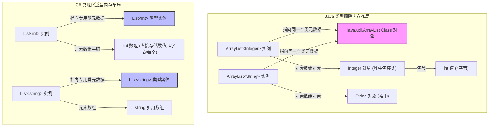
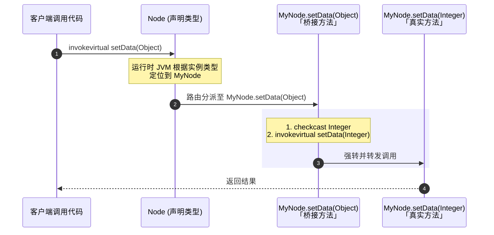
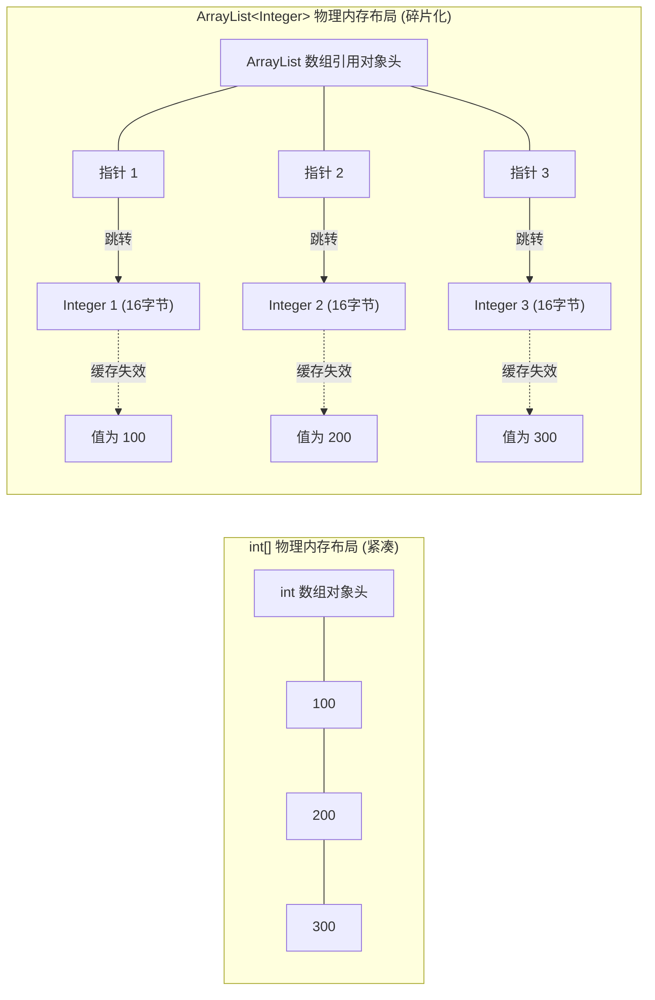
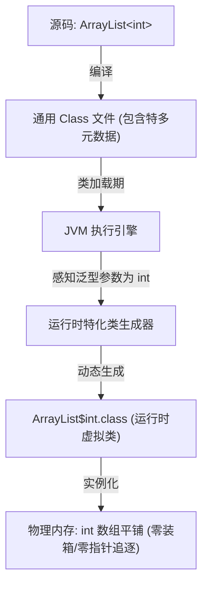

# 2.1.8.3 JVM实现泛型

在现代面向对象编程中，泛型（Generics）是实现类型安全、代码重用以及消除显式类型转换的关键机制。然而，不同编程语言的虚拟机在实现泛型时采取了完全不同的物理路径。Java 语言的泛型在设计之初就面临着严苛的历史包袱，这直接决定了其在 Java 虚拟机（JVM）底层的实现方式——**类型擦除（Type Erasure）**。

本篇文章将从 JVM 规范、Class 文件结构、常量池、字节码指令集、内存布局以及运行期执行引擎等物理层面，深度剖析 JVM 实现泛型的本质、类型保障机制、多态保护策略（桥接方法）、泛型元数据保留机制（Signature 属性）、性能痛点，并展望 Project Valhalla 的泛型特化演进之路。

---

## 1. Java 伪泛型与类型擦除的本质

Java 的泛型通常被称为**“伪泛型”（Pseudo-Generics）**，因为它的泛型信息仅存在于编译期，而在编译成 Class 字节码文件后，所有的泛型类型参数都会被替换为它们的上限（若未指定上限则替换为 `java.lang.Object`），这种在编译阶段去除泛型类型的机制被称为**类型擦除（Type Erasure）**。

与之相对的，是 C# 等语言在公共语言运行时（CLR）中实现的**“真泛型”（Reified Generics，又称具现化或特化泛型）**。

### 1.1 C# 真泛型与 Java 伪泛型的物理对比

为了彻底理解 Java 类型擦除的物理本质，我们需要将它与 C# 的真泛型在物理内存、Class（或 DLL）结构以及运行期的表现进行深度对比：

| 维度 | Java 伪泛型 (类型擦除) | C# 真泛型 (运行期特化/实例化) |
| :--- | :--- | :--- |
| **编译产物** | 所有的参数化类型（如 `List<String>`、`List<Integer>`）在编译后都会被擦除为同一个原始类型（Raw Type，即 `List`），生成一个 `.class` 文件。 | 泛型类型被编译为含有占位符的泛型 IL（中间语言）代码。运行时由 CLR 动态实例化特化类型。 |
| **内存布局与共享** | 堆中所有的泛型容器实例都指向同一个 `java.lang.Class` 实体（即 `List.class`）。对于所有的引用类型，其在堆内存中的变量指针都是 `Object`（或定义的上限）的引用，物理内存结构完全一致。 | **值类型**（如 `int`、`float`）：CLR 为每个不同值类型参数动态编译生成独立的机器码和内存模板，免去装箱，内存物理紧凑。<br>**引用类型**（如 `string`、`class`）：共享同一套 JIT 代码以防止代码膨胀，但每个类型有独立的类型实体和虚表（vtable）。 |
| **运行期类型识别** | 运行时 JVM 无法识别 `new ArrayList<String>()` 和 `new ArrayList<Integer>()` 的区别。调用 `getClass()` 返回的都是 `class java.util.ArrayList`。 | 运行时 CLR 能够感知完整的泛型类型。`typeof(List<int>)` 和 `typeof(List<string>)` 是两个完全不同的类型对象。 |
| **基本类型支持** | 泛型参数不能是基本类型（如 `int`），必须使用其包装类（如 `Integer`）。这会导致严重的自动装箱/拆箱开销，以及巨大的内存开销与 GC 压力。 | 泛型参数可以直接使用值类型（如 `int`）。在内存中直接分配 `int[]`，没有包装类，没有额外的指针追逐开销，执行效率极高。 |
| **反射与元数据** | 在运行期，除了方法签名、类声明、字段声明中的泛型元数据以 Class `Signature` 属性保留外，具体的对象实例、局部变量中的泛型类型均已丢失。 | 运行时能够通过反射动态获取所有的泛型参数，并支持在运行时动态实例化泛型（如 `Type.MakeGenericType`）。 |

下面的 Mermaid 图直观地展示了 Java 擦除式泛型与 C# 特化式泛型在物理内存结构上的本质差异：



### 1.2 Java 为何选择类型擦除？—— 二进制向下兼容的历史考量

理解 Java 选择类型擦除的原因，必须回到 2004 年 JDK 5 发布前的历史节点。

当时，Java 已经诞生了近十年，全球的企业级应用中运行着成千上万、未包含泛型的 Java 二进制类库（Class 文件）。Java 设计团队在引入泛型（JSR 14 规范）时，面临的最核心诉求是**“迁移兼容性”（Migration Compatibility）**，具体表现为：

1. **二进制向前兼容（Forward Compatibility）**：在 JDK 1.4 或更早版本上编译的、使用原始类型（Raw Type，如没有泛型的 `ArrayList`）的旧 Class 文件，必须能够直接运行在 JDK 5 及更高版本的 JVM 上。
2. **二进制向后兼容（Backward Compatibility）**：使用 JDK 5 编译的、带有泛型声明的新类库，必须能够被还在使用旧版本类库（例如 JDK 1.4）的代码所调用，并且不需要旧代码重新编译。
3. **类型系统统一性**：新旧集合类库在运行时必须共享同一套实现。如果像 C# 那样为泛型引入全新的、在底层由运行时支持的类型系统，Java 官方就必须为 `java.util` 包下的所有集合类重新编写一套泛型版本（例如创建新的 `GenericArrayList`），并保留旧的 `ArrayList`。这不仅会导致核心类库的严重割裂，还会迫使所有第三方库的开发者在“保持旧版兼容”和“采用新泛型版”之间做痛苦的二选一。

正是为了达成这个极端的兼容性目标，Java 团队最终采纳了由 Gilad Bracha 等人提出的**类型擦除（Type Erasure）**方案。通过将泛型作为“语法糖”限制在编译器（`javac`）这一层，编译器负责在前端进行静态类型安全检查，随后在生成字节码时擦除所有的泛型参数，并自动插入所需的强转指令。

这样一来，对 JVM 来说，新版带有泛型的类与旧版的原始类在字节码层面是一致的，完美的迁移兼容性得以实现，但这也为 Java 带来了一系列延宕至今的物理限制与性能痛点。

---

## 2. 泛型擦除后类型保障的字节码实现

既然泛型类型在编译后被擦除为了 `Object` 或定义的上限类型，那么 JVM 在运行期又是如何保证类型安全的呢？

答案在于**编译器在字节码中自动插入的类型转换指令**。具体而言，编译器在处理泛型对象的读写时，会遵循以下基本规则：
1. **写入（写操作/入参）**：由于编译器在编译期已经执行了严格的静态类型检查，确保了只有符合泛型约束的对象才能通过编译。因此，在将对象写入泛型容器或调用泛型参数的方法时，字节码层面**不需要**插入额外的类型转换指令，直接作为 `Object` 传入即可。
2. **读取（读操作/返回值）**：当从泛型容器中读取数据，或者调用一个返回泛型的方法时，由于方法返回的值在字节码中是擦除后的类型（如 `Object`），编译器会在生成的调用指令之后，紧接着插入一条 `checkcast` 字节码指令，将该引用强制转换为我们在代码中声明的具体类型。

### 2.1 `checkcast` 指令的物理工作机制

`checkcast` 指令是 JVM 保证泛型擦除后类型安全的核心屏障。在 JVM 规范中，它的执行过程如下：

```
checkcast indexbyte1 indexbyte2
```

1. **操作数解析**：`indexbyte1` 和 `indexbyte2` 组成一个 16 位的索引，指向当前 Class 文件常量池中的一个 `CONSTANT_Class_info` 常量。该常量代表了期望的类型（如 `java/lang/String`）。
2. **栈顶元素检查**：JVM 从当前帧的操作数栈（Operand Stack）的栈顶弹出一个对象引用（并不实际移出，只是进行检查）：
   - 如果该引用为 `null`，检查直接通过，不抛出异常。
   - 如果该引用不为 `null`，JVM 会获取该引用在堆中实际指向的对象在方法区中的类元数据（Klass），并检查该实际类型是否可以被赋值给目标类型（即检查该实际类是否是目标类的本身、子类或实现了目标接口）。
3. **结果处理**：
   - 如果检查通过，操作数栈保持不变，程序继续执行下一条指令。
   - 如果检查失败，JVM 会立即抛出 `java.lang.ClassCastException` 异常。

### 2.2 代码与字节码对照深度剖析

为了清晰观察这一过程，我们编写一段简单的泛型代码，并使用 `javap -c -v` 对其进行反汇编。

#### Java 源代码
```java
public class GenericHolder<T> {
    private T value;

    public void set(T value) {
        this.value = value;
    }

    public T get() {
        return this.value;
    }

    public static void main(String[] args) {
        GenericHolder<String> holder = new GenericHolder<>();
        holder.set("Hello JVM Generics");
        String val = holder.get();
        System.out.println(val);
    }
}
```

#### `GenericHolder` 的类定义与 `get`/`set` 方法字节码
使用 `javap -c GenericHolder` 反编译后：

```
public class GenericHolder<T> extends java.lang.Object
  ...
  private T value;
  
  public void set(T);
    Code:
       0: aload_0
       1: aload_1
       2: putfield      #2                  // Field value:Ljava/lang/Object;
       5: return

  public T get();
    Code:
       0: aload_0
       1: getfield      #2                  // Field value:Ljava/lang/Object;
       4: areturn
```
from 原始字节码可以看出，在 `GenericHolder` 自身的定义中：
- 成员变量 `value` 的类型被擦除为了 `Ljava/lang/Object;`。
- `set` 方法的参数变成了 `Object`。
- `get` 方法的返回值变成了 `Object` (`areturn` 指令返回的是引用类型)。

接下来，我们观察 `main` 方法中调用该泛型类时的字节码：

```
  public static void main(java.lang.String[]);
    Code:
       0: new           #3                  // class GenericHolder
       3: dup
       4: invokespecial #4                  // Method "<init>":()V
       7: astore_1
       8: aload_1
       9: ldc           #5                  // String Hello JVM Generics
      11: invokevirtual #6                  // Method set:(Ljava/lang/Object;)V
      14: aload_1
      15: invokevirtual #7                  // Method get:()Ljava/lang/Object;
      18: checkcast     #8                  // class java/lang/String
      21: astore_2
      22: getstatic     #9                  // Field java/lang/System.out:Ljava/io/PrintStream;
      25: aload_2
      26: invokevirtual #10                 // Method java/io/PrintStream.println:(Ljava/lang/String;)V
      29: return
```

#### 字节码关键步骤深度分析：
- **第 11 行**：`invokevirtual #6` 调用的是 `set:(Ljava/lang/Object;)V`，这印证了入参在字节码层面是被当做 `Object` 传入的。
- **第 15 行**：`invokevirtual #7` 调用的是 `get:()Ljava/lang/Object;`。此时，`get` 方法执行完毕后，将一个 `Object` 类型的引用压入了操作数栈的栈顶。
- **第 18 行**：**`checkcast #8`** 登场。这里的 `#8` 在常量池中对应的是 `java/lang/String`。该指令会检查栈顶的对象引用是否真的是 `String` 类型。由于我们在第 9 行传入的是真实的 `String` 常量，因此此处的校验必然通过。
- **第 21 行**：`astore_2` 将校验通过的 `String` 引用存入局部变量表的第 2 号槽位（即变量 `val`）。

由此可见，JVM 底层根本没有“泛型安全”的概念，它完全依赖编译器在生成字节码时，在数据**离开泛型环境、进入具体强类型环境**的节点处，强制插入 `checkcast` 指令来提供运行期的类型屏障。

### 2.3 `checkcast` 运行期检查的 JIT 编译优化

虽然解释执行状态下 `checkcast` 会进行完整的类继承层次匹配（需要沿着 Klass 树进行回溯遍历，是一次较昂贵的运行时遍历），但是 JVM 的 JIT（即时）编译器在编译高频热点方法时，会采取多种深度优化手段来消除 `checkcast` 的开销：

1. **静态类型传播消去（Static Type Propagation Elimination）**：
   如果 JIT 编译器在构建 SSA（静态单赋值）控制流图时，通过静态流分析得知某个变量的类型在早前已经被 `checkcast` 校验过，或者该对象刚刚由特定的 `new` 指令分配，JIT 便会直接消去后续所有重复的 `checkcast` 机器码指令，实现零开销。
2. **类层次分析（CHA，Class Hierarchy Analysis）**：
   当目标类在当前的 JVM 类加载体系中不存在子类（即为叶子类）时，JIT 会将复杂的类型继承树回溯简化为单一的类指针（Klass Pointer）直接比对机器指令，提高执行效率。
3. **基于 Profile 的投机优化（Speculative Optimization）**：
   JIT 会利用运行时收集的类型 Profile 数据（MDO，MethodDataOop）。如果 Profile 显示某个转换处的对象在 99% 的情况下都是单一具体类 `A`（即单态转换），JIT 会生成一条极其高效的快速比较路径：
   ```assembly
   cmp [rax].klass, A_klass_address  ; 直接比较对象 Klass 指针与 A 的元数据地址
   jne deopt_stub                    ; 不相等时发生去优化，退回解释器走慢速路径
   ```
   这种投机优化避开了所有的继承树搜索，将泛型强转的运行时物理开销降到了单次指针比对和分支预测的极低成本。

---

## 3. 桥接方法（Bridge Method）的物理生成与多态保护

类型擦除带来了一个极其隐蔽的副作用：**破坏面向对象的多态性（Polymorphism）**。为了解决这个问题，Java 编译器在编译期默默生成了一种特殊的字节码结构——**桥接方法（Bridge Method）**。

### 3.1 擦除导致的多态危机

多态的底层基础是虚方法分派机制，在 JVM 中表现为 `invokevirtual` 指令根据接收者对象的实际类型动态寻找匹配的虚方法表（vtable）槽位。而 JVM 判定一个方法是否“覆写（Override）”了另一个方法的物理标准是：**方法名称与方法描述符（Descriptor）在字节码物理层面的特征签名必须完全一致**。

> [!IMPORTANT]
> **方法特征签名（Method Signature）与方法描述符的微观物理差异**：
> 在 Java 语言规范中，方法特征签名仅由**方法名、形参列表（参数类型与顺序）**组成。
> 然而在 JVM 字节码的物理世界中，方法描述符（Method Descriptor）除了包含形参列表外，**还包含返回值类型**。
> JVM 底层的 `invokevirtual` 指令在寻找分派方法时，是依据完整的描述符来进行匹配的。因此，参数类型或返回类型的微观差异在 JVM 看来都会导致虚方法分派匹配失败，进而破坏覆写多态。

我们来看以下继承关系：

```java
// 父类
public class Node<T> {
    public void setData(T data) {
        System.out.println("Node.setData");
    }
}

// 子类
public class MyNode extends Node<Integer> {
    @Override
    public void setData(Integer data) {
        System.out.println("MyNode.setData: " + data);
    }
}
```

经过类型擦除编译后，这两个类的结构在 JVM 眼中变成了这样：

```java
// 擦除后的父类
public class Node {
    public void setData(Object data) { ... }
}

// 擦除后的子类
public class MyNode extends Node {
    public void setData(Integer data) { ... }
}
```

此时多态危机出现了：
1. 父类中的方法描述符是 `setData:(Ljava/lang/Object;)V`。
2. 子类中的方法描述符是 `setData:(Ljava/lang/Integer;)V`。
3. 对 JVM 而言，它们的描述符完全不同！因此，子类的 `setData(Integer)` 并没有在字节码层面上覆写父类的 `setData(Object)`，它们之间变成了独立的重载方法。

当开发者编写以下多态调用代码时：
```java
Node node = new MyNode();
node.setData(100); // 期望调用 MyNode.setData(Integer)
```

在字节码中，针对上述代码，编译器只能生成针对父类 `Node` 声明的调用指令：
```
invokevirtual #Method Node.setData:(Ljava/lang/Object;)V
```
在运行期，JVM 执行 `invokevirtual` 时，会去实际类型 `MyNode` 的虚方法表中寻找匹配 `setData(Object)` 的方法。
然而，因为 `MyNode` 在源码中只定义了 `setData(Integer)`，如果没有其他手段介入，JVM 就会认为子类没有覆写该方法，从而直接调用父类中的 `Node.setData(Object)`。多态分派彻底失效了！

### 3.2 桥接方法的物理机理

为了捍卫多态性，Java 编译器在编译子类 `MyNode` 的 Class 文件时，会自动在 `MyNode` 中生成一个**桥接方法（Bridge Method）**。

这个桥接方法的特征签名与父类擦除后的特征签名完全一致，即 `void setData(Object data)`。它的职责非常单纯：作为代理，将请求转发给子类中真正实现的、参数为具体类型的那个方法。

我们可以通过下面的时序图来理解桥接方法在运行期的代理转发路径：



### 3.3 桥接方法的源码与 `javap` 字节码反汇编对照分析

让我们直接查看编译器生成的 `MyNode.class` 字节码。使用 `javap -c -v MyNode`：

```
public class MyNode extends Node<java.lang.Integer>
  minor version: 0
  major version: 61
  flags: (0x0021) ACC_PUBLIC, ACC_SUPER
...
{
  public MyNode();
    descriptor: ()V
    flags: (0x0001) ACC_PUBLIC
    Code:
       0: aload_0
       1: invokespecial #1                  // Method Node."<init>":()V
       4: return

  // 1. 这是我们在源码中真正编写的方法
  public void setData(java.lang.Integer);
    descriptor: (Ljava/lang/Integer;)V
    flags: (0x0001) ACC_PUBLIC
    Code:
       0: getstatic     #2                  // Field java/lang/System.out:Ljava/io/PrintStream;
       3: aload_1
       4: invokedynamic #3,  0              // 字符串拼接等操作...
       ...
       15: return

  // 2. 这是编译器自动生成的桥接方法
  public void setData(java.lang.Object);
    descriptor: (Ljava/lang/Object;)V
    flags: (0x1041) ACC_PUBLIC, ACC_BRIDGE, ACC_SYNTHETIC
    Code:
       0: aload_0
       1: aload_1
       2: checkcast     #6                  // class java/lang/Integer
       5: invokevirtual #7                  // Method setData:(Ljava/lang/Integer;)V
       8: return
}
```

#### 桥接方法二进制物理标志解析：
注意观察桥接方法的声明：
```
descriptor: (Ljava/lang/Object;)V
flags: (0x1041) ACC_PUBLIC, ACC_BRIDGE, ACC_SYNTHETIC
```
在 Class 结构中，`flags` 代表该方法的访问标志（Access Flag）。这里它包含了两个极其重要的掩码：
- **`ACC_BRIDGE` (0x0040)**：标识该方法是由编译器自动生成的桥接方法。
- **`ACC_SYNTHETIC` (0x1000)**：标识该方法不在源码中存在，完全由编译器合成，主要用于供编译器和 JVM 内部使用。

#### 桥接方法内部执行指令分析：
1. `aload_0`：将 `this` 引用加载到栈顶。
2. `aload_1`：将第一个参数（此时是 `Object` 类型）加载到栈顶。
3. **`checkcast #6`**：将栈顶的 `Object` 对象强制转换为 `java/lang/Integer`。这一步在运行期确保了传入桥接方法的对象必须是合法的泛型实参。
4. **`invokevirtual #7`**：调用 `setData:(Ljava/lang/Integer;)V`。因为 `this` 实际指向 `MyNode`，且此时参数已强制转换为 `Integer`，因此完美地调用到了子类中真正实现的那个方法。

### 3.4 协变返回值（Covariant Return Types）场景下的桥接方法

桥接方法的应用仅限于参数类型的转换。在 JDK 5 引入泛型的同时，Java 还引入了**协变返回值**（即子类覆写父类方法时，可以声明返回一个比父类方法返回值更具体的子类型）。由于 JVM 判定方法特征签名时包含返回值类型，这也需要桥接方法来维持多态。

考虑以下代码：

```java
// 父类
public class Maker {
    public Object make() {
        return new Object();
    }
}

// 子类，改变了返回值类型
public class StringMaker extends Maker {
    @Override
    public String make() {
        return "Hello Maker";
    }
}
```

在字节码中，`StringMaker` 类中会被生成两个 `make` 方法：
1. `public String make()`：它的描述符是 `()Ljava/lang/String;`，是源码中编写的真实方法。
2. `public Object make()`：它的描述符是 `()Ljava/lang/Object;`，是编译器生成的桥接方法，内部直接调用 `String make()` 并将 `String` 引用向上转型为 `Object` 返回。

通过桥接方法，Java 完美地在擦除式泛型的基础上，保障了虚方法调用时运行时分派的正确性。

---

## 4. 复杂多继承与类层次下的桥接方法及擦除冲突

在更复杂的类继承层次和多重接口实现下，类型擦除与桥接方法的相互作用会表现出极其严格的物理局限。

### 4.1 接口多实现下的方法签名冲突（Same Erasure 限制）

开发中科学合理的类型设计，有时会面临类型擦除冲突。例如，尝试让一个类实现具有不同泛型实参的同一泛型接口：

```java
public interface ConsumerA<T> {
    void accept(T val);
}

public interface ConsumerB<E> {
    void accept(E val);
}

// 错误代码示例
public class DoubleConsumer implements ConsumerA<String>, ConsumerB<Integer> {
    public void accept(String val) { ... }
    public void accept(Integer val) { ... }
}
```

上述代码在 Java 编译时会直接报编译期错误：`DoubleConsumer inherits ConsumerA and ConsumerB with different arguments` 或具有 `same erasure` 冲突。

#### 底层物理原因分析：
如果编译器允许这样的定义：
1. `ConsumerA` 在擦除后，需要生成的桥接方法是 `void accept(Object val)`，并在内部强转为 `String`。
2. `ConsumerB` 在擦除后，需要生成的桥接方法也是 `void accept(Object val)`，并在内部强转为 `Integer`。
3. 这两个桥接方法的特征签名和返回值类型完全一致（均为 `(Ljava/lang/Object;)V`），使得同一个 Class 文件的方法表中会产生两个一模一样的方法，这不仅在 JVM 物理层面上是不允许的（方法表中不能出现重名且描述符完全相同的方法），而且运行期一旦被调用，JVM 也根本无法识别应该应用哪一个 `checkcast` 指令（是转为 `String` 还是 `Integer`），从而必然导致类型系统发生崩溃。

### 4.2 泛型父类与泛型接口并存时的桥接

如果类层次结构涉及“继承一个泛型父类，并实现一个携带具体类型参数的接口”，只要它们的擦除结果不冲突，编译器就会自动在子类中梳理好桥接关系。

```java
public class Parent<T> {
    public void process(T val) {
        System.out.println("Parent process");
    }
}

public interface Processor {
    void process(String val);
}

public class Child extends Parent<String> implements Processor {
    @Override
    public void process(String val) {
        System.out.println("Child process: " + val);
    }
}
```

对于 `Child` 类：
- `Parent<String>` 在擦除后具有方法 `process(Object)`。
- `Processor` 接口的方法原本就是 `process(String)`。
- `Child` 在覆写 `process(String)` 时，编译器会自动生成一个标志为 `ACC_BRIDGE` 和 `ACC_SYNTHETIC` 的 `process(Object)` 方法，在其中将 `Object` 强转为 `String`，再委派给 `process(String)`，从而满足了对父类 `Parent` 的多态覆写。

---

## 5. 泛型未完全擦除的真相——Signature 属性

在 Java 开发者中流传着一个非常广泛的观点：“Java 的泛型在编译后被完全擦除了，运行期拿不到任何泛型信息”。

**这其实是一个重大的概念误区。**

事实上，Java 的泛型只是**“部分擦除”**。泛型信息的保留与否，取决于该泛型信息所修饰的**语法实体**。

> [!IMPORTANT]
> **局部变量中的泛型信息**在编译后确实被完全擦成了白地，在运行期没有任何手段可以找回。
> 然而，定义在**类声明、实例变量（字段）声明、方法形式参数及返回值声明中**的泛型元数据，被完好地保留在了 Class 文件的属性表中，并在运行期可通过反射 API 读取。

### 5.1 Class 物理结构中的 `Signature` 属性

JVM 规范定义了多种属性表（Attributes），用于在 Class 文件中记录元数据。为了支持泛型，JVM 引入了一个关键属性：**`Signature` 属性**。

根据《Java虚拟机规范》（Java Virtual Machine Specification），`Signature` 属性可以出现在类（`ClassFile`）、字段（`field_info`）和方法（`method_info`）的属性表中。其物理结构定义如下：

```
Signature_attribute {
    u2 attribute_name_index;   // 指向常量池中 "Signature" 字符串的索引
    u4 attribute_length;       // 属性长度，固定为 2 字节
    u2 signature_index;        // 指向常量池中包含泛型特征签名的 CONSTANT_Utf8_info 的索引
}
```

它的作用是记录这些语法实体在未被擦除前的完整泛型描述符。我们通过实际的二进制结构分析来证明这一点。

#### 示例字段定义：
```java
public class Container {
    private List<String> list;
}
```

当我们使用 `javap -v Container` 查看字段 `list` 的字节码结构时，可以看到：

```
private java.util.List<java.lang.String> list;
  descriptor: Ljava/util/List;
  flags: (0x0002) ACC_PRIVATE
  Signature: #12                          // Ljava/util/List<Ljava/lang/String;>;
```

#### Class 常量池物理对照：
- 字段的 `descriptor`（描述符）是 `Ljava/util/List;`，这就是**擦除后的物理类型**。JVM 内存分配和垃圾回收在处理这个字段时，只知道它是一个 `List` 的引用。
- 同时，该字段附带了一个 `Signature` 属性，指向常量池的 `#12`。
- 常量池中的 `#12` 内容为：`Ljava/util/List<Ljava/lang/String;>;`。这是一个未擦除的、携带了泛型实参的完整类型签名。

### 5.2 反射解析器（SignatureParser）的工作原理

当我们在运行期通过反射（如 `Field.getGenericType()`）获取某个字段的泛型类型时，JVM 内部的反射解析引擎将经历如下流程：

1. **JNI 调用**：Java 的反射 API（如 `java.lang.reflect.Field`）调用底层 JVM 内部的本地方法（Native Method），获取该字段在方法区元数据中的 `Signature` 属性字符串（即常量池中的 UTF-8 字符串）。
2. **构建解析上下文**：JVM 将解析任务移交给 `sun.reflect.generics.parser.SignatureParser`。
3. **递归下降解析**：`SignatureParser` 内部基于递归下降算法（Recursive Descent Parser）解析泛型描述符。
   - 当遇到字符 `L`，表示解析进入类类型签名（ClassTypeSignature）；
   - 当遇到 `<`，表示解析进入泛型参数表（TypeArguments）；
   - 当遇到 `*`、`+` 或 `-`，表示解析进入通配符（WildcardTypeSignature）；
   - 当遇到 `T`，表示解析进入类型变量（TypeVariableSignature）。
4. **生成 AST（抽象语法树）**：解析器依据签名字符串构建出反射元数据的 AST 树（树节点为 `TypeSignature`、`ClassTypeSignature` 等内部实体）。
5. **AST 转换与缓存**：通过 `sun.reflect.generics.factory.CoreReflectionFactory` 将这些 AST 节点转化为外部可见的 `ParameterizedType`、`TypeVariable` 等反射对象，并在 JVM 内部的软引用（SoftReference）缓存中予以保留。

### 5.3 反射元数据解析性能压力的分析与优化实践

由于反射获取泛型涉及上述复杂的字符串解析和 AST 重新构建过程，它在 JVM 内部会消耗可观的 CPU 资源并产生大量临时内存碎屑。

具体而言，当高频调用 `Field.getGenericType()` 或 `Method.getGenericParameterTypes()` 时，虽然 HotSpot JVM 内部会对解析结果进行软引用（SoftReference）缓存，但在系统内存紧张（如高并发请求引发频繁 GC）的场景下，这些软引用可能会被垃圾回收器强行清理，导致 JVM 不得不重新读取方法区中的 `Signature` 属性，并重复调用 `SignatureParser` 进行递归下降解析，这会带来严重的性能颠簸（GC Churn 与 CPU 尖峰）。

为了彻底解决这一隐患，许多高性能业务框架（如 Spring、MyBatis、Jackson 等）均不会在运行时直接裸用 Java 原生的泛型反射。它们采用了基于 **ConcurrentHashMap** 的本地强引用缓存技术。例如，Spring 框架中引入了 **`ResolvableType`**，它是一个精妙的泛型元数据封装器。`ResolvableType` 内部将解析出的泛型 `Type` 结构进行强引用缓存，并在类型比对、提取和转换时，直接利用缓存后的 AST 节点进行比对，彻底避开了 JVM 内部频繁的 `Signature` 重复解析。

以下是模拟这一框架级优化实践的高效缓存模板：

```java
public class GenericTypeCache {
    private static final Map<Field, Type> CACHE = new ConcurrentHashMap<>();

    public static Type getGenericType(Field field) {
        return CACHE.computeIfAbsent(field, Field::getGenericType);
    }
}
```

通过该简单的内存强引用映射，可以实现泛型反射开销在热点调用处的完全归零。

### 5.4 局限性：为什么局部变量被完全擦除？

为什么无法通过反射获取方法内局部变量的泛型类型？例如：
```java
public void doSomething() {
    List<Integer> temp = new ArrayList<>(); // 无法在运行期通过任何反射手段获取 Integer 的类型
}
```

在 JVM 的 Class 物理结构中，局部变量（Local Variables）只在方法字节码的 `Code` 属性的 `LocalVariableTable` 或 `LocalVariableTypeTable` 中留有痕迹：
1. **`LocalVariableTable`**：记录局部变量在栈帧中的槽位、作用域以及名字，但在生产环境编译时，为了优化 Class 大小，开发者常通过 `-g:none` 选项关闭调试信息生成。一旦关闭，该表即不复存在。
2. **`LocalVariableTypeTable`**：专门用来保存有泛型签名的局部变量信息。但它的物理性质和 `LocalVariableTable` 一样，仅仅是**调试辅助元数据**。
3. **关键差异**：JVM 在执行类加载（Class Loading）并将 Class 文件中的数据结构加载到方法区时，**并不会**为局部变量表保留运行时反射元数据。JVM 在运行时，方法的栈帧（Stack Frame）只认槽位（Slot）和数据类型（引用的地址），没有任何反射 API 能够触达局部变量的符号信息。

因此，局部变量的泛型是绝对擦除的。这也是著名的**匿名内部类获取泛型技巧（即 Gson 的 `TypeToken` 机制）**的核心出发点：通过创建一个匿名内部类（如 `new TypeToken<List<String>>(){}`），实际上是创建了一个 `TypeToken` 的子类。根据规则，类定义（子类）的泛型签名被记录在 Class 文件的 `Signature` 属性中，从而允许运行时反射获取。

### 5.5 泛型异常（Exceptions）的物理限制与 Exception Table 机制

类型擦除还在 Java 异常处理机制中引入了严苛的物理限制。具体表现为两点：
1. 泛型类不能继承 `Throwable`（即不允许定义泛型异常类）。
2. 在 `catch` 语句中，不能捕获泛型类变量（如 `catch (T e)` 是非法的）。

#### 1. JVM 异常表（Exception Table）物理结构
在 JVM 字节码中，方法的异常捕获是通过 Class 文件 `Code` 属性中的 **Exception Table（异常表）** 来实现的，而不是在字节码中插入专门的跳转指令。一个典型的异常表条目如下：

```
Exception table:
   from    to  target type
      0     8    12   Class java/io/IOException
```
- `from` 和 `to` 标志受监控的代码范围字节码偏移量。
- `target` 标志一旦匹配到异常，执行跳转的字节码偏移地址。
- `type` 是一个指向常量池中 `CONSTANT_Class_info` 的索引，表示期望捕获的异常类元数据。

#### 2. 擦除导致的安全漏洞
如果 Java 允许声明泛型异常类：
```java
public class MyException<T> extends Exception { ... } // 假设允许
```
在 try-catch 块中执行捕获：
```java
try {
    throw new MyException<String>();
} catch (MyException<Integer> e) { // 假设允许
    log.error("Catch Integer Exception");
}
```
经过类型擦除，`MyException<Integer>` 被完全擦除为 `MyException`，导致 JVM 异常表中该 catch 块的匹配类型（`type`）变为了 `MyException`。
在运行时，当抛出 `MyException<String>` 时，JVM 检索异常表发现实际抛出的类匹配 `MyException`，进而直接放行进入该 catch 块。这彻底击穿了“只捕获 `Integer` 参数泛型异常”的编译期安全意图。
为了防止此种运行时类型不安全，Java 在规范层面全面禁止了泛型异常捕获。

#### 3. 绕过编译器检查的 Sneaky Throws（黑魔法原理）
尽管有此限制，我们可以利用类型擦除将受检异常（Checked Exception）当做非受检异常（Unchecked Exception）抛出，而不必在方法签名中声明 `throws`，这一技术被称为 **Sneaky Throws**：

```java
public class Sneaky {
    @SuppressWarnings("unchecked")
    public static <T extends Throwable> void sneakyThrow(Throwable t) throws T {
        throw (T) t; // 在字节码中强转被擦除为 (Throwable) t，即无操作
    }

    public static void main(String[] args) {
        // 无需声明 throws IOException，运行时却能成功抛出并被外部感知
        Sneaky.<RuntimeException>sneakyThrow(new java.io.IOException("Sneaky!"));
    }
}
```
其底层原理在于，JVM 本身在执行 `athrow` 指令抛出异常时，并不区分受检和非受检异常，异常检查纯粹是 `javac` 编译器强加给 Java 语法层面的静态检查。而通过泛型擦除机制，可以完美欺骗编译器静态推导（将 `T` 判定为非受检的 `RuntimeException`），从而在运行时长驱直入地抛出任何受检异常。

---

## 6. 泛型数组与通配符在擦除下的物理局限

类型擦除带来的副作用不仅影响了运行效率，也在类型系统的设计中留留下难以逾越的物理鸿沟，最突出的表现就是泛型数组的禁用和通配符处理。

### 6.1 泛型数组创建的物理禁忌与协变冲突

在 Java 中，编写如下代码会导致编译报错：

```java
List<String>[] lists = new List<String>[10]; // 编译错误：Generic array creation
```

为什么 Java 必须要全面禁止创建泛型数组？这源于 Java 数组的**具现化（Reified）**特征与**协变性（Covariance）**，同泛型的**擦除性**之间存在底层物理冲突。

#### 1. 数组的具现化与协变
Java 数组在运行期是知道自身元素类型的，其类型由 JVM 在运行期动态生成（如 `[Ljava/lang/String;`）。
同时，Java 数组是**协变**的：如果类 `S` 是 `T` 的子类，那么 `S[]` 就是 `T[]` 的子类。这意味着我们可以写：
```java
String[] strArray = new String[10];
Object[] objArray = strArray; // 物理合法，因为 String[] 是 Object[] 的子类型
```

为了保障类型安全，JVM 的数组在执行元素写入指令 `aastore` 时，会执行**存储检查（Store Check）**，即校验写入的对象类型是否真的是该数组在运行期声明的具体类型。如果不符，会抛出 `ArrayStoreException`：
```java
objArray[0] = Integer.valueOf(100); // 运行时抛出 java.lang.ArrayStoreException
```

#### 2. 如果允许泛型数组：
假设我们能够创建泛型数组 `List<String>[]`：
- 由于擦除，该数组在运行期的实际类型是 `List[]`（即 `[Ljava/util/List;`）。
- 依据协变，我们可以将它赋给 `Object[]`：
  ```java
  Object[] objArray = new List<String>[10]; // 假设这行能够通过编译
  ```
- 此时，我们向 `objArray[0]` 存入一个 `List<Integer>`：
  ```java
  objArray[0] = new ArrayList<Integer>(); // 能够顺利通过运行时 aastore 存储检查！
  ```
  因为运行时 JVM 只知道 `objArray` 是 `List[]`，而 `ArrayList` 是 `List` 的子类，因此写入检查完美放行。
- 然而，这就造成了严重的**类型污染（Heap Pollution）**。一旦我们从原有的 `List<String>[]` 中读取数据：
  ```java
  List<String> list = lists[0];
  String str = list.get(0); // 隐式 checkcast 强转为 String，但实际上这里面是一个 Integer！
  ```
  此时在读取数据的瞬间，`checkcast` 会毫无防备地抛出 `ClassCastException`。

为了防止这种“在安全代码中隐蔽发生运行时类型异常”的情况，Java 在设计上采取了“一刀切”的底线性物理限制：**禁止创建任何泛型数组**。

### 6.2 通配符上限与下限的擦除规则（PECS 的字节码视角）

Java 引入了通配符 `? extends T`（协变上限）与 `? super T`（逆变下限）来实现泛型的流变性。在字节码层面，它们的擦除规则同样遵循物理简化：

- **`? extends T`（上限通配符）**：
  - **擦除目标**：擦除为其上限类型 `T`。例如 `List<? extends Number>` 擦除后的物理描述符中的类型依然是 `Ljava/lang/Number;`。
  - **物理局限**：由于擦除后只暴露 `Number` 接口，你无法向该容器中存入任何具体子类对象，因为编译器在静态检查时无法断定容器底层的真实实参是 `Double`、`Float` 还是其他（它们都继承自 `Number`）。
- **`? super T`（下限通配符）**：
  - **擦除目标**：擦除为其最高上限 `Object`。例如 `List<? super Integer>` 擦除后的物理描述符是 `Ljava/lang/Object;`。
  - **物理局限**：因为擦除后是 `Object`，所以从中读取出来的元素全部需要被隐式转为 `Object`，这就破坏了其可读性；但它允许安全写入 `Integer` 及其子类，因为编译器确信不管底层的真实实参是什么，它至少能安全兼容 `Integer`。

### 6.3 Super Type Token（超类型令牌）的绕过与保留

尽管泛型在实例化时（如 `new ArrayList<String>()`）丢失了类型实参，但我们可以利用 Class 声明的 `Signature` 属性未擦除的特性，通过**继承**关系在运行时重新捞回泛型参数。这就是 Neal Gafter 提出的 **Super Type Token（超类型令牌）** 模式。

#### 1. 物理结构推导
当我们声明一个抽象基类时：
```java
public abstract class TypeReference<T> {
    private final Type type;

    protected TypeReference() {
        Type superClass = getClass().getGenericSuperclass();
        if (superClass instanceof ParameterizedType) {
            // 获取声明的超类的泛型实参
            this.type = ((ParameterizedType) superClass).getActualTypeArguments()[0];
        } else {
            throw new IllegalArgumentException("Class must contain generics");
        }
    }

    public Type getType() { return this.type; }
}
```
接下来，在实例化时，我们使用**匿名内部类**语法：
```java
TypeReference<List<String>> ref = new TypeReference<List<String>>() {};
```
注意末尾的 `{}`，这在物理上生成了 `TypeReference` 的一个匿名子类（如 `TypeReference$1.class`）。
虽然在运行期 `ref` 指向的实例没有泛型元数据，但是其所属的匿名子类 Class 文件的元数据中，完整保留了其父类 `TypeReference<List<String>>` 的 `Signature` 属性。
因此，构造函数中的 `getClass().getGenericSuperclass()` 能够顺理成章地返回 `ParameterizedType`，进而成功读取到 `List<String>` 的具体类型。
该模式广泛应用于 Gson 的 `TypeToken`、Jackson 的 `TypeReference` 以及 Spring 框架中的 `ParameterizedTypeReference`。

---

## 7. Java 编译器解糖（Desugaring）与 TransTypes 物理机制

泛型的本质是一颗“编译器层面的语法糖”。这一翻译转换主要发生在 `javac` 编译流程中的**解糖（Desugar）**阶段。

### 7.1 `javac` 的整体编译流程
```
Source File ---> [词法/语法分析] ---> AST (抽象语法树) 
            ---> [输入到符号表 (Enter)]
            ---> [注解处理器处理 (Annotation Processing)]
            ---> [语义分析 (Attr & Flow)] ---> [解糖 (Desugar)] 
            ---> [字节码生成 (Gen)] ---> .class File
```

### 7.2 `TransTypes` 的核心作用
在解糖过程中，`javac` 会调用 `com.sun.tools.javac.comp.TransTypes` 类进行抽象语法树重写。它是类型擦除的物理执行人，主要转换规则包括：

- **`visitMethodDef(JCMethodDecl tree)`（擦除声明）**：
  擦除方法的形参列表和返回值类型。如果子类的方法签名与父类被擦除后的签名产生错位，则调用 `addBridgeIfNeeded` 在子类的方法列表中动态注入桥接方法的 AST 节点。
- **`visitApply(JCMethodInvocation tree)`（插入强转）**：
  递归翻译方法参数和调用主体。当发现泛型方法被擦除后的返回类型与当前代码上下文期望的具体类型不一致时，在当前方法调用节点的外围，嵌套一个 `JCTypeCast`（类型强制转换）的 AST 节点。
- **`visitSelect(JCFieldAccess tree)`（处理成员访问）**：
  校验所访问的字段。若发现该字段原声明为泛型类型 `T`，解糖后变成了 `Object`，编译器会自动在当前字段访问节点外部嵌套包裹一个强转节点。

这些改写操作让原本精妙的泛型代码在 AST 阶段被彻底“格式化”为平庸但健壮的原始类型代码，最终由 `Gen.java` 翻译为最符合 JVM 指令规范的字节码。

---

## 8. 反射类型系统 Type 接口家族的物理映射

为了配合泛型的引入，Java 5 全面升级了反射体系，引入了 `java.lang.reflect.Type` 接口来映射保留在 Class 文件 `Signature` 属性中的各种泛型形态。

`Type` 接口没有任何方法，它是 Java 反射中所有类型描述的顶层父类。其核心子接口家族如下：

```
                    java.lang.reflect.Type (顶层接口)
                                   |
    +-------------------+----------+---------+--------------------+
    |                   |                    |                    |
Class<?>        ParameterizedType      TypeVariable<D>     GenericArrayType
(原始/基本类型)  (参数化类型如 List<String>) (类型变量如 T)   (泛型数组如 T[])
                                             |
                                        WildcardType
                                     (通配符如 ? extends Number)
```

### 8.1 接口特性与映射关系剖析

1. **`Class<?>`**：
   - 代表最基础的类和接口（在没有泛型的时代是反射的唯一代表）。如 `Integer.class`、`List.class`。
2. **`ParameterizedType`**（参数化类型）：
   - 代表带有泛型实参的类型，如 `Map<String, Integer>`。
   - `getRawType()`：返回原始类型的 Class 对象，即 `Map.class`。
   - `getActualTypeArguments()`：返回泛型实参 `Type[]`。在此例中返回 `[String.class, Integer.class]`。
3. **`TypeVariable<D>`**（类型变量）：
   - 代表定义在类或方法上的类型参数符号，如 `<T extends Comparable<T>>` 中的 `T`。
   - `getBounds()`：获取类型变量的上限，返回 `[Comparable<T>]`。
   - `getGenericDeclaration()`：返回声明该变量的载体，如 `Class` 对象。
4. **`GenericArrayType`**（泛型数组）：
   - 代表元素类型是参数化类型或类型变量的数组，如 `T[]` 或 `List<String>[]`。
   - `getGenericComponentType()`：获取数组元素的组件类型，如返回 `T`（类型变量）或 `List<String>`（参数化类型）。
5. **`WildcardType`**（通配符类型）：
   - 代表通配符表达式，如 `? extends Number`。
   - `getUpperBounds()`：返回上限数组，此处为 `[Number.class]`。
   - `getLowerBounds()`：返回下限数组（若未指定则为空）。

### 8.2 物理级解析实例

编写如下字段定义：
```java
public class GenericDemo {
    private List<? extends Number>[] dataArray;
}
```
当对该字段进行反射遍历时，其物理映射路径如下：
- `Field.getGenericType()` 返回 `GenericArrayType`（因为 dataArray 是一个数组 `[]`）。
- 调用 `GenericArrayType.getGenericComponentType()` 返回 `ParameterizedType`（对应其中的 `List<? extends Number>`）。
- 调用 `ParameterizedType.getActualTypeArguments()[0]` 返回 `WildcardType`（对应其中的通配符 `? extends Number`）。
- 调用 `WildcardType.getUpperBounds()[0]` 返回 `Class`（对应 `java.lang.Number`）。

这套清晰的映射树，正是对 Class 字节码中极其复杂的 `Signature` 属性描述符所进行的完美内存建模。

---

## 9. 泛型擦除引入的基本类型痛点与内存开销

由于类型擦除采取的是“用引用类型 `Object` 统一承载泛型实参”的策略，这一物理设计在 Java 的运行效率和内存分配上留下了巨大的性能痛点。

### 9.1 基本类型无法作为泛型参数（内存暴涨与 GC 压力）

在 Java 中，泛型参数不能直接使用基本数据类型（如 `int`、`double`、`boolean`），必须使用它们相对应的包装类（如 `Integer`、`Double`、`Boolean`）。这在底层的物理内存布局中导致了灾难性的后果。

#### 1. 自动装箱/拆箱的 CPU 耗时
每一次向泛型容器存入 `int`，都会触发 `Integer.valueOf(int)`，在堆上分配一个新的对象；取出时又会触发 `intValue()` 转换。这些方法调用的堆叠累加，严重消耗了 CPU 时钟周期。

#### 2. 指针追逐（Pointer Chasing）与缓存局部性破坏
在一个普通的 `int[]` 数组中，所有的数据都紧密、连续地平铺在物理内存中。CPU 读取时，能够高效地预读一整行缓存行（Cache Line，通常为 64 字节），实现极其高效地局部缓存利用率。

然而，对于 `ArrayList<Integer>`：
- 它在内存中实际上是一个 `Object[]` 数组。
- 数组中存储的每一个元素，并不是实际的数值，而是一个**指向堆中包装类对象的引用指针**（在 64 位 JVM 上，开启指针压缩时为 4 字节，未开启时为 8 字节）。
- CPU 想要读取数值，必须首先通过数组索引找到指针，再根据指针地址跳转到堆内存中寻址，最后读取包装类中的 `value` 字段。这种“多级指针寻址”的操作被称为**指针追逐**。这导致 CPU 缓存预取彻底失效，产生大量的缓存未命中（Cache Miss）。

#### 3. 内存膨胀的物理细节
在 64 位 JVM 且开启指针压缩（`-XX:+UseCompressedOops`） the 默认环境下：
- 一个空的 `java.lang.Integer` 对象在堆中的物理占用：
  - **对象头（Mark Word）**：8 字节。
  - **类指针（Compressed Class Pointer）**：4 字节。
  - **实例数据（`private final int value`）**：4 字节。
  - **对齐填充（Padding）**：0 字节（刚好满足 8 字节对齐）。
  - **合计**：16 字节。
- 再加上指向它的 `Object[]` 数组中的引用指针：4 字节。
- **总物理开销**：存放一个 4 字节的 `int` 数值，在泛型集合下需要消耗 **20 字节** 内存！相比原生数组，内存开销膨胀了 5 倍！
- 这导致堆内存被数以亿计的微型包装类对象填满，极大地加剧了垃圾回收器（GC）扫描和回收的停顿时间。



### 9.2 泛型方法重载冲突与 ASM 物理绕过证明

如前所述，Java 语言规范由于擦除限制，不允许声明仅在泛型参数或返回值上不同的两个方法。但这是编译器的语言级防御，还是 JVM 底层的硬件死锁？

我们通过 **ASM** 字节码操纵框架来进行一次微观物理证明。

#### 1. 尝试编译代码（失败）
```java
public class OverloadDemo {
    public void print(List<String> list) {}
    public int print(List<Integer> list) { return 1; } // 报错：同一擦除签名冲突
}
```

#### 2. 利用 ASM 强行改写 Class 字节码
我们在运行期动态生成一个类 `OverloadDemo`，并在其中写入两个仅返回值不同的 print 方法：
```java
ClassWriter cw = new ClassWriter(0);
cw.visit(V17, ACC_PUBLIC, "OverloadDemo", null, "java/lang/Object", null);

// 写入方法一：void print(List list) -> 描述符: (Ljava/util/List;)V
MethodVisitor mv1 = cw.visitMethod(ACC_PUBLIC, "print", "(Ljava/util/List;)V", null, null);
mv1.visitCode();
mv1.visitInsn(RETURN);
mv1.visitMaxs(1, 2);
mv1.visitEnd();

// 写入方法二：int print(List list) -> 描述符: (Ljava/util/List;)I
MethodVisitor mv2 = cw.visitMethod(ACC_PUBLIC, "print", "(Ljava/util/List;)I", null, null);
mv2.visitCode();
mv2.visitInsn(ICONST_1);
mv2.visitInsn(IRETURN);
mv2.visitMaxs(1, 2);
mv2.visitEnd();
```

#### 3. JVM 运行与分派机理
当我们使用自定义 `ClassLoader` 加载这个动态生成的类时，**JVM 顺利完成了类验证（Verify）和准备阶段，未抛出任何异常**。

不仅如此，如果我们通过 ASM 进一步生成一个调用者类（Caller），并在其字节码中显式生成针对这两个方法的调用指令：
1. `invokevirtual OverloadDemo.print:(Ljava/util/List;)V` —— 精准分派调用返回 `void` 的重载版本。
2. `invokevirtual OverloadDemo.print:(Ljava/util/List;)I` —— 精准分派调用返回 `int` 的重载版本。

JVM 执行引擎能够在运行期毫无阻碍地匹配并成功执行对应的方法。这是因为 JVM 在虚方法表（vtable）的构建与解析（Resolution）过程中，是依据方法的**全限定描述符（Name + Descriptor）**作为哈希键或者槽位定位条件的。由于返回值类型（`V` 与 `I`）是描述符的一部分，它们在虚方法表中各自占有独立的槽位，完全不会发生覆盖冲突。

这一物理实验无可辩驳地证明了：**JVM 虚方法表是以方法描述符（Descriptor，含返回值）为键识别方法的，泛型擦除引入的方法重载死锁仅存在于 Java 语言层面的判定中。**

---

## 10. 展望 Project Valhalla 的泛型进化

针对类型擦除带来的泛型局限与严重的性能痛点，Java 社区已经进行了多年的底层重构，这便是备受瞩目的 **Project Valhalla**（瓦尔哈拉项目）。

Project Valhalla 的核心目标是重塑 Java 的类型系统与内存模型，解决 Java 在现代硬件架构下的计算和内存分配痛点，实现真正的**“Codes like class, works like int”**（代码写起来像类，运行起来像基本类型一样高效）。

### 10.1 L-World 与 Q-World 物理架构

为了在 JVM 层面彻底支持无标识、平铺化存储的值类型，Valhalla 引入了全新的类型架构体系：

- **L-World (引用类型世界)**：
  - 沿用传统的 **`L` 描述符**（如 `Ljava/lang/Object;`）。
  - 这些类型在 JVM 堆内存中分配，拥有明确的对象标识（Identity），可以使用 `==` 进行引用地址比较，支持同步锁（`synchronized`），使用指针进行传递。
- **Q-World (值类型世界)**：
  - 引入全新的 **`Q` 描述符**（如 `Qcom/example/Point;`）。
  - Q-World 中的值类型不具备对象标识（Identity-free），不允许同步锁，不支持引用比较。它们可以直接以内联的形式平铺存储（Flat Layout）。例如一个 `Point` 类的变量可以像 3 个 `int` 字段一样直接排布在类实例의 内存空间中，没有任何对象指针。

### 10.2 泛型特化（Generics Specialization）

在引入值对象后，原有的擦除式泛型面临崩溃：如果将一个内联的值对象 `Point` 传入泛型容器，由于擦除，`Point` 必须向上转型为 `Object`，这就强制为其补全对象标识并分配堆空间，从而完全破坏了值对象的物理优化优势。

为此，Project Valhalla 提出了**泛型特化（Generics Specialization）**方案：

1. **统一泛型参数 `any T`**：未来的 Java 泛型将支持引用类型、值类型（Value Types）以及基本类型作为参数，即支持定义 `List<int>` 或 `List<Point>`。
2. **运行期动态字节码特化（Dynamic Specialization）**：
   - 当 JVM 加载 `List<int>` 或 `List<Point>` 时，类加载器和 JIT 编译器在运行时感知到该泛型实参是值类型或基本类型。
   - 虚拟机不会采取擦除，而是会动态、按需（On-demand）生成一套针对该类型参数特化后的 Class 字节码（类似于 C#，但在加载时动态完成，而非静态编译生成）。
   - 特化后的 `List<int>` 内部将直接持有一个原生的 `int[]`，彻底消除了装箱、拆箱开销，消除了指针追逐，实现了真正的“真泛型”。



这种运行时动态特化的物理路线，既保留了 Java 庞大历史代码的向下兼容性（引用类型依然可以走擦除模式以节省 Class 装载开销），又让 Java 在处理密集计算和海量数据时，拥有了媲美 C++ / C# 的极高硬件利用效率。

---

## 11. 总结

Java 虚拟机的泛型实现，是软件工程中关于**“先进特性引入”**与**“生态向下兼容”**之间权衡妥协的教科书级案例。

通过**类型擦除**，Java 编译器巧妙地在前端完成了类型安全保障，并在运行期借助 `checkcast` 指令与**桥接方法**实现了多态的安全分派。在底层，通过 `Signature` 属性保留了声明期的泛型元数据，使得反射系统能够在一定局限内还原泛型的面貌。

然而，擦除所付出的代价也是巨大的。基本类型的缺失、对象装箱引起的内存垃圾和 CPU 缓存失效，长期制约着 Java 的高并发与低延迟性能。Project Valhalla 带着全新的“值类型”与“泛型特化”愿景，正在从 JVM 的底层物理架构上打破这一长达二十年的藩篱，让 Java 泛型在不失优雅兼容的同时，迈向真正意义上的零成本抽象。
