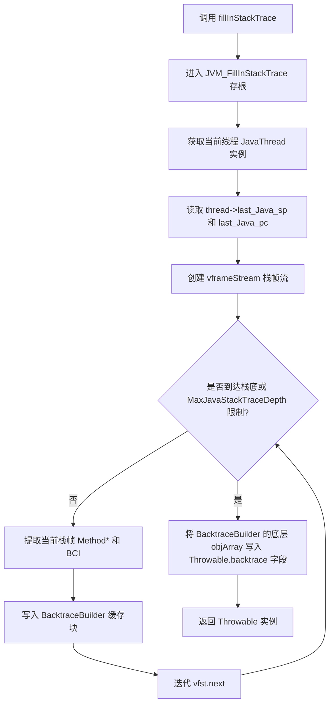
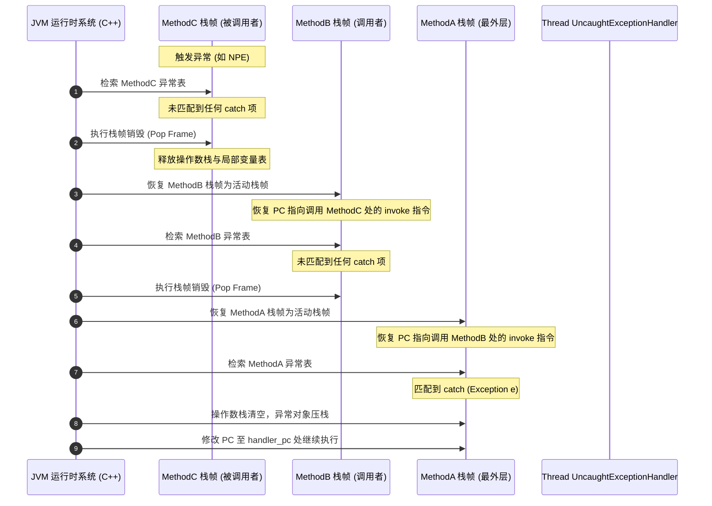

# JVM实现异常

在 Java 语言中，异常处理（Exception Handling）不仅是保障程序健壮性的核心机制，也是语言 runtime 设计中最为精密和复杂的模块之一。从表面上看，Java 开发者只需要使用简单的 `try-catch-finally` 结构和 `throw` 关键字即可实现控制流的异常跳转。但在 JVM 底层，异常的创建、抛出、捕获和回溯涉及了 Java 堆对象、C++ 物理实体映射、操作系统信号拦截、CPU 寄存器修改、JIT 编译期投机优化等一系列极深物理层次的交互。

本文将站在 JVM 实现者视角，以 OpenJDK HotSpot 虚拟机为例，对 JVM 异常实现的物理本质进行多维度的深度剖析。

---

## 1. 异常体系的物理本质与 Throwable 内部结构

### 1.1 Java 异常体系的物理表象与类结构
在 Java 语言层，`java.lang.Throwable` 是所有错误（`Error`）和异常（`Exception`）的共同超类。其继承关系如下：

```
                    +------------------+
                    |    Throwable     |
                    +--------+---------+
                             |
              +--------------+--------------+
              |                             |
     +--------v--------+           +--------v--------+
     |      Error      |           |    Exception    |
     +-----------------+           +--------+--------+
                                            |
                                   +--------v--------+
                                   | RuntimeException|
                                   +-----------------+
```

* **Error**：表示 JVM 无法恢复的严重系统问题，如内存溢出（`OutOfMemoryError`）或栈溢出（`StackOverflowError`）。通常不建议在应用层捕获此类错误。
* **Exception**：表示程序运行中的非正常情况，分为受检异常（Checked Exception）和非受检异常（Unchecked Exception / RuntimeException）。

然而，在 JVM 物理视角下，无论是 `Error` 还是 `Exception`，它们都是驻留在 JVM 堆（Heap）上的常规 Java 对象（`oopDesc` 的实例）。它们的特殊之处在于其内部持有一些与 JVM 本地代码（C++）密切关联的特殊数据结构，这些字段支撑起了整个运行时的调用栈回溯。

### 1.2 java.lang.Throwable 的核心字段物理布局及 backtrace 的神秘面纱
在 HotSpot 源码中，`java.lang.Throwable` 类有以下关键字段：

```java
public class Throwable implements Serializable {
    // 详细的错误描述信息
    private String detailMessage;

    // 当前异常的成因（引起该异常的另一个异常），构成链表结构
    private Throwable cause = this;

    // 解析后的 Java 堆栈元素数组，对 Java 用户可见
    private StackTraceElement[] stackTrace = UNASSIGNED_STACK;

    // 神秘的 backtrace 字段，用于在 JVM 底层存放物理调用栈信息
    private transient Object backtrace;
    
    // ...
}
```

这里最为关键且神秘的字段是 `backtrace`。在 Java 代码中，它被声明为 `Object` 并且被标记为 `transient`，外部代码无法直接访问它。在 JVM 运行时的物理布局中，`backtrace` 的本质是一个由 JVM 内部的 C++ 实体填充并消费的特殊数据结构。

在 HotSpot JVM 中，当异常被实例化或调用 `fillInStackTrace()` 时，JVM 并不急于立即把调用栈翻译成大量的 `StackTraceElement` 对象。相反，JVM 会在 `backtrace` 中保存一套极其紧凑的底层元数据引用。

在 HotSpot C++ 源码的 `java_lang_Throwable` 类定义中，通过物理偏移行（Offsets）直接绑定并读写该字段。其底层物理结构实际上是一个链表，链表的每个节点都是一个 `objArrayOop`（Java 对象数组）。这个数组通常包含以下两个关键元素：
1. **Method Array**：一个 `typeArrayOop`（基本类型数组），其内部保存的是当前调用栈帧对应的 `Method*` 指针的压缩形式或弱引用 ID（为了防止 Class Unloading 导致内存悬挂指针）。
2. **BCI Array**：一个 `typeArrayOop`，用来保存当前栈帧执行到的字节码偏移量（BCI, Bytecode Index）。

当 `backtrace` 链表建立好后，`Throwable` 仅仅在内存中引用了这个底层元数据数组，而此时并没有产生任何类名、方法名或文件名的字符串对象。这种设计是为了**延迟解析（Lazy Resolution）**，以减少异常创建时的即时开销。

---

### 1.3 Throwable.fillInStackTrace() 本地方法的底层实现机制
当调用 `new Throwable()` 时，构造函数会默认触发本地方法（Native Method）`fillInStackTrace()`。其在 JVM 中的物理执行逻辑可以拆解为以下微观过程：



#### 1.3.1 JavaThread 栈帧流（vframeStream）的遍历机制
当本地方法 `JVM_FillInStackTrace` 被触发时，JVM 物理执行流会从 Java 态切换到 C++ 态。此时，JVM 首先会获取当前线程的 C++ 实体 `JavaThread` 指针。

在 HotSpot 中，通过读取 `JavaThread` 内部维护的物理寄存器缓存，即最后一次执行 Java 代码时的栈指针（`last_Java_sp`）和程序计数器（`last_Java_pc`），构建出一个虚拟栈帧流 `vframeStream`：

```cpp
// HotSpot C++ 伪代码示意
vframeStream vfst(thread);
```

`vframeStream` 是一个辅助迭代器，它屏蔽了物理平台（x86、ARM 等）的硬件差异，能够自顶向下依次遍历当前线程在 JVM 虚拟机栈（VM Stack）中的每一个活跃栈帧（Stack Frame）。

#### 1.3.2 解释执行与 JIT 编译（Deoptimization/OopMap）下的栈帧元数据抓取
遍历过程中，`vframeStream` 会遇到两种不同状态的栈帧：
1. **解释执行栈帧（Interpreter Frame）**：
   解释执行时，栈帧的物理内存结构非常标准。JVM 可以直接解引用栈帧指针（Frame Pointer, FP），读取当前栈帧内部保存的 `Method*` 指针，并通过当前线程的 PC 指向的解释器字节码流地址减去该方法的字节码起始物理地址，直接计算出当前的字节码索引（BCI）。
2. **JIT 编译执行栈帧（Compiled Frame）**：
   当方法被 C1 或 C2 编译器编译为本地机器码后，为了榨干 CPU 性能，物理栈帧被高度压缩和重构，原本的 `Method*` 指针和 BCI 根本不会存在于物理寄存器或栈帧的固定偏移处。
   为了恢复这些元数据，JVM 必须进行“去优化（Deoptimization）”式的符号重建。JIT 编译器在编译代码时，会在特定的机器码位置（如方法调用点、可能会抛出异常的异常检测点）记录大量的调试信息表，即 **OopMap** 和 **ScopeDesc**。
   * `ScopeDesc` 详细记录了在当前物理 PC 偏移量下，逻辑上对应哪个 Java 方法、哪一行字节码（BCI）以及当前哪些物理寄存器或栈槽存储了哪些局部变量。
   * JVM 通过在 `PcDesc` 表中进行二分查找，定位到当前物理 PC 对应的 `ScopeDesc`，从而逆向抓取到真实的 `Method*` 和 `BCI`。

#### 1.3.3 BCI 与 Method* 物理指针的收集
`BacktraceBuilder` 将这些收集到的 `Method*` 地址和 `BCI` 整型值依次存入预先分配好的数据区中。

值得注意的是，在多线程环境下，为防止 `Method*` 指向的类在垃圾回收期间被卸载（Class Unloading）而导致指针失效，JVM 并不会直接保存原始的物理地址。在启用类卸载的 JVM 配置中，JVM 会将 `Method*` 转换为一个全局唯一的、代表该方法的弱引用标识符（如 `jmethodID`），或者是将其类加载器放入垃圾回收的根集（Root Set）中以保持其活性。

---

### 1.4 惰性符号解析（Lazy Resolution）的微观过程
虽然 `Throwable.backtrace` 已经建立，但此时我们在控制台上是看不到可读的类名、方法名和行号的。只有当 Java 应用程序试图读取堆栈——例如调用 `Throwable.getStackTrace()`，或者调用 `printStackTrace()` 打印堆栈时，JVM 才会启动第二阶段的**符号解析**。

```cpp
// HotSpot 内部符号解析过程伪代码示意
void java_lang_Throwable::get_stack_trace_element(Handle throwable, int index, Handle stack_trace_element, TRAPS) {
    // 从 Throwable 的 backtrace 字段读取 Method* 和 BCI
    Method* method = get_method_from_backtrace(throwable, index);
    int bci = get_bci_from_backtrace(throwable, index);

    // 1. 解析 InstanceKlass 获取类名
    InstanceKlass* holder = method->method_holder();
    Symbol* class_name = holder->name();

    // 2. 解析方法名
    Symbol* method_name = method->name();

    // 3. 解析源文件名
    Symbol* source_file = holder->source_file_name();

    // 4. 根据 BCI 在 LineNumberTable 中检索行号
    int line_number = method->line_number_from(bci);

    // 5. 构造 Java 层的 StackTraceElement 对象并返回
    // ...
}
```

#### 1.4.1 StackTraceElement 的生成与符号表（SymbolTable）哈希检索
在上述过程中，类名和方法名在 JVM 元空间（Metaspace）中是以特殊的 UTF-8 符号类（`Symbol`）形式存在的。为了将它们转换为 Java 堆中的 `java.lang.String` 对象，JVM 需要：
1. 访问 JVM 内部的全局符号表 `SymbolTable`（本质上是一个并发的 C++ 哈希表）。
2. 将 C++ 字符数组拷贝并转化为 Java 堆上的字符数组（`char[]` 或 `byte[]`），然后实例化 `java.lang.String` 对象。
3. 通过读取 `InstanceKlass` 的属性区，解析出编译时写入的 `SourceFile` 属性。
4. 检索 `Method` 内部的 `LineNumberTable` 字节数组。该数组将字节码 BCI 映射到源文件行号。JVM 使用二分查找或顺序扫描该数组，找到最接近当前 `bci` 值的物理行号。

#### 1.4.2 符号解析时的 ClassLoader 参与及类加载锁竞争
由于符号解析需要通过 `Method*` 获取其对应的 `InstanceKlass`，而 `InstanceKlass` 绑定了定义它的类加载器（ClassLoader）。
在复杂的应用（如微服务框架、OSGi、动态代理频繁生成的系统）中，如果多个线程在同一时间抛出大量异常并并发解析堆栈，就会频繁调用 `ClassLoader.loadClass` 或者是锁住类加载器的内部锁定标记。这会在 JVM 层引发激烈的锁竞争（Monitor Contention），降低系统的整体吞吐量。

---

### 1.5 异常收集的硬件级与内存级开销本质
为什么在 Java 中创建异常的开销如此之大？我们可以从计算机硬件的底层机制来剖析这一问题：

1. **缓存失效（Cache Miss）**：
   CPU 访问寄存器耗时 < 1ns，访问 L1 Cache 耗时约 1-2ns，而访问物理内存（DRAM）则需要 50-100ns。
   在遍历调用栈时，JVM 需要沿着栈指针回溯内存。由于线程栈的空间可能很大，且由于编译优化或 JIT 栈帧的重组，栈帧所处的内存地址并不是完全连续的。
   更严重的是，符号解析阶段需要从元空间中查找 `InstanceKlass`、`Method` 元数据以及符号表。这些元数据分散在 JVM 的不同内存页中，每一次解引用都会引发 CPU 的 L1/L2/L3 **缓存失效（Cache Miss）**，迫使 CPU 频繁停顿并等待 DRAM 的数据载入，导致 CPU 流水线被完全阻塞。
2. **TLAB 迅速爆满与 GC 压力**：
   一次普通的异常创建并解析堆栈，如果是 30 层的调用栈深度，就需要创建 1 个 `Throwable`、30 个 `StackTraceElement`、几十个描述类名、方法名和文件名的 `String`，以及这些 String 内部的 `byte[]` 数组。
   这在 Java 堆上瞬间产生了上百个小对象。这些小对象虽然在 TLAB（Thread Local Allocation Buffer，线程私有分配缓冲区）中分配，但在高并发场景下，TLAB 会被迅速占满，进而退化到共享的 Eden 区进行分配。这会频繁触发 JVM 的 Minor GC，导致应用程序的整体吞吐量骤降。

---

## 2. try-catch-finally 在 Class 字节码层面的物理实现与异常表机制

要探究 JVM 是如何捕获并处理异常的，我们必须深入到 Class 字节码的结构中。Java 中的 `try-catch-finally` 语法在编译为字节码后，并没有对应名为 `try` 或 `catch` 的指令，而是完全依赖于 **异常表（Exception Table）**。

### 2.1 异常表（Exception Table）的物理结构解析
在 Class 文件中，每个方法的 `Code` 属性内部都包含了一个名为 `exception_table` 的结构。异常表实际上是一个数组，每一项代表一个异常处理器（Exception Handler）。

根据《Java虚拟机规范》，一个异常表项的物理结构包含以下四个字段：

```
+------------------+------------------+------------------+------------------+
| start_pc (2字节)  |  end_pc (2字节)  | handler_pc (2字节)| catch_type (2字节)|
+------------------+------------------+------------------+------------------+
```

| 字段名 | 物理含义 | 描述 |
| :--- | :--- | :--- |
| `start_pc` | 监控起始 PC 偏移量 | try 块对应的字节码指令的起始偏移量（包含该偏移量对应的指令）。 |
| `end_pc` | 监控结束 PC 偏移量 | try 块对应的字节码指令的结束偏移量（不包含该偏移量对应的指令）。即监控范围为 `[start_pc, end_pc)`。 |
| `handler_pc` | 处理程序入口 | 当在 `[start_pc, end_pc)` 范围内发生异常，且异常类型匹配时，控制流将跳转到此偏移量执行。 |
| `catch_type` | 异常类型索引 | 常量池索引，指向一个 `CONSTANT_Class_info`，表示捕获的异常类。如果为 0，则代表捕获任何异常（通常用于 `finally` 块）。 |

#### 2.1.1 start_pc, end_pc, handler_pc, catch_type 的字节码布局及范围表示
* `start_pc` 和 `end_pc` 定义了一个**前闭后开**的区间。这意味着只有当发生异常的字节码偏移量（BCI）满足 `start_pc <= BCI < end_pc` 时，这一项才可能匹配。
* `catch_type` 的值为 0 是 JVM 实现 `finally` 和 `synchronized` 资源释放的关键所在。它表示一个“通配符匹配”，即任何类型的异常（包括 `Error`、`RuntimeException` 甚至受检异常）在进入此区间时，都会无条件跳转至 `handler_pc`。

#### 2.1.2 异常表项的匹配顺序与编译器自动排序规则
当一个异常发生时，JVM 会**自上而下**依次检索异常表。
为了确保异常能被正确地分类捕获（例如，先捕获子类异常如 `NullPointerException`，再捕获父类异常如 `Exception`），Java 编译器在生成字节码时，会自动将特化度最高的子类异常处理器放在异常表的最前面，而将范围较广的父类异常处理器（如 `Throwable`、`any`）放在表的末尾。

如果开发人员颠倒了异常的 catch 顺序（比如在 Java 代码中先写 `catch (Exception e)`，再写 `catch (NullPointerException e)`），Java 编译器会直接报错，因为后者在异常表中永远无法被匹配到。

---

### 2.2 finally 块的物理编译演进与代码复制机制
在 Class 字节码层面，`finally` 块的实现是一门精妙的编译艺术。

#### 2.2.1 废弃 jsr/ret 的技术内幕与数据流验证（Verifier）的冲突
在早期（JDK 1.4 及以前），编译器使用 `jsr`（Jump to Subroutine）和 `ret` 指令来实现 `finally` 块。
* `jsr` 指令会将当前执行位置的下一条指令压入操作数栈，然后跳转到 `finally` 对应的子程序执行。
* `ret` 指令则从指定的局部变量中读取返回地址，跳转回去继续执行。

然而，这种设计给 JVM 的**字节码校验器（Class Verifier）**带来了灾难性的复杂度。
字节码校验器需要在加载类时，通过单遍数据流分析（Data Flow Analysis）确保操作数栈和局部变量表的类型安全。由于 `jsr` 和 `ret` 允许多个不同的调用源跳转到同一个公共的子程序，并且该子程序在返回前可能会修改局部变量的类型，这使得校验器需要计算出极其复杂的数据流汇聚点，极易引入安全漏洞，且大幅拉慢了类加载的速度。

因此，从 JVM 规范（Class 文件版本 50.0，即 JDK 6）开始，`jsr` 和 `ret` 指令被正式**废弃**并禁止在 Class 文件中使用。

#### 2.2.2 正常分支、catch 分支与 exception-any 异常拦截分支的物理复制
为了替代 `jsr`/`ret`，现代 Java 编译器采用了**代码物理复制（Code Duplication）**的策略。
编译器在编译 `try-catch-finally` 结构时，会将 `finally` 块中的字节码指令复制成多个副本，分别植入到以下控制流的物理出口处：

1. **正常的 Try 分支出口**：在 `try` 块代码结束并执行 `return` 或跳出控制流之前，物理执行一次 `finally` 副本。
2. **正常的 Catch 分支出口**：在每个 `catch` 块代码结束并执行 `return` 或跳出控制流之前，物理执行一次 `finally` 副本。
3. **未捕获的异常（Any）出口**：编译器会自动生成一个隐式的 `catch-all` 异常处理器（在异常表中，`catch_type` 记为 0）。如果 try 或 catch 块内抛出了任何没有被显式捕获的异常，控制流就会被劫持到这个 any 处理器。在该处理器中：
   * 提取抛出的异常对象，暂存到局部变量表中。
   * 执行 `finally` 块的副本。
   * 重新装载刚才暂存的异常对象，并调用 `athrow` 指令将其向外抛出。

#### 2.2.3 finally 中包含 return 或重新抛出异常时，对原有返回值及异常流的覆盖机制
如果在 `finally` 块中显式写了 `return` 语句，或者在 `finally` 块中抛出了新的异常，会发生非常诡异的现象：**原本应该向外抛出的异常或 try/catch 中原有的返回值会被彻底“吞掉”**。

其物理原因在于：
* 在 any 异常分支中，JVM 在执行 `finally` 复制出的代码副本时，如果遇到 `finally` 里的 `return` 指令，JVM 的执行流会直接从当前栈帧返回，原先暂存在局部变量表、等待在 `finally` 结束后通过 `athrow` 抛出的那个原始异常对象，就会因为栈帧的弹出而被直接销毁。
* 同理，如果 `finally` 副本中抛出了新异常（执行了新的 `athrow`），这个新异常会代替原始异常被抛出，原始异常信息将彻底丢失。

---

### 2.3 Java 异常源码与 javap -v 编译后字节码控制流指令映射对照（实战解密）
为了彻底厘清这一机制，我们编写一段包含 try-catch-finally 且具有多个返回路径的典型 Java 源码：

```java
package com.jvm.exception;

public class ExceptionControlFlow {
    public int execute(int val) {
        try {
            if (val == 0) {
                int result = 10 / val; // 触发 ArithmeticException
                return result;
            }
            return 100; // 正常返回路径
        } catch (ArithmeticException e) {
            return -1; // 异常捕获返回路径
        } finally {
            val = 999; // finally 块修改局部变量
        }
    }
}
```

使用 `javac ExceptionControlFlow.java` 编译，并使用 `javap -v ExceptionControlFlow.class` 进行反编译。以下是该方法反编译后的核心字节码与异常表：

```
  public int execute(int);
    descriptor: (I)I
    flags: (0x0001) ACC_PUBLIC
    Code:
      stack=2, locals=5, args_size=2
         0: iload_1                     // 装载入参 val (第 1 个局部变量槽)
         1: ifne          19            // 如果 val != 0，跳转到 19 (正常返回 100)
         4: bipush        10            // 压入常数 10
         6: iload_1                     // 装载 val (值为 0)
         7: idiv                        // 10 / 0，物理触发 ArithmeticException
         8: istore_2                    // 将计算结果存入 result (第 2 个局部变量槽)
         9: iload_2                     // 装载 result
        10: istore_3                    // 临时存储返回值到第 3 个局部变量槽
        11: sipush        999           // 【Finally 副本 1 开始】修改 val = 999
        14: istore_1                    
        15: iload_3                     // 重新装载之前保存的返回值
        16: ireturn                     // 从 try 块的正常路径返回
        17: astore_2                    // 【Catch 块入口】捕获 ArithmeticException 写入第 2 变量槽
        18: iconst_m1                   // 压入常量 -1
        19: istore_3                    // 临时存储返回值 -1 到第 3 个局部变量槽
        20: sipush        999           // 【Finally 副本 2 开始】修改 val = 999
        23: istore_1                    
        24: iload_3                     // 重新装载返回值 -1
        25: ireturn                     // 从 catch 块的正常路径返回
        26: sipush        999           // 【Finally 副本 3 开始】修改 val = 999 (val != 0 时的 try 分支返回)
        29: istore_1                    
        30: bipush        100           // 压入返回值 100
        32: ireturn                     // 正常返回 100
        33: astore        4             // 【Any 异常处理器入口】捕获任意未被捕获的异常，暂存到第 4 变量槽
        35: sipush        999           // 【Finally 副本 4 开始】修改 val = 999
        38: istore_1                    
        39: aload         4             // 重新装载刚才暂存的异常对象
        41: athrow                      // 抛出异常
      Exception table:
         from    to  target type
             0    11    17   Class java/lang/ArithmeticException
             0    11    33   any
            17    20    33   any
```

#### 2.3.1 控制流指令详细拆解与物理路径追踪
让我们顺着字节码指令的执行轨迹，追踪各种不同的物理路径：

* **路径 A：正常分支，入参 `val` 为 2**
  1. 执行 `0: iload_1` 装载值 2，`1: ifne 19`。由于值非 0，判定成立跳转。
  2. 控制流跳转至字节码偏移量 `26` 处（在优化后的字节码布局中）。
  3. 执行 `26: sipush 999` 和 `29: istore_1`。这是编译器为 `try` 正常块复制的 `finally` 代码副本，修改局部变量 `val` 为 999。
  4. 执行 `30: bipush 100` 将返回值 100 压栈，通过 `32: ireturn` 将其返回。

* **路径 B：触发捕获的异常，入参 `val` 为 0**
  1. 执行 `0: iload_1`，由于值为 0，`1: ifne` 不跳转，继续执行。
  2. `4: bipush 10`, `6: iload_1`, `7: idiv`。由于除数为 0，CPU 硬件抛出异常。
  3. 此时，JVM 异常处理引擎介入，当前出错 BCI 为 7。检索异常表。
  4. 第一行匹配：`from = 0, to = 11`。BCI 7 处于此区间，且异常类为 `ArithmeticException`。匹配成功，跳转至 `target = 17`。
  5. 此时操作数栈被重置，异常对象引用压栈。执行 `17: astore_2`，将异常写入第 2 局部变量槽。
  6. 执行 `18: iconst_m1`（压入 -1），`19: istore_3`（暂存返回值到第 3 变量槽）。
  7. 执行 `20: sipush 999; 23: istore_1`（执行编译期复制的 finally 代码副本）。
  8. 执行 `24: iload_3` 将 -1 重新载入栈顶，`25: ireturn` 返回 -1。

* **路径 C：非预期异常（例如在 try 块中发生了 NullPointerException）**
  1. 假设在执行 `try` 块的 `0` 到 `11` 字节码时发生了 NPE（例如调用了 null 对象的方法）。
  2. JVM 检索异常表。第一行类型不匹配；第二行 `from = 0, to = 11, target = 33, type = any` 匹配成功。
  3. 跳转到 `33: astore 4`，将 NPE 异常引用写入第 4 变量槽。
  4. 执行 `35: sipush 999; 38: istore_1`，执行 finally 的代码副本。
  5. 执行 `39: aload 4` 将原 NPE 异常引用重新压回栈顶，`41: athrow` 将该异常抛出给上一层调用者。
  6. 假设异常发生在 `catch` 块中（即 BCI 处于 `17` 到 `20` 之间），检索异常表第三行：`from = 17, to = 20, target = 33, type = any`，同样会被拦截到 `33` 执行 finally 并重新抛出。这确保了 finally 逻辑的万无一失。

---

## 3. 运行时调用栈回溯（Stack Unwinding）递归查找算法

当一个异常在当前方法中被触发，并且在当前方法的异常表中**没有任何匹配项**时，JVM 就会启动**运行时调用栈回溯（Stack Unwinding）**算法。这是 JVM 运行时系统（Runtime System）最为核心的状态机跳转逻辑之一。

### 3.1 异常发生时的方法内快速查找逻辑
当异常抛出时，JVM 运行时系统首先尝试在当前执行的方法内定位 Handler：
1. **获取当前 PC**：以当前线程的程序计数器（或字节码索引 BCI）作为查找键值。
2. **检查异常表**：自上而下匹配 `start_pc <= BCI < end_pc`。
3. **类型判定（is_subtype_of）**：
   如果 PC 落在区间内，JVM 会读取 `catch_type` 指向的类信息。若 `catch_type` 不为 0，JVM 会在底层调用 C++ 的类型匹配判定：
   ```cpp
   // HotSpot 底层类型判定
   bool is_match = thrown_exception_klass->is_subtype_of(catch_klass);
   ```
   该方法会沿着抛出异常类的继承链自下而上进行哈希匹配或快速槽检索（Primary/Secondary Supers 数组匹配），以确认抛出的异常是否能够向上转型为 catch 声明的类型。
4. **清空与入栈**：若匹配成功，JVM 立即重置当前栈帧的操作数栈，将异常对象的引用压入栈顶，并将 PC 跳转到 `handler_pc` 继续解释执行。

---

### 3.2 跨方法栈帧弹出与调用者回溯时序
若在当前方法内未找到匹配的异常表项，JVM 就必须进行**跨方法回溯**：



#### 3.2.1 物理栈帧（Stack Frame）弹出过程中的状态恢复
当 JVM 决定弹出当前栈帧（如 `MethodC`）时，它会进行以下物理操作：
1. **释放本地锁（Monitor Release）**：
   如果当前方法被声明为 `synchronized`，或者方法内部含有 `monitorenter` 后未释放的同步块，JVM 会在此处隐式地执行 `monitorexit` 操作，释放当前线程持有的 Monitor 锁，防止死锁。
2. **恢复寄存器与指针**：
   从当前的物理栈帧中读取前一个栈帧的保存状态，将当前 CPU 的栈指针（SP）回退到调用者栈帧的边界，恢复调用者的帧指针（FP），并重置当前线程的活动栈帧标记。
3. **确定调用者 PC 检索点**：
   回退到调用者方法（如 `MethodB`）后，JVM 需要在 `MethodB` 中继续查找异常。此时，用于检索的 `PC/BCI` 就是调用者调用 `MethodC` 的那条 `invoke*` 指令（如 `invokevirtual`、`invokestatic`）在 `MethodB` 内部的字节码偏移量。

#### 3.2.2 递归回溯的时间复杂度与最坏情况分析
如果异常沿着调用链一路回溯，每一层都需要重复上述“销毁当前帧 -> 恢复调用者帧 -> 顺序检索异常表”的过程。
* **时间复杂度**：若调用栈深度为 $D$，且平均每个方法的异常表长度为 $L$，则在最坏情况下，栈回溯的匹配复杂度为 $\mathcal{O}(D \times L)$。
* **物理开销**：当调用栈极深（如递归未终止导致 `StackOverflowError`，或者深度达数百层）时，跨栈帧的指针迁移和状态恢复会导致大量的 CPU 总线周期消耗。

---

### 3.3 线程主入口的终极屏障：未捕获异常处理器（UncaughtExceptionHandler）
如果调用栈一直回溯到了当前线程的最外层栈帧（通常是 `Thread.run()`，或者主线程的 `main(String[] args)` 方法）仍旧无法找到任何匹配的 catch 处理器，这意味着异常将导致该线程的非正常夭折。

#### 3.3.1 Thread.dispatchUncaughtException 的派发逻辑与线程消亡
在销毁线程前的最后时刻，JVM 运行时系统会回调 Java 层的方法来进行收尾工作：

1. **回调 Java 入口**：
   JVM 调用目标线程对象上的 `Thread.dispatchUncaughtException(Throwable e)` 方法。
2. **三级处理器检索**：
   Java 层的派发器会按照以下顺序寻找 `UncaughtExceptionHandler`：
   * **第一级**：检查当前 `Thread` 实例是否通过 `setUncaughtExceptionHandler()` 设置了私有的处理器。
   * **第二级**：若没有，则调用当前线程所属的 `ThreadGroup`（线程组）的 `uncaughtException()` 方法。通常，线程组会默认把异常转交给父线程组，直到根线程组。
   * **第三级**：若线程组也未处理，则转交给全局默认的处理器，即通过 `Thread.setDefaultUncaughtExceptionHandler()` 注册的句柄。
3. **默认输出与销毁**：
   如果没有任何自定义处理器，JVM 默认的处理器会将异常名称和解析后的完整堆栈轨迹（Stack Trace）输出到标准错误流（`System.err`），然后安全地销毁该线程的 C++ 实体与 Java 实体。
   如果发生未捕获异常的线程是 JVM 进程中最后的非守护线程（Non-Daemon Thread），JVM 进程将自动退出。

---

## 4. 显式抛出与隐式抛出的物理分发差异

在 JVM 执行引擎中，异常的触发方式在物理层面上分为两大派系：由 Java 字节码指令主动触发的**显式抛出（Explicit Throw）**，以及由硬件中断或虚拟机边界状态自动拦截触发的**隐式抛出（Implicit Throw）**。

### 4.1 显式抛出：athrow 字节码指令的物理执行路径
显式抛出是 Java 开发者在代码中通过 `throw new MyException();` 产生的行为。编译器会将其翻译为 `athrow` 字节码指令。

#### 4.1.1 栈顶 Null 检查与 NPE 的二次分发
当解释器或 JIT 编译代码执行到 `athrow` 时，其物理步骤如下：
1. **获取操作数栈顶对象引用**：`athrow` 会弹出当前方法操作数栈顶的一个引用类型值。
2. **物理 Null 检查**：
   JVM 会对这个弹出的对象引用进行判定。如果该引用为 `null`，这意味着开发者尝试抛出一个空对象（如 `throw null;`）。
   JVM 会立即终止当前的抛出流程，转而在当前栈帧中直接构造一个 `java.lang.NullPointerException` 实例，并将该 NPE 对象的引用重新压入操作数栈顶，然后对该 NPE 重新触发 `athrow` 的分发控制流。这一过程称为 **NPE 的二次分发**。
3. **正常分发**：如果引用不为 `null`，JVM 提取该 Throwable 对象，并在当前线程的挂起异常槽（Pending Exception Slot）中挂载该对象的引用，随后开启异常表检索程序。

#### 4.1.2 解释器与 JIT 对 athrow 指令的编译映射
* 在**解释器**中，`athrow` 映射到一段固定的 C++ 汇编代码，负责在运行时分发异常。
* 在 **JIT 编译器**中，由于 C1/C2 追求极致的流水线优化，`athrow` 指令通常会被直接编译为一个跳转指令（Jump），跳转到当前方法的异常处理出口存根（Exception Handler Exit Stub）中，尽可能避免在 JIT 代码内做复杂的判断。

---

### 4.2 隐式抛出：硬件级中断与 JVM 信号处理机制
隐式抛出不需要在字节码中包含任何 `athrow` 指令，它是当程序运行发生致命物理错误时，由底层硬件、操作系统和 JVM 协同注入的异常。

#### 4.2.1 操作系统信号（SIGFPE, SIGSEGV）的内核分发与 JVM Signal Handler 拦截
以 Linux x86_64 平台为例，当 Java 代码试图执行 `int i = 1 / 0;` 时：
1. **CPU 硬件中断**：CPU 的算术逻辑单元（ALU）在执行除法指令时，检测到除数为 0，物理上触发一个**除零中断（Vector 0, Divide-by-Zero Exception）**。
2. **内核态转换**：CPU 暂停当前指令，切换到内核态，操作系统捕获该中断，并根据当前进程的 PID，向 JVM 进程发送一个 `SIGFPE`（Floating Point Exception）信号。
3. **信号拦截**：JVM 在启动阶段（`os::init_2`）已经使用系统的 `sigaction` 机制注册了全局信号处理器 `JVM_handle_linux_signal`。操作系统暂停当前线程，将该线程的物理上下文（包括通用寄存器、栈指针 SP、指令指针 PC/RIP）打包封装在一个 `ucontext_t` 结构体中，随后调用 JVM 的信号处理器。

#### 4.2.2 修改线程上下文 ucontext_t 中 PC/RIP 寄存器实现控制流劫持（Implicit Null Checks）
当 JVM 的 `JVM_handle_linux_signal` 被回调时，它会执行以下物理劫持操作：

```
+-------------------------------------------------------+
|                 操作系统内核信号分发                   |
| 1. 拦截硬件除零/缺页中断                              |
| 2. 将物理寄存器状态打包到 ucontext_t                   |
+---------------------------+---------------------------+
                            | 调用信号处理程序
                            v
+-------------------------------------------------------+
|         JVM 信号处理器 (JVM_handle_linux_signal)      |
| 1. 检查发生错误时的物理 RIP 地址是否在 JIT 代码段中     |
| 2. 确认错误类型 (除零 SIGFPE / 空指针 SIGSEGV)        |
| 3. 修改 ucontext_t 内部的 RIP = 异常抛出存根物理地址   |
+---------------------------+---------------------------+
                            | 信号处理程序返回
                            v
+-------------------------------------------------------+
|                   CPU 恢复执行流                       |
| 此时 RIP 已被劫持，不再返回原出错指令，而是直接执行    |
| JVM 异常抛出存根 (Exception Throwing Stub)，分配 NPE/ |
| ArithmeticException 并开始栈回溯                      |
+-------------------------------------------------------+
```

1. **JIT 代码段判定**：
   JVM 检查发生错误时的物理 RIP 寄存器地址是否落在 JIT 编译生成的 CodeCache 区域内。
2. **物理 PC 劫持**：
   如果是，以空指针访问（触发 `SIGSEGV`，由于物理 MMU 拦截到 0 地址页受保护访问）为例，JVM 不会允许进程崩溃。它会直接修改传入的 `ucontext_t` 指针：
   ```cpp
   // C++ 示意：劫持物理寄存器 RIP
   uc->uc_mcontext.gregs[REG_RIP] = (greg_t)SharedRuntime::implicit_null_handler_common();
   ```
   JVM 将物理 RIP 劫持为预设的 `implicit_null_handler_common`（隐式空指针处理存根）的物理入口地址。
3. **控制流恢复**：
   信号处理器执行完毕返回。操作系统内核恢复当前线程。此时，CPU 的物理 RIP 已经指向了 JVM 的存根代码，而不是原先出错的指令。
4. **生成异常并回溯**：
   存根代码在常规的 Java 线程上下文中执行，安全地分配 `java.lang.NullPointerException` 对象，填充堆栈，并直接跳转到运行时系统的栈回溯引擎。

通过这种隐式硬件信号拦截技术，JIT 编译器在生成对象属性访问的机器码时，**不需要**在每一次 `obj.field` 之前都显式插入 `cmp obj, 0; je throw_npe;` 这样的判断和跳转机器指令。这极大地减少了 JIT 生成的指令条数，让 CPU 分支预测器（Branch Predictor）工作得更加高效，从而带来了极高的性能收益。这一优化被称为 **Implicit Null Checks**。

---

### 4.3 隐式抛出：JVM 内部边界/类型检查的指令注入
对于无法通过硬件 MMU 或者是 CPU 硬件中断捕获的逻辑越界，JVM 必须显式注入机器码检测指令。

#### 4.3.1 数组越界检查与类型转换检查的汇编指令分支跳转
以**数组越界（ArrayIndexOutOfBoundsException）**为例：
1. **指令注入**：
   当进行 `array[index]` 操作时，JIT 编译器会生成两条紧邻的汇编指令：
   ```assembly
   movl 12(%r11), %r8d  # 读取数组 length 到 r8d 寄存器中 (假设偏移为12)
   cmpl %r8d, %ebx      # 比较 index (ebx) 与 length (r8d)
   jae  throw_array_index_out_of_bounds_stub # 若无符号大于等于，跳转至越界存根
   ```
2. **存根跳转**：
   如果 `index` 越界，CPU 分支跳转到 JVM 运行时系统的数组越界异常存根。该存根会构造 `ArrayIndexOutOfBoundsException` 实例并开启分发。
3. **类型转换（checkcast）**：
   当执行 `(MyClass) obj` 时，若类型不匹配，JVM 的 `checkcast` 辅助机器指令判定失败，直接跳转到 `throw_class_cast_exception` 存根。

---

### 4.4 显式抛出与隐式抛出路径的物理对比表

| 对比维度 | 显式抛出 (`athrow`) | 隐式抛出（硬件中断） | 隐式抛出（JVM 注入检查） |
| :--- | :--- | :--- | :--- |
| **触发源** | Java 字节码指令 `athrow` | CPU 硬件异常（除零、无效页访问） | JIT 编译器在机器码中插入的比较指令 |
| **硬件参与** | 无，纯软件指令解析 | 有，CPU 产生硬件 Trap，MMU 产生缺页 | 无，由普通 CPU 比较指令触发 |
| **操作系统介入** | 无 | 有，发送 `SIGFPE` / `SIGSEGV` 信号 | 无 |
| **异常分发起点** | 从当前字节码位置直接启动 | 信号处理器劫持 RIP 寄存器跳转到存根 | 条件跳转指令直接跳入 JVM 运行时存根 |
| **典型异常类型** | 用户自定义异常、业务逻辑异常 | `NullPointerException`, `ArithmeticException` | `ArrayIndexOutOfBoundsException`, `ClassCastException` |
| **JIT 编译开销** | 存在固定的异常分支跳转 | 正常路径无任何额外比较机器指令开销 | 正常路径需要执行 `cmp` 和跳转判定指令 |

---

## 5. JVM 异常性能瓶颈调优：无栈异常与堆栈控制

如前文所述，Java 异常的性能开销 $99\%$ 集中在本地方法 `fillInStackTrace()` 遍历栈帧和惰性符号解析的阶段。如果一个系统频繁抛出异常，会导致 CPU 的 Cache Miss 率飙升、GC 频繁，甚至发生锁竞争。

在特定的业务场景（如解析器回溯、网络通信框架状态跳转、高性能网关鉴权失败）中，如果我们仅仅需要使用异常的“控制流跳转”能力，而不需要查看完整的堆栈轨迹，我们就必须对异常进行性能调优。

### 5.1 异常创建性能衰减的物理度量
在一台标准的 x86_64 服务器上，通过 JMH 测量以下三种操作的平均耗时（示意数据，基于常规 JVM 性能表现）：
1. **新建普通 Java 对象 (`new Object()`)**：约 $3 \sim 5\text{ ns}$。
2. **新建无栈异常 (`new LightException()`)**：约 $5 \sim 8\text{ ns}$。
3. **新建带堆栈的异常 (`new Exception()`) 深度 10 层**：约 $1,200 \sim 2,500\text{ ns}$。
4. **新建带堆栈的异常 深度 50 层**：约 $8,000 \sim 15,000\text{ ns}$。

可以看出，带有完整堆栈的异常创建速度比普通 Java 对象慢了上千倍，并且随着调用深度的增加，开销呈线性增长。

---

### 5.2 重写 fillInStackTrace() 消除堆栈填充（无栈异常）
为了完全消除这部分物理开销，最直接且高效的方法是重写 `Throwable` 类的 `fillInStackTrace()` 本地方法。

#### 5.2.1 消除同步锁（synchronized）与栈遍历的实现方案
`Throwable.fillInStackTrace()` 本身是一个被 `synchronized` 修饰的方法：
```java
public synchronized Throwable fillInStackTrace() {
    // ...
}
```
在高并发环境下，当多个线程并发抛出同类异常时，还会因为这个 `synchronized` 关键字产生锁竞争。

我们可以通过重写该方法，直接将其修改为**非同步方法**且**立即返回本身**，彻底绕过底层 `vframeStream` 的栈遍历：

```java
public class LightweightException extends RuntimeException {
    
    public LightweightException(String message) {
        super(message);
    }

    /**
     * 重写本地方法，不调用 super.fillInStackTrace()。
     * 去掉 synchronized 修饰，彻底消除锁竞争。
     * 直接 return this，避免了所有的物理栈帧遍历和符号缓存数组的创建。
     */
    @Override
    public Throwable fillInStackTrace() {
        return this;
    }
}
```

通过这一简单的改造， `LightweightException` 的创建开销会直接降到与普通 Java 对象完全一致的水平（纳秒级）。

#### 5.2.2 单例无栈异常在特定控制流跳转中的应用与性能飞跃
在要求极致性能的场景下，我们甚至可以配合**单例模式（Singleton Pattern）**使用。因为没有了堆栈信息，异常对象本身就是无状态的、静态的，所有线程可以安全地共享同一个异常实例，从而将对象分配的开销也降低至零：

```java
public class ExceptionConstants {
    // 预先分配全局单例无栈异常
    public static final LightweightException AUTH_FAILED = 
        new LightweightException("Authentication Failed") {
            @Override
            public Throwable fillInStackTrace() {
                return this; // 重写保证单例无栈
            }
        };
}
```
在鉴权逻辑中：
```java
if (!isValid(token)) {
    throw ExceptionConstants.AUTH_FAILED; // 零分配、零栈回溯，极致性能的异常跳转
}
```
这种用法在 Netty 等异步高性能网络框架的解析器中被广泛采用。

---

### 5.3 全局参数 -XX:-StackTraceInThrowable 的深度剖析
JVM 提供了一个全局的命令行参数：`-XX:-StackTraceInThrowable`（注意中间是减号 `-`，代表禁用）。

#### 5.3.1 全局禁用堆栈的性能收益与灾难性可排障性丧失
* **物理效果**：
  一旦启用该参数，JVM 底层在创建任何 `Throwable` 对象时，都会跳过物理栈的收集。所有的 `Throwable.backtrace` 均保持为 `null`。
* **优点**：
  对于一些写得非常糟糕、包含大量不合理异常抛出（如用异常做表单校验、高频抛出业务异常）的遗留系统，这个参数可以瞬间使 CPU 消耗和 GC 压力下降，使系统吞吐量大幅回升。
* **致命缺点**：
  这会导致**全局所有异常的堆栈全部丢失**。无论是开发人员预期的业务异常，还是非预期的致命错误（如 `OutOfMemoryError`、`NullPointerException`），在系统日志里都只会打印出孤零零的类名，没有任何方法调用关系和行号：
  ```
  java.lang.NullPointerException
  (没有堆栈，没有任何其他信息)
  ```
  这直接导致线上故障发生时，开发人员根本无法定位出错的代码位置。因此，在生产环境中，**严禁使用该参数**。

---

## 6. 现代 JIT 编译器的异常优化：OmitStackTraceInFastThrow

除了应用层面的优化，现代 HotSpot 虚拟机的即时编译器（特别是 C2 编译器）在运行期也引入了一项极其聪明的异常自动优化机制——**Fast Throw（快速抛出）**，其物理控制参数为 `-XX:+OmitStackTraceInFastThrow`（默认开启）。

### 6.1 Fast Throw 优化机制的物理成因与触发阈值
在系统运行过程中，某些系统内置异常可能会在代码的同一个位置被极其频繁地抛出。例如，由于配置错误，某个高频调用的后台任务方法中不断抛出 `NullPointerException`。

#### 6.1.1 C2 编译器中的异常投机优化：直接重写为全局无栈单例异常
1. **慢速路径（Slow Path）记录**：
   起初，异常在解释器或未高度优化的 JIT 机器码中执行。每一次抛出，JVM 都采用慢速路径：在 Java 堆上分配新的 NPE 实例，收集堆栈，写入日志。
2. **热点判定与触发**：
   在 HotSpot 内部，为每个方法执行点维护了运行状态数据。当 C2 编译器对该方法进行重新编译（Recompilation）时，如果检测到某一条特定的字节码指令（例如特定的 `getfield`）抛出同一种异常的次数超过了热度阈值（由 JVM 内部参数决定，通常为数十次到数千次），C2 会做出一个**投机性判定（Speculative Decision）**：该位置抛出此异常是当前代码的常态。
3. **机器码直接重写**：
   为了省去昂贵的分配和回溯开销，C2 编译器会直接对该抛出点的机器码进行重写。重写后的汇编代码不再去调用构造函数，也不去调用 `fillInStackTrace()`。
   相反，它会直接将一个**在 JVM 启动时就预先分配好的、全局唯一的、无堆栈的单例异常实例**（例如 `Universe::null_ptr_exception_instance()`）载入寄存器，直接将其抛出，或者直接跳转到该方法对应的 catch 处理器中。

通过这种隐式替换，频繁抛出的异常性能瞬间提升了数千倍，保障了 JVM 进程在面对异常洪峰时不至于因为 CPU 耗尽而死锁或崩溃。

---

### 6.2 生产排障的“无堆栈”困惑与底层成因
虽然 `OmitStackTraceInFastThrow` 是出于性能考虑的良心设计，但它在生产环境中也给无数的 Java 运维与开发人员带来了巨大的困惑。

**典型故障场景**：
1. **启动阶段正常**：
   线上服务刚启动的前几天，当发生某个空指针异常时，应用日志里清晰地记录了完整的异常堆栈，开发人员可以通过日志瞬间知道是哪一个类、哪一个方法的第几行代码出了错。
2. **运行一段时间后堆栈消失**：
   由于该 NPE 处于一个定时任务或高频循环中，运行了几天后，该出错点已经触发了数万次 NPE。此时 C2 编译器完成了该方法的 Fast Throw 编译重写。
3. **诡异现象**：
   此后，日志框架记录该错误时，堆栈轨迹突然**凭空消失**了。日志文件里开始疯狂输出大量的：
   ```
   java.lang.NullPointerException
   java.lang.NullPointerException
   java.lang.NullPointerException
   ```
   没有任何 StackTrace 附加信息。开发人员无法判断是哪里的 NPE，甚至误以为是日志框架（如 Logback 或 Log4j2）发生了 Bug 截断了日志。

其底层的物理成因正是：**JVM 为了避免性能崩溃，将该热点抛出点重写为了抛出全局无栈单例 NPE。由于这个单例对象的 `stackTrace` 字段本身就是空的（在 JVM 启动时创建，不包含任何业务堆栈），因此无论日志框架怎么尝试读取，都只能读到 null。**

支持此优化机制的 JVM 内置异常包括：
- `NullPointerException`
- `ArithmeticException`
- `ArrayIndexOutOfBoundsException`
- `ArrayStoreException`
- `ClassCastException`

---

### 6.3 禁用快速抛出：-XX:-OmitStackTraceInFastThrow

#### 6.3.1 参数的利弊权衡与生产最佳实践方案
为了彻底摆脱这种生产排障的困境，JVM 允许通过命令行参数显式关闭此项机制：

```bash
# 启动时添加该参数以全局禁用 Fast Throw 优化
java -XX:-OmitStackTraceInFastThrow -jar app.jar
```

* **禁用后的物理效果**：
  C2 编译器将不再对高频异常抛出点进行机器码重写替换。无论一个位置抛出了多少次 NPE，JVM 都将坚定不移地走慢速路径（Slow Path），每次都完整地收集物理栈帧信息并分配新的异常对象。

#### 生产最佳实践指南

1. **强烈建议在生产环境启动参数中显式添加 `-XX:-OmitStackTraceInFastThrow`**：
   在现代企业级应用中，相比于微乎其微的异常抛出性能损耗，**可排障性（Troubleshootability）**的优先级要高得多。一旦线上发生致命异常导致数据错乱，如果因为没有堆栈而无法定位，造成的业务损失将远远超过禁用该优化带来的 CPU 消耗。
2. **配合 APM 监控与日志预警**：
   禁用该优化后，我们必须确保代码质量，杜绝“用异常做业务控制流”的不良实践。如果在生产中确实发生了由于 NPE 频繁抛出导致 CPU 占满的性能危机，应立即通过 APM 工具（如 SkyWalking、Prometheus JVM Exporter）定位异常抛出的频率指标，并结合日志中的完整堆栈，快速发布热修复版本来根除异常源头。
3. **微服务环境下的权衡**：
   如果在极端敏感的高并发低延迟网关服务中，确实存在非预期内的高频系统异常抛出，可以先通过堆栈分析修复 Bug，但在运行平稳前，临时保持 `-XX:+OmitStackTraceInFastThrow` 开启，同时利用灰度发布或探针在启动初期抓取前期的完整堆栈信息。但在绝大多数常规业务系统中，**保持关闭**（即 `-XX:-`）是业界公认的安全准则。
