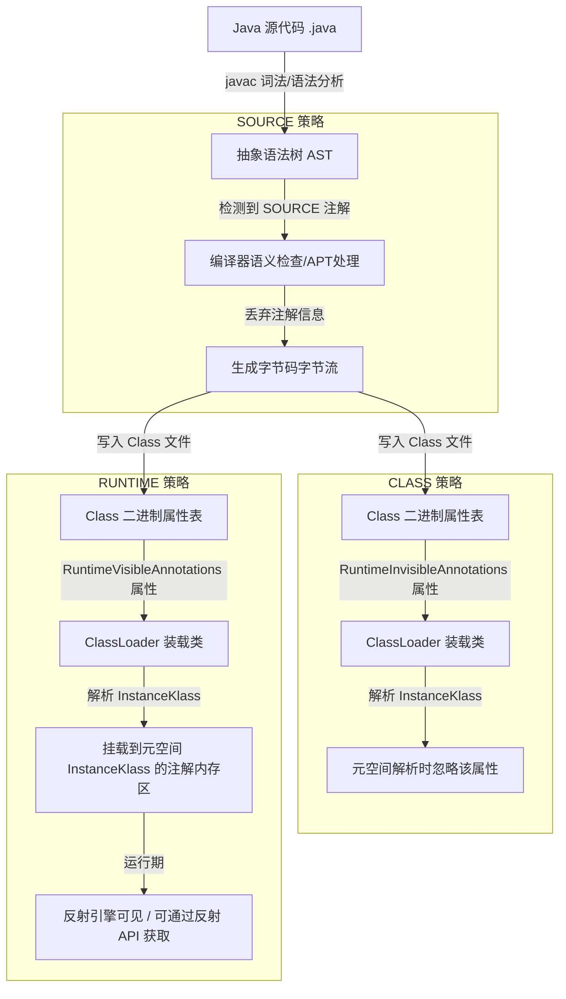

# JVM 实现注解

在 Java 语言中，注解（Annotation）提供了一种声明式的元数据（Metadata）机制。它们可以被标注在类、方法、字段、参数等各种程序元素上，用于指示编译器、静态分析工具或运行期框架执行特定的逻辑。然而，在 Java 虚拟机（JVM）的物理世界里，并没有“注解”这一种独立的、底层的物理数据结构。

本文将从 Class 字节码二进制结构、JVM 源码级处理、JDK 运行期动态代理、反射缓存设计以及元空间内存泄露等物理级维度，深度剖析 Java 注解在 JVM 中的真实实现机理。

---

## 1. 注解的物理本质：继承自 `Annotation` 的特殊接口

从 Java 源码的角度看，注解使用 `@interface` 关键字进行声明；但在编译为 Class 文件后，JVM 对其进行的物理重写会揭示其本质：**注解在 Class 字节码层面上，完全是一个继承自 `java.lang.annotation.Annotation` 的普通 Java 接口（Interface）**。

### 1.1 源码层面的注解声明
我们首先定义一个包含典型属性（包括基本类型与默认值）的运行时注解：

```java
package com.example;

import java.lang.annotation.*;

@Retention(RetentionPolicy.RUNTIME)
@Target(ElementType.TYPE)
public @interface MyAnnotation {
    String value();
    int count() default 42;
}
```

### 1.2 编译器（javac）的编译期重写
当使用 `javac` 编译器编译上述代码时，编译器会进行语法糖的去糖与改写。上面这段源码会被改写并编译为如下的接口形式：

```java
package com.example;

public interface MyAnnotation extends java.lang.annotation.Annotation {
    public abstract String value();
    public abstract int count();
}
```

这里需要注意几点物理事实：
1. **显式继承关系**：JVM 规范并不支持真正的“多继承”，但允许接口继承其他接口。`MyAnnotation` 隐式地继承了 `java.lang.annotation.Annotation` 接口。由于 Java 中类只能单继承，所以你无法定义一个类去继承一个注解，或者让一个注解去继承另一个类。
2. **属性转化为抽象方法**：注解中声明的“属性”（如 `value()`、`count()`），在字节码层面被完全转化为了**无参数、无异常声明、有返回值的抽象方法（Abstract Method）**。
3. **方法返回值限制**：正是因为这些属性在物理上是接口的方法，为了保证元数据的简单性与 JVM 解析的确定性，JVM 规范限制了注解方法（即属性）的返回值类型，只能为：基本数据类型、`String`、`Class`、`enum`、其他注解类型，以及上述类型的一维数组。

#### JVM 源码级物理检验
在 JVM（以 OpenJDK HotSpot 为例）底层的类文件解析器 `ClassFileParser` 中，当它加载并解析一个 Class 文件时，会读取其 `access_flags`。JVM 内部对于注解类型有着严格的检查：
```cpp
// 摘自 OpenJDK HotSpot 源码：classFileParser.cpp
if ((flags & JVM_ACC_ANNOTATION) != 0) {
  if ((flags & JVM_ACC_INTERFACE) == 0) {
    classfile_parse_error(
      "Class modifiers contain ACC_ANNOTATION but not ACC_INTERFACE in class file %s",
      CHECK
    );
  }
}
```
这行 C++ 源码从 JVM 底层物理机制上证实了：**凡是注解，在物理上必须同时是一个接口。如果一个 Class 文件声称自己是注解（`ACC_ANNOTATION`），却不是接口（没有 `ACC_INTERFACE` 标志），JVM 将在类加载的格式验证阶段直接抛出 `ClassFormatError`。**

### 1.3 反编译字节码剖析
我们使用 `javap -v MyAnnotation.class` 工具，来查看编译器生成的 Class 文件结构：

```text
Classfile /com/example/MyAnnotation.class
  Last modified Jun 19, 2026; size 468 bytes
  MD5 checksum c18ea0e85ee229d4948a31e84dfa42bf
  Compiled from "MyAnnotation.class"
public interface com.example.MyAnnotation extends java.lang.annotation.Annotation
  minor version: 0
  major version: 52
  flags: ACC_PUBLIC, ACC_INTERFACE, ACC_ABSTRACT, ACC_ANNOTATION
Constant pool:
   #1 = Class              #2             // com/example/MyAnnotation
   #2 = Utf8               com/example/MyAnnotation
   #3 = Class              #4             // java/lang/Object
   #4 = Utf8               java/lang/Object
   #5 = Class              #6             // java/lang/annotation/Annotation
   #6 = Utf8               java/lang/annotation/Annotation
   #7 = Utf8               value
   #8 = Utf8               ()Ljava/lang/String;
   #9 = Utf8               count
  #10 = Utf8               ()I
  #11 = Utf8               AnnotationDefault
  #12 = Integer            42
  ...
{
  public abstract java.lang.String value();
    descriptor: ()Ljava/lang/String;
    flags: ACC_PUBLIC, ACC_ABSTRACT

  public abstract int count();
    descriptor: ()I
    flags: ACC_PUBLIC, ACC_ABSTRACT
    AnnotationDefault:
      default_value: I#12
}
```

#### 关键字节码标识解析：
* **`flags` 标志位**：`ACC_PUBLIC`（`0x0001`）、`ACC_INTERFACE`（`0x0200`）、`ACC_ABSTRACT`（`0x0400`）和 `ACC_ANNOTATION`（`0x2000`）。
  * `ACC_INTERFACE` 表明它在 JVM 中是一个接口。
  * `ACC_ANNOTATION` 是专门针对注解的访问标志。当 JVM 的类加载器装载一个类文件并发现其标志位包含 `ACC_ANNOTATION` 时，它会知道这是一个注解类型。这个标志位也是反射 API（如 `Class.isAnnotation()`）的底层物理依据。
* **抽象方法**：`value()` 和 `count()` 的 `flags` 都是 `ACC_PUBLIC, ACC_ABSTRACT`。这意味着在字节码中，它们没有任何方法体（Method Body）。
* **`AnnotationDefault` 属性**：对于声明了 `default` 值的属性（如 `count() default 42`），编译器会在该抽象方法的方法属性表中添加一个 `AnnotationDefault` 属性，里面存放了默认值（本例中指向常量池 `#12` 的整数 `42`）。

#### HotSpot 对 `AnnotationDefault` 的 C++ 物理绑定
在类加载的解析期，当 JVM 读取到方法属性表中的 `AnnotationDefault` 属性时，会将该属性的原始二进制数据解析并封装为 JVM 内部的元数据对象。
在 HotSpot 源码中，JVM 内部使用 `Method` 结构体表示一个方法，而每一个 `Method` 结构体都有一个指针指向 `annotations` 元数据区。对于注解方法，JVM 会将解析出来的默认值（以二进制字节数组 `Array<u1>*` 形式）直接挂载到 `Method::_annotation_default` 属性上。这为运行期反射获取属性的默认值提供了最直接的物理存取通道。

---

## 2. 注解的生命周期分类与物理流向

Java 语言通过 `@Retention` 元注解定义了注解的三种生命周期类型（`RetentionPolicy`），它们代表了注解信息在 Java 程序生命周期中的**物理流向**和**存留边界**。

| 生命周期策略 | 编译期是否保留 | Class 文件中是否存在 | 运行期内存（元空间）是否载入 | 运行期反射是否可见 | 典型代表 / 应用场景 |
| :--- | :--- | :--- | :--- | :--- | :--- |
| `SOURCE` | 是 | 否 | 否 | 否 | `@Override`, `@SuppressWarnings`, `@NonNull` (IDE) |
| `CLASS` | 是 | 是 | 否 | 否 | 字节码插桩（如 ASM/AspectJ 编译期织入）、APT |
| `RUNTIME` | 是 | 是 | 是 | 是 | Spring `@Autowired`, Jackson `@JsonProperty` 等 |

### 2.1 物理流向深度解剖



#### 2.1.1 `RetentionPolicy.SOURCE` 的物理流向与编译期切入
在 `javac` 进行编译的过程中，首先会将 `.java` 源码解析为抽象语法树（AST）。如果注解的生命周期为 `SOURCE`，它在编译期通过以下三个物理阶段起作用：
1. **解析与填充符号表（Parse and Enter）**：编译器将源码解析为 AST，并将注解作为修饰符记录在对应的语法树节点（如 `JCVariableDecl`、`JCMethodDecl`）上。
2. **注解处理期（Annotation Processing）**：这是 APT（Annotation Processing Tool）发挥作用的阶段。如果在此期间触发了任何实现了 `javax.annotation.processing.Processor` 接口的注解处理器，它们可以在语法树上查询到 `SOURCE` 级别的注解，并以此生成新的 Java 源代码文件。
3. **分析与字节码生成（Analyze and Generate）**：一旦所有的注解处理器执行完毕，且没有产生新的源文件，编译器就会将语法树翻译为线性的 JVM 字节码。此时，编译器在向 `.class` 文件写入属性表（Attributes）时，会**彻底将 `SOURCE` 级别的注解抹去**。
因此，在生成的 Class 文件的常量池、属性表中，找不到任何关于该注解的踪迹。

#### 2.1.2 `RetentionPolicy.CLASS` 的物理流向与保留机制
这是 Java 注解的默认策略。编译器在生成 `.class` 文件时，会将注解数据写入类文件的属性表中。由于它对运行期是不可见的，编译器会将其放置在 **`RuntimeInvisibleAnnotations`** 或 **`RuntimeInvisibleParameterAnnotations`** 属性中。
当 JVM 类加载器装载该类时，它会读取并解析 Class 文件，但当遇到 `RuntimeInvisible` 前缀的属性时，**类加载器在内存中构建 `InstanceKlass` 数据结构时会主动忽略它们**。这就构成了“反射可见性屏障”：虽然在磁盘上的 `.class` 文件里有这个注解，但运行期的内存（元空间）里没有任何对应的内存对象，因此反射 API 无法获取它。
此设计考虑了编译后处理（如静态混淆、AOP 静态字节码插桩）的需要，在不占用运行期 JVM 内存的前提下保留了元数据。

#### 2.1.3 `RetentionPolicy.RUNTIME` 的物理流向与元空间载入
当注解被声明为 `RUNTIME` 时，编译器会将其写入 Class 文件的 **`RuntimeVisibleAnnotations`** 或 **`RuntimeVisibleParameterAnnotations`** 属性中。
当类加载器加载该 Class 文件到 JVM 元空间（Metaspace）时，会专门解析这些属性，并将注解的元数据信息（包括类型描述符、键值对数据等）以字节数组的形式保留在 `InstanceKlass` 的元数据区。在运行期，当用户调用反射 API（如 `Class.getAnnotation()`）时，JVM 就会去读取元空间中的这部分原始二进制数据，并将其动态实例化。

---

## 3. 运行期注解在 Class 文件属性表中的物理二进制格式

要真正理解注解在类文件中的物理存在，我们需要拆解 Class 文件属性表（Attributes）。在 JVM 规范中，与注解相关的属性主要有以下 5 个：

1. **`RuntimeVisibleAnnotations`**：标记在类、字段或方法上，运行期反射可见的注解。
2. **`RuntimeInvisibleAnnotations`**：标记在类、字段或方法上，运行期反射不可见的注解。
3. **`RuntimeVisibleParameterAnnotations`**：标记在方法参数上，运行期反射可见的注解。
4. **`RuntimeInvisibleParameterAnnotations`**：标记在方法参数上，运行期反射不可见的注解。
5. **`AnnotationDefault`**：记录注解中抽象方法的默认值。

### 3.1 属性表的物理编码结构
以 `RuntimeVisibleAnnotations` 属性为例，它在 Class 属性表中的二进制物理结构如下定义：

```c
RuntimeVisibleAnnotations_attribute {
    u2 attribute_name_index;        // 指向常量池中 "RuntimeVisibleAnnotations" 的 UTF-8 索引
    u4 attribute_length;            // 属性的总长度（不包括前 6 字节）
    u2 num_annotations;             // 标注在该元素上的可见注解数量
    annotation annotations[num_annotations]; // 注解数组
}
```

其中，每一个 `annotation` 结构的物理格式为：

```c
annotation {
    u2 type_index;                  // 指向常量池中注解类型描述符的索引（如 "Lcom/example/MyAnnotation;"）
    u2 num_element_value_pairs;     // 注解中显式指定的键值对数量
    {   u2 element_name_index;      // 指向常量池中属性名的索引（如 "value"）
        element_value value;        // 属性对应的具体数值结构
    } element_value_pairs[num_element_value_pairs];
}
```

而 `element_value` 结构则是一个非常精妙的联合体（Union）结构，用来表示不同类型的值：

```c
element_value {
    u1 tag;                         // 类型标识字符（ASCII 码）
    union {
        u2 const_value_index;       // 指向常量池中基本类型或 String 常量的索引
        
        {   u2 type_name_index;     // 指向常量池中枚举类型描述符的索引
            u2 const_name_index;    // 指向常量池中该枚举值的名称索引
        } enum_const_value;
        
        u2 class_info_index;        // 指向常量池中 Class 描述符的索引
        
        annotation annotation_value;// 嵌套的注解实例
        
        {   u2 num_values;          // 数组的长度
            element_value values[num_values]; // 数组中的元素值
        } array_value;
    } value;
}
```

#### `element_value` 中的 `tag` 对照表
JVM 通过一个字节的 `tag` 来区分注解属性的具体数据类型：

| Tag 字符 (ASCII Hex) | 对应 Java 类型 | 常量池指向类型 |
| :--- | :--- | :--- |
| `B` (`0x42`) | `byte` | `CONSTANT_Integer` |
| `C` (`0x43`) | `char` | `CONSTANT_Integer` |
| `D` (`0x44`) | `double` | `CONSTANT_Double` |
| `F` (`0x46`) | `float` | `CONSTANT_Float` |
| `I` (`0x49`) | `int` | `CONSTANT_Integer` |
| `J` (`0x4A`) | `long` | `CONSTANT_Long` |
| `S` (`0x53`) | `short` | `CONSTANT_Integer` |
| `Z` (`0x5A`) | `boolean` | `CONSTANT_Integer` |
| `s` (`0x73`) | `String` | `CONSTANT_Utf8` |
| `e` (`0x65`) | `enum` | 包含两个 `u2` 索引（类名和枚举值名） |
| `c` (`0x63`) | `Class` | `CONSTANT_Utf8` (类的描述符) |
| `@` (`0x40`) | 嵌套注解 | `annotation` 结构 |
| `[` (`0x5B`) | 数组 | `array_value` 结构 |

### 3.2 方法参数注解 `RuntimeVisibleParameterAnnotations` 的二进制布局
为了能在运行期通过反射（如 Spring Controller 的参数绑定、MyBatis 的 `@Param`）获取方法参数上的注解，JVM 规范规定了方法参数注解的二进制结构形式。它相较于类和方法上的普通注解，由于需要对应到具体的参数槽（Parameter Slot），在物理结构上多了一层参数层面的数组包裹：

```c
RuntimeVisibleParameterAnnotations_attribute {
    u2 attribute_name_index;                  // 指向常量池 "RuntimeVisibleParameterAnnotations"
    u4 attribute_length;                      // 属性长度
    u1 num_parameters;                        // 方法形式参数的数量
    {   u2 num_annotations;                   // 该参数上标注的可见注解数量
        annotation annotations[num_annotations]; // 作用在当前参数上的注解结构数组
    } parameter_annotations[num_parameters];
}
```
通过 `num_parameters` 和 `parameter_annotations` 数组的物理顺序，反射引擎可以在运行期精确锁定“哪一个注解对应哪一个入参”，实现参数级别的元数据读取。

### 3.3 实例解析：反汇编类注解的二进制字节流
为了清晰展示二进制编码，我们编写一个被 `MyAnnotation` 标记的类：

```java
package com.example;

@MyAnnotation(value = "hello", count = 99)
public class TargetClass {}
```

假设经过编译后，`TargetClass.class` 的常量池中包含以下条目：
* `#10` = Utf8: `RuntimeVisibleAnnotations`
* `#11` = Utf8: `Lcom/example/MyAnnotation;`
* `#12` = Utf8: `value`
* `#13` = Utf8: `hello`
* `#14` = Utf8: `count`
* `#15` = Integer: `99`

那么该类上的 `RuntimeVisibleAnnotations` 属性对应的二进制 Hex 数据流及详细拆解如下表所示：

| 字节偏移 (Hex) | 原始数据 (Hex) | 物理对应结构 | 解释 |
| :--- | :--- | :--- | :--- |
| `00 - 01` | `00 0A` | `attribute_name_index` | 指向常量池 `#10`（"RuntimeVisibleAnnotations"） |
| `02 - 05` | `00 00 00 16` | `attribute_length` | 属性长度为 22 字节（即后方所有字节） |
| `06 - 07` | `00 01` | `num_annotations` | 当前类上共有 1 个可见注解 |
| `08 - 09` | `00 0B` | `type_index` | 指向常量池 `#11`（"Lcom/example/MyAnnotation;"） |
| `0A - 0B` | `00 02` | `num_element_value_pairs` | 该注解显式指定了 2 个属性键值对 |
| `0C - 0D` | `00 0C` | `element_name_index` (1) | 第一个键名指向常量池 `#12`（"value"） |
| `0E` | `73` | `value.tag` (1) | ASCII 码 `'s'`，代表当前值为 String 类型 |
| `0F - 10` | `00 0D` | `value.const_value_index` (1)| 指向常量池 `#13`（"hello"） |
| `11 - 12` | `00 0E` | `element_name_index` (2) | 第二个键名指向常量池 `#14`（"count"） |
| `13` | `49` | `value.tag` (2) | ASCII 码 `'I'`，代表当前值为 int 类型 |
| `14 - 15` | `00 0F` | `value.const_value_index` (2)| 指向常量池 `#15`（整数值 99） |

通过这 22 字节的物理排列，JVM 在不载入任何 Java 对象的情况下，便以极其紧凑的二进制格式在类元数据中存储了注解的键值对。

---

## 4. 运行期反射获取注解的动态代理物理机理

当我们在 Java 代码中执行如下反射调用时：
```java
MyAnnotation anno = TargetClass.class.getAnnotation(MyAnnotation.class);
System.out.println(anno.value());
```
许多开发者会误以为 JVM 在堆中实例化了一个实现了 `MyAnnotation` 接口的真实普通类。事实上，**Java 运行期注解的获取是完全基于 JDK 动态代理（Dynamic Proxy）技术实现的**。

### 4.1 反射获取注解的物理调用链路与元数据解析
当调用 `Class.getAnnotation()` 时，JVM 底层和 JDK 库之间会发生一系列精细的物理协作。其执行时序和内存流转如第 4 章开头的时序图所示。

### 4.2 解析与动态生成代理类物理细节

#### 1. 字节流解析与 Map 填充
`AnnotationParser` 逐字节读取 `RuntimeVisibleAnnotations` 属性。在遇到 `TargetClass` 上的 `@MyAnnotation(value = "hello", count = 99)` 时，它会在堆内存中创建一个 `LinkedHashMap<String, Object> memberValues`，并将解析出来的键值对放入其中：
* `"value"` -> `"hello"`
* `"count"` -> `99` (Integer)

如果注解中某些属性没有在二进制中显式指定，`AnnotationParser` 会通过查找注解接口方法的 `AnnotationDefault` 属性，获取默认值并同样放入此 Map 中。

#### 2. 动态代理实例的创建
解析完 `memberValues` 后，JDK 并不会去生成具体的类文件，而是调用：
```java
InvocationHandler handler = new AnnotationInvocationHandler(MyAnnotation.class, memberValues);
MyAnnotation anno = (MyAnnotation) Proxy.newProxyInstance(
    MyAnnotation.class.getClassLoader(),
    new Class[]{ MyAnnotation.class },
    handler
);
```

这里生成的 `anno` 对象，实际是 JVM 在内存中动态合成的一个以 **`$Proxy`** 开头的代理类实例（通常命名为 `$Proxy0`, `$Proxy1` 等）。

#### 3. 动态代理类 `$Proxy0` 的物理结构剖析
虽然 `$Proxy0` 是在运行时动态生成的字节码，但如果我们将它的内存字节码输出并反编译，它的物理结构等价于以下代码：

```java
package com.sun.proxy;

import com.example.MyAnnotation;
import java.lang.reflect.InvocationHandler;
import java.lang.reflect.Method;
import java.lang.reflect.Proxy;
import java.lang.reflect.UndeclaredThrowableException;

public final class $Proxy0 extends Proxy implements MyAnnotation {
    private static Method m0; // 代表 Object.hashCode()
    private static Method m1; // 代表 Object.equals()
    private static Method m2; // 代表 Object.toString()
    private static Method m3; // 代表 Annotation.annotationType()
    private static Method m4; // 代表 MyAnnotation.value()
    private static Method m5; // 代表 MyAnnotation.count()

    static {
        try {
            m0 = Class.forName("java.lang.Object").getMethod("hashCode");
            m1 = Class.forName("java.lang.Object").getMethod("equals", Class.forName("java.lang.Object"));
            m2 = Class.forName("java.lang.Object").getMethod("toString");
            m3 = Class.forName("java.lang.annotation.Annotation").getMethod("annotationType");
            m4 = Class.forName("com.example.MyAnnotation").getMethod("value");
            m5 = Class.forName("com.example.MyAnnotation").getMethod("count");
        } catch (NoSuchMethodException e) {
            throw new NoSuchMethodError(e.getMessage());
        } catch (ClassNotFoundException e) {
            throw new NoClassDefFoundError(e.getMessage());
        }
    }

    public $Proxy0(InvocationHandler h) {
        super(h);
    }

    @Override
    public String value() {
        try {
            // 将当前方法调用转发给 InvocationHandler.invoke()，即 AnnotationInvocationHandler
            return (String) super.h.invoke(this, m4, null);
        } catch (RuntimeException | Error e) {
            throw e;
        } catch (Throwable t) {
            throw new UndeclaredThrowableException(t);
        }
    }

    @Override
    public int count() {
        try {
            return (Integer) super.h.invoke(this, m5, null);
        } catch (RuntimeException | Error e) {
            throw e;
        } catch (Throwable t) {
            throw new UndeclaredThrowableException(t);
        }
    }

    @Override
    public Class<? extends java.lang.annotation.Annotation> annotationType() {
        try {
            return (Class) super.h.invoke(this, m3, null);
        } catch (RuntimeException | Error e) {
            throw e;
        } catch (Throwable t) {
            throw new UndeclaredThrowableException(t);
        }
    }
}
```

### 4.3 模块化系统（JDK 9+）下动态代理的物理巨变
在 JDK 9 引入模块系统（Project Jigsaw）后，为增强封装性，`Proxy` 在物理层面生成代理类的逻辑发生了改变：
* **模块归属判定**：如果被代理的接口是 `public` 且属于某个已导出的包，JVM 不再把代理类塞进 `com.sun.proxy`，而是会动态创建一个专属模块（如 `jdk.proxy2`）并将其存入其中。这防止了非法反射访问，但也使得类加载隔离更加复杂。
* **访问级别锁定**：如果注解接口属于非 `public`（即包级私有），则 `$Proxy0` 必须且只能生成在与该注解完全相同的包（Package）下，以此获得访问该接口的物理权限。

#### 诊断指南：如何将内存中的代理字节码导出到磁盘
为了方便分析和调试，开发者可以通过配置 JVM 参数，指示 JVM 将在内存中合成的动态代理类字节码直接写盘输出：
* **JDK 8 及以前**：使用参数 `-Dsun.misc.ProxyGenerator.saveGeneratedFiles=true`
* **JDK 9 及以上**：使用参数 `-Djdk.proxy.ProxyGenerator.saveGeneratedFiles=true`

配置该参数后，JVM 会在当前运行工作目录下自动创建形如 `com/sun/proxy/` 或 `jdk/proxyX/` 的文件夹，并将 `$Proxy0.class` 物理写入磁盘，之后可以使用反编译工具（如 IDEA 或 JD-GUI）对其方法派发逻辑进行直接反编译校验。

### 4.4 方法转发（Method Dispatch）的运行时路由与克隆机制
当我们在程序中调用 `anno.value()` 时，执行流程如下：
1. 调用动态代理对象 `anno`（即 `$Proxy0` 实例）的 `value()` 方法。
2. `$Proxy0` 内部将调用路由给父类 `Proxy` 中持有的 `InvocationHandler`（实际是 `AnnotationInvocationHandler` 实例）的 `invoke()` 方法。
3. **`AnnotationInvocationHandler.invoke()` 的内部核心逻辑**：如前面章节所示，直接通过 Map 结构提供 `O(1)` 的检索返回。

#### 关键的数组克隆物理机理
如果结果是数组，Handler 必须调用 `cloneArray` 返回一份全新克隆的数组拷贝。
* **原因**：在 Java 中，数组是**可变对象（Mutable）**。如果直接返回 `memberValues` 中引用的原数组，调用者可能会执行 `anno.myArray()[0] = "newVal"`，这会篡改保存在堆/元空间内的注解值，导致后续所有线程在访问该注解同一字段时读到脏数据。
* **物理代价**：这意味着每一次通过代理获取注解中的数组属性（例如 `@Tags({"A", "B"})` 中的 `tags()`），都会在堆上发生一次**新数组的分配与物理内存拷贝（System.arraycopy）**，增加了运行时的内存垃圾量与 GC 压力。

---

## 5. 注解反射的性能开销与缓存调优机制

由于反射获取注解背后隐藏着如此繁重的物理动作（字节码解析、动态代理类生成、加载以及方法转发），如果不加任何优化，频繁使用注解反射会造成灾难性的性能崩溃。

### 5.1 物理开销的核心痛点
1. **CPU 开销**：第一次解析 Class 文件中注解的字节码时，JVM 需要执行大量的二进制边界安全检查与常量池比对。此外，生成 `$Proxy0` 的字节码（`ProxyGenerator` 物理生成 `byte[]`）需要进行大量的内存流操作。
2. **类加载开销**：动态代理类 `$Proxy0` 在生成后，必须由类加载器调用 Native 方法 `defineClass0` 载入 JVM，并在元空间（Metaspace）为其分配元数据结构（Klass 等）。
3. **堆内存与 GC 压力**：每次解析都会在堆中实例化大量的 `LinkedHashMap`、`AnnotationInvocationHandler` 以及动态代理对象本身。这些对象生命周期往往极短，会频繁触发 JVM 的 Young GC。

### 5.2 核心缓存机制：`AnnotationData` 物理设计
为了消减上述开销，从 JDK 8 开始，JVM 对 `java.lang.Class` 对象的注解反射数据设计了极其严密的缓存防御机制。

在 `java.lang.Class` 类内部，有一个关键的 `volatile` 引用字段：
```java
private transient volatile AnnotationData annotationData;
```

#### 5.2.1 `AnnotationData` 的内部物理结构
`AnnotationData` 是 `Class` 的一个静态内部类，它承担了运行期注解的核心缓存工作：

```java
private static class AnnotationData {
    // 存放该类上标注的所有注解（包含继承自父类且带 @Inherited 的注解），Key 为注解的 Class 对象
    final Map<Class<? extends Annotation>, Annotation> annotations;
    // 仅存放该类上直接声明的注解（不包含继承得到的）
    final Map<Class<? extends Annotation>, Annotation> declaredAnnotations;
    // 记录当前类被重新定义的次数，用于在热部署或 JVM Agent 重定义类时使缓存失效
    final int redefinedCount;

    AnnotationData(Map<Class<? extends Annotation>, Annotation> annotations,
                   Map<Class<? extends Annotation>, Annotation> declaredAnnotations,
                   int redefinedCount) {
        this.annotations = annotations;
        this.declaredAnnotations = declaredAnnotations;
        this.redefinedCount = redefinedCount;
    }
}
```

#### 5.2.2 缓存的无锁并发控制（CAS）
在多线程高并发环境下，为了保证 `annotationData` 被线程安全地初始化且不引入显式锁（`synchronized`）带来的线程挂起和上下文切换开销，JDK 采用了基于 CAS（Compare-And-Swap）的乐观锁设计：

```java
private AnnotationData annotationData() {
    while (true) {
        AnnotationData currentRawAnnotations = annotationData;
        int classRedefinedCount = classRedefinedCount; // JVM 内部 Native 计数器
        
        // 1. 如果缓存存在，且期间类没有被 JVM 重新定义（热替换），则直接返回缓存
        if (currentRawAnnotations != null &&
            currentRawAnnotations.redefinedCount == classRedefinedCount) {
            return currentRawAnnotations;
        }
        
        // 2. 缓存失效或未初始化，调用物理生成逻辑创建新的 AnnotationData
        AnnotationData newAnnotationData = createAnnotationData(classRedefinedCount);
        
        // 3. 使用 CAS 原子操作将新生成的缓存对象挂载到 Class 实例上
        if (Atomic.casAnnotationData(this, currentRawAnnotations, newAnnotationData)) {
            return newAnnotationData;
        }
        // 若 CAS 失败，说明其他线程在此期间已经成功初始化了缓存，进入下一次循环直接读取
    }
}
```

#### 5.2.3 热重定义（Redefine Class）时的缓存失效物理原理
在现代 APM 监控 Agent（如 Pinpoint、SkyWalking）以及诊断工具（如 Arthas）中，经常需要对已载入 JVM 的类进行字节码重定义或热替换（HotSwap）。
当通过 JVM Tool Interface (JVMTI) 执行 `RedefineClasses` 时：
1. JVM 内部会将当前 Class 对象的 `classRedefinedCount` 计数器自增。
2. 随后如果有代码再次调用 `getAnnotation()`，`annotationData()` 方法会被触发。
3. 它在判断时会发现，缓存对象中的 `redefinedCount`（旧值）已经与当前 Class 最新的 `classRedefinedCount` 不匹配。
4. JVM 由此断定该 Class 已经被注入了全新的字节码，原先解析出来的注解属性可能已经改变。缓存宣告失效。
5. 流程进入 `createAnnotationData` 分支，在元空间内对新的字节流重新执行一次二进制解析，构建全新的 `AnnotationData` 对象并通过 CAS 写回。

#### 5.2.4 继承合并逻辑与 `@Inherited` 的物理局限
在上述 `createAnnotationData` 中，JVM 会先解析当前类直接标注的注解填入 `declaredAnnotations`。随后，它会向上追溯其父类（Super Class），检查父类缓存中的 `annotations`，若发现某个注解被标记了 `@Inherited` 元注解，则会将其合并（Merge）到当前类的 `annotations` Map 中。

**物理局限性**：
由于该合并算法在 `Class` 类的实现中，是沿着**父类继承链（`getSuperclass()`）**逐级向上检索的，而**接口（Interface）**并不在类的继承链中。因此，在 Java 中：
1. **接口上的注解** 即使标记了 `@Inherited`，接口的实现类也绝对无法继承该注解。
2. **方法与字段** 上的注解由于不走 Class 级别的继承链查找流程，同样无法支持 `@Inherited`，它们在反射解析时只有直接声明的 `declaredAnnotations`。

---

## 6. 元空间内存泄漏隐患与 ClassLoader 卸载分析

在现代 Java 服务端开发中，反射和注解动态代理被极度频繁地使用。虽然 JVM 引入了强悍的缓存机制，但这种“动态代理 + 缓存”的物理模型，在特定的架构设计下极易引发致命的**元空间内存泄漏（`java.lang.OutOfMemoryError: Metaspace`）**。

### 6.1 内存泄露的物理成因分析

在 JVM 的类加载模型中，每一个 ClassLoader 实例都承担着其加载的 Class 对象的生命周期管理者角色。

```mermaid
graph LR
    subgraph Metaspace 元空间 (GC 物理卸载区)
        KlassProxy["$ProxyX Klass 元数据"]
        TargetKlass["TargetClass Klass 元数据"]
    end

    subgraph JVM Heap 堆内存 (强引用链)
        GlobalCache["全局静态缓存/IOC 容器 Map"] -->|强引用| ProxyInst["$ProxyX 代理实例"]
        ProxyInst -->|持有成员| Handler[AnnotationInvocationHandler]
        Handler -->|memberValues| Value["String/Class/Enum 等属性值"]
        ProxyInst -->|getClass| ClassProxyObj["$ProxyX Class 对象"]
        ClassProxyObj -->|getClassLoader| CustLoader["自定义 ClassLoader"]
    end

    CustLoader -->|加载并保持所有类的强引用| TargetKlass
    CustLoader -->|加载并保持所有类的强引用| KlassProxy
    ClassProxyObj -->|物理关联| KlassProxy
    TargetKlass -->|物理关联| CustLoader
```

1. **ClassLoader 对类的生命周期锁定**：
   * JVM 规范规定，一个 Class 实例能够被垃圾回收（Unload）的**充要条件**是：
     1. 堆中不存在该 Class 对象的任何实例。
     2. 加载该 Class 的 ClassLoader 实例已经可以被垃圾回收。
     3. 该 Class 对应的 `java.lang.Class` 对象没有在任何地方被强引用。
   * 因此，**ClassLoader 与它加载的所有 Class 之间是“生命周期绑定”的**。只要 ClassLoader 无法被回收，它加载的所有 Class（包含动态代理类）就绝对无法在元空间中被卸载。

2. **强引用链条的阻断失效**：
   * 若我们在运行期，将这些动态生成的 `$ProxyX` 代理实例，或解析出的反射 `Method` 对象，缓存到了长生命周期的**全局静态 Map** 或**单例 IOC 容器**中。
   * 这就会构建一条坚不可摧的强引用链：
     $$\text{Global Static Map} \rightarrow \text{注解代理对象 (\$ProxyX)} \rightarrow \text{Proxy Class (\$ProxyX.class)} \rightarrow \text{Custom ClassLoader}$$
   * 由于 Custom ClassLoader 无法被 GC 回收，它所加载的数千个业务类，以及伴随反射生成的大量 `$ProxyX` 代理类的元数据（Klass 结构），将一直常驻在元空间。
   * 随着插件的多次热加载与卸载，每次都会产生全新的 ClassLoader 和成百上千个代理类，元空间的物理内存最终被占满，抛出 `OOM: Metaspace`。

### 6.2 内存泄漏的代码实例还原
下面这段代码模拟了一个典型的热插拔热部署框架中，由于强引用注解代理实例而导致元空间泄漏的灾难场景：

```java
package com.example;

import java.net.URL;
import java.net.URLClassLoader;
import java.util.concurrent.ConcurrentHashMap;

public class LeakSimulator {

    // 全局静态强引用缓存——泄漏的万恶之源
    public static final ConcurrentHashMap<String, Object> GlobalRegistry = new ConcurrentHashMap<>();

    public static void loadAndExecutePlugin(String jarPath) {
        try {
            // 每次加载插件，创建一个全新的 ClassLoader
            URLClassLoader pluginLoader = new URLClassLoader(new URL[]{new URL("file:" + jarPath)});
            
            // 加载插件类
            Class<?> pluginClass = pluginLoader.loadClass("com.plugin.MyPlugin");
            
            // 触发反射获取注解数据：
            // JVM 会为此 ClassLoader 动态生成并定义一个 $ProxyXX 代理类，并分配元空间
            MyAnnotation annotation = pluginClass.getAnnotation(MyAnnotation.class);
            
            // 执行业务...
            System.out.println("Plugin loaded, value = " + annotation.value());
            
            // 致命错误：将代理类实例放进全局的强引用容器中
            GlobalRegistry.put("plugin_meta_" + System.nanoTime(), annotation);
            
            // 试图在这里进行插件的物理卸载：
            // 我们主动将 pluginLoader 置为 null，期望 GC 回收该类加载器及其类
            pluginLoader.close();
            
        } catch (Exception e) {
            e.printStackTrace();
        }
    }

    public static void main(String[] args) throws Exception {
        // 模拟高频热插拔插件 10000 次
        for (int i = 0; i < 10000; i++) {
            loadAndExecutePlugin("/path/to/plugin.jar");
            
            if (i % 100 == 0) {
                // 主动触发 Full GC 尝试回收元空间
                System.gc();
            }
        }
    }
}
```

#### 物理分析：
在这个场景下，即使调用了 `System.gc()`，因为 `GlobalRegistry` 中仍然保留着大量的 `MyAnnotation` 代理对象，代理对象的 `getClass()` 引用了 `$ProxyXX.class`。这个字节码代理类是由 `pluginLoader` 加载的，这导致 `pluginLoader` 的强引用链条依然存活。JVM 垃圾回收器根本无法回收任何一个 `URLClassLoader` 实例。
随着循环的进行，JVM 内存中会囤积上万个独立的 `ClassLoader` 实例以及它们各自对应的 `$ProxyXX` 元空间描述，元空间大小呈线性增长，最终在无声无息中抛出 `OutOfMemoryError: Metaspace`。

### 6.3 物理防御与排查策略
1. **防止跨 ClassLoader 缓存**：
   * 绝对不要在由根类加载器（Bootstrap ClassLoader）或系统类加载器（System ClassLoader）加载的静态类中，强引用由自定义类加载器加载的注解代理对象。
   * 任何全局缓存，在生命周期结束（如插件卸载、上下文销毁）时，必须显式调用 `map.clear()` 或进行 `deregister` 释放所有引用。
2. **使用弱引用（WeakReference）包装缓存**：
   * 对于框架级缓存，应当使用基于 `WeakHashMap` 或持有 `WeakReference<Annotation>` 的缓存结构。一旦 ClassLoader 失去外部强引用，垃圾回收器能够顺藤摸瓜将整个 WeakHashMap 中的键值对及 ClassLoader 一并回收。
3. **元空间参数调优**：
   * 显式设置 `-XX:MetaspaceSize` 和 `-XX:MaxMetaspaceSize`。
   * 默认情况下，元空间的上限是物理内存大小。若不加限制，一旦发生泄露，会导致整个操作系统物理内存耗尽，触发 OS 的 OOM-Killer 杀死 Java 进程。限制最大值能提早暴露问题，并在抛出 OOM 时触发 Heap Dump 或线程栈分析。

---

## 7. 总结

在 JVM 的物理世界里，注解并不是一种神秘的魔法，而是被设计成一套**“静态二进制元数据 + 动态反射期代理”**的巧妙闭环。

JVM 通过 Class 文件属性表（如 `RuntimeVisibleAnnotations`）将注解以极其紧凑的字节码数据持久化，在类加载时将其送入元空间。在运行期，当程序发起反射调用时，JDK 通过动态代理技术在内存中即时合成实现了注解接口的 `$Proxy` 类，并依托 Class 对象内部基于 CAS 构建的 `AnnotationData` 缓存实现高性能复用。

深入理解这一套物理运行机理，不仅能够帮助我们编写出更加高效的反射与 AOP 逻辑，更能让我们在面对复杂的类加载器卸载与元空间 OOM 故障时，拥有拨云见日的物理视角与排查底气。
