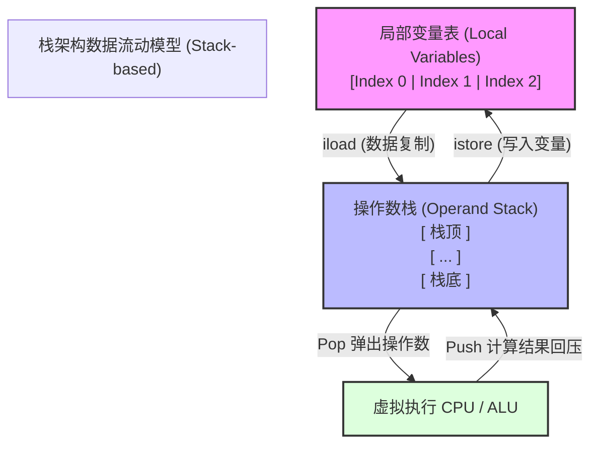
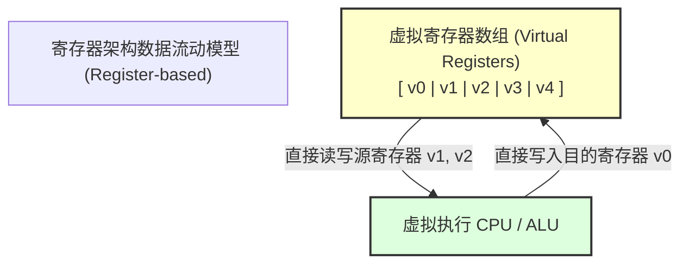
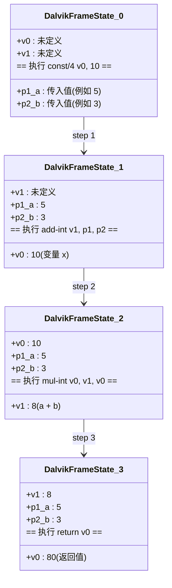
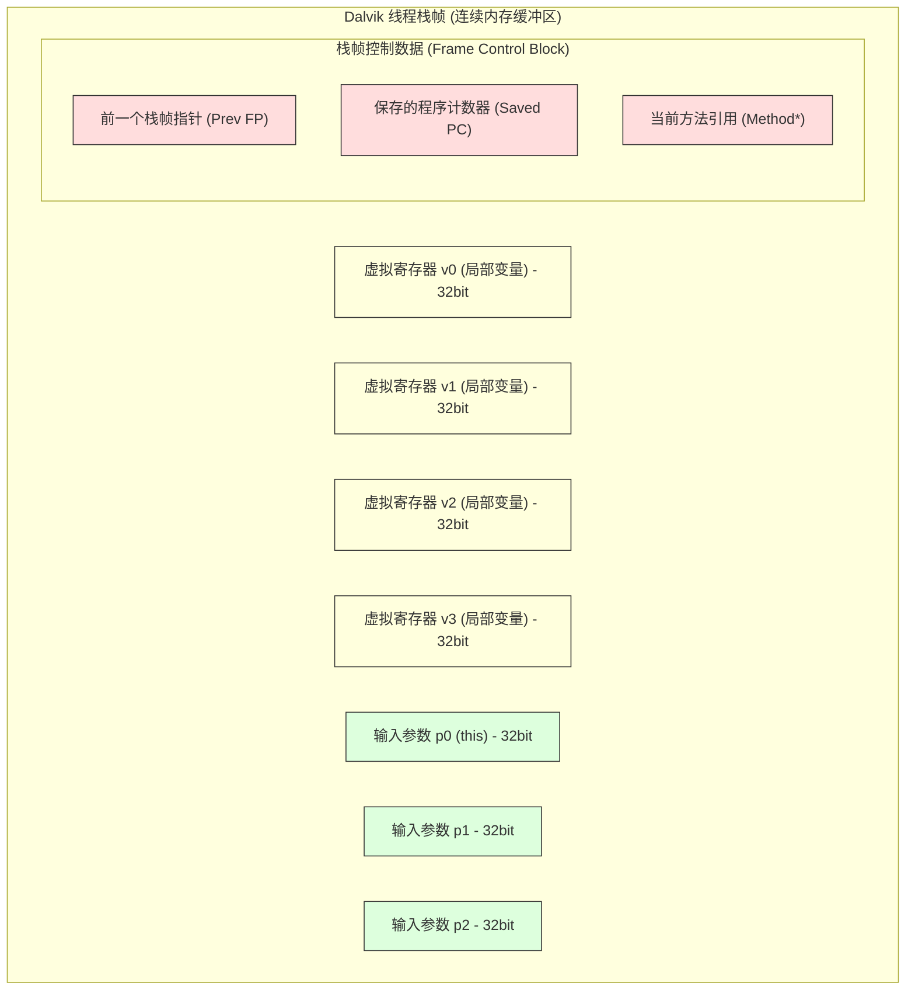
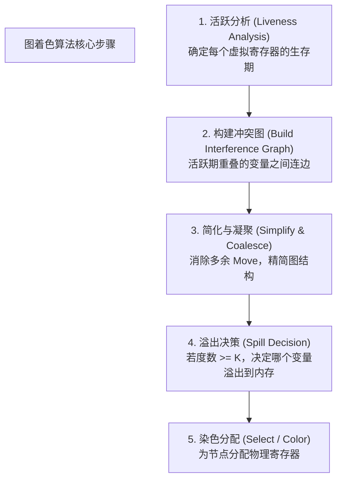
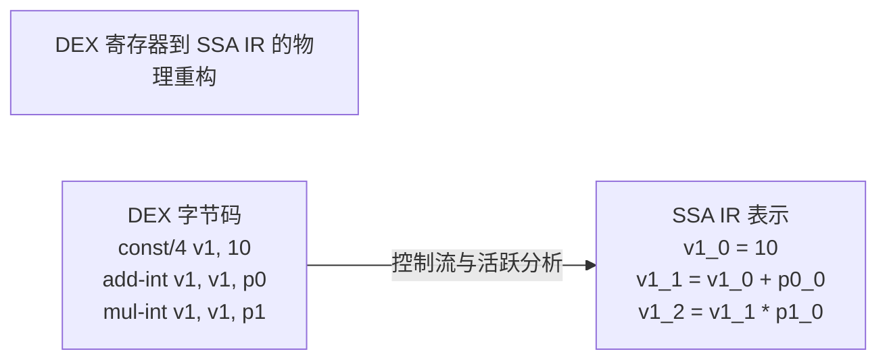

# 2.2.1.1 寄存器架构

在虚拟机设计与编译器技术的演化史上，指令集架构的选择直接决定了运行时的执行效率、内存消耗以及硬件资源的利用率。Java 虚拟机（JVM，如 HotSpot）为了追求跨平台通用性与编译器实现的简易性，采用了经典的**栈架构（Stack-based）**；而谷歌在设计 Android 系统的虚拟运行环境 Dalvik（以及后来的 ART）时，为了应对移动端受限的 CPU 算力、极度匮乏的内存带宽以及对电池寿命的严苛要求，毅然选择并发展了**寄存器架构（Register-based）**。

本篇文档将从物理底层、执行引擎微架构、内存状态跃迁、移动端硬件约束以及编译器后端寄存器分配算法等维度，对 Dalvik/ART 虚拟机的寄存器架构进行系统、深入、物理级的解剖与对比。

---

## 1. 栈架构与寄存器架构的底层物理设计对比

要理解 Dalvik 为什么要采用寄存器架构，必须首先厘清这两大架构在指令集设计、数据流向以及 CPU 物理执行层面上的根本性差异。

### 1.1 栈架构（Stack-based）的核心物理设计

以 HotSpot JVM 为代表的栈架构虚拟机，其计算模型建立在**操作数栈（Operand Stack）**之上。



#### 1. 零地址指令集（Zero-address Instruction Set）
在栈架构中，绝大多数字节码指令都是“零地址指令”。这意味着指令本身不携带源操作数和目的操作数的内存地址或寄存器索引。例如，`iadd` 指令仅占用 1 个字节的操作码（Opcode），它默认的操作对象就是当前栈帧（Stack Frame）中操作数栈的栈顶元素。
- **优点**：指令长度极其紧凑。因为不需要寻址信息，操作码本身通常仅占 1 字节，这使得 Class 字节码文件的体积非常小，有利于早期的网络传输。
- **缺点**：为了完成一次计算，必须频繁地将数据在“局部变量表（Local Variable Table）”和“操作数栈”之间进行拷贝。

#### 2. 物理执行的瓶颈：分派开销（Instruction Dispatch Cost）
在软件模拟的虚拟机解释器中，执行引擎的运转依赖于一个无限的“取指-译码-执行（Fetch-Decode-Execute）”循环。
- 解释器通常被实现为一个巨大的 `switch-case` 结构，或者采用更高效的**直接线程化代码（Direct Threaded Code）**，利用函数指针表进行间接跳转：
  ```c
  // 线程化代码解释器示意
  void* dispatch_table[] = { &&do_nop, &&do_aconst_null, &&do_iload, &&do_iadd, ... };
  
  #define DISPATCH() goto *dispatch_table[*pc++]
  
  do_iload:
      // 执行 iload 操作
      *op_stack_top++ = local_variables[index];
      DISPATCH();
  
  do_iadd:
      // 执行 iadd 操作
      int val2 = *(--op_stack_top);
      int val1 = *(--op_stack_top);
      *op_stack_top++ = val1 + val2;
      DISPATCH();
  ```
- **间接分支预测失效**：物理 CPU（如 ARM 或 x86）中的**分支目标缓冲器（BTB, Branch Target Buffer）**负责预测 `goto *pc` 这类间接跳转的地址。由于栈架构的指令粒度极细（例如做一个加法要经过 `iload`、`iload`、`iadd`、`istore` 四步），指令条数极多，导致 `DISPATCH()` 频繁调用。这使得 BTB 极易发生冲突和污染，引发严重的物理 CPU 分支预测失败，进而导致物理流水线频繁气泡（Pipeline Stall），执行效率大幅降低。

---

### 1.2 寄存器架构（Register-based）的核心物理设计

与 JVM 相比，Dalvik 虚拟机采用了**寄存器架构**。其计算模型不依赖于公共的操作数栈，而是直接读写**虚拟寄存器（Virtual Registers）**。



#### 1. 二地址与三地址指令集（Two/Three-address Instruction Set）
Dalvik 字节码（DEX 字节码）的指令中携带了明确的寄存器寻址信息。
- **三地址指令**：如 `add-int v0, v1, v2`。该指令占 2 个或 4 个字节，明确指出了两个源操作数来自寄存器 `v1` 和 `v2`，计算结果存入目的寄存器 `v0`。
- **二地址指令**：为了紧凑体积，Dalvik 还提供了大量二地址指令，如 `add-int/2addr v0, v1`，等价于 `v0 = v0 + v1`。
- **物理优势**：寄存器架构消除了“操作数栈”这一中间媒介，数据不需要在局部变量和栈之间反复倒腾。

#### 2. 指令条数缩减与分派开销的消减
由于单条指令承载的语义更加丰富（即一条指令同时包含了“取数”、“运算”、“存数”三个物理动作），实现相同逻辑所需的 Dalvik 字节码指令条数相比 JVM 减少了 **30% 到 50%**。
- 指令总数的减少意味着解释器循环的次数等比例下降。
- `DISPATCH()` 调用的频率大大降低，物理 CPU 的 BTB 冲突概率显著减小，硬件分支预测器的工作效率得以大幅提升。

---

### 1.3 栈架构与寄存器架构硬件指标深度对比

| 硬件/软件评估指标 | JVM 栈架构（Stack-based） | Dalvik/ART 寄存器架构（Register-based） | 物理机制与设计考量 |
| :--- | :--- | :--- | :--- |
| **指令平均字长** | 紧凑（通常为 1 字节，部分带参数指令为 2-5 字节） | 较长（通常为 2 字节（16-bit）、4 字节或 6 字节） | 寄存器架构需要在指令中编码寄存器索引（如 4-bit, 8-bit 或 16-bit 寻址），因此指令字长较长。 |
| **指令条数（同一逻辑）** | 多（约高出 30% - 50%） | 少 | 栈架构通过零地址指令逐步推进，寄存器架构单条指令集成多个寻址与运算。 |
| **数据存取方式** | 操作数栈顶的隐式入栈与出栈（Push/Pop） | 直接读写指定索引的虚拟寄存器（内存数组指针偏移） | 寄存器架构避免了操作数栈作为中转站带来的内存复制和临时指针变动。 |
| **解释器分派开销** | 极高 | 较低 | 指令条数多导致间接跳转频繁，BTB 分支预测失败率高；寄存器架构解释器循环次数少。 |
| **编译器生成难度** | 低（前端编译器容易生成，几乎不需做物理分配） | 高（需要进行复杂的变量生存期分析与虚拟寄存器映射） | 栈架构符合 AST（抽象语法树）的天然求值顺序，而寄存器架构生成代码时需解决临时变量分配问题。 |
| **真实 CPU 映射亲和度** | 差 | 极强 | 现代物理 CPU（尤其是 ARM 架构）拥有丰富的寄存器。寄存器虚拟机的结构更易于无缝翻译为物理寄存器操作。 |
| **相同逻辑的文件体积** | 较小（Class 文件单指令小，但冗余指令多） | 较小（Dex 文件合并了常量池并优化了指令结构） | 尽管 Dalvik 指令字长较长，但由于去除了 Class 文件的冗余结构并减少了指令条数，整体 Dex 体积通常更优。 |

---

## 2. 字节码指令流与物理内存状态跃迁实例对比

为了更直观地看清这两种架构在物理执行过程中的差异，我们设计一个简单的 Java 算术运算方法，并追踪其在 JVM 和 Dalvik 虚拟机中的执行路径与内存变化。

```java
public int calculate(int a, int b) {
    int x = 10;
    return (a + b) * x;
}
```

### 2.1 JVM 栈字节码执行流分析

使用 `javac` 编译后，该方法在 Class 文件中生成的 JVM 字节码如下（此处为优化后的 Class 字节码指令流）：

```text
0: bipush        10       // 栈顶 <- 10
2: istore_3               // local[3] <- 10 (变量 x)
3: iload_1                // 栈顶 <- a (local[1])
4: iload_2                // 栈顶 <- b (local[2])
5: iadd                   // 弹出 a 和 b，计算 a + b，将结果压回栈顶
6: iload_3                // 栈顶 <- x (local[3])
7: imul                   // 弹出 (a+b) 和 x，计算乘积，将结果压回栈顶
8: ireturn                // 返回栈顶元素
```

#### JVM 栈帧物理演变过程：

```mermaid
gantt
    title JVM 操作数栈与局部变量表状态跃迁 (calculate 方法)
    dateFormat  X
    axisFormat %s

    section 局部变量表
    "初始状态(a, b, x=未定义)"   :active, 0, 1
    "执行 bipush 10 (无变化)"   :active, 1, 2
    "执行 istore_3 (x=10)"     :active, 2, 3
    "执行 iload_1 (无变化)"    :active, 3, 5
    "执行 iadd (无变化)"       :active, 5, 6
    "执行 imul (无变化)"       :active, 6, 8

    section 操作数栈状态
    "空"                    :crit, 0, 1
    "10"                    :crit, 1, 2
    "空"                    :crit, 2, 3
    "a -> a, b"           :crit, 3, 5
    "a+b"                   :crit, 5, 6
    "a+b, 10"               :crit, 6, 7
    "a+b * 10"              :crit, 7, 8
```



---

### 2.2 Dalvik 寄存器字节码执行流分析

经由 `dx` 或 `d8` 编译器处理后，上述 Java 代码会被转换为 DEX 文件，其 Dalvik 字节码指令流如下：

```text
0000: const/4 v0, #int 10      // 将常量 10 存入虚拟寄存器 v0 (即变量 x)
0002: add-int v1, p1, p2       // 将输入参数 p1 (参数 a) 和 p2 (参数 b) 相加，结果直接存入 v1
0005: mul-int v0, v1, v0       // 将 v1 与 v0 (10) 相乘，结果写入 v0
0008: return v0                // 返回虚拟寄存器 v0 中的值
```

此时的执行对比高下立判：
1. **指令条数**：JVM 优化后需要 **8 条**指令；Dalvik 仅需要 **4 条**指令。
2. **临时变量**：Dalvik 没有任何 `push`/`pop` 动作，全部是在指定的虚拟寄存器槽位（Slots）上进行直接覆盖式读写。

#### Dalvik 寄存器内存状态跃迁演练：



---

## 3. 虚拟寄存器在 Android 虚拟机的物理实现

在探讨 Dalvik 虚拟寄存器时，必须要纠正一个常见的误区：**“虚拟寄存器”并不是物理 CPU（如 ARM 或 x86）的硬件寄存器。** 

它们是 Dalvik/ART 虚拟机为了在软件层面上模拟出高速的寄存器寻址机制，而在**线程栈帧（Thread Stack Frame）**中开辟的一段连续物理内存空间（局部变量数组）。

### 3.1 Dalvik 线程栈帧（Stack Frame）物理布局

每次 Java 方法被调用时，Dalvik 虚拟机都会在其专有的执行栈（Call Stack）上为当前方法分配一个栈帧。这个栈帧在物理内存中是一块连续的缓冲区。

以下是 Dalvik 栈帧在物理内存中的结构模型：



#### 物理存储单元大小：
- Dalvik 虚拟机规定，每个虚拟寄存器都是 **32 位（32-bit，即 4 字节）**宽度的物理内存单元。
- 对于 `int`、`float`、`reference` 对象引用等类型，分配 1 个虚拟寄存器。
- 对于 `long` 和 `double` 这类 64 位宽的数据类型，虚拟机会为其分配**相邻的两个虚拟寄存器**（例如使用 `v0` 和 `v1` 共同存储一个 `double` 变量），在指令中通过低位寄存器索引（如 `v0`）来指代该 64 位值。

---

### 3.2 虚拟寄存器命名与映射规则（`v` 命名法 vs `p` 命名法）

在 Dalvik 汇编代码与 DEX 文件的实际编译输出中，我们经常会看到 `v0`、`v1` 以及 `p0`、`p1` 等不同的命名方式。它们在底层的物理映射关系是完全统一的。

#### 1. 映射机制与重叠设计
假设一个非静态方法（Instance Method）需要 $L$ 个局部变量（Local Variables），并且接收 $A$ 个输入参数（Arguments）。
- 因为是非静态方法，所以会有一个隐藏的 `this` 指针作为第一个参数传入。因此，实际的参数总数（含隐含参数）为 $A + 1$。
- Dalvik 虚拟机会为该栈帧分配总共 $R = L + A + 1$ 个虚拟寄存器。
- **物理排列顺序**：
  - **局部变量区**：排在栈帧的最前端，占用虚拟寄存器 `v0` 到 `v[L-1]`。
  - **输入参数区**：紧随其后，占用虚拟寄存器 `v[L]` 到 `v[L+A]`。

#### 2. `v` 命名法与 `p` 命名法的转换公式
- **`v` 命名法（从零开始统一编号）**：
  - 局部变量：$v_0, v_1, \dots, v_{L-1}$
  - 输入参数（包含 `this`）：$v_L, v_{L+1}, \dots, v_{L+A}$
- **`p` 命名法（区分局部变量与参数）**：
  - 局部变量：保持为 $v_0, v_1, \dots, v_{L-1}$
  - 输入参数：命名为 $p_0, p_1, \dots, p_A$。其中 $p_0$ 对应 `this`，而参数 $p_i$ 物理上对应的就是 $v_{L+i}$。

> [!NOTE]
> **示例说明**：
> 如果一个方法有 3 个局部变量（$L=3$），2 个入参（$A=2$）。
> 那么它总共拥有 $3 + 2 + 1 = 6$ 个虚拟寄存器。其物理对应关系为：
> - 局部变量：`v0`, `v1`, `v2`
> - `this` 引用：`p0` $\rightarrow$ 对应物理寄存器 `v3`
> - 第一个入参：`p1` $\rightarrow$ 对应物理寄存器 `v4`
> - 第二个入参：`p2` $\rightarrow$ 对应物理寄存器 `v5`
> 
> 这种设计允许我们在编写/阅读 Dalvik 汇编时，清晰地区分出哪些是方法参数（`p` 开头），哪些是方法内部的临时变量（`v` 开头），而在运行时，它们都仅仅是通过同一个指针 `FP` 加偏移量来寻址的连续数组。

---

### 3.3 解释器层面的物理指针寻址实现

在 Dalvik 虚拟机的 C++ / 汇编解释器实现中，虚拟寄存器的读写操作非常直接。解释器内部维护了一个名为 **`FP`（Frame Pointer，帧指针）** 的物理 CPU 寄存器（在物理 ARM 架构中，通常会指定一个特定的通用寄存器来充当此角色，如 `R5` 或 `R6`，视具体实现而定）。

- `FP` 物理上指向当前栈帧中**虚拟寄存器区域的起始地址**（即 `v0` 所在的内存地址）。
- 当解释器执行一条读取虚拟寄存器 `v[N]` 的 Dalvik 指令时，它在 C++ 代码中对应的操作本质上是：
  ```cpp
  // 获取 v[N] 的值
  uint32_t val = fp[N]; // 相当于执行了内存读取：*(fp + N)
  ```
- 写入虚拟寄存器 `v[M]`：
  ```cpp
  // 将计算结果 val 存入 v[M]
  fp[M] = val;         // 相当于执行了内存写入：*(fp + M) = val
  ```
这种机制避免了传统栈虚拟机在执行加法时所需的多次“修改栈顶指针 SP $\rightarrow$ 读取内存 $\rightarrow$ 写入内存 $\rightarrow$ 再次修改 SP”的冗余操作，将虚拟寄存器操作直接简化为基于基址指针（`FP`）的偏移寻址。

---

## 4. 为什么移动设备 Android 选择寄存器架构

要理解 Dalvik 的设计逻辑，必须将视线拉回到 2007 年 Android 诞生之初的物理硬件背景。当时的移动设备硬件环境与如今的 PC 甚至现代智能手机大相径庭：
- **物理 CPU 极弱**：主流芯片为 ARM11 或早期 Cortex-A8，单核架构，主频通常仅在 528MHz - 800MHz 之间，且 L2 Cache（二级缓存）严重缺失或容量极小（经常只有 128KB 甚至更低）。
- **内存带宽与延迟极差**：移动设备的 LPDDR1/LPDDR2 内存带宽非常受限，频繁的内存读写是耗电的主要来源，且极易引发 CPU 的停顿等待（Stall）。
- **电池容量极低**：移动端对功耗的敏感度呈几何级数上升，任何软件层面的多余运算和内存倒腾都会直接转化为发热和续航的减少。

### 4.1 指令分派开销的致命影响

在虚拟机解释器中，最核心的性能瓶颈不是指令本身的执行逻辑，而是**指令分派（Instruction Dispatch）**的开销。

对于一段简单的算术运算 `(a + b) * 10`：
- **栈架构**：需要 8-9 次指令分派。每一次分派，解释器都要从内存中取出操作码、解析、查表跳转。这会带来 8-9 次间接分支跳转。
- **寄存器架构**：仅需要 3 次指令分派（`add-int` $\rightarrow$ `mul-int` $\rightarrow$ `return`）。

物理 CPU 的分支预测器（BTB）对于这种频繁的、跳转目标多变的代码预测成功率非常低。在 ARM 顺序执行流水线中，一次分支预测失败意味着整个 CPU 流水线必须全部清空并重新加载指令，这需要损耗 **10 到 20 个物理 CPU 时钟周期**。
Dalvik 通过将指令数量削减近一半，直接将分支预测失败带来的时钟周期损耗降低了约 **50%**，这在当年的低端单核 ARM 处理器上带来了极其显著的性能提升。

---

### 4.2 对 ARM 物理 CPU 寄存器架构的天然亲和度

物理 ARM 处理器（无论是 32 位的 ARMv7 还是 64 位的 ARMv8/ARM64）均属于典型的**精简指令集（RISC）架构**。
- **ARM 汇编特点**：ARM 原生指令本身就是基于寄存器的，例如：
  ```assembly
  ADD R0, R1, R2    ; 将 R1 与 R2 相加，结果存入 R0
  ```
- **代码生成与翻译的亲和性**：
  - 如果虚拟机的指令集也是寄存器架构（如 Dalvik 的 `add-int v0, v1, v2`），当虚拟机引入 JIT（即时编译）或 AOT（提前编译，如 ART 的 `dex2oat`）时，编译器后端可以非常自然、平滑地将虚拟寄存器映射到物理 ARM 寄存器上。
  - 反对，如果是栈架构的 `iadd`，编译器必须首先在内存中构建极其复杂的数据流依赖图（Data Flow Dependency Graph），将栈操作转化为临时变量，再将临时变量映射到物理寄存器。这不仅增加了编译器的开销（这在运行期进行 JIT 编译时是无法接受的），而且由于栈中元素的生存期极其短促且交织繁复，极易产生低效的本地机器码。

---

## 5. JIT/AOT 编译时的寄存器分配算法

随着 Android 系统的演进，尤其是 Dalvik 引入 JIT 以及 ART 转向 AOT（Ahead-Of-Time）和现代化 JIT 混合编译模式，虚拟机需要将 Dex 字节码编译为本地机器码（ARM 汇编）。

此时，编译器后端面临一个极具挑战的物理问题：
> **寄存器分配问题（Register Allocation）**：
> 在 Dex 字节码中，一个方法可能声明并使用了成百上千个虚拟寄存器（`v0, v1, ..., vN`），但是在真实的物理 ARM CPU 中，可用的通用物理寄存器是非常有限的（例如 ARM 32 位下除了 SP、LR、PC 等特殊寄存器，仅有约 12 个通用寄存器 R0-R11 可供灵活分配；ARM64 也仅有约 20-30 个通用寄存器）。
> 
> 编译器必须通过某种算法，将无限的虚拟寄存器高效地映射到有限的物理 CPU 寄存器上，并尽量避免将数据溢出（Spill）写回慢速的方法帧栈内存中。

下面我们将深度解析两种最经典、最核心的寄存器分配算法：**图着色算法（Graph Coloring）** 与 **线性扫描算法（Linear Scan）**。

---

### 5.1 图着色寄存器分配算法（Graph Coloring Register Allocation）

图着色算法是编译器设计中最经典的算法之一，由 IBM 的 Gregory Chaitin 等人提出，它将寄存器分配问题优雅地规约为数学上的**无向图 $K$-着色问题**（其中 $K$ 为可用物理寄存器的数量）。



#### 1. 活跃分析（Liveness Analysis）
编译器首先对控制流图（CFG）进行逆向数据流分析，计算出每一个虚拟寄存器（变量）在哪些程序点（Program Points）是**活跃的（Live）**。一个变量被称为活跃的，当且仅当它在此处已被赋值，且在未来某个路径上会被读取。

#### 2. 构建冲突图（Interference Graph）
- 图中的**节点（Nodes）**代表虚拟寄存器。
- 如果两个虚拟寄存器在某一个相同的程序点上**同时处于活跃状态**，说明它们的值必须在同一时刻被保存在不同的地方，不能共享同一个物理寄存器。于是，编译器就会在这两个节点之间连接一条无向边，称为**冲突边（Interference Edge）**。

#### 3. 简化（Simplify）与 Chaitin-Briggs 启发式着色
图着色问题是典型的 NP-Hard 问题，编译器采用启发式算法来进行求解：
1. **简化（Simplify）**：寻找冲突图中度数（相连的边数）小于可用物理寄存器个数 $K$ 的节点 $V$。因为无论剩下的节点怎么染色，由于 $V$ 的邻居节点少于 $K$ 个，它在染色时一定能找到至少一个空闲的物理寄存器。因此，将 $V$ 从图中剥离，并压入一个临时栈中。
2. **凝聚（Coalesce）**：如果代码中存在 `move v0, v1` 这样的搬移操作，且 `v0` 与 `v1` 在冲突图中没有边相连，编译器会尝试将这两个节点合并为一个节点。这在物理上意味着它们可以共享同一个物理寄存器，从而直接消除了这行 `move` 机器指令，实现了代码的物理瘦身。
3. **溢出（Spill）**：如果冲突图中所有节点的度数都大于等于 $K$，说明图无法继续简化。此时，编译器必须根据启发式策略（例如选择活跃区间最长、循环嵌套深度最浅、读写频率最低的虚拟寄存器）选出一个节点作为**潜在溢出节点（Potential Spill）**，将其从图中移出，并标记为必须写回内存栈（即生成 `STR` / `LDR` 指令）。
4. **选择（Select）**：当图中的节点被全部剥离并存入栈后，编译器开始依次出栈，尝试对节点进行着色（即分配物理寄存器）。如果在出栈时，发现之前标记为“潜在溢出”的节点在其邻近已着色节点中依然存在未使用的物理寄存器，则对其进行“乐观着色”（Optimistic Coloring），从而避免实际的物理内存读写开销。

##### 💡 Chaitin-Briggs 算法图着色分配物理实例：
为了让上述枯燥的算法步骤变得清晰，我们以一个具体的局部代码冲突图着色过程为例进行推演。假设某方法经过活跃分析后，有 3 个虚拟寄存器 `A`、`B`、`C`。它们之间的冲突关系为：
- `A` 与 `B` 的活跃期重合（即存在冲突边 `A - B`）
- `B` 与 `C` 的活跃期重合（即存在冲突边 `B - C`）
- `A` 与 `C` 在整个方法执行中从不同时活跃（即没有冲突边）

此时构建的无向冲突图为：`A —— B —— C`。

假设我们物理 CPU 只有 $K = 2$ 个空闲的物理寄存器（可用的颜色为“红色”与“蓝色”）。
1. **简化阶段**：
   - 检查节点度数：$d(A) = 1$，$d(B) = 2$，$d(C) = 1$。
   - 寻找度数小于 $K$（即度数 $< 2$）的节点。节点 `A` 的度数为 1，满足条件。我们将 `A` 从图中剥离，并压入栈，栈状态为 `[A]`。
   - 此时图中剩下 `B —— C`。由于 `A` 已被移除，`B` 的度数变为了 1。
   - 检查度数：$d(B) = 1$，$d(C) = 1$。
   - 节点 `C` 的度数也小于 2。我们将 `C` 从图中剥离并压入栈，栈状态变为 `[C, A]`。
   - 此时图中仅剩下孤立的节点 `B`，其度数降为 $0 < 2$。我们将 `B` 剥离并压入栈，栈状态最终为 `[B, C, A]`（栈顶为 `B`）。
2. **染色分配（选择）阶段**：
   - 弹出栈顶节点 `B`：此时图中没有邻居节点被着色。我们为其分配“红色”（物理寄存器 1）。
   - 弹出节点 `C`：它的邻居节点 `B` 已经被着色为“红色”。因为 $K = 2$，我们给 `C` 分配剩余的“蓝色”（物理寄存器 2）。
   - 弹出节点 `A`：它的邻居节点仅有 `B`（因为 `A` 和 `C` 没边）。`B` 已经被着色为“红色”，而 `A` 与 `C` 并不冲突，因此我们可以安全地将“蓝色”分配给 `A`。
   - **结果**：`A` 被分配为“蓝色”，`B` 被分配为“红色”，`C` 被分配为“蓝色”。我们仅用了 2 个物理寄存器就完美地承载了 3 个虚拟寄存器的计算，没有发生任何物理内存溢出！

但如果冲突图是一个完全图（如 $A, B, C$ 三者两两冲突：`A - B - C` 且 `A - C`），在 $K = 2$ 的情况下，所有节点的度数全为 2，均不满足 $< K$ 的简化条件。编译器只能进行 **Spill 决策**，选择将其中一个变量（如 `B`）标记为溢出，并在代码生成时为其插入物理读写指令。

---

### 5.2 线性扫描寄存器分配算法（Linear Scan Register Allocation, LSRA）

尽管图着色算法能够生成非常高质量的机器码，但由于其需要构建和维护庞大的冲突图，且着色算法本身的时间复杂度较高，在移动设备上进行 **JIT 实时编译**时，图着色算法带来的编译耗时（Compilation Latency）会直接导致用户界面发生卡顿。

为此，ART 的 JIT 编译器以及大部分现代高速 JIT 引擎广泛采用了**线性扫描算法（LSRA）**。其核心思想是弃用复杂的冲突图，转而对变量的活跃区间进行单次线性处理。

#### 1. 活跃区间（Active Intervals）
LSRA 要求首先对控制流图（CFG）中的基本块进行**线性化排序**（通常使用逆后序，Reverse Postorder，确保控制流的前驱节点永远排在后继节点之前）。
- 每个虚拟寄存器 $v_i$ 在线性化的指令序列中，其存活期可以被精确表示为一段单一的或多个碎片化的**活跃区间 `[start, end]`**。

#### 2. LSRA 算法执行核心逻辑
算法维护三个关键列表：
- `unhandled`：按活跃区间起点（`start`）升序排列的待分配区间列表。
- `active`：当前正在占用物理寄存器的活跃区间列表。
- `free`：当前可用的物理寄存器集合。

#### 3. 线性扫描算法伪代码实现：

```python
def linear_scan_register_allocation(unhandled_intervals, physical_registers):
    active = [] # 当前正在使用物理寄存器的区间列表
    
    # 按照起点升序排序 unhandled 列表
    unhandled = sorted(unhandled_intervals, key=lambda x: x.start)
    
    for interval in unhandled:
        # 1. 释放已经失效的寄存器
        # 遍历 active 列表，如果某个已分配区间的结束点早于当前区间的起点，说明它已不再活跃
        for act in list(active):
            if act.end < interval.start:
                active.remove(act)
                free_register(act.reg) # 将物理寄存器归还给 free 集合
                
        # 2. 尝试为当前区间分配寄存器
        if has_free_register():
            reg = allocate_free_register()
            interval.reg = reg
            active.append(interval)
        else:
            # 3. 寄存器耗尽，启动溢出（Spill）启发式策略
            # 找到 active 列表中，结束时间最晚（即未来最晚才被读取）的区间进行溢出
            spill_candidate = max(active, key=lambda x: x.end)
            
            if spill_candidate.end > interval.end:
                # 抢占 spill_candidate 的寄存器给当前区间
                interval.reg = spill_candidate.reg
                spill_candidate.reg = MEMORY_STACK_SLOT # 将其溢出到内存栈帧中
                active.remove(spill_candidate)
                active.append(interval)
            else:
                # 当前区间自身的结束时间更晚，直接将当前区间自身溢出到内存
                interval.reg = MEMORY_STACK_SLOT
```

#### 4. 为什么 LSRA 更适合 JIT 编译？
- **时间复杂度**：LSRA 的时间复杂度几乎是**线性的（$O(N)$）**，其中 $N$ 是虚拟寄存器的数量。而图着色算法在最坏情况下需要迭代构建冲突图，复杂度通常达到 $O(N^2)$ 甚至更高。
- **空间开销**：LSRA 只需要存储活跃区间列表，不需要构建复杂的冲突图邻接矩阵，极大地节省了运行期 JIT 编译器的内存消耗。

---

### 5.3 寄存器分配算法物理对比表

| 特性维度 | 图着色算法（Graph Coloring） | 线性扫描算法（LSRA） |
| :--- | :--- | :--- |
| **算法复杂度** | 高 ($O(N^2) \sim O(N^3)$) | 极低 ($O(N)$) |
| **内存开销** | 大（需要构建 $N \times N$ 的冲突图矩阵） | 小（仅维护区间列表） |
| **分配质量** | 优秀（机器码生成极其紧凑，物理寄存器利用率高） | 次优（部分情况下会产生冗余的 Spill 代码） |
| **对 Move 指令的优化**| 极强（通过 Coalesce 机制大量合并/消除 Move） | 较弱（需要单独的优化 Pass 辅助） |
| **最佳适用场景** | **AOT（提前编译）**：安装时编译（`dex2oat`），耗时不敏感，追求极致运行性能。 | **JIT（即时编译）**：运行时热点代码快速编译，要求毫秒级编译速度，避免主线程卡顿。 |

---

## 6. 前沿演进与 ART 寄存器架构的现代化

随着 Android 系统在 5.0（Lollipop）全面以 ART 取代 Dalvik，虚拟机的寄存器架构及后端编译器的设计也迎来了深刻的变革。

### 6.1 静态单赋值（SSA）中间表示的物理重构

现代 ART 编译器的后端引入了**静态单赋值（SSA, Static Single Assignment）**的中间表示（IR）。在 SSA IR 结构下，每一个虚拟寄存器在被重新赋值时，都会被拆解为带有版本号的全新变量（例如 `v1` 被写了三次，会被拆分为 `v1_0`、`v1_1`、`v1_2`）。



#### 这种重构在物理寄存器分配时的巨大优势：
1. **消除虚假冲突（False Interference）**：在传统的 Dalvik 字节码中，为了节省寄存器数量，同一个虚拟寄存器（如 `v1`）可能会被反复用于完全不相关的变量（例如在方法前半段当临时 `int` 计算，后半段当 `String` 引用）。这会在冲突图中产生虚假的长冲突边。拆分为 SSA 形式后，各个版本的变量拥有独立、精准的活跃期，从而大幅减轻了编译器着色时的冲突压力，提升了寄存器分配的精度。
2. **强大的优化底座**：在 SSA 结构下，ART 可以轻松进行**公共子表达式消除（CSE）**、**死代码删除（DCE）**、**循环展开（Loop Unrolling）**等物理级编译器优化，再配合 LSRA 或优化版的图着色算法生成极致高效的物理 ARM 机器指令。

### 6.2 现代 ART 运行时的寄存器锁存与调用约定

在现代 64 位 ARM64 设备上，ART 虚拟机不仅在 AOT 编译阶段进行了彻底的寄存器优化，其**解释器**本身也经过了汇编化重构。
- **物理寄存器锁存**：解释器内部最常用的控制信息（如程序计数器 `rPC`、当前栈帧指针 `rFP`、核心执行表 `rIBASE`）不再通过慢速的内存读写，而是直接**锁存**在 ARM64 物理寄存器的 `X20` - `X28` 等专用物理寄存器中。
- **调用约定（Calling Convention）的对齐**：当 ART 的 JIT 机器码需要调用一个未经编译的解释执行方法时，虚拟机设计了极度精巧的“桥接栈帧（Trampoline Frames）”。它通过将物理寄存器的内容与虚拟方法的输入参数 `p0, p1...` 进行直接内存对齐，避免了在解释态与编译态切换时发生参数的物理拷贝，使得混合执行的性能损耗降到了最低。

---

## 7. 总结

Android 虚拟机选择寄存器架构，是移动端硬件历史约束与软件架构设计权衡的经典范例。通过抛弃操作数栈、直接操作虚拟寄存器，Dalvik 虚拟机将指令条数削减了近一半，极极地缓解了指令分派带来的分支预测开销和内存带宽危机。

随着 ART 的成熟，通过 SSA IR 进行活跃度分析，并结合图着色算法与线性扫描算法将虚拟寄存器完美地映射到物理 ARM 寄存器上，使得 Android 应用的运行效率实现了物理级的跨越。这一底层的演进，正是移动设备能够流畅运行、响应迅速的基石所在。
