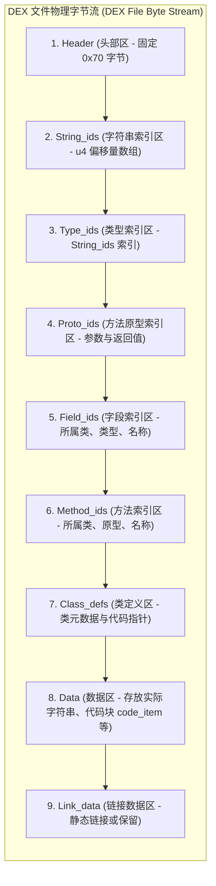
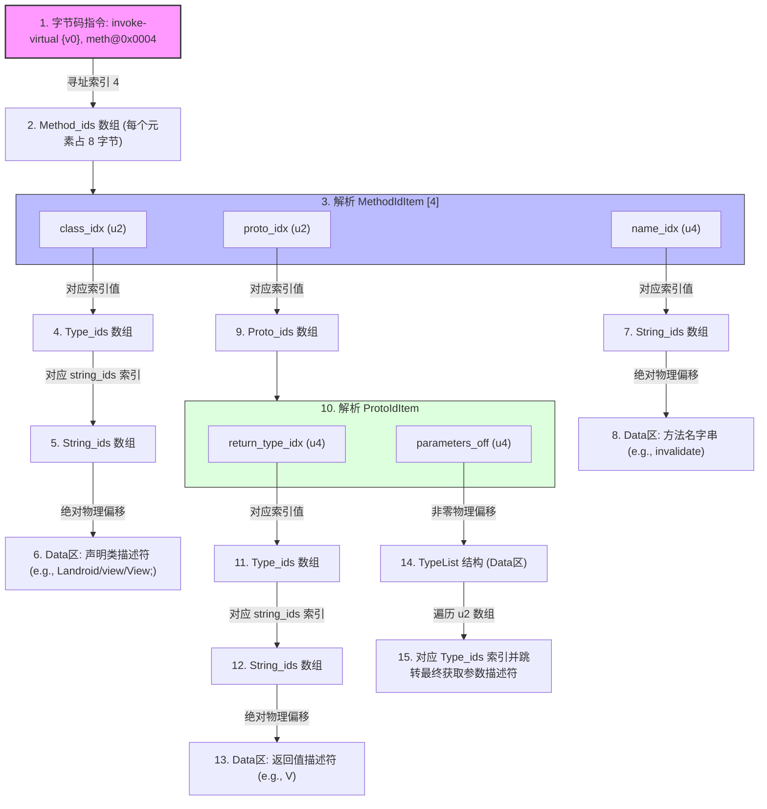
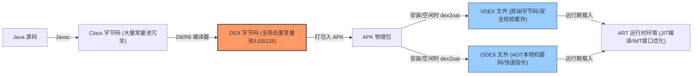

# 2.2.1.2 DEX格式

在 Android 系统中，Dalvik 和 ART 虚拟机并未采用传统 Java 虚拟机（JVM）所使用的 Java 字节码文件（即单个 `.class` 文件组成的 JAR 包），而是采用了一种专为移动端资源受限环境设计的紧凑型文件格式——**DEX（Dalvik Executable）**。

本文将从物理二进制层面，深度剖析 DEX 文件的宏观与微观结构、Class 与 DEX 常量池“池合并与去冗余”的物理差异、65536 方法限制的底层二进制本质、方法调用时的多级索引寻址跳转链路，以及从编译期（DX / D8 / R8）到设备运行期（ODEX / VDEX）的优化衍生机制。

---

## 1. DEX 文件的宏观设计与物理结构

### 1.1 移动受限环境下的设计哲学
传统 JVM 的设计面向的是 PC 桌面与服务器环境，其类加载机制采用的是按需加载独立的 `.class` 文件。而在移动设备早期，硬件资源极其受限（CPU 主频低、内存一般仅为数十至数百兆字节、存储空间狭小且读写速度慢）。如果直接在 Android 上使用传统的 JAR 包，会面临以下严峻问题：
* **存储浪费**：JAR 包内部是大量的 `.class` 文件。每个 `.class` 文件都拥有自己独立的常量池（Constant Pool），存储了大量的重复字符串（如类名、方法名、描述符等），数据冗余度极高。
* **I/O 性能低下**：类加载时需要频繁读取压缩包内的不同小文件，这会产生大量零碎的 I/O 操作，在闪存介质上性能极差。
* **内存占用高**：虚拟机加载多个 Class 时，需要维护多套常量池结构，导致运行期内存占用（RAM）居高不下。

DEX 文件的核心设计理念是**“全盘归并、共享只读”**。它将一个应用中所有类的信息打碎并重新归类，将原本分散在成百上千个 `.class` 文件中的同类信息（如所有字符串、所有类型、所有方法签名）提取出来，分别合并到全局唯一的公共数组（池）中，最后融合成一个单体的 `.dex` 二进制文件。

### 1.2 DEX 文件物理分区拓扑
从物理存储结构来看，DEX 文件是一个连续的二进制字节流，由多个结构体数组及数据块拼接而成。其物理布局如下图所示：



### 1.3 各分区的物理作用与字节流映射
DEX 文件中各个分区紧密相连，除了第一个 `Header` 分区拥有固定大小（`0x70` 字节）之外，其他各个分区的长度和起始偏移量（Offset）都是动态的，完全依赖于 `Header` 中记录的元数据来进行物理定位。

下表详细说明了各分区的物理结构、物理类型以及其在字节流中的映射方式：

| 分区名称 | 对应的 C/C++ 结构体 | 物理字节流映射与作用 | 物理对齐要求 |
| :--- | :--- | :--- | :--- |
| **Header** | `HeaderItem` | 存放 DEX 文件的魔数、校验和、签名，以及其余所有分区的物理偏移量（Offset）和元素个数（Size）。这是解析整个文件的入口。 | 4 字节对齐 |
| **String_ids** | `StringIdItem` | 字符串索引表。每个元素为 4 字节的无符号整数（指向 `Data` 区中具体字符串数据的绝对物理偏移）。 | 4 字节对齐 |
| **Type_ids** | `TypeIdItem` | 类型索引表。每个元素为 4 字节，其数值是 `String_ids` 的索引，表示该类型的描述符（如 `"Ljava/lang/String;"`）。 | 4 字节对齐 |
| **Proto_ids** | `ProtoIdItem` | 方法原型（签名）索引表。声明了方法的返回值类型、参数个数及各参数的具体类型。 | 4 字节对齐 |
| **Field_ids** | `FieldIdItem` | 字段声明索引表。包含字段所属的类、字段的类型以及字段的名称索引。 | 4 字节对齐 |
| **Method_ids** | `MethodIdItem` | 方法声明索引表。包含方法所属的类、方法的原型（Proto）以及方法的名称索引。 | 4 字节对齐 |
| **Class_defs** | `ClassDefItem` | 类定义表。包含了类的访问标志、父类、实现的接口、源文件名，以及指向 `Data` 区类具体数据（字段、方法、字节码）的物理偏移量。 | 4 字节对齐 |
| **Data** | - | 真实的数据池。包含了所有的字符串具体字节流（以 LEB128 长度开头的 UTF-8 字符串）、类的数据体（`class_data_item`）、方法的字节码指令（`code_item`）以及调试信息。 | 结构内各自对齐 |
| **Link_data** | - | 静态链接数据区，通常在未进行特定静态链接的目标文件中为空。 | - |

---

## 2. Class 文件与 DEX 文件的“池合并与去冗余”物理机制

要彻底理解 DEX 格式的优越性，必须对比传统 JVM 规范中的 `.class` 文件物理结构。

### 2.1 传统 JVM Class 文件的“一对一”常量池瓶颈
在标准 Java 编译体系中，每个 `.java` 源码文件都会被独立编译成一个 `.class` 二进制文件。每个 `.class` 文件内部都包含一个独立的常量池（`constant_pool`）。

#### 2.1.1 冗余产生的原因
假设一个 Android App 项目中包含 500 个类，这些类无一例外都会频繁使用 `java/lang/Object`、`java/lang/String`、`android/view/View` 等类名，或者频繁声明 `onCreate`、`toString` 等方法名。
在打包为 JAR/APK 时，这 500 个 `.class` 文件的二进制结构中，将会包含 500 份一模一样的 `"Ljava/lang/Object;"` 字符串常数，以及 500 份一模一样的类型描述符和方法名。

#### 2.1.2 物理结构冗余对比
以下为 JVM 规范中 `ClassFile` 的物理结构体表达：
```c
ClassFile {
    u4             magic;
    u2             minor_version;
    u2             major_version;
    u2             constant_pool_count;
    cp_info        constant_pool[constant_pool_count-1]; // 独立的常量池
    u2             access_flags;
    u2             this_class;
    u2             super_class;
    u2             interfaces_count;
    u2             interfaces[interfaces_count];
    u2             fields_count;
    field_info     fields[fields_count];
    u2             methods_count;
    method_info    methods[methods_count];
    u2             attributes_count;
    attribute_info attributes[attributes_count];
}
```
每个 `.class` 都是一个自闭环的“信息孤岛”。虽然打包成 JAR 时会进行 ZIP 压缩，但 ZIP 压缩是在字节流层面进行的字典压缩，它无法消除内存运行期加载时的重复解析开销，且在解压后依然在内存中占据大量空间。

### 2.2 DEX 的全局共享常量池架构设计
DEX 编译阶段（通过 D8/R8 编译器），所有输入的 `.class` 文件会被同时读入内存。编译器会把所有类中的常量池打碎，进行全局合并与去重（Merge & De-duplicate）。

```
+------------+       +------------+
|  Class A   |       |  Class B   |
| 常量池A    |       | 常量池B    |
| - String X |       | - String X |
| - Type Y   |       | - Type Z   |
+------------+       +------------+
      \                   /
       \                 /  D8/R8 编译融合
        v               v
+------------------------------------+
|             DEX 文件               |
|  全局唯一共享常量池（去重）         |
|  - String X (仅物理存储一份)        |
|  - Type Y                          |
|  - Type Z                          |
+------------------------------------+
```

在合并过程中，DEX 文件构建了五个全局共享的索引表（即 `String_ids`，`Type_ids` 等），这些表在物理上只存储一份唯一的数据。

1. **`string_ids` 去重**：所有原本散落于各 Class 中的“字符串”（包括类名、方法名、字段名、代码中的字符串字面量）被统一放入 Data 区。`string_ids` 仅存放这些字符串在 Data 区的物理偏移量。
2. **`type_ids` 共享**：类型信息（如基本类型 `I`，类类型 `Ljava/lang/String;`）在 `type_ids` 表中被唯一声明，其内部数据直接引用 `string_ids` 的索引。
3. **消除常量池元数据开销**：传统 `.class` 的常量池中，每个常量项都需要 1 字节的 `tag` 来区分类型（例如 `CONSTANT_Utf8_info` 的 tag 是 1，`CONSTANT_Class_info` 的 tag 是 7）。而 DEX 将同类型数据在物理上归纳进同一连续数组（如整个 `string_ids` 数组），彻底消除了为每个常量项单独存储 `tag` 的额外开销。

### 2.3 池合并物理算法与空间压缩数据对比
根据实际工程数据统计，将一组 `.class` 文件转化为单一 `.dex` 文件后，去重机制能够带来巨大的包体积红利：

* **文件头开销大减**：成百上千个 `.class` 文件的文件头（`magic`，`version` 等）被缩减为单个 `.dex` 的头部（80 字节）。
* **符号去重率**：对于一个中大型应用，字符串和类型的重复率通常高达 **60% ~ 70%**。DEX 的共享池设计可以使未压缩的二进制大小相比 JAR 包减小约 **50%**，即使在进行 APK（ZIP）压缩后，DEX 格式依然拥有大约 **10% ~ 20%** 的体积优势，同时显著减少了加载时的内存消耗。

---

## 3. DEX 65536 方法限制（64K Limit）的二进制物理本质

在早期的 Android 开发中，开发者经常会遇到著名的编译期错误：
`Conversion to Dalvik format failed: Unable to execute dex: method ID not in [0, 0xffff]: 65536`

### 3.1 澄清业界流传的误区
**误区**：许多人认为 65536 方法数限制是因为 Dalvik 虚拟机在内存中无法加载超过 65536 个方法，或者是 Dalvik 运行期 JIT 编译器的某种能力限制。
**物理本质**：这完全是一个**二进制文件结构设计与虚拟机字节码指令操作数宽度**的限制。Dalvik 虚拟机在运行期完全能够支持数以百万计的方法，但在单体 DEX 文件格式的二进制协议设计中，方法索引的物理寻址范围被硬编码限制在了 2 字节（16位）。

### 3.2 限制根源之一：`Method_ids` 索引在相关描述结构中的 u2 限制
在单个 DEX 文件的 `ClassDefItem` 关联数据中，类的方法声明以及方法调用所引用的索引值是用特定大小的整数来表示的。

在编译生成的 DEX 字节码（Dalvik Bytecode）中，指令集调用方法的格式起到了决定性限制。以最核心的方法调用指令为例：

```
invoke-virtual {vA}, meth@BBBB
invoke-direct {vA}, meth@BBBB
invoke-static {vA}, meth@BBBB
```

在 Dalvik 字节码指令格式（Instruction Formats）中，上述指令的二进制物理结构如下：

| 指令格式 (Format) | 高 8 位 (op) | 中间 8 位 | 低 16 位 (BBBB) |
| :--- | :--- | :--- | :--- |
| **35c / 3rc** | 操作码 (e.g., `0x6e` 指 invoke-virtual) | 参数计数及寄存器映射 | **Method Index (u2)** |

* 这里的 `meth@BBBB` 代表要调用的目标方法在 `Method_ids` 数组中的**物理索引值**。
* 在指令的 32 位机器字中，留给 `BBBB`（方法索引操作数）的物理空间只有 **16 个比特位**（即两个字节 `u2`）。
* $2^{16} = 65536$。这意味着，Dalvik 虚拟机的指令码在硬件与软件设计的物理限制上，**无法寻址超过 65535（即 0xFFFF）的 Method 索引**。

### 3.3 限制根源之二：Header 中的 u4 与指令中 u2 的冲突
有人可能会问，DEX 文件的 Header 中定义 `method_ids_size` 时明明使用的是 4 字节无符号数（`u4`，即 $2^{32} \approx 42.9$ 亿），为什么还会受限于 65536？

```c
struct HeaderItem {
    u1  magic[8];
    u4  checksum;
    u1  signature[20];
    u4  file_size;
    u4  header_size;
    u4  endian_tag;
    // ...
    u4  method_ids_size; // 此处虽为 u4
    u4  method_ids_off;
    // ...
};
```
这是因为，尽管 DEX 文件格式在头部理论上允许声明超过 $65536$ 个方法，但是一旦方法个数超过 $65536$，编译器就**无法生成任何调用这些超出范围的方法的字节码指令**。因为没有任何一条 `invoke-kind` 指令能够在物理上装载一个大于 `0xFFFF` 的索引操作数。

为了确保每一条 `invoke` 指令都能正确编译并寻址，D8/R8 编译器在打包单体 DEX 时，必须强行将引用的方法总数限制在 $65536$ 以内。

### 3.4 破局方案的物理代价
1. **MultiDEX 方案**：
   将应用中的类打散，分发到多个单独的 DEX 文件中（如 `classes.dex`、`classes2.dex` 等）。每个单独的 DEX 文件内部依然严格遵守 65536 寻址限制。
   * **代价**：导致类加载器的逻辑变复杂，运行期在寻找未加载的类时需要遍历多个 DEX，产生性能损耗；在 Dalvik 时代，如果在主 DEX（`classes.dex`）中没有包含启动阶段必需的类，会导致虚拟机抛出 `NoClassDefFoundError`。
2. **ART 时代的 Native 融合**：
   在 Android 5.0（ART）之后，系统引入了 MultiDEX 原生支持。在安装阶段，系统 `dex2oat` 工具会将 APK 中的多个 `.dex` 文件融合成一个统一的 `.oat` 本地机器码二进制文件。在 Native 层面重构方法索引与虚方法表（VTable），从而在运行期彻底消成了 65536 的物理瓶颈，但编译期的多 DEX 物理分割限制依然存在。

---

## 4. DEX 各部分 ID 索引解析链路与物理寻址

DEX 文件的核心优势是通过多级指针和索引表来精简空间。当虚拟机在执行一段字节码，遇到需要解析一个方法的符号或进行跳转时，会经历一条复杂的“二进制寻址链”。

下面我们以调用一个方法为例，详细拆解从字节码中的索引到最终在 Data 区获取具体方法符号的物理跳转链路。

### 4.1 核心数据结构定义（C/C++ 伪代码描述）
为了精确还原二进制解析的细节，下面列出 DEX 格式中与本解析链路紧密相关的核心结构体物理定义：

```cpp
// 1. 字符串索引项（4字节）
struct StringIdItem {
    u4 string_data_off; // 指向 Data 区中 string_data_item 的绝对物理偏移
};

// 2. 字符串具体数据项（长度不固定）
struct StringDataItem {
    uleb128 utf16_size; // 解压后的 UTF-16 字符数（使用 LEB128 压缩编码）
    u1 data[];          // 以 MUTF-8 (Modified UTF-8) 编码的字符数据，以 '\0' 结尾
};

// 3. 类型索引项（4字节）
struct TypeIdItem {
    u4 descriptor_idx;  // 对应 string_ids 的索引，指向该类型的描述符字符串
};

// 4. 方法原型索引项（12字节）
struct ProtoIdItem {
    u4 shorty_idx;      // 简短的方法原型字符串索引（引自 string_ids）
    u4 return_type_idx; // 返回值类型索引（引自 type_ids）
    u4 parameters_off;  // 指向参数类型列表的物理偏移（type_list 结构体）
};

// 5. 参数类型列表（Data区）
struct TypeList {
    u4 size;            // 参数个数
    u2 list[];          // 每一个参数的具体类型索引（引自 type_ids）
};

// 6. 方法声明索引项（8字节）
struct MethodIdItem {
    u2 class_idx;       // 声明该方法的类的类型索引（引自 type_ids）
    u2 proto_idx;       // 该方法的原型索引（引自 proto_ids）
    u4 name_idx;        // 该方法的方法名字符串索引（引自 string_ids）
};
```

> [!NOTE]
> **LEB128 (Little-Endian Base 128) 编码机制**
> 在 DEX 中，许多数据长度（如字符串大小、代码偏移等）是高度动态的。如果统一用 `u4` 存储会造成巨大的空间浪费（例如多数长度小于 127 的字符串只需要 1 字节，却要占 4 字节）。
> LEB128 是一种可变长度的整数压缩表示法。每个字节只使用低 7 位来存储数值，最高位（第 8 位）作为“后续标志位”（1 表示后面还有字节需要拼接，0 表示这是当前整数的最后一个字节）。
> - **无符号 LEB128 (uleb128)**：最多占用 5 个字节，可以表达 32 位无符号整数。
> - **有符号 LEB128 (sleb128)**：支持负数的补码表达。

### 4.2 物理寻址跳转链路
假设虚拟机在执行某段字节码时，读取到了一条方法调用指令：
`invoke-virtual {v0}, meth@0x0004`

这个 `meth@0x0004` 代表当前要调用 `Method_ids` 表中索引为 `4` 的方法。接下来，解析引擎会沿着下面的路径进行二进制物理跳转：



#### 4.2.1 链路步骤物理详解

1. **计算 MethodIdItem 物理地址**：
   虚拟机首先读取 Header 中的 `method_ids_off`，获取该数组在整个 DEX 中的起始物理偏移量。
   计算目标 `MethodIdItem` 的物理地址：
   $$\text{Address} = \text{method\_ids\_off} + (4 \times 8 \text{ 字节})$$
   读取这 8 字节的数据，解析得到三个字段：`class_idx`、`proto_idx`、`name_idx`。

2. **解析方法的声明类（Declaring Class）**：
   * 获取 `class_idx`，假设其值为 `0x000A`。
   * 计算 `TypeIdItem` 的物理偏移地址：
     $$\text{Address} = \text{type\_ids\_off} + (10 \times 4 \text{ 字节})$$
   * 从中读取到指向 `string_ids` 的索引，假设为 `0x0080`。
   * 进而计算 `StringIdItem` 物理地址：
     $$\text{Address} = \text{string\_ids\_off} + (128 \times 4 \text{ 字节})$$
   * 读取该项中的 4 字节绝对偏移量 `string_data_off`，假设为 `0x000045A0`。
   * 跳转到 DEX 文件的 `0x000045A0` 地址处，读取 `uleb128` 编码的字符串长度，接着读取紧随其后的 MUTF-8 字符数据，得到类签名 `"Landroid/view/View;"`。

3. **解析方法名（Method Name）**：
   * 读取 `MethodIdItem` 中的 `name_idx`，假设值为 `0x000001D2`。
   * 寻址 `StringIdItem` 的对应位置：
     $$\text{Address} = \text{string\_ids\_off} + (466 \times 4 \text{ 字节})$$
   * 读取其物理偏移 `string_data_off`，跳转到 Data 区，解析出具体方法名，例如 `"invalidate"`。

4. **解析方法原型（Method Prototype）**：
   * 读取 `MethodIdItem` 中的 `proto_idx`，假设值为 `0x0002`。
   * 计算 `ProtoIdItem` 的物理地址：
     $$\text{Address} = \text{proto\_ids\_off} + (2 \times 12 \text{ 字节})$$
   * 读取 `ProtoIdItem`，得到返回值类型索引 `return_type_idx` 及参数列表偏移 `parameters_off`。
   * **解析返回值**：根据 `return_type_idx` 重复上述的 `Type_ids -> String_ids -> Data` 解析链路，最终得到例如 `"V"`（即 void）。
   * **解析参数列表**：如果 `parameters_off` 的值不为 0，则跳转到该绝对偏移地址。该处存放着一个 `TypeList` 结构。先读取 4 字节的 `size` 得到参数个数（如 2 个），然后连续读取 2 个 2 字节（`u2`）的类型索引，对每个参数类型索引重新进行上述类型链寻址，最终拼接出完整的参数签名。

通过这一套精密设计的关联索引跳转，虚拟机不仅在文件中极大了压缩了重复的符号信息，而且在运行期可以通过指针快速完成方法签名校验与方法调度分配。

---

## 5. 从 DX 到 D8/R8：Android 编译器的演进与二进制物理优化

随着 Android 版本的更新，Google 为了提高编译速度、减小 DEX 的大小并支持最新的 Java 语言特性，对 DEX 编译器管线进行了多次重大升级。

### 5.1 传统 DX 编译器架构的物理局限
在早期的 Android SDK 编译体系中，Java 源码被编译为 `.class` 字节码后，直接使用 **DX 编译器** 转换成单个或多个 `classes.dex` 文件。

```
[Java 源码] --(javac)--> [.class] --(脱糖插件 Retrolambda)--> [脱糖后 .class] --(dx)--> [DEX 字节码]
```

#### 传统的 Java 8 特性支持（脱糖）
Dalvik 和早期 ART 虚拟机的指令集并不直接支持 Java 8 引入的 Lambda 表达式、接口默认方法（Interface Default Methods）和方法引用等新特性。为了在低版本 Android 设备上运行这些代码，必须在编译流程中引入**“脱糖（Desugaring）”**步骤。
在使用 DX 时，脱糖通常需要依赖外部的第三方工具（如插件 Retrolambda）在 `.class` 层面进行字节码重构。这种机制存在以下弊端：
* **多步 I/O 损耗**：源码编译成 `.class` 后，先被写入磁盘，然后再被脱糖工具读出、修改并写回，最后由 DX 工具再次读入。频繁的磁盘读写极大地拖慢了编译速度。
* **物理二进制膨胀**：早期的脱糖工具为每个 Lambda 表达式都会在编译期静态生成一个匿名的内部类 `.class` 文件。这直接导致 DEX 文件的 `ClassDefItem`、`MethodIdItem` 个数呈指数级上升，极易触发 65536 方法限制。

### 5.2 D8 编译器的物理革新
为了彻底重塑编译链路，Google 推出了 **D8 编译器** 以替代老旧的 DX。

```
[Java 源码] --(javac)--> [.class] -----------------------------(D8)-----------------------------> [DEX 字节码]
                                    (脱糖 Desugaring 与 DEX 化合并在一个物理内存管线中完成)
```

D8 的优化和改进主要体现在以下几个物理层面：
1. **脱糖前置与内存管线化（In-Memory Pipeline）**：
   D8 将 Java 8 新特性的“脱糖”步骤直接集成到了 DEX 化（Dexing）的编译主流程中。所有的类结构和字节码在内存中一次性完成脱糖与常量池合并，极大地减少了临时 `.class` 文件的 I/O 读写。
2. **Lambda 表达式指令重构**：
   D8 改变了 Lambda 表达式的脱糖物理实现。它不再倾向于生成大量的独立匿名内部类文件，而是结合 Java 8 的 `invokedynamic` 规范，在编译期将 Lambda 转换为高效率的合成方法（Synthetic Methods）或重构字节码，从而物理性地缩减了生成的 Class 数量和方法总数。
3. **更优的局部变量表与指令生成**：
   D8 拥有更出色的寄存器分配算法。在将栈式架构的 JVM 字节码转换为寄存器架构的 Dalvik 字节码时，D8 能生成更短的字节码指令流，并合理复用寄存器，从而进一步减小了 `code_item` 的物理体积。

### 5.3 R8 编译器：混淆、优化与去冗余的一体化
在传统的 ProGuard 编译流程中，代码的压缩、混淆与 DEX 编译是相互割裂的：

```
[.class] --(ProGuard 混淆优化)--> [混淆后 .class] --(D8/DX)--> [DEX]
```

Google 推出的 **R8 编译器** 是一个将**代码缩减（Shrinking）、混淆（Minification）、优化（Optimization）以及 DEX 编译（Dexing）**四合一的一体化编译器。它不仅完全兼容 ProGuard 的规则配置，更在二进制物理层面做到了极致优化：

```
[.class] ----------------------------------(R8)----------------------------------> [DEX]
           (压缩、混淆、类归并、无用代码裁剪、指令优化与 DEX 化在单次抽象语法树编译中完成)
```

R8 的深层次物理优化包括：
* **无用代码裁剪（Dead Code Elimination）与类归并（Class Merging）**：
  R8 能够进行跨类的深层次静态可达性分析。如果发现某个子类只有一个实现，或者某几个类可以安全地合并为一个，R8 会直接在生成 DEX 字节码时将这些类融合，消除不必要的 `ClassDefItem`。
* **参数移除与方法内联（Method Inlining）**：
  R8 能够分析方法的调用链路，自动将一些小方法内联到调用处，甚至移除无用的方法参数。这一动作直接物理减少了 `MethodIdItem` 的数量，对于缓解 65536 限制有着非常显著的物理贡献。
* **常量池重新排序与极致压缩**：
  由于 R8 掌握了从高级语法树到最终 DEX 字节码的完整链路，它可以在生成字节码时，对全局常量池（String Table / Type Table）进行最优排列，使得常用偏移量更加集中，从而提升最终压缩包（APK）中二进制代码的压缩率。

---

## 6. 设备端优化衍生：ODEX 与 VDEX 物理演进

编译生成的标准 `.dex` 文件在被打包进 APK 并安装到用户设备后，出于加载性能与执行效率的考量，Android 虚拟机并不会直接对原生的 DEX 字节码进行解释执行，而是会经历一系列“设备端优化”的物理演变过程。

### 6.1 Dalvik 时代的 `dexopt` 与 ODEX
在 Dalvik 虚拟机时代，系统在应用安装或首次启动时，会调用一个名为 `dexopt` 的工具。它会对输入的 DEX 文件进行验证与重构，生成一个扩展名为 `.odex`（Optimized DEX）的文件。

#### 6.1.1 `dexopt` 的物理优化工作
* **指令替换为优化指令（Quickened Opcodes）**：
  `dexopt` 会遍历 DEX 的字节码，将一些运行期需要耗费时间进行虚表查找的通用指令，替换为 Dalvik 特有的、针对当前设备优化过的快捷指令。
  例如，将虚方法调用 `invoke-virtual` 替换为 `invoke-virtual-quick`。在这个优化后的指令中，原本 2 字节的方法索引被直接替换成了**虚方法表（vtable）的物理索引偏移量（Offset）**。这样在运行期定位具体执行函数时，可以直接通过偏移量进行指针加法，省去了符号解析和方法链查询的开销。
* **字段偏移量硬编码**：
  将 `iget`、`iput` 指令中引用的 Field 索引替换为 `iget-quick`，并直接把该字段在类实例内存结构中的字节偏移量（Offset）硬编码写入指令操作数中。
* **类结构和虚方法表（VTable）重构**：
  根据当前系统镜像（Boot ClassLoader）的类库物理布局，重新计算当前应用中所有类的虚方法表（vtable）和接口方法表（itable），并将这些表以特定内存对齐结构直接附加在 ODEX 文件的尾部或内部结构中。

#### 6.1.2 物理局限
生成的 ODEX 文件对于系统的基础类库具有强烈的依赖性。一旦系统进行 OTA 升级，底层的 `Boot ClassLoader` 类（如 `java.lang.String` 等）的方法数、字段布局发生任何物理改变，之前的 ODEX 文件中所有硬编码的内存偏移量和 vtable 索引都会全部失效。此时系统必须强制在启动时重新对所有应用执行 `dexopt`，导致 OTA 升级后的首次开机时间长达数十分钟。

### 6.2 ART 时代的 `dex2oat` 与 OAT 文件
Android 5.0 引入的 ART 虚拟机彻底抛弃了 Dalvik。它引入了 AOT（Ahead-Of-Time）编译技术。在安装阶段，系统会调用 **`dex2oat`** 工具。

#### 6.2.1 OAT 的物理结构
`dex2oat` 不仅对 DEX 进行结构优化，而且会将 DEX 字节码直接翻译成目标 CPU 架构的本地机器码（ARM/x86 汇编指令）。
* ART 生成的优化文件统一以 `.oat`（实际上是一种包装了 DEX 的标准 Linux ELF 共享库文件）或 `.odex` 形式存在。
* 在 OAT 的 ELF 文件结构中，包含了原生的 DEX 字节码以及编译后生成的 Native 机器码段。

#### 6.2.2 运行期类链接与方法表重构
在运行期，当 ART 虚拟机加载一个类时：
1. 它会直接把 OAT 文件的代码段映射到内存中。
2. 重构类的 `ArtMethod` 结构体指针。类的虚方法表中的每一项不再指向字节码解释器入口，而是直接指向 OAT 文件中对应方法的物理 Native 机器码首地址。
3. **接口调用优化（IMT, Interface Method Table）**：为了解决多重继承或接口调用时 itable 检索慢的问题，ART 在类链接阶段会为每个类构建一个固定大小的接口方法冲突表（Interface Method Table，简称 IMT，通常大小为 64）。当发生接口方法调用时，通过对方法签名求 Hash，直接映射到 IMT 中的对应槽位，最大限度缩短了调用跳转的 CPU 时钟周期。

### 6.3 Android 8.0 引入的 VDEX 协同优化机制
为了解决 `dex2oat` 带来的编译耗时过长、磁盘空间占用过大以及系统 OTA 升级后重新编译过于缓慢的物理痛点，Google 在 Android 8.0（Oreo）中引入了全新的 **VDEX（Verification DEX）** 辅助文件机制。

此时，在优化应用时，`dex2oat` 会同时生成两个物理文件：`.vdex` 和 `.odex`。它们与原生 DEX 的协同关系如下图所示：

```
                  [ APK (包含 Classes.dex) ]
                              │
                      执行 dex2oat 优化
                              │
             ┌────────────────┴────────────────┐
             ▼                                 ▼
   [ 应用名.vdex ]                   [ 应用名.odex ]
   - 提取的原始 DEX 字节码            - 包含本地机器码(AOT)
   - 类验证元数据(Verification)        - 被优化替换的 Quickened 指令
   - 依赖的 Boot classpath 校验和
```

#### 6.3.1 VDEX 的物理设计细节与作用

1. **解耦原始字节码与机器码**：
   在 Android 8.0 之前，经过优化的 DEX 字节码是被深度嵌入并散布在 OAT 文件的只读数据段（`.rodata`）中的。如果系统决定从 AOT 编译回退到解释执行，或者需要进行类加载校验，必须解析复杂的 ELF OAT 结构。
   VDEX 将**未经修改的原生 DEX 字节码**完全剥离出来，集中存放在 `.vdex` 文件中。`.odex` 文件则专职存放 Native 代码以及快速指令偏移信息。

2. **加速类校验（Verification Optimization）**：
   在 Java 虚拟机安全规范中，类加载时必须进行严格的字节码安全校验（防止堆栈溢出、非法跳转等）。这需要消耗大量的 CPU 时间。
   VDEX 中存储了**“类验证结果元数据”**。在第一次编译或生成 VDEX 时，系统已完成了这一项耗时的校验，并将每个类是否校验通过的标记（Bitset）直接记录在 VDEX 中。
   当应用更新、重新编译或系统 OTA 升级时，`dex2oat` 会读取 VDEX 中的校验标记。如果依赖的系统库校验和（Checksum）没有发生冲突，**ART 会直接跳过类验证阶段**，从而将重新编译的效率提升数倍。

3. **灵活的混合编译（JIT + AOT）**：
   在 Android 8.0 及更高版本中，应用在首次安装时，为了省电和节省空间，默认可能不执行耗时的 AOT 编译，而仅仅生成一个 `.vdex` 文件。
   在运行期，虚拟机首先读取 `.vdex` 中的原始 DEX 字节码，并通过 JIT 编译器在内存中收集热点方法。在设备空闲且连接电源时，系统后台的 `Background Dexopt Service` 会读取 `.vdex` 里的元数据，快速生成包含 Native 机器码的 `.odex` 文件。这一机制在运行性能、内存占用和系统灵活性之间达成了近乎完美的物理平衡。

---

## 7. 总结：DEX 格式演进的物理技术链条

综上所述，DEX 格式不仅仅是一个简单的二进制数据结构，它是 Android 虚拟机生态中承上启下的核心纽带。从静态编译器到动态运行期的完整演进链条如下：



* **编译期**：通过 **D8/R8** 在内存中将繁琐的 Class 常量池融合成全局唯一的共享索引数组，使用 **LEB128** 变长编码最大化地压缩物理存储空间，并进行指令级寄存器优化和代码裁剪，在物理极限下避免或延迟触发 $65536$ 的无符号二进制寻址红线。
* **加载期**：基于 **DEX 紧凑结构** 进行高速的文件物理映射（通过 `mmap`），凭借多级 ID 索引表（String -> Type -> Proto -> Method）的树状跳转链，使得类加载器能以极少的 I/O 操作迅速完成类的符号校验。
* **运行期**：利用 **VDEX** 缓存的类校验元数据快速验证，通过 **ODEX** 中硬编码的指令偏移与本地汇编机器码直接对接 CPU，借助 **IMT/VTable** 内存结构实现高速的虚方法与接口调用分发，最终在资源严重受限的移动设备上提供了可媲美原生 Native 应用的执行性能。
