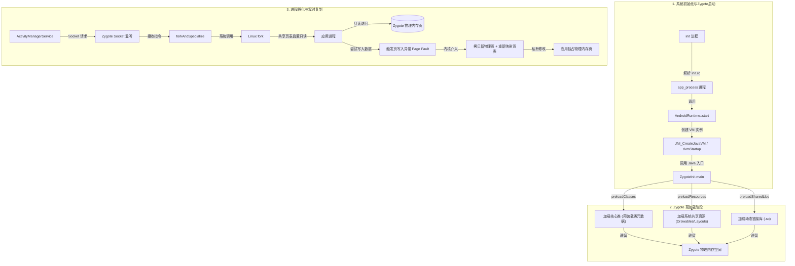
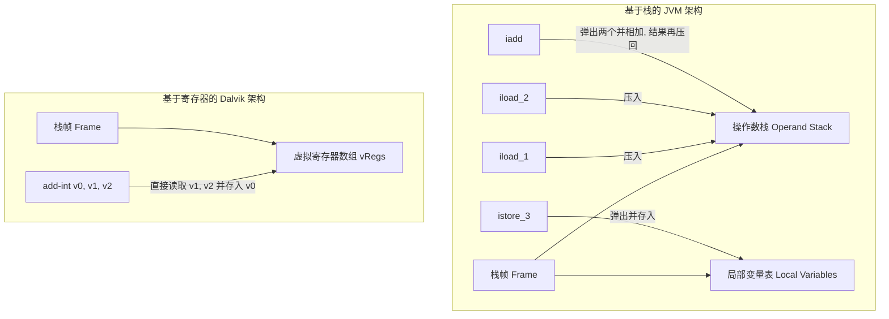
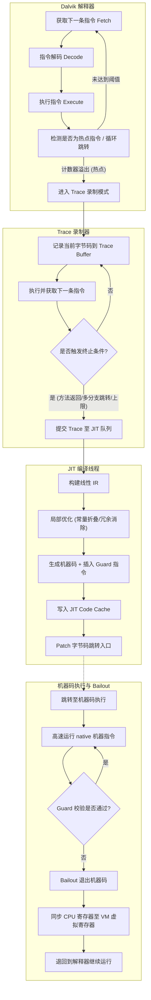
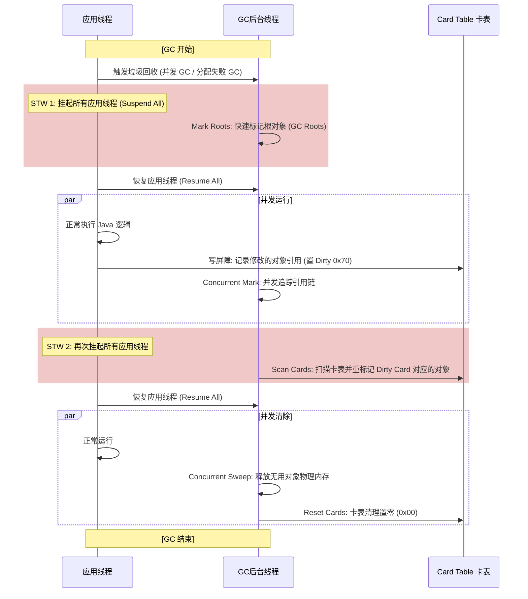

# 2.2.1.3 Dalvik执行模型

Dalvik 虚拟机是早期 Android 操作系统的核心引擎（从 Android 1.0 延续至 Android 4.4，后被 ART 彻底取代）。与传统的 Java 虚拟机（JVM）以及传统的嵌入式运行时相比，Dalvik 虚拟机在设计上进行了高度定制，以适应移动设备在物理硬件（如低内存、慢速闪存、单核/低频 CPU、电池容量受限）上的苛刻约束。

本章将从物理级视角，深度剖析 Dalvik 虚拟机的执行模型。我们将从底层的操作系统、系统总线、物理内存以及 CPU 指令集的维度，解构 Android Runtime 虚拟机的启动与 Zygote 孵化机制、基于寄存器的解释执行引擎与 Trace-based JIT 编译器、基于 Card Table 的垃圾收集机制，以及基于 Linux UID 的多进程多实例沙箱安全架构。

---

## 一、Android Runtime 虚拟机启动与 Zygote 孵化机制的物理本质

在标准的 Java 桌面或服务器环境中，启动一个 Java 程序意味着为该程序单独运行一个独立的 JVM 进程。而在 Android 系统中，为了实现应用秒开、减少物理内存（RAM）的开销，Google 设计了 Zygote 孵化机制。这一机制的物理本质，是充分利用 Linux 操作系统的进程创建机制和虚拟内存页共享技术。

### 1.1 `app_process` 的诞生与 Android 系统的初始化

Android 系统的引导过程从内核空间延伸到用户空间，其核心逻辑线索如下：

1. **Linux 内核启动与 init 进程挂载**：系统上电并加载内核后，内核会挂载根文件系统并启动用户空间的第一个进程 `init`（PID = 1）。
2. **解析 `init.rc`**：`init` 进程会解析系统配置文件 `/system/etc/init/hw/init.rc`。该文件以声明式语法配置了系统关键服务，其中就包括 `zygote`：
   ```rc
   service zygote /system/bin/app_process -Xzygote /system/bin --zygote --start-system-server
       class main
       priority -20
       user root
       group root readproc reserved_disk
       socket zygote stream 660 root system
   ```
3. **执行 `app_process`**：`init` 进程通过 `fork()` 和 `execve()` 系统调用，加载并执行 `/system/bin/app_process`（在 64 位系统上为 `app_process64` 或 `app_process32`）。这是整个 Android Runtime 的物理起点。

`app_process` 的入口点位于 `frameworks/base/cmds/app_process/app_main.cpp` 中的 `main` 函数。其主要职责是解析启动参数，如果是 `--zygote` 模式，它将初始化 `AppRuntime` 实例（继承自 `AndroidRuntime`），并调用其 `start` 方法：

```cpp
// frameworks/base/cmds/app_process/app_main.cpp
int main(int argc, char* const argv[]) {
    // ... 解析参数 ...
    if (zygote) {
        runtime.start("com.android.internal.os.ZygoteInit", args, zygote);
    }
}
```

### 1.2 Dalvik 虚拟机实例的创建与初始化

当 `AndroidRuntime::start` 被调用时，控制权转入 `frameworks/base/core/jni/AndroidRuntime.cpp`。在此阶段，系统会完成从 Native C/C++ 运行时向 Java 虚拟机的物理跃迁，其执行过程包含以下关键物理步骤：



#### 1.2.1 拼接虚拟机启动选项（Options）
虚拟机启动前，系统必须配置其内存分布和行为选项。`AndroidRuntime::startVm` 会从系统属性（Properties）中读取配置参数：
* `dalvik.vm.heapsize`：定义应用能够获取的最大堆大小（例如限制为 128MB 或 256MB）。
* `dalvik.vm.heapgrowthlimit`：普通应用无特殊声明（未设置 `largeHeap`）时的最大堆增长上限，防止单个后台应用耗尽整机 RAM。
* `dalvik.vm.heapstartsize`：分配给虚拟机的初始堆大小，通常设置为 4MB~8MB，以加快启动速度。
* `dalvik.vm.dexopt-flags`：配置 DEX 优化的标志（如校验、寄存器映射图生成等）。

这些属性将被拼接成标准的 JVM 参数（如 `-Xms`, `-Xmx`），传递给虚拟机创建接口。

#### 1.2.2 物理创建虚拟机：`JNI_CreateJavaVM`
参数配置完成后，调用 `JNI_CreateJavaVM(&mJavaVM, &mEnv, &initArgs)`。在 Dalvik 虚拟机源码中，这对应于 `dalvik/vm/Init.cpp` 中的 `dvmStartup` 函数。该函数按照严格的物理依赖顺序初始化虚拟机的内部子系统：
1. **`dvmAllocTrackerStartup()`**：初始化内存分配追踪器。
2. **`dvmGcStartup()`**：创建虚拟机的物理堆（Heap），初始化 `HeapSource` 和并发 GC 所需的 Card Table（卡表）内存区。
3. **`dvmThreadStartup()`**：建立主线程的内部控制结构（`Thread` 结构体），分配线程私有的虚拟寄存器栈（vregs Stack Frame）。
4. **`dvmClassStartup()`**：创建类加载机制的基石。初始化全局类加载哈希表，加载最基础的类描述符（如 `java.lang.Class`, `java.lang.Object`, `java.lang.String`）。
5. **`dvmInterpretStartup()`**：初始化解释器执行引擎，包括汇编直跳表的加载（在 Fast Interpreter 模式下）。
6. **`dvmJitStartup()`**：如果系统配置启用了 JIT，在此阶段分配 JIT Code Cache 的内存区域，并启动后台 JIT 编译线程。

虚拟机实例物理创建完成后，系统得到了一个活跃的 JNI 执行环境（`JNIEnv`）。接着，`AndroidRuntime::start` 通过 JNI 调用 `com.android.internal.os.ZygoteInit` 的静态 `main` 方法，标志着系统从 C++ 引导层正式跨入 Java 层。

---

### 1.3 Zygote 的预加载机制：物理装载与代价

Zygote 进程启动后，在开始监听 Socket 并孵化应用之前，会执行一项至关重要的物理内存操作——**预加载（Preload）**。其核心代码位于 `ZygoteInit.java` 中：

```java
// com.android.internal.os.ZygoteInit
public static void main(String argv[]) {
    // ...
    preload(bootTimingsTraceLog);
    // ...
    runSelectLoop(abiList); // 开始监听 Socket 接入请求
}
```

在 `preload()` 方法中，Zygote 依次执行以下加载操作：

#### 1.3.1 预加载系统核心类：`preloadClasses()`
系统读取位于 `/system/etc/preloaded-classes` 中的文本文件，该文件列出了数千个 Android 系统最核心、最常用的 Java 类（如整个 `java.lang.*`、`android.app.*`、`android.view.View`、`android.widget.TextView` 等）。
通过 `Class.forName(className, true, null)`，Zygote 进程强行装载这些类。在此过程中：
1. **类文件装载与链接**：虚拟机会把这些类的 `.odex` 代码段（字节码）映射到自己的虚拟地址空间。
2. **元数据解析**：在堆中为每个类物理分配 `ClassObject` 结构体，构建类的虚函数表（`vtable`）、接口虚函数表（`itable`）、静态字段区以及方法区（`Method` 结构体）。
3. **静态初始化**：执行类的静态初始化块（`<clinit>`），这会导致部分静态对象直接被 new 出来并驻留在 Zygote 堆中。

#### 1.3.2 预加载共享资源：`preloadResources()`
系统通过 `Resources.getSystem().getValue()` 预先加载大量的系统图标、UI 资源 xml 文件、通用 Drawables 等。这些资源会被转换为底层 Native 的 `ResTable` 数据结构并驻留在内存中。

#### 1.3.3 预加载共享库：`preloadSharedLibraries()`
通过 `System.loadLibrary("android_runtime")` 等方式，显式加载系统 Framework 所依赖的一系列 Native C/C++ 共享动态库（`.so` 文件）。

#### 预加载的物理代价与收益平衡
* **代价**：预加载过程涉及频繁的磁盘 I/O（读取 DEX 和 `.so` 文件）和物理内存分配，在低配置设备上可能耗时达 2~5 秒。这也是 Android 系统开机启动速度较慢的重要物理成因。
* **收益**：预加载的类和资源在内存中是“干净”且“只读”的。因为这一步发生在 `fork()` 之前，后续所有的 Android 应用进程都可以无缝共享这部分物理内存，而不需要在每个进程中重复加载。

---

### 1.4 写时复制（Copy-on-Write, COW）的操作系统与 CPU 硬件级细节

当用户点击桌面图标启动一个应用时，`ActivityManagerService`（AMS）通过 Socket 向 Zygote 进程发出启动进程的指令。Zygote 接收指令后，调用 `Zygote.forkAndSpecialize`，其底层是通过 Linux 系统的 `fork()` 来实现进程创建的。

在现代操作系统 and CPU 硬件层面，`fork()` 的物理本质是极其轻量级的。它没有发生大规模的物理内存拷贝，而是依赖于**写时复制（Copy-on-Write, COW）**机制。

#### 1.4.1 页表（Page Table）与物理帧（Page Frame）的映射
在保护模式下，CPU 无法直接访问物理内存，必须通过内存管理单元（MMU）将虚拟地址翻译为物理地址。这种翻译关系保存在内核维护的**多级页表**（在 32 位系统上通常为两级或三级，在 64 位系统上通常为四级，如 PGD -> PUD -> PMD -> PTE）中。页表的最小映射单位是“物理页”（Page，通常为 4KB）。

#### 1.4.2 `fork()` 期间的页表复制与只读标记
当 Zygote 进程执行 `fork()` 系统调用时，内核会进入 `kernel/fork.c` 中的 `do_fork()`，并调用 `copy_page_range`：
1. **只复制页表，不复制物理页**：内核只为子进程（即新应用进程）创建一个全新的进程控制块（`task_struct`） and 一组新的页表。子进程的页表内容完全复制自父进程（Zygote）的页表。
2. **物理内存地址映射相同**：复制完成后，子进程的虚拟地址通过其新页表，指向与父进程完全相同的物理内存页框（Page Frame）。
3. **PTE 标记为只读（Write-Protect）**：这是 COW 的物理精髓。内核在复制页表项（Page Table Entry, PTE）时，会清除该页表项的“可写（Write）”位，将其标记为**只读（Read-Only）**。这一步骤对父子进程的页表同时生效。此时，这部分物理内存页的引用计数递增。

```
     Zygote 虚拟地址空间             新应用 虚拟地址空间
    +-------------------+           +-------------------+
    |   0x7F000000      |           |   0x7F000000      |
    +-------------------+           +-------------------+
              |                               |
              +--------------+ +--------------+
                             v v
                      +-------------------+
                      | 物理内存页 (4KB)   |
                      | 属性: 只读 (WP)   |
                      +-------------------+
```

#### 1.4.3 写时复制的硬件中断与物理解耦
当新应用进程启动并运行（例如开始执行自己的 `main` 函数，修改某个类中的静态变量，或者在堆上分配新对象）时，必然会尝试写操作：
1. **硬件检测异常**：CPU 试图对某个标记为“只读”的虚拟页进行写入。MMU（内存管理单元）在翻译地址时，检测到写保护（Write-Protect）标志被触发。
2. **抛出 CPU 缺页异常（Page Fault）**：CPU 立即中断当前的指令执行流水线，保存现场，并产生一个 14 号中断（在 x86 架构下）或 Data Abort 中断（在 ARM 架构下）。
3. **内核缺页处理函数介入**：操作系统内核捕获到这个硬件中断，调用中断处理程序（如 `do_page_fault`），进一步路由到 `do_wp_page`（处理写保护页错误）：
   * 内核检查该页的物理引用计数。如果引用计数大于 1，说明该物理页正被多个进程共享。
   * 内核在物理内存中申请一个**全新的物理页框**。
   * 内核使用 DMA 或 CPU 拷贝指令，将原来共享物理页上的数据（4KB 字节）**完整复制**到新申请的物理页中。
   * 内核修改当前发生写操作进程的页表项，将其虚拟地址重新映射指向这个新分配的物理页，并清除只读标记，将其置为“可读写”。
   * 物理页的引用计数减 1。
4. **指令重执行**：内核处理完缺页中断后，将 CPU 控制权交还给应用进程，重新执行刚才那条写内存的汇编指令。此时，写入操作在应用专属的物理页上顺利完成，而父进程（Zygote）以及其他子进程对应的物理内存未受任何干扰。

```
     Zygote 虚拟地址空间             新应用 虚拟地址空间
    +-------------------+           +-------------------+
    |   0x7F000000      |           |   0x7F000000      |
    +-------------------+           +-------------------+
              |                               | (由于写操作触发COW)
              v                               v
    +-------------------+           +-------------------+
    | 物理内存页 A (4KB)|           | 物理内存页 B (4KB)|
    | 属性: 只读        |           | 属性: 可读写       |
    +-------------------+           +-------------------+
```

---

### 1.5 虚拟机 Fork 过程的内存空间变化与调优细节

为了维持极高的内存共享率，避免大量的物理内存因为 COW 机制而退化为进程专属内存，Dalvik 虚拟机在 `fork` 阶段必须进行精细的内存管理调优。

#### 1.5.1 共享与专属内存的区分
在 Android 系统中，一个应用进程的内存开销主要分为两部分：
* **Proportional Set Size (PSS)**：应用进程实际占用的物理内存，其中共享内存按共享进程数均摊。
* **Unique Set Size (USS)**：应用进程独占的物理内存。它是应用在运行过程中由于触发 COW 拷贝或者自主分配堆内存而产生的专属物理页。

为了降低整机物理内存开销，目标是让 USS 尽可能小，让共享的 PSS 尽可能大。

#### 1.5.2 Dalvik 虚拟机对 COW 的工程优化
1. **DEX 文件的只读共享**：
   Dalvik 虚拟机对 `.dex` / `.odex` 文件的代码段加载采用的是 `mmap()` 系统调用，且映射标志为 `MAP_PRIVATE` 加上只读保护（`PROT_READ`）。多个应用进程的虚拟内存空间通过页表映射到同一个 DEX 文件的磁盘缓存（Page Cache）物理页上。只要应用进程不尝试修改 DEX 文件中的代码段数据（字节码是绝对不可改的），这部分内存就永远不会发生 COW。这为多应用运行节省了数十兆的物理内存空间。
2. **避免在 Zygote 初始化后做不必要的内存写入**：
   在 Zygote 进行 `fork()` 之前，虚拟机会触发一次彻底的垃圾回收（GC），将所有无用对象彻底清除，并对内存堆进行整理，使得空闲的内存块合并为连续区域。
   同时，Zygote 进程中的 Java 线程必须全部停止（除主线程外），确保没有后台线程在 fork 前夕乱写内存。如果 Zygote 进程在 fork 的瞬间依然在疯狂分配对象，那么子进程继承的页表中有大量处于活跃分配状态的内存页，子进程一旦开始运行就会立刻触发这些页的 COW，使得物理共享率大幅下跌。

#### 1.5.3 预加载列表（`preloaded-classes`）的精细调优
* **漏配的代价（共享退化）**：如果某个基础类（例如 `android.view.ViewGroup`）没有放入预加载列表，而是由应用在运行时独立加载。那么该应用的 Dalvik 类加载器在定义该类时，必须在自己的 `Active Heap` 上分配 `ClassObject` 描述符，并写入类加载哈希表中。这一写操作不仅会导致类元数据本身成为应用的 USS，而且会使存放类加载哈希表的内存物理页发生 COW 拷贝。
* **滥配的代价（无用驻留）**：如果预加载列表中加入了一个极为冷门、仅有个别第三方 App 使用的类。这个类在 Zygote 启动时被强制装载，占用了物理内存。因为 Zygote 是常驻进程，这部分物理内存永远无法被垃圾回收器释放，导致了物理 RAM 的无谓浪费。
* **调优工具与策略**：Google 官方通常会在系统编译期利用特制的静态分析工具（例如对系统运行日志进行聚类分析），统计出 top 90% 应用在启动前 2 秒内共同加载的类，将其动态生成为 `preloaded-classes` 列表，以此达到共享率与启动时间的最佳物理平衡点。

---

## 二、Dalvik 虚拟机的解释执行与 JIT（Just-In-Time）编译器

Dalvik 虚拟机的核心任务是执行 DEX 字节码。在物理层面，CPU（例如 ARM 芯片）只能执行其原生的机器指令集。虚拟机必须将 DEX 字节码翻译为物理 CPU 能够识别的机器指令。这一过程主要由解释器（Interpreter）和即时编译器（JIT Compiler）协同完成。

### 2.1 基于寄存器的架构（Register-based）与基于栈的架构（Stack-based）物理对比

Dalvik 虚拟机与标准 JVM（如 HotSpot）在指令集设计上存在本质的哲学分野：JVM 采用基于栈的架构，而 Dalvik 采用基于寄存器的架构。这种分野在物理机器指令的翻译和执行效率上产生了深远影响。



#### 2.1.1 物理计算过程的对比：以 `a = b + c` 为例

##### 1. 基于栈的虚拟机（如 HotSpot 执行 Java 字节码）
基于栈的指令集主要依赖于操作数栈进行临时数据的中转。以下是 JVM 执行该操作的典型字节码指令序列：
```bytecode
iload_1      // 将本地变量表索引为 1 的变量（b）压入操作数栈顶
iload_2      // 将本地变量表索引为 2 的变量（c）压入操作数栈顶
iadd         // 弹出栈顶的两个元素，送入 CPU 累加器相加，然后将结果压入栈顶
istore_3     // 将栈顶元素弹出，存入本地变量表索引为 3 的变量（a）中
```
* **物理实质**：该指令流包含 4 条指令。在解释执行时，每条指令都伴随着虚拟机栈指针的移动（Push/Pop）。这会导致频繁的内存边界校验和临时内存变量的拷贝。虽然在运行时 JVM 内部可以通过栈顶缓存（Top-of-Stack Caching）来减少物理内存读写，但字节码本身的冗余性不可避免。

##### 2. 基于寄存器的虚拟机（如 Dalvik 执行 DEX 字节码）
基于寄存器的指令集将变量和临时结果保存在虚拟寄存器中。以下是 Dalvik 执行该操作的字节码指令：
```bytecode
add-int v0, v1, v2   // 将虚拟寄存器 v1(b) 和 v2(c) 的值相加，结果写入 v0(a)
```
* **物理实质**：该指令流仅包含 1 条指令。虚拟机直接从栈帧内存中偏移量为 `v1` 和 `v2` 的地址读取数据，运算后直接写入 `v0` 对应的内存地址。无任何中间入栈出栈操作。

#### 2.1.2 物理级对比指标分析

| 维度 | 基于栈的架构 (JVM) | 基于寄存器的架构 (Dalvik) | 物理成因与影响 |
| :--- | :--- | :--- | :--- |
| **指令条数** | 较多 (通常多 30%~40%) | 较少 | Dalvik 减少了解释器主循环（Fetch-Decode-Execute）的物理迭代次数，降低了 CPU 的分支预测开销。 |
| **指令长度** | 变长或 8 位对齐，指令体积极小 | 16 位对齐，指令长度通常为 2 字节的倍数 | Dalvik 单条指令包含寄存器索引编码，体积大于 JVM 的单字节指令；但由于指令总数少，DEX 文件最终的整体体积依然显著小于 Class 归档文件（JAR）。 |
| **数据搬运** | 依赖操作数栈，内存拷贝频繁 | 虚拟寄存器寻址，直接映射内存偏移 | Dalvik 大幅减少了临时变量在物理内存栈帧中的拷贝次数，减轻了内存总线带宽的压力。 |
| **编译器实现** | 简单，无需考虑复杂的寄存器分配 | 复杂，必须在编译期（dx/d8）进行寄存器分配 | Dalvik 在编译期必须执行复杂的图着色算法（Graph Coloring）将 Java 变量映射到有限的虚拟寄存器（通常为 16 或 256 个）上。 |

---

### 2.2 Dalvik 双字节码（16-bit code units）指令集设计与 DEX 文件物理结构

Dalvik 虚拟机的指令编码以 16 位（双字节）为基础物理单元。这种设计的背后有着深刻的硬件考量：

1. **ARM 架构的 16 位寻址对齐**：
   主流的 ARM 处理器（特别是早期的 ARMv5TE, ARMv6 架构）支持 ARM（32位）和 Thumb（16位）指令集。当数据或指令在内存中以 16 位（2字节）边界对齐时，CPU 能够通过半字（Half-word）加载指令（如 `LDRH`）实现**单周期数据读取**。如果使用 JVM 那种以 8 位为单位的字节码，在解码多字节操作数时，极易跨越 32 位或 16 位的对齐边界，导致 CPU 必须执行多次内存读取和移位拼接操作，极大损耗了解释效率。
2. **DEX 文件的物理扁平化**：
   传统的 Java 类文件（`.class`）每个都拥有自己独立的常量池。如果一个项目有 1000 个类文件，那么像 `"java/lang/String"` 这样的字符串和方法签名就会在 1000 个类文件的常量池中重复存在 1000 次。
   DEX 文件通过完全重构，将所有类合并为一个单一文件，并采用全局常量池设计：
   * **全局字符串索引（String IDs）**、**类型索引（Type IDs）**、**原型索引（Proto IDs）**、**字段索引（Field IDs）**和**方法索引（Method IDs）**全部被设计为扁平的数组偏移量。
   * 当 Dalvik 虚拟机加载 DEX 文件时，只需为这些数组分配连续的虚拟内存页，解析出偏移地址。执行指令时，指令码中携带的索引（例如 `MethodID 0x012F`）可以直接作为数组下标，在常数时间 $O(1)$ 内定位到目标方法的元数据指针，避免了复杂的字符串哈希查找，降低了物理 CPU 的运算开销。

---

### 2.3 解释器双引擎：Fast Interpreter (mterp) vs Portable Interpreter

Dalvik 虚拟机在 C++ 层面设计了两种解释执行引擎，分别应对不同的场景：

#### 2.3.1 Portable Interpreter（便携式解释器）
* **物理实现**：纯 C++ 编写，核心是一个巨大的 `switch-case` 结构（或基于 `goto` 标签数组的分发表）。
* **执行瓶颈**：每次执行完一条字节码后，都会跳转回 `switch` 头部进行操作码的分发。这在物理 CPU 层面会导致严重的**分支预测失败（Branch Misprediction）**。CPU 的指令流水线无法准确预测下一个要跳转的 `case` 分支，导致流水线频繁被清空（Pipeline Flush），极大地限制了指令吞吐量。
* **定位**：由于不依赖具体 CPU 架构，易于移植，是 Dalvik 在新架构（如 MIPS, x86）上的先导实现，同时也是虚拟机开发者的调试引擎。

#### 2.3.2 Fast Interpreter (mterp / 模块化汇编解释器)
为了攻克 Portable 解释器的分支预测瓶颈，Dalvik 针对 ARM 架构手写了极其精密的汇编解释器 `mterp`。

* **物理本质：直接线程化代码（Direct Threaded Code）**：
  在 `mterp` 中，不再有 `switch-case` 的统一入口。相反，每条 Dalvik 字节码指令的执行代码（汇编片段）在内存中都是严格按固定字节（例如 64 字节或 128 字节）**对齐排列**的。
* **物理基址寻址**：
  虚拟机将汇编解释器的首地址保存在 CPU 的一个特定寄存器（基址寄存器，如 `rIBase`）中。当一条指令执行完毕时，汇编代码会直接读取下一条指令的操作码（Opcode），利用位移指令计算出偏移量，然后直接通过 `PC` 寄存器跳转到目标指令的执行代码首地址。
* **ARM 汇编层面的物理执行轨迹**：
  以下是 `mterp` 在 ARM 处理器上解释执行一条指令并跳转到下一条指令的经典汇编示意：
  ```assembly
  @ 假设当前正在执行 add-int v0, v1, v2
  @ rPC 指向当前的 Dalvik 字节码指令流地址
  @ rFP 指向当前栈帧的虚拟寄存器基地址 (vRegs)
  
  ldrh    r0, [rPC], #2       @ 从 rPC 读取 16 位的 Dalvik 指令，同时 rPC 后移 2 字节
  mov     r1, r0, lsr #12     @ 提取指令中的源寄存器 v1 索引
  and     r2, r0, #0x0f00     @ 提取指令中的源寄存器 v2 索引
  @ ... 读取 v1 和 v2 的物理内存值，并在 CPU 中完成加法 ...
  
  @ 关键：计算下一条指令的跳转地址并实现直跳 (Chaining)
  ldrb    r3, [rPC]           @ 预读取下一条指令的 8 位操作码 (Opcode)
  add     pc, rIBase, r3, lsl #6  @ rIBase 是解释器代码的基地址，每个指令汇编块对齐为 64(2^6) 字节
                              @ 直接将跳转目标写入 pc 寄存器，实现硬件级直跳！
  ```
* **硬件收益**：这种设计完美避开了操作系统的分支预测器干扰，CPU 可以保持极高的流水线满载度，执行效率比 Portable 解释器提升了数倍。

---

### 2.4 Trace-based JIT 的工作原理与热点探测机制

为了进一步挖掘运行期性能，Android 2.2 引入了 JIT（Just-In-Time）编译器。与 HotSpot 采用的 Method-based JIT 编译整个方法不同，Dalvik 创新性地采用了 **Trace-based JIT（基于路径的即时编译器）**。这一设计是基于移动端物理硬件限制做出的工程权衡。



#### 2.4.1 热点探测（Hotspot Detection）的物理计数器
当解释器执行字节码时，如果遇到**循环跳转指令（Backward branch）**或**方法调用指令（Method invoke）**，虚拟机会在当前线程的内部控制数据结构中，累加对应的跳转目标计数器。
* **阈值设计**：为了防止编译开销过大，阈值通常设置得比较低（例如跳转回退 200 次，或方法调用 200 次）。
* **状态切换**：当某个指令的累加计数器溢出时，说明检测到了“热点入口”。虚拟机会将该线程的执行状态标志切换为 **Trace 录制状态（Trace Profiling Mode）**。

#### 2.4.2 Trace 的线性录制过程
进入录制状态后，解释器在继续执行字节码的同时，会把经过的每一条字节码指令的类型、操作数和运行时分支选择，顺序记录到一个连续的物理缓冲区（Trace Buffer）中：
* **单路径线性记录**：即使代码中包含 `if-else` 分支，Trace 录制器也只记录当前实际走过的那一条分支路径（例如 `if` 成立的路径）。它不关心未执行的 `else` 分支。
* **终止条件**：录制器会持续记录，直到遇到以下物理边界之一：
  1. 遇到了方法的返回指令（Return）。
  2. 录制的 Dalvik 字节码指令条数达到了硬性上限（如 100 条指令）。
  3. 遇到了无法进行 JIT 编译的复杂指令（例如抛出异常、反射调用或复杂的 JNI 边界）。
  4. 遇到了非循环引起的复杂跳转。

#### 2.4.3 JIT 编译与 Code Cache 写入
录制完成后，Trace Buffer 被作为一个独立的线性基本块（Basic Block）提交给后台的 JIT 编译线程。
1. **中介表示（IR）转化**：JIT 编译器将 Trace Buffer 转化为编译器中间表示（IR）。由于 Trace 是线性的，无需构建复杂的控制流图（CFG），这极大地简化了数据流分析的物理算力消耗。
2. **优化执行**：执行快速的局部优化，如常量折叠（Constant Folding）、冗余 Null 检查消除、数组边界检查优化。
3. **汇编机器码生成（Code Generation）**：针对当前设备的 CPU（如 ARM Cortex-A8）生成原生的机器指令序列，并存放在一块预先通过 `mmap()` 分配的、具有可执行权限的物理内存区域中，这块区域被称为 **JIT Code Cache**。
4. **入口打桩（Patching）**：修改原字节码跳转表的对应项，或者将原字节码的第一条指令替换为一条特殊的跳转指令（Jit Chaining），使其直接指向 Code Cache 中生成的机器码物理首地址。下一次解释器执行到该热点时，CPU 就会直接硬件跳转到 Code Cache 中高速运行。

---

### 2.5 Trace JIT 与 HotSpot Method JIT 的物理对比及其优缺点

Trace-based JIT 的设计理念是以细粒度的“高频执行路径”为单位进行编译，这与 HotSpot 这种编译整个方法的 Method-based JIT 相比，具有截然不同的物理特性：

#### 2.5.1 卫语句（Guard）与退回机制（Bailout）的物理运作
因为 Trace 只编译了单条分支路径，为了确保在分支条件发生改变时程序逻辑依然正确，JIT 编译器必须在生成的机器码中插入 **Guard 指令（卫语句）**。
* **Guard 的物理原理**：Guard 指令通常对应一条快速的汇编条件测试指令（如 ARM 下的 `CMP` 和 `BNE`）。它检测运行时的实际物理状态是否依然符合 Trace 的录制预期（例如，验证某对象指针是否非空，或者分支条件寄存器的值是否依然为真）。
* **Bailout（退回解释器）的物理代价**：
  如果 Guard 指令检测到条件不满足（说明程序在本次循环中偏离了原来的热点路径，走向了 `else`），机器码必须立刻执行 `Bailout`：
  1. **状态同步**：将当前物理 CPU 寄存器（如 R0, R1 等）中的临时计算结果，强制写回到内存中 Dalvik 虚拟机栈帧对应的虚拟寄存器（vregs）中。
  2. **指令指针重置**：将虚拟机的 PC 指针指向发生分支偏离的下一条 Dalvik 字节码指令地址。
  3. **重新解释**：退出 Code Cache 的机器码执行状态，让 CPU 重新载入汇编解释器 `mterp` 从该点开始继续解释执行。
  这一过程涉及 CPU 寄存器与内存的频繁同步、解释器上下文的重建，会导致严重的物理流水线停顿，其开销甚至远超纯解释执行。

#### 2.5.2 优缺点物理剖析

##### 优点：
1. **内存开销极低**：由于只编译热点路径，生成的机器码体积小。Dalvik 的 JIT Code Cache 通常只需分配 1MB~2MB 物理内存，即可覆盖应用 80% 以上的高频执行代码。而 Method JIT 编译整个方法，会把大量极少执行的错误处理、初始化分支全部编译，消耗大量的 RAM。这在早期 512MB RAM 的手机上是无法承受的。
2. **编译延迟极小，无卡顿**：由于 Trace 结构简单，JIT 编译器的算法可以在几十个微秒内完成编译，对 CPU 资源的抢占极小，不会引起主线程的抢占卡顿。

##### 缺点：
1. **分支抖动下的性能灾难**：如果应用的控制流包含大量的多态分支、随机选择（例如复杂的 3D 物理引擎计算、JSON 文本解析），Guard 校验会频繁失败，导致频繁的 Bailout。这会导致 CPU 流水线不断清空，性能急剧退化。
2. **无法进行高级全局优化**：由于缺乏整个方法的控制流上下文（Control Flow Graph），Trace JIT 根本无法实施深度的方法内联（Method Inlining）、全局逃逸分析（Escape Analysis）、循环不变代码外提（LICM）等编译器核心优化，限制了应用性能的上限。

---

## 三、Dalvik 垃圾收集（GC）机制与内存分布简述

垃圾收集器（GC）是 Dalvik 虚拟机中最影响用户体验（导致界面卡顿、掉帧）的物理子系统。为了兼顾多应用共享内存和运行期内存的回收，Dalvik 采用了独特的内存堆划分和卡表机制。

### 3.1 Dalvik 堆内存（Heap）的物理划分：Zygote Heap 与 Active Heap

Dalvik 虚拟机在 C/C++ 层面通过 `dalvik/vm/alloc/HeapSource.cpp` 管理内存堆。物理上，Dalvik 的堆被划分为两个独立的虚拟内存段，它们分别由不同的 `mspace`（底层基于 dlmalloc 内存分配器）进行管理：

```
+-----------------------------------------------------------------------+
|                         Dalvik 虚拟机物理堆 (Heap)                     |
+----------------------------------------+------------------------------+
|             Zygote Heap                |          Active Heap         |
|  - 物理属性: 只读 (COW 保护)           |  - 物理属性: 可读写          |
|  - 存储对象: 系统启动预加载的类与资源  |  - 存储对象: 应用运行时分配  |
+----------------------------------------+------------------------------+
```

1. **Zygote Heap（Zygote 堆）**：
   * **形成时机**：在 Zygote 进程完成了核心类和资源的预加载后，在准备 fork 第一个子进程之前，虚拟机会调用 `dvmPreSweep()`。该操作会限制当前虚拟内存分配器的最大边界，并将其标记为 **Zygote Heap**。
   * **物理特征**：此堆中的所有物理内存页在后续进程 fork 时被标记为只读共享。只要应用不试图在 Zygote Heap 中分配新对象或修改其中的对象，这些物理页就不会发生 COW。
2. **Active Heap（活跃堆）**：
   * **形成时机**：Zygote fork 产生子进程时，虚拟机会自动在剩余的虚拟地址空间中为子进程创建一个全新的 `mspace`，称为 **Active Heap**。
   * **物理特征**：应用在运行过程中执行的所有 `new` 操作，其物理内存全部分配在 Active Heap 上。这保证了应用的动态内存分配完全限制在应用专属的物理页中，不会污染共享的 Zygote 堆。

---

### 3.2 脏页卡表（Card Table）的物理结构与写屏障的硬件实现

在垃圾收集过程中，GC 线程需要追踪对象的引用关系。如果一个原本驻留在 Zygote 堆（老年代）中的静态对象在运行期被修改，指向了 Active 堆（新生代）中的新对象，垃圾收集器必须能够识别出这种跨堆引用。
为了避免在每次局部 GC 时都扫描庞大且只读的 Zygote 堆，Dalvik 引入了 **Card Table（卡表）** 机制。

```
                    Card Table (字节数组, 每个字节代表512字节物理内存)
                    +----+----+----+----+----+----+----+----+
                    |0x00|0x00|0x70|0x00|0x00|0x00|0x00|0x00|
                    +----+----+----+----+----+----+----+----+
                                | (偏移索引指向第2个Card)
                                v
                    +---------------------------------------+
                    | 物理堆内存 (以 512 字节为单位划分)       |
                    | [0]       |[512]      |[1024]     |...|
                    | (Clean)   | (Dirty)   | (Clean)   |   |
                    +---------------------------------------+
```

#### 3.2.1 Card Table 的物理映像
Card Table 是一块通过 `mmap()` 匿名映射分配的连续虚拟内存区域。
* **比例关系**：卡表中的每个字节（1 Byte）映射堆内存中一段固定大小的物理区间（称为卡，Card，通常为 512 字节）。
* **物理公式**：对于任意一个堆中对象的指针地址 `ObjAddr`，其在 Card Table 中对应的字节指针地址 `CardAddr` 可以通过以下硬件级移位公式极速计算：
  $$\text{CardAddr} = \text{CardTableBase} + (\text{ObjAddr} \gg 9)$$
  其中右移 9 位相当于除以 512。

#### 3.2.2 写屏障（Write Barrier）的硬件注入
当 Java 代码中发生引用修改，例如：
```java
staticObject.field = newActiveObject;
```
无论是解释器执行到此处，还是 JIT 生成的机器指令，都必须强制插入一段**写屏障（Write Barrier）**汇编指令。其物理逻辑如下：

```assembly
@ 假设 r0 存放被写入引用的受体对象地址 (staticObject)
@ 假设 r1 存放 Card Table 的基地址 (CardTableBase)
@ 假设 r2 存放脏标记值 (0x70, 在 Dalvik 中代表 Dirty)

lsr     r3, r0, #9          @ 将受体对象地址右移 9 位，计算卡表偏移量
strb    r2, [r1, r3]        @ 将脏标记 0x70 写入 Card Table 基址加上偏移量的内存地址
```

#### 3.2.3 GC 期间卡表的作用
当 Dalvik 并发垃圾收集器启动时，它无需遍历整个堆。GC 线程直接扫描这块连续的 Card Table。如果发现某个卡表字节的值为 `0x70`（Dirty），则表明该卡对应的 512 字节物理内存中的对象在并发期内被修改过引用。GC 只需对该特定卡内的对象进行深度追踪，极大地缩短了扫描时间。

---

### 3.3 Dalvik 并发 GC（Mark-Sweep）流程与两次 STW 的物理成因

Dalvik 虚拟机内置的垃圾收集器采用的是**标记-清除（Mark-Sweep）**算法。为了减少对应用线程的挂起时间，它引入了并发标记（Concurrent Mark）。但在物理执行层面，它依然包含两次不可避免的 **Stop-the-World（STW）** 全局挂起。



#### Step 1: 标记根对象（Mark Roots）- 第一次 STW
* **操作**：GC 线程发起全局挂起指令。虚拟机会修改所有应用线程的信号标志位，强制它们在下一个安全点（Safe Point，通常是方法调用、跳转或指令对齐处）进入阻塞状态。
* **物理开销**：挂起所有线程后，GC 线程快速扫描系统的全局引用的起点（如 JNI 全局/局部引用、当前线程栈帧中的局部变量指针、静态变量、底层 Native 系统对象）。由于只标记直接引用的第一层节点，此阶段执行极快，通常为 2~5 毫秒。

#### Step 2: 并发标记（Concurrent Mark）- 线程并发
* **操作**：虚拟机恢复应用线程的运行。GC 线程与应用线程在 CPU 上并发执行。GC 线程沿着 Step 1 标记出的根节点，递归遍历整个对象可达性拓扑图。
* **物理冲突**：在遍历期间，应用线程在正常修改内存，导致对象引用关系发生改变。写屏障会实时地将对应的 Card Table 项置为 Dirty。

#### Step 3: 重新标记（Re-mark / Scan Cards）- 第二次 STW
* **操作**：在并发标记结束后，为了处理并发期内被应用线程篡改的引用关系，GC 线程必须发起**第二次全局挂起（STW 2）**。
* **物理痛点**：GC 线程在所有应用线程挂起后，集中扫描 Card Table。如果应用在并发标记期间由于滑动列表、加载网络图片，产生了大量的内存写入，这会导致卡表中存在海量的 Dirty 卡。GC 线程在此阶段必须耗费大量 CPU 周期，对这些脏卡对应的物理内存区域进行重新扫描和标记。这极易导致 STW 2 的耗时失控，经常达到 10~30 毫秒以上。

#### Step 4: 并发清除（Concurrent Sweep）- 线程并发
* **操作**：重新标记完成，确保无误后，虚拟机再次恢复应用线程。GC 线程并发地将未被标记的“垃圾对象”物理内存宣告释放，并将其对应的内存插槽重新链入 `mspace` 的空闲链表（Free List）中。同时，将 Card Table 重置为 Clean。

---

### 3.4 物理性能痛点：无整理（No Compaction）导致的分配卡顿与 Jank 掉帧

Dalvik 垃圾收集机制最致命的物理缺陷在于：它使用的是**非移动式的标记-清除算法**，在垃圾回收过程中**完全没有进行整理（Compaction）**。

#### 3.4.1 内存碎片的物理级成因与危害
由于 Dalvik 在回收垃圾对象时只是将其从物理地址中抹除，并将该空间标记为空闲，它**绝不移动**存活对象的位置。随着时间的推移，物理堆内存会退化为极度不连续的“碎片化”状态：

```
物理堆内存布局示例 (经过多次分配与回收):
+----------+----------+----------+----------+----------+----------+
| 存活对象 |  空闲块  | 存活对象 |  空闲块  | 存活对象 |  空闲块  |
|  (64KB)  |  (32KB)  | (128KB)  |  (64KB)  |  (32KB)  |  (128KB) |
+----------+----------+----------+----------+----------+----------+
```
此时，虽然堆内存中总的空闲空间可能高达 224KB，但其中最大的一块连续空闲区域仅仅只有 128KB。

#### 3.4.2 同步强制 GC 的爆发：`GC_FOR_ALLOC`
如果此时应用试图分配一个 256KB 的连续大对象（例如加载一张小图片，或者创建一个大的字符数组）：
1. **分配器报错**：底层内存管理器（dlmalloc）遍历空闲链表，发现没有任何一个连续空闲块能够满足 256KB 的物理大小。
2. **触发同步回收 `GC_FOR_ALLOC`**：由于分配失败，虚拟机被迫在分配线程（通常是 UI 主线程）中直接发起一次**强制性的垃圾回收**。
3. **主线程完全阻塞**：这与并发 GC 不同，`GC_FOR_ALLOC` 是**完全同步、不退避的全局 STW**。整个垃圾回收周期（包括标记、卡表扫描、清除）都在请求分配的那个线程中同步运行，应用的主线程会被死死卡住数十甚至上百毫秒。

#### 3.4.3 界面卡顿（Jank）与掉帧的硬件底层机理
Android 系统的 UI 渲染是基于垂直同步信号（VSYNC）驱动的。在主流 60Hz 刷新率的显示屏下，显示芯片每 16.6 毫秒（$1s \div 60$）就会发出一个 VSYNC 信号，请求读取下一帧图像缓冲区（Frame Buffer）的数据：

```
VSYNC 信号周期 (16.6ms)
|<- 16.6ms ->|<- 16.6ms ->|<- 16.6ms ->|<- 16.6ms ->|
+------------+------------+------------+------------+
| 正常渲染帧 | 正常渲染帧 |  GC_FOR_ALLOC 爆发!     |
|            |            |  主线程挂起 35ms        |
|            |            |------------+------------|
|            |            | 掉帧 (Jank)| 画面卡顿   |
+------------+------------+------------+------------+
```

* **正常状态**：应用主线程必须在 16.6ms 内完成对 View 树的 Measure、Layout、Draw，并通过 RenderThread 将绘制指令提交给 GPU 完成画面渲染。
* **掉帧爆发**：如果在某帧渲染期间，由于内存碎片导致分配大对象失败，系统突发了 `GC_FOR_ALLOC` 或者 STW 2 阶段因为卡表过脏超时，挂起主线程达 30 毫秒。这直接导致这一帧无法在 16.6ms 内送入显示缓冲区。显示芯片在收到 VSYNC 信号时，只能被迫继续显示前一帧的内容。这就造成了视觉上的画面“凝固”与“闪烁”，即用户直观感受到的“列表滑动掉帧卡顿”（Jank）。

---

## 四、多进程多实例沙箱安全架构

Android 系统在架构设计上做出了一个惊人的决定：**不采用传统 Java EE 容器（如 Tomcat）那种在单个 JVM 实例中通过 ClassLoader 运行多个应用的模式，而是为每一个应用分配一个独立的 Linux 子进程，并运行一个专属的 Dalvik 虚拟机实例。**

这种多进程多实例的沙箱架构，在安全隔离、崩溃防线与系统资源调度上展现了极其深刻的架构思考。

```
+---------------------------------------------------------------------------------+
|                                 Android 操作系统                                 |
+------------------------------------+--------------------------------------------+
|        应用 A (UID: u0_a101)        |           应用 B (UID: u0_a102)            |
| +--------------------------------+ | +----------------------------------------+ |
| |          应用进程 A            | | |               应用进程 B               | |
| | +----------------------------+ | | | +------------------------------------+ | |
| | |      Dalvik 虚拟机 A       | | | | |           Dalvik 虚拟机 B          | | |
| | | - 独占 Active Heap         | | | | | - 独占 Active Heap                 | | |
| | | - 私有 JIT Code Cache      | | | | | - 私有 JIT Code Cache              | | |
| | +----------------------------+ | | | +------------------------------------+ | |
| +--------------------------------+ | +----------------------------------------+ |
|                 |                                       |                       |
|                 v                                       v                       |
+---------------------------------------------------------------------------------+
|                             Linux 内核安全隔离与调度                             |
|    - 虚拟地址空间物理隔离 (内核页表)                                              |
|    - 自主访问控制 (DAC: 拒绝跨 UID 访问)                                          |
|    - Low Memory Killer & cgroups 进程控制                                       |
+---------------------------------------------------------------------------------+
```

### 4.1 Linux UID/GID 权限控制在应用进程间的物理隔离

在 Linux 操作系统中，自主访问控制（Discretionary Access Control, DAC）主要基于用户 ID（UID）和组 ID（GID）。Android 完美地将这一特性移植到了应用层。

#### 4.1.1 应用专属 UID 的静态分配与动态降级
1. **安装期静态分配**：在应用安装（PackageManagerService 解析 APK）时，系统会为该应用静态分配一个全局唯一的 Linux 用户 ID。例如，应用 A 的 UID 为 `10101`（系统表现为 `u0_a101`），应用 B 的 UID 为 `10102`。
2. **运行期动态降级**：当 Zygote 接收到 AMS 的 Socket 请求准备 fork 子进程时，其 Native 代码会执行如下的特权降级操作：
   ```cpp
   // dalvik/vm/native/dalvik_system_Zygote.cpp 中的仿照实现
   pid_t pid = fork();
   if (pid == 0) { // 子进程空间
       // 降级为应用特定的 UID/GID
       setgid(uid); 
       setuid(uid);
       // 限制子进程的 Capabilities，剥夺其 Root 权限
       capset(&header, &data);
   }
   ```
通过 `setuid`，新应用进程彻底失去了系统超级用户权限，沦为一个被严格限制的沙箱进程。

#### 4.1.2 物理级的文件系统保护
根据 Linux 内核权限控制：
* 每个应用的私有数据目录 `/data/data/package_name` 在创建时，其所有者（Owner）被设置为该应用独占的 UID。
* 物理目录的读写权限被严格限制为 `700`（仅 Owner 可读写）。
* 即使应用 A 的进程试图通过 C++ Native 代码直接调用 `open("/data/data/package_B/shared_prefs/config.xml", O_RDWR)`，Linux 内核的 VFS（虚拟文件系统）在进行 inode 权限校验时，会检测到发起调用进程的有效 UID 与目标目录所有者不符，从而直接返回 `EACCES`（Permission Denied）错误。这在操作系统内核层面保证了数据的物理安全。

---

### 4.2 健壮性防线：进程级崩溃隔离（Crash Isolation）与 Native 代码风险规避

在移动生态中，应用质量参差不齐。更重要的是，Android 允许应用通过 JNI 机制调用底层的 Native 动态库（C/C++）。C/C++ 代码直接运行在物理 CPU 上，不享受虚拟机的安全防线保护，极易发生内存破坏。

#### 4.2.1 Native 崩溃的物理本质与单 VM 的致命缺陷
当 Native 代码执行以下非法操作时：
```c
int *ptr = NULL;
*ptr = 100; // 往空指针地址写数据，触发段错误
```
1. **硬件报错**：MMU 转换空指针地址失败。
2. **内核抛出信号**：操作系统内核向该进程发送 `SIGSEGV`（11号信号，段错误）。
3. **默认动作（进程死亡）**：如果应用进程没有注册对应的信号处理器并做极其精密的现场恢复，进程会直接被内核强行杀死。

* **单 VM 架构的毁灭性后果**：如果所有应用都像 Tomcat 中的 Servlet 一样，运行在一个公共的 Dalvik VM 进程中。一旦应用 A 的 Native 库发生空指针写操作或者野指针释放，内核会直接杀死**这整个 VM 进程**。这意味着正在后台播放音乐的应用 B、正在接收重要微信消息的应用 C，甚至连系统桌面（Launcher）也会在瞬间全部崩溃死机。这对于商用消费级产品而言是绝对灾难性的。
* **多进程多实例的防线效果**：在 Dalvik 多进程模型下，应用 A 的 Native 崩溃只对应其专属 Linux 进程的消亡。对于应用 B 而言，它的虚拟地址空间、PTE 页表映射、Dalvik VM 实例完全位于另一个独立的操作系统进程中，不会受到任何物理波及。系统可以通过 AMS 重新调配进程，保证整机服务的持续可用性。

---

### 4.3 资源配额与内核级进程调度：cgroups、oom_adj 与 Low Memory Killer (LMK)

在单个 VM 实例中，所有的 Java 线程都共享同一个进程的 CPU 调度配额和堆空间，虚拟机极难对单个应用进行物理资源的强力约束。多进程多实例的设计，使 Android 可以直接继承 Linux 成熟的资源调度框架：

#### 4.3.1 控制组（cgroups）对 CPU 的强物理限制
Android 借助 Linux 的 `cgroups`（Control Groups）机制，将进程划分为不同的控制组：
* **前台应用组（Foreground Group）**：分配较高的 CPU 调度权重。
* **后台应用组（Background Group）**：严格限制其最大 CPU 使用率（例如限制只能使用最多 10% 的 CPU 时间片，甚至在多核处理器上绑定在小核运行）。
当应用退到后台时，系统无需在 Dalvik 虚拟机内部去做复杂的线程优先级调整，只需直接向内核对应的 cgroup 路径写入该进程的 PID，内核的 CFS（完全公平调度器）就会在硬件层面强制限制其 CPU 抢占能力。

#### 4.3.2 动态 OOM 评分与 LMK（Low Memory Killer）
Android 系统的物理内存通常非常紧张，且不设 Swap 分区（因为移动设备的闪存寿命短，且读写慢会造成系统卡死）。为此，Android 开发了 LMK 机制：

1. **动态计算 `oom_score_adj`**：
   系统服务 `ActivityManagerService` 会根据应用的生命周期状态，动态更新每个应用进程在内核中的 `/proc/[pid]/oom_score_adj` 值：
   * 前台运行的应用（具有显示焦点的 Activity）：`oom_score_adj = 0`。
   * 可见应用（例如被半透明弹窗遮挡的 Activity）：`oom_score_adj = 100`  。
   * 后台挂起应用：`oom_score_adj = 900`。
2. **内核级快速杀进程释放内存**：
   当硬件物理内存（RAM）不足，触发系统设定的多级水位线（Minfree Table）时，内核中的 LMK 驱动会被唤醒。它无需经过虚拟机的协商，直接从最高 `oom_score_adj`（最无用的后台进程）开始，调用 `send_sig_info(SIGKILL, ...)` 在内核层面瞬间抹除该应用进程，立即收回其所占用的全部物理内存页。
   如果所有应用在同一个 VM 内，系统将无法通过内核杀进程的方式进行内存治理，整个系统将在内存耗尽时彻底瘫痪。

#### 4.3.3 COW 对多 VM 内存开销的对冲
多 VM 架构唯一的劣势是重复加载虚拟机运行时导致物理内存膨胀。然而，正如第一章所述，通过 Zygote 在启动阶段将核心类、Framework 资源以及 `.so` 库进行一次性预加载，并结合 Linux 页表的写时复制（COW）物理机制，使得多个进程共享了系统 70% 以上的只读物理内存页。这在硬件层面以极低的内存损耗，成功换取了进程级的安全性、稳定性和资源调度能力。

---

## 总结：Dalvik 架构的历史局限与演进

Dalvik 虚拟机的设计代表了特定硬件历史时期（单核 CPU、物理内存极度受限、注重装机体积）下，Android 系统所能达到的工程极致：

1. **Zygote + COW 物理共享**：利用 Linux 底层 `fork()` 系统调用，创造性地解决了多虚拟机实例的物理内存开销瓶颈。
2. **基于寄存器的指令集**：通过减少指令条数和消除临时操作数栈，显著提高了解释器的物理执行效率。
3. **Trace-based JIT**：在 Code Cache 物理开销与热点代码执行性能之间实现了微型设备上的最佳平衡。

**然而，随着硬件架构的快速迭代，Dalvik 的物理设计瓶颈也逐步暴露**：
* 解释执行和 Trace JIT 的频繁跳变与 Bailout 开销，使其在多核、大内存的硬件时代，成为应用卡顿的主要瓶颈。
* 并发 GC 过程中无整理（No Compaction）的设计，导致内存碎片累积严重，无法根除 `GC_FOR_ALLOC` 带来的掉帧（Jank）隐患。
* 对 ARM 64 位指令集的原生支持缺失，使其逐渐落后于现代移动 CPU 硬件的发展要求。

这些瓶颈最终促使 Google 在 Android 4.4 引入、并在 Android 5.0 彻底切换为 **ART (Android Runtime)**。ART 放弃了 Dalvik 的 Trace JIT 和解释器为主的执行模式，全面转向 AOT（Ahead-of-Time，编译期预编译）机器码执行，并重构了支持内存整理（Compaction）的垃圾收集器，从而在根本上解决了 Dalvik 的历史局限性。然而，Zygote 孵化、写时复制共享以及多进程沙箱的核心物理架构，作为 Android 操作系统的基石，至今仍被 ART 完好地继承并闪耀着光芒。
