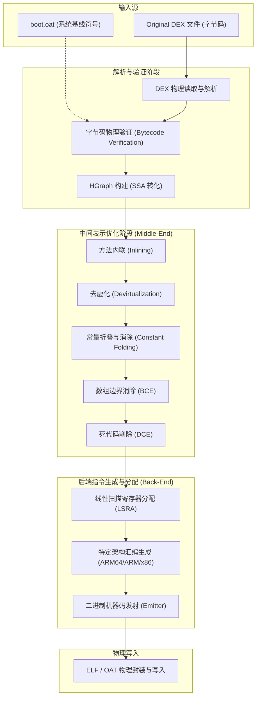
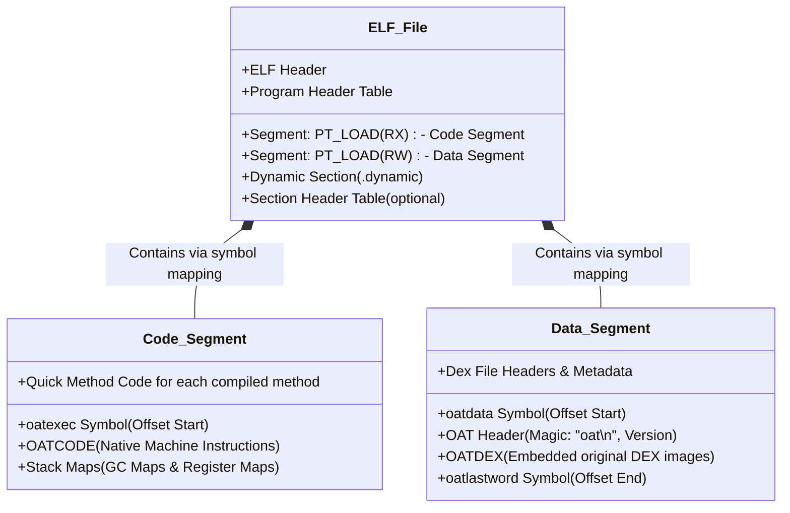
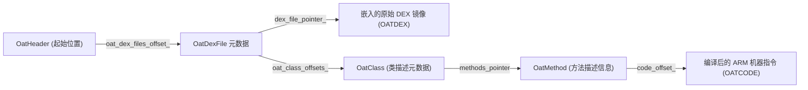
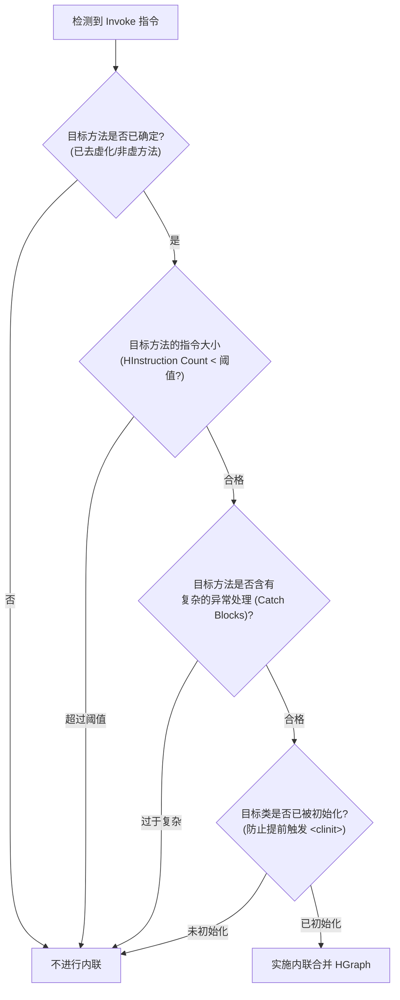

# 2.2.2.1 AOT（Ahead-Of-Time）提前编译原理与物理级剖析

在 Android 的演进历程中，运行系统的变革是决定系统流畅度与应用执行效率的分水岭。从 Android 2.2 引入 Dalvik JIT，到 Android 5.0 全面启用以 AOT（Ahead-Of-Time，提前编译）为核心的 ART（Android Runtime），再到 Android 7.0 演化为“JIT + AOT + PGO”的混合编译模式，ART 的 AOT 编译机制始终是其性能底座的核心组成部分。

本文将从物理级与底层原理视角，深度剖析 ART AOT 编译的本质、核心工具 `dex2oat` 的编译管线、OAT 文件的物理二进制格式与 ELF 封装、早期“全量 AOT”的致命硬伤，以及 AOT 静态编译器的优化机理，帮助读者在操作系统和编译器底层构筑起完整的知识版图。

---

## 一、 AOT 提前编译的物理定义与技术本质

### 1.1 AOT 与 JIT 的根本性差异

JIT（Just-In-Time，即时编译）与 AOT（Ahead-Of-Time，提前编译）是两种截然不同的代码转换与执行策略。它们的底层差异不仅体现在“编译发生的时间点”，更深刻地体现在执行开销分摊、内存布局、CPU 缓存友好性以及性能上限等多个物理维度。

#### 1.1.1 物理指标深度对比
为了清晰理解二者的技术分水岭，我们可以从以下物理维度进行量化与机理对比：

| 物理维度 | JIT (Just-In-Time) 编译 | AOT (Ahead-Of-Time) 编译 |
| :--- | :--- | :--- |
| **编译时机** | 运行时（Runtime）。应用处于运行状态，在热点代码执行时触发。 | 运行前（Before Runtime）。安装时、OTA 系统升级时或后台空闲时触发。 |
| **开销分摊** | 占用应用运行时的 CPU 时间片与内存空间，存在“编译争抢（Contention）”。 | 完全分摊在运行前，运行期 CPU 专注于执行机器指令，零编译开销。 |
| **编译单位** | 早期 Dalvik 采用 **Trace**（热点执行路径）；现代 JVM 采用 **Method**（方法）。 | **Method**（整个方法）或整个类、整个 DEX。 |
| **内存占用** | 需要在运行时分配堆内的 **JIT Code Cache**（通常为 RWX 权限内存，存在安全隐患且消耗物理内存）。 | 机器码以文件形式存储在磁盘上，通过虚拟内存物理映射（`mmap`）加载，不占用运行时 Java 堆内存，多进程间共享物理内存页。 |
| **编译器开销限制** | 极度敏感。为了不卡顿 UI，必须选用轻量级快速编译算法，无法进行耗时的全局优化。 | 几乎无敏感限制。可以采用高复杂度、高优化强度的静态编译算法，如深度数据流分析、全局寄存器分配等。 |
| **冷启动性能** | 差。启动初期只能通过解释器慢速执行字节码，边解释边探测热点，逐步编译，存在“预热（Warm-up）”延迟。 | 极佳。应用启动时直接从 ELF/OAT 加载纯本地机器码（Native Code）开始执行，跳过解释执行与预热阶段。 |
| **机器指令针对性** | 极强。可以动态探测当前 CPU 的确切型号与指令集扩展（如 NEON/VFP/SVE），生成高度特异化的指令。 | 较强。需要在编译时指定目标架构架构（如 ARMv8-A、x86-64），但通常需兼容同架构下的中低端 CPU。 |

#### 1.1.2 Dalvik Trace-based JIT 的局限性
在 Android 2.2 到 4.4 时代，Dalvik 虚拟机引入的是一种基于 Trace（路径）的 JIT 编译器。与以“方法”为编译单位的 Method-based 编译器不同，Trace-based 编译器只编译高频执行的代码片段（如循环体或频繁跳转的分支）。
* **工作机制**：Dalvik 解释器在执行字节码时，会使用一个简单的计数器记录跳转指令的执行频次。当某个跳转点的计数器超过阈值（通常为数千次）时，系统会判定该跳转点为一个“热点 Trace 起始点”。JIT 编译器随后进入“Trace 录制模式”，记录接下来执行的一系列指令流，直到遇到方法返回（Return）、未对齐的循环跳转或异常抛出。最后，将这段 Trace 编译为机器码并放入 JIT Code Cache 中。
* **物理瓶颈**：
  1. **频繁的 Trace Exit（退回解释器）**：一旦运行期数据改变，导致执行流偏离了当初录制的 Trace 路径，CPU 必须强制退回到解释器执行（Deoptimization），这一过程需要将物理寄存器状态同步回虚拟寄存器栈帧，物理开销极大。
  2. **无法进行全局优化**：由于 Trace 跨越了方法边界且片段非常狭窄，编译器无法构建完整的控制流图（CFG），从而无法实施方法级的方法内联、死代码消除和全局寄存器分配。

#### 1.1.3 物理映射与内存布局的差异
JIT 编译的代码存在于进程的匿名内存区（Anonymous Mapping），这部分内存必须具有可写和可执行（RWX）属性，这给现代操作系统带来了极大的安全漏洞（如 JIT Spraying 攻击）。而 AOT 编译生成的本地机器码存放在只读的 OAT（ELF）文件中。在运行时，Linux 内核通过虚拟内存管理机制以 `PROT_READ | PROT_EXEC` 属性将其映射进进程空间，完全符合“W^X（Write XOR Execute）”的安全物理法则。

---

### 1.2 Android 从 Dalvik 转向 ART 的设计哲学

在 Dalvik 虚拟机时代，其物理瓶颈极其明显：
1. **CPU 资源的重复损耗**：由于 JIT Code Cache 在应用进程退出后即被销毁，每次应用重新启动，所有热点代码都必须重新经历“解释 -> 热点探测 -> JIT 编译”的过程。
2. **移动设备电量和发热的严苛约束**：移动设备上的 CPU 算力和功耗预算极低。在运行时让 CPU 一边执行编译线程，一边执行主 UI 线程，不仅会导致严重的 CPU 抢占（卡顿），还会因为 CPU 持续高频运转导致设备严重发热、电池电量迅速消耗。
3. **冷启动阶段的“指令饥饿”**：应用在刚启动的前几秒内，JIT 尚未热身完毕，CPU 大量执行解释器循环。解释器循环本质上是使用 `switch-dispatch` 或 `direct-threading` 进行字节码指令分发，这会导致 CPU 的分支预测器（Branch Predictor）预测失败率飙升，指令流水线（Instruction Pipeline）经常性清空，导致冷启动极其缓慢。

Android 5.0+ 引入的 ART（Android Runtime）虚拟机，其初期的核心设计哲学是**“空间换时间，功耗前置”**。
通过引入 AOT，ART 试图在应用启动运行之前，**一次性、全量地**将 DEX 字节码（Bytecode）翻译为特定 CPU 架构的本地机器指令（Native Machine Code），并持久化到磁盘上。
* **物理目标**：消除运行时的解释器开销，消除运行时的 JIT 编译开销，让 CPU 在运行期只做一件事——执行已经编译好的硬件级本地指令。
* **性能收益**：应用启动延迟（TTID）大幅降低，UI 帧率（FPS）显著提升，系统能耗曲线在运行期极为平缓。

---

## 二、 AOT 编译的核心工具 dex2oat 工作机理

`dex2oat` 是 ART 编译系统的物理实体，它是一个运行在 Linux 环境下的可执行二进制程序（位于 `/apex/com.android.runtime/bin/dex2oat` 或 `/system/bin/dex2oat`）。它的输入是 Dalvik 字节码（`.dex` 或 `.apk` 文件），输出是包含了本地机器指令和原 DEX 镜像的 `.oat` 文件。

### 2.1 dex2oat 的编译管线全流程

`dex2oat` 的编译管线可以抽象为一个标准的高性能静态编译器（如 LLVM 或 GCC 的结构），但它针对 Dalvik 字节码和 ART 运行时的物理环境进行了高度定制。



---

### 2.2 核心编译阶段深度刨析

#### 2.2.1 解析与验证阶段（Parsing & Verification）
1. **DEX 物理读取**：`dex2oat` 打开 APK 或 DEX 文件，读取其物理数据结构（如 Header、MapList、ClassDefs 等），在内存中重建对应的映射结构。
2. **字节码验证（Verification）**：
   * 确保输入的 Dalvik 字节码在结构和语义上是合法的，不存在非法寄存器访问、类型越界、栈溢出等安全隐患。
   * 此阶段必须参考系统的 `boot.oat`，以验证当前 APK 调用的系统 API 是否合法、类型是否匹配。
3. **IR（中间表示）构建与 SSA 转换**：
   * 将基于寄存器的 Dalvik 字节码转换为编译器的内部中间表示——**HGraph**。
   * 转换为 **SSA（Static Single Assignment，静态单赋值）** 形式。在 SSA 形式中，每个变量有且仅被赋值一次。
   * **$\Phi$ 函数（Phi-function）的插入**：当控制流存在分叉并汇合时（例如 `if-else` 分支后合并），同一个变量可能在不同分支被赋予了不同的值。为了维持 SSA 的单赋值特性，编译器会在分流汇合点的基本块起始位置插入 $\Phi$ 函数。例如，变量 $x$ 在左分支被定义为 $x_1$，右分支被定义为 $x_2$，则在汇合点生成 $x_3 = \Phi(x_1, x_2)$。这种物理表示消除了变量别名带来的数据流分析困难，为后续数据流优化奠定了基石。

#### 2.2.2 编译器优化阶段（Middle-End Optimization）
在 HGraph 构建完成后，静态编译器将运行一系列的优化 Pass（优化遍）：
* **Method Inlining（方法内联）**：通过静态启发式规则，把小的方法体直接嵌入到调用者（Caller）处。
* **Devirtualization（去虚化）**：通过静态类层次分析（Class Hierarchy Analysis, CHA），将多态的虚方法调用（Virtual Call）转换为直接的物理跳转（Direct Call）。
* **Global Value Numbering (GVN) & Constant Folding（常量折叠）**：计算编译期可确定的常量，消除重复计算。
* **Bounds Check Elimination (BCE)**：通过值范围分析，在编译期判定数组访问的索引是否一定在合法区间内，从而安全地消除运行时的数组越界检查指令。
* **Dead Code Elimination (DCE)**：移除不可达的代码分支以及计算结果从未被使用的无效指令。

#### 2.2.3 寄存器分配与代码生成（Back-End & Register Allocation）
由于 JVM/Dalvik 字节码使用了逻辑寄存器（虚拟寄存器，如 `v0, v1, v2`），而在实际的物理 CPU 上，可用的物理寄存器数量是有限的（例如 ARM64 架构下，通用寄存器只有 `X0` - `X30`）。
* **LSRA 算法（Linear Scan Register Allocation）**：
  `dex2oat` 采用线性扫描算法，分析每个虚拟寄存器的生存期（Live Range），并将其物理映射到真实的 CPU 寄存器。
  1. **构建活跃区间（Active Intervals）**：计算每条指令处各逻辑变量的活跃状态，生成其生命周期的线段集合。
  2. **区间排序与遍历**：将所有活跃区间按其起始点进行物理升序排序，使用一个线性扫描指针向后遍历。
  3. **寄存器绑定**：如果当前空闲的物理寄存器池不为空，则直接将物理寄存器分配给该区间。在 ARM64 架构下，参数和返回值通常绑定到 `X0`-`X7`，临时计算优先使用调用者保存（Caller-saved）寄存器 `X9`-`X15`，长生命周期的变量绑定到被调用者保存（Callee-saved）寄存器 `X19`-`X29`。
  4. **溢出处理（Spilling）**：若遍历到某个活跃区间时，所有物理寄存器均已被占用，LSRA 算法将计算当前所有已占用物理寄存器对应变量以及新变量的“下一次使用距离”（Distance to Next Use）。将下一次使用距离最远的变量标记为溢出，生成一条物理写入指令（如 ARM64 的 `STR`），将其值写入当前线程的物理栈帧（Stack Frame）中；在后续重新使用该变量时，再插入物理加载指令（如 `LDR`）重新读回寄存器。
* **特定架构的代码生成器（Code Generator）**：
  将优化后的 HGraph 指令翻译为具体 CPU 架构的机器码并进行二进制发射（Emitter）。

---

### 2.3 dex2oat 的常用物理参数与编译过滤器（Compiler Filters）

在实际运行 `dex2oat` 时，可以通过系统参数或命令行指定编译过滤器，从而在“编译耗时”、“生成文件大小”与“运行效率”之间寻找不同的平衡点：

```cpp
enum CompilerFilter::Filter {
  kVerifyNone,         // 不进行任何验证，编译速度极快（通常仅用于系统预制且已验证的库）
  kVerifyAtRuntime,    // 安装时不验证字节码，将验证推迟到运行时解释执行时
  kVerify,             // 仅进行字节码验证，不编译任何机器码，运行期全解释执行（快速安装）
  kQuicken,            // 验证字节码，并对字节码进行“快速优化”（如重写操作码，简化解释器执行），不生成本地机器码
  kSpaceProfile,       // 基于 Profile 配置文件引导，仅对热点方法进行空间优化编译（限制内联，控制体积）
  kSpace,              // 对所有方法进行 AOT 编译，但在编译时以“减小体积”为首要目标，减少内联和循环展开
  kSpeedProfile,       // 基于 Profile 配置文件引导，仅对 Profile 记录的热点方法进行 Speed 级别的强力 AOT 编译
  kSpeed,              // 【Android 5.0/6.0 默认】对应用内的所有方法进行全量 AOT 编译，开启最大强度的优化 Pass
  kEverything          // 编译所有方法，并对反射、桩函数等所有元数据进行最大程度的编译与链接
};
```

不同的过滤器直接决定了 `dex2oat` 底层流水线的深度。例如，在 `kSpeed` 模式下，编译器会完整跑完 SSA 转换、CHA 类分析、内联决策树以及 LSRA 寄存器分配；而在 `kQuicken` 模式下，编译器后端直接被短路，仅输出重写后的紧凑 DEX 字节码，从而大幅节省了磁盘存储与安装耗时。

---

## 三、 OAT 文件的物理二进制结构与 ELF 封装

在 Android 中，静态编译生成的 OAT 文件本质上是一个**标准的 Linux ELF（Executable and Linkable Format）动态链接库文件**（共享对象，`.so` 文件）。

### 3.1 为什么将 OAT 封装为 ELF？

ART 团队之所以不自己发明一种全新的二进制文件格式，而是借用标准的 ELF 格式，其底层考量具有极高的工业智慧：

1. **操作系统级虚拟内存管理（VMM）复用**：
   Linux 内核拥有极其成熟的 ELF 加载与页面映射机制。通过将机器码封装在 ELF 的 `.text` 或特定 Segment（段）中，ART 能够直接利用系统的 `dlopen()` 或底层的 `mmap()` 系统调用，将机器码和数据段按需映射到应用进程的虚拟内存空间中。
2. **页面物理共享与物理内存节约（Page Sharing）**：
   如果多个进程加载了相同的 ELF 文件（例如系统级的 `boot.oat`，包含 Android Framework 的核心类），Linux 内核的物理内存管理会将该 ELF 文件的只读代码段（RX 段）在物理内存中仅保留一份，所有应用进程的虚拟内存直接映射到这同一份物理内存页（Physical Page）上。这为系统节约了巨额的物理内存。
3. **按需换入换出（Page Cache / Demand Paging）**：
   当系统物理内存紧张时，Linux 内核可以安全地回收 OAT 文件映射的只读代码物理页（因为它们是只读的，随时可以从磁盘重新读取）。当应用再次执行到该段机器指令时，CPU 会触发**缺页中断（Page Fault）**，内核自动将对应的磁盘页面重新加载到物理内存中。这极大地减小了应用的常驻内存大小（RSS）。

---

### 3.2 OAT 文件的物理二进制布局

一个编译好的 OAT 文件既包含了原生的 ELF 信息，也内嵌了 ART 专有的 OAT 结构（如 OAT Header、OAT DEX 文件镜像、编译后的本地机器指令等）。

下图展示了 OAT 文件在磁盘和内存映射中的物理布局：



为了更直观地理解 OAT 文件在物理上的字节流结构，下面我们使用 Mermaid 序列结构来细化展现其内部的具体排布与偏移：

```mermaid
gantt
    title OAT/ELF 物理二进制结构排布
    dateFormat  X
    axisFormat %s

    section ELF 物理外壳
    ELF Header                    :active, 0, 10
    Program Header Table          :active, 10, 20
    Dynamic Section (.dynamic)    :active, 20, 30
    Symbol Table (.symtab / .dynsym) :active, 30, 45
    
    section oatdata 段 (数据区)
    oatdata 符号起始偏移点       :crit, 45, 46
    OatHeader (magic, keys)       :46, 55
    OatDexFile Headers            :55, 65
    Embedded DEX Files (OATDEX)   :65, 85

    section oatexec 段 (代码区)
    oatexec 符号起始偏移点       :crit, 85, 86
    Compiled Native Code (OATCODE) :86, 110
    Stack Maps / GC Info          :110, 120
    oatlastword 符号偏移点        :crit, 120, 121
```



#### 3.2.1 关键符号的作用与物理含义
在 OAT 的 ELF 文件中，定义了三个全局符号（Symbols），ART 运行时完全依赖这三个符号来进行内存定位和指针偏移计算：

1. **`oatdata`**：
   指向 OAT 数据段（Data Segment）的首地址。该段是只读的（R 属性），紧随其后的是 `OatHeader` 结构体，接着是嵌入的原始 DEX 文件镜像（称为 `OATDEX`）。
2. **`oatexec`**：
   指向 OAT代码段（Code Segment）的首地址。该段必须具有可执行属性（RX 属性）。所有经 `dex2oat` 编译生成的原生 ARM/ARM64 机器码都存放在这个偏移量之后（称为 `OATCODE`）。
3. **`oatlastword`**：
   指向整个 OAT 数据/代码内容的末尾边界，用于校验文件完整性及内存边界边界。

---

### 3.3 OatHeader 与内部元数据结构

定位到 `oatdata` 符号后，ART 运行时会以该地址为起点，强转并解析为 C++ 的 `OatHeader` 结构体。

#### 3.3.1 OatHeader 核心结构体物理字段（C++ 抽象表现）
在 ART 源码中，`OatHeader` 包含了关于编译环境、架构、DEX 文件数量以及段偏移的关键元数据：

```cpp
struct PACKED(4) OatHeader {
  uint8_t magic_[4];             // OAT 幻数，固定为 {'o', 'a', 't', '\n'}
  uint8_t version_[4];           // OAT 版本号，例如 {'1', '2', '4', '\0'}
  uint32_t adler32_checksum_;    // 对当前 OatHeader 及其元数据的校验和

  InstructionSet instruction_set_;            // 目标 CPU 指令集 (如 kArm64, kX86_64)
  uint32_t instruction_set_features_bitmap_; // 指令集特性位图 (如是否支持 ARMv8.2-A FP16)
  uint32_t dex_file_count_;                  // 当前 OAT 文件内嵌入的原始 DEX 文件数量

  uint32_t oat_dex_files_offset_;            // 指向 OatDexFile 元数据数组的偏移量
  uint32_t executable_offset_;               // 相当于 oatexec 符号相对于 oatdata 的物理偏移量
  
  // 编译时传入的关键配置键值对信息（用于防冲突和版本比对）
  uint32_t key_value_store_size_;
  uint8_t key_value_store_[1];               // 长度可变的键值对存储区
};
```

#### 3.3.2 物理级解析关系网：OatHeader -> OatDexFile -> OatClass -> OatMethod
在 `OatHeader` 之后，排布着 `OatDexFile` 元数据，用于指向每一个嵌入的原生 DEX 文件镜像：



1. **`OatDexFile` 元数据区**：
   保存了原始 DEX 文件在 OAT 中的偏移地址（`dex_file_pointer_`）、DEX 文件的位置字符串长度与内容（Location），以及指向 `OatClass` 偏移数组的指针。
   * 运行时解析算法：当加载某个 DEX 中的类时，ART 会通过该类的 `class_def_index`（类定义索引）去 `oat_class_offsets_` 数组中索引出对应的 `OatClass` 的物理偏移量。
2. **`OatClass` 的物理结构**：
   `OatClass` 并不直接对应 DEX 中的类数据结构，而是对已编译状态的物理描述。它的头字段如下：
   ```cpp
   struct OatClass {
     uint16_t status_;       // 类的加载/初始化状态 (如 kStatusInitialized)
     uint16_t type_;         // OatClass 编译类型
     uint32_t bitmap_size_;  // 编译状态位图的大小 (仅在部分编译时有效)
     // 若 type_ 为 kOatClassSomeCompiled，后续会紧跟一个 Bitmap，用 1 位代表对应方法是否被 AOT 编译
     // 接着是已编译方法的 OatMethod 结构偏移数组
   };
   ```
   * **`OatClassType` 的三种类型**：
     * `kOatClassAllCompiled` (0)：该类的所有方法均已被编译为 Native 机器码。
     * `kOatClassSomeCompiled` (1)：仅有部分方法被编译为 Native 机器码，其余方法需要解释执行。
     * `kOatClassNoneCompiled` (2)：该类所有方法均未被编译，全部交由解释器执行。
3. **`OatMethod` 结构**：
   每个已编译的 Java 方法都对应一个 `OatMethod` 结构。它拥有一个关键字段：`code_offset_`（机器码偏移量）。
   * `code_offset_` 指向了该方法编译出的原生机器指令在 OAT 文件代码段中的物理起始位置。
   * 如果该偏移量为 0，说明该方法未被编译成机器码，在运行时必须通过 ART 的解释器执行（Interpreter Entrypoint）。

---

### 3.4 ART 运行时如何加载 OAT 文件并获取机器码地址

在应用启动（或虚拟机初始化类和装载类）时，ART 运行时需要将相关的 OAT 文件动态载入内存，并把 Java 方法与对应的物理机器指令进行绑定。这一过程的物理执行流如下：

#### 3.4.1 第一阶段：物理加载（`dlopen` / `mmap` 的取舍与绑定）
在 Android 5.0+ 中，系统对于 Boot OAT 和 App 自身的 OAT 采用了不同的载入技术：

* **Boot Image（`boot.oat`）加载**：
  由系统进程（Zygote）在初始化时，通过调用 Linux 底层的 `dlopen()` 直接加载系统 OAT 文件。
  * **原因**：`dlopen()` 会让操作系统的动态链接器（`/system/bin/linker`）去解析 ELF 文件的重定位表（Relocation Tables），并自动将 ELF 内定义的段映射到内存中。这允许虚拟机像调用本地 C++ 动态库一样，直接解析出 `oatdata`、`oatexec` 等全局符号。
* **App OAT 加载**：
  由于多进程安全限制以及物理地址空间布局随机化（ASLR）的限制，App 的 OAT 加载通常通过 ART 内部封装的 `OatFile::Open` 实现。它在底层跳过了系统的 `dlopen`，直接使用 `mmap` 系统调用：
  ```cpp
  // 物理映射示例
  void* code_map = mmap(nullptr, oat_file_length, PROT_READ | PROT_EXEC, MAP_PRIVATE, fd, code_offset);
  void* data_map = mmap(nullptr, oat_file_length, PROT_READ, MAP_PRIVATE, fd, data_offset);
  ```
  通过这种方式，映射出的内存空间是隔离的，且只读/可执行属性受到了物理 CPU 的硬件保护。

#### 3.4.2 第二阶段：符号解析与地址绑定
1. **定位 OAT 起始点**：
   在 `mmap` 成功后，ART 会根据 ELF 的符号表（Symbol Table）查找 `oatdata` 和 `oatexec` 的虚拟内存地址。
2. **计算方法的机器指令绝对物理地址**：
   当虚拟机需要加载某个类（如 `com.example.Test`）的某个方法（如 `void foo()`）时，它会：
   * 找到 `com.example.Test` 的 `OatClass` 结构。
   * 获取 `foo()` 的 `OatMethod` 描述符。
   * 读取其中的 `code_offset_`。
   * 物理绝对地址计算公式如下：
     $$\text{Absolute Native Code Address} = \text{oatexec Symbol Address} + \text{code\_offset\_}$$
3. **设置 Entrypoint**：
   ART 的 `ArtMethod` 对象（Java 方法在虚拟内存中的 C++ 表示形式）中，有一个关键的指针成员：`entry_point_from_quick_compiled_code_`。
   * 虚拟机将上步计算出的 `Absolute Native Code Address` 直接赋值给这个指针。
   * 当线程在运行时执行到该方法时，不再进入解释器，而是直接从 `entry_point_from_quick_compiled_code_` 读取地址，通过 CPU 跳转指令（在 ARM64 上通常为 `BR Xn` 或 `BLR Xn`）直接跳入物理机器指令执行。

---

## 四、 Android 5.0 - 6.0 时代“全量 AOT 编译”的硬伤与底层矛盾

在 Android 5.0（Lollipop）和 6.0（Marshmallow）时代，ART 采取了“全量 AOT 编译”策略。即在应用安装（Installation）或系统空中升级（OTA）时，对 APK 里的所有类、所有方法进行 `dex2oat` 全量编译，彻底抛弃了 Dalvik 的 JIT。

这种静态全量编译虽然彻底消除了运行期解释开销，但由于缺乏动态热点反馈，暴露出非常严重的物理级硬伤。

### 4.1 安装时间极长（数分钟的“安装阻塞”）
* **物理成因**：
  现代大型 Android 应用包含数十万个方法、数百万行字节码。在应用安装阶段，包管理器（PackageManager）会启动 `dex2oat` 进程。
  由于 `dex2oat` 需要对全部字节码进行全局 SSA 转换、复杂的寄存器分配算法以及各种控制流分析 Pass，这是一个高度消耗 CPU 算力和内存的重度任务。
* **现象**：
  在性能较弱的中低端手机上，安装一个大型 App 需要耗时 **3 到 5 分钟**。用户在应用商店点击安装后，界面长时间处于“正在安装...”状态，手机处理器被 `dex2oat` 单个或多个线程完全吃满，导致整机系统界面卡顿，无法及时响应其他前台交互。

---

### 4.2 存储空间严重暴涨与 Flash 写入损耗
* **物理成因**：
  Java/Dalvik 字节码是一种高度压缩的中间表示，每个操作码（Opcode）通常只有 1 至 2 个字节，表达力极高。
  而编译出的物理机器指令（如 ARM64 指令）是固定长度为 32 位（4 字节）的低级指令，并且为了处理类型校验、空指针检查、安全点（Safepoints）和栈图（Stack Maps），编译器会插入海量的辅助汇编代码。
  * 此外，由于 OAT 封装了原 DEX 文件镜像（用于反射、动态代理、类加载等元数据支持）与编译后的机器码，这导致 OAT 文件的大小通常是原始 DEX 文件大小的 **2 到 4 倍**。
* **物理闪存（NAND Flash）磨损**：
  物理闪存介质存在写入寿命（P/E Cycles）。全量 AOT 编译在应用下载后，会在本地生成数百 MB 甚至上 GB 的 OAT 数据。频繁的应用更新与重新编译会导致巨大的**写入放大因子（WAF, Write Amplification Factor）**。对闪存芯片的擦写操作过于剧烈，会大幅缩短移动设备的硬件使用寿命。

---

### 4.3 系统升级（OTA）后的“启动黑屏与发热危机”
这是全量 AOT 编译策略下最严峻的用户痛点。

* **失效矛盾（Invalidation Conflict）**：
  在 Android 系统中，应用的 OAT 编译不是孤立的。它们必须与系统的基线类库（`boot.oat`，包含系统的 `Object`, `String`, `View` 等公共类）进行静态类型校验绑定。
  一旦系统发生 OTA 升级，底层的 `boot.oat` 会被替换更新。这意味着，所有已安装应用的 OAT 文件中，凡是调用了系统 API 的机器码，其类型继承关系、虚表偏移等物理结构全部宣告失效。
* **重新编译风暴（Re-compilation Storm）与温控降频（Thermal Throttling）**：
  为了解决上述失效问题，Android 系统在 OTA 升级后的**首次开机启动阶段**，必须对手机上安装的所有三方应用（可能多达上百个）强制重新运行 `dex2oat` 编译。
  在这一阶段：
  * CPU 的所有核心会被调用以 100% 满载频率运行 `dex2oat` 编译。
  * 整机功耗急剧上升，锂电池在高温 100% CPU 负载下加速衰退。
  * 严重的发热会导致手机触发**温控降频（Thermal Throttling）**。降频后，CPU 核心主频被强制拉低（可能仅剩正常频率的 30%），导致本就漫长的 `dex2oat` 编译过程效率更加低下，系统开机流程无限拉长。

---

### 4.4 底层矛盾的本质：无反馈无差别的“过度编译”

全量 AOT 编译失败的本质原因，在于它违反了计算机科学著名的 **80/20 法则**（即 80% 的执行时间只花在 20% 的核心热点代码上）。
* 在一个典型的 App 中，90% 以上的代码在应用的生命周期内可能**从未被执行过**（例如极罕见的错误分支、历史遗留的功能模块、复杂的排障逻辑等）。
* 静态全量 AOT 编译器在完全不知道哪些代码是“热点”的前提下，无差别地投入昂贵的 CPU 算力和存储空间，去翻译和保存这 90% 的冷代码。
* **解决方案的启示**：必须引入运行时的热点反馈机制（即 PGO），只编译高频执行的热点代码，实现真正的“按需编译”。

---

## 五、 AOT 静态编译器的优化机理与物理实现

在 `dex2oat` 将 HGraph 转化为机器码的过程中，静态编译器的高级优化 Pass 是提升执行效率、拉近与原生 C/C++ 程序差距的核心手段。

以下重点剖析**去虚化（Devirtualization）**、**方法内联（Inlining）**和**死代码消除（DCE）**的底层实现机理。

### 5.1 去虚化（Devirtualization）

在 Java 语言中，除了 `static`、`private` 和 `constructor` 方法外，其余非 `final` 的普通方法默认都是**虚方法（Virtual Methods）**。这意味着方法调用在运行时表现为多态性，需要通过虚函数表（vtable）进行动态寻址。

#### 5.1.1 虚方法的物理寻址开销
传统的虚方法调用在底层需要经历以下步骤：
1. 物理读取对象的头部，获取其类的 Class 对象地址（类型信息指针）。
2. 在 Class 对象中找到虚函数表（vtable）的基地址。
3. 根据方法的索引（Index），在 vtable 中计算出偏移量，读取实际目标方法的函数指针。
4. 跳转到函数指针（间接跳转，Indirect Jump / Indirect Call）。

对于 CPU 硬件而言，**间接跳转（Indirect Jump）**是极其不友好的。因为 CPU 的分支预测器（Branch Predictor）和分支目标缓冲（BTB）很难准确预测间接跳转的目标地址，容易导致 CPU 流水线（Pipeline Flush）清空，带来十几个时钟周期的物理惩罚。

#### 5.1.2 去虚化的物理实现对照示例
`dex2oat` 通过静态分析，尝试将间接的虚方法调用简化为直接的方法跳转：

* **优化前（C++ 级逻辑描述）**：
  ```cpp
  // 假设接口或基类定义
  class Animal {
  public:
      virtual void speak() = 0;
  };
  
  // 仅存在这一个实现类
  class Dog : public Animal {
  public:
      virtual void speak() override { /* 汇编机器指令 */ }
  };
  
  void makeNoise(Animal* a) {
      a->speak(); // 虚函数调用，需要查询 vtable
  }
  ```
  在 ARM64 汇编指令层面，未优化的代码表现为：
  ```assembly
  ; X0 存放对象指针 a
  LDR X1, [X0, #0]             ; 读取 a 的类型指针 (Class 地址) 到 X1
  LDR X2, [X1, #vtable_speak]  ; 读取 vtable 中 speak 方法的绝对入口地址到 X2
  BLR X2                       ; 物理间接调用 (分支预测困难，流水线易断)
  ```
* **优化后（通过 CHA 分析确定系统中无其他子类重写 speak）**：
  编译器将代码重写为直接调用：
  ```assembly
  ; 编译器判定 speak 的唯一目标为 Dog::speak
  BL Dog_speak                 ; 物理直接跳转到 Dog::speak 地址 (相对偏移寻址，CPU 分支预测极佳)
  ```
* **Inline Cache 守护与去优化（Deoptimization）**：
  若类层次关系可能动态发生变化，编译器会在直接跳转前加入守护指令（Guard）：
  ```assembly
  LDR X1, [X0, #0]             ; 获取 a 实际的 Class 指针
  ADRP X2, Dog_Class_Page      ; 获取预期的 Dog Class 指针页面
  ADD X2, X2, #Dog_Class_Offset
  CMP X1, X2                   ; 比较实际 Class 是否为 Dog
  B.NE Deoptimize_Entry        ; 如果不是，跳入“去优化”入口，回退到解释器或慢速 vtable 查找
  BL Dog_speak                 ; 匹配，直接快速调用
  ```

---

### 5.2 方法内联（Inlining）与栈帧重构（Stack Frame Reconstruction）

方法内联是将目标方法的中间表示（IR）直接替换到调用者（Caller）的调用点处，消除方法调用的物理开销。

同时，内联是其他所有编译器优化（如 GVN、常量消除）的**放大器**。

#### 5.2.1 内联判定决策树与限制物理边界
在 `dex2oat` 中，并不是所有方法都可以内联。编译器在解析到 `Invoke` 指令时，会执行严格的判定：



#### 5.2.2 去优化（Deoptimization）与栈重构物理机制
当内联发生后，一旦在运行期触发了去优化（例如 Inline Cache Guard 失败，或者发生了空指针异常、未初始化类加载等），虚拟机需要退出机器指令的执行，回退到解释器继续执行。

由于机器指令已经合并了两个方法的栈帧，而解释器期望的是两个独立的虚拟寄存器栈帧（`ShadowFrame`），此时 ART 必须在物理内存中完成**“栈帧重构（Stack Frame Reconstruction / Unrolling）”**：
1. **读取 Stack Map（栈图）**：
   在 OATCODE 的尾部，`dex2oat` 输出了大量的 `StackMap` 物理数据。`StackMap` 记录了当前指令物理偏移处，各个物理 CPU 寄存器（如 `X0`）和物理栈偏移（如 `[SP, #16]`）分别对应于原 DEX 字节码中哪一个虚拟寄存器（如 `v2`）。
2. **挂起物理线程**：
   将当前执行物理指令的 CPU 挂起，读取当前的寄存器快照。
3. **分配影子栈帧（Shadow Frame）**：
   在堆内存或 C++ 运行栈中，分配出与原本调用层级一致的虚拟寄存器 Shadow Frame。
4. **状态物理复制（Register to Vreg Map）**：
   利用 `StackMap` 映射表，把物理寄存器（`X1`）和物理栈（`[SP, #8]`）中的值读取出来，精准复制到 Shadow Frame 数组对应的 `vregs[0]`、`vregs[1]` 中，模拟出该方法从未被内联、也从未被编译过的解释器环境。
5. **切换 PC 指针**：
   将 PC 指针修改为解释器的入口，将 Shadow Frame 作为参数传入解释器的执行循环。这一物理过程虽然极其沉重，但保证了静态优化的语义安全性。

---

### 5.3 死代码消除（DCE, Dead Code Elimination）

死代码消除致力于清理编译生成的多余指令，使生成的二进制代码最小化。

在 SSA（静态单赋值）形式下，死代码的判定和消除变得极为精确。

#### 5.3.1 活跃性分析（Liveness Analysis）
编译器会为每个 SSA 变量建立一个“定义-使用链”（Def-Use Chain）。
如果一个变量满足以下两个物理特征，它就会被标记为“死代码”：
1. **该变量在后续的任何控制流分支中都没有被读取作为输入参数（No Uses）**。
2. **计算该变量的指令没有任何副作用（Side Effect）**。
   * *副作用定义*：指令未改变堆内存状态、未抛出潜在异常、未修改 volatile 变量、未执行 I/O 操作等。例如，纯粹的本地变量加法计算 `int temp = a + b;`，若 `temp` 在后续未被引用，即判定为无副作用。

#### 5.3.2 分支折叠（Branch Folding）
通过静态常数传播（Constant Propagation），编译器发现某个条件分支的判断条件在编译期已经是确定值（例如 `if (false)` 或 `if (1 == 2)`）。
* **优化行为**：
  1. 编译器会将不可达的整个分支块从控制流图（CFG）中物理剔除。
  2. 被剔除的分支内所引用的所有变量及指令，因不再处于 CFG 连通图中，会随之在后续的 Pass 中被彻底清理。
  3. 这显著精简了最终发射的 ARM/ARM64 机器码的长度，避免了无效的条件跳转指令占用 CPU 指令缓存（I-Cache）。

---

## 六、 总结与物理演进：混合模式（JIT + AOT + PGO）的到来

AOT 提前编译在 Android 5.0 时代为系统摆脱 Dalvik 虚拟机的历史包袱、实现运行期高帧率起到了决定性的历史作用。然而，由于**“全量 AOT”对设备空间、安装时间以及 OTA 系统维护带来的物理成本过大**，这一单一的技术路线很快遇到了瓶颈。

为了彻底克服上述矛盾，Android 7.0 引入了**“解释执行 + JIT + AOT + PGO”**的混合模式，其物理运行法则如下：

1. **安装阶段（零 AOT 延迟）**：
   应用安装时，不再运行 `dex2oat` 编译，直接以极快的速度完成 APK 的安装与部署。
2. **首次运行阶段（解释执行 + JIT 探测）**：
   应用首次运行，ART 以解释器慢速启动。运行时 JIT 启动，探测热点方法，在 JIT Code Cache 中动态编译并执行。
3. **配置文件保存（PGO 收集）**：
   在应用运行期间，JIT 会在后台记录高频被调用的热点方法以及已加载的类，将其物理持久化到手机的配置文件中（Profile File，扩展名通常为 `.prof`）。
4. **后台空闲优化（按需 AOT 编译）**：
   当手机接入电源、处于灭屏闲置状态（系统判定为空闲时段，通常在夜间）时，系统后台任务会启动。
   此时，`dex2oat` 重新登场，但它**不再进行全量编译**。它读取该应用的 `.prof` 文件，**只把配置文件中记录的 10% ~ 20% 的热点方法编译为物理机器码并封装入 OAT 文件**。
5. **升级与平衡**：
   OTA 升级后，也不再需要对所有应用进行重新编译，因为它们可以在开机后以解释+JIT方式瞬间启动，随后在夜间充电时再行背景编译。

通过这种“Profile-Guided Optimization（PGO）”混合设计，ART 完美平衡了**“编译开销时间点”**与**“运行期高性能”**的物理冲突，这正是现代 Android 虚拟机技术最精妙的物理实践。而 `dex2oat`、OAT 文件格式和 ELF 动态映射的底层基石，在这场演进中依旧保留并持续发挥着它们强大的核心威力。
