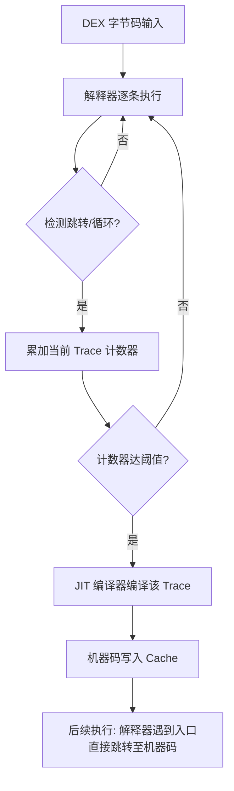
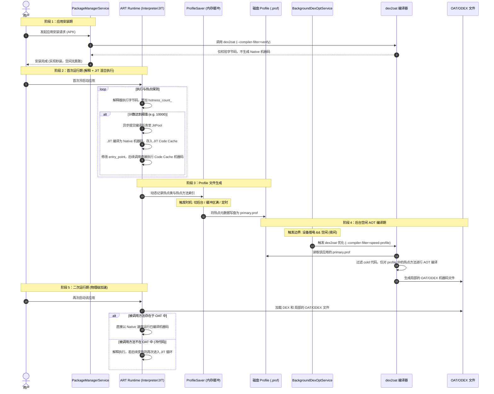
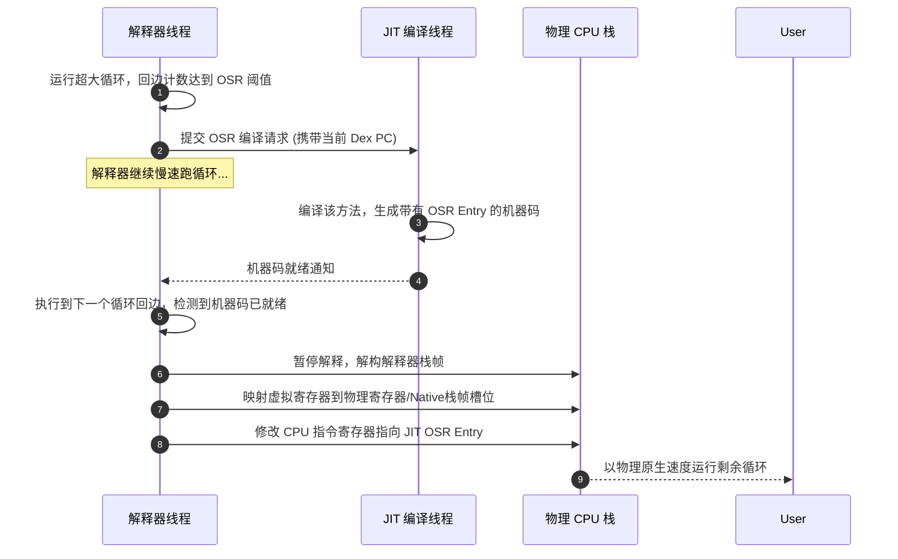

# 2.2.2.2 JIT

在 Android 系统的性能优化史中，虚拟机编译机制的演进论述无疑是最核心的篇章之一。从 Android 2.2 引入的初级 JIT，到 Android 5.0 的绝对 AOT，再到 Android 7.0 至今不断完善的 “JIT + AOT + PGO (Profile-Guided Optimization)” 混合编译架构，Android 团队在**安装时间、运行性能、存储空间、功耗损耗**这四个维度上进行了长期的博弈与权衡。

本篇文章将以物理级深度剖析 Android 运行时（ART）中 JIT 编译器的工作机理，并系统性地还原 Android 7.0+ 混合编译体系与 Android 9.0+ 云端 Profile（Cloud-based Profiles）的物理运作流程和底层细节。

---

## 1. 技术演进史：从解释执行到混合编译的物理博弈

在剖析混合编译的微观世界之前，我们需要厘清 Android 虚拟机编译技术的历史演进。每一次技术架构的调整，都是为了解决前一代架构在物理资源（CPU、闪存、内存、电池）限制下的核心痛点。

### 1.1 Dalvik 时代的 JIT（Android 2.2 - 4.4）

在 Dalvik 虚拟机时代，系统主要采用**解释器（Interpreter）**来逐条执行 DEX 字节码。为了提升执行效率，Android 2.2 引入了 JIT（Just-In-Time，即时编译器）。

#### 1.1.1 Trace-based JIT 的工作原理
与常规 JVM（如 HotSpot）采用的 Method-based JIT（以方法为单位进行编译）不同，Dalvik 采用的是 **Trace-based JIT**。
* **物理机制**：运行时，解释器在执行字节码的同时，会监控控制流的分支跳转和循环。当某条执行路径（一个 Trace，通常是一系列线性执行的字节码指令加上热点循环）的执行频率超过特定阈值时，JIT 编译器会将这条特定的 Trace 编译为底层的机器码，并缓存起来。
* **执行路由**：当解释器再次遇到该 Trace 的起点时，会通过一个跳转表直接路由到已编译的机器码执行。



#### 1.1.2 Trace-based JIT 的物理缺陷
1. **Chaining Overhead（跳转开销高昂）**：由于 Trace 的粒度非常细（可能只是一个方法内部的某个分支），当机器码执行完毕或遇到未编译的分支时，系统必须频繁在“机器码态”与“解释执行态”之间进行上下文切换（State Transition）。这种频繁的进入/退出开销抵消了机器码带来的部分性能提升。
2. **分支爆炸与频繁截断**：复杂的业务逻辑中存在大量条件分支。若分支未能覆盖，Trace 会在分支处被截断，导致编译出的代码片段零碎，无法进行全局优化。
3. **优化空间受限**：由于编译器只看得见一条 Trace，无法获取完整的方法级上下文，因此无法实施**方法内联（Inlining）**、**逃逸分析（Escape Analysis）**、**公共子表达式消除（GVN）**等现代编译器的高级优化技术。

---

### 1.2 Android 5.0/6.0 时代的绝对 AOT 时代（全时编译）

随着 Android 5.0（Lollipop）的发布，全新的 ART 运行时彻底取代了 Dalvik。ART 在该阶段引入了激进的**全 AOT（Ahead-Of-Time，预先编译）**模式。

#### 1.2.1 全 AOT 的设计理想
在应用安装期间，系统调用守护进程 `installd` 启动 `/system/bin/dex2oat` 编译器，将 APK 中的所有 DEX 字节码一次性翻译为对应平台的物理机器码，生成以 ELF 格式封装的 `.oat` 文件（在底层通常以 `.odex` 或 `.oat` 扩展名存在）。应用运行时，不再需要解释器，也不需要即时编译，CPU 直接以原生 Native 速度运行。

#### 1.2.2 全 AOT 的惨痛痛点
这一激进的方案在实际工程中带来了灾难性的物理反馈：
1. **安装时间极长**：大型应用（如微信、淘宝、大型 3D 游戏）在安装时，`dex2oat` 需要将数万个方法全部编译为机器码。这导致安装过程可能持续数分钟，用户在应用商店下载后需要面对漫长的“正在安装...”等待。
2. **闪存空间暴增（Flash Footprint）**：机器码的指令密度远低于高度紧凑的字节码。编译生成的 `.oat` 文件体积通常是原始 `.dex` 文件的 **3 到 8 倍**。在 16GB 或 32GB 存储容量占主流的时代，低端机型极易出现“闪存空间不足”的警报。
3. **OTA 升级灾难（System Upgrade Boot Delay）**：当 Android 进行系统升级（OTA）时，由于系统框架类库（如 `boot.art`/`boot.oat`）发生了变化，所有已安装应用的机器码都需要重新进行 `dex2oat` 重新对齐。这导致 OTA 后的首次开机需要黑屏等待数十分钟（即经典的 “Android 正在升级... 正在优化第 50 个应用，共 120 个”），引发用户极大抱怨。
4. **运行时的无谓浪费**：统计表明，用户在日常使用中，只会触及一个应用 **10% ~ 20%** 的代码（冷代码通常包括各类排障日志输出、罕见的配置界面、异常处理分支等）。全 AOT 强行编译另外 80%~90% 的冷代码，造成了 CPU 算力和闪存空间的极大浪费。

---

### 1.3 Android 7.0 开启的“混合编译（Hybrid Compilation）”时代

为了彻底解决全 AOT 的痛点，同时保留机器码的高运行速度，Android 7.0 (Nougat) 引入了 **“JIT + AOT + Profile-Guided Optimization (PGO)”** 的混合编译架构。其核心思想是：**“按需编译，逐步升级”**。

混合编译的核心目标是实现资源的动态平差：
* **安装时**：不进行 Native 编译，只做字节码验证，保障“秒装”。
* **运行时**：对于首次执行的代码进行解释执行；通过 JIT 动态探测热点方法，并将其编译进内存缓存；同时在后台记录这些热点类与热点方法的元数据。
* **空闲时**：系统在设备空闲且插电的状态下，读取后台收集到的热点信息，精准地仅对热点代码进行 AOT 编译，将其固化为磁盘上的局部机器码。

这种“动态反馈 + 静态编译”的结合，既消除了安装耗时与闪存膨胀，又保证了核心热点路径的极致运行速度，是 Android 虚拟机历史上最具实用性的物理演进。

---

## 2. 混合编译生命周期的完整物理过程

Android 7.0+ 混合编译体系是一套跨越“应用安装”、“动态运行”、“数据落盘”、“后台调度”、“局部静态编译”五个阶段的闭环生命周期。下面，我们对这五个阶段的物理过程进行深度拆解。

### 2.1 阶段一：应用安装期（Install-time）
当用户从应用商店下载 APK 并进行安装时，系统的 `PackageManagerService`（PMS）会启动安装流程。
* **物理行为**：PMS 会通过 Binder 机制调用守护进程 `installd`。`installd` 会调用 `/system/bin/dex2oat`。
* **关键参数**：在初次安装时，ART 默认指定的编译过滤器（Compiler Filter）为 `--compiler-filter=verify`（或在部分版本中为 `quicken`）。
* **物理产物**：`dex2oat` **不生成任何 Native 机器码**，它仅仅对 DEX 字节码进行快速的结构合法性验证（Verification），并可能提取出部分元数据。因此，安装过程在数秒内即可完成，消除了全 AOT 时代的安装等待，且生成的 OAT/ODEX 文件体积与原始 DEX 几乎一致，闪存空间零膨胀。

### 2.2 阶段二：首次运行期与 JIT 热点探测（First Run & JIT）
当用户首次启动该应用时，系统 `Zygote` 进程 fork 出应用的主进程。ART 运行时启动，并加载应用的 DEX 文件。
* **物理行为**：由于此时磁盘上没有任何预编译的 Native 代码，应用的所有方法首先进入**解释执行（Interpreter）**模式。
* **热点探测**：解释器内部逻辑在执行每一条方法调用指令（`Invoke`）和循环跳转指令（`Loop Back-edge`）时，都会在对应方法的 `ArtMethod` 结构体中累加计数器（`hotness_count_`）。
* **JIT 编译触发**：
  1. 当某个方法的调用计数达到设定的 JIT 编译阈值（默认通常为 10000）时，解释器向 JIT 编译器的任务队列（`JitQueue`）提交一个异步编译请求。
  2. 运行在后台的 JIT 编译线程池（`JitPool`）取出该任务，启动 Optimizing 编译器，将该方法的 DEX 字节码翻译为经过高度优化的 Native 机器码。
  3. 编译生成的 Native 机器码被写入内存中的 **JIT Code Cache** 区域。
* **执行重定向**：JIT 编译器修改该方法在运行时的入口函数指针（`entry_point_from_quick_compiled_code_`），使其指向 JIT Code Cache 中的机器码物理地址。此后，任何线程再次调用该方法时，都将越过解释器，直接运行 Native 机器码。

### 2.3 阶段三：Profile 文件生成（Profile Generation）
在应用运行的过程中，ART 运行时内置的 `ProfileSaver` 线程在后台工作，其任务是将运行时的热点元数据固化到磁盘上。
* **写入时机**：为了不对前台主线程的渲染性能造成干扰，`ProfileSaver` 并不会实时写盘，而是当满足以下条件时才会触发落盘：
  1. 应用进程即将切入后台（触发 `ActivityThread` 的生命周期回调）。
  2. 运行时新检测到的热点类或热点方法数量达到了设定的缓冲阈值（例如新增了 50 个方法或 10 个类）。
  3. 定期定时器触发（如每隔数分钟）。
* **物理路径**：Profile 文件被保存在如下受系统保护的专属目录下：
  `/data/misc/profiles/cur/<userId>/<packageName>/primary.prof`
* **记录数据**：`.prof` 文件是一个二进制文件，里面**不包含机器码**，仅记录了热点方法的索引（Method Index）、在应用启动前几秒加载的类索引（Startup Classes），以及用于多态优化的内联缓存（Inline Caches）信息。

### 2.4 阶段四：后台空闲 AOT 编译期（Background Idle DexOpt）
当手机进入非使用状态时，系统的后台优化引擎开始介入。这是混合编译将“动态热点”转化为“静态代码”的核心物理纽带。

* **调度服务**：Android 系统在初始化时，通过 `JobScheduler` 注册了一个系统级常驻服务：`BackgroundDexOptService`（其 Job ID 通常为 800）。
* **触发边界（Trigger Conditions）**：`BackgroundDexOptService` 仅在系统满足以下物理条件时才会被调度运行：
  1. **设备处于充电状态（Charging）**：确保编译消耗的大量 CPU 算力不会损耗用户电池寿命。
  2. **设备处于空闲状态（Idle）**：通常定义为屏幕关闭、无用户交互输入持续数十分钟以上，避免抢占前台 UI 渲染资源。
  3. **连接至 Wi-Fi（部分版本要求）**：以防需要下载云端 Profile。
* **工作流**：
  1. `BackgroundDexOptService` 唤醒后，会扫描系统中所有已安装应用的 `.prof` 文件。
  2. 它会通过 `installd` 启动 `dex2oat`，并传入以下关键参数：
     `--compiler-filter=speed-profile`
     `--profile-file=/data/misc/profiles/cur/0/<packageName>/primary.prof`
  3. `dex2oat` 读取并解析该 `.prof` 文件，得知此应用在过去使用中哪些类是启动必须的，哪些方法是高频热点。
  4. **局部 AOT 编译**：`dex2oat` 仅对 `.prof` 文件中列出的热点类和方法进行编译，生成对应的 Native 机器码，并写回磁盘上的 `.odex` 或 `.oat` 文件中。未被记录在 Profile 中的“冷代码”则完全被忽略，保持 DEX 字节码状态。

### 2.5 阶段五：二次运行期（Subsequent Run）
当用户再次启动该应用时，应用进程的冷启动和运行效率将发生质的飞跃。
* **物理行为**：
  1. 系统创建进程后，类加载器（`ClassLoader`）同时加载应用的 DEX 文件与在阶段四生成的局部 `.odex` 文件。
  2. 在加载类和初始化方法时，ART 运行时会读取 `.odex` 文件中的方法映射表。对于已经在后台被 AOT 编译的热点方法，其 `entry_point_from_quick_compiled_code_` 直接被初始化为 `.odex` 文件中 Native 机器码的物理内存地址。
  3. 用户启动应用时，**冷启动核心链路的方法全速以 Native AOT 机器码执行**，卡顿感消失。
  4. 那些未被 AOT 编译的非热点代码（冷代码）在执行时，继续由解释器执行。如果用户触发了新功能，使得某些冷代码转热，它们将再次走阶段二的 JIT 流程，并在下一个夜间空闲期被合并至 AOT 机器码中。

---

### 2.6 混合编译生命周期 Mermaid 完整时序图

下面用一张严密的 Mermaid 时序图，细致还原混合编译在 Android 系统中的这五个核心物理阶段及数据流动：



---

## 3. JIT 编译器在 ART 运行时的内部物理细节

了解了宏观的生命周期后，我们必须把放大镜聚焦到 ART 运行时的内部，从 C++ 源码和内存管理的物理视角，剖析 JIT 的微观动作。

### 3.1 热点探测与计数器机制（Hotness Detection）

ART 中每个 Java 方法在 C++ 层都对应一个 `ArtMethod` 结构体。`ArtMethod` 承载了该方法的所有元数据，包括所属类、字节码指针、执行入口以及热点计数器。

#### 3.1.1 计数器物理结构
在 `ArtMethod` 的成员变量中，有一个 16 位的无符号整型变量 `hotness_count_`：
```cpp
// 伪 C++ 源码表达 (art/runtime/art_method.h)
class ArtMethod {
  ...
  // 16-bit 计数器，记录方法被调用及循环回边的次数
  uint16_t hotness_count_; 
  ...
  // 执行入口，可能是解释执行的 Stub，也可能是 AOT/JIT 编译机器码的物理内存地址
  void* entry_point_from_quick_compiled_code_;
};
```

当方法被调用时，如果是解释执行模式，虚拟机的执行引擎（如 `Mterp` 快速解释器）会执行以下逻辑：
$$\text{hotness\_count\_} = \text{hotness\_count\_} + 1$$
同样，当代码执行到向后跳转的循环回边（Loop Back-edge，表示存在循环且正在重复执行）时，计数器也会增加。

```cpp
// 解释器核心循环中的计数器更新逻辑抽象 (art/runtime/interpreter/interpreter.cc)
void UpdateHotness(ArtMethod* method, Thread* self) {
  method->IncrementHotnessCounter();
  if (method->GetHotnessCounter() >= Jit::kHotMethodThreshold) {
    // 达到热点方法编译阈值
    jit::Jit::AddSamples(self, method, 1);
  }
}
```

#### 3.1.2 热度衰减（Hotness Decay）机制
为什么需要热度衰减？
如果计数器只增不减，那么在设备长时间不关机、应用长期运行的情况下，一些执行频率极低的冷代码也会因为随时间“慢慢累加”而达到 10000 的阈值，从而触发无谓的 JIT 编译，挤爆 JIT Code Cache。

为了解决这一问题，ART 引入了**热度衰减机制**。
* **物理实现**：当系统的垃圾回收（GC）发生时，或者在特定的周期性计时器触发下，ART 会遍历当前活跃的方法，将所有非当前正在执行的方法的 `hotness_count_` 进行右移或减半操作：
  $$\text{hotness\_count\_} \leftarrow \text{hotness\_count\_} \gg 1$$
* **物理效果**：只有在短时间内高频执行的真正热点方法，其计数增加速度才能压过衰减速度，成功冲过编译阈值。这保障了 JIT 编译器的任务队列中始终是最具编译价值的“真热点”。

#### 3.1.3 逆优化与 OSR（On-Stack Replacement）栈上替换技术
在传统的 Method-based JIT 中，如果一个方法调用次数很少，但内部包含一个执行 100 万次的超级循环，那么该方法在第一次被调用进入解释器后，就会一直停留在解释器执行这个超级循环，直到循环结束方法返回。这意味着即使 JIT 编译器在后台编译好了这个方法，当前这次极其卡顿的执行也享受不到机器码的加速。

为了解决长循环卡顿，ART 引入了 **OSR（On-Stack Replacement，栈上替换）** 机制。

* **OSR 触发条件**：当循环回边计数器（Loop Back-edge Counter）单独累加达到一个更高的阈值（例如 20000），说明当前方法正在被卡在某个大循环内。
* **OSR 物理过程**：
  1. 解释器检测到 OSR 阈值达成，向 JIT 提交一个特殊的 OSR 编译任务，并传入当前循环跳转点的 Dex PC。
  2. JIT 编译器在后台将该方法编译为机器码，但在该机器码中额外生成一个特殊的 **OSR Entry Point**。这个入口能够接受并恢复解释器当前的局部变量状态。
  3. 当后台编译完成后，解释器在执行到下一次循环回边跳转时，发现对应的 OSR 机器码已就绪。
  4. **物理栈帧重构（Stack Frame Reconstruction）**：ART 运行时通过底层的 C++ 辅助函数，在物理 CPU 栈帧上进行动态操纵。它将当前的解释器栈帧（包含虚拟寄存器、操作数栈等）解构，提取出变量值，并填入物理寄存器或 Native 机器码栈帧指定的偏移位置。
  5. **PC 指针重定位**：修改当前线程物理 CPU 的 IP（Instruction Pointer，指令指针）寄存器，使其直接指向已存放在 Code Cache 中的 OSR Entry Point。
  6. 线程从此直接转为物理 Native 态，在 CPU 上以原生速度继续跑完剩余的循环，完成“飞行中（On-the-fly）”的无缝切换。



---

### 3.2 JIT Code Cache 的内存布局与安全机制

JIT 编译生成的机器码和相关元数据需要存放在特定的内存区域，这就是 **JIT Code Cache**。

#### 3.2.1 物理分区：Code 与 Data 的隔离
为了精细化管理和保障安全性，JIT Code Cache 被物理分割为两个独立的虚存区域：
1. **Code Region（代码区）**：存放编译后生成的物理 CPU 指令集。该区域必须具有可执行权限。
2. **Data Region（数据区）**：存放机器码的辅助元数据。包括方法映射表、内联缓存信息、JIT GC 标记、类型查找表等。该区域只需要读写权限，绝对不能有执行权限。

#### 3.2.2 内存双映射机制（Dual Mapping）的安全物理保障
在传统的内存设计中，为了让 JIT 编译器能写入机器码，且能让 CPU 执行机器码，Code Region 需要同时拥有“写”和“执行”权限（即 `RWX` 权限）。然而，`RWX` 内存是网络安全中极为致命的漏洞。攻击者只要通过缓冲区溢出等漏洞将恶意 Shellcode 写入该区域，即可直接执行，彻底绕过操作系统的安全防御。

从 Android 9.0 开始，为了执行严格的 **W^X（Write XOR Execute，写与执行互斥）** 安全策略，ART 引入了**内存双映射（Dual Mapping）**机制。

* **物理实现**：
  1. ART 在创建 JIT Code Cache 时，首先通过 Linux 内核的 `ashmem`（匿名共享内存）或者 `memfd_create` 系统调用，在物理内存中开辟一块物理共享内存段。
  2. **第一重虚存映射（Write Channel）**：将该物理段以 `PROT_READ | PROT_WRITE`（`RW`，可读写不可执行）属性，映射到进程的一段虚拟地址空间 $V_{write}$。这个映射地址仅供 JIT 编译器线程在写入新编译生成的机器码时使用。
  3. **第二重虚存映射（Exec Channel）**：将**同一块物理内存段**，以 `PROT_READ | PROT_EXEC`（`RX`，可读可执行不可写）属性，映射到进程的另一段虚拟地址空间 $V_{exec}$。这个映射地址分配给应用线程在执行方法时跳转使用。
  4. 当 JIT 编译线程完成编译后，它将 Native 机器码写入 $V_{write}$ 对应的内存地址。
  5. 写入完毕后，JIT 编译线程调用底层的清 CPU 指令缓存指令（如 ARM 平台的 `__builtin___clear_cache`），强行将数据从 CPU Data Cache 刷入物理内存，并使 CPU Instruction Cache（I-Cache）中旧的无效指令失效。
  6. 运行时将 `ArtMethod` 的入口地址设置为 $V_{exec}$ 空间中对应的物理映射地址。

通过这种精妙的双映射设计，没有任何一个虚拟地址空间同时拥有写和执行权限，物理上杜绝了通过 JIT 注入恶意代码的通道。

```
                    +------------------------------------+
                    | 物理内存段 (Shared Memory Segment) |
                    +------------------------------------+
                                      ^
                                      | (双重映射)
                  +-------------------+-------------------+
                  |                                       |
    +-------------+-------------+           +-------------+-------------+
    | 虚拟地址空间 V_write       |           | 虚拟地址空间 V_exec        |
    | 权限: PROT_READ|PROT_WRITE |           | 权限: PROT_READ|PROT_EXEC  |
    | (仅 JIT 编译线程用于写入)    |           | (应用所有线程用于执行机器码)  |
    +-------------+-------------+           +-------------+-------------+
                  ^                                       ^
                  | 写入机器码                             | 物理 CPU 跳转执行
            [JIT Compiler]                          [App Worker Threads]
```

#### 3.2.3 JIT GC 垃圾回收机制
JIT Code Cache 的物理大小是受限的（在绝大多数 Android 设备上，默认限制为 2MB ~ 4MB）。随着应用的长时间运行，新加载的类和新编译的方法会迅速填满这块区域。当 Code Cache 满时，系统如何应对？

ART 实现了专属的 **JIT GC 机制**，用于回收失效的机器码。

* **触发阈值**：当 Code Cache 的可用物理空间低于设定红线（如总空间的 10%）时，会触发 JIT 垃圾回收。
* **物理垃圾回收流程**：
  1. **暂停编译**：暂停 JIT 编译任务队列，不再接受新的编译请求。
  2. **第一阶段：Mark（标记阶段）**：
     * JIT GC 线程会暂停（Suspend）应用的所有用户线程（进入 Safe Point）。
     * 遍历所有存活线程的调用栈（Call Stack），检查每个栈帧中正在执行的 Native 机器码的物理内存地址。
     * 将这些正在栈帧中“处于执行状态”的机器码所对应的 `ArtMethod` 标记为“活跃（Alive）”。
     * 恢复所有线程运行（Resume Threads）。
  3. **第二阶段：Sweep（清除阶段）**：
     * 遍历 JIT Code Cache 中的所有编译机器码块。
     * 若某块机器码对应的 `ArtMethod` 未被标记为“活跃”，则执行物理擦除。
     * **入口还原（De-optimization）**：将这些被擦除机器码的方法的 `ArtMethod::entry_point_from_quick_compiled_code_` 重新重置为解释执行入口（即指向 `art_quick_to_interpreter_bridge`）。
     * 物理释放 Code Cache 和 Data Cache 中的对应内存块，并进行内存碎片整理。
  4. **退化模式（Degraded Mode）**：如果 GC 释放出来的空间仍然不足以满足新编译的要求，说明应用当前的核心热点代码体积已经逼近 Code Cache 的物理上限。此时，JIT 会进入退化模式：停止编译低优先级的常规方法，仅处理紧急的 OSR 编译请求，甚至在极端情况下关闭 JIT 编译器，退化为纯解释执行，确保进程不会因为 OOM 而崩溃。

---

### 3.3 线程模型与任务调度

为了保证前台 UI 渲染的丝滑度，JIT 的线程设计有严格的物理优先级约束。

* **JitPool 的架构**：系统默认只分配 1 到 2 个后台 JIT 编译线程。
* **线程优先级**：这些线程的系统调度优先级被配置为 `THREAD_PRIORITY_BACKGROUND`（在 Linux 内核中对应 Nice 值为 10 或更高）。这意味着，一旦前台主线程有任何渲染或计算需求，CPU 会立即剥夺 JIT 线程的运行时间片，防止 JIT 编译引起的 CPU 抢占导致掉帧（Jank）。
* **队列优先级逻辑**：
  * 当方法调用计数满时，任务以 `kNormal` 优先级入队，按照 FIFO（先进先出）原则调度。
  * 当循环回边导致的 OSR 编译请求发生时，任务以 `kHigh` 优先级入队，直接插队至队列头部优先编译，以便最快速度结束前台的长循环解释执行。

---

## 4. Android 9.0+ 升级：云端 Profile 共享（Cloud-based Profiles）

虽然 Android 7.0 混合编译解决了安装时间和存储空间的问题，但对于**新装机用户**而言，依然存在明显的物理体验痛点。

### 4.1 传统 PGO 的局限性：冷启动“初次卡顿”
在传统的本地 PGO 架构下，用户首次下载安装应用并打开时，本地尚无任何 Profile 积累。
* 此时，应用必须经历**解释执行 + 动态 JIT** 编译的阶段。
* 这导致应用在**前几次使用（通常是前一到两天）时，冷启动时间较长，且 CPU 满载进行解释与即时编译，设备容易发热，功耗增高**。
* 直到用户使用了较长时间、本地生成了 Profile，且经历了夜间的 Background DexOpt 优化后，应用才能达到极致运行速度。这种“第一天体验打折扣”的现状，是应用厂商和 Google 无法忽视的性能缺陷。

---

### 4.2 云端 Profile 的物理通路与协同机制
为了消除这“第一天的体验鸿沟”，从 Android 9.0 (Pie) 开始，Google Play 服务结合 ART 运行时引入了**云端 Profile 共享（Cloud-based Profiles / Cloud Profiles）**机制。其物理协同通路如下：

```
+------------------+     +-------------------+     +--------------------+
| 终端用户设备 A    |     | 终端用户设备 B     |     | 终端用户设备 C     |
| 产生本地 .prof   |     | 产生本地 .prof    |     | 产生本地 .prof    |
+--------+---------+     +---------+---------+     +---------+----------+
         |                         |                         |
         +-------------------------+-------------------------+
                                   | 上报 Profile (脱敏后)
                                   v
                      +--------------------------+
                      |    Google Play 服务端    |
                      |                          |
                      |    利用 Merging 算法     |
                      |    提炼出 Golden Profile  |
                      +------------+-------------+
                                   |
                                   | 伴随 APK 共同分发 (.dm)
                                   v
                      +--------------------------+
                      |   新安装应用的终端设备     |
                      |                          |
                      |    安装时直接提取 .prof   |
                      |    直接触发 AOT 局部编译  |
                      +--------------------------+
```

1. **上报收集（Upload Phase）**：
   当成千上万的真实用户在设备上运行某个应用时，设备会在系统空闲且连接 Wi-Fi 时，将本地生成的 `/data/misc/profiles/cur/0/<packageName>/primary.prof` 进行数据脱敏（仅保留 DEX 文件的签名、校验和及方法索引 ID），安全地上报给 Google Play 服务器。
2. **服务器端融合（Server-side Merging & Aggregation）**：
   Google Play 后台服务器收集到来自全球海量不同型号设备、不同使用习惯用户的 Profile 文件后，启动大数据融合算法。
   * **融合准则**：过滤掉单一用户偶然触发的冷代码路径，提炼出覆盖 90% 以上用户前 10 分钟核心业务链路（包括闪屏页、主页加载、核心业务初始化等）的方法与类集合。
   * **物理产物**：生成该应用该版本的全球统一“黄金 Profile”（Golden Profile），并打包为后缀为 `.dm` (Dex Metadata) 的分发文件。
3. **分发打包（Distribution Phase）**：
   当有新用户在 Google Play 商店点击下载安装该应用时，Google Play 不仅下发原始 APK，还会**伴随下发该应用对应的 `.dm` 文件**。
4. **开箱即用与即时 AOT 编译（Install-time AOT）**：
   * 新设备的 `PackageManagerService` 在安装时，检测到伴随而来的 `.dm` 文件。
   * PMS 会立即提取出里面的 Golden Profile。
   * **直接调用 `dex2oat`**，根据这个 Golden Profile 将应用启动核心链路的方法一步到位地静态编译为 Native 机器码，生成局部 OAT。
   * **终极物理收益**：新用户在**第一次打开应用时**，核心启动链路直接运行在经过全球亿万用户验证的 Native 机器码上。冷启动时间瞬间缩短 **15% ~ 30%**，且完全消除了首次运行的解释发热和 JIT 抢占 CPU 问题，真正实现了“开箱即用、无感秒开”。

---

### 4.3 Profile 的数据格式与规范剖析

`.prof` 或 `.dm` 内部到底记录了什么？为什么它能做到如此小巧且高效？

#### 4.3.1 二进制结构
Profile 文件在物理结构上是一个经过紧凑压缩的二进制流，主要包含以下 Section：
* **Header（文件头）**：包含 Magic Number（魔数 `pro\x00`）和版本标识符（如 `010`，不同 ART 版本格式会有所变化），以及底层的 Checksum，防止文件损坏。
* **DEX Files Section（DEX 描述段）**：
  由于一个 APK 内部可能包含多个 DEX（如 Multidex 架构下的 `classes.dex`, `classes2.dex`），这一段记录了每个 DEX 文件的物理签名（Checksum）和相对路径标识。只有 Checksum 与当前运行的 DEX 完全一致，Profile 数据才会被采用，这防止了恶意篡改和版本错配。
* **Class Table Section（类表段）**：
  记录了在启动或运行早期被加载的 Class 的类型索引 ID（Type Index）。在后台 AOT 编译时，`dex2oat` 看到这些类，会在编译期就执行这些类的预加载和验证，大幅加快运行时的类解析速度。
* **Method Table Section（方法表段）**：
  记录了热点方法索引 ID（Method Index），以及在每个方法内部的执行热度标志（如是否经常执行、是否属于冷启动必须等）。
* **Inline Cache Section（内联缓存段）**：
  这是 Profile 能够进行高级多态优化的灵魂所在。当字节码中存在多态虚方法调用（如接口调用 `InterfaceMethod` 或虚方法调用 `VirtualMethod`：`Animal.makeSound()`）时，传统的 AOT 编译器因为没有运行时类型信息，无法得知到底是 `Cat` 还是 `Dog` 被调用，只能生成保守的虚表查找（Vtable Lookup）汇编指令。
  * **运行时收集**：JIT 在运行该方法时，会记录这个多态调用点实际传入的 Class 类型，并写入 Profile 的 Inline Cache 中。
  * **编译期优化**：`dex2oat` 在读取 Profile 重新编译该方法时，会根据内联缓存的信息，将原本低效的虚表查找指令替换为直接的条件分支跳转指令：
    ```assembly
    // 伪汇编代码表达编译优化后的物理效果
    CMP R0, #Cat_Class_Address    ; 比较实际类型是否为 Cat
    BEQ Execute_Cat_MakeSound     ; 如果是，直接跳转到 Cat 的物理机器码地址
    CMP R0, #Dog_Class_Address    ; 比较实际类型是否为 Dog
    BEQ Execute_Dog_MakeSound     ; 如果是，直接跳转到 Dog 的物理机器码地址
    BL  Resolve_Virtual_Method    ; 兜底：走常规虚表查找
    ```
    这种方式极大地减少了分支预测失败带来的流水线阻塞（Pipeline Flush），让多态调用的执行效率避近直接调用。

#### 4.3.2 升级与失效机制
当应用升级（App Upgrade）时，原先 Profile 记录的方法索引（Method Index）会因为新代码的插入而发生彻底的偏移，如果直接套用旧的 Profile，会导致 AOT 编译器编译了错误的方法，造成运行时的错乱甚至崩溃。
* **物理防线**：ART 通过校验每个 DEX 文件的 **DEX Checksum** 和 **DEX Signature** 来实现强版本隔离。
* 当系统检测到应用发生升级时，旧版本 Profile 文件的 Checksum 会与新 APK 中的 DEX 文件不匹配。系统会**立即判定该 Profile 失效并进行物理清除**，重新启动全新一轮的本地 Profile 收集流程或静候新版本的云端 Profile 下发。

---

## 5. 混合编译体系的系统级度量、对比与工程实践

为了在工程实践中更好地进行性能调优和策略选择，我们需要对混合编译的参数行为进行量化度量。

### 5.1 编译过滤器（Compiler Filters）物理行为大比拼

在 `/system/bin/dex2oat` 中，通过 `--compiler-filter` 可以指定不同的编译策略。下表汇总了各核心过滤器的物理行为差异：

| 过滤器名称 | 字节码校验 (Verify) | 生成 Native 机器码 | 基于 Profile 引导 | 安装速度 | 产物体积 (.odex) | 运行时执行效率 |
| :--- | :---: | :---: | :---: | :---: | :---: | :---: |
| **verify** | 是 | 否 | 否 | 极快 (秒装) | 极小 (无机器码) | 慢 (纯解释执行) |
| **quicken** | 是 | 否 | 否 | 极快 (秒装) | 极小 | 较慢 (经解释器优化的字节码) |
| **space-profile** | 是 | 仅热点方法 | 是 | 快 | 小 (仅包含热点 Native) | 中等 (冷热分流) |
| **space** | 是 | 全部方法 | 否 | 慢 (追求空间缩减) | 中等 (压缩编译) | 快 |
| **speed-profile** | 是 | **仅热点方法** | **是** | **快** | **小 (全 AOT 的 10%-20%)** | **极快 (核心路径全 Native)** |
| **speed** | 是 | 全部方法 | 否 | 极慢 (全时编译) | 极大 (原 DEX 的数倍) | 极快 (完全 Native 运行) |
| **everything** | 是 | 全部方法 (含内联) | 否 | 极慢 | 极大 | 极快 (最激进的编译优化) |

---

### 5.2 性能、功耗、空间三维权衡（Trade-offs）

下图直观地对比了 AOT、JIT 以及 混合编译 在系统性能、物理功耗与存储开销上的综合对比分布：

```
[性能维度 (运行速度)]
Speed / Everything  =====================================> [最高]
Speed-Profile       ===================================> [次高，核心路径等同 AOT]
JIT                 ===================> [中等]
Verify / Quicken    ===========> [低]

[存储空间开销 (闪存占用)]
Speed / Everything  =====================================> [极大]
Speed-Profile       =======> [极小，仅热点方法]
Verify / Quicken    => [微乎其微]

[首次运行功耗与发热]
Verify / Quicken    =====================================> [高，CPU 解释并频繁 JIT 编译]
Speed-Profile (云端) => [极低，直接运行 Native]
Speed / Everything  => [极低，直接运行 Native]
```

混合编译（`speed-profile`）利用 **10% ~ 20% 的物理空间开销**，撬动了**接近 100% 的 Speed 模式下的运行性能**。这正是混合编译能在移动端设备中取得压倒性胜利的物理学原理。

---

### 5.3 开发者调试与测试实践

在进行性能优化、冷启动耗时评测时，由于 `BackgroundDexOptService` 的触发条件十分严苛（必须夜间空闲且插电），开发者不可能静候其自动运行。我们需要通过 ADB 命令行强制干预虚拟机的生命周期。

以下是开发和性能评测中最为关键的物理控制命令集：

#### 5.3.1 强制将内存中的 Profile 数据刷入磁盘
为了防止应用运行时的 Profile 还停留在内存缓冲区，在触发 AOT 编译前，必须先将 Profile 强行持久化：
```bash
# 向对应的应用进程发送 SIGUSR1 信号，强制 ProfileSaver 线程进行落盘操作
adb shell kill -s SIGUSR1 <应用进程 PID>
```

#### 5.3.2 强制触发后台 AOT 编译优化
我们可以使用 `cmd package compile` 命令手动唤醒优化器，按照指定模式对目标应用执行编译：
```bash
# 基于本地已生成的 profile 文件，对特定包名应用进行局部 AOT 编译
adb shell cmd package compile -m speed-profile -f <packageName>

# 解释：
# -m speed-profile : 指定编译过滤器为基于 Profile 的速度优化模式
# -f                : 强制执行编译 (Force)，即便系统认为当前不需要编译
```

#### 5.3.3 查看应用当前的真实编译状态
如果需要验证应用到底跑在什么模式下，可以通过 `dumpsys` 命令查询：
```bash
adb shell dumpsys package <packageName> | grep -A 5 "dexopt"
```
* **输出样例解析**：
  ```text
  [status=speed-profile] [reason=bg-dexopt]
    Instruction Set: arm64
    path: /data/app/~~.../base.apk
    odex size: 4194304 bytes (4MB)  <-- 远小于全 AOT 时的几十MB
  ```
  其中 `status=speed-profile` 明确指出了该应用目前处于 PGO 引导优化编译态；`reason=bg-dexopt` 表示这是由后台优化任务触发的。

#### 5.3.4 重置应用的编译状态与清除 Profile
在对比测试冷启动耗时（如：测试无优化 VS 有优化）时，我们需要清空所有预编译产物，让应用退回到最初的“冷代码”状态：
```bash
# 将应用的编译状态重置为最原始的解释执行状态，并清空所有已生成的机器码和 Profile
adb shell cmd package compile --reset <packageName>
```

通过这套控制链路，开发者可以在实验室环境下精确重现从“首次安装解释”到“JIT 热点探测”、“Profile 落盘”再到“后台局部 AOT 优化”的完整物理演进过程，为应用的冷启动优化、性能回溯提供坚实可靠的底层支撑。
